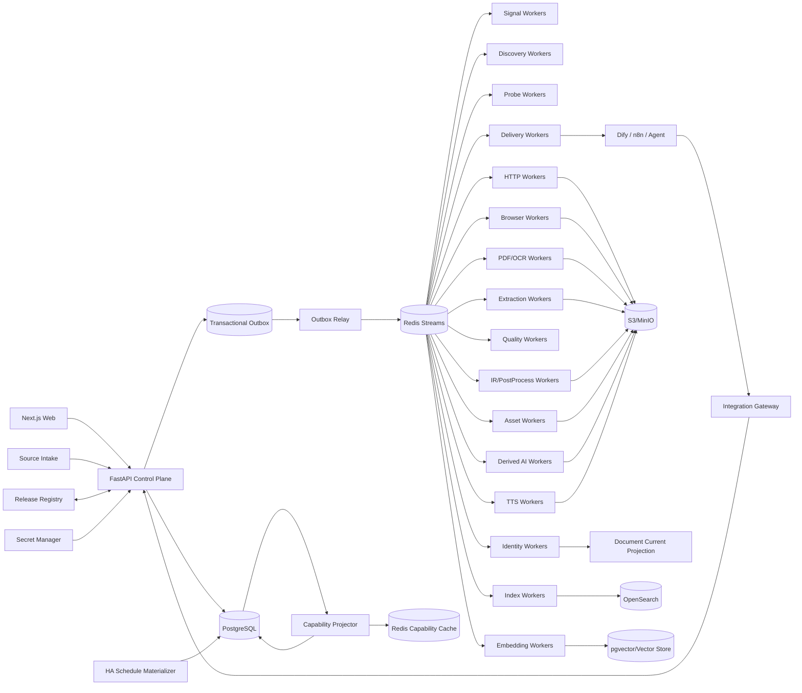

# 博客知识库技术方案

适用范围：从约 1000 个技术博客、工程博客、技术文档站、Newsletter、CMS 与公开文档站抓取尽可能完整的历史文章，清洗为稳定 Markdown 建设长期知识库；后续可持续增加网站，并支持全量回灌、增量同步、Web 管理、版本留存、离线重处理、全文/向量检索、质量审计、图片附件归档、AI 派生能力，以及 Dify/n8n/Agent/TTS/Newsletter 等外部工作流消费。整体按百万级文档、数百万到千万级 URL、站点高度异构和多年持续运行设计。

## 1. 建设目标

1. 支持站点根地址、单 URL、批量 URL、RSS/Atom/JSON Feed、Sitemap/Sitemap Index、OPML、CSV、JSON、Markdown/TXT 等来源导入。
2. 自动探测 Sitemap、Feed、公开 API、Archive、Category/Tag/Author、Docs Navigation、普通内链、`llms.txt`/`llms-full.txt`、平台 API 等发现入口。
3. 支持 `FULL_BACKFILL`、`INCREMENTAL`、`RECONCILE`、`TARGETED_FETCH`、`PROBE`、`REPROCESS`、`ASSET_REPAIR`、`REINDEX`、`SEARCH_GAP_FAST`、`SEARCH_GAP_DEEP`、`DERIVED_BUILD`、`DELIVERY_RETRY`。
4. 历史完整性由 Provider 级 Coverage Evidence 证明，不能用“队列空了”“达到 max_depth/max_pages/max_urls”“搜索 Top-N 抓完”替代完整性证明。
5. HTTP-first；只有动态渲染、正文缺失、挑战页、选择器失效或抽取质量失败证据存在时才升级 Browser/Crawl4AI/Playwright。
6. 支持 Domain/Site Capability Learning，用真实运行的成功率、正文质量、延迟、成本和 blocker 统计优化抓取路由，但能力统计不得替代 Coverage Evidence。
7. Source/Profile/Discovery/Fetch/Extractor/PostProcessor/Quality/Asset/Chunker/Search/Reranker/Embedding/AI Recipe/AI Model/Dataset/Runtime/Route Policy/Delivery Recipe/Destination Adapter 全部使用不可变 Release。
8. 支持 Sitemap `lastmod`、Feed GUID/updated、API cursor、ETag、Last-Modified、body hash、Canonical IR hash、重叠窗口与周期 Reconcile 驱动增量。
9. 最终知识对象保存标题、作者、发布时间、更新时间、标签、canonical、正文块、代码块、表格、图片、附件、链接关系、Snapshot、字段 provenance 和完整 lineage。
10. 支持 durable frontier、断点续跑、幂等、lease、heartbeat、重试、限流、熔断、公平调度、backpressure、dead-letter。
11. 保存不可变网络 Snapshot、Rendered DOM、Extraction Candidate、Canonical IR、Markdown Projection、规则版本和质量结果；规则升级优先离线 replay。
12. 图片和附件走独立 Asset Pipeline，支持安全校验、hash 去重、对象存储、引用关系、独立重试和 Markdown URL 重写。
13. Web 管理端覆盖 Source Intake、Site Profile Studio、Provider Coverage、Capability & Route、Run/Task、Targeted Fetch、Extraction Preview、Snapshot Replay、Version Diff、Quality Review、Drift、Assets、Search/RAG、AI Artifact、Workflow/Delivery、成本和审计。
14. Markdown、全文索引、Embedding、摘要、标签、Topic、FAQ、Digest、Newsletter、TTS 和报告都是 Accepted Document Version 的异步 Projection/Derived Artifact，失败不能阻塞 Source Sync。
15. append-only 历史真相层之上提供可重建 Current Projection。
16. Canonical IR hash 在 Chunk/Embedding/AI 等昂贵下游之前计算；正文未变化只写 Freshness Observation。
17. 技术博客检索同时支持自然语言、代码符号、配置项、错误码、版本号、命令、文件路径和字段过滤，不能只依赖纯向量搜索。
18. Change-Signal Plane 优先用 Feed/Sitemap/API 元数据判断是否可能变化，再决定是否抓正文。
19. 跨文档近似重复只形成 Similarity Evidence / Duplicate Cluster，不自动删除来源文档。
20. 文档内部重复块形成 Repetition Evidence；任何有损抑制必须可解释、可回滚并有高删除率 Guardrail。
21. 所有 Stage 输入输出具有显式 Artifact Representation Contract，摘要不得以模糊的 `content` 字段冒充原文。
22. Platform Adapter、Site Profile、Crawler Engine、Route Policy、Search/Reranker、AI Model/Recipe、Dataset、Runtime、Workflow/Delivery Adapter 发布前必须通过 Contract Test、Golden Corpus、Capability Test 与 shadow replay。
23. 正文清洗必须结构保真；禁止在 Canonical IR 前使用全局 `split/join` 或 `\s+` 折叠空白。
24. Canonical Markdown 必须完整、确定性、按 Document Version 独立产出，禁止把抓取时间戳拼进正文制造无意义 diff。
25. Scheduler 只物化持久 Run/Task；异步 Worker 才执行网络、浏览器、CPU/GPU、外部 AI 或 TTS 调用。
26. 所有 Run/Task 保存 Resolved Effective Config、Resolved Scope、Route Decision 与 Runtime Strategy Attestation。
27. 运行结果使用阶段级语义计数，区分 new version、unchanged、existing identity、unexpected empty、rejected、blocked、deadline exceeded、failed。
28. 抓取链路采用分层 Deadline 与 Cancellation Propagation。
29. 外部/自托管搜索只作为 Gap Discovery 和诊断证据，不能成为历史完整性真相源。
30. 同一 URL 的 Discovery、Link Extraction 和多 Extraction Strategy 尽可能共享同一 Fetch Snapshot/DOM，禁止为了比较策略或找链接重复访问源站。
31. Web 的“自定义 URL 抓取”必须走标准 `TARGETED_FETCH`，不允许绕过 Admission、Snapshot、Quality、Identity 和审计主链路。
32. AI 摘要不能替代原文；任何 AI 结果必须以 Derived Artifact 保存并可独立重建。
33. AI Model 的“声明上下文长度”不等于“有效输入长度”；实际 tokenizer、truncation、attention、quantization、device 与 generation config 必须写入 Runtime Attestation。
34. 自训练/微调模型必须绑定 Dataset Release、预处理代码、随机 seed、split manifest、镜像 digest、模型 hash 和离线评估结果，确保可重复。
35. 所有生产依赖使用 lockfile/container image digest/SBOM 固化，禁止把未锁版本的临时开发环境当生产 Release。
36. Discovery 优先从 DOM/Feed/Sitemap/API 产生 URL Candidate 与 Evidence，禁止依赖“DOM → Markdown → 正则”作为生产 URL 发现主链路。
37. AI 长文处理采用 block-aware Chunk Plan + Map/Reduce Artifact；每个 Map/Reduce 结果可独立重试、缓存和追溯到 Canonical Block。
38. Web/API 请求线程不得同步等待浏览器、本地模型、OCR、外部 LLM 或 TTS；所有长任务必须进入持久任务系统。
39. Redis/Valkey、搜索索引、向量库和任何缓存都不是不可变内容真相源；缓存故障必须 fail-soft，不能拖垮主链路。
40. Fast Path 只是一种 Representation Provider；其结果必须携带来源、时间、映射、freshness 和质量证据，通过统一 Quality/Identity 流程后才能成为 Accepted Version。
41. Metadata、Link Discovery、JSON-LD/OpenGraph 等 side-channel 优先复用正文抓取产生的同一 Snapshot/Rendered DOM；独立 `METADATA_PROBE` 仅在确有必要时触发，并必须限频、预算化、缓存和审计。
42. 所有网络与 IPC 边界，包括内部 Firecrawl/Crawl4AI/SearXNG/Reranker/Embedding/LLM/TTS/Workflow 服务，都必须有 request/response 字节上限、connect/read/total deadline、取消传播和明确的超限错误分类。
43. 所有进程内长生命周期 Registry/Pool，包括 Browser Context、HTTP Session、Model Runtime Handle 和临时下载对象，都必须具备 hard cap、idle eviction、in-flight protection 和最终释放机制。
44. Dify/n8n/Agent 等外部消费者只能消费 Accepted Version、Projection 或提交异步 Derived Job，不允许以一次同步 HTTP 请求临时触发“发现 URL → 抓正文 → LLM → TTS”整条链路。
45. Digest/Newsletter/TTS 的幂等键必须绑定输入 Document Version 集合、Recipe Release、Model/Runtime Release；相同输入可以复用已生成 Artifact。
46. TTS 默认消费摘要/Digest，而不是把多篇完整原文无界拼接后直接转语音；必须有字符/token/音频时长/成本预算。
47. 外部工作流调用不得写死 `127.0.0.1` 等单机假设；Endpoint、认证、Secret、服务发现、超时、重试和回调策略必须配置化、版本化并可审计。

## 2. 非目标与边界

1. 不绕过登录、付费墙、验证码、WAF 或明确访问控制。
2. 不承诺未知站点仅靠自动探测达到 100% 历史完整；必须展示 coverage confidence、known gap 与 blocker。
3. 不用 LLM、Reranker、搜索排名或抓取成功率决定 FULL_BACKFILL 中合法历史文章是否应该存在。
4. Markdown 不是唯一真相；Canonical IR 是内部内容真相，Markdown 是确定性投影。
5. 不锁死单一爬虫库、浏览器库、向量库、搜索引擎、重排模型、工作流引擎或消息队列。
6. Source Intake 文件/粘贴文本只是输入证据，不直接成为生产配置真相源。
7. AI、Embedding、Newsletter、TTS 等派生模块不能反向决定抓取主链路是否成功。
8. 不允许用 HTTP 200、Browser success、协程正常返回或无异常直接等价业务成功。
9. 不把第三方库 README、模型名称、默认参数或注释当作运行事实；运行事实来自 Runtime Attestation。
10. 不把全局 reload/scroll/wait 脚本作为所有站点默认策略；浏览器动作必须进入 Site/Profile 级可测试 recipe。
11. 不把 Query-time Context、Rerank Top-K 或 LLM 摘要反向保存为 Canonical Document。
12. Search Gap Deep 的 Top-N、Rerank Top-K 和搜索页数只是成本预算，不是 Coverage 证据。
13. 不把 reference-based ROUGE/BERTScore 当成生产摘要事实正确性的充分证明。
14. 不在 Web 请求线程直接执行长时间抓取、浏览器、本地大模型、OCR 或 TTS 推理。
15. 不用模型名称推断实际可消费上下文长度；必须以本次运行真实 token、截断和 attention 配置为准。
16. 不把某个域名“过去成功率低”永久固化为禁用路由；任何学习型跳过都必须可衰减、可探索、可人工覆盖。
17. 不把 Domain Capability 当作 Site Coverage；前者回答“怎么抓更合适”，后者回答“历史文章是否发现完整”。
18. 不允许因为 metadata side-channel 与正文抓取并行，就把它视作“零成本”；额外网络访问必须显式计入流量、限流、成本、一致性和站点礼貌预算。
19. 不允许 Dify/n8n/Agent 直接修改 Canonical IR、Document Identity、Coverage Evidence 或 Route Capability Projection。
20. 不允许把多个 Document Version 的全文拼成一个无结构大字符串，作为跨服务长期 Contract 或默认 AI/TTS 输入。

## 3. 核心原则

1. **PostgreSQL 是业务状态真相源；S3/MinIO 是不可变大对象真相源。**
2. Redis Streams 只做任务运输；决定性状态先写 PostgreSQL，再由 Transactional Outbox 投递。
3. Source Intake、Change Signal、Discovery、Admission、Route Decision、Fetch、Extraction、PostProcess、Quality、Identity、Publish、Asset、Search、AI、Delivery 分层。
4. Discovery 只产生 URL Candidate 与 Evidence；Feed 摘要、搜索结果、列表页不能直接成为最终正文。
5. URL Identity 与 Document Identity 分离；Identity 与 Freshness 分离。
6. Discovery Fetch Route 与 Article Fetch Route 分离；能力统计也必须按 operation type 分开。
7. HTTP、Browser、PDF/OCR、Platform API、Fast Path 分层；生产复用长期 HTTP client、Browser Runtime、Search client、Rerank client 和 Model Runtime。
8. Crawl4AI/Playwright/Trafilatura/SearXNG/LLM/TTS/Workflow 等第三方能力通过 Adapter 隔离，原始返回 shape 和 quirks 不泄漏到业务真相层。
9. 所有 Stage 使用固定 Typed Outcome Contract。
10. `document_version` append-only；Current/Markdown/Search/Embedding/AI/Delivery Projection 可重建。
11. `max_depth/max_pages/max_runtime/max_urls/max_results/top_k` 是预算，不是 Coverage Evidence。
12. 进程内 semaphore/`asyncio.gather` 只做 Worker 本地资源保护，不承担持久调度。
13. Config 使用不可变 Release；Secret 仅保存 Secret Manager 引用。
14. 内容结构本身是数据；代码缩进、表格、列表层级和换行不能在通用 cleaner 中被压平。
15. 有损清洗必须可逆或可解释，Canonical IR 不因启发式去重丢掉不可恢复信息。
16. 原始证据与面向 UI/Agent 的紧凑输出分层：先保存完整事实，再做 Projection。
17. 多个 Extractor/Strategy、Link Discovery 优先消费同一 Snapshot；网络访问与内容解释解耦。
18. Site Profile 的编辑、测试、发布、回滚全部可审计。
19. 人工 Targeted Fetch 与批量同步共用同一标准流水线。
20. 摘要、标签、分类、问答、Digest、TTS 等能力只是 Document Version 的派生视图。
21. Capability Observation 是 append-only 运行事实；Route Capability Projection 可重建、可过期、可重算。
22. Route Decision 必须可解释、可复现，不允许黑盒模型无证据永久改变抓取行为。
23. Blocking SDK 不能直接运行在 async Web/Event Loop 上；必须使用异步客户端或隔离 Worker/线程池。
24. 所有跨进程/跨网络调用先定义资源预算，再定义成功路径；没有字节上限、deadline、取消和容量上限的集成不能进入生产主链路。
25. 可选依赖应 fail-soft，关键真相源应 fail-closed；健康状态必须区分 liveness、readiness 与 dependency degraded。
26. **抓取真相与消费编排解耦。** Dify/n8n/Agent 负责“如何消费”，Source Sync 负责“哪些版本是真实且可追溯的”。
27. **长任务统一 Job 语义。** Web、Dify、Webhook 或人工触发只创建 Run/Task/Derived Job，不同步等待整个长链路。
28. **派生结果按输入版本集合可复用。** 摘要、Digest、TTS、Newsletter 均由不可变输入和 Release 决定，不因重复请求无条件重算。

## 4. 推荐技术栈

### 4.1 控制面

- Web：Next.js + TypeScript。
- API：FastAPI + Pydantic。
- PostgreSQL：Source、Profile、Provider、Run、Task、Document、Version、Coverage、Capability、RouteDecision、DerivedArtifact、DeliveryJob、Audit 等业务状态。
- Redis Streams：任务运输与 Consumer Group。
- Transactional Outbox：保证数据库状态与消息投递一致。
- Redis/Valkey：缓存 robots、Route Capability Projection、短期 probe、UI 热数据；不保存唯一真相。
- Secret Manager：Vault、云 Secret Manager 或 Kubernetes Secret 引用，不把 secret 明文写入配置。
- Integration Gateway：面向 Dify/n8n/Agent/Webhook 提供稳定的 Job/Artifact API，不暴露底层 crawler 私有接口。

### 4.2 数据面

- HTTP：`httpx.AsyncClient` 长期连接池；必要时自定义安全 DNS/egress 组件。
- HTML 解析：selectolax/lxml/BeautifulSoup 作为低层解析器。
- 主体抽取：Trafilatura/Readability/Crawl4AI/CSS/XPath/JSON-LD/OpenGraph 的组合 Adapter。
- Browser：Playwright/Crawl4AI Browser Runtime Pool。
- PDF：PyMuPDF/pypdf + OCR fallback。
- 对象存储：S3/MinIO。
- 全文检索：OpenSearch。
- 向量：pgvector 起步；规模扩大后可切换专用 Vector Store。
- AI：远程 LLM Client Pool + 自托管 Model Runtime Pool，统一走 AI Adapter。
- TTS：独立 TTS Adapter/Worker Pool；音频写对象存储。
- 可观测：OpenTelemetry + Prometheus/Grafana + 日志聚合。

## 5. 总体架构



### 5.1 Control Plane

只负责 Source、Provider、Profile、Release、Schedule、Run、Command、Derived Job、Delivery Job、RBAC、Audit、搜索和状态查询，不直接执行长期 I/O/GPU 任务。

### 5.2 Change-Signal / Discovery Plane

低成本轮询 Feed/Sitemap/API，维护 Provider checkpoint，生成 URL Candidate 与 Coverage Evidence；Search Gap、BFS、通用 crawl 只做缺口诊断和补充发现。

### 5.3 Capability / Route Plane

把每次路由实际结果写成 `Capability Observation`，异步聚合 `Route Capability Projection`；任务执行前由版本化 Route Policy 结合 Site Profile、人工 Override、Projection 和本次约束生成 `Route Decision`。

### 5.4 Data Plane

HTTP、Browser、PDF/OCR、Extraction、PostProcess、Quality、Identity 分成独立 Worker Pool，通过 Typed Artifact/Outcome 串联。

### 5.5 Projection Plane

Accepted Document Version 触发 Markdown、Current、Chunk、Embedding、Search、AI Artifact、TTS、Delivery。Projection 失败不会回滚已接受的 Canonical Document Version。

### 5.6 Workflow / Delivery Plane

Dify/n8n/Agent 只通过 Integration Gateway：

- 查询 Search/Document/Artifact；
- 创建 `DERIVED_BUILD`；
- 查询 Job 状态；
- 获取已完成的 Artifact；
- 接收签名 webhook。

禁止外部工作流在一个同步请求中临时执行 Discovery + Fetch + LLM + TTS 全链路。

## 6. Release Registry 与可重复运行

所有可改变行为的东西都必须版本化：

```text
site_profile_release
discovery_provider_release
fetch_engine_release
representation_provider_release
route_policy_release
extractor_release
postprocess_release
quality_policy_release
asset_policy_release
chunker_release
search_provider_release
reranker_release
embedding_release
ai_model_release
ai_recipe_release
tts_model_release
tts_recipe_release
delivery_recipe_release
destination_adapter_release
workflow_adapter_release
dataset_release
training_recipe_release
runtime_release
```

每个 Release 至少记录：

- semantic version/release id；
- source code commit；
- config hash；
- dependency lock hash；
- container image digest；
- SBOM reference；
- author/created_at；
- Contract/Capability/Golden/shadow test 结果；
- predecessor/rollback target。

`runtime_release` 额外记录 Python/OS、Browser/Playwright/Crawl4AI 版本、parser/Trafilatura 版本、AI/TTS tokenizer/model hash、device/dtype/quantization、configured context 与实测有效 context、generation config、external API model/version 标识。

## 7. Source Registry 与 Site Profile

### 7.1 Source

```text
source
- id
- name
- root_url
- canonical_host
- source_type
- enabled
- sync_policy_id
- active_profile_release_id
- compliance_policy_id
- created_at
- updated_at
```

### 7.2 Site Profile Release

Site Profile 是声明式配置，不保存运行学习结果。至少包括：

- allowed/denied host/path；
- article URL pattern；
- Feed/Sitemap/API/Archive provider；
- canonical 规则；
- metadata selectors；
- include/remove selectors；
- Browser action recipe；
- content-type policy；
- asset policy；
- rate limit/politeness；
- Golden URL 集；
- fast-path/representation provider allow policy；
- route hard constraints；
- side-channel probe policy 与预算。

站点专用 CSS 规则，例如 `h1`、正文容器、日期 selector，必须放进 Profile/Extractor Release；避免把 `nth-child` 等脆弱规则散落在业务代码中。

Site Profile Studio 支持草稿、测试、shadow、发布和回滚。

## 8. Discovery 与历史完整性

### 8.1 Provider 优先级

默认按“可枚举性和权威性”优先：

1. 官方 API/Export；
2. Sitemap/Sitemap Index；
3. RSS/Atom/JSON Feed；
4. Archive/年月分页/Category/Tag/Author；
5. Docs Navigation/目录页；
6. DOM 内链/BFS；
7. 外部/自托管 Search Gap。

不同 Provider 可并行，结果进入统一 URL Candidate，不直接写 Document。

### 8.2 Discovery Evidence

```text
discovery_evidence
- source_id
- provider_id
- provider_release_id
- discovered_url
- discovered_at
- provider_cursor
- provider_item_id
- lastmod/updated
- referrer_url
- depth
- evidence_snapshot_id
```

同一 URL 来自多个 Provider 时 Evidence 全保留；统一 normalize/canonical candidate 并做确定性去重。

### 8.3 Coverage Evidence

每个 Provider 维护：

- enumeration boundary；
- oldest/newest observed time；
- pages/items enumerated；
- cursor exhausted；
- pagination continuity；
- expected vs discovered count；
- known gaps；
- blocker；
- confidence。

`max_pages`、`max_depth`、任务结束、路由成功率都不能作为 coverage complete。

### 8.4 Reconcile

周期性重新枚举高价值 Provider，将新的 Provider manifest 与历史 manifest 做集合差异，发现漏抓、删除、URL 迁移和旧文章更新。

## 9. Change-Signal 与增量同步

Change-Signal Plane 尽量在低成本阶段判断变化：

- Feed GUID/updated；
- Sitemap lastmod；
- API update cursor；
- HTTP ETag/Last-Modified；
- HEAD/conditional GET；
- body hash；
- Canonical IR hash。

增量同步采用重叠窗口，例如 Feed/API 每次回看最近 N 小时/天，抵抗乱序、迟到更新和时间戳不可靠。

```text
Provider signal unchanged
  -> 可以跳过正文 fetch

Provider signal changed/unknown
  -> conditional fetch

Network representation unchanged
  -> Freshness Observation

Canonical IR unchanged
  -> Freshness Observation，不创建新 Document Version

Canonical IR changed
  -> 创建新 Version，异步刷新 Projection
```

`bypass_cache=true` 之类参数只能表示某个抓取器的缓存行为，不能替代业务层 freshness 判定。

## 10. Domain/Site Capability Learning

### 10.1 目的

能力学习只回答：

- 该站点哪条抓取 route 更可靠；
- 是否经常需要 JS 渲染；
- 是否存在稳定的 Feed Full Content、平台 API、`llms-full.txt` 等 fast path；
- 哪类失败是临时网络错误、WAF、正文为空、Selector drift；
- 预期延迟/成本是多少。

它不回答“历史文章是否已经发现完整”。

### 10.2 Capability Observation

```text
site_capability_observation
- id
- site_id
- host_key
- path_scope
- operation_type           # DISCOVERY_FETCH / ARTICLE_FETCH / METADATA_PROBE / ASSET_FETCH
- route_id
- route_release_id
- attempt_at
- transport_outcome
- content_outcome
- quality_score
- latency_ms
- bytes
- cost_units
- http_status
- blocker_type
- error_class
- render_required
- snapshot_id
- trace_id
```

`transport_outcome=success` 不代表 `content_outcome=accepted`。例如 200 挑战页、空正文、只返回导航都属于正文失败。`METADATA_PROBE` 与 `ARTICLE_FETCH` 分开统计。

### 10.3 Route Capability Projection

```text
site_route_capability_projection
- site_id
- path_scope
- operation_type
- route_id
- sample_count
- confidence
- ewma_success
- ewma_quality
- p50_latency
- p95_latency
- cost_estimate
- last_success_at
- last_failure_at
- last_error_class
- cooldown_until
- next_probe_at
- projection_version
- updated_at
```

PostgreSQL 保存 Projection 真相，Redis/Valkey 只缓存热数据；缓存不可用时从 PG 读或回退保守路由，不阻塞抓取。

### 10.4 学习算法约束

- 冷启动样本不足时保留完整合法候选，不过早跳过 route；
- 使用时间衰减/EWMA 或 Bayesian 置信区间，旧失败会逐步失效；
- route 排名同时看 acceptance、quality、latency、cost，而不是只看 HTTP success；
- 失败可进入 cooldown，但必须设置 `next_probe_at`；
- 被降权 route 保留最小 exploration/canary 比例，以发现站点恢复；
- host/path/operation 分层，不用整个域名一个结论覆盖所有页面；
- 学习结果必须可解释，不使用无法复盘的黑盒策略直接控制生产抓取。

## 11. Route Decision 与自适应 Fetch Routing

### 11.1 Route 类型

```text
PLATFORM_API
FEED_FULL_CONTENT
LLMS_FULL_TEXT
HTTP_STRUCTURED
HTTP_STATIC
CRAWL4AI
PLAYWRIGHT_PROFILE
PDF_NATIVE
PDF_OCR
ARCHIVE_FETCH
```

### 11.2 决策顺序

```text
1. Hard Gate
   scheme -> source scope -> robots/compliance -> SSRF/egress -> content-type

2. Representation Fast Path Candidate
   平台 API / Full Feed / llms-full / 静态 artifact

3. Build Generic Route Candidates
   HTTP -> Crawl4AI -> Playwright -> PDF/OCR 等

4. Apply immutable Site Profile constraints

5. Apply operator override

6. Read Capability Projection

7. Rank by expected utility

8. Exploration / cooldown / probe policy

9. Persist Route Decision

10. Execute selected route

11. Quality Gate

12. Classified failure -> escalation to next legal route
```

```text
score(route)
= expected_content_quality
- λ * expected_latency
- μ * expected_cost
- ν * failure_risk
+ exploration_bonus
```

### 11.3 Route Decision Artifact

```text
route_decision
- id
- task_id
- candidate_routes_json
- selected_route
- skipped_routes_json
- reasons_json
- route_policy_release_id
- capability_projection_version
- site_profile_release_id
- operator_override_id
- decided_at
```

任务重试默认复用原 Decision，除非明确指定 `REPLAN_ROUTE`，防止同一 Task 因实时统计漂移而行为不可复现。

### 11.4 Operator Override

人工覆盖至少保存：scope、force/prefer/skip route、reason、author、created_at、expires_at、ticket/reference。Override 默认必须有 TTL。

## 12. Representation Fast Path

Fast Path 是低成本或高保真的替代表示来源，不是绕过流水线的捷径。

### 12.1 可支持类型

- GitHub/GitLab raw/API；
- WordPress/Ghost/Dev.to 等平台公开 API；
- RSS/Atom full content；
- `llms-full.txt`；
- 静态 Markdown/raw 文档；
- PDF 原始文件；
- 合规的官方导出接口。

### 12.2 统一 Contract

```text
representation_candidate
- provider_id
- provider_release_id
- source_url
- representation_url
- fetched_at
- content_type
- bytes/hash
- freshness_signal
- url_mapping_evidence
- provenance
- raw_snapshot_id
```

只有当 URL 映射可信、freshness 合格、正文通过 Quality Gate 时才能进入 Accepted Candidate；否则只作为辅助 Evidence。

## 13. 网络安全、SSRF 与合规

### 13.1 应用层 URL Admission

- 只允许 `http/https`；
- 标准化 host/port/path；
- 拒绝 localhost、私网、link-local、multicast、reserved、云 metadata 地址；
- 拒绝用户信息段和异常 scheme；
- 限制 redirect 次数；
- 每个 redirect 重新做 URL 与 DNS 校验；
- 限制响应字节、压缩后大小、解压膨胀比、Content-Type；
- connect/read/total deadline 分层。

### 13.2 Connect-time DNS Guard

直接 HTTP Client 应在真正建立 socket 的 DNS lookup/connection 阶段校验目标 IP，降低 DNS rebinding 与“先解析再请求”的 TOCTOU 风险。

### 13.3 外部 Browser/Fetcher 网络隔离

Crawl4AI/Playwright/Firecrawl 等独立 Worker 可能自行重新解析域名，因此应用层预解析不足以构成完整 SSRF 防线。必须使用独立命名空间/子网、默认拒绝内网与 metadata、egress proxy/防火墙、NetworkPolicy、DNS policy、Secret 最小暴露、下载目录隔离和大小配额。

### 13.4 robots 与访问边界

robots、站点条款和内部合规策略是独立 Gate。被禁止的 URL 记录 `BLOCKED_POLICY`，不是普通网络失败，不参与 route success 的负向统计。

### 13.5 统一网络/IPC 资源预算

Firecrawl/Crawl4AI/SearXNG/Reranker/Embedding/LLM/TTS/Workflow、Provider API、对象存储代理等内部或受控服务同样必须限制：

- request body 最大字节；
- response body 最大字节；
- connect/read/total deadline；
- redirect/重试次数；
- Content-Type 与解压膨胀比；
- cancellation propagation；
- `RESPONSE_TOO_LARGE`、`DEADLINE_EXCEEDED` 等结构化错误。

### 13.6 日志与凭证脱敏

日志不得直接输出 Authorization、Cookie、带 userinfo 的 URL、代理密码、Secret、对象存储签名 URL、Webhook Secret 等敏感值。

## 14. Durable Run/Task 与调度

### 14.1 Run

```text
run
- id
- source_id
- run_type
- status
- resolved_scope
- resolved_effective_config
- release_set
- started_at/finished_at
- counters_json
- deadline_at
```

### 14.2 Task

```text
task
- id
- run_id
- stage
- subject_key
- status
- attempt
- lease_owner
- lease_until
- heartbeat_at
- next_retry_at
- parent_task_id
- input_artifact_ref
- output_artifact_ref
- route_decision_id
- error_class
```

### 14.3 幂等与 lease

- Task 有稳定 idempotency key；
- Worker 领取 lease，定时 heartbeat；
- lease 过期可被重新领取；
- side effect 必须以唯一键/事务保证幂等；
- 失败按 error class 决定重试/升级 route/dead-letter；
- deadline 到期触发 cancellation propagation。

### 14.4 Fairness

全局、站点、host 三层 token bucket/并发上限；调度按 source priority、next_due、backlog age、host politeness 做加权公平。

### 14.5 Worker 内并发

单 Worker 可用 `asyncio`/有界 semaphore 提升吞吐，但不能像 Demo 一样在 Web 请求中对 N 篇文章串行 `for await`，也不能无限 `gather`。Browser/HTTP Runtime 应跨 Task 复用，而不是每篇文章创建一个全新的 crawler 生命周期。

## 15. Snapshot 与 Artifact Contract

### 15.1 Fetch Snapshot

```text
fetch_snapshot
- id
- request_url
- final_url
- route_id/release_id
- requested_at/received_at
- status
- response_headers
- content_type
- body_object_key
- body_hash
- rendered_dom_object_key
- screenshot_object_key(optional)
- resolved_ip_attestation(optional)
- runtime_attestation
```

### 15.2 Snapshot 共享

同一 Snapshot 可同时供 Link Discovery、JSON-LD/OpenGraph、Trafilatura、Readability、CSS/XPath、Crawl4AI Candidate、Quality 检测。禁止为了“找链接”“比较 Extractor”“重新投影 Markdown”重复访问源站。

### 15.3 Metadata Side-channel Policy

Metadata 抽取默认消费正文 Fetch Snapshot 或 Rendered DOM。只有缺失字段确有价值时，才生成独立 `METADATA_PROBE` Task，并设置采样率、QPS、每日请求/字节预算、ETag/Last-Modified/缓存、独立 Capability Observation 和 provenance。

### 15.4 Artifact Representation Contract

```text
NETWORK_BYTES
RAW_HTML
RENDERED_DOM
EXTRACTION_CANDIDATE
CANONICAL_IR
MARKDOWN_PROJECTION
CHUNK_SET
AI_INPUT_PROJECTION
AI_DERIVED_ARTIFACT
AUDIO_DERIVED_ARTIFACT
DELIVERY_PAYLOAD
```

不得用一个含义不明的 `content/newsdetail/text` 字段在不同阶段复用。大型正文跨服务优先传 Artifact ID/Object Key，而不是重复复制整块 JSON。

## 16. Extraction 与 Canonical IR

### 16.1 Candidate Competition

一个 Snapshot 可以生成多个 Candidate：Trafilatura、Readability、Crawl4AI、CSS/XPath、JSON-LD Article、平台 API 等。每个 Candidate 保存 extractor release、输入 snapshot、字段 provenance 和结构统计。

### 16.2 Canonical IR

```text
DocumentIR
- title
- authors[]
- published_at
- updated_at
- canonical_url
- tags[]
- language
- blocks[]

Block
- block_id
- type: heading|paragraph|list|code|table|quote|image|math|html
- level/language/attributes
- text/raw
- source_locator
```

IR 保留代码缩进、表格、列表层级、引用、图片、公式与 source locator。

### 16.3 正文清洗

- DOM 级移除 nav/footer/sidebar/广告，而不是 Markdown 全局字符串正则；
- 规则按 Site/Profile Release 版本化；
- 通用 cleaner 禁止全局压空白破坏代码；
- 去重在 block 层形成 Evidence；
- 高比例删除触发 Guardrail 和人工复核。

### 16.4 CSS/XPath Schema 治理

站点结构化抽取必须支持多策略 fallback，并监控 `selector_miss`。脆弱的 `nth-child` 规则只可作为某一 Site Profile Release 的显式策略，必须由 Golden URL + Snapshot Replay 验证，不能硬编码进长期服务。

## 17. Quality Gate 与 Drift

### 17.1 质量指标

- title 有效性；
- 正文字符/词数；
- heading/paragraph/code/table 结构；
- text-to-DOM ratio；
- boilerplate ratio；
- 重复块比例；
- challenge/consent/login 文本特征；
- published_at/author provenance；
- URL/category consistency；
- 与历史版本的异常变化；
- Golden URL 特征偏移。

### 17.2 Outcome

```text
ACCEPTED
REJECTED_EXPECTED
REJECTED_QUALITY
UNEXPECTED_EMPTY
BLOCKED_POLICY
BLOCKED_ROBOTS
NEEDS_BROWSER
NEEDS_PROFILE_REVIEW
```

`UNEXPECTED_EMPTY` 绝不能静默写成新空版本覆盖正常旧版本。

### 17.3 Drift

按站点监控 selector miss、正文长度分位数、Browser 升级率、quality reject、metadata 缺失率。异常达到阈值时冻结自动发布新 Profile，生成 Drift Review。

## 18. Identity、版本与去重

### 18.1 URL Identity

URL normalize 只做安全确定性规则：scheme/host case、默认端口、fragment、已知 tracking params 等。原始 URL 与所有发现 Evidence 保留。

### 18.2 Document Identity

优先级可组合：canonical、平台稳定 ID、Feed GUID、结构化数据 ID、可信 URL mapping、人工 merge。Document Identity 与 URL Identity 分开。

### 18.3 Version

`document_version` append-only，至少保存：document_id、accepted_at、canonical_ir_object_key/hash、source_snapshot_id、extractor/postprocess/quality release、metadata provenance、predecessor_version_id。

Canonical IR hash 未变时不创建版本，只写 Freshness Observation。

### 18.4 Near Duplicate

SimHash/MinHash/embedding 相似度只形成 `duplicate_cluster`/`similarity_evidence`。不同站点转载文章仍保留各自 provenance，不自动删除。

## 19. Markdown Projection

Markdown 是 Canonical IR 的确定性投影：

- front matter 与正文规则版本化；
- 标题、作者、时间、canonical 等 metadata 与正文分离；
- 代码 fence language 保留；
- 表格/列表层级稳定；
- 图片 URL 由 Asset Projection 重写；
- 不把抓取时间戳插入正文；
- 同一 Version + 同一 Projection Release 必须生成相同 hash。

```text
markdown/{source_id}/{document_id}/{version_id}.md
```

Current 路径只是可重建别名/投影，不覆盖历史文件。

## 20. Asset Pipeline

正文发现图片/附件后生成 Asset Reference，由独立 Worker：

1. URL Admission/SSRF；
2. 下载限速/大小限制；
3. MIME sniff；
4. hash；
5. 恶意文件/压缩炸弹策略；
6. S3/MinIO 去重存储；
7. 建立 version-asset relation；
8. Markdown URL 重写。

Asset 失败不阻塞原文 Version 接受，但必须显示缺失状态并可 `ASSET_REPAIR`。

## 21. Search 与 RAG

### 21.1 Hybrid Search

同时建立：

- OpenSearch BM25/字段索引；
- 代码 token、错误码、版本号、命令、路径的专门 analyzer；
- Embedding；
- metadata filter；
- 可选 reranker。

```text
query
-> lexical + vector recall
-> merge/RRF
-> metadata/security filter
-> rerank
-> context assembly
```

Rerank Top-K 是查询预算，不改变 Canonical Document。

### 21.2 Chunk

按 IR block、heading boundary、代码块完整性做 chunk，不使用纯字符截断。Chunk 保存 `document_version_id + block range + chunker_release_id`。

## 22. AI Derived Artifact

### 22.1 原则

AI 只消费 Accepted Version 的显式 Projection；任何摘要/标签/FAQ/报告都不写回 Canonical IR。

### 22.2 长文 Map/Reduce

```text
Document Version
-> AI Input Projection
-> Chunk Plan
-> Map Artifact x N
-> Reduce Artifact
-> Final Derived Artifact
```

每层可缓存、重试并保留 lineage。

### 22.3 多文档 Digest

禁止把 `news[]` 或多篇全文直接无界拼进一个 LLM 输入。推荐：

```text
Document Version x N
-> 单篇 Summary Artifact（可复用）
-> Selector/Ranker
-> Digest Reduce
-> Final Digest Artifact
```

单篇新增/更新只重算受影响 Artifact。

### 22.4 Runtime Attestation

记录 model release/weight hash、tokenizer release、AI recipe release、configured max context、actual input tokens、truncated tokens、attention policy、device/dtype/quantization、generation parameters、library/runtime release、latency/cost。

### 22.5 MLOps

Dataset Release 保存原始数据 hash、清洗规则、seed、sample/split manifest、预处理 commit 和输出 hash；Training Recipe 保存超参数；Model Artifact 保存权重/tokenizer/hash；Evaluation Artifact 保存离线结果。

## 23. Workflow、Derived Artifact 与 Delivery Plane

这一层用于把长期知识库安全地交给 Dify、n8n、Agent、Newsletter、TTS 或其他业务系统消费。

### 23.1 调用模型

不采用：

```text
Dify 请求
-> FastAPI 同步扫列表
-> 同步抓 N 篇文章
-> 同步 LLM
-> 同步 TTS
-> 返回
```

采用：

```text
长期 Source Sync
-> Accepted Version
-> Markdown/Search/Embedding
-> Derived Job
-> Summary/Digest/TTS Artifact
-> Delivery Job
-> Dify/n8n/Agent/Webhook 消费
```

### 23.2 Integration API

推荐接口语义：

```text
POST /v1/derived-jobs
  -> 202 + job_id

GET /v1/jobs/{job_id}
  -> status/progress/result_ref

GET /v1/artifacts/{artifact_id}
  -> metadata + signed object access/reference

POST /v1/search
  -> stable document/version refs

POST /v1/targeted-fetch
  -> 202 + run_id
```

Web/Dify 请求线程都不得直接等待 Browser、LLM 或 TTS 完整执行。

### 23.3 Derived Artifact

```text
derived_artifact
- id
- type                    # SUMMARY/DIGEST/FAQ/TTS/NEWSLETTER/REPORT
- input_version_ids
- input_version_set_hash
- input_projection_hash
- parent_artifact_ids
- recipe_release_id
- model_release_id
- runtime_attestation_id
- object_key
- content_hash
- status
- input_tokens/output_tokens
- cost_units
- latency_ms
- created_at
```

幂等键建议：

```text
hash(type + sorted(input_version_ids) + recipe_release + model_release + runtime_release)
```

相同输入直接复用已完成结果。

### 23.4 Delivery Job

```text
delivery_job
- id
- trigger_type
- scope_json
- input_artifact_id
- destination_adapter_release_id
- delivery_recipe_release_id
- idempotency_key
- status
- attempt
- next_retry_at
- response_fingerprint
- error_class
- created_at/finished_at
```

支持 webhook、RSS/Feed、对象存储链接、邮件/Newsletter、Dify/n8n callback 等 Adapter。

### 23.5 Webhook 可靠性

- HMAC 签名；
- timestamp + replay window；
- idempotency key；
- connect/read/total deadline；
- response byte limit；
- 指数退避 + jitter；
- 最大重试次数；
- dead-letter；
- delivery audit；
- Secret 只保存引用。

### 23.6 TTS Artifact

TTS 是高成本长任务：

```text
Digest/Summary Artifact
-> TTS Recipe
-> TTS Worker
-> Audio Object
-> Audio Derived Artifact
-> Delivery
```

默认不把多篇完整正文直接转语音；必须设置最大输入字符/token、最大音频时长、单任务 deadline、模型/音色 Release、并发/GPU 配额和成本预算。TTS 失败不影响 Source Sync、Markdown 或 Search。

### 23.7 Dify/n8n Adapter 约束

- Endpoint 配置化，禁止写死 `127.0.0.1`；
- 使用服务发现/API Gateway；
- Auth/mTLS/Token 由 Secret Manager 管理；
- 不把 blocking `requests` 放在 async Web 主链路；
- 外部工作流传入 URL 时必须走 `TARGETED_FETCH` Admission；
- 外部工作流只接收 stable Artifact/Version Ref，不接管 Document Identity 或 Coverage。

## 24. Web 管理端

### 24.1 Source Intake

支持单 URL、批量站点、OPML、CSV/JSON、粘贴文本导入；先进入 Intake/Probe，不直接写生产 Profile。

### 24.2 Site Profile Studio

提供 URL/Provider/Selector/metadata/remove rule、HTTP/Browser route hard constraint、Golden URL、同 Snapshot 多策略预览、Candidate/Canonical IR/Markdown diff、发布/回滚。

### 24.3 Provider Coverage

显示 Provider 清单、枚举边界、oldest/newest、cursor、expected/discovered、known gap、blocker 和 confidence，并能触发 Reconcile。

### 24.4 Capability & Route

展示 route 7/30/90 天 transport/content success、acceptance/quality、p50/p95 latency、cost、Browser escalation、最近 blocker、preferred route、cold-start/cooldown/exploration、Fast Path、Route Decision 时间线、Override TTL、METADATA_PROBE 额外请求/字节成本。

### 24.5 Run/Task

查看 stage backlog、lease、retry、dead-letter、route decision、resolved config、deadline、语义计数和 trace。

### 24.6 Extraction Preview / Replay

选择任意 Snapshot，在不重新联网的情况下运行多个 Extractor/PostProcess/Quality Release 并对比 Candidate/IR/Markdown。

### 24.7 Quality/Drift

按站点展示 unexpected empty、reject、selector miss、正文长度漂移、Browser 升级率和 Golden Regression。

### 24.8 Search/RAG/AI

支持检索调试、chunk 查看、rerank trace、AI lineage、token/cost/truncation 查看，不允许直接修改 Canonical Document。

### 24.9 Recipe Studio / Delivery

支持：

- 配置 Summary/Digest/TTS/Newsletter Recipe；
- 配置按 source/tag/time/query 的选文 Scope；
- 预览本次实际输入的 Document Version；
- 查看 token、截断、成本、预计音频时长；
- 对比 Recipe Release；
- 测试 Dify/n8n/Webhook Destination；
- 查看 Delivery Job 重试/dead-letter；
- 手工触发，但只创建持久 Job。

## 25. Observability、Audit 与 SLO

### 25.1 Trace

```text
Run -> Task -> RouteDecision -> Fetch -> Snapshot -> Extraction
    -> Quality -> Identity -> Version -> Projection
    -> DerivedArtifact -> DeliveryJob
```

### 25.2 Metrics

技术指标：queue lag、latency、timeout、retry、browser crash、DB/Redis/S3 error、response-too-large、cancellation、resource-pool utilization/eviction、in-flight count。

业务指标：discovered URL、admitted/rejected、new version/unchanged、unexpected empty、quality reject、coverage gap、sync lag、asset missing。

路由指标：route_selected、route_skipped、route_escalated、content acceptance、Browser ratio、exploration probe success、metadata side-channel request/bytes/hit、capability cache degraded。

派生/交付指标：

- derived_job_latency；
- summary/digest cache hit；
- input/output token；
- truncation rate；
- TTS audio duration / generation latency / cost；
- delivery success/retry/dead-letter；
- webhook p95；
- external workflow error class。

### 25.3 Audit

Profile/Release/Override/Manual Merge/Targeted Fetch/Replay/Quality override/Derived Build/Delivery Retry 都写审计日志，含 actor、before/after、reason、time。

### 25.4 Health Semantics

- `liveness`：进程/Event Loop/Worker 是否活着；
- `readiness`：当前是否能安全接收该类新任务；
- `dependency_degraded`：缓存、搜索、reranker、AI、TTS、Destination 等可降级依赖异常；
- `critical_dependency_unavailable`：PostgreSQL/S3 等当前任务所需真相源不可用。

## 26. Replay、测试与发布门禁

### 26.1 Contract Test

验证每个 Adapter 输入输出 schema、错误分类、timeout、取消传播、request/response 字节边界和 provenance。

### 26.2 Golden Corpus

覆盖静态博客、JS SPA、WordPress、Ghost、Substack、Docs、代码重页面、表格、图片、PDF、挑战页、多语言页面，以及 CSS selector 漂移案例。

### 26.3 Shadow Replay

新 Extractor/PostProcess/Quality/Route Policy 在历史 Snapshot/Observation 上离线运行，比较 accepted/rejected、block/metadata diff、Markdown hash、Browser route 比例、latency/cost、truncation、AI 质量。

### 26.4 Route Policy Offline Evaluation

计算 hypothetical first-hit acceptance、escalation 次数、Browser 请求减少量、p95 latency、cost、quality regression、exploration coverage。

### 26.5 Derived/Delivery Replay

新 AI/TTS/Delivery Recipe 使用历史 Document Version/Artifact 离线重放，比较：

- Artifact hash/结构；
- token/truncation；
- 摘要覆盖；
- TTS 输入长度/音频时长；
- webhook payload contract；
- destination retry/idempotency 行为。

### 26.6 Supply Chain Gate

CI 生成 lockfile 校验、镜像 digest、SBOM、依赖漏洞扫描。未锁关键依赖或模型/tokenizer 无 hash 时禁止标记生产 Release。

### 26.7 Resource Boundary Test

对所有网络 Adapter 和长生命周期 Pool 注入超大响应、慢响应、取消、连接悬挂、session/context 泄漏、长任务跨 idle-timeout 等故障，验证不会 OOM、deadline/cancellation 能释放连接和 lease、in-flight 不被误杀、hard cap 生效。

## 27. 缓存策略与故障降级

缓存只能优化性能：

- robots cache；
- Provider manifest cache；
- Route Capability Projection cache；
- 短期 Fetch dedupe cache；
- Search result cache；
- Derived Artifact lookup cache。

要求：

1. cache command/connect 有严格 timeout 与有限重试预算；
2. cache miss/error 退化到 PG/S3/实时执行，不无限等待；
3. 不把 Redis 中的 extracted text 当历史归档；
4. cache key 带必要 Release/representation/input-version 维度；
5. 清缓存不影响可重建性和业务正确性；
6. 缓存错误日志节流并脱敏；
7. 健康探针调用缓存时也必须使用同一短 timeout。

## 28. 失败分类与升级策略

```text
DNS_ERROR
CONNECT_TIMEOUT
READ_TIMEOUT
DEADLINE_EXCEEDED
RESPONSE_TOO_LARGE
HTTP_4XX
HTTP_5XX
RATE_LIMITED
ROBOTS_BLOCKED
POLICY_BLOCKED
SSRF_BLOCKED
WAF_CHALLENGE
JS_SHELL
EMPTY_CONTENT
SELECTOR_MISS
CONTENT_QUALITY_LOW
UNSUPPORTED_TYPE
BROWSER_CRASH
PARSER_ERROR
STORAGE_ERROR
MODEL_ERROR
MODEL_INPUT_TOO_LARGE
TTS_ERROR
DELIVERY_TIMEOUT
DELIVERY_REJECTED
DESTINATION_RATE_LIMITED
CANCELLED
```

只有适合升级的错误才进入下一 route。`JS_SHELL` 可从 HTTP 升 Browser；`ROBOTS_BLOCKED/POLICY_BLOCKED` 不升级；`RATE_LIMITED` 延迟重试而不是立刻用 Browser 猛打；Delivery/TTS 错误只影响派生/交付，不反向标记 Source Sync 失败。

## 29. 部署与横向扩展

### 29.1 起步部署

- API ×2；
- Integration Gateway ×2；
- Scheduler/Outbox Relay ×2（leader/lease）；
- Signal/Discovery Worker；
- Probe Worker；
- HTTP Worker 多实例；
- Browser Worker 少量独立节点；
- Extraction/Quality Worker；
- Asset Worker；
- Search/Embedding Worker；
- AI Worker；
- TTS Worker；
- Delivery Worker；
- Capability Projector；
- PostgreSQL；
- Redis；
- MinIO/S3；
- OpenSearch。

### 29.2 横向扩展

按队列 backlog 与资源类型独立扩容。Browser/GPU/TTS 不和普通 HTTP Worker 混部；1000 站点的瓶颈通常来自站点礼貌限速、Provider 枚举和页面复杂度，而不是单机协程数。

### 29.3 Browser Pool 与长生命周期资源治理

所有 Browser Context、HTTP Session、Model Runtime Handle 等都执行：`max_total/per-site hard cap`、idle timeout、周期 sweep、in-flight/busy pin、最大页面数/寿命/内存阈值、只回收非 busy 对象、finally 释放、pool 指标。

## 30. 容量与成本控制

容量规划至少看：

- URL frontier 数量；
- Snapshot bytes；
- Accepted Document/Version；
- Browser/GPU/TTS 工时；
- Search/Embedding index；
- Derived Artifact 与音频对象存储。

关键降本手段：

1. Change-Signal 先行；
2. HTTP-first；
3. Fast Path；
4. Capability-based route ranking；
5. Canonical IR hash 早去重；
6. Snapshot replay 避免重抓；
7. unchanged 不重复 Embedding/AI；
8. 单篇 Summary Artifact 复用于多次 Digest；
9. Digest/TTS 使用 input version set hash 幂等；
10. TTS 默认仅对摘要而非完整原文生成；
11. Browser/GPU/TTS 独立预算；
12. Metadata side-channel 独立请求/字节预算；
13. S3 lifecycle 热/冷分层，但不可破坏审计要求。

## 31. 分阶段实施

### Phase 1：可用主链路

- Source Registry；
- Sitemap/Feed/Archive Discovery；
- durable Run/Task；
- HTTP-first；
- Snapshot；
- Trafilatura/CSS Extractor；
- Canonical IR；
- Markdown；
- PostgreSQL + MinIO；
- 基础 Web Run/Document 页面；
- HTTP/内部 Adapter 统一 deadline 与响应字节边界。

### Phase 2：规模化与增量

- Provider Coverage；
- conditional fetch；
- Reconcile；
- Browser Runtime Pool；
- hard cap/idle eviction/in-flight protection；
- fairness/backpressure；
- Quality/Drift；
- Asset Pipeline；
- OpenSearch；
- Metadata Probe Policy。

### Phase 3：Capability 与自适应路由

- Capability Observation；
- Route Capability Projection；
- Route Decision Artifact；
- HTTP/Crawl4AI/Playwright route ranking；
- Fast Path Representation Provider；
- exploration/cooldown/probe；
- Capability & Route Web 页面；
- Route Policy shadow replay。

### Phase 4：知识库与 AI

- Chunk/Embedding；
- Hybrid Search/Reranker；
- AI Input Projection；
- block-aware Map/Reduce；
- AI Recipe/Model/Runtime Registry；
- Targeted Fetch；
- Replay/Diff；
- 成本面板。

### Phase 5：Workflow / Delivery

- Integration Gateway；
- Derived Artifact Registry；
- 多文档 Digest；
- Delivery Job；
- Dify/n8n/Webhook Adapter；
- TTS Worker 与 Audio Artifact；
- Recipe Studio；
- webhook 签名、重试、dead-letter；
- input version set 幂等与缓存。

### Phase 6：MLOps 与高级治理

- Dataset/Training Release；
- 自托管模型评估；
- Golden Corpus 扩充；
- shadow release；
- 复杂 Provider Adapter；
- 自动 Drift 修复建议；
- 多租户/RBAC 强化。

## 32. 验收标准

1. 新增一个普通技术博客不改核心代码，只需配置/Adapter 即可接入。
2. 1000 站点可独立限流、暂停、重跑和查看 Coverage。
3. Worker 重启后任务可继续，不因进程内状态丢失。
4. 同一 Snapshot 可重复使用新抽取规则生成新的 Candidate/IR/Markdown，而不重新访问源站。
5. Discovery Link Extraction 与正文 Extractor 能共享同一 Snapshot/DOM。
6. Incremental 对未变化正文不会重复创建 Document Version、Embedding 或摘要。
7. Markdown 保留技术文章的代码缩进、列表、表格和段落结构。
8. Selector 漂移或异常空正文能被明确识别，不会静默标记成功。
9. Targeted Fetch 与批量同步共享同一 Admission/Snapshot/Quality/Identity 主链路。
10. 每次正文抓取都能回答选了什么 route、跳过了什么 route、依据哪个 Route Policy/Profile/Capability Projection/Override。
11. 能从 Capability Observation 离线重建任意站点 Route Projection；Redis 清空不丢运行事实。
12. 对长期低成功 route 会降权，但 cooldown 到期或 exploration 可自动重新探测。
13. Fast Path 结果具有明确 provenance/freshness/mapping，不能绕过 Quality/Identity 直接入库。
14. Browser 使用率能通过能力学习下降，同时正文 acceptance/quality 不出现不可接受回归。
15. Capability 页面可显示 route 成功率、正文 acceptance、质量、延迟、成本、最近 blocker 和人工 override。
16. Coverage 页面与 Capability 页面语义分离；抓取 route 成功率不能被展示成历史完整率。
17. SSRF 防护同时包含 URL/DNS 应用层校验与 Browser/外部 Fetcher 网络层 egress 隔离。
18. AI 摘要失败不影响原文入库，且 Map/Reduce lineage 可回溯原文块。
19. 任意 AI Artifact 能回答使用了哪个 Document Version、AI Input、Chunk Plan、Model、Recipe、Runtime 和实际 token/truncation。
20. 任意自训练模型能回答其 Dataset Release、seed、split manifest、训练代码、镜像和模型 hash。
21. 任意生产结果可通过 Release、Snapshot、Route Decision 和 Runtime Attestation 重放或解释。
22. `博客知识库技术方案.md` 只维护当前最终方案，不记录调研历史或过程。
23. Metadata/Link/JSON-LD/OpenGraph 默认复用主 Snapshot；独立 `METADATA_PROBE` 可统计额外请求/字节。
24. 公网与内部 Adapter 面对超大/慢响应时都能以结构化语义失败并释放资源，不发生 OOM 或无限等待。
25. Browser/HTTP/Model 等长生命周期 Pool 在异常退出、长任务跨 idle timeout 和容量压测下仍保持 hard cap；in-flight 不被误回收。
26. 健康探针有 deadline，并能区分 liveness、readiness、可降级依赖与关键依赖故障。
27. Dify/n8n/Agent 创建长任务时 API 立即返回 job/run id，不同步等待 Browser/LLM/TTS。
28. 外部工作流不能通过自定义 URL 绕过 SSRF/robots/Quality/Identity/Audit。
29. 相同 Document Version 集合 + 相同 Recipe/Model/Runtime 重复请求 Digest/TTS 时可复用已有 Artifact。
30. 多文档 Digest 不依赖把完整原文一次性塞入 LLM；单篇摘要可独立重试和复用。
31. TTS 失败只影响 Audio Artifact/Delivery，不影响 Document Version、Markdown、Search、Embedding。
32. Delivery webhook 支持签名、幂等、deadline、有限重试和 dead-letter。
33. Web Recipe Studio 可以预览实际输入版本、token/截断、成本和音频预算，并能测试 Destination。
34. 外部消费者使用配置化 Endpoint/认证，不依赖写死的 localhost 或单机部署结构。

## 33. 推荐最终形态

最终系统不是“一台 Crawl4AI 把 1000 个站点爬下来”，也不是“Dify 每次需要内容时临时去抓网页”，而是一个长期可运营、可追溯、可被多种 AI 工作流消费的数据同步平台：

```text
Source Registry
  -> Coverage Providers
  -> Durable URL Frontier
  -> Change Signal
  -> Admission & Security
  -> Route Decision
  -> Fetch / Browser / Fast Path
  -> Immutable Snapshot
  -> Multi Extractor Candidates
  -> Canonical IR + Quality
  -> Identity + Append-only Version
  -> Markdown / Assets / Search / Embedding
  -> AI Summary / Digest / TTS Derived Artifacts
  -> Delivery Jobs
  -> Dify / n8n / Agent / Newsletter / Webhook

                          ^
                          |
              Capability Observation
                          |
              Route Capability Projection
```

Coverage 负责回答“应该有哪些文章”，Capability 负责回答“怎样抓更可靠、更便宜”，Snapshot/IR/Version 负责回答“当时抓到了什么、如何解释”，Projection/Derived Artifact 负责回答“怎样给人和 AI 使用”，Delivery 负责回答“怎样可靠地交给外部工作流”。这些层彼此解耦但通过不可变 Version、Artifact、Release 和 lineage 串联。

对 1000 站点长期知识库而言，核心边界应始终保持：**源站抓取是持久同步任务，Accepted Document Version 是事实输入，Markdown/搜索/AI/TTS 是可重建派生结果，Dify/n8n/Agent 是消费者而不是抓取真相源。** 这样才能同时满足全量历史、增量同步、低成本扩展、Web 运维、多工作流集成和长期可重建性。
