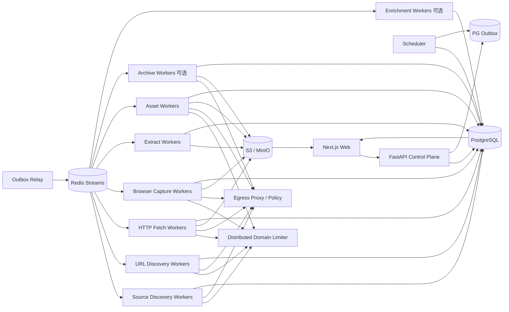

# 博客知识库技术方案

适用范围：约 1000 个技术博客网站的全量历史文章采集、Markdown 清洗、持续扩站、增量同步和 Web 管理；设计目标是可继续扩展到更多站点、数百万 URL 和长期运行。

## 1. 目标与边界

### 1.1 核心目标

1. 新站接入后尽可能完整发现当前仍可访问的历史文章，并可选择使用公共历史索引补充已删除或已迁移 URL。
2. 将标题、作者、发布时间、更新时间、标签、canonical URL、正文、链接、代码块、表格和媒体关系统一清洗为稳定 Markdown。
3. 普通博客无需开发独立爬虫；站点差异优先通过声明式规则和 Provider/Adapter 处理。
4. 支持长期增量同步，仅处理新增、变化、删除确认、失败重试、规则重抽和低频 reconciliation。
5. 支持断点续跑、幂等、去重、版本保留、失败隔离、回滚、离线 re-extract 和 durable cancel。
6. 提供 Web 管理端完成站点接入、范围确认、规则编辑、任务触发、进度监控、错误诊断、Markdown 预览、版本 diff、预算、安全和质量管理。
7. 首次历史回灌和日常增量共用同一套数据模型、任务系统、状态机和可观测体系。
8. Sitemap、Feed、robots.txt、HTML、redirect、canonical、`<base href>`、媒体、公共历史索引和第三方抓取结果全部视为不可信输入。
9. LLM 仅作为可选语义增强、规则生成辅助或人工 review 助手，不参与基础 Markdown 正确性，不自动改写原文。

### 1.2 “全量历史”的定义

- **Live Full**：通过 Feed、Sitemap、归档页、站内链接、公开索引等能够发现，且当前仍可访问的文章。
- **Archive Full（可选）**：在合规前提下，通过 Common Crawl、Wayback 等公开历史索引补充已经删除、迁移或当前站点不再暴露的 URL/快照。

系统必须分别统计：发现过多少 URL、当前可访问多少、成功取得正文多少、仅有历史索引证据但无当前正文多少。

### 1.3 非目标

- 不绕过登录、付费墙、验证码、明确禁止的访问控制或反爬限制。
- 不默认所有页面都使用 Browser；HTTP 能完成时优先低成本路径。
- 不把 Redis、本地 crawler cache、CLI 输出目录或进程内 URL list 当业务真相源。
- 不把 GitHub 当海量正文主存储；GitHub 只保存方案、规则、配置和少量导出。
- 向量库/RAG 不作为采集一期强依赖，但数据模型预留 article/version/chunk/reference。

## 2. 设计原则

1. **Source Discovery、URL Discovery、Fetch、Capture、Extract、Asset、Enrich 解耦**。
2. **PostgreSQL 是业务状态真相源**；Redis 只承担任务分发、限流和短期协调。
3. **端到端流式和分批**；禁止把几十万 URL、超大 Sitemap、响应体或媒体批次一次性装入内存。
4. **跨域并发、域内克制**；不同域可以并行，同一域共享严格限流和预算。
5. **有界异步并发**；不使用全站串行，也不把全部 URL 一次性 `gather()`。
6. **HTTP 优先，Browser 升级**。
7. **抓取快照优先保留**；规则变化优先离线 re-extract，而不是重新访问源站。
8. **规则、Schema、Canonicalizer、Fetcher、Capture Profile、Extractor、Serializer、Security Policy 全部版本化**。
9. **增量从发现阶段开始**；Feed/Sitemap Validator、公共索引 checkpoint、页面 Validator 和内容 hash 共同减少无效访问。
10. **Provider/Adapter 化**；Crawl4AI、Playwright、Common Crawl、Wayback、DomainMapper 类能力均可替换。
11. **控制面不执行重任务**；Web/API/Cron 只能创建 durable job。
12. **所有 URL 入口和 redirect hop 统一经过 EgressPolicy**。
13. **远端输入必须有硬预算**；bytes、请求次数、递归、URL 数、XML element、时间、重定向、Browser 子请求同时受限。
14. **部分成功显式表达**；正文成功、媒体失败、子 Sitemap 失败、预算耗尽不能伪装成 complete。
15. **失败请求同样计入限流和预算**。
16. **PG 与队列避免双写窗口**；使用 transactional outbox。
17. **不使用正则作为生产级 Markdown/HTML 结构重写器**；链接和媒体在 DOM/IR/AST 层规范化。
18. **Worker 本地并发控制不能替代分布式域限流**。
19. **第三方库只做 Adapter，不做业务状态中心**。
20. **发现证据和抓取准入分离**；发现某个 URL/host 不代表允许自动抓取。

## 3. 总体架构



系统分为六个平面：

- **控制面**：站点、抓取范围、规则、计划、任务、权限、发布、回滚、预算。
- **发现面**：Source Discovery + URL Discovery，处理 Feed、Sitemap、归档页、公共历史索引和受限深爬。
- **采集数据面**：HTTP 下载、Browser capture、快照、正文抽取、Markdown、媒体。
- **协调面**：Redis Streams、DB lease、优先级、domain limiter、backpressure、outbox。
- **安全治理面**：Egress、SSRF、防资源耗尽、预览隔离、日志脱敏、供应链。
- **增强面**：可选分类、标签、结构化补充，不改写正文。

## 4. 推荐技术栈

| 层 | 推荐 | 说明 |
|---|---|---|
| API | Python + FastAPI | 只创建、查询和管理任务 |
| Web | React / Next.js | 站点、范围、规则、任务、diff、安全、预算、质量 |
| 元数据/状态 | PostgreSQL | 真相源、事务、唯一约束、lease、outbox、审计 |
| 队列 | Redis Streams + Consumer Group | at-least-once、pending reclaim、水平扩容 |
| 分布式限流 | Redis + Lua | token bucket、concurrency lease、Retry-After |
| HTTP | httpx / aiohttp | 手动 redirect、Validator、streaming body |
| Browser | Crawl4AI / Playwright | 独立 worker、有限 slot、本机内存限流、public-only egress |
| URL Seeder | Crawl4AI AsyncUrlSeeder Adapter 可选 | 普通站点快速 Sitemap/CC 发现，不作为业务状态中心 |
| Domain Mapping | Crawl4AI DomainMapper Adapter 可选 | 仅 probing 发现候选 host/source，需准入后才能抓取 |
| XML | defusedxml + XMLPullParser/iterparse | 禁止 DTD/entity、流式解析 |
| HTML/IR | lxml/selectolax/BeautifulSoup + 自定义 Article IR | 结构化链接和正文中间表示 |
| Markdown | Crawl4AI Markdown Generator 或 AST serializer | 版本化、确定性输出 |
| 对象存储 | S3 / MinIO | HTTP raw、rendered DOM、Markdown、版本、媒体、导出 |
| 可选增强 | Model Gateway + Pydantic/JSON Schema | 严格结构化、预算控制 |
| 监控 | Prometheus + Grafana + OpenTelemetry | 技术和业务 SLO |
| 安全扫描 | OSV/pip-audit + Bandit/Semgrep + SBOM | 依赖与供应链 |
| 部署 | Docker Compose 起步，Kubernetes 按瓶颈引入 | 先隔离 worker 类型，再横向扩展 |

## 5. 核心数据模型

### 5.1 站点、范围与规则

```text
sites
- id
- name
- base_url
- status(draft/probing/validated/backfilling/active/degraded/disabled)
- robots_policy
- default_schedule
- config_json
- active_rule_version
- created_at / updated_at

site_hosts
- site_id
- host
- status(candidate/approved/rejected/disabled)
- discovered_via
- approved_by / approved_at
- reason

site_rules
- id
- site_id
- version
- status(draft/testing/published/superseded)
- discovery_rule_json
- fetch_rule_json
- capture_rule_json
- extract_rule_json
- identity_rule_json
- asset_rule_json
- metadata_rule_json
- security_rule_json
- created_by / created_at
```

声明式规则至少支持：

- include/exclude path；
- CSS/XPath body selector；
- list/archive pagination；
- author/date/tag selector；
- canonical/identity 规则；
- Browser wait selector / 有限交互；
- allowed hosts；
- per-site rate/budget；
- capture profile。

### 5.2 Discovery Source、Run 与 Checkpoint

```text
discovery_sources
- id
- site_id
- host
- kind(feed/sitemap/archive/deepcrawl/commoncrawl/wayback/homepage/custom)
- normalized_url
- discovered_via(robots/common_path/manual/history/domain_map/html)
- status(candidate/active/degraded/disabled)
- etag / last_modified
- provider_version
- coverage_hint_json
- last_success_at / last_error_at
- error_code

discovery_runs
- id
- site_id
- source_id
- provider
- status(running/completed/partial/budget_exhausted/failed/cancelled)
- checkpoint_before / checkpoint_after
- discovered_count / unique_count / accepted_count / rejected_count
- budget_json
- error_code
- started_at / finished_at

discovery_checkpoints
- site_id
- source_id
- provider
- scope_key
- cursor_json
- etag / last_modified
- collection_id
- last_success_at / last_error_at
```

### 5.3 Frontier 与多来源证据

```text
frontier_urls
- id
- site_id
- normalized_url
- url_hash
- first_seen_at / last_seen_at
- lastmod_hint
- pubdate_hint
- priority
- status
- next_fetch_at
- lease_owner / lease_until

frontier_url_sources
- frontier_url_id
- source_id
- provider
- evidence_json
- first_seen_at / last_seen_at
```

约束：`UNIQUE(site_id, url_hash)`；同一 URL 可以由 Feed、Sitemap、Common Crawl、Wayback、homepage 等多个来源共同证明，不能只保留一个 `discovered_from` 字符串。

### 5.4 Fetch/Capture 快照

```text
fetch_snapshots
- id
- site_id
- frontier_url_id
- requested_url
- final_url
- capture_kind(http/browser/archive)
- status_code
- etag / last_modified
- content_type
- body_sha256
- object_key_http_raw
- object_key_rendered_dom
- capture_profile_version
- fetcher_version
- browser_engine_version
- security_policy_version
- fetched_at
```

Browser 页面必须区分服务端原始响应和渲染后 DOM，后续才能可靠离线重抽。

### 5.5 文章与版本

```text
articles
- id
- site_id
- article_key
- accepted_canonical_url
- current_version_id
- status(active/missing_suspected/source_deleted/rejected)
- first_published_at
- last_source_seen_at

article_aliases
- site_id
- alias_url_hash
- article_id
- alias_url
- reason

article_versions
- id
- article_id
- source_snapshot_id
- content_sha256
- markdown_sha256
- object_key_md
- extractor_version
- rule_version
- serializer_version
- metadata_json
- provenance_json
- created_at
```

### 5.6 媒体

```text
asset_blobs
- content_sha256 PK
- object_key
- byte_size
- detected_mime
- active_content
- first_seen_at

asset_sources
- normalized_source_url_hash
- source_url
- etag / last_modified
- content_sha256
- last_checked_at

article_assets
- article_version_id
- content_sha256
- source_url
- relation(image/attachment/favicon/...)
- original_ref
```

### 5.7 Job、Outbox、错误与审计

```text
jobs
- id
- type
- site_id
- status
- priority
- requested_by
- budget_json
- cancel_requested
- created_at / started_at / finished_at

job_items
- job_id
- item_key
- stage
- status
- attempt
- retry_at
- lease_owner / lease_until
- last_error_code

error_events
- id
- job_id / item_key
- stage
- attempt
- error_code
- sanitized_message
- retryable
- occurred_at

outbox_events
- id
- aggregate_type
- aggregate_id
- stream
- payload_json
- published_at

audit_logs / security_events
```

API/Scheduler 在同一 PG 事务中写 job/job_item/outbox，由 relay 发布到 Redis，避免 DB 与队列双写不一致。

## 6. 站点接入与规则体系

生命周期：

```text
draft -> probing -> validated -> backfilling -> active
                   \-> rejected
active -> degraded -> active
active -> disabled
```

### 6.1 probing

新站只用小预算：

1. 拉取 robots.txt。
2. 生成 Feed/Sitemap 候选集合。
3. 可选运行 DomainMapper 类能力，发现候选 host、Feed、Sitemap、homepage、公共历史索引证据。
4. 对候选 host 做 scope 分类，只有 approved host 才能进入正式 URL Discovery。
5. 抽样 20~200 个 URL，统计 path、状态码、content-type、文章候选比例和 soft-404。
6. HTTP 优先抽取，必要时 Browser fallback。
7. 自动生成 include/exclude、selector、identity/canonical、capture profile、metadata 候选规则。
8. 形成 golden URL/snapshot 集，在 Web 中人工确认后才全量回灌。

Domain mapping 发现的 staging、api、admin、dashboard 等 host 默认只作为候选，不自动抓取。

### 6.2 接入层级

1. **零代码通用模式**：Feed/Sitemap + 通用正文抽取。
2. **声明式模式**：CSS/XPath、分页、等待条件、路径规则、canonical、allowed host。
3. **Adapter 插件模式**：特殊 API、复杂分页、JS 路由、自定义签名或 identity。

## 7. Discovery 设计

### 7.1 两层 Discovery

把“在哪里找 URL”和“找到哪些 URL”分开。

**Source Discovery** 负责发现：

- approved host 候选；
- Feed；
- Sitemap root；
- homepage/archive entry；
- 公共历史索引可用性。

**URL Discovery** 负责从已批准 source 中流式产出候选 URL。

统一接口：

```python
class DiscoveryProvider(Protocol):
    async def scan(
        self,
        site: Site,
        source: DiscoverySource,
        checkpoint: Checkpoint | None,
        budget: DiscoveryBudget,
    ) -> AsyncIterator[DiscoveredUrl]: ...
```

内置：`FeedProvider`、`SitemapProvider`、`ArchivePageProvider`、`DeepCrawlProvider`、`CommonCrawlProvider`、`WaybackProvider`、`HomepageProvider`、`CustomAdapterProvider`。

Crawl4AI `AsyncUrlSeeder` 可以作为 `Crawl4AIUrlSeederProvider`，主要用于普通站点的 Sitemap/CC 快速发现；不使用其本地 cache 作为业务真相，也不使用 `many_urls(1000 domains)` 作为平台总调度器。

### 7.2 Admission Pipeline

所有 Provider 的结果统一经过：

```text
raw URL
 -> syntax parse
 -> security normalization
 -> Egress precheck
 -> approved host/scope
 -> canonicalizer_version
 -> include/exclude
 -> asset/non-page heuristic
 -> accepted/rejected + reason
 -> Frontier UPSERT
```

过滤原因必须可统计，避免规则错误时静默漏数据。

## 8. Sitemap 生产级实现

### 8.1 入口候选取并集

入口来源：

- robots.txt 的 `Sitemap:`；
- `/sitemap.xml`、`/sitemap_index.xml`、`/sitemap-index.xml`、`/wp-sitemap.xml`；
- 人工配置；
- 历史成功入口；
- 页面或其它可靠来源。

多个有效 root Sitemap 取并集；每个候选独立记录健康状态，一个入口损坏不能阻塞其它入口。

### 8.2 流式解析

禁止：

```text
response.content -> gzip.decompress(all) -> fromstring(all) -> list(all URLs)
```

推荐：

```text
HTTP stream
 -> compressed bytes limiter
 -> bounded decompressor
 -> decoded bytes / ratio limiter
 -> secure XMLPullParser
 -> batch UPSERT frontier
 -> checkpoint
```

### 8.3 Sitemap 语义

- 支持 `<urlset>`、`<sitemapindex>` 和 namespace。
- gzip 同时检查 Content-Type/URL 和 magic bytes。
- child sitemap 相对 URL 解析后必须重新执行 EgressPolicy。
- `<lastmod>` 只作为调度 hint，不能作为正文变化的唯一证据。
- child failure 形成 partial，不丢弃已经成功发现的 URL。
- 维护 visited identity 检测 cycle。
- 保存 root/child 的 ETag、Last-Modified、last_success、checkpoint。
- child sitemap 本身进入有界 worker pool，不一次性 `create_task(all_children)`。

### 8.4 预算

至少包括：

- max compressed bytes；
- max decoded bytes；
- max compression ratio；
- max XML elements；
- max page URLs；
- max child sitemaps；
- max request count；
- max depth；
- wall time。

预算耗尽标记 `partial/budget_exhausted`，保留 checkpoint。

## 9. Feed、Common Crawl、Wayback 与 Homepage

### 9.1 Feed

Feed 用于最新内容高优先级发现：

- 保存 ETag/Last-Modified；
- 保存 guid/url/pubdate cursor；
- 新 item 立即进入高优先级 Frontier；
- Feed 不是历史完整性唯一来源。

### 9.2 Common Crawl

定位为历史 URL coverage Provider：

- 按 collection id 做 checkpoint；
- 只有出现新 collection 或低频 reconciliation 时重新扫描；
- 记录 query/pattern/provider version；
- 产出的 URL 仍需 scope、Egress、Fetch 验证；
- 不把 Common Crawl 结果当当前 canonical 或正文版本真值。

### 9.3 Wayback

用于补充 Common Crawl 覆盖差异和已删除页面证据：

- 保存 CDX 时间范围/cursor；
- archive timestamp 进入 evidence；
- 当前正文优先，历史 snapshot 只在合规、必要且明确标注来源时使用。

### 9.4 Homepage / ArchivePage

用于站点没有可靠 Sitemap/Feed 时补充内部链接，但必须有：

- max depth；
- max pages；
- include/exclude；
- 去重；
- soft-404；
- domain limiter；
- budget。

## 10. URL Seeder 与轻量 Head Probe

Crawl4AI AsyncUrlSeeder 的有价值能力可保留为 Adapter：

- Sitemap + Common Crawl 双源；
- pattern 预过滤；
- bounded producer-consumer；
- optional live check；
- partial `<head>` 下载；
- title/meta/OpenGraph/JSON-LD/link/lang 提取；
- optional BM25 scoring。

但生产系统必须修正几个边界：

1. `hits_per_sec` 不作为严格 QPS 保证；平台使用真正的 token bucket。
2. 不对 1000 个域直接 `gather()`；由 Scheduler 分批发站点级 job。
3. 本地 cache 仅性能优化，不是 durable checkpoint。
4. 大型 Sitemap 使用平台安全流式 parser。
5. head/BM25 只用于 probing、采样和优先级；全量知识库不能按 relevance 永久丢弃历史文章。
6. HEAD 只作探测；403/405/异常需要 GET fallback。

## 11. Robots、访问礼仪与 Egress

### 11.1 Robots

- 默认 `robots_policy: respect`。
- Sitemap 发现和抓取准入是两件独立事情。
- robots.txt 使用 TTL + ETag/Last-Modified 缓存。
- Fetch/DeepCrawl 按目标 user-agent 和 path 执行 Allow/Disallow。
- robots fetch 失败区分 404、网络失败、解析失败，并有显式 fail-open/fail-closed 策略。
- 规则版本和决策进入审计/trace。

### 11.2 分布式域限流

同一域的 Sitemap、Feed、HTTP、Browser 顶层、Browser 子资源和媒体共享总限流。

每次网络尝试发出之前获得 limiter lease/token；timeout、404、redirect、失败同样消耗请求机会。

Redis + Lua 实现：

- token bucket；
- `domain_concurrency` lease；
- `Retry-After` 动态降速；
- lease TTL 防 worker crash 永久占用；
- 每站和平台总预算叠加。

### 11.3 Egress / SSRF

统一 `EgressPolicy`：

1. 仅允许 HTTP/HTTPS。
2. 拒绝 URL userinfo、异常端口、异常编码、混淆 host。
3. 默认拒绝 localhost、RFC1918、link-local、multicast、reserved、unspecified、cloud metadata、IPv4-mapped IPv6。
4. DNS 解析结果中任一地址命中禁止网段则拒绝。
5. HTTP 禁用自动 redirect；每个 hop 重新校验 URL、DNS、approved-host 和 redirect budget。
6. 默认禁止跨 approved host redirect；确需允许时显式配置并审计。
7. Feed、Sitemap、页面、媒体、Archive URL、canonical、`<base href>`、Browser 顶层和子资源全部经过同一策略。

网络层第二道防线：egress proxy / 网络命名空间负责实际 connect；Browser Worker 不使用 host network。

## 12. HTTP Fetch 快路径

每个页面优先 HTTP：

1. Egress + robots + limiter 准入。
2. 带 `If-None-Match` / `If-Modified-Since`。
3. 手动 redirect，逐 hop 校验。
4. 流式读取，限制 compressed/decoded bytes 和 wall time。
5. 校验 content-type，必要时 sniff。
6. 304 -> unchanged，不进入 Extract。
7. 200 且 body hash 未变 -> 更新 seen/validator，不创建新版本。
8. 只有正文依赖 JS 或质量失败时进入 Browser。

HEAD 只作探测；403/405 或不可信时 GET fallback。

404/410 需要多轮确认后再标 `source_deleted`。

## 13. Browser Capture 升级路径

仅以下情况升级：

- 初始 HTML 为 CSR shell；
- 正文依赖 JS；
- 需要等待 selector、有限滚动/点击或 SPA route；
- HTTP 抽取质量明显不合格。

Browser Worker：

- 与 HTTP Worker 隔离；
- 本机硬 slot；
- page wall-time、总请求数、总字节、redirect 有预算；
- 默认 block 非必要媒体/font；
- public-only egress；
- 不跨不可信站点共享敏感 cookie/storage；
- 周期重启防内存泄漏。

Crawl4AI `arun_many()` 只处理小批量 URL，`MemoryAdaptiveDispatcher`/`SemaphoreDispatcher` 只属于 Worker 本地保护，不能替代平台级分布式 domain limiter。

Browser 成功后至少保存：HTTP raw body、最终 rendered DOM、requested/final URL、capture profile version、viewport/locale/timezone、browser/Crawl4AI/Playwright version。

## 14. 并发、调度和公平性

### 14.1 四层并发

```text
平台总并发
 -> Worker 类型并发
   -> 站点/域并发
     -> 单页面子请求并发
```

建议：

- 不同域之间可以并行；
- 同一域 `domain_concurrency=1` 起步；
- HTTP Worker 每进程 20~50 slot；
- Browser Worker 每进程 4~8 slot；
- Sitemap child 并发 2~4；
- Source/URL Discovery 站点级并发单独限制。

### 14.2 micro-batch

Frontier 每次 lease 20~100 个实际待执行项；大型 Discovery UPSERT 可 500~2000/批。

处理完或流式完成后再领取下一批，避免一次性持有海量 Task/result。

### 14.3 多站点公平

- 每站并发上限；
- 每域并发上限；
- weighted fair queue；
- 日常增量高于历史 backfill；
- 单个大站不能垄断 worker；
- 429/503 站点自动降权/降速。

### 14.4 Backpressure

当 PG/S3 延迟、Redis pending、Extract backlog、Browser RSS 升高时，Scheduler 自动降低 Fetch/Discovery 速率。

## 15. Soft-404 与页面准入质量

probing 时可请求一个保证不存在的随机路径建立 soft-404 fingerprint，记录 title/body hash/结构特征。

正常 Fetch 得到 200 后若与 fingerprint 高度一致：

- 标记 `soft_404_suspected`；
- 不直接创建 article version；
- 进入 Browser fallback 或人工/规则 review；
- Web 展示每站 soft-404 命中率。

这对 SPA“所有路径都返回 200 shell”尤其重要。

## 16. 正文抽取、Metadata 与 Markdown

### 16.1 Article IR

推荐链路：

```text
Capture Artifact
 -> HTML/DOM parser
 -> metadata candidates
 -> article body selection
 -> Article IR
 -> link/asset resolution
 -> normalization
 -> Markdown AST/serializer
 -> Markdown
```

`Article IR` 至少包含：title/author/published/updated/tags、canonical candidates + provenance、block nodes、links、asset references、code blocks/language、table/list/blockquote 等结构。

### 16.2 通用抽取与站点规则

默认使用通用正文算法，只有通用算法持续失败、文章页结构稳定但特殊、元数据字段需要明确 selector 或归档页需要结构化提取时才依赖站点 selector。

### 16.3 Metadata provenance

每个候选保存：

```text
field
value
source_type
source_location
confidence
rule_version
raw_or_normalized
```

来源可包括 HTML title、meta、OpenGraph、JSON-LD、站点 selector、head probe 和启发式结果。

### 16.4 Markdown 确定性

Serializer 固定：heading/list/code fence、空行、link/image、Front Matter key 顺序、Unicode/换行、table。

输入 snapshot + rule_version + extractor_version + serializer_version 相同，应得到相同 Markdown hash。

## 17. URL、Canonical 与 Document Base

### 17.1 URL 规范化

版本化处理：scheme/host 大小写、默认端口、fragment、query 规则、trailing slash、percent encoding、IDNA、tracking 参数；userinfo 直接拒绝。

### 17.2 Canonical

候选优先级可配置：

1. 站点 identity rule；
2. 合法 `<link rel=canonical>`；
3. JSON-LD `mainEntityOfPage`；
4. final URL；
5. requested URL。

跨域 canonical 默认不接受，除非显式 alias 规则允许。

`article_key = hash(site_id + stable_identity)`，不得由发现顺序或导出文件路径决定。

### 17.3 Document Base URL

1. 默认 final URL；
2. 解析 `<base href>`；
3. 用 final URL resolve 相对 base；
4. 经 EgressPolicy/approved-host 验证；
5. 异常 base 忽略并记录质量/安全事件。

canonical、正文链接、图片、srcset、附件共用同一 resolver。

## 18. 媒体与附件

从 DOM/IR 提取 `src/srcset/picture/source` 和站点规则，不用正则作为最终结构解析器。

下载要求：Egress + robots/站点策略 + limiter、request/bytes 预算、streaming + magic sniff、ETag/Last-Modified、redirect 逐 hop 校验。

真实内容按 `content_sha256` 去重；URL hash 只能作为 source/cache key。

SVG、HTML、可执行附件等 active content quarantine，Web 预览从无 Cookie 独立 origin 提供。

## 19. 增量同步

### 19.1 Provider 级 checkpoint

- Feed：ETag/Last-Modified + guid/url/pubdate cursor。
- Sitemap：root/child Validator + last_success + tree health + lastmod hint。
- Common Crawl：collection id + query/provider version。
- Wayback：CDX cursor/时间范围。
- Archive/Homepage：page validator + pagination cursor。

### 19.2 页面级 checkpoint

- ETag；
- Last-Modified；
- 304；
- body hash；
- Markdown/content hash。

Provider checkpoint 和页面 checkpoint 分离，不能把“本轮没有发现变化”误认为“正文没有变化”。

### 19.3 周期 Reconciliation

低频重新扫描全部 Discovery Provider，用于发现 Feed 漏项、Sitemap 移除、URL 迁移、长期未见文章和公共历史索引新增 collection。

删除状态机：

```text
active -> missing_suspected -> source_deleted
```

避免一次 404 或 Sitemap 消失就误删。

## 20. 幂等、重试、取消与部分成功

常见错误码：

```text
network_timeout
dns_failed
egress_denied
robots_denied
redirect_denied
response_too_large
budget_exhausted
sitemap_cycle
sitemap_parse_error
unsupported_content_type
soft_404_suspected
browser_timeout
extract_empty
metadata_budget_exhausted
canonical_conflict
asset_failed
storage_error
```

Retry：

- 429：尊重 Retry-After；
- 5xx/timeout：指数退避 + jitter；
- 4xx 非临时：低次数或不重试；
- egress/robots/security denied：不无限重试；
- parse/extract：规则更新后基于 snapshot replay；
- storage/queue：基础设施恢复后重试。

Web 取消任务只写 `cancel_requested=true`；Scheduler 不再发新 item，worker 在领取和阶段边界检查取消，`finally` 释放 domain lease、DB lease、Browser page/context。

正文、metadata、媒体、增强分别建状态；一张图片失败不能把正文成功伪装成整篇失败。

## 21. Raw / Rendered / Markdown 存储

S3/MinIO key 不依赖用户可控 path：

```text
snapshots/{site_id}/{snapshot_id}/http.raw
snapshots/{site_id}/{snapshot_id}/rendered.html
articles/{site_id}/{article_id}/{version_id}.md
assets/sha256/{prefix}/{full_hash}
exports/{export_id}/...
```

对象元数据记录 hash、content-type、size、capture/version 信息。PG 只保存小型 metadata 和 object key。

## 22. 本地/知识库导出

导出是独立 job，不是主存储：

- path segment 规范化；
- Windows 保留名和长度限制；
- 禁止 `..`、绝对路径和异常编码逃逸；
- 最终 containment；
- 不跟随不可信 symlink；
- 临时文件 + fsync + atomic rename；
- 路径冲突统一附加稳定 article hash；
- 路径由稳定 article identity 决定，不依赖发现顺序；
- manifest 记录 article_id/version/source/object hash/local path。

## 23. Web 管理功能

### 23.1 站点与范围

- 新增/编辑/禁用站点；
- probing 结果；
- candidate/approved/rejected host；
- robots/Sitemap/Feed 状态；
- include/exclude、approved-host、限流、预算；
- 当前规则版本。

### 23.2 Discovery 管理

- Source Discovery 候选；
- root/child Sitemap 树；
- Feed、Common Crawl、Wayback checkpoint；
- URL accepted/rejected 与原因；
- 同一 URL 的多来源 attribution；
- partial/budget exhaustion；
- coverage 趋势；
- soft-404 fingerprint 与命中率。

### 23.3 任务管理

- 全量 backfill；
- 单站增量；
- 单 URL 重抓；
- re-extract without refetch；
- asset retry；
- export；
- cancel/pause/resume；
- job/item 级进度和重试。

### 23.4 规则工作台

- 规则 draft/testing/publish/rollback；
- CSS/XPath schema 编辑；
- golden URL/snapshot 批测；
- selector 命中率；
- before/after Markdown diff；
- canonical/identity/metadata 变化预览；
- capture profile 变化预览。

### 23.5 内容管理

- Markdown 预览；
- metadata 候选与 provenance；
- source snapshot；
- HTTP raw/rendered DOM 切换；
- article version diff；
- alias/canonical；
- asset relation。

### 23.6 并发、预算与质量

- domain limiter wait；
- 每站/每域并发；
- HTTP/Browser active slots；
- Browser worker RSS；
- provider 请求量/字节；
- budget exhaustion；
- 软 404、空正文、模板页、重复正文、日期异常。

## 24. Web 预览安全

raw HTML、rendered DOM 和 Markdown 都来自不可信站点：

- raw/rendered HTML 不与管理端同源执行；
- iframe `sandbox` 严格限制；
- 不注入管理端 cookie/token；
- Markdown renderer 禁止 raw HTML 或经过严格 sanitizer；
- 外链使用安全属性；
- active content 从独立无 Cookie origin 提供。

## 25. 日志、异常与敏感信息

所有 sink 前统一 `LogSanitizer`：

1. URL 去 userinfo、query、fragment；
2. header allowlist，禁止 Authorization/Cookie/Set-Cookie/Proxy-Authorization；
3. exception message、stack trace 扫描 URL/token/secret；
4. dead-letter、security event、OTel attributes、Web 错误页复用同一 sanitizer；
5. 原始完整 URL 如确需保存，进入受限字段并需要额外权限。

## 26. 可观测性与 SLO

### 26.1 业务指标

- 每站发现 URL 数；
- provider/source coverage；
- accepted/rejected article ratio；
- fetch success/304/changed ratio；
- Browser fallback ratio；
- soft-404 ratio；
- extract empty/quality fail；
- article version churn；
- asset success/dedupe；
- metadata conflict/truncation；
- reconciliation missing。

### 26.2 系统指标

- Redis lag/pending；
- DB lease/reclaim；
- PG write latency；
- S3 latency/error；
- HTTP latency/status；
- Browser slot/RSS/restart；
- domain limiter wait；
- egress deny；
- bytes/request budgets；
- micro-batch duration；
- result streaming lag。

### 26.3 Trace

`job_id -> discovery_run -> frontier_url -> fetch_snapshot -> article_version -> asset` 全链路携带 correlation/trace id。

## 27. 数据质量门禁

自动检测：

- 正文过短/为空；
- 导航模板比例过高；
- 登录页/验证码页；
- 软 404；
- title/date 异常；
- canonical 指向异常 host；
- metadata 候选冲突或异常膨胀；
- `<base href>` 异常；
- 大量重复正文；
- Markdown 结构异常；
- 文章版本无意义频繁变化；
- selector zero-result/命中率骤降。

质量不合格时可：HTTP -> Browser fallback、切换规则、进入人工 review；不能直接覆盖 current_version。

## 28. Security Control Matrix

每个安全要求形成四联：

```text
Requirement ID -> automated test -> runtime metric/alert -> runbook/owner
```

必须覆盖：private/loopback/link-local/metadata SSRF、redirect 到 private IP、IPv6/IPv4-mapped、DNS rebinding、Browser 子资源 SSRF、robots policy、恶意 XML、gzip bomb、Sitemap cycle、过量 URL、media amplification、metadata/JSON-LD 膨胀、output path/symlink race、active content preview、日志 secret 泄露、`<base href>` 逃逸、unbounded async task / Browser memory exhaustion。

## 29. 推荐站点配置示例

```yaml
site_id: example
name: Example Blog
base_url: https://example.com
enabled: true
schedule: "0 */6 * * *"
robots_policy: respect

approved_hosts:
  - example.com
  - www.example.com

discovery:
  source_discovery:
    domain_mapping_enabled: true
    auto_approve_hosts: false
    max_candidate_hosts: 50
  providers:
    - feed
    - sitemap
    - archive_page
  optional_providers:
    - commoncrawl
    - wayback
  sitemap_common_paths: true
  sitemap:
    max_depth: 16
    max_urls: 500000
    max_child_sitemaps: 10000
    child_concurrency: 3
    max_compressed_bytes: 52428800
    max_decoded_bytes: 209715200
    max_compression_ratio: 100
  url_seeder:
    crawl4ai_adapter_enabled: true
    head_probe_during_probing: true
    bm25_filter_for_backfill: false
  deep_crawl:
    enabled: true
    max_depth: 2
    max_pages: 500

fetch:
  http_first: true
  max_body_bytes: 10485760
  redirect_max: 5
  browser_fallback: true

browser:
  wait_selector: null
  local_concurrency: 4
  memory_threshold_percent: 75
  micro_batch_size: 25
  max_subrequests: 120
  max_bytes: 52428800
  wall_time_s: 90

limits:
  domain_concurrency: 1
  requests_per_second: 0.5
  requests_per_day: 20000

metadata:
  max_head_bytes: 1048576
  max_fields: 500
  max_value_bytes: 8192
  max_total_bytes: 65536

assets:
  enabled: true
  max_assets_per_article: 100
  max_requests_per_article: 120
  max_file_bytes: 10000000
  max_article_bytes: 50000000

identity:
  query_drop:
    - utm_source
    - utm_medium
    - utm_campaign
```

## 30. 部署路线

### Phase 1：单机/小集群生产可用

Docker Compose：PostgreSQL、Redis、MinIO、API/Web、scheduler/outbox relay、source/url discovery worker、HTTP fetch worker、Browser worker、extract worker、asset worker。

优先实现：Feed/Sitemap、Frontier、多来源 attribution、Redis Streams + lease + outbox、HTTP + Browser fallback、bounded async worker、distributed domain limiter、capture snapshot、Markdown、Web CRUD/任务/错误、增量 checkpoint、Egress/预算/日志 sanitizer、metadata provenance、rule/schema workbench 基础能力。

### Phase 2：强化质量与历史覆盖

- Common Crawl/Wayback Provider；
- DomainMapper 类 probing；
- soft-404 fingerprint；
- 归档页 Provider；
- golden test/rule workbench 完整版；
- metadata conflict review；
- 质量 SLO；
- 完整 Security Control Matrix。

### Phase 3：按瓶颈引入 Kubernetes

只有需要多机 Browser pool、弹性扩容、节点隔离或高可用时再迁移 K8s。1000 个站点不要求第一天就上 K8s。

## 31. 初始容量与并发建议

保守起步：

- domain concurrency = 1；
- domain delay = 1~3 秒或等价 token bucket；
- Sitemap 子并发 = 2~4；
- 同时做 URL Discovery 的站点数 = 10~50；
- HTTP 每进程 20~50 slot；
- Browser 每进程 4~8 slot；
- Browser memory threshold = 70%~80%；
- Browser micro-batch = 20~50；
- Frontier lease = 100~1000；
- Discovery UPSERT = 500~2000/批。

实际值依据 robots/站点政策、429/5xx、源站响应时间、Browser 内存、PG/S3 延迟动态调整。

容量规划不能简单用“100 个站多少分钟”线性外推；应按 HTTP/Browser 比例、每页字节、平均响应时间、站点 politeness、历史 URL 总量分别测算。

## 32. 关键流程

### 32.1 新站全量回灌

```text
Create Site
 -> probing
 -> robots + source discovery
 -> candidate host/source review
 -> golden sample validation
 -> publish scope/rules
 -> URL Discovery Providers
 -> stream UPSERT Frontier + source attribution
 -> Scheduler/outbox
 -> bounded HTTP Fetch
 -> soft-404 / quality gate
 -> Browser Capture fallback
 -> store http_raw/rendered_dom
 -> Extract to Article IR + Metadata Candidates
 -> identity/canonical merge
 -> asset resolution
 -> Markdown serializer
 -> article version
 -> active
```

### 32.2 日常增量

```text
Feed/Sitemap validator scan
 -> new/changed candidate URLs
 -> Frontier priority
 -> conditional HTTP GET
 -> 304: stop
 -> 200 same hash: update seen
 -> changed: snapshot
 -> optional Browser
 -> extract
 -> compare article version
 -> publish new version if meaningful change
```

### 32.3 历史覆盖补充

```text
Common Crawl / Wayback new checkpoint
 -> historical candidate URLs
 -> scope/admission
 -> low-priority Frontier
 -> current GET if appropriate
 -> archive evidence if current page missing
 -> reconciliation metrics
```

### 32.4 规则更新

```text
Draft rule/schema
 -> golden snapshots batch replay
 -> selector hit-rate + quality/diff review
 -> publish
 -> enqueue re-extract for affected snapshots
 -> create new article versions only where output changed
```

### 32.5 手动触发

```text
Web/API/Cron
 -> create durable job
 -> PG + outbox transaction
 -> Redis Streams
 -> workers
 -> Web progress
```

禁止在 HTTP 请求处理函数中直接运行数分钟/数小时抓取逻辑。

## 33. 验收标准

### 功能

- 可从 Web 新增站点并进入 probing/backfill/active。
- probing 可发现候选 host/source，但不会越过 approved scope 自动抓取。
- 支持多个 Sitemap root、嵌套 Sitemap、gzip、Feed、归档页。
- 支持 Common Crawl/Wayback 独立 checkpoint。
- robots Sitemap 发现与抓取准入分别正确执行。
- 断点后从 durable checkpoint 继续。
- 支持 ETag/Last-Modified/304/content hash 增量。
- 支持 HTTP -> Browser fallback。
- HTTP raw/rendered DOM/Markdown/文章版本可追溯。
- 同一 URL 的多来源 attribution 可追溯。
- metadata 候选、最终值、provenance 和 Front Matter 导出可追溯。
- CSS/XPath schema 可批测、发布和回滚。
- 支持单 URL/单站/阶段重试和 re-extract without refetch。
- 手动触发立即返回 job_id，不绑定长 HTTP 请求。

### 扩展性

- 新增普通站点不新增独立 worker 类型。
- Discovery/Frontier 不依赖单进程内存 list。
- 不使用 `many_urls(1000 domains)` 或等价全站点一次性 `gather()`。
- Worker 可横向扩展，Redis/DB lease 可 reclaim。
- 不同域可并行，同一域严格限流。
- 不存在 unbounded Sitemap child task 或一次性数万 Browser Task。
- Browser 本机并发和分布式域并发同时生效。
- 单个大站不能垄断全部 worker。

### 安全

- redirect SSRF、Browser 子资源 SSRF 有应用和网络双层防线。
- Sitemap gzip/XML、响应体、metadata、媒体、请求次数有硬预算。
- 失败请求也消耗请求预算和限流机会。
- robots policy 可审计。
- `<base href>`、canonical、asset URL 都经过统一安全解析。
- 日志/异常/dead-letter/Web 错误页不泄露 query token。
- raw/rendered DOM/Markdown/active content Web 预览隔离。
- 导出路径不可穿越、不可因 crawl 顺序变化。

### 数据质量

- 同文章 alias/canonical 能稳定合并。
- 同一媒体不同 URL 能按内容 hash 去重。
- 规则变化可以不访问源站直接生成新 Markdown。
- Markdown 链接和媒体通过 DOM/IR/AST 解析，不依赖脆弱正则。
- soft-404/SPA shell 能被识别并阻止进入正式 article version。
- `<base href>` 页面资源解析正确且安全。
- 模板页、空正文、重复正文、metadata 冲突等异常可检测和定位。
- schema selector 命中率下降能够自动告警。
