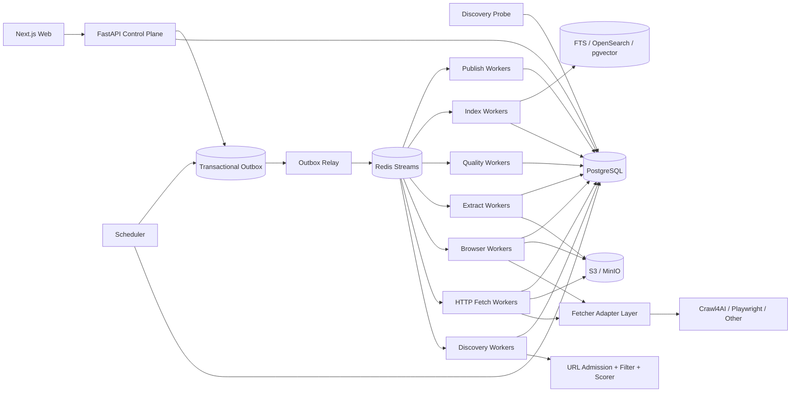

# 博客知识库技术方案

适用范围：从约 1000 个技术博客网站抓取尽可能完整的历史文章，清洗为稳定 Markdown 作为长期知识库；后续持续新增网站，支持历史全量回灌、长期增量同步、版本保留、Web 管理、搜索与外部知识库发布。整体按“数百万 URL、长期运行、站点异构、可横向扩展、可恢复、可回放、可审计”设计。

## 1. 建设目标

1. 用户只需录入博客根地址，系统自动探测 Sitemap、Feed、归档页、分类页、作者页、公开 API、动态列表等入口，并生成可审核的站点配置草稿。
2. 支持约 1000 个站点的历史全量抓取，并可持续增加站点，不要求修改核心状态机。
3. 同一站点允许多个独立 Discovery Provider，每个 Provider 独立维护 capability、checkpoint、覆盖度与增量连续性。
4. 抓取标题、作者、发布时间、更新时间、标签、canonical、正文、代码块、表格、图片和附件，输出稳定 Markdown。
5. 默认 HTTP-first，仅在证据表明确实需要 JavaScript 时升级到 Browser。
6. 支持 ETag、Last-Modified、Sitemap lastmod、Feed GUID/cursor、API cursor、内容 hash 与重叠时间窗口驱动的增量同步。
7. 支持 durable frontier、断点续跑、幂等、重试、指数退避、限流、熔断、按站公平调度与 backpressure。
8. 保存原始响应、渲染 DOM、抽取候选、Article IR、Markdown、规则版本和质量结果；规则升级优先离线 replay。
9. 提供 Web 管理端完成站点接入、探测、规则发布、任务管理、质量审核、版本 diff、错误诊断、搜索和发布管理。
10. Crawl4AI、Playwright、Trafilatura 等统一通过 Adapter 接入，不直接成为业务状态真相源。
11. URL 发现、URL 准入、抓取、抽取、质量评估、索引和发布全部可版本化、可审计。
12. LLM 仅作为昂贵的语义抽取或低质量升级路径，不作为百万级文章的默认正文抽取方式。

## 2. “全量历史”的定义与完成判定

### 2.1 Live Full

从当前站点仍可访问的 Sitemap / Sitemap Index、RSS / Atom / JSON Feed、平台公开 API、年/月归档、分类、标签、作者分页、普通站内链接和动态列表中发现历史文章。

### 2.2 Archive Full（可选）

在合规前提下，可利用 Common Crawl、Wayback 等补充已经删除、迁移或当前站内不再暴露的历史 URL 或历史快照证据。Archive Full 与 Live Full 分开统计，不能混为一个完成率。

### 2.3 Provider Capability

每个发现 Provider 必须标注：

- `exhaustive`：理论上可枚举完整集合，如可靠 Sitemap Index；
- `windowed`：只暴露最近窗口，如普通 RSS；
- `best_effort`：只能尽力发现，如普通站内递归。

### 2.4 全量完成不能用“队列为空”判断

站点历史回灌完成至少同时满足：

1. 所有启用 Provider 到达稳定 checkpoint；
2. Sitemap/API 等 `exhaustive` Provider 已完整枚举并记录条目数；
3. 归档/分页 Provider 无未处理 next page 或 continuity gap；
4. durable frontier 中无可执行 URL；
5. retryable 失败已处理完，dead-letter 已明确接受、忽略或人工处置；
6. 新一轮 reconcile 未产生显著新增 URL；
7. Provider Coverage Ledger 中不存在未知断档。

因此 `frontier == empty` 只表示“当前没有待执行任务”，不等价于“全量完成”。

## 3. Crawl Mode：不同任务使用不同停止条件

统一定义五种模式：

- `FULL_BACKFILL`：首次历史回灌，目标是尽可能完整；
- `INCREMENTAL`：持续同步新增和更新文章；
- `RECONCILE`：周期性重新枚举来源，修复增量断档；
- `TOPIC_EXPANSION`：围绕主题做有限预算的站内扩展；
- `REPROCESS`：不访问网络，基于已有 snapshot 重新抽取、清洗、索引或发布。

关键规则：

- `FULL_BACKFILL` 中 URL Scorer 只影响顺序，不因低分永久丢弃合法 URL；
- `INCREMENTAL/TOPIC_EXPANSION` 可以使用分数阈值、最大页数、时间预算和 AdaptiveCrawler；
- AdaptiveCrawler 的 coverage/consistency/saturation 是“信息充分度”，不能作为首次全量完成条件；
- Crawl4AI deep crawl 的 `max_pages` 是一次 execution slice 的预算，不是站点最终抓取上限。

## 4. 核心设计原则

1. PostgreSQL 是业务状态真相源，S3/MinIO 是不可变大对象真相源。
2. 站点、发现端点、Fetch Profile、Extraction Contract、URL Filter Chain、URL Scorer、Browser Action Plan、Adapter 全部分离并版本化。
3. 自动 Probe 与生产回灌分离；Probe 只生成配置草稿和样本证据。
4. URL 被发现不表示允许抓取，必须经过 URL Admission Pipeline。
5. HTTP、Feed、Sitemap、API、Browser 分层，Browser 是稀缺升级路径。
6. 页面动作与内容抽取分离；Browser Action Plan 负责页面就绪、点击、翻页和滚动，Extraction Contract 负责字段与正文。
7. 抓取快照不可变，规则升级优先 replay。
8. 文章身份与 URL 分离；redirect、canonical、镜像、迁移不自动等同于新文章。
9. `article_version` 只追加，不覆盖旧版本。
10. Redis Streams 只做短期分发，不做状态真相源。
11. 所有跨 PostgreSQL 与队列的写入通过 Transactional Outbox。
12. LLM 输出只能作为候选或派生结果，必须记录模型、prompt、schema、输入 snapshot hash 与成本。
13. 控制面不执行长任务，只创建 durable job。
14. 批处理只做传输优化，结果必须按 `task_id/attempt_id` 关联。
15. 第三方抓取引擎不能绕过统一 Egress、robots、限流、预算和业务状态机。
16. Bloom Filter、RoaringBitmap 等只能做加速结构，不能代替数据库唯一约束和 durable frontier。

## 5. 总体架构



系统分为控制面、探测面、发现面、采集面、Adapter 面、抽取与质量面、协调面、知识访问面和发布面。

## 6. 新站点接入：Discovery Probe

管理员输入根 URL 后，Probe 并行执行：

1. GET 根页面并记录最终 URL、Content-Type 和结构；
2. 解析 robots.txt 中 Sitemap；
3. 探测常见 Sitemap 地址；
4. 解析 HTML 中 RSS/Atom alternate；
5. 探测常见 Feed；
6. 识别归档、分类、标签、作者和分页；
7. 识别公开 JSON/REST/GraphQL API；
8. 必要时执行 Browser Sample Probe；
9. 抓取 3~10 个详情页样本，识别正文结构与 metadata；
10. 生成 Provider、Fetch Profile、Filter Chain、Scorer、Extraction Contract、Action Plan 和 Adapter 草稿；
11. 对样本执行 raw Markdown / fit Markdown / Contract / 通用抽取器对比；
12. 输出预计 Browser 比例、覆盖来源和风险项。

Web 端展示证据与样本，管理员 dry-run 后发布，再创建历史回灌任务。后续增加网站只新增配置和 Provider，不修改核心代码；常见平台可复用站点模板。

## 7. Discovery Provider 与覆盖台账

Provider 推荐优先级：

1. Sitemap / Sitemap Index；
2. 平台公开 API；
3. RSS/Atom/JSON Feed；
4. 年/月归档；
5. 分类/标签/作者分页；
6. HTML 同域递归；
7. Browser 动态列表；
8. 外部公开索引补漏。

Sitemap 必须支持 index、gzip、namespace、lastmod、分片递归、streaming parse 和安全 XML；Feed 保存 GUID、发布时间、更新时间、cursor/next link；windowed Provider 必须使用重叠时间窗口、断档检测和周期性 full reconcile。

每个 `discovery_run` 写入 Provider Coverage Ledger：

```text
provider_id
crawl_mode
checkpoint_before / checkpoint_after
pages_or_entries_scanned
discovered_count
admitted_count
rejected_count + reason
expected_count（若可得）
pagination_continuity
new_frontier_count
unresolved_error_count
started_at / finished_at
```

Web 端据此显示“覆盖证据”，而不是只显示任务是否成功。

## 8. URL Admission、Filter Chain 与 crawler trap

每个新发现 URL 依次经过：

1. URL 规范化；
2. SSRF / Egress 校验；
3. robots 与访问策略；
4. Domain / Subdomain allowlist；
5. URL path allow/deny；
6. query 规范化；
7. Content-Type/扩展名规则；
8. canonical / redirect identity hints；
9. crawler trap 检测；
10. Provider 深度与执行预算；
11. URL Priority Scorer。

规则保存为 `url_filter_chain_release`，每个 Discovery Run 固化对应 release，保证可重放。

URL 规范化至少处理 host 大小写、IDN、fragment、默认端口、tracking query、query 顺序、已知 session 参数、trailing slash 和 percent-encoding。

典型 crawler trap：日历无限翻页、搜索参数组合、tag/filter 排列组合、无界 `?page=`、session/token 参数、同内容多排序 URL。平台按站限制最大路径深度、query cardinality、page number 和重复模板比例，并记录 reject reason。

## 9. URL Scorer 与 Best-First durable frontier

对于 HTML recursive 或动态发现，不只使用简单 BFS，而是支持可插拔 Best-First 排序：

```text
priority_score =
  source_priority
+ path_pattern_score
+ page_type_score
+ archive_expansion_score
+ recency_score
+ semantic_score
- trap_penalty
- duplicate_penalty
```

Sitemap/API/Feed 直接发现的文章详情页优先；能继续展开大量历史 URL 的归档页也可获得高扩展分；未知站内链接较低。关键词或语义 scorer 只作为软排序信号，不能成为历史全量唯一准入规则。

### 9.1 FULL_BACKFILL

- score 只决定先后；
- 低分合法 URL 最终仍必须处理；
- worker 每个小批次发现的新 URL 都持久化回 PostgreSQL；
- `max_pages` 只限制单次 worker slice，Scheduler 会继续调度剩余 frontier。

### 9.2 INCREMENTAL / TOPIC_EXPANSION

- 可启用 score threshold；
- 可设 max pages / 时间预算；
- 可使用主题相关性和 freshness；
- 可使用 AdaptiveCrawler 依据信息增益递减提前停止。

## 10. Crawl4AI 的定位与 Adapter 边界

Crawl4AI 主要承担：

- `AsyncWebCrawler` 异步抓取；
- Browser 执行；
- BFS/DFS/BestFirst deep crawl；
- `FilterChain` 与 URL scorer；
- `DefaultMarkdownGenerator`；
- `PruningContentFilter/BM25ContentFilter` 产生 fit Markdown；
- CSS/JSON Schema extraction；
- 必要时 LLM extraction；
- AdaptiveCrawler；
- `arun_many()` + dispatcher 的 worker 内并发控制。

它不承担：

- 全局 durable frontier；
- 多站点公平调度；
- 业务 checkpoint；
- 文章版本真相；
- 全局幂等与审计；
- 站点长期覆盖完成判定。

统一 Adapter 输入：

```text
task_id
attempt_id
crawl_mode
url
profile_release_id
filter_chain_release_id
scorer_release_id
action_plan_release_id
extraction_release_id
adapter_release_id
execution_budget
conditional_headers
```

统一输出：

```text
task_id
attempt_id
success
final_url
status_code
headers
raw_body/rendered_dom reference
raw_markdown/fit_markdown reference
extracted_content reference
discovered_links
engine_metrics
error_class/error_code
```

每个 Adapter release 注册 Capability Manifest，包括 HTTP、Browser、session、per-url config、execute-js、raw HTML、Markdown、metrics、max batch、max concurrency 等能力。Profile 与 Action Plan 发布前必须做 capability validation。

Crawl4AI API 版本必须锁定，业务层不直接引用内部模型；Adapter 负责版本差异。例如导航完成条件、Filter/Strategy import path、dispatcher 行为变化都由 Adapter 层吸收。

## 11. HTTP-first 与 Browser 升级

默认优先 HTTP：

1. 尽可能发送 `If-None-Match` / `If-Modified-Since`；
2. 304 直接更新 freshness，不进入抽取；
3. 200 时先保存 raw response；
4. 若正文 hash 不变，只更新 fetch metadata；
5. HTTP DOM 能得到完整正文则直接进入抽取；
6. 只有证据表明需要 JS 才进入 Browser。

Browser 升级原因必须结构化记录：

- `EMPTY_ARTICLE_BODY`；
- `SPA_SHELL`；
- `JS_PAGINATION`；
- `LOAD_MORE`；
- `INFINITE_SCROLL`；
- `DYNAMIC_RENDER_REQUIRED`；
- `EXTRACTION_READINESS_FAILED`。

Browser session 必须使用 TTL、heartbeat、generation/fencing token、最大请求数、最大生命周期和显式 cleanup。Browser Worker 独立资源池，防止 Chromium 抢占普通 HTTP/CPU worker。

## 12. 增量同步与 Reconcile

增量优先使用低成本变更信号：

1. Sitemap `lastmod`；
2. Feed GUID/发布时间/更新时间；
3. API cursor / updated_at；
4. ETag；
5. Last-Modified；
6. normalized content hash。

每站维护 `next_sync_at`、Provider checkpoint、最近变更率和历史抓取耗时，Scheduler 可按变化速度自适应调整频率。

### 12.1 防止 windowed source 漏数据

RSS 等只保留最近 N 条，不能只保存“最后一条 GUID”然后向前推进。必须：

- 使用时间重叠窗口；
- 对最近一段时间重复扫描并依靠幂等去重；
- 检测时间断档；
- 定期执行 Sitemap/API/Archive `RECONCILE`；
- 对长时间离线后的站点先扩大 overlap 再恢复正常频率。

### 12.2 文章更新

如果 URL 未变化但正文变化：创建新的 `article_version`。如果只发生抓取时间变化或响应头变化，而 Article IR hash 相同，不创建新文章版本。

## 13. 抽取链：确定性优先，多候选竞争

同一 snapshot 可产生多个候选：

1. 平台 API / JSON-LD / meta；
2. 站点 CSS/XPath/JSON Extraction Contract；
3. Trafilatura；
4. Readability；
5. Crawl4AI raw Markdown；
6. Crawl4AI fit Markdown；
7. 必要时 LLMExtractionStrategy。

### 13.1 fit Markdown 的正确使用

Crawl4AI 的 PruningContentFilter 会依据文本密度、链接密度、标签重要性等裁剪页面，非常适合去导航和侧栏，但技术文章中短代码块、表格、API 列表可能被误剪。

因此：

- `fit_markdown` 只是候选，不直接覆盖 canonical 内容；
- 必须同时保存 raw HTML、raw Markdown 和 fit Markdown；
- Quality Gate 比较代码块、表格、标题、正文长度等后再选最终候选；
- 站点可对 pruning threshold 单独版本化；
- 规则升级优先离线 replay 历史 snapshot。

### 13.2 LLM 升级路径

只有以下情况才进入 LLM：

- 站点 Contract 与通用抽取器均低质量；
- DOM 极不稳定；
- 需要语义字段而不是单纯正文；
- 少量特殊长尾页面需要临时兜底。

每站维护 `llm_escalation_policy`、模型 allowlist、单文 token 上限和月度预算。LLM 输出只作为 candidate，必须保存模型、prompt/schema release、输入 snapshot hash、token、成本和输出。

## 14. Extraction Contract、规则版本与离线 Replay

每站维护 `ExtractionContractRelease`：

```text
site_id
release_id
match_rule
base_selector
field_selectors
content_selector
exclude_selectors
published_at_rules
canonical_rules
markdown_rules
canary_sample_urls
created_at
```

发布新规则前：

1. 从对象存储抽取 20~100 个历史 snapshot；
2. 对新旧 release 离线 replay；
3. 比较标题、正文长度、代码块、表格、发布时间、内容 hash；
4. Web 展示 diff；
5. canary 通过后切换默认 release；
6. 对受影响历史文章创建 `REPROCESS` job。

这样 selector 漂移时无需重新访问整个站点。

## 15. Quality Gate 与 Extractor Drift Detection

至少计算：

- 标题存在率与 `<title>/og:title/h1` 一致度；
- 正文字符数、段落数；
- 链接密度和导航占比；
- `pre/code` 保留率；
- 表格保留率；
- 图片引用有效率；
- 发布时间证据；
- boilerplate 比率；
- 与历史版本重复度；
- Markdown 截断/结构异常；
- canonical/final URL 冲突；
- schema 字段命中率。

站点级持续监控：

```text
extraction_success_rate
body_length_p50/p95
title_missing_rate
code_block_retention
fit/raw_length_ratio
browser_fallback_rate
llm_escalation_rate
duplicate_ratio
```

若某个 release 发布后指标突变，自动暂停扩大范围、触发 Probe，并生成新 Contract 草稿。低质量内容不静默覆盖旧版本。

## 16. Article IR 与 Markdown

HTML 不直接字符串清洗后落 Markdown，而是先转换为稳定 Article IR：

- heading；
- paragraph；
- list；
- quote；
- code block；
- table；
- image；
- link；
- embed placeholder。

Markdown 推荐目录：

```text
knowledge/{site_slug}/{yyyy}/{article_id}.md
```

front matter 至少包含：

```yaml
article_id:
site_id:
source_url:
canonical_url:
title:
authors:
published_at:
updated_at:
fetched_at:
content_hash:
article_version:
extraction_release:
crawl_run_id:
```

文件名不直接依赖标题，避免重命名和非法字符问题。正文中的相对链接和图片统一转成绝对地址；是否镜像图片作为站点级策略。

## 17. URL 去重、文章身份与版本

### 17.1 URL 级去重

数据库准确唯一键：

```text
(site_id, sha256(normalized_url))
```

可在每个 worker 或短时间窗口使用 Bloom Filter 快速挡掉明显重复 URL；Bloom false positive 不能决定永久丢弃，最终仍以 PostgreSQL unique constraint 为准。

RoaringBitmap 适合保存已经映射为整数 ID 的批次/分片集合，用于快速交并、覆盖统计和本轮 visited 集合，但不是 URL 身份真相源。

### 17.2 内容与文章身份

- exact duplicate：Article IR/content hash；
- near duplicate：MinHash/SimHash 只生成候选，不自动删除；
- redirect/canonical：只提供 identity evidence；
- 多 URL 指向同一文章时保留 URL relation；
- 站点迁移或 canonical 改变不自动创建重复文章。

`article_version` append-only。正文、关键 metadata、canonical identity 或规则升级后的 canonical IR 发生实质变化才创建新版本。

## 18. 核心数据模型

至少包括：

- `site`：站点元数据、状态、抓取政策；
- `site_source`：Sitemap/Feed/API/Archive/HTML/Browser Provider；
- `fetch_profile_release`；
- `url_filter_chain_release`；
- `url_scorer_release`；
- `extraction_contract_release`；
- `browser_action_plan_release`；
- `adapter_release`；
- `llm_escalation_policy`；
- `discovery_probe_run`；
- `discovery_run`；
- `provider_coverage`；
- `discovery_checkpoint`；
- `crawl_job`；
- `url_frontier`；
- `fetch_task`；
- `crawl_attempt`；
- `fetch_snapshot`；
- `browser_session_lease`；
- `extraction_candidate`；
- `quality_evaluation`；
- `article`；
- `article_url_relation`；
- `article_version`；
- `publish_state`；
- `outbox_event`。

`url_frontier` 关键字段：normalized_url、site/source、discovered_from、depth、priority_score、filter/scorer release、state、attempt_count、next_attempt_at、lease_owner、lease_until、discovery_evidence、first_seen_at、last_seen_at。

## 19. 状态机、幂等与 Transactional Outbox

URL/任务状态建议：

```text
DISCOVERED
 -> ADMITTED
 -> QUEUED
 -> FETCHING
 -> FETCHED
 -> EXTRACTING
 -> QUALITY_CHECK
 -> STORED
 -> INDEXED
 -> PUBLISHED
```

失败进入：

```text
RETRY_WAIT -> QUEUED
DEAD_LETTER
REJECTED
```

每次领取任务使用 lease；worker 崩溃后 lease 到期可重放。业务写入通过 idempotency key 去重，例如：

```text
fetch:      url_id + requested_snapshot_epoch
extract:    snapshot_id + extraction_release_id
index:      article_version_id + index_release_id
publish:    article_version_id + destination + publish_release_id
```

在同一 PostgreSQL 事务内写状态变化和 `outbox_event`，Outbox Relay 再投递 Redis Streams，避免“数据库已提交但消息没发”或“消息已发但数据库没记录”。

## 20. 调度、并发、公平性与 Backpressure

Job 类型：probe、full_backfill、incremental_sync、reconcile、topic_expansion、re-extract、re-normalize、re-index、re-publish、asset repair、orphan session cleanup。

Scheduler 使用 weighted fair queue，避免超大站点长期占满 worker。每域维护：

- 最大并发；
- QPS；
- 最小请求间隔；
- token bucket；
- Retry-After；
- 429/403/5xx 退避；
- HTTP/Browser 独立预算；
- 熔断状态。

队列优先级建议：

```text
NEW_FEED / CHANGED
> INCREMENTAL_REFRESH
> RECONCILE
> HISTORICAL_BACKFILL
> LOW_PRIORITY_REPROCESS
```

但 `FULL_BACKFILL` 里的低分 URL需要通过 aging 获得优先级，保证最终不会饿死。

当 downstream 堆积时：

1. 降低 Discovery 速度；
2. 暂停 Browser expansion；
3. 优先消化已抓未抽取 snapshot；
4. 限制 LLM 升级；
5. 保留高优先级 Feed/Incremental 通道。

Crawl4AI `arun_many()`/MemoryAdaptiveDispatcher 只用于 worker 内一个小批次的资源自适应并发；平台级公平性、重试和 checkpoint 仍由 Scheduler/PostgreSQL 控制。

## 21. 错误分类

统一 error taxonomy：

- dns_failure；
- connect_timeout；
- read_timeout；
- connection_reset；
- tls_failure；
- http_401_403；
- http_404_410；
- http_429；
- http_5xx；
- robots_denied；
- egress_denied；
- content_too_large；
- browser_crash；
- browser_timeout；
- extraction_failed；
- quality_rejected；
- adapter_contract_error。

每类错误明确 retryable、retry_after、最大次数、影响范围及是否触发熔断或人工审核。

## 22. Web 管理功能

### 22.1 站点接入

- 新增站点 Probe 向导；
- Sitemap/Feed/API/归档/动态列表证据；
- 样本 URL 和抓取方式；
- HTTP/Browser 差异；
- 自动生成规则草稿；
- dry-run/canary/publish。

### 22.2 覆盖与任务

- 站点列表、Provider 数、历史覆盖度、frontier、backlog、错误率；
- Provider capability/checkpoint/continuity gap；
- expected/discovered/admitted/fetched/article count；
- full backfill 完成证据；
- 任务暂停、恢复、取消、重试；
- 单 URL 调试和强制 reprocess。

### 22.3 规则与质量

- URL Filter Chain 与 Scorer 编辑、解释、版本发布和回滚；
- Extraction Contract 与 Browser Action DSL；
- raw HTML/rendered DOM/raw Markdown/fit Markdown/final Markdown 对比；
- 新旧 release 离线 diff；
- 抽取候选与质量评分；
- selector drift 告警；
- 文章版本 diff。

### 22.4 搜索与发布

- 全文搜索；
- 可选向量搜索；
- article/source/version 浏览；
- 外部知识库发布状态；
- 失败重推和版本回滚。

## 23. 安全、robots 与合规

所有网络访问统一经过 Egress Gateway：

- 仅允许 http/https；
- 拒绝 localhost、RFC1918、link-local、loopback、metadata endpoint；
- DNS 解析前后校验；
- redirect 每跳重新检查；
- 限制端口；
- 防 DNS rebinding；
- Browser/第三方 Adapter 也必须经过相同出口政策。

robots 决策缓存并版本化。Crawl4AI Adapter 可启用其 `check_robots_txt` 作为额外保护，但平台 policy 是统一准入来源。平台还应统一实现单站 token bucket、Retry-After、crawl delay/礼貌间隔和熔断。

不绕过验证码、登录、付费墙或明确访问控制。Browser 任意 JS 默认禁用，确需 JS 时必须版本化、审核、限时、限资源并限制网络出口。

## 24. 观测、指标与 SLO

每个 URL 使用 `trace_id` 贯穿：

```text
Discovery
 -> Admission
 -> Fetch
 -> Snapshot
 -> Extract
 -> Quality
 -> Normalize
 -> Index
 -> Publish
```

关键指标：

- discovery URL/s；
- Provider continuity gap；
- full-backfill frontier convergence；
- fetch success rate；
- HTTP latency；
- 304 ratio；
- Browser escalation ratio；
- Browser seconds/article；
- extraction success rate；
- body length p50/p95；
- code block retention；
- fit/raw length ratio；
- queue lag；
- domain throttle time；
- retry/dead-letter rate；
- outbox lag；
- Adapter error rate；
- LLM escalation ratio；
- token cost/article；
- article freshness lag；
- average cost/article。

建议 SLO：控制面可用性、增量 freshness、任务最终成功率、队列延迟分别定义，并按站点等级配置，不用一个指标覆盖所有站点。

## 25. 推荐技术栈

| 层 | 推荐 |
|---|---|
| API | Python + FastAPI |
| Web | React / Next.js |
| Worker | Python asyncio |
| CPU Worker | 独立进程池 / Worker |
| 状态库 | PostgreSQL |
| 队列 | Redis Streams |
| 大对象 | S3 / MinIO |
| HTTP | httpx / aiohttp |
| Browser | Playwright + Crawl4AI Adapter |
| Sitemap / Feed | lxml / defusedxml + feedparser |
| 正文抽取 | 站点 Contract + Trafilatura + Readability + Crawl4AI |
| 全文检索 | PostgreSQL FTS，规模扩大后 OpenSearch |
| 向量 | pgvector 或独立 Vector DB，可选 |
| 观测 | OpenTelemetry + Prometheus + Grafana + Loki |
| 部署 | Docker + Kubernetes |

初期 1000 站规模不建议直接引入 Kafka。Redis Streams + PostgreSQL Outbox 足够简单且可运维；当单日任务量、保留周期或跨区域消费达到明确瓶颈时再迁移 Kafka/Pulsar，业务状态模型无需变化。

## 26. 部署与容量规划

Worker 至少拆分为：

- discovery；
- HTTP fetch；
- Browser；
- extract；
- quality/CPU；
- index；
- publish；
- cleanup。

Browser 单独 Pod/Node Pool，严格并发和内存预算。大 HTML、DOM、IR、Markdown 和附件放 S3/MinIO，PostgreSQL 只保存 metadata、状态、hash 和 object key。

推荐最小生产拓扑：

```text
2 x FastAPI Control Plane
2 x Scheduler / Outbox Relay（leader lease）
N x Discovery Worker
N x HTTP Fetch Worker
独立 Browser Worker Pool
N x Extract / Quality Worker
N x Index / Publish Worker
1+ x Cleanup Worker
Fetcher Adapter Layer
PostgreSQL HA
Redis Streams
S3 / MinIO
Prometheus + Grafana + Loki + OpenTelemetry Collector
Next.js Web
```

扩容优先依据 queue lag、CPU、Browser memory、domain throttle，而不是单纯按总 URL 数。

## 27. 实施阶段

### Phase 1：MVP

- site/source；
- Probe 基础版；
- Sitemap/Feed；
- durable frontier；
- FULL_BACKFILL/INCREMENTAL；
- HTTP 抓取；
- raw snapshot；
- Trafilatura/Readability；
- Article IR/Markdown；
- PostgreSQL；
- Redis Streams + Outbox；
- MinIO；
- Web 站点/任务/文章查看；
- ETag/Last-Modified 增量；
- Egress/robots；
- 基础错误 taxonomy。

### Phase 2：异构站点与质量闭环

- Extraction Contract；
- URL Filter Chain；
- URL Scorer；
- Best-First Frontier；
- Browser Action DSL；
- Crawl4AI/Playwright Adapter；
- Adapter Capability Manifest；
- Browser session lease；
- 动态列表发现；
- raw/fit Markdown 候选；
- Quality Gate；
- dry-run/canary/replay；
- drift detection。

### Phase 3：规模化与连续性

- 多 Provider checkpoint；
- Provider Coverage Ledger；
- weighted fairness；
- backpressure；
- RECONCILE；
- coverage dashboard；
- 自动重新 Probe；
- OpenSearch/pgvector；
- LLM escalation policy 与成本治理；
- 外部知识库发布。

### Phase 4：高级能力

- Archive Full；
- 站点类型模板；
- 近似重复；
- TOPIC_EXPANSION + AdaptiveCrawler；
- 自动回归测试；
- 受控 MCP；
- 智能调度；
- Adapter 自动兼容测试矩阵。

## 28. 验收标准

### 28.1 全量回灌

随机选择不同规模与技术栈站点，能够输出 Provider 级覆盖证据；重启任意 worker 后任务可继续；FULL_BACKFILL 不因低 URL score、单次 `max_pages` 或 Adaptive confidence 而漏掉已发现合法 URL。

### 28.2 增量同步

新增文章能在站点 SLA 时间内进入知识库；更新文章产生新 `article_version`；304/内容未变不产生无意义版本；Feed 窗口断档能由 reconcile 修复。

### 28.3 抽取质量

标题、发布时间、正文、代码块和表格按抽样集评估；规则升级可在不重新访问网站的前提下基于 snapshot replay；低质量候选不会静默覆盖高质量旧版本。

### 28.4 可扩展性

新增网站主要通过 Probe + 配置完成；新增抓取引擎通过 Adapter 完成；增加 worker 可横向提升吞吐；PostgreSQL/对象存储仍保持业务与内容真相的一致边界。

### 28.5 可运维性

Web 能定位任一 URL 的发现来源、Admission 决策、priority score、抓取 attempt、snapshot、抽取 release、质量结果、文章版本和发布状态；关键步骤都有 metrics、logs、trace 和审计记录。

## 29. 最终结论

对于“1000 个技术博客全量历史 + 长期增量 + 持续新增站点 + Web 管理”，核心不是寻找一个万能爬虫，而是建立一个 durable、版本化、可探测、可过滤、可排序、可回放、抓取引擎可替换的采集平台。

最终采用：

- Discovery Probe 降低新站点接入成本；
- Sitemap/API/Feed/Archive/HTML/Browser 多 Provider 做完整历史发现；
- Provider Coverage Ledger + checkpoint + reconcile 定义历史覆盖，而不是用队列为空判断完成；
- PostgreSQL 保存 durable frontier、checkpoint、task、version；
- URL Filter Chain 在抓取前尽早剔除无效链接；
- Best-First Scorer 在 FULL_BACKFILL 中只排序，在增量/专题模式中才允许预算截断；
- AdaptiveCrawler 用于专题扩展和增量预算优化，不替代首次全量完备性；
- HTTP-first + Browser 按证据升级；
- Crawl4AI deep crawl、FilterChain、Markdown、Extraction、`arun_many()` 作为 Adapter/worker 内能力，不承担全局状态；
- 多候选抽取 + Quality Gate + drift detection；
- CSS/XPath/DOM IR/Trafilatura/Readability/Crawl4AI 默认优先，LLM 仅作为低质量或语义抽取升级路径；
- S3/MinIO 保存不可变 snapshot、raw/fit Markdown 与最终产物；
- Article IR + append-only version 保证规则升级可回放；
- Bloom Filter/RoaringBitmap 只做性能加速，PostgreSQL unique constraint 保证准确去重；
- Web 管理端覆盖接入、覆盖证据、过滤、排序、规则、任务、质量、Adapter 和发布；
- 统一 SSRF/Egress/robots/限流/预算约束所有网络访问。

这套结构可以从几十个站点扩展到 1000+ 站点，并可随着新平台、新发现方式、新抓取引擎和模型能力持续扩展，而无需重写核心状态机。