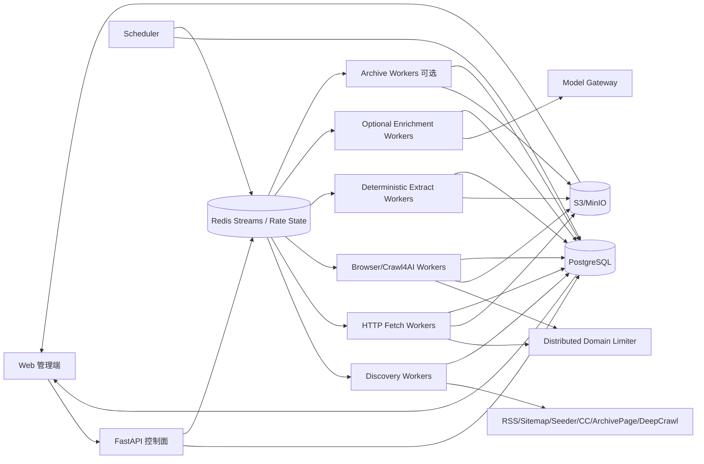

# 博客知识库技术方案

版本：v2.1  
日期：2026-08-14  
适用范围：约 1000 个技术博客站点的全量历史采集、Markdown 清洗、持续扩站、增量同步与 Web 管理；架构可继续横向扩展到数百万 URL。

## 1. 目标与边界

### 1.1 核心目标

1. 首次接入站点时，尽可能完整发现并抓取当前仍可访问的历史文章。
2. 将标题、作者、发布时间、更新时间、标签、canonical URL、正文统一清洗为稳定 Markdown。
3. 支持约 1000 个站点长期运行，并允许持续增加站点，不依赖为每个站点维护独立爬虫主流程。
4. 支持增量同步，只处理新增或确实变化的文章，避免周期性全站强刷。
5. 支持失败隔离、域级限流、断点续跑、幂等、去重、版本保留、规则回滚和离线重新抽取。
6. 提供 Web 管理端完成站点接入、URL 发现预览、规则编辑、任务触发、运行状态、错误诊断、Markdown 预览、版本 diff 和可选结构化数据抽取。
7. 首次历史回灌和日常增量使用同一套数据模型和状态机。

### 1.2 “全量历史”的定义

- **Live Full**：目标站当前可通过 Sitemap、Feed、归档页、站内链接或公开索引发现且仍可访问的历史文章。
- **Archive Full（可选）**：在 Live Full 基础上，通过 Common Crawl / Wayback 等历史索引发现已删除、迁移或不再从当前站点暴露的 URL，并在 robots、版权、许可证和服务条款允许的前提下恢复历史快照。

必须区分“发现过历史 URL”和“已经获得历史正文”。历史索引发现 URL 不等于已经获得可用正文。

### 1.3 非目标

- 不绕过登录、付费墙、验证码或明确访问限制。
- 不默认所有站点都使用浏览器渲染；静态 HTTP 能解决时优先低成本快路径。
- 不把 LLM 作为正文清洗主路径，也不允许 LLM 自动改写原文。
- 向量库/RAG 不作为采集一期强依赖，但数据模型预留索引、chunk 和版本字段。

## 2. 设计原则

1. **Discovery、Fetch、Extract、Enrich 解耦**：发现 URL、下载原始内容、生成 Markdown、可选语义结构化是四个独立阶段。
2. **PostgreSQL 是业务状态真相源**：Redis、Crawl4AI 本地缓存和浏览器状态都只承担性能或分发职责。
3. **端到端流式与分批**：禁止把几十万 URL 或抓取结果一次性积在进程内存。
4. **跨域并发、域内克制**：不同站点可并行，同域默认低并发并动态退避。
5. **HTTP 优先，Browser 升级**：浏览器只处理确实依赖 JavaScript 的页面。
6. **原始快照优先保留**：规则变化后从 raw HTML 离线重抽，不重新访问源站。
7. **规则、Schema、Canonicalizer 都必须版本化**。
8. **增量从发现阶段开始**：优先利用 Feed/Sitemap/HTTP Validator 减少需要访问的 URL。
9. **外部能力 Provider/Adapter 化**：Crawl4AI、Common Crawl、Wayback、LLM Provider 均可替换。
10. **控制面不执行重任务**：Web/API 只创建 durable job；爬取、浏览器和 LLM 均由 worker 异步执行。
11. **LLM 是可选增强层，不是正确性依赖**：正文 Markdown 在没有 LLM 的情况下也必须可完整生产。

## 3. 总体架构



系统分为五个平面：

- **控制面**：站点、规则、计划、人工操作、发布、回滚和预算。
- **发现面**：RSS、Sitemap、AsyncUrlSeeder、Common Crawl、归档页、受限 deep crawl。
- **数据面**：HTTP/Browser 下载、raw 存储、确定性正文抽取、Markdown 版本。
- **增强面（可选）**：结构化字段抽取、元数据补全、内容分类等语义任务。
- **协调面**：任务队列、lease、domain limiter、重试、优先级、backpressure。

## 4. 技术栈

| 层 | 推荐 | 说明 |
|---|---|---|
| API / 管理后端 | Python + FastAPI | 控制面只创建/查询任务，不同步执行爬取 |
| Web | React / Next.js | 规则编辑、日志、diff、Schema 编辑和预览 |
| 状态/元数据 | PostgreSQL | 事务、唯一约束、批量 UPSERT、lease、审计 |
| 工作队列 | Redis Streams + Consumer Group | pending/reclaim、水平扩容、优先级分流 |
| 分布式限流 | Redis token bucket / next_allowed_at + Lua | 多 worker 对同一域共享速率和并发限制 |
| HTTP 抓取 | httpx / aiohttp | 长连接、HTTP Validator、低资源成本 |
| Browser | Crawl4AI / Playwright | 动态页面和特殊交互 |
| Discovery | 自建 Provider + Crawl4AI AsyncUrlSeeder + Sitemap/CC Provider | 业务 checkpoint 独立 |
| Markdown | Crawl4AI Markdown Generator + 自定义规范化 | 确定性清洗 |
| 可选语义增强 | Model Gateway（可接 LiteLLM 等）+ JSON Schema/Pydantic | 严格结构化输出，多模型可替换 |
| 对象存储 | S3 / MinIO | raw HTML、Markdown、附件、历史版本 |
| 监控 | Prometheus + Grafana + OpenTelemetry | 指标、日志和链路追踪 |
| 部署 | Docker Compose 起步，Kubernetes 按需 | 1000 站点无需一开始上 K8s |

Markdown 正文不建议逐篇直接提交 GitHub 作为主存储；GitHub 适合保存方案、配置模板和规则代码。正文主存储使用 S3/MinIO 或独立内容仓库。

## 5. 站点生命周期与配置模型

### 5.1 生命周期

```text
draft -> probing -> validated -> backfilling -> active
                   \-> rejected
active -> degraded -> active
active -> disabled
```

### 5.2 站点配置示例

```yaml
site_id: example
name: Example Blog
base_url: https://example.com
enabled: true
schedule: "0 */6 * * *"
robots_policy: respect

allowed_hosts:
  - example.com
  - www.example.com

limits:
  domain_concurrency: 1
  min_delay_ms: 1000
  max_delay_ms: 3000
  request_timeout_s: 30
  sitemap_concurrency: 4

incremental:
  lookback_days: 7
  reconciliation_days: 7

discovery:
  strategies: [rss, sitemap, seeder, commoncrawl, archive_pages, deep_crawl]
  include_patterns: ["/blog/**"]
  exclude_patterns: ["/tag/**", "/search**"]
  max_preview_urls: 200

fetch:
  prefer_http: true
  browser_fallback: true
  wait_for: null
  block_resource_types: [media, font]

extract:
  strategy: auto
  article_selector: null
  title_selector: null
  author_selector: null
  date_selector: null
  remove_selectors: [nav, footer, aside, .comments]

identity:
  canonical_from_html: true
  query_whitelist: []
  trailing_slash_policy: normalize

enrichment:
  enabled: false
  schema_version: null
  policy: metadata_fallback_only
  max_input_chars: 60000
  max_cost_per_article_usd: 0.02
```

### 5.3 接入层级

1. **零代码通用模式**：RSS/Sitemap + 自动正文抽取。
2. **声明式模式**：CSS/XPath、分页、等待条件、路径规则。
3. **Adapter 插件模式**：复杂 API、特殊分页、JS URL、自定义 canonical。

```python
class SiteAdapter(Protocol):
    async def discover(self, ctx) -> AsyncIterator[DiscoveredUrl]: ...
    async def prepare_request(self, url, ctx) -> FetchRequest: ...
    async def extract(self, snapshot, ctx) -> ArticleDocument: ...
    def canonicalize(self, url, html, ctx) -> CanonicalResult: ...
```

### 5.4 规则发布

```text
draft -> testing -> published -> superseded
                  \-> rejected
published -> rollback_to_previous
```

发布前对 3~5 个 golden URL 回放 raw HTML，检查标题、正文长度、代码块、链接、日期、图片数量和 Markdown diff；通过后原子切换 active rule。

## 6. Discovery：全量历史 URL 发现

### 6.1 Provider 抽象

```python
class DiscoveryProvider(Protocol):
    async def scan(
        self,
        site: Site,
        checkpoint: DiscoveryCheckpoint | None,
    ) -> AsyncIterator[DiscoveredUrl]: ...
```

统一输出至少包括：`site_id`、`url`、`discovery_source`、`source_locator`、`source_lastmod`、`source_published_at`、`source_cursor`、`confidence`、`discovered_at`。

Provider 每产生一小批 URL 就批量 UPSERT `url_frontier`，不等待整个站点扫描结束。

### 6.2 RSS / Atom / JSON Feed

日常增量最快信号。保存 entry GUID/id、published/updated、Feed ETag、Last-Modified、body hash 和最近成功扫描时间。Feed 通常只保留最近 N 篇，不能独立承担首次全历史。

### 6.3 Sitemap / Sitemap Index

Live Full 主力：

- 从 robots.txt、`/sitemap.xml`、`/sitemap_index.xml` 和自定义入口发现。
- 支持 sitemap index、嵌套 sitemap 和 `.gz`。
- XML 流式解析。
- 子 sitemap 有界并发，默认 2~4。
- 每个 sitemap 独立记录 ETag、Last-Modified、body hash、lastmod、扫描时间。
- 条目 `lastmod` 只作为变化信号之一。
- 业务 checkpoint 必须落 PostgreSQL。

### 6.4 Crawl4AI AsyncUrlSeeder 的使用位置

适用于：新站探测、中小站 Sitemap+Common Crawl 候选发现、Web URL 预览和少量歧义 URL 的 metadata 预筛。

不把 Seeder 当业务 Frontier：

1. 大结果集最终仍可能聚合在进程内。
2. `max_urls` 是截断，不是可靠可恢复分页。
3. 本地 cache 不能承担跨 worker checkpoint。
4. 不对 1000 域一次性 `gather`。
5. `extract_head=True` 会产生额外网络成本，默认关闭。
6. HEAD 失败不能直接判死。
7. 工具级 semaphore 不能替代集群级 QPS 限流。

### 6.5 Common Crawl Provider

用于首次回灌和补漏，不作为高频增量信号：

- 按 index/cursor 流式读取。
- 每 500~2000 条批量 UPSERT Frontier。
- 记录 CC index id 和 scan checkpoint。
- 写入前再次执行 allowed host、scheme、port、path、query、SSRF 校验。

### 6.6 归档页与 Deep Crawl

归档页 Provider 处理年份/月度归档、分页、分类页，并保存分页 cursor。

Deep Crawl 只做最后补漏：限同域、限深度、限 URL 数、限 query 参数、排除搜索/登录/日历/标签组合等无限空间。

### 6.7 Archive Backfill（可选）

通过 Wayback/CC 获取历史 URL + snapshot timestamp；live 404/410/迁移且来源许可时读取历史快照。Live 与 Archive 不 silent merge，必须保存 `source_kind`、`snapshot_at`、`source_archive_url`。

### 6.8 Discovery 完成语义

```text
queued -> running -> completed
                  -> partial
                  -> failed
```

命中无 checkpoint 截断、sitemap 子文件失败、CC cursor 未到终点、deep crawl 达到预算等情况只能标记 `partial`。

## 7. Discovery Checkpoint 与 URL Frontier

`discovery_checkpoints` 按 `(site_id, provider, source_locator)` 保存：

- ETag、Last-Modified、body hash。
- last_seen_guid / published_at。
- sitemap_lastmod。
- cursor / CC index id。
- last_success_at / last_full_completed_at。
- provider_version。

`url_frontier` 至少保存：

- `site_id`、`normalized_url`、`original_url`。
- `url_kind`、`discovery_source`、`source_lastmod`、`priority`。
- `crawl_state`、`next_fetch_at`、`last_fetch_at`。
- ETag、Last-Modified、raw/content hash。
- retry、lease、canonicalizer_version。

唯一约束：

```text
(site_id, normalized_url)
```

Frontier 是真实状态源；Redis 消息可以丢失并由数据库重建。

## 8. 调度、队列、Lease 与优先级

Redis Streams 使用 Consumer Group，采用 at-least-once；正确性来自 DB lease、唯一约束、幂等键、pending reclaim 和成功持久化后 ACK。

建议多级 Stream：

```text
crawl:incremental
crawl:manual
crawl:retry
crawl:backfill
crawl:archive
enrich:normal
enrich:retry
```

Scheduler 每次只 lease 1000~5000 条近期任务，不把整个 Frontier 塞进 Redis。

历史回灌设置最低配额，避免被增量任务永久饿死。

## 9. 分布式域级限流

集群级 Redis Domain Limiter 是权威限制，至少保存：

```text
rate:{domain}:concurrency_current
rate:{domain}:concurrency_limit
rate:{domain}:next_allowed_at
rate:{domain}:penalty_until
rate:{domain}:tokens
```

Lua 原子完成 cooldown、并发额度、token/间隔检查和带 TTL 的 lease token 发放。

worker 内的 HTTP connection limit、Browser slot、Crawl4AI dispatcher/semaphore 只保护本机资源，不能当成严格 QPS。

退避策略：429 尊重 `Retry-After`；503 指数退避+jitter；403 不盲目重试；连续 timeout 自动降并发；连续成功后缓慢恢复。

## 10. Fetch：HTTP 快路径 + Browser 升级

### 10.1 HTTP 快路径

使用长生命周期 `httpx.AsyncClient`：

- 连接池复用。
- 超时和最大响应体限制。
- Redirect chain 记录。
- `If-None-Match` / ETag。
- `If-Modified-Since` / Last-Modified。
- 304 直接标记 unchanged，不进入 Extract。

HEAD 只用于探测；403/405/异常需要 GET fallback，连续多轮 404/410 后才进入 `source_deleted`。

### 10.2 Browser 升级

仅当初始 HTML 是 CSR shell、正文依赖 JS、需要点击/滚动/等待 selector 或服务端 HTML 明显不完整时升级 Crawl4AI/Playwright。

**禁止一个 URL 启一个浏览器进程。** Browser worker 使用长生命周期浏览器/Context 池和固定 slot。

### 10.3 异步执行模型

单用户工具里常见的“同步 Web 请求 -> `ThreadPoolExecutor` -> `asyncio.run()` -> 每请求创建 AsyncWebCrawler”桥接方式不适用于本系统。它会造成：

- 每请求创建线程和事件循环。
- 浏览器启动/销毁成本放大。
- FastAPI/WSGI thread pool 被长任务占满。
- 无法统一域级限流、backpressure、任务恢复和资源配额。

生产规则：

1. FastAPI 控制面只写 job/task 并立即返回 `job_id`。
2. Browser worker 进程拥有固定、长生命周期 asyncio event loop。
3. 每个 Browser worker 在进程生命周期内复用 `AsyncWebCrawler`/Playwright browser。
4. 同步第三方 SDK 如必须调用，使用受控 executor，但不能每 URL 创建独立 executor。
5. worker shutdown 时统一 drain、ACK/释放 lease、关闭 browser/context。

## 11. Fetch 与 Extract 强制解耦

Fetch 只负责下载、status/header/final URL/redirect chain、raw HTML、raw hash。

Extract 只负责从指定 raw snapshot 生成 Markdown、质量检查和文章版本。规则变化时批量 re-extract，不重新访问源站。

## 12. 确定性正文抽取与 Markdown

抽取顺序：

1. 站点专用 `article_selector`。
2. 语义 HTML `article` / `main`。
3. JSON-LD `Article` / `BlogPosting` 元数据。
4. Crawl4AI Markdown Generator。
5. `PruningContentFilter` / 自定义规则移除导航、页脚、相关推荐和高 link-density 噪声。
6. 特殊 Adapter。

Markdown Front Matter 示例：

```markdown
---
site_id: example
canonical_url: https://example.com/posts/123
source_url: https://example.com/posts/123?utm_source=x
title: Example
published_at: 2024-05-01T10:00:00Z
updated_at: 2024-05-02T10:00:00Z
fetched_at: 2026-08-14T09:00:00Z
author: Alice
tags: [python, crawler]
content_hash: sha256:...
extractor_version: 3
rule_version: 7
source_kind: live
version: 2
---

# Example

正文……
```

规范：一个一级标题；代码块保留语言；图片/内链绝对化；复杂表格允许 HTML；UTF-8+LF；不使用 LLM 自动改写正文。

## 13. 可选结构化语义增强层

该层用于**元数据难以确定、用户自定义字段、内容分类、知识库标签**等任务，不参与基础 Markdown 正确性。

### 13.1 Schema 驱动

Web 可定义并版本化 Schema：

```yaml
schema_name: article_metadata
version: 4
fields:
  - name: author
    type: string
    nullable: true
  - name: published_at
    type: datetime
    nullable: true
  - name: technologies
    type: list[string]
    nullable: true
```

Schema 编译为 Pydantic/JSON Schema，Model Gateway 使用原生 structured output / strict JSON schema。不要依赖“请只返回 JSON”+正则修复的脆弱方式。

### 13.2 数据语义

**未知值必须是 `null`，不能自动填充 `0`、`false`、空字符串来伪装成已知值。** 每个字段可保存：

- `value`
- `source = deterministic | llm`
- `confidence`
- `evidence_span` 或 source selector
- `schema_version`
- `model_policy_version`

确定性 JSON-LD/CSS 抽取结果优先；只有缺失/冲突字段才进入 LLM fallback。

### 13.3 输入控制

不把整篇原始 HTML 无条件发送给模型。顺序：

1. 先使用已清洗 Markdown。
2. 只保留与 Schema 相关的候选区域。
3. 超长文档分块并先局部抽取，再确定性 merge。
4. 设置每篇最大输入 token/字符和最大成本。
5. 对重复 `content_hash + schema_version + model_policy_version` 直接命中缓存。

### 13.4 Model Gateway

通过统一接口隔离具体厂商：

```python
class ModelGateway(Protocol):
    async def extract_structured(
        self,
        content: str,
        schema: dict,
        policy: ModelPolicy,
    ) -> StructuredResult: ...
```

可接 LiteLLM 或直接 SDK，实现多 Provider、超时、速率限制、预算、审计和 fallback。

### 13.5 重试策略

禁止对所有 `Exception` 无差别重试：

- timeout、连接错误、429、5xx：可指数退避重试。
- 认证失败、无效 schema、权限错误：立即失败，等待配置修复。
- context overflow：转 chunking/缩减输入，不重复原请求。
- structured validation 失败：允许有限次数重新请求或切换兼容模型。
- 达到文章/站点/日预算：进入 `budget_blocked`，不重试。

### 13.6 版本和幂等

```text
enrichment_key = article_version_id
               + schema_version
               + model_policy_version
               + input_content_hash
```

结果写 `article_enrichments`，因此模型、Schema 或策略升级后可离线 re-enrich，不需要 refetch。

## 14. URL 归一化、文章身份与去重

URL 归一化：绝对化、host 小写、移除默认端口和 fragment、删除跟踪参数、站点级尾斜杠策略、query 白名单、校验 canonical allowed host、保存 redirect chain、canonicalizer 版本化。

```text
article_key = sha256(site_id + canonical_url)
```

同时维护：

- `raw_hash`：原始响应内容。
- `body_text_hash`：规范化正文。
- `simhash/minhash`：可选，用于镜像/跨 URL 重复候选。

不同 URL 高相似只进入 duplicate candidate，不自动物理删除。

## 15. 增量同步

信号优先级：

1. RSS/Atom 新 GUID。
2. Sitemap 新 URL / lastmod / sitemap hash。
3. 归档/列表页前 N 页 + watermark。
4. HTTP Validator。
5. 内容 hash。
6. 低频 reconciliation。

每站保存 3~14 天 lookback。Sitemap 优先 conditional GET，body hash 不变时跳过展开；Common Crawl 按周/月或人工触发补漏。

404/410 不立即删除；多轮确认后标记 `source_deleted_at`；301/308 维护 redirect/canonical 关系，历史版本始终保留。

## 16. 数据模型

### 16.1 站点与规则

- `sites`：生命周期、调度、robots、限流、active rule。
- `site_hosts`：允许 host 与限流覆盖值。
- `site_rule_versions`：Discovery/Extract/Canonical 规则版本。
- `golden_urls`：回归样本和期望字段。

### 16.2 Discovery / Frontier

- `discovery_sources`
- `discovery_runs`
- `discovery_checkpoints`
- `url_frontier`

### 16.3 任务与快照

- `crawl_jobs`
- `crawl_tasks`
- `fetch_snapshots`

### 16.4 内容

- `articles`
- `article_versions`
- `duplicate_candidates`
- `site_health_events`

### 16.5 可选语义增强

- `enrichment_schema_versions`：Schema JSON、状态、发布时间。
- `model_policies`：Provider/model、预算、超时、fallback、prompt/version。
- `article_enrichments`：article_version、schema/model policy、结果 JSON、token、cost、状态、错误。
- `field_provenance`：字段来源、evidence、confidence。

## 17. 对象存储布局

```text
kb/
  raw/{site_id}/{yyyy}/{mm}/{article_key}/{fetch_id}.html.gz
  md/{site_id}/{yyyy}/{mm}/{article_key}/v{n}.md
  assets/{site_id}/{article_key}/...
  archive/{site_id}/{article_key}/{snapshot_at}/...
  enrich/{site_id}/{article_key}/{article_version}/{schema_version}.json
```

PostgreSQL 存状态、索引和小型元数据；大 HTML/Markdown 放对象存储。

## 18. Web 管理功能

### 18.1 站点接入向导

展示 robots、Feed/Sitemap、URL path 分布、HTTP/Browser 判定、各 Discovery 来源抽样数量、Sitemap/CC 重叠率、文章候选比例和 golden URL 候选。

### 18.2 Discovery 管理

查看每个 Provider 的 run、checkpoint、new/unique URL、coverage、partial/failed 原因；明确区分预览与完整回灌。

### 18.3 规则管理

支持 Discovery / Extract / Canonical rules、raw HTML 回放、Markdown 预览、golden 批测、diff、publish/rollback。

### 18.4 任务管理

支持全量、增量、暂停/恢复、单站/单文章重试、re-extract without refetch、Archive Backfill、dead-letter replay。

### 18.5 可选 Schema / Enrichment 管理

- Schema 字段编辑器与版本。
- 对历史 Markdown 样本做 structured-output 预览。
- deterministic 与 LLM 结果 diff。
- token/cost 预估。
- Provider/model policy 切换。
- 单篇/批量 re-enrich。
- 字段 provenance 和 evidence 查看。

### 18.6 内容管理

raw HTML / Markdown 对照、Front Matter、历史版本 diff、canonical/redirect、duplicate candidates、live/archive 来源标记。

## 19. 质量控制

自动门槛：

- 标题为空、正文过短、link density 过高。
- 一批文章正文 hash 相同，疑似登录页/风控页/SPA shell。
- HTTP 200 但内容为 404/Access Denied。
- 新规则导致正文长度、代码块数量或 hash 分布突变。
- 发布时间解析异常。

Enrichment 额外门槛：

- structured validation pass rate。
- null ratio 突增。
- deterministic 与 LLM 冲突率。
- 单文 token/cost 异常。
- 相同 content hash 得到非确定性大幅差异时进入人工审核。

## 20. 重试、幂等与 Dead Letter

错误分类：

- 可自动重试：timeout、connection reset、429、502/503/504、临时 browser crash。
- 条件重试：403、401、soft block、大面积 selector fail。
- 不自动重试：robots 禁止、非法 URL、host 不在 allowlist、永久配置错误。

```text
idempotency_key = task_type + site_id + normalized_url + input_snapshot + rule_version
```

所有写入使用唯一约束/UPSERT。超过最大重试进入 dead-letter，Web 支持按站点和错误类型 replay。

## 21. 安全、robots 与合规

- 默认遵守 robots.txt。
- 明确 User-Agent 与联系信息。
- 不绕过认证、验证码、付费墙。
- SSRF：拒绝 localhost、RFC1918、link-local、metadata IP；DNS 和每次 redirect 后重复校验。
- Browser 请求限制在 allowed host，并屏蔽无关资源。
- Secret/代理/cookie/API key 只保存 Secret Manager 引用，不进入任务明文日志。
- 外部历史索引发现 admin/staging/API 不代表允许抓取。
- 保存 source URL、fetched_at、source_kind 和版权/许可证元数据。
- 向第三方 LLM 发送内容前支持站点级 `allow_external_enrichment` 开关与数据出境策略。

## 22. 可观测性与成本

### 22.1 采集指标

- discovery URLs/s、Frontier upsert rate。
- fetch/extract success rate。
- queue lag、pending/reclaimed。
- P50/P95 fetch latency。
- Browser usage ratio、304 ratio、bytes downloaded。
- raw -> md processing lag。
- 429/403、penalty/cooldown、golden pass rate。

### 22.2 Enrichment 指标

- 请求数、成功率、validation failure rate。
- input/output tokens。
- cost/article、cost/site、cost/day。
- cache hit ratio。
- retry/fallback/model switch 数。
- budget_blocked 数。
- deterministic-vs-LLM conflict ratio。

所有 job/task 贯穿 `trace_id`，Web 可从文章版本追溯 Discovery -> Fetch -> Extract -> Enrich 全链路。

## 23. 容量与背压

假设 1000 站点、平均 500 篇历史文章约 50 万篇，真实规模可达数百万 URL。

初始部署建议：

- API x1
- Scheduler x1
- Discovery worker x2
- HTTP fetch worker x4
- Browser worker x2
- Extract worker x2
- Enrichment worker x0~2（默认可关闭）
- Archive worker x0~1
- PostgreSQL x1
- Redis x1
- MinIO x1

初始限制：domain concurrency=1；domain delay=1~3 秒；Sitemap 子并发 2~4；HTTP 每进程 20~50 slot；Browser 每进程 4~8 slot；Frontier lease 1000~5000；Discovery UPSERT 500~2000/批。

背压规则：

- Extract lag 过大 -> Fetch 降速。
- S3 异常 -> 暂停新 Fetch lease。
- Browser 内存高 -> 降 Browser slot。
- Redis Stream 超阈值 -> Scheduler 减 dispatch。
- PG 写入延迟高 -> Discovery 降速。
- Enrichment backlog/cost 过高 -> 只保留高优先级或 deterministic-missing 任务，不影响 Markdown 主链路。

## 24. 模板变化策略

检测 golden URL、selector 空值率、Markdown 长度分布、同站多文章相似度、Browser fallback 比例。

处理：自动 degraded -> 降速 -> Web diff raw -> 创建新 rule draft -> 历史 raw 离线调试 -> golden test -> publish -> 批量 re-extract。

## 25. 关键伪代码

### 25.1 Discovery Worker

```python
async def run_discovery(site, provider):
    checkpoint = await load_checkpoint(site.id, provider.name)
    run = await create_discovery_run(site.id, provider.name)
    batch = []
    try:
        async for item in provider.scan(site, checkpoint):
            normalized = canonicalize_candidate(item.url, site)
            if not is_allowed_candidate(normalized, site):
                continue
            batch.append(frontier_row(site, normalized, item))
            if len(batch) >= 1000:
                await bulk_upsert_frontier(batch)
                batch.clear()
                await persist_checkpoint(run, item.source_cursor)
        if batch:
            await bulk_upsert_frontier(batch)
        await mark_discovery_completed(run)
    except ProviderTruncated as e:
        await mark_discovery_partial(run, reason=str(e))
    except Exception:
        await mark_discovery_failed(run)
        raise
```

### 25.2 API 创建任务

```python
@app.post("/sites/{site_id}/sync")
async def create_sync(site_id: str, mode: str):
    job = await db.create_job(site_id=site_id, mode=mode)
    await redis.xadd("crawl:manual", {"job_id": job.id})
    return {"job_id": job.id, "status": "queued"}
```

API 不调用 `asyncio.run()`、不启动浏览器、不等待整批抓取完成。

### 25.3 Browser Worker 生命周期

```python
async def browser_worker():
    async with AsyncWebCrawler(config=browser_config) as crawler:
        while task := await next_task():
            async with browser_slot:
                result = await crawler.arun(task.url, config=run_config(task))
                await persist_result(task, result)
```

### 25.4 Extract Worker

```python
async def extract_worker(task, raw_key, rule_version):
    raw = await object_store.get(raw_key)
    doc = await extract_to_markdown(raw, rule_version)
    normalized = normalize_document(doc)
    h = sha256(normalized.body)
    if h == task.previous_content_hash:
        return await mark_unchanged(task)
    md_key = await save_markdown_version(normalized)
    await upsert_article_version(task, normalized, h, md_key, rule_version)
```

### 25.5 Enrichment Worker

```python
async def enrichment_worker(task):
    article = await load_article_version(task.article_version_id)
    schema = await load_schema(task.schema_version)
    policy = await load_model_policy(task.model_policy_version)

    deterministic = await deterministic_metadata(article)
    missing = fields_needing_fallback(deterministic, schema)
    if not missing:
        return await save_enrichment(deterministic)

    content = build_bounded_context(article.markdown, missing, policy)
    if await budget_exceeded(article.site_id, content, policy):
        return await mark_budget_blocked(task)

    result = await model_gateway.extract_structured(content, subset(schema, missing), policy)
    merged = merge_with_provenance(deterministic, result)
    await validate_and_save_enrichment(task, merged)
```

## 26. 分阶段实施

### Phase 1：MVP（20~50 站点）

- sites/frontier/articles/article_versions。
- RSS + Sitemap Provider。
- HTTP fast path + Browser fallback。
- raw HTML + Markdown 对象存储。
- Redis Streams + DB lease + 幂等。
- Web CRUD、任务和错误列表。
- 增量 checkpoint。

### Phase 2：扩到 1000 站点

- AsyncUrlSeeder Provider。
- Common Crawl 流式 Provider。
- 归档页 / 受限 deep crawl。
- 分布式 Domain Limiter。
- 多 Stream 优先级。
- 完整 Discovery run/checkpoint。
- 规则版本和 golden URL 回归。
- Browser worker 长生命周期 event loop / crawler pool。
- 自动 degraded 与监控。

### Phase 3：语义增强与极致历史覆盖

- Archive Backfill。
- Schema 驱动 structured enrichment。
- Model Gateway、多 Provider、预算/缓存/字段 provenance。
- 自动模板变化检测。
- duplicate/mirror 聚类。
- 全文/向量索引、chunk/version/reference 追踪。

## 27. 验收标准

### 功能

- 新增站点不改核心控制流；普通技术博客大部分可通过通用/声明式模式接入。
- 单站首次全量可中断后继续，不从头扫描。
- 日常增量无需全站重抓。
- 规则修改可在历史 raw 上重抽 Markdown。
- Web 能定位 Discovery / Fetch / Extract / Enrich 哪一层失败。

### 正确性

- Frontier 无重复逻辑 URL。
- 重复 Redis 消息不生成重复文章版本。
- Provider 未完成或截断不误标 completed。
- HEAD 失败不直接误判 source_deleted。
- worker 重启后 checkpoint 和任务可恢复。
- 没有 LLM 仍可完整生成 Markdown 知识库。
- LLM 未知字段不会被 0/false/空字符串伪装为真实值。

### 性能与资源

- Discovery、Fetch、Extract 全部按批流式处理。
- 单进程内存不随全站 URL 总量线性增长。
- 同域并发由集群级 limiter 控制。
- Browser 只处理 HTTP 快路径无法完成的页面。
- Web 请求不会长时间持有浏览器或同步等待爬取任务。
- Enrichment 有 token/cost 上限且可整体关闭，不阻塞主链路。

## 28. 参考资料

- Crawl4AI：https://github.com/unclecode/crawl4ai
- Crawl4AI URL Seeding：https://docs.crawl4ai.com/core/url-seeding/
- Crawl4AI Multi-URL Crawling：https://docs.crawl4ai.com/advanced/multi-url-crawling/
- Common Crawl Index：https://index.commoncrawl.org/
- Rebuilding My LLM Web Scraper Two Years Later: What Actually Changed：https://medium.com/@ignacio.cplatas/rebuilding-my-llm-web-scraper-two-years-later-what-actually-changed-8dd2f6d0645d
- NachoCP/AIScraping：https://github.com/NachoCP/AIScraping

## 29. 最终架构摘要

最终采用：**站点生命周期/规则中心 + Provider 化多源 Discovery + 持久化 Checkpoint + PostgreSQL Frontier + Redis Streams + 分布式 Domain Limiter + HTTP/Browser 双路径 + 长生命周期异步 Browser Worker + Fetch/Extract 解耦 + Raw/Markdown 对象存储 + 增量 Validator + 规则版本/回归/回滚 + Web 控制面 + 可选 Schema 驱动结构化语义增强层**。

Crawl4AI AsyncUrlSeeder 负责高效候选发现和接入探测，不承担业务 Frontier、跨 worker checkpoint 或集群级限流。Crawl4AI Browser Worker 不通过 Web 请求内的 `ThreadPoolExecutor + asyncio.run()` 按 URL 临时启动，而是在独立 worker 的固定事件循环中长期复用浏览器资源。

LLM structured output 仅用于确定性规则无法可靠获得的结构化字段或可选语义能力，并通过 Schema 版本、Model Gateway、严格类型验证、字段 provenance、分类重试、缓存和预算控制实现可替换、可审计、可重放；无 LLM 时主 Markdown 知识库链路仍然完整成立。