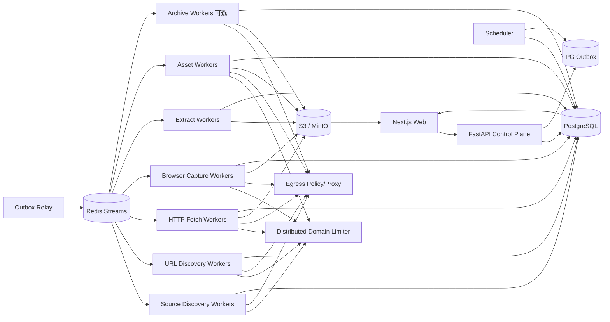

# 博客知识库技术方案

适用范围：约 1000 个技术博客网站的全量历史文章采集、Markdown 清洗、持续扩站、增量同步和 Web 管理；设计目标是继续扩展到更多站点、数百万 URL，并能稳定运行多年。

## 1. 目标与边界

### 1.1 核心目标

1. 新站接入后尽可能完整发现当前仍可访问的历史文章，并可选用公共历史索引补充已经删除、迁移或站内不再暴露的 URL 证据。
2. 将标题、作者、发布时间、更新时间、标签、canonical URL、正文、链接、代码块、表格、图片和附件统一清洗为稳定 Markdown。
3. 普通博客不编写独立爬虫；站点差异优先通过声明式规则和 Provider/Adapter 处理。
4. 支持长期增量同步，仅处理新增、变化、删除确认、失败重试、低频 reconciliation 和规则重抽。
5. 支持断点续跑、幂等、去重、版本保留、失败隔离、离线 re-extract、回滚和 durable cancel。
6. 提供 Web 管理端完成站点接入、范围确认、规则编辑、任务触发、进度监控、错误诊断、Markdown 预览、版本 diff、抽取质量、安全和预算管理。
7. 首次历史回灌和日常增量使用同一套数据模型、任务系统、状态机和可观测体系。
8. Sitemap、Feed、robots.txt、HTML、redirect、canonical、`<base href>`、媒体和第三方抓取结果全部视为不可信输入。
9. LLM 仅作为可选规则生成、失败诊断和人工 review 助手；不自动改写原文，不作为基础 Markdown 正确性的唯一来源。

### 1.2 “全量历史”的定义

- **Live Full**：通过 Feed、Sitemap、归档页、站内链接和公开索引能够发现，且当前仍可访问的文章。
- **Archive Full（可选）**：在合规前提下，通过 Common Crawl、Wayback 等公共历史索引补充当前站点不再提供的 URL/快照证据。

必须分别统计：发现过多少 URL、当前可访问多少、成功得到正文多少、只有历史索引证据多少，不能用单一“抓取完成率”混淆不同口径。

### 1.3 非目标

- 不绕过登录、付费墙、验证码或明确禁止的访问控制。
- 不默认所有页面都用 Browser；HTTP 能完成时优先低成本路径。
- 不把 Redis、本地 crawler cache、CLI 输出目录或进程内 URL list 当业务真相源。
- 不把 GitHub 当海量正文主存储；GitHub 只保存方案、规则、配置和少量导出。
- 向量库/RAG 不作为采集一期强依赖，但数据模型预留 article/version/chunk/reference。

## 2. 设计原则

1. **Source Discovery、URL Discovery、Fetch、Capture、Extract、Quality Gate、Asset、Publish 解耦**。
2. **PostgreSQL 是业务状态真相源**；Redis 只承担队列、限流和短期协调。
3. **端到端流式和分批**；不把几十万 URL、超大 Sitemap、响应体或媒体一次性装入内存。
4. **跨域并行、域内克制**；同一域所有 HTTP、Browser、Sitemap、Feed 和媒体访问共享严格限流。
5. **HTTP 优先，Browser 按原因升级**；抽取算法失败不等于页面需要 Browser。
6. **不可变抓取快照优先保留**；规则、抽取器、质量门禁和 Serializer 变化优先离线 replay。
7. **规则、Canonicalizer、Fetcher、Capture Profile、Extractor、Quality Gate、Serializer、Security Policy 全部版本化**。
8. **Provider/Adapter 化**；Crawl4AI、rs-trafilatura、Playwright、Common Crawl、Wayback 都可以替换。
9. **控制面不执行重任务**；Web/API/Cron 只创建 durable job。
10. **所有 URL 入口和 redirect hop 统一经过 EgressPolicy**。
11. **远端输入有硬预算**；bytes、请求次数、递归深度、URL 数、XML element、重定向、Browser 子请求和 wall time 同时受限。
12. **部分成功显式表达**；正文成功、媒体失败或子 Sitemap 失败不能伪装成全成功。
13. **失败请求同样计入限流和预算**。
14. **PG 与队列避免双写窗口**；采用 transactional outbox。
15. **不使用正则作为生产级 HTML/Markdown 结构重写器**；链接、图片、表格、代码块在 DOM/IR/AST 层处理。
16. **第三方库只做 Adapter，不做业务状态中心**。
17. **发现证据和抓取准入分离**；发现 URL/host 不代表允许自动访问。
18. **第三方质量分只是信号**；平台拥有最终 Quality Gate，并基于 golden snapshot 校准。

## 3. 总体架构



系统分为：

- **控制面**：站点、规则、计划、权限、任务、发布、回滚、预算。
- **发现面**：Source Discovery + URL Discovery。
- **采集面**：HTTP Fetch、Browser Capture、Archive Fetch。
- **抽取面**：多 Extractor Adapter、Quality Gate、Article IR、Markdown Serializer。
- **协调面**：Redis Streams、DB lease、outbox、分布式限流、backpressure。
- **治理面**：Egress、SSRF、robots、输入预算、预览隔离、日志脱敏、供应链。

## 4. 推荐技术栈

| 层 | 推荐 | 说明 |
|---|---|---|
| API | Python + FastAPI | 创建/查询/管理任务，不跑长任务 |
| Web | React / Next.js | 站点、规则、任务、diff、质量、安全、预算 |
| 状态 | PostgreSQL | 真相源、事务、唯一约束、lease、outbox、审计 |
| 队列 | Redis Streams + Consumer Group | at-least-once、pending reclaim、水平扩容 |
| 限流 | Redis + Lua | token bucket、并发 lease、Retry-After |
| HTTP | httpx / aiohttp | 手动 redirect、conditional GET、streaming body |
| Browser | Crawl4AI / Playwright | 独立 worker、有限 slot、public-only egress |
| 通用正文抽取 | rs-trafilatura Adapter + Crawl4AI Generic Adapter | 多实现可替换；结果先进入 Quality Gate |
| DOM/IR | lxml/selectolax/BeautifulSoup + 自定义 Article IR | 结构化链接、正文和资源 |
| XML | defusedxml + XMLPullParser/iterparse | 禁止 DTD/entity，流式处理 Sitemap |
| Markdown | 平台 AST/Serializer | 版本化、确定性输出；第三方 Markdown 只作候选/调试 |
| 对象存储 | S3 / MinIO | raw HTML、rendered DOM、候选、Markdown、媒体、导出 |
| 监控 | Prometheus + Grafana + OpenTelemetry | 技术 SLO + 业务质量 |
| 安全扫描 | OSV/pip-audit + Bandit/Semgrep + SBOM | 依赖和供应链 |
| 部署 | Docker Compose 起步，Kubernetes 按瓶颈引入 | 先按 Worker 类型隔离 |

## 5. 核心数据模型

### 5.1 站点、Host 与规则

```text
sites
- id
- name
- base_url
- status(draft/probing/validated/backfilling/active/degraded/disabled)
- robots_policy
- default_schedule
- config_json
- active_rule_version
- created_at / updated_at

site_hosts
- site_id
- host
- status(candidate/approved/rejected/disabled)
- discovered_via
- approved_by / approved_at
- reason

site_rules
- id
- site_id
- version
- status(draft/testing/published/superseded)
- discovery_rule_json
- fetch_rule_json
- capture_rule_json
- extract_rule_json
- quality_rule_json
- identity_rule_json
- asset_rule_json
- metadata_rule_json
- security_rule_json
- created_by / created_at
```

声明式规则支持 include/exclude path、CSS/XPath、归档分页、作者/日期/tag selector、canonical/identity、Browser wait 条件、approved hosts、per-site rate/budget 和 extractor priority。

### 5.2 Discovery Source 与 Checkpoint

```text
discovery_sources
- id
- site_id
- host
- kind(feed/sitemap/archive/deepcrawl/commoncrawl/wayback/homepage/custom)
- normalized_url
- discovered_via
- status(candidate/active/degraded/disabled)
- etag / last_modified
- provider_version
- last_success_at / last_error_at
- error_code

discovery_runs
- id
- site_id
- source_id
- provider
- status(running/completed/partial/budget_exhausted/failed/cancelled)
- checkpoint_before / checkpoint_after
- discovered_count / unique_count / accepted_count / rejected_count
- budget_json
- error_code
- started_at / finished_at

discovery_checkpoints
- site_id
- source_id
- provider
- scope_key
- cursor_json
- etag / last_modified
- collection_id
- last_success_at / last_error_at
```

### 5.3 Frontier 与多来源证据

```text
frontier_urls
- id
- site_id
- normalized_url
- url_hash
- first_seen_at / last_seen_at
- lastmod_hint / pubdate_hint
- priority
- status
- next_fetch_at
- lease_owner / lease_until

frontier_url_sources
- frontier_url_id
- source_id
- provider
- evidence_json
- first_seen_at / last_seen_at
```

约束：`UNIQUE(site_id, url_hash)`；一个 URL 可由 Feed、Sitemap、Common Crawl、Wayback 等多个来源共同证明。

### 5.4 Capture Snapshot

```text
fetch_snapshots
- id
- site_id
- frontier_url_id
- requested_url / final_url
- capture_kind(http/browser/archive)
- status_code
- etag / last_modified
- content_type
- body_sha256
- object_key_http_raw
- object_key_rendered_dom
- capture_profile_version
- fetcher_version
- browser_engine_version
- security_policy_version
- fetched_at
```

Browser 必须区分服务器原始响应和渲染后 DOM，保证离线重抽可复现。

### 5.5 抽取尝试与质量门禁

```text
extraction_attempts
- id
- site_id
- snapshot_id
- extractor_name
- extractor_version
- config_hash
- input_kind(http_raw/rendered_dom/archive)
- page_type
- classification_confidence
- raw_quality_score
- platform_quality_score
- quality_gate_version
- status(pass/fail/fallback/review/rejected_non_article)
- reason_codes_json
- object_key_candidate
- warnings_json
- metrics_json
- created_at
```

第三方 `raw_quality_score` 不直接决定发布；`platform_quality_score` 才是经过版本化规则得到的平台质量结果。

### 5.6 文章与版本

```text
articles
- id
- site_id
- article_key
- accepted_canonical_url
- current_version_id
- status(active/missing_suspected/source_deleted/rejected)
- first_published_at
- last_source_seen_at

article_aliases
- site_id
- alias_url_hash
- article_id
- alias_url
- reason

article_versions
- id
- article_id
- source_snapshot_id
- selected_extraction_attempt_id
- content_sha256
- markdown_sha256
- object_key_md
- extraction_profile_version
- extractor_version
- quality_gate_version
- rule_version
- serializer_version
- metadata_json
- provenance_json
- created_at
```

### 5.7 媒体、任务和 Outbox

```text
asset_blobs(content_sha256 PK, object_key, byte_size, detected_mime, active_content, first_seen_at)
asset_sources(normalized_source_url_hash, source_url, etag, last_modified, content_sha256, last_checked_at)
article_assets(article_version_id, content_sha256, source_url, relation, original_ref)

jobs(id, type, site_id, status, priority, requested_by, budget_json, cancel_requested, ...)
job_items(job_id, item_key, stage, status, attempt, retry_at, lease_owner, lease_until, last_error_code)
error_events(id, job_id, item_key, stage, attempt, error_code, sanitized_message, retryable, occurred_at)
outbox_events(id, aggregate_type, aggregate_id, stream, payload_json, published_at)
audit_logs / security_events
```

API/Scheduler 在同一 PG 事务中写 job/job_item/outbox，relay 再发布到 Redis，避免 DB 和队列双写不一致。

## 6. 站点接入与 Probing

生命周期：

```text
draft -> probing -> validated -> backfilling -> active
                   \-> rejected
active -> degraded -> active
active -> disabled
```

新站 probing 使用小预算：

1. 拉取 robots.txt。
2. 生成 Feed/Sitemap/homepage/archive 候选。
3. 可选使用 DomainMapper 类能力发现 candidate host/source；candidate host 不自动准入。
4. 抽样 20~200 个 URL，统计 path、状态码、content-type、soft-404、页面类型和文章候选比例。
5. HTTP 优先 capture；确有 JS 依赖才 Browser。
6. 对 golden snapshots 运行 shadow extraction，对比 rs-trafilatura、Crawl4AI generic 和站点 selector（若有）。
7. 自动生成 include/exclude、identity/canonical、metadata、extractor priority、quality threshold 候选规则。
8. Web 中人工确认 golden 结果后发布规则，再开始全量 backfill。

接入层级：

1. 零代码通用模式：Feed/Sitemap + 通用 Extractor。
2. 声明式模式：CSS/XPath、分页、路径、canonical、Browser 条件、extractor profile。
3. Adapter 模式：特殊 API、复杂分页、JS 路由或自定义 identity。

## 7. Discovery 设计

### 7.1 Source Discovery 与 URL Discovery 分离

`Source Discovery` 负责找 Feed、Sitemap root、homepage/archive、candidate host 和公共历史索引能力；`URL Discovery` 只从已经批准的 source 流式产出 URL。

统一接口：

```python
class DiscoveryProvider(Protocol):
    async def scan(self, site, source, checkpoint, budget) -> AsyncIterator[DiscoveredUrl]: ...
```

内置：`FeedProvider`、`SitemapProvider`、`ArchivePageProvider`、`DeepCrawlProvider`、`CommonCrawlProvider`、`WaybackProvider`、`HomepageProvider`、`CustomAdapterProvider`。

Crawl4AI `AsyncUrlSeeder` 可作为 Adapter 用于普通站点的 Sitemap/公共索引快速发现，但本地 cache 不作为 durable checkpoint，也不让单进程一次性调度全部 1000 个域。

### 7.2 Admission Pipeline

```text
raw URL
 -> syntax parse
 -> security normalization
 -> Egress precheck
 -> approved host/scope
 -> canonicalizer_version
 -> include/exclude
 -> page/asset heuristic
 -> accepted/rejected + reason
 -> Frontier UPSERT
```

所有 rejection reason 可统计，避免规则错误时静默漏数据。

## 8. Sitemap、Feed 和历史索引

### 8.1 Sitemap

入口取并集：robots.txt 的 `Sitemap:`、常见路径、人工配置、历史成功入口和页面发现入口。

大型 Sitemap 必须流式：

```text
HTTP stream
 -> compressed bytes limiter
 -> bounded decompressor
 -> decoded bytes / compression ratio limiter
 -> secure XMLPullParser
 -> batch UPSERT frontier
 -> checkpoint
```

支持 `<urlset>`、`<sitemapindex>`、namespace、gzip、相对 child URL、嵌套和 cycle 检测。child failure 标记 partial，不丢弃已成功发现 URL。`lastmod` 只是优先级 hint，不是正文变化真值。

硬预算至少包括 compressed/decoded bytes、compression ratio、XML elements、URL 数、child sitemap 数、request count、depth 和 wall time。

### 8.2 Feed

保存 ETag/Last-Modified 和 guid/url/pubdate cursor；新 item 进入高优先级 Frontier。Feed 用于新内容低延迟发现，不承担历史完整性。

### 8.3 Common Crawl / Wayback

按 collection/CDX cursor 做 checkpoint；只有新 collection、首次 backfill 或低频 reconciliation 才重新扫描。公共历史索引产出的 URL 仍经过 scope、Egress 和 Fetch 验证，不把索引记录当当前 canonical 真值。

### 8.4 Homepage / ArchivePage / Deep Crawl

作为 Sitemap/Feed 不完整时的补充，必须设置 max depth、max pages、include/exclude、去重、soft-404、domain limiter 和预算。

## 9. Robots、分布式限流与 Egress

### 9.1 Robots

默认 `robots_policy: respect`。robots.txt 使用 TTL + ETag/Last-Modified 缓存；区分 404、网络失败和解析失败，并提供显式 fail-open/fail-closed 策略。Sitemap 发现和页面抓取准入是两个独立决策。

### 9.2 Domain Limiter

同一域的 Sitemap、Feed、HTTP、Browser 顶层、Browser 子资源和媒体共享总限流。每次网络尝试前获得 token/lease，timeout、404、redirect、失败都消耗机会。

Redis + Lua 实现 token bucket、domain concurrency lease、Retry-After 动态降速和 lease TTL。每站预算与平台总预算叠加。

### 9.3 Egress / SSRF

统一 `EgressPolicy`：

1. 只允许 HTTP/HTTPS。
2. 拒绝 URL userinfo、异常端口、混淆 host。
3. 默认拒绝 localhost、RFC1918、link-local、multicast、reserved、unspecified、cloud metadata、IPv4-mapped IPv6。
4. DNS 解析结果任一地址命中禁止网段则拒绝。
5. HTTP 禁用自动 redirect；每个 hop 重新检查 URL、DNS、approved-host 和 redirect budget。
6. canonical、`<base href>`、Feed、Sitemap、页面、媒体、Browser 子资源都走同一策略。
7. 网络层再用 egress proxy / namespace 做第二道防线；Browser Worker 不用 host network。

## 10. HTTP Fetch 与 Browser Capture

### 10.1 HTTP 快路径

1. Egress + robots + limiter 准入。
2. 带 `If-None-Match` / `If-Modified-Since`。
3. 手动 redirect，逐 hop 校验。
4. streaming body，限制 bytes 和 wall time。
5. 校验 content-type，必要时 sniff。
6. 304 -> unchanged，不 Extract。
7. 200 且 body hash 未变 -> 更新 seen/validator，不创建版本。
8. 变化才保存新 snapshot 并进入 Extract。

404/410 多轮确认后才进入删除状态机。

### 10.2 Browser 升级

Browser 只解决页面渲染问题：CSR shell、正文依赖 JS、需要等待 selector/有限交互或 HTTP snapshot 明显缺正文信号。

**质量失败不能无条件升级 Browser。** 如果 DOM 已完整但抽取结果差，应先切备用 Extractor/selector；只有 Quality Gate 判断“输入缺失/CSR”时才 Browser。

Browser Worker 与 HTTP/Extract Worker 隔离，设置本机硬 slot、page wall-time、总请求数、总字节和子请求预算；默认 block 非必要 font/media；周期重启防内存泄漏。

## 11. 多 Extractor 与 Quality Gate

### 11.1 Adapter 接口

```python
class ExtractorAdapter(Protocol):
    async def extract(self, snapshot: CaptureArtifact, rule: ExtractRule) -> ExtractionCandidate: ...
```

候选至少包含 extractor/version/config hash、input kind、page type、classification confidence、raw quality、正文 text/HTML/blocks、metadata candidates、links/assets、warnings 和 latency。

推荐优先级：

1. `SiteSelectorExtractor`：站点配置了稳定 selector 时优先。
2. `RsTrafilaturaExtractor`：通用 page-type-aware 快速抽取器。
3. `Crawl4AIGenericExtractor`：备用通用实现。
4. 后续其它 Readability/Trafilatura 类实现按 Adapter 增加。

第三方 Extractor 不直接更新 `articles.current_version_id`。

### 11.2 rs-trafilatura 的使用边界

`RsTrafilaturaStrategy` 接收完整 HTML（`input_format="html"`），不应在正文抽取前 chunk。其 async Adapter 内部通过线程执行同步抽取，因此平台必须对 Extract Worker 设置独立 CPU/线程并发，不能把网络 async 并发直接套到抽取阶段。

其 `raw_quality_score` 只作为 Quality Gate 的一个 feature。不能假设第三方某个固定阈值对所有站点都可靠；抽取器版本升级也必须重新 golden regression。

### 11.3 Platform Quality Gate

平台分数综合：

- 正文字数、段落数量；
- heading/list/code/table 保留；
- 导航/cookie/login/版权/推荐等 boilerplate 比例；
- 链接密度；
- 与站点 template fingerprint 的相似度；
- 同站重复正文异常；
- title 与正文一致性；
- page_type 与结构匹配；
- selector 命中；
- extractor warning；
- raw/rendered DOM 是否存在正文信号；
- extractor 原始质量分；
- golden corpus 上对应 extractor/version/page_type 的历史表现。

输出：`pass`、`retry_alternate_extractor`、`need_browser`、`manual_review`、`reject_non_article`，并保存 reason codes。

### 11.4 统一路由

```text
HTTP snapshot
 -> primary extractor
 -> Quality Gate
    -> pass -> Article IR
    -> DOM 完整但抽取差 -> alternate extractor / selector
    -> CSR/DOM 缺失 -> Browser -> 重新抽取
    -> 仍失败 -> manual review
```

LLM 如启用，只做候选判断、selector 建议和失败解释，不自动重写原文。

### 11.5 Shadow Extraction

probing、抽取器升级和规则发布前，在 golden snapshots 上双跑/多跑 Extractor，比较正文覆盖、boilerplate、代码/表格/链接保真、metadata、page_type、耗时和人工正确率。

生产正常流量只跑主 Extractor，质量失败才跑备用，避免永久双跑导致 CPU 成本翻倍。

## 12. Article IR、Metadata 与 Markdown

### 12.1 Article IR

```text
Extraction Candidate
 -> Metadata Candidates
 -> Article IR
 -> URL/base/canonical resolution
 -> asset resolution
 -> normalization
 -> Markdown AST/Serializer
 -> Markdown
```

Article IR 至少包含 title、author、published/updated、tags、canonical candidates + provenance、block nodes、links、assets、code blocks/language、table/list/blockquote。

### 12.2 Metadata Provenance

每个候选记录：

```text
field
value
source_type
source_location
confidence
rule_version
raw_or_normalized
```

来源包括 HTML title、meta、OpenGraph、JSON-LD、站点 selector、通用 Extractor 和启发式结果。

### 12.3 Markdown 确定性

最终 Markdown 不直接依赖第三方库默认格式。平台 Serializer 固定 heading/list/code fence、空行、link/image、Front Matter key 顺序、Unicode/换行和 table。

相同 snapshot + rule_version + selected extraction attempt + serializer_version 应产生相同 Markdown hash。第三方 `content_markdown` 可保存为调试 candidate，但不作为唯一正式输出。

## 13. URL、Canonical 与 Document Base

URL Canonicalizer 版本化处理 scheme/host、默认端口、fragment、query、trailing slash、percent encoding、IDNA 和 tracking 参数；userinfo 拒绝。

canonical 候选优先级可配置：站点 identity rule -> 合法 `<link rel=canonical>` -> JSON-LD `mainEntityOfPage` -> final URL -> requested URL。跨域 canonical 默认不接受。

`article_key = hash(site_id + stable_identity)`，不得依赖发现顺序或导出路径。

Document Base 默认 final URL；解析 `<base href>` 后必须经 Egress/approved-host 校验。canonical、正文链接、图片、srcset、附件共用同一 resolver。

## 14. 媒体与附件

从 DOM/IR 提取 `src/srcset/picture/source` 和附件，不用正则做最终结构解析。

下载执行 Egress + robots/站点策略 + domain limiter + bytes/request budget，使用 streaming、magic sniff、ETag/Last-Modified 和逐 hop redirect 校验。

按真实 `content_sha256` 去重；URL hash 只作为 source/cache key。SVG、HTML、可执行附件等 active content quarantine，Web 预览从独立无 Cookie origin 提供。

## 15. 增量同步

### 15.1 Provider 级 checkpoint

- Feed：ETag/Last-Modified + guid/url/pubdate cursor。
- Sitemap：root/child validator + tree health + lastmod hint。
- Common Crawl：collection id + query/provider version。
- Wayback：CDX cursor/时间范围。
- Archive/Homepage：page validator + pagination cursor。

### 15.2 页面级 checkpoint

ETag、Last-Modified、304、body hash、content/Markdown hash 独立保存。Provider 本轮没发现变化不等于页面正文没变化。

### 15.3 Reconciliation 与删除

低频重新扫描全部 Provider，用于发现 Feed 漏项、Sitemap 移除、URL 迁移、长期未见文章和公共索引新增 collection。

```text
active -> missing_suspected -> source_deleted
```

一次 404 或 Sitemap 消失不能直接删除文章。

## 16. 幂等、重试、取消与部分成功

典型错误码：

```text
network_timeout
dns_failed
egress_denied
robots_denied
redirect_denied
response_too_large
budget_exhausted
sitemap_cycle
sitemap_parse_error
unsupported_content_type
soft_404_suspected
browser_timeout
extract_empty
extract_quality_failed
extractor_disagreement
canonical_conflict
asset_failed
storage_error
```

Retry：429 尊重 Retry-After；5xx/timeout 指数退避 + jitter；非临时 4xx 低次数或不重试；security/robots denied 不无限重试；parse/extract 优先基于 snapshot replay。

取消任务只写 `cancel_requested=true`；Scheduler 停发新 item，worker 在领取和阶段边界检查，`finally` 释放 domain lease、DB lease 和 Browser context。

正文、metadata、媒体和增强分别建状态；单张图片失败不能把正文成功伪装成整篇失败。

## 17. 并发、调度、公平性与 Backpressure

四层并发：

```text
平台总并发
 -> Worker 类型并发
   -> 站点/域并发
     -> 单页面子请求并发
```

建议保守起步：domain concurrency=1；HTTP Worker 每进程 20~50 slot；Browser 4~8；Sitemap child 2~4；Extract Worker 按 CPU core 和实际基准设置显式并发。

Frontier 每次 lease 20~100 个执行项；Discovery UPSERT 500~2000/批。采用 weighted fair queue，日常增量高于历史 backfill，单个大站不能垄断全部 Worker。

当 PG/S3 延迟、Redis pending、Extract backlog、Browser RSS 或 CPU 使用升高时，Scheduler 自动降低上游 Fetch/Discovery 速率。

## 18. Soft-404 与页面准入

probing 可请求一个保证不存在的随机路径建立 soft-404 fingerprint，记录 title/body hash/结构特征。正常 200 若高度相似：标记 `soft_404_suspected`，不直接创建 article version，进入备用 Capture/Extractor 或人工 review。

SPA “所有路径都返回同一个 shell”必须能通过此机制和 rendered DOM 质量差异被识别。

## 19. 存储与导出

S3/MinIO key 不依赖用户可控 path：

```text
snapshots/{site_id}/{snapshot_id}/http.raw
snapshots/{site_id}/{snapshot_id}/rendered.html
extractions/{site_id}/{snapshot_id}/{attempt_id}.json
articles/{site_id}/{article_id}/{version_id}.md
assets/sha256/{prefix}/{full_hash}
exports/{export_id}/...
```

PG 保存小型 metadata/object key，不存大正文。

本地知识库导出是独立 job：路径 segment 规范化、禁止 `..`/绝对路径、处理 Windows 保留名和长度、拒绝 symlink 逃逸、临时文件 + fsync + atomic rename；manifest 保存 article/version/source/hash/local path。

## 20. Web 管理功能

### 20.1 站点与范围

新增/编辑/禁用站点、probing、candidate/approved/rejected host、robots/Sitemap/Feed、include/exclude、限流、预算、当前规则版本。

### 20.2 Discovery

Source 候选、Sitemap 树、Feed/CC/Wayback checkpoint、URL accepted/rejected reason、多来源 attribution、partial/budget exhaustion、coverage 趋势、soft-404。

### 20.3 任务

全量 backfill、单站增量、单 URL 重抓、re-extract without refetch、asset retry、export、cancel/pause/resume、job/item 进度和重试。

### 20.4 规则与 Golden Workbench

规则 draft/testing/publish/rollback；golden URL/snapshot 批测；selector 命中率；before/after Markdown diff；canonical/metadata 变化；Capture Profile 和 Extraction Profile 变化预览。

### 20.5 Extraction 视图

展示每次 attempt 的 extractor/version、输入 snapshot 类型、page_type、classification confidence、raw/platform quality、gate reason、主/备用 candidate diff、latency、Browser escalation 原因，以及 shadow extraction 结果。

### 20.6 内容

Markdown 预览、metadata provenance、HTTP raw/rendered DOM、article version diff、alias/canonical、asset relation。

### 20.7 并发、预算和质量

显示 domain limiter wait、HTTP/Browser/Extract active slots、Browser RSS、Extract CPU/latency、provider 请求量/字节、budget exhaustion、soft-404、空正文、重复正文和质量 drift。

## 21. Web 预览安全

raw HTML、rendered DOM、candidate HTML 和 Markdown 都来自不可信站点：

- raw/rendered HTML 不与管理端同源执行；
- iframe 使用严格 sandbox；
- 不注入管理端 cookie/token；
- Markdown 禁 raw HTML 或先严格 sanitizer；
- 外链使用安全属性；
- active content 从独立无 Cookie origin 提供。

## 22. 日志与敏感信息

统一 `LogSanitizer`：URL 去 userinfo/query/fragment；header allowlist；禁止 Authorization/Cookie/Set-Cookie/Proxy-Authorization；exception/stack trace 扫描 URL/token/secret；dead-letter、OTel、security event 和 Web 错误页共用同一 sanitizer。

原始完整 URL 如确需保存，进入受限字段并要求额外权限。

## 23. 可观测性与质量 SLO

### 23.1 业务指标

- 每站发现 URL 与 source coverage；
- accepted/rejected article ratio；
- fetch success/304/changed；
- Browser fallback；
- soft-404；
- extract empty/quality fail；
- per extractor/version/page_type pass rate；
- alternate extractor fallback；
- candidate disagreement；
- quality score 分布和 drift；
- article version churn；
- asset success/dedupe；
- reconciliation missing。

### 23.2 系统指标

Redis lag/pending、DB lease/reclaim、PG/S3 latency、HTTP status/latency、Browser slot/RSS、Extract CPU/latency、domain limiter wait、egress deny、bytes/request budget 和 micro-batch duration。

### 23.3 Trace

`job_id -> discovery_run -> frontier_url -> fetch_snapshot -> extraction_attempt -> article_version -> asset` 全链路携带 correlation/trace id。

## 24. 数据质量门禁

自动检测：正文过短/为空、导航模板比例高、登录/验证码、soft-404、title/date 异常、canonical host 异常、metadata 冲突、`<base href>` 异常、重复正文、Markdown 结构异常、无意义版本 churn、selector zero-result、extractor disagreement 和 extractor version quality drift。

质量失败时按原因分流：备用 Extractor、Browser、规则切换或人工 review；不直接覆盖 current_version。

## 25. Security Control Matrix

每项安全要求形成：

```text
Requirement ID -> automated test -> runtime metric/alert -> runbook/owner
```

至少覆盖：private/loopback/link-local/metadata SSRF、redirect 到 private IP、IPv6/IPv4-mapped、DNS rebinding、Browser 子资源 SSRF、robots、恶意 XML、gzip bomb、Sitemap cycle、过量 URL、媒体放大、metadata/JSON-LD 膨胀、导出路径/symlink、active content preview、日志 secret、`<base href>` 逃逸、unbounded async task、Browser memory exhaustion 和 Extract CPU/线程池耗尽。

## 26. 推荐站点配置

```yaml
site_id: example
name: Example Blog
base_url: https://example.com
enabled: true
schedule: "0 */6 * * *"
robots_policy: respect

approved_hosts:
  - example.com
  - www.example.com

discovery:
  providers: [feed, sitemap, archive_page]
  optional_providers: [commoncrawl, wayback]
  sitemap:
    max_depth: 16
    max_urls: 500000
    max_child_sitemaps: 10000
    child_concurrency: 3
    max_compressed_bytes: 52428800
    max_decoded_bytes: 209715200
    max_compression_ratio: 100
  deep_crawl:
    enabled: true
    max_depth: 2
    max_pages: 500

fetch:
  http_first: true
  max_body_bytes: 10485760
  redirect_max: 5
  browser_fallback: true

browser:
  local_concurrency: 4
  memory_threshold_percent: 75
  max_subrequests: 120
  max_bytes: 52428800
  wall_time_s: 90

extract:
  priority:
    - site_selector_if_configured
    - rs_trafilatura
    - crawl4ai_generic
  concurrency_per_worker: 4
  shadow_on_probing:
    - rs_trafilatura
    - crawl4ai_generic
  rs_trafilatura:
    output_markdown_candidate: false
    favor_precision: false
    favor_recall: false
  quality_gate:
    version: v1
    extractor_raw_score_is_hint: true
    browser_only_when_input_incomplete: true
    manual_review_after_all_fallbacks: true

limits:
  domain_concurrency: 1
  requests_per_second: 0.5
  requests_per_day: 20000

assets:
  enabled: true
  max_assets_per_article: 100
  max_requests_per_article: 120
  max_file_bytes: 10000000
  max_article_bytes: 50000000

identity:
  query_drop: [utm_source, utm_medium, utm_campaign]
```

Quality threshold 的具体数值不写成全局固定常量，应在 golden corpus 上按站点/page_type/extractor version 校准后由规则版本发布。

## 27. 部署路线

### Phase 1：单机/小集群生产可用

Docker Compose：PostgreSQL、Redis、MinIO、API/Web、Scheduler/Outbox Relay、Discovery Worker、HTTP Worker、Browser Worker、Extract Worker、Asset Worker。

优先实现 Feed/Sitemap、Frontier、多来源 attribution、outbox、conditional HTTP、Browser fallback、Capture Snapshot、多 Extractor + Quality Gate、Article IR、Markdown、Web CRUD/任务/错误/Extraction 视图、增量 checkpoint、Egress、预算、日志 sanitizer 和 metadata provenance。

### Phase 2：历史覆盖与质量强化

Common Crawl/Wayback、DomainMapper probing、soft-404、归档页 Provider、golden/shadow Workbench、extractor drift 告警、metadata conflict review 和完整 Security Control Matrix。

### Phase 3：按瓶颈引入 Kubernetes

只有需要多机 Browser/Extract pool、弹性扩容、节点隔离或高可用时迁移 K8s。1000 个站点本身不要求第一天就上 K8s。

## 28. 初始容量建议

- domain concurrency = 1；
- domain delay = 1~3 秒或等价 token bucket；
- Sitemap child concurrency = 2~4；
- 同时做 URL Discovery 的站点 = 10~50；
- HTTP 每进程 20~50 slot；
- Browser 每进程 4~8 slot；
- Extract 并发以 CPU benchmark 为准，通常从每进程 2~4 起步；
- Browser memory threshold = 70%~80%；
- Frontier lease = 100~1000；
- Discovery UPSERT = 500~2000/批。

容量规划按 HTTP/Browser 比例、Extract CPU、每页字节、平均响应时间、域 politeness、历史 URL 总量分别测量，不能简单按“100 个站耗时”线性外推。

## 29. 关键流程

### 29.1 新站全量回灌

```text
Create Site
 -> probing
 -> robots + source discovery
 -> candidate host/source review
 -> golden capture
 -> shadow extraction + quality calibration
 -> publish scope/rules/extraction profile
 -> URL Discovery Providers
 -> stream UPSERT Frontier
 -> Scheduler/outbox
 -> bounded HTTP Fetch
 -> snapshot
 -> primary extractor
 -> Quality Gate
    -> alternate extractor OR Browser when needed
 -> Article IR + Metadata Candidates
 -> identity/canonical merge
 -> asset resolution
 -> deterministic Markdown serializer
 -> article version
 -> active
```

### 29.2 日常增量

```text
Feed/Sitemap validator scan
 -> new/changed URL
 -> conditional HTTP GET
 -> 304: stop
 -> 200 same hash: update seen
 -> changed: new snapshot
 -> extract + quality gate
 -> compare article version
 -> meaningful change only -> publish new version
```

### 29.3 抽取器/规则升级

```text
New extractor/rule draft
 -> golden snapshots shadow replay
 -> quality/diff regression
 -> publish version
 -> enqueue re-extract from saved snapshots
 -> create new article version only when accepted output changed
```

### 29.4 历史覆盖补充

```text
Common Crawl / Wayback checkpoint
 -> historical URLs
 -> admission
 -> low-priority Frontier
 -> current GET when appropriate
 -> archive evidence if current page missing
 -> reconciliation metrics
```

### 29.5 手动触发

```text
Web/API/Cron
 -> durable job
 -> PG + outbox transaction
 -> Redis Streams
 -> workers
 -> Web progress
```

禁止在 HTTP 请求处理函数中直接跑数分钟或数小时抓取逻辑。

## 30. 验收标准

### 功能

- Web 可新增站点并完成 probing/backfill/active 生命周期。
- probing 能发现 candidate host/source，但不会越过 approved scope 自动抓取。
- 支持多个/嵌套/gzip Sitemap、Feed、归档页、Common Crawl/Wayback checkpoint。
- 支持 ETag/Last-Modified/304/body hash 增量。
- 支持 HTTP -> Extract -> Quality Gate，并能区分备用 Extractor 与 Browser 升级原因。
- HTTP raw/rendered DOM/extraction attempt/Markdown/article version 全链路可追溯。
- 支持 re-extract without refetch。
- rs-trafilatura/Crawl4AI 等第三方抽取器可替换、版本化和回滚。
- golden snapshots 可进行 shadow extraction 和批量回归。
- Metadata 候选、最终值和 provenance 可追溯。
- Web 可查看 extraction candidate diff、质量分和 gate reason。
- 手动触发立即返回 job_id，不绑定长 HTTP 请求。

### 扩展性

- 新增普通站点不新增独立 Worker 类型。
- Discovery/Frontier 不依赖单进程内存 list。
- 不对 1000 域一次性 `gather()`。
- Worker 可横向扩展，Redis/DB lease 可 reclaim。
- 不同域可并行，同一域严格限流。
- Browser 和 Extract 各自有独立有界并发。
- 单个大站不能垄断全部资源。
- 抽取器升级可基于历史 snapshot 离线重跑。

### 数据质量

- 同文章 alias/canonical 能稳定合并。
- 同媒体不同 URL 可按内容 hash 去重。
- 规则/Extractor/Serializer 变化可解释，不产生不可追溯版本。
- Markdown 链接和媒体通过 DOM/IR/AST 处理，不依赖脆弱正则。
- soft-404/SPA shell 能被阻止进入正式 article version。
- 低质量 DOM 抽取不会无条件触发 Browser。
- 第三方 raw quality 不直接作为全局固定阈值；平台 Gate 可校准、版本化和回滚。
- extractor version 上线后的质量 drift 能自动告警。

### 安全

- redirect SSRF、Browser 子资源 SSRF 有应用和网络双层防线。
- Sitemap gzip/XML、响应体、metadata、媒体和请求次数有硬预算。
- 失败请求也消耗限流和预算。
- robots policy 可审计。
- `<base href>`、canonical、asset URL 都走统一安全解析。
- raw/rendered/candidate/Markdown 预览隔离。
- 日志和错误页不泄露 token/cookie。
- 导出路径不可穿越、不可因 crawl 顺序变化。
