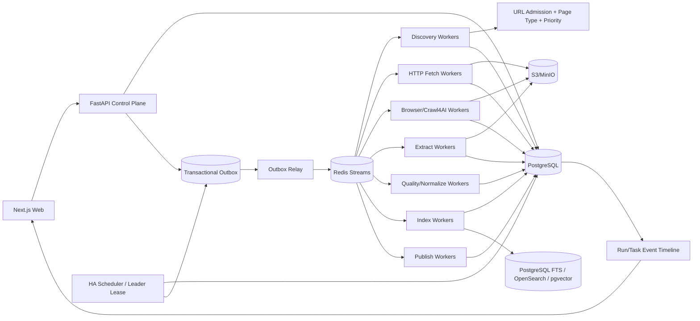

# 博客知识库技术方案

适用范围：从约 1000 个技术博客网站抓取尽可能完整的历史文章，清洗为稳定 Markdown 形成长期知识库；后续持续增加网站，支持历史全量回灌、长期增量同步、版本保留、Web 管理、搜索与外部知识库发布。整体按“百万级文章、数百万到千万级 URL、长期运行、站点异构、可横向扩展、可恢复、可回放、可审计”设计。

## 1. 建设目标

1. 管理员只需录入博客根地址，系统自动探测 Sitemap、Feed、归档页、分类/标签/作者页、平台 API、普通链接和动态列表，生成可审核的站点配置草稿。
2. 支持约 1000 个站点历史全量回灌，并持续增加站点；常见站点通过模板、配置和规则接入，不修改核心状态机。
3. 同一站点允许多个 Discovery Provider，每个 Provider 独立维护 capability、checkpoint、覆盖证据和连续性。
4. 抓取标题、作者、发布时间、更新时间、标签、canonical、正文、代码块、表格、图片和附件，生成稳定 Markdown。
5. 默认 HTTP-first，只有证据表明确实需要 JavaScript、动态分页或交互时才升级 Browser/Crawl4AI。
6. 支持 ETag、Last-Modified、Sitemap lastmod、Feed GUID、API cursor、内容 hash 和重叠时间窗口驱动的增量同步。
7. 支持 durable frontier、断点续跑、幂等、lease、heartbeat、重试、指数退避、限流、熔断、按站公平调度和 backpressure。
8. 保存不可变网络快照、渲染 DOM、清洗 HTML、抽取候选、Article IR、Markdown、规则版本和质量结果；规则升级优先离线 replay。
9. 周期计划、执行实例和后台任务完全分离；计划是持久化业务配置，Scheduler 只是可重建的触发器，实际抓取全部由 Worker 执行。
10. 提供 Web 管理端完成站点接入、覆盖检查、同步计划管理、任务管理、质量审核、版本 diff、错误诊断、搜索、成本和发布管理。
11. Crawl4AI、Playwright、Trafilatura、Readability 等均通过 Adapter 接入，不能成为业务状态真相源。

## 2. 核心原则

1. PostgreSQL 是业务状态真相源，S3/MinIO 是不可变大对象真相源。
2. Redis Streams 只做短期任务分发，所有状态先落 PostgreSQL，并通过 Transactional Outbox 投递。
3. URL 发现、准入、抓取、抽取、质量、索引、发布、计划与执行全部可版本化和可审计。
4. URL 被发现不等于允许抓取，必须经过统一 URL Admission Pipeline。
5. HTTP、Sitemap、Feed、API、Browser 分层，Browser 是昂贵升级路径。
6. 网络快照不可变，规则、Schema、模型和 Markdown Renderer 升级优先 replay，不重复访问站点。
7. 文章身份与 URL 分离；redirect、canonical、镜像、迁移只是 identity evidence。
8. `article_version` append-only，不覆盖旧版本；`crawl_run` 也 append-only，不因计划修改而改写历史执行记录。
9. Bloom Filter/RoaringBitmap 只能加速，不能替代数据库唯一约束和 durable frontier。
10. 任何全局限制都不能把“执行预算耗尽”误判成“历史发现完成”。
11. 第三方抓取引擎不能绕过统一 Egress、robots、限流、预算和状态机。
12. 重型 Browser、CPU 和 LLM 工作只能运行在独立 Worker 中，控制面和 Scheduler 不直接执行长任务。
13. Admission 负责“这个 URL 是否允许进入系统”，Egress 负责“真实网络连接是否允许发生”；SSRF、DNS、redirect 等安全策略必须在连接执行点再次强制校验。
14. async Worker 的事件循环必须保持非阻塞；同步网络 I/O、CPU-heavy 工作和 Browser 任务必须按 runtime class 路由到受控执行域。
15. 标题、slug、URL path 尾段都只是展示属性，不能承担内部 identity；任何抓取结果都必须以稳定 `url_id/article_id/attempt_id/snapshot_id` 关联。
16. 内存 Scheduler、进程内 Semaphore、Redis Consumer ownership 都是可丢失的运行时状态，不能取代数据库里的 schedule、run、task、lease 和幂等约束。

## 3. 总体架构



控制面管理配置、计划、任务和状态；Scheduler 只产生执行实例；数据面长期异步执行。

## 4. Crawl Mode

```text
FULL_BACKFILL   首次历史回灌
INCREMENTAL     持续同步新增和更新
RECONCILE       周期性重新枚举，修复断档
TOPIC_EXPANSION 有限预算专题扩展
REPROCESS       不访问网络，基于已有 snapshot 重抽取/清洗/索引/发布
```

规则：

- FULL_BACKFILL 中 URL 分类和评分只决定顺序，不因关键词、页面类型或低分永久丢弃合法 URL。
- INCREMENTAL/TOPIC_EXPANSION 可使用预算、时间窗口和优先级阈值。
- Crawl4AI deep crawl 的 `max_pages`、Sitemap 的单批次最大条目数、Browser 的单次页面数都只是 execution slice 预算，不是完成条件。
- 同一站点默认只允许一个 active FULL_BACKFILL；INCREMENTAL 与 RECONCILE 是否允许并行由站点策略显式控制。

## 5. 新站点接入：Discovery Probe

管理员输入根 URL 后，Probe：

1. 获取根页面并记录 final URL、Content-Type、编码、响应头和结构。
2. 解析 robots.txt 中 Sitemap。
3. 探测常见 Sitemap/Sitemap Index。
4. 解析 RSS/Atom/JSON Feed。
5. 识别平台公开 API、年/月归档、分类/标签/作者分页。
6. 识别普通站内链接和动态列表。
7. 必要时执行 Browser Sample Probe。
8. 抓取 3~10 个文章样本，识别正文结构和 metadata。
9. 生成 Provider、Fetch Profile、Filter、Scorer、Page Type Rule、Extraction Pipeline、Action Plan 草稿。
10. 在样本上运行 JSON-LD/meta、CSS/XPath、Trafilatura、Readability、Crawl4AI Markdown 等候选并给出质量证据。
11. Web 端 dry-run/canary/publish 后启动首次 FULL_BACKFILL。
12. 首次回灌建立后自动创建默认 INCREMENTAL schedule，管理员可修改频率、时区、重叠窗口和启停状态。

Web onboarding 应把“Probe -> 配置审核 -> FULL_BACKFILL -> INCREMENTAL schedule”串成一条可观察工作流，而不是四个互不关联的页面。

## 6. Discovery Provider 与覆盖台账

优先级：Sitemap/Sitemap Index > 平台 API > Feed > 年/月归档 > 分类/标签/作者分页 > HTML 同域递归 > Browser 动态列表 > 外部公开索引补漏。

每个 Provider 标注：

```text
exhaustive   理论上可枚举完整集合
windowed     只暴露最近窗口
best_effort  尽力发现
```

Provider Coverage Ledger：

```text
provider_id
crawl_run_id
crawl_mode
checkpoint_before
checkpoint_after
pages_or_entries_scanned
discovered_count
admitted_count
rejected_count
expected_count
pagination_continuity
new_frontier_count
unresolved_error_count
started_at
finished_at
```

历史回灌完成至少要求：所有 Provider 到达稳定 checkpoint；exhaustive Provider 完整枚举；分页无 continuity gap；durable frontier 无可执行 URL；retry/dead-letter 已处理；新一轮 reconcile 不再产生显著新增；Coverage Ledger 无未知断档。

## 7. Sitemap 发现：持久化、可恢复、有限内存但不截断历史

Sitemap 是技术博客历史全量的首选入口，必须独立建模为持久化任务，而不是递归函数一次跑完。

`sitemap_task` 至少保存：

```text
sitemap_task_id
site_id
provider_id
crawl_run_id
sitemap_url
parent_sitemap_url
depth
state
body_hash
etag
last_modified
entries_seen
child_sitemaps_seen
checkpoint
lease_owner
lease_until
attempt_count
next_attempt_at
```

执行原则：

1. 每个 Sitemap URL 先走完整 URL Admission；真实连接仍必须由 Egress 再做 DNS/IP/端口校验，嵌套 Sitemap 同样重新执行两层校验。
2. 支持 Sitemap Index、普通 Sitemap、gzip、namespace 和 `lastmod`。
3. XML 使用安全解析器和 streaming/iterparse；网络读取、解压、XML 解析、URL 准入与 frontier 持久化形成一条流式管线，禁止先收集全部 chunk、再 `join` 成完整 bytes、最后构造整棵 DOM。
4. 下载同时限制压缩前字节数、解压后字节数和压缩比，防止 zip bomb。
5. 设置 `max_bytes_per_slice`、`max_entries_per_slice`、`max_child_sitemaps_per_slice`、`max_runtime_per_slice`，预算耗尽时保存 checkpoint 并继续排队，不丢弃剩余历史条目。
6. `visited sitemap` 不能只放进程内 set，必须持久化唯一键，避免 Worker 重启后重复和循环。
7. 嵌套深度是安全保护，不应使用固定小深度直接宣布完成；超过默认深度时进入异常队列或人工策略，而不是静默截断。
8. Sitemap Index 中子 Sitemap 可以并发处理，但必须受全局、站点和域名三层 semaphore/token bucket 约束。
9. 对 404/410、429、5xx、超大文件、解析失败分别分类处理并记录 coverage gap。
10. 解析到单个 `<url>` 或 `<sitemap>` 条目后即可执行 Admission 与持久化，不等待整个 XML 处理结束；Worker 崩溃时最多重放当前 slice。
11. Sitemap 网络读取必须由 async-native HTTP client 或专用 blocking runtime 执行；禁止在主 async event loop 中直接调用同步 `requests`。

## 8. URL Admission、页面分类与 Crawler Trap

每个新 URL 依次经过：

1. URL 规范化；
2. SSRF/Egress 策略预检查；
3. robots 与站点访问策略；
4. Domain/Subdomain allowlist；
5. path allow/deny；
6. query 规范化；
7. Content-Type/扩展名规则；
8. canonical/redirect identity hints；
9. crawler trap 检测；
10. 页面类型分类；
11. Priority Scorer。

URL 规范化处理 host 大小写、IDN、fragment、默认端口、tracking query、query 顺序、session 参数、trailing slash 和 percent-encoding。

页面类型分类：

```text
ARTICLE
ARCHIVE
CATEGORY
TAG
AUTHOR
PAGINATION
DOCUMENTATION
PRODUCT
PRICING
SEARCH
ASSET
UNKNOWN
```

分类只作为抽取策略和调度输入。FULL_BACKFILL 中“blog/docs/article”等关键词只能提高优先级，不能直接丢弃历史 URL。

重点识别：日历无限翻页、搜索参数组合、tag/filter 笛卡尔积、无界 `?page=`、session/token 参数、同内容多排序 URL。

## 9. 周期计划与执行实例

### 9.1 `sync_schedule` 是持久化配置

每站可以有一个或多个同步计划，至少保存：

```text
schedule_id
site_id
crawl_mode
cron_expr
interval_seconds
timezone
jitter_seconds
overlap_window
policy_release
enabled
next_due_at
last_scheduled_at
last_success_at
created_at
updated_at
```

`cron_expr` 与 `interval_seconds` 二选一或按策略支持；所有时间计算以明确 timezone 为基础，数据库统一保存 UTC 时间戳。

### 9.2 Scheduler 是可重建运行时

Scheduler 的内存 job 不是事实来源。启动或 leader 切换后必须从 PostgreSQL 读取 enabled schedule 并 reconcile；运行时 job 丢失不会导致计划丢失。

Web 对计划的 create/update/enable/disable 先提交数据库事务，再由 Scheduler reconcile。修改计划不能改写历史 `crawl_run`。

### 9.3 HA 触发与唯一逻辑运行

生产部署至少两个 Scheduler 实例，但同一时刻只有一个实例拥有 leader lease，或由数据库对到期 schedule 做原子 claim：

```sql
SELECT ...
FROM sync_schedule
WHERE enabled = true AND next_due_at <= now()
ORDER BY next_due_at
FOR UPDATE SKIP LOCKED;
```

一次到期触发必须在同一数据库事务中：

```text
1. 锁定/claim 到期 schedule
2. 创建 append-only crawl_run
3. 生成 run dedupe_key
4. 写 outbox_event
5. 推进 next_due_at / last_scheduled_at
6. COMMIT
```

Outbox Relay 再把任务投递到 Redis Streams。Scheduler **绝不直接执行 HTTP、Browser、抽取或索引**。

### 9.4 `crawl_run` 与 schedule 分离

`crawl_run` 至少包含：

```text
crawl_run_id
site_id
schedule_id
crawl_mode
triggered_by      # schedule/manual/reconcile/system
window_start
window_end
policy_release
status
dedupe_key
supersedes_run_id
created_at
started_at
completed_at
```

计划代表“未来何时执行”，run 代表“一次已经发生或正在发生的执行”。计划变更、禁用或删除不能修改旧 run。

### 9.5 重复触发与 Run Now

建议 run dedupe key：

```text
sync:{site_id}:{schedule_id}:{crawl_mode}:{window_start}
```

数据库对 active 状态建立部分唯一约束，防止 Web 重试、cron 重复触发、Leader 切换或消息重放制造重复 active run。

Web `Run Now` 必须复用统一创建 run + outbox 流程：

- 默认：若存在同 site/mode 的 active run，直接返回现有 run，而不是再创建一个；
- `Force New Run`：创建新 run，写 `supersedes_run_id`，旧 run 进入 `cancel_requested`，由 Worker 协作停止；
- 不通过“直接覆盖旧任务为 failed”制造审计断层。

## 10. 后台任务状态机、Claim、Heartbeat 与恢复

所有长任务都持久化为 `background_task`/具体业务 task，至少保存：

```text
task_id
crawl_run_id
kind
site_id
payload
status
dedupe_key
priority
run_after
attempt_count
max_attempts
worker_id
lease_until
claimed_at
heartbeat_at
started_at
completed_at
result_ref
error_class
created_at
updated_at
```

推荐状态：

```text
QUEUED
 -> CLAIMED
 -> RUNNING
 -> COMPLETED

RUNNING -> RETRY_WAIT -> QUEUED
RUNNING -> CANCEL_REQUESTED -> CANCELLED
RUNNING -> FAILED / DEAD_LETTER
```

### 10.1 原子 Claim

PostgreSQL Worker 使用 `FOR UPDATE SKIP LOCKED`、`UPDATE ... RETURNING` 或 lease CAS 原子抢占，不能使用“先 SELECT 再无条件 UPDATE”的竞态流程。

若 Redis Streams 已分发消息，Worker 仍需通过数据库 claim/lease 确认最终执行所有权。Redis Consumer Group 只负责运输，不负责业务唯一性。

### 10.2 Heartbeat 与 Lease

- Worker 定期更新 `heartbeat_at` 和 `lease_until`；
- 关键状态更新必须匹配当前 `worker_id/lease_version`；
- lease 过期后旧 Worker 即使恢复，也不能提交成功结果覆盖新 Worker；
- Worker 正常退出时主动释放或缩短 lease。

### 10.3 孤儿任务恢复

Recovery Worker/Scheduler 周期扫描：

- `CLAIMED/RUNNING` 且 heartbeat 超时；
- 进程重启后 heartbeat 为空的 orphaned task；
- 达到 `max_attempts` 前重新排队并增加 attempt；
- 达到上限进入 DEAD_LETTER，并记录最后错误与恢复原因。

数百万 URL 长期运行时，Worker crash 只能造成当前 lease slice 的有限重放，不能产生永久僵尸任务。

### 10.4 Append-only Task Event Timeline

除最新 `status` 外，每个 run/task 追加不可变事件：

```text
RUN_CREATED
DISCOVERY_STARTED
SITEMAP_SLICE_COMPLETED
FRONTIER_GROWTH
FETCH_STARTED
FETCH_THROTTLED
BROWSER_ESCALATED
SNAPSHOT_COMMITTED
EXTRACTION_REPLAYED
QUALITY_REJECTED
RETRY_SCHEDULED
RUN_CANCEL_REQUESTED
TASK_RECOVERED
RUN_COMPLETED
RUN_FAILED
```

事件保存 `event_id/run_id/task_id/phase/status/summary/payload/created_at`。Web 的 SSE/WebSocket 进度、审计、故障复盘都基于事件表，不从日志文本反推状态。

## 11. 公平调度、限流与 Backpressure

Scheduler/Dispatcher 使用 weighted fair queue。每域维护最大并发、QPS、最小请求间隔、token bucket、Retry-After、429/403/5xx 退避、HTTP/Browser 独立预算和 circuit breaker。

优先级建议：

```text
NEW_FEED / CHANGED
> INCREMENTAL_REFRESH
> RECONCILE
> HISTORICAL_BACKFILL
> LOW_PRIORITY_REPROCESS
```

并发至少分三层：

1. 全局系统配额；
2. site/domain 配额与 politeness；
3. Worker 进程内 semaphore/pool。

进程内 `asyncio.Semaphore` 只能作为最后一道局部保护，不能替代跨 Pod 的全局和站点级限流。

下游积压时降低 Discovery、暂停 Browser expansion、优先处理已抓未抽取 snapshot，并保留增量高优先级通道。

## 12. Async Runtime Topology

### 12.1 控制面

FastAPI 只负责配置 CRUD、计划管理、创建任务、状态查询、SSE/WebSocket 进度、权限和审计。

长任务标准路径：

```text
POST /jobs 或 schedule 到期
 -> PostgreSQL transaction
 -> crawl_run/background_task + outbox_event
 -> Redis Streams
 -> Worker
```

### 12.2 HTTP/Discovery Worker

每进程长期维护一个 event loop 和 httpx/aiohttp connection pool；使用 bounded task queue、per-domain semaphore/token bucket、DNS/连接/读取超时、Retry-After 和 circuit breaker。

HTTP/Discovery Worker 使用最小依赖运行时，不安装 Playwright/Crawl4AI/Browser 依赖；即使 Browser 运行时损坏，Sitemap、Feed、HTTP-first 和增量判断仍可独立工作。

Adapter 声明：

```text
runtime_class = ASYNC_NATIVE | BLOCKING_IO | CPU_BOUND | BROWSER
```

- `ASYNC_NATIVE` 可进入主 asyncio Worker；
- `BLOCKING_IO` 进入有界线程池或独立 Blocking-I/O Worker；
- `CPU_BOUND` 进入进程池/CPU Worker；
- `BROWSER` 进入 Browser Worker。

Blocking pool 也必须有最大并发、最大排队长度、超时和 metrics。CI/contract test 检查 async-native Worker 网络执行路径，禁止同步 `requests`/urllib 误入。

### 12.3 Browser/Crawl4AI Worker

每进程长期维护 Browser/Crawl4AI 生命周期、context/page pool、内存和 CPU 并发上限、session TTL、heartbeat 和 cleanup。

Browser Worker 使用独立镜像、依赖 lock、Browser revision、SBOM 和安全策略，与 HTTP Worker 物理隔离。

禁止为每个 URL 创建新的 event loop 或新的 Browser，也禁止对百万 URL 一次性 `asyncio.gather`。批量抓取采用 bounded batch 或 streaming completion，单条完成后立即持久化。

### 12.4 CPU Worker

DOM 解析、diff、MinHash/SimHash、Article IR normalize、Markdown render 等 CPU-heavy 工作放独立进程池。

## 13. HTTP-first、分层获取与 Browser 升级

HTTP Worker 尽量发送 `If-None-Match` / `If-Modified-Since`。304 只更新 freshness；200 先保存 raw bytes，再抽取。HTTP DOM 足够时不启动 Browser。

获取链允许按证据逐级升级：

```text
HTTP 原文
 -> HTTP + 结构化抽取
 -> Browser/Crawl4AI 渲染
 -> 站点专用 API/Adapter
 -> 人工诊断
```

每次 attempt 必须保存 provenance：获取引擎、升级原因、fallback 原因、超时、runtime release、最终来源。不能只保存“最后拿到的 Markdown”。

Browser 升级原因结构化保存：

```text
EMPTY_ARTICLE_BODY
SPA_SHELL
JS_PAGINATION
LOAD_MORE
INFINITE_SCROLL
DYNAMIC_RENDER_REQUIRED
EXTRACTION_READINESS_FAILED
```

Browser Action Plan 与 Extraction Pipeline 分离，页面点击/滚动/等待不和正文选择规则耦合。

## 14. Crawl4AI Adapter

Crawl4AI 可承担 AsyncWebCrawler、JS 渲染、deep crawl、Markdown 生成和 CSS/XPath/Regex extraction，但不承担 durable frontier、多站公平调度、业务 checkpoint、文章版本、schedule、run 和覆盖完成判定。

Adapter 输入绑定 task/attempt/crawl_mode/runtime bundle/fetch profile/cache policy/action plan/extraction release/execution budget/runtime_class；输出统一为：

```text
adapter_output_schema_version
url_id
attempt_id
final_url
status_code
headers
raw_html_ref
rendered_dom_ref
raw_markdown_ref
fit_markdown_ref
links/media
metrics
source_provenance
fallback_reason
error_class
runtime_bundle_release
```

Adapter contract 显式版本化。字段语义变化发布新 schema/release，旧 snapshot 保留原版本解释信息。

Crawl4AI 作为可选能力；HTTP-only 模式必须能独立运行。Browser/Crawl4AI 镜像锁定完整依赖图、Browser revision 和 image digest。

## 15. Snapshot、Cache、Artifact Commit 与 Replay

每次成功网络访问先保存不可变 snapshot：

```text
raw response bytes
response headers
observed charset
final_url
redirect chain
resolved_ip_evidence
body sha256
rendered DOM
cleaned HTML
raw Markdown
fit Markdown
links/media references
source provenance
fetch/crawler/runtime release
adapter_output_schema_version
fetched_at
```

区分 HTTP validator cache、平台不可变 snapshot、第三方 engine execution cache。业务 freshness 和版本语义不能由第三方缓存决定。

大对象使用原子 Artifact Commit：

```text
1. 以 attempt_id/snapshot_id 创建 staging object key
2. 流式上传并计算 sha256、size、media type
3. 完整校验后得到 content-addressed object key
4. PostgreSQL 事务写 artifact_object + fetch_snapshot + 状态变化 + outbox_event
5. 事务提交后 snapshot=COMPLETE，对象从此不可变
6. 重试通过 idempotency key/hash 复用已有完整对象
7. Cleanup Worker 回收未被事务引用的过期 staging object
```

禁止先把任务标记成功再异步尝试写对象，也禁止原地覆盖已完成快照。REPROCESS 默认只用已有 snapshot，不访问网络。

## 16. 抽取链、Article IR 与 Markdown

同一 snapshot 产生多个 candidate：

1. 平台 API/JSON-LD/OpenGraph/meta；
2. 站点 CSS/XPath Contract；
3. Trafilatura；
4. Readability；
5. Crawl4AI raw/fit Markdown；
6. 必要时 LLM Structured Extraction。

HTML 先转换为 Article IR：

```text
heading
paragraph
list
quote
code_block
table
image
link
embed_placeholder
```

Quality Gate 从候选中选择最终字段和正文，任何 extractor 都不能静默覆盖前一结果。

Markdown 路径：

```text
knowledge/{site_slug}/{yyyy}/{article_id}.md
```

front matter 至少包含：

```yaml
article_id:
site_id:
source_url:
canonical_url:
title:
authors:
published_at:
updated_at:
fetched_at:
content_hash:
article_version:
extraction_release:
runtime_bundle_release:
crawl_run_id:
```

文件名不依赖标题；正文相对链接和图片统一变成可追踪的绝对或托管地址。

## 17. URL 去重、文章身份与版本

数据库 URL 唯一键：

```text
(site_id, sha256(normalized_url))
```

exact duplicate 使用 Article IR/content hash；near duplicate 使用 MinHash/SimHash 生成候选；redirect/canonical 只作为 identity evidence；多 URL 同文章记录 `article_url_relation`。

正文、关键 metadata、canonical identity 或 Article IR 实质变化时创建新 `article_version`；仅抓取时间或响应头变化且 IR hash 相同时不创建版本。

所有运行时结果、临时 map、批处理输出和 Web 操作都以 `url_id/article_id/attempt_id/snapshot_id` 关联。禁止使用标题、slug、URL path 最后一段或清洗后的文件名作为更新 key。

## 18. 增量同步与 Reconcile

增量信号优先级：Sitemap `lastmod` > Feed GUID/updated_at > API cursor > ETag > Last-Modified > normalized content hash。

RSS 等 windowed source 必须使用重叠时间窗口，不能只保存最后一条 GUID 单向推进。长时间离线后扩大 overlap，并周期性用 Sitemap/API/Archive RECONCILE 修复断档。

每站维护 Provider checkpoint、近期变更率和历史耗时；`sync_schedule.next_due_at` 可根据变化率自适应调整，但任何自适应策略都要版本化并可在 Web 查看。

建议：

- 高频站点：Feed/Sitemap 增量 15 分钟~数小时；
- 普通技术博客：数小时~1 天；
- 低频站点：1~7 天；
- RECONCILE：周/月级，按历史断档风险调整。

频率只是默认策略，最终受 robots、站点礼貌抓取规则和业务 SLA 约束。

## 19. 幂等、Outbox 与状态一致性

URL 主状态可表达：

```text
DISCOVERED
 -> ADMITTED
 -> QUEUED
 -> FETCHING
 -> FETCHED
 -> EXTRACTING
 -> QUALITY_CHECK
 -> STORED
 -> INDEXED
 -> PUBLISHED
```

失败状态：`RETRY_WAIT`、`DEAD_LETTER`、`REJECTED`。

幂等 key：

```text
run:     site_id + schedule_id + crawl_mode + logical_window
fetch:   url_id + requested_snapshot_epoch + fetch_profile_release + cache_policy_release
extract: snapshot_id + extraction_pipeline_release_id
index:   article_version_id + index_release_id
publish: article_version_id + destination + publish_release_id
```

同一 PostgreSQL 事务写状态变化和 outbox_event，再由 Relay 投递队列。重复消息必须能安全重放；Redis ack 只能发生在数据库持久化成功之后或遵守明确 inbox/outbox 协议。

## 20. 核心数据模型

至少包括：

```text
site
site_source
site_source_release
discovery_provider
discovery_checkpoint
provider_coverage
sync_schedule
crawl_run
run_event
sitemap_task
url_frontier
background_task
task_event
fetch_task
crawl_attempt
artifact_object
fetch_snapshot
browser_session_lease
page_type_rule_release
url_filter_release
url_scorer_release
fetch_profile_release
cache_policy_release
browser_action_plan_release
adapter_schema_release
extraction_pipeline_release
extraction_candidate
quality_evaluation
article
article_url_relation
article_version
index_release
publish_state
runtime_bundle_release
outbox_event
```

`sync_schedule` 保存未来触发配置，`crawl_run` 保存一次逻辑执行，`background_task` 保存可领取工作单元，三者不得合并成一张“万能任务表”。

`artifact_object` 保存 object key、sha256、size、media type、state、created_at；业务表只引用稳定 ID。

## 21. Quality Gate 与 Drift Detection

至少计算标题存在率、正文字符数/段落数、链接密度、导航占比、代码块保留率、表格保留率、图片引用有效率、发布时间证据、boilerplate 比率、Markdown 截断、canonical/final URL 冲突和历史重复度。

持续监控：

```text
extraction_success_rate
body_length_p50/p95
title_missing_rate
code_block_retention
table_retention
browser_fallback_rate
duplicate_ratio
sitemap_gap_count
provider_continuity_gap
queue_lag
schedule_trigger_lag
run_duration_p50/p95
stale_task_recovery_count
dedupe_collision_count
heartbeat_age_p95
blocking_pool_queue_lag
browser_pool_active
artifact_commit_failure_rate
staging_object_age_p95
```

release 后指标突变时自动暂停扩大范围、重新 Probe 并生成规则草稿；低质量内容不覆盖高质量旧版本。

## 22. 错误分类与重试

统一分类 DNS、connect/read timeout、TLS、401/403、404/410、429、5xx、robots denied、egress denied、content too large、sitemap malformed、sitemap depth anomaly、decompression bomb、browser crash/timeout、extraction failed、quality rejected、runtime mismatch、blocking pool saturated、artifact commit failed、schema mismatch、lease lost、scheduler duplicate trigger 等。

可重试错误按 `Retry-After + jittered exponential backoff + max attempts + circuit breaker` 处理；配置错误、明确拒绝和确定性校验失败不原样重试。

任务重试只重放最小必要单元。例如 Artifact 上传中断只重试当前对象提交，不重做整个站点；lease lost 的旧 Worker 放弃提交，不与新 Worker 竞争。

## 23. 安全、robots 与 Egress

所有网络访问统一经过 Egress Gateway：

- 只允许 http/https；
- 拒绝 localhost、RFC1918、loopback、link-local、metadata endpoint；
- DNS 解析时检查全部 A/AAAA 结果；
- DNS 失败默认 fail-closed；
- 连接建立时使用已验证解析结果，防止 DNS rebinding/TOCTOU；
- 不允许客户端绕开 Egress 无限自动跟随 redirect，每一跳都重新校验；
- 限制端口并禁止 file/ftp/gopher 等 scheme；
- Sitemap 内的子 Sitemap 和文章 URL 都重新做 Admission/Egress；
- HTTP、Browser、Crawl4AI Adapter 走同一出口政策；
- 保存 redirect chain、DNS/IP 安全决策和拒绝原因；
- 遵守 robots、Retry-After 和礼貌抓取策略；
- 不绕过验证码、登录、付费墙或明确访问控制。

文件路径使用安全 slug，并验证最终路径位于知识库根目录。

## 24. Web 管理功能

### 24.1 站点接入

- 新站点 Probe 向导；
- Sitemap/Feed/API/归档/动态列表证据；
- 样本 URL；
- HTTP/Browser 差异；
- 自动规则草稿；
- dry-run/canary/publish；
- 一键启动 FULL_BACKFILL；
- 回灌启动后创建默认 INCREMENTAL schedule。

### 24.2 同步计划

- cron/interval、timezone、jitter、overlap window；
- enabled/disabled；
- next_due_at、last_scheduled_at、last_success_at；
- 最近触发延迟和失败率；
- schedule 修改审计；
- 手工 Run Now；
- 重复点击返回现有 active run；
- Force New Run 显示 supersede/cancel 关系。

### 24.3 覆盖与任务

- Provider capability/checkpoint/continuity gap；
- Sitemap task 树、depth、未完成子任务和异常；
- expected/discovered/admitted/fetched/article count；
- full backfill 完成证据；
- run/task 状态和 append-only event timeline；
- heartbeat、lease、attempt、worker、recovery 记录；
- 任务暂停、恢复、取消、重试；
- 单 URL 调试和 reprocess；
- runtime class、队列与 Worker 饱和度。

### 24.4 质量与调试

- raw HTML/rendered DOM/raw Markdown/final Markdown 对比；
- extraction candidates 与最终选择理由；
- 页面类型分类和 priority score 解释；
- cache/source provenance 与 Browser escalation 原因；
- runtime bundle、adapter schema release；
- redirect/DNS/Egress 决策链；
- artifact object/hash/commit 状态；
- selector drift 和文章版本 diff。

### 24.5 搜索与发布

- 全文搜索；
- 可选向量搜索；
- article/source/version 浏览；
- 外部知识库发布状态；
- 失败重推和版本回滚。

## 25. 搜索与发布

默认 PostgreSQL FTS；规模或查询需求提升后接 OpenSearch。向量检索按需使用 pgvector/独立 Vector DB，不作为抓取主链路强依赖。

发布 Worker 支持文件系统/Git、S3、外部 RAG/知识库、搜索索引和版本化 API；以 `article_version_id + destination + publish_release_id` 幂等。

## 26. 推荐技术栈

| 层 | 推荐 |
|---|---|
| API | Python + FastAPI |
| Web | React / Next.js |
| Scheduler | PostgreSQL 持久计划 + leader lease/DB claim；APScheduler 可作为单实例时钟实现但不是真相源 |
| Worker | Python asyncio + 独立 Blocking-I/O/CPU/Browser Worker |
| 状态库 | PostgreSQL |
| 队列 | Redis Streams + Transactional Outbox |
| 大对象 | S3 / MinIO |
| HTTP | httpx / aiohttp |
| Browser | Playwright + Crawl4AI Adapter |
| Sitemap / Feed | defusedxml/lxml iterparse + feedparser |
| 正文抽取 | CSS/XPath + Trafilatura + Readability + Crawl4AI |
| 文档模型 | Article IR + Markdown Renderer |
| 全文检索 | PostgreSQL FTS，后续 OpenSearch |
| 向量 | pgvector/独立 Vector DB，可选 |
| 观测 | OpenTelemetry + Prometheus + Grafana + Loki |
| Secret | Vault / 云 Secret Manager / KMS |
| 部署 | Docker + Kubernetes |

初期 1000 站不建议直接引入 Kafka。Redis Streams + PostgreSQL Outbox 足够；当吞吐、保留周期或跨区域消费出现明确瓶颈时再迁移 Kafka/Pulsar。

## 27. 运行时发布与供应链

每个 `runtime_bundle_release` 固定：

```text
runtime_role
source_commit_sha
built_wheel_or_artifact_hash
container_image_digest
python_lock_hash
crawler_engine_version
playwright_version
browser_revision
adapter_version
adapter_output_schema_version
build_sbom_ref
created_at
```

发布前执行 clean build、dependency lock/resolve、SBOM/依赖审计、单元测试、golden snapshot replay、Browser smoke test、Adapter contract test，并检查生产容器实际 import 的 package tree 与 CI 一致。

运行时至少拆成：

```text
crawler-http      最小 HTTP/Sitemap/Feed 依赖，无 Browser/Crawl4AI
crawler-blocking  承载同步 SDK/网络依赖，强制 bounded pool
crawler-browser   锁定 Crawl4AI/Playwright/Browser 完整依赖图
```

Crawl4AI 等重依赖保持 optional capability，基础 HTTP/Sitemap/Feed 抓取链不能因 Browser/LLM 依赖不可用而瘫痪。

## 28. 部署与容量规划

推荐最小生产拓扑：

```text
2 x FastAPI Control Plane
2 x Scheduler（leader lease 或 DB due-row claim）
2 x Outbox Relay
N x Discovery Worker（crawler-http）
N x HTTP Fetch Worker（crawler-http）
可选 Blocking-I/O Worker Pool（crawler-blocking）
独立 Browser/Crawl4AI Worker Pool（crawler-browser）
N x Extract / Quality Worker
N x Index / Publish Worker
1+ x Recovery/Cleanup Worker
PostgreSQL HA
Redis Streams
S3 / MinIO
Prometheus + Grafana + Loki + OpenTelemetry Collector
Next.js Web
```

扩容依据是 queue lag、schedule trigger lag、HTTP connection concurrency、blocking queue lag、CPU、Browser memory/seconds、domain throttle、artifact commit throughput、object storage 和 index size，而不是简单按站点数量扩容。

## 29. 实施阶段

### Phase 1：MVP

- site/source；
- Probe 基础版；
- Sitemap/Feed；
- `sitemap_task` 持久化续跑与 true streaming parse；
- durable frontier；
- FULL_BACKFILL/INCREMENTAL；
- `sync_schedule + crawl_run` 分离；
- Scheduler DB reconcile + 单实例/leader lease；
- run dedupe 和 Web Run Now；
- background task claim/lease/heartbeat/recovery；
- task/run event timeline；
- HTTP-first；
- async-native HTTP/Sitemap/Feed Worker；
- runtime class 路由；
- raw snapshot + 原子 Artifact Commit；
- stable ID；
- Trafilatura/Readability；
- Article IR/Markdown；
- PostgreSQL + Redis Streams + Outbox + MinIO；
- Web 站点/计划/任务/文章查看；
- ETag/Last-Modified；
- Admission + Egress/robots；
- 基础 error taxonomy。

### Phase 2：异构站点与质量闭环

- CSS/XPath Rule；
- Page Type Rule；
- URL Filter/Scorer；
- Browser Action DSL；
- Crawl4AI/Playwright Adapter；
- Browser 全局/site/进程三层配额；
- streaming ingestion；
- Quality Gate；
- replay；
- drift detection；
- Sitemap 异常与 coverage gap 面板；
- run/task event SSE；
- artifact/schema/runtime/provenance 调试面板。

### Phase 3：规模化

- 多 Provider checkpoint；
- Provider Coverage Ledger；
- weighted fairness；
- backpressure；
- 多 Scheduler HA；
- 自适应 sync schedule；
- RECONCILE；
- Archive Full；
- OpenSearch/pgvector；
- 外部知识库发布；
- 自动回归测试和运行时发布门禁。

## 30. 验收标准

### 30.1 全量回灌

随机选择不同规模和技术栈站点，输出 Provider 级覆盖证据；任意 Worker 重启后可继续；Sitemap 单批预算耗尽后可从 checkpoint 恢复；FULL_BACKFILL 不因关键词过滤、页面分类、单次 max_pages/max_entries 或固定 URL 上限漏掉已发现合法 URL；大 Sitemap 处理过程中不会把完整 XML 和完整 URL 集合同时常驻内存。

### 30.2 增量同步与调度

新增文章在 SLA 内进入知识库；更新文章产生新版本；304/内容未变不产生无意义版本；Feed 窗口断档能由 reconcile 修复。

关闭任意 Scheduler 实例后，另一实例可从 PostgreSQL 恢复计划；同一 logical window 在 Scheduler 重启、Leader 切换、HTTP 重试、Outbox 重放和 Web 连续点击下最多产生一个 active run。修改 cron/interval 不改变历史 run。

### 30.3 任务恢复

故障注入覆盖 Worker 在 CLAIMED、RUNNING、写 snapshot 前后、heartbeat 中断和 lease 失效等阶段崩溃；stale/orphaned task 能重新排队或进入 DEAD_LETTER；旧 Worker lease 失效后不能覆盖新 Worker 结果。

### 30.4 抽取质量

标题、发布时间、正文、代码块、表格按抽样集评估；规则升级可基于 snapshot replay；Markdown 不因文本扁平化破坏技术结构。

### 30.5 可恢复性与安全

Sitemap/Fetch/Browser 任务均能 lease 重放；嵌套 Sitemap、redirect 和最终文章 URL 都重新执行 Admission/Egress/SSRF 校验；超大 Sitemap、压缩炸弹、循环 Sitemap、429/5xx 不会拖垮 Worker。

安全测试包含入口公网 URL 302 到 RFC1918/metadata、DNS 多 A/AAAA 混合公网与内网、DNS rebinding、嵌套 Sitemap 指向内网、非标准危险端口和 Browser 子资源越权请求，均必须在真实网络执行前被 Gateway 阻断并留下审计证据。

### 30.6 可运维性

Web 能定位任一 URL 的发现来源、Sitemap 父子关系、Admission 决策、Egress/DNS/redirect 决策链、页面类型、priority score、抓取 attempt、snapshot、artifact object/hash、Adapter schema、runtime class、抽取 candidate、质量结果、文章版本和发布状态。

Web 能定位任一 schedule 的下次触发时间、最近 run、dedupe key、supersede/cancel 关系，以及任一任务的 worker、lease、heartbeat、attempt、恢复事件和完整 event timeline。

### 30.7 运行时与供应链

crawler-http 在完全不安装 Crawl4AI/Playwright 的情况下仍能完成 Sitemap/Feed/HTTP 抓取与增量判断；crawler-browser 使用独立锁定依赖图和镜像 digest；同一 runtime bundle 可重复构建并通过 golden replay/contract test。

### 30.8 身份与持久化原子性

构造 `/blog/setup`、`/docs/setup`、同标题不同 URL、slug 变更、canonical 迁移等碰撞用例，结果必须保持不同 `url_id`，不能因 path 尾段或标题相同被覆盖。

故障注入覆盖对象上传中断、上传成功但数据库事务回滚、数据库提交后 Worker 崩溃、重复消息重放、Cleanup 并发执行。最终必须满足：COMPLETE snapshot 一定引用完整可校验对象；staging object 可回收；重复 attempt 不制造不可控重复对象；不存在半写 JSON/Markdown 覆盖已完成版本。

## 31. 最终方案

最终采用“持久化发现 + Durable Frontier + 持久化同步计划 + Append-only Crawl Run + HA Scheduler 只触发不执行 + Transactional Outbox + 可恢复后台任务 + HTTP-first + Browser 按证据升级 + 不可变 Snapshot + 原子 Artifact Commit + 多候选抽取 + Article IR + append-only 文章版本 + 增量/对账 + Web 管理”的平台架构。

最关键的工程约束是：

- Sitemap 是可恢复的持久化任务树，所有大小、条目数、深度和运行时间限制都是 execution slice 安全预算，不能静默截断历史。
- `sync_schedule` 是未来计划，`crawl_run` 是一次执行，Scheduler 内存状态只是可重建镜像；Scheduler 到期只创建 run + outbox，不直接抓取。
- schedule/run/task 三层各自有稳定 ID、幂等和数据库状态；重复 cron、Leader 切换、Web 重试和消息重放不能制造重复 active run。
- Worker 使用原子 claim、lease、heartbeat、attempt 和孤儿恢复；失去 lease 的 Worker 不允许提交结果。
- run/task event append-only，Web 进度、审计和恢复解释都来自结构化事件而不是日志猜测。
- URL 页面类型和关键词只用于调度与抽取选择，不用于 FULL_BACKFILL 永久过滤。
- 并发采用全局、站点/域名、进程三层有界控制；百万 URL 不做一次性 `gather`。
- async Worker 只执行 async-native I/O；同步网络 SDK、CPU 与 Browser 各自隔离。
- Crawl4AI 是可替换 Adapter，Browser 生命周期长期复用，不能掌握平台状态真相。
- 获取链每次 fallback/升级都保存 provenance 和原因，不能只保留最终 Markdown。
- 正文抽取以结构化 Article IR 为中心，不采用简单文本扁平化作为最终知识库清洗方式。
- Admission 只做准入，Egress 在真实连接时强制执行 DNS/IP/端口/redirect 安全策略。
- 所有内部关系使用稳定 ID，绝不使用标题、slug 或 URL path 尾段作为更新 key。
- snapshot/artifact 使用内容 hash、schema/release 版本和原子提交协议；规则升级优先 replay。
- 供应链通过最终 lock、SBOM、artifact hash、image digest 和 contract test 固定。

该方案可以从几十个站点扩展到 1000+ 站点，并在持续增加新站点、新发现方式、新同步频率和新抓取引擎时保持核心状态机稳定；同时保证增量同步在 Scheduler 重启、Worker 崩溃、消息重放和多副本部署下仍可恢复、可去重、可审计。