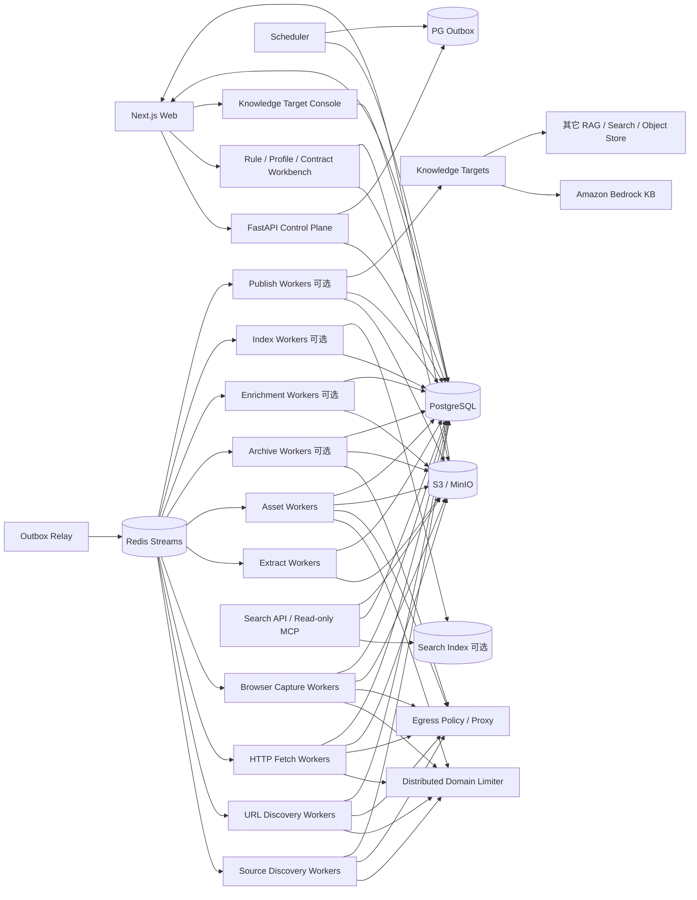

# 博客知识库技术方案

适用范围：约 1000 个技术博客网站的全量历史文章采集、Markdown 清洗、持续扩站、增量同步、Web 管理、全文/向量检索，以及把已发布知识安全地同步到外部 RAG/知识库。设计目标是继续扩展到更多站点、数百万 URL，并稳定运行多年。

## 1. 目标与边界

### 1.1 核心目标

1. 新站接入后尽可能完整发现当前仍可访问的历史文章，并可选用 Common Crawl、Wayback 等公共历史索引补充已经删除、迁移或站内不再暴露的 URL/快照证据。
2. 将标题、作者、发布时间、更新时间、标签、canonical URL、正文、链接、代码块、表格、图片和附件统一清洗为稳定 Markdown。
3. 普通站点不编写独立爬虫；站点差异依次通过 Generic Profile、Platform Profile、Site Override、Extraction Contract、Custom Adapter 解决。
4. 支持长期增量同步，仅处理新增、变化、删除确认、失败重试、低频 reconciliation 和规则/抽取器重放。
5. 支持断点续跑、幂等、去重、版本保留、失败隔离、离线 re-extract、回滚、暂停/恢复和 durable cancel。
6. 提供 Web 管理端完成站点接入、平台识别、范围确认、规则编辑、任务触发、进度监控、错误诊断、Markdown 预览、版本 diff、质量、安全、预算、Profile/Extraction Contract release 管理。
7. 首次历史回灌和日常增量使用同一套数据模型、任务系统、状态机和可观测体系。
8. Sitemap、Feed、HTML、redirect、canonical、`<base href>`、Browser DOM、媒体、搜索索引结果和第三方抓取结果全部视为不可信输入。
9. HTTP 原始 response bytes、Browser rendered DOM、抽取候选、规则、Profile、Extraction Contract、质量门禁和 Serializer 全部可追溯。
10. LLM 不是 canonical 内容正确性的运行时依赖；LLM 可用于离线规则候选生成、摘要、标签、向量等辅助能力，但不能静默改写正式正文。
11. 已发布 `article_version` 可以异步进入平台自身 Search/Vector/MCP，也可以通过 Knowledge Sink / Publish Plane 同步到 S3、Amazon Bedrock Knowledge Bases 或其它外部知识库。
12. 下游检索、Embedding、外部知识库或发布目标故障不得回滚 canonical Markdown，也不得为了重试而重新抓取源站。

### 1.2 “全量历史”的定义

- **Live Full**：通过 Feed、Sitemap、平台归档、普通归档页、站内链接和公开索引能够发现，且当前仍可访问的文章。
- **Archive Full（可选）**：在合规前提下，通过 Common Crawl、Wayback 等补充当前站点不再提供的 URL 或历史快照证据。

必须分别统计：发现 URL 数、当前可访问数、成功正文数、仅历史索引证据数、各 Discovery Source coverage、归档是否确认到达终点。不能用单一“抓取完成率”掩盖来源缺口。

### 1.3 非目标

- 不绕过登录、付费墙、验证码或明确禁止的访问控制。
- 不默认所有页面使用 Browser；HTTP 能完成时优先低成本路径。
- 不把 Redis、Crawl4AI cache、本地文件 cache、CLI 输出目录或进程内 URL list 当业务真相源。
- 不把 GitHub 当海量正文主存储；GitHub 只保存方案、规则、配置和少量导出。
- 不在 Web 请求处理函数里执行数分钟或数小时的全站抓取。
- 不把搜索引擎结果数量视为“历史全量”的证明。
- 不把 Vector DB、Amazon Bedrock、OpenSearch 或任意外部 RAG 后端当 canonical 内容真相源。
- 不把下游知识库“摄取成功”误认为源站抓取、正文质量或历史覆盖已经成功。

## 2. 设计原则

1. **Source Discovery、URL Discovery、Fetch、Capture、Extract、Quality Gate、Asset、Publish、Enrichment 解耦**。
2. **PostgreSQL 是业务状态真相源**；Redis 只承担队列、限流和短期协调。
3. **端到端流式和分批**；不把几十万 URL、超大 Sitemap、响应体或媒体一次性装入内存。
4. **跨域并行、域内克制**；同一域所有 HTTP、Browser、Sitemap、Feed、归档和媒体访问共享限流。
5. **HTTP 优先，Browser 按原因升级**；抽取算法失败不等于页面需要 Browser。
6. **不可变抓取快照优先**；规则、Profile、Extraction Contract、抽取器、质量门禁和 Serializer 变化优先离线 replay。
7. **所有影响结果的 release/version 可追溯**：Platform Profile、Rule、Extraction Contract、Canonicalizer、Fetcher、Capture Profile、Extractor、Quality Gate、Serializer、Security Policy、Chunker、Embedding、Publish Adapter。
8. **第三方组件只做 Adapter/能力实现，不做业务状态中心**。
9. **控制面不执行重任务**；Web/API/Cron 只创建 durable job。
10. **所有 URL 入口和 redirect hop 统一经过 EgressPolicy**。
11. **远端输入有硬预算**：bytes、请求次数、递归深度、URL 数、XML elements、重定向、滚动次数、Browser 子请求和 wall time。
12. **部分成功显式表达**；正文成功、媒体失败、子 Sitemap 失败、归档未到终点、索引失败、目标知识库同步失败都不能伪装成完全成功。
13. **PG 与队列通过 transactional outbox 避免双写窗口**。
14. **HTML/Markdown 结构重写在 DOM/IR/AST 层完成，不使用正则作为生产级结构解析器**。
15. **发现证据和抓取准入分离**；发现 URL/host 不代表允许自动访问。
16. **Profile/Selector/Contract 命中率可观测**；模板漂移必须能够一次影响、多站告警。
17. **Browser 复用进程，不默认跨站复用状态**；Cookie/localStorage/context 隔离优先于少量性能收益。
18. **LLM 生成的是候选规则或增强结果，不是运行时自动生效的生产真相**。
19. **站点拓扑是发现证据图，不是文章身份树**；同一 URL 允许由多个来源、多个父页面和多个 Provider 共同发现，树仅作为 Web 投影视图。
20. **Knowledge Access Plane 是可重建派生层**；全文索引、向量索引、chunk、MCP/Search API 不得反向成为 canonical 内容真相源，也不得阻塞 `article_version` 发布。
21. **Knowledge Sink / Publish Plane 也是可重建派生层**；外部知识库只消费已发布 `article_version`，不直接消费未通过质量门禁的网页抓取结果。
22. **Metadata / provenance 是正式契约**；机器集成不依赖临时拼接或仅从 Markdown Front Matter 反向解析。
23. **Target-specific sidecar/API schema 由 Adapter 负责**；例如 Bedrock 的 `.metadata.json` 不污染平台内部 canonical schema。
24. **desired state 与 observed state 分离**；外部知识库、S3 对象、索引状态必须能通过 reconciliation 对账并最终收敛。

## 3. 总体架构



系统分为：

- **控制面**：站点、Platform Profile、规则、Extraction Contract、计划、权限、任务、发布、回滚、预算、Knowledge Target。
- **发现面**：Source Discovery + 多 Provider URL Discovery + Discovery Graph / Site Topology。
- **采集面**：HTTP Fetch、Browser Capture、Archive Fetch。
- **抽取面**：Site Selector、多 Extractor Adapter、Quality Gate、Article IR、Markdown Serializer。
- **协调面**：Redis Streams、DB lease、outbox、分布式限流、weighted fairness、backpressure。
- **治理面**：Egress、SSRF、robots、输入预算、预览隔离、日志脱敏、供应链和 contract test。
- **规则编译面**：基于 golden snapshots 的 Schema Synthesis / Rule Compiler，只产出候选规则并经过验证后发布。
- **增强面（可选）**：摘要、标签、embedding、实体抽取，完全依赖已发布 `article_version`。
- **知识访问面（可选）**：基于已发布 `article_version` 构建版本化 chunk、全文索引、向量索引、Hybrid Search 和只读 MCP；任何索引均可从 PG/S3 重建。
- **知识发布面（可选）**：把已发布 `article_version` 转换成版本化 Publish Bundle，通过 Adapter 同步到本地 Markdown、通用 S3、Amazon Bedrock Knowledge Bases 或其它外部知识库。

## 4. 推荐技术栈

| 层 | 推荐 | 说明 |
|---|---|---|
| API | Python + FastAPI | 只做控制面、CRUD、任务创建和查询 |
| Web | React / Next.js | 站点、Profile、规则、Contract、任务、diff、质量、安全、预算、Topology、Search、Knowledge Target |
| 状态 | PostgreSQL | 真相源、事务、唯一约束、lease、outbox、审计 |
| 队列 | Redis Streams + Consumer Group | at-least-once、pending reclaim、水平扩容 |
| 限流 | Redis + Lua | token bucket、并发 lease、Retry-After |
| HTTP | httpx / aiohttp | 手动 redirect、conditional GET、streaming raw bytes |
| Browser | Crawl4AI / Playwright | 独立 worker、有限 slot、受控滚动/交互、public-only egress |
| 通用正文抽取 | `RsTrafilaturaDirectAdapter` + Crawl4AI Generic Adapter | 多候选进入平台 Quality Gate |
| DOM/IR | lxml/selectolax/BeautifulSoup + 自定义 Article IR | 结构化链接、正文和资源 |
| XML | defusedxml + XMLPullParser/iterparse | 禁 DTD/entity，流式 Sitemap |
| Markdown | 平台 AST/Serializer | 确定性、版本化输出 |
| 对象存储 | S3 / MinIO | raw bytes、rendered DOM、候选、Markdown、媒体、导出、publish bundle |
| 全文/向量检索 | PostgreSQL FTS + pgvector 起步；按规模迁移 OpenSearch/Qdrant/Milvus 等 | 派生索引、generation 版本化、可重建，不承担业务状态 |
| MCP | FastAPI 工具层 / MCP Adapter | 默认只读，只暴露 search/list/get；禁止 crawl/delete/admin/raw snapshot |
| 外部知识库发布 | Publish Adapter | Bedrock S3、通用 S3、其它 RAG/API；都只消费 `article_version` |
| 监控 | Prometheus + Grafana + OpenTelemetry | 系统 SLO + 业务质量 + Profile/Contract drift + 索引/发布新鲜度 |
| 安全/供应链 | OSV/pip-audit + Bandit/Semgrep + lockfile + SBOM | 依赖固定、镜像 digest、漏洞与回归 |
| 部署 | Docker Compose 起步，Kubernetes 按瓶颈引入 | Worker 类型隔离、可水平扩展 |

## 5. 站点接入、Platform Profile、规则与 Extraction Contract

### 5.1 接入层级

从低成本到高定制依次为：

1. **Generic Profile**：Feed/Sitemap + 通用抽取。
2. **Platform Profile**：WordPress、Ghost、Substack 等共用平台模板，复用归档入口、页面类型、URL pattern、selector、滚动/交互能力。
3. **Site Override**：站点对 Platform Profile 做声明式覆盖。
4. **Extraction Contract**：对某一 page type 的字段、正文区域、metadata、selector 和 fallback 顺序进行版本化描述。
5. **Custom Adapter**：特殊 API、复杂身份、非常规分页或不可声明逻辑。

普通站点不能因为一个 selector 差异就新增 Worker 类型。

### 5.2 Platform Profile

```text
platform_profiles
- id
- platform_name
- release_version
- status(testing/active/retired)
- fingerprint_json
- page_type_rules_json
- discovery_recipes_json
- extract_defaults_json
- browser_actions_json
- browser_capabilities_json
- identity_hints_json
- source_ref
- artifact_digest
- created_at

site_platform_bindings
- site_id
- platform_profile_id
- confidence
- detected_evidence_json
- override_json
- status(candidate/approved/disabled)
- approved_by / approved_at
```

Profile 可表达：平台 fingerprint、文章/归档/标签/作者/首页 page type、URL include/exclude、Sitemap/Feed/固定 archive endpoint、selector 与 metadata hint、滚动模式、允许的 Browser action、canonical/identity 默认规则。

### 5.3 Extraction Contract 与 Schema Synthesis / Rule Compiler

为了降低 1000 个异构站点的 selector 运维成本，引入受控的规则候选生成流程。LLM、统计推断或模板规则都只能生成 candidate，不能在线自动修改正式抽取规则。

```text
extraction_contract_candidates
- id
- site_id / platform_profile_id
- page_type
- based_on_snapshot_ids
- generator_kind(manual/llm/template/inferred)
- generator_version
- prompt_version
- contract_json
- contract_hash
- status(draft/testing/approved/rejected/superseded)
- validation_metrics_json
- created_by / created_at

extraction_contract_releases
- id
- scope(site/platform)
- release_version
- contract_hash
- artifact_digest
- approved_by / approved_at
- rollback_of
```

Contract 至少描述：

- required/optional metadata fields；
- article body selector / exclusion selector；
- JSON-LD / meta / OpenGraph / DOM selector 优先级；
- page type 约束；
- URL/canonical/identity hint；
- primary/fallback extractor 路由；
- Browser 需求只能作为显式 capability，不能因 selector 失败自动升级；
- quality threshold 与 golden coverage 指标。

Schema Synthesis 流程：

```text
representative immutable snapshots
 -> DOM/page-type clustering
 -> sanitize/structural summary
 -> template/inference/LLM candidate generation
 -> deterministic execution on golden snapshots
 -> required field coverage + body coverage + boilerplate + canonical + structure metrics
 -> shadow diff against current release
 -> manual review or automated threshold
 -> canary
 -> active release
```

生产 Extract Worker 只读取已批准的 release。LLM 不可用不影响抓取和正文生成。

### 5.4 Profile / Contract 发布与漂移修复

Profile/Contract release 必须：

1. 固定源代码、配置、prompt/model（如有）和 artifact digest。
2. 在多个真实站点或多模板 golden snapshots 上跑 page type、selector、URL coverage、Markdown diff、Browser action 和资源回归。
3. 先 `testing`，再 canary，最后 `active`。
4. 失败可 rollback 到旧 release。
5. 同平台多个站点同时 selector zero-hit 或 quality fail 时触发 platform-level drift 告警。
6. 单个异常页面不能直接触发“在线自动改 selector”；应聚合失败证据后生成 candidate repair，再经过 shadow replay 和 canary。

### 5.5 新站 probing

生命周期：

```text
draft -> probing -> validated -> backfilling -> active
                   \-> rejected
active -> degraded -> active
active -> disabled
```

probing 使用小预算：

1. robots.txt 与常见 source 候选。
2. host、HTML、generator/meta、DOM selector 等平台 fingerprint。
3. candidate Platform Profile，只生成候选，不自动信任。
4. 抽样 20~200 个 URL，统计 path、status、content-type、soft-404 和 page type。
5. HTTP 优先 capture；确有 JS/滚动依赖才 Browser。
6. golden snapshot 上 shadow extraction。
7. 自动生成 include/exclude、identity、metadata、extractor priority、Browser capability、Extraction Contract 候选。
8. Web 人工确认或自动门禁通过后发布 binding/rules/contract，再进入 backfill。

## 6. 核心数据模型

### 6.1 Site、Host 与 Rule

```text
sites
- id
- name
- base_url
- status
- robots_policy
- default_schedule
- config_json
- active_rule_version
- created_at / updated_at

site_hosts
- site_id
- host
- status(candidate/approved/rejected/disabled)
- discovered_via
- approved_by / approved_at
- reason

site_rules
- id
- site_id
- version
- status(draft/testing/published/superseded)
- discovery_rule_json
- fetch_rule_json
- capture_rule_json
- extract_rule_json
- quality_rule_json
- identity_rule_json
- asset_rule_json
- metadata_rule_json
- security_rule_json
- created_by / created_at
```

### 6.2 Discovery Source 与 Checkpoint

```text
discovery_sources
- id
- site_id
- host
- kind(feed/sitemap/ordered_archive/archive/homepage/deepcrawl/search_index/commoncrawl/wayback/custom)
- normalized_url
- discovered_via
- profile_release_id
- ordered_stable
- scroll_mode
- status(candidate/active/degraded/disabled)
- etag / last_modified
- provider_version
- last_success_at / last_error_at
- error_code

discovery_runs
- id
- site_id
- source_id
- provider
- status(running/completed/partial/budget_exhausted/failed/cancelled)
- end_condition
- checkpoint_before / checkpoint_after
- discovered_count / unique_count / accepted_count / rejected_count
- budget_json
- error_code
- started_at / finished_at

discovery_checkpoints
- site_id
- source_id
- provider
- scope_key
- cursor_json
- etag / last_modified
- collection_id
- last_success_at / last_error_at
```

`end_condition` 至少区分：`end_reached`、`known_streak`、`no_new_urls`、`repeated_cursor`、`scroll_limit`、`budget_exhausted`、`selector_drift`、`coverage_unknown`。

### 6.3 Frontier、来源证据与 Discovery Graph

```text
frontier_urls
- id
- site_id
- normalized_url
- url_hash
- first_seen_at / last_seen_at
- lastmod_hint / pubdate_hint
- priority
- status
- next_fetch_at
- lease_owner / lease_until

frontier_url_sources
- frontier_url_id
- source_id
- provider
- evidence_json
- first_seen_at / last_seen_at

discovery_edges
- id
- site_id
- from_frontier_url_id nullable
- to_frontier_url_id
- relation(link/sitemap_child/feed_item/archive_entry/redirect/canonical)
- source_id nullable
- snapshot_id nullable
- provider
- depth_hint nullable
- anchor_text_hash nullable
- first_seen_at / last_seen_at
- evidence_json
```

约束：`UNIQUE(site_id, url_hash)`；一个 URL 可以由 Feed、Sitemap、Platform Archive、Search Index、Common Crawl 等多个来源共同证明，也可以由多个页面链接到。`discovery_edges` 是有环、多父的证据图，不参与文章 identity；Web 所见树只是一种投影。

边数据必须受预算控制：默认只长期保存 accepted host 范围内的高价值边、Sitemap 层级、归档条目、redirect/canonical；普通正文页超大量链接设置 `max_edges_per_page` 并允许采样/聚合，避免关系规模失控。

### 6.4 Capture Snapshot

```text
fetch_snapshots
- id
- site_id
- frontier_url_id
- requested_url / final_url
- capture_kind(http/browser/archive)
- status_code
- etag / last_modified
- response_content_type
- response_charset_hint
- decoder_observation_json
- body_sha256
- raw_byte_size
- object_key_http_raw
- object_key_rendered_dom
- capture_profile_version
- profile_release_id
- fetcher_version
- browser_engine_version
- security_policy_version
- fetched_at
```

HTTP `body_sha256` 基于原始 response bytes；Browser rendered DOM 是独立 Unicode artifact，不能冒充 HTTP raw bytes。

### 6.5 Extractor Release 与尝试

```text
extractor_releases
- id
- extractor_name
- extractor_version
- source_ref
- artifact_digest
- adapter_version
- runtime_kind(process/thread)
- capabilities_json
- raw_quality_kind
- status(testing/active/retired)
- created_at

extraction_attempts
- id
- site_id
- snapshot_id
- input_sha256
- extractor_release_id
- extraction_contract_release_id
- config_hash
- input_kind(http_raw_bytes/rendered_dom/archive_raw/archive_decoded)
- page_type
- classification_confidence
- raw_quality_kind / raw_quality_score
- platform_quality_score
- quality_gate_version
- status(pass/fail/fallback/review/rejected_non_article)
- reason_codes_json
- object_key_candidate
- warnings_json
- metrics_json
- cpu_ms / wall_ms / peak_rss_bytes
- created_at
```

建议幂等键：`UNIQUE(snapshot_id, extractor_release_id, extraction_contract_release_id, config_hash, input_kind)`。

### 6.6 Article、版本、媒体与 Enrichment

```text
articles
- id
- site_id
- article_key
- accepted_canonical_url
- current_version_id
- status(active/missing_suspected/source_deleted/rejected/access_restricted)
- first_published_at
- last_source_seen_at

article_aliases
- site_id
- alias_url_hash
- article_id
- alias_url
- reason

article_versions
- id
- article_id
- source_snapshot_id
- selected_extraction_attempt_id
- content_sha256
- markdown_sha256
- object_key_md
- extraction_profile_version
- extractor_version
- extraction_contract_release_id
- profile_release_id
- quality_gate_version
- rule_version
- serializer_version
- metadata_schema_version
- metadata_json
- provenance_json
- created_at

asset_blobs(...)
asset_sources(...)
article_assets(...)

enrichment_results
- id
- article_version_id
- kind(summary/tags/embedding/entities)
- provider / model
- prompt_version
- input_hash / output_hash
- object_key
- status
- created_at
```

Enrichment 失败不影响 `article_version` 发布。

### 6.7 Job 与 Outbox

```text
jobs(id, type, site_id, status, priority, requested_by, budget_json, cancel_requested, ...)
job_items(job_id, item_key, stage, status, attempt, retry_at, lease_owner, lease_until, last_error_code)
error_events(id, job_id, item_key, stage, attempt, error_code, sanitized_message, retryable, occurred_at)
outbox_events(id, aggregate_type, aggregate_id, stream, payload_json, published_at)
audit_logs / security_events
```

API/Scheduler 在同一 PG 事务中写 job/job_item/outbox，relay 再发布 Redis Streams。

### 6.8 Knowledge Access Plane 数据模型

```text
search_index_generations
- id
- kind(lexical/vector/hybrid)
- backend
- chunker_version
- embedding_provider nullable
- embedding_model nullable
- embedding_dimension nullable
- status(building/shadow/active/retired/failed)
- config_hash
- created_at / activated_at

search_chunks
- id
- generation_id
- site_id
- article_id
- article_version_id
- section_path
- heading_path
- chunk_index
- text_hash
- token_count
- object_key_or_text_ref
- metadata_json
- created_at

article_index_states
- article_version_id
- generation_id
- lexical_status(pending/ready/failed/skipped)
- vector_status(pending/ready/failed/skipped)
- last_error_code
- indexed_at
```

Knowledge Access Plane 只消费**已发布 `article_version`**；其数据全部可从 PG + S3 重建。`article_versions.current` 与搜索 index generation 的激活是两套独立状态机，索引失败不能回滚 canonical Markdown。

### 6.9 Knowledge Sink / Publish Plane 数据模型

```text
knowledge_targets
- id
- name
- kind(local_md/s3_generic/bedrock_s3/custom)
- status(active/disabled/degraded)
- config_json_sanitized
- secret_ref
- metadata_schema_version
- adapter_version
- active_generation_id nullable
- created_at / updated_at

publish_generations
- id
- target_id
- status(building/ready/syncing/active/failed/retired)
- based_on_article_watermark
- manifest_object_key
- document_count
- total_bytes
- config_hash
- adapter_version
- created_at / activated_at

publish_documents
- id
- target_id
- generation_id nullable
- article_id
- article_version_id
- content_object_key
- metadata_object_key nullable
- content_sha256
- metadata_sha256 nullable
- desired_state(present/deleted)
- status(pending/staged/synced/verified/failed/deleted)
- target_document_id nullable
- last_error_code
- updated_at

publish_tombstones
- target_id
- article_id
- previous_article_version_id
- reason(deleted/merged/rejected/replaced/site_disabled)
- status
- created_at
```

原则：

- `article_version` 是 canonical 发布单位；
- Publish Plane 只是 target-specific 派生状态；
- `secret_ref` 指向外部 secret manager，不存真实凭证；
- target 的 desired state 来自 PG，observed state 来自实际 upload/sync/index 结果；
- 同一 `article_version + target config + adapter_version` 必须可幂等重放。

## 7. Discovery 设计

### 7.1 Source Discovery 与 URL Discovery 分离

`Source Discovery` 找 Feed、Sitemap root、Platform Archive、普通 archive、candidate host、搜索索引候选和公共历史索引；`URL Discovery` 只从已经批准的 source 流式产出 URL。

统一接口：

```python
class DiscoveryProvider(Protocol):
    async def scan(self, site, source, checkpoint, budget) -> AsyncIterator[DiscoveredUrl]: ...
```

内置 Provider：

- `FeedProvider`
- `SitemapProvider`
- `OrderedArchiveProvider`
- `ArchivePageProvider`
- `HomepageProvider`
- `DeepCrawlProvider`
- `SearchIndexSourceDiscoveryProvider`（可选，仅用于 Source 候选发现）
- `CommonCrawlProvider`
- `WaybackProvider`
- `CustomAdapterProvider`

Provider 产出的每个 URL 除正常 `frontier_url_sources` attribution 外，可同时产出 `DiscoveryEdgeCandidate`。例如 HTML deep crawl 记录 `link`，Sitemap index 记录 `sitemap_child`，归档列表记录 `archive_entry`。边写入必须和 Frontier UPSERT 幂等，不能依赖单进程内存树。

### 7.2 Search Index Source Discovery Provider

搜索索引只作为 probing/诊断时的低频 Source Discovery 辅助能力，目标是发现：

- 博客首页/列表页；
- `/archive`、年份/月度归档；
- 平台托管子域或迁移域；
- Sitemap/Feed 入口；
- 难以从首页直接发现的历史栏目。

约束：

1. 只生成 candidate source/host，不直接声明文章覆盖率。
2. 默认仅在新站 probing、source coverage 异常、长期发现 0 篇或人工诊断时运行。
3. 有独立请求/费用预算和 provider version。
4. 搜索结果必须重新经过 approved host、scope、Egress、robots 和当前 Fetch 验证。
5. 搜索结果排序和数量不能作为 `end_reached` 证明。

### 7.3 Admission Pipeline

```text
raw URL
 -> syntax parse
 -> security normalization
 -> Egress precheck
 -> approved host/scope
 -> canonicalizer_version
 -> include/exclude
 -> page/asset heuristic
 -> accepted/rejected + reason
 -> Frontier UPSERT
 -> accepted edge/source evidence UPSERT
```

所有 rejection reason 可统计。被拒绝 URL 的原始 evidence 可按低成本计数/聚合保存，但不得把不安全 URL 自动转成可抓取节点。

### 7.4 Site Topology / Discovery Graph

Web 结构视图不直接复用“第一次发现的 parent”作为永久树。推荐按查询目的投影：

- **Discovery Tree**：按指定 discovery run 的最短/首次 accepted path 投影。
- **Sitemap Tree**：只显示 `sitemap_child` / Sitemap URL 归属。
- **Archive Tree**：按 archive/pagination/list entry 展示。
- **Link Graph**：显示高价值 `link` 边，可限制深度和节点数。
- **Identity Graph**：显示 redirect/canonical/alias 关系。

主要诊断指标：

- depth 分布和突然变深/变浅；
- orphan URL（只由外部历史索引或手工导入发现）；
- source-only URL（存在 source evidence 但从当前 HTML 链接图不可达）；
- multi-entry URL（多个归档/标签/入口指向同文）；
- 某分支 discovered_count 突降；
- 同一 URL 的 discovered-via 路径；
- Sitemap 与 HTML graph 覆盖差集。

这套图用于解释“为什么认为历史覆盖足够”，但不以“图遍历结束”单独宣称全量完成。

## 8. 全量历史发现

### 8.1 Sitemap

入口取并集：robots.txt 的 `Sitemap:`、常见路径、人工配置、历史成功入口和页面发现入口。

大型 Sitemap：

```text
HTTP stream
 -> compressed bytes limiter
 -> bounded decompressor
 -> decoded bytes/compression ratio limiter
 -> secure XMLPullParser
 -> batch UPSERT frontier
 -> batch UPSERT sitemap topology edge
 -> checkpoint
```

支持 `<urlset>`、`<sitemapindex>`、namespace、gzip、相对 child URL、嵌套、cycle 检测和 partial success。

### 8.2 Feed

保存 ETag/Last-Modified 和 guid/url/pubdate cursor；新 item 高优先级入 Frontier。Feed 用于低延迟，不承担历史完整性。Feed item 可记录 `feed_item` 关系以支持来源追溯，但不能据此构造唯一 parent。

### 8.3 Ordered Archive

适合 newest-first 稳定平台归档。首次 backfill 持续分页/滚动直到 `end_reached` 或明确 partial。

增量从归档头部开始，遇到连续 N 个“已知且 identity 稳定”的条目可 `known_streak` 快停；若 Profile 无法保证顺序稳定则禁用快停。低频 reconciliation 必须忽略快停阈值并进行更深扫描。

归档条目同时写 `archive_entry` edge/evidence，用于 Web 对比“归档还列着但抓取失败”“历史曾列出但当前消失”等状态。

### 8.4 Browser Scroll Mode

Discovery Profile 明确声明：

```text
none
pagination
full_page_append
virtual_scroll
load_more_button
custom
```

`full_page_append` 用于滚动后 DOM 持续追加；`virtual_scroll` 用于滚动时旧节点被替换，需要容器选择、scroll count 和内容合并。不能把某个库的“全页滚动”选项当作所有动态归档的全量保证。

每个滚动任务至少有：`max_scrolls`、`scroll_delay`、`max_requests`、`max_bytes`、`max_wall_time`、`stop_when_no_new_urls`、`repeated_cursor_stop`。

### 8.5 Common Crawl / Wayback

按 collection/CDX cursor checkpoint；只有首次 backfill、新 collection 或低频 reconciliation 才扫描。公共索引 URL 仍经过 scope、Egress 和当前 Fetch 验证。

### 8.6 普通 Archive/Homepage/Deep Crawl

作为 Feed/Sitemap/Platform Archive 不完整时的补充，必须设置 max depth、max pages、include/exclude、soft-404、domain limiter 和预算。

Deep Crawl 可使用 Crawl4AI BFS/DFS/BestFirst 等实现，但必须把发现过程流式落到 Frontier/edge evidence；不能依赖一次调用返回完整页面 list，也不能把 `max_depth/max_pages` 到达视作历史覆盖终点。

## 9. Robots、限流与 Egress

### 9.1 Robots

默认 `robots_policy: respect`。robots.txt 使用 TTL + ETag/Last-Modified；区分 404、网络失败、解析失败，并支持显式 fail-open/fail-closed 策略。

### 9.2 Domain Limiter

同一域的 Sitemap、Feed、Archive、HTTP、Browser 顶层、Browser 子资源和媒体共享总限流。失败、timeout、redirect 同样消耗 token/预算。

Redis + Lua 实现 token bucket、domain concurrency lease、Retry-After 动态降速和 lease TTL。

### 9.3 Egress / SSRF

统一 `EgressPolicy`：

1. 只允许 HTTP/HTTPS。
2. 拒绝 userinfo、异常端口和混淆 host。
3. 默认拒绝 localhost、RFC1918、link-local、multicast、reserved、unspecified、cloud metadata、IPv4-mapped IPv6。
4. DNS 解析结果任一地址命中禁止网段则拒绝。
5. HTTP 禁自动 redirect；每个 hop 重新校验 URL、DNS、approved host 和 redirect budget。
6. canonical、`<base href>`、Feed、Sitemap、Archive、搜索索引候选、页面、媒体和 Browser 子资源都走同一策略。
7. Browser Worker 使用网络级 egress proxy/namespace 第二道防线，不使用 host network。

Publish Plane 的外部 API/S3 访问不复用“任意 URL 抓取”入口；每个 target 使用固定 allowlisted endpoint/bucket/index 和独立凭证。

## 10. HTTP Fetch 与 Browser Capture

### 10.1 HTTP 快路径

1. Egress + robots + limiter 准入。
2. 带 `If-None-Match` / `If-Modified-Since`。
3. 手动 redirect，逐 hop 校验。
4. streaming body，限制 bytes/wall time，原始 bytes 流式写对象存储或安全临时文件。
5. 记录 content-type、charset hint、decoder observation。
6. 304 -> unchanged，不 Extract。
7. 200 且 raw body hash 未变 -> 更新 seen/validator，不创建版本。
8. 变化才创建 immutable snapshot 并进入 Extract。

404/410 多轮确认后才进入删除状态机。

### 10.2 Browser 升级条件

Browser 只解决输入不完整/交互问题：CSR shell、正文依赖 JS、受控滚动/virtual scroll、需要等待 selector、允许的公开弹窗关闭或 load-more。

**DOM 完整但抽取差时先换 Extractor/selector/Contract，不无条件升级 Browser。**

### 10.3 Browser Process Pool 与 Site Affinity

- 复用 Browser process，减少 Chromium 启动成本；
- 默认每站/每任务使用隔离 context，不跨站共享 Cookie/localStorage；
- 可配置短批 site affinity；
- `max_pages_per_process`、`max_process_age`、RSS 阈值、page wall-time、子请求数和总字节均有限制；
- 达到阈值后优雅 recycle；
- crash 只影响当前 item，可通过 lease 重试。

### 10.4 Browser Action 治理

Profile 中的 Browser actions 必须版本化和审计：允许 wait、click、scroll、load-more、关闭公开营销/订阅弹窗；禁止用于绕过登录、付费墙、验证码；每个 action 受 step/time/request budget；selector zero-hit、action timeout 进入 drift 指标。

## 11. 多 Extractor、Quality Gate、Metadata 与 Article IR

### 11.1 Extractor 路由

优先级：

1. `SiteSelectorExtractor` / 已发布 Extraction Contract fast path。
2. `RsTrafilaturaDirectAdapter`。
3. `Crawl4AIGenericExtractor`。
4. 其它 Readability/Trafilatura 类实现按 Adapter 扩展。

第三方 Extractor 不直接更新 `articles.current_version_id`。

### 11.2 输入原则

- HTTP snapshot 优先从 raw bytes 抽取，保留重新判断编码的能力。
- Browser rendered DOM 使用 Unicode HTML 输入。
- 正文抽取前不对完整 HTML 任意 chunk。
- Extract Worker 与 Fetch Worker 进程/容器隔离；CPU/RSS/in-flight input 有界。
- 不允许把某个库已经生成的 Markdown 包回 HTML 后冒充原始页面输入。
- `fit_markdown`、pruned Markdown 等适合作为检索/候选视图，不作为唯一 canonical 归档依据。

### 11.3 Metadata Candidate Resolver

JSON-LD、OpenGraph、meta、站点 selector、正文 DOM、通用 Extractor、归档 link text 等都只产生 candidate：

```text
field/value/source_type/source_location/confidence/rule_version/snapshot_id/raw_or_normalized
```

推荐优先级：

```text
site/platform explicit rule
> valid JSON-LD / canonical metadata
> OpenGraph/meta
> article DOM selector
> generic extractor
> archive/listing hint
> LLM inferred candidate
```

低置信度来源不能静默覆盖正文页高置信度值。标题不能仅使用“Markdown 第一行”作为生产级真相。

### 11.4 Platform Quality Gate

综合：正文字数和段落、heading/list/code/table/link/image 保留、boilerplate 比例、链接密度、template fingerprint、重复正文、title/正文一致性、page type、selector/contract 命中、raw/rendered DOM 正文信号、extractor warning 与历史 golden 表现。

输出：`pass`、`retry_alternate_extractor`、`need_browser`、`manual_review`、`reject_non_article`。

LLM 语义校验如启用只能作为 `quality_signal`，API 失败必须是 `unknown`，不能等价为 `invalid`。

### 11.5 Article IR 与确定性 Markdown

```text
Extraction Candidate
 -> Metadata Candidates
 -> Article IR
 -> URL/base/canonical resolution
 -> asset resolution
 -> normalization
 -> Markdown AST/Serializer
 -> Markdown
```

最终 Markdown 由平台 Serializer 生成，固定 heading/list/code fence、空行、link/image、Front Matter key 顺序、Unicode/换行和 table。

相同 `snapshot + rule_version + profile_release + contract_release + extraction_attempt + serializer_version` 应得到相同 Markdown hash。

## 12. URL、Canonical 与 Article Identity

URL Canonicalizer 版本化处理 scheme/host、默认端口、fragment、query、trailing slash、percent encoding、IDNA 和 tracking 参数；userinfo 拒绝。

canonical 候选优先级可配置：站点 identity rule -> 合法 `<link rel=canonical>` -> JSON-LD `mainEntityOfPage` -> final URL -> requested URL。跨域 canonical 默认不接受。

`article_key = hash(site_id + stable_identity)`；别名进入 `article_aliases`，不得依赖发现顺序、Discovery Graph parent 或导出路径。

Document Base 默认 final URL；`<base href>` 必须经 Egress/approved-host 校验。canonical、正文链接、图片、srcset、附件共用同一 resolver。

任何本地文件、对象存储或外部知识库 object key 都不得通过“把 URL 中的点和斜杠替换成字符”来构造唯一 identity。推荐：

```text
articles/{site_id}/{article_id}/{article_version_id}.md
```

可读 slug 只用于展示。

## 13. 媒体与附件

从 DOM/IR 提取 `src/srcset/picture/source` 和附件。

下载执行 Egress + robots/站点策略 + domain limiter + bytes/request budget，使用 streaming、magic sniff、ETag/Last-Modified 和逐 hop redirect。

按真实 `content_sha256` 去重；SVG、HTML、可执行附件等 active content quarantine。Web 预览从独立无 Cookie origin 提供。

## 14. 增量同步

### 14.1 Provider Checkpoint

- Feed：ETag/Last-Modified + guid/url/pubdate cursor。
- Sitemap：root/child validator + tree health + lastmod hint。
- Ordered Archive：newest article、head signature、cursor、known streak、last full reconciliation。
- Search Index Source Discovery：provider version + last probe query + candidate source hash，只用于低频 source probing。
- Common Crawl：collection id + provider version。
- Wayback：CDX cursor/时间范围。
- 普通 Archive/Homepage：validator + pagination/scroll cursor。

### 14.2 页面 Checkpoint

ETag、Last-Modified、304、raw body hash、content hash、Markdown hash 独立保存。Provider 没发现变化不等于正文绝对未变化，因此需要 reconciliation。

### 14.3 删除与迁移

```text
active -> missing_suspected -> source_deleted
```

一次 404、一次 Sitemap 消失或一次归档列表缺失不能直接删除文章。Discovery Graph 的历史 edge 作为“曾被哪些 source/page 发现”的证据保留，不因当前源消失立即物理删除。

确认删除/合并后：

- canonical plane 更新 article 状态；
- Search Plane 产生 delete/reindex；
- Publish Plane 产生 tombstone/delete；
- 不直接删除历史 `article_version`、snapshot 和 provenance。

### 14.4 Publish 增量

外部知识库同步依据 `article_version` 变化，不依据“脚本上次跑到哪里”。

```text
article_version published
 -> outbox event
 -> target desired state UPSERT
 -> Publish Worker
 -> stage content/metadata
 -> sync target
 -> verify observed state
```

定期对账：

```text
PG current article set
 vs
publish target observed set
 -> missing / stale / orphan diff
```

因此消息失败、S3 写失败或外部知识库短期不可用都能最终恢复。

## 15. 幂等、重试、取消与部分成功

典型错误码：

```text
network_timeout
dns_failed
egress_denied
robots_denied
redirect_denied
response_too_large
budget_exhausted
sitemap_cycle
sitemap_parse_error
archive_end_unknown
archive_scroll_limit
search_source_budget_exhausted
profile_selector_drift
contract_selector_drift
contract_validation_failed
browser_action_denied
access_restricted
unsupported_content_type
soft_404_suspected
browser_timeout
extract_timeout
extract_oom
extract_empty
extract_quality_failed
extractor_contract_failed
canonical_conflict
asset_failed
storage_error
index_chunk_failed
index_embedding_failed
index_backend_failed
index_generation_stale
publish_bundle_failed
publish_metadata_too_large
publish_target_auth_failed
publish_target_rate_limited
publish_target_sync_failed
publish_target_verify_failed
publish_target_orphan
```

Retry：429 尊重 Retry-After；5xx/timeout 指数退避 + jitter；security/robots/access_restricted 不无限重试；parse/extract 优先基于 snapshot replay；index/embedding/publish 失败基于已发布 `article_version` 重试，不重新抓源站。

取消只写 `cancel_requested=true`；Scheduler 停发新 item，worker 在领取和阶段边界检查，`finally` 释放 domain lease、DB lease 和 Browser context。

正文、metadata、asset、enrichment、indexing、publishing 分别建状态；单张图片、摘要、embedding 或外部知识库失败不能把正文成功伪装成整篇失败。

## 16. 并发、调度、公平性与 Backpressure

四层并发：

```text
平台总并发
 -> Worker 类型并发
   -> 站点/域并发
     -> 单页面子请求并发
```

网络 I/O、Browser、CPU 抽取、Embedding/Index 和 Publish 是不同资源池。

建议保守起步：domain concurrency = 1；HTTP 每进程 20~50 slot；Browser 每进程 4~8 slot；Sitemap child 2~4；Extract 每进程 1~2 in-flight；Frontier lease 20~100；Discovery UPSERT 500~2000/批。

采用 weighted fair queue：日常增量高于历史 backfill，单个大站不能垄断全部 Worker。PG/S3 延迟、Redis pending、Extract backlog、Browser RSS、CPU/RSS、object-store throughput、Search backend 延迟或 Knowledge Target rate limit 异常时，Scheduler 自动降低对应上游速度。

Knowledge Access Plane 与 Publish Plane 都使用独立低优先级队列和预算；大规模 re-embedding、reindex、re-publish 不得挤占新增文章的抓取与发布，也不得触发源站 refetch。

## 17. Soft-404、Profile/Contract Drift 与质量回归

### 17.1 Soft-404

probing 请求保证不存在的随机路径建立 fingerprint。正常 200 若高度相似则标记 `soft_404_suspected`，不直接创建 article version。

### 17.2 Drift

按 Platform Profile / Extraction Contract release 聚合：page type classification error、article selector hit rate、archive selector hit rate、required field coverage、正文 coverage、每次 archive discovered_count、scroll/load-more action success、Browser action timeout、Markdown quality/pass rate。

Discovery Graph 增加结构漂移信号：主要分支节点数、depth 分布、source-only/orphan 数量、Sitemap-vs-HTML 覆盖差集。若多个绑定站点同时异常，优先升级为平台级事件，而不是逐站手工修 selector。

### 17.3 Golden / Shadow

规则、Profile、Contract、Extractor、Serializer 发布前，在 golden snapshots/URLs 上比较：URL coverage、archive end-condition、page type、selector 命中、required field coverage、正文覆盖、Markdown 结构、canonical/metadata、Browser action、CPU/wall time/RSS/请求数。

Index generation 发布前，在固定 query set 上 shadow 比较 Recall@K、MRR/nDCG（如有标注）、lexical/vector 互补率、空结果率、p95 latency 和跨版本结果漂移。

Publish Adapter / metadata mapping 发布前，在固定 `article_version` 集合上比较：content hash、metadata hash、字段类型、字段大小、target-specific schema、delete semantics、目标端过滤可用性和兼容性。

## 18. Knowledge Access Plane：全文检索、向量检索与只读 MCP

### 18.1 Canonical 与派生索引严格解耦

只有 `article_version` 成功发布后才发出索引事件。索引面不直接消费“刚抓到的 HTML”或未通过 Quality Gate 的 candidate。

```text
canonical plane:
fetch_snapshot -> extraction_attempt -> quality gate -> article_version

access plane:
article_version -> chunks -> lexical/vector index -> search/MCP
```

任一 Embedding provider、Vector DB 或 Search backend 故障时，只把 `article_index_states` 标为 failed/pending，并按独立重试策略恢复。

### 18.2 AST-aware Chunking

技术博客默认从最终 Markdown AST/Article IR 切块：

1. 先按 heading section 分组。
2. 段落/list/blockquote/code/table 作为 block 原子单位。
3. 超长 section 再按 token budget 拆分。
4. code fence 与 table 除非超过硬限制，否则不从中间截断。
5. overlap 只在语义边界添加，避免大面积重复索引。
6. 每个 chunk 保存 `article_version_id + heading_path + chunk_index + text_hash`。

Chunker release 必须版本化。同一 `article_version + chunker_version + config_hash` 应生成稳定 chunk hash，便于增量索引和去重。

### 18.3 Lexical + Vector Hybrid

全文检索负责精确技术词、类名、函数名、错误信息和 URL/path；向量检索负责同义与语义召回。两路默认并行并采用 RRF：

```text
score(d) = Σ 1 / (k + rank_i(d))
```

RRF 只依赖排名，不要求把不同后端的 BM25 raw score 与 cosine score强行归一化到同一尺度。需要 rerank 时作为独立版本化阶段加入，并保留 baseline hybrid 以便降级。

### 18.4 Index Generation 生命周期

```text
building -> shadow -> active -> retired
       \-> failed
```

新 chunker、embedding model、维度或 backend 参数变化时创建新 generation：

1. 从 canonical `article_version` 批量重建；
2. shadow query set 比较召回和延迟；
3. 满足门禁后原子切 active generation；
4. 查询层短期兼容旧 generation；
5. 保留期后再删除旧索引。

不能原地覆盖全部 embedding 后让线上查询处于半新半旧状态。

### 18.5 Search API / MCP 权限边界

MCP 默认只开放读取工具，例如：

```text
search_articles(query, site_ids?, tags?, time_range?)
list_articles(site_id?, cursor?)
get_article(article_id, version_id?, line_range?)
```

明确禁止：

```text
crawl / fetch arbitrary URL
delete article/site
publish rule/profile/contract
read raw snapshot/rendered DOM
read secrets/admin audit internals
```

Search/MCP 必须落实认证、tenant/site scope、结果数量与正文长度上限、速率限制和审计；LLM 客户端不能通过“搜索知识库”接口间接获得后台管理权限。

## 19. Knowledge Sink / Publish Plane

### 19.1 目标

Publish Plane 解决“canonical Markdown 已经正确存在，但还需要同步到外部 RAG/知识库”的问题。

它不是抓取器，也不是搜索真相源。它的输入永远是：

```text
已发布 article_version + canonical Markdown + versioned metadata/provenance
```

输出是目标系统需要的：

- content document；
- metadata sidecar / inline attributes；
- upload/API request；
- target sync/index operation；
- observed state。

### 19.2 Publish Bundle

先构建 target-independent bundle：

```json
{
  "schema_version": 1,
  "article_id": "...",
  "article_version_id": "...",
  "site_id": "...",
  "source_url": "...",
  "canonical_url": "...",
  "title": "...",
  "author": "...",
  "published_at": "...",
  "updated_at": "...",
  "tags": [],
  "content_sha256": "...",
  "source_snapshot_id": "...",
  "provenance": {
    "profile_release": "...",
    "contract_release": "...",
    "extractor_release": "...",
    "serializer_version": "..."
  }
}
```

机器集成以该 bundle 为依据，Markdown Front Matter 只是人类可读视图，不能作为唯一机器契约。

### 19.3 Adapter 接口

```python
class KnowledgeTargetAdapter(Protocol):
    async def stage(self, bundle, content_ref, target_config) -> PublishArtifact: ...
    async def sync(self, generation_or_batch) -> TargetSyncResult: ...
    async def verify(self, sync_result) -> TargetObservedState: ...
    async def delete(self, article_identity) -> TargetMutationResult: ...
```

内置 Adapter：

- `LocalMarkdownAdapter`
- `GenericS3Adapter`
- `BedrockS3Adapter`
- 后续可增加 `OpenSearchDocumentAdapter`、`QdrantAdapter`、企业内部 RAG API Adapter。

Adapter 只做 target schema/API 映射，不拥有 `articles.current_version_id`。

### 19.4 成对正文 + metadata sidecar

对于需要 sidecar 的目标，不能简单“先写正文，再写 metadata，然后认为成功”。正确流程：

```text
build bundle
 -> stage content
 -> stage metadata
 -> verify content hash + metadata hash
 -> write manifest
 -> generation/batch ready
 -> target sync
 -> verify target state
```

对象路径基于稳定 identity：

```text
publish/{target_id}/{generation_id}/{site_id}/{article_id}/{article_version_id}/document.md
publish/{target_id}/{generation_id}/{site_id}/{article_id}/{article_version_id}/document.md.metadata.json
```

不用 URL 字符串替换来构造文件名，避免冲突、超长、canonical 变化和编码不一致。

### 19.5 Amazon Bedrock S3 Adapter

Amazon Bedrock Knowledge Bases 的 S3 数据源可以为文档配套 `.metadata.json`。该能力适合作为 `BedrockS3Adapter`，而不是写死在抓取主链路。

Adapter 负责：

1. 读取 canonical Markdown。
2. 从 Publish Bundle 选择可过滤 metadata。
3. 转换成 Bedrock 当前支持的 metadata schema。
4. 生成与文档建立确定关系的 `.metadata.json`。
5. 控制 metadata 大小和字段类型。
6. 按配置决定哪些字段只用于过滤，哪些字段允许参与 embedding。
7. 上传 staging prefix。
8. 触发/等待 Bedrock 数据源同步。
9. 保存 sync job/observed state。

推荐优先导出的字段：

```text
site_id
article_id
article_version_id
canonical_url
source_url
domain
title
author
published_at
updated_at
tags
language
content_sha256
```

内部运维 provenance 是否同步到 Bedrock 由 target mapping 决定，避免把大量低检索价值字段写入 metadata。

### 19.6 `includeForEmbedding` 治理

外部后端若支持“metadata 是否参与 embedding”，默认不要全部开启。

- title、少量高价值主题 tag 可经过离线评估决定是否参与；
- article id、hash、内部版本号通常只用于过滤/追溯；
- URL 是否参与 embedding 需要 query set 验证；
- mapping 变化必须有 adapter/config version 和 shadow evaluation。

### 19.7 增量发布

目标状态以 `articles.current_version_id` 为准：

```text
for each target:
  consume article change events
  if article has accepted current_version:
      if target last_version == current_version: noop
      else: build -> stage -> sync -> verify
  else:
      emit tombstone/delete
```

事件至少包括：

```text
article_version_published
article_deleted
article_merged
article_visibility_changed
site_disabled
```

### 19.8 Target Reconciliation

单靠事件不足以保证多年运行。定期执行：

```text
canonical desired set
 vs
publish observed set
 -> missing
 -> stale
 -> orphan
 -> wrong_hash
 -> wrong_metadata_schema
```

发现异常后只 replay Publish Plane，不 refetch 源站。

### 19.9 Generation 生命周期

对支持全量重建/切换的 target：

```text
building -> ready -> syncing -> active -> retired
                        \-> failed
```

新 adapter、metadata schema、target mapping 或大规模策略变化创建新 generation，旧 generation 在新 generation 激活并验证后再清理。

目标不支持原子 generation 时，也必须保留 per-document desired/observed state，不允许把“上传 API 返回 200”直接等价为“检索已可见”。

### 19.10 删除、合并与幽灵文档

当文章确认删除、canonical merge、人工 reject、站点禁用时，Publish Plane 必须显式 delete/tombstone。只做新增和覆盖会让外部知识库长期保留幽灵文档。

## 20. Web 管理功能

### 20.1 站点与平台

新增/编辑/禁用站点、probing、candidate/approved/rejected host、Platform Profile candidate/binding/release、robots、限流和预算。

### 20.2 Discovery / Site Topology

展示 Source 候选、Sitemap 树、Feed/Archive/SearchIndex/CC/Wayback checkpoint、URL accepted/rejected reason、多来源 attribution、ordered archive head、scroll mode、end condition、partial/budget exhaustion 和 coverage 趋势。

增加 Site Topology：

- Discovery Tree / Sitemap Tree / Archive Tree / Link Graph / Identity Graph；
- depth 分布、orphan URL、source-only URL、multi-entry URL；
- 某 URL 的所有 source、parent、redirect/canonical/alias 证据；
- Sitemap 与 HTML 链接图覆盖差集；
- 历次 discovery run 的结构 diff；
- 受预算裁剪的 edge 数量与原因。

### 20.3 任务

全量 backfill、单站增量、reconciliation、source probing、单 URL 重抓、re-extract without refetch、asset retry、export、enrichment、index/reindex、publish/re-publish、target reconciliation、cancel/pause/resume、job/item 进度和重试。

### 20.4 Rule / Profile / Contract / Golden Workbench

- rule/profile/contract draft/testing/publish/rollback；
- 选择 representative snapshots；
- DOM/page-type clustering；
- 手工、模板、统计或 LLM candidate rule synthesis；
- golden URL/snapshot 批测；
- required field/body coverage；
- selector 命中率；
- archive URL coverage；
- Browser action 结果；
- before/after Markdown diff；
- canonical/metadata 变化；
- canary 与 drift。

### 20.5 Extraction / Content

展示 extraction attempt、input kind/hash、extractor/contract release、quality reason、主/备用 diff、CPU/RSS、Browser escalation 原因、Markdown 预览、metadata provenance、raw/rendered DOM、article version diff、alias/canonical 和 asset relation。

### 20.6 Knowledge Access / Search

- article/version 搜索；
- Markdown AST section/chunk preview 与 heading path；
- lexical/vector/hybrid 命中对比；
- Search generation building/shadow/active/retired 状态；
- chunker/embedding provider/model/dimension/config hash；
- `article_version` 与 active index generation 对齐检查；
- reindex/re-embedding 任务、backlog、失败率；
- Search/MCP 查询审计、速率与权限拒绝。

### 20.7 Knowledge Target / Publish

新增管理页面：

- 新增/禁用 target；
- target kind、bucket/prefix/region/index 等非敏感配置；
- secret reference；
- metadata mapping；
- adapter/config/schema version；
- test connection；
- generation building/ready/syncing/active/failed；
- pending/stale/failed/orphan；
- target freshness lag；
- re-publish without refetch；
- generation rebuild；
- desired-vs-observed reconciliation；
- 单文章从 `article_version -> bundle -> content object -> metadata object -> target observed state` 的完整追踪。

### 20.8 安全与预算

显示 domain limiter wait、HTTP/Browser/Extract/Index/Publish slots、Browser RSS、Provider 请求量/字节/费用、scroll count、budget exhaustion、SSRF deny、robots deny、access restricted、异常 active content、Embedding 调用量/费用、Search backend 压力和 Knowledge Target rate limit/error。

## 21. Web 预览、日志与凭证安全

raw HTML、rendered DOM、candidate HTML 和 Markdown 都来自不可信站点：

- raw/rendered HTML 不与管理端同源执行；
- iframe 严格 sandbox；
- 不注入管理端 cookie/token；
- Markdown 禁 raw HTML 或严格 sanitize；
- active content 独立无 Cookie origin。

统一 `LogSanitizer`：URL 去 userinfo/query/fragment；header allowlist；禁止 Authorization/Cookie/Set-Cookie；exception、dead-letter、OTel 和 Web 错误页共用同一 sanitizer。

Search/MCP 返回正文时同样走内容长度、tenant/site scope、权限和日志脱敏；不得向普通查询调用者返回 raw snapshot、rendered DOM、管理端规则或密钥信息。

Publish Plane：

- target credential 只存 secret reference；
- Web 默认掩码；
- S3/API 权限遵循最小权限；
- target adapter 只可访问固定 allowlisted 资源；
- metadata/manifest 禁止凭证、Cookie、代理密钥；
- 第三方 SaaS target 上线前必须经过 tenant/site data policy。

## 22. 可观测性与 SLO

### 22.1 业务指标

- 每站发现 URL 与 source coverage；
- archive `end_reached/known_streak/partial` 分布；
- profile/contract selector hit、required field/body coverage；
- source probing candidate 命中与费用；
- fetch success/304/changed；
- Browser fallback；
- soft-404；
- extract empty/quality fail；
- alternate extractor fallback；
- article version churn；
- asset success/dedupe；
- reconciliation missing；
- Profile/Contract release drift；
- topology orphan/source-only/multi-entry 与结构漂移；
- index freshness、pending/failed、generation coverage；
- lexical/vector/hybrid 空结果率与命中互补率；
- publish target lag、pending/stale/failed/orphan；
- publish generation age/status；
- target sync/verify 成功率。

### 22.2 系统指标

Redis lag/pending、DB lease/reclaim、PG/S3 latency、HTTP status/latency、Browser slot/RSS/process recycle、scroll/action duration、Extract CPU/RSS/wall time、domain limiter wait、egress deny、bytes/request budget、Embedding API latency/error/cost、Search backend latency/QPS/indexing throughput、Publish upload bytes/latency、Target API rate limit/error。

### 22.3 Publish 指标

```text
publish_events_total
publish_documents_staged_total
publish_documents_failed_total
publish_target_lag_seconds
publish_generation_age_seconds
publish_reconciliation_missing_total
publish_reconciliation_stale_total
publish_reconciliation_orphan_total
publish_bytes_total
publish_metadata_size_bytes
publish_adapter_errors_total
target_sync_duration_seconds
target_sync_failures_total
```

### 22.4 Trace

```text
job_id
 -> discovery_run
 -> frontier_url/discovery_edge
 -> fetch_snapshot
 -> extraction_attempt
 -> article_version
 -> asset/enrichment
 -> search_chunk/index_generation
 -> publish_bundle/publish_document
 -> target_sync/observed_state
```

全链路携带 correlation/trace id。

### 22.5 关键 SLO

- canonical article 发布不受 Search/Embedding/Publish target 故障影响；
- 日常新增/变化文章从 source changed 到 canonical published 有明确 p95；
- canonical published 到 active search/index 有明确 p95；
- canonical published 到关键 target 可检索有明确 p95；
- 任意 `article_version` 可解释其抓取、抽取、索引、发布 provenance；
- 任意 target orphan/missing/stale 能被 reconciliation 发现。

## 23. 存储、Markdown 与导出

对象 key 不依赖用户可控 path：

```text
snapshots/{site_id}/{snapshot_id}/http.raw
snapshots/{site_id}/{snapshot_id}/rendered.html
extractions/{site_id}/{snapshot_id}/{attempt_id}.json
contracts/{scope}/{release_id}.json
articles/{site_id}/{article_id}/{version_id}.md
assets/sha256/{prefix}/{full_hash}
enrichments/{article_version_id}/{kind}/{result_id}.json
search/{generation_id}/{article_version_id}/chunks.json
exports/{export_id}/...
publish/{target_id}/{generation_id}/{site_id}/{article_id}/{article_version_id}/document.md
publish/{target_id}/{generation_id}/{site_id}/{article_id}/{article_version_id}/document.md.metadata.json
```

PG 保存 metadata/object key，不存大正文。Search backend 和 Knowledge Target 都不保存无法从 canonical artifact 重建的唯一信息。

普通 Markdown 导出 job：路径 segment 规范化、禁止 `..`/绝对路径、处理 Windows 保留名和长度、拒绝 symlink 逃逸、临时文件 + fsync + atomic rename；manifest 保存 article/version/source/hash/local path。导出路径不能由 Discovery Graph parent title 拼接产生。

Markdown 建议统一 Front Matter：

```yaml
---
site_id: ...
article_id: ...
article_version_id: ...
url: ...
canonical_url: ...
title: ...
author: ...
published_at: ...
updated_at: ...
tags: [...]
source_snapshot_id: ...
---
```

正文不混入 LLM 摘要；摘要如需导出，单独字段或旁车文件并标注 enrichment provenance。

## 24. 推荐配置示例

```yaml
site_id: example
base_url: https://example.com
robots_policy: respect
schedule: "0 */6 * * *"

approved_hosts:
  - example.com
  - www.example.com

discovery:
  providers: [feed, sitemap, ordered_archive, archive]
  optional_providers: [search_index_source, commoncrawl, wayback]
  search_index_source:
    enabled_for: [probing, degraded]
    max_queries_per_run: 8
    treat_as_coverage_source: false
  sitemap:
    max_depth: 16
    max_urls: 500000
    child_concurrency: 3
  archive:
    max_pages: 5000
    max_scrolls: 200
    stop_when_no_new_urls: 3
  topology:
    enabled: true
    max_edges_per_page: 500
    retain_relations: [link, sitemap_child, feed_item, archive_entry, redirect, canonical]

fetch:
  http_first: true
  retain_raw_bytes: true
  max_body_bytes: 10485760
  redirect_max: 5
  browser_fallback: true

browser:
  process_pool: true
  local_concurrency: 4
  context_scope: site
  reuse_process: true
  reuse_context: false
  max_pages_per_process: 200
  max_process_age_s: 3600
  memory_threshold_percent: 75
  max_subrequests: 120
  max_bytes: 52428800
  wall_time_s: 90

extract:
  priority:
    - approved_extraction_contract
    - rs_trafilatura_direct
    - crawl4ai_generic
  runtime: process
  processes_per_worker: 2
  quality_gate:
    browser_only_when_input_incomplete: true
    manual_review_after_all_fallbacks: true

rule_synthesis:
  enabled: true
  runtime_path: control_plane_only
  allow_llm_candidate_generation: true
  auto_activate_llm_candidate: false
  require_golden_replay: true
  require_canary: true

knowledge_access:
  enabled: true
  lexical_backend: postgresql_fts
  vector_backend: pgvector
  hybrid_fusion: rrf
  chunker:
    mode: markdown_ast
    preserve_code_blocks: true
    preserve_tables: true
  mcp:
    enabled: false
    read_only: true
    allowed_tools: [search_articles, list_articles, get_article]
    denied_capabilities: [crawl, delete, admin, raw_snapshot]

knowledge_targets:
  - id: bedrock_main
    kind: bedrock_s3
    enabled: false
    secret_ref: secret://aws/bedrock-publisher
    bucket: knowledge-bucket
    prefix: blog-kb
    adapter_version: v1
    metadata_schema_version: v1
    reconciliation_schedule: "0 3 * * *"
    metadata_mapping:
      include:
        - site_id
        - article_id
        - article_version_id
        - canonical_url
        - source_url
        - title
        - author
        - published_at
        - tags
        - content_sha256
      include_for_embedding:
        title: false
        tags: false
        canonical_url: false

limits:
  domain_concurrency: 1
  requests_per_second: 0.5
  requests_per_day: 20000
```

## 25. 部署路线

### Phase 1：生产最小闭环

Docker Compose：PostgreSQL、Redis、MinIO、API/Web、Scheduler/Outbox Relay、Discovery Worker、HTTP Worker、Browser Worker、Extract Worker、Asset Worker。

实现 Feed/Sitemap/OrderedArchive、Frontier、多来源 attribution、outbox、conditional HTTP、raw-byte snapshot、Browser fallback、Platform Profile 基础、Article IR、Markdown、Web CRUD/任务/错误、增量 checkpoint、Egress、预算和日志 sanitizer。

### Phase 2：历史覆盖、规则编译、Topology 与质量强化

Common Crawl/Wayback、可选 Search Index Source Discovery、soft-404、普通归档/Deep Crawl、Discovery Graph / Site Topology、golden/shadow Workbench、Extraction Contract / Schema Synthesis、Profile/Contract release regression、Extractor capability registry、contract-test pipeline、metadata conflict review、drift 和完整 Control Matrix。

### Phase 3：Knowledge Access Plane

先上线 `article_version` 驱动的全文检索，再加入 Markdown AST-aware chunk、异步 Embedding、版本化 vector generation、Hybrid Search/RRF；确认权限、审计和限额后再开放只读 MCP。索引扩容与抓取扩容独立进行。

### Phase 4：Knowledge Sink / Publish Plane

实现 target registry、Publish Bundle、LocalMarkdown/GenericS3 Adapter，再加入 Bedrock S3 Adapter、metadata sidecar、target sync/verify、tombstone/delete 和 reconciliation。外部知识库始终作为可重建派生层。

### Phase 5：按瓶颈引入 Kubernetes

需要多机 Browser/Extract/Index/Publish pool、弹性扩容、节点隔离或高可用时迁移 K8s。1000 个站点本身不要求第一天上 K8s。

## 26. 初始容量建议

- domain concurrency = 1；
- domain delay = 1~3 秒或等价 token bucket；
- Sitemap child concurrency = 2~4；
- 同时 URL Discovery 的站点 = 10~50；
- HTTP 每进程 20~50 slot；
- Browser 每进程 4~8 slot；
- Browser process 每 100~300 页或达到 RSS/年龄阈值 recycle；
- Extract 每节点 2~4 process 起步，每进程 1 in-flight；
- Frontier lease = 100~1000；
- Discovery UPSERT = 500~2000/批；
- Discovery edge 写入与 Frontier 同批或相邻批次，正文 link edge 默认每页上限 100~500；
- Index Worker 与抓取 Worker 分资源池，Embedding concurrency 按 provider quota 独立配置；
- Publish Worker 与抓取 Worker 分资源池，各 target 有独立 concurrency/rate limit；
- Bedrock/S3 等外部 target 不使用域抓取 limiter，而使用 target-specific quota limiter。

容量规划按 HTTP/Browser 比例、滚动归档比例、Extract CPU/RSS、每页字节、平均响应时间、域 politeness、历史 URL 总量、Discovery Edge 增长率、chunk 数/文章、Embedding 成本、Search QPS、Publish 文档数/字节和 target sync throughput 分别测量。

## 27. 关键流程

### 27.1 新站全量回灌

```text
Create Site
 -> probing
 -> robots + source discovery
 -> optional search-index source discovery
 -> platform fingerprint
 -> candidate Profile + host/source review
 -> representative HTTP/Browser snapshots
 -> page-type clustering
 -> existing Contract/Profile match
 -> if insufficient: Schema Synthesis candidate
 -> golden shadow replay + quality gate
 -> publish binding/rules/contract
 -> URL Discovery Providers
 -> stream UPSERT Frontier + Discovery Graph evidence
 -> Scheduler/outbox
 -> bounded HTTP Fetch
 -> Browser only when needed
 -> immutable snapshot
 -> primary extractor
 -> Quality Gate
 -> Article IR + Metadata Candidates
 -> identity/canonical merge
 -> assets
 -> deterministic Markdown
 -> article_version
 -> outbox index event
 -> outbox publish event
 -> active
```

### 27.2 日常增量

```text
Feed/Sitemap/OrderedArchive scan
 -> new/changed URL + topology evidence
 -> ordered archive known-streak fast stop when valid
 -> conditional HTTP GET
 -> 304: stop
 -> 200 same raw hash: update seen
 -> changed: new snapshot
 -> extract + quality gate
 -> meaningful accepted output change
 -> publish new article_version
 -> async index new version
 -> async publish to configured targets
```

### 27.3 Profile/Rule/Contract/Extractor 升级

```text
New release/draft
 -> capability + security + contract tests
 -> golden snapshots shadow replay
 -> URL coverage + required field/body coverage + selector + Markdown + resource regression
 -> canary
 -> publish
 -> re-discover/re-extract only where release affects result
 -> rollback on drift
```

### 27.4 Drift 自修复候选

```text
production selector/quality/topology failures
 -> aggregate by template/profile/contract
 -> create drift evidence
 -> generate manual/template/inferred/LLM candidate repair
 -> replay historical golden snapshots
 -> compare old/new metrics
 -> canary
 -> approve new release
 -> replay affected snapshots
```

### 27.5 历史覆盖补充

```text
Common Crawl / Wayback checkpoint
 -> historical URLs/evidence
 -> admission
 -> low-priority Frontier + provenance
 -> current GET when appropriate
 -> archive evidence if current page missing
 -> reconciliation metrics + topology diff
```

### 27.6 Knowledge Access / Index Generation

```text
article_version published
 -> PG outbox index event
 -> AST-aware chunk
 -> lexical index
 -> optional embedding
 -> vector index
 -> article_index_state ready/partial
 -> generation shadow evaluation
 -> atomic active generation switch
 -> Search API / read-only MCP
```

重建索引只读取已发布 `article_version`/Markdown artifact；禁止为了 reindex 重新抓源站。旧 generation 在新 generation 激活并完成保留期后再清理。

### 27.7 External Knowledge Target Publish

```text
article_version published
 -> PG outbox publish event
 -> target desired state UPSERT
 -> Publish Bundle
 -> target adapter
 -> stage content
 -> stage metadata/sidecar when required
 -> verify hash/manifest
 -> target sync/ingest
 -> verify observed state
 -> publish_document synced/verified
```

失败重试从 bundle/Markdown artifact 开始，不 refetch。

### 27.8 Target Rebuild / Adapter Upgrade

```text
new adapter/config/metadata schema
 -> create generation
 -> replay selected article_versions
 -> validate content + metadata hashes
 -> target sync
 -> shadow retrieval/filter validation if supported
 -> activate generation
 -> retire old generation
```

### 27.9 删除与合并

```text
source evidence weakens
 -> missing_suspected
 -> repeated confirmation
 -> source_deleted / merged / rejected
 -> Search delete/reindex
 -> Publish tombstone/delete
 -> reconciliation verify
```

### 27.10 手动触发

```text
Web/API/Cron
 -> durable job
 -> PG + outbox transaction
 -> Redis Streams
 -> workers
 -> Web progress
```

## 28. 站点拓扑与 Discovery Graph 设计

### 28.1 目标

站点拓扑的目标不是把 Web 永久编码成一棵树，而是回答运维问题：某 URL 为什么被认为属于该站、由哪些入口发现、哪些历史区域当前不可达、Sitemap 与页面链接图是否相互覆盖、归档结构是否发生漂移。

Crawl4AI 等深度抓取器返回的 `parent_url/depth` 可作为一次 discovery run 的证据，但只能写成 `discovery_edge`，不能覆盖已有 parent，也不能参与 article key、canonical 或导出路径。

### 28.2 边写入与去重

推荐幂等键按 relation 分类构造，例如：

```text
hash(site_id, from_url_hash, to_url_hash, relation, source_id, provider)
```

`redirect/canonical` 边还应绑定 snapshot/version 证据；Sitemap edge 绑定 sitemap source/checkpoint；HTML link edge 绑定抓取 snapshot。更新只推进 `last_seen_at` 和 evidence，不重复膨胀记录。

对普通 HTML link：

- Admission 后再决定是否创建目标 Frontier；
- rejected/external link 只做聚合统计，除非显式审计需要；
- 每页边数、anchor 总字节、DOM 解析时间都有硬上限；
- `nofollow`、fragment、asset/link 类型作为 evidence，不改变安全准入。

### 28.3 Topology SLO

- 任意 frontier URL 可以查询其所有 source 与高价值入边；
- Sitemap/Archive discovery run 完成后 topology edge 与 frontier accepted 数量可对账；
- 历史 backfill 中断重启不产生重复 edge；
- Web 查询大图必须分页/限制深度，不一次性加载全站几十万节点；
- Graph 生成失败不阻塞 Fetch/Extract，可补偿重放 discovery evidence/snapshot。

## 29. 安全与可靠性控制矩阵

### 抓取入口

- 所有 URL：解析、canonicalization、approved host、Egress、robots、budget。
- Redirect：逐 hop 重验。
- Sitemap/XML：禁 DTD/entity、解压比率和元素数预算。
- Browser 子请求：网络层 public-only egress。

### 内容处理

- raw/rendered/candidate 均视为不可信。
- Extract Worker 隔离 CPU/RSS/native crash。
- deterministic serializer，不执行网页脚本。
- Markdown/Web preview sanitize + sandbox。

### 状态与任务

- PG 真相源。
- Redis at-least-once + DB lease + idempotency。
- PG/outbox transaction 防双写。
- cancel/pause/resume durable。

### Search / MCP

- 只读 allowlist。
- tenant/site scope。
- query rate/result size。
- 不开放 raw snapshot、admin、crawl、delete。

### Publish / Knowledge Target

- secret ref，不存明文。
- fixed endpoint/bucket/index allowlist。
- target-specific least privilege。
- content/metadata hash + manifest。
- desired/observed state + reconciliation。
- delete/tombstone 防幽灵文档。
- target 失败不 refetch、不回滚 canonical。

## 30. 验收标准

### 30.1 功能

- Web 可新增站点并完成 probing/backfill/active 生命周期。
- 可识别并人工确认 Platform Profile，允许 per-site override 和 release rollback。
- 支持版本化 Extraction Contract，candidate 必须经过 golden replay/canary 后才能 active。
- 支持多个/嵌套/gzip Sitemap、Feed、Ordered Archive、普通 Archive、Common Crawl/Wayback checkpoint。
- 可选 Search Index Source Discovery 只能生成 Source 候选，不能声明全量完成。
- 动态归档明确区分 full-page append、virtual scroll、load-more 和 pagination；无法证明终点时必须标 partial。
- 支持 ETag/Last-Modified/304/raw body hash 增量。
- HTTP raw bytes 可持久化并 `re-extract without refetch`。
- HTTP raw 与 Browser rendered DOM 输入类型明确区分。
- 支持多 Extractor + Quality Gate，能区分备用 Extractor 与 Browser 升级原因。
- Metadata 候选、最终值和 provenance 可追溯。
- 手动触发立即返回 job_id，不绑定长 HTTP 请求。
- LLM rule synthesis / enrichment 与 canonical Markdown 解耦，LLM 不可用时主链路仍可运行。
- Web 能从一个 URL 反查全部 discovery source/edge，并展示 Sitemap/Archive/Link/Identity 等至少三种 topology 投影。
- 已发布 `article_version` 可异步进入全文/向量索引，索引失败不影响文章发布。
- Search API 可返回稳定 `article_id + article_version_id + canonical_url + provenance`；MCP 如启用默认只读。
- 已发布 `article_version` 可生成版本化 Publish Bundle。
- Bedrock S3 target 可生成正文与 `.metadata.json` sidecar，并保留 source/canonical URL 与文章版本 identity。
- 外部知识库失败不影响 canonical Markdown，不触发 refetch。
- Web 可查看 target lag、generation、单文档 mapping、错误并执行 re-publish/reconciliation。

### 30.2 扩展性

- 新增普通站点或同平台站点不新增独立 Worker 类型。
- Platform Profile / Extraction Contract 一次修复可通过新 release 覆盖大量绑定站点，并经过集中回归。
- Discovery/Frontier 不依赖单进程内存 list。
- Discovery Graph 允许多父、有环，并通过 relation/预算控制避免把 Web 强行退化为单父树或无限边集合。
- 不对 1000 域一次性 `gather()`。
- Worker 可横向扩展，Redis/DB lease 可 reclaim。
- Browser process 可复用但跨站状态隔离。
- 单个大站/Browser-heavy 站点不能垄断全部资源。
- Profile/Rule/Contract/Extractor 升级可基于历史 snapshot 离线回放。
- Index generation 可独立扩容、重建和原子切换；chunker/embedding model 升级不需要 refetch。
- Knowledge Target Adapter 可新增而不修改 Discovery/Fetch/Extract 主链路。
- Publish generation/adapter/schema 升级不需要 refetch。

### 30.3 数据质量

- 同文章 alias/canonical 稳定合并。
- Rule/Profile/Contract/Extractor/Serializer 变化可解释。
- Markdown 结构通过 DOM/IR/AST 处理。
- soft-404/SPA shell 不进入正式 article version。
- selector/profile/contract drift 能自动告警，不能静默发现 0 篇。
- 归档 end condition 有证据；budget/scroll limit 显式 partial。
- LLM 校验失败状态与内容无效状态分离。
- 同一输入 + release/config 可稳定 replay。
- Discovery Tree 只是证据图投影，不能改变文章 identity；同 URL 多来源证据不丢失。
- chunk 能稳定追溯到 `article_version` 与 heading/section；代码块/表格默认不被任意字符切断。
- Hybrid Search 不直接相加不可比较的原始 BM25/向量分数，默认使用 RRF 或经过验证的归一化/rerank。
- 同一 `article_version + target config + adapter_version` 可生成稳定 publish content/metadata hash。
- target metadata 字段类型和 schema 可追溯。

### 30.4 安全与可靠性

- redirect SSRF、Browser 子资源 SSRF 有应用和网络双层防线。
- Sitemap gzip/XML、响应体、归档滚动、媒体、请求次数有硬预算。
- robots policy 可审计。
- Browser action 不用于绕过登录、付费墙、验证码。
- raw/rendered/candidate/Markdown 预览隔离。
- 日志和错误页不泄露 token/cookie。
- 导出路径不可穿越、不可因 crawl 顺序或 topology parent 变化。
- Browser/Extract CPU/RSS/native crash 被独立 worker/process 隔离。
- 依赖、Crawl4AI、Browser、Profile/Contract release 均固定版本或 digest，并有 regression/canary/rollback。
- Search/MCP 受认证、tenant/site scope、速率和结果大小限制；普通 MCP 工具不得触发 crawl/delete/admin 或读取 raw snapshot。
- DB/队列仍由 transactional outbox 保证，不因引入 Search/Embedding/Publish 改回 DB + queue 非原子双写。
- Knowledge Target credential 不进入 metadata、manifest、Markdown、日志或普通 Web API。
- Target sidecar/content 部分失败不会被标记为成功。
- Target orphan/missing/stale 能被 reconciliation 发现并修复。

## 31. 最终推荐架构结论

生产系统应坚持以下主干：

```text
多 Provider URL Discovery
 -> Durable Frontier / Discovery Graph
 -> HTTP-first Fetch + bounded Browser fallback
 -> Immutable Snapshot
 -> 多 Extractor + Extraction Contract
 -> Quality Gate
 -> Article IR + Metadata Resolver
 -> deterministic Markdown
 -> versioned article_version
```

在 `article_version` 之后分成两个完全可重建的派生面：

```text
A. Knowledge Access Plane
article_version -> AST chunks -> lexical/vector/hybrid -> Search/MCP

B. Knowledge Sink / Publish Plane
article_version -> Publish Bundle -> target adapter
               -> local Markdown / S3 / Bedrock KB / other RAG
```

这使抓取、正文正确性、检索、外部知识库四种生命周期彻底解耦。未来增加站点、替换 Crawl4AI 版本、替换抽取器、切换向量数据库、增加 Amazon Bedrock 或其它 RAG 后端，都不需要重写整个系统，也不会让下游产品选择反向污染 canonical 知识资产。
