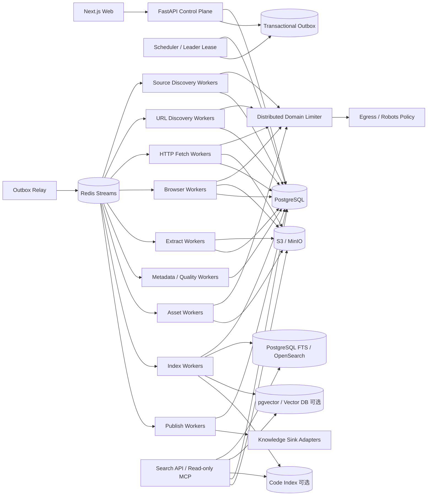

# 博客知识库技术方案

适用范围：从约 1000 个技术博客网站抓取尽可能完整的历史文章，清洗为稳定 Markdown 作为长期知识库；后续可持续增加网站，支持全量回灌、增量同步、版本保留、Web 管理、全文/向量/代码检索及外部知识库发布。整体按“数百万 URL、长期运行、站点异构、可横向扩展、可回放、可审计”设计。

## 1. 建设目标

1. 新增站点后可自动识别 Sitemap、Feed、归档页、分类页、作者页、分页、动态列表和公开 API，完成可解释的历史回灌。
2. 同一站点允许维护多个栏目、频道、Feed、Sitemap、归档入口和动态发现端点，每个端点独立增量同步。
3. 抓取标题、作者、发布时间、更新时间、标签、canonical、正文、代码块、表格、图片和附件，输出结构稳定的 Markdown。
4. 支持 HTTP-first、Browser 按需升级；动态下拉、加载更多、无限滚动使用有界、版本化、可审计的 Browser Action Plan。
5. 支持 ETag、Last-Modified、Sitemap lastmod、Feed GUID/cursor、内容 hash、Provider checkpoint 和重叠窗口驱动的增量同步。
6. 支持断点续跑、幂等、失败重试、指数退避、暂停/恢复、durable cancel、规则回放、离线重抽取和版本回滚。
7. 原始 HTTP 响应、Browser rendered DOM、抽取候选、Metadata candidate、Article IR、Markdown、规则版本和质量结果均可追溯。
8. 提供 Web 管理端完成站点接入、栏目/发现端点管理、规则发布、动态动作 dry-run、抓取进度、错误诊断、质量审核、版本 diff、重复组、资源监控、搜索评测和发布管理。
9. 搜索、Embedding、Reranker、主题分类、摘要和外部 RAG 都是可重建派生层，故障不得迫使系统重新抓取源站。
10. 任何 transport 都统一经过 robots、访问政策、SSRF/Egress、安全预算和域级限流，不以绕过登录、验证码、付费墙或明确访问控制为目标。

## 2. “全量历史”的定义

### 2.1 Live Full

通过当前站点可访问的：

- Sitemap / Sitemap Index；
- RSS / Atom / JSON Feed；
- 年/月归档；
- 分类/标签/作者分页；
- 平台原生 API；
- 普通站内链接；
- 动态列表/无限滚动；
- 公开索引补漏；

发现且当前仍可访问的文章。

### 2.2 Archive Full（可选）

在合规前提下，通过 Common Crawl、Wayback 等补充当前站点已删除、迁移或站内不再暴露的 URL/历史快照证据。

### 2.3 覆盖度不能用单一“完成率”表示

每个站点至少统计：

- 发现 URL 数；
- 已准入 URL 数；
- 当前可访问数；
- 正文成功数；
- summary-only / metadata-only 数；
- 各 Discovery Provider coverage；
- exhaustive Provider 是否达到终点；
- windowed Provider 当前窗口和连续性；
- 未覆盖区域及原因。

队列为空不等于历史全量完成。

## 3. 总体设计原则

1. **PostgreSQL 是业务状态真相源，S3/MinIO 是不可变大对象真相源。**
2. **站点与发现端点分离。** 一个站点可有多个 `site_source/discovery_endpoint`。
3. **发现与访问准入分离。** URL 被发现不代表允许自动抓取。
4. **Feed/Sitemap/API/HTTP/Browser 分层。** Browser 是稀缺升级路径，不是默认入口。
5. **动态浏览动作必须有界。** scroll/click/pagination 都必须有最大次数、时间、链接数和无增长停止条件。
6. **抓取快照不可变。** 抽取规则变化优先对旧 snapshot 离线 replay，而不是重新请求源站。
7. **文章身份与 URL 分离。** redirect、canonical、镜像、迁移不等同于新文章。
8. **版本追加优先。** `article_version` 不覆盖旧版本，current 只是指针。
9. **强去重与近似重复分离。** content hash 可确认强重复；MinHash/SimHash 只产生候选组。
10. **流程状态与内容完整度分离。** `done` 不代表一定有全文。
11. **published_at 与 observed_at 分离。** 不知道真实发布时间时宁可为空。
12. **消费时间窗口与采集状态分离。** “昨天/最近 24 小时”属于 Search/Export 查询，不写进 crawler 状态机。
13. **控制面不执行长任务。** UI/API/Cron 只创建 durable job。
14. **所有跨 PG 与队列的写入通过 Transactional Outbox。**
15. **所有影响结果的组件都版本化。** Profile、Action Plan、Canonicalizer、Fetcher、Extractor、Normalizer、Resolver、Quality Gate、Serializer、Chunker、Embedding、Reranker、Publish Adapter 均有 release id。
16. **LLM 只做候选或派生能力。** 不让 LLM 静默改写 canonical 正文或无证据决定 metadata。
17. **所有结构重写在 DOM/IR/AST 层完成。** 正则只做字段级清洗。
18. **desired state 与 observed state 分离。** 搜索索引和外部知识库通过 reconciliation 最终收敛。
19. **阻塞 I/O 必须隔离。** async Worker 中禁止同步网络 SDK 直接阻塞 event loop。
20. **配置生命周期与内容生命周期分离。** 禁用站点/栏目默认不删除历史内容。
21. **数据库 schema 显式迁移。** 使用 Alembic 等 migration 工具。
22. **增量正确性依赖 Provider 连续性，而不是固定轮询。** windowed Provider 必须持久化 checkpoint、水位、重叠窗口和断档状态。

## 4. 总体架构



逻辑上分为：

- **控制面**：站点、发现端点、Profile、动作计划、规则、计划、预算、权限、任务、发布、回滚。
- **发现面**：Source Discovery、URL Discovery、Provider Checkpoint、Discovery Graph、Coverage 和 Gap Recovery。
- **采集面**：HTTP Fetch、Browser Capture、Archive Fetch。
- **抽取面**：正文候选、Metadata candidate、Normalizer、Resolver、Quality Gate、Article IR、Markdown Serializer。
- **协调面**：Outbox、Redis Streams、DB lease、Scheduler leader lease、域级限流、weighted fairness、backpressure。
- **知识访问面**：全文、向量、代码索引、Hybrid Search、只读 MCP。
- **知识发布面**：S3/本地 Markdown/Bedrock/其它外部知识库 Adapter。

## 5. 推荐技术栈

| 层 | 推荐 | 说明 |
|---|---|---|
| API | Python + FastAPI | CRUD、任务创建、查询、控制面 |
| Web | React / Next.js | 站点、端点、规则、质量、搜索、发布管理 |
| Worker | Python asyncio | I/O 型发现、抓取和轻量抽取 |
| CPU Worker | Process Pool / 独立 Worker | DOM 重抽取、MinHash、大批量转换 |
| 状态库 | PostgreSQL | durable frontier、checkpoint、任务、版本、审计 |
| 迁移 | Alembic | 显式 schema version |
| 队列 | Redis Streams | 短期分发、consumer group，不做真相源 |
| 大对象 | S3 / MinIO | raw response、rendered DOM、IR、Markdown、附件 |
| HTTP | httpx / aiohttp | 长生命周期连接池、条件请求、流式响应 |
| Browser | Playwright + Crawl4AI Adapter | JS 页面、动态列表、rendered DOM、结构化抽取 |
| HTML/正文 | DOM parser + Trafilatura/Readability/Crawl4AI Adapter | 多候选抽取 |
| 全文检索 | PostgreSQL FTS 起步，规模上升后 OpenSearch | 版本化增量索引 |
| 向量 | pgvector 或独立 Vector DB，可选 | canonical 发布后异步构建 |
| 观测 | OpenTelemetry + Prometheus + Grafana + Loki | trace/metric/log |
| 部署 | Docker + Kubernetes | worker 横向扩展、资源隔离 |

第三方抓取库统一通过 Adapter 接入，不能直接控制业务状态机。

## 6. 核心数据模型

### 6.1 `site`

关键字段：

- `id`
- `name`
- `root_url`
- `canonical_host`
- `platform_type`
- `status`
- `robots_policy`
- `crawl_policy`
- `default_profile_release_id`
- `sync_policy_id`
- `created_at / updated_at`

`status=disabled` 只停止未来调度，不删除历史 article/version。

### 6.2 `site_source` / `discovery_endpoint`

用于表达同一站点内部多个栏目、频道和发现入口：

- `id`
- `site_id`
- `name`
- `category`
- `source_url`
- `source_type`：sitemap/feed/archive/category/author/api/html/browser/manual
- `provider_type`
- `capability`：exhaustive/windowed/best_effort
- `locale / region`
- `profile_release_id`
- `action_plan_release_id` 可空
- `sync_policy_id`
- `enabled`
- `created_at / updated_at`

一个站点可以同时拥有多个 Sitemap、Feed、分类归档、年份归档、动态栏目和 API，各端点独立同步。

### 6.3 `site_profile_release`

保存可版本化站点配置：

- URL allow/deny pattern；
- article URL pattern；
- Sitemap/Feed/Archive 候选规则；
- article selector / metadata selector；
- HTTP/Browser 策略；
- canonicalization 规则；
- pagination/infinite-scroll 能力；
- 质量阈值；
- 发布状态：draft/canary/published/rolled_back。

### 6.4 `browser_action_plan_release`

动态页面不默认保存任意 JS，而保存受限动作计划：

- `wait_for`
- `scroll_to_bottom`
- `click_if_exists`
- `next_page_selector`
- `extract_links_selector`
- `max_iterations`
- `max_scrolls`
- `max_clicks`
- `max_duration_ms`
- `max_links`
- `no_growth_rounds`
- `same_link_set_rounds`
- `network_idle_timeout`
- `release_state`

无法用 DSL 表达的少数站点再使用受审计的 Custom Adapter。

### 6.5 `discovery_provider_state`

每个端点的 Provider 实例独立保存连续性状态：

- `provider_instance_id`
- `site_id`
- `site_source_id`
- `provider_type`
- `source_url`
- `cursor_or_guid`
- `watermark_time`
- `last_success_at`
- `last_item_observed_at`
- `oldest_visible_at`
- `overlap_window`
- `retention_hint`
- `continuity_state`：ok/gap_suspected/reconciling/blocked
- `checkpoint_version`
- `next_discovery_at`

Checkpoint 是业务状态，必须持久化在 PostgreSQL。

### 6.6 `url_record`

建议字段：

- `id, site_id`
- `url_raw`
- `url_normalized`
- `url_hash`
- `url_hash_algorithm`
- `canonical_url_hint`
- `kind`：article/index/feed/sitemap/asset/unknown
- `admission_state`
- `crawl_state`
- `first_seen_at / last_seen_at`
- `last_fetch_at`
- `etag / last_modified`
- `http_status`
- `content_hash_last`
- `next_check_at`
- `deleted_confirmations`

`url_hash` 使用 SHA-256/BLAKE3 等稳定算法，对规范化 URL 计算；唯一约束以 `(site_id, url_hash)` 为主，不把标题当唯一键。

### 6.7 `discovery_edge`

保存多来源发现证据：

- `from_url_id` 可空
- `to_url_id`
- `site_source_id`
- `provider_instance_id`
- `run_id`
- `anchor_text`
- `category_hint`
- `discovered_at`

同一 URL 可同时来自 Sitemap、Feed、多个栏目和普通链接，证据不得相互覆盖。

### 6.8 `fetch_task`

至少包含：

- `id`
- `url_id`
- `transport_requested`
- `priority`
- `status`
- `attempt_count`
- `last_error_class`
- `next_attempt_at`
- `lease_owner`
- `lease_until`
- `cancel_requested_at`
- `created_at / updated_at`

Scheduler 只派发 `next_attempt_at <= now()` 且 lease 可领取的任务。

### 6.9 `fetch_attempt`

每次真实执行都追加不可变尝试：

- `attempt_id`
- `fetch_task_id`
- `url_id`
- `worker_id / worker_generation_id`
- `transport`
- `started_at / finished_at`
- `duration_ms`
- `outcome`
- `status_code`
- `error_class`
- `bytes_received`
- `escalation_reason`
- `retry_decision`
- `next_attempt_at`
- `snapshot_id` 可空

### 6.10 `fetch_snapshot`

每次成功或有保留价值的响应生成不可变记录：

- `snapshot_id`
- `url_id`
- `attempt_id`
- `transport`：http/browser/archive
- `requested_at / responded_at`
- `status_code`
- `final_url`
- `redirect_chain`
- `body_object_key`
- `rendered_dom_object_key`
- `body_hash`
- `fetcher_release_id`
- `request_profile_release_id`
- `capture_profile_release_id`
- `robots_decision`
- `egress_decision`
- `transport_escalation_reason`

### 6.11 `article` 与 `article_version`

`article` 是稳定逻辑实体：

- `article_id`
- `site_id`
- `canonical_url_id`
- `current_version_id`
- `duplicate_group_id`
- `status`

`article_version` 是不可变版本：

- `version_id`
- `article_id`
- `snapshot_id`
- `title_raw / title_normalized`
- `author_raw / author_normalized`
- `published_at / updated_at`
- `published_timezone`
- `first_seen_at / captured_at`
- `content_hash`
- `content_completeness`：full/summary_only/metadata_only
- `content_quality_state`
- `article_ir_object_key`
- `markdown_object_key`
- `extractor_release_id`
- `normalizer_release_id`
- `resolver_release_id`
- `quality_gate_release_id`
- `serializer_release_id`
- `published_state`

### 6.12 其它表

还应包含：

- `discovery_run`
- `browser_action_run`
- `extraction_run`
- `metadata_candidate`
- `duplicate_group`
- `asset`
- `job / job_stage`
- `scheduler_lease`
- `outbox_event`
- `search_generation`
- `enrichment_artifact`
- `knowledge_sink / publish_bundle / publish_state`
- `quality_sample`
- `audit_log`

## 7. 站点接入与 Profile 体系

### 7.1 自动接入流程

1. 用户输入站点根 URL。
2. Source Discovery 检测 robots、Sitemap、Feed、平台指纹、归档、分类、作者、API 和 canonical host。
3. 识别一个站点下的多个候选 `site_source`。
4. 生成候选 Platform Profile、Site Override、Action Plan。
5. 抽样 20~100 个 URL 做 discovery/fetch/extract dry-run。
6. Web 管理端展示 URL 命中率、正文质量、metadata 完整度、Browser 升级率、动作 trace 和异常样本。
7. 管理员发布 release。
8. 创建 Full Backfill Job。

### 7.2 配置优先级

```text
Global Default
  -> Platform Profile
  -> Site Override
  -> Site Source Override
  -> Extraction Contract
  -> Custom Adapter
```

Profile、Source Override、Action Plan 都必须可灰度发布和回滚。

### 7.3 规则变更的最小重放

- selector 改动：只重抽取已有 snapshot；
- Metadata Resolver 改动：只重跑 metadata resolve；
- Serializer 改动：从 Article IR 重新生成 Markdown；
- URL Canonicalizer 改动：重算 identity candidate，不必重新抓网页；
- Action Plan 改动：只影响后续动态 discovery。

## 8. 历史全量 URL 发现

### 8.1 Provider 优先级

按低成本、高确定性顺序：

1. robots 声明的 Sitemap；
2. 常见 Sitemap/Sitemap Index；
3. RSS/Atom/JSON Feed；
4. 平台原生 API；
5. 年/月/分类/标签/作者归档；
6. 静态分页；
7. 动态列表/无限滚动；
8. 站内链接 BFS/Best-first；
9. 公开搜索/索引补漏；
10. Common Crawl / Wayback 可选。

每个 Provider 流式产生 URL，不一次把全站 URL 装入内存。

### 8.2 Provider capability

- `exhaustive`：可枚举到确定终点，例如完整 Sitemap、完整年份分页。
- `windowed`：只暴露近期窗口，例如首页、新闻流、有限 RSS、最多 N 条动态列表。
- `best_effort`：站内链接、公开搜索等补漏来源。

Full Backfill 只有所有必须的 exhaustive Provider 达到可解释终点，才可标记历史覆盖完成；windowed Provider 不能单独证明全量。

### 8.3 Durable Frontier

URL 一进入系统即：

```text
url_raw
 -> Canonicalizer release
 -> url_normalized
 -> SHA-256
 -> INSERT ... ON CONFLICT
 -> 首次插入才创建后续任务
```

Redis 中只放 task id，不放业务唯一真相。

## 9. 动态列表与 Browser Action Plan

动态页面是 1000 站点规模下最容易失控的部分，必须单独治理。

### 9.1 推荐动作 DSL

```yaml
steps:
  - wait_for: "main"
  - repeat:
      max_iterations: 20
      until:
        no_new_links_rounds: 2
      actions:
        - scroll_to_bottom: true
        - wait_ms: 800
        - click_if_exists: ".load-more"
        - wait_ms: 800
extract_links:
  selector: "article a[href]"
budgets:
  max_duration_ms: 30000
  max_links: 500
  max_scrolls: 20
  max_clicks: 20
```

### 9.2 必须记录的停止原因

- `target_reached`
- `no_new_links`
- `button_missing`
- `cursor_repeated`
- `max_iterations`
- `max_duration`
- `max_links`
- `page_timeout`
- `blocked`

### 9.3 Browser action trace

每次 `browser_action_run` 保存：

- action plan release；
- 每轮动作；
- 新增链接数；
- 当前链接总数；
- click/scroll 次数；
- 页面 URL/cursor；
- 停止原因；
- rendered DOM snapshot。

### 9.4 优先识别底层 API

如果“加载更多”实际调用公开稳定的 JSON/XHR/API，应优先把 API 注册为 provider；Browser 只作为发现和验证手段。

## 10. 增量同步

### 10.1 多端点增量

每个 `site_source` 可有独立同步策略：

- Feed：高频；
- Sitemap：中频；
- 首页/动态栏目：按变化率自适应；
- 历史归档：低频 reconciliation；
- 已知文章：更低频条件请求。

### 10.2 Provider Checkpoint、Overlap 与 Gap Detection

对 Feed、首页、API、动态栏目等 windowed Provider：

1. 读取上一 `cursor/GUID/watermark/last_success_at`；
2. 每轮保留有界 overlap；
3. URL 由 Durable Frontier 幂等去重；
4. discovery outcome 和新 checkpoint 事务性落库后再推进水位；
5. 若停机超过 `retention_hint`、watermark 异常、最老可见条目突然变新或 cursor 回退，标记 `gap_suspected`；
6. 自动创建 reconciliation job，扩大到 Sitemap、Archive、API、公开索引等补漏；
7. 补漏达到可解释终点后才恢复 `ok`。

### 10.3 条件请求

已抓 URL 使用：

- `If-None-Match` / ETag；
- `If-Modified-Since` / Last-Modified；
- 304 只更新观测状态；
- 200 后先比较 response/content hash；
- 正文和 canonical metadata 无实质变化则不生成新版本。

### 10.4 自适应同步频率

根据变化率、发现延迟、429/503、Retry-After 动态计算 `next_discovery_at`。调频不能替代连续性检查。

### 10.5 时间语义

分别保存：

- `published_at`
- `updated_at`
- `first_seen_at`
- `captured_at`
- 原始时间字符串和 timezone provenance

“昨天/本周/最近 24 小时”由 Search/Export 层按调用者时区查询，不写死在 crawler 中。

## 11. Fetch Strategy

### 11.1 决策链

```text
HTTP -> Browser -> Blocked / Manual Review
```

Browser 只在以下证据成立时升级：

- HTTP 正文为空或明显不完整；
- 内容依赖客户端 JS；
- Profile 明确标记 Browser required；
- selector 只在 rendered DOM 命中；
- 动态 discovery action plan 必需。

升级原因写入 attempt/snapshot。

### 11.2 不允许的自动升级

验证码、登录、付费墙、明确访问拒绝：进入 `blocked/manual_review`，不无限变换指纹绕过。

### 11.3 Retry Matrix

| 错误 | 策略 |
|---|---|
| DNS/连接超时 | 指数退避 + 抖动 |
| 429 | 尊重 Retry-After，域级整体降速 |
| 5xx | 有上限重试 |
| 404/410 | 进入删除确认 |
| robots deny | 不重试 |
| Browser crash | worker 自愈后重试 |
| selector miss | 进入抽取诊断，不盲目 Browser 重试 |
| challenge/login/paywall | blocked/manual |

任务必须持久化 `next_attempt_at`，不能只在进程内 sleep。

### 11.4 HTTP Client Pool

HTTP Worker 维护长生命周期 client generation：

- keep-alive；
- per-host connection pool；
- connect/read/write/total timeout；
- DNS cache TTL；
- redirect 上限；
- compressed/decompressed bytes budget；
- response streaming；
- circuit breaker；
- generation age/tasks。

不要为每个 URL 新建完整 HTTP session。

## 12. 调度、限流与资源保护

### 12.1 三层并发控制

1. Global Scheduler：系统总在途量和 job 权重。
2. Distributed Domain Limiter：同一域 HTTP、Browser、Feed、Sitemap、Asset 共享 token bucket。
3. Local Resource Dispatcher：按 worker RSS、CPU、page 数、event-loop lag 收缩本地并发。

### 12.2 跨域公平

使用 domain/site weighted fair queue。Full Backfill 优先级低于日常增量，避免历史回灌淹没新文章。

### 12.3 Browser Worker Pool

Browser 与 HTTP Worker 分离。每个 Browser Worker 维护 generation：

- `started_at`
- `tasks_processed`
- `pages_open`
- `contexts_open`
- `rss_bytes`
- `consecutive_crashes`

达到最大任务数、RSS、存活时间、page/context 泄漏或连续 crash 阈值时进入 draining，再重建 browser。

### 12.4 Backpressure

当 Extract、S3、Search、Publish 下游积压时，Fetch Scheduler 降速，不能无限扩大上游吞吐。

### 12.5 Scheduler HA

采用 PostgreSQL advisory lock、`scheduler_lease` TTL/heartbeat 或完全可竞争的 durable job，避免多副本重复生成周期任务。

## 13. Capture、抽取与 Markdown

### 13.1 Capture First

HTTP response bytes 或 Browser rendered DOM 先写对象存储：

```text
captures/{site_id}/{snapshot_id}/response.bin
captures/{site_id}/{snapshot_id}/rendered.html
```

再进行抽取。这样规则变化可 `re-extract without refetch`。

### 13.2 多候选抽取

Metadata 候选包括：

- JSON-LD；
- OpenGraph；
- `<meta>`；
- Feed metadata；
- CSS extraction schema；
- URL/平台规则。

正文候选包括：

- 站点 CSS contract；
- Trafilatura；
- Readability；
- Crawl4AI extraction；
- 平台 Adapter。

候选保留 provenance，再由 Resolver/Quality Gate 决定 canonical 结果。

### 13.3 Article IR

正文不要直接压成纯文本，先转换为 Article IR：

- heading；
- paragraph；
- list；
- code block + language；
- table；
- image/figure；
- link；
- blockquote；
- math 可选。

### 13.4 Markdown 输出契约

Front Matter 建议：

```yaml
---
article_id: ...
version_id: ...
site_id: ...
source_url: ...
canonical_url: ...
title: ...
author: ...
published_at: ...
updated_at: ...
content_completeness: full
content_hash: ...
captured_at: ...
---
```

正文要求：

- 标题层级连续；
- fenced code block 保留语言；
- 表格合法；
- 图片转稳定 asset URL 或相对引用；
- 导航、cookie banner、推荐流不进入正文；
- Markdown 可重新解析。

### 13.5 本地 Markdown Sink

若提供本地导出：

```text
write temp -> fsync -> atomic rename -> update manifest
```

文件名只用于友好导出，不作为 canonical identity。

## 14. 内容完整度与质量门禁

`content_completeness`：

- `full`
- `summary_only`
- `metadata_only`

`content_quality_state`：

- `pass`
- `suspect`
- `fail`

质量检查：

- 正文字符数/段落数；
- 标题与正文相关性；
- 导航链接密度；
- boilerplate 比例；
- code block 是否异常丢失；
- metadata 完整度；
- challenge/login/paywall 特征；
- 与上一版本差异是否异常；
- selector 命中率；
- 动态列表是否停止于预算而非真实终点。

summary-only 可进入知识库，但搜索/RAG 应降低权重，并在 UI 显式展示。

## 15. 文章身份、去重与版本

### 15.1 URL 规范化

统一处理：

- scheme/host；
- `www` 与 canonical host；
- fragment；
- tracking 参数；
- trailing slash；
- redirect chain；
- `<link rel=canonical>` 作为证据而非绝对真相。

### 15.2 URL hash

对 `url_normalized` 使用 SHA-256/BLAKE3，保存算法版本。MD5 不作为长期主身份算法。

### 15.3 强去重

正文规范化后计算 `content_hash`。hash 相同可确认同内容，但仍保留所有 URL 和发现证据。

### 15.4 近似重复

采用 SimHash/MinHash + LSH 产生候选，再计算正文相似度形成 `duplicate_group`，不自动物理删除 provenance。

### 15.5 版本生成

只有 canonical 正文或 canonical metadata 有有效变化时创建新 `article_version`。抓取时间变化、广告变化、ETag 变化但正文 hash 未变，不产生正文新版本。

## 16. 搜索与知识访问

### 16.1 Chunk

基于 Article IR/Markdown AST 分块，不按固定字符暴力切。代码块、表格和标题层级保持语义边界。

### 16.2 Lexical Search

小规模使用 PostgreSQL FTS；数百万文章和复杂分词/QPS 时迁移 OpenSearch。

全量重建使用 Search Generation：

1. 创建新 generation；
2. 从 PG/S3 重放当前已发布版本；
3. 校验；
4. 原子切 alias；
5. 延迟清理旧 generation。

### 16.3 Vector / Code Search

Embedding、Contextual Embedding、Code Summary 均是可重建派生物，记录模型、prompt、chunker、projection 和 release。

### 16.4 Search API / MCP

至少支持：

- 关键词搜索；
- site/source/category/tag/time 筛选；
- hybrid search；
- 获取 current version；
- 获取历史版本；
- 获取 provenance/source URL；
- 查看 content completeness。

## 17. Web 管理功能

### 17.1 站点与发现端点

- 新增/禁用站点；
- 自动平台识别；
- 一个站点维护多个 `site_source`；
- Sitemap/Feed/API/Archive/动态列表检测；
- Profile/Override diff、灰度发布、回滚；
- endpoint 级同步频率和预算。

### 17.2 Browser Action Plan

- 可视化编辑动作 DSL；
- dry-run；
- 展示每轮新增链接数；
- scroll/click 次数；
- stop reason；
- rendered DOM；
- 当前 action plan release；
- 动态列表“连续无增长”告警。

### 17.3 历史回灌与增量

- Full Backfill Job；
- Incremental Sync Job；
- Provider coverage/capability；
- checkpoint/watermark/last_success_at；
- `gap_suspected` 区间与补漏结果；
- 暂停、恢复、取消、重试。

### 17.4 内容质量

- Markdown 预览；
- 原 HTML/rendered DOM 对照；
- metadata candidate/Resolver 证据；
- 版本 diff；
- summary-only/metadata-only；
- duplicate group；
- extraction drift。

### 17.5 运行资源

查看：

- 每域请求速率、429/403；
- HTTP -> Browser 升级率及原因；
- HTTP pool 饱和度；
- Browser RSS/page/context；
- Browser generation age/tasks；
- event-loop lag；
- thread/process pool queue；
- 队列 oldest task age；
- retry_wait 和 next_attempt_at；
- 对象存储和索引容量。

### 17.6 权限与审计

至少 viewer/operator/admin；站点规则发布、Action Plan 发布、删除、Profile 回滚、手工重抓、Knowledge Sink 变更、Delete Job、schema migration 必须写 audit log。

## 18. 外部知识库发布

定义 `Publish Bundle`：

- article/version id；
- Markdown；
- metadata JSON；
- chunk 可选；
- asset manifest；
- content hash；
- delete/tombstone instruction。

Knowledge Sink Adapter 可实现：

- S3 导出；
- 本地 Markdown；
- Amazon Bedrock Knowledge Bases；
- 其它 RAG/Search/Vector 系统。

每个 sink 保存 desired version 和 observed version，通过 reconciliation 对账。发布失败只重试 publish，不重新抓源站。

## 19. 状态机、幂等与指标真相

### 19.1 主状态

```text
discovered -> admitted -> fetch_queued -> fetching -> captured
 -> extracting -> quality_check -> published
```

异常：

- `retry_wait`
- `blocked`
- `quality_failed`
- `manual_review`
- `tombstoned`

Provider 连续性独立表达：`ok / gap_suspected / reconciling / blocked`。

### 19.2 Task Lease

Worker 领取任务写 `lease_owner/lease_until`，完成时 compare-and-set。Worker 崩溃后 lease 到期可重新领取。

### 19.3 Idempotency Key

- Discovery：`provider_instance_id + checkpoint_version + page/cursor`
- Fetch：`url_id + fetch_policy_release + intended_revision`
- Browser Action：`site_source_id + action_plan_release + checkpoint_version`
- Extract：`snapshot_id + extractor_release`
- Serialize：`article_ir_hash + serializer_release`
- Index：`version_id + search_generation`
- Publish：`version_id + sink_id + adapter_release`

追求 exactly-once effect，而不是假设消息只投递一次。

### 19.4 指标必须来自权威 outcome

区分：

- `discovered_total`
- `admitted_total`
- `duplicate_rejected_total`
- `task_created_total`
- `attempt_total`
- `snapshot_created_total`
- `extraction_pass_total`
- `version_published_total`
- `index_success_total`

不能把“函数被调用”计为“新增成功”。

## 20. 数据库、存储与容量

### 20.1 PostgreSQL

PG 保存结构化状态，不保存大 HTML。大表按增长情况分区：

- `fetch_snapshot/fetch_attempt` 按时间 range；
- `url_record` 可按 `site_id` hash；
- `audit/event` 按月。

### 20.2 Migration

使用 Alembic：

1. 应用新版本前单独执行；
2. advisory lock 防并发迁移；
3. 应用启动只检查 schema version；
4. expand/contract 兼容滚动升级；
5. 大表使用在线迁移策略；
6. migration 状态可观测。

### 20.3 对象存储

对象包括：

- raw response；
- rendered DOM；
- normalized HTML 可选；
- Article IR；
- Markdown；
- asset；
- publish bundle；
- enrichment artifact。

对象 key 使用稳定 ID，不使用标题。

### 20.4 容量公式

```text
Raw Storage ≈ article_count × avg_compressed_capture_size × retained_versions
Markdown Storage ≈ article_count × avg_markdown_size × retained_versions
```

正式导入前用 20~50 个代表站点测 p50/p95 HTML、Markdown、asset、Browser 升级率和版本变化率，再决定生命周期策略。

## 21. 可观测性与漂移检测

关键指标：

- URL discovery/admission rate；
- Provider coverage；
- checkpoint age / watermark lag；
- `gap_suspected` 数量和持续时间；
- dynamic action 新链接增长率和 stop reason；
- fetch attempt/success/error by class；
- 304 ratio；
- content change ratio；
- HTTP -> Browser escalation ratio；
- Browser RSS/page/context/generation age；
- event-loop lag；
- extraction pass/suspect/fail；
- summary-only ratio；
- per-domain 429/403；
- queue lag；
- object storage write latency；
- index/publish lag。

### 21.1 Platform/Selector Drift

同一 Profile 的多个站点 selector 命中率同时下降时产生“平台模板漂移”告警，而不是产生大量独立站点故障。

### 21.2 Provider Continuity Drift

最老可见条目突然变新、GUID/时间水位跳跃、Feed 长时间为空、分页 cursor 失效、动态列表持续 0 增长，都应触发 Provider drift/gap 检查。

### 21.3 Trace

每个 URL 贯穿：

```text
discovery_run
 -> site_source/provider checkpoint
 -> browser_action_run 可选
 -> fetch_task
 -> fetch_attempt
 -> snapshot
 -> extraction_run
 -> article_version
 -> index/publish
```

## 22. 安全、合规与隔离

1. robots 与抓取政策在所有 transport 前统一执行。
2. 默认拒绝内网、link-local、metadata service、file/data/javascript 等危险 scheme。
3. 每个 redirect hop 重新做 Egress/SSRF 校验。
4. 设置 response bytes、解压后 bytes、redirect、Sitemap 深度、XML elements、URL 数、Browser 子请求、动作次数、页面时长硬预算。
5. Browser 使用独立容器、非 root、sandbox、只读文件系统和受控下载目录。
6. Markdown/HTML 预览在隔离 origin 展示，禁止原页面脚本执行。
7. Web 管理端默认不允许任意 JS Action Plan；特殊 Custom Adapter 需要代码审核和权限控制。
8. 日志不记录 Cookie、Authorization、完整密钥和敏感 query 参数。
9. 第三方内容版权和再分发策略由站点 policy 记录；外部发布前再次检查 sink policy。
10. 无法合规访问时进入 blocked/manual，不把反爬挑战视为必须绕过的问题。

## 23. 故障恢复与 Reconciliation

### 23.1 Worker 崩溃

依靠 lease 到期重新领取；未完成 attempt 标记 worker_lost 并保留历史。

### 23.2 Browser 泄漏/崩溃

Worker draining，当前任务按 `browser_crash` 分类重试，新 generation 替换旧 browser。

### 23.3 Redis 故障

PG 仍是真相源；Outbox Relay 恢复后重投未确认事件，并扫描“PG 可执行但队列缺失”的任务。

### 23.4 Scheduler Leader 崩溃

lease 到期后新副本接管；任务、checkpoint、next_run 均在 PG。

### 23.5 Provider 断档

`gap_suspected -> reconciliation -> 可解释补漏 -> ok`，下一轮普通同步成功不能自动抹掉缺口。

### 23.6 搜索/向量/外部知识库故障

Canonical 发布继续；恢复后从 article_version/Publish Bundle 重放。

### 23.7 规则发布错误

Profile、Action Plan、Extractor、Normalizer、Serializer 均可回滚 release；旧 snapshot 支持离线重放。

## 24. 部署拓扑

Kubernetes 建议拆为：

- `api`
- `web`
- `scheduler`
- `outbox-relay`
- `source-discovery-worker`
- `url-discovery-worker`
- `http-fetch-worker`
- `browser-worker`
- `extract-worker`
- `metadata-quality-worker`
- `asset-worker`
- `index-worker`
- `publish-worker`

数据库 migration 使用独立 Job/CI step。

Browser Worker 使用独立 node pool 或更严格资源 limit；HTTP/Extract Worker 可高并发，Browser Worker 低并发横向扩容。HPA 不只看 CPU，还看队列 lag、RSS、Browser page 数和 event-loop lag。

## 25. 端到端流程

### 25.1 新站 Full Backfill

```text
Create Site
 -> Source Discovery
 -> Discover Site Sources
 -> Profile / Action Plan Candidate
 -> Sample Dry Run
 -> Publish Releases
 -> Discovery Providers fan-out
 -> Durable URL Frontier
 -> Admission / Robots / Egress
 -> HTTP or Browser Fetch
 -> Immutable Snapshot
 -> Extract Candidates
 -> Metadata Resolve
 -> Article IR
 -> Quality Gate
 -> Markdown Serialize
 -> Article Version Publish
 -> Index / Publish async
```

### 25.2 日常增量

```text
Scheduler
 -> load endpoint/provider checkpoint
 -> Feed/Sitemap/API/Archive/Homepage delta with overlap
 -> dynamic Browser Action if required
 -> persist outcome + checkpoint
 -> continuity check
      -> gap_suspected: reconciliation
      -> ok: continue
 -> new/changed URL
 -> conditional fetch
 -> 304: observation only
 -> changed 200: new snapshot
 -> extract + quality
 -> unchanged content: no new version
 -> changed content: publish new version
 -> async index/publish
```

### 25.3 规则升级重放

```text
Publish Extractor/Profile Release
 -> select affected snapshots
 -> re-extract without refetch
 -> quality compare
 -> canary
 -> publish new article versions if materially changed
```

## 26. 分阶段落地

### 阶段 A：MVP，验证 20~50 个代表站点

必须完成：

- site + site_source；
- Sitemap/Feed/Archive/静态分页 discovery；
- PostgreSQL durable frontier；
- provider checkpoint/watermark/overlap；
- fetch_task + fetch_attempt + lease；
- HTTP + Browser 分层；
- S3 immutable snapshot；
- 基础正文抽取 + Article IR + Markdown；
- article/version；
- Alembic；
- Web 站点/端点/任务/错误/预览；
- 条件请求和增量同步；
- 基础全文搜索。

### 阶段 B：扩到 300~1000 站点

增加：

- Browser Action Plan DSL；
- 动态栏目 dry-run/action trace；
- distributed domain limiter；
- weighted fair scheduler；
- Scheduler HA；
- Provider gap detection + 自动 reconciliation；
- Browser generation/resource guard；
- Platform Profile 批量治理；
- drift detection；
- MinHash/SimHash duplicate group；
- Search Generation；
- Publish Sink；
- 完整成本与容量指标。

### 阶段 C：知识增强

增加：

- Hybrid Search；
- Embedding/Rerank；
- Code Search；
- contextualization；
- MCP；
- 搜索评测和质量回归。

## 27. 验收标准

### 27.1 历史回灌

- 可解释每站点使用了哪些发现端点和 Provider；
- Provider capability 与是否到达终点可查询；
- windowed Provider 不会误当历史全量证明；
- 动态列表有明确 stop reason 和动作预算；
- 中途 kill 任意 worker，任务可从 lease/outbox 恢复；
- 进程重启不会丢 URL frontier；
- 禁用站点/端点不会隐式删除已归档文章。

### 27.2 增量同步

- Feed/Sitemap/API/动态栏目新 URL 可进入增量队列；
- checkpoint/watermark 重启后继续；
- overlap 不重复创建 canonical 文章；
- 停机跨过 windowed Provider 保留窗口时产生 `gap_suspected` 并自动补漏；
- 补漏未完成前不会静默恢复 ok；
- published_at 与 first_seen_at 分离；
- ETag/Last-Modified/304 生效；
- 内容未变不产生无意义新版本。

### 27.3 动态站点

- click/scroll 循环达到无增长条件时可停止；
- 动作超过 max_iterations/max_duration 时强制终止；
- action trace 可从 Web 查看；
- 同一文章来自多个栏目时保留多条 discovery edge；
- Browser 失败不会阻塞 HTTP Worker。

### 27.4 Markdown 与质量

- 标题、正文、代码块、表格、图片结构稳定；
- metadata provenance 可追溯；
- summary-only 不被标为 full；
- Serializer 升级可离线重放；
- 本地导出 crash 不留下半写文件。

### 27.5 规模与可靠性

- 单个大站点不能占满全局 worker；
- HTTP 与 Browser 共享域限流；
- Browser RSS/page 泄漏可触发 draining/recycle；
- 下游变慢产生 backpressure；
- event-loop lag 超阈值收缩本地并发；
- discovered/admitted/snapshot/published 指标可对账。

## 28. 最终推荐

核心组合：

**FastAPI + Next.js + PostgreSQL + Alembic + Transactional Outbox + Redis Streams + S3/MinIO + asyncio HTTP Worker + 独立 Playwright/Crawl4AI Browser Worker Pool + `site_source/discovery_endpoint` 多端点发现模型 + 版本化 Browser Action Plan + DOM/Article IR 抽取层 + 版本化 Markdown Serializer + PostgreSQL/OpenSearch Search Plane。**

对于 1000 个技术博客，关键不是选择一个“最强爬虫库”，而是把站点、栏目/发现端点、Provider 连续性、durable frontier、抓取 attempt、HTTP/Browser 资源治理、不可变快照、抽取规则、文章身份、版本、质量、索引、发布和 Web 运维拆成独立且可重放的层。

这样后续新增网站、增加栏目、替换 Crawl4AI、替换 HTTP 库、增加 Parser、修改动态动作规则、迁移搜索后端或接入新的知识库，都可以在已有 durable state 和 immutable snapshot 上演进，而不重做整条链路，也不会丢失历史覆盖证据、增量连续性、失败尝试和文章版本。