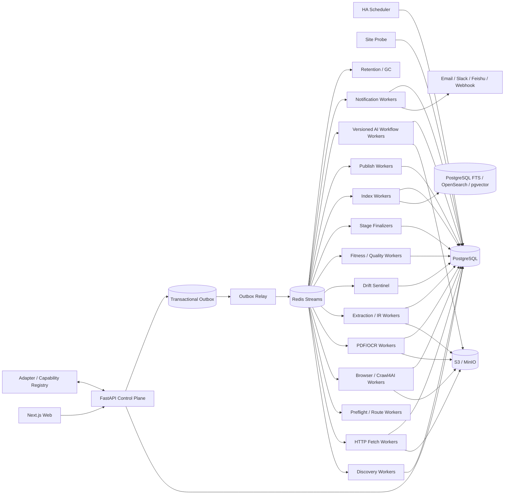

# 博客知识库技术方案

适用范围：从约 1000 个技术博客、技术文档站、Newsletter、厂商工程博客和相关技术内容站点抓取尽可能完整的历史文章，清洗为稳定 Markdown 建设长期知识库；后续持续新增站点，支持增量同步、Web 管理、版本保留、搜索、离线重处理、质量审计、派生 AI、Digest/报告和通知。容量按百万级文档、数百万到千万级 URL、站点高度异构、长期运行设计。

## 1. 建设目标

1. 输入站点根地址、博客入口或 Feed 后，自动探测 Sitemap、RSS/Atom/JSON Feed、公开 API、归档页、分类/标签/作者页、文档导航树、普通站内链接和动态列表。
2. 支持 `FULL_BACKFILL` 历史全量回灌、`INCREMENTAL` 增量同步、`RECONCILE` 周期覆盖校准、`TARGETED_FETCH` 精确补抓、`REPROCESS` 离线重处理。
3. 历史完整性必须有 Provider 级覆盖证据，不能用“队列空了”“达到 max_depth/max_pages”代替。
4. 最终知识对象统一保存标题、作者、发布时间、更新时间、标签、canonical、正文、代码块、表格、图片、附件、真实链接关系和完整 lineage。
5. 默认 HTTP-first；只有出现明确动态渲染证据时才升级 Crawl4AI/Playwright Browser。PDF、Feed、JSON/API、附件按真实 Content-Type 路由。
6. 支持 ETag、Last-Modified、Sitemap lastmod、Feed GUID/API cursor、body hash、Document IR hash、重叠时间窗和周期 Reconcile 驱动的增量同步。
7. 支持 durable frontier、断点续跑、幂等、lease、heartbeat、重试、限流、熔断、公平调度、backpressure 和 dead-letter。
8. 保存不可变网络 Snapshot、渲染 DOM、清洗 HTML、raw/fit Markdown、Canonical Document IR、最终 Markdown、规则版本和质量结果；规则升级优先离线 replay。
9. Web 管理端覆盖站点接入、Provider 覆盖、任务控制、URL 诊断、质量审核、版本 diff、搜索、成本、AI Workflow、Digest/报告、通知和审计。
10. LLM 摘要、主题、Embedding、聚类、趋势分析、Newsletter 和报告都是 Accepted Document Version 的下游能力，失败不能阻塞源站同步。

## 2. 核心原则

1. **PostgreSQL 是业务状态真相源；S3/MinIO 是不可变大对象真相源。**
2. Redis Streams 只承担任务运输；决定性状态先写 PostgreSQL，再通过 Transactional Outbox 投递。
3. Source Adapter、Discovery、Content Fetch、Extraction、Quality、Publish、Derived AI 分离。
4. Sitemap、Feed、API、Archive、DOC_NAVIGATION、HTML Frontier、Browser Dynamic Listing 是独立 Discovery Provider；单一 Provider 不能证明全站抓全。
5. Discovery 只产生 URL candidate 和 evidence；列表页、搜索页、Feed 摘要不能直接充当最终文章正文。
6. “URL 已知”不等于“内容仍新鲜”；Identity 与 Freshness 分离。
7. HTTP、Browser、PDF/OCR 分层处理，不把所有 URL 无条件交给浏览器。
8. Browser 是昂贵升级路径；生产中复用长期 Browser/Crawl4AI runtime，不为每个 URL 重建进程。
9. HTTP 200、Browser success、Extractor 无异常都不能证明内容有效，必须经过独立 Content Fitness Gate 和 Quality Validator。
10. Crawl4AI Markdown 只是 extraction candidate；最终知识真相是 accepted Canonical Document IR。
11. 文档 identity 与 URL 分离；redirect、canonical、slug rename、镜像和站点迁移只是 identity evidence。
12. `document_version` append-only，不原地覆盖旧版本。
13. 文件路径只属于发布视图，不能承担 document identity，也不能用“文件存在”判断已同步。
14. `max_depth/max_pages/max_runtime` 只是单次预算，不能作为历史完整性判定。
15. 固定字数阈值、关键词相关性、用户偏好只能影响优先级或派生 AI 选择，不能静默裁掉 FULL_BACKFILL 中的合法历史 URL。
16. Scheduler、FastAPI BackgroundTasks、`asyncio.create_task()`、进程内队列、浏览器进程和前端页面都是可丢失运行时状态，不能替代数据库里的 run/task/schedule/delivery。
17. 抓取时间不能伪装成发布时间；未知发布时间保持 NULL，并保留字段来源与置信度。
18. 人工操作使用 append-only Audit/Event；人工偏好不修改不可变 Snapshot 或 accepted version。
19. 派生 AI 从明确的 accepted `document_version_id` 集合出发；模型、Prompt、Workflow 升级优先重放已有 IR/Snapshot，不重新访问源站。
20. 遵守 robots、站点政策、访问控制和合理速率；验证码、登录、付费墙、WAF 挑战进入策略流程，不自动绕过。

## 3. 总体架构



职责：

- **Control Plane**：站点、配置 Release、Run、Schedule、人工命令、权限、审计。
- **Discovery**：枚举候选 URL、checkpoint、覆盖证据，不写最终正文。
- **Admission**：URL 规范化、Scope、robots、crawler trap、安全检查。
- **Fetch**：HTTP 条件请求、Browser 升级、PDF/OCR、不可变 Snapshot。
- **Extraction/IR**：生成 extraction candidate 和统一 Document IR。
- **Drift/Fitness/Quality**：防空抓、错抓、过度裁剪和模板漂移。
- **Finalizer**：对账阶段真实产物、retry/dead-letter 和完整性。
- **Index/Publish**：生成搜索索引、Markdown 文件树、Git 或外部 KB Projection。
- **Derived AI**：摘要、主题、趋势、Digest、Newsletter、报告等版本化 DAG。
- **Notification**：持久化投递，和抓取完成语义解耦。

## 4. Crawl Mode 与 Run 语义

```text
FULL_BACKFILL     首次历史全量回灌
INCREMENTAL       持续同步新增和更新
RECONCILE         周期重新枚举，修复断档
TARGETED_FETCH    精确 URL 抓取、调试或补抓
REPROCESS         不访问源站，基于已有 Snapshot 重抽取/清洗/质量/索引/发布
```

规则：

- 同站点默认只允许一个 active FULL_BACKFILL。
- INCREMENTAL 可与 Derived AI、Index、Publish 并行，但同一 URL 的 fetch/extract 通过幂等键去重。
- TARGETED_FETCH 必须逐项返回指定 URL 的真实结果。
- REPROCESS 必须记录 `source_snapshot_id` 和完整 lineage。
- Run 完成由 Stage Finalizer 判断，不由“协程已结束”判断。

## 5. 核心数据模型

建议至少包含：

```text
site
site_profile_release
source_adapter_release
adapter_binding_release
discovery_provider_release
discovery_checkpoint
coverage_ledger
crawl_run
run_stage
run_context
url_identity
url_observation
frontier_task
fetch_snapshot
artifact
extraction_candidate
document
document_identity_evidence
document_version
quality_result
drift_event
outbox_event
schedule
command
ai_workflow_release
ai_stage_release
ai_run
ai_stage_execution
selection_manifest
delivery
audit_event
```

关键约束：

```text
UNIQUE(url_identity.normalized_url_hash)
UNIQUE(frontier_task.idempotency_key)
UNIQUE(fetch_snapshot.request_fingerprint, response_body_hash)
UNIQUE(document_version.document_id, content_hash)
UNIQUE(delivery.idempotency_key)
```

大表如 `url_observation/frontier_task/fetch_snapshot/audit_event` 按时间或 site hash 分区；对象内容存 S3/MinIO，PostgreSQL 只保存 metadata、状态、hash、lineage 和索引字段。

## 6. 新站点接入与可扩展 Adapter

绝大多数站点通过“配置 + 通用 Provider”接入，少量特殊平台才写代码 Adapter。

### 6.1 Site Probe

新增站点后自动执行：

1. 根 URL/博客入口可达性检查；
2. `robots.txt`；
3. `sitemap.xml`、sitemap index、常见变体；
4. RSS/Atom/JSON Feed autodiscovery；
5. HTML `link rel=alternate`；
6. CMS/平台识别：WordPress、Ghost、Substack、Hugo、Jekyll、Docusaurus、MkDocs、Medium 等；
7. 归档、分类、标签、作者、分页模式；
8. 是否依赖 JS；
9. canonical/语言/站点迁移规则；
10. 推荐 Provider 组合和初始 Crawl Scope。

Probe 结果生成待审核 `site_profile_release`，审核通过后才进入生产运行。

### 6.2 Source Adapter SDK

开发态接口保持小而稳定：

```python
class SourceAdapter(Protocol):
    async def discover(self, ctx) -> AsyncIterator[DiscoveryRecord]: ...
    async def checkpoint(self) -> AdapterCheckpoint: ...
```

统一 `DiscoveryRecord`：

```text
source_url
source_item_id
canonical_hint
title_hint
published_at_hint
updated_at_hint
cursor/page_token
content_type_hint
fetch_route_hint
discovery_evidence
raw_metadata_ref
```

生产 Registry 必须由显式 Release/Manifest 驱动，声明：版本、配置 schema、能力、历史覆盖语义、checkpoint 语义、速率提示、允许域名、运行镜像 digest、健康检查和 Golden Fixture。

## 7. Discovery 与历史覆盖证明

### 7.1 Provider

- Sitemap / Sitemap Index
- RSS / Atom / JSON Feed
- CMS/API
- Archive / Pagination
- Category / Tag / Author
- DOC_NAVIGATION
- HTML Frontier
- Browser Dynamic Listing
- Aggregator/Search API（仅辅助发现）

任何 Provider 都只产出 URL candidate，不直接创建 accepted document。

### 7.2 Coverage Ledger

每次 FULL_BACKFILL 为每个 Provider 记录：

```text
provider_release_id
provider_scope
started_at/finished_at
checkpoint_start/checkpoint_end
pages_scanned/items_seen
new_urls/known_urls/rejected_urls
terminal_reason
coverage_evidence_artifact_id
error_summary
```

完整性判定必须说明“哪些 Provider 已穷举、哪些只能抽样、哪些被策略限制”。

### 7.3 两阶段抓取

正确流程：

```text
Feed / Sitemap / Archive / Listing / Search
    -> DiscoveryRecord
    -> URL Identity + Admission
    -> Frontier
    -> Origin Article Fetch
    -> Snapshot
    -> Extraction
```

列表页卡片、Feed 摘要或搜索摘要只能作为 metadata hint，不能替代 origin article Snapshot。

## 8. URL Admission、Identity 与安全

URL 进入网络请求前依次经过：

```text
normalize
 -> scheme/host/port policy
 -> scope release
 -> canonicalization rules
 -> robots policy
 -> crawler-trap detection
 -> file/content-type hints
 -> DNS/IP/redirect egress validation
 -> durable frontier
```

需过滤或降权：日历无限翻页、session 参数、排序参数组合、搜索结果页、登录/购物车、无限 faceted navigation 等。

`url_identity` 保存 normalized URL；`document` 是内容实体。canonical、redirect、相似标题、内容 hash、站点迁移规则都只能作为 Document Identity evidence，由显式合并策略决定。

## 9. Durable Frontier、调度与并发

### 9.1 任务状态

```text
PENDING -> LEASED -> RUNNING -> SUCCEEDED
                       |-> RETRY_WAIT
                       |-> DEAD_LETTER
                       |-> CANCELLED
```

每个任务至少有：

```text
idempotency_key
site_id/domain_key
run_id/stage
priority
attempt/max_attempts
available_at
lease_owner/lease_until
heartbeat_at
error_code
```

### 9.2 三层并发控制

- 全局 Worker 并发：保护集群。
- site/domain quota：默认单域 1~4 并发，根据历史延迟/429 自动调节。
- route quota：Browser、PDF/OCR、LLM 各有独立资源池。

使用 weighted fair scheduling 防止大站点长期占满队列；遇到 Redis/S3/目标站变慢时通过 backpressure 降低新任务租约速度，而不是无限积压内存协程。

禁止把百万 URL 一次性 `asyncio.gather()`；Worker 每次只领取受控批量。

## 10. Fetch Decision Router

### 10.1 HTTP-first

HTTP Worker 优先执行：

- 条件请求：`If-None-Match`、`If-Modified-Since`；
- gzip/br；
- redirect 链；
- Content-Type；
- response headers；
- body hash；
- 网络时间和状态码。

命中 304 时更新 freshness observation，不重复创建正文版本。

### 10.2 Browser 升级条件

出现以下证据之一再升级：

- 初始 HTML 几乎无正文，但页面存在 SPA hydration/script data；
- 列表必须滚动/点击加载；
- 关键 DOM 在 JS 执行后才出现；
- HTTP 与已知 Golden Pattern 差异异常；
- 站点 Profile 明确要求 Browser。

Browser/Crawl4AI runtime 长期复用，按 domain/context 策略隔离，不为每个 URL 新建浏览器进程。

### 10.3 Cache 与 Snapshot

禁止生产默认 `CacheMode.BYPASS` 思路。网络结果先创建不可变 Snapshot：

```text
request_url/final_url
request_headers fingerprint
response_status/headers
fetched_at
body_hash
artifact_id
route=HTTP|BROWSER|PDF
browser_runtime_release_id
```

后续 Extractor 升级优先 REPROCESS Snapshot。

## 11. Extraction、Document IR 与 Markdown

### 11.1 Extraction Candidate

候选来源可以是：

- Trafilatura / rs-trafilatura
- Crawl4AI cleaned HTML / Markdown
- CSS/XPath selector
- JSON-LD / OpenGraph
- CMS/API structured content
- PDF text/OCR

多个 candidate 允许并存，由质量策略择优，不把“第一个 selector 有结果”视为成功。

### 11.2 Metadata Provenance

每个字段至少保存：

```text
value
source_type = JSON_LD | META | FEED | API | HTML | MANUAL
source_artifact_id
extractor_release_id
confidence
```

时间字段明确区分：

```text
observed_at
fetched_at
published_at
updated_at
published_at_hint
```

无法确认 `published_at` 时为 NULL，禁止填当前时间。

### 11.3 Canonical Document IR

```text
document_id/version_id
canonical_url
title
subtitle
authors[]
published_at/updated_at
language
tags[]
summary
blocks[]
links[]
images[]
attachments[]
source_snapshot_id
metadata_provenance
content_hash
```

`blocks[]` 保留 heading、paragraph、code、table、quote、list、image、math 等结构。

### 11.4 Markdown Projection

最终 Markdown 由 IR 渲染：

```yaml
---
document_id: ...
source_url: ...
canonical_url: ...
title: ...
authors: [...]
published_at: ...
updated_at: ...
fetched_at: ...
version_id: ...
content_hash: ...
---
```

建议发布路径：

```text
knowledge/<site_slug>/<yyyy>/<mm>/<slug>--<document_id>.md
```

路径变更不影响 document identity。

## 12. 增量同步与 Freshness

按站点能力组合使用：

1. RSS/Atom GUID + pubDate；
2. Sitemap lastmod；
3. API cursor/page token；
4. ETag/Last-Modified；
5. body hash；
6. Document IR hash；
7. Archive 最新页重叠扫描；
8. 周期 RECONCILE。

每个 Provider 有独立 checkpoint，成功提交后推进；失败不越过未完成区间。

建议：

- 高频更新站：15~60 分钟 Feed/API；
- 普通博客：2~12 小时；
- 周更/低频：每日；
- 全站 RECONCILE：每周或每月；
- 历史归档页以较低频重新扫描。

“近期窗口 + overlap”用于处理 Feed 延迟、文章补发、时间字段修正和 API 最终一致性。

## 13. Quality、Content Fitness 与 Extraction Drift

### 13.1 Fitness Gate

至少检查：

- 正文非空；
- title/body 比例；
- boilerplate/link density；
- 代码块和表格保留度；
- 页面类型；
- login/paywall/challenge；
- 重复正文；
- 字符集和语言；
- metadata 完整度。

短 FAQ/API reference 不因固定字数自动失败；阈值只是评分信号。

### 13.2 Drift Sentinel

按站点模板/Extractor Release 监控：

- 正文长度分布突变；
- selector 命中率突变；
- title/body 空值率；
- link density；
- DOM/template fingerprint；
- accepted/rejected 比例；
- Golden Sample diff。

疑似漂移时暂停该 extractor release 的自动接受，可回退上一 release 或进入人工审核。

## 14. Web Control Plane

推荐 Next.js + FastAPI。长任务一律命令化：

```text
POST /runs
  -> PostgreSQL transaction: command + crawl_run + outbox
  -> 返回 run_id

GET /runs/{id}
  -> 读取数据库真实状态
```

禁止在 API 请求内用 BackgroundTasks/`asyncio.create_task()` 承担持久任务。

核心页面：

1. 站点列表与接入向导；
2. Site Probe/Capability；
3. Adapter/Provider Release；
4. FULL_BACKFILL/INCREMENTAL/RECONCILE Run；
5. Provider Coverage Ledger；
6. URL/Document 诊断；
7. Snapshot、Extraction Candidate、IR、Markdown diff；
8. Drift/Quality 审核；
9. Dead-letter 与人工重试；
10. Schedule；
11. 搜索与文档版本；
12. AI Workflow/Digest/Report；
13. Delivery/通知；
14. 成本、速率、错误率、freshness、覆盖率；
15. Audit Log。

健康接口分层：

```text
/health/live       进程存活
/health/ready      PG/Redis/S3 等核心依赖可用
/health/components Browser/Crawl4AI/Search/LLM/Email 等能力矩阵
```

不能把“HTTP 接口能返回 200”当整体系统 healthy。

## 15. 持久化 Schedule

`schedule` 是数据库实体，不存在于单个 Python 进程内：

```text
schedule_id
site_id/workflow_id
cron/timezone
mode
misfire_policy
next_run_at
last_run_at
release/version
status
```

HA Scheduler 通过 leader lease/advisory lock 扫描 due schedule，并创建幂等 command/run。

Misfire 策略：

```text
SKIP
CATCH_UP_ONCE
CATCH_UP_ALL
```

同一个时间窗应有稳定 idempotency key，防止多副本或重启后重复生成任务。

## 16. Versioned Derived AI Workflow

派生 AI 采用版本化 DAG，不与抓取主链路同步耦合。

### 16.1 Workflow 类型

```text
DOCUMENT_SUMMARY
TOPIC_CLUSTER
FACTUAL_DIGEST
EDITORIAL_DIGEST
TECH_TREND_REPORT
SITE_CHANGE_REPORT
```

Newsletter/报告可采用：

```text
Candidate Selection
  -> Research
  -> Analysis
  -> Optional Opinion
  -> Editor
  -> Quality/Citation Check
  -> Publish/Delivery
```

Opinion 必须可选；事实型 Digest 默认不引入观点节点。

### 16.2 Release 与 Stage Execution

`ai_workflow_release` 固定 DAG、节点顺序、schema、模型策略和失败语义。

每个 `ai_stage_execution` 保存：

```text
ai_run_id
workflow_release_id
stage_release_id
input_document_version_ids
input_artifact_ids
prompt_release_id
model/provider release
structured_schema_release_id
status/retry_count
started_at/finished_at
token_usage/cost
output_artifact_id
error_code
```

中间结果持久化，支持阶段级重试和从 checkpoint 继续。禁止只把自由文本 state 保存在进程内。

### 16.3 Structured Output 与引用

Research 阶段优先输出结构化事实：

```text
story_id
topic
claim
source_document_version_ids
facts[]
importance_score
```

Analysis/Editor 生成的结论必须保留 citation binding，不能只消费已经丢失来源的自由文本摘要。

### 16.4 Selection Manifest

Digest/Newsletter 选文先生成确定性 Manifest：

```text
candidate_document_version_ids
window_start/window_end
filters
scores
cluster_ids
MMR/diversity parameters
selected_ids
excluded_reason
selection_release_id
```

关键词相关性、Embedding、时间衰减、站点权重、用户偏好都只作用于这个下游选择层，不影响 FULL_BACKFILL 覆盖。

### 16.5 时间窗与防重复

每次 Digest 使用持久化 watermark：

```text
window_start
window_end
previous_watermark
current_watermark
```

Delivery 幂等键建议：

```text
(workflow_release_id, audience_id, window_start, window_end, channel)
```

避免同一时间窗因重启、重试或多副本重复发 Newsletter。

## 17. 搜索、索引与发布

### 17.1 搜索

第一阶段可使用 PostgreSQL FTS + pgvector；规模和检索复杂度提高后切 OpenSearch。

索引字段：

```text
title/body/code/tags/authors/site/published_at/language
embedding
document_version_id
accepted_at
```

搜索索引只是 Projection，可从 accepted Document IR 重建。

### 17.2 Publish Manifest

Markdown/Git/外部 KB 发布时生成 manifest：

```text
publish_release_id
document_version_id
target
path/object_key
render_hash
published_at
```

Git 发布可以按站点/日期分批提交，避免单次百万文件提交。

## 18. Retention 与版本策略

长期保留：

- accepted Document Version；
- 对应 source Snapshot；
- Canonical IR；
- 必要的 discovery/coverage evidence；
- Audit 与 lineage。

可按策略回收：

- 中间临时 browser trace；
- 重复 body 的冗余 artifact；
- 可由已有 Snapshot 重建的临时候选；
- 超期调试日志。

GC 必须做引用检查，不能按固定 TTL 删除仍被 accepted version、AI report 或审计引用的 Artifact。

## 19. 可观测性

核心指标：

```text
site freshness lag
provider coverage
new/changed/304 rate
fetch p50/p95/p99
HTTP status / challenge rate
browser escalation rate
extract success / empty / reject
quality score
selector drift
queue lag / lease timeout
retry / dead-letter
S3/PG/Redis latency
AI token/cost/error
Digest selection count
delivery success/retry
```

所有 Run/Task/Artifact/Version/AI Stage/Delivery 使用统一 correlation IDs。

## 20. 安全、合规与运行隔离

- Secret 使用 Vault/云 Secret Manager/KMS，任务 payload 只保存引用；
- 日志与 Artifact metadata 默认脱敏；
- Browser context 默认无持久登录态；
- action plan 只能来自已发布版本；
- Egress Gateway 做 DNS/IP/端口/redirect 校验，防 SSRF；
- 站点凭据按 tenant/site 隔离；
- 管理操作 RBAC + audit；
- 遵守 robots、版权、站点条款和合理速率。

## 21. 推荐技术栈

```text
Web:           Next.js
API:           FastAPI
State DB:      PostgreSQL
Task Transport: Redis Streams
Object Store:  S3 / MinIO
HTTP:          httpx/aiohttp
Browser:       Crawl4AI + Playwright
Extraction:    Crawl4AI + Trafilatura/rs-trafilatura + custom selectors
PDF:           PyMuPDF/pdfplumber + OCR fallback
Search:        PostgreSQL FTS + pgvector，后期 OpenSearch
Scheduler:     自研 DB-backed HA Scheduler 或成熟持久化调度器
Observability: OpenTelemetry + Prometheus + Grafana + Loki
Deployment:    Docker/Kubernetes
```

## 22. 部署拓扑

```text
2+ API replicas
2 Scheduler replicas（leader lease）
N Discovery/HTTP Workers
独立 Browser Worker Pool
独立 PDF/OCR Pool
独立 Extraction/Quality Pool
独立 Index/Publish Pool
独立 Derived AI Pool
独立 Notification Pool
PostgreSQL HA
Redis HA
S3/MinIO
Observability Stack
```

Browser/LLM/OCR 与普通 HTTP Worker 必须资源隔离，避免昂贵任务拖垮抓取主链路。

## 23. 建议实施阶段

### Phase 1：可用 MVP

- Site 管理；
- Sitemap/RSS/Archive/HTML Discovery；
- durable frontier；
- HTTP-first + Browser escalation；
- Snapshot；
- Trafilatura/Crawl4AI candidate；
- Document IR；
- Markdown Publish；
- ETag/Last-Modified 增量；
- 基础 Web Run 管理。

### Phase 2：生产可靠性

- Adapter Registry；
- Coverage Ledger；
- lease/heartbeat/dead-letter；
- weighted fairness；
- Extraction Drift；
- Quality Gate；
- RECONCILE/REPROCESS；
- 版本 diff；
- OpenTelemetry；
- HA Scheduler。

### Phase 3：知识消费与运营

- FTS/vector search；
- AI Workflow Release；
- Research/Analysis/Editor Stage 持久化；
- Selection Manifest + MMR diversity；
- 每日/每周 Digest；
- Newsletter/报告；
- Email/Slack/飞书投递；
- 人工收藏、标签和审核；
- 成本与质量面板。

## 24. 验收标准

### 24.1 历史全量

- 每站点能查看各 Provider Coverage Ledger；
- FULL_BACKFILL 结束原因可解释；
- 随机抽样历史年份/月份无明显断档；
- 不以 max_pages/max_depth 直接宣称抓全。

### 24.2 增量

- 新文章在目标 freshness SLA 内出现；
- 文章更新能产生新 document_version；
- 304 不产生重复正文版本；
- Feed/API checkpoint 失败不越过未处理区间；
- RECONCILE 能修复漏抓。

### 24.3 可靠性

模拟 Worker kill、Redis 重启、Browser crash、S3 慢响应、lease 过期后，任务可恢复；Run 不出现“协程结束但 Artifact 未落盘却显示成功”。

### 24.4 数据质量

- 发布时间未知时保持 NULL，不合成当前时间；
- 列表页摘要不会直接成为 accepted full article；
- code/table/link 在 IR 和 Markdown 中可验证；
- selector 模板变化能触发 Drift 告警。

### 24.5 Web 管理

浏览器刷新、API 重启、多副本切换不会丢失 Run、Schedule、History、Config 或 Delivery 状态；所有长任务都能通过数据库恢复显示。

### 24.6 AI Workflow

- 每个报告能追溯到明确 document_version 集；
- 每个 Stage 有 model/prompt/workflow release、token/cost 和 Artifact；
- 中间阶段失败可单独重试；
- Opinion 节点可按报告类型关闭；
- Digest 重试不会重复发送同一时间窗。

## 25. 最终方案

最终采用“**PostgreSQL 状态真相 + S3 不可变 Artifact + Versioned Adapter/Capability Registry + 多 Discovery Provider Coverage Ledger + Discovery/Article Fetch 二阶段模型 + durable frontier + URL Identity/Freshness 分离 + HTTP-first Fetch Decision Router + 条件请求与 Snapshot + 按证据升级的长期 Crawl4AI/Playwright Runtime + Canonical Document IR + Metadata Provenance + Content Fitness Gate + Extraction Drift Sentinel + append-only Document Version + DB-backed HA Scheduler + Web Control Plane + Search/Publish Projection + Versioned Derived AI Workflow + Selection Manifest + 幂等 Delivery**”作为核心。

Crawl4AI 只承担浏览器渲染和 extraction candidate 生成，不承担业务队列、状态真相或历史完整性证明；Feed/Sitemap/Search/Archive 只承担 URL 发现，最终正文必须来自 origin Snapshot；FastAPI 只做 Control Plane，不用进程内 BackgroundTasks/全局变量保存持久任务；LLM Workflow 只消费 accepted document versions，并把每个 Research/Analysis/Optional Opinion/Editor 阶段作为可版本化、可回放、可审计的独立执行单元。

对于约 1000 个技术博客，长期可维护性的关键不是“能否把一个 URL 转成 Markdown”，而是能否证明历史抓全、增量不漏不重、静态页面不浪费浏览器、动态页面不会静默抓空、模板改版不会静默抓错、发布时间等 metadata 不被伪造、Worker/队列/API 重启后事实仍可靠、规则和 AI Workflow 可离线重放，以及每个最终 Markdown、Digest 和报告都能追溯到真实 Snapshot、Run Context、Provider/Adapter/Extractor Release、Document Version 和具体的 Selection/Model/Prompt/Workflow 版本。