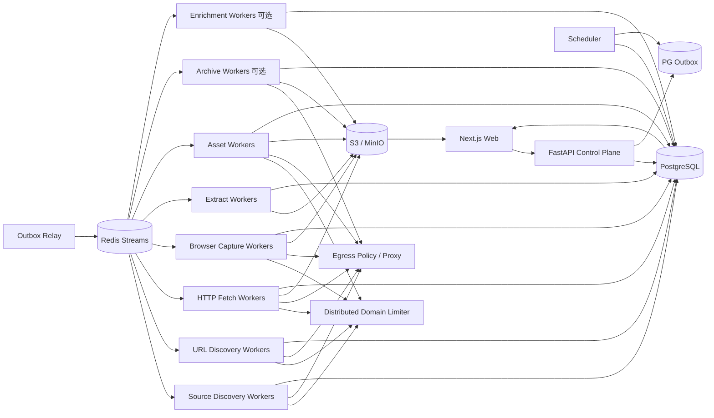

# 博客知识库技术方案

适用范围：约 1000 个技术博客网站的全量历史文章采集、Markdown 清洗、持续扩站、增量同步和 Web 管理；设计目标是继续扩展到更多站点、数百万 URL，并能稳定运行多年。

## 1. 目标与边界

### 1.1 核心目标

1. 新站接入后尽可能完整发现当前仍可访问的历史文章，并可选用 Common Crawl、Wayback 等公共历史索引补充已经删除、迁移或站内不再暴露的 URL/快照证据。
2. 将标题、作者、发布时间、更新时间、标签、canonical URL、正文、链接、代码块、表格、图片和附件统一清洗为稳定 Markdown。
3. 普通站点不编写独立爬虫；站点差异依次通过通用规则、Platform Profile、声明式 override、Custom Adapter 解决。
4. 支持长期增量同步，仅处理新增、变化、删除确认、失败重试、低频 reconciliation 和规则/抽取器重放。
5. 支持断点续跑、幂等、去重、版本保留、失败隔离、离线 re-extract、回滚、暂停/恢复和 durable cancel。
6. 提供 Web 管理端完成站点接入、平台识别、范围确认、规则编辑、任务触发、进度监控、错误诊断、Markdown 预览、版本 diff、质量、安全、预算和 Profile release 管理。
7. 首次历史回灌和日常增量使用同一套数据模型、任务系统、状态机和可观测体系。
8. Sitemap、Feed、HTML、redirect、canonical、`<base href>`、Browser DOM、媒体和第三方抓取结果全部视为不可信输入。
9. HTTP 原始 response bytes、Browser rendered DOM、抽取候选、规则、Platform Profile、质量门禁和 Serializer 全部可追溯。
10. LLM 不是 canonical 内容正确性的依赖；摘要、标签、向量等作为可选 Enrichment 阶段异步运行。

### 1.2 “全量历史”的定义

- **Live Full**：通过 Feed、Sitemap、平台归档、普通归档页、站内链接和公开索引能够发现，且当前仍可访问的文章。
- **Archive Full（可选）**：在合规前提下，通过 Common Crawl、Wayback 等补充当前站点不再提供的 URL 或历史快照证据。

必须分别统计：发现 URL 数、当前可访问数、成功正文数、仅历史索引证据数、各 Discovery Source coverage、归档是否确认到达终点。不能用单一“抓取完成率”掩盖来源缺口。

### 1.3 非目标

- 不绕过登录、付费墙、验证码或明确禁止的访问控制。
- 不默认所有页面使用 Browser；HTTP 能完成时优先低成本路径。
- 不把 Redis、Crawl4AI cache、CLI 输出目录或进程内 URL list 当业务真相源。
- 不把 GitHub 当海量正文主存储；GitHub 只保存方案、规则、配置和少量导出。
- 不在 Web 请求处理函数里执行数分钟/数小时的全站抓取。

## 2. 设计原则

1. **Source Discovery、URL Discovery、Fetch、Capture、Extract、Quality Gate、Asset、Publish、Enrichment 解耦**。
2. **PostgreSQL 是业务状态真相源**；Redis 只承担队列、限流和短期协调。
3. **端到端流式和分批**；不把几十万 URL、超大 Sitemap、响应体或媒体一次性装入内存。
4. **跨域并行、域内克制**；同一域所有 HTTP、Browser、Sitemap、Feed、归档和媒体访问共享限流。
5. **HTTP 优先，Browser 按原因升级**；抽取算法失败不等于页面需要 Browser。
6. **不可变抓取快照优先**；规则、Profile、抽取器、质量门禁和 Serializer 变化优先离线 replay。
7. **所有影响结果的 release/version 可追溯**：Platform Profile、Rule、Canonicalizer、Fetcher、Capture Profile、Extractor、Quality Gate、Serializer、Security Policy。
8. **第三方组件只做 Adapter/能力实现，不做业务状态中心**。
9. **控制面不执行重任务**；Web/API/Cron 只创建 durable job。
10. **所有 URL 入口和 redirect hop 统一经过 EgressPolicy**。
11. **远端输入有硬预算**：bytes、请求次数、递归深度、URL 数、XML elements、重定向、滚动次数、Browser 子请求和 wall time。
12. **部分成功显式表达**；正文成功、媒体失败、子 Sitemap 失败、归档未到终点都不能伪装成完全成功。
13. **PG 与队列通过 transactional outbox 避免双写窗口**。
14. **HTML/Markdown 结构重写在 DOM/IR/AST 层完成，不使用正则作为生产级结构解析器**。
15. **发现证据和抓取准入分离**；发现 URL/host 不代表允许自动访问。
16. **Profile/Selector 命中率可观测**；平台级模板漂移必须能够一次影响、多站告警。
17. **Browser 复用进程，不默认跨站复用状态**；Cookie/localStorage/context 隔离优先于少量性能收益。
18. **LLM 输出和 canonical Markdown 分离**；任何截断、摘要、改写都不能覆盖原文版本。

## 3. 总体架构



系统分为：

- **控制面**：站点、Platform Profile、规则、计划、权限、任务、发布、回滚、预算。
- **发现面**：Source Discovery + 多 Provider URL Discovery。
- **采集面**：HTTP Fetch、Browser Capture、Archive Fetch。
- **抽取面**：Site Selector、多 Extractor Adapter、Quality Gate、Article IR、Markdown Serializer。
- **协调面**：Redis Streams、DB lease、outbox、分布式限流、weighted fairness、backpressure。
- **治理面**：Egress、SSRF、robots、输入预算、预览隔离、日志脱敏、供应链和 contract test。
- **增强面（可选）**：摘要、标签、embedding、实体抽取，完全依赖已发布 article_version。

## 4. 推荐技术栈

| 层 | 推荐 | 说明 |
|---|---|---|
| API | Python + FastAPI | 只做控制面、CRUD、任务创建和查询 |
| Web | React / Next.js | 站点、Profile、规则、任务、diff、质量、安全、预算 |
| 状态 | PostgreSQL | 真相源、事务、唯一约束、lease、outbox、审计 |
| 队列 | Redis Streams + Consumer Group | at-least-once、pending reclaim、水平扩容 |
| 限流 | Redis + Lua | token bucket、并发 lease、Retry-After |
| HTTP | httpx / aiohttp | 手动 redirect、conditional GET、streaming raw bytes |
| Browser | Crawl4AI / Playwright | 独立 worker、有限 slot、受控滚动/交互、public-only egress |
| 通用正文抽取 | `RsTrafilaturaDirectAdapter` + Crawl4AI Generic Adapter | 多候选进入平台 Quality Gate |
| DOM/IR | lxml/selectolax/BeautifulSoup + 自定义 Article IR | 结构化链接、正文和资源 |
| XML | defusedxml + XMLPullParser/iterparse | 禁 DTD/entity，流式 Sitemap |
| Markdown | 平台 AST/Serializer | 确定性、版本化输出 |
| 对象存储 | S3 / MinIO | raw bytes、rendered DOM、候选、Markdown、媒体、导出 |
| 监控 | Prometheus + Grafana + OpenTelemetry | 系统 SLO + 业务质量 + Profile drift |
| 安全/供应链 | OSV/pip-audit + Bandit/Semgrep + lockfile + SBOM | 依赖固定、镜像 digest、漏洞与回归 |
| 部署 | Docker Compose 起步，Kubernetes 按瓶颈引入 | Worker 类型隔离、可水平扩展 |

## 5. 站点接入、Platform Profile 与规则层级

### 5.1 接入层级

从低成本到高定制依次为：

1. **Generic Profile**：Feed/Sitemap + 通用抽取。
2. **Platform Profile**：WordPress、Ghost、Substack 等共用平台模板，复用归档入口、页面类型、URL pattern、selector、滚动/交互能力。
3. **Site Override**：站点对 Platform Profile 做声明式覆盖。
4. **Custom Adapter**：特殊 API、复杂身份、非常规分页或不可声明逻辑。

普通站点不能因为一个 selector 差异就新增 Worker 类型。

### 5.2 Platform Profile

```text
platform_profiles
- id
- platform_name
- release_version
- status(testing/active/retired)
- fingerprint_json
- page_type_rules_json
- discovery_recipes_json
- extract_defaults_json
- browser_actions_json
- browser_capabilities_json
- identity_hints_json
- source_ref
- artifact_digest
- created_at

site_platform_bindings
- site_id
- platform_profile_id
- confidence
- detected_evidence_json
- override_json
- status(candidate/approved/disabled)
- approved_by / approved_at
```

Profile 可表达：

- 平台 fingerprint；
- 文章/归档/标签/作者/首页 page type；
- URL include/exclude 和 article path pattern；
- Sitemap/Feed/固定 archive endpoint；
- selector 与 metadata hint；
- `scroll_mode`、wait、load-more、virtual-scroll container；
- 允许的 Browser action；
- canonical/identity 默认规则。

Profile 只生成候选路由和规则，不绕过 Egress/robots/quality gate，也不拥有 durable checkpoint。

### 5.3 Profile 发布

Profile release 必须：

1. 固定源代码/配置版本和 digest。
2. 在多个真实站点 golden snapshots 上跑 page type、selector、URL coverage、Markdown diff、Browser action 和资源回归。
3. 先 `testing`，再 canary，最后 `active`。
4. 失败可 rollback 到旧 release。
5. 同平台多个站点同时 selector zero-hit 时触发 platform-level drift 告警。

### 5.4 新站 probing

生命周期：

```text
draft -> probing -> validated -> backfilling -> active
                   \-> rejected
active -> degraded -> active
active -> disabled
```

probing 使用小预算：

1. robots.txt 与常见 source 候选。
2. host、HTML、generator/meta、DOM selector 等平台 fingerprint。
3. candidate Platform Profile，只生成候选，不自动信任。
4. 抽样 20~200 个 URL，统计 path、status、content-type、soft-404 和 page type。
5. HTTP 优先 capture；确有 JS/滚动依赖才 Browser。
6. golden snapshot 上 shadow extraction。
7. 自动生成 include/exclude、identity、metadata、extractor priority、Browser capability 候选。
8. Web 人工确认后发布 binding/rules，再进入 backfill。

## 6. 核心数据模型

### 6.1 Site 与规则

```text
sites
- id
- name
- base_url
- status
- robots_policy
- default_schedule
- config_json
- active_rule_version
- created_at / updated_at

site_hosts
- site_id
- host
- status(candidate/approved/rejected/disabled)
- discovered_via
- approved_by / approved_at
- reason

site_rules
- id
- site_id
- version
- status(draft/testing/published/superseded)
- discovery_rule_json
- fetch_rule_json
- capture_rule_json
- extract_rule_json
- quality_rule_json
- identity_rule_json
- asset_rule_json
- metadata_rule_json
- security_rule_json
- created_by / created_at
```

### 6.2 Discovery Source 与 Checkpoint

```text
discovery_sources
- id
- site_id
- host
- kind(feed/sitemap/ordered_archive/archive/deepcrawl/commoncrawl/wayback/homepage/custom)
- normalized_url
- discovered_via
- profile_release_id
- ordered_stable
- scroll_mode
- status(candidate/active/degraded/disabled)
- etag / last_modified
- provider_version
- last_success_at / last_error_at
- error_code

discovery_runs
- id
- site_id
- source_id
- provider
- status(running/completed/partial/budget_exhausted/failed/cancelled)
- end_condition
- checkpoint_before / checkpoint_after
- discovered_count / unique_count / accepted_count / rejected_count
- budget_json
- error_code
- started_at / finished_at

discovery_checkpoints
- site_id
- source_id
- provider
- scope_key
- cursor_json
- etag / last_modified
- collection_id
- last_success_at / last_error_at
```

`end_condition` 至少区分：`end_reached`、`known_streak`、`no_new_urls`、`repeated_cursor`、`scroll_limit`、`budget_exhausted`、`selector_drift`。

### 6.3 Frontier 与证据

```text
frontier_urls
- id
- site_id
- normalized_url
- url_hash
- first_seen_at / last_seen_at
- lastmod_hint / pubdate_hint
- priority
- status
- next_fetch_at
- lease_owner / lease_until

frontier_url_sources
- frontier_url_id
- source_id
- provider
- evidence_json
- first_seen_at / last_seen_at
```

约束：`UNIQUE(site_id, url_hash)`；一个 URL 可以由 Feed、Sitemap、Platform Archive、Common Crawl 等多个来源共同证明。

### 6.4 Capture Snapshot

```text
fetch_snapshots
- id
- site_id
- frontier_url_id
- requested_url / final_url
- capture_kind(http/browser/archive)
- status_code
- etag / last_modified
- response_content_type
- response_charset_hint
- decoder_observation_json
- body_sha256
- raw_byte_size
- object_key_http_raw
- object_key_rendered_dom
- capture_profile_version
- profile_release_id
- fetcher_version
- browser_engine_version
- security_policy_version
- fetched_at
```

HTTP `body_sha256` 基于原始 response bytes；Browser rendered DOM 是独立 Unicode artifact，不能冒充 HTTP raw bytes。

### 6.5 Extractor Release 与尝试

```text
extractor_releases
- id
- extractor_name
- extractor_version
- source_ref
- artifact_digest
- adapter_version
- runtime_kind(process/thread)
- capabilities_json
- raw_quality_kind
- status(testing/active/retired)
- created_at

extraction_attempts
- id
- site_id
- snapshot_id
- input_sha256
- extractor_release_id
- config_hash
- input_kind(http_raw_bytes/rendered_dom/archive_raw/archive_decoded)
- page_type
- classification_confidence
- raw_quality_kind / raw_quality_score
- platform_quality_score
- quality_gate_version
- status(pass/fail/fallback/review/rejected_non_article)
- reason_codes_json
- object_key_candidate
- warnings_json
- metrics_json
- cpu_ms / wall_ms / peak_rss_bytes
- created_at
```

建议幂等键：`UNIQUE(snapshot_id, extractor_release_id, config_hash, input_kind)`。

### 6.6 Article、版本、媒体与 Enrichment

```text
articles
- id
- site_id
- article_key
- accepted_canonical_url
- current_version_id
- status(active/missing_suspected/source_deleted/rejected/access_restricted)
- first_published_at
- last_source_seen_at

article_aliases
- site_id
- alias_url_hash
- article_id
- alias_url
- reason

article_versions
- id
- article_id
- source_snapshot_id
- selected_extraction_attempt_id
- content_sha256
- markdown_sha256
- object_key_md
- extraction_profile_version
- extractor_version
- profile_release_id
- quality_gate_version
- rule_version
- serializer_version
- metadata_json
- provenance_json
- created_at

asset_blobs(...)
asset_sources(...)
article_assets(...)

enrichment_results
- id
- article_version_id
- kind(summary/tags/embedding/entities)
- provider / model
- prompt_version
- input_hash / output_hash
- object_key
- status
- created_at
```

Enrichment 失败不影响 article_version 发布。

### 6.7 Job 与 Outbox

```text
jobs(id, type, site_id, status, priority, requested_by, budget_json, cancel_requested, ...)
job_items(job_id, item_key, stage, status, attempt, retry_at, lease_owner, lease_until, last_error_code)
error_events(id, job_id, item_key, stage, attempt, error_code, sanitized_message, retryable, occurred_at)
outbox_events(id, aggregate_type, aggregate_id, stream, payload_json, published_at)
audit_logs / security_events
```

API/Scheduler 在同一 PG 事务中写 job/job_item/outbox，relay 再发布 Redis Streams。

## 7. Discovery 设计

### 7.1 Source Discovery 与 URL Discovery 分离

`Source Discovery` 找 Feed、Sitemap root、Platform Archive、普通 archive、candidate host 和公共历史索引；`URL Discovery` 只从已经批准的 source 流式产出 URL。

统一接口：

```python
class DiscoveryProvider(Protocol):
    async def scan(self, site, source, checkpoint, budget) -> AsyncIterator[DiscoveredUrl]: ...
```

内置 Provider：

- `FeedProvider`
- `SitemapProvider`
- `OrderedArchiveProvider`
- `ArchivePageProvider`
- `HomepageProvider`
- `DeepCrawlProvider`
- `CommonCrawlProvider`
- `WaybackProvider`
- `CustomAdapterProvider`

### 7.2 Admission Pipeline

```text
raw URL
 -> syntax parse
 -> security normalization
 -> Egress precheck
 -> approved host/scope
 -> canonicalizer_version
 -> include/exclude
 -> page/asset heuristic
 -> accepted/rejected + reason
 -> Frontier UPSERT
```

所有 rejection reason 可统计。

## 8. 全量历史发现

### 8.1 Sitemap

入口取并集：robots.txt 的 `Sitemap:`、常见路径、人工配置、历史成功入口和页面发现入口。

大型 Sitemap：

```text
HTTP stream
 -> compressed bytes limiter
 -> bounded decompressor
 -> decoded bytes/compression ratio limiter
 -> secure XMLPullParser
 -> batch UPSERT frontier
 -> checkpoint
```

支持 `<urlset>`、`<sitemapindex>`、namespace、gzip、相对 child URL、嵌套、cycle 检测和 partial success。

### 8.2 Feed

保存 ETag/Last-Modified 和 guid/url/pubdate cursor；新 item 高优先级入 Frontier。Feed 用于低延迟，不承担历史完整性。

### 8.3 Ordered Archive

适合 newest-first 稳定平台归档：Substack、部分 Ghost/WordPress 自定义归档等。

首次 backfill：持续分页/滚动直到 `end_reached` 或明确 partial。

增量：从归档头部开始，遇到连续 N 个“已知且 identity 稳定”的条目可 `known_streak` 快停；若 profile 无法保证顺序稳定则禁用快停。

低频 reconciliation 必须忽略快停阈值并进行更深扫描，防止旧文补录、排序修正和归档恢复。

### 8.4 Browser Scroll Mode

Discovery Profile 明确声明：

```text
none
pagination
full_page_append
virtual_scroll
load_more_button
custom
```

`full_page_append` 用于滚动后 DOM 持续追加；`virtual_scroll` 用于滚动时旧节点被替换，需要容器选择、scroll count 和内容合并。不能把 `scan_full_page=True` 当作所有动态归档的全量保证。

每个滚动任务至少有：`max_scrolls`、`scroll_delay`、`max_requests`、`max_bytes`、`max_wall_time`、`stop_when_no_new_urls`、`repeated_cursor_stop`。

### 8.5 Common Crawl / Wayback

按 collection/CDX cursor checkpoint；只有首次 backfill、新 collection 或低频 reconciliation 才扫描。公共索引 URL 仍经过 scope、Egress 和当前 Fetch 验证。

### 8.6 普通 Archive/Homepage/Deep Crawl

作为 Feed/Sitemap/Platform Archive 不完整时的补充，必须设置 max depth、max pages、include/exclude、soft-404、domain limiter 和预算。

## 9. Robots、限流与 Egress

### 9.1 Robots

默认 `robots_policy: respect`。robots.txt 使用 TTL + ETag/Last-Modified；区分 404、网络失败、解析失败，并支持显式 fail-open/fail-closed 策略。

### 9.2 Domain Limiter

同一域的 Sitemap、Feed、Archive、HTTP、Browser 顶层、Browser 子资源和媒体共享总限流。失败、timeout、redirect 同样消耗 token/预算。

Redis + Lua 实现 token bucket、domain concurrency lease、Retry-After 动态降速和 lease TTL。

### 9.3 Egress / SSRF

统一 `EgressPolicy`：

1. 只允许 HTTP/HTTPS。
2. 拒绝 userinfo、异常端口和混淆 host。
3. 默认拒绝 localhost、RFC1918、link-local、multicast、reserved、unspecified、cloud metadata、IPv4-mapped IPv6。
4. DNS 解析结果任一地址命中禁止网段则拒绝。
5. HTTP 禁自动 redirect；每个 hop 重新校验 URL、DNS、approved host 和 redirect budget。
6. canonical、`<base href>`、Feed、Sitemap、Archive、页面、媒体和 Browser 子资源都走同一策略。
7. Browser Worker 使用网络级 egress proxy/namespace 第二道防线，不使用 host network。

## 10. HTTP Fetch 与 Browser Capture

### 10.1 HTTP 快路径

1. Egress + robots + limiter 准入。
2. 带 `If-None-Match` / `If-Modified-Since`。
3. 手动 redirect，逐 hop 校验。
4. streaming body，限制 bytes/wall time，原始 bytes 流式写对象存储或安全临时文件。
5. 记录 content-type、charset hint、decoder observation。
6. 304 -> unchanged，不 Extract。
7. 200 且 raw body hash 未变 -> 更新 seen/validator，不创建版本。
8. 变化才创建 immutable snapshot 并进入 Extract。

404/410 多轮确认后才进入删除状态机。

### 10.2 Browser 升级条件

Browser 只解决输入不完整/交互问题：

- CSR shell；
- 正文依赖 JS；
- 受控滚动/virtual scroll；
- 需要等待 selector；
- 允许的公开弹窗关闭或 load-more。

**DOM 完整但抽取差时先换 Extractor/selector，不无条件升级 Browser。**

### 10.3 Browser Process Pool 与 Site Affinity

Browser Worker：

- 复用 Browser process，减少 Chromium 启动成本；
- 默认每站/每任务使用隔离 context，不跨站共享 Cookie/localStorage；
- 可配置短批 site affinity；
- `max_pages_per_process`、`max_process_age`、RSS 阈值、page wall-time、子请求数和总字节均有限制；
- 达到阈值后优雅 recycle；
- crash 只影响当前 item，可通过 lease 重试。

### 10.4 Browser Action 治理

Platform Profile 中的 Browser actions 必须版本化和审计：

- 允许 wait、click、scroll、load-more、关闭公开营销/订阅弹窗；
- 禁止用于绕过登录、付费墙、验证码；
- 不允许 action 脚本自行向任意新 host 发网络请求；
- 每个 action 受 step/time/request budget；
- selector zero-hit、action timeout 进入 profile drift 指标。

## 11. 多 Extractor、Quality Gate 与 Article IR

### 11.1 Extractor 路由

优先级：

1. `SiteSelectorExtractor` / Platform selector fast path。
2. `RsTrafilaturaDirectAdapter`。
3. `Crawl4AIGenericExtractor`。
4. 其它 Readability/Trafilatura 类实现按 Adapter 扩展。

第三方 Extractor 不直接更新 `articles.current_version_id`。

### 11.2 输入原则

- HTTP snapshot 优先从 raw bytes 抽取，保留重新判断编码的能力。
- Browser rendered DOM 使用 Unicode HTML 输入。
- 正文抽取前不对完整 HTML 任意 chunk。
- Extract Worker 与 Fetch Worker 进程/容器隔离；CPU/RSS/in-flight input 有界。

### 11.3 Platform Quality Gate

平台质量分综合：

- 正文字数和段落；
- heading/list/code/table/link/image 保留；
- boilerplate 比例；
- 链接密度；
- template fingerprint；
- 重复正文；
- title/正文一致性；
- page type 与结构；
- selector 命中；
- raw/rendered DOM 是否有正文信号；
- extractor warning 与历史 golden 表现。

输出：`pass`、`retry_alternate_extractor`、`need_browser`、`manual_review`、`reject_non_article`。

### 11.4 Article IR 与 Metadata Provenance

```text
Extraction Candidate
 -> Metadata Candidates
 -> Article IR
 -> URL/base/canonical resolution
 -> asset resolution
 -> normalization
 -> Markdown AST/Serializer
 -> Markdown
```

Metadata candidate 保存：`field/value/source_type/source_location/confidence/rule_version/raw_or_normalized`。

来源可以是 HTML title、meta、OpenGraph、JSON-LD、站点 selector、Platform Archive link text、通用 Extractor 和启发式。列表页 link text 只能作为低/中置信度候选，不能静默覆盖正文页高置信度值。

### 11.5 Markdown 确定性

最终 Markdown 由平台 Serializer 生成，固定 heading/list/code fence、空行、link/image、Front Matter key 顺序、Unicode/换行和 table。

相同 `snapshot + rule_version + profile_release + extraction_attempt + serializer_version` 应得到相同 Markdown hash。

## 12. URL、Canonical 与 Article Identity

URL Canonicalizer 版本化处理 scheme/host、默认端口、fragment、query、trailing slash、percent encoding、IDNA 和 tracking 参数；userinfo 拒绝。

canonical 候选优先级可配置：站点 identity rule -> 合法 `<link rel=canonical>` -> JSON-LD `mainEntityOfPage` -> final URL -> requested URL。跨域 canonical 默认不接受。

`article_key = hash(site_id + stable_identity)`；别名进入 `article_aliases`，不得依赖发现顺序或导出路径。

Document Base 默认 final URL；`<base href>` 必须经 Egress/approved-host 校验。canonical、正文链接、图片、srcset、附件共用同一 resolver。

## 13. 媒体与附件

从 DOM/IR 提取 `src/srcset/picture/source` 和附件。

下载执行 Egress + robots/站点策略 + domain limiter + bytes/request budget，使用 streaming、magic sniff、ETag/Last-Modified 和逐 hop redirect。

按真实 `content_sha256` 去重；SVG、HTML、可执行附件等 active content quarantine。Web 预览从独立无 Cookie origin 提供。

## 14. 增量同步

### 14.1 Provider Checkpoint

- Feed：ETag/Last-Modified + guid/url/pubdate cursor。
- Sitemap：root/child validator + tree health + lastmod hint。
- Ordered Archive：newest article、head signature、cursor、known streak、last full reconciliation。
- Common Crawl：collection id + provider version。
- Wayback：CDX cursor/时间范围。
- 普通 Archive/Homepage：validator + pagination/scroll cursor。

### 14.2 页面 Checkpoint

ETag、Last-Modified、304、raw body hash、content hash、Markdown hash 独立保存。Provider 没发现变化不等于正文绝对未变化，因此需要 reconciliation。

### 14.3 删除与迁移

```text
active -> missing_suspected -> source_deleted
```

一次 404、一次 Sitemap 消失或一次归档列表缺失不能直接删除文章。

## 15. 幂等、重试、取消与部分成功

典型错误码：

```text
network_timeout
dns_failed
egress_denied
robots_denied
redirect_denied
response_too_large
budget_exhausted
sitemap_cycle
sitemap_parse_error
archive_end_unknown
archive_scroll_limit
profile_selector_drift
browser_action_denied
access_restricted
unsupported_content_type
soft_404_suspected
browser_timeout
extract_timeout
extract_oom
extract_empty
extract_quality_failed
extractor_contract_failed
canonical_conflict
asset_failed
storage_error
```

Retry：429 尊重 Retry-After；5xx/timeout 指数退避 + jitter；security/robots/access_restricted 不无限重试；parse/extract 优先基于 snapshot replay。

取消只写 `cancel_requested=true`；Scheduler 停发新 item，worker 在领取和阶段边界检查，`finally` 释放 domain lease、DB lease 和 Browser context。

正文、metadata、asset、enrichment 分别建状态；单张图片或摘要失败不能把正文成功伪装成整篇失败。

## 16. 并发、调度、公平性与 Backpressure

四层并发：

```text
平台总并发
 -> Worker 类型并发
   -> 站点/域并发
     -> 单页面子请求并发
```

网络 I/O、Browser 和 CPU 抽取是不同资源池。

建议保守起步：

- domain concurrency = 1；
- HTTP 每进程 20~50 slot；
- Browser 每进程 4~8 slot；
- Sitemap child 2~4；
- Extract 每进程 1~2 in-flight，再按 CPU/RSS benchmark 扩；
- Frontier lease 20~100 个执行项；
- Discovery UPSERT 500~2000/批。

采用 weighted fair queue：日常增量高于历史 backfill，单个大站不能垄断全部 Worker。Browser-heavy 站点可做短批 site affinity，但仍受域限流和全局公平性约束。

PG/S3 延迟、Redis pending、Extract backlog、Browser RSS、CPU/RSS 或 object-store throughput 异常时，Scheduler 自动降低上游速度。

## 17. Soft-404、Profile Drift 与质量回归

### 17.1 Soft-404

probing 请求保证不存在的随机路径建立 fingerprint。正常 200 若高度相似则标记 `soft_404_suspected`，不直接创建 article version。

### 17.2 Profile Drift

按 Platform Profile release 聚合：

- page type classification error；
- article selector hit rate；
- archive selector hit rate；
- 每次 archive discovered_count；
- scroll/load-more action success；
- Browser action timeout；
- Markdown quality/pass rate。

若多个绑定站点同时异常，优先升级为平台级事件，而不是逐站手工修 selector。

### 17.3 Golden / Shadow

规则、Profile、Extractor、Serializer 发布前，在 golden snapshots/URLs 上比较：

- URL coverage；
- archive end-condition；
- page type；
- selector 命中；
- Markdown 结构和正文覆盖；
- canonical/metadata；
- Browser action；
- CPU/wall time/RSS/请求数。

## 18. Web 管理功能

### 18.1 站点与平台

新增/编辑/禁用站点、probing、candidate/approved/rejected host、Platform Profile candidate/binding/release、robots、限流和预算。

### 18.2 Discovery

展示 Source 候选、Sitemap 树、Feed/Archive/CC/Wayback checkpoint、URL accepted/rejected reason、多来源 attribution、ordered archive head、scroll mode、end condition、partial/budget exhaustion 和 coverage 趋势。

### 18.3 任务

全量 backfill、单站增量、reconciliation、单 URL 重抓、re-extract without refetch、asset retry、export、enrichment、cancel/pause/resume、job/item 进度和重试。

### 18.4 Rule / Profile / Golden Workbench

- rule/profile draft/testing/publish/rollback；
- golden URL/snapshot 批测；
- page type 分类结果；
- selector 命中率；
- archive URL coverage；
- scroll/load-more/Browser action 结果；
- before/after Markdown diff；
- canonical/metadata 变化；
- canary 与 profile-level drift。

### 18.5 Extraction / Content

展示 extraction attempt、input kind/hash、extractor release、quality reason、主/备用 diff、CPU/RSS、Browser escalation 原因、Markdown 预览、metadata provenance、raw/rendered DOM、article version diff、alias/canonical 和 asset relation。

### 18.6 安全与预算

显示 domain limiter wait、HTTP/Browser/Extract slots、Browser RSS、Provider 请求量/字节、scroll count、budget exhaustion、SSRF deny、robots deny、access restricted 和异常 active content。

## 19. Web 预览与日志安全

raw HTML、rendered DOM、candidate HTML 和 Markdown 都来自不可信站点：

- raw/rendered HTML 不与管理端同源执行；
- iframe 严格 sandbox；
- 不注入管理端 cookie/token；
- Markdown 禁 raw HTML 或严格 sanitize；
- active content 独立无 Cookie origin。

统一 `LogSanitizer`：URL 去 userinfo/query/fragment；header allowlist；禁止 Authorization/Cookie/Set-Cookie；exception、dead-letter、OTel 和 Web 错误页共用同一 sanitizer。

## 20. 可观测性与 SLO

### 20.1 业务指标

- 每站发现 URL 与 source coverage；
- archive `end_reached/known_streak/partial` 分布；
- profile selector hit/page type accuracy；
- fetch success/304/changed；
- Browser fallback；
- soft-404；
- extract empty/quality fail；
- alternate extractor fallback；
- article version churn；
- asset success/dedupe；
- reconciliation missing；
- Profile release drift。

### 20.2 系统指标

Redis lag/pending、DB lease/reclaim、PG/S3 latency、HTTP status/latency、Browser slot/RSS/process recycle、scroll/action duration、Extract CPU/RSS/wall time、domain limiter wait、egress deny、bytes/request budget。

### 20.3 Trace

`job_id -> discovery_run -> frontier_url -> fetch_snapshot -> extraction_attempt -> article_version -> asset/enrichment` 全链路携带 correlation/trace id。

## 21. 存储与 Markdown 导出

对象 key 不依赖用户可控 path：

```text
snapshots/{site_id}/{snapshot_id}/http.raw
snapshots/{site_id}/{snapshot_id}/rendered.html
extractions/{site_id}/{snapshot_id}/{attempt_id}.json
articles/{site_id}/{article_id}/{version_id}.md
assets/sha256/{prefix}/{full_hash}
enrichments/{article_version_id}/{kind}/{result_id}.json
exports/{export_id}/...
```

PG 保存 metadata/object key，不存大正文。

导出 job：路径 segment 规范化、禁止 `..`/绝对路径、处理 Windows 保留名和长度、拒绝 symlink 逃逸、临时文件 + fsync + atomic rename；manifest 保存 article/version/source/hash/local path。

Markdown 建议统一 Front Matter：

```yaml
---
site_id: ...
article_id: ...
url: ...
canonical_url: ...
title: ...
author: ...
published_at: ...
updated_at: ...
tags: [...]
source_snapshot_id: ...
---
```

正文不混入 LLM 摘要；摘要如需导出，单独字段或旁车文件并标注 enrichment provenance。

## 22. 推荐配置示例

### 22.1 通用站点

```yaml
site_id: example
base_url: https://example.com
robots_policy: respect
schedule: "0 */6 * * *"

approved_hosts:
  - example.com
  - www.example.com

discovery:
  providers: [feed, sitemap, ordered_archive, archive]
  optional_providers: [commoncrawl, wayback]
  sitemap:
    max_depth: 16
    max_urls: 500000
    child_concurrency: 3
  archive:
    max_pages: 5000
    max_scrolls: 200
    stop_when_no_new_urls: 3

fetch:
  http_first: true
  retain_raw_bytes: true
  max_body_bytes: 10485760
  redirect_max: 5
  browser_fallback: true

browser:
  process_pool: true
  local_concurrency: 4
  context_scope: site
  reuse_process: true
  reuse_context: false
  max_pages_per_process: 200
  max_process_age_s: 3600
  memory_threshold_percent: 75
  max_subrequests: 120
  max_bytes: 52428800
  wall_time_s: 90

extract:
  priority:
    - site_selector_if_configured
    - rs_trafilatura_direct
    - crawl4ai_generic
  runtime: process
  processes_per_worker: 2
  quality_gate:
    browser_only_when_input_incomplete: true
    manual_review_after_all_fallbacks: true

limits:
  domain_concurrency: 1
  requests_per_second: 0.5
  requests_per_day: 20000
```

### 22.2 Substack Platform Profile

```yaml
platform: substack
release: v1
fingerprint:
  host_suffix: .substack.com
  dom_any: [.portable-archive-list, .available-content]
page_types:
  article:
    url_regex: /p/
    content_selectors: [.available-content, .body.markup]
  archive:
    urls: [/archive?sort=new]
    list_selector: .portable-archive-list
discovery:
  provider: ordered_archive
  ordered_stable: true
  article_url_regex: /p/
  scroll_mode: full_page_append
  max_scrolls: 200
  stop_when_no_new_urls: 3
browser_actions:
  dismiss_public_subscription_modal: true
  bypass_access_control: false
metadata:
  archive_link_text_as_title_candidate: true
```

Custom domain 是否绑定 Substack 必须靠 DOM/元数据 fingerprint + probing 确认，不能只靠 host suffix。

## 23. 部署路线

### Phase 1：生产最小闭环

Docker Compose：PostgreSQL、Redis、MinIO、API/Web、Scheduler/Outbox Relay、Discovery Worker、HTTP Worker、Browser Worker、Extract Worker、Asset Worker。

实现 Feed/Sitemap/OrderedArchive、Frontier、多来源 attribution、outbox、conditional HTTP、raw-byte snapshot、Browser fallback、Platform Profile 基础、Article IR、Markdown、Web CRUD/任务/错误、增量 checkpoint、Egress、预算和日志 sanitizer。

### Phase 2：历史覆盖与质量强化

Common Crawl/Wayback、soft-404、普通归档/Deep Crawl、golden/shadow Workbench、Profile release regression、Extractor capability registry、contract-test pipeline、metadata conflict review、Profile drift 和完整 Control Matrix。

### Phase 3：按瓶颈引入 Kubernetes

需要多机 Browser/Extract pool、弹性扩容、节点隔离或高可用时迁移 K8s。1000 个站点本身不要求第一天上 K8s。

## 24. 初始容量建议

- domain concurrency = 1；
- domain delay = 1~3 秒或等价 token bucket；
- Sitemap child concurrency = 2~4；
- 同时 URL Discovery 的站点 = 10~50；
- HTTP 每进程 20~50 slot；
- Browser 每进程 4~8 slot；
- Browser process 每 100~300 页或达到 RSS/年龄阈值 recycle；
- Extract 每节点 2~4 process 起步，每进程 1 in-flight；
- Frontier lease = 100~1000；
- Discovery UPSERT = 500~2000/批。

容量规划按 HTTP/Browser 比例、滚动归档比例、Extract CPU/RSS、每页字节、平均响应时间、域 politeness 和历史 URL 总量分别测量。

## 25. 关键流程

### 25.1 新站全量回灌

```text
Create Site
 -> probing
 -> robots + source discovery
 -> platform fingerprint
 -> candidate Profile + host/source review
 -> golden HTTP/Browser capture
 -> shadow extraction + rule/profile calibration
 -> publish binding/rules
 -> URL Discovery Providers
 -> stream UPSERT Frontier
 -> Scheduler/outbox
 -> bounded HTTP Fetch
 -> Browser only when needed
 -> immutable snapshot
 -> primary extractor
 -> Quality Gate
 -> Article IR + Metadata Candidates
 -> identity/canonical merge
 -> assets
 -> deterministic Markdown
 -> article version
 -> active
```

### 25.2 日常增量

```text
Feed/Sitemap/OrderedArchive scan
 -> new/changed URL
 -> ordered archive known-streak fast stop when valid
 -> conditional HTTP GET
 -> 304: stop
 -> 200 same raw hash: update seen
 -> changed: new snapshot
 -> extract + quality gate
 -> meaningful accepted output change
 -> publish new article version
```

### 25.3 Profile/规则/抽取器升级

```text
New release/draft
 -> capability + security + contract tests
 -> golden URLs/snapshots shadow replay
 -> URL coverage + selector + Markdown + resource regression
 -> canary
 -> publish
 -> re-discover/re-extract only where release affects result
 -> rollback on drift
```

### 25.4 历史覆盖补充

```text
Common Crawl / Wayback checkpoint
 -> historical URLs/evidence
 -> admission
 -> low-priority Frontier
 -> current GET when appropriate
 -> archive evidence if current page missing
 -> reconciliation metrics
```

### 25.5 手动触发

```text
Web/API/Cron
 -> durable job
 -> PG + outbox transaction
 -> Redis Streams
 -> workers
 -> Web progress
```

## 26. 验收标准

### 26.1 功能

- Web 可新增站点并完成 probing/backfill/active 生命周期。
- 可识别并人工确认 Platform Profile，允许 per-site override 和 release rollback。
- 支持多个/嵌套/gzip Sitemap、Feed、Ordered Archive、普通 Archive、Common Crawl/Wayback checkpoint。
- 动态归档明确区分 full-page append、virtual scroll、load-more 和 pagination；无法证明终点时必须标 partial。
- 支持 ETag/Last-Modified/304/raw body hash 增量。
- HTTP raw bytes 可持久化并 `re-extract without refetch`。
- HTTP raw 与 Browser rendered DOM 输入类型明确区分。
- 支持多 Extractor + Quality Gate，能区分备用 Extractor 与 Browser 升级原因。
- Metadata 候选、最终值和 provenance 可追溯，包括 archive link text 等低置信度来源。
- 手动触发立即返回 job_id，不绑定长 HTTP 请求。
- LLM enrichment 与 canonical Markdown 解耦。

### 26.2 扩展性

- 新增普通站点或同平台站点不新增独立 Worker 类型。
- Platform Profile 一次修复可通过新 release 覆盖大量绑定站点，并经过集中回归。
- Discovery/Frontier 不依赖单进程内存 list。
- 不对 1000 域一次性 `gather()`。
- Worker 可横向扩展，Redis/DB lease 可 reclaim。
- Browser process 可复用但跨站状态隔离。
- 单个大站/Browser-heavy 站点不能垄断全部资源。
- Profile/规则/抽取器升级可基于历史 snapshot 离线回放。

### 26.3 数据质量

- 同文章 alias/canonical 稳定合并。
- 规则/Profile/Extractor/Serializer 变化可解释。
- Markdown 结构通过 DOM/IR/AST 处理。
- soft-404/SPA shell 不进入正式 article version。
- selector/profile drift 能自动告警，不能静默发现 0 篇。
- 归档 end condition 有证据；budget/scroll limit 显式 partial。
- 同一输入 + release/config 可稳定 replay。

### 26.4 安全与可靠性

- redirect SSRF、Browser 子资源 SSRF 有应用和网络双层防线。
- Sitemap gzip/XML、响应体、归档滚动、媒体、请求次数有硬预算。
- robots policy 可审计。
- Browser action 不用于绕过登录、付费墙、验证码。
- raw/rendered/candidate/Markdown 预览隔离。
- 日志和错误页不泄露 token/cookie。
- 导出路径不可穿越、不可因 crawl 顺序变化。
- Browser/Extract CPU/RSS/native crash 被独立 worker/process 隔离。
- 依赖、Crawl4AI、Browser、Profile release 均固定版本或 digest，并有 regression/canary/rollback。
