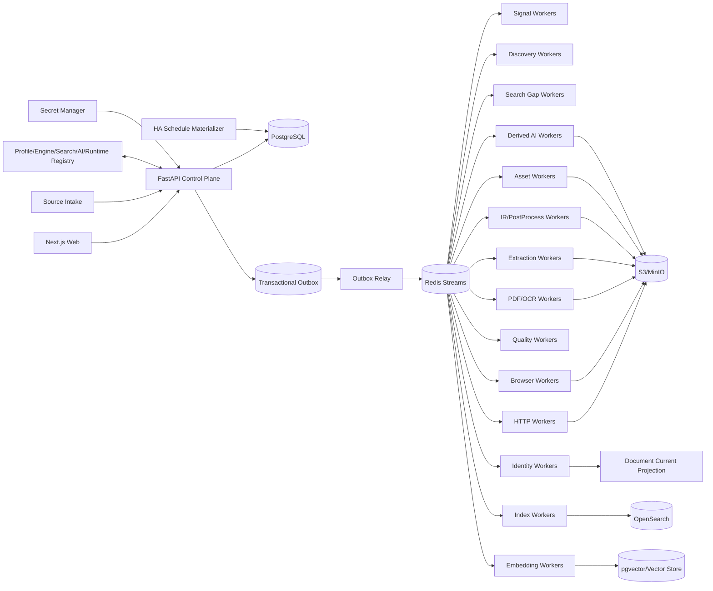

# 博客知识库技术方案

适用范围：从约 1000 个技术博客、工程博客、技术文档站、Newsletter、CMS 与公开文档站抓取尽可能完整的历史文章，清洗为稳定 Markdown 建设长期知识库；后续持续增加网站，支持全量回灌、增量同步、Web 管理、版本留存、离线重处理、全文/向量检索、质量审计、图片附件归档和 AI 派生能力。整体按百万级文档、数百万到千万级 URL、站点高度异构和多年持续运行设计。

## 1. 建设目标

1. 支持站点根地址、单 URL、批量 URL、RSS/Atom/JSON Feed、Sitemap/Sitemap Index、OPML、CSV、JSON、Markdown/TXT 等来源导入。
2. 自动探测 Sitemap、Feed、公开 API、Archive、Category/Tag/Author、Docs Navigation、普通内链、`llms.txt`/文本 URL 列表等发现入口。
3. 支持 `FULL_BACKFILL`、`INCREMENTAL`、`RECONCILE`、`TARGETED_FETCH`、`PROBE`、`REPROCESS`、`ASSET_REPAIR`、`REINDEX`、`SEARCH_GAP_FAST`、`SEARCH_GAP_DEEP`。
4. 历史完整性由 Provider 级 Coverage Evidence 证明，不能用“队列空了”“达到 max_depth/max_pages/max_urls”“搜索 Top-N 抓完”替代完整性证明。
5. HTTP-first；只有动态渲染、正文缺失、挑战页或抽取失败证据存在时才升级 Browser/Crawl4AI/Playwright。
6. Source/Profile/Discovery/Fetch/Extractor/PostProcessor/Quality/Asset/Chunker/Search/Reranker/Embedding/AI Recipe/AI Model/Runtime 都使用不可变 Release。
7. 支持 Sitemap `lastmod`、Feed GUID/updated、API cursor、ETag、Last-Modified、body hash、Canonical IR hash、重叠窗口与周期 Reconcile 驱动增量。
8. 最终知识对象保存标题、作者、发布时间、更新时间、标签、canonical、正文块、代码块、表格、图片、附件、链接关系、Snapshot、字段 provenance 和完整 lineage。
9. 支持 durable frontier、断点续跑、幂等、lease、heartbeat、重试、限流、熔断、公平调度、backpressure、dead-letter。
10. 保存不可变网络 Snapshot、渲染 DOM、Extraction Candidate、Canonical IR、Markdown Projection、规则版本和质量结果；规则升级优先离线 replay。
11. 图片和附件走独立 Asset Pipeline，支持安全校验、hash 去重、对象存储、引用关系、独立重试和 Markdown URL 重写。
12. Web 管理端覆盖 Source Intake、Site Profile Studio、Provider Coverage、Run/Task、Targeted Fetch、Extraction Preview、Snapshot Replay、Version Diff、Quality Review、Drift、Assets、Search/RAG、AI Artifact、成本和审计。
13. Markdown、全文索引、Embedding、摘要、标签、Topic、FAQ、Digest、Newsletter 和报告都是 Accepted Document Version 的异步 Projection/Derived Artifact，失败不能阻塞 Source Sync。
14. append-only 历史真相层之上提供可重建 Current Projection。
15. Canonical IR hash 在 Chunk/Embedding/AI 等昂贵下游之前计算；正文未变化只写 Freshness Observation。
16. 技术博客检索同时支持自然语言、代码符号、配置项、错误码、版本号、命令、文件路径和字段过滤，不能只依赖纯向量搜索。
17. Change-Signal Plane 优先用 Feed/Sitemap/API 元数据判断是否可能变化，再决定是否抓正文。
18. 跨文档近似重复只形成 Similarity Evidence / Duplicate Cluster，不自动删除来源文档。
19. 文档内部重复块形成 Repetition Evidence；任何有损抑制必须可解释、可回滚并有高删除率 Guardrail。
20. 所有 Stage 输入输出具有显式 Artifact Representation Contract，摘要不得以模糊的 `content` 字段冒充原文。
21. Platform Adapter、Site Profile、Crawler Engine、Search/Reranker、AI Model/Recipe、Runtime Release 发布前必须通过 Contract Test、Golden Corpus、Capability Test 与 shadow replay。
22. 正文清洗必须结构保真；禁止在 Canonical IR 前使用全局 `split/join` 或 `\s+` 折叠空白。
23. Canonical Markdown 必须完整、确定性、按 Document Version 独立产出，禁止把抓取时间戳拼进正文制造无意义 diff。
24. Scheduler 只物化持久 Run/Task；异步 Worker 才执行网络、浏览器、CPU/GPU 或外部 AI 调用。
25. 所有 Run/Task 保存 Resolved Effective Config、Resolved Scope 与 Runtime Strategy Attestation。
26. 运行结果使用阶段级语义计数，区分 new version、unchanged、existing identity、unexpected empty、rejected、blocked、deadline exceeded、failed。
27. 抓取链路采用分层 Deadline 与 Cancellation Propagation。
28. 外部/自托管搜索只作为 Gap Discovery 和诊断证据，不能成为历史完整性真相源。
29. 同一 URL 的多 Extraction Strategy 尽可能共享同一 Fetch Snapshot，禁止为了比较 Markdown/HTML/CSS/XPath/LLM 策略重复访问源站。
30. Web 的“自定义 URL 抓取”必须走标准 `TARGETED_FETCH`，不允许绕过 Admission、Snapshot、Quality、Identity 和审计主链路。
31. AI 摘要不能替代原文；任何 AI 结果必须以 Derived Artifact 保存并可独立重建。
32. AI Model 的“声明上下文长度”不等于“有效输入长度”；实际 tokenizer、truncation、attention、quantization、device 与 generation config 必须写入 Runtime Attestation。
33. 自训练/微调模型必须绑定 Dataset Release、预处理代码、随机 seed、split manifest、镜像 digest、模型 hash 和离线评估结果，确保可重复。
34. 所有生产依赖使用 lockfile/container image digest/SBOM 固化，禁止把未锁版本的临时开发环境当生产 Release。

## 2. 非目标与边界

1. 不绕过登录、付费墙、验证码、WAF 或明确访问控制。
2. 不承诺未知站点仅靠自动探测达到 100% 历史完整；必须展示 coverage confidence、known gap 与 blocker。
3. 不用 LLM、Reranker 或搜索排名决定 FULL_BACKFILL 中合法历史文章是否入库。
4. Markdown 不是唯一真相；Canonical IR 是内部内容真相，Markdown 是确定性投影。
5. 不锁死单一爬虫库、浏览器库、向量库、搜索引擎、重排模型或消息队列。
6. Source Intake 文件/粘贴文本只是输入证据，不直接成为生产配置真相源。
7. AI、Embedding、Newsletter 等派生模块不能反向决定抓取主链路是否成功。
8. 不允许用 HTTP 200、Browser success、协程正常返回或无异常直接等价业务成功。
9. 不把第三方库 README、模型名称、默认参数或注释当作运行事实；运行事实来自 Runtime Attestation。
10. 不把全局 reload/scroll/wait 脚本作为所有站点默认策略；浏览器动作必须进入 Site/Profile 级可测试 recipe。
11. 不把 Query-time Context、Rerank Top-K 或 LLM 摘要反向保存为 Canonical Document。
12. Search Gap Deep 的 Top-N、Rerank Top-K 和搜索页数只是成本预算，不是 Coverage 证据。
13. 不把 reference-based ROUGE/BERTScore 当成生产摘要事实正确性的充分证明。
14. 不在 Web 请求线程直接执行长时间抓取、浏览器或本地大模型推理。

## 3. 核心原则

1. **PostgreSQL 是业务状态真相源；S3/MinIO 是不可变大对象真相源。**
2. Redis Streams 只做任务运输；决定性状态先写 PostgreSQL，再由 Transactional Outbox 投递。
3. Source Intake、Change Signal、Discovery、Admission、Fetch、Extraction、PostProcess、Quality、Identity、Publish、Asset、Search、AI、Delivery 分层。
4. Discovery 只产生 URL Candidate 与 Evidence；Feed 摘要、搜索结果、列表页不能直接成为最终正文。
5. URL Identity 与 Document Identity 分离；Identity 与 Freshness 分离。
6. Discovery Fetch Route 与 Article Fetch Route 分离。
7. HTTP、Browser、PDF/OCR 分层；生产复用长期 HTTP client、Search client、Rerank client、Browser Runtime 和 Model Runtime。
8. Crawl4AI/Playwright/Trafilatura/SearXNG/LLM/Hugging Face 等第三方能力通过 Adapter 隔离，原始返回 shape 和 quirks 不泄漏到业务真相层。
9. 所有 Stage 使用固定 Typed Outcome Contract。
10. `document_version` append-only；Current/Markdown/Search/Embedding/AI Projection 可重建。
11. `max_depth/max_pages/max_runtime/max_urls/max_results/top_k` 是预算，不是 Coverage Evidence。
12. 进程内 semaphore/`asyncio.gather` 只做 Worker 本地资源保护，不承担持久调度。
13. Config 使用不可变 Release；Secret 仅保存 Secret Manager 引用。
14. 内容结构本身是数据；代码缩进、表格、列表层级和换行不能在通用 cleaner 中被压平。
15. 有损清洗必须可逆或可解释，Canonical IR 不因启发式去重丢掉不可恢复信息。
16. 原始证据与面向 UI/Agent 的紧凑输出分层：先保存完整事实，再做 Projection。
17. 多个 Extractor/Strategy 优先消费同一 Snapshot；网络访问与内容解释解耦。
18. Site Profile 的编辑、测试、发布、回滚全部可审计。
19. 人工 Targeted Fetch 与批量同步共用同一标准流水线。
20. 摘要、标签、分类、问答等 AI 能力只是 Document Version 的派生视图。
21. AI 的输入 Projection、Chunk Plan、Map Artifact、Reduce Artifact 和最终输出都保留 lineage。
22. 模型训练、模型 Artifact、推理 Runtime、量化策略和 AI Recipe 是不同 Release，不得混为一体。

## 4. 总体架构



### 4.1 Control Plane

负责 Source、Provider、Profile、Release、Schedule、Run、Command、RBAC、Audit 和状态查询，不直接执行长期 I/O/GPU 任务。

### 4.2 Change-Signal / Discovery Plane

低成本轮询 Feed/Sitemap/API，维护 Provider checkpoint，生成 URL Candidate 与 Coverage Evidence；Search Gap 只做缺口诊断和补充发现。

### 4.3 Data Plane

HTTP、Browser、PDF/OCR、Extraction、PostProcess、Quality、Identity 分成独立 Worker Pool，通过 Typed Artifact/Outcome 串联。

### 4.4 Projection Plane

Accepted Document Version 触发 Markdown、Current、Chunk、Embedding、Search、AI Artifact、Delivery。Projection 失败不会回滚已接受的 Canonical Document Version。

## 5. Release Registry 与可重复运行

所有可改变行为的东西都必须版本化：

```text
site_profile_release
discovery_provider_release
fetch_engine_release
extractor_release
postprocess_release
quality_policy_release
asset_policy_release
chunker_release
search_provider_release
reranker_release
embedding_release
ai_model_release
ai_recipe_release
dataset_release
runtime_release
```

每个 Release 至少记录：

- semantic version/release id；
- source code commit；
- config hash；
- dependency lock hash；
- container image digest；
- SBOM reference；
- author/created_at；
- capability/golden/shadow test；
- predecessor/rollback target。

`runtime_release` 额外记录浏览器版本、Playwright/Crawl4AI 版本、模型 device/dtype/quantization、tokenizer、实际有效 context 等运行事实。

## 6. Source Registry 与 Site Profile Studio

### 6.1 Source Registry

每个站点记录：

- `source_id`；
- canonical origin/display name；
- platform hint；
- active 状态；
- robots/policy；
- rate-limit policy；
- active profile release；
- discovery providers；
- sync schedule；
- ownership/compliance notes；
- secret refs；
- last successful run；
- coverage state。

接入流程：

```text
Intake
 -> Normalize
 -> Probe
 -> Platform detection
 -> Provider detection
 -> Profile draft
 -> Golden URL test
 -> Preview
 -> Approval
 -> Activate
```

### 6.2 Site Profile

Profile 表达“这个站如何发现、抓取、抽取和判定质量”，而不是把站点逻辑散落在 Worker：

```yaml
site_profile:
  discovery:
    sitemap_candidates: []
    feed_candidates: []
    archive_urls: []
    list_page_rules: []
    article_link_rules: []
  routing:
    http_first: true
    browser_escalation_rules: []
  extraction:
    title_rules: []
    body_rules: []
    author_rules: []
    published_at_rules: []
    canonical_rules: []
    remove_rules: []
  browser_recipe:
    wait_for: null
    scroll: null
    click: []
  quality:
    min_text_chars: 300
    required_fields: []
    expected_selectors: []
```

Profile 需通过 schema 校验，不能把任意 JSON 直接当生产规则。

### 6.3 Profile Studio

提供：

1. CSS/XPath/metadata 规则编辑器；
2. Golden URL；
3. Probe/Test 按钮；
4. raw HTML/DOM、selector hit、Candidate、Canonical IR、Markdown 并排预览；
5. current release vs draft diff；
6. 最近 Snapshot 离线 replay；
7. quality delta；
8. 发布/回滚；
9. audit trail。

## 7. Discovery 与历史完整性

### 7.1 Provider 类型

每站可组合：

- Sitemap / Sitemap Index；
- RSS/Atom/JSON Feed；
- CMS/API；
- Archive/Category/Tag/Author；
- Docs navigation；
- HTML Link Crawl；
- `llms.txt`/URL list；
- Search Gap。

Provider 统一输出：

```text
URL Candidate
+ Discovery Evidence
+ Provider Checkpoint
```

### 7.2 Discovery Evidence

至少保存：

- source/provider；
- parent URL；
- href raw/resolved；
- anchor；
- DOM/CSS position；
- rel/container hint；
- feed GUID；
- sitemap lastmod；
- API cursor/page；
- observed_at；
- snapshot_id；
- provider release。

同一 URL 可有多条 Evidence；URL 去重不能覆盖 Evidence。

### 7.3 Coverage State

Provider 级：

- `UNKNOWN`；
- `RUNNING`；
- `PARTIAL`；
- `COMPLETE_WITH_EVIDENCE`；
- `BLOCKED`；
- `ERROR`。

只有“协议或结构终点可证明”才能 complete，例如所有 child sitemap 完成、API cursor 到终点、archive pagination 明确无 next。Feed 只能证明近期窗口；Search Gap 永远不能单独声明完整。

### 7.4 Sitemap 大规模解析

```text
HTTP streaming
 -> compressed-byte limiter
 -> bounded decompressor
 -> decoded-byte/compression-ratio limiter
 -> XMLPullParser/iterparse
 -> batch UPSERT URL Candidate/lastmod
 -> checkpoint
```

限制递归深度、child 数、URL 数、压缩比、请求次数、wall time。预算耗尽结果为 `PARTIAL/BUDGET_EXHAUSTED`。

## 8. Durable Frontier、Outbox 与公平调度

### 8.1 Run / Stage / Task

```text
Run
  -> Stage
     -> Task
        -> Attempt
```

Task 存储 task type、entity、attempt、lease owner/expiry、heartbeat、deadline、priority、source/site、resolved config hash、idempotency key、Outcome。

### 8.2 Transactional Outbox

业务状态和待投递事件同一 PG 事务写入；Outbox Relay 再发 Redis Streams，避免数据库与队列双写不一致。

### 8.3 Lease / Heartbeat

Worker 领取 Task 获得 lease，长任务 heartbeat；进程崩溃后 lease 过期重投。任务必须幂等，不能依赖 exactly-once 幻觉。

### 8.4 公平调度

- per-site token bucket；
- per-host concurrency；
- global concurrency；
- queue class；
- weighted fair scheduling；
- browser/GPU quota；
- source priority；
- backpressure。

1000 站点不能为每站常驻 crawler，必须共享 Worker Pool。

## 9. Change-Signal Plane 与增量同步

优先信号：Feed updated/GUID、Sitemap lastmod、API timestamp/cursor、ETag、Last-Modified。

变化判定：

```text
provider signal
 -> conditional HTTP
 -> body hash
 -> extraction candidate hash
 -> canonical IR hash
```

网络 body 变化但 Canonical IR 未变时，不创建新 Document Version，只写 Freshness Observation。

Feed/API 使用 overlap window，避免边界时间、延迟发布或 timestamp 回拨漏抓。

周期 Reconcile 重新跑高可信 Provider，对比已知 URL 集，发现漏 URL、URL 消失、canonical 变化、Feed/Sitemap 分歧、长期未刷新文档。

## 10. Admission、安全与合规

所有 URL 在真正访问前经过 Admission：

1. scheme 仅 http/https；
2. DNS resolve 后拒绝 private/loopback/link-local/multicast/reserved/metadata IP；
3. redirect 每跳重新校验；
4. 防 DNS rebinding；
5. 端口 policy；
6. robots/user-agent policy；
7. source allow/deny policy；
8. content type/size budget。

Robots Sitemap Discovery 与 Robots Fetch Admission 分离；robots cache 保存版本、TTL、validator、fetch outcome 和策略变化审计。

Secret 只保存 Secret Manager 引用；Web preview 必须 sanitize。

## 11. Fetch 路由与 Runtime Pool

### 11.1 HTTP-first

长期 `httpx.AsyncClient`/等价客户端提供：

- connection pooling / HTTP2；
- per-host limits；
- timeout profile；
- retry/backoff；
- conditional request；
- redirect trace；
- content-length/type guard；
- TLS/response metadata。

禁止每 URL 新建一个完整客户端。

### 11.2 Browser 升级条件

只有以下证据存在才升级：

- HTML shell 无正文但有 JS render 迹象；
- 关键 selector 仅渲染后出现；
- HTTP 质量显著低于历史基线；
- Site Profile 明确要求；
- 需要受控页面交互。

升级原因写入 `fetch_route_decision`。

### 11.3 Browser Runtime Pool

```text
Browser Worker Process
 -> Browser Runtime
    -> Context Pool
       -> Page lease
```

任务只租用 Page/Context；Context 隔离按 Site Profile 决定。Crawl4AI/Playwright 通过 Engine Adapter 输出统一 FetchOutcome。

### 11.4 Deadline

至少分 DNS/connect、header、body read、navigation、render wait、extraction、AI call、total task deadline；上层取消向下传播。

## 12. Immutable Snapshot 与 Artifact Contract

每次真正网络访问至少保存：

- request URL/method/headers hash；
- final URL/redirect chain；
- status/response headers；
- raw body object key；
- observed_at；
- fetch engine/runtime release；
- timing；
- body hash；
- browser DOM/screenshot 可选。

大对象进 S3/MinIO，PG 只存 metadata 与 object key。

Artifact Representation 明确区分：

```text
RAW_HTTP_BODY
RENDERED_DOM
CLEAN_HTML
DISCOVERY_LINK_SET
EXTRACTION_CANDIDATE
CANONICAL_IR
MARKDOWN_PROJECTION
AI_INPUT_TEXT
EMBEDDING_CHUNKS
SUMMARY_ARTIFACT
```

API/Worker 不允许一个模糊 `content` 字段在不同阶段代表不同东西。

Extraction/PostProcess/Quality/AI Input 规则升级优先从 Snapshot/Canonical IR 离线 replay，不重新访问源站。

## 13. Extraction Pipeline、Canonical IR 与 Markdown

### 13.1 多策略抽取

同一 Snapshot 可尝试：

- Site Profile CSS/XPath；
- Readability/Trafilatura；
- Crawl4AI Markdown/HTML；
- JSON-LD/schema.org；
- CMS-specific adapter；
- 受预算限制的 LLM extraction。

每个 Candidate 保存 strategy release、字段、source span/provenance、selector hit 和质量指标。

### 13.2 Metadata

标题/作者/发布时间/canonical/tag 使用多候选优先级，最终字段保留 provenance，例如 JSON-LD/datePublished、DOM selector、snapshot、extractor release。

### 13.3 Canonical IR

建议 block-based：

```json
{
  "document": {
    "title": "...",
    "blocks": [
      {"id":"b1","type":"heading","level":2,"text":"..."},
      {"id":"b2","type":"paragraph","text":"..."},
      {"id":"b3","type":"code","language":"python","text":"..."},
      {"id":"b4","type":"table","rows":[]},
      {"id":"b5","type":"image","asset_ref":"..."}
    ]
  }
}
```

禁止在 Canonical IR 前 `re.sub(r'\s+', ' ', text)`、全局 split/join、把 code/table/list 压成普通段落。

### 13.4 Markdown Projection

Markdown 从 Canonical IR 确定性生成：

```text
knowledge/{source_slug}/{yyyy}/{slug}-{document_id}.md
```

Front Matter：id、source、url、canonical、title、author、published_at、updated_at、tags、document_version、content_hash。

## 14. Quality、Identity 与版本

Quality 指标至少包括：text length、heading/code/table/paragraph/link/image count、boilerplate ratio、repetition ratio、title/body consistency、selector hit、language、extraction confidence。

Outcome：

- `ACCEPT`；
- `ACCEPT_WITH_WARNING`；
- `RETRY_WITH_OTHER_STRATEGY`；
- `REVIEW_REQUIRED`；
- `REJECT`。

按 Source/Profile 跟踪 selector hit、正文长度中位数、title hit、browser escalation、unexpected empty、reject rate，异常触发 drift alert。

URL Identity 做谨慎规范化；Document Identity 与 URL 分离，一个 Document 可关联原始/canonical/历史/AMP/print/redirect URL。

只有 Canonical IR hash 变化才创建新 `document_version`；重新验证但内容未变只写 Freshness Observation。

跨文档近似重复只形成 Similarity Evidence / Duplicate Cluster；文档内部重复块形成 Repetition Evidence，有损抑制必须可回滚。

## 15. Asset Pipeline

```text
Document Version
 -> Asset Reference
 -> Asset Task
 -> safe fetch
 -> MIME/sniff/size check
 -> hash
 -> object storage
 -> relation
 -> Markdown rewrite projection
```

防 SSRF、私网、非法 scheme、超大文件、压缩炸弹、MIME 欺骗、不安全 redirect。Asset 失败只标记附件不完整，不回滚正文版本。

## 16. Search、RAG 与 Search Gap

### 16.1 双索引

- OpenSearch：BM25、代码符号、路径、错误码、字段 filter；
- pgvector/向量库：语义检索。

### 16.2 Chunk

Chunk 基于 Canonical IR block/heading hierarchy，不按固定字符硬切。保存 document_version_id、block range、heading path、language、source、chunker release。

### 16.3 Hybrid Search

```text
BM25 candidates
 + vector candidates
 -> merge
 -> optional rerank
 -> result
```

Rerank 只影响查询优先级，不修改 Canonical Document。

Rerank Evidence 保存 query、candidate set hash/size、model release、query/document encoding role、metric、normalization、raw score/rank。不同 candidate set 的 normalized score 不直接比较。

### 16.4 Search Gap

FAST 仅保存 SERP/Search Evidence；DEEP 在预算内抓候选网页并做 Chunk/Rerank。所有 Search Result 保存 provider、query、requested/effective params、rank、score、raw snapshot、normalized fields 和去重过程。Search Gap 永远只提升 coverage confidence，不声明历史完整。

## 17. AI Derived Artifact

### 17.1 支持能力

- summary；
- tags/topic/entities；
- FAQ/key points；
- cluster title；
- newsletter/digest/report。

所有 AI 任务从 Accepted Document Version 读取：

```text
Accepted Version
 -> AI_INPUT_TEXT Projection
 -> AI Task
 -> Recipe
 -> validation
 -> Derived Artifact
```

AI 失败不影响 Source Sync。

### 17.2 AI_INPUT_TEXT

AI 输入从 Canonical IR 生成独立 Projection，保留 `block_id -> text span` 映射。可以按 AI 需求规范空白，但不修改 Canonical IR。代码块可按 Recipe：

- skip；
- preserve as literal context；
- 仅抽代码符号/命令；
- 单独生成 code summary。

### 17.3 AI Recipe Release

`ai_recipe_release` 明确：

- artifact type；
- input projection release；
- chunker release；
- model/provider release；
- tokenizer release；
- declared/effective context window；
- prompt/system instruction release；
- map/reduce 策略；
- overlap/heading boundary；
- generation params；
- validation policy；
- cost/token budget；
- fallback model。

### 17.4 长文摘要

禁止“固定 token 生切后直接拼接”作为生产默认：

```text
block-aware chunk planner
 -> map summary artifacts
 -> optional reduce
 -> coverage/factual checks
 -> final summary artifact
```

Chunk Planner：

- 优先在 heading/paragraph 边界切；
- 为 prompt/output 预留 token；
- 需要时小 overlap；
- 稳定 chunk id；
- 保存 block range/input hash；
- 超长 code/table 使用专门策略。

Map 输出和 Reduce 输出都可保存为子 Artifact，最终摘要能追溯到原文块。

### 17.5 AI Provider Adapter 与 Model Runtime Pool

统一接口支持：

- OpenAI/其它远程 LLM；
- Hugging Face 本地模型服务；
- GPU Inference Server。

本地模型不能在每个抓取任务 import/初始化。使用长生命周期 Model Runtime：

```text
AI Worker
 -> Model Runtime
 -> loaded model/tokenizer
 -> concurrency semaphore/batcher
 -> GPU memory budget
```

记录 warmup、device、dtype、quantization、actual model hash、batch size、latency 和 OOM/fallback。

### 17.6 Model / Dataset / Runtime Release

自训练或微调模型必须绑定：

```text
dataset_release
source dataset hash
preprocess code commit
schema/data-quality tests
random seed
split manifest
training config
model artifact hash
runtime image digest
quantization release
benchmark metrics
```

严禁仅凭“训练跑完”认定模型有效。数据流水线必须有 known fixture 和字段断言，避免 source/target 字段写错仍静默产出模型。

### 17.7 有效上下文 Attestation

Model 名称上的 8k/16k/128k 只是声明能力。运行时必须记录：

- tokenizer 实际 max；
- preprocessing max input；
- truncation policy；
- reserved prompt/output；
- model-specific attention/config；
- generation max；
- quantization/device。

Release Gate 用长文 Golden Document 验证没有静默截断。

### 17.8 摘要质量

离线 Model/Recipe Benchmark 可用 ROUGE/BERTScore，但生产质量还要检查：

- 输出非空/长度；
- block coverage；
- 关键实体/版本号/命令一致性；
- 摘要句的 block/source evidence；
- factuality/hallucination；
- cost/latency/token budget。

reference-based 指标不能单独证明事实正确。

### 17.9 AI Lineage

每个 Derived Artifact 保存：

- document_version_id/canonical_ir_hash；
- artifact type；
- recipe/model/runtime release；
- prompt/chunker/input projection release；
- parent chunk artifacts；
- generation params；
- input/output token；
- cost/latency；
- validation result；
- output object key/hash；
- status。

## 18. Targeted Fetch 与 Extraction Preview

Web 输入 URL 后创建 `TARGETED_FETCH`：

```text
URL input
 -> SSRF/policy validation
 -> Site resolution
 -> Effective Profile
 -> Fetch Route
 -> Snapshot
 -> Extraction
 -> Canonical IR
 -> Quality
 -> Preview
```

管理员可选择仅诊断、接受为正式文档、加入 Golden URL、由结果创建 Profile Draft。

同一个 Snapshot 可比较 current profile、draft profile、CSS/XPath、Readability/Trafilatura、Crawl4AI、其它 extractor；显示字段差异、block diff、quality score、删除/新增比例、selector hit。

## 19. Web 管理端

建议 Next.js + FastAPI。核心页面：

1. Dashboard：站点数、文档数、今日新增、失败率、队列、Browser/GPU、成本；
2. Source Intake；
3. Source Detail：Provider/Schedule/Coverage/Profile/最近 Run；
4. Profile Studio；
5. Run Detail；
6. Task Detail；
7. Targeted Fetch；
8. Document Detail：Current、Version、Markdown、IR、diff、assets；
9. Extraction Trace：Snapshot -> Candidate -> IR -> Quality；
10. Quality Review；
11. Drift；
12. Search/RAG + rerank trace；
13. AI Artifact：摘要/标签版本、block lineage、质量、成本；
14. AI Recipe/Model Compare：同一 Document Version 对比不同 Recipe/Model，不重复抓源站；
15. Release Registry；
16. Audit。

实时进度可用 SSE/WebSocket，但业务状态以 PostgreSQL 为准。

## 20. 核心数据模型

建议表：

```text
source
site_profile
site_profile_release
provider
provider_checkpoint
coverage_evidence
url_identity
url_candidate
discovery_evidence
run
run_stage
task
task_attempt
outbox_event
fetch_snapshot
fetch_route_decision
extraction_candidate
field_evidence
canonical_ir
document
document_url
document_version
freshness_observation
quality_result
repetition_evidence
similarity_evidence
asset
asset_reference
projection
markdown_projection
chunk
embedding
search_index_state
search_execution
search_result_evidence
rerank_evidence
ai_model_release
ai_recipe_release
dataset_release
runtime_release
ai_input_projection
ai_artifact
ai_artifact_chunk
schedule
audit_log
```

重要表具有 `created_at`、release/hash 引用和不可变历史语义。

## 21. Typed Outcome 与幂等

所有 Worker 统一返回：

```json
{
  "status": "SUCCEEDED|RETRYABLE|FAILED|BLOCKED|SKIPPED",
  "code": "...",
  "message": "...",
  "metrics": {},
  "artifact_refs": [],
  "next_actions": []
}
```

常见 code：`ROBOTS_BLOCKED`、`HTTP_TIMEOUT`、`BODY_TOO_LARGE`、`CHALLENGE_PAGE`、`SELECTOR_ZERO_HIT`、`UNEXPECTED_EMPTY`、`QUALITY_REJECTED`、`DEADLINE_EXCEEDED`、`UNCHANGED`、`AI_CONTEXT_TRUNCATED`、`AI_VALIDATION_FAILED`、`MODEL_RUNTIME_OOM`。

幂等键示例：

```text
fetch:{url_id}:{effective_fetch_config_hash}:{signal_version}
extract:{snapshot_id}:{extractor_release}
quality:{canonical_ir_hash}:{quality_release}
publish:{document_id}:{canonical_ir_hash}
embed:{document_version_id}:{chunker_release}:{embedding_release}
ai:{document_version_id}:{artifact_type}:{ai_recipe_release}
```

同 URL 并发抓取通过唯一约束/advisory lock/task dedupe 控制。

## 22. 可观测性

按 Source/Profile/Provider/Worker/Engine/AI Model 聚合：

- discovered/fetched；
- unchanged/new version；
- retry/error；
- unexpected empty/selector zero hit；
- browser escalation；
- p50/p95 latency；
- bytes/CPU/memory；
- browser seconds；
- GPU memory/utilization；
- AI token/cost；
- context truncation；
- validation fail；
- queue lag；
- coverage state。

文档 Trace：

```text
Source
 -> Provider Evidence
 -> URL Candidate
 -> Task
 -> Fetch Snapshot
 -> Extraction Candidate
 -> Canonical IR
 -> Quality
 -> Document Version
 -> Markdown/Chunk/Embedding/Search/AI
```

日志携带 `run_id/task_id/source_id/url_id/document_id/snapshot_id/release_id`。

## 23. 部署与扩展

推荐组件：

- Web：Next.js；
- Control Plane：FastAPI；
- Database：PostgreSQL；
- Queue：Redis Streams；
- Object Storage：S3/MinIO；
- HTTP Worker：Python asyncio + httpx；
- Browser Worker：Crawl4AI/Playwright Adapter；
- Extractor：Trafilatura/Readability + Site CSS/XPath；
- Search：OpenSearch；
- Vector：pgvector 起步；
- AI：远程 LLM Adapter + 可选本地 GPU Model Service；
- Metrics：Prometheus + Grafana；
- Logs：Loki/ELK；
- Tracing：OpenTelemetry；
- Secret：Vault/云 Secret Manager。

Worker 独立伸缩：Signal 轻量高并发、Discovery 中等、HTTP 高并发、Browser 低并发高内存、Extraction CPU、Embedding/AI GPU 或外部 API、Asset I/O。

所有服务基于 lockfile 构建固定镜像，发布记录 image digest/SBOM；不能依赖运行时 `pip install latest`。

## 24. 标准执行流程

### 24.1 全量回灌

```text
1. Source Intake
2. Probe + Profile Release
3. Provider Discovery
4. Persist Candidate/Evidence
5. Coverage Checkpoint
6. Admission
7. Durable Frontier
8. HTTP Fetch
9. Browser Escalation when needed
10. Snapshot
11. Extraction
12. Canonical IR
13. Quality
14. Identity/Version
15. Markdown/Assets
16. Search/Embedding
17. AI Derived Artifact
18. Coverage Finalize
```

FULL_BACKFILL 的结束条件是 Provider Coverage Evidence，不是 Task 数归零。

### 24.2 增量同步

```text
1. Signal Scheduler
2. Feed/Sitemap/API conditional fetch
3. Compare checkpoint/lastmod/GUID/cursor
4. Generate changed candidates
5. Conditional article fetch
6. Snapshot/body hash
7. Extract + Canonical IR hash
8. unchanged -> Freshness Observation
9. changed -> new Document Version
10. rebuild projections asynchronously
```

### 24.3 Targeted Fetch

人工 URL 同样进入 Admission -> Task -> Snapshot -> Extract -> Quality，仅优先级更高、交互反馈更即时。

### 24.4 Reprocess

Extractor/PostProcess/Quality/Markdown/AI Recipe 升级优先对已有 Snapshot/Canonical IR 离线重放，避免源站重复访问。

## 25. 失败恢复

- 网络失败：指数退避 + jitter；
- 429：尊重 Retry-After；
- 403/challenge：按策略升级 Browser 或 BLOCKED；
- selector drift：REVIEW_REQUIRED，不无限重试；
- Browser crash：lease 到期重投；
- Worker crash：幂等重投；
- Redis 丢消息：Outbox Relay 重放；
- Projection 失败：独立重建；
- 规则 bug：Snapshot replay + 新 Release；
- Asset 失败：Asset Repair；
- 外部 LLM 超时：AI Task 重试/fallback，不影响正文；
- Model Runtime OOM：降低 batch/切换 runtime/fallback，并记录 Runtime Evidence；
- AI validation fail：保留候选输出证据，Artifact 标记失败或 Review，不发布为 Current AI Projection。

## 26. 测试与 Release Gate

### 26.1 Contract Test

所有 Adapter 验证统一 Outcome、Artifact Representation 和错误语义。

### 26.2 Golden Corpus

覆盖：静态博客、WordPress、Ghost/Substack、SPA docs、大 Sitemap、代码/表格密集、图片多、页面改版、长文、多语言。

断言标题、正文 block、代码、表格、metadata、链接和 Markdown 稳定性。

### 26.3 Shadow Replay

Profile/Extractor/Crawler Release 上线前，对最近 Snapshot 重放并比较 text retention、block diff、metadata delta、quality delta、Markdown diff。

### 26.4 Browser/Engine Capability Test

验证 JS render、download、timeout、redirect、selector、cookie/context、Browser Pool 行为。

### 26.5 AI Model/Recipe Capability Test

使用固定 Golden Document 验证：

- effective context；
- truncation；
- long-document behavior；
- block lineage；
- code/版本号保真；
- factuality/coverage；
- deterministic/reproducible params；
- latency/cost/GPU memory；
- quantization 后质量变化。

### 26.6 Dataset/Training Test

- schema/source-target 字段断言；
- known fixture；
- seed 固定；
- split manifest 固化；
- preprocess 输出 hash；
- dataset leakage 检查；
- 模型指标绑定确切 dataset/model/code/runtime release。

ROUGE/BERTScore 仅作为离线 reference 指标之一，不能替代事实一致性测试。

## 27. 分阶段落地

### Phase 1：全量 + 增量主链路

- PostgreSQL/S3；
- Source Registry/Profile；
- Sitemap/Feed；
- durable task/outbox；
- HTTP-first；
- Browser Adapter；
- Snapshot；
- Extraction/Canonical IR/Markdown；
- validator/hash；
- 基础 Web。

先让 50~100 个站点稳定运行。

### Phase 2：质量与运维

- Profile Studio/Golden URL；
- Targeted Fetch/Preview；
- Quality Gate/Drift；
- Reconcile/Coverage Evidence；
- Asset Pipeline；
- Version Diff；
- Shadow Replay。

### Phase 3：1000 站规模化

- 公平调度；
- Browser Runtime Pool；
- 平台 Adapter；
- Search Gap；
- 批量 Profile 模板；
- 成本/容量治理；
- Release Registry/SBOM。

### Phase 4：Search/RAG/AI

- OpenSearch/pgvector；
- block-aware chunk；
- hybrid retrieval/rerank；
- AI_INPUT_TEXT；
- AI Recipe/Model/Runtime Release；
- summary/tag/topic/newsletter；
- AI quality/cost/lineage；
- 可选本地模型服务。

## 28. 首版不可后补的基础

即使首版控制复杂度，也必须从第一天具备：

- 不可变 Snapshot；
- durable Task；
- idempotency；
- Site Profile Release；
- Canonical IR；
- Document Version；
- 增量 validator/hash；
- Typed Artifact/Outcome；
- Targeted Fetch 走标准主链路；
- 原文与 AI 派生分离；
- Runtime/Dependency Release 可追溯。

这些能力后补会迫使历史数据和任务状态迁移，成本远高于初始设计。

## 29. 最终方案判断

整个系统的核心不是选择一个“更强的爬虫库”或“更大的摘要模型”，而是建立长期可演进的平台：

```text
可证明的发现
+ 持久调度
+ 分层抓取
+ 不可变证据
+ 结构保真 Canonical IR
+ 版本化 Site Profile
+ 可重放 Extraction
+ 增量同步
+ Web 诊断与运维
+ 可重建 Search/AI Projection
+ 可验证 Model/Runtime Release
```

Crawl4AI、Playwright、Trafilatura、HTTPX、OpenSearch、向量库和各种 LLM 都是可替换执行引擎。真正需要稳定的是 Source Registry、Provider Coverage、Task 状态机、Snapshot、Canonical IR、Document Version、Release Registry 和审计链。

AI 层同样遵守这个原则：摘要不是正文，模型名称不是运行事实，benchmark 不是生产事实保证。最终知识库始终以结构完整、可追溯、可重放的原文版本为核心真相；Markdown、搜索索引、Embedding、摘要、标签和 Digest 都是可丢弃、可重建、可换引擎的 Projection/Derived Artifact。