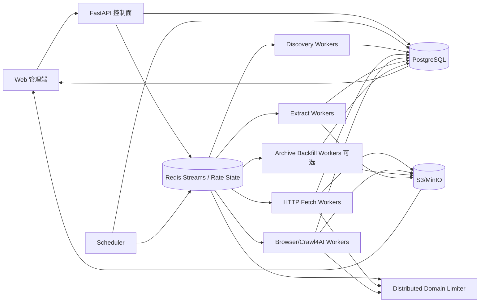

# 博客知识库技术方案

版本：v1.1  
日期：2026-08-14  
适用范围：约 1000 个技术博客站点的全量历史采集、Markdown 清洗、增量同步、持续扩站与 Web 管理。

## 1. 目标与边界

### 1.1 核心目标

1. 首次接入时尽可能完整地抓取站点历史文章，而不是只抓首页最近文章。
2. 将标题、作者、发布时间、更新时间、标签、原始 URL、正文统一清洗为稳定 Markdown。
3. 1000 个站点可以长期运行，并可继续增加；新增站点以“自动探测 + 配置优先 + Adapter 兜底”接入。
4. 支持增量同步，只处理新增或确实变化的文章，避免周期性全站强刷。
5. 支持失败隔离、限流、断点续跑、幂等、去重、版本保留、重新抽取和可观测性。
6. 提供 Web 管理端完成站点接入、配置、任务触发、运行状态、失败诊断、规则测试、Markdown 预览和版本 diff。
7. 首次历史回灌和日常增量同步使用同一套状态模型，不维护两套独立爬虫。

### 1.2 “全量历史”的定义

“全量历史”分两档，避免概念混淆：

- **Live Full**：抓取目标站当前仍能发现和访问到的全部历史文章。
- **Archive Full（可选）**：在 Live Full 基础上，使用 Common Crawl / Wayback 等历史索引发现已删除或已迁移 URL，并在来源许可、robots、版权与服务条款允许时，从历史快照补全正文。

必须明确：Common Crawl / Wayback 的 URL 发现能力并不等于当前源站仍有正文。若业务真正要求“已删除文章也尽量恢复”，需要单独的 Archive Backfill 数据链路，而不能只把历史 URL 再请求一次当前站点。

### 1.3 非目标

- 不绕过登录、付费墙、验证码或明确的访问限制。
- 不默认对所有站点使用浏览器渲染；静态 HTTP 能完成时优先低成本快路径。
- 第一阶段不把 LLM 作为正文抽取主路径，避免高成本、不可重复和内容改写。
- 向量检索/RAG 不作为采集一期强依赖，但数据模型预留分块和索引状态。

## 2. 本轮调研结论与 v1.1 优化

本轮重点复核《Handling 100+ Website Scrapers with Python's asyncio》，并对照 Crawl4AI v0.9.x 官方 Multi-URL Crawling、URL Seeding、Domain Mapping、Markdown Generation 文档。

文章提供的有效工程原则：

- 长生命周期 `AsyncWebCrawler` 复用浏览器与连接资源。
- CSS schema 声明化，把站点差异从控制流中移出。
- 单站失败隔离，不让一个站点结束整个批次。
- URL 归一化必须处理相对地址和站点特殊格式。
- 不要把 `asyncio` 等同于“无限并发”。
- 抓取上线第一天就应该有归档、去重和版本意识。
- 抓取逻辑应可被脚本、API、调度器调用，而不是只能由单一入口启动。

作者报告其同步串行实现需要 4 小时以上，切换到 Crawl4AI async 模式后约 12 分 30 秒；尝试全并发时观测到封禁、8GB+ 内存占用和浏览器崩溃。这里应视为该生产案例的经验数据，而不是“100 个 URL 一定对应 100 个独立浏览器”的通用规律。

v1.1 在原 v1.0 基础上新增或明确以下关键点：

1. **分布式域级限流**：Crawl4AI 的 `RateLimiter` / Dispatcher 可作为单 worker 内保护，但多进程、多节点时不能只依赖进程内限流；增加 Redis 统一 domain lease/token bucket，保证所有 worker 对同一域共享并发额度。
2. **浏览器结果流式处理**：大量 URL 使用 `arun_many(..., stream=True)` 逐条落 raw HTML 和任务状态，不把整批结果堆在内存。
3. **优先级队列实现细化**：Redis Streams 本身不提供业务优先级，使用多 Stream + 加权消费，确保实时增量不会被历史回灌 backlog 饿死。
4. **at-least-once 明确化**：任务允许重复投递，正确性由数据库唯一约束、幂等键、任务 lease、pending reclaim 保证，而不是假设“队列只投一次”。
5. **URL 发现与历史快照恢复分离**：DomainMapper/Wayback/CC 首先是 discovery；若要恢复已删除正文，进入可选 Archive Backfill。
6. **发现规则与文章正文规则分离**：文章里的 CSS schema 主要解决列表/结构化字段抽取；本项目将 `discovery_rules` 与 `article_extract_rules` 分成不同版本，避免一个 selector 同时承担 URL 发现和正文清洗。
7. **站点规则发布流程**：规则从“保存即生效”改为 draft -> test -> publish -> rollback，并使用 golden URLs 做回归。
8. **动态退避与站点健康度**：429/403/5xx 不仅重试，还会降低域级速率并进入冷却窗口；长期失败站点进入 degraded，避免持续打坏站点。

## 3. 总体架构



系统分为：

- **控制面**：站点、规则版本、计划、任务、人工操作、发布与回滚。
- **数据面**：URL 发现、Frontier、HTTP 下载、浏览器渲染、历史快照、正文抽取、Markdown 生成、去重与对象存储。
- **协调面**：队列、task lease、domain rate limit、重试、优先级和 backpressure。

这样未来增加站点、增加 worker、替换抓取引擎或更换 Web 前端，都不需要重写核心状态模型。

## 4. 技术栈建议

| 层 | 推荐 | 原因 |
|---|---|---|
| API / 管理后端 | Python + FastAPI | 与抓取侧同语言，异步友好，OpenAPI 完整 |
| Web | React / Next.js | 后台管理、日志、规则编辑、diff 与预览成熟 |
| 元数据/状态 | PostgreSQL | 事务、唯一约束、`SKIP LOCKED`/lease 查询、审计能力强 |
| 任务队列 | Redis Streams + Consumer Group | 轻量、支持水平扩容、pending/reclaim，适合当前规模 |
| 分布式限流 | Redis token bucket / semaphore + Lua | 多 worker 对同一域共享额度，操作原子 |
| HTTP 抓取 | httpx/aiohttp | 连接池、HTTP Validator、低资源成本 |
| 浏览器抓取 | Crawl4AI / Playwright | 动态页面、JS、规则化抓取、内存自适应 dispatcher |
| Markdown | Crawl4AI Markdown Generator + 自定义规范化 | 结构保留、过滤策略可组合 |
| 对象存储 | S3 / MinIO | raw HTML、Markdown、附件、历史版本 |
| 监控 | Prometheus + Grafana + OpenTelemetry | 吞吐、错误、queue lag、trace、资源指标 |
| 部署 | Docker Compose 起步，Kubernetes 按需 | 1000 站点不必起步就上 K8s，但组件可横向扩展 |

几十万至数百万 Markdown 不建议逐篇直接提交 GitHub 作为主存储。GitHub 适合作为配置、方案文档、规则模板和周期性导出目标；正文主存储放 S3/MinIO 或文件仓库更稳妥。

## 5. 站点生命周期与可扩展配置

### 5.1 站点生命周期

建议状态：

```text
draft -> probing -> validated -> backfilling -> active
                   \-> rejected
active -> degraded -> active
active -> disabled
```

含义：

- `draft`：仅录入 URL，尚未探测。
- `probing`：自动检测 robots、RSS、Sitemap、静态/动态特征、文章路径。
- `validated`：至少 golden URL 抽取通过。
- `backfilling`：首次历史回灌。
- `active`：正常增量同步。
- `degraded`：连续失败、selector 大面积异常、被限流或站点迁移。

### 5.2 Site 配置

```yaml
site_id: example
name: Example Blog
base_url: https://example.com
enabled: true
schedule: "0 */6 * * *"
robots_policy: respect
allowed_hosts:
  - example.com
  - www.example.com
per_domain_concurrency: 1
min_delay_ms: 1000
max_delay_ms: 3000
request_timeout_s: 30
incremental_lookback_days: 7

# URL 发现规则，不与正文抽取规则混用
discovery:
  strategies:
    - rss
    - sitemap
    - url_seeder
    - archive_pages
  include_patterns:
    - "/blog/**"
  exclude_patterns:
    - "/tag/**"
    - "/search**"
  list_selectors: []

fetch:
  prefer_http: true
  browser_fallback: true
  wait_for: null
  block_resource_types:
    - media
    - font

extract:
  strategy: auto
  article_selector: null
  title_selector: null
  author_selector: null
  date_selector: null
  remove_selectors:
    - nav
    - footer
    - aside
    - .comments

identity:
  canonical_from_html: true
  query_whitelist: []
  trailing_slash_policy: normalize
```

### 5.3 接入层级

1. **零代码通用模式**：RSS/Sitemap + 自动正文抽取。
2. **声明式模式**：增加 CSS/XPath、分页、等待条件、路径规则。
3. **Adapter 插件模式**：复杂 API、JS URL、特殊分页、需要自定义 canonical 时实现插件。

```python
class SiteAdapter(Protocol):
    async def discover(self, ctx) -> AsyncIterator[DiscoveredUrl]: ...
    async def prepare_request(self, url, ctx) -> FetchRequest: ...
    async def extract(self, result, ctx) -> ArticleDocument: ...
    def canonicalize(self, url, html, ctx) -> CanonicalResult: ...
```

### 5.4 规则版本发布

`site_rule_versions` 必须支持：

```text
draft -> testing -> published -> superseded
                  \-> rejected
published -> rollback_to_previous
```

规则发布前：

- 对 3~5 个 golden URL 回放 raw HTML。
- 检查标题、正文长度、代码块、链接、日期、图片数量。
- 与当前生产版本做 Markdown diff。
- 通过后原子切换 `active_rule_version_id`。

这样 1000 个站点的模板变化不会依赖人工直接改线上代码。

## 6. 全量历史 URL 发现

“全量历史”的第一难点是发现，而不是下载。多来源发现结果统一进入 Frontier。

### 6.1 第一层：站点自身结构化入口

- RSS / Atom / JSON Feed
- `sitemap.xml` / sitemap index
- `robots.txt` 中声明的 Sitemap
- 年份归档、分类页、标签页、分页列表
- 官方公开 API（许可允许时）

### 6.2 第二层：Crawl4AI AsyncUrlSeeder

适合已知 host 的高覆盖 URL 枚举：

- `source="sitemap"`
- `source="cc"`
- `source="sitemap+cc"`

对超大域：

- 使用 `pattern` 先过滤文章路径。
- 设置 `max_urls` 与批次边界。
- 避免无界结果一次进入内存。
- `extract_head` 只在确实需要 metadata 预筛时开启。
- seeder 缓存仅作为性能优化，业务 checkpoint 仍落 PostgreSQL。

### 6.3 第三层：DomainMapper

DomainMapper 可组合 sitemap、Common Crawl、Wayback、crt、probe、robots、feed、homepage 等来源，并发现子域。

本项目使用原则：

- 默认只启用 sitemap + cc + feed + homepage 等低风险来源。
- `crt` / `probe` 只在明确需要域级侦测时启用。
- 发现 staging、admin、API、dashboard 等 host 不代表允许抓取；必须经过 `allowed_hosts`、用途和 robots 筛选。
- DomainMapper 的 Wayback 结果只作为“历史 URL 线索”，不直接视为文章正文已经入库。

### 6.4 第四层：受限深爬

最后使用 BFS/DFS 补漏：

- 必须同域/允许子域。
- 限制路径、深度和 URL 总数。
- 过滤静态资源、登录、搜索、日历无限参数空间。
- 对 query 参数设置白名单，否则容易产生无限组合。

### 6.5 Archive Backfill（可选）

如果用户要求尽量恢复已删除历史文章：

1. 从 Wayback/CC 获得历史 URL + snapshot timestamp。
2. 先尝试当前 live URL；live 可用则以当前内容为主。
3. live 404/410/迁移且历史快照可用时，按许可策略读取快照。
4. 在 `article_versions` 标记：
   - `source_kind = live | wayback | commoncrawl`
   - `snapshot_at`
   - `source_archive_url`
5. Archive 内容与 live 内容不能 silently merge；保留来源和抓取时间，方便追溯。

## 7. URL Frontier 与状态机

所有发现 URL 统一写 `url_frontier`：

- `site_id`
- `normalized_url`
- `original_url`
- `discovery_source`
- `discovered_at`
- `sitemap_lastmod`
- `priority`
- `crawl_state`
- `next_fetch_at`
- `last_fetch_at`
- `etag`
- `last_modified`
- `content_hash`
- `retry_count`
- `lease_owner`
- `lease_until`
- `canonicalizer_version`

唯一约束：

```text
(site_id, normalized_url)
```

状态建议：

```text
discovered
  -> queued
  -> leased
  -> fetched
  -> extracted
  -> success

leased -> retry_wait -> queued
leased -> dead_letter
leased -> skipped_robots
leased -> source_deleted
```

Frontier 是 PostgreSQL 中的真实状态源，Redis 只是工作分发层。队列丢失、worker 崩溃后，系统可以通过数据库重新构建待执行任务。

## 8. 队列、任务 lease 与优先级

### 8.1 Redis Streams 使用原则

使用 Consumer Group，接受 **at-least-once**：同一任务可能因为 worker 崩溃、超时 reclaim、网络异常而再次消费。

因此必须：

- 消费前通过 DB task lease 抢占。
- 成功落库后再 ACK。
- 任务写入幂等。
- Pending 长时间无 heartbeat 时回收。
- 重试次数和错误类型保存在 DB，不只放 Redis message。

### 8.2 多级 Stream

不要假设单 Stream 有业务优先级。建议：

```text
crawl:incremental    # 最新增量，高优先级
crawl:manual         # 人工操作
crawl:retry          # 可重试故障
crawl:backfill       # 历史回灌
crawl:archive        # 低优先级历史快照
```

worker 使用加权轮询，例如：

```text
incremental : manual : retry : backfill : archive
      8      :   4    :   3   :    2     :   1
```

并设置“历史保底配额”，防止 backfill 永远得不到执行。

### 8.3 不把 50 万 URL 一次塞进 Redis

调度器从 Frontier 以分页/lease 方式领取，例如每批 1000~5000 条。Redis 只承载“近期将执行”的任务，而不是持久化整个 URL 世界。

## 9. 分布式域级并发与限流

这是 v1.1 的核心补强。

### 9.1 为什么 worker 内 semaphore 不够

假设 8 个 fetch worker，每个都设置 `example.com concurrency=1`，如果限流只存在进程内，则整个集群仍可能同时对 `example.com` 发 8 个请求。

因此域级限制必须集中协调。

### 9.2 两层限流

**第一层：集群级 Redis Domain Limiter**

按注册域或明确 host 保存：

```text
rate:{domain}:concurrency_current
rate:{domain}:concurrency_limit
rate:{domain}:next_allowed_at
rate:{domain}:penalty_until
```

用 Lua 原子完成：

1. 检查 penalty/cooldown。
2. 检查当前并发是否小于 limit。
3. 检查最小间隔。
4. 成功则发放短 lease token。
5. worker 完成后 release；崩溃时 token TTL 自动回收。

**第二层：worker 内 Crawl4AI Dispatcher**

浏览器 worker 再使用：

- `MemoryAdaptiveDispatcher`：保护本机内存。
- `RateLimiter`：本地同域延迟和 429/503 backoff。
- `max_session_permit`：限制当前进程浏览器任务数。

集群限流解决“多个 worker 同时打一个域”，本地 dispatcher 解决“单机资源爆炸”，两者职责不同。

### 9.3 自适应惩罚

- 429：显著降低速率，尊重 `Retry-After`。
- 503：指数退避 + jitter。
- 403：不盲目重试；进入短冷却，判断是否策略/权限/风控问题。
- 连续 timeout：降低并发。
- 连续成功一段时间后缓慢恢复，不瞬间恢复到峰值。

## 10. Fetch：HTTP 快路径 + 浏览器升级

### 10.1 HTTP 快路径

优先 `httpx.AsyncClient`：

- 连接池复用。
- 压缩与超时。
- 重定向链记录。
- `If-None-Match` / ETag。
- `If-Modified-Since` / Last-Modified。
- 304 直接标记 unchanged，不进入 Extract。

### 10.2 浏览器升级条件

只有出现以下情况时升级 Crawl4AI/Playwright：

- 初始 HTML 是 CSR shell，正文为空。
- 正文由 JS 注入。
- 必须点击/滚动/等待 selector。
- 服务端返回的 HTML 与浏览器呈现差异明显。

浏览器上下文必须池化，禁止“一个 URL 启一个浏览器进程”。

### 10.3 大批量浏览器任务必须流式

使用 Crawl4AI 多 URL 调度时，优先：

```python
run_config = CrawlerRunConfig(stream=True)
dispatcher = MemoryAdaptiveDispatcher(
    max_session_permit=browser_slots,
    rate_limiter=RateLimiter(...),
)

async for result in await crawler.arun_many(
    urls=batch,
    config=run_config,
    dispatcher=dispatcher,
):
    await persist_raw_and_state(result)
```

`stream=True` 的目标是结果出来一条就保存一条，缩短任务占用并避免大批结果同时驻留内存。

### 10.4 缓存语义

Crawl4AI `CacheMode` 和 seeder cache 只能作为抓取工具性能层，不能成为增量正确性的唯一依据。

业务正确性由：

- Sitemap/RSS checkpoint
- ETag/Last-Modified
- raw hash
- normalized content hash
- article version

共同保证。

`BYPASS` 只用于：

- 人工强制刷新。
- 缓存明确疑似污染。
- 首次调试或规则验证需要新响应。

## 11. 正文抽取与 Markdown 规范

### 11.1 发现抽取与正文抽取分离

文章案例中的 `JsonCssExtractionStrategy` 非常适合列表页 notices/events 结构化字段；本项目不能直接把这套 schema 当成文章正文抽取万能方案。

拆分为：

- `discovery_rules`：从列表/归档页提取 article URL、标题、日期。
- `article_extract_rules`：从文章页提取正文、作者、时间、标签。

两类规则分别版本化。

### 11.2 正文抽取链

1. 站点专用 `article_selector`。
2. 语义 HTML：`article` / `main`。
3. JSON-LD Article/BlogPosting 元数据。
4. Crawl4AI Markdown Generator。
5. `PruningContentFilter` 等规则去除导航、页脚、相关推荐和高 link-density 噪声。
6. 特殊 Adapter。

### 11.3 Markdown 规范

```markdown
---
site_id: example
canonical_url: https://example.com/posts/123
source_url: https://example.com/posts/123?utm_source=x
title: Example
published_at: 2024-05-01T10:00:00Z
updated_at: 2024-05-02T10:00:00Z
fetched_at: 2026-08-14T09:00:00Z
author: Alice
tags: [python, crawler]
content_hash: sha256:...
extractor_version: 3
rule_version: 7
source_kind: live
version: 2
---

# Example

正文……
```

规范：

- 仅保留一个一级标题。
- 代码块保留语言标记。
- 表格尽可能保留为 Markdown；复杂表格可保留原 HTML 片段。
- 图片 URL 转绝对地址；需长期保存时下载到对象存储并改写。
- 去 script/style/nav/footer/comments/cookie banner。
- 内链转绝对 URL。
- UTF-8 + LF。
- 不用 LLM 自动改写正文。

## 12. URL 归一化、文章身份与去重

### 12.1 URL 归一化

1. 相对 URL -> 绝对 URL。
2. host 小写，移除默认端口。
3. 去 fragment。
4. 删除确定的跟踪参数，如 `utm_*`、`fbclid`。
5. 按站点策略处理尾斜杠。
6. 内容型 query 参数通过白名单保留。
7. 读取 `<link rel="canonical">`，但必须校验仍位于允许域。
8. 保存 redirect chain，不直接丢失原 URL。

canonical 规则也要版本化，避免规则升级后同一批文章身份突然大面积改变。

### 12.2 去重键

```text
article_key = sha256(site_id + canonical_url)
```

同时维护：

- `raw_hash`：下载响应原始内容。
- `body_text_hash`：正文归一化后内容。
- `simhash/minhash`：可选，发现镜像与重复文章。

同 URL 内容 hash 不变：不创建新版本。  
同 URL 内容变化：创建 `article_versions`。  
不同 URL 高相似：进入 duplicate candidate，不自动删除。

## 13. 增量同步

增量必须从发现阶段减少工作，而不是“每日全站重抓后再去重”。

### 13.1 信号优先级

1. RSS/Atom 新 GUID / entry id。
2. Sitemap 新 URL / `lastmod` 变化。
3. 列表页前 N 页 + watermark。
4. HTTP Validator（ETag/Last-Modified）。
5. 内容 hash。
6. 低频 reconciliation 补漏。

### 13.2 Checkpoint

每个 site + strategy 独立保存：

- 最近 GUID。
- 最近 published_at。
- sitemap lastmod / sitemap hash。
- pagination cursor。
- 最近成功扫描时间。

保留 3~14 天 lookback，防止站点回填旧文章、延迟发布时间或列表排序改变。

### 13.3 删除与迁移

- 404/410 不立即物理删除历史知识。
- 连续多次确认后标记 `source_deleted_at`。
- 301/308 更新 redirect/canonical 关系。
- Web 可选择从“当前知识库视图”隐藏，但版本仍可追溯。

## 14. Fetch 与 Extract 强制解耦

这是长期成本控制的关键。

Fetch 只负责：

- 下载。
- 保存状态码/header/final URL。
- 保存 raw HTML。
- 生成 raw hash。

Extract 只负责：

- 加载指定 raw snapshot。
- 使用指定 rule/extractor 版本。
- 生成 Markdown。
- 质量检查。
- 版本落库。

规则变化后只重跑 Extract，不重新访问 1000 个源站。

## 15. 数据模型

### `sites`

站点身份、状态、调度、robots、限流参数、active rule。

### `site_hosts`

允许 host、host 类型、是否允许抓取、域级限流覆盖值。

### `site_rule_versions`

发现/正文规则版本、draft/published 状态、测试结果。

### `golden_urls`

站点回归测试样本及期望字段。

### `discovery_checkpoints`

每站点每发现策略 watermark/cursor。

### `url_frontier`

候选 URL、状态、优先级、lease、validator。

### `crawl_jobs`

一次 full/incremental/manual/archive/reextract 的总体任务。

### `crawl_tasks`

单 URL 任务、attempt、错误、耗时、lease、worker。

### `fetch_snapshots`

HTTP header、状态码、raw object key、raw hash、redirect chain。

### `articles`

文章逻辑身份、canonical URL、发布时间、当前版本。

### `article_versions`

Markdown object key、content hash、rule/extractor version、来源类型。

### `duplicate_candidates`

不同 URL 的相似文章候选。

### `site_health_events`

429/403/selector fail/soft404 等健康事件，用于降速和 Web 诊断。

## 16. 对象存储布局

```text
kb/
  raw/{site_id}/{yyyy}/{mm}/{article_key}/{fetch_id}.html.gz
  md/{site_id}/{yyyy}/{mm}/{article_key}/v{n}.md
  assets/{site_id}/{article_key}/...
  archive/{site_id}/{article_key}/{snapshot_at}/...
```

PostgreSQL 保存索引、状态和小型元数据，不保存大段 HTML。

S3/MinIO：

- raw HTML：按成本与调试需求保留 30~180 天或长期归档。
- Markdown：长期保留。
- 关键 archive snapshot：长期保留并记录来源。
- 对象 key 不使用文章标题，避免字符和重命名问题。

## 17. Web 管理功能

### 17.1 站点接入向导

输入域名后自动显示：

- robots 状态。
- RSS/Sitemap。
- 预计文章 URL 模式。
- HTTP/Browser 判定。
- 发现 URL 数量抽样。
- golden URL 自动候选。

### 17.2 规则编辑与发布

- discovery rules 编辑。
- article extract rules 编辑。
- 指定 raw HTML 回放。
- Markdown 预览。
- 新旧规则 diff。
- golden URLs 批量测试。
- publish / rollback。

### 17.3 任务管理

- 全量同步。
- 增量同步。
- 暂停/恢复。
- 单站/单文章重试。
- re-extract without refetch。
- Archive Backfill 可选。
- backlog、完成量、速率、失败分类。

### 17.4 错误诊断

- DNS/TLS/timeout。
- 429/403/5xx。
- robots 拒绝。
- Browser crash/OOM。
- selector 失效。
- soft 404 / access denied HTML。
- 正文过短/空文档。
- dead-letter 与批量 replay。

### 17.5 内容管理

- raw HTML / clean Markdown 对照。
- Front Matter。
- 历史版本 diff。
- canonical 关系。
- duplicate candidates。
- 来源 live/archive 标记。

## 18. 质量控制

自动质量门槛：

- 标题为空 -> fail/suspect。
- 正文小于站点阈值 -> suspect。
- 主体 link density 过高 -> suspect。
- 一批文章正文 hash 相同 -> 可能登录页/风控页/SPA shell。
- HTTP 200 但页面标题/正文是 404/Access Denied -> soft error。
- 新规则导致 80% 以上正文差异且多篇同时发生 -> selector/template suspect。
- 代码块数量突然归零 -> formatter suspect。
- 文章发布日期晚于抓取日很久或解析异常 -> metadata suspect。

站点质量得分建议综合：

- fetch success rate。
- extract success rate。
- suspect ratio。
- duplicate ratio。
- 最近成功时间。
- golden test pass rate。

## 19. 失败、重试与幂等

### 19.1 错误分类

**可自动重试**：

- timeout、connection reset。
- 429。
- 502/503/504。
- 临时 browser crash。

**条件重试**：

- 403。
- 401。
- soft block。
- 大面积 selector fail。

**不自动重试**：

- robots 禁止。
- 明确 410。
- 非法 URL。
- host 不在 allowlist。

### 19.2 幂等键

```text
idempotency_key = task_type + site_id + normalized_url + input_snapshot + rule_version
```

所有持久化写入依赖唯一约束/upsert，防止重复消息产生重复文章版本。

### 19.3 Dead Letter

超过最大重试进入 dead-letter；Web 支持：

- 单条 replay。
- 按站点 replay。
- 按错误类型 replay。
- 修规则后批量 re-extract。

## 20. 安全、robots 与合规

- 默认遵守 robots.txt。
- Crawl4AI browser path 开启 robots 检查或在调度层预先校验。
- 明确 User-Agent 与联系信息。
- 不绕过认证、验证码、付费墙。
- SSRF：拒绝 localhost、RFC1918、link-local、metadata IP。
- DNS 解析后和重定向后都重新校验 IP/host。
- Browser 网络请求限制在允许域，屏蔽不必要资源。
- Secret/代理/cookie 只存 Secret Manager 引用，不写日志。
- DomainMapper 发现 admin/staging 不代表许可抓取；默认丢弃非博客用途 host。
- 保存 source URL、fetched_at、source_kind、版权/许可证元数据。

## 21. 可观测性

### 全局指标

- discovery URLs/s。
- fetch success rate。
- extract success rate。
- queue lag。
- pending/reclaimed tasks。
- P50/P95 fetch latency。
- browser usage ratio。
- 304 ratio。
- bytes downloaded。
- Markdown generated/day。
- raw->md processing lag。

### 站点级

- 最近成功时间。
- 429/403 比例。
- 连续失败次数。
- 当前 domain penalty/cooldown。
- 新增/更新文章数。
- selector suspect 数。
- golden test 通过率。

### 告警

- 单站连续多轮全失败。
- 24h 未成功同步。
- 全局错误率突然上升。
- Browser worker OOM/crash。
- Redis pending 持续增长。
- backfill backlog 只增不减。
- 同站多文章同时生成相同 hash。

## 22. 容量、背压与初始参数

假设 1000 站点、平均 500 篇历史文章约 50 万篇；真实规模可能高一个数量级，因此所有层都按“流式 + 分批 + lease”设计。

初始部署：

- API x1
- Scheduler x1（通过 DB lease 选主）
- Discovery worker x2
- HTTP fetch worker x4
- Browser/Crawl4AI worker x2
- Extract worker x2
- Archive worker x0~1（按需）
- PostgreSQL x1
- Redis x1
- MinIO x1

初始限制：

- domain concurrency 默认 1。
- domain delay 默认 1~3s。
- HTTP worker 每进程 20~50 全局 slot。
- Browser worker 每进程 4~8 slot，再由内存自适应下调。
- Frontier lease 每批 1000~5000。
- Browser `arun_many` 小批次 + stream，不跑超大列表。

背压规则：

- Extract lag 过大 -> Fetch 降速。
- S3 写入异常 -> Fetch 暂停 lease 新任务。
- Browser 内存接近阈值 -> dispatcher 自动减速。
- Redis Stream 长度超过阈值 -> Scheduler 减少 frontier dispatch。

## 23. 站点故障与模板变化策略

站点模板变化是 1000 站点长期运行的常态。

检测方式：

- golden URL 定时回归。
- 标题/正文 selector 空值率。
- Markdown 长度分布突变。
- 同站多文章相似度异常。
- 浏览器 fallback 比例突然升高。

处理：

1. 自动标记 degraded。
2. 减少抓取速率，避免无效大规模请求。
3. Web 展示最近正常 raw 和异常 raw diff。
4. 创建新 rule draft。
5. 在历史 raw 上离线调试。
6. golden test 通过后 publish。
7. 批量 re-extract，不 refetch。

## 24. 分阶段实施

### Phase 1：MVP（20~50 站点）

- sites/frontier/articles/article_versions。
- RSS + Sitemap + 通用列表发现。
- HTTP fast path + Crawl4AI fallback。
- raw HTML + Markdown 对象存储。
- Redis Streams consumer group。
- DB task lease + 幂等。
- Web CRUD、任务和错误列表。
- 增量 checkpoint。

### Phase 2：扩到 1000 站点

- AsyncUrlSeeder / Common Crawl。
- DomainMapper 受控补全。
- 分布式 domain limiter。
- 多 Stream 优先级调度。
- Browser `arun_many(stream=True)`。
- Dead-letter、reclaim、规则版本。
- golden URL 回归。
- 监控与自动 degraded。

### Phase 3：极致历史覆盖与知识库能力

- Archive Backfill（Wayback/CC snapshot，可选）。
- 自动模板变化检测。
- duplicate/mirror 聚类。
- 全文索引/向量索引。
- 分块与引用追踪。
- 质量评分与人工审核队列。

## 25. 关键伪代码

### 25.1 增量发现

```python
async def run_site_incremental(site):
    async for item in discover_incremental(site):
        normalized = canonicalize_candidate(item.url, site)
        await frontier_upsert(site.id, normalized, item.metadata)

    while batch := await lease_due_urls(
        site_id=site.id,
        limit=1000,
        purpose="incremental",
    ):
        await publish_by_priority(batch)
```

### 25.2 Fetch worker

```python
async def fetch_worker(task):
    if not await acquire_task_lease(task):
        return

    domain_token = await distributed_domain_limiter.acquire(task.domain)
    if not domain_token:
        return await reschedule(task)

    try:
        resp = await try_http_conditional(task)

        if resp.status == 304:
            return await mark_unchanged(task)

        if needs_browser(resp):
            return await enqueue_browser(task)

        raw_key = await save_raw(resp)
        await mark_fetched(task, raw_key)
        await enqueue_extract(task, raw_key)
    finally:
        await distributed_domain_limiter.release(domain_token)
```

### 25.3 Browser worker

```python
async def browser_batch_worker(tasks):
    urls = [t.url for t in tasks]
    config = CrawlerRunConfig(stream=True)
    dispatcher = MemoryAdaptiveDispatcher(
        max_session_permit=BROWSER_SLOTS,
        rate_limiter=RateLimiter(...),
    )

    async for result in await crawler.arun_many(
        urls=urls,
        config=config,
        dispatcher=dispatcher,
    ):
        await persist_result_immediately(result)
```

### 25.4 Extract worker

```python
async def extract_worker(task, raw_key, rule_version):
    raw = await object_store.get(raw_key)
    doc = await extract_to_markdown(raw, rule_version)
    normalized = normalize_document(doc)
    h = sha256(normalized.body)

    if h == task.previous_content_hash:
        return await mark_unchanged(task)

    md_key = await save_markdown_version(normalized)
    await upsert_article_version(
        task=task,
        doc=normalized,
        content_hash=h,
        md_key=md_key,
        rule_version=rule_version,
    )
```

## 26. 对当前调研文章的具体吸收与修正

| 原文做法 | 结论 | 本方案落地 |
|---|---|---|
| asyncio | 采用 | worker 内异步 I/O 基础 |
| 单 crawler context | 采用 | worker 级长生命周期资源池 |
| CSS schema | 采用 | 拆分 discovery 与 article rule，版本化 |
| 单站失败 `continue` | 升级 | 持久化状态机、retry、dead-letter |
| `urljoin` | 升级 | canonical、query、redirect、唯一约束 |
| 站点完全串行 | 不直接采用 | 跨域并发 + 分布式域内限流 |
| 全量 `asyncio.gather` | 不采用 | 有界 dispatcher + stream + backpressure |
| 每次 `CacheMode.BYPASS` | 不作默认 | validators/checkpoint/hash 决定增量 |
| Flask API 中同步等待 scrape | 不采用 | API 只创建 durable job |
| Cron | 仅简单环境 | DB scheduler + 防重叠 lease |
| MongoDB 归档 | 概念采用 | PostgreSQL 状态 + S3/MinIO raw/md 版本 |
| 作者观测 8GB+ 内存 | 作为经验信号 | 采用 MemoryAdaptiveDispatcher，不把它解释为固定“100 浏览器”模型 |

## 27. 技术风险与应对

### 风险 1：站点远多于 1000，历史 URL 数量失控

应对：Frontier 分批、site quota、路径过滤、发现预算、流式处理。

### 风险 2：多个 worker 对同一域叠加并发

应对：集群级 Redis domain limiter，不只用进程内 semaphore。

### 风险 3：规则误改导致几十万篇 Markdown 被错误覆盖

应对：raw 保留、rule version、golden test、draft/publish/rollback、article_versions。

### 风险 4：历史 URL 能发现但正文已删除

应对：区分 Live Full 与 Archive Full；Archive Backfill 独立实现和标记来源。

### 风险 5：Redis 消息重复或 worker 崩溃

应对：at-least-once + DB lease + idempotency + unique constraints + pending reclaim。

### 风险 6：浏览器成本过高

应对：HTTP fast path、Browser fallback、资源屏蔽、MemoryAdaptiveDispatcher、stream。

## 28. 参考资料

- 调研文章：https://dev.to/pradippanjiyar/handling-100-website-scrapers-with-pythons-asyncio-4905
- Crawl4AI Multi-URL Crawling：https://docs.crawl4ai.com/advanced/multi-url-crawling/
- Crawl4AI URL Seeding：https://docs.crawl4ai.com/core/url-seeding/
- Crawl4AI Domain Mapping：https://docs.crawl4ai.com/core/domain-mapping/
- Crawl4AI Markdown Generation：https://docs.crawl4ai.com/core/markdown-generation/

## 29. 当前决策摘要

最终采用：**站点生命周期/规则中心 + 多策略 URL Discovery + PostgreSQL Frontier + Redis Streams 工作分发 + 分布式 Domain Limiter + HTTP/Browser 双路径 + 流式 Crawl4AI Dispatcher + Fetch/Extract 解耦 + Raw/Markdown 对象存储 + 增量 Checkpoint + 规则版本/回归/回滚 + Web 控制面**。

这套结构不会把“asyncio 并发”当成扩展性的全部，而是将扩展性放在持久化状态、分布式限流、流式背压、可重放数据和规则版本上。对 1000+ 异构技术博客，首次历史回灌、日常增量同步、模板变化和后续扩站都可以在同一套系统内演进。