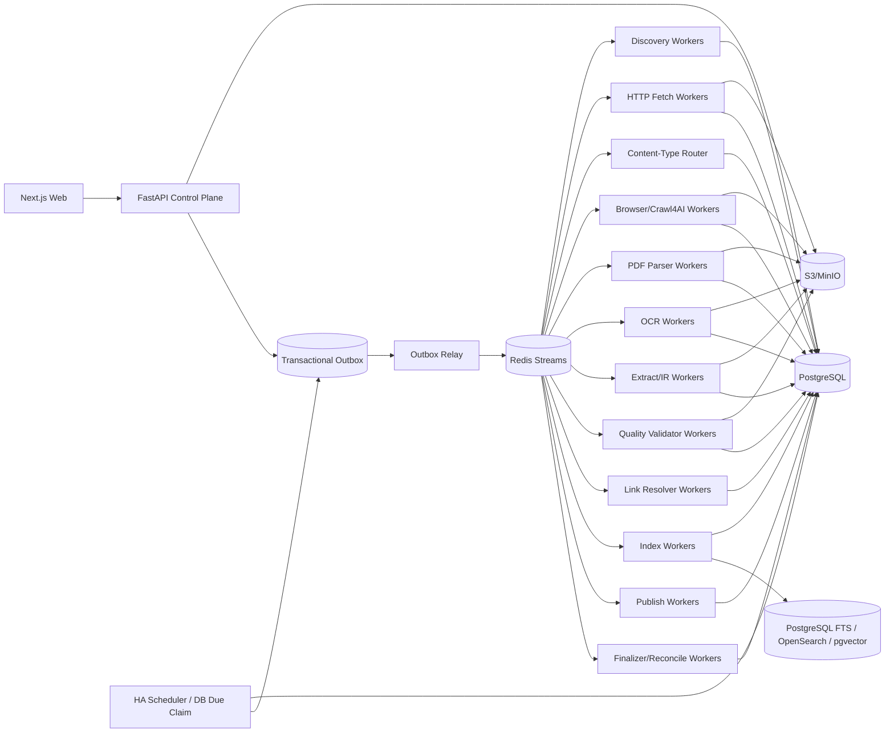

# 博客知识库技术方案

适用范围：从约 1000 个技术博客/文档型网站抓取尽可能完整的历史内容，清洗为稳定 Markdown 构建长期知识库；后续持续增加站点，并支持增量同步、Web 管理、版本保留、检索、故障恢复、离线重处理和外部发布。容量按“百万级文章、数百万到千万级 URL、站点高度异构、长期运行”设计。

## 1. 建设目标

1. 管理员录入站点根地址或文档入口后，系统自动探测 Sitemap、RSS/Atom/JSON Feed、归档页、分类/标签/作者页、平台 API、文档导航树、普通站内链接和动态列表，生成可审核的站点配置草稿。
2. 支持约 1000 个站点历史全量回灌，并能持续增加站点；发现器、抓取器、浏览器、PDF/OCR 解析器、抽取器和发布器通过 Capability/Adapter 扩展，不修改核心状态机。
3. 支持 `FULL_BACKFILL`、`INCREMENTAL`、`RECONCILE`、`TARGETED_FETCH`、`REPROCESS` 等明确运行模式。
4. 最终保存标题、作者、发布时间、更新时间、标签、canonical、正文、代码块、表格、图片、附件、PDF、真实链接关系和来源定位，并渲染成稳定 Markdown。
5. 默认 HTTP-first，仅有明确证据时升级 Browser/Crawl4AI/Playwright；PDF、Feed、JSON/API 等按真实 Content-Type 路由。
6. 支持 ETag、Last-Modified、Sitemap lastmod、Feed GUID/API cursor、导航树 hash、内容 hash、重叠窗口和周期 Reconcile 驱动的增量同步。
7. 支持 durable frontier、断点续跑、幂等、lease、heartbeat、重试、限流、熔断、公平调度和 backpressure。
8. 保存不可变网络 Snapshot/原始 PDF、渲染 DOM、清洗 HTML、导航快照、Document IR、候选 Markdown、最终 Markdown、规则版本和质量结果；规则升级优先离线 replay。
9. Web 管理端支持站点接入、抓取作用域、导航树预览、同步计划、覆盖检查、任务控制、混合内容路由、Browser Readiness、质量审核、版本 diff、错误诊断、搜索、成本与发布。
10. 每次运行可复现、可解释、可审计；Worker 自报成功不能直接成为业务完成事实。

## 2. 核心原则

1. PostgreSQL 是业务状态真相源；S3/MinIO 是不可变大对象真相源。
2. Redis Streams 只做短期任务运输；决定性状态先落 PostgreSQL，再通过 Transactional Outbox 投递。
3. URL 被发现不等于允许抓取；统一经过 URL Admission Pipeline，真实网络连接仍由 Egress Gateway 做 DNS/IP/端口/redirect 安全校验。
4. 抓取作用域必须显式版本化；“internal link”“same domain”“seed URL 下所有页面”不能作为隐含、不可审计的运行规则。
5. Sitemap、Feed、API、Archive、DOC_NAVIGATION、普通 HTML 链接、Browser Dynamic Listing 都是独立 Discovery Provider，不能把“某一页提取出的链接集合”当作全站完整性证明。
6. Discovery 与 Content Fetch 使用不同执行目标：Discovery 优先低成本枚举 URL 和证据，Content Fetch 才执行正文渲染、抽取、质量和发布。
7. HTTP、Browser、PDF/OCR 分层处理，不把所有 URL 强行交给浏览器或 HTML extractor。
8. Browser 是昂贵升级路径；生产中复用长期 browser/crawler runtime，不为每个 URL 重建浏览器。
9. 页面就绪条件是版本化 Readiness Contract；默认不以全局 `networkidle` 作为唯一完成信号。
10. 网络 Snapshot 和原始 PDF 不可变；规则、Schema、模型、Renderer 升级优先 replay，不重复访问源站。
11. 文档身份与 URL 分离；redirect、canonical、镜像、迁移、slug、文档版本路径变化只是 identity evidence。
12. `document_version` append-only，不覆盖旧版本。
13. JSON、Markdown、搜索索引和外部知识库都是 Canonical Document IR 的 Projection，不互相反解析。
14. 文件路径只属于发布视图，不承担文档 identity，也不能用“文件已存在”判断已同步。
15. `max_depth/max_pages/max_articles/max_entries/max_runtime` 都只是 execution slice 预算，不能作为历史完整性判定。
16. 固定 `word_count_threshold` 只能作为抽取/评分信号，不能成为历史覆盖或 URL admission 的静默丢弃条件。
17. Bloom Filter/RoaringBitmap/内存 Set 只能加速，不能替代数据库唯一约束和 durable frontier。
18. Scheduler、浏览器进程、Redis Consumer ownership、前端页面都是可丢失运行时状态，不能替代数据库里的 schedule、run、task、lease 和幂等约束。
19. 长期任务 payload 不保存 API Key、Cookie、密码或 Token，只保存 Secret Reference/Version。
20. Dashboard 是事实展示和显式命令入口，不是状态真相源，也不持有流程锁或 continue gate。
21. URL 必须来自真实 discovery evidence 或管理员精确输入，禁止根据标题猜 URL，也禁止用相似文章替代失败目标。
22. 核心领域数据通过 Typed Domain Writer 写入；关键领域字段只有唯一权威 Writer。
23. 阶段完成由独立 Stage Finalizer 对真实领域数据和 COMPLETE Artifact 对账。
24. 最终质量由独立 Deterministic Validator 重新计算，生产内容的 Worker 不能自行证明通过。

## 3. 总体架构



职责：

- Control Plane：站点配置、权限、计划、Run 创建、Run Context、命令和查询；
- Scheduler：只触发逻辑 Run，不执行长抓取；
- Discovery：枚举 URL、导航树、Provider checkpoint 和覆盖证据；
- Admission：执行 Crawl Scope、URL normalization、robots、trap 和安全预检查；
- HTTP Fetch：获取原始响应并保存 Snapshot；
- Content-Type Router：根据真实响应决定 HTML/PDF/API/Feed/Attachment 路径；
- Browser/Crawl4AI：只处理需要渲染或交互的页面，采用长期 runtime；
- PDF/OCR：处理原始 PDF、扫描件和页级内容；
- Extract/IR：产生统一 Document IR；
- Artifact Service：Reservation、staging、hash/schema 校验和 COMPLETE commit；
- Quality Validator：独立校验最终候选版本；
- Stage Finalizer：以真实领域数据和 Artifact 对账阶段状态；
- Link Resolver：维护文档链接图；
- Publish：从 accepted version 产生文件树/Git/对象存储/外部 KB 视图；
- Dashboard：读取事实并发出显式命令。

## 4. Crawl Mode 与运行语义

```text
FULL_BACKFILL     首次历史全量回灌
INCREMENTAL       持续同步新增和更新
RECONCILE         周期性重新枚举，修复断档
TARGETED_FETCH    精确 URL 抓取/调试
REPROCESS         不访问网络，基于已有 Snapshot/原始 PDF 重抽取、清洗、质量、索引、发布
```

约束：

- FULL_BACKFILL 中 Page Type/Scorer/word count 只影响优先级或候选评分，不得因关键词、低分、短正文、深度预算静默丢弃合法历史 URL。
- TARGETED_FETCH 接收精确 URL 列表，保留输入顺序；任何目标失败都逐项报告，禁止补位或替代。
- REPROCESS 必须记录 `source_snapshot_id/source_artifact_id` 和 lineage。
- 同站点默认只允许一个 active FULL_BACKFILL；其他模式并行关系由显式策略控制。
- Run 的完成由 Finalizer 判断，不由 Worker “全部协程结束”判断。

## 5. 不可变 Run Context Manifest

Run 创建时冻结本次运行语义：

```text
run_context_id
crawl_run_id
site_profile_release_id
site_source_release_ids
provider_release_ids
crawl_scope_release_id
url_filter_release_id
url_scorer_release_id
page_type_rule_release_id
fetch_profile_release_id
content_route_release_id
browser_action_plan_release_id
adapter_binding_release_id
adapter_schema_release_id
extraction_pipeline_release_id
document_ir_schema_release_id
markdown_renderer_release_id
quality_contract_release_id
index_release_id
publish_release_id
runtime_bundle_release_ids
policy_release_id
credential_profile_id
secret_version_refs
context_hash
created_at
```

规则：

1. Context 创建后不可修改；
2. Worker payload 只引用 `run_context_id`，禁止读取“latest release”；
3. Context Hash 不一致时拒绝提交；
4. 发布新配置不影响正在运行的 Run；
5. 用新规则处理旧 Snapshot 时创建新的 REPROCESS Run/Context，并保留 lineage；
6. Web 可对两个 Context 做 diff。

## 6. 核心数据模型

至少包括：

```text
site
site_source
site_profile_release
site_source_release
crawl_scope_release

discovery_provider
discovery_provider_release
discovery_checkpoint
discovery_evidence
provider_coverage
navigation_snapshot
navigation_entry

sync_schedule
crawl_run
run_context_manifest
run_event

sitemap_task
url_frontier
background_task
task_event
fetch_task
crawl_attempt

content_route_release
adapter_capability_release
adapter_binding_release
adapter_schema_release
runtime_bundle_release

artifact_kind_release
artifact_reservation
artifact_object
run_artifact_manifest
fetch_snapshot

page_type_rule_release
url_filter_release
url_scorer_release
fetch_profile_release
browser_action_plan_release
extraction_pipeline_release
document_ir_schema_release
markdown_renderer_release
quality_contract_release

extraction_candidate
quality_manifest
quality_override

document
document_url_relation
document_version
document_link_edge
source_locator

publish_profile_release
publish_manifest
publish_state
field_ownership_release
contract_release
index_release
credential_profile
outbox_event
```

`site_profile_release.site_archetype` 可取 `BLOG / DOCS / NEWSLETTER / MIXED / CUSTOM`，只用于 Probe、Provider 和默认策略建议，不改变核心状态机。

如果业务侧仍使用“article”命名，可以把 `document` 视为父模型、`article` 作为 HTML 博客子类型，避免 PDF 或技术文档再造一套版本、质量和索引系统。

## 7. 新站点接入：Discovery Probe

管理员录入根 URL/文档入口后：

1. 获取入口页面，记录 final URL、响应头、Content-Type、编码和页面结构；
2. 解析 robots.txt 中 Sitemap；
3. 探测常见 Sitemap/Sitemap Index；
4. 探测 RSS/Atom/JSON Feed；
5. 识别平台公开 API、年/月归档、分类/标签/作者分页；
6. 识别文档站侧边栏、顶栏目录、章节树、上一页/下一页、版本选择器和语言选择器；
7. 识别普通站内链接和动态列表；
8. 建议 Crawl Scope：允许 host、是否包含子域、路径前缀、排除路径、query 策略、asset host、API host；
9. 抽样识别 HTML/PDF/下载资源比例；
10. 必要时执行 Browser Sample Probe；
11. 对动态样本比较 `domcontentloaded`、CSS/JS `wait_for`、networkidle 等 Readiness 方案；
12. 抽样 3~10 篇文章/文档页识别正文和 metadata；
13. 对短 API/reference 页面单独检查，避免字数阈值误杀；
14. 对 PDF 样本测试 native parser，必要时测试 OCR；
15. 生成 Site Profile、Crawl Scope、Provider、Filter、Scorer、Discovery Fetch Profile、Content Fetch Profile、Content Route、Browser Action Plan、Extraction Contract 草稿；
16. 在 Web 展示证据、导航树、样本 diff、路由结果、Readiness 和风险；
17. dry-run/canary 通过后 publish；
18. 启动首次 FULL_BACKFILL；
19. 自动创建默认 INCREMENTAL schedule。

站点长期配置必须版本化，运行中的临时结果不能直接修改正式 Release。

## 8. Crawl Scope：把“same domain/internal links”显式建模

`crawl_scope_release` 至少包含：

```text
allowed_hosts
allowed_registrable_domains
include_subdomains
path_prefixes
path_excludes
query_policy
allowed_schemes
follow_redirect_outside_scope
canonical_cross_host_policy
asset_hosts
api_hosts
```

作用：

- `blog.example.com` 与 `www.example.com` 是否视为同一站点由配置决定；
- 文档入口 `example.com/docs/v2/` 可以限定 path prefix，不因“同域”扩张到账号、商城、搜索等无关区域；
- `v1.docs.example.com`、`v2.docs.example.com` 可明确允许、分组或隔离；
- CDN/图片域可允许下载 asset，但不自动把整个 CDN 当正文站点深爬；
- redirect/canonical 越界只形成 identity evidence 时，不自动扩大抓取范围；
- Scope 作为 Run Context 一部分，运行中不可漂移。

Admission 的每次判定保存：

```text
scope_release_id
scope_decision
matched_rule
source_evidence_id
```

Web 必须可解释“为什么这个 URL 被允许/拒绝”。

## 9. Discovery Provider 与覆盖台账

Provider 优先级一般为：

```text
Sitemap/Sitemap Index
 -> 平台 API
 -> Feed
 -> Archive/Category/Tag/Author
 -> DOC_NAVIGATION
 -> 普通 HTML 链接
 -> Browser Dynamic Listing
 -> 外部公开索引补漏
```

每个 Provider 独立保存：

```text
provider_id
provider_type
capabilities
fetch_profile_release_id
checkpoint
last_success_at
last_enumerated_at
continuity_marker
expected_count_hint
discovered_count
admitted_count
coverage_gap
status
```

每个 URL 保存 `discovery_evidence`：

```text
source_provider
source_url
source_entry/href/guid
navigation_snapshot_id
navigation_tree_path
navigation_order
version_hint
locale_hint
observed_at
raw_evidence_ref
```

FULL_BACKFILL 完成需要 Provider 级证据，而不是“本次抓了 N 页”。至少满足：主要 Provider 已完成或明确记录 gap；durable frontier 无可执行 URL；retry/dead-letter 已处理；reconcile 不再产生显著新增；Coverage Ledger 无未知断档。

## 10. 文档导航树 Provider：把“侧边栏链接”升级为可审计发现能力

文档型网站经常没有完整 Sitemap，但侧边栏/章节树是官方维护的目录。将其建模为 `DOC_NAVIGATION` Provider，而不是临时从种子页 `result.links["internal"]` 取一个集合。

### 10.1 两阶段发现

```text
Seed URL
 -> 轻量 HTTP Discovery
 -> 若导航不完整/CSR shell，则 Browser Discovery
 -> 解析导航容器与链接
 -> navigation_snapshot
 -> URL Admission
 -> durable frontier
 -> 内容抓取
```

Discovery Fetch Profile 只做“获取导航所需的最少工作”，默认不生成最终 Markdown、不执行 LLM 抽取、不下载大媒体。Content Fetch Profile 才负责正文、代码块、表格、图片、PDF 等完整处理。

### 10.2 Navigation Snapshot

保存：

```text
navigation_snapshot_id
site_id
source_url
provider_release_id
render_mode             # HTTP / BROWSER
container_signature
navigation_hash
entry_count
version_selector_state
locale_selector_state
captured_at
artifact_ref
```

每个 entry 保存：

```text
href
anchor_text
tree_path
level
order
rel
version_hint
locale_hint
source_locator
```

这样可以：

- 保留文档结构，用于发布目录、检索 breadcrumb 和覆盖诊断；
- 对比前后 `navigation_hash`，把目录变化作为增量信号；
- 发现“旧版本文档/多语言文档被切换器隐藏”的情况；
- 在 Web 中展示“目录里有 300 条、已抓 298 条、2 条失败”的可解释覆盖。

### 10.3 完整性边界

导航树是强证据但不是唯一真相：

- 某些站点只在当前章节显示局部导航；
- 折叠菜单可能需要交互才能暴露链接；
- CSR/虚拟列表可能只渲染可视区域；
- 隐藏 API reference、PDF、历史版本可能不在主导航；
- 一页的 internal links 可能混入页脚、登录、搜索、tag 等噪声。

因此 DOC_NAVIGATION 必须与 Sitemap/API/Archive/递归 HTML frontier/Reconcile 交叉验证。导航 hash 未变化只能降低枚举优先级，不能永久跳过其他 Provider。

## 11. Sitemap、Archive 与 Deep Crawl 持久化

Sitemap 独立建模为可恢复任务树，支持 Sitemap Index、gzip、namespace、lastmod，并用 streaming/iterparse 处理大文件；限制压缩前字节、解压后字节、压缩比，防 zip bomb。

Archive/Category/Tag/Author/Pagination Provider 同样保存页级 checkpoint 和 continuity。

Deep Crawl 的 `max_depth/max_pages/score_threshold/prefetch` 只作为某次 slice 的预算和排序参数：

```text
probe_depth
slice_max_pages
slice_max_runtime
prefetch_mode
priority_scorer
```

slice 用尽后保存 checkpoint 并重新排队；绝不把“达到 max_depth”当历史覆盖完成。

如果使用 Crawl4AI BFS/DFS/Best-First，可将执行器恢复状态保存为 Adapter Artifact，但系统级恢复仍以 PostgreSQL durable frontier 为准。

## 12. Durable Frontier、URL Normalization 与 Crawler Trap

URL 唯一键建议：

```text
(site_id, sha256(normalized_url))
```

Admission Pipeline：

1. URL 规范化；
2. Crawl Scope；
3. SSRF/Egress 预检查；
4. robots/站点策略；
5. path allow/deny；
6. query 规范化；
7. Content-Type/扩展名 hint；
8. canonical/redirect identity hint；
9. crawler trap 检测；
10. Page Type 分类；
11. Priority Scorer；
12. durable frontier upsert。

规范化处理 host 大小写、IDN、fragment、默认端口、tracking query、query 顺序、session 参数、trailing slash 和 percent-encoding。

Crawler Trap 至少防：日历无限翻页、站内搜索参数组合、tag/filter 笛卡尔积、无界 `?page=`、session/token、无限日期路径和多排序组合。

内存 `set()`/Bloom/RoaringBitmap 只能减少数据库查询，不是最终去重依据；发现顺序如果有业务意义（导航顺序、Targeted 输入顺序）必须显式保存，不能因 `set()` 去重而丢失。

## 13. HTTP-first、条件请求与 Content-Type Router

HTTP Worker 优先发送 `If-None-Match/If-Modified-Since`。304 只更新 freshness；200 先保存 raw bytes，再路由。

路由证据组合：

```text
response Content-Type
Content-Disposition
magic bytes
URL/path hint
parser probe
```

统一路由：

```text
text/html, application/xhtml+xml -> HTML pipeline
application/pdf                 -> PDF pipeline
application/json                -> API/JSON pipeline
RSS/Atom/XML                    -> Discovery/Feed pipeline
image/audio/video/binary        -> Attachment/Media pipeline
unknown/mismatch                -> Sniff/Review pipeline
```

记录 `reported_content_type / sniffed_content_type / selected_route / route_reason / route_release_id`。

HTML 默认链：

```text
HTTP 原文
 -> HTTP 结构化抽取
 -> Browser/Crawl4AI 渲染
 -> 站点 API/Adapter
 -> 人工诊断
```

Browser escalation 原因结构化保存：

```text
EMPTY_ARTICLE_BODY
SPA_SHELL
JS_PAGINATION
LOAD_MORE
INFINITE_SCROLL
SHADOW_DOM_REQUIRED
DYNAMIC_RENDER_REQUIRED
EXTRACTION_READINESS_FAILED
NAVIGATION_NOT_VISIBLE
```

固定顺序由 `fetch_profile_release + adapter_binding_release` 定义，Worker 不自由尝试无穷 fallback。

## 14. Browser/Crawl4AI 执行契约

### 14.1 长生命周期 Runtime

禁止每个 URL 创建并销毁独立 browser/crawler。Browser Worker 推荐：

```text
Worker start
 -> 初始化 AsyncWebCrawler/browser runtime
 -> claim 小批任务
 -> arun_many(stream=True) 或受控 arun
 -> 每个结果立即提交 attempt/snapshot
 -> 继续复用 browser/context/page pool
 -> 到 max age/max pages/RSS 阈值滚动重启
```

Crawl4AI 的 `arun_many()`、MemoryAdaptiveDispatcher、SemaphoreDispatcher、RateLimiter、streaming 可用于 Adapter 内部执行优化，但数据库 task/lease 和系统级 domain quota 仍是跨 Worker 的权威控制面。

禁止一次把百万 URL 交给一个 `asyncio.gather()` 或单个 `arun_many()`；每批 URL 必须来自已 claim 的有限 work unit。

任何派生异步任务（包括 Markdown/Artifact 提交）都必须纳入 TaskGroup/gather/Stage Finalizer 可见范围；禁止用未跟踪的 done callback 作为“主任务完成后顺便写盘”的业务完成机制。

### 14.2 Readiness Contract

`browser_action_plan_release` 至少保存：

```text
wait_until
wait_for
wait_for_timeout
delay_before_return_html
js_code_before_wait
js_code
scan_full_page
scroll_delay
max_scroll_rounds
session_policy
resource_block_policy
```

推荐选择顺序：

```text
静态/普通页面：domcontentloaded
有稳定正文/导航容器：domcontentloaded + wait_for(css)
SPA：wait_for(js/css)
懒加载/Load More：显式 action plan + 最大轮数
确有必要：networkidle
```

`networkidle` 不是全局默认，因为持续埋点、长轮询、WebSocket 会让页面长期“不空闲”。Readiness timeout 必须结构化记录，并可在 Web 与样本结果对比。

### 14.3 Session 与状态复用

只有明确需要多步交互时使用 session reuse；普通公开博客页不应不必要地共享登录态/存储状态。

Session 必须有显式 policy、绑定 Run/Task、有 TTL/cleanup，Cookie/credential 通过 Secret Reference 管理。

## 15. PDF 与混合文档管线

技术博客/文档站经常包含白皮书、Slides、论文、RFC、报告等 PDF，因此 PDF 作为一等知识文档处理。

```text
PDF URL
 -> HTTP 下载
 -> RAW_PDF immutable artifact
 -> native PDF parser
 -> page text / metadata / images / links
 -> Document IR candidate
 -> Quality Validator
 -> Markdown Renderer / Index
```

如果 text density 过低或大量页面无文本：

```text
native parse
 -> OCR_REQUIRED
 -> OCR Worker
 -> page-level text + confidence
 -> 新 extraction candidate
 -> Quality Validator
```

要求：raw PDF 始终保留；记录 sha256/MIME/页数/parser/OCR release；页级 batch/checkpoint；限制下载字节、页数、图片像素、解析时长；加密/损坏/密码保护文档单独分类；OCR 与普通 HTTP 分池；多个 parser 可产生 candidate，但 accepted version 只能由质量门禁推进。

## 16. Adapter Capability Registry、Probe 与 Binding

核心状态机不硬编码 Crawl4AI、Firecrawl、Playwright、Browserless、PDF parser 或 OCR 引擎名，而依赖 Capability Contract。

能力示例：

```text
DISCOVER_MAP
DISCOVER_SITEMAP
DISCOVER_NAVIGATION
FETCH_HTTP
FETCH_BINARY
FETCH_MARKDOWN
RENDER_JS
WAIT_FOR_SELECTOR
RUN_PAGE_ACTION
SCREENSHOT
EXTRACT_STRUCTURED
EXTRACT_PDF_TEXT
EXTRACT_PDF_IMAGES
OCR_DOCUMENT
DOWNLOAD_MEDIA
```

Run 创建前执行确定性能力探针，根据站点需求、健康度、成本和合规策略生成 `adapter_binding_release`，并冻结进 Run Context。

## 17. Snapshot、Extraction Candidate 与 Canonical Document IR

每次成功网络访问保存不可变 Snapshot/Artifact：

```text
raw response bytes / raw PDF
headers
charset
reported/sniffed content type
final_url
redirect chain
resolved_ip_evidence
body sha256
rendered DOM
cleaned HTML
raw/fit Markdown candidate
links/media
navigation evidence
browser readiness evidence
source provenance
fetch/runtime/adapter release
run_context_id
fetched_at
```

HTML 抽取链可组合：

```text
JSON-LD/OpenGraph/meta/API
CSS/XPath Contract
Trafilatura
Readability
Crawl4AI raw/fit Markdown
必要时 LLM Structured Extraction
```

`word_count_threshold`、Pruning/BM25 等只能影响候选评分/清洗，不能静默决定历史 URL 是否存在。

统一 Document IR Block：

```text
heading
paragraph
list
quote
code_block
table
image
link
embed_placeholder
```

每个 block 可带 `source_locator`：HTML selector/xpath、PDF page/bbox、OCR confidence、extraction_candidate_id。

最终 Markdown 由版本化 Renderer 从 accepted Document IR 生成。Crawl4AI 的 `raw_markdown/fit_markdown` 保留为候选、调试和对比产物，但不作为最终唯一真相源。

## 18. JSON、Markdown、索引与发布 Projection

统一数据流：

```text
Raw Snapshot
 -> Extraction Candidate
 -> Accepted Document IR
 -> JSON Projection
 -> Markdown Projection
 -> Search Projection
 -> External KB Projection
```

输出目录不由 Worker 任意指定，而映射为 `publish_profile/artifact namespace`。

发布路径由：

```text
document_id
accepted_document_version_id
publish_profile_release_id
 -> deterministic output path
 -> publish_manifest
```

要求：

- 禁止“目标文件存在就跳过”；
- 内容未变由 IR/content hash 判断；
- 页面更新后发布器必须原子 replace/rename 当前 projection；
- 旧 `document_version` 仍保留；
- `/post?id=1` 与 `/post?id=2` 不能因 path 相同冲突；
- slug rename/canonical/redirect 不应自动创建重复业务文档；
- 路径冲突必须结构化报告，不能静默覆盖；
- 文档导航树的 `tree_path/order` 可作为默认发布目录提示，但内部 identity 仍与文件路径分离。

## 19. 文档身份、去重与版本/语言维度

- exact duplicate：Document IR/content hash；
- near duplicate：MinHash/SimHash 只产生候选；
- redirect/canonical：identity evidence；
- 多 URL 同文档：`document_url_relation`；
- 标题、slug、URL path 尾段都不是内部主键。

技术文档站额外记录 `product_version / docs_version / locale / variant`。默认不把不同主版本或不同语言自动合并为同一个 current version；是否映射为同一 logical document 由显式 identity policy 决定。

正文、关键 metadata、canonical identity 或 IR 实质变化时创建新 `document_version_candidate`。质量通过后才推进 current pointer。仅抓取时间/响应头变化且 IR hash 相同，不创建无意义版本。

## 20. 周期计划与增量同步

`sync_schedule` 保存：

```text
schedule_id
site_id
crawl_mode
schedule_revision
cron_expr/interval_seconds
timezone
dst_policy
jitter_seconds
overlap_window
misfire_policy
max_catch_up_runs
policy_release
enabled
next_due_at
last_expected_fire_at
last_success_at
```

数据库统一存 UTC；用户计划使用 IANA timezone。`misfire_policy`：SKIP / FIRE_ONCE / CATCH_UP。

INCREMENTAL 默认 `FIRE_ONCE + overlap window + RECONCILE`。同一周期触发幂等键：

```text
sync:{site_id}:{schedule_id}:{schedule_revision}:{crawl_mode}:{expected_fire_at}
```

增量信号优先级：

```text
Feed/API cursor
Sitemap lastmod
Navigation hash / version selector state
ETag/Last-Modified
Snapshot body hash
Document IR hash
重叠时间窗口
周期 Reconcile
```

导航 hash 未变只能作为“降低枚举成本”的信号，不单独证明正文无变化；文件是否存在不参与增量判定。

## 21. 后台任务、Claim、Lease、恢复与取消

长任务统一持久化：

```text
task_id
crawl_run_id
run_context_id
task_type
entity_id
state
priority
attempt_count
max_attempts
lease_owner
lease_epoch
lease_until
heartbeat_at
next_attempt_at
cancel_requested_at
error_class
created_at
updated_at
```

Claim 使用 `SELECT ... FOR UPDATE SKIP LOCKED` 或同等机制。Worker 提交前再次校验 `lease_owner + lease_epoch + cancel state`，避免旧 Worker 在 lease 过期后覆盖新 Worker。

Recovery Worker 扫描 stale/orphaned task；可重试则重新排队，超过上限进入 DEAD_LETTER。

取消规则：停止派生新任务；可取消 I/O 主动 abort；Browser context/session 清理；PDF/OCR slice 停止在安全 checkpoint；已开始 Artifact Commit 要么完成，要么保持 staging 等待 Cleanup。

## 22. Transactional Outbox、状态与事件

所有决定性 transition 由统一 Transition Service 在一个 PostgreSQL 事务中完成：

```text
BEGIN
  validate current state / lease / context
  update domain/task state
  insert run_event/task_event
  insert outbox_event
COMMIT
```

Outbox Relay 负责投递 Redis Streams。消费者必须幂等，消息重复不能产生重复领域对象。Redis stream ack 不代表业务完成；业务完成仍由领域表/Artifact/Finalizer 判断。

## 23. 公平调度、限流与 Backpressure

Dispatcher 使用 weighted fair queue。配额层次：

```text
全局
 -> site/domain
 -> runtime class
 -> worker-local dispatcher
```

每域维护 `max_concurrency / token_bucket_rate / burst / min_delay / 429_penalty / circuit_state / browser_quota`。

Runtime Class：`ASYNC_NATIVE / BLOCKING_IO / CPU_BOUND / BROWSER / PDF / OCR / VALIDATOR`。

Crawl4AI MemoryAdaptiveDispatcher/RateLimiter 属于 worker-local adapter 优化；系统级 `site/domain` 配额必须跨 Worker 生效。

下游积压时：降低 Discovery 速率、暂停 Browser expansion、限制 PDF/OCR 入队、优先处理已抓未抽取 Snapshot，并保留增量高优先级通道。

## 24. Artifact Registry、Reservation 与 Typed Domain Writer

Artifact 类型至少包括：

```text
RAW_HTTP
RAW_PDF
RENDERED_DOM
CLEANED_HTML
NAVIGATION_SNAPSHOT
RAW_MARKDOWN
FIT_MARKDOWN
DOCUMENT_IR
PDF_PAGE_TEXT
OCR_PAGE_TEXT
MEDIA
QUALITY_MANIFEST
INDEX_PAYLOAD
PUBLISH_PAYLOAD
```

写入协议：reserve -> staging upload -> hash/schema/media 校验 -> COMPLETE artifact -> Typed Domain Writer 引用 -> manifest 记录 -> cleanup。

核心业务写入通过明确 API：`record_discovered_url / commit_navigation_snapshot / commit_fetch_snapshot / commit_content_route / commit_browser_attempt / commit_extraction_candidate / commit_document_version_candidate / commit_quality_manifest / accept_document_version / commit_link_edges / commit_index_result / commit_publish_result`。

Worker 不能任意拼对象 key，也不能引用未 COMPLETE 的对象。

## 25. Stage Finalizer 与 Canonical Persisted Set

每个长阶段结束运行 Finalizer：

```text
finalize_discovery
finalize_fetch
finalize_route
finalize_browser
finalize_extraction
finalize_quality
finalize_link_graph
finalize_index
finalize_publish
```

比较数据库期望集合、COMPLETE Artifact、run_artifact_manifest、领域表引用、quality manifest、retry/dead-letter。

输出：`COMPLETED / PARTIAL / FAILED / INCONSISTENT`。

要求：真实产物为 0 不能标完成；discovered > persisted 时显式 PARTIAL；TARGETED_FETCH 任一指定 URL 缺失即失败；INCONSISTENT 自动创建 repair/reconcile task；下游只能消费 Finalizer 返回的 canonical persisted/accepted set。

## 26. Quality Contract 与质量保护

最终候选版本必须由独立 Validator 重新读取真实 COMPLETE Artifact 后校验。

通用检查：正文非空和长度合理但按 page type 使用不同阈值；短 API/reference/CLI/FAQ 不因统一 200 字阈值失败；metadata 一致性；HTML/PDF -> IR -> Markdown 结构保留；代码块、表格、列表不异常丢失；截断/模板污染/导航噪声；canonical/URL identity 冲突；链接完整性；与当前高质量版本相比是否明显退化。

Browser 特有：readiness condition、rendered body、selector、escalation reason、timeout 不静默。

PDF 特有：页数、文本覆盖率、空页比例、OCR confidence、连续性、截断和 image-only 检测。

DOC_NAVIGATION 特有：navigation entry 数量、树层级稳定性、重复/越界链接率、版本/语言切换完整性、目录 URL 与 accepted document 覆盖差。

人工 Override 单独保存，不能篡改机器 Manifest。只有 PASSED 或明确人工授权的候选才能成为 accepted version。

## 27. Document Link Graph

抽取时增量写 `document_link_edge`：

```text
source_document_id
source_document_version_id
target_url_id
target_document_id
href
anchor_text
rel
source_locator
first_seen_at
last_seen_at
status
```

用途：inbound/outbound、broken link、orphan document、redirect/canonical 重解析、覆盖补漏、内容图谱与检索增强。PDF 内链接也进入同一图谱。

导航树关系保存在 navigation_entry 中，不直接等同正文 link graph；需要时可投影为 `NAV_PARENT/NAV_NEXT/NAV_PREV` 图关系。

## 28. Drift Detection 与 Reconcile

监控：标题存在率、正文字符/段落数、short-document acceptance rate、代码块/表格保留率、抽取候选分歧、Browser escalation/readiness timeout、PDF/OCR route、HTTP 状态、429/503、模板噪声、Quality fail、版本变更率、Provider 新增率、navigation entry/hash 变化、导航覆盖差、publish path conflict。

Release 发布后指标突变时：停止扩大范围、自动重新 Probe、生成规则草稿或回滚。低质量新候选不能覆盖当前高质量版本。

RECONCILE 周/月级重新枚举 Sitemap/Archive/Feed/API/DOC_NAVIGATION 等，修复增量窗口遗漏和 Provider 断档。

## 29. 错误分类与重试

统一错误分类：

```text
DNS/TLS/CONNECT_TIMEOUT/READ_TIMEOUT
HTTP_429/HTTP_5XX/HTTP_404_410
ROBOTS_DENIED/AUTH_REQUIRED
SSRF_BLOCKED/REDIRECT_BLOCKED/SCOPE_DENIED
CONTENT_TOO_LARGE
CONTENT_TYPE_MISMATCH
PARSE_FAILED/EXTRACTION_FAILED
NAVIGATION_PARSE_FAILED/NAVIGATION_INCOMPLETE
PDF_PARSE_FAILED/PDF_ENCRYPTED
OCR_FAILED
BROWSER_CRASH/BROWSER_TIMEOUT
READINESS_TIMEOUT
ACTION_PLAN_FAILED
CONTRACT_VIOLATION
QUALITY_FAILED
ARTIFACT_COMMIT_FAILED
PUBLISH_PATH_CONFLICT
LEASE_LOST/CANCELLED
```

可重试错误按 `Retry-After + jittered exponential backoff + max attempts + circuit breaker`。配置错误、明确拒绝和确定性质量失败不原样重试，只重放最小必要单元。

## 30. 安全、robots 与 Egress

所有网络访问统一经过 Egress Gateway：只允许 http/https；拒绝 localhost/RFC1918/loopback/link-local/metadata endpoint；DNS 多 A/AAAA 逐一检查；每次 redirect 重新 Admission；防 DNS rebinding；限制危险端口；Browser 子资源也执行网络策略；遵守 robots、Retry-After 和礼貌抓取；不绕过验证码、登录、付费墙或明确访问控制；Secret 通过 Vault/云 Secret Manager/KMS 解析；日志和 Artifact metadata 默认脱敏。

PDF/OCR parser 运行在资源受限、低权限隔离 Worker；Browser context 默认无持久登录态；页面 JS/下载不能突破 Egress；action plan 只能来自已发布版本，不允许任务 payload 注入任意脚本。

## 31. Web 管理功能

### 31.1 站点接入

- Probe 向导；
- Sitemap/Feed/API/Archive/DOC_NAVIGATION/Browser 证据；
- Crawl Scope 建议与可视化；
- 文档导航树预览、层级、版本/语言切换和覆盖差；
- HTML/PDF/下载资源比例；
- 自动规则和 Content Route 草稿；
- Browser Readiness 样本比较；
- Extraction/Quality 样本对比；
- dry-run/canary/publish；
- 一键 FULL_BACKFILL；
- 自动创建 INCREMENTAL schedule。

### 31.2 同步与 Run

cron/interval、timezone、DST、jitter、overlap；Run Now / Force New Run / Targeted Fetch / Reprocess；Run Context diff；pause/resume/cancel/retry；supersede/cancel 审计。

### 31.3 URL、Scope、覆盖与路由诊断

任一 URL 可看到 discovery evidence、navigation tree path/order、normalized URL、scope decision、frontier、attempt/snapshot、Content-Type route、HTTP vs Browser escalation、readiness、adapter/runtime stats、PDF/OCR、extraction candidate、Document IR/Markdown、quality、document version、link graph、publish path 和 run/task events。

### 31.4 Artifact、质量与版本

支持 raw HTML/rendered DOM/raw PDF/navigation snapshot/IR/Markdown 对比；Artifact Reservation/COMPLETE 对账；Extraction Candidate/Quality Manifest/Override；current/previous version diff；PDF native vs OCR；低质量候选阻断原因；Link Graph 和断链。

Dashboard 只读取已提交事实。按钮操作必须调用 Control API 命令，页面关闭或刷新不改变后台状态机。

## 32. 搜索与发布

默认 PostgreSQL FTS；规模或复杂查询上升后接 OpenSearch。向量检索按需使用 pgvector/独立 Vector DB，不作为抓取主链路强依赖。

索引字段建议：

```text
title
body_markdown
author
published_at/updated_at
tags
site/domain
canonical_url
headings
code_language
source_type
product_version/docs_version/locale
navigation_breadcrumb
pdf_page/source_locator
link graph features
document_version_id
```

发布 Worker 支持文件树、Git、对象存储、向量库或外部知识库 API。默认只发布 accepted + Quality PASSED 版本，并由 `publish_manifest` 记录 profile、document/version、target path/key、content hash、supersedes 和状态。

## 33. 可观测性与审计

指标至少包括：

```text
urls_discovered/admitted/fetched
documents_accepted
provider_coverage_gap
navigation_entries/navigation_coverage_gap
frontier_depth
queue_lag
fetch_latency
browser_escalation_rate
browser_readiness_timeout_rate
browser_pages_per_runtime
pdf_route_rate/ocr_route_rate
short_document_accept/reject
429/5xx rate
retry/dead_letter
artifact_commit_failure
quality_failure
publish_path_conflict
scheduler_lag
lease_recovery
cost_per_site/document
```

结构化日志统一携带 `site_id / crawl_run_id / run_context_id / task_id / attempt_id / url_id / snapshot_id / document_id / document_version_id / provider_id / navigation_snapshot_id / crawl_scope_release_id / adapter_binding_release / runtime_bundle_release / browser_action_plan_release_id`。

Run/Task 关键状态事件长期保留，可通过 SSE/WebSocket 推送；客户端按 event_id 去重。

## 34. 推荐技术栈

| 层 | 推荐 |
|---|---|
| API | Python + FastAPI |
| Web | React / Next.js |
| DB | PostgreSQL |
| Queue | Redis Streams |
| Object Storage | S3 / MinIO |
| HTTP | httpx/aiohttp |
| HTML/IR | selectolax/lxml + Trafilatura/Readability |
| Browser | Crawl4AI + Playwright |
| PDF | Crawl4AI PDF Strategy + pypdf/可替换解析器 |
| OCR | 独立 OCR Adapter/Worker Pool |
| Scheduler | DB Due Claim + APScheduler/自研轻触发器 |
| Search | PostgreSQL FTS，后续 OpenSearch |
| Vector | pgvector（按需） |
| Secret | Vault / 云 Secret Manager / KMS |
| Deployment | Docker + Kubernetes |

初期不建议直接引入 Kafka。Redis Streams + PostgreSQL Outbox 足够；只有吞吐、保留周期或跨区域消费出现明确瓶颈再迁移 Kafka/Pulsar。

## 35. 部署与容量规划

推荐最小生产拓扑：

```text
2 x FastAPI Control Plane
2 x Scheduler/Outbox Relay
N x Discovery/HTTP Workers
独立 Browser Worker Pool
独立 PDF Parser Pool
独立 OCR Pool
独立 CPU Extract/Renderer Pool
独立 Validator Pool
1 x PostgreSQL HA/Managed
1 x Redis HA/Managed
S3/MinIO
Next.js Web
```

扩容依据不是“站点数量”，而是 frontier/queue lag、HTTP p95/p99、Browser escalation、Readiness timeout、PDF/OCR backlog、CPU extract backlog、Validator backlog、429/5xx、object/index size 和单域礼貌上限。

1000 站的关键瓶颈通常是站点异构、浏览器比例、文档导航枚举复杂度、PDF/OCR 密度、错误重试和礼貌限流，而不是单纯 CPU。

Browser Pool 按长期 runtime 规划，达到 max age/max pages/RSS 阈值滚动重启，不影响 DB 中任务恢复。

## 36. Runtime Release 与供应链

`runtime_bundle_release` 固定 runtime_role、image_digest、package_lock_hash、crawler/browser version、pdf parser version、ocr version、extractor/validator version、build_commit、sbom_ref、created_at。

Run Context 只引用 immutable digest，不使用浮动 `latest`。镜像进入生产前通过单元测试、Contract Test、Golden Crawl、Golden Navigation、Golden Browser Readiness、Golden PDF、Replay、Artifact Finalizer、SSRF、恶意文件资源限制和回滚测试。

## 37. 实施阶段

### Phase 1：MVP

- site/source/Probe；
- Crawl Scope Release；
- Sitemap/Feed/DOC_NAVIGATION 基础发现；
- durable frontier；
- HTTP fetch + conditional request；
- Content-Type Router；
- raw Snapshot；
- HTML Document IR + Markdown；
- PostgreSQL + S3/MinIO；
- Redis Streams + Outbox；
- 基础 Web；
- Admission/Egress/robots；
- Secret Reference；
- 基础 error taxonomy；
- publish manifest，不使用“文件存在跳过”。

### Phase 2：异构站点与混合文档

- Archive/API/HTML Provider；
- Navigation Snapshot、版本/语言 selector；
- Discovery Fetch Profile 与 Content Fetch Profile 分离；
- CSS/XPath Rule；
- Browser/Crawl4AI 长生命周期 runtime；
- Browser Readiness/Action Plan；
- Crawl4AI `arun_many` 小批流式 Adapter；
- PDF raw artifact + native parser；
- Document IR source locator；
- Capability Registry + Probe + Binding；
- Run Context Manifest；
- Artifact Reservation/Commit；
- Typed Domain Writer；
- Stage Finalizer；
- Quality Contract/Manifest；
- Targeted Fetch/Reprocess；
- Link Graph。

### Phase 3：规模化

- OCR pipeline；
- 多 Provider Coverage Ledger；
- weighted fairness；
- cross-worker domain quota；
- backpressure；
- 自适应调度；
- HA Scheduler/Recovery；
- OpenSearch/pgvector；
- 外部知识库发布；
- 自动 Drift Detection；
- Runtime Release Gate；
- 完整运维/成本面板。

## 38. 验收标准

### 38.1 全量历史覆盖

随机选择不同规模和技术栈站点，必须输出 Provider 级覆盖证据；Worker 重启后继续；大 Sitemap 从 checkpoint 恢复；FULL_BACKFILL 不因关键词、Page Type、固定 word count、`max_depth/max_pages/max_entries/max_articles` 漏掉已发现合法 URL。

### 38.2 文档导航树

准备静态侧边栏、CSR 侧边栏、折叠菜单、局部导航、版本切换、多语言切换站点：

- 可生成 navigation snapshot 和树路径；
- HTTP 看不到导航时可按证据升级 Browser Discovery；
- 导航条目全部进入 Admission/frontier，不因 `set()` 丢失顺序和证据；
- 导航覆盖与实际 accepted document 可对账；
- 导航 hash 变化可触发增量枚举；
- 导航不完整时不会被误判为 FULL_BACKFILL 完成。

### 38.3 Crawl Scope

覆盖 `example.com / www / blog / v1.docs / cdn / 跨域 redirect/canonical`，验证 allow/deny、asset-only、path prefix、redirect/canonical 越界语义可审计并冻结进 Run Context。

### 38.4 Browser Runtime 与 Readiness

对 1000/10000 动态 URL 压测：browser/crawler 不为每 URL 重建；任务小批 claim、结果流式提交；滚动重启后 lease 恢复；跨 Worker 仍受 per-domain 配额。静态、SPA、持续轮询、Load More 站点可配置 `domcontentloaded`、CSS/JS wait、networkidle，并选择最便宜且内容完整的计划；timeout 不静默保存空 Markdown。

### 38.5 增量同步

Feed/API cursor、lastmod、navigation hash、ETag/Last-Modified、body/IR hash 任一变化能触发正确增量；无变化不创建无意义版本；漏窗通过 RECONCILE 找回；页面已存在文件时仍可产生新 accepted version 和原子更新 projection。

### 38.6 URL/发布路径冲突

覆盖 `/post?id=1`、`/post?id=2`、`/foo`、`/foo/`、redirect、canonical cross-host、slug rename，验证 URL identity、document identity、publish path 三者分离，路径冲突不静默覆盖。

### 38.7 短文档

API method、CLI option、错误码、短 FAQ 等页面不能因固定 `word_count_threshold` 历史静默丢失；每个页面都有 accepted/rejected-with-reason/review 结果。

### 38.8 PDF/OCR

覆盖 native text PDF、扫描 PDF、加密 PDF、损坏 PDF、大 PDF；验证 raw PDF 保留、页级 checkpoint、OCR 降级、source locator、质量门禁和资源限制。

### 38.9 故障恢复与阶段对账

模拟 Worker kill、Redis 重启、Browser crash、S3 慢响应、lease 过期、Artifact staging 中断、异步保存任务异常；Stage Finalizer 必须给出 COMPLETED/PARTIAL/FAILED/INCONSISTENT，不能出现“抓取协程结束但 Markdown/Artifact 尚未持久化却显示成功”。

## 39. 最终建议

最终方案采用“**PostgreSQL 状态真相 + S3 不可变 Artifact + durable frontier + 多 Provider 覆盖 + DOC_NAVIGATION 导航快照 + Discovery/Content 两阶段配置 + HTTP-first + 显式 Crawl Scope + Content-Type Router + 长生命周期 Browser/Crawl4AI Adapter + 版本化 Readiness Contract + 统一 Document IR + 独立 Quality Validator + Stage Finalizer + Projection/Publish Manifest**”作为核心。

Crawl4AI 很适合承担 Browser、Deep Crawl、Markdown/PDF 等具体能力，但不把它当整个系统的业务队列、完整性证明或状态真相源。对于 1000 个技术博客/文档站，真正决定长期可维护性的不是“能不能把一个 URL 转成 Markdown”，而是：能否证明历史抓全；新站能否低成本接入；一页导航和真正全站覆盖能否区分；增量是否不漏不重；Browser/PDF 等昂贵路径能否受控；规则升级能否离线重放；每个结果能否追溯到 Snapshot、Run Context、Adapter、Quality 和发布版本；以及 Worker、队列、浏览器或页面刷新失败后，系统事实是否仍然可靠。