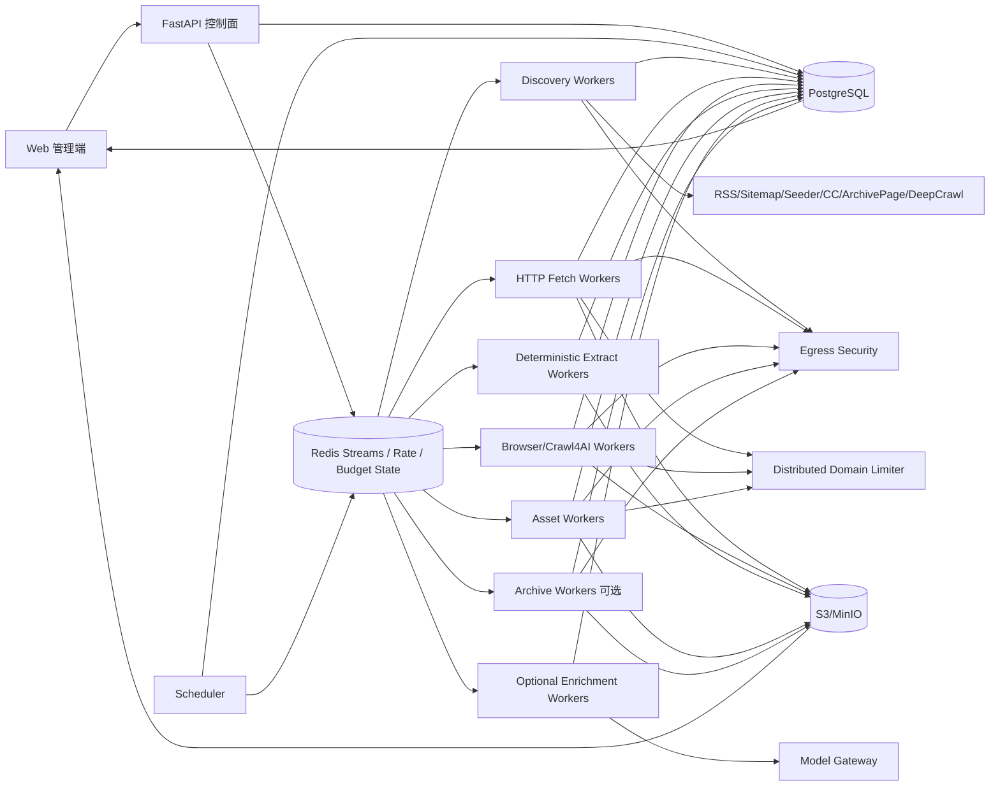

# 博客知识库技术方案

版本：v2.3  
日期：2026-08-14  
适用范围：约 1000 个技术博客站点的全量历史文章采集、Markdown 清洗、持续扩站、增量同步与 Web 管理；架构可横向扩展到数百万 URL。

## 1. 目标与边界

### 1.1 核心目标

1. 新站接入后尽可能完整发现并抓取当前仍可访问的历史文章。
2. 将标题、作者、发布时间、更新时间、标签、canonical URL、正文统一清洗为稳定 Markdown。
3. 支持约 1000 个站点长期运行，并可持续新增站点；普通站点不需要新增独立爬虫主流程。
4. 支持增量同步，只处理新增、更新或需要重试的内容，避免周期性全站强刷。
5. 支持断点续跑、幂等、去重、版本保留、失败隔离、重试、规则回滚和离线重新抽取。
6. 提供 Web 管理端完成站点接入、URL 发现预览、规则编辑、任务触发、运行状态、错误诊断、Markdown 预览、版本 diff、安全事件、预算与质量监控。
7. 首次历史回灌与日常增量共用同一套数据模型、队列、状态机和安全策略。
8. Sitemap、Feed、HTML、redirect、媒体、归档索引和第三方抓取结果全部视为不可信输入。
9. LLM 仅作为可选语义增强层，不参与基础 Markdown 正确性，不允许自动改写原文。

### 1.2 “全量历史”的定义

- **Live Full**：目标站当前可通过 Sitemap、Feed、归档页、站内链接或公开索引发现，并且当前仍可访问的历史文章。
- **Archive Full（可选）**：在 Live Full 基础上，通过 Common Crawl、Wayback 等历史索引发现已删除、迁移或不再从当前站点暴露的 URL；仅在 robots、版权、许可证和服务条款允许时恢复历史快照。

必须区分“发现过历史 URL”和“已经获得历史正文”。历史索引发现 URL 不代表正文已经成功恢复。

### 1.3 非目标

- 不绕过登录、付费墙、验证码或明确访问限制。
- 不默认所有页面走 Browser；静态 HTTP 能完成时优先低成本快路径。
- 不把第三方爬虫库的本地 cache、CLI 输出目录或内存 URL list 当业务真相源。
- 不把 GitHub 作为海量正文主存储；GitHub 适合保存方案、配置模板、规则代码和少量导出。
- 向量库/RAG 不作为采集一期强依赖，但数据模型预留 article/version/chunk/reference 字段。

## 2. 设计原则

1. **Discovery、Fetch、Extract、Asset、Enrich 解耦**：发现 URL、下载原始内容、生成 Markdown、媒体持久化、语义增强分别执行。
2. **PostgreSQL 是业务状态真相源**：Redis、浏览器状态、Crawl4AI cache 都只承担性能或分发职责。
3. **端到端流式与分批**：禁止把几十万 URL、超大 Sitemap、完整媒体批次一次性放进进程内存。
4. **跨域并发、域内克制**：不同站点并行，同域默认低并发并动态退避。
5. **HTTP 优先，Browser 升级**：Browser 只处理确实依赖 JavaScript 或交互的页面。
6. **原始快照优先保留**：规则变化后基于 raw HTML 离线 re-extract，不重新访问源站。
7. **规则、Schema、Canonicalizer、Security Policy、Fetcher/Extractor 都版本化**。
8. **增量从发现阶段开始**：优先利用 Feed/Sitemap/HTTP Validator 降低无效访问。
9. **外部能力 Provider/Adapter 化**：Crawl4AI、Common Crawl、Wayback、LLM Provider 均可替换。
10. **控制面不执行重任务**：Web/API 只创建 durable job；爬取、浏览器、媒体和 LLM 均由 worker 异步执行。
11. **默认拒绝危险出站目标**：所有 URL 入口、redirect hop、子 Sitemap、媒体 URL 和浏览器子资源都必须受统一 Egress Policy 约束。
12. **所有远端输入都有硬预算**：递归、URL 数、压缩/解压体积、响应体、媒体、Browser 时间/请求数都不可无限。
13. **安全控制必须可测试**：SSRF、恶意 XML/gzip、路径穿越、日志泄露、预算耗尽、恶意媒体均进入自动化回归和 CI gate。
14. **输出身份必须稳定**：任何导出路径、对象 key、文章 identity 都不能依赖“本次发现顺序”。
15. **部分成功必须显式表达**：正文成功、媒体未完成、Provider 预算耗尽、子 Sitemap 失败等状态不能被伪装成完整成功。

## 3. 总体架构



系统分为六个平面：

- **控制面**：站点、规则、计划、人工操作、发布、回滚和预算。
- **发现面**：RSS、Sitemap、AsyncUrlSeeder、Common Crawl、归档页、受限 Deep Crawl。
- **数据面**：HTTP/Browser 下载、raw 存储、确定性正文抽取、Markdown、媒体。
- **增强面（可选）**：结构化字段、标签、分类等语义任务。
- **协调面**：任务队列、lease、domain limiter、优先级、重试和 backpressure。
- **安全治理面**：Egress Policy、SSRF 防护、资源预算、供应链、日志脱敏、预览隔离、安全审计。

## 4. 技术栈

| 层 | 推荐 | 说明 |
|---|---|---|
| API / 管理后端 | Python + FastAPI | 只创建/查询任务，不同步执行长时间爬取 |
| Web | React / Next.js | 站点、规则、日志、diff、安全、预算、质量管理 |
| 状态/元数据 | PostgreSQL | 事务、唯一约束、批量 UPSERT、lease、审计 |
| 工作队列 | Redis Streams + Consumer Group | pending/reclaim、水平扩容、优先级分流 |
| 分布式限流 | Redis + Lua | token bucket / next_allowed_at / concurrency lease |
| 分布式预算 | Redis 原子计数 + PostgreSQL durable counter | page/provider/job/site/day 多级额度 |
| HTTP 抓取 | httpx / aiohttp | 长连接、Validator、流式 body、手动 redirect |
| Browser | Crawl4AI / Playwright | 动态页面；独立 worker、固定 slot、网络隔离 |
| Discovery | 自建 Provider + Crawl4AI AsyncUrlSeeder + Sitemap/CC Provider | checkpoint 独立于第三方 cache |
| XML | defusedxml + XMLPullParser/iterparse | 禁止 DTD/entity，流式解析和有界解压 |
| Markdown | Crawl4AI Markdown Generator + 自定义规范化 | 确定性清洗，不依赖 LLM |
| 对象存储 | S3 / MinIO | raw HTML、Markdown、历史版本、媒体、导出 |
| 可选语义增强 | Model Gateway + JSON Schema/Pydantic | 严格结构化输出、多 Provider 可替换 |
| 监控 | Prometheus + Grafana + OpenTelemetry | 指标、日志、trace、业务 SLO |
| 安全扫描 | pip-audit/OSV + Bandit/Semgrep + SBOM | 依赖、静态扫描、供应链审计 |
| 部署 | Docker Compose 起步，Kubernetes 按需 | 1000 站点不要求一开始上 K8s |

## 5. 站点生命周期、配置与扩展模型

### 5.1 生命周期

```text
draft -> probing -> validated -> backfilling -> active
                   \-> rejected
active -> degraded -> active
active -> disabled
```

### 5.2 站点配置示例

```yaml
site_id: example
name: Example Blog
base_url: https://example.com
enabled: true
schedule: "0 */6 * * *"
robots_policy: respect

allowed_hosts:
  - example.com
  - www.example.com

limits:
  domain_concurrency: 1
  min_delay_ms: 1000
  max_delay_ms: 3000
  request_timeout_s: 30
  sitemap_concurrency: 4

budgets:
  max_redirects_per_request: 5
  max_response_bytes: 15728640
  max_sitemap_depth: 8
  max_sitemap_files_per_run: 2000
  max_sitemap_compressed_bytes_per_file: 10485760
  max_sitemap_decoded_bytes_per_file: 52428800
  max_sitemap_decoded_bytes_per_run: 536870912
  max_urls_per_discovery_run: 2000000
  max_metadata_fields: 512
  max_metadata_key_chars: 256
  max_metadata_value_chars: 8192
  max_metadata_total_bytes: 65536
  max_asset_file_bytes: 20971520
  max_asset_bytes_per_job: 1073741824
  max_browser_requests_per_page: 300
  max_browser_bytes_per_page: 52428800
  max_browser_wall_time_s: 90

security:
  allowed_schemes: [https, http]
  deny_private_networks: true
  revalidate_redirect_hops: true
  allow_cross_host_redirects: false
  redact_query_in_logs: true
  browser_public_egress_only: true

incremental:
  lookback_days: 7
  reconciliation_days: 7

discovery:
  strategies: [rss, sitemap, seeder, commoncrawl, archive_pages, deep_crawl]
  include_patterns: ["/blog/**"]
  exclude_patterns: ["/tag/**", "/search**"]
  max_preview_urls: 200

fetch:
  prefer_http: true
  browser_fallback: true
  wait_for: null
  block_resource_types: [media, font]

assets:
  mode: referenced
  download_images: false
  allowed_mime_types: [image/jpeg, image/png, image/webp, image/gif, image/avif]
  active_content_policy: quarantine

extract:
  strategy: auto
  article_selector: null
  title_selector: null
  author_selector: null
  date_selector: null
  remove_selectors: [nav, footer, aside, .comments]

identity:
  canonical_from_html: true
  query_whitelist: []
  trailing_slash_policy: normalize

enrichment:
  enabled: false
  schema_version: null
  policy: metadata_fallback_only
  max_input_chars: 60000
  max_cost_per_article_usd: 0.02
```

站点配置可覆盖默认预算，但不能突破平台级硬上限。

### 5.3 接入层级

1. **零代码通用模式**：RSS/Sitemap + 自动正文抽取。
2. **声明式模式**：CSS/XPath、分页、等待条件、路径规则。
3. **Adapter 插件模式**：复杂 API、特殊分页、JS URL、自定义 canonical。

```python
class SiteAdapter(Protocol):
    async def discover(self, ctx) -> AsyncIterator[DiscoveredUrl]: ...
    async def prepare_request(self, url, ctx) -> FetchRequest: ...
    async def extract(self, snapshot, ctx) -> ArticleDocument: ...
    def canonicalize(self, url, html, ctx) -> CanonicalResult: ...
```

### 5.4 新站 probing

`probing` 只允许小预算探测：

1. 拉取 robots.txt。
2. 发现 Feed/Sitemap 候选。
3. 抽样 20~200 URL，统计 path、状态码、内容类型和文章候选比例。
4. 优先 HTTP 抽取少量样本，必要时 Browser fallback。
5. 自动生成 include/exclude 规则和 golden URL 候选。
6. Web 人工确认后才进入全量回灌。

### 5.5 规则发布

```text
draft -> testing -> published -> superseded
                  \-> rejected
published -> rollback_to_previous
```

发布前对 golden URL 回放历史 raw HTML，检查标题、正文长度、代码块、链接、日期、图片、canonical 和 Markdown diff；通过后原子切换 active rule。

## 6. Discovery：全量历史 URL 发现

### 6.1 Provider 抽象

```python
class DiscoveryProvider(Protocol):
    async def scan(
        self,
        site: Site,
        checkpoint: DiscoveryCheckpoint | None,
        budget: DiscoveryBudget,
    ) -> AsyncIterator[DiscoveredUrl]: ...
```

统一输出：`site_id`、`url`、`discovery_source`、`source_locator`、`source_lastmod`、`source_published_at`、`source_cursor`、`confidence`、`discovered_at`。

Provider 每产生 500~2000 条就批量 UPSERT `url_frontier`，不等待整个站点结束。

### 6.2 RSS / Atom / JSON Feed

日常增量最快信号。保存 entry GUID/id、published/updated、Feed ETag、Last-Modified、body hash 和最近成功扫描时间。Feed 常只保留最近 N 篇，因此不能独立承担首次全历史。

Feed 中的 URL 必须经过 allowed host 与 Egress Policy；XML/JSON 响应同样受 body 大小和解析预算约束。

### 6.3 Sitemap / Sitemap Index

Sitemap 是 Live Full 主力，设计如下：

- 从 robots.txt、`/sitemap.xml`、`/sitemap_index.xml`、`/sitemap-index.xml`、`/wp-sitemap.xml` 和站点自定义入口发现。
- 支持 `sitemapindex`、嵌套 Sitemap、`.gz` 和 gzip magic header。
- XML 禁止 DTD/entity；大文件使用 XMLPullParser/iterparse 流式处理。
- **压缩数据本身也必须流式读取并限制大小**，不能先 `response.content` 全量读入内存。
- gzip 使用有界增量解压（如 `zlib.decompressobj`），在解压过程中持续检查 decoded bytes 与压缩比；禁止先 `gzip.decompress()` 完整展开再检查。
- 同时限制单文件 compressed bytes、decoded bytes、单 run decoded bytes、递归深度、文件数、URL 总数。
- 维护 `visited_sitemap`，以规范化 Sitemap URL + body hash/ETag 辅助检测循环和重复。
- 子 Sitemap 采用有界并发，默认 2~4；每个子 Sitemap 有独立状态和 checkpoint。
- URL 条目的 `lastmod` 作为增量信号保存，但不作为唯一真相。
- 子 Sitemap URL 和页面 URL 均重新执行 Egress Policy / allowed host 校验。
- 每个 Sitemap 保存 ETag、Last-Modified、body hash、lastmod、扫描时间、provider version、checkpoint。
- 条目到达后流式 UPSERT Frontier，不在进程内聚合完整 `list[str]`。
- 预算耗尽、子文件失败、循环阻断或游标未完成时，run 标记 `partial` / `budget_exhausted`，不得标记 `completed`。

### 6.4 Crawl4AI AsyncUrlSeeder 的使用位置

适用于：新站探测、中小站候选发现、Web URL 预览和少量 metadata 预筛。

不把 Seeder 当业务 Frontier：

1. 大结果集最终可能聚合在进程内。
2. `max_urls` 是截断，不是可靠可恢复分页。
3. 本地 cache 不能承担跨 worker checkpoint。
4. 不对 1000 域一次性 `gather`。
5. 工具级 semaphore 不能替代集群级 QPS / domain limiter。
6. Seeder 输出仍需进入 Egress、allowlist、预算、Frontier 和幂等流程。

### 6.5 Common Crawl Provider

用于首次回灌和补漏，不作为高频增量：

- 按 index/cursor 流式读取。
- 每 500~2000 条批量 UPSERT Frontier。
- 保存 CC index id、cursor、provider version。
- 写入前重新校验 host、scheme、port、path、query 和安全策略。
- Common Crawl 只负责“发现 URL”；是否抓 live 正文或 archive snapshot 由后续 Fetch/Archive 决定。

### 6.6 归档页与受限 Deep Crawl

归档页 Provider 处理年份/月度归档、分页和分类页，并保存分页 cursor。

Deep Crawl 只做最后补漏：限同域、限深度、限 URL 数、限 query 参数、限 wall time；排除搜索、登录、日历、标签组合和无限参数空间。

### 6.7 Archive Backfill（可选）

通过 Wayback/CC 获取历史 URL + snapshot timestamp。live 404/410/迁移且来源许可时读取历史快照。Live 与 Archive 不 silent merge，必须保存 `source_kind`、`snapshot_at`、`source_archive_url`。

### 6.8 Discovery 状态

```text
queued -> running -> completed
                  -> partial
                  -> budget_exhausted
                  -> failed
```

没有可恢复 checkpoint 的截断、Sitemap 子文件失败、CC cursor 未到终点、Deep Crawl 命中预算，都不能标记 completed。

## 7. Discovery Checkpoint 与 URL Frontier

`discovery_checkpoints` 按 `(site_id, provider, source_locator)` 保存：

- ETag、Last-Modified、body hash。
- last_seen_guid / published_at。
- sitemap_lastmod。
- cursor / CC index id。
- last_success_at / last_full_completed_at。
- provider_version。
- security_policy_version。
- budget_snapshot / partial_reason。

`url_frontier` 至少保存：

- `site_id`、`normalized_url`、`original_url_ref`、`redacted_url`。
- `url_kind`、`discovery_source`、`source_lastmod`、`priority`。
- `crawl_state`、`next_fetch_at`、`last_fetch_at`。
- ETag、Last-Modified、raw/content hash。
- retry、lease、canonicalizer_version、security_policy_version。

唯一约束：

```text
(site_id, normalized_url)
```

原始 URL 如含敏感 query，放权限更严格的字段/对象中，普通日志和 Web 列表只展示 `redacted_url`。

Redis 消息可以丢失，Frontier 必须能重建待执行任务。

## 8. 统一 Egress Security

### 8.1 应用层策略

所有网络访问统一通过：

```python
class EgressPolicy(Protocol):
    async def validate(self, url: str, ctx: RequestContext) -> ValidatedTarget: ...
```

最少规则：

1. 仅允许 `http` / `https`。
2. 拒绝 URL userinfo、异常端口和异常编码形式。
3. 默认拒绝 localhost、RFC1918、link-local、multicast、reserved、unspecified、cloud metadata 地址、IPv4-mapped IPv6 等危险地址。
4. DNS 解析结果中任一地址属于禁止网段则拒绝。
5. 每个 redirect hop 手动处理并重新执行完整校验。
6. 默认禁止跨 allowed host redirect；需要时显式配置并审计。
7. Sitemap、Feed、页面链接、媒体、Archive URL、浏览器 top-level 和子资源不得绕过该策略。

### 8.2 DNS rebinding / TOCTOU

“请求前 `getaddrinfo` 检查”不足以保证实际 TCP 连接仍指向同一公网 IP。生产采用双层防线：

- 应用层：URL 规范化、手动 redirect、每跳重新解析/校验。
- 网络层：HTTP egress proxy、Kubernetes NetworkPolicy 或独立网络 namespace，只允许公网或显式 allowlist。

高保证模式下，代理负责解析 DNS 和实际建连，应用层只把已校验策略传给代理，从根本上收缩 TOCTOU 窗口。

### 8.3 Browser 安全

恶意页面可通过 ``、`script`、`iframe`、`fetch`、WebSocket 等探测内网。因此只校验 top-level URL 不够：

- Browser worker 运行在 public-only egress 网络中。
- 拦截所有子资源请求，按 scheme/host/预算决策。
- 禁止 `file:`、`data:` 导航、任意本地文件读取和 Web 暴露任意 Chromium launch args。
- 管理端不得允许普通用户注入任意 JavaScript 到生产 Browser worker。

## 9. 分层 Resource Budget

预算至少分五级：

- **Request/Page**：响应体、redirect、Browser wall time、子请求数、页面网络字节。
- **Sitemap/File**：compressed bytes、decoded bytes、URL 数、解析节点/字段数。
- **Provider Run**：Sitemap 文件数、总 decoded bytes、URL 总数、Deep Crawl 深度/时间。
- **Job/Site**：总抓取字节、媒体总字节、Browser 分钟、失败数。
- **Tenant/Day**：总网络流量、Browser 分钟、Enrichment token/cost。

Redis 用 Lua 原子 reserve/settle 热路径预算，PostgreSQL 持久化 durable counter 和审计记录。昂贵操作前 reserve，完成后按实际用量 settle。

响应处理要求：

- HTTP body 流式读取，超过 `max_response_bytes` 立即中止。
- `Content-Length` 只能作为快速拒绝信号，不能作为可信最终值。
- gzip/deflate 记录 compressed/uncompressed bytes 和 ratio。
- XML/HTML/JSON/媒体分别使用不同预算。
- 预算耗尽必须产生明确 reason code，而不是统一映射为“网络失败”。

## 10. 日志、异常与敏感信息治理

仅把 URL 字段做脱敏还不够：第三方库异常、`repr(exc)`、trace、HTTP 错误消息可能重新包含完整 query、userinfo、Authorization 或 Cookie。

因此采用中央 `LogSanitizer`：

1. 所有结构化日志字段在 sink 前统一清洗。
2. URL 默认移除 userinfo、query、fragment，仅保留 scheme/host/port/path。
3. HTTP header 采用 allowlist，默认不记录 `Authorization`、`Cookie`、`Set-Cookie`、Proxy-Authorization。
4. exception message / stack trace 也走 URL 和 secret pattern sanitizer，不能原样持久化第三方异常文本。
5. dead-letter、security event、Web 错误页、OpenTelemetry attributes 使用同一 sanitizer。
6. 若确需保存完整原始 URL，使用受限列/对象，Web 需额外权限才能查看。

安全测试必须包含“异常文本中携带 token URL”的泄露回归，而不仅测试显式 URL 字段。

## 11. 调度、队列、Lease 与优先级

Redis Streams 使用 Consumer Group，采用 at-least-once；正确性来自 DB lease、唯一约束、幂等键、pending reclaim 和成功持久化后 ACK。

建议 Stream：

```text
crawl:incremental
crawl:manual
crawl:retry
crawl:backfill
crawl:archive
asset:normal
asset:retry
enrich:normal
enrich:retry
```

Scheduler 每次只 lease 1000~5000 条近期任务，不把整个 Frontier 塞入 Redis。

历史回灌有最低吞吐配额，避免被增量永久饿死；当增量 lag、PG/S3 延迟、安全告警升高时 Backfill 自动降权。

## 12. 分布式域级限流

Redis Domain Limiter 至少保存：

```text
rate:{domain}:concurrency_current
rate:{domain}:concurrency_limit
rate:{domain}:next_allowed_at
rate:{domain}:penalty_until
rate:{domain}:tokens
```

Lua 原子完成 cooldown、并发额度、token/间隔检查和带 TTL 的 lease token 发放。

限流在**每次尝试前**生效，不只在成功后 sleep；失败、超时、403/429 同样不能绕过域级 pacing。

退避策略：429 尊重 `Retry-After`；503 指数退避+jitter；403 不盲目重试；连续 timeout 自动降并发；连续成功后缓慢恢复。

## 13. Fetch：HTTP 快路径 + Browser 升级

### 13.1 HTTP 快路径

使用长生命周期 `httpx.AsyncClient`：

- 连接池复用。
- 手动 redirect，每跳重新执行 Egress Policy。
- 请求 timeout、response body 上限。
- Redirect chain 持久化。
- `If-None-Match` / ETag。
- `If-Modified-Since` / Last-Modified。
- 304 标记 unchanged，不进入 Extract。
- body 流式写对象存储或临时受控文件，不能先无界读入 RAM。

HEAD 仅用于探测；403/405/异常需要 GET fallback。404/410 多轮确认后再标记 `source_deleted`。

### 13.2 Browser 升级

仅当初始 HTML 是 CSR shell、正文依赖 JS、需要点击/滚动/等待 selector 或 HTTP HTML 明显不完整时升级。

**禁止一个 URL 启一个浏览器进程。** Browser worker 使用长生命周期 browser/context 池和固定 slot。

Browser 约束：

- 独立网络 namespace / egress proxy。
- 子资源 public-only / allowed-host 控制。
- 默认屏蔽 media/font/video 等非必要资源。
- 限制单页 wall time、子请求数、网络字节和最大 DOM/HTML。
- Browser crash 只重试当前 task，不污染整个 job。

### 13.3 异步执行模型

生产规则：

1. FastAPI 只写 job/task 并返回 `job_id`。
2. Browser worker 拥有固定长生命周期 asyncio event loop。
3. 每个 worker 进程复用 AsyncWebCrawler/Playwright browser。
4. 同步第三方 SDK 如必须调用，使用受控 executor，不能每 URL 新建 executor。
5. shutdown 时 drain、ACK/释放 lease、关闭 browser/context。

## 14. Fetch 与 Extract 强制解耦

Fetch 只负责下载、status/header/final URL/redirect chain、raw HTML、raw hash、网络安全和预算用量。

Extract 只负责从指定 raw snapshot 生成 Markdown、元数据、质量结果和文章版本。规则变化时批量 re-extract，不重新访问源站。

`fetch_snapshots` 至少保存：

- request URL ref / redacted URL / final URL ref。
- status、header allowlist、redirect chain。
- ETag、Last-Modified、Content-Type、实际字节数。
- raw object key、raw hash。
- fetcher version、security policy version、budget usage。
- source_kind = live/http/browser/archive。

## 15. 确定性元数据、正文抽取与 Front Matter

### 15.1 元数据优先级

按确定性优先：

1. 站点专用 selector。
2. JSON-LD `Article` / `BlogPosting`。
3. HTML `<head>`：title、canonical、meta name/property/http-equiv。
4. OpenGraph / Twitter metadata。
5. DOM heuristic。
6. 可选 LLM fallback。

每个字段保存 provenance：source、selector/path、rule version、raw snapshot id。

### 15.2 HTML Head 元数据边界

远端页面可创建海量 meta tag 或超长 key/value，因此不能只限制“序列化后的 Front Matter 总大小”。解析阶段就要限制：

- 最大 metadata field 数。
- key 长度。
- value 长度。
- 总 metadata bytes。
- JSON-LD 最大节点数、嵌套深度和字符串总量。

达到上限时按确定性优先级截断并记录 `metadata_truncated=true`，至少保留 source/final URL、title 和 accepted canonical 等核心字段。

### 15.3 canonical

HTML canonical 是不可信声明：

1. 相对 URL 先相对 final URL resolve。
2. 再经过 Egress / allowed host / identity policy。
3. 站外 canonical 默认不接受，只保存为 `declared_canonical`。
4. 最终参与 identity 的只有 `accepted_canonical`。

### 15.4 Markdown 规范化

统一：

- 标题层级、代码围栏、换行。
- 相对链接绝对化或稳定逻辑化。
- 去导航、页脚、推荐、评论等噪声。
- 保留代码、表格、列表、引用和必要图片引用。
- 生成稳定 Front Matter，字段顺序固定。
- Markdown/Front Matter 有独立大小上限。

LLM 不参与正文改写，避免事实和代码被修改。

## 16. URL 归一化、文章身份与去重

URL 归一化：绝对化、host 小写、移除默认端口和 fragment、删除跟踪参数、站点级尾斜杠策略、query 白名单、accepted canonical、canonicalizer 版本化。

```text
article_key = sha256(site_id + accepted_canonical_or_normalized_url)
```

同时维护：

- `raw_hash`：原始响应内容。
- `body_text_hash`：规范化正文。
- `simhash/minhash`：可选，用于镜像/重复候选。

不同 URL 高相似只进入 `duplicate_candidates`，不自动物理删除。

区分：source URL、final URL、declared canonical、accepted canonical。

## 17. Asset：媒体下载、去重与安全

### 17.1 两阶段下载与内容寻址

媒体不能用“URL hash 文件名”冒充 content-addressed：同内容不同 CDN URL 必须能去重。

流程：

1. `asset_sources` 以规范化 URL + ETag/Last-Modified 管理下载缓存。
2. 下载前走 Egress Policy 和 job/site 预算。
3. body 流式读取，限制 Content-Length、实际字节、下载时间。
4. 下载完成后计算完整 `content_sha256`。
5. `asset_blobs(content_sha256)` 唯一存一份字节。
6. `article_assets` 保存文章版本、原始 URL、content hash、MIME、尺寸和引用上下文。

### 17.2 MIME 与主动内容

远端媒体也不可信：

- Content-Type 只作声明，必须结合 magic/signature sniff。
- 默认 allowlist 常见 raster image；SVG、HTML、XML 等可执行/主动内容进入 quarantine 或独立策略。
- 对可疑 MIME 不自动内联到管理端页面。
- 资产从独立 origin/domain 提供，主站 cookie 不发送。
- 服务端设置严格 `Content-Type`、`X-Content-Type-Options: nosniff`；高风险类型默认 `Content-Disposition: attachment`。

### 17.3 图片链接重写

生成 Markdown 时先保存逻辑关系：

```text
article_version -> article_assets -> asset_blob
```

导出器再根据目标格式生成 S3 URL、本地相对路径或 Git/静态站点路径。

### 17.4 媒体完成度

正文抓取成功不等于媒体完成。`article_asset_sync_state` 独立记录：

```text
not_requested -> queued -> complete
                       -> partial
                       -> budget_exhausted
                       -> failed
```

媒体预算耗尽不能把文章正文标记失败，也不能伪装成媒体完整。

## 18. 导出路径安全与稳定映射

主存储对象 key 由服务端生成，不直接用 URL path：

```text
site_id + article_key + article_version
```

如导出本地文件树：

- path segment 规范化。
- 长度限制、Windows 保留名处理。
- 禁止 `..`、绝对路径和异常编码逃逸。
- 最终路径必须仍在 export root。
- 禁止跟随不受信任 symlink；高保证环境使用 `openat`/`O_NOFOLLOW` 或隔离临时目录。
- 临时文件写完 `fsync` 后原子 rename，避免进程崩溃留下半文件。
- **导出路径必须是 article_key/canonical URL 的纯函数，不允许依赖本次 crawl 顺序。**
- 路径冲突统一追加稳定 article hash，而不是“谁先出现谁占短路径”。
- 生成 `export-manifest.json`，保存 article_key、source/final/canonical、目标路径、content hash。

这样重跑、并发或 Discovery 顺序变化不会导致文件名漂移。

## 19. 增量同步

信号优先级：

1. RSS/Atom 新 GUID。
2. Sitemap 新 URL / lastmod / sitemap hash。
3. 归档/列表页前 N 页 + watermark。
4. HTTP Validator。
5. 内容 hash。
6. 低频 reconciliation。

每站保存 3~14 天 lookback。Sitemap 优先 conditional GET，body hash 不变时跳过展开；Common Crawl 按周/月或人工触发补漏。

404/410 不立即删除；多轮确认后标记 `source_deleted_at`；301/308 维护 redirect/canonical 关系，历史版本始终保留。

增量与 Backfill 共享安全、限流、预算和状态机。

## 20. 可选结构化语义增强层

用于确定性元数据难以获得、用户自定义字段、分类、知识库标签，不参与基础 Markdown 正确性。

Schema 编译为 Pydantic/JSON Schema，Model Gateway 使用严格 structured output。未知值必须是 `null`，不能用 0/false/空字符串伪装已知。

每个字段保存：

- `value`
- `source = deterministic | llm`
- `confidence`
- `evidence_span` 或 selector
- `schema_version`
- `model_policy_version`

只有缺失/冲突字段进入 LLM fallback；输入基于已清洗 Markdown 和相关片段，设置 token/字符/成本上限。

```text
enrichment_key = article_version_id
               + schema_version
               + model_policy_version
               + input_content_hash
```

结果可离线 re-enrich，不需要 refetch。

## 21. 数据模型

### 21.1 站点与规则

- `sites`：生命周期、调度、robots、限流、active rule、安全配置。
- `site_hosts`：允许 host 与限流覆盖。
- `site_rule_versions`：Discovery/Extract/Canonical 规则版本。
- `security_policy_versions`：Egress、redirect、预算硬限制版本。
- `golden_urls`：回归样本和期望字段。

### 21.2 Discovery / Frontier

- `discovery_sources`
- `discovery_runs`
- `discovery_checkpoints`
- `url_frontier`

### 21.3 任务、预算与安全

- `crawl_jobs`
- `crawl_tasks`
- `fetch_snapshots`
- `resource_budget_counters`
- `security_events`
- `dead_letters`

### 21.4 内容

- `articles`
- `article_versions`
- `duplicate_candidates`
- `site_health_events`

### 21.5 媒体

- `asset_sources`
- `asset_blobs`
- `article_assets`
- `asset_sync_runs`

### 21.6 可选语义增强

- `enrichment_schema_versions`
- `model_policies`
- `article_enrichments`
- `field_provenance`

## 22. 对象存储布局

```text
kb/
  raw/{site_id}/{yyyy}/{mm}/{article_key}/{fetch_id}.html.gz
  md/{site_id}/{yyyy}/{mm}/{article_key}/v{n}.md
  assets/blobs/{sha256_prefix}/{sha256}
  assets/quarantine/{sha256_prefix}/{sha256}
  archive/{site_id}/{article_key}/{snapshot_at}/...
  enrich/{site_id}/{article_key}/{article_version}/{schema_version}.json
  exports/{export_job_id}/...
```

PostgreSQL 存状态、索引和小型元数据；大 HTML/Markdown/媒体进入对象存储。

## 23. Web 管理功能

### 23.1 站点接入向导

展示 robots、Feed/Sitemap、URL path 分布、HTTP/Browser 判定、Discovery 来源抽样、Sitemap/CC 重叠率、文章候选比例、allowed hosts、建议预算、Browser 成本和 golden URL 候选。

### 23.2 Discovery 管理

查看每个 Provider 的 run、checkpoint、new/unique URL、coverage、partial/budget_exhausted/failed 原因；明确区分预览与完整回灌。

### 23.3 规则管理

支持 Discovery / Extract / Canonical rules、raw HTML 回放、Markdown 预览、golden 批测、diff、publish/rollback。

### 23.4 任务管理

支持全量、增量、暂停/恢复、单站/单文章重试、re-extract without refetch、Archive Backfill、dead-letter replay。

### 23.5 安全与预算

展示 blocked private target / redirect、Sitemap/response/media/browser 预算、站点/job 网络字节、Browser 分钟、policy version 和命中原因。

### 23.6 内容管理

raw HTML / Markdown 对照、Front Matter、历史版本 diff、canonical/redirect、duplicate candidates、live/archive 来源、asset manifest 和媒体同步状态。

### 23.7 Web 预览安全

raw HTML、Markdown、SVG/附件均来自不可信远端：

- raw HTML 默认文本展示，不直接插入主页面 DOM。
- 需要渲染时使用独立 sandbox iframe / 独立 origin。
- Markdown sanitize，默认禁用原始 HTML 或使用严格 allowlist。
- CSP 禁止预览脚本、读取主站 cookie、访问内部 API。
- 资产独立 origin；主动内容默认不 inline。

## 24. 重试、幂等与 Dead Letter

错误分类：

- 可自动重试：timeout、connection reset、429、502/503/504、临时 browser crash。
- 条件重试：403、401、soft block、大面积 selector fail。
- 不自动重试：robots 禁止、非法 URL、host 不在 allowlist、SSRF 拒绝、永久配置错误、预算硬上限。

```text
idempotency_key = task_type + site_id + normalized_url + input_snapshot + rule_version
```

所有写入使用唯一约束/UPSERT。超过最大重试进入 dead-letter。

安全拒绝不能作为普通网络错误无限重试；仅安全策略或站点配置版本变化后才重新评估。

## 25. 质量控制

文章自动门槛：

- 标题为空、正文过短、link density 过高。
- 一批文章正文 hash 相同，疑似登录页/风控页/SPA shell。
- HTTP 200 但内容为 404/Access Denied。
- 新规则导致正文长度、代码块数量或 hash 分布突变。
- 发布时间解析异常。
- accepted canonical 指向站外或危险 host。
- metadata/Front Matter 高基数或异常截断。

Asset 门槛：

- MIME 与 magic/signature 冲突。
- 单文件/总字节异常。
- 不同 URL 同内容 hash 去重率。
- 主动内容进入 quarantine 比例异常。

Enrichment 门槛：validation pass rate、null ratio、deterministic-vs-LLM 冲突率、cost/token 异常。

## 26. 可观测性与 SLO

### 26.1 业务指标

- 每站 discovered/new/updated/unchanged/failed。
- Frontier pending、lease age、retry、dead-letter。
- Sitemap/Feed/CC provider coverage 与 checkpoint lag。
- HTTP/Browser 比例、304 ratio、fetch latency。
- raw -> md processing lag。
- golden pass rate、degraded site 数。

### 26.2 安全与预算指标

- blocked_private_target / blocked_redirect / blocked_cross_host。
- sitemap depth/bytes/url budget exhausted。
- response bytes aborted。
- browser requests/bytes/wall-time exceeded。
- asset bytes、content-hash dedupe ratio、quarantine count。
- sanitizer redaction count / suspected secret leak test failures。
- egress proxy reject rate。

所有 job/task 贯穿 `trace_id`，可从 article_version 追溯 Discovery -> Fetch -> Extract -> Asset -> Enrich。

## 27. 安全、robots、合规与供应链

- 默认遵守 robots.txt。
- 明确 User-Agent 与联系信息。
- 不绕过认证、验证码、付费墙。
- Secret/代理/cookie/API key 只保存 Secret Manager 引用，不进入任务明文日志。
- 外部历史索引发现 admin/staging/API 不代表允许抓取。
- 保存 source URL、fetched_at、source_kind 和版权/许可证元数据。
- 第三方 LLM 有站点级 `allow_external_enrichment` 与数据出境策略。

### 27.1 依赖与构建

Crawl4AI/Playwright/解析库属于高风险执行面。供应链要求：

1. 使用 lockfile/constraints 固定完整依赖图，不只固定顶层包。
2. 禁止生产镜像在安装完成后临时 `pip install --upgrade` 某个传递依赖来“覆盖漏洞”，除非该 override 已进入受审查 constraints 并通过完整兼容测试。
3. 容器基础镜像使用 digest pin，而不是漂移 tag。
4. CI 生成 SBOM、依赖漏洞扫描、Bandit/Semgrep、许可证扫描。
5. 依赖升级先在 golden corpus 和安全回归上 canary，再灰度生产。
6. 保存构建 provenance、版本、镜像 digest，可快速回滚。
7. 生产不直接暴露 Crawl4AI 第三方 Docker API 到公网。

## 28. 安全回归与 CI Gate

| 控制 | 必测场景 |
|---|---|
| Egress / SSRF | localhost、RFC1918、link-local、metadata、IPv6、IPv4-mapped IPv6、DNS 多地址 |
| Redirect | 公网 -> 私网、公网 -> 非 allowed host、loop、超最大跳数 |
| DNS rebinding | 校验后解析变化、代理侧目标校验 |
| Sitemap | 深度超限、循环、超 URL、超大 XML、gzip bomb、畸形 XML、无 Content-Length |
| HTTP body | chunked 超限、错误 Content-Length、超大压缩响应 |
| Browser | 页面子资源访问内网、请求数/字节/wall time 超限 |
| Metadata | 超长 key/value、海量 meta、巨大 JSON-LD、canonical 越权 |
| Asset | 单文件超限、总量超限、不同 URL 同内容 hash、伪造 Content-Type、主动 SVG/HTML |
| Logging | URL field、exception text、trace、dead-letter 中 query token/userinfo/header secret 不得泄露 |
| Export | path traversal、保留名、超长路径、symlink race、不同发现顺序仍生成相同路径 |
| Web Preview | 恶意 HTML/Markdown/SVG 不能执行脚本或读取主站凭据 |
| Dependency | 已知高危 CVE、锁文件漂移、镜像 digest 漂移 |

安全控制矩阵必须标明代码位置、测试位置、CI gate 和 owner。

## 29. 容量与背压

假设 1000 站点、平均 500 篇历史文章约 50 万篇，真实规模可达数百万 URL。

初始部署建议：

- API x1
- Scheduler x1
- Discovery worker x2
- HTTP fetch worker x4
- Browser worker x2
- Extract worker x2
- Asset worker x1~2（默认可关闭图片本地化）
- Enrichment worker x0~2（默认关闭）
- Archive worker x0~1
- PostgreSQL x1
- Redis x1
- MinIO x1
- Egress proxy x1~2

初始限制：domain concurrency=1；domain delay=1~3 秒；Sitemap 子并发 2~4；HTTP 每进程 20~50 slot；Browser 每进程 4~8 slot；Frontier lease 1000~5000；Discovery UPSERT 500~2000/批。

背压规则：

- Extract lag 过大 -> Fetch 降速。
- S3 异常 -> 暂停新 Fetch/Asset lease。
- Browser 内存高 -> 降 Browser slot。
- Redis Stream 超阈值 -> Scheduler 减 dispatch。
- PG 写延迟高 -> Discovery 降速。
- Egress proxy reject/错误率异常 -> 暂停对应站点并告警。
- Asset backlog/预算高 -> 保正文主链路，延后附件。
- Enrichment backlog/cost 高 -> 只保高优先级任务，不影响 Markdown 主链路。

## 30. 关键伪代码

### 30.1 Sitemap Discovery Worker

```python
async def run_discovery(site, provider):
    checkpoint = await load_checkpoint(site.id, provider.name)
    run = await create_discovery_run(site.id, provider.name)
    budget = await reserve_discovery_budget(site, run)
    batch = []
    try:
        async for item in provider.scan(site, checkpoint, budget):
            target = await egress.validate(item.url, ctx=run.ctx)
            normalized = canonicalize_candidate(target.url, site)
            if not is_allowed_candidate(normalized, site):
                continue
            batch.append(frontier_row(site, normalized, item))
            if len(batch) >= 1000:
                await bulk_upsert_frontier(batch)
                batch.clear()
                await persist_checkpoint(run, item.source_cursor, budget.snapshot())
        if batch:
            await bulk_upsert_frontier(batch)
        await mark_discovery_completed(run)
    except BudgetExceeded as e:
        await mark_discovery_budget_exhausted(run, reason=e.code)
    except ProviderPartial as e:
        await mark_discovery_partial(run, reason=e.code)
    except Exception:
        await mark_discovery_failed(run)
        raise
```

### 30.2 安全 HTTP Fetch

```python
async def safe_get(url, ctx, max_redirects=5):
    current = url
    chain = []
    for _ in range(max_redirects + 1):
        target = await egress.validate(current, ctx)
        resp = await http.stream_get(target, follow_redirects=False)
        await enforce_stream_budget(resp, ctx)
        chain.append((redact(current), resp.status_code))
        if not is_redirect(resp):
            return resp, chain
        current = resolve_location(current, resp.headers["location"])
    raise TooManyRedirects()
```

### 30.3 Browser Worker 生命周期

```python
async def browser_worker():
    async with AsyncWebCrawler(config=browser_config) as crawler:
        while task := await next_task():
            async with browser_slot:
                await budget.reserve_browser(task)
                result = await crawler.arun(task.url, config=run_config(task))
                await persist_result(task, result)
```

Browser worker 必须位于 public-only egress 网络，不依赖页面 JavaScript 自律。

### 30.4 Extract Worker

```python
async def extract_worker(task, raw_key, rule_version):
    raw = await object_store.get(raw_key)
    doc = await extract_to_markdown(raw, rule_version)
    normalized = normalize_document(doc)
    h = sha256(normalized.body)
    if h == task.previous_content_hash:
        return await mark_unchanged(task)
    md_key = await save_markdown_version(normalized)
    await upsert_article_version(task, normalized, h, md_key, rule_version)
```

### 30.5 Asset Worker

```python
async def asset_worker(task):
    source = await load_asset_source(task.asset_source_id)
    await egress.validate(source.url, task.ctx)
    stream, declared_meta = await bounded_download(source.url, task.asset_budget)
    digest, size, sniffed_mime = await hash_and_sniff(stream)
    policy = evaluate_asset_policy(declared_meta, sniffed_mime, size)
    blob = await upsert_asset_blob(digest, stream, sniffed_mime, policy)
    await link_article_asset(task.article_version_id, source, blob)
```

## 31. 分阶段实施

### Phase 1：MVP（20~50 站点）

- sites/frontier/articles/article_versions。
- RSS + Sitemap Provider。
- 流式安全 XML、Sitemap 深度/体积/URL/循环预算。
- 统一 Egress Policy + 手动 redirect。
- HTTP fast path + Browser fallback。
- Browser public-only 网络隔离。
- raw HTML + Markdown 对象存储。
- Redis Streams + DB lease + 幂等。
- Web CRUD、任务、错误、安全事件和预算。
- 增量 checkpoint。
- 中央日志/异常 sanitizer。

### Phase 2：扩到 1000 站点

- AsyncUrlSeeder Provider。
- Common Crawl 流式 Provider。
- 归档页 / 受限 Deep Crawl。
- 分布式 Domain Limiter。
- 多 Stream 优先级。
- 完整 Discovery run/checkpoint。
- 规则版本、golden URL 回归。
- Browser 长生命周期 event loop / crawler pool。
- Egress proxy / NetworkPolicy。
- 分层预算 durable counter。
- Asset Worker + content-addressed media + quarantine。
- 稳定 export manifest。
- 自动 degraded 与监控。

### Phase 3：语义增强与极致历史覆盖

- Archive Backfill。
- Schema 驱动 structured enrichment。
- Model Gateway、多 Provider、预算/缓存/provenance。
- 自动模板变化检测。
- duplicate/mirror 聚类。
- 全文/向量索引、chunk/version/reference 追踪。
- 更细粒度站点风险评分与自动预算调优。

## 32. 验收标准

### 32.1 功能

- 新增站点不改核心控制流；普通技术博客大部分可通过通用/声明式模式接入。
- 单站首次全量可中断后继续，不从头扫描。
- 日常增量无需全站重抓。
- 规则修改可在历史 raw 上 re-extract。
- Web 能定位 Discovery / Fetch / Extract / Asset / Enrich 层失败。

### 32.2 正确性

- Frontier 无重复逻辑 URL。
- 重复 Redis 消息不生成重复文章版本。
- Provider 未完成、预算耗尽或截断不误标 completed。
- HEAD 失败不直接误判 source_deleted。
- worker 重启后 checkpoint 和任务可恢复。
- 无 LLM 仍可完整生成 Markdown。
- 不同 CDN URL 的相同媒体内容只存一份 asset_blob。
- 导出文件路径在不同发现顺序、并发数和重跑条件下保持稳定。
- metadata 预算截断不会破坏核心身份字段。

### 32.3 性能与资源

- Discovery、Fetch、Extract 全部按批流式处理。
- 单进程内存不随全站 URL 数线性增长。
- Sitemap gzip 解压不能在达到限制前无界占用内存。
- 同域并发由集群 limiter 控制。
- Browser 只处理 HTTP 快路径无法完成的页面。
- Web 请求不长时间持有 Browser 或同步等待爬取。
- Sitemap/response/media/browser/metadata 均有硬预算。

### 32.4 安全

- 公网 URL redirect 到私网/metadata 时必须阻断。
- Browser 页面子资源无法访问内网或控制面。
- Sitemap 循环、深度、超大 XML/gzip 不导致无界资源消耗。
- 普通日志、exception、dead-letter、trace 不泄露 URL query token/userinfo/敏感 header。
- Web 预览中的恶意 HTML/Markdown/媒体不能执行脚本或读取主站凭据。
- 本地导出不能通过 path traversal、symlink 写出 export root。
- 主动媒体内容不会从主站 origin 直接内联执行。
- 高风险依赖升级必须通过 lockfile、漏洞扫描、golden/security canary 和可回滚构建。

## 33. 参考资料

- Crawl4AI：https://github.com/unclecode/crawl4ai
- Crawl4AI URL Seeding：https://docs.crawl4ai.com/core/url-seeding/
- Crawl4AI Multi-URL Crawling：https://docs.crawl4ai.com/advanced/multi-url-crawling/
- Common Crawl Index：https://index.commoncrawl.org/
- Crawlboy：https://github.com/aksharahegde/crawlboy
- Crawlboy Security Controls：https://github.com/aksharahegde/crawlboy/blob/main/docs/security/controls.md
- Crawlboy Threat Model：https://github.com/aksharahegde/crawlboy/blob/main/docs/security/threat-model.md

## 34. 最终架构摘要

最终采用：**站点生命周期/规则中心 + Provider 化多源 Discovery + 持久化 Checkpoint + PostgreSQL Frontier + Redis Streams + 分布式 Domain Limiter + 分层 Resource Budget + 统一 Egress Security + HTTP/Browser 双路径 + 长生命周期 Browser Worker + Fetch/Extract 解耦 + Raw/Markdown 对象存储 + Content-addressed Asset Store + 增量 Validator + 规则版本/回归/回滚 + Web 控制面 + 可选 Schema 驱动语义增强层**。

Sitemap 必须端到端流式：HTTP body、gzip 解压、XML 解析、URL 入库都设边界，并保存子 Sitemap checkpoint 与循环检测；不得先把完整 URL 列表或解压后的 Sitemap 全量放进内存。

所有 Sitemap、redirect、页面子资源、媒体和第三方索引 URL 都经过统一 Egress Policy，并由网络层 public-only egress 作为第二道防线。预算耗尽属于可恢复的 `partial/budget_exhausted`，不能伪装为完整成功。

日志安全覆盖显式 URL 字段、第三方 exception、trace、dead-letter 和 Web 错误页，避免仅脱敏结构化 URL 却由异常文本再次泄露 query token。

媒体以完整内容 SHA-256 作为 blob identity，URL 只承担下载缓存；主动内容进入 quarantine/独立 origin。正文成功与媒体同步完成度分离。

导出路径必须由 article identity 稳定决定，而不是由 crawl 顺序决定；本地导出同时实施 containment、symlink 防护、原子写和 manifest。

依赖与镜像通过 lockfile/constraints、digest pin、SBOM、漏洞扫描、golden/security canary 和可回滚构建治理，避免生产中使用临时传递依赖覆盖造成不可复现环境。
