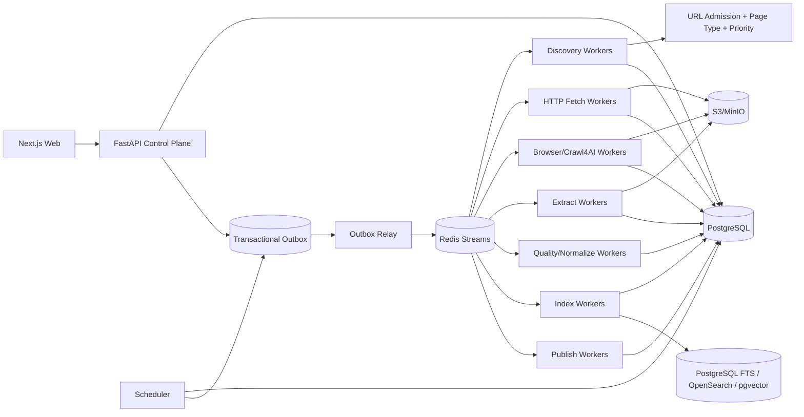

# 博客知识库技术方案

适用范围：从约 1000 个技术博客网站抓取尽可能完整的历史文章，清洗为稳定 Markdown 形成长期知识库；后续持续增加网站，支持历史全量回灌、长期增量同步、版本保留、Web 管理、搜索与外部知识库发布。整体按“百万级文章、数百万到千万级 URL、长期运行、站点异构、可横向扩展、可恢复、可回放、可审计”设计。

## 1. 建设目标

1. 管理员只需录入博客根地址，系统自动探测 Sitemap、Feed、归档页、分类/标签/作者页、平台 API、普通链接和动态列表，生成可审核的站点配置草稿。
2. 支持约 1000 个站点历史全量回灌，并持续增加站点；常见站点通过模板、配置和规则接入，不修改核心状态机。
3. 同一站点允许多个 Discovery Provider，每个 Provider 独立维护 capability、checkpoint、覆盖证据和连续性。
4. 抓取标题、作者、发布时间、更新时间、标签、canonical、正文、代码块、表格、图片和附件，生成稳定 Markdown。
5. 默认 HTTP-first，只有证据表明确实需要 JavaScript、动态分页或交互时才升级 Browser/Crawl4AI。
6. 支持 ETag、Last-Modified、Sitemap lastmod、Feed GUID、API cursor、内容 hash 和重叠时间窗口驱动的增量同步。
7. 支持 durable frontier、断点续跑、幂等、lease、重试、指数退避、限流、熔断、按站公平调度和 backpressure。
8. 保存不可变网络快照、渲染 DOM、清洗 HTML、抽取候选、Article IR、Markdown、规则版本和质量结果；规则升级优先离线 replay。
9. 提供 Web 管理端完成站点接入、覆盖检查、规则发布、任务管理、质量审核、版本 diff、错误诊断、搜索、成本和发布管理。
10. Crawl4AI、Playwright、Trafilatura、Readability 等均通过 Adapter 接入，不能成为业务状态真相源。

## 2. 核心原则

1. PostgreSQL 是业务状态真相源，S3/MinIO 是不可变大对象真相源。
2. Redis Streams 只做短期任务分发，所有状态先落 PostgreSQL，并通过 Transactional Outbox 投递。
3. URL 发现、准入、抓取、抽取、质量、索引、发布全部可版本化和可审计。
4. URL 被发现不等于允许抓取，必须经过统一 URL Admission Pipeline。
5. HTTP、Sitemap、Feed、API、Browser 分层，Browser 是昂贵升级路径。
6. 网络快照不可变，规则、Schema、模型和 Markdown Renderer 升级优先 replay，不重复访问站点。
7. 文章身份与 URL 分离；redirect、canonical、镜像、迁移只是 identity evidence。
8. `article_version` append-only，不覆盖旧版本。
9. Bloom Filter/RoaringBitmap 只能加速，不能替代数据库唯一约束和 durable frontier。
10. 任何全局限制都不能把“执行预算耗尽”误判成“历史发现完成”。
11. 第三方抓取引擎不能绕过统一 Egress、robots、限流、预算和状态机。
12. 重型 Browser、CPU 和 LLM 工作只能运行在独立 Worker 中，控制面不直接执行长任务。

## 3. 总体架构



控制面管理配置、任务和状态；数据面长期异步执行。

## 4. Crawl Mode

```text
FULL_BACKFILL   首次历史回灌
INCREMENTAL     持续同步新增和更新
RECONCILE       周期性重新枚举，修复断档
TOPIC_EXPANSION 有限预算专题扩展
REPROCESS       不访问网络，基于已有 snapshot 重抽取/清洗/索引/发布
```

规则：

- FULL_BACKFILL 中 URL 分类和评分只决定顺序，不因关键词、页面类型或低分永久丢弃合法 URL。
- INCREMENTAL/TOPIC_EXPANSION 可使用预算、时间窗口和优先级阈值。
- Crawl4AI deep crawl 的 `max_pages`、Sitemap 的单批次最大条目数、Browser 的单次页面数都只是 execution slice 预算，不是完成条件。

## 5. 新站点接入：Discovery Probe

管理员输入根 URL 后，Probe：

1. 获取根页面并记录 final URL、Content-Type、编码、响应头和结构。
2. 解析 robots.txt 中 Sitemap。
3. 探测常见 Sitemap/Sitemap Index。
4. 解析 RSS/Atom/JSON Feed。
5. 识别平台公开 API、年/月归档、分类/标签/作者分页。
6. 识别普通站内链接和动态列表。
7. 必要时执行 Browser Sample Probe。
8. 抓取 3~10 个文章样本，识别正文结构和 metadata。
9. 生成 Provider、Fetch Profile、Filter、Scorer、Page Type Rule、Extraction Pipeline、Action Plan 草稿。
10. 在样本上运行 JSON-LD/meta、CSS/XPath、Trafilatura、Readability、Crawl4AI Markdown 等候选并给出质量证据。
11. Web 端 dry-run/canary/publish 后才启动生产回灌。

## 6. Discovery Provider 与覆盖台账

优先级：Sitemap/Sitemap Index > 平台 API > Feed > 年/月归档 > 分类/标签/作者分页 > HTML 同域递归 > Browser 动态列表 > 外部公开索引补漏。

每个 Provider 标注：

```text
exhaustive   理论上可枚举完整集合
windowed     只暴露最近窗口
best_effort  尽力发现
```

Provider Coverage Ledger：

```text
provider_id
crawl_mode
checkpoint_before
checkpoint_after
pages_or_entries_scanned
discovered_count
admitted_count
rejected_count
expected_count
pagination_continuity
new_frontier_count
unresolved_error_count
started_at
finished_at
```

历史回灌完成至少要求：所有 Provider 到达稳定 checkpoint；exhaustive Provider 完整枚举；分页无 continuity gap；durable frontier 无可执行 URL；retry/dead-letter 已处理；新一轮 reconcile 不再产生显著新增；Coverage Ledger 无未知断档。

## 7. Sitemap 发现：持久化、可恢复、有限内存但不截断历史

Sitemap 是技术博客历史全量的首选入口，必须独立建模为持久化任务，而不是递归函数一次跑完。

`sitemap_task` 至少保存：

```text
sitemap_task_id
site_id
provider_id
sitemap_url
parent_sitemap_url
depth
state
body_hash
etag
last_modified
entries_seen
child_sitemaps_seen
checkpoint
lease_owner
lease_until
attempt_count
next_attempt_at
```

执行原则：

1. 每个 Sitemap URL 先走完整 URL Admission/Egress 校验；嵌套 Sitemap 同样重新校验。
2. 支持 Sitemap Index、普通 Sitemap、gzip、namespace 和 `lastmod`。
3. XML 使用安全解析器和 streaming/iterparse，禁止把超大 XML 全量构造成 DOM。
4. 下载同时限制压缩前字节数、解压后字节数和压缩比，防止 zip bomb。
5. 设置 `max_bytes_per_slice`、`max_entries_per_slice`、`max_child_sitemaps_per_slice`、`max_runtime_per_slice`，预算耗尽时保存 checkpoint 并继续排队，不丢弃剩余历史条目。
6. `visited sitemap` 不能只放进程内 set，必须持久化唯一键，避免 Worker 重启后重复和循环。
7. 嵌套深度是安全保护，不应使用固定小深度直接宣布完成；超过默认深度时进入异常队列或人工策略，而不是静默截断。
8. Sitemap Index 中子 Sitemap 可以并发处理，但必须受全局、站点和域名三层 semaphore/token bucket 约束。
9. 对 404/410、429、5xx、超大文件、解析失败分别分类处理并记录 coverage gap。

## 8. URL Admission、页面分类与优先级

每个新 URL 依次经过：

1. URL 规范化；
2. SSRF/Egress 校验；
3. robots 与站点访问策略；
4. Domain/Subdomain allowlist；
5. path allow/deny；
6. query 规范化；
7. Content-Type/扩展名规则；
8. canonical/redirect identity hints；
9. crawler trap 检测；
10. 页面类型分类；
11. Priority Scorer。

URL 规范化处理 host 大小写、IDN、fragment、默认端口、tracking query、query 顺序、session 参数、trailing slash 和 percent-encoding。

页面类型分类可基于 URL path、HTML metadata 和样本规则输出：

```text
ARTICLE
ARCHIVE
CATEGORY
TAG
AUTHOR
PAGINATION
DOCUMENTATION
PRODUCT
PRICING
SEARCH
ASSET
UNKNOWN
```

分类只作为抽取策略和调度输入。FULL_BACKFILL 中“blog/docs/article”等关键词只能提高优先级，不能像简单关键词过滤器那样直接丢弃历史 URL。

## 9. Crawler Trap 与公平调度

重点识别：日历无限翻页、搜索参数组合、tag/filter 笛卡尔积、无界 `?page=`、session/token 参数、同内容多排序 URL。

Scheduler 使用 weighted fair queue。每域维护最大并发、QPS、最小请求间隔、token bucket、Retry-After、429/403/5xx 退避、HTTP/Browser 独立预算和 circuit breaker。

优先级建议：

```text
NEW_FEED / CHANGED
> INCREMENTAL_REFRESH
> RECONCILE
> HISTORICAL_BACKFILL
> LOW_PRIORITY_REPROCESS
```

下游积压时降低 Discovery、暂停 Browser expansion、优先处理已抓未抽取 snapshot，并保留增量高优先级通道。

## 10. Async Runtime Topology

### 10.1 控制面

FastAPI 只负责配置 CRUD、创建任务、状态查询、SSE/WebSocket 进度、权限和审计。

长任务标准路径：

```text
POST /jobs
 -> PostgreSQL transaction
 -> outbox_event
 -> Redis Streams
 -> Worker
```

### 10.2 HTTP Worker

每进程长期维护一个 event loop 和 httpx/aiohttp connection pool；使用 bounded task queue、per-domain semaphore/token bucket、DNS/连接/读取超时、Retry-After 和 circuit breaker。

### 10.3 Browser/Crawl4AI Worker

每进程长期维护 Browser/Crawl4AI 生命周期、context/page pool、内存和 CPU 并发上限、session TTL、heartbeat 和 cleanup。

禁止为每个 URL 创建新的 event loop 或新的 Browser；也禁止对百万 URL 一次性 `asyncio.gather`。批量抓取必须采用 bounded batch 或 streaming completion，单条结果完成后立即持久化。

### 10.4 CPU Worker

DOM 解析、diff、MinHash/SimHash、Article IR normalize、Markdown render 等 CPU-heavy 工作放独立进程池。

## 11. HTTP-first 与 Browser 升级

HTTP Worker 尽量发送 `If-None-Match` / `If-Modified-Since`。304 只更新 freshness；200 先保存 raw bytes，再抽取。HTTP DOM 足够时不启动 Browser。

Browser 升级原因结构化保存：

```text
EMPTY_ARTICLE_BODY
SPA_SHELL
JS_PAGINATION
LOAD_MORE
INFINITE_SCROLL
DYNAMIC_RENDER_REQUIRED
EXTRACTION_READINESS_FAILED
```

Browser Action Plan 与 Extraction Pipeline 分离，页面点击/滚动/等待不和正文选择规则耦合。

## 12. Crawl4AI Adapter

Crawl4AI 可承担 AsyncWebCrawler、JS 渲染、deep crawl、Markdown 生成和 CSS/XPath/Regex extraction，但不承担 durable frontier、多站公平调度、业务 checkpoint、文章版本和覆盖完成判定。

Adapter 输入必须绑定 task/attempt/crawl_mode/runtime bundle/fetch profile/cache policy/action plan/extraction release/execution budget；输出统一归一化为 final_url、status_code、headers、raw_html_ref、rendered_dom_ref、raw_markdown_ref、fit_markdown_ref、links/media、metrics 和错误分类。

Crawl4AI 作为可选执行引擎：HTTP-only 模式应能独立运行。依赖必须锁版本、构建 SBOM、做供应链审计，生产镜像固定 image digest。

## 13. Snapshot、Cache 与 Replay

每次成功网络访问都先保存不可变 snapshot：

```text
raw response bytes
response headers
observed charset
final_url
redirect chain
body sha256
rendered DOM
cleaned HTML
raw Markdown
fit Markdown
links/media references
fetch/crawler/runtime release
fetched_at
```

区分三类缓存：HTTP validator cache、平台不可变 snapshot、第三方 engine execution cache。业务 freshness 和版本语义不能由第三方缓存决定。

REPROCESS 默认不访问网络，只使用已有 snapshot。

## 14. 抽取链：结构优先，不做文本扁平化

同一 snapshot 产生多个 candidate：

1. 平台 API/JSON-LD/OpenGraph/meta；
2. 站点 CSS/XPath Contract；
3. Trafilatura；
4. Readability；
5. Crawl4AI raw/fit Markdown；
6. 必要时 LLM Structured Extraction。

禁止把 HTML 简单 `get_text()` 后按标点切句作为知识库正文，因为会破坏标题层级、代码块、表格、列表、链接和技术符号，也会因父子 DOM 重复遍历造成重复文本。

HTML 先转换为 Article IR：

```text
heading
paragraph
list
quote
code_block
table
image
link
embed_placeholder
```

Quality Gate 从多个 candidate 中选择最终字段和正文，任何 extractor 都不能静默覆盖前一结果。

## 15. Markdown 与文章版本

Markdown 路径：

```text
knowledge/{site_slug}/{yyyy}/{article_id}.md
```

front matter 至少包含：

```yaml
article_id:
site_id:
source_url:
canonical_url:
title:
authors:
published_at:
updated_at:
fetched_at:
content_hash:
article_version:
extraction_release:
runtime_bundle_release:
crawl_run_id:
```

文件名不依赖标题；正文相对链接和图片统一变成可追踪的绝对或托管地址。

正文、关键 metadata、canonical identity 或 Article IR 实质变化时创建新 `article_version`；仅抓取时间或响应头变化且 IR hash 相同时不创建版本。

## 16. URL 去重与文章身份

数据库唯一键：

```text
(site_id, sha256(normalized_url))
```

exact duplicate 使用 Article IR/content hash；near duplicate 使用 MinHash/SimHash 生成候选；redirect/canonical 只作为 identity evidence；多 URL 同文章记录 `article_url_relation`。

## 17. 增量同步与 Reconcile

增量信号优先级：Sitemap `lastmod` > Feed GUID/updated_at > API cursor > ETag > Last-Modified > normalized content hash。

RSS 等 windowed source 必须使用重叠时间窗口，不能只保存最后一条 GUID 单向推进。长时间离线后扩大 overlap，并周期性用 Sitemap/API/Archive RECONCILE 修复断档。

每站维护 `next_sync_at`、Provider checkpoint、近期变更率和历史耗时，自适应调整频率。

## 18. 状态机、幂等与 Outbox

```text
DISCOVERED
 -> ADMITTED
 -> QUEUED
 -> FETCHING
 -> FETCHED
 -> EXTRACTING
 -> QUALITY_CHECK
 -> STORED
 -> INDEXED
 -> PUBLISHED
```

失败状态：`RETRY_WAIT`、`DEAD_LETTER`、`REJECTED`。任务使用 lease，Worker 崩溃后 lease 到期可重放。

幂等 key：

```text
fetch:   url_id + requested_snapshot_epoch + fetch_profile_release + cache_policy_release
extract: snapshot_id + extraction_pipeline_release_id
index:   article_version_id + index_release_id
publish: article_version_id + destination + publish_release_id
```

同一 PostgreSQL 事务写状态变化和 outbox_event，再由 Relay 投递队列。

## 19. 核心数据模型

至少包括：

```text
site
site_source
site_source_release
discovery_provider
discovery_checkpoint
provider_coverage
sitemap_task
url_frontier
crawl_job
fetch_task
crawl_attempt
fetch_snapshot
browser_session_lease
page_type_rule_release
url_filter_release
url_scorer_release
fetch_profile_release
cache_policy_release
browser_action_plan_release
extraction_pipeline_release
extraction_candidate
quality_evaluation
article
article_url_relation
article_version
index_release
publish_state
runtime_bundle_release
outbox_event
```

## 20. Quality Gate 与 Drift Detection

至少计算标题存在率、正文字符数/段落数、链接密度、导航占比、代码块保留率、表格保留率、图片引用有效率、发布时间证据、boilerplate 比率、Markdown 截断、canonical/final URL 冲突和历史重复度。

站点持续监控：

```text
extraction_success_rate
body_length_p50/p95
title_missing_rate
code_block_retention
table_retention
browser_fallback_rate
duplicate_ratio
sitemap_gap_count
provider_continuity_gap
```

release 后指标突变时自动暂停扩大范围、重新 Probe 并生成规则草稿；低质量内容不覆盖高质量旧版本。

## 21. 错误分类与重试

统一分类 DNS、connect/read timeout、TLS、401/403、404/410、429、5xx、robots denied、egress denied、content too large、sitemap malformed、sitemap depth anomaly、decompression bomb、browser crash/timeout、extraction failed、quality rejected、runtime mismatch 等。

可重试错误按 `Retry-After + jittered exponential backoff + max attempts + circuit breaker` 处理；配置错误、明确拒绝和确定性校验失败不原样重试。

## 22. 安全、robots 与 Egress

所有网络访问统一经过 Egress Gateway：

- 只允许 http/https；
- 拒绝 localhost、RFC1918、loopback、link-local、metadata endpoint；
- DNS 解析前后校验所有 A/AAAA 结果；
- redirect 每一跳重新校验；
- 限制端口并防 DNS rebinding；
- Sitemap 内部列出的每个子 Sitemap 和文章 URL 都重新做 Admission，不能因为父 Sitemap 安全就继承信任；
- HTTP、Browser、Crawl4AI Adapter 走同一出口政策；
- 遵守 robots、Retry-After 和礼貌抓取策略；
- 不绕过验证码、登录、付费墙或明确访问控制。

文件路径使用安全 slug，并用 `Path.resolve()/is_relative_to()` 或等价方式验证最终路径位于知识库根目录。

## 23. Web 管理功能

### 23.1 站点接入

- 新站点 Probe 向导；
- Sitemap/Feed/API/归档/动态列表证据；
- 样本 URL；
- HTTP/Browser 差异；
- 自动规则草稿；
- dry-run/canary/publish。

### 23.2 覆盖与任务

- Provider capability/checkpoint/continuity gap；
- Sitemap task 树、depth、未完成子任务和异常；
- expected/discovered/admitted/fetched/article count；
- full backfill 完成证据；
- 任务暂停、恢复、取消、重试；
- 单 URL 调试和 reprocess。

### 23.3 质量与调试

- raw HTML/rendered DOM/raw Markdown/final Markdown 对比；
- extraction candidates 与最终选择理由；
- 页面类型分类和 priority score 解释；
- cache provenance；
- runtime bundle；
- selector drift 和文章版本 diff。

### 23.4 搜索与发布

- 全文搜索；
- 可选向量搜索；
- article/source/version 浏览；
- 外部知识库发布状态；
- 失败重推和版本回滚。

## 24. 搜索与发布

默认 PostgreSQL FTS；规模或查询需求提升后接 OpenSearch。向量检索按需使用 pgvector/独立 Vector DB，不作为抓取主链路强依赖。

发布 Worker 支持文件系统/Git、S3、外部 RAG/知识库、搜索索引和版本化 API；以 `article_version_id + destination + publish_release_id` 幂等。

## 25. 推荐技术栈

| 层 | 推荐 |
|---|---|
| API | Python + FastAPI |
| Web | React / Next.js |
| Worker | Python asyncio |
| 状态库 | PostgreSQL |
| 队列 | Redis Streams + Transactional Outbox |
| 大对象 | S3 / MinIO |
| HTTP | httpx / aiohttp |
| Browser | Playwright + Crawl4AI Adapter |
| Sitemap / Feed | defusedxml/lxml iterparse + feedparser |
| 正文抽取 | CSS/XPath + Trafilatura + Readability + Crawl4AI |
| 文档模型 | Article IR + Markdown Renderer |
| 全文检索 | PostgreSQL FTS，后续 OpenSearch |
| 向量 | pgvector/独立 Vector DB，可选 |
| 观测 | OpenTelemetry + Prometheus + Grafana + Loki |
| Secret | Vault / 云 Secret Manager / KMS |
| 部署 | Docker + Kubernetes |

初期 1000 站不建议直接引入 Kafka。Redis Streams + PostgreSQL Outbox 足够；当吞吐、保留周期或跨区域消费出现明确瓶颈时再迁移 Kafka/Pulsar。

## 26. 运行时发布与供应链

每个 `runtime_bundle_release` 固定：

```text
source_commit_sha
container_image_digest
python_lock_hash
crawler_engine_version
playwright_version
browser_revision
adapter_version
build_sbom_ref
created_at
```

发布前执行 clean build、dependency lock/resolve、SBOM/依赖审计、单元测试、golden snapshot replay、Browser smoke test、Adapter contract test，并检查 README/Dockerfile/启动命令与实际包结构一致。

Crawl4AI 等重依赖保持 optional extra，基础 HTTP/Sitemap/Feed 抓取链不应因 Browser/LLM 依赖不可用而瘫痪。

## 27. 部署与容量规划

推荐最小生产拓扑：

```text
2 x FastAPI Control Plane
2 x Scheduler / Outbox Relay（leader lease）
N x Discovery Worker
N x HTTP Fetch Worker
独立 Browser/Crawl4AI Worker Pool
N x Extract / Quality Worker
N x Index / Publish Worker
1+ x Cleanup Worker
PostgreSQL HA
Redis Streams
S3 / MinIO
Prometheus + Grafana + Loki + OpenTelemetry Collector
Next.js Web
```

扩容依据是 queue lag、HTTP connection concurrency、CPU、Browser memory/seconds、domain throttle、object storage 和 index size，而不是简单按站点数量扩容。

## 28. 实施阶段

### Phase 1：MVP

- site/source；
- Probe 基础版；
- Sitemap/Feed；
- `sitemap_task` 持久化续跑；
- durable frontier；
- FULL_BACKFILL/INCREMENTAL；
- HTTP-first；
- raw snapshot；
- Trafilatura/Readability；
- Article IR/Markdown；
- PostgreSQL + Redis Streams + Outbox + MinIO；
- Web 站点/任务/文章查看；
- ETag/Last-Modified；
- Egress/robots；
- 基础 error taxonomy。

### Phase 2：异构站点与质量闭环

- CSS/XPath Rule；
- Page Type Rule；
- URL Filter/Scorer；
- Browser Action DSL；
- Crawl4AI/Playwright Adapter；
- streaming ingestion；
- Quality Gate；
- replay；
- drift detection；
- Sitemap 异常与 coverage gap 面板。

### Phase 3：规模化

- 多 Provider checkpoint；
- Provider Coverage Ledger；
- weighted fairness；
- backpressure；
- RECONCILE；
- Archive Full；
- OpenSearch/pgvector；
- 外部知识库发布；
- 自动回归测试和运行时发布门禁。

## 29. 验收标准

### 29.1 全量回灌

随机选择不同规模和技术栈站点，输出 Provider 级覆盖证据；任意 Worker 重启后可继续；Sitemap 单批预算耗尽后可从 checkpoint 恢复；FULL_BACKFILL 不因关键词过滤、页面分类、单次 max_pages/max_entries 或固定 URL 上限漏掉已发现合法 URL。

### 29.2 增量同步

新增文章在 SLA 内进入知识库；更新文章产生新版本；304/内容未变不产生无意义版本；Feed 窗口断档能由 reconcile 修复。

### 29.3 抽取质量

标题、发布时间、正文、代码块、表格按抽样集评估；规则升级可基于 snapshot replay；Markdown 不因文本扁平化破坏技术结构。

### 29.4 可恢复性与安全

Sitemap/Fetch/Browser 任务均能 lease 重放；嵌套 Sitemap、redirect 和最终文章 URL 都重新执行 Egress/SSRF 校验；超大 Sitemap、压缩炸弹、循环 Sitemap、429/5xx 不会拖垮 Worker。

### 29.5 可运维性

Web 能定位任一 URL 的发现来源、Sitemap 父子关系、Admission 决策、页面类型、priority score、抓取 attempt、snapshot、抽取 candidate、质量结果、文章版本和发布状态；关键步骤均有 metrics、logs、trace 和审计记录。

## 30. 最终方案

最终采用“持久化发现 + Durable Frontier + HTTP-first + Browser 按证据升级 + 不可变 Snapshot + 多候选抽取 + Article IR + append-only 版本 + 增量/对账 + Web 管理”的平台架构。

最关键的工程约束是：

- Sitemap 必须是可恢复的持久化任务树，所有大小、条目数、深度和运行时间限制都是执行 slice 的安全预算，不能静默截断历史。
- URL 页面类型和关键词分类用于调度与抽取选择，不用于 FULL_BACKFILL 的永久过滤。
- 并发采用全局、站点、域名三层有界控制；百万 URL 不做一次性 `gather`，每条完成即持久化。
- Crawl4AI 是可替换 Adapter，长期复用 Worker/Browser 生命周期，不能每 URL 创建新 Browser，也不能掌握平台状态真相。
- 正文抽取以结构化 Article IR 为中心，不采用简单文本扁平化和标点切句作为最终知识库清洗方式。
- 每个网络跳转、嵌套 Sitemap 和 Sitemap 中发现的文章 URL 都必须重新经过 Egress/SSRF/robots/Admission。
- 供应链、运行时和依赖均通过锁版本、SBOM、image digest 和 contract test 固定。

该方案可以从几十个站点扩展到 1000+ 站点，并在持续增加新站点、新发现方式和新抓取引擎时保持核心状态机稳定。
