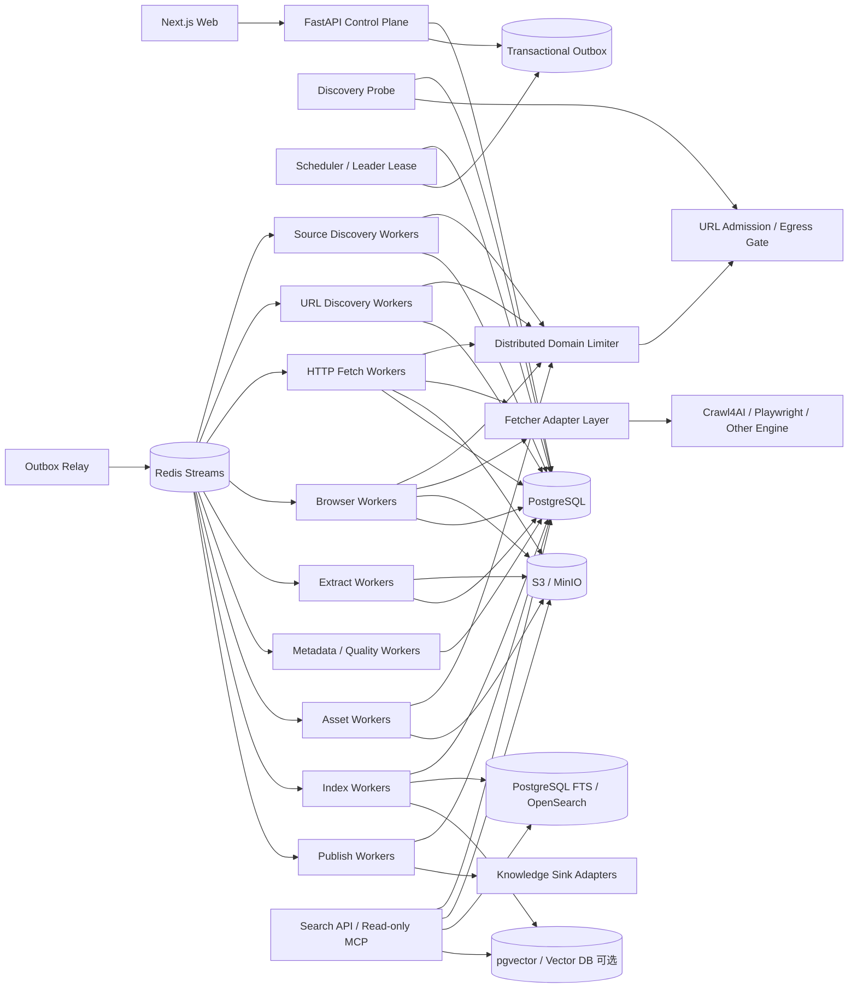

# 博客知识库技术方案

适用范围：从约 1000 个技术博客网站抓取尽可能完整的历史文章，清洗为稳定 Markdown 作为长期知识库；后续持续新增网站，支持历史全量回灌、长期增量同步、版本保留、Web 管理、搜索与外部知识库发布。整体按“数百万 URL、长期运行、站点异构、可横向扩展、可恢复、可回放、可审计”设计。

## 1. 建设目标

1. 用户只需录入博客根地址，系统自动探测 Sitemap、Feed、归档页、分类页、作者页、公开 API、动态列表等入口，并生成可审核的站点配置草稿。
2. 支持约 1000 个站点的历史全量抓取，并可持续增加站点，不要求修改核心状态机。
3. 同一站点允许存在多个独立 Discovery Provider，每个 Provider 单独维护能力类型、覆盖度、checkpoint 和增量连续性。
4. 抓取标题、作者、发布时间、更新时间、标签、canonical、正文、代码块、表格、图片和附件，输出稳定 Markdown。
5. 默认 HTTP-first，只有确实需要 JavaScript 的页面才升级到 Browser；Browser 动作必须有界、可版本化、可审计、可回放。
6. 支持 ETag、Last-Modified、Sitemap lastmod、Feed GUID/cursor、API cursor、内容 hash 和重叠时间窗口驱动的增量同步。
7. 支持断点续跑、幂等、失败重试、指数退避、暂停/恢复、取消、限流、熔断、按站公平调度和 backpressure。
8. 保存原始响应、渲染 DOM、抽取结果、Article IR、Markdown、规则版本和质量结果，规则升级时优先离线重抽取，不重新请求源站。
9. 提供 Web 管理端完成站点接入、探测、规则发布、任务管理、质量审核、版本 diff、错误诊断、搜索和发布管理。
10. 抓取引擎统一通过 Adapter 接入，并进行版本与能力协商；业务状态不直接依赖某个 Crawl4AI/Playwright API 版本。
11. MCP、搜索、Embedding、Reranker、摘要和外部 RAG 都属于派生能力，不成为抓取业务状态真相源。
12. 所有访问统一经过 robots、访问政策、SSRF/Egress、安全预算和域级限流，不以绕过登录、验证码、付费墙或明确访问控制为目标。

## 2. “全量历史”的定义

### 2.1 Live Full

通过当前站点仍可访问的以下入口发现并抓取历史文章：

- Sitemap / Sitemap Index；
- RSS / Atom / JSON Feed；
- 年/月归档；
- 分类、标签、作者分页；
- 平台原生公开 API；
- 普通站内链接；
- 动态列表、加载更多、无限滚动；
- 公开索引补漏。

### 2.2 Archive Full（可选）

在合规前提下，通过 Common Crawl、Wayback 等补充已经删除、迁移或当前站内不再暴露的历史 URL 或历史快照证据。

### 2.3 覆盖度必须按 Provider 统计

不能用“队列为空”表示全量完成。每个站点至少记录：

- 发现 URL 数；
- 已准入 URL 数；
- 当前可访问数；
- 正文成功数；
- summary-only / metadata-only 数；
- 每个 Discovery Provider 的 capability；
- exhaustive Provider 是否到达终点；
- windowed Provider 的 checkpoint、水位和断档状态；
- Browser Provider 是否达到动作停止条件；
- 未覆盖区域及原因。

Provider capability 统一定义为：

- `exhaustive`：理论上可枚举完整集合，如可靠 Sitemap Index；
- `windowed`：只提供最新一段窗口，如普通 RSS；
- `best_effort`：只能尽力发现，如普通站内递归。

## 3. 总体设计原则

1. **PostgreSQL 是业务状态真相源，S3/MinIO 是不可变大对象真相源。**
2. **站点、发现端点、抓取配置分离。** 一个站点可以有多个 source/provider，不同 URL 可以绑定不同执行配置。
3. **自动探测与生产抓取分离。** Probe 只生成候选配置和样本，不代表历史回灌已完成。
4. **发现与访问准入分离。** URL 被发现不表示可以抓取，必须经过规范化、robots、策略、安全和 allow/deny 校验。
5. **HTTP、Feed、Sitemap、API、Browser 分层。** Browser 是稀缺升级路径，不是默认入口。
6. **页面动作与内容抽取分离。** Browser Action Plan 负责页面就绪、滚动、点击、翻页；Extraction Contract 负责字段与正文抽取。
7. **抓取快照不可变。** 规则变化优先离线 replay。
8. **文章身份与 URL 分离。** redirect、canonical、镜像、迁移不自动等同于新文章。
9. **版本追加优先。** `article_version` 不覆盖旧版本，current 只是指针。
10. **流程状态与内容完整度分离。** `done` 不代表一定有全文。
11. **所有跨 PostgreSQL 与消息队列的写入通过 Transactional Outbox。**
12. **所有影响结果的组件都版本化。** Profile、Contract、Action Plan、Adapter、Canonicalizer、Fetcher、Extractor、Normalizer、Quality Gate、Serializer、Chunker、Embedding、Publish Adapter 都有 release id。
13. **LLM 只做候选或派生能力。** canonical 正文、metadata 和文章身份优先由确定性证据决定。
14. **控制面不执行长任务。** UI/API/Cron 只创建 durable job。
15. **增量正确性依赖 Provider 连续性，而不是固定轮询。**
16. **MCP 只作为可选查询和受控运维接口。** 不允许 MCP 绕过控制面直接修改生产 frontier。
17. **批处理只是传输优化，不改变逐 URL 配置和任务身份。** 结果必须用 `task_id/attempt_id` 关联，不能依赖数组位置。
18. **抓取 Adapter 必须做能力协商。** Profile/Action Plan 在发布前校验目标 Adapter/Engine 是否支持所需能力。
19. **第三方抓取引擎不能绕过统一 Egress、robots、限流和业务状态机。**

## 4. 总体架构



系统分为：

- **控制面**：站点、Provider、Profile、Extraction Contract、Action Plan、Adapter、任务、权限、预算、发布、回滚；
- **接入探测面**：根 URL 能力探测、样本抓取、站点类型识别、规则草稿生成；
- **发现面**：Sitemap/Feed/API/Archive/HTML/Browser Provider、durable frontier、coverage、checkpoint；
- **采集面**：HTTP Fetch、Browser Capture、Archive Fetch；
- **Adapter 面**：把 Crawl4AI/Playwright/其它引擎能力统一成版本化 Contract；
- **抽取面**：Metadata Candidate、正文候选、Article IR、Normalizer、Quality Gate、Markdown Serializer；
- **协调面**：Outbox、Redis Streams、DB lease、域级限流、weighted fairness、backpressure；
- **知识访问面**：全文、向量和可选 MCP；
- **发布面**：本地/S3 Markdown、Bedrock、其它外部知识库 Adapter。

## 5. 站点接入：Discovery Probe

这是后续持续增加网站时最关键的扩展能力。

### 5.1 输入

管理员只需要输入：

- 根 URL；
- 可选站点名称；
- 可选抓取边界、语言、期望栏目。

### 5.2 自动探测顺序

Probe 并行执行轻量检查：

1. GET 根页面，记录最终 URL、Content-Type、服务器特征和响应结构；
2. 读取 robots.txt 中 Sitemap；
3. 探测常见 `/sitemap.xml`、`/sitemap_index.xml`；
4. 解析 HTML 中 `rel=alternate` 的 RSS/Atom；
5. 探测常见 `/feed`、`/rss.xml`、`/atom.xml`；
6. 从首页和少量栏目页识别归档、分类、标签、作者、分页；
7. 判断是否存在 JSON/GraphQL/REST 公开接口；
8. 必要时做 Browser Sample Probe，识别动态列表、加载更多、无限滚动；
9. 对候选详情页做 3~10 个样本抓取，估计正文选择器、metadata 来源、URL pattern、是否需要 Browser/session；
10. 根据目标 Adapter capability 生成可执行的配置草稿。

HEAD 只作为弱信号，不作为唯一内容类型判断依据。Probe 必须综合最终 URL、GET body、XML root、HTML alternate、robots、页面结构和 API 证据。

### 5.3 探测结果

系统生成草稿：

- `site`；
- 一个或多个 `site_source/discovery_endpoint`；
- `provider_type` 与 `capability`；
- Fetch Profile；
- Discovery Extraction Contract；
- Article Extraction Contract；
- Browser Action Plan；
- URL allow/deny pattern；
- 推荐 Adapter；
- 样本、证据和预估资源成本。

Web 管理端展示证据，管理员确认发布后才创建全量回灌任务。

### 5.4 Probe 与生产抓取的边界

生产系统必须避免：

- 用正则解析 XML/Sitemap；
- 把 HEAD 结果作为唯一内容类型依据；
- 只 follow 少量 URL 就认为历史完成；
- 把 frontier、visited 或 browser session 只放在单进程内存中；
- 自动生成任意 JS 后未经审核直接进入生产。

Sitemap、RSS/Atom 必须使用正式 parser；生产 frontier、checkpoint、session lease 都必须 durable。

## 6. Fetcher Adapter 与能力协商

### 6.1 Adapter 的职责

Adapter 只负责把平台统一执行契约转换成具体抓取引擎调用，不维护业务真相状态。

统一输入至少包括：

```text
task_id
attempt_id
url
profile_release_id
action_plan_release_id
adapter_release_id
execution_budget
conditional_headers
```

统一输出至少包括：

```text
task_id
attempt_id
success
final_url
status_code
headers
raw_body/rendered_dom reference
links
engine_metrics
error_class/error_code
```

### 6.2 Adapter Capability Manifest

每个 Adapter release 注册：

- `adapter_name`；
- `adapter_release_id`；
- `engine_name`；
- `engine_version`；
- `api_version`；
- `supports_http`；
- `supports_browser`；
- `supports_per_url_config`；
- `supports_session`；
- `supports_execute_js`；
- `supports_screenshot/pdf`；
- `supports_raw_html/markdown`；
- `supports_metrics`；
- `max_batch_size`；
- `max_concurrency`；
- `supported_browser_types/cache_modes`。

Profile/Action Plan 发布前做 capability validation；Worker claim task 时固化 `adapter_release_id`。运行中升级抓取引擎不会改变已创建 job 的执行语义。

### 6.3 Execution Bundle

每个 fetch task 形成不可变 Execution Bundle：

- Fetch Profile release；
- Extraction Contract release；
- Browser Action Plan release；
- Adapter release；
- Canonicalizer release；
- Egress/robots policy version；
- 资源预算。

同一 batch 内每个 URL 可以拥有不同 Execution Bundle。

### 6.4 批结果关联

批处理结果必须按 `task_id/attempt_id` 关联，不允许依赖返回数组顺序。Adapter 可乱序返回、拆批、部分失败或重试，但数据库关联必须始终稳定。

## 7. 推荐技术栈

| 层 | 推荐 | 说明 |
|---|---|---|
| API | Python + FastAPI | 控制面 CRUD、任务创建、查询 |
| Web | React / Next.js | 站点接入、探测、规则、任务、质量、搜索 |
| Worker | Python asyncio | I/O 型发现、抓取、轻量抽取 |
| CPU Worker | Process Pool / 独立 Worker | DOM 重抽取、MinHash、大批量转换 |
| 状态库 | PostgreSQL | durable frontier、checkpoint、任务、版本、审计 |
| 迁移 | Alembic | schema version |
| 队列 | Redis Streams | consumer group 和短期分发，不做真相源 |
| 大对象 | S3 / MinIO | raw response、rendered DOM、IR、Markdown、附件 |
| HTTP | httpx / aiohttp | 连接池、条件请求、流式响应 |
| Browser | Playwright + Crawl4AI Adapter | JS 页面、动态列表、rendered DOM |
| XML/Feed | lxml/defusedxml + feedparser 等 | Sitemap Index、gzip、namespace、RSS/Atom |
| 正文抽取 | DOM parser + Trafilatura/Readability/Crawl4AI Adapter | 多候选正文抽取 |
| 全文检索 | PostgreSQL FTS 起步，后续 OpenSearch | 版本化增量索引 |
| 向量 | pgvector 或独立 Vector DB，可选 | canonical 发布后异步构建 |
| 观测 | OpenTelemetry + Prometheus + Grafana + Loki | trace/metric/log |
| 部署 | Docker + Kubernetes | worker 横向扩展、资源隔离 |

第三方抓取库统一通过 Adapter 接入，不直接控制业务状态机，也不能绕过统一 Egress Gateway。

## 8. 核心数据模型

### 8.1 `site`

关键字段：

- `id`
- `name`
- `root_url`
- `canonical_host`
- `platform_type`
- `status`
- `robots_policy`
- `crawl_policy`
- `default_profile_release_id`
- `sync_policy_id`
- `created_at / updated_at`

### 8.2 `site_source` / `discovery_endpoint`

- `id`
- `site_id`
- `name`
- `category`
- `source_url`
- `source_type`：sitemap/feed/archive/category/author/api/html/browser/manual
- `provider_type`
- `capability`：exhaustive/windowed/best_effort
- `profile_release_id`
- `discovery_contract_release_id`
- `article_contract_release_id`
- `action_plan_release_id`
- `sync_policy_id`
- `enabled`

### 8.3 `fetch_profile_release`

保存：

- transport 优先级；
- timeout；
- UA/header；
- cookie 策略；
- proxy；
- HTTP cache 策略；
- Browser 类型与 viewport；
- 单页最大响应体；
- 资源拦截策略；
- 重试与预算；
- draft/canary/published/rolled_back 状态。

### 8.4 `extraction_contract_release`

字段：

- `contract_type`：discovery_links/article_content/metadata；
- `input_representation`：response_html/rendered_dom/json；
- `base_selector`；
- 字段 schema；
- link selector / attribute；
- allow/deny pattern；
- transform pipeline；
- readiness predicate；
- adapter type；
- snapshot test case；
- 期望字段命中率和最小项数；
- release 状态。

### 8.5 `browser_action_plan_release`

优先只保存白名单 Action DSL：

- wait selector；
- wait network idle；
- scroll；
- click；
- next-page；
- load-more；
- session reuse；
- 受控有限 JS（例外能力）。

每个计划必须有：

- 最大执行秒数；
- 最大动作次数；
- 最大滚动次数；
- 最大新增链接数；
- 连续无增长停止阈值；
- 允许的域名和资源预算；
- JS 权限级别和审核状态。

### 8.6 `adapter_release`

记录 Adapter 与底层 Engine 的版本、Capability Manifest、健康状态和配置 schema hash。

### 8.7 `discovery_probe_run`

记录：

- 输入 root URL；
- 探测版本；
- 每项探测证据；
- 候选 Provider；
- 样本 URL；
- HTTP/Browser/session 判定；
- 目标 Adapter capability；
- 生成的配置草稿；
- 人工审核结果。

### 8.8 `discovery_checkpoint`

每个 Provider 独立保存：

- cursor / page / next_url；
- watermark；
- overlap window；
- latest_seen_published_at；
- latest_seen_guid；
- continuity status；
- last_success_at；
- last_full_reconcile_at。

### 8.9 `url_frontier`

关键字段：

- `normalized_url`
- `site_id / source_id`
- `discovered_from`
- `depth`
- `priority`
- `state`
- `attempt_count`
- `next_attempt_at`
- `lease_owner / lease_until`
- `profile_release_id`
- `discovery_evidence`

URL 唯一键必须基于规范化规则，并保留原始 URL 与重定向链。

### 8.10 `fetch_task` 与 `crawl_attempt`

`fetch_task` 表示逻辑抓取任务，`crawl_attempt` 表示具体一次执行。

`fetch_task` 至少保存：

- `task_id`；
- `normalized_url`；
- `desired_observation_generation`；
- Execution Bundle 各 release id；
- priority / budget；
- state。

`crawl_attempt` 至少保存：

- `attempt_id`；
- `task_id`；
- `adapter_release_id`；
- worker；
- started/finished；
- error taxonomy；
- server processing time；
- peak memory；
- Browser seconds；
- network bytes；
- result snapshot id。

### 8.11 `fetch_snapshot`

记录每次网络观测：

- request/response metadata；
- status code；
- redirect chain；
- ETag / Last-Modified；
- content hash；
- raw object key；
- rendered DOM key；
- fetcher/profile/action plan/adapter release；
- observed_at；
- error category。

### 8.12 `browser_session_lease`

字段至少包括：

- `session_lease_id`；
- `worker_id`；
- `adapter_session_id`；
- `generation/fencing_token`；
- `lease_until`；
- `last_heartbeat_at`；
- `request_count/max_requests`；
- `expires_at`；
- `cleanup_state`。

旧 lease 即使因网络分区恢复，也不能继续写生产结果。

### 8.13 `article` 与 `article_version`

`article` 保存逻辑文章身份；`article_version` 追加保存版本：

- canonical URL；
- title/author/published_at/updated_at；
- content hash；
- Article IR key；
- Markdown key；
- extractor/normalizer/serializer release；
- quality status；
- created_at。

## 9. 发现与历史回灌

### 9.1 Provider 优先级

推荐：

1. Sitemap / Sitemap Index；
2. 平台公开 API；
3. RSS/Atom/JSON Feed；
4. 年/月归档；
5. 分类/标签/作者分页；
6. HTML 同域递归；
7. Browser 动态列表；
8. 外部公开索引补漏。

### 9.2 Sitemap

必须支持：

- Sitemap Index；
- gzip；
- namespace；
- lastmod；
- 分片递归；
- streaming parse；
- 大文件限额；
- XML 安全解析；
- URL 规范化和准入过滤。

禁止用正则表达式作为生产 Sitemap parser。

### 9.3 Feed

Feed 常用于增量，但不默认认为能覆盖全部历史。保存 GUID、发布时间、更新时间、next link、cursor 等证据，并标注 windowed/exhaustive 能力。

### 9.4 HTML 递归发现

使用 durable BFS/priority frontier：

- 同域只是第一层边界；
- 再执行 allow/deny、canonical、robots、深度和页面预算；
- visited 状态落 PostgreSQL；
- worker 使用 lease 领取 URL；
- 单页失败不阻断整个站点；
- 大站点不能依赖单进程内存队列；
- query/crawler trap 必须限制参数组合和重复路径。

### 9.5 Browser 动态发现

仅当普通 HTTP 无法发现列表项时使用。执行 Action Plan 后，把新链接写入 durable frontier，不直接在浏览器进程中无限递归。

## 10. 抓取与增量同步

### 10.1 HTTP-first

优先使用条件请求：

- `If-None-Match`；
- `If-Modified-Since`；
- Sitemap `lastmod`；
- Feed GUID/更新时间；
- API cursor。

304 或 hash 未变化时不进入昂贵抽取链路。

### 10.2 Browser 升级条件

只有满足证据时升级：

- HTTP 页面无正文但 Browser 有；
- 关键列表需要 JS；
- SPA 路由内容只存在 rendered DOM；
- 明确存在 load-more / infinite scroll；
- Extraction Contract readiness 在 HTTP DOM 上失败。

### 10.3 浏览器会话

对确实需要状态保持的站点引入 session lease：

- session 与 worker 临时绑定；
- TTL；
- heartbeat；
- generation/fencing token；
- 最大请求数；
- 最大生命周期；
- 崩溃后自动失效重建；
- 显式 Adapter cleanup；
- 清理失败进入 orphan reaper；
- 默认不持久化敏感 cookie/localStorage。

### 10.4 Browser Action 安全

默认使用 Action DSL，不直接允许任意 JavaScript。确需 JS 时：

- 单独权限；
- 版本化；
- 静态/AST 检查；
- 最大执行时间；
- Browser Context 网络 Egress 限制；
- CPU/内存预算；
- 完整审计；
- 发布前人工审核或受控审批。

字符串规则校验不能被视为安全沙箱。

### 10.5 增量调度

每个 Provider 根据更新频率、历史变化率和失败率动态计算 next run。

windowed Provider 必须：

- 保存 checkpoint；
- 使用重叠时间窗口；
- 定期向过去回扫；
- 检测时间断档；
- 周期性 full reconcile。

## 11. 抽取、清洗与 Markdown

### 11.1 多候选抽取

同一 snapshot 可以并行生成：

- 站点 Contract 结果；
- Trafilatura；
- Readability；
- Crawl4AI；
- 平台 JSON/API 结果。

Resolver 基于结构、正文长度、链接密度、标题匹配、发布时间证据等选择 canonical candidate。

### 11.2 Article IR

在 Markdown 前先转换为稳定中间结构：

- heading；
- paragraph；
- list；
- quote；
- code block；
- table；
- image；
- link；
- embed placeholder。

所有结构改写在 DOM/IR/AST 层完成，正则只做字段级清洗。

### 11.3 Markdown 输出

推荐文件结构：

```text
knowledge/
  {site_slug}/
    {yyyy}/
      {article_id}.md
```

front matter 示例：

```yaml
---
article_id: 12345
site: example
source_url: https://example.com/post
canonical_url: https://example.com/post
published_at: 2025-01-02T03:04:05Z
updated_at: null
fetched_at: 2026-08-14T00:00:00Z
content_hash: sha256:...
version: 3
---
```

文件名不直接依赖标题，避免重命名和非法字符问题。

### 11.4 图片和附件

策略可配置：

- 保留远程 URL；
- 下载到对象存储并重写引用；
- 仅下载正文内图片；
- 限制 MIME、大小、总预算；
- 记录原 URL、hash 和 object key。

所有附件请求仍必须经过统一 Egress/robots/policy。

## 12. 去重、文章身份与版本

### 12.1 URL 规范化

处理：

- fragment；
- tracking query；
- scheme/host 大小写；
- 默认端口；
- trailing slash；
- canonical；
- redirect；
- 站点自定义参数规则。

### 12.2 强去重

使用规范化正文 hash 或规范化 Article IR hash 确认完全重复。

### 12.3 近似重复

MinHash/SimHash 只生成候选重复组，不自动删除文章。

### 12.4 版本规则

满足以下任一条件创建新版本：

- 正文 hash 变化；
- metadata 有实质变化；
- canonical identity 变化；
- 规则升级后 canonical IR 发生变化。

## 13. 调度、队列与扩展性

### 13.1 Job 类型

- probe；
- backfill；
- incremental sync；
- reconcile；
- re-extract；
- re-normalize；
- re-index；
- re-publish；
- asset repair；
- orphan session cleanup。

### 13.2 Transactional Outbox

控制面在 PostgreSQL 事务中：

1. 写业务状态；
2. 写 outbox；
3. Relay 异步投递 Redis Streams。

避免“数据库已提交但消息丢失”或“消息已发但状态没提交”。

### 13.3 幂等

每类任务设计 idempotency key，例如：

```text
fetch:{normalized_url}:{profile_release_id}:{adapter_release_id}:{desired_observation_generation}
extract:{snapshot_id}:{contract_release_id}:{extractor_release_id}
index:{article_version_id}:{index_release_id}
```

### 13.4 域级限流与公平性

维护 domain bucket：

- 每域并发；
- QPS；
- 最小间隔；
- Retry-After；
- 429/403 动态退避；
- HTTP/Browser 分开预算。

Scheduler 采用 weighted fair queue，防止大站点占满 worker。

### 13.5 Backpressure

当 downstream 堆积时：

- 降低发现速度；
- 暂停 Browser 扩展；
- 优先处理已抓取未抽取内容；
- 对低优先级重抽取延后。

### 13.6 统一错误分类与 Retry Policy

Adapter 不返回无法机器处理的纯文本错误，统一映射：

- `dns_failure`；
- `connect_timeout`；
- `read_timeout`；
- `connection_reset`；
- `tls_failure`；
- `http_401_403`；
- `http_404_410`；
- `http_429`；
- `http_5xx`；
- `robots_denied`；
- `egress_denied`；
- `content_too_large`；
- `browser_crash`；
- `browser_timeout`；
- `extraction_failed`；
- `adapter_contract_error`。

每类错误明确：

- `retryable`；
- `retry_after`；
- 最大次数；
- domain/adapter/job 影响范围；
- 是否触发熔断或人工审核。

例如：429 尊重 Retry-After；404/410 不快速重试；403 进入策略审核；Adapter 参数不兼容直接阻止同 release 后续任务。

## 14. Web 管理功能

### 14.1 站点列表

展示：

- 状态；
- Provider 数；
- 历史覆盖度；
- 最新同步时间；
- backlog；
- 错误率；
- Browser 占比；
- 内容成功率；
- Adapter/Engine 版本；
- 平均抓取成本。

### 14.2 新增站点向导

流程：

1. 输入根 URL；
2. 启动 Discovery Probe；
3. 展示 Sitemap/Feed/API/归档/动态列表证据；
4. 展示样本文章和正文预览；
5. 自动生成 Profile/Contract/Action Plan 草稿；
6. 校验目标 Adapter capability；
7. 管理员修改并 dry-run；
8. 发布配置；
9. 创建历史回灌任务。

### 14.3 规则编辑器

支持：

- CSS/DOM/JSON 字段配置；
- allow/deny pattern；
- Browser Action DSL；
- 受控 JS；
- Snapshot replay；
- 发布前回归测试；
- canary；
- 一键回滚。

### 14.4 任务管理

支持：

- 创建 backfill / incremental / replay；
- 暂停、恢复、取消；
- 查看各阶段 backlog；
- 错误分类；
- 重试；
- 单 URL 调试；
- 查看 task/attempt/Adapter 关联；
- 查看批任务部分失败和重试情况。

### 14.5 内容质量

支持：

- 原始页面/渲染 DOM/Markdown 对比；
- 字段命中；
- 空正文；
- 极短正文；
- 重复组；
- 版本 diff；
- 规则版本追踪。

### 14.6 搜索和发布

支持按：

- 站点；
- 标题；
- 作者；
- 时间；
- 标签；
- 全文；
- 向量相似度；
- 抓取/质量状态；

查询，并查看下游知识库发布状态。

### 14.7 Adapter 管理

Web 应展示：

- Adapter/Engine 版本；
- capability；
- 健康检查；
- 最近错误率；
- 平均耗时与峰值内存；
- 哪些 Profile/Action Plan 依赖该 release；
- 升级兼容性检查。

## 15. MCP 的定位

可选提供只读或受控运维 MCP：

- 搜索知识库；
- 获取文章 Markdown；
- 查询站点状态；
- 查询任务状态；
- 启动受控 Probe/dry-run；
- 单 URL 诊断。

MCP 不直接维护 frontier、checkpoint、session lease 或文章版本，也不能绕过 Control Plane 修改生产状态。MCP Tool 最终仍调用平台受控 API，不直接对外任意访问 URL。

## 16. 安全与合规

### 16.1 SSRF / Egress

- 只允许 http/https；
- 拒绝 localhost、RFC1918、link-local、loopback、metadata endpoint；
- DNS 解析前后都检查；
- redirect 每跳重新校验；
- 端口 allowlist；
- DNS rebinding 防护；
- 禁止 file/data/gopher 等 scheme；
- Browser 网络请求同样受 Egress Policy 控制；
- Sitemap、Feed、图片、附件和 Adapter 内部探测不能绕过统一 Egress Gateway。

### 16.2 Robots 与访问政策

- robots 解析结果缓存并留版本；
- 每次 fetch attempt 记录决策依据；
- policy 变化触发重新评估；
- 不绕过验证码、登录、付费墙和明确访问控制。

### 16.3 资源预算

每站/每 job 设置：

- 最大 URL 数；
- 最大响应体；
- 最大 Browser 秒数；
- 最大图片/附件字节；
- 最大失败重试；
- 最大每日请求数；
- 最大单批 URL；
- 最大 session 生命周期。

### 16.4 Browser 隔离

- 独立 Pod/Node Pool；
- 非 root；
- 受限文件系统；
- Egress 受控；
- Context 级超时；
- session fencing；
- 任意 JS 默认禁用。

## 17. 观测与 SLO

关键指标：

- discovery URL/s；
- fetch success rate；
- 304 ratio；
- Browser escalation ratio；
- extraction success rate；
- empty/short content ratio；
- queue lag；
- domain throttle time；
- retry rate；
- average cost per article；
- Provider continuity gap；
- outbox lag；
- publish lag；
- Adapter error rate；
- adapter_contract_error rate；
- server processing time；
- server peak memory；
- Browser seconds/article；
- batch partial failure ratio；
- orphan session count。

每个 URL 生命周期贯穿 `trace_id`，从 Web 页可追溯：

```text
Discovery
 -> Admission
 -> Fetch Task
 -> Crawl Attempt
 -> Snapshot
 -> Extract
 -> Normalize
 -> Quality
 -> Index
 -> Publish
```

## 18. 部署与容量规划

### 18.1 Worker 分池

至少拆分：

- discovery workers；
- HTTP fetch workers；
- Browser workers；
- extract workers；
- CPU workers；
- index workers；
- publish workers；
- cleanup workers。

### 18.2 Browser 隔离

Browser worker 单独 Pod/Node Pool：

- 较高内存；
- 严格并发；
- session lease/fencing；
- 崩溃自动回收；
- 与 HTTP worker 独立扩缩容。

### 18.3 对象存储

原始响应和中间结果默认保存在对象存储，不把大 HTML/DOM/Markdown 全塞 PostgreSQL。PG 保存 metadata、状态、hash 和 object key。

### 18.4 Adapter 升级

Adapter/Engine 升级采用：

1. 注册新 `adapter_release`；
2. capability diff；
3. 对已有 snapshot 和少量真实 URL 做兼容测试；
4. canary；
5. 新任务逐步切换；
6. 老 job 继续固定旧 release；
7. 异常一键回滚。

## 19. 实施阶段

### Phase 1：MVP

- site/source；
- Discovery Probe 基础版；
- Sitemap/Feed；
- durable frontier；
- HTTP 抓取；
- raw snapshot；
- Trafilatura/Readability + Markdown；
- PostgreSQL + Redis Streams + MinIO；
- Web 站点/任务/文章查看；
- ETag/Last-Modified 增量；
- 统一 Egress/robots；
- 基础错误 taxonomy。

### Phase 2：站点异构与动态页面

- Extraction Contract；
- Browser Action Plan DSL；
- Playwright/Crawl4AI Adapter；
- Adapter Capability Manifest；
- per-URL Execution Bundle；
- task_id/attempt_id 批结果关联；
- Browser session lease/fencing/cleanup；
- 动态列表发现；
- 规则 dry-run/canary/replay；
- 质量审核。

### Phase 3：规模化与连续性

- 多 Provider checkpoint；
- weighted fairness；
- backpressure；
- full reconcile；
- coverage dashboard；
- Adapter 成本/资源遥测；
- OpenSearch/pgvector；
- 外部知识库发布。

### Phase 4：高级能力

- Archive Full；
- 自动站点类型模板；
- 近似重复；
- 自动回归测试；
- 只读/受控 MCP；
- 成本优化与智能调度；
- Adapter 自动兼容测试矩阵。

## 20. 推荐最小生产拓扑

```text
2 x FastAPI Control Plane
2 x Scheduler/Outbox Relay（leader lease）
N x Discovery Worker
N x HTTP Fetch Worker
独立 Browser Worker Pool
N x Extract/Normalize Worker
N x Index/Publish Worker
1+ x Cleanup Worker
Fetcher Adapter Layer
PostgreSQL HA
Redis Streams
S3/MinIO
Prometheus + Grafana + Loki + OpenTelemetry Collector
Next.js Web
```

## 21. 关键故障场景

### 21.1 Worker 在抓取成功后、写 DB 前崩溃

依靠 task lease + 幂等 attempt 重试；对象存储 key 使用内容 hash/attempt id，重复写安全。

### 21.2 DB 已提交任务但消息未发送

Transactional Outbox Relay 重新投递。

### 21.3 消息重复投递

Worker 用 task idempotency key 和 lease 防重复业务结果。

### 21.4 Browser Worker 崩溃

session lease 过期；generation/fencing token 使旧 session 不能继续写；cleanup worker 回收 orphan session。

### 21.5 Adapter 升级导致参数不兼容

新 Adapter release 先 capability validation + canary；旧 job 固化旧 release，不受影响。

### 21.6 Batch 返回乱序或部分失败

按 `task_id/attempt_id` 关联，不按数组位置；每个 task 独立重试。

### 21.7 某域持续 429/403

Domain Limiter 动态退避/熔断，尊重 Retry-After；403 进入策略审核，不无限重试。

### 21.8 抽取规则失效

保留 raw/rendered snapshot，用新 Contract 离线 replay，不优先重抓源站。

## 22. 最终结论

对于“1000 个技术博客全量历史 + 长期增量 + 持续新增站点 + Web 管理”的目标，核心不是选择一个万能爬虫，而是建立一个 durable、版本化、可探测、可回放、抓取引擎可替换的采集平台。

最终方案采用：

- `Discovery Probe` 降低新站点接入成本；
- 多 Provider 做完整历史发现和连续性跟踪；
- PostgreSQL 保存 durable frontier/checkpoint/job/task/version；
- Redis Streams 只做任务分发；
- HTTP-first + Browser 按需升级；
- Fetch Profile、Extraction Contract、Browser Action Plan 全部版本化；
- Adapter Capability Manifest 隔离 Crawl4AI/Playwright 等引擎版本差异；
- 每 URL 固化 Execution Bundle；
- 批处理按 `task_id/attempt_id` 关联，不依赖位置；
- Browser session 使用 lease + fencing + 显式 cleanup；
- 统一错误 taxonomy 驱动 retry、限流、熔断和 Web 诊断；
- S3/MinIO 保存不可变快照和 Markdown；
- Article IR + version append 保证规则升级可回放；
- Web 管理端覆盖接入、调试、任务、质量、Adapter 和发布；
- 统一 SSRF/Egress/robots 约束所有网络访问；
- MCP 仅作为可选查询、Probe、dry-run 和受控运维接口，不进入生产状态真相链路。

这套结构可以从几十个站点平滑扩展到 1000+ 站点，并能随着新平台、新发现方式、新抓取引擎和引擎版本持续扩展，而不需要重写核心状态机。