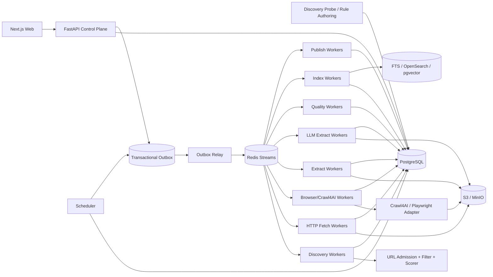

# 博客知识库技术方案

适用范围：从约 1000 个技术博客网站抓取尽可能完整的历史文章，清洗为稳定 Markdown 作为长期知识库；后续持续新增网站，支持历史全量回灌、长期增量同步、版本保留、Web 管理、搜索与外部知识库发布。整体按“数百万 URL、长期运行、站点异构、可横向扩展、可恢复、可回放、可审计”设计。

## 1. 建设目标

1. 用户只需录入博客根地址，系统自动探测 Sitemap、Feed、归档页、分类页、作者页、公开 API、动态列表等入口，并生成可审核的站点配置草稿。
2. 支持约 1000 个站点的历史全量抓取，并可持续增加站点；增加常见站点主要通过配置/模板完成，不修改核心状态机。
3. 同一站点允许多个独立 Discovery Provider，每个 Provider 独立维护 capability、checkpoint、覆盖度与增量连续性。
4. 抓取标题、作者、发布时间、更新时间、标签、canonical、正文、代码块、表格、图片和附件，输出稳定 Markdown。
5. 默认 HTTP-first，仅在证据表明确实需要 JavaScript 时升级到 Browser。
6. 支持 ETag、Last-Modified、Sitemap lastmod、Feed GUID/cursor、API cursor、内容 hash 与重叠时间窗口驱动的增量同步。
7. 支持 durable frontier、断点续跑、幂等、重试、指数退避、限流、熔断、按站公平调度与 backpressure。
8. 保存原始响应、渲染 DOM、cleaned HTML、抽取候选、Article IR、Markdown、规则版本和质量结果；规则升级优先离线 replay。
9. 提供 Web 管理端完成站点接入、探测、规则发布、任务管理、质量审核、版本 diff、错误诊断、搜索和发布管理。
10. Crawl4AI、Playwright、Trafilatura、Readability 等统一通过 Adapter 接入，不直接成为业务状态真相源。
11. URL 发现、URL 准入、抓取、抽取、质量评估、索引和发布全部可版本化、可审计。
12. LLM 仅作为规则生产、昂贵语义抽取或低质量升级路径，不作为百万级文章的默认正文抽取方式。

## 2. “全量历史”的定义与完成判定

### 2.1 Live Full

从当前站点仍可访问的 Sitemap / Sitemap Index、RSS / Atom / JSON Feed、平台公开 API、年/月归档、分类、标签、作者分页、普通站内链接和动态列表中发现历史文章。

### 2.2 Archive Full（可选）

在合规前提下，可利用 Common Crawl、Wayback 等补充已经删除、迁移或当前站内不再暴露的历史 URL 或历史快照证据。Archive Full 与 Live Full 分开统计，不能混为一个完成率。

### 2.3 Provider Capability

每个发现 Provider 必须标注：

- `exhaustive`：理论上可枚举完整集合，如可靠 Sitemap Index；
- `windowed`：只暴露最近窗口，如普通 RSS；
- `best_effort`：只能尽力发现，如普通站内递归。

### 2.4 全量完成条件

站点历史回灌完成至少同时满足：

1. 所有启用 Provider 到达稳定 checkpoint；
2. Sitemap/API 等 `exhaustive` Provider 已完整枚举并记录条目数；
3. 归档/分页 Provider 无未处理 next page 或 continuity gap；
4. durable frontier 中无可执行 URL；
5. retryable 失败已处理完，dead-letter 已明确接受、忽略或人工处置；
6. 新一轮 reconcile 未产生显著新增 URL；
7. Provider Coverage Ledger 中不存在未知断档。

因此 `frontier == empty` 只表示“当前没有待执行任务”，不等价于“全量完成”。

## 3. Crawl Mode 与停止条件

统一定义五种模式：

- `FULL_BACKFILL`：首次历史回灌，目标是尽可能完整；
- `INCREMENTAL`：持续同步新增和更新文章；
- `RECONCILE`：周期性重新枚举来源，修复增量断档；
- `TOPIC_EXPANSION`：围绕主题做有限预算的站内扩展；
- `REPROCESS`：不访问网络，基于已有 snapshot 重新抽取、清洗、索引或发布。

关键规则：

- `FULL_BACKFILL` 中 URL Scorer 只影响顺序，合法 URL 不因低分永久丢弃；
- `FULL_BACKFILL` 中语义相关性、SEO、关键词等规则默认只能 `SOFT_SCORE` 或 `OBSERVE_ONLY`，不能作为全局硬淘汰条件；
- `INCREMENTAL/TOPIC_EXPANSION` 可以使用分数阈值、最大页数、时间预算和语义相关性；
- AdaptiveCrawler 的 coverage/consistency/saturation 只能表示“信息充分度”，不能作为首次全量完成条件；
- Crawl4AI deep crawl 的 `max_pages` 是一次 execution slice 的预算，不是站点最终抓取上限。

## 4. 核心设计原则

1. PostgreSQL 是业务状态真相源，S3/MinIO 是不可变大对象真相源。
2. 站点、发现端点、Fetch Profile、Crawler Execution、Extraction Pipeline、URL Filter、URL Scorer、Browser Action Plan、Adapter 全部分离并版本化。
3. 自动 Probe 与生产回灌分离；Probe 只生成配置草稿、样本证据和规则候选。
4. URL 被发现不表示允许抓取，必须经过 URL Admission Pipeline。
5. HTTP、Feed、Sitemap、API、Browser 分层，Browser 是稀缺升级路径。
6. 页面动作与内容抽取分离；Browser Action Plan 负责页面就绪、点击、翻页和滚动，Extraction Pipeline 负责字段与正文。
7. 抓取快照不可变，规则升级优先 replay。
8. 文章身份与 URL 分离；redirect、canonical、镜像、迁移不自动等同于新文章。
9. `article_version` 只追加，不覆盖旧版本。
10. Redis Streams 只做短期分发，不做状态真相源。
11. 所有跨 PostgreSQL 与队列的写入通过 Transactional Outbox。
12. 批处理和 deep crawl 只做执行优化，结果必须逐条按 `task_id/attempt_id` 落 durable 状态。
13. 第三方抓取引擎不能绕过统一 Egress、robots、限流、预算和业务状态机。
14. Bloom Filter、RoaringBitmap 等只能做加速结构，不能代替数据库唯一约束和 durable frontier。
15. LLM 生成的 CSS/XPath/Regex 只作为规则候选，发布前必须验证；逐页 LLM 抽取必须有 schema、chunk、成本和 provenance。

## 5. 总体架构



系统分为控制面、探测/规则生产面、发现面、采集面、Adapter 面、抽取与质量面、协调面、知识访问面和发布面。

## 6. 新站点接入：Discovery Probe

管理员输入根 URL 后，Probe 并行执行：

1. GET 根页面并记录最终 URL、Content-Type、编码和结构；
2. 解析 robots.txt 中 Sitemap；
3. 探测常见 Sitemap 地址；
4. 解析 HTML 中 RSS/Atom alternate；
5. 探测常见 Feed；
6. 识别归档、分类、标签、作者和分页；
7. 识别公开 JSON/REST/GraphQL API；
8. 必要时执行 Browser Sample Probe；
9. 抓取 3~10 个详情页样本，识别正文结构与 metadata；
10. 生成 Provider、Fetch Profile、URL Filter、Scorer、Extraction Pipeline、Action Plan 和 Adapter 草稿；
11. 对样本执行 JSON-LD/meta、CSS/XPath、Regex、Trafilatura、Readability、Crawl4AI Markdown 候选对比；
12. 必要时调用 LLM 生成 CSS/XPath/Regex 规则候选，但不直接发布；
13. 输出预计 Browser 比例、覆盖来源、规则验证结果和风险项。

Web 端展示证据与样本，管理员 dry-run/canary 后发布，再创建历史回灌任务。常见平台可复用站点模板。

## 7. Rule Authoring：把 LLM 用在规则生产而不是每页执行

对 DOM 稳定但初次接入成本较高的站点，允许在 Probe 阶段使用 LLM 生成：

- CSS Schema；
- XPath Schema；
- 自定义 Regex；
- 页面类型/选择器候选。

生成后必须：

1. 绑定生成时使用的 model、prompt、sample snapshot；
2. 对 Regex 做长度、复杂度和 ReDoS/灾难性回溯风险检查；
3. 在 20~100 个 golden/canary snapshot 上离线运行；
4. 统计字段命中率、误抽取率、正文长度、代码块/表格保留等指标；
5. 人工或自动门禁通过后生成正式 release；
6. 生产逐页执行只使用已发布的确定性规则，不重复调用 LLM。

规则生产成本与逐页 LLM 抽取成本必须分账。

## 8. Discovery Provider 与覆盖台账

Provider 推荐优先级：

1. Sitemap / Sitemap Index；
2. 平台公开 API；
3. RSS/Atom/JSON Feed；
4. 年/月归档；
5. 分类/标签/作者分页；
6. HTML 同域递归；
7. Browser 动态列表；
8. 外部公开索引补漏。

Sitemap 必须支持 index、gzip、namespace、lastmod、分片递归、streaming parse 和安全 XML；Feed 保存 GUID、发布时间、更新时间、cursor/next link；windowed Provider 必须使用重叠时间窗口、断档检测和周期性 full reconcile。

每个 `discovery_run` 写 Provider Coverage Ledger：

```text
provider_id
crawl_mode
checkpoint_before / checkpoint_after
pages_or_entries_scanned
discovered_count
admitted_count
rejected_count + reason
expected_count（若可得）
pagination_continuity
new_frontier_count
unresolved_error_count
started_at / finished_at
```

Web 端据此显示“覆盖证据”，而不是只显示任务成功/失败。

## 9. URL Admission、Filter Rule 与 crawler trap

每个新发现 URL 依次经过：

1. URL 规范化；
2. SSRF / Egress 校验；
3. robots 与访问策略；
4. Domain / Subdomain allowlist；
5. URL path allow/deny；
6. query 规范化；
7. Content-Type/扩展名规则；
8. canonical / redirect identity hints；
9. crawler trap 检测；
10. Provider 深度与执行预算；
11. URL Priority Scorer。

每条 Filter Rule 必须同时保存：

```text
rule_id
rule_type
decision = HARD_REJECT | SOFT_SCORE | OBSERVE_ONLY
allowed_crawl_modes
expression
reason_template
release_id
```

`FULL_BACKFILL` 中只允许高置信度安全/范围规则做 `HARD_REJECT`；关键词、SEO、ContentRelevance 等默认只改变 score。

URL 规范化至少处理 host 大小写、IDN、fragment、默认端口、tracking query、query 顺序、已知 session 参数、trailing slash 和 percent-encoding。

典型 crawler trap：日历无限翻页、搜索参数组合、tag/filter 排列组合、无界 `?page=`、session/token 参数、同内容多排序 URL。平台按站限制最大路径深度、query cardinality、page number 和重复模板比例，并记录 reject reason。

## 10. URL Scorer 与 Best-First durable frontier

对于 HTML recursive 或动态发现，支持可插拔 Best-First 排序：

```text
priority_score =
  source_priority
+ path_pattern_score
+ page_type_score
+ archive_expansion_score
+ recency_score
+ optional_semantic_score
+ aging_score
- trap_penalty
- duplicate_penalty
```

Sitemap/API/Feed 直接发现的文章详情页优先；能继续展开大量历史 URL 的归档页也可获得高扩展分；未知站内链接较低。`aging_score` 防止历史低分 URL 永久饿死。

### 10.1 FULL_BACKFILL

- score 只决定先后；
- 合法低分 URL 最终仍必须处理；
- worker 每个小批次发现的新 URL 都立即持久化回 PostgreSQL；
- `max_pages` 只限制单次 worker slice，Scheduler 会继续调度剩余 frontier；
- Deep Crawl/批量执行优先使用 streaming，逐结果提交，不等整批完成。

### 10.2 INCREMENTAL / TOPIC_EXPANSION

- 可启用 score threshold；
- 可设 max pages / 时间预算；
- 可使用 ContentRelevance/SEO/语义相关性做过滤；
- 可使用 AdaptiveCrawler 依据信息增益递减提前停止。

## 11. HTTP-first 与 Browser 升级

默认优先 HTTP：

1. 尽可能发送 `If-None-Match` / `If-Modified-Since`；
2. 304 直接更新 freshness，不进入抽取；
3. 200 时先保存 raw response bytes；
4. 若正文 hash 不变，只更新 fetch metadata；
5. HTTP DOM 能得到完整正文则直接进入抽取；
6. 只有证据表明需要 JS 才进入 Browser。

Browser 升级原因必须结构化记录：

- `EMPTY_ARTICLE_BODY`；
- `SPA_SHELL`；
- `JS_PAGINATION`；
- `LOAD_MORE`；
- `INFINITE_SCROLL`；
- `DYNAMIC_RENDER_REQUIRED`；
- `EXTRACTION_READINESS_FAILED`。

Browser session 必须使用 TTL、heartbeat、generation/fencing token、最大请求数、最大生命周期和显式 cleanup。Browser Worker 独立资源池，防止 Chromium 抢占普通 HTTP/CPU worker。

## 12. Crawl4AI 的定位与 Adapter 边界

Crawl4AI 主要承担：

- `AsyncWebCrawler`/Browser 执行；
- BFS/DFS/BestFirst deep crawl；
- `FilterChain` 与 URL scorer；
- Markdown 生成；
- CSS/XPath/Regex extraction；
- 必要时 LLM extraction；
- `arun_many()`/deep crawl streaming 与 worker 内 dispatcher。

它不承担：

- 全局 durable frontier；
- 多站点公平调度；
- 业务 checkpoint；
- 文章版本真相；
- 全局幂等与审计；
- 站点长期覆盖完成判定。

### 12.1 配置投影

平台数据库不直接保存第三方 Python 对象，而保存稳定 release：

```text
browser_profile_release
fetch_profile_release
crawler_execution_release
url_filter_release
url_scorer_release
extraction_pipeline_release
llm_chunk_policy_release
action_plan_release
adapter_release
```

Adapter 根据固定 `engine_version` 生成 `BrowserConfig/CrawlerRunConfig`，并在发布前做 capability validation。

### 12.2 Adapter 输入

```text
task_id
attempt_id
crawl_mode
url
browser_profile_release_id
fetch_profile_release_id
crawler_execution_release_id
filter_release_id
scorer_release_id
action_plan_release_id
extraction_pipeline_release_id
adapter_release_id
execution_budget
conditional_headers
```

### 12.3 Adapter 输出

业务层不直接依赖 Crawl4AI `CrawlResult` 字段层级，而统一归一化：

```text
task_id
attempt_id
success
engine_version
final_url
status_code
response_headers
raw_html_ref
cleaned_html_ref
rendered_dom_ref
raw_markdown_ref
fit_markdown_ref
extracted_content_ref
links_ref
media_ref
engine_metrics
error_class/error_code
```

Crawl4AI 版本必须锁定，Fit Markdown 等字段层级变化由 Adapter 吸收。

### 12.4 Streaming 规则

Deep crawl 或 `arun_many()` 只在 worker 内执行 bounded slice。开启 streaming 时，每拿到一个结果立即：

```text
落 crawl_attempt
 -> 保存 snapshot/结果引用
 -> 新链接进入 Admission/frontier
 -> 更新本条 task 状态
```

禁止先把数百/数千 `CrawlResult` 全部堆在进程内再一次性提交。

## 13. Snapshot 与对象存储

任何成功网络访问都先保存不可变 snapshot，再做抽取。至少保留：

```text
raw response bytes
response headers
observed charset
final_url / redirect chain
body sha256
rendered DOM（若 Browser）
cleaned HTML（如 Adapter 产生）
raw Markdown（如产生）
fit Markdown（如产生）
links/media 原始结果引用
fetch profile / adapter release
fetched_at
```

大对象放 S3/MinIO；PostgreSQL 只保存 metadata、hash、object key 和状态。规则升级优先基于 snapshot replay，避免重新访问网站。

## 14. 增量同步与 Reconcile

增量优先使用低成本变更信号：

1. Sitemap `lastmod`；
2. Feed GUID/发布时间/更新时间；
3. API cursor / updated_at；
4. ETag；
5. Last-Modified；
6. normalized content hash。

每站维护 `next_sync_at`、Provider checkpoint、最近变更率和历史抓取耗时，Scheduler 可按变化速度自适应调整频率。

### 14.1 防止 windowed source 漏数据

RSS 等只保留最近 N 条，不能只保存“最后一条 GUID”然后向前推进。必须：

- 使用时间重叠窗口；
- 对最近一段时间重复扫描并依靠幂等去重；
- 检测时间断档；
- 定期执行 Sitemap/API/Archive `RECONCILE`；
- 对长时间离线后的站点先扩大 overlap 再恢复正常频率。

### 14.2 文章更新

如果 URL 未变化但 Article IR 发生实质变化，创建新的 `article_version`。若只发生抓取时间/响应头变化而 canonical IR hash 相同，不创建新文章版本。

## 15. 抽取链：确定性优先，多候选竞争

同一 snapshot 可产生多个候选：

1. 平台 API / JSON-LD / OpenGraph / meta；
2. 站点 CSS/XPath Extraction Contract；
3. Regex field rules；
4. Trafilatura；
5. Readability；
6. Crawl4AI raw Markdown / fit Markdown；
7. 必要时 LLMExtractionStrategy。

每个 candidate 必须记录：

```text
extractor_type
extractor_version
rule_release
input_snapshot_id
input_format
field/value 或正文引用
provenance/evidence
raw_quality
started_at/finished_at
```

Quality Gate 选择最终字段和正文，而不是让最后一个 extractor 静默覆盖前一个结果。

## 16. Regex Extraction

Regex 主要用于廉价字段/证据抽取，而不是整篇正文识别。适合：日期、URL、版本号、固定 ID、邮箱、特定 front matter 片段等。

`RegexRuleRelease` 至少保存：

```text
site_id
release_id
label
pattern
input_format
generated_by_model（可空）
prompt_release（可空）
sample_snapshot_ids
validation_metrics
created_at
```

若由 LLM 生成，必须在规则生产阶段缓存和验证，生产逐页只执行确定性 Regex。

## 17. LLM Extraction 与 Chunk Policy

LLM 只有以下情况才进入逐页执行：

- 站点 Contract、Regex 和通用抽取器均低质量；
- DOM 极不稳定；
- 需要语义字段而不是单纯正文；
- 少量特殊长尾页面需要临时兜底。

每站维护 `llm_escalation_policy` 与 `LLMChunkPolicyRelease`：

```text
model_release
prompt_release
schema_release
input_format
chunk_token_threshold
overlap_rate
apply_chunking
merge_strategy
identity_keys
effective_generation_args
single_document_token_limit
monthly_budget
```

### 17.1 Chunk 合并

长文切 chunk 后，相邻 chunk 的 overlap 会产生重复候选。每个 LLM candidate 必须记录 `chunk_id/chunk_span`；合并按 stable identity key、内容 hash 或 schema-specific merge rule 去重，不能简单拼接数组。

### 17.2 Schema Validation

Pydantic/JSON Schema 只保证结构，不保证事实。LLM 输出进入最终 Article IR 前必须：

- JSON/schema parse；
- 必填字段校验；
- 与 DOM/meta/确定性 candidate 交叉验证；
- provenance 记录；
- 冲突或低质量时进入 review/降级。

### 17.3 成本记录

禁止只调用 `show_usage()` 打印日志。结构化保存：

```text
llm_call_count
input_tokens
output_tokens
total_tokens
estimated_cost
provider_latency
model
prompt_release
```

支持按站点、任务、时间窗口设置预算和熔断。

## 18. Markdown、Article IR 与内容过滤

HTML 不直接字符串清洗后落 Markdown，而是先转换为稳定 Article IR：

- heading；
- paragraph；
- list；
- quote；
- code block；
- table；
- image；
- link；
- embed placeholder。

Crawl4AI `fit_markdown`、Pruning/BM25 等内容过滤结果只能作为 candidate。技术文章中短代码块、表格、API 列表可能被过度裁剪，因此必须同时保留 raw HTML、raw Markdown 和 fit Markdown，并由 Quality Gate 决定 canonical 内容。

Markdown 推荐目录：

```text
knowledge/{site_slug}/{yyyy}/{article_id}.md
```

front matter 至少包含：

```yaml
article_id:
site_id:
source_url:
canonical_url:
title:
authors:
published_at:
updated_at:
fetched_at:
content_hash:
article_version:
extraction_release:
crawl_run_id:
```

文件名不直接依赖标题，避免重命名和非法字符问题。正文相对链接和图片转绝对地址；是否镜像图片作为站点级策略。

## 19. Quality Gate 与 Extractor Drift Detection

至少计算：

- 标题存在率与 `<title>/og:title/h1` 一致度；
- 正文字符数、段落数；
- 链接密度和导航占比；
- `pre/code` 保留率；
- 表格保留率；
- 图片引用有效率；
- 发布时间证据；
- boilerplate 比率；
- 与历史版本重复度；
- Markdown 截断/结构异常；
- canonical/final URL 冲突；
- schema 字段命中率。

站点级持续监控：

```text
extraction_success_rate
body_length_p50/p95
title_missing_rate
code_block_retention
fit/raw_length_ratio
browser_fallback_rate
llm_escalation_rate
duplicate_ratio
```

若某个 release 发布后指标突变，自动暂停扩大范围、触发 Probe，并生成新规则草稿。低质量内容不静默覆盖旧版本。

## 20. URL 去重、文章身份与版本

### 20.1 URL 级去重

数据库准确唯一键：

```text
(site_id, sha256(normalized_url))
```

Bloom Filter 可快速挡掉明显重复 URL，但 false positive 不能决定永久丢弃；最终仍以 PostgreSQL unique constraint 为准。RoaringBitmap 可做批次覆盖统计，不作为 URL 身份真相源。

### 20.2 内容与文章身份

- exact duplicate：Article IR/content hash；
- near duplicate：MinHash/SimHash 只生成候选，不自动删除；
- redirect/canonical：只提供 identity evidence；
- 多 URL 指向同一文章时保留 URL relation；
- 站点迁移或 canonical 改变不自动创建重复文章。

`article_version` append-only。正文、关键 metadata、canonical identity 或规则升级后的 canonical IR 发生实质变化才创建新版本。

## 21. 核心数据模型

至少包括：

- `site`；
- `site_source`；
- `fetch_profile_release`；
- `crawler_execution_release`；
- `url_filter_release`；
- `url_scorer_release`；
- `extraction_pipeline_release`；
- `regex_rule_release`；
- `llm_chunk_policy_release`；
- `browser_action_plan_release`；
- `adapter_release`；
- `llm_escalation_policy`；
- `rule_authoring_run`；
- `discovery_probe_run`；
- `discovery_run`；
- `provider_coverage`；
- `discovery_checkpoint`；
- `crawl_job`；
- `url_frontier`；
- `fetch_task`；
- `crawl_attempt`；
- `fetch_snapshot`；
- `browser_session_lease`；
- `extraction_candidate`；
- `llm_usage`；
- `quality_evaluation`；
- `article`；
- `article_url_relation`；
- `article_version`；
- `publish_state`；
- `outbox_event`。

`url_frontier` 关键字段：normalized_url、site/source、discovered_from、depth、priority_score、filter/scorer release、state、attempt_count、next_attempt_at、lease_owner、lease_until、discovery_evidence、first_seen_at、last_seen_at。

## 22. 状态机、幂等与 Transactional Outbox

URL/任务状态建议：

```text
DISCOVERED
 -> ADMITTED
 -> QUEUED
 -> FETCHING
 -> FETCHED
 -> EXTRACTING
 -> QUALITY_CHECK
 -> STORED
 -> INDEXED
 -> PUBLISHED
```

失败进入：

```text
RETRY_WAIT -> QUEUED
DEAD_LETTER
REJECTED
```

每次领取任务使用 lease；worker 崩溃后 lease 到期可重放。业务写入通过 idempotency key 去重，例如：

```text
fetch:      url_id + requested_snapshot_epoch
extract:    snapshot_id + extraction_pipeline_release_id
llm:        snapshot_id + schema_release_id + prompt_release_id + chunk_policy_release_id
index:      article_version_id + index_release_id
publish:    article_version_id + destination + publish_release_id
```

在同一 PostgreSQL 事务内写状态变化和 `outbox_event`，Outbox Relay 再投递 Redis Streams，避免数据库与消息不一致。

## 23. 调度、并发、公平性与 Backpressure

Job 类型：probe、rule-authoring、full_backfill、incremental_sync、reconcile、topic_expansion、re-extract、re-normalize、re-index、re-publish、asset repair、orphan session cleanup。

Scheduler 使用 weighted fair queue，避免超大站点长期占满 worker。每域维护：

- 最大并发；
- QPS；
- 最小请求间隔；
- token bucket；
- Retry-After；
- 429/403/5xx 退避；
- HTTP/Browser 独立预算；
- 熔断状态。

队列优先级建议：

```text
NEW_FEED / CHANGED
> INCREMENTAL_REFRESH
> RECONCILE
> HISTORICAL_BACKFILL
> LOW_PRIORITY_REPROCESS
```

但 `FULL_BACKFILL` 里的低分 URL 通过 aging 获得优先级，保证最终不会饿死。

当 downstream 堆积时：

1. 降低 Discovery 速度；
2. 暂停 Browser expansion；
3. 优先消化已抓未抽取 snapshot；
4. 限制逐页 LLM 升级；
5. 保留高优先级 Feed/Incremental 通道。

Crawl4AI dispatcher 只用于 worker 内一小批任务的资源自适应并发；平台级公平性、重试和 checkpoint 仍由 Scheduler/PostgreSQL 控制。

## 24. 错误分类

统一 error taxonomy：

- dns_failure；
- connect_timeout；
- read_timeout；
- connection_reset；
- tls_failure；
- http_401_403；
- http_404_410；
- http_429；
- http_5xx；
- robots_denied；
- egress_denied；
- content_too_large；
- browser_crash；
- browser_timeout；
- extraction_failed；
- regex_rule_error；
- llm_schema_invalid；
- llm_budget_exceeded；
- quality_rejected；
- adapter_contract_error。

每类错误明确 retryable、retry_after、最大次数、影响范围及是否触发熔断或人工审核。

## 25. Web 管理功能

### 25.1 站点接入

- 新增站点 Probe 向导；
- Sitemap/Feed/API/归档/动态列表证据；
- 样本 URL 和抓取方式；
- HTTP/Browser 差异；
- 自动生成规则草稿；
- dry-run/canary/publish。

### 25.2 覆盖与任务

- 站点列表、Provider 数、历史覆盖度、frontier、backlog、错误率；
- Provider capability/checkpoint/continuity gap；
- expected/discovered/admitted/fetched/article count；
- full backfill 完成证据；
- 任务暂停、恢复、取消、重试；
- 单 URL 调试和强制 reprocess。

### 25.3 过滤、排序与规则

- Filter Rule 编辑并显示 `HARD_REJECT/SOFT_SCORE/OBSERVE_ONLY`；
- 同一规则在不同 Crawl Mode 下的 effective decision；
- URL Scorer 分项解释；
- CSS/XPath/Regex 规则草稿、生成来源、验证样本；
- Regex 安全检查；
- LLM Chunk Policy、schema、prompt、token/cost 预估；
- release 发布与回滚。

### 25.4 质量与调试

- raw HTML/rendered DOM/cleaned HTML/raw Markdown/fit Markdown/final Markdown 对比；
- extraction candidates 与最终选择理由；
- 新旧 release 离线 diff；
- selector drift 告警；
- 文章版本 diff；
- LLM chunk/merge 结果与 schema 校验错误。

### 25.5 搜索与发布

- 全文搜索；
- 可选向量搜索；
- article/source/version 浏览；
- 外部知识库发布状态；
- 失败重推和版本回滚。

## 26. 安全、robots 与合规

所有网络访问统一经过 Egress Gateway：

- 仅允许 http/https；
- 拒绝 localhost、RFC1918、link-local、loopback、metadata endpoint；
- DNS 解析前后校验；
- redirect 每跳重新检查；
- 限制端口；
- 防 DNS rebinding；
- Browser/第三方 Adapter 也必须经过相同出口政策。

robots 决策缓存并版本化。Crawl4AI Adapter 可启用自身 robots 检查作为额外保护，但平台 policy 是统一准入来源。平台还应统一实现单站 token bucket、Retry-After、礼貌间隔和熔断。

不绕过验证码、登录、付费墙或明确访问控制。Browser 任意 JS 默认禁用，确需 JS 时必须版本化、审核、限时、限资源并限制网络出口。

LLM Rule Authoring 产生的 Regex/selector 不直接执行在生产，必须先做静态检查和 canary；LLM prompt 不允许包含未脱敏凭据。

## 27. 观测、指标与 SLO

每个 URL 使用 `trace_id` 贯穿：

```text
Discovery
 -> Admission
 -> Fetch
 -> Snapshot
 -> Extract
 -> Quality
 -> Normalize
 -> Index
 -> Publish
```

关键指标：

- discovery URL/s；
- Provider continuity gap；
- full-backfill frontier convergence；
- fetch success rate；
- HTTP latency；
- 304 ratio；
- Browser escalation ratio；
- Browser seconds/article；
- extraction success rate；
- Regex hit/mismatch rate；
- body length p50/p95；
- code block retention；
- fit/raw length ratio；
- queue lag；
- domain throttle time；
- retry/dead-letter rate；
- outbox lag；
- Adapter error rate；
- LLM escalation ratio；
- LLM input/output tokens 与 cost/article；
- chunk duplicate/merge conflict rate；
- article freshness lag；
- average cost/article。

SLO 分别定义控制面可用性、增量 freshness、任务最终成功率、队列延迟，不用一个指标覆盖所有站点。

## 28. 推荐技术栈

| 层 | 推荐 |
|---|---|
| API | Python + FastAPI |
| Web | React / Next.js |
| Worker | Python asyncio |
| CPU Worker | 独立进程池 / Worker |
| 状态库 | PostgreSQL |
| 队列 | Redis Streams |
| 大对象 | S3 / MinIO |
| HTTP | httpx / aiohttp |
| Browser | Playwright + Crawl4AI Adapter |
| Sitemap / Feed | lxml / defusedxml + feedparser |
| 正文抽取 | 站点 Contract + Regex + Trafilatura + Readability + Crawl4AI |
| 全文检索 | PostgreSQL FTS，规模扩大后 OpenSearch |
| 向量 | pgvector 或独立 Vector DB，可选 |
| 观测 | OpenTelemetry + Prometheus + Grafana + Loki |
| 部署 | Docker + Kubernetes |

初期 1000 站规模不建议直接引入 Kafka。Redis Streams + PostgreSQL Outbox 足够简单且可运维；当单日任务量、保留周期或跨区域消费达到明确瓶颈时再迁移 Kafka/Pulsar，业务状态模型无需变化。

## 29. 部署与容量规划

Worker 至少拆分为：

- discovery；
- HTTP fetch；
- Browser/Crawl4AI；
- deterministic extract；
- LLM extract；
- quality/CPU；
- index；
- publish；
- cleanup。

Browser 和 LLM Worker 独立资源池与预算，避免拖垮普通 HTTP/CPU pipeline。大 HTML、DOM、IR、Markdown 和附件放 S3/MinIO，PostgreSQL 只保存 metadata、状态、hash 和 object key。

推荐最小生产拓扑：

```text
2 x FastAPI Control Plane
2 x Scheduler / Outbox Relay（leader lease）
N x Discovery Worker
N x HTTP Fetch Worker
独立 Browser/Crawl4AI Worker Pool
N x Deterministic Extract / Quality Worker
小规模 LLM Extract Worker Pool
N x Index / Publish Worker
1+ x Cleanup Worker
PostgreSQL HA
Redis Streams
S3 / MinIO
Prometheus + Grafana + Loki + OpenTelemetry Collector
Next.js Web
```

扩容优先依据 queue lag、CPU、Browser memory、LLM budget、domain throttle，而不是单纯按总 URL 数。

## 30. 实施阶段

### Phase 1：MVP

- site/source；
- Probe 基础版；
- Sitemap/Feed；
- durable frontier；
- FULL_BACKFILL/INCREMENTAL；
- HTTP 抓取；
- raw snapshot；
- Trafilatura/Readability；
- Article IR/Markdown；
- PostgreSQL；
- Redis Streams + Outbox；
- MinIO；
- Web 站点/任务/文章查看；
- ETag/Last-Modified 增量；
- Egress/robots；
- 基础错误 taxonomy。

### Phase 2：异构站点与质量闭环

- Extraction Pipeline；
- CSS/XPath/Regex Rule；
- Rule Authoring + canary；
- URL Filter 决策语义；
- URL Scorer；
- Best-First Frontier；
- Browser Action DSL；
- Crawl4AI/Playwright Adapter；
- BrowserConfig/CrawlerRunConfig 投影；
- Adapter Capability Manifest；
- streaming result ingestion；
- raw/fit Markdown 候选；
- Quality Gate；
- replay；
- drift detection。

### Phase 3：规模化与连续性

- 多 Provider checkpoint；
- Provider Coverage Ledger；
- weighted fairness；
- backpressure；
- RECONCILE；
- coverage dashboard；
- 自动重新 Probe；
- LLM escalation policy；
- LLM chunk/merge/schema/cost 治理；
- OpenSearch/pgvector；
- 外部知识库发布。

### Phase 4：高级能力

- Archive Full；
- 站点类型模板；
- 近似重复；
- TOPIC_EXPANSION + AdaptiveCrawler；
- 自动回归测试；
- 受控 MCP；
- 智能调度；
- Adapter 自动兼容测试矩阵。

## 31. 验收标准

### 31.1 全量回灌

随机选择不同规模与技术栈站点，能够输出 Provider 级覆盖证据；重启任意 worker 后任务可继续；FULL_BACKFILL 不因低 URL score、相关性过滤、单次 `max_pages` 或 Adaptive confidence 而漏掉已发现合法 URL。

### 31.2 增量同步

新增文章能在站点 SLA 时间内进入知识库；更新文章产生新 `article_version`；304/内容未变不产生无意义版本；Feed 窗口断档能由 reconcile 修复。

### 31.3 抽取质量

标题、发布时间、正文、代码块和表格按抽样集评估；CSS/XPath/Regex 规则升级可在不重新访问网站的前提下基于 snapshot replay；低质量候选不会静默覆盖高质量旧版本。

### 31.4 LLM 治理

逐页 LLM 抽取必须可追溯到 model/prompt/schema/chunk policy；chunk merge 无明显重复；schema invalid 可被门禁；token/cost 可按站点和任务统计；预算超限能自动停止升级而不影响已保存 snapshot。

### 31.5 可扩展性

新增网站主要通过 Probe + 配置完成；新增抓取引擎通过 Adapter 完成；增加 worker 可横向提升吞吐；PostgreSQL/对象存储仍保持业务与内容真相的一致边界。

### 31.6 可运维性

Web 能定位任一 URL 的发现来源、Admission 决策、priority score、抓取 attempt、snapshot、抽取 release、Regex/LLM candidate、质量结果、文章版本和发布状态；关键步骤都有 metrics、logs、trace 和审计记录。

## 32. 最终方案

对于“1000 个技术博客全量历史 + 长期增量 + 持续新增站点 + Web 管理”，核心不是寻找一个万能爬虫，而是建立一个 durable、版本化、可探测、可过滤、可排序、可回放、抓取引擎可替换的采集平台。

最终采用：

- Discovery Probe 降低新站点接入成本；
- Sitemap/API/Feed/Archive/HTML/Browser 多 Provider 做完整历史发现；
- Provider Coverage Ledger + checkpoint + reconcile 定义历史覆盖；
- PostgreSQL 保存 durable frontier、checkpoint、task、version；
- URL Filter Rule 显式区分硬拒绝、软评分和观察模式；
- Best-First Scorer 在 FULL_BACKFILL 中只排序，在增量/专题模式中才允许预算截断；
- HTTP-first + Browser 按证据升级；
- Crawl4AI 作为 Adapter 执行内核，使用固定版本、配置投影、稳定 CrawlResult 归一化和 streaming result ingestion；
- 不可变 snapshot 作为离线 replay 基础；
- JSON-LD/CSS/XPath/Regex/Trafilatura/Readability/Crawl4AI 多候选抽取 + Quality Gate；
- LLM 优先用于低频规则生产，逐页 LLM 只作为特殊升级路径；
- LLM chunk policy、merge、schema validation 和 token/cost 全部版本化；
- Article IR + append-only version 保证规则升级可回放；
- Bloom Filter/RoaringBitmap 只做性能加速，PostgreSQL unique constraint 保证准确去重；
- Web 管理端覆盖接入、覆盖证据、过滤、排序、规则、任务、质量、LLM 成本、Adapter 和发布；
- 统一 SSRF/Egress/robots/限流/预算约束所有网络访问。

这套结构可以从几十个站点扩展到 1000+ 站点，并可随着新平台、新发现方式、新抓取引擎和模型能力持续扩展，而无需重写核心状态机。