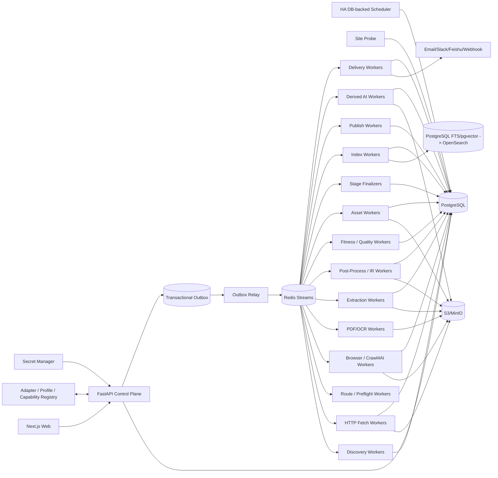

# 博客知识库技术方案

适用范围：从约 1000 个技术博客、工程博客、技术文档站、Newsletter、CMS 站点抓取尽可能完整的历史文章，清洗为稳定 Markdown 建设长期知识库；后续持续增加站点，支持增量同步、Web 管理、版本保留、搜索、离线重处理、质量审计、图片/附件归档和 AI 派生能力。容量按百万级文档、数百万到千万级 URL、站点高度异构和长期运行设计。

## 1. 建设目标

1. 输入站点根地址、博客入口、文档入口或 Feed 后，自动探测 Sitemap、RSS/Atom/JSON Feed、公开 API、归档页、分类/标签/作者页、文档导航树、普通站内链接和动态列表。
2. 支持 `FULL_BACKFILL` 历史全量回灌、`INCREMENTAL` 持续增量、`RECONCILE` 周期覆盖校准、`TARGETED_FETCH` 精确补抓、`REPROCESS` 离线重处理和 `ASSET_REPAIR` 资产修复。
3. 历史完整性必须有 Provider 级覆盖证据，不能用“队列空了”“达到 max_depth/max_pages”代替。
4. 默认 HTTP-first；只有存在明确动态渲染证据时才升级 Crawl4AI/Playwright Browser。
5. Discovery URL Rule、Discovery Fetch Route、Article Fetch Route、Extraction Profile、Post-Processor、Quality Policy 独立版本化，避免把“如何发现”“如何访问”“如何抽取”“如何清洗”“是否接受”耦合在一起。
6. 支持 Sitemap lastmod、Feed GUID、API cursor、ETag、Last-Modified、body hash、Document IR hash、重叠时间窗和周期 Reconcile 驱动增量同步。
7. 最终知识对象保存标题、作者、发布时间、更新时间、标签、canonical、正文、代码块、表格、图片、附件、真实链接关系、来源 Snapshot、字段 provenance 和完整 lineage。
8. 支持 durable frontier、断点续跑、幂等、lease、heartbeat、重试、限流、熔断、公平调度、backpressure 和 dead-letter。
9. 保存不可变网络 Snapshot、渲染 DOM、清洗 HTML、Extraction Candidate、字段转换轨迹、Canonical Document IR、最终 Markdown、规则版本和质量结果；规则升级优先离线 replay。
10. 图片和附件走独立 Asset Pipeline，支持安全校验、hash 去重、对象存储、引用关系、独立重试和 Markdown URL 重写。
11. Web 管理端覆盖站点接入、Provider 覆盖、任务控制、Discovery Evidence、URL/文档诊断、版本 diff、抽取转换链、质量审核、漂移告警、资产状态、搜索、成本、Schedule、AI Workflow、Delivery 和审计。
12. 摘要、Embedding、聚类、趋势分析、Digest、Newsletter、报告和通知都是 Accepted Document Version 的异步下游，失败不能阻塞源站同步。

## 2. 核心原则

1. **PostgreSQL 是业务状态真相源；S3/MinIO 是不可变大对象真相源。**
2. Redis Streams 只承担任务运输；决定性状态先写 PostgreSQL，再通过 Transactional Outbox 投递。
3. Source Adapter、Discovery、Admission、Fetch、Extraction、Post-Process、Quality、Asset、Publish、Derived AI、Delivery 分层。
4. Discovery 只产生 URL candidate 和 evidence；列表页、搜索页、Feed 摘要不能直接成为最终正文。
5. URL Identity 与 Document Identity 分离；redirect、canonical、slug rename、镜像、站点迁移都只是 identity evidence。
6. Identity 与 Freshness 分离；“URL 已知”不代表“内容仍新鲜”。
7. **Discovery Rule 与 Extraction Profile 分离。** URL path pattern 往往比列表 DOM 稳定，不能把文章发现与正文 selector 绑成一套模板。
8. **Discovery Fetch Route 与 Article Fetch Route 分离。** 动态归档页需要 Browser，不代表文章详情页也必须 Browser；反之亦然。
9. HTTP、Browser、PDF/OCR 分层路由；Browser 是昂贵升级路径，生产中复用长期 runtime。
10. Crawl4AI `result.links`、CSS/JSON Schema、`arun_many`/Dispatcher 是 Worker 内执行能力，不承担历史完整性、持久调度和业务最终状态。
11. HTTP 200、Browser success、`result.success`、Extractor 无异常都不是业务成功证据。
12. 所有阶段有结构化 Outcome Contract；`EMPTY/INVALID/AMBIGUOUS/RETRYABLE_ERROR` 不能被空字符串、空数组或宽泛异常吞掉。
13. 阶段完成由 Finalizer 对任务、Artifact、质量结果和 Provider ACK 对账，不由协程结束决定。
14. Crawl4AI Markdown/cleaned HTML 只是 Extraction Candidate；最终知识真相是 Accepted Canonical Document IR。
15. `document_version` append-only，不原地覆盖历史版本。
16. Markdown、搜索索引、Embedding、摘要、报告和外部知识库都是 IR 的 Projection，可重建。
17. 文件路径只属于发布视图，不能承担 document identity，也不能用“文件存在”判断已同步。
18. `max_depth/max_pages/max_runtime` 只是单次预算，不能作为历史完整性证明。
19. 关键词相关性、用户偏好和 AI 评分只影响优先级或下游选择，不能静默裁掉 FULL_BACKFILL 的合法历史内容。
20. 抓取时间不能伪装成发布时间；未知发布时间保持 NULL，并保留字段来源与置信度。
21. Scheduler、FastAPI BackgroundTasks、`asyncio.create_task()`、进程内列表/队列/全局变量都是可丢失运行时状态，不能承担业务真相。
22. Config 使用版本化 Release；Secret 使用 Vault/云 Secret Manager，仅保存引用。
23. 通知/邮件是独立 Delivery Plane；投递失败不能回滚已 Accepted 文档或已生成报告。
24. 人工操作使用 append-only Audit/Event；人工纠错通过 Override/Evidence 追加，不能抹掉机器历史。
25. 遵守 robots、版权、访问控制、站点政策和合理速率；验证码、登录、付费墙、WAF 挑战进入显式策略流程，不自动绕过。

## 3. 总体架构



职责：

- **Control Plane**：站点、配置 Release、Run、Schedule、人工命令、权限、审计。
- **Site Probe**：探测站点能力并生成待审核 Profile。
- **Discovery**：枚举候选 URL、Provider checkpoint、链接证据和覆盖证据。
- **Admission**：URL 规范化、Scope、Discovery URL Rule、robots、crawler trap、Content-Type 和网络安全检查。
- **Fetch**：条件请求、Browser 升级、PDF/OCR、不可变 Snapshot。
- **Extraction**：按页面类型和 Extraction Profile 生成一个或多个 Raw Candidate。
- **Post-Process / IR**：字段契约校验、清洗、时间解析、URL/媒体归一化、fallback 和 Canonical Document IR 构建。
- **Quality/Drift**：防空抓、错抓、模板漂移、字段污染和 fallback 激增。
- **Asset**：图片/附件下载、hash 去重、S3 归档、引用维护。
- **Finalizer**：按 Outcome Contract 对账真实阶段成功。
- **Index/Publish**：搜索索引、Markdown 文件树、Git/外部 KB Projection。
- **Derived AI**：版本化摘要、聚类、Digest、Newsletter 和报告 DAG。
- **Delivery**：独立的幂等投递、Provider ACK、重试和 dead-letter。

## 4. Crawl Mode 与 Run 语义

```text
FULL_BACKFILL     首次历史全量回灌
INCREMENTAL       持续同步新增和更新
RECONCILE         周期重新枚举，修复断档
TARGETED_FETCH    精确 URL 抓取、调试或补抓
REPROCESS         不访问源站，基于已有 Snapshot/Candidate 重抽取、后处理、质量、索引和发布
ASSET_REPAIR      仅补齐失败或缺失图片/附件
```

规则：

- 同站点默认只允许一个 active FULL_BACKFILL；
- INCREMENTAL 与 Index/AI/Publish/Asset 可并行，但同一 URL 的网络请求和版本写入通过幂等键去重；
- TARGETED_FETCH 必须逐项返回真实结果，不能只返回“任务已启动”；
- REPROCESS 必须记录 `source_snapshot_id`、Extraction Profile Release、Post-Processor Release Chain 和完整 lineage；
- ASSET_REPAIR 不重新生成 Document Identity，只修复对应版本的 Asset Reference；
- Run 完成由 Stage Finalizer 判断，不由 Worker 函数结束判断。

## 5. 核心数据模型

至少包含：

```text
site
site_profile_release
system_config_release
source_adapter_release
adapter_binding_release
discovery_provider_release
url_admission_rule_release
site_extraction_profile_release
post_processor_release
quality_policy_release
discovery_checkpoint
coverage_ledger
discovery_link_evidence
crawl_run
run_stage
stage_execution
stage_evidence
url_identity
url_observation
frontier_task
fetch_snapshot
artifact
extraction_candidate
field_transform_trace
document
document_identity_evidence
document_version
metadata_evidence
quality_result
drift_event
asset
asset_source
asset_reference
asset_task
outbox_event
schedule
command
ai_workflow_release
ai_stage_release
ai_run
ai_stage_execution
selection_manifest
publish_manifest
delivery
delivery_attempt
secret_binding
audit_event
```

关键唯一约束：

```text
UNIQUE(url_identity.normalized_url_hash)
UNIQUE(frontier_task.idempotency_key)
UNIQUE(document_version.document_id, content_hash)
UNIQUE(asset.sha256)
UNIQUE(asset_task.idempotency_key)
UNIQUE(delivery.idempotency_key)
UNIQUE(command.idempotency_key)
```

大对象内容全部存 S3/MinIO；PostgreSQL 保存状态、hash、metadata、索引键和 lineage。大表如 `url_observation/frontier_task/fetch_snapshot/discovery_link_evidence/audit_event` 按时间或 site hash 分区。

## 6. 新站点接入与可扩展配置

### 6.1 Site Probe

新增站点后自动检测：

1. 根 URL/博客入口可达性；
2. robots.txt；
3. sitemap.xml、sitemap index 和常见变体；
4. RSS/Atom/JSON Feed autodiscovery；
5. HTML `link rel=alternate`；
6. CMS/平台：WordPress、Ghost、Substack、Hugo、Jekyll、Docusaurus、MkDocs、Medium 等；
7. 归档、分类、标签、作者和分页模式；
8. 常见 article URL pattern；
9. Discovery 页是否依赖 JS；
10. Article 页是否依赖 JS；
11. canonical、语言、站点迁移规则；
12. 文章页 DOM/template fingerprint；
13. 推荐 Provider、Discovery Route、Admission Rule、Article Fetch Route、Extraction Profile、Post-Processor 和 Crawl Scope。

Probe 结果生成待审核 `site_profile_release`，审核通过后才用于生产 Run。

### 6.2 Source Adapter SDK

绝大多数站点通过“通用 Provider + 配置”接入，只有特殊平台才写 Adapter。

```python
class SourceAdapter(Protocol):
    async def discover(self, ctx) -> AsyncIterator[DiscoveryRecord]: ...
    async def checkpoint(self) -> AdapterCheckpoint: ...
```

统一 `DiscoveryRecord`：

```text
source_url
source_item_id
canonical_hint
title_hint
published_at_hint
updated_at_hint
cursor/page_token
content_type_hint
fetch_route_hint
discovery_evidence
raw_metadata_ref
```

生产 Registry 使用显式 Manifest/Release，声明版本、配置 schema、能力、历史覆盖语义、checkpoint 语义、速率提示、允许域名、运行镜像 digest、健康检查和 Golden Fixture。

### 6.3 Discovery Provider Release 与 Fetch Route

每个 Provider 独立声明发现方式和访问路径，例如：

```text
provider_type = SITEMAP | FEED | API | ARCHIVE | HTML_LINKS | BROWSER_LISTING
fetch_route = HTTP | BROWSER | API
entrypoints[]
pagination/cursor rules
coverage semantics
checkpoint semantics
rate policy
```

一个站点可以出现：

```text
Archive Discovery = Browser
Article Fetch      = HTTP
```

也可以：

```text
Feed Discovery     = HTTP
Article Fetch      = Browser
```

禁止用单一 `site.browser_required=true/false` 覆盖整个站点。

### 6.4 URL Admission Rule Release

发现 URL 与正文抽取规则独立。URL Rule 只回答“这个 URL 是否应进入 Frontier/属于什么页面类型候选”：

```text
site_id
version
include_patterns[]
exclude_patterns[]
canonicalization_rules[]
page_type_hints[]
priority_rules[]
status
```

URL path pattern 可以优先使用，因为它通常比列表页卡片 DOM 稳定；但 URL Pattern 只能作为分类/准入证据，不能直接证明页面是合法文章。

### 6.5 Site Extraction Profile Release

正文模板使用独立版本：

```text
id
site_id
version
page_type
url_matcher
required_dom_signals[]
article_fetch_route_override
extraction_candidates[]
field_contracts[]
post_processor_chain[]
fallback_order
max_candidate_items
quality_policy_release_id
golden_fixture_ids[]
status
```

一个站点允许并存多个模板：current article、legacy article、docs、author page、特殊专题等。更新 selector 不需要修改 Discovery Adapter。

### 6.6 Field Contract

Crawl4AI CSS Schema、XPath、Trafilatura 或 API 只负责执行层取值；平台 Field Contract 负责业务语义：

```text
field_name
required
cardinality = zero_or_one | one | many
source_candidates[]
normalizers[]
fallback_sources[]
validation_rules[]
confidence_policy
```

示例：

```yaml
- name: published_at
  required: false
  cardinality: zero_or_one
  source_candidates:
    - css: ".article-info #news-time"
    - json_ld: "datePublished"
    - meta: "article:published_time"
  normalizers:
    - trim
    - parse_datetime
  fallback_sources:
    - feed.published_at_hint
```

这样未来替换 Crawl4AI、改 selector 或改为 API 数据时，不会改变 Document IR 的字段语义。

## 7. Discovery 与历史覆盖证明

### 7.1 Provider 类型

```text
Sitemap / Sitemap Index
RSS / Atom / JSON Feed
CMS / Public API
Archive / Pagination
Category / Tag / Author
DOC_NAVIGATION
HTML Frontier / result.links
Browser Dynamic Listing
Aggregator / Search API（仅辅助发现）
```

任何 Provider 都只产生 URL candidate，不直接创建 Accepted Document。

### 7.2 Coverage Ledger

每个 FULL_BACKFILL 对每个 Provider 记录：

```text
provider_release_id
provider_scope
started_at/finished_at
checkpoint_start/checkpoint_end
pages_scanned/items_seen
new_urls/known_urls/rejected_urls
terminal_reason
coverage_evidence_artifact_id
error_summary
```

`terminal_reason` 至少区分：

```text
EXHAUSTED
CURSOR_END
POLICY_BLOCKED
BUDGET_EXHAUSTED
ERROR
CANCELLED
```

只有真正 `EXHAUSTED/CURSOR_END` 或有明确边界证据的 Provider 才能贡献“已穷举”结论。`BUDGET_EXHAUSTED` 只能说明本次预算耗尽，不能宣称历史抓全。

### 7.3 链接图发现与 Link Evidence

Crawl4AI/HTML Parser 提取的 internal/external links 作为 Discovery Evidence：

```text
Entry/Archive Page
  -> links[]
  -> resolve relative URL
  -> normalize
  -> URL Admission Rule Release
  -> page_type_hint
  -> Durable Frontier
```

对每一条有业务意义的链接保存：

```text
source_page_snapshot_id
raw_href
normalized_href
anchor_text
anchor_title
context
link_scope = internal | external
provider_release_id
admission_decision
admission_reason
admission_rule_release_id
created_at
```

这样 Web 管理端可以回答：

- 某 URL 从哪个入口页发现；
- 原始 href 是什么；
- 相对链接如何解析；
- 哪条规则让它进入或拒绝 Frontier；
- 为什么被判定为 ARTICLE/DOC 等候选。

优先将列表 DOM 与 URL 分类解耦。即使列表卡片 CSS 改版，只要真实链接仍存在并满足稳定 URL pattern，发现链路仍有机会工作。

### 7.4 两阶段抓取

```text
Feed/Sitemap/Archive/Listing/Search
  -> DiscoveryRecord / Link Evidence
  -> URL Identity + Admission
  -> Durable Frontier
  -> Origin Article Fetch
  -> Snapshot
  -> Extraction
```

Feed 摘要、搜索摘要和列表页卡片只作为 hint/evidence。

## 8. URL Admission、Identity 与网络安全

URL 在真正网络访问前依次经过：

```text
resolve relative URL
 -> normalize
 -> scheme/host/port policy
 -> crawl scope release
 -> URL admission rule
 -> canonicalization rules
 -> robots policy
 -> crawler-trap detection
 -> file/content-type hints
 -> DNS/IP/redirect egress validation
 -> durable frontier
```

规范化至少处理：

```text
fragment 去除
tracking query 清理
http/https 与 host alias 规则
www/non-www
大小写策略
locale 变体
AMP/mobile 变体
redirect/canonical evidence
```

需要过滤或降权：日历无限翻页、session 参数、排序参数组合、站内搜索、登录/购物车、无限 faceted navigation 等。

网络层必须防 SSRF：解析 DNS 后再次校验目标 IP；每次 redirect 都重新检查 scheme、host、port 和地址范围。图片/附件 Asset Fetch 复用同一套安全策略。

## 9. Durable Frontier、调度与并发

任务状态：

```text
PENDING -> LEASED -> RUNNING -> SUCCEEDED
                       |-> RETRY_WAIT
                       |-> DEAD_LETTER
                       |-> CANCELLED
```

每个任务至少保存：

```text
idempotency_key
site_id/domain_key
run_id/stage
priority
attempt/max_attempts
available_at
lease_owner/lease_until
heartbeat_at
error_code
```

三层并发：

- 全局 Worker 并发；
- site/domain quota，默认每域 1~4，并根据 429/503/延迟自适应；
- Browser/PDF/OCR/Asset/LLM route quota。

使用 weighted fair scheduling 防止大站点长期占满资源。Redis/S3/目标站变慢时通过 backpressure 降低租约速度。

禁止把百万 URL 一次性 `asyncio.gather()` 或一次性塞给 `arun_many()`。正确方式是从 durable frontier lease 一小批任务后，在单 Worker 内使用流式批处理。

### 9.1 Crawl4AI Worker 内微批处理

Browser Worker 可使用：

```text
lease 20~100 durable tasks
  -> CrawlerRunConfig(stream=True)
  -> arun_many(..., dispatcher=bounded_dispatcher)
  -> 每完成一个 result 立即持久化 Snapshot + Outcome
  -> 对应 frontier task 单独 ACK
```

Crawl4AI Dispatcher/RateLimiter 负责 **当前 Worker 内** 的内存、浏览器并发和局部退避；PostgreSQL lease、site/domain quota 和 Scheduler 负责 **跨 Worker** 的恢复、全局礼貌速率和业务幂等。二者不能混淆。

## 10. Fetch Decision Router 与 Snapshot

### 10.1 HTTP-first

HTTP Worker 记录：

```text
request URL/final URL
If-None-Match/If-Modified-Since
redirect chain
status/content-type
response headers
fetched_at
body hash
network timings
```

304 只更新 freshness observation，不创建新的正文版本。

### 10.2 Browser 升级证据

出现以下情况才升级 Browser/Crawl4AI：

- 初始 HTML 几乎无正文但存在 SPA hydration/script data；
- 列表必须滚动/点击加载；
- 关键 DOM 仅 JS 执行后出现；
- HTTP 结果与已知 Golden Pattern 差异异常；
- Discovery Provider 或 Extraction Profile 明确要求 Browser。

Browser runtime 长期复用，按 domain/context 策略隔离，不为每个 URL 重建浏览器进程。

### 10.3 URL-specific Crawl4AI Config Routing

同一 Browser Worker 可根据 Profile 使用多个 `CrawlerRunConfig`：

```text
*.pdf             -> PDF/专用 route
*/article/*       -> article config
*/docs/*          -> docs config
动态页面           -> JS/wait_for config
fallback          -> generic config
```

配置必须来自版本化 Profile，避免 Worker 硬编码。匹配规则要有确定顺序和默认 fallback，并通过 Fixture 测试。

### 10.4 不可变 Snapshot

每次有效网络结果保存：

```text
request fingerprint
request_url/final_url
response_status/headers
fetched_at
body_hash
artifact_id
route=HTTP|BROWSER|PDF
runtime_release_id
```

Browser 可额外保存 rendered DOM、必要 trace/screenshot（按策略）。Extractor、Post-Processor 或清洗规则升级优先 REPROCESS Snapshot，而不是重新访问源站。

## 11. Extraction、Post-Process、Canonical IR 与 Markdown

### 11.1 Candidate Sources

```text
站点 CSS/JSON Schema
Trafilatura / rs-trafilatura
Crawl4AI cleaned HTML / Markdown
CSS/XPath selector
JSON-LD / OpenGraph / meta
CMS/API structured content
PDF text / OCR
```

多个 Candidate 允许并存，质量策略择优；禁止“第一个 selector 有结果就接受”。

### 11.2 CSS/JSON Schema Profile

对重复页面模板，站点级 CSS Schema 是高性能低成本主路径：

```text
baseSelector
fields:
  title
  author
  published_at
  content(html)
  images[]
  original/canonical hints
```

Schema 必须属于 `site_extraction_profile_release`，并设置：

- required fields；
- baseSelector 允许匹配数量；
- 字段 cardinality；
- fallback schema 顺序；
- Golden Fixture；
- Quality Policy；
- Drift 监控。

`baseSelector=0`、意外多匹配、required field 大量缺失都不能静默成功。

### 11.3 `extracted_content` 结构化校验

对于 Crawl4AI `JsonCssExtractionStrategy` 等结构化结果，禁止：

```python
item = json.loads(result.extracted_content)[0]
```

这种无条件取第一项的写法。

生产流程必须：

```text
raw extracted_content
 -> JSON decode
 -> root type validation
 -> item_count validation
 -> baseSelector cardinality validation
 -> required field validation
 -> field contract validation
 -> Raw Candidate
```

结果至少区分：

```text
VALID
EMPTY
INVALID_JSON
INVALID_TYPE
AMBIGUOUS_CARDINALITY
REQUIRED_FIELD_MISSING
```

原始 `extracted_content` 作为 Artifact 保留，便于诊断和 REPROCESS。

### 11.4 Page Type 预检

URL Pattern 命中不代表一定是文章。Extraction 前判断：

```text
ARTICLE
DOC
LISTING
VIDEO
GALLERY
LOGIN
PAYWALL
CHALLENGE
ERROR_PAGE
UNKNOWN
```

页面类型可综合 URL hint、DOM signal、metadata 和 lightweight classifier。URL `/a/*`、`/post/*` 等只能形成 hint，不能绕过页面类型与质量门禁。

### 11.5 Versioned Post-Processor

Schema/Extractor 输出不是最终知识对象，必须经过版本化的确定性处理链。

`post_processor_release` 至少保存：

```text
id
version
processor_type
config
input_contract
output_contract
code/runtime_digest
status
```

常见处理器：

```text
HtmlCleaner
WhitespaceNormalizer
DateParser
AuthorNormalizer
CanonicalUrlResolver
RelativeLinkResolver
MediaUrlResolver
TagNormalizer
LanguageNormalizer
BoilerplateSanitizer
```

一条 Extraction Profile 可以声明：

```text
CSS Candidate
 -> HtmlCleaner@v3
 -> RelativeLinkResolver@v2
 -> DateParser@v4
 -> AuthorFallbackPolicy@v2
 -> MediaUrlResolver@v3
 -> IRBuilder@v5
```

每一步记录 `field_transform_trace`：

```text
field_name
input_value/ref
processor_release_id
output_value/ref
reason
confidence_delta
status
```

这样 Web 管理端可以看到“原值 -> 哪个 processor -> 新值”，并能在 Processor 升级后对已有 Snapshot/Raw Candidate 做 REPROCESS。

### 11.6 Metadata Provenance

每个关键字段保存：

```text
value
source_type = JSON_LD | META | FEED | API | CSS | HTML | FALLBACK | MANUAL
source_artifact_id
extractor_release_id
post_processor_release_id
confidence
```

时间字段明确区分：

```text
observed_at
fetched_at
published_at
updated_at
published_at_hint
```

无法确认 `published_at` 时为 NULL。作者等字段允许 fallback，但必须降低 confidence 并保留来源，不能把 fallback 值伪装成权威字段。

### 11.7 Canonical Document IR

```text
document_id/version_id
canonical_url
title/subtitle
authors[]
published_at/updated_at
language
tags[]
summary
blocks[]
links[]
images[]
attachments[]
source_snapshot_id
metadata_provenance
transform_lineage
content_hash
```

`blocks[]` 保留 heading、paragraph、code、table、quote、list、image、math 等结构。

### 11.8 HTML -> IR -> Markdown

站点 Schema 中正文优先抽为 HTML/结构化 DOM，而不是直接把 Markdown 当唯一事实：

```text
Snapshot HTML
 -> Extraction Candidate HTML
 -> Versioned Post-Process
 -> Canonical Document IR
 -> Markdown Projection
```

这样规则升级时可以重新修复相对链接、图片、代码块、表格和脚注。

### 11.9 Markdown Projection

最终 Markdown 由 IR 渲染并带 front matter：

```yaml
---
document_id: ...
source_url: ...
canonical_url: ...
title: ...
authors: [...]
published_at: ...
updated_at: ...
fetched_at: ...
version_id: ...
content_hash: ...
---
```

建议发布路径：

```text
knowledge/<site_slug>/<yyyy>/<mm>/<slug>--<document_id>.md
```

路径变化不影响 Document Identity。

## 12. Asset Pipeline：图片与附件

图片、附件不能由正文 Worker 直接按远端 URL 路径散落到本地文件系统，应成为独立可恢复流水线。

### 12.1 数据模型

```text
asset
- sha256
- mime_type
- size
- width/height
- object_key

asset_source
- original_url
- resolved_url
- final_url
- fetched_at
- response_status
- response_headers
- artifact_id

asset_reference
- document_version_id
- asset_id
- role=image|cover|attachment
- original_url
- alt
- ordinal

asset_task
- idempotency_key
- source_url
- document_version_id
- state/lease/retry
```

### 12.2 Media URL Resolver

媒体 URL 不能只处理 `//cdn/...`，统一以文章 `final_url` 为 base：

```text
raw src/srcset/data-src/data-original
 -> trim/decode
 -> lazy-load/source selection
 -> srcset candidate selection
 -> urljoin(final_url, raw_url)
 -> normalize scheme/host/path
 -> policy check
 -> Asset Task
```

至少覆盖：

```text
//cdn.example.com/a.jpg        protocol-relative
/images/a.jpg                  root-relative
../images/a.jpg                path-relative
https://.../a.jpg              absolute
srcset                         responsive image
data-src/data-original         lazy load
```

### 12.3 下载链路

```text
IR image/attachment ref
 -> Asset Task
 -> URL Admission + SSRF/redirect check
 -> bounded HTTP fetch
 -> status/MIME/size/magic-bytes validation
 -> sha256
 -> content-addressed S3/MinIO object
 -> asset + source + reference
 -> Markdown renderer rewrite URL
```

推荐对象键：

```text
assets/sha256/ab/cd/<sha256>.<ext>
```

相同 hash 只保存一次。图片失败可单独重试，不回滚已经 Accepted 的正文版本。

### 12.4 Asset 约束

- per-domain 并发和限速；
- connect/read/total timeout；
- 最大文件大小；
- MIME 与 magic bytes 双校验；
- query 不直接决定本地文件名；
- redirect 后再次做安全检查；
- 下载失败记录 terminal/retryable 原因；
- 外链资产是否归档由站点/版权策略控制。

## 13. 增量同步、Freshness 与删除语义

按站点能力组合：

1. RSS/Atom GUID + pubDate；
2. Sitemap lastmod；
3. API cursor/page token；
4. ETag/Last-Modified；
5. body hash；
6. Document IR hash；
7. Archive 最新页重叠扫描；
8. 周期 RECONCILE。

每个 Provider 独立 checkpoint，成功提交后才推进；失败不能越过未完成区间。

调度建议：

- 高频更新站：15~60 分钟 Feed/API；
- 普通博客：2~12 小时；
- 周更/低频：每日；
- 全站 RECONCILE：每周或每月；
- 历史归档页低频重扫。

使用 overlap window 处理 Feed 延迟、补发、时间修正和最终一致性。

404/410 不立即删除历史文档：先记录 availability observation，经多次确认或 Provider 明确删除事件后标记 `source_unavailable`；历史 Accepted Version 继续保留。

## 14. Stage Outcome Contract、Quality 与 Drift

### 14.1 结构化 Outcome

任何 Stage 都返回并持久化结构化事实：

```text
status = SUCCEEDED | EMPTY | INVALID | AMBIGUOUS | RETRYABLE_ERROR | TERMINAL_ERROR | CANCELLED
produced_artifact_ids[]
input_refs[]
counters
provider_ack_ids[]
error_code
retryable
started_at/finished_at
```

禁止通过 `return ""`、`return []`、`result.success=true` 或“没有抛异常”表示业务成功。

### 14.2 Stage Finalizer

Finalizer 必须对账：

- 该阶段应完成的 durable task 数；
- retry/dead-letter 是否还有未决项；
- 必需 Artifact 是否存在且 hash 匹配；
- Extraction/Post-Process/Quality 是否产生合法结果；
- Asset 必需项是否完成或明确降级；
- 发布/投递阶段是否存在 provider ACK；
- Coverage Provider 是否达到合法 terminal reason。

只有满足阶段 Success Contract 才写 `run_stage=SUCCEEDED`。

### 14.3 Content Fitness Gate

至少检查：

- 正文非空；
- title/body 一致性；
- boilerplate/link density；
- 代码块、表格、链接保留度；
- 页面类型；
- login/paywall/challenge；
- 重复正文；
- 字符集和语言；
- metadata 完整度；
- baseSelector/candidate 匹配数量；
- required field 命中率；
- field transform 异常率。

短 FAQ/API reference 不因固定字数自动失败；阈值只是评分信号。

### 14.4 Extraction Drift Sentinel

监控：

```text
正文长度分布
baseSelector match count
candidate item count
required_field_hit_rate
selector 命中率
title/body 空值率
published_at parse success rate
image count distribution
profile fallback rate
post_processor_error_rate
field source distribution
link density
DOM/template fingerprint
accepted/rejected 比例
Golden Sample diff
```

主 Schema fallback rate 突然升高、required field 命中率下降、candidate item count 由 1 变成多项或模板 fingerprint 变化时创建 drift event。疑似漂移时暂停该 Profile Release 的自动接受，可回退上一 Release 或进入人工审核。

## 15. Web Control Plane

推荐 Next.js + FastAPI。长任务全部命令化：

```text
POST /runs
  -> PostgreSQL transaction: command + crawl_run + outbox
  -> 返回 run_id

GET /runs/{id}
  -> 从数据库读取真实状态
```

禁止在 API 请求里用 BackgroundTasks/`asyncio.create_task()` 承担持久任务。

核心页面：

1. 站点列表与接入向导；
2. Site Probe/Capability；
3. Adapter/Provider/URL Rule/Extraction Profile/Post-Processor/Quality Policy Release；
4. FULL_BACKFILL/INCREMENTAL/RECONCILE/REPROCESS Run；
5. Provider Coverage Ledger；
6. Discovery Evidence 诊断：来源 Snapshot -> `result.links`/href -> normalize -> rule -> Frontier；
7. URL/Document Identity 诊断；
8. Snapshot、Raw Candidate、IR、Markdown diff；
9. Extraction Transform 诊断：raw fields -> Field Contract -> Post-Process Trace -> Candidate -> Quality -> IR；
10. Extraction Profile Fixture 与 selector 调试；
11. Quality/Drift 审核；
12. Asset 状态、失败图片/附件和 ASSET_REPAIR；
13. Retry/Dead-letter；
14. Schedule；
15. 搜索与文档版本；
16. AI Workflow/Digest/Report；
17. Delivery/通知；
18. 成本、错误率、freshness、覆盖率；
19. Audit Log。

健康接口：

```text
/health/live        进程存活
/health/ready       PG/Redis/S3 等核心依赖
/health/components  Browser/Search/LLM/Email 等能力矩阵
```

## 16. 持久化 Schedule、Config 与 Secret

### 16.1 Schedule

```text
schedule_id
site_id/workflow_id
cron/timezone
mode
misfire_policy
next_run_at
last_run_at
release/version
status
```

HA Scheduler 通过 advisory lock/leader lease 扫描 due schedule，并创建幂等 command/run。

Misfire：

```text
SKIP
CATCH_UP_ONCE
CATCH_UP_ALL
```

### 16.2 Config Release

站点抓取参数、Discovery Provider/Route、Discovery Rule、Article Route、Extraction Profile、Field Contract、Post-Processor、Quality、Asset Policy、AI Workflow 都采用不可变 Release；一个 Run 固定记录实际使用的 Release ID。配置修改先生成新 Release，再审核/发布，支持回滚。

### 16.3 Secret

DB 只保存：

```text
secret_binding_id
provider
secret_ref
scope
rotation_metadata
```

明文凭据由 Vault/KMS/云 Secret Manager 管理。Browser 登录态、API key、邮件 OAuth token 按 tenant/site/channel 隔离。

## 17. Versioned Derived AI Workflow

AI 是 Accepted Document Version 的异步下游。

Workflow 类型：

```text
DOCUMENT_SUMMARY
TOPIC_CLUSTER
FACTUAL_DIGEST
EDITORIAL_DIGEST
TECH_TREND_REPORT
SITE_CHANGE_REPORT
```

典型 DAG：

```text
Candidate Selection
  -> Research
  -> Analysis
  -> Optional Opinion
  -> Editor
  -> Citation/Quality Check
  -> Publish/Delivery
```

`Opinion` 必须可选，事实型 Digest 默认关闭。

每个 `ai_stage_execution` 保存：

```text
workflow_release_id
stage_release_id
input_document_version_ids
input_artifact_ids
prompt_release_id
model/provider release
structured_schema_release_id
status/retry_count
started_at/finished_at
token_usage/cost
output_artifact_id
error_code
```

中间结果持久化，支持阶段级重试和 checkpoint 恢复。

Research 优先输出结构化事实和 citation binding，Analysis/Editor 不能只消费已经丢失来源的自由文本摘要。

### 17.1 Selection Manifest

Digest/Newsletter 先生成确定性 Manifest：

```text
candidate_document_version_ids
window_start/window_end
filters
scores
cluster_ids
MMR/diversity parameters
selected_ids
excluded_reason
selection_release_id
```

关键词、Embedding、时间衰减、站点权重和用户偏好只作用于下游选择层。

## 18. 独立 Delivery Plane

Delivery 与内容生成分离。Newsletter/报告生成成功不代表邮件发送成功。

状态：

```text
PENDING -> LEASED -> SENDING -> SENT
                         |-> RETRY_WAIT
                         |-> DEAD_LETTER
                         |-> CANCELLED
```

`delivery` 至少保存：

```text
workflow_run_id
content_artifact_id
audience_id
channel
window_start/window_end
idempotency_key
status
provider_message_id
sent_at
```

只有 provider ACK 已持久化时才能进入 `SENT`；“调用函数正常返回”不能增加发送成功计数。

渠道使用 `DeliveryAdapter`，如 Gmail、SMTP、Slack、飞书、Webhook。凭据只通过 secret_ref 注入。

## 19. 搜索、索引与发布

### 19.1 搜索

第一阶段使用 PostgreSQL FTS + pgvector；规模和复杂度提高后切 OpenSearch。

索引字段：

```text
title/body/code/tags/authors/site/published_at/language
embedding
document_version_id
accepted_at
```

搜索索引是 Projection，可从 Accepted IR 重建。

### 19.2 Publish Manifest

Markdown/Git/外部 KB 发布生成：

```text
publish_release_id
document_version_id
target
path/object_key
render_hash
published_at
```

Git 发布按站点/日期分批，避免单次百万文件提交。Markdown 中的图片和附件 URL 由 Asset Reference 渲染，不直接依赖源站链接。

## 20. Retention、版本与 GC

长期保留：

- Accepted Document Version；
- 对应 source Snapshot；
- Canonical IR；
- 被 Accepted Version 引用的 Asset；
- 必要的 Provider/Coverage/Link Evidence；
- 关键 Raw Candidate 与 transform lineage；
- Audit。

可按策略回收：

- 临时 browser trace；
- 重复 body 的冗余 Artifact；
- 可由已有 Snapshot 重建的非必要候选；
- 超期调试日志。

GC 必须做引用检查，不能按固定 TTL 删除仍被 Document Version、Asset Reference、AI Report、Publish Manifest 或 Audit 引用的对象。

## 21. 可观测性

核心指标：

```text
site freshness lag
provider coverage / terminal reason
new/changed/304 rate
fetch p50/p95/p99
HTTP status/challenge rate
browser escalation rate
discovery link accept/reject rate
extract success/empty/invalid/ambiguous/reject
candidate item count
required field hit rate
profile fallback rate
post_processor error rate
quality score
selector/template drift
asset success/retry/dead-letter/dedupe ratio
queue lag/lease timeout
retry/dead-letter
S3/PG/Redis latency
AI token/cost/error
Delivery sent/retry/dead-letter
Stage finalization mismatch
```

所有 Run/Task/Snapshot/Link Evidence/Artifact/Document Version/Asset/AI Stage/Delivery 使用统一 correlation IDs。

## 22. 安全、合规与运行隔离

- Secret 使用 Vault/云 Secret Manager/KMS；
- 日志和 Artifact metadata 默认脱敏；
- Browser context 默认无持久登录态；
- Egress Gateway 做 DNS/IP/端口/redirect 校验；
- Asset Fetch 同样执行 SSRF 和 MIME/size 安全校验；
- 站点凭据按 tenant/site 隔离；
- 管理操作 RBAC + audit；
- 外部项目/库在源码复用前做 license 检查；
- 遵守 robots、版权、站点条款和合理速率。

## 23. 推荐技术栈

```text
Web:            Next.js
API:            FastAPI
State DB:       PostgreSQL
Task Transport: Redis Streams
Object Store:   S3 / MinIO
HTTP:           httpx/aiohttp
Browser:        Crawl4AI + Playwright
Extraction:     Crawl4AI JsonCssExtractionStrategy + Trafilatura/rs-trafilatura + custom selectors
Post-Process:   versioned Python/Rust processors + deterministic contracts
PDF:            PyMuPDF/pdfplumber + OCR fallback
Search:         PostgreSQL FTS + pgvector，后期 OpenSearch
Scheduler:      DB-backed HA Scheduler 或成熟持久化调度器
Secrets:        Vault / Cloud Secret Manager / KMS
Observability:  OpenTelemetry + Prometheus + Grafana + Loki
Deployment:     Docker/Kubernetes
```

## 24. 部署拓扑

```text
2+ API replicas
2 Scheduler replicas（leader lease）
N Discovery/HTTP Workers
独立 Browser/Crawl4AI Pool
独立 PDF/OCR Pool
独立 Extraction/Post-Process/Quality Pool
独立 Asset Pool
独立 Index/Publish Pool
独立 Derived AI Pool
独立 Delivery Pool
PostgreSQL HA
Redis HA
S3/MinIO
Observability Stack
Secret Manager
```

Browser、Asset、LLM、OCR、Delivery 和普通 HTTP Worker 资源隔离，避免昂贵或外部依赖任务拖垮抓取主链路。

## 25. 实施阶段

### Phase 1：可用 MVP

- Site 管理；
- Sitemap/RSS/Archive/HTML links Discovery；
- URL Admission Rule；
- Discovery Link Evidence；
- durable frontier；
- HTTP-first + Browser escalation；
- Discovery/Article Fetch Route 分离；
- Immutable Snapshot；
- 站点 CSS Schema + Trafilatura/Crawl4AI Candidate；
- 基础 Field Contract；
- Versioned Post-Processor；
- Document IR；
- Markdown Publish；
- ETag/Last-Modified 增量；
- 基础 Asset 下载与 S3；
- 基础 Web Run/Discovery/Extraction 诊断；
- Stage Outcome Contract。

### Phase 2：生产可靠性

- Adapter/Capability Registry；
- Site Extraction Profile Release + 多 Schema fallback；
- Coverage Ledger；
- lease/heartbeat/dead-letter；
- weighted fairness；
- Quality Gate/Drift Sentinel；
- field_transform_trace；
- Asset hash 去重、独立重试、ASSET_REPAIR；
- RECONCILE/REPROCESS；
- 版本 diff；
- HA Scheduler；
- Config Release/Secret Binding；
- Stage Finalizer；
- OpenTelemetry。

### Phase 3：知识消费与运营

- FTS/vector search；
- AI Workflow Release；
- Research/Analysis/Editor Stage 持久化；
- Selection Manifest + MMR diversity；
- 每日/每周 Digest；
- Newsletter/报告；
- Delivery Adapter + 幂等 ACK；
- 人工收藏、标签、审核；
- 成本与质量面板。

## 26. 验收标准

### 26.1 历史全量

- 每站点可查看各 Provider Coverage Ledger；
- FULL_BACKFILL 结束原因可解释；
- `BUDGET_EXHAUSTED` 不会被标记为历史抓全；
- 随机抽样历史年份/月份无明显断档；
- 不以 max_pages/max_depth 宣称完整。

### 26.2 Discovery 与路由

- 同一文章 URL 在 `result.links` 中多次出现时，Frontier 只产生一个幂等任务；
- `/post/123`、`../post/123` 等相对 href 能基于来源 `final_url` 正确解析；
- fragment/tracking query 清理后 identity 正确；
- Web 可追溯来源 Snapshot、raw href、规则版本和 admission decision；
- URL Pattern 命中但真实页面是 VIDEO/GALLERY 时不能 Accepted；
- Discovery 页需要 Browser、Article 页只需 HTTP 时可独立路由；反向场景同样成立。

### 26.3 增量

- 新文章在目标 freshness SLA 内出现；
- 文章更新产生新 `document_version`；
- 304 不产生重复正文版本；
- Feed/API checkpoint 失败不越过未处理区间；
- RECONCILE 能修复漏抓；
- 源站删除只影响 availability，不删除历史 Accepted Version。

### 26.4 Extraction Profile、Field Contract 与 Post-Process

每个重点站点至少有 Golden Fixture 覆盖：

1. 当前文章模板；
2. 老文章模板；
3. 无作者；
4. 无发布时间；
5. 多图片；
6. protocol-relative 图片；
7. root/path-relative 图片；
8. `srcset`/`data-src`/`data-original` 图片；
9. 视频/图集误入 URL pattern；
10. 正文很短但合法；
11. selector 命中但内容为登录/WAF；
12. DOM 小改版导致主 Schema 失败、fallback 成功；
13. `baseSelector` 匹配 0 个；
14. `baseSelector` 意外匹配多个；
15. `extracted_content` 非法 JSON；
16. `extracted_content` 空数组；
17. required field 缺失；
18. 时间解析失败后保持 NULL 并保留原始值；
19. author fallback 后 provenance/confidence 正确；
20. Post-Processor 升级后可基于旧 Snapshot/Candidate REPROCESS。

验收不能只断言代码无异常，要断言 Raw Candidate、Outcome、Field Contract、Transform Trace、IR、Metadata Provenance 和 Asset Reference。

### 26.5 可靠性

模拟 Worker kill、Redis 重启、Browser crash、S3 慢响应、lease 过期、API 滚动发布后：

- durable task 可恢复；
- Run/Stage 不因进程退出丢失；
- Artifact 未落盘时不会被误判 SUCCEEDED；
- Retry/Dead-letter 可追踪；
- `arun_many` 中某个 URL 失败不影响其他 durable task 的独立状态；
- Worker 在 streaming 中途退出时未 ACK task 能重新 lease。

### 26.6 数据质量

- 发布时间未知时保持 NULL；
- 列表页/Feed 摘要不会直接成为 accepted full article；
- code/table/link 在 IR 和 Markdown 中可验证；
- selector 模板变化可触发 Drift 告警；
- `EMPTY/INVALID/AMBIGUOUS` 不会通过空字符串、空数组、`[0]` 或 `result.success` 被吞成成功；
- URL Pattern 命中但页面类型错误时不能 Accepted；
- fallback 数据保留 provenance 与 confidence。

### 26.7 Asset

- 相同图片 hash 只存一份对象；
- 图片失败可单独重试，不回滚正文；
- MIME/size/SSRF/redirect 校验有效；
- protocol-relative/root-relative/path-relative/srcset/lazy-load URL 可正确解析；
- Markdown 图片 URL 可从 Asset Reference 重建；
- ASSET_REPAIR 不改变 Document Identity。

### 26.8 Web 管理

浏览器刷新、API 重启、多副本切换不会丢失 Run、Schedule、History、Config、Profile、Post-Processor、Quality、Asset 或 Delivery 状态；所有长任务都能从数据库恢复显示。

Web 至少能完成两条端到端诊断：

```text
Discovery：来源 Snapshot -> link evidence -> normalize -> rule -> frontier
Extraction：raw extracted_content -> field contract -> transform trace -> Candidate -> Quality -> IR
```

### 26.9 AI Workflow 与 Delivery

- 每个报告可追溯到明确 document_version 集；
- 每个 AI Stage 有 model/prompt/schema/workflow release、token/cost 和 Artifact；
- 中间阶段失败可单独重试；
- Selection Manifest 可重放；
- Provider 真实发送失败时 `delivery.status` 不能为 SENT；
- 只有持久化 provider ACK 后才统计成功；
- Delivery 失败不会回滚抓取或 Accepted 文档。

## 27. 最终方案

最终采用“**PostgreSQL 业务状态真相 + S3 不可变 Artifact/Asset + Versioned Adapter/Capability/Config Registry + Discovery Provider 与 Article Fetch Route 解耦 + Discovery URL Rule 与 Extraction Profile 解耦 + Link Evidence 可追溯发现链 + 多 Discovery Provider Coverage Ledger + Discovery/Article Fetch 二阶段模型 + Durable Frontier + URL Identity/Freshness 分离 + HTTP-first Fetch Decision Router + 条件请求与 Immutable Snapshot + 按证据升级的长期 Crawl4AI/Playwright Runtime + Worker 内 `arun_many` 流式微批处理 + 版本化多 CSS/JSON Schema Candidate 与 fallback + Field Contract/Cardinality + 结构化 extracted_content 校验 + Versioned Post-Processor Chain + Field Transform Trace + Canonical Document IR + Metadata Provenance + 独立 Asset Pipeline 与 Media URL Resolver + Stage Outcome Contract + Evidence-based Finalizer + Content Fitness Gate + Extraction Drift Sentinel + append-only Document Version + DB-backed HA Scheduler + Persistent Web Control Plane + Search/Publish Projection + Versioned Derived AI Workflow + Selection Manifest + Secret Binding + Idempotent Delivery Plane**”作为核心。

对于约 1000 个技术博客，真正困难的不是把单个 URL 转成 Markdown，而是长期证明：历史是否抓全、增量是否不漏不重、发现 URL 的来源和准入理由是否可追溯、动态列表和文章页是否应采用不同访问路径、结构化抽取是否出现空结果或多匹配、字段从原始值经过哪些处理才成为最终 metadata、URL 规则和正文模板改版是否会静默断流或污染、图片附件是否可重复构建、进程和队列重启后业务事实是否仍一致、Extractor/Post-Processor/AI 规则能否离线重放，以及“任务完成”“抽取合法”“内容接受”“资产完成”“报告生成”“消息发送”这些状态是否分别由真实证据而不是函数返回值决定。

系统所有关键状态都必须可恢复、可对账、可审计、可重放；Crawl4AI、Playwright、`result.links`、`JsonCssExtractionStrategy`、`arun_many`、Dispatcher、FastAPI 等运行时能力只作为执行手段，不能替代持久化业务事实。