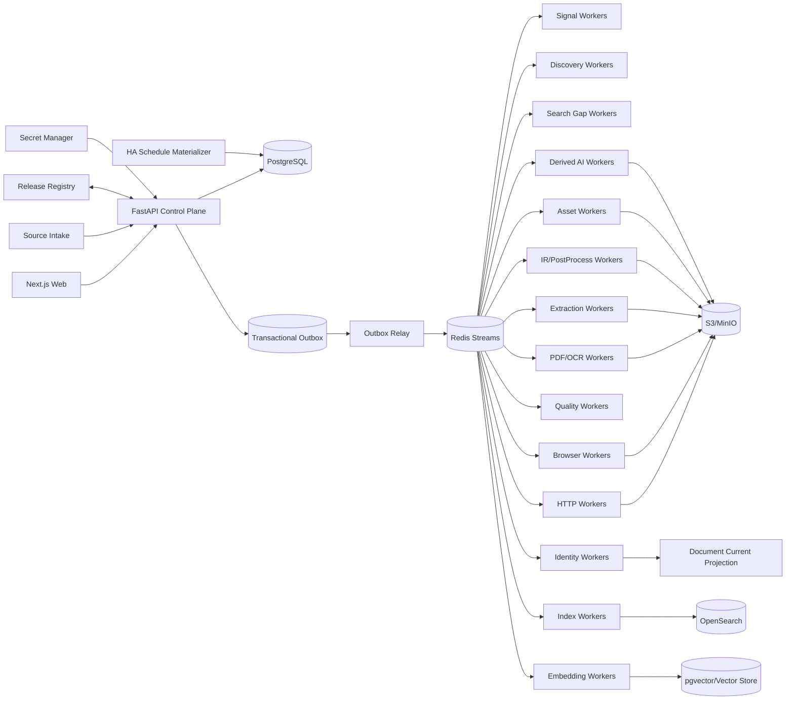

# 博客知识库技术方案

适用范围：从约 1000 个技术博客、工程博客、技术文档站、Newsletter、CMS 与公开文档站抓取尽可能完整的历史文章，清洗为稳定 Markdown 建设长期知识库；后续持续增加网站，支持全量回灌、增量同步、Web 管理、版本留存、离线重处理、全文/向量检索、质量审计、图片附件归档和 AI 派生能力。整体按百万级文档、数百万到千万级 URL、站点高度异构和多年持续运行设计。

## 1. 建设目标

1. 支持站点根地址、单 URL、批量 URL、RSS/Atom/JSON Feed、Sitemap/Sitemap Index、OPML、CSV、JSON、Markdown/TXT 等来源导入。
2. 自动探测 Sitemap、Feed、公开 API、Archive、Category/Tag/Author、Docs Navigation、普通内链、`llms.txt`/文本 URL 列表等发现入口。
3. 支持 `FULL_BACKFILL`、`INCREMENTAL`、`RECONCILE`、`TARGETED_FETCH`、`PROBE`、`REPROCESS`、`ASSET_REPAIR`、`REINDEX`、`SEARCH_GAP_FAST`、`SEARCH_GAP_DEEP`。
4. 历史完整性由 Provider 级 Coverage Evidence 证明，不能用“队列空了”“达到 max_depth/max_pages/max_urls”“搜索 Top-N 抓完”替代完整性证明。
5. HTTP-first；只有动态渲染、正文缺失、挑战页或抽取失败证据存在时才升级 Browser/Crawl4AI/Playwright。
6. Source/Profile/Discovery/Fetch/Extractor/PostProcessor/Quality/Asset/Chunker/Search/Reranker/Embedding/AI Recipe/AI Model/Dataset/Runtime 全部使用不可变 Release。
7. 支持 Sitemap `lastmod`、Feed GUID/updated、API cursor、ETag、Last-Modified、body hash、Canonical IR hash、重叠窗口与周期 Reconcile 驱动增量。
8. 最终知识对象保存标题、作者、发布时间、更新时间、标签、canonical、正文块、代码块、表格、图片、附件、链接关系、Snapshot、字段 provenance 和完整 lineage。
9. 支持 durable frontier、断点续跑、幂等、lease、heartbeat、重试、限流、熔断、公平调度、backpressure、dead-letter。
10. 保存不可变网络 Snapshot、渲染 DOM、Extraction Candidate、Canonical IR、Markdown Projection、规则版本和质量结果；规则升级优先离线 replay。
11. 图片和附件走独立 Asset Pipeline，支持安全校验、hash 去重、对象存储、引用关系、独立重试和 Markdown URL 重写。
12. Web 管理端覆盖 Source Intake、Site Profile Studio、Provider Coverage、Run/Task、Targeted Fetch、Extraction Preview、Snapshot Replay、Version Diff、Quality Review、Drift、Assets、Search/RAG、AI Artifact、成本和审计。
13. Markdown、全文索引、Embedding、摘要、标签、Topic、FAQ、Digest、Newsletter 和报告都是 Accepted Document Version 的异步 Projection/Derived Artifact，失败不能阻塞 Source Sync。
14. append-only 历史真相层之上提供可重建 Current Projection。
15. Canonical IR hash 在 Chunk/Embedding/AI 等昂贵下游之前计算；正文未变化只写 Freshness Observation。
16. 技术博客检索同时支持自然语言、代码符号、配置项、错误码、版本号、命令、文件路径和字段过滤，不能只依赖纯向量搜索。
17. Change-Signal Plane 优先用 Feed/Sitemap/API 元数据判断是否可能变化，再决定是否抓正文。
18. 跨文档近似重复只形成 Similarity Evidence / Duplicate Cluster，不自动删除来源文档。
19. 文档内部重复块形成 Repetition Evidence；任何有损抑制必须可解释、可回滚并有高删除率 Guardrail。
20. 所有 Stage 输入输出具有显式 Artifact Representation Contract，摘要不得以模糊的 `content` 字段冒充原文。
21. Platform Adapter、Site Profile、Crawler Engine、Search/Reranker、AI Model/Recipe、Dataset、Runtime Release 发布前必须通过 Contract Test、Golden Corpus、Capability Test 与 shadow replay。
22. 正文清洗必须结构保真；禁止在 Canonical IR 前使用全局 `split/join` 或 `\s+` 折叠空白。
23. Canonical Markdown 必须完整、确定性、按 Document Version 独立产出，禁止把抓取时间戳拼进正文制造无意义 diff。
24. Scheduler 只物化持久 Run/Task；异步 Worker 才执行网络、浏览器、CPU/GPU 或外部 AI 调用。
25. 所有 Run/Task 保存 Resolved Effective Config、Resolved Scope 与 Runtime Strategy Attestation。
26. 运行结果使用阶段级语义计数，区分 new version、unchanged、existing identity、unexpected empty、rejected、blocked、deadline exceeded、failed。
27. 抓取链路采用分层 Deadline 与 Cancellation Propagation。
28. 外部/自托管搜索只作为 Gap Discovery 和诊断证据，不能成为历史完整性真相源。
29. 同一 URL 的多 Extraction Strategy 尽可能共享同一 Fetch Snapshot，禁止为了比较 Markdown/HTML/CSS/XPath/LLM 策略重复访问源站。
30. Web 的“自定义 URL 抓取”必须走标准 `TARGETED_FETCH`，不允许绕过 Admission、Snapshot、Quality、Identity 和审计主链路。
31. AI 摘要不能替代原文；任何 AI 结果必须以 Derived Artifact 保存并可独立重建。
32. AI Model 的“声明上下文长度”不等于“有效输入长度”；实际 tokenizer、truncation、attention、quantization、device 与 generation config 必须写入 Runtime Attestation。
33. 自训练/微调模型必须绑定 Dataset Release、预处理代码、随机 seed、split manifest、镜像 digest、模型 hash 和离线评估结果，确保可重复。
34. 所有生产依赖使用 lockfile/container image digest/SBOM 固化，禁止把未锁版本的临时开发环境当生产 Release。
35. Discovery 优先从 DOM/Feed/Sitemap/API 产生 URL Candidate 与 Evidence，禁止依赖“DOM → Markdown → 正则”作为生产 URL 发现主链路。
36. AI 长文处理采用 block-aware Chunk Plan + Map/Reduce Artifact；每个 Map/Reduce 结果可独立重试、缓存和追溯到 Canonical Block。
37. Web/API 请求线程不得同步等待浏览器、本地模型、OCR 或外部 LLM；所有长任务必须进入持久任务系统。

## 2. 非目标与边界

1. 不绕过登录、付费墙、验证码、WAF 或明确访问控制。
2. 不承诺未知站点仅靠自动探测达到 100% 历史完整；必须展示 coverage confidence、known gap 与 blocker。
3. 不用 LLM、Reranker 或搜索排名决定 FULL_BACKFILL 中合法历史文章是否入库。
4. Markdown 不是唯一真相；Canonical IR 是内部内容真相，Markdown 是确定性投影。
5. 不锁死单一爬虫库、浏览器库、向量库、搜索引擎、重排模型或消息队列。
6. Source Intake 文件/粘贴文本只是输入证据，不直接成为生产配置真相源。
7. AI、Embedding、Newsletter 等派生模块不能反向决定抓取主链路是否成功。
8. 不允许用 HTTP 200、Browser success、协程正常返回或无异常直接等价业务成功。
9. 不把第三方库 README、模型名称、默认参数或注释当作运行事实；运行事实来自 Runtime Attestation。
10. 不把全局 reload/scroll/wait 脚本作为所有站点默认策略；浏览器动作必须进入 Site/Profile 级可测试 recipe。
11. 不把 Query-time Context、Rerank Top-K 或 LLM 摘要反向保存为 Canonical Document。
12. Search Gap Deep 的 Top-N、Rerank Top-K 和搜索页数只是成本预算，不是 Coverage 证据。
13. 不把 reference-based ROUGE/BERTScore 当成生产摘要事实正确性的充分证明。
14. 不在 Web 请求线程直接执行长时间抓取、浏览器或本地大模型推理。
15. 不用模型名称推断实际可消费上下文长度；必须以本次运行真实 token、截断和 attention 配置为准。

## 3. 核心原则

1. **PostgreSQL 是业务状态真相源；S3/MinIO 是不可变大对象真相源。**
2. Redis Streams 只做任务运输；决定性状态先写 PostgreSQL，再由 Transactional Outbox 投递。
3. Source Intake、Change Signal、Discovery、Admission、Fetch、Extraction、PostProcess、Quality、Identity、Publish、Asset、Search、AI、Delivery 分层。
4. Discovery 只产生 URL Candidate 与 Evidence；Feed 摘要、搜索结果、列表页不能直接成为最终正文。
5. URL Identity 与 Document Identity 分离；Identity 与 Freshness 分离。
6. Discovery Fetch Route 与 Article Fetch Route 分离。
7. HTTP、Browser、PDF/OCR 分层；生产复用长期 HTTP client、Search client、Rerank client、Browser Runtime 和 Model Runtime。
8. Crawl4AI/Playwright/Trafilatura/SearXNG/LLM/Hugging Face 等第三方能力通过 Adapter 隔离，原始返回 shape 和 quirks 不泄漏到业务真相层。
9. 所有 Stage 使用固定 Typed Outcome Contract。
10. `document_version` append-only；Current/Markdown/Search/Embedding/AI Projection 可重建。
11. `max_depth/max_pages/max_runtime/max_urls/max_results/top_k` 是预算，不是 Coverage Evidence。
12. 进程内 semaphore/`asyncio.gather` 只做 Worker 本地资源保护，不承担持久调度。
13. Config 使用不可变 Release；Secret 仅保存 Secret Manager 引用。
14. 内容结构本身是数据；代码缩进、表格、列表层级和换行不能在通用 cleaner 中被压平。
15. 有损清洗必须可逆或可解释，Canonical IR 不因启发式去重丢掉不可恢复信息。
16. 原始证据与面向 UI/Agent 的紧凑输出分层：先保存完整事实，再做 Projection。
17. 多个 Extractor/Strategy 优先消费同一 Snapshot；网络访问与内容解释解耦。
18. Site Profile 的编辑、测试、发布、回滚全部可审计。
19. 人工 Targeted Fetch 与批量同步共用同一标准流水线。
20. 摘要、标签、分类、问答等 AI 能力只是 Document Version 的派生视图。
21. AI 的输入 Projection、Chunk Plan、Map Artifact、Reduce Artifact 和最终输出都保留 lineage。
22. 模型训练、模型 Artifact、推理 Runtime、量化策略和 AI Recipe 是不同 Release，不得混为一体。
23. URL 唯一化不能覆盖 Discovery Evidence；同一 URL 在不同入口被发现的证据应全部保留。
24. Blocking SDK 不能直接运行在 async Web/Event Loop 上；必须使用异步客户端或隔离 Worker/线程池。

## 4. 推荐技术栈

### 4.1 控制面

- Web：Next.js + TypeScript。
- API：FastAPI + Pydantic。
- PostgreSQL：Source、Profile、Provider、Run、Task、Document、Version、Audit 等业务状态。
- Redis Streams：任务运输与 Consumer Group。
- Transactional Outbox：保证数据库状态与消息投递一致。
- Secret Manager：Vault、云 Secret Manager 或 Kubernetes Secret 引用，不把 secret 明文写入配置。

### 4.2 数据面

- HTTP：`httpx.AsyncClient` 长期连接池。
- HTML 解析：selectolax/lxml/BeautifulSoup 作为低层解析器。
- 主体抽取：Trafilatura/Readability/Crawl4AI/CSS/XPath/JSON-LD/OpenGraph 的组合 Adapter。
- Browser：Playwright/Crawl4AI Browser Runtime Pool。
- PDF：PyMuPDF/pypdf + OCR fallback。
- 对象存储：S3/MinIO。
- 全文检索：OpenSearch。
- 向量：pgvector 起步；规模扩大后可切换专用 Vector Store。
- AI：远程 LLM Client Pool + 自托管 Model Runtime Pool，统一走 AI Adapter。

## 5. 总体架构



### 5.1 Control Plane

只负责 Source、Provider、Profile、Release、Schedule、Run、Command、RBAC、Audit、搜索和状态查询，不直接执行长期 I/O/GPU 任务。

### 5.2 Change-Signal / Discovery Plane

低成本轮询 Feed/Sitemap/API，维护 Provider checkpoint，生成 URL Candidate 与 Coverage Evidence；Search Gap 只做缺口诊断和补充发现。

### 5.3 Data Plane

HTTP、Browser、PDF/OCR、Extraction、PostProcess、Quality、Identity 分成独立 Worker Pool，通过 Typed Artifact/Outcome 串联。

### 5.4 Projection Plane

Accepted Document Version 触发 Markdown、Current、Chunk、Embedding、Search、AI Artifact、Delivery。Projection 失败不会回滚已接受的 Canonical Document Version。

## 6. Release Registry 与可重复运行

所有可改变行为的东西都必须版本化：

```text
site_profile_release
discovery_provider_release
fetch_engine_release
extractor_release
postprocess_release
quality_policy_release
asset_policy_release
chunker_release
search_provider_release
reranker_release
embedding_release
ai_model_release
ai_recipe_release
dataset_release
training_recipe_release
runtime_release
```

每个 Release 至少记录：

- semantic version/release id；
- source code commit；
- config hash；
- dependency lock hash；
- container image digest；
- SBOM reference；
- author/created_at；
- Contract/Capability/Golden/shadow test 结果；
- predecessor/rollback target。

`runtime_release` 额外记录：

- Python/OS；
- Browser/Playwright/Crawl4AI 版本；
- parser/Trafilatura 版本；
- AI tokenizer/model hash；
- device/dtype/quantization；
- configured context 与实测有效 context；
- generation config；
- external API model/version 标识。

## 7. Source Registry 与 Site Profile Studio

### 7.1 Source Registry

每个站点记录：

- `source_id`；
- canonical origin/display name；
- platform hint；
- active 状态；
- robots/policy；
- rate-limit policy；
- active profile release；
- discovery providers；
- sync schedule；
- ownership/compliance notes；
- secret refs；
- last successful run；
- coverage state。

接入流程：

```text
Intake
 -> Normalize
 -> Probe
 -> Platform Detection
 -> Provider Detection
 -> Profile Draft
 -> Golden URL Test
 -> Preview
 -> Approval
 -> Activate
```

### 7.2 Site Profile

Profile 表达“这个站如何发现、抓取、抽取和判断质量”，至少包括：

```yaml
identity:
  allowed_hosts: []
  canonical_rules: []
  url_normalization_rules: []
discovery:
  sitemap: []
  feed: []
  api: []
  archive: []
  list_pages: []
  navigation_rules: []
  accept_rules: []
  reject_rules: []
fetch:
  http_first: true
  browser_escalation_rules: []
  headers: {}
  timeout_policy: {}
  rate_policy: {}
extraction:
  title_rules: []
  author_rules: []
  published_at_rules: []
  updated_at_rules: []
  body_rules: []
  remove_rules: []
quality:
  expected_selectors: []
  min_text_chars: 300
  min_blocks: 3
```

Profile 发布必须通过 Golden URL 和 Snapshot Replay；生产 Task 固化 `resolved_profile_release_id`，后续 Profile 修改不改变已运行任务的解释。

## 8. 历史全量发现与 Coverage Evidence

### 8.1 Provider 优先级

建议按成本和完整性分层：

1. Sitemap Index / Sitemap；
2. RSS/Atom/JSON Feed；
3. 官方 API/CMS API；
4. Archive/年月页/分页目录；
5. Category/Tag/Author；
6. Docs Navigation；
7. 普通站内链接；
8. `llms.txt`/文本 URL 列表；
9. 搜索引擎 Gap Discovery。

### 8.2 Coverage Evidence

每个 Provider 保存：

- Provider Release；
- 起止时间或分页范围；
- checkpoint/cursor；
- observed URL count；
- accepted article count；
- duplicate URL count；
- blocker/error；
- first/last observed published time；
- pagination exhaustion evidence；
- confidence。

`FULL_BACKFILL` 完成条件是已配置 Provider 的 Coverage State 达标，不能简单以 frontier 为空判断。

### 8.3 URL Candidate 与 Evidence

`url_candidate` 只表示“这个 URL 可能值得处理”；`discovery_evidence` 表示“为何认为它存在”。

Evidence 保存 `parent_url`、`href_raw`、`href_resolved`、anchor、DOM/CSS/XPath 位置、Provider、Snapshot、observed_at、分页/分类上下文。URL 可唯一化，Evidence 追加保存。

## 9. 增量同步

### 9.1 Change-Signal Plane

低成本信号优先：

- Feed GUID/updated；
- Sitemap lastmod；
- API cursor/version；
- HEAD/conditional GET；
- ETag；
- Last-Modified。

### 9.2 正文增量判断

```text
Signal Changed?
 -> Fetch
 -> body_hash
 -> Extract
 -> canonical_ir_hash
 -> unchanged: Freshness Observation
 -> changed: New Document Version
```

避免仅依据 HTML hash 判断文档变化，因为广告、导航、随机 token 可能变化；昂贵下游以 Canonical IR hash 为主要门控。

### 9.3 重叠窗口与 Reconcile

Feed/API 增量必须带 overlap window，以防延迟发布、时区错误、后补文章或 Provider 数据回写。周期性 `RECONCILE` 重新扫描历史窗口，对比缺失 URL、404/410、canonical 变化和 Provider 漂移。

## 10. Durable Frontier 与调度

### 10.1 Run/Task 模型

`crawl_run` 表示一次业务意图；`crawl_task` 表示可租赁执行单元。

Task 保存：

- run_id/source_id/url；
- stage；
- priority；
- attempt；
- state；
- lease_owner/lease_until；
- heartbeat_at；
- idempotency_key；
- deadline；
- resolved releases；
- outcome/error_class。

### 10.2 状态机

```text
PENDING
 -> LEASED
 -> RUNNING
 -> SUCCEEDED | RETRY_WAIT | DEAD_LETTER | CANCELLED
```

### 10.3 公平调度

至少同时限制：

- global concurrency；
- per-host concurrency；
- per-host QPS；
- source priority；
- run priority；
- Browser slots；
- CPU extraction slots；
- GPU/model slots；
- external AI budget。

用 token bucket/leaky bucket 控制 host 速率；高失败率触发 circuit breaker；队列长度、对象存储、OpenSearch、GPU 或外部 API 饱和时执行 backpressure。

### 10.4 Deadline 与取消

Run 有总 Deadline，Task 有 stage Deadline，HTTP/Browser/AI 调用有调用级 timeout。父任务取消必须传播到子 Task，避免“页面已取消但 GPU 仍继续摘要”。

## 11. Fetch Pipeline

### 11.1 HTTP-first

默认路径：

```text
Admission
 -> HTTP Fetch
 -> Validate
 -> Snapshot
 -> Extract
 -> Quality
```

只有以下 Evidence 存在时升级 Browser：

- 主体疑似 JS 渲染；
- HTTP 正文过短；
- 关键 Selector 0 命中；
- challenge/interstitial；
- 必须点击/滚动才能加载；
- Profile 明确指定 Browser Recipe。

### 11.2 长期 Runtime

HTTP Worker 维护长期 `AsyncClient`；Browser Worker 维护长期 Browser Runtime + Context Pool + Page Lease。禁止每个 URL 重启 Chromium。

### 11.3 Snapshot

每次真实网络访问保存不可变 Snapshot：

- request URL/method/headers subset；
- final URL/redirect chain；
- status/content-type；
- response headers；
- body/object key；
- fetched_at；
- body hash；
- engine/runtime release；
- timing/bytes；
- policy outcome。

Browser 额外保存 rendered DOM、必要截图/trace 引用和 action recipe 结果。

### 11.4 安全

Targeted Fetch 和自动发现 URL 都执行 SSRF 防护：阻断 loopback、link-local、private network、metadata endpoint、危险 scheme，重定向后再次校验。

## 12. Extraction、Canonical IR 与清洗

### 12.1 Extraction Candidate

同一 Snapshot 可产生多个 Candidate：

- JSON-LD/OpenGraph metadata；
- CSS/XPath；
- Trafilatura/Readability；
- Crawl4AI Markdown/fit content；
- LLM extraction（仅必要时）。

候选记录 extractor release、字段 provenance、置信度和质量指标。

### 12.2 Canonical IR

Canonical IR 是内部内容真相，结构示例：

```json
{
  "metadata": {
    "title": "...",
    "authors": [],
    "published_at": null,
    "updated_at": null,
    "canonical_url": "...",
    "tags": []
  },
  "blocks": [
    {"id":"b1","type":"heading","level":2,"text":"..."},
    {"id":"b2","type":"paragraph","text":"..."},
    {"id":"b3","type":"code","language":"python","text":"..."},
    {"id":"b4","type":"table","rows":[]},
    {"id":"b5","type":"image","asset_ref":"..."}
  ]
}
```

每个字段/块保留 provenance，能追溯到 Snapshot、DOM 位置或 extractor 输出。

### 12.3 结构保真清洗

通用 cleaner 只能做安全、可解释规范化：

- Unicode normalization；
- 明确的 boilerplate block 删除；
- URL normalization；
- 空 block 合并；
- 非正文导航/分享/推荐块标注。

禁止在 Canonical IR 前全局折叠 `\s+`，禁止破坏代码缩进、列表、表格和段落。

### 12.4 重复处理

文档内部重复块产生 `repetition_evidence`；跨文档 SimHash/MinHash/embedding 近似重复产生 `duplicate_cluster`。默认保留来源文档，不自动删除；如做有损抑制，必须记录删除块、规则、比例和可回滚证据。

## 13. Markdown Projection

Markdown 由 Accepted Canonical IR 确定性生成，要求：

- 相同 IR + 相同 projection release 生成完全一致字节；
- 不写抓取时间戳到正文；
- 标题/作者/时间等用稳定 front matter；
- 代码 fenced block 保留语言；
- 表格尽可能原样投影；
- 图片引用统一到 Asset URL；
- Markdown 失败不回滚 Canonical Version，可独立重建。

建议对象存储路径：

```text
markdown/{source_id}/{document_id}/{version_id}.md
```

Current 导出可另建稳定路径或 manifest，不覆盖历史版本。

## 14. Document Identity、Version 与 Freshness

### 14.1 URL Identity

URL 标准化处理 scheme/host、默认端口、fragment、tracking params、站点已知规则，但不得擅自删除可能影响内容的 query 参数。

### 14.2 Document Identity

综合：

- canonical URL；
- structured metadata id；
- CMS post id；
- stable slug；
- 内容相似度 Evidence。

Identity 决策必须可审计。

### 14.3 Version

`document_version` append-only，至少保存 canonical_ir_hash、snapshot_ids、extractor/postprocess release、accepted_at、quality result。

若 canonical_ir_hash 不变，只追加 Freshness Observation；若变化，创建新 Version，再异步更新 Current/Search/Embedding/AI。

## 15. Asset Pipeline

图片、PDF、附件独立处理：

1. 从 Canonical IR 提取 asset reference；
2. 安全下载；
3. 校验 content-type/size；
4. hash 去重；
5. S3/MinIO 保存；
6. 记录 `asset` 与 `document_asset_ref`；
7. Markdown 重写为稳定 URL；
8. 失败独立重试。

Asset 失败不能让正文抓取整体失败，可标记 `asset_incomplete`。

## 16. Quality Gate 与 Drift

### 16.1 Quality 指标

至少包含：

- title 是否存在；
- 正文字符/token 数；
- block 数；
- code/table/image 数；
- boilerplate ratio；
- link density；
- selector hit；
- extractor agreement；
- published_at 合法性；
- unexpected empty；
- language；
- duplicate/repetition ratio。

### 16.2 Typed Outcome

禁止只返回 bool。示例：

```text
ACCEPTED_NEW_VERSION
ACCEPTED_UNCHANGED
REJECTED_LOW_QUALITY
EMPTY_EXPECTED
EMPTY_UNEXPECTED
SELECTOR_DRIFT
WRONG_PAGE_TYPE
CHALLENGE_PAGE
POLICY_BLOCKED
FETCH_TIMEOUT
EXTRACTION_ERROR
DEADLINE_EXCEEDED
```

### 16.3 Drift

按 Source/Profile Release 维护时间序列：selector hit rate、正文长度、字段缺失率、Browser escalation rate、HTTP status、quality score。突变触发告警和 Golden URL replay。

## 17. Search 与知识库检索

### 17.1 OpenSearch

索引字段：title、authors、tags、headings、body text、code text、language、source、published_at、version、URL、路径/命令/错误码等。

技术内容使用专门 analyzer/keyword 子字段，避免函数名、`foo_bar()`、`kubectl`、错误码被错误切词。

### 17.2 Vector

Embedding 基于 Accepted Version 的 chunk projection。Chunk 保存 block range 和 lineage；Document Version 不变则不重算。

### 17.3 Hybrid Retrieval

```text
BM25/keyword
 + vector recall
 + metadata filter
 -> fusion
 -> optional reranker
 -> context assembly
```

搜索/rerank 结果是 Query-time Artifact，不写回 Canonical Document。

## 18. AI Derived Artifact 平面

### 18.1 与抓取主链路解耦

Document Version 被接受后才产生 AI 任务：摘要、标签、Topic、FAQ、实体、Digest、Newsletter、报告等。AI 失败不影响 Source Sync。

### 18.2 AI Input Projection

Canonical IR 不直接粗暴压平成单段。为 AI 生成独立 `AI_INPUT_TEXT`/`AI_INPUT_STRUCTURED`，并保存：

- projection release；
- block_id → text span；
- code/table inclusion policy；
- normalization policy；
- input hash。

### 18.3 Block-aware Chunk Plan

按 heading、paragraph、code/table 边界和 token budget 切块；必要时做轻量 overlap。每个 chunk 保存：

- chunk_id；
- block range；
- token count；
- input hash；
- truncation info；
- parent section。

禁止只按固定 token 数无语义硬切作为默认生产策略。

### 18.4 Map/Reduce Artifact

长文摘要采用：

```text
AI Input
 -> Chunk Plan
 -> Map Artifact[]
 -> Reduce Level 1[]
 -> optional Reduce Level N
 -> Final Summary Artifact
```

Map/Reduce 输出持久化，可按 `input_hash + ai_recipe_release + ai_model_release + runtime_release` 复用；单块失败只重试该块。

### 18.5 AI Representation Contract

API/存储明确区分：

```text
raw_snapshot
extraction_candidate
canonical_document_version
markdown_projection
ai_input_projection
summary_artifact
```

绝不使用模糊 `content` 字段同时代表正文和摘要。

### 18.6 Model Runtime Pool

本地模型在 Worker Runtime 启动时加载并复用，不按请求重复加载。远程 LLM 使用长期异步 Client Pool。GPU Worker 与 HTTP/Browser Worker 隔离伸缩，防止 AI 拖慢抓取。

### 18.7 Runtime Attestation

每次 AI Artifact 记录：

- model release/weight hash；
- tokenizer release；
- AI recipe release；
- configured max context；
- actual input tokens；
- truncated tokens；
- attention/global-attention policy；
- device/dtype/quantization；
- generation parameters；
- library/runtime release；
- latency/cost。

“模型支持 16K/32K”不能替代真实输入证明。

### 18.8 自训练模型 MLOps

Dataset Release 必须保存原始数据 hash、清洗规则、随机 seed、sample/split manifest、预处理 commit 和输出 hash。Training Recipe 保存超参数；Model Artifact 保存权重/tokenizer/hash；Evaluation Artifact 保存离线结果。

发布前必须通过 Dataset Contract：source/target 字段正确、split 不重叠、随机采样可重复、长度分布合理、sample id 稳定。

### 18.9 摘要质量

ROUGE/BERTScore 只能用于离线参考，生产还需：

- unsupported claim/factuality；
- 技术 token 保真；
- 版本号/命令/函数名保真；
- section coverage；
- lineage coverage；
- truncation rate；
- duplicate fact rate；
- Golden Corpus；
- 人工抽检。

## 19. Web 管理端

### 19.1 Source Intake

支持单 URL、批量站点、OPML、CSV/JSON、粘贴文本导入；先进入 Intake/Probe，不直接写生产 Profile。

### 19.2 Site Profile Studio

提供：

- URL/Provider/Selector/metadata/remove rule 编辑；
- HTTP/Browser route；
- Golden URL；
- 同 Snapshot 多策略预览；
- Candidate/Canonical IR/Markdown diff；
- 发布/回滚。

### 19.3 Provider Coverage

展示 Provider 当前 cursor、历史时间覆盖、URL 数、已接受数、known gap、blocker、coverage confidence。

### 19.4 Run/Task

展示 Run DAG、stage 计数、失败分类、重试、lease、deadline、吞吐、队列和取消。

### 19.5 Targeted Fetch

任意 URL 输入创建持久 `TARGETED_FETCH`，通过 SSE/WebSocket/轮询展示阶段状态，不在 HTTP 请求线程同步抓取或摘要。

### 19.6 Replay 与 Diff

允许选择历史 Snapshot 使用新 Extractor/Postprocess/AI Recipe 离线 replay；展示旧/新 Canonical IR、Markdown、Quality、AI Artifact 差异。

### 19.7 Quality/Drift/Assets/Search/AI

提供异常空文档、漂移告警、Asset 缺失、版本 diff、搜索调试、chunk lineage、AI Map/Reduce、成本和审核页面。

## 20. 核心数据模型

建议至少包含：

```text
source
site_profile_release
discovery_provider
discovery_provider_release
provider_checkpoint
coverage_evidence
url_candidate
discovery_evidence
crawl_run
crawl_task
fetch_snapshot
render_snapshot
extraction_candidate
quality_result
document
document_version
freshness_observation
markdown_projection
asset
document_asset_ref
duplicate_cluster
repetition_evidence
chunk_projection
search_projection
embedding_projection
ai_input_projection
ai_chunk_plan
ai_artifact
ai_model_release
ai_recipe_release
dataset_release
training_recipe_release
runtime_release
audit_log
outbox_event
```

大对象和完整 HTML/DOM/Markdown/AI 中间 Artifact 放 S3/MinIO；PostgreSQL 保存结构化索引、hash、状态和 object key。

## 21. API 设计原则

- Command 与 Query 分离；长操作返回 `run_id/task_id`。
- `POST /sources`：注册/导入来源。
- `POST /sources/{id}/probe`：探测。
- `POST /sources/{id}/runs`：FULL/INCREMENTAL/RECONCILE。
- `POST /targeted-fetch`：单 URL 标准抓取。
- `POST /profiles/{id}/replay`：Snapshot Replay。
- `GET /runs/{id}`、`GET /tasks/{id}`：状态。
- `GET /documents/{id}/versions`：版本。
- `GET /documents/{id}/artifacts`：Markdown/AI/Asset。
- `GET /coverage`：Provider Coverage。

所有响应字段使用明确 representation 名称，不用 `content` 混装不同语义。

## 22. 可靠性与失败恢复

1. Task idempotency key 防止重复副作用。
2. Lease 到期自动重投；Worker heartbeat 防止假死。
3. Retry 按错误类策略化：网络瞬态重试，404/410 不盲重试，selector drift 进入质量告警。
4. Dead-letter 支持人工/规则修复后 replay。
5. Snapshot 已成功后 Extraction 失败，只重跑 Extraction，不重复访问源站。
6. AI Map 某块失败，只重跑对应 chunk。
7. Projection 失败不回滚 Document Version。
8. Outbox Relay 保证数据库提交与消息投递最终一致。

## 23. 可观测性与成本

### 23.1 Metrics

- URL discovered/fetched/accepted/unchanged/failed；
- per-source throughput/error rate；
- host rate-limit/circuit breaker；
- HTTP/Browser escalation；
- Snapshot bytes；
- extraction/quality latency；
- queue lag；
- lease timeout；
- OpenSearch/Vector lag；
- AI token/GPU time/API cost；
- AI truncation/lineage coverage。

### 23.2 Trace

使用 `run_id/task_id/source_id/url_id/document_id/version_id/snapshot_id` 贯穿 OpenTelemetry trace 和结构化日志。

### 23.3 成本护栏

Browser、OCR、Embedding、Rerank、LLM/GPU 都配置预算；`FULL_BACKFILL` 不因成本护栏静默丢 URL，而应形成 deferred/blocker Evidence。

## 24. 安全、合规与审计

- robots/policy 状态进入 Source/Profile；
- 明确 User-Agent 和联系人；
- per-host polite rate；
- 不绕过认证/付费墙/WAF；
- SSRF/重定向校验；
- 下载 Asset 做类型/大小/恶意文件限制；
- Secret 只保存引用；
- RBAC 区分查看、编辑 Profile、发布、重跑、删除；
- 所有发布、回滚、人工接受/拒绝记录 Audit Log；
- 支持 Source 停用、数据保留策略和必要的删除工作流。

## 25. 测试与发布 Gate

### 25.1 Contract Test

验证 Adapter 输入输出与 Typed Outcome，不允许第三方库原始返回 shape 泄漏到核心业务层。

### 25.2 Golden Corpus

为不同站点类型准备稳定 Snapshot：WordPress、Ghost、Substack、Medium、自建博客、Docs、JS-heavy、代码密集、表格密集、多语言。

### 25.3 Shadow Replay

Extractor/Profile/Postprocess/Markdown/AI Recipe 新 Release 先对历史 Snapshot replay，比较：

- accepted/rejected 变化；
- block diff；
- metadata diff；
- Markdown hash；
- truncation；
- AI 质量；
- 成本。

### 25.4 Supply Chain Gate

CI 生成 lockfile 校验、镜像 digest、SBOM、依赖漏洞扫描。未锁关键依赖或模型/tokenizer 无 hash 时禁止标记生产 Release。

## 26. 部署与扩展

### 26.1 起步部署

Docker Compose/Kubernetes 均可：

- API ×2；
- Scheduler/Outbox Relay ×2（leader/lease）；
- HTTP Worker 多实例；
- Browser Worker 少量独立节点；
- Extraction/Quality Worker；
- Asset Worker；
- Search/Embedding Worker；
- AI Worker；
- PostgreSQL；
- Redis；
- MinIO/S3；
- OpenSearch。

### 26.2 横向扩展

按队列 backlog 与资源类型独立扩容。Browser/GPU 不和普通 HTTP Worker 混部；1000 站点的瓶颈通常来自站点礼貌限速和页面复杂度，而不是单机协程数。

## 27. 分阶段实施

### Phase 1：可用主链路

- Source Registry；
- Sitemap/Feed/Archive Discovery；
- durable Run/Task；
- HTTP-first；
- Snapshot；
- Trafilatura/CSS Extractor；
- Canonical IR；
- Markdown；
- PostgreSQL + MinIO；
- 基础 Web Run/Document 页面。

### Phase 2：规模化与增量

- Provider Coverage；
- conditional fetch；
- Reconcile；
- Browser Runtime Pool；
- fairness/backpressure；
- Quality/Drift；
- Asset Pipeline；
- OpenSearch。

### Phase 3：知识库与 AI

- Chunk/Embedding；
- Hybrid Search/Reranker；
- AI Input Projection；
- block-aware Map/Reduce；
- AI Recipe/Model/Runtime Registry；
- Targeted Fetch；
- Replay/Diff；
- 成本面板。

### Phase 4：MLOps 与高级治理

- Dataset/Training Release；
- 自托管模型评估；
- Golden Corpus 扩充；
- shadow release；
- 复杂 Provider Adapter；
- 自动 Drift 修复建议；
- 多租户/RBAC 强化。

## 28. 验收标准

1. 新增一个普通技术博客不改核心代码，只需配置/Adapter 即可接入。
2. 1000 站点可独立限流、暂停、重跑和查看 Coverage。
3. Worker 重启后任务可继续，不因进程内状态丢失。
4. 同一 Snapshot 可重复使用新抽取规则生成新的 Candidate/IR/Markdown，而不重新访问源站。
5. Incremental 对未变化正文不会重复创建 Document Version、Embedding 或摘要。
6. Markdown 保留技术文章的代码缩进、列表、表格和段落结构。
7. Selector 漂移或异常空正文能被明确识别，不会静默标记成功。
8. Targeted Fetch 与批量同步共享同一 Admission/Snapshot/Quality/Identity 主链路。
9. AI 摘要失败不影响原文入库，且每句/每段摘要可通过 Map/Reduce lineage 回溯原文块。
10. 任意 AI Artifact 能回答使用了哪个 Document Version、AI Input、Chunk Plan、Model、Recipe、Runtime 和实际 token/truncation。
11. 任意自训练模型能回答其 Dataset Release、seed、split manifest、训练代码、镜像和模型 hash。
12. 任意生产结果可通过 Release、Snapshot 和 Runtime Attestation 重放或解释。
13. `博客知识库技术方案.md` 只维护当前最终方案，不记录调研历史或过程。