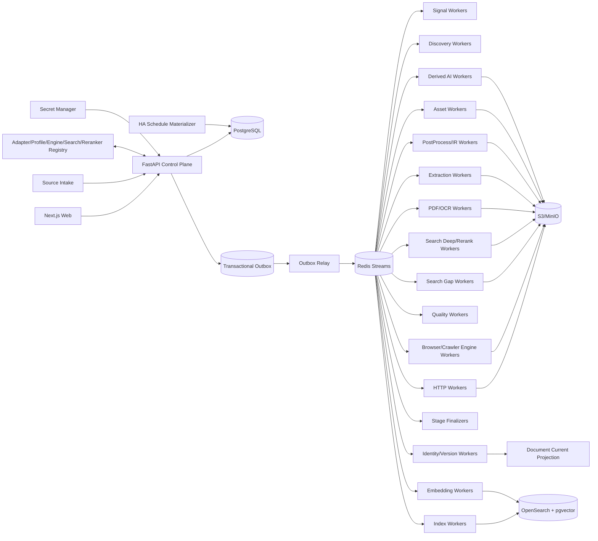

# 博客知识库技术方案

适用范围：从约 1000 个技术博客、工程博客、技术文档站、Newsletter、CMS 和公开文档站抓取尽可能完整的历史文章，清洗为稳定 Markdown 建设长期知识库；后续持续增加网站，支持全量回灌、增量同步、Web 管理、版本留存、离线重处理、全文/向量检索、质量审计、图片附件归档和 AI 派生能力。整体按百万级文档、数百万到千万级 URL、站点高度异构和多年持续运行设计。

## 1. 建设目标

1. 支持单 URL、批量 URL、Feed URL、OPML、Markdown/TXT、CSV、JSON 导入来源，自动规范化、去重、Probe、预览、审核后进入 Source Registry。
2. 自动探测 Sitemap/Sitemap Index、RSS/Atom/JSON Feed、公开 API、Archive、分类/标签/作者页、文档导航树、普通内链、`llms.txt`/文本 URL 列表和动态列表。
3. 支持 `FULL_BACKFILL`、`INCREMENTAL`、`RECONCILE`、`TARGETED_FETCH`、`REPROCESS`、`ASSET_REPAIR`、`REINDEX`、`SEARCH_GAP_FAST`、`SEARCH_GAP_DEEP`。
4. 历史完整性由 Provider 级 Coverage Evidence 证明，不能把“队列空”“达到 max_depth/max_pages/max_urls”“搜索 Top-N 已抓完”当作完整。
5. HTTP-first；只有动态渲染、正文缺失、挑战页或抽取失败证据存在时才升级 Browser/Crawl4AI/Playwright。
6. Discovery Rule、Fetch Route、Crawler Engine、Extraction Profile、PostProcessor、Quality Policy、Asset Policy、Chunker、Embedding、Search、Reranker、AI Prompt/Model 均独立版本化。
7. 支持 Sitemap `lastmod`、Feed GUID/updated、API cursor、ETag、Last-Modified、body hash、Canonical IR hash、重叠窗口和周期 Reconcile 驱动增量。
8. 最终知识对象保存标题、作者、发布时间、更新时间、标签、canonical、正文块、代码块、表格、图片、附件、链接关系、Snapshot、字段 provenance 和完整 lineage。
9. 支持 durable frontier、断点续跑、幂等、lease、heartbeat、重试、限流、熔断、公平调度、backpressure、dead-letter。
10. 保存不可变网络 Snapshot、渲染 DOM、清洗 HTML、Extraction Candidate、转换轨迹、Canonical IR、Markdown Projection、规则版本和质量结果；规则升级优先离线 replay。
11. 图片和附件走独立 Asset Pipeline，支持安全校验、hash 去重、对象存储、引用关系、独立重试和 Markdown URL 重写。
12. Web 管理端覆盖来源导入、站点接入、Provider 覆盖、任务控制、发现证据、Search Gap、Deep Search Trace、运行时抓取边界、当前文章、历史版本、版本 diff、抽取转换链、质量审核、漂移告警、资产、搜索/RAG、成本、Schedule、AI Workflow 和审计。
13. Markdown、全文索引、Embedding、摘要、聚类、Digest、Newsletter、报告和通知都是 Accepted Document Version 的异步 Projection，失败不能阻塞 Source Sync。
14. append-only 历史真相层之上提供可重建 Current Projection。
15. Canonical IR hash 在 Chunk/Embedding/AI 等昂贵下游之前计算；内容未变化只写 freshness observation。
16. 技术博客检索同时支持自然语言、代码符号、配置项、错误码、版本号和文件路径，不能只依赖纯向量搜索。
17. 设置 Change-Signal Plane，先用 Feed/Sitemap/API 元数据判断是否可能变化，再决定是否抓正文。
18. 跨文档近似重复只形成 Similarity Evidence / Duplicate Cluster，不自动删除来源文档。
19. 文档内部重复块形成 Repetition Evidence；任何有损抑制必须可解释、可回滚并有高删除率 Guardrail。
20. 所有 Stage 输入输出具有显式 Artifact Representation Contract。
21. Platform Adapter / Site Profile / Crawler Engine Release / Search Provider Release / Reranker Release 发布前必须通过 Contract Test、Golden Corpus、Capability Test 和最近 Snapshot 的 shadow replay。
22. 正文清洗必须结构保真；禁止在 Canonical IR 前用全局 `split/join` 折叠空白。
23. Canonical Markdown 必须完整、确定性、按 Document Version 独立产出，禁止把带抓取时间戳的批量拼接文本当作知识库真相。
24. Scheduler 只物化持久 Run/Task；异步 Worker 才负责 await 网络任务。
25. 所有 Run 保存 Resolved Effective Config、Resolved Crawl Scope 与 Runtime Strategy Attestation。
26. 运行结果使用阶段级语义计数，区分 new version、unchanged、existing identity、unexpected empty、rejected、blocked、deadline exceeded、failed。
27. 抓取链路采用分层 Deadline 与 Cancellation Propagation。
28. 外部/自托管搜索只作为 Gap Discovery 和诊断证据，不能成为历史完整性真相源。
29. SearXNG 等 Search Gap Provider 必须保存查询参数、引擎、排名、score、原始结果快照和去重过程，不能只保存最终 URL。
30. Search Gap 支持 FAST/DEEP 两级诊断：FAST 仅保存 SERP Evidence；DEEP 只对受预算约束的候选做网页抓取、Chunk 和语义重排，且任何 rerank 结果都不能绕过 Admission 或把 Coverage 提升为 complete。
31. 同一 URL 的多 Extraction Strategy 必须尽可能共享同一 Fetch Snapshot；禁止为了比较 Markdown/HTML/CSS/XPath/LLM 等策略重复访问源站。
32. Search/Rerank 链路保存 `query -> result -> source fetch -> chunk -> score/rank` 完整证据；Provider Normalizer 不得为了统一字段而丢弃 engine/score/category 等来源元数据。
33. Search Worker、HTTP Worker 与 Browser Worker 都复用长生命周期连接池/Runtime Pool，不能按每次 query/URL 新建完整客户端或浏览器 runtime。
34. Rerank 只影响搜索优先级和 Agent 上下文，不参与 Canonical Document 的有损正文筛选。
35. MCP/CLI 只作为调试、人工诊断和 Agent 接口；生产全量/增量同步必须经过 Control Plane、持久任务和 Worker。

## 2. 非目标与边界

1. 不绕过登录、付费墙、验证码、WAF 或明确访问控制。
2. 搜索引擎结果只作补充发现证据。
3. 不承诺未知站点仅靠自动探测达到 100% 历史完整；必须展示 coverage confidence、known gap 和 blocker。
4. 不用 LLM 或 Reranker 评分决定 FULL_BACKFILL 中合法历史文章是否入库。
5. Markdown 不是唯一真相；Canonical IR 是内部内容真相，Markdown 是确定性投影。
6. 不锁死单一爬虫库、浏览器库、向量库、重排模型或消息队列。
7. Source Intake 文件/粘贴文本只是输入证据，不直接成为生产配置真相源。
8. AI、Embedding、Newsletter 等派生模块不能反向决定抓取主链路是否成功。
9. 不允许用 HTTP 200、Browser success、协程返回或无异常直接等价业务成功。
10. 不把第三方库 README、默认参数或注释当作运行事实，运行事实来自 Runtime Attestation。
11. 不把全局 `reload + scroll + wait_for(main)` 等浏览器脚本作为所有站点的默认策略；只能作为 Site/Profile 级可测试 recipe。
12. Search 结果字段白名单只用于 UI/MCP/Export Projection，不能改变原始 Search Evidence。
13. Search Gap Deep 的 Top-N、Rerank Top-K、搜索页数都是成本预算，不是 Coverage 证据。

## 3. 核心原则

1. **PostgreSQL 是业务状态真相源；S3/MinIO 是不可变大对象真相源。**
2. Redis Streams 只做任务运输；决定性状态先写 PostgreSQL，再由 Transactional Outbox 投递。
3. Source Intake、Adapter、Change Signal、Discovery、Admission、Fetch、Extraction、PostProcess、Quality、Identity、Publish、Asset、Search、AI、Delivery 分层。
4. Discovery 只产生 URL Candidate 和 Evidence；Feed 摘要、搜索结果、列表页不能直接成为最终正文。
5. URL Identity 与 Document Identity 分离；Identity 与 Freshness 分离。
6. Discovery Fetch Route 与 Article Fetch Route 分离。
7. HTTP、Browser、PDF/OCR 分层；生产复用长期 HTTP client、Search client 和 Browser Runtime/Context Pool。
8. Crawl4AI/Playwright/SearXNG 等第三方能力通过 Adapter 隔离，原始返回 shape、quirks 和配置不得泄漏到业务真相层。
9. 所有 Stage 使用结构化 Outcome Contract。
10. `document_version` append-only；Current/Markdown/Search/Embedding 等 Projection 可重建。
11. `max_depth/max_pages/max_runtime/max_urls/max_results/max_sources/top_k` 是预算，不是 Coverage 证据。
12. 进程内 semaphore 只做 Worker 本地资源保护，不承担持久调度。
13. Config 使用不可变 Release；Secret 仅保存 Secret Manager 引用。
14. 内容结构本身是数据；代码缩进、表格、列表层级和换行不能在通用 cleaner 中被压平。
15. 有损清洗必须可逆或可解释，Canonical IR 不因启发式去重丢掉不可恢复信息。
16. Search Gap Provider 是“缺口传感器”，不是“全量枚举器”。
17. 原始证据与面向 Agent/UI 的紧凑输出分层：先保留完整事实，再做字段投影和 token 优化。
18. Search Provider 统一接口采用 Canonical Envelope，但必须同时保存 `provider_fields_json + raw_response_snapshot_id`，统一抽象不能以丢失 provenance 为代价。
19. Reranker 输出是 Query-time Evidence，不是 Source-of-Truth；同一 Document Version 的 Canonical 内容不能因不同 Query 改变。
20. 多个 Extractor/Strategy 优先消费同一 Snapshot；网络访问与内容解释解耦。

## 4. 总体架构



### 4.1 Control Plane

负责 Source Intake、Site/Provider/Profile、Crawler Engine Release、Search Provider Release、Reranker Release、Schedule、Run、Command、RBAC 和 Audit；不直接执行长期抓取。

### 4.2 Change-Signal / Discovery Plane

低成本轮询 Feed/Sitemap/API，维护 Provider checkpoint，生成 URL Candidate 与 Coverage Evidence。SearXNG 等 Search Gap Provider 只在缺口诊断、迁移追踪和 Reconcile 中补充。

### 4.3 Data Plane

HTTP、Browser、PDF/OCR、Extraction、PostProcess、Quality、Identity 分为独立 Worker Pool。Browser Worker 内部通过 Engine Adapter 调用 Crawl4AI/Playwright；Search Gap Worker 通过 Search Adapter 调用 SearXNG/其他 Provider；Deep Search/Rerank Worker 对受预算约束的候选执行深抓、Chunk 和语义重排。

### 4.4 Projection Plane

从 Accepted Document Version 构建 Markdown、Current Projection、Chunk、Embedding、Search、AI Artifact 和 Delivery；从 Search Evidence 构建 Web/MCP 紧凑结果 Projection；从 Deep Search 结果构建 Rerank Evidence，但不覆盖 Canonical Document。

## 5. Crawl Mode 与任务语义

```text
FULL_BACKFILL    首次历史全量回灌
INCREMENTAL      持续同步新增/更新
RECONCILE        周期重新枚举，修复断档
TARGETED_FETCH   精确 URL 抓取/调试/补抓
REPROCESS        基于已有 Snapshot 离线重抽取/重清洗
ASSET_REPAIR     仅修复图片/附件
REINDEX          重新 Chunk/Embedding/Search，不访问源站
SEARCH_GAP_FAST  仅执行搜索发现、证据保存、Scope/Dedup
SEARCH_GAP_DEEP  对候选执行受限深抓、Chunk、Rerank 与诊断
```

Run 状态：`PENDING -> RUNNING -> COMPLETED | COMPLETED_WITH_WARNINGS | FAILED | CANCELLED`。

同站点默认仅一个 active FULL_BACKFILL；同一 URL 网络请求与版本写入依靠幂等键去重；REPROCESS 固定 Snapshot + Extraction Release + PostProcessor Release；REINDEX 固定 Document Version + Chunk/Embedding/Search Release；SEARCH_GAP_DEEP 必须引用既有 Query Plan 与 Search Result Evidence。

## 6. 核心数据模型

至少包含：

```text
site
source_intake
provider
provider_checkpoint
site_profile_release
crawler_engine_release
search_provider_release
reranker_release
chunker_release
run
task
task_attempt
url_candidate
discovery_evidence
search_query_plan
search_response_snapshot
search_gap_evidence
search_source_fetch
search_rerank_evidence
coverage_evidence
fetch_snapshot
artifact
extraction_candidate
canonical_document
document
document_version
document_current
freshness_observation
repetition_evidence
similarity_evidence
asset
document_asset
projection
outbox_event
audit_log
```

关键唯一键/幂等键：

- `normalized_url + provider_id + discovery_epoch`
- `site_id + run_type + active`
- `snapshot(body_hash, final_url, fetched_at_bucket)` 按策略去重
- `document_id + canonical_ir_hash`
- `projection(document_version_id, projection_type, release_id)`
- `search_gap_evidence(search_provider_release_id, query_hash, result_url, observed_at_bucket)`
- `search_rerank_evidence(query_id, search_result_evidence_id, chunk_ref, reranker_release_id)`

## 7. Source Intake、Adapter、Profile 与 Release

Platform Adapter 复用 WordPress、Ghost、Substack、Medium 类平台、Docusaurus/MkDocs、通用 Sitemap+HTML、Feed+Detail、自定义 JSON API 等平台逻辑；Site Profile 保存 root/canonical domain、Provider 优先级、include/exclude、selector/JSON path、timezone、rate limit、HTTP/Browser route、secret ref、asset/quality/scope policy。

每个 Release 保存：

```text
release_id
component_type
version
config_json/code_digest
package_lock_digest
container_digest
created_at
created_by
golden_test_result
capability_test_result
status=draft|active|retired
```

每次 Run 固化：

```text
declared_config
resolved_config
effective_config_hash
consumed_keys
unknown_keys
unused_keys
defaulted_keys
runtime_attestation
```

第三方依赖必须进入 Release：Crawl4AI、Playwright、FastMCP、httpx、tldextract、Reranker SDK/模型等版本变化可能改变 strategy、Host/Origin 安全策略、返回 shape、score 语义或 timeout 行为，不能只记录业务代码版本。

## 8. Crawl Scope

正式支持 `EXACT_HOST / REGISTRABLE_DOMAIN / HOST_ALLOWLIST / URL_PREFIX_ALLOWLIST / CUSTOM_SCOPE_RULE`，运行时解析为不可变快照：

```text
seed_host
registrable_domain
allowed_hosts
allowed_url_prefixes
excluded_hosts
excluded_url_prefixes
follow_redirect_scope
asset_scope
scope_hash
```

host 使用 IDNA/小写/端口规范化，registrable domain 使用 Public Suffix List 能力库。`include_subdomains` 只能是 UI 简化项，最终必须落为明确 allowed_hosts/scope。越界 URL 保留为 Link Evidence，不加入正文 frontier。

## 9. Discovery 与历史完整性

Provider 优先级：

1. 官方 API；
2. Sitemap Index/Sitemap；
3. RSS/Atom/JSON Feed；
4. Archive/分页列表；
5. 分类/标签/作者页；
6. 文档导航树；
7. 普通站内链接；
8. Search Gap Provider，仅补充。

Coverage Evidence 至少保存：

```text
enumerated_items
unique_candidates
min_observed_date
max_observed_date
page_or_cursor_range
termination_reason
budget_hit
errors
coverage_confidence
known_gap
```

站点覆盖状态：`complete | likely_complete | partial | blocked | unknown`。FULL_BACKFILL Finalizer 对 Provider termination evidence、Candidate、Fetch、Quality Manifest 对账。

任何 Search Gap 结果只增加 Gap Evidence，不能独立把 Coverage 从 partial/unknown 提升为 complete。

## 10. Search Gap 与 Deep Search Diagnostic Plane

### 10.1 定位

SearXNG 或其他 Search Provider 主要用于：

- Sitemap/Archive/Feed 数量或日期覆盖出现异常时发现旧 URL；
- canonical/域名迁移后寻找历史来源；
- 发现仍被搜索引擎索引但站内 Provider 未枚举的页面；
- 人工在 Web 管理端诊断站点缺口；
- 对大量候选做优先级排序，帮助人工排查。

### 10.2 Search Provider Release

```text
provider_type
base_url
auth_secret_ref
enabled_engines
default_categories
default_language
safe_search
request_timeout
retry_policy
max_pages_per_query
max_results_per_page
query_budget_per_run
provider_concurrency_limit
connection_pool_policy
raw_response_retention
result_projection_fields
release_id
```

认证使用 secret ref，不能把用户名/密码直接放入 Site Profile。`result_projection_fields` 只控制 UI/MCP/Export 输出，不改变原始响应保存。

### 10.3 Query Plan

每次 Search Gap 生成可重放 Query Plan：

```text
query_id
site_id
reason
mode=FAST|DEEP
query_text
language
time_range
categories
engines
page_from/page_to
max_results_per_page
max_deep_sources
rerank_top_k
expected_scope
provider_release_id
reranker_release_id
```

典型模板包括 `site:example.com`、路径前缀、标题片段、年份/月份、旧域名、canonical 迁移线索。不要无边界穷举关键词。

### 10.4 Raw Response 与 Canonical Search Result Envelope

完整 Provider 响应先落对象存储并计算 hash，再生成统一 Evidence：

```text
query_id
rank
title
result_url
snippet
published_date
observed_at
normalized_url
scope_outcome
duplicate_cluster_id
provider_fields_json
raw_response_snapshot_id
```

`provider_fields_json` 用于保存 engine、score、category、provider-specific id 等专有字段；统一接口不得把这些字段永久丢弃。

Query 级别额外保存：

```text
provider_reported_total
provider_page_item_count
client_returned_count
normalized_unique_count
in_scope_count
new_gap_candidate_count
truncated_by_client
```

特别禁止把客户端 `max_results` 截断后的 `len(results)` 回写成“搜索引擎总结果数”。Provider 报告总量、当前页原始条数、客户端输出条数必须分开。

### 10.5 FAST 模式

```text
Search Provider
 -> Raw Search Response Snapshot
 -> Schema Validation
 -> Canonical Envelope
 -> URL Normalize
 -> Scope Gate
 -> Dedup
 -> Gap Candidate
 -> UI/MCP Projection
```

FAST 不抓候选正文，适合周期 Reconcile 与大范围缺口扫描。

### 10.6 DEEP 模式

```text
FAST Candidate Top-N（预算）
 -> Admission Precheck
 -> 标准 Fetch Route
 -> Search Source Snapshot
 -> Chunk
 -> Reranker
 -> Search Rerank Evidence
 -> 人工/规则 Admission
```

Deep Fetch 必须复用标准 HTTP/Browser Worker、连接池、Site 限流、Scope 和安全策略，不允许在 Agent Tool 内另起无状态爬虫旁路生产体系。

Rerank Evidence 至少保存：

```text
query_id
search_result_evidence_id
source_snapshot_id
chunk_ref/source_block_ids
chunker_release_id
reranker_release_id
raw_score
normalized_score
rank_before
rank_after
created_at
```

Rerank 只控制候选优先级和诊断视图，不改变 Canonical IR，也不能直接删除低分搜索候选的来源事实。

### 10.7 重试、连接池与错误语义

Search Worker 按 Provider Release 复用长生命周期 `httpx.AsyncClient`/aiohttp client，配置 connection limit、keep-alive、connect/read/write/pool timeout、Provider 级 semaphore/token bucket 和 circuit breaker。同步 `requests` 或每个 query 新建完整 client 只允许用于低频调试工具，不允许用于生产批量 Reconcile。

错误分类：

```text
SEARCH_CONNECT_ERROR
SEARCH_TIMEOUT
SEARCH_AUTH_FAILED
SEARCH_RATE_LIMITED
SEARCH_5XX
SEARCH_BAD_RESPONSE
SEARCH_EMPTY
SEARCH_DEADLINE_EXCEEDED
RERANK_TIMEOUT
RERANK_BAD_RESPONSE
RERANK_DEADLINE_EXCEEDED
```

429/503 尊重 `Retry-After`，其余瞬时错误指数退避 + jitter；搜索或 Rerank 故障只降低 Gap Evidence，不影响 Source Sync 主链路。

## 11. Change-Signal Plane 与增量同步

低成本轮询 Feed GUID/updated、Sitemap `lastmod`/URL set、API cursor/version、archive fingerprint、ETag/Last-Modified。

```text
possible change
 -> conditional request
 -> HTTP body hash
 -> Extraction Candidate
 -> Canonical IR hash
 -> unchanged: freshness observation
 -> changed: append document_version
 -> enqueue projections
```

不可靠游标使用重叠窗口 `next_from = previous_checkpoint - overlap_window` 并依靠幂等消重。Feed/Signal 高频，Sitemap 数小时至每日，Reconcile 每周，深度 Coverage Reconcile 每月或按风险动态调整。

## 12. Fetch Route：HTTP-first 与 Browser 升级

### 12.1 HTTP Worker

长期 async client pool，配置 per-host connection、keep-alive、connect/read/write/pool timeout、response bytes limit、redirect limit、conditional request、Retry-After、circuit breaker。

### 12.2 Browser/Crawl4AI Worker

只有以下证据才升级：

`js_required / empty_http_body / selector_miss_http / content_too_short / rendered_only_metadata / client_side_navigation`。

生产 Worker 结构：

```text
Worker Process
 -> Long-lived Browser/Crawler Runtime
 -> Context Pool
 -> Page/Tab Lease
```

禁止像调试 CLI 那样每抓一个 URL 创建并销毁完整 Browser/Crawler Runtime。单 URL 调试 API 可以短生命周期，生产批量必须复用 runtime/context，并以 tenant/site 隔离 cookie。

### 12.3 Snapshot 复用与多 Strategy 抽取

同一 URL 的策略比较遵循：

```text
一次 Fetch
 -> Snapshot
 -> CSS Extractor
 -> XPath Extractor
 -> JSON-LD Extractor
 -> Readability/Trafilatura
 -> Crawl4AI Candidate
 -> Quality Selector
```

只有 representation 证据表明需要 JS 渲染时才新增 Rendered Snapshot。禁止为了执行 `markdown/html/css/xpath/LLM` 等 Extraction Strategy 对同一页面重复发起网络请求。

这可以保证：

- 降低源站压力和 Browser 成本；
- 不同 Extractor 比较的是同一时刻页面；
- 规则升级可对历史 Snapshot 离线重放；
- 避免“策略切换”被误当作“内容变化”。

### 12.4 Browser Recipe

`wait_until / js_code / scroll / reload / wait_for / target_elements / excluded_selector` 全部进入 Site/Profile Release。每个 recipe 必须通过 Golden Corpus 和 shadow replay。

### 12.5 第三方引擎 Quirk Registry

Crawler Engine Release 绑定：

```text
engine_name
engine_version
strategy_class
stream_mode
known_quirk_ids
return_shape_contract
capabilities
```

Capability Test 必须读取实际 strategy/stream/return shape 并保存 Runtime Attestation，而不是相信注释或默认值。

### 12.6 认证抓取

若未来确需抓取已获授权的登录态内容，Playwright `storage_state` 必须作为加密 Secret Artifact 管理，记录 site/tenant scope、创建时间、过期时间、版本和撤销状态；不得直接进入普通 Profile、日志、Snapshot 或 MCP 输出。Browser Context 必须按租户/站点隔离。

## 13. Engine Result Normalizer 与 Artifact Contract

第三方 crawler 可能返回单对象、container、list、async generator 或嵌套结构。统一归一化为：

```text
CrawlPageOutcome
request_url
final_url
status
status_code
headers
html_source
html_rendered
cleaned_html
markdown_candidate
links
metadata
error_class
error_message
engine_release_id
runtime_config_digest
```

Representation Type 明确区分：

`HTTP_BYTES / HTML_SOURCE / HTML_RENDERED / DOM_SERIALIZED / CLEANED_HTML / MARKDOWN_CANDIDATE / JSON_API / FEED_XML / TEXT_PLAIN / PDF_BYTES / OCR_TEXT / EXTRACTION_CANDIDATE / CANONICAL_IR / MARKDOWN_PROJECTION / ASSET_BYTES / SEARCH_RESPONSE_JSON / SEARCH_RERANK_EVIDENCE`。

任何 contract error 返回 `INVALID_REPRESENTATION / UNSUPPORTED_MEDIA_TYPE / SCHEMA_MISMATCH / ENCODING_ERROR / ENGINE_RESULT_SHAPE_ERROR`，不得用空字符串/空列表掩盖。

## 14. Deadline、Cancellation、Retry

同时存在：

```text
connect_timeout
read_timeout
write_timeout
browser_navigation_timeout
content_wait_timeout
per_url_deadline
search_query_deadline
rerank_deadline
stage_deadline
run_deadline
lease_deadline
```

timeout/cancel 必须向 HTTP request、Search request、Browser Page/Context、第三方 crawler coroutine、Reranker 调用传播，并持久化 `*_DEADLINE_EXCEEDED` Outcome，释放 lease、连接和页面资源。重试只针对可恢复错误；幂等写入防止重复版本。

## 15. Snapshot 与对象存储

建议目录：

```text
snapshots/{site_id}/{yyyy}/{mm}/{snapshot_id}/response.bin
artifacts/{snapshot_id}/html-source.bin
artifacts/{snapshot_id}/html-rendered.bin
artifacts/{snapshot_id}/cleaned-html.bin
artifacts/{snapshot_id}/markdown-candidate.md
artifacts/{document_version_id}/canonical-ir.json
projections/{document_id}/{document_version_id}/document.md
search-gap/{site_id}/{run_id}/{query_id}/response.json
search-gap/{site_id}/{run_id}/{query_id}/rerank.json
assets/{sha256-prefix}/{sha256}
```

Snapshot 保存 request/final URL、status、headers、timing、route、fetched_at、body hash、robots/policy observation、engine/search provider release、runtime config digest。Cookie、Authorization 等敏感 header 不落盘或脱敏。

## 16. Extraction、结构保真清洗与重复证据

```text
Snapshot
 -> Representation Validation
 -> Candidate Extractors
 -> Metadata Candidates
 -> Body Block Extraction
 -> Structure-preserving PostProcessors
 -> Repetition Evidence
 -> Canonical IR
 -> Quality Gate
 -> Accepted Document Version
```

Extractor 优先级：Site selector/JSON path -> JSON-LD/API -> 通用正文抽取 -> Crawler Engine candidate -> Browser rendered DOM -> 人工 Profile。

内部块使用稳定 block id/hash。Exact duplicate、导航重复、模板重复只形成 Repetition Evidence；默认 Canonical IR 保留原始块。若需要“去重版 Markdown”，作为可重建 Projection 生成，并记录 removed block ids、原因、比例和 Guardrail。

特别禁止：

- 先按空行/标题分段再直接永久删除重复段落；
- 正则全局删除 Markdown 链接或裸 URL 后作为 Canonical Markdown；
- 因高删除率只打 warning 却仍覆盖唯一知识正文；
- 用 Query-time Reranker 只保留高分 Chunk 作为 Canonical 正文。

## 17. Canonical IR 与 Markdown Projection

Canonical IR 至少包含：

```text
document metadata
ordered blocks[]
block.type
block.text/code/table
block.attrs
source_span/provenance
outgoing_links
assets
```

Markdown Projection 必须：

- 确定性；
- 不写 `_Crawled: now_` 等每次变化的头部；
- 不拼接多篇文档作为唯一存储；
- 不截断正文；
- 版本化 renderer；
- 链接保留为语义数据，`remove_links` 只能是额外 Export Projection。

推荐路径：

```text
knowledge/{site_slug}/{yyyy}/{mm}/{document_id}/{document_version_id}.md
```

Web Current 视图可指向最新 accepted version，但历史版本永久可追溯。

## 18. Quality Gate

检查：

- 标题/正文长度与空正文；
- 代码块闭合、表格结构、链接/图片有效性；
- 页面模板污染率；
- 重复块比率；
- 发布时间/作者置信度；
- canonical/redirect 一致性；
- 与历史版本的异常体积变化；
- Browser/HTTP 候选差异；
- 多 Extractor 结果差异；
- strategy 是否发生重复网络抓取；
- Deep Search 是否错误绕过 Admission。

Quality Outcome：`ACCEPTED / ACCEPTED_WITH_WARNINGS / REJECTED / NEEDS_REVIEW`。unexpected empty 与 extractor contract error 必须单独统计。

## 19. Identity、版本与删除语义

Document Identity 综合 canonical、redirect、平台 ID、Feed GUID、URL 历史和人工 Evidence；不只依赖 normalized URL。

内容变化时 append `document_version`；未变化只写 freshness observation。404/410 先形成 source observation，达到策略阈值后把 Current 标记 unavailable，不删除历史版本。

URL 合并、域名迁移、canonical 改写必须保存 Identity Evidence，禁止直接覆盖旧 URL 历史。

## 20. Assets

图片/附件独立下载，校验 content-type、大小、hash、病毒/安全策略；对象存储 hash 去重。Document Version 保存引用关系和原 URL，Markdown Projection 根据部署模式重写为对象存储/CDN URL。Asset 失败单独重试，不阻断正文版本接受，除非 Site Policy 要求附件必需。

## 21. 调度、队列与扩缩容

Schedule Materializer 只把计划物化为持久 Run/Task；Outbox Relay 投递 Redis Streams。Worker 通过 lease/heartbeat 领取任务，支持幂等重试、dead-letter、公平调度和 per-site token bucket。

Browser、HTTP、Search Gap、Search Deep/Rerank、OCR、Embedding 分独立队列。根据 queue lag、active pages、active search connections、rerank queue latency、CPU/RAM、429 比率、site/provider budget 扩缩容。单站点并发/速率上限优先于全局吞吐。

任何批量 URL 处理必须有显式 `max_in_flight`；禁止把百万 URL 一次性转为 `asyncio.gather(*all_tasks)`。

## 22. Web 管理功能

### 22.1 来源与站点

- 批量导入、Probe、Provider 探测结果；
- Site Profile/Release 差异；
- Scope 预览；
- robots/policy 状态；
- Schedule、rate limit、认证状态。

### 22.2 Coverage

- Provider 枚举数量/日期范围；
- Coverage 状态和 known gaps；
- Search Gap 查询、引擎、rank、score、URL 去重、scope outcome；
- 分开展示 `provider_reported_total / returned / unique / in_scope / new_gap`；
- “由 Search Provider 找到但官方 Provider 未发现”的差集视图；
- 原始 Search Response 与精简 UI Projection 对照；
- 一键把候选加入 TARGETED_FETCH/Reconcile，而不是直接发布正文。

### 22.3 Deep Search Trace

展示完整链路：

```text
Query Plan
 -> Raw Search Response
 -> Search Result Evidence
 -> Deep Fetch Snapshot
 -> Chunk
 -> Reranker Score/Rank
 -> Admission Decision
```

可切换查看 Provider 原始 engine/score/category、Reranker Release、Chunk 来源块和 rank before/after。

### 22.4 Run/Task

- Run DAG、stage counts、deadline、retry、lease；
- Resolved Effective Config；
- Runtime Strategy Attestation；
- 当前 Browser pages/context 使用量；
- Search client pool/provider concurrency 使用量；
- Reranker queue/model 使用量；
- 单 URL/query trace 与 Artifact lineage。

### 22.5 文档与质量

- Current/历史版本；
- Snapshot/Candidate/Canonical IR/Markdown 对照；
- version diff；
- Repetition Evidence、Similarity Evidence；
- Quality 告警和人工 Override；
- 查看多个 Extractor 对同一 Snapshot 的结果差异。

### 22.6 Search/RAG 与成本

- BM25 + vector hybrid search；
- chunk/embedding/reranker 版本；
- 每站 HTTP/Browser/Search/Rerank/OCR/Embedding 成本；
- Search Gap 查询量和命中率；
- Deep Search 深抓比例；
- 失败率、429、Browser 升级率。

## 23. 搜索、RAG 与 Rerank

OpenSearch 负责 BM25、字段过滤、代码符号/错误码/路径检索；pgvector 或 OpenSearch vector 负责语义检索。Hybrid Retriever 对标题、正文、代码、tags、URL/path 做字段加权。

Chunk 只从 Accepted Document Version 生成，记录：

```text
document_version_id
chunker_release_id
ordinal
source_block_ids
content_hash
```

Embedding 变更不触发重新抓源站。

知识库 Query-time Rerank 与外部 Search Gap Rerank 必须逻辑隔离：前者对内部已接受文档排序，后者只对外部 Gap Candidate 排序。二者都保存 Reranker Release 和 score provenance，但都不能改写 Canonical IR。

## 24. MCP/CLI 与 Agent 接口

MCP/CLI 适合：

`targeted_fetch / diagnose_site / search_gap / search_gap_deep / get_run_status / reprocess_snapshot / inspect_lineage`。

不直接承载长时间 FULL_BACKFILL/INCREMENTAL。

HTTP transport 中 bind host、允许的 HTTP Host、Browser Origin/CORS 是不同安全边界；必须分别配置。STDIO transport 禁止向协议 stdout 输出初始化噪声，日志走 stderr，并统一 UTF-8 编码，避免破坏 MCP 帧。

面向 Agent 的 Search/Crawl 输出可以做字段精简、`remove_links` 或多文档拼接，但这些都属于交互 Projection，不能反向覆盖 Raw Evidence 或 Canonical Markdown。

## 25. 安全与合规

1. 遵守 robots、版权、站点 ToS 和合理速率。
2. SSRF 防护：阻止私网、link-local、metadata endpoint、非法 scheme，redirect 每跳重新校验。
3. Browser 禁止任意未经审核的 JS recipe；recipe 版本化、审计。
4. SearXNG/其他 Search Provider 管理端启用鉴权；凭据从 Secret Manager 注入。
5. MCP HTTP 暴露时 Host allowlist 与 CORS Origin allowlist 分开配置，默认不使用 `*`。
6. 登录态 storage state 使用加密 Secret Artifact，按 site/tenant 隔离并支持撤销。
7. RBAC 区分查看、运行、修改 Profile、发布 Release、人工 Override。
8. Audit Log 记录所有配置、任务和人工变更。
9. Deep Search Fetch 与普通 Fetch 共用 SSRF/Scope/robots 策略，不允许搜索结果绕过安全边界。
10. Search/Rerank 原始响应中若包含密钥、Cookie 或敏感 header，落盘前按规则脱敏。

## 26. 可观测性与 SLO

指标至少包括：

```text
discovery_candidates_total
coverage_gap_total
search_gap_queries_total
search_gap_provider_reported_total
search_gap_returned_count
search_gap_unique_candidates
search_gap_in_scope_candidates
search_gap_new_candidates
search_gap_deep_fetch_total
search_provider_pool_active
search_provider_429_rate
search_rerank_candidate_count
search_rerank_latency
rerank_error_rate
fetch_success/failed/deadline
http_to_browser_upgrade_rate
browser_page_active
engine_result_shape_error
strategy_refetch_violation_total
unexpected_empty
quality_reject_rate
new_version/unchanged
asset_fail_rate
queue_lag
per_site_429_rate
```

Trace 贯穿：

```text
run_id
 -> task_id
 -> query_id/candidate_id
 -> search_result_evidence_id
 -> snapshot_id
 -> document_version_id
 -> projection_id
```

日志禁止包含 Cookie/Authorization/storage_state。

建议 SLO：

- 控制面 99.9% 可用；
- accepted task 不丢失；
- Source Sync 的 durable state 可从 PostgreSQL + 对象存储恢复；
- Browser worker 崩溃不影响已提交 Snapshot；
- Search/Rerank Provider 故障不影响主同步链路；
- Search 原始证据、Deep Fetch、Rerank Evidence 与 Projection 可通过 query_id 完整回溯；
- 同一 Snapshot 的离线重处理不访问源站。

## 27. 测试与发布门禁

1. Unit Test：URL normalize、scope、checkpoint、dedup evidence、hash、identity、Search count semantics、rank/score normalization。
2. Contract Test：所有 Stage Representation Contract。
3. Golden Corpus：覆盖静态博客、SPA、Docs、WordPress、Substack、Medium 类站、代码-heavy、表格-heavy、重复模板。
4. Crawler Capability Test：实际 strategy class、stream mode、return shape、timeout/cancel、redirect、storage state。
5. Search Provider Test：JSON、鉴权、分页、字段 provenance、429/5xx、超时、去重、字段 Projection、截断前后计数语义、连接复用。
6. Provider Provenance Test：Canonical Envelope 生成后仍能回溯 engine/score/category/provider-specific fields 与 Raw Response。
7. Search Deep Test：Top-N 仅作为预算，Deep Fetch 必须走标准 Fetch Route，不得直接发布正文或提升 Coverage。
8. Snapshot Reuse Test：同一 URL 多 Extraction Strategy 默认只产生一次对应 representation 的网络 Snapshot；离线策略比较不能重新抓源站。
9. Reranker Contract Test：保存模型版本、原始分数、归一化分数、rank before/after、Chunk 来源块。
10. Shadow Replay：新 Profile/Extractor/PostProcessor 对最近 Snapshot 离线回放。
11. Canary：先 1% 站点再逐步放量。
12. Drift Test：正文长度、selector 命中率、重复率、Browser 升级率异常自动回滚/告警。
13. Dependency Capability Test：升级 Crawl4AI/FastMCP/httpx/Playwright/Reranker 后验证 Host/Origin guard、strategy/stream、return shape、timeout、连接池和 score 语义。

## 28. 推荐技术栈

- Control Plane：FastAPI + Pydantic + SQLAlchemy/Alembic
- Web：Next.js
- DB：PostgreSQL
- Queue：Redis Streams（规模进一步上升可切 Kafka，但业务状态不依赖队列）
- Object Store：S3/MinIO
- HTTP/Search Client：httpx/aiohttp 长连接池
- Browser：Playwright，Crawl4AI 作为可替换 Engine Adapter
- Search Gap：自托管 SearXNG + 可插拔其他 Search Provider
- Extraction：JSON-LD/CSS/XPath + trafilatura/readability/Crawl4AI candidate，多候选质量选择
- Search：OpenSearch + pgvector
- Reranker：Jina / Infinity / 自托管 Cross-Encoder，通过 Reranker Adapter 隔离
- Observability：OpenTelemetry + Prometheus + Grafana + Loki
- Secret：Vault/云 Secret Manager

## 29. 部署与容量建议

### 29.1 初期单区域

- 2~3 个 Control Plane 实例；
- PostgreSQL 主从/托管高可用；
- Redis 高可用；
- S3/MinIO；
- HTTP Worker 多副本；
- Browser Worker 独立节点池；
- Search/Rerank Worker 独立节点池；
- OpenSearch 独立集群。

### 29.2 资源隔离

HTTP、Browser、OCR、Embedding、Rerank 属于不同资源画像，必须分队列和 Worker Pool。Browser/Rerank 可按 CPU/GPU/内存资源独立扩缩容，不能与轻量 Discovery Worker 混在同一并发池。

### 29.3 容量控制

每站保存：

```text
requests_per_second
max_concurrency
browser_concurrency
search_query_budget
max_response_bytes
daily_byte_budget
deep_search_budget
```

全局 Scheduler 做 weighted fair scheduling，避免单个大站吞掉所有资源。

## 30. 分阶段实施

### Phase 1：可用 MVP

PostgreSQL、S3、FastAPI、Next.js；Source Registry；Sitemap/Feed/Archive；HTTP-first；Browser fallback；Canonical IR + Markdown；全量/增量；基础 Web；durable task + outbox；基础质量检查。

### Phase 2：规模化

Redis Streams Worker Pool、per-site 限流、lease/heartbeat、HTTP/Search Client Pool、Browser Runtime Pool、Asset Pipeline、Reconcile、版本 diff、OpenSearch/pgvector、监控。

### Phase 3：完整性与诊断

Coverage Evidence、Search Gap FAST/DEEP、SearXNG Provider、迁移/旧 URL 诊断、Provider 差集、Search Gap Web 视图、Deep Search Trace、Search count semantics、Raw Provider provenance、Rerank Evidence、Runtime Attestation、Crawler Quirk Registry、Capability Test。

### Phase 4：长期演进

多 Adapter、自动漂移检测、shadow replay、AI 派生、成本优化、冷热存储、多租户/RBAC、灾备与大规模 Reindex/Rerank。

## 31. 关键验收标准

1. 新增站点无需改核心代码即可通过 Adapter/Profile 接入；只有特殊站点才写 Custom Adapter。
2. 任意 Run 可证明用了什么 scope、timeout、selector、crawler strategy、stream mode、Search Provider Release、Reranker Release。
3. 任意文档可从 Current 追溯到 Document Version、Canonical IR、Extraction Candidate、Snapshot 和 Discovery/Search Evidence。
4. 断电/Worker 崩溃后任务可恢复，不重复发布版本。
5. Incremental 对不变内容不重复跑昂贵 Projection。
6. Search Gap 找到的 URL 不会绕过 Admission/Scope/Fetch/Quality。
7. Browser 不为每个 URL 重新启动完整 runtime；Search Worker 不为每个 query 新建完整 client；1000 站点并发由持久队列、per-site/provider 限流和资源池控制。
8. exact/near duplicate 不会无证据永久删除知识正文；任何去重版输出都可从 Canonical IR 重建。
9. Search/Rerank 故障不会让 FULL_BACKFILL/INCREMENTAL 失败，且其结果永远不会被误标为 coverage complete。
10. Canonical Markdown 同一 Document Version 重建结果稳定，不包含运行时间等非确定性字段。
11. Search 原始响应永远先于字段 Projection 保存；UI/MCP 字段白名单不会造成 provenance 丢失。
12. `provider_reported_total / returned / normalized_unique / in_scope / new_gap` 可独立审计，客户端截断不会改写 Provider 原始总量语义。
13. Crawl4AI/FastMCP/httpx/Playwright/Reranker 等依赖升级后必须通过 Capability Test，运行时事实与声明配置不一致时阻止 Release 发布。
14. 同一 URL 的多 Extraction Strategy 默认共享同一 Fetch Snapshot，不得因策略比较重复访问源站。
15. SEARCH_GAP_DEEP 的 Top-N 与 Rerank Top-K 只代表预算和优先级，不得直接决定历史完整性或 Canonical 正文取舍。
16. 任意 Rerank 结果都能追溯到 Query、原始 Search Response、Search Result Evidence、Source Snapshot、Chunk、Reranker Release 和原始/归一化分数。
17. Provider Normalizer 不会因统一输出而永久丢失 engine、score、category 等专有字段。
18. Deep Search Fetch 必须走标准 Scope、SSRF、robots、限流、Retry、Snapshot 和 Audit 链路。
19. 离线 REPROCESS/Extractor 对比可以完全基于已有 Snapshot 完成，不访问源站。
20. Web 管理端可以从站点 Coverage 下钻到单个 Provider、Query、Candidate、Fetch、Document Version 和 Projection，所有关键决策均可审计。
