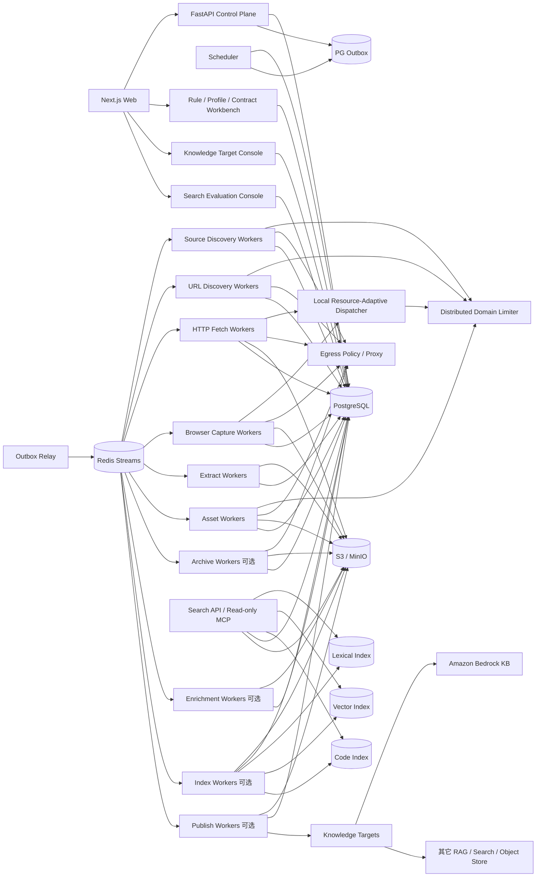

# 博客知识库技术方案

适用范围：约 1000 个技术博客网站的全量历史文章采集、Markdown 清洗、持续扩站、增量同步、Web 管理、全文/向量/代码检索，以及把已发布知识安全地同步到外部 RAG/知识库。设计目标是继续扩展到更多站点、数百万 URL，并稳定运行多年。

## 1. 目标与边界

### 1.1 核心目标

1. 新站接入后尽可能完整发现当前仍可访问的历史文章，并可选用 Common Crawl、Wayback 等公共历史索引补充已经删除、迁移或站内不再暴露的 URL/快照证据。
2. 将标题、作者、发布时间、更新时间、标签、canonical URL、正文、链接、代码块、表格、图片和附件统一清洗为稳定 Markdown。
3. 普通站点不编写独立爬虫；站点差异依次通过 Generic Profile、Platform Profile、Site Override、Extraction Contract、Custom Adapter 解决。
4. 支持长期增量同步，只处理新增、变化、删除确认、失败重试、低频 reconciliation 和规则/抽取器重放。
5. 支持断点续跑、幂等、去重、版本保留、失败隔离、离线 re-extract、回滚、暂停/恢复和 durable cancel。
6. 提供 Web 管理端完成站点接入、平台识别、范围确认、规则编辑、任务触发、进度监控、错误诊断、Markdown 预览、版本 diff、质量、安全、预算、Profile/Extraction Contract release 管理。
7. 首次历史回灌和日常增量使用同一套数据模型、任务系统、状态机和可观测体系。
8. HTTP 原始 response bytes、Browser rendered DOM、抽取候选、规则、Profile、Extraction Contract、质量门禁和 Serializer 全部可追溯。
9. LLM 不是 canonical 内容正确性的运行时依赖；LLM 可用于离线规则候选、摘要、标签、contextual embedding、代码摘要等派生能力，但不能静默改写正式正文。
10. 已发布 `article_version` 可以异步进入平台自身 Search/Vector/Code Search/MCP，也可以通过 Knowledge Sink / Publish Plane 同步到 S3、Amazon Bedrock Knowledge Bases 或其它外部知识库。
11. 下游检索、Embedding、Reranker、外部知识库或发布目标故障不得回滚 canonical Markdown，也不得为了重试而重新抓取源站。
12. 抓取并发既受全局/域级配额约束，也受 Worker 本地 RSS、CPU、Browser 页数和 event-loop lag 等实时资源压力约束，避免固定并发在少数大页面上触发 OOM。

### 1.2 “全量历史”的定义

- **Live Full**：通过 Feed、Sitemap、平台归档、普通归档页、站内链接和公开索引能够发现，且当前仍可访问的文章。
- **Archive Full（可选）**：在合规前提下，通过 Common Crawl、Wayback 等补充当前站点不再提供的 URL 或历史快照证据。

必须分别统计：发现 URL 数、当前可访问数、成功正文数、仅历史索引证据数、各 Discovery Source coverage、归档是否确认到达终点。不能用单一“抓取完成率”掩盖来源缺口。

### 1.3 非目标

- 不绕过登录、付费墙、验证码或明确禁止的访问控制。
- 不默认所有页面使用 Browser；HTTP 能完成时优先低成本路径。
- 不把 Redis、Crawl4AI cache、本地文件 cache、CLI 输出目录或进程内 URL list 当业务真相源。
- 不把 GitHub 当海量正文主存储；GitHub 只保存方案、规则、配置和少量导出。
- 不在 Web 请求处理函数里执行数分钟或数小时的全站抓取。
- 不把搜索引擎结果数量视为“历史全量”的证明。
- 不把 Vector DB、Amazon Bedrock、OpenSearch 或任意外部 RAG 后端当 canonical 内容真相源。
- 不把下游知识库“摄取成功”误认为源站抓取、正文质量或历史覆盖已经成功。

## 2. 设计原则

1. **Source Discovery、URL Discovery、Fetch、Capture、Extract、Quality Gate、Asset、Publish、Enrichment 解耦**。
2. **PostgreSQL 是业务状态真相源**；Redis 只承担队列、限流和短期协调。
3. **端到端流式和分批**；不把几十万 URL、超大 Sitemap、响应体、整站 crawl result 或媒体一次性装入内存。
4. **跨域并行、域内克制**；同一域所有 HTTP、Browser、Sitemap、Feed、归档和媒体访问共享限流。
5. **HTTP 优先，Browser 按原因升级**；抽取算法失败不等于页面需要 Browser。
6. **不可变抓取快照优先**；规则、Profile、Extraction Contract、抽取器、质量门禁和 Serializer 变化优先离线 replay。
7. **所有影响结果的 release/version 可追溯**：Platform Profile、Rule、Extraction Contract、Canonicalizer、Fetcher、Capture Profile、Extractor、Quality Gate、Serializer、Security Policy、Chunker、Contextualizer、Embedding、Reranker、Publish Adapter。
8. **第三方组件只做 Adapter/能力实现，不做业务状态中心**。Crawl4AI 可承担 HTTP/Browser 抓取执行和局部资源调度，但不能承担 Durable Frontier。
9. **控制面不执行重任务**；Web/API/Cron 只创建 durable job。
10. **所有 URL 入口和 redirect hop 统一经过 EgressPolicy**。
11. **远端输入有硬预算**：bytes、请求次数、递归深度、URL 数、XML elements、重定向、滚动次数、Browser 子请求和 wall time。
12. **部分成功显式表达**；正文成功、媒体失败、子 Sitemap 失败、归档未到终点、索引失败、Rerank 不可用、目标知识库同步失败都不能伪装成完全成功。
13. **PG 与队列通过 transactional outbox 避免双写窗口**。
14. **HTML/Markdown 结构重写在 DOM/IR/AST 层完成，不使用正则作为生产级结构解析器**。
15. **发现证据和抓取准入分离**；发现 URL/host 不代表允许自动访问。
16. **Profile/Selector/Contract 命中率可观测**；模板漂移必须能够一次影响、多站告警。
17. **Browser 复用进程，不默认跨站复用状态**；Cookie/localStorage/context 隔离优先于少量性能收益。
18. **LLM 生成的是候选规则或增强结果，不是运行时自动生效的生产真相**。
19. **站点拓扑是发现证据图，不是文章身份树**；同一 URL 允许由多个来源、多个父页面和多个 Provider 共同发现。
20. **Knowledge Access Plane 是可重建派生层**；全文索引、向量索引、代码索引、chunk、MCP/Search API 不得反向成为 canonical 内容真相源，也不得阻塞 `article_version` 发布。
21. **Knowledge Sink / Publish Plane 也是可重建派生层**；外部知识库只消费已发布 `article_version`。
22. **Metadata / provenance 是正式契约**；机器集成不依赖仅从 Markdown Front Matter 反向解析。
23. **desired state 与 observed state 分离**；外部知识库、S3 对象、索引状态必须能通过 reconciliation 对账并最终收敛。
24. **检索增强文本与 canonical 文本分离**；Contextual Embedding、代码摘要或 query rewrite 只能改变派生索引输入，不能覆盖用户看到的原始 chunk。
25. **索引更新先构建后切换**；禁止“先删 URL 旧 chunk，再生成/插入新 chunk”的破坏性更新窗口。
26. **资源自适应并发是局部保护层**；Worker 本地 dispatcher 只能收缩并发，不能突破全局 Scheduler 和 domain limiter 上限。

## 3. 总体架构



系统分为：

- **控制面**：站点、Platform Profile、规则、Extraction Contract、计划、权限、任务、发布、回滚、预算、Knowledge Target、Search Generation。
- **发现面**：Source Discovery + 多 Provider URL Discovery + Discovery Graph / Site Topology。
- **采集面**：HTTP Fetch、Browser Capture、Archive Fetch。
- **抽取面**：Site Selector、多 Extractor Adapter、Quality Gate、Article IR、Markdown Serializer。
- **协调面**：Redis Streams、DB lease、outbox、分布式限流、weighted fairness、backpressure、Worker 本地 Resource-Adaptive Dispatcher。
- **治理面**：Egress、SSRF、robots、输入预算、预览隔离、日志脱敏、供应链和 contract test。
- **增强面（可选）**：摘要、标签、实体、contextualization、embedding、code summary，完全依赖已发布 `article_version`。
- **知识访问面（可选）**：基于已发布 `article_version` 构建版本化 AST chunk、全文索引、向量索引、代码索引、Hybrid Search、Rerank 和只读 MCP；任何索引均可从 PG/S3 重建。
- **知识发布面（可选）**：把已发布 `article_version` 转换成版本化 Publish Bundle，通过 Adapter 同步到本地 Markdown、S3、Amazon Bedrock Knowledge Bases 或其它外部知识库。

## 4. 推荐技术栈

| 层 | 推荐 | 说明 |
|---|---|---|
| API | Python + FastAPI | 只做控制面、CRUD、任务创建和查询 |
| Web | React / Next.js | 站点、Profile、规则、Contract、任务、diff、质量、安全、Topology、Search、Knowledge Target |
| 状态 | PostgreSQL | 真相源、事务、唯一约束、lease、outbox、审计 |
| 队列 | Redis Streams + Consumer Group | at-least-once、pending reclaim、水平扩容 |
| 限流 | Redis + Lua | token bucket、domain concurrency lease、Retry-After |
| HTTP | httpx / aiohttp | 手动 redirect、conditional GET、streaming raw bytes |
| Browser | Crawl4AI / Playwright | 独立 worker、有限 slot、受控滚动/交互、public-only egress |
| Worker 本地资源调度 | Crawl4AI `MemoryAdaptiveDispatcher` 思路或自研等价实现 | 根据 RSS/CPU/event-loop lag 动态收缩实际并发，不替代全局/domain limiter |
| 通用正文抽取 | `RsTrafilaturaDirectAdapter` + Crawl4AI Generic Adapter | 多候选进入平台 Quality Gate |
| DOM/IR | lxml/selectolax/BeautifulSoup + 自定义 Article IR | 结构化链接、正文和资源 |
| XML | defusedxml + XMLPullParser/iterparse | 禁 DTD/entity，流式 Sitemap |
| Markdown | 平台 AST/Serializer | 确定性、版本化输出 |
| 对象存储 | S3 / MinIO | raw bytes、rendered DOM、候选、Markdown、媒体、索引构建产物、publish bundle |
| 全文/向量检索 | PostgreSQL FTS + pgvector 起步；按规模迁移 OpenSearch/Qdrant/Milvus | 派生索引、generation 版本化、可重建 |
| Rerank | 可选 CrossEncoder / API reranker | 只处理 Hybrid top-N，版本化、可降级 |
| MCP | FastAPI 工具层 / MCP Adapter | 默认只读，只暴露 search/list/get/search_code；禁止 crawl/delete/admin/raw snapshot |
| 外部知识库发布 | Publish Adapter | Bedrock S3、通用 S3、其它 RAG/API；都只消费 `article_version` |
| 监控 | Prometheus + Grafana + OpenTelemetry | 系统 SLO + 业务质量 + Profile drift + 搜索/发布新鲜度 |
| 安全/供应链 | OSV/pip-audit + Bandit/Semgrep + lockfile + SBOM | 依赖固定、镜像 digest、漏洞与回归 |
| 部署 | Docker Compose 起步，Kubernetes 按瓶颈引入 | Worker 类型隔离、可水平扩展 |

## 5. 站点接入、Platform Profile 与 Extraction Contract

接入层级从低成本到高定制依次为：

1. **Generic Profile**：Feed/Sitemap + 通用抽取。
2. **Platform Profile**：WordPress、Ghost、Substack 等复用归档入口、page type、URL pattern、selector、滚动/交互能力。
3. **Site Override**：站点对 Platform Profile 做声明式覆盖。
4. **Extraction Contract**：版本化描述字段、正文区域、metadata、selector 和 fallback 顺序。
5. **Custom Adapter**：特殊 API、复杂身份、非常规分页或不可声明逻辑。

普通站点不能因为一个 selector 差异就新增 Worker 类型。

### 5.1 Platform Profile

```text
platform_profiles
- id
- platform_name
- release_version
- status(testing/active/retired)
- fingerprint_json
- page_type_rules_json
- discovery_recipes_json
- extract_defaults_json
- browser_actions_json
- browser_capabilities_json
- identity_hints_json
- source_ref
- artifact_digest
- created_at

site_platform_bindings
- site_id
- platform_profile_id
- confidence
- detected_evidence_json
- override_json
- status(candidate/approved/disabled)
- approved_by / approved_at
```

### 5.2 Extraction Contract

Contract 至少描述：

- required/optional metadata fields；
- article body selector / exclusion selector；
- JSON-LD / meta / OpenGraph / DOM selector 优先级；
- page type 约束；
- URL/canonical/identity hint；
- primary/fallback extractor 路由；
- Browser 需求只能作为显式 capability，不能因 selector 失败自动升级；
- quality threshold 与 golden coverage 指标。

发布流程：

```text
representative immutable snapshots
 -> DOM/page-type clustering
 -> candidate generation(manual/template/inferred/LLM)
 -> deterministic golden replay
 -> required field/body coverage + boilerplate + canonical + structure metrics
 -> shadow diff
 -> canary
 -> active release
```

LLM 只生成 candidate，不在线自动修改正式规则。

## 6. 核心数据模型

### 6.1 Site、Host 与 Rule

```text
sites(id, name, base_url, status, robots_policy, default_schedule, config_json, active_rule_version, ...)
site_hosts(site_id, host, status, discovered_via, approved_by, approved_at, reason)
site_rules(id, site_id, version, status, discovery_rule_json, fetch_rule_json, capture_rule_json, extract_rule_json, quality_rule_json, identity_rule_json, asset_rule_json, metadata_rule_json, security_rule_json, ...)
```

### 6.2 Discovery Source 与 Checkpoint

```text
discovery_sources
- id
- site_id
- host
- kind(feed/sitemap/ordered_archive/archive/homepage/deepcrawl/llms_txt/search_index/commoncrawl/wayback/custom)
- normalized_url
- discovered_via
- profile_release_id
- ordered_stable
- status(candidate/active/degraded/disabled)
- etag / last_modified
- provider_version
- last_success_at / last_error_at
- error_code

discovery_runs
- id
- site_id
- source_id
- provider
- status(running/completed/partial/budget_exhausted/failed/cancelled)
- end_condition
- checkpoint_before / checkpoint_after
- discovered_count / unique_count / accepted_count / rejected_count
- budget_json
- started_at / finished_at

discovery_checkpoints
- site_id
- source_id
- provider
- scope_key
- cursor_json
- etag / last_modified
- collection_id
- last_success_at / last_error_at
```

`llms.txt/llms-full.txt` 只作为技术站点可选 source hint；它不能单独证明历史全量，也不能绕过当前 scope/robots/Egress/Fetch 验证。

### 6.3 Frontier 与 Discovery Graph

```text
frontier_urls
- id
- site_id
- normalized_url
- url_hash
- first_seen_at / last_seen_at
- lastmod_hint / pubdate_hint
- priority
- status
- next_fetch_at
- lease_owner / lease_until

frontier_url_sources(...)
discovery_edges(... relation=link/sitemap_child/feed_item/archive_entry/redirect/canonical ...)
```

约束：`UNIQUE(site_id, url_hash)`。Frontier 与边证据写入持久化数据库；禁止把 Crawl4AI 递归抓取函数中的进程内 `visited set` 当长期真相。

### 6.4 Capture Snapshot

```text
fetch_snapshots
- id
- site_id
- frontier_url_id
- requested_url / final_url
- capture_kind(http/browser/archive)
- status_code
- etag / last_modified
- response_content_type
- response_charset_hint
- decoder_observation_json
- body_sha256
- raw_byte_size
- object_key_http_raw
- object_key_rendered_dom
- capture_profile_version
- fetcher_version
- browser_engine_version
- security_policy_version
- fetched_at
```

HTTP `body_sha256` 基于原始 response bytes；Browser rendered DOM 是独立 Unicode artifact。

### 6.5 Extractor Attempt 与 Article Version

```text
extraction_attempts
- id
- site_id
- snapshot_id
- input_sha256
- extractor_release_id
- extraction_contract_release_id
- config_hash
- input_kind
- page_type
- raw_quality_score
- platform_quality_score
- quality_gate_version
- status(pass/fail/fallback/review/rejected_non_article)
- reason_codes_json
- object_key_candidate
- metrics_json
- cpu_ms / wall_ms / peak_rss_bytes

articles
- id
- site_id
- article_key
- accepted_canonical_url
- current_version_id
- status(active/missing_suspected/source_deleted/rejected/access_restricted)
- first_published_at
- last_source_seen_at

article_versions
- id
- article_id
- source_snapshot_id
- selected_extraction_attempt_id
- content_sha256
- markdown_sha256
- object_key_md
- extractor_version
- extraction_contract_release_id
- profile_release_id
- quality_gate_version
- rule_version
- serializer_version
- metadata_schema_version
- metadata_json
- provenance_json
- created_at
```

Enrichment 失败不影响 `article_version` 发布。

### 6.6 Job、Outbox 与 Worker Resource State

```text
jobs(id, type, site_id, status, priority, requested_by, budget_json, cancel_requested, ...)
job_items(job_id, item_key, stage, status, attempt, retry_at, lease_owner, lease_until, last_error_code)
outbox_events(id, aggregate_type, aggregate_id, stream, payload_json, published_at)
worker_heartbeats(worker_id, worker_type, rss_bytes, cpu_percent, event_loop_lag_ms, active_slots, browser_pages, local_concurrency_limit, pressure_state, updated_at)
```

`worker_heartbeats` 只用于调度和观测，不代替 job/lease 真相。

### 6.7 Knowledge Access Plane

```text
search_generations
- id
- lexical_backend
- vector_backend
- code_backend
- chunker_version
- contextualizer_version nullable
- embedding_provider nullable
- embedding_model nullable
- embedding_dimension nullable
- reranker_provider nullable
- reranker_model nullable
- retrieval_profile_version
- status(building/shadow/active/retired/failed)
- config_hash
- created_at / activated_at

search_chunks
- id
- generation_id
- article_id
- article_version_id
- heading_path
- chunk_index
- canonical_text_hash
- embedding_input_hash nullable
- token_count
- canonical_text_ref
- contextual_summary_ref nullable
- metadata_json

code_units
- id
- generation_id
- article_id
- article_version_id
- heading_path
- language
- code_sha256
- canonical_code_ref
- context_ref
- summary_ref nullable
- embedding_input_hash nullable
- metadata_json

article_index_states
- article_version_id
- generation_id
- lexical_status
- vector_status
- code_status
- contextualization_status
- last_error_code
- indexed_at
```

canonical chunk/code 与 contextual/summary 派生字段严格分离。

### 6.8 Knowledge Sink / Publish Plane

```text
knowledge_targets(...)
publish_generations(...)
publish_documents(... desired_state/status ...)
publish_tombstones(...)
```

Publish Plane 只消费已发布 `article_version`，所有目标都通过 desired/observed reconciliation 收敛。

## 7. Discovery 设计

### 7.1 Source Discovery 与 URL Discovery 分离

统一接口：

```python
class DiscoveryProvider(Protocol):
    async def scan(self, site, source, checkpoint, budget) -> AsyncIterator[DiscoveredUrl]: ...
```

内置 Provider：

- `FeedProvider`
- `SitemapProvider`
- `OrderedArchiveProvider`
- `ArchivePageProvider`
- `HomepageProvider`
- `DeepCrawlProvider`
- `LlmsTxtProvider`（可选 hint）
- `SearchIndexSourceDiscoveryProvider`（可选，只发现 Source 候选）
- `CommonCrawlProvider`
- `WaybackProvider`
- `CustomAdapterProvider`

Crawl4AI 的递归/批量抓取可作为 `DeepCrawlProvider` 内部执行器，但发现结果必须逐批落 PG Frontier 和 Discovery Graph，不能等整站结果返回后统一入库。

### 7.2 Admission Pipeline

```text
raw URL
 -> syntax parse
 -> security normalization
 -> Egress precheck
 -> approved host/scope
 -> canonicalizer_version
 -> include/exclude
 -> page/asset heuristic
 -> accepted/rejected + reason
 -> Frontier UPSERT
 -> source/edge evidence UPSERT
```

所有 rejection reason 可统计。

### 7.3 Site Topology

Web 提供：Discovery Tree、Sitemap Tree、Archive Tree、Link Graph、Identity Graph；树只是一种投影，不参与 article identity。

主要指标：depth 分布、orphan URL、source-only URL、multi-entry URL、分支 discovered_count、Sitemap 与 HTML graph 覆盖差集。

## 8. 全量历史发现

### 8.1 Sitemap

入口取 robots.txt `Sitemap:`、常见路径、人工配置、历史成功入口和页面发现入口的并集。

大型 Sitemap：

```text
HTTP stream
 -> compressed bytes limiter
 -> bounded decompressor
 -> decoded bytes/compression ratio limiter
 -> secure XMLPullParser
 -> batch UPSERT frontier
 -> batch UPSERT topology edge
 -> checkpoint
```

支持 `<urlset>`、`<sitemapindex>`、namespace、gzip、相对 child URL、嵌套、cycle 检测和 partial success。

### 8.2 Feed / Ordered Archive

Feed 保存 ETag/Last-Modified 和 guid/url/pubdate cursor，用于低延迟；不承担历史完整性。

Ordered Archive 首次 backfill 持续分页/滚动直到 `end_reached` 或明确 partial。增量允许 `known_streak` 快停，但低频 reconciliation 必须更深扫描。

### 8.3 llms.txt / llms-full.txt

对技术博客/文档站可探测 `llms.txt`/`llms-full.txt`：

- 只作为 URL/source hint；
- 记录 provider version 与 validator；
- 其中 URL 仍走 Admission、Egress、robots、当前 Fetch；
- 不用其“列出内容”覆盖 canonical 抓取证据；
- 不宣称其天然代表全站历史。

### 8.4 Common Crawl / Wayback

按 collection/CDX cursor checkpoint；只有首次 backfill、新 collection 或低频 reconciliation 才扫描。公共索引 URL 仍经过 scope、Egress 和当前 Fetch 验证。

### 8.5 Deep Crawl

普通 Archive/Homepage 不完整时可使用 Crawl4AI BFS/DFS/BestFirst 等执行器，但必须设置 max depth、max pages、domain limiter 和 budget，并流式写 durable Frontier；达到 `max_depth/max_pages` 只能标 partial，不能标“全量完成”。

## 9. Robots、限流与 Egress

### 9.1 Robots

默认 `robots_policy: respect`。robots.txt 使用 TTL + ETag/Last-Modified；区分 404、网络失败、解析失败，并支持显式 fail-open/fail-closed 策略。

### 9.2 Domain Limiter

同一域的 Sitemap、Feed、Archive、HTTP、Browser 顶层、Browser 子资源和媒体共享总限流。失败、timeout、redirect 同样消耗 token/预算。

Redis + Lua 实现 token bucket、domain concurrency lease、Retry-After 动态降速和 lease TTL。

### 9.3 Egress / SSRF

统一 `EgressPolicy`：

1. 只允许 HTTP/HTTPS。
2. 拒绝 userinfo、异常端口和混淆 host。
3. 默认拒绝 localhost、RFC1918、link-local、multicast、reserved、unspecified、cloud metadata、IPv4-mapped IPv6。
4. DNS 解析结果任一地址命中禁止网段则拒绝。
5. HTTP 禁自动 redirect；每个 hop 重新校验 URL、DNS、approved host 和 redirect budget。
6. canonical、`<base href>`、Feed、Sitemap、Archive、llms.txt、搜索索引候选、页面、媒体和 Browser 子资源都走同一策略。
7. Browser Worker 使用网络级 egress proxy/namespace 第二道防线，不使用 host network。

## 10. HTTP Fetch、Browser Capture 与资源自适应并发

### 10.1 HTTP 快路径

1. Egress + robots + domain limiter 准入。
2. 带 `If-None-Match` / `If-Modified-Since`。
3. 手动 redirect，逐 hop 校验。
4. streaming body，限制 bytes/wall time，原始 bytes 流式写对象存储。
5. 304 -> unchanged，不 Extract。
6. 200 且 raw body hash 未变 -> 更新 seen/validator，不创建版本。
7. 变化才创建 immutable snapshot 并进入 Extract。

404/410 多轮确认后才进入删除状态机。

### 10.2 Browser 升级

Browser 只解决 CSR shell、正文依赖 JS、受控滚动/virtual scroll、等待 selector、公开 load-more 等输入完整性问题。DOM 完整但抽取差时先换 Extractor/selector/Contract。

### 10.3 Browser Process Pool

- 复用 Browser process；
- 每站/每任务隔离 context；
- `max_pages_per_process`、`max_process_age`、RSS 阈值、page wall-time、子请求数和总字节均有限制；
- crash 只影响当前 item，可通过 lease 重试。

### 10.4 Resource-Adaptive Local Dispatcher

借鉴 Crawl4AI `MemoryAdaptiveDispatcher` 的思想，每个 Fetch/Browser Worker 内维护局部资源门禁：

```text
configured_local_max
actual_limit = min(configured_local_max, resource_pressure_limit)
```

压力输入至少包括：

- RSS / cgroup memory；
- Browser process memory；
- active page 数；
- CPU load；
- event-loop lag；
- open file/socket；
- S3/MinIO 写延迟；
- GC/进程异常趋势。

状态建议：`normal -> throttled -> critical`。进入 critical 时停止领取新 item，只完成/释放已持有 lease；恢复需要 hysteresis，防止并发抖动。

该 dispatcher 永远不能突破 Scheduler 的 Worker 类型配额和 domain limiter；它是本机 OOM 防线，不是站点公平性机制。

## 11. 多 Extractor、Quality Gate、Metadata 与 Article IR

优先级：

1. `SiteSelectorExtractor` / 已发布 Extraction Contract fast path。
2. `RsTrafilaturaDirectAdapter`。
3. `Crawl4AIGenericExtractor`。
4. 其它 Adapter。

HTTP snapshot 优先从 raw bytes 抽取；Browser rendered DOM 使用 Unicode HTML。正文抽取前不对完整 HTML 任意 chunk。

### 11.1 Metadata Candidate Resolver

JSON-LD、OpenGraph、meta、站点 selector、正文 DOM、通用 Extractor、归档 hint 等都只产生 candidate：

```text
field/value/source_type/source_location/confidence/rule_version/snapshot_id/raw_or_normalized
```

低置信度来源不能静默覆盖高置信度值。

### 11.2 Platform Quality Gate

综合：正文字数和段落、heading/list/code/table/link/image 保留、boilerplate 比例、链接密度、template fingerprint、重复正文、title/正文一致性、page type、selector/contract 命中、raw/rendered DOM 正文信号、extractor warning 与历史 golden 表现。

输出：`pass`、`retry_alternate_extractor`、`need_browser`、`manual_review`、`reject_non_article`。

### 11.3 Article IR 与确定性 Markdown

```text
Extraction Candidate
 -> Metadata Candidates
 -> Article IR
 -> URL/base/canonical resolution
 -> asset resolution
 -> normalization
 -> Markdown AST/Serializer
 -> Markdown
```

相同 `snapshot + rule/profile/contract/extractor/quality/serializer release` 应得到相同 Markdown hash。

## 12. URL、Canonical 与 Article Identity

URL Canonicalizer 版本化处理 scheme/host、默认端口、fragment、query、trailing slash、percent encoding、IDNA 和 tracking 参数；userinfo 拒绝。

canonical 候选优先级：站点 identity rule -> 合法 `<link rel=canonical>` -> JSON-LD `mainEntityOfPage` -> final URL -> requested URL。跨域 canonical 默认不接受。

`article_key = hash(site_id + stable_identity)`；别名进入 `article_aliases`，不得依赖发现顺序或 Discovery Graph parent。

对象路径使用稳定 identity：

```text
articles/{site_id}/{article_id}/{article_version_id}.md
```

## 13. 媒体与附件

从 DOM/IR 提取 `src/srcset/picture/source` 和附件。下载执行 Egress + robots/站点策略 + domain limiter + bytes/request budget，使用 streaming、magic sniff、ETag/Last-Modified 和逐 hop redirect。

按真实 `content_sha256` 去重；SVG、HTML、可执行附件等 active content quarantine。Web 预览从独立无 Cookie origin 提供。

## 14. 增量同步

### 14.1 Provider Checkpoint

- Feed：ETag/Last-Modified + guid/url/pubdate cursor。
- Sitemap：root/child validator + tree health + lastmod hint。
- Ordered Archive：newest article、head signature、cursor、known streak、last full reconciliation。
- llms.txt：validator + source hash，只作 hint。
- Common Crawl：collection id + provider version。
- Wayback：CDX cursor/时间范围。
- 普通 Archive/Homepage：validator + pagination/scroll cursor。

### 14.2 页面 Checkpoint

ETag、Last-Modified、304、raw body hash、content hash、Markdown hash 独立保存。只有 accepted canonical output 变化才创建新 `article_version`。

### 14.3 删除与迁移

```text
active -> missing_suspected -> source_deleted
```

一次 404、一次 Sitemap 消失或一次归档列表缺失不能直接删除文章。确认删除/合并后，Search Plane 产生 delete/reindex，Publish Plane 产生 tombstone/delete，历史 snapshot/version/provenance 保留。

## 15. 幂等、重试、取消与部分成功

典型错误码：

```text
network_timeout
dns_failed
egress_denied
robots_denied
redirect_denied
response_too_large
budget_exhausted
sitemap_cycle
sitemap_parse_error
archive_end_unknown
profile_selector_drift
browser_timeout
worker_memory_pressure
worker_resource_critical
extract_timeout
extract_oom
extract_empty
extract_quality_failed
canonical_conflict
asset_failed
storage_error
index_chunk_failed
contextualization_failed
index_embedding_failed
index_code_failed
reranker_unavailable
index_backend_failed
publish_target_sync_failed
publish_target_verify_failed
```

Retry：429 尊重 Retry-After；5xx/timeout 指数退避 + jitter；security/robots/access_restricted 不无限重试；parse/extract 基于 snapshot replay；index/contextualization/embedding/rerank/publish 基于已发布 `article_version` 重试，不重新抓源站。

取消只写 `cancel_requested=true`；Scheduler 停发新 item，worker 在领取和阶段边界检查，`finally` 释放 domain lease、DB lease 和 Browser context。

## 16. 并发、调度、公平性与 Backpressure

四层并发：

```text
平台总并发
 -> Worker 类型并发
   -> 站点/域并发
     -> Worker 本地 Resource-Adaptive Dispatcher
       -> 单页面子请求并发
```

网络 I/O、Browser、CPU 抽取、Embedding/Index、Rerank 和 Publish 使用不同资源池。

采用 weighted fair queue：日常增量高于历史 backfill，单个大站不能垄断全部 Worker。

PG/S3 延迟、Redis pending、Extract backlog、Browser RSS、event-loop lag、Embedding quota、Search backend 延迟或 Knowledge Target rate limit 异常时，Scheduler 降低对应上游速度；Worker 本地高内存压力时进一步收缩本机并发。

禁止对 1000 域一次性 `gather()`；URL Discovery 和 Fetch 始终按 Frontier lease 分批推进。

## 17. Knowledge Access Plane

### 17.1 Canonical 与派生索引解耦

只有 `article_version` 发布后才发索引事件：

```text
article_version
 -> AST chunks / code_units
 -> contextualization optional
 -> lexical/vector/code index
 -> Hybrid/Rerank
 -> Search API / MCP
```

任一派生环节失败只更新 `article_index_states`。

### 17.2 AST-aware Chunking

技术博客默认从最终 Markdown AST/Article IR 切块：

1. 先按 heading section 分组。
2. 段落/list/blockquote/code/table 作为 block 原子单位。
3. 超长 section 再按 token budget 拆分。
4. code fence 与 table 除非超过硬限制，否则不从中间截断。
5. 每个 chunk 保存 `article_version_id + heading_path + chunk_index + canonical_text_hash`。

禁止使用只看字符位置的 ```/空行启发式作为生产 canonical chunker。

### 17.3 Contextual Embedding

为提高技术短 chunk 的语义完整性，可选构造：

```text
embedding_input =
  title
+ heading_path
+ optional concise document context
+ canonical_chunk_text
```

关键约束：

- `canonical_chunk_text` 原样保存并作为 Search 返回正文；
- contextual text 只作为 embedding 输入，不覆盖正文；
- contextualizer 使用 LLM 时记录 model/prompt/version/input_hash；
- contextualizer 失败时退化为 `title + heading_path + canonical chunk`；
- 并发结果必须按稳定 chunk id/index 回写，禁止按 future 完成顺序 append 后与 metadata 错位；
- contextualization 可批量重跑，不 refetch。

### 17.4 Code Units 与代码专用检索

从 Markdown AST 直接提取 fenced code block，而不是再次扫描字符串 fence：

```text
Article AST code block
 -> language + heading_path + surrounding prose
 -> code_units
 -> lexical/vector index
 -> optional code summary enrichment
```

`code_units` 使用 `code_sha256` 稳定身份。原始代码永远来自 canonical Markdown；LLM code summary 只用于检索增强。

只读 MCP 可提供：

```text
search_articles(...)
search_code_examples(query, language?, site_ids?)
list_articles(...)
get_article(...)
```

### 17.5 Lexical + Vector Hybrid

全文检索负责精确技术词、类名、函数名、错误信息和 URL/path；向量检索负责同义与语义召回。两路默认并行并采用 RRF：

```text
score(d) = Σ 1 / (k + rank_i(d))
```

不直接把 BM25 raw score、cosine similarity 和人工常量硬相加。

### 17.6 可选 CrossEncoder Rerank

对 Hybrid top-N（例如 20~100）可增加 CrossEncoder/API rerank：

```text
Lexical + Vector
 -> RRF candidate set
 -> versioned reranker
 -> top K
```

要求：

- `reranker_model/provider/version` 进入 Search Generation；
- 设置候选数、batch、p95 latency 和超时；
- 不可用时降级回 RRF；
- 新 reranker 先 shadow query set 比较 Recall@K、MRR/nDCG、p95；
- reranker 不改变索引或 canonical 数据。

### 17.7 Generation 生命周期

```text
building -> shadow -> active -> retired
       \-> failed
```

新 chunker、contextualizer、embedding model、维度、code index 或 reranker 参数变化时创建新 generation：从 canonical `article_version` 重建，shadow 验证后原子切 active。

禁止：

```text
DELETE old chunks for URL
 -> call embedding/contextualizer
 -> INSERT new chunks
```

因为中间任一步失败会造成检索空窗。应先完整构建新版本，再切换 desired/active state。

### 17.8 Search/MCP 权限边界

MCP 默认只读，禁止：

```text
crawl arbitrary URL
delete article/site
publish rule/profile/contract
read raw snapshot/rendered DOM
read secrets/admin audit internals
```

落实认证、tenant/site scope、结果数量与正文长度上限、速率限制和审计。

## 18. Knowledge Sink / Publish Plane

Publish Plane 输入永远是：

```text
已发布 article_version + canonical Markdown + versioned metadata/provenance
```

先构建 target-independent Publish Bundle，再由 Adapter 转换为目标格式。

### 18.1 Adapter

```python
class KnowledgeTargetAdapter(Protocol):
    async def stage(self, bundle, content_ref, target_config) -> PublishArtifact: ...
    async def sync(self, generation_or_batch) -> TargetSyncResult: ...
    async def verify(self, sync_result) -> TargetObservedState: ...
    async def delete(self, article_identity) -> TargetMutationResult: ...
```

内置：`LocalMarkdownAdapter`、`GenericS3Adapter`、`BedrockS3Adapter`。

### 18.2 Bedrock S3

对需要 `.metadata.json` 的目标，正文和 sidecar 必须 stage + hash verify + manifest 后再触发 sync。metadata mapping、字段大小和 `includeForEmbedding` 全部版本化。

### 18.3 增量与 Reconciliation

```text
article_version published
 -> target desired state UPSERT
 -> stage
 -> sync
 -> verify observed state
```

定期对账 canonical desired set 与 target observed set，发现 missing/stale/orphan/wrong_hash 只 replay Publish Plane，不 refetch。

## 19. Web 管理功能

### 19.1 站点与平台

新增/编辑/禁用站点、probing、host approve/reject、Platform Profile candidate/binding/release、robots、限流和预算。

### 19.2 Discovery / Topology

展示 Source、Sitemap 树、Feed/Archive/llms.txt/CC/Wayback checkpoint、accepted/rejected reason、多来源 attribution、end condition、partial/budget exhaustion、Discovery Tree/Sitemap Tree/Archive Tree/Link Graph/Identity Graph。

### 19.3 任务

全量 backfill、单站增量、reconciliation、source probing、单 URL 重抓、re-extract without refetch、asset retry、export、enrichment、reindex、code reindex、re-contextualize、re-embed、re-publish、cancel/pause/resume。

### 19.4 Rule / Profile / Contract Workbench

支持 draft/testing/publish/rollback、golden snapshot、shadow replay、selector/body coverage、Markdown diff、canonical/metadata 变化、canary 和 drift。

### 19.5 Content

展示 extraction attempt、input kind/hash、extractor/contract release、quality reason、Markdown 预览、metadata provenance、raw/rendered DOM、article version diff、alias/canonical 和 asset relation。

### 19.6 Search Evaluation

新增：

- AST chunk 与 heading path 预览；
- canonical chunk vs embedding input/contextual summary 对比；
- code unit/language/context 预览；
- lexical/vector/code/hybrid/rerank 命中对比；
- Search Generation building/shadow/active；
- chunker/contextualizer/embedding/reranker version；
- fixed query set、Recall@K、MRR/nDCG、空结果率、p95 latency；
- contextualization fallback rate；
- reranker timeout/degrade rate；
- reindex/re-embedding/re-contextualization 任务和 backlog。

### 19.7 Worker Resource Console

展示：

- worker RSS / cgroup memory；
- active Browser pages；
- local concurrency configured/actual；
- pressure state；
- event-loop lag；
- 自动 throttle 次数与持续时间；
- OOM/recycle/reclaim 情况。

### 19.8 Knowledge Target

管理 target、secret reference、metadata mapping、adapter/config/schema version、generation、lag、pending/stale/failed/orphan、re-publish 和 reconciliation。

## 20. Web 预览、日志与凭证安全

raw HTML、rendered DOM、candidate HTML 和 Markdown 都来自不可信站点：

- raw/rendered HTML 不与管理端同源执行；
- iframe 严格 sandbox；
- 不注入管理端 cookie/token；
- Markdown 禁 raw HTML 或严格 sanitize；
- active content 独立无 Cookie origin。

统一 `LogSanitizer`：URL 去 userinfo/query/fragment；header allowlist；禁止 Authorization/Cookie/Set-Cookie；exception、dead-letter、OTel 和 Web 错误页共用同一 sanitizer。

Search/MCP 返回正文时同样走内容长度、tenant/site scope、权限和日志脱敏。

## 21. 可观测性与 SLO

### 21.1 业务指标

- 每站发现 URL 与 source coverage；
- archive end condition；
- profile/contract selector hit、required field/body coverage；
- fetch success/304/changed；
- Browser fallback；
- extract empty/quality fail；
- article version churn；
- reconciliation missing；
- topology orphan/source-only/multi-entry；
- index freshness、pending/failed、generation coverage；
- code unit coverage；
- contextualization success/fallback/cost；
- lexical/vector/code/hybrid 空结果率与互补率；
- reranker applied/degraded/timeout；
- publish target lag、pending/stale/failed/orphan。

### 21.2 系统指标

Redis lag/pending、DB lease/reclaim、PG/S3 latency、HTTP status/latency、Browser slot/RSS/process recycle、Extract CPU/RSS/wall time、domain limiter wait、worker local concurrency、resource pressure state、Embedding API latency/error/cost、Reranker latency/error、Search backend QPS/index throughput、Publish target rate limit/error。

### 21.3 关键 SLO

- canonical article 发布不受 Search/Embedding/Rerank/Publish target 故障影响；
- 新增/变化文章从 source changed 到 canonical published 有明确 p95；
- canonical published 到 active search/index 有明确 p95；
- Worker 进入高资源压力后能自动收缩并发且不丢 job；
- 任意 `article_version` 可解释其抓取、抽取、索引、发布 provenance；
- 任意 Search result 可追溯到 canonical chunk/code unit 与 generation；
- 任意 target orphan/missing/stale 能被 reconciliation 发现。

## 22. 存储、Markdown 与导出

对象 key：

```text
snapshots/{site_id}/{snapshot_id}/http.raw
snapshots/{site_id}/{snapshot_id}/rendered.html
extractions/{site_id}/{snapshot_id}/{attempt_id}.json
articles/{site_id}/{article_id}/{version_id}.md
assets/sha256/{prefix}/{full_hash}
enrichments/{article_version_id}/{kind}/{result_id}.json
search/{generation_id}/{article_version_id}/chunks.json
search/{generation_id}/{article_version_id}/code_units.json
search/{generation_id}/{article_version_id}/contextualization.json
exports/{export_id}/...
publish/{target_id}/{generation_id}/{site_id}/{article_id}/{article_version_id}/document.md
publish/{target_id}/{generation_id}/{site_id}/{article_id}/{article_version_id}/document.md.metadata.json
```

PG 保存 metadata/object key，不存大正文。Search backend 和 Knowledge Target 都不保存无法从 canonical artifact 重建的唯一信息。

Markdown Front Matter：

```yaml
---
site_id: ...
article_id: ...
article_version_id: ...
url: ...
canonical_url: ...
title: ...
author: ...
published_at: ...
updated_at: ...
tags: [...]
source_snapshot_id: ...
---
```

正文不混入 LLM 摘要、contextual summary 或 code summary。

## 23. 推荐配置示例

```yaml
site_id: example
base_url: https://example.com
robots_policy: respect
schedule: "0 */6 * * *"

approved_hosts:
  - example.com
  - www.example.com

discovery:
  providers: [feed, sitemap, ordered_archive, archive]
  optional_providers: [llms_txt, commoncrawl, wayback]
  llms_txt:
    enabled: true
    paths: [/llms.txt, /llms-full.txt]
    treat_as_coverage_source: false
  sitemap:
    max_depth: 16
    max_urls: 500000
    child_concurrency: 3
  archive:
    max_pages: 5000
    max_scrolls: 200
  topology:
    enabled: true
    max_edges_per_page: 500

fetch:
  http_first: true
  retain_raw_bytes: true
  max_body_bytes: 10485760
  redirect_max: 5
  browser_fallback: true

browser:
  process_pool: true
  local_concurrency_max: 6
  context_scope: site
  reuse_process: true
  reuse_context: false
  max_pages_per_process: 200
  max_process_age_s: 3600
  max_subrequests: 120
  max_bytes: 52428800
  wall_time_s: 90

resource_adaptive_dispatcher:
  enabled: true
  memory_soft_percent: 70
  memory_hard_percent: 85
  event_loop_lag_soft_ms: 200
  min_concurrency: 1
  hysteresis_seconds: 30

extract:
  priority:
    - approved_extraction_contract
    - rs_trafilatura_direct
    - crawl4ai_generic
  runtime: process
  processes_per_worker: 2

knowledge_access:
  enabled: true
  lexical_backend: postgresql_fts
  vector_backend: pgvector
  hybrid_fusion: rrf
  chunker:
    mode: markdown_ast
    preserve_code_blocks: true
    preserve_tables: true
  contextual_embedding:
    enabled: false
    use_title: true
    use_heading_path: true
    llm_context_optional: true
    fallback_without_llm: true
  code_search:
    enabled: true
    min_code_tokens: 20
    summary_enrichment: false
  reranker:
    enabled: false
    candidate_count: 50
    timeout_ms: 300
    degrade_to_rrf: true
  mcp:
    enabled: false
    read_only: true
    allowed_tools: [search_articles, search_code_examples, list_articles, get_article]
    denied_capabilities: [crawl, delete, admin, raw_snapshot]

knowledge_targets:
  - id: bedrock_main
    kind: bedrock_s3
    enabled: false
    secret_ref: secret://aws/bedrock-publisher
    bucket: knowledge-bucket
    prefix: blog-kb
    adapter_version: v1
    metadata_schema_version: v1
    reconciliation_schedule: "0 3 * * *"

limits:
  domain_concurrency: 1
  requests_per_second: 0.5
  requests_per_day: 20000
```

## 24. 部署路线

### Phase 1：生产最小闭环

Docker Compose：PostgreSQL、Redis、MinIO、API/Web、Scheduler/Outbox Relay、Discovery Worker、HTTP Worker、Browser Worker、Extract Worker、Asset Worker。

实现 Feed/Sitemap/OrderedArchive、Durable Frontier、conditional HTTP、raw-byte snapshot、Browser fallback、Platform Profile 基础、Article IR、Markdown、Web CRUD/任务/错误、增量 checkpoint、Egress、预算、日志 sanitizer、Worker 本地资源压力监控与自适应并发。

### Phase 2：历史覆盖与规则治理

Common Crawl/Wayback、可选 llms.txt、普通归档/Deep Crawl、Discovery Graph / Site Topology、golden/shadow Workbench、Extraction Contract / Schema Synthesis、Profile drift、soft-404、metadata conflict review。

### Phase 3：Knowledge Access Plane

先上线 `article_version` 驱动的全文检索，再加入 AST-aware chunk、异步 Embedding、版本化 vector generation、Hybrid RRF、Code Search。随后以 shadow query set 验证 Contextual Embedding 和 CrossEncoder Rerank，达标后再启用。

### Phase 4：Knowledge Sink / Publish Plane

实现 target registry、Publish Bundle、LocalMarkdown/GenericS3 Adapter，再加入 Bedrock S3 Adapter、metadata sidecar、target sync/verify、tombstone/delete 和 reconciliation。

### Phase 5：按瓶颈引入 Kubernetes

需要多机 Browser/Extract/Index/Publish pool、弹性扩容、节点隔离或高可用时迁移 K8s。1000 个站点本身不要求第一天上 K8s。

## 25. 初始容量建议

- domain concurrency = 1；
- domain delay = 1~3 秒或等价 token bucket；
- Sitemap child concurrency = 2~4；
- 同时 URL Discovery 的站点 = 10~50；
- HTTP 每进程配置上限 20~50 slot，但 actual slot 由本地资源 dispatcher 动态下调；
- Browser 每进程配置上限 4~8 slot，actual slot 动态收缩；
- Browser process 每 100~300 页或达到 RSS/年龄阈值 recycle；
- Extract 每节点 2~4 process 起步，每进程 1 in-flight；
- Frontier lease = 100~1000；
- Discovery UPSERT = 500~2000/批；
- Embedding、Contextualizer、Reranker、Publish 各自独立 quota/concurrency；
- Rerank 只处理 Hybrid top 20~100，不对全库运行 cross-encoder。

## 26. 关键流程

### 26.1 新站全量回灌

```text
Create Site
 -> probing
 -> robots + source discovery
 -> platform fingerprint
 -> candidate Profile + host/source review
 -> representative snapshots
 -> contract/profile match or synthesis
 -> golden shadow replay
 -> publish release
 -> URL Discovery Providers
 -> stream UPSERT Frontier + Discovery Graph
 -> Scheduler/outbox
 -> domain limiter
 -> local resource-adaptive dispatcher
 -> bounded HTTP Fetch
 -> Browser only when needed
 -> immutable snapshot
 -> extractor + Quality Gate
 -> Article IR + Metadata Resolver
 -> deterministic Markdown
 -> article_version
 -> async Search/Code/Publish
```

### 26.2 日常增量

```text
Feed/Sitemap/OrderedArchive/optional llms.txt scan
 -> new/changed URL evidence
 -> conditional HTTP GET
 -> 304: stop
 -> 200 same raw hash: update seen
 -> changed: new snapshot
 -> extract + quality gate
 -> meaningful accepted output change
 -> publish new article_version
 -> async chunk/contextualize/embed/code index/rerank generation state
 -> async publish targets
```

### 26.3 Search Generation Upgrade

```text
new chunker/contextualizer/embedding/code/reranker config
 -> create generation
 -> replay article_versions
 -> build lexical/vector/code artifacts
 -> fixed query set shadow evaluation
 -> activate generation atomically
 -> retain old generation
 -> retire after grace period
```

全程不 refetch，也不先删除旧可用索引。

## 27. 安全与可靠性控制矩阵

### 抓取入口

- 所有 URL：解析、canonicalization、approved host、Egress、robots、budget。
- Redirect：逐 hop 重验。
- Sitemap/XML：禁 DTD/entity、解压比率和元素数预算。
- Browser 子请求：网络层 public-only egress。

### 内容处理

- raw/rendered/candidate 均视为不可信。
- Extract Worker 隔离 CPU/RSS/native crash。
- deterministic serializer，不执行网页脚本。
- Markdown/Web preview sanitize + sandbox。

### 状态与任务

- PG 真相源。
- Redis at-least-once + DB lease + idempotency。
- PG/outbox transaction 防双写。
- Worker 本地资源状态只影响吞吐，不改变任务真相。

### Search / MCP

- 只读 allowlist。
- tenant/site scope。
- query rate/result size。
- canonical text 与 contextual text 分离。
- Reranker/Embedding 不可用可降级。
- 不开放 raw snapshot、admin、crawl、delete。

### Publish / Knowledge Target

- secret ref，不存明文。
- fixed endpoint/bucket/index allowlist。
- content/metadata hash + manifest。
- desired/observed state + reconciliation。
- target 失败不 refetch、不回滚 canonical。

## 28. 验收标准

### 28.1 功能

- Web 可新增站点并完成 probing/backfill/active 生命周期。
- 支持版本化 Platform Profile / Extraction Contract / rollback。
- 支持嵌套/gzip Sitemap、Feed、Ordered Archive、普通 Archive、Common Crawl/Wayback checkpoint。
- llms.txt 如启用只能作为 hint，不能声明全量完成。
- 支持 ETag/Last-Modified/304/raw body hash 增量。
- HTTP raw bytes 可持久化并 `re-extract without refetch`。
- 支持多 Extractor + Quality Gate。
- Metadata 候选、最终值和 provenance 可追溯。
- Worker 在内存/Browser 压力升高时能自动降低 local concurrency，不丢 job/lease。
- 已发布 `article_version` 可异步进入 lexical/vector/code index。
- Contextual Embedding 启用时 Search 返回的仍是 canonical chunk，不返回被 LLM 改写后的正文。
- `search_code_examples` 能返回可追溯到 article_version/heading/language/code_sha256 的代码块。
- Reranker 不可用时自动降级到 Hybrid RRF。
- Search generation 切换不产生“先删旧索引导致空窗”。
- 外部知识库失败不影响 canonical Markdown，不触发 refetch。

### 28.2 扩展性

- 新增普通站点或同平台站点不新增独立 Worker 类型。
- Discovery/Frontier 不依赖单进程内存 list/set。
- Worker 可横向扩展，Redis/DB lease 可 reclaim。
- 单个大站/Browser-heavy 站点不能垄断资源。
- Browser process 可复用但跨站状态隔离。
- Profile/Rule/Contract/Extractor 升级可基于历史 snapshot 离线回放。
- Search generation、Code Search、Contextualizer、Reranker 可独立升级，不需要 refetch。
- Knowledge Target Adapter 可新增而不修改 Discovery/Fetch/Extract 主链路。

### 28.3 数据质量

- 同文章 alias/canonical 稳定合并。
- Rule/Profile/Contract/Extractor/Serializer 变化可解释。
- Markdown 结构通过 DOM/IR/AST 处理。
- soft-404/SPA shell 不进入正式 article version。
- 归档 end condition 有证据；budget/scroll limit 显式 partial。
- 同一输入 + release/config 可稳定 replay。
- chunk 稳定追溯到 `article_version` 与 heading；代码块/表格默认不被任意字符切断。
- contextual embedding input 与 canonical chunk hash 分开记录。
- code unit 原文来自 canonical AST，不由摘要模型生成。
- Hybrid Search 默认 RRF，不把不可比较的原始分数硬拼接。

### 28.4 安全与可靠性

- redirect SSRF、Browser 子资源 SSRF 有应用和网络双层防线。
- Sitemap gzip/XML、响应体、归档滚动、媒体、请求次数有硬预算。
- robots policy 可审计。
- raw/rendered/candidate/Markdown 预览隔离。
- 日志和错误页不泄露 token/cookie。
- Browser/Extract CPU/RSS/native crash 被独立 worker/process 隔离。
- Worker resource-adaptive throttle 不突破 domain politeness，也不导致任务状态丢失。
- Search/MCP 受认证、tenant/site scope、速率和结果大小限制。
- DB/队列仍由 transactional outbox 保证。
- Knowledge Target credential 不进入 metadata、manifest、Markdown、日志或普通 Web API。

## 29. 最终推荐架构结论

生产系统主干保持：

```text
多 Provider URL Discovery
 -> Durable Frontier / Discovery Graph
 -> Scheduler + Domain Limiter
 -> Worker Local Resource-Adaptive Dispatcher
 -> HTTP-first Fetch + bounded Browser fallback
 -> Immutable Snapshot
 -> 多 Extractor + Extraction Contract
 -> Quality Gate
 -> Article IR + Metadata Resolver
 -> deterministic Markdown
 -> versioned article_version
```

在 `article_version` 之后分成两个完全可重建的派生面：

```text
A. Knowledge Access Plane
article_version
 -> AST chunks + code_units
 -> optional contextualization
 -> lexical/vector/code indexes
 -> RRF
 -> optional versioned reranker
 -> Search API / read-only MCP

B. Knowledge Sink / Publish Plane
article_version
 -> Publish Bundle
 -> target adapter
 -> local Markdown / S3 / Bedrock KB / other RAG
```

核心取舍是：

- Crawl4AI 的内存自适应并发可以吸收，但只能作为 Worker 本地保护层；
- Contextual Embedding 可以吸收，但增强文本不能覆盖 canonical chunk；
- 技术博客应增加独立 Code Search；
- CrossEncoder Rerank 应作为可关闭、可评估、可降级的 Search Generation 能力；
- Durable Frontier、conditional GET、immutable snapshot、article_version、generation switch、outbox、robots/Egress/SSRF 和 Web Control Plane 仍是生产系统不可替代的主骨架。

这样未来增加站点、替换 Crawl4AI、替换抽取器、切换向量数据库、增加代码检索模型、增加 Reranker 或外部知识库，都不需要重写整个系统，也不会让下游检索能力反向污染 canonical 知识资产。
