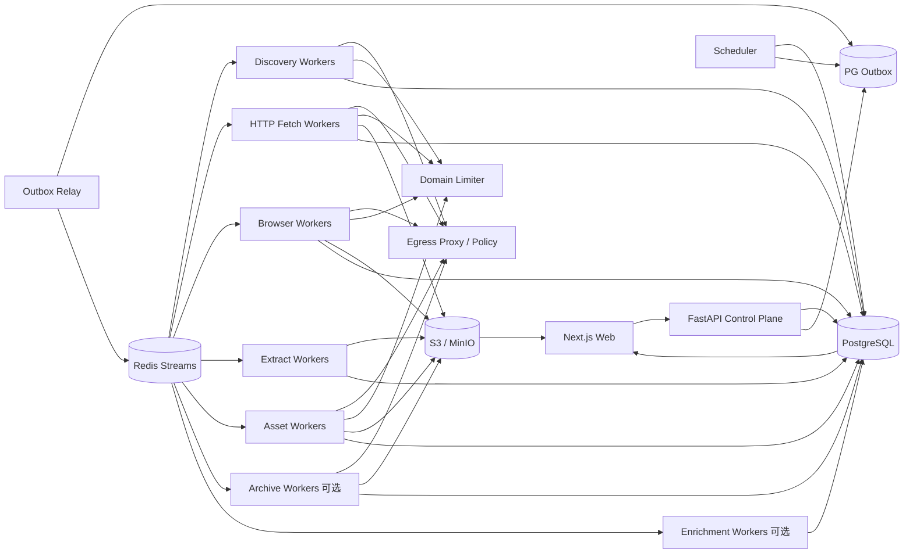

# 博客知识库技术方案

版本：v2.4  
日期：2026-08-14  
适用范围：约 1000 个技术博客站点的全量历史文章采集、Markdown 清洗、持续扩站、增量同步与 Web 管理；架构可横向扩展到数百万 URL。

## 1. 目标与边界

### 1.1 核心目标

1. 新站接入后尽可能完整发现并抓取当前仍可访问的历史文章。
2. 将标题、作者、发布时间、更新时间、标签、canonical URL、正文统一清洗为稳定 Markdown。
3. 支持约 1000 个站点长期运行，并可持续增加站点；普通站点不需要开发独立爬虫主流程。
4. 支持增量同步，只处理新增、更新、删除确认、规则重抽或需要重试的内容，避免周期性全站强刷。
5. 支持断点续跑、幂等、去重、版本保留、失败隔离、重试、规则回滚、离线重新抽取。
6. 提供 Web 管理端完成站点接入、URL 发现预览、规则编辑、任务触发、状态监控、错误诊断、Markdown 预览、版本 diff、安全事件、预算和质量监控。
7. 首次历史回灌与日常增量共用一套数据模型、队列、状态机、安全和可观测体系。
8. Sitemap、Feed、robots.txt、HTML、redirect、媒体、canonical、归档索引和第三方抓取结果全部视为不可信输入。
9. LLM 仅作为可选语义增强层，不参与基础 Markdown 正确性，不自动改写原文。

### 1.2 “全量历史”的定义

- **Live Full**：通过 Sitemap、Feed、归档页、站内链接或公开索引能够发现、且当前仍可访问的历史文章。
- **Archive Full（可选）**：在 Live Full 基础上，通过 Common Crawl、Wayback 等公开历史索引发现已删除、迁移或不再被当前站点暴露的 URL，并在 robots、版权、许可证与服务条款允许的情况下恢复历史快照。

“发现过历史 URL”与“已经拿到历史正文”必须分别统计。

### 1.3 非目标

- 不绕过登录、付费墙、验证码、反爬限制或明确访问禁止。
- 不默认所有页面都使用 Browser；HTTP 能完成时优先低成本路径。
- 不把 Redis、本地 crawler cache、CLI 输出目录或内存 URL list 当业务真相源。
- 不把 GitHub 当海量正文主存储；GitHub 仅保存方案、配置、规则和少量导出。
- 向量库/RAG 不作为采集一期强依赖，但数据模型预留 article/version/chunk/reference 字段。

## 2. 设计原则

1. **Discovery、Fetch、Extract、Asset、Enrich 解耦**。
2. **PostgreSQL 是业务状态真相源**；Redis 只承担分发、限流和短期协调。
3. **端到端流式和分批**；禁止将几十万 URL、超大 Sitemap、响应体或媒体批次一次性放入内存。
4. **跨域并发、域内克制**；同一域所有请求共享限流与预算。
5. **HTTP 优先，Browser 升级**。
6. **raw snapshot 优先保留**，规则变化优先离线 re-extract。
7. **规则、Schema、Canonicalizer、Fetcher、Extractor、Security Policy 全部版本化**。
8. **增量从发现阶段开始**，优先利用 Feed、Sitemap、HTTP Validator 减少无效访问。
9. **外部能力 Provider/Adapter 化**，Crawl4AI、Common Crawl、Wayback、LLM Provider 均可替换。
10. **控制面不执行重任务**，Web/API 只创建 durable job。
11. **默认拒绝危险出站目标**，所有 URL 入口和 redirect hop 都受统一 Egress Policy 约束。
12. **远端输入必须有硬预算**，同时限制 bytes、请求次数、递归、URL 数、时间、重定向、Browser 子请求。
13. **安全控制必须可测试、可观测、可审计**。
14. **输出身份必须稳定**，不能依赖本次发现顺序。
15. **部分成功显式表达**，正文成功、媒体失败、预算耗尽、子 Sitemap 失败不能被伪装成 complete。
16. **失败请求同样计入限流和预算**，不能只对成功请求 sleep/计费。
17. **PG 与队列之间避免双写窗口**，通过 transactional outbox 将任务发布到 Redis Streams。

## 3. 总体架构



系统分为六个平面：

- **控制面**：站点、规则、计划、任务、权限、发布、回滚、预算。
- **发现面**：Feed、Sitemap、归档页、受限深爬、Common Crawl/Wayback 可选。
- **数据面**：HTTP/Browser 下载、raw 存储、确定性抽取、Markdown、媒体。
- **协调面**：Redis Streams、DB lease、优先级、domain limiter、backpressure、transactional outbox。
- **安全治理面**：Egress、SSRF、防资源耗尽、预览隔离、日志脱敏、供应链。
- **增强面（可选）**：结构化标签、分类、补充元数据，不改写正文。

## 4. 技术栈

| 层 | 推荐 | 说明 |
|---|---|---|
| API | Python + FastAPI | 只创建、查询和管理任务 |
| Web | React / Next.js | 站点、规则、任务、diff、安全、预算、质量 |
| 元数据/状态 | PostgreSQL | 真相源、事务、唯一约束、lease、outbox、审计 |
| 队列 | Redis Streams + Consumer Group | at-least-once、pending reclaim、水平扩容 |
| 分布式限流 | Redis + Lua | token bucket、concurrency lease、Retry-After |
| HTTP | httpx / aiohttp | 手动 redirect、Validator、streaming body |
| Browser | Crawl4AI / Playwright | 独立 worker、固定 slot、public-only egress |
| XML | defusedxml + XMLPullParser/iterparse | 禁止 DTD/entity、流式解析 |
| Markdown | Crawl4AI Markdown Generator + 自定义规范化 | 确定性输出 |
| 对象存储 | S3 / MinIO | raw、Markdown、历史版本、媒体、导出 |
| 可选增强 | Model Gateway + Pydantic/JSON Schema | 严格结构化、费用预算 |
| 监控 | Prometheus + Grafana + OpenTelemetry | 技术和业务 SLO |
| 安全扫描 | OSV/pip-audit + Bandit/Semgrep + SBOM | 依赖与供应链 |
| 部署 | Docker Compose 起步，Kubernetes 按需 | 先隔离 worker 类型，再按吞吐扩容 |

## 5. 核心数据模型

### 5.1 站点与规则

```text
sites
- id
- name
- base_url
- status
- robots_policy
- default_schedule
- config_json
- active_rule_version
- created_at / updated_at

site_rules
- id
- site_id
- version
- status(draft/testing/published/superseded)
- discovery_rule_json
- fetch_rule_json
- extract_rule_json
- identity_rule_json
- security_rule_json
- created_by
- created_at
```

### 5.2 Discovery 与 Frontier

```text
discovery_runs
- id
- site_id
- provider
- status(running/completed/partial/budget_exhausted/failed)
- checkpoint_before / checkpoint_after
- discovered_count / unique_count / accepted_count
- budget_json
- error_code
- started_at / finished_at

discovery_checkpoints
- site_id
- provider
- scope_key          # feed、root sitemap、child sitemap 等
- cursor_json
- etag / last_modified
- last_success_at
- last_error_at

frontier_urls
- id
- site_id
- normalized_url
- url_hash
- discovered_from
- first_seen_at / last_seen_at
- lastmod_hint
- priority
- status
- next_fetch_at
- lease_owner / lease_until
```

唯一约束：`UNIQUE(site_id, url_hash)`。

### 5.3 抓取、文章、版本

```text
fetch_snapshots
- id
- site_id
- frontier_url_id
- requested_url
- final_url
- status_code
- etag / last_modified
- content_type
- body_sha256
- object_key_raw
- fetcher_version
- security_policy_version
- fetched_at

articles
- id
- site_id
- article_key
- accepted_canonical_url
- current_version_id
- status(active/source_deleted/rejected)
- first_published_at
- last_source_seen_at

article_aliases
- site_id
- alias_url_hash
- article_id
- alias_url
- reason

article_versions
- id
- article_id
- source_snapshot_id
- content_sha256
- markdown_sha256
- object_key_md
- extractor_version
- rule_version
- serializer_version
- metadata_json
- provenance_json
- created_at
```

`article_key` 必须由 `site_id + 稳定 identity` 计算，而不是由文件路径或本次 crawl 顺序产生。

### 5.4 媒体

```text
asset_blobs
- content_sha256 PK
- object_key
- byte_size
- detected_mime
- active_content
- first_seen_at

asset_sources
- normalized_source_url_hash
- source_url
- etag / last_modified
- content_sha256
- last_checked_at

article_assets
- article_version_id
- content_sha256
- source_url
- relation(image/attachment/favicon/...)
- original_ref
```

### 5.5 Job、Outbox 与审计

```text
jobs
- id
- type
- site_id
- status
- priority
- requested_by
- budget_json
- created_at / started_at / finished_at

job_items
- job_id
- item_key
- stage
- status
- attempt
- lease_owner / lease_until
- last_error_code

outbox_events
- id
- aggregate_type
- aggregate_id
- stream
- payload_json
- published_at

audit_logs / security_events
```

API/Scheduler 在同一 PG 事务中写 job/job_item/outbox，由 Relay 发布到 Redis，避免“DB 已提交但队列没消息”或相反的双写窗口。

## 6. 站点生命周期与接入

```text
draft -> probing -> validated -> backfilling -> active
                   \-> rejected
active -> degraded -> active
active -> disabled
```

### 6.1 probing

新站先用小预算探测：

1. 拉取并解析 robots.txt。
2. 发现 Feed/Sitemap 候选。
3. 抽样 20~200 个 URL，统计 path、状态码、content-type、文章候选比例。
4. 优先 HTTP 抽取，必要时 Browser fallback。
5. 生成 include/exclude、selector、identity/canonical 候选规则。
6. 形成 golden URL 样本，Web 人工确认后才允许全量回灌。

### 6.2 接入层级

1. **零代码通用模式**：Feed/Sitemap + 自动正文抽取。
2. **声明式模式**：CSS/XPath、分页、等待条件、路径规则、canonical 规则。
3. **Adapter 插件模式**：特殊 API、复杂分页、JS 路由、自定义签名或 identity。

```python
class SiteAdapter(Protocol):
    async def discover(self, ctx) -> AsyncIterator[DiscoveredUrl]: ...
    async def prepare_request(self, url, ctx) -> FetchRequest: ...
    async def extract(self, snapshot, ctx) -> ArticleDocument: ...
    def canonicalize(self, url, html, ctx) -> CanonicalResult: ...
```

## 7. Discovery Provider 设计

统一接口：

```python
class DiscoveryProvider(Protocol):
    async def scan(
        self,
        site: Site,
        checkpoint: Checkpoint | None,
        budget: DiscoveryBudget,
    ) -> AsyncIterator[DiscoveredUrl]: ...
```

内置 Provider：

- `FeedProvider`：RSS/Atom，适合低成本增量。
- `SitemapProvider`：Sitemap/Sitemap Index，适合历史回灌和周期 reconciliation。
- `ArchivePageProvider`：年月归档、分页列表、tag/category 目录。
- `DeepCrawlProvider`：限定 host/path/depth/page budget 的站内链接发现，仅作补漏。
- `CommonCrawlProvider`：可选，流式读取索引结果，不把大结果集装入内存。
- `WaybackProvider`：可选，仅在合规情况下恢复历史。
- `CustomAdapterProvider`：站点特殊逻辑。

每个 Provider 独立 checkpoint、coverage、预算和状态，不能因为一个 Provider 失败就抹掉其他 Provider 的成功结果。

## 8. Sitemap 生产级实现

Sitemap 必须端到端流式：

```text
HTTP stream
  -> compressed-byte limiter
  -> bounded gzip/deflate stream
  -> decoded-byte / ratio limiter
  -> XMLPullParser / iterparse
  -> cycle detection
  -> normalize + security validate
  -> 500~2000 URLs/batch UPSERT frontier_urls
  -> child sitemap checkpoint
```

必须同时限制：

- `max_sitemap_depth`
- `max_sitemap_files_per_run`
- `max_sitemap_compressed_bytes_per_file`
- `max_sitemap_decoded_bytes_per_file`
- `max_sitemap_decoded_bytes_per_run`
- `max_sitemap_compression_ratio`
- `max_urls_per_discovery_run`
- `max_child_sitemaps_per_file`

预算由整个 Provider run 共享并原子扣减，不能每个递归函数各自有一份局部额度。

对 child sitemap 保存 `normalized_url + etag + last_modified + last_success + status`，支持断点续跑。维护 visited set/持久化 identity 检测循环。

Sitemap 的 `<lastmod>` 只能作为优先级提示，不作为“正文必然变更”的唯一依据。

## 9. Robots 与访问礼仪

- 默认 `robots_policy: respect`。
- 缓存 robots.txt，按 TTL/Validator 重新验证。
- 解析 `Sitemap:` 作为发现入口，同时对 Fetch/DeepCrawl 检查 user-agent 规则。
- robots fetch 失败要区分网络失败、404、解析错误，不能无限缓存失败。
- 域级限流覆盖 Sitemap、Feed、HTTP、Browser 顶层、媒体请求；按站点策略可为 discovery 与 page fetch 分配子配额，但共享域总上限。

所有网络尝试在发出前获得 limiter lease，失败、timeout、redirect、404 同样消耗请求机会。

## 10. Egress / SSRF 安全

统一 `EgressPolicy` 最少执行：

1. 仅允许 `http/https`。
2. 拒绝 URL userinfo、异常端口、异常编码和混淆 host。
3. 默认拒绝 localhost、RFC1918、link-local、multicast、reserved、unspecified、cloud metadata、IPv4-mapped IPv6 等地址。
4. DNS 解析结果中任一地址属于禁止网段则拒绝。
5. HTTP 禁用自动 redirect；每个 hop 手动重新校验 URL、DNS、allowed-host、redirect budget。
6. 默认禁止跨 allowed host redirect；确需放开时显式配置并记录安全审计。
7. Feed、Sitemap、页面、媒体、Archive URL、canonical 候选、Browser 顶层和子资源都不能绕过策略。

应用层校验之外必须有第二道网络层：

- egress proxy 或网络命名空间负责安全 DNS + connect；
- Browser worker 不使用 host network；
- 网络层硬拒私网、metadata endpoint；
- Browser 下载、iframe、XHR/fetch、图片等子资源同样经过 public-only egress。

这样可降低 DNS rebinding / 校验与连接 TOCTOU 风险。

## 11. 资源预算模型

预算必须同时限制“体积”和“请求次数”。建议层级：platform -> tenant（如有）-> site/day -> job -> provider/page/article。

示例：

```yaml
budgets:
  max_redirects_per_request: 5
  max_response_bytes: 15728640

  max_sitemap_depth: 8
  max_sitemap_files_per_run: 2000
  max_sitemap_compressed_bytes_per_file: 10485760
  max_sitemap_decoded_bytes_per_file: 52428800
  max_sitemap_decoded_bytes_per_run: 536870912
  max_sitemap_compression_ratio: 100
  max_urls_per_discovery_run: 2000000

  max_metadata_fields: 512
  max_metadata_key_chars: 256
  max_metadata_value_chars: 8192
  max_metadata_total_bytes: 65536

  max_assets_per_article: 200
  max_asset_requests_per_article: 250
  max_asset_requests_per_job: 20000
  max_asset_file_bytes: 20971520
  max_asset_bytes_per_job: 1073741824

  max_browser_requests_per_page: 300
  max_browser_bytes_per_page: 52428800
  max_browser_wall_time_s: 90
```

重要规则：

- `Content-Length` 仅用于快速拒绝，不作为可信最终值。
- body 必须流式累计真实 bytes。
- gzip/deflate 同时记录 compressed、decoded、ratio。
- 失败媒体请求、204、404、timeout 也扣 request-count budget，避免“零字节请求放大”。
- 预算耗尽记录明确 reason code，并允许 `partial/budget_exhausted` + checkpoint 续跑。

## 12. 调度、Redis Streams、Lease 与公平性

建议按 stage 分 stream：

```text
discovery.high / discovery.normal
fetch.http
fetch.browser
extract
asset
enrich
archive
```

Redis Streams 使用 Consumer Group，语义为 at-least-once；正确性来自：

- DB 唯一约束；
- `job_item(item_key)` 幂等；
- DB lease；
- pending reclaim；
- 成功持久化 PG/S3 后再 ACK。

调度优先级：

1. 新增 Feed/高价值增量；
2. 失败重试；
3. 普通增量；
4. 新站 backfill；
5. reconciliation；
6. Archive backfill；
7. enrichment。

站点级采用 weighted fair scheduling，避免超大站点长期占满 worker。

## 13. Domain Limiter

Redis + Lua 原子维护：

- `concurrency_inflight`
- `next_allowed_at`
- token bucket
- Retry-After / penalty

初始建议：

- domain concurrency：1；
- delay：1~3 秒随机抖动；
- Sitemap 子并发：2~4，但仍受域总 limiter；
- HTTP worker 每进程 20~50 slot；
- Browser 每进程 4~8 slot。

429/503/timeout 升高时自动降速；长时间健康后缓慢恢复。失败请求不能绕过 delay。

## 14. HTTP Fetch 快路径

HTTP worker 默认流程：

1. EgressPolicy + DomainLimiter。
2. 带 `If-None-Match` / `If-Modified-Since`。
3. 手动 redirect，每 hop 重新校验。
4. content-type allow/deny。
5. 流式响应写受控临时文件或直接 multipart/object stream，同时计算 SHA-256。
6. 超预算立即终止读取。
7. 304 标记 unchanged，不进入 Extract。
8. 200 且 body hash 未变，可更新 seen/validator，不创建新文章版本。

HEAD 只作为探测手段，403/405/异常时 GET fallback。404/410 必须经过多轮确认后再标记 `source_deleted`，避免临时故障误删。

## 15. Browser 升级路径

只在以下情况升级：

- 初始 HTML 是 CSR shell；
- 正文依赖 JS；
- 需要等待 selector、点击、滚动或 SPA route；
- HTTP 抽取质量明显不合格。

Browser worker 与 HTTP worker 物理/逻辑隔离：

- 固定 slot，防止浏览器进程压垮整机；
- page wall-time、总请求数、总字节、redirect 均有预算；
- block media/font 等不必要资源；
- public-only egress；
- 浏览器 profile 不跨不可信站点复用敏感 cookie/storage；
- 定期重启 browser context/worker 防内存泄漏。

Browser 成功后同样产出标准 `fetch_snapshot`，后续 Extract 不关心来源是 HTTP 还是 Browser。

## 16. Canonical、URL 规范化与文章身份

URL 规范化：

- scheme/host 小写；
- 默认端口归一；
- fragment 移除；
- query 仅按站点 whitelist 保留；
- percent-encoding 规范化；
- trailing slash 按站点策略；
- 不把追踪参数加入 identity。

canonical 来源可来自：

- HTTP redirect final URL；
- `<link rel=canonical>`；
- JSON-LD mainEntityOfPage/url；
- 站点规则；
- 原始 URL fallback。

canonical 是不可信输入：相对地址需要 resolve，跨 host 必须通过 allowed-host/alias policy；危险目标直接拒绝成为 identity。

使用 `article_aliases` 保存旧 URL、redirect URL、canonical alias，避免迁站或 permalink 改动产生重复文章。

## 17. Deterministic Extract 与 Markdown

Extract worker 输入 raw snapshot，输出结构化 `ArticleDocument`：

```text
title
author[]
published_at
updated_at
tags[]
canonical_url
source_url
body_markdown
metadata
provenance
```

优先级：

1. 站点 selector/adapter；
2. JSON-LD/结构化数据；
3. HTML head/OpenGraph/meta；
4. Crawl4AI/通用正文抽取；
5. 启发式 fallback。

正文处理要求：

- 去 nav/footer/sidebar/comment/推荐区；
- 保留 heading、列表、表格、blockquote、code fence、链接、图片引用；
- 代码块语言尽可能保留；
- Markdown 输出确定性，不依赖随机 LLM；
- 相对链接转绝对或按导出策略改写；
- 统一换行、空白、Front Matter 序列化顺序。

metadata 在采集阶段就限制 field count、key/value length 和总量，不允许等序列化 YAML 时才截断。

字段 provenance 记录“来源 + rule/extractor version + 原始值摘要”，方便排查冲突。

## 18. Front Matter

Front Matter 是导出视图，不是业务真相源。建议固定：

```yaml
---
id: <article_key>
source_url: ...
canonical_url: ...
title: ...
authors: [...]
published_at: ...
updated_at: ...
tags: [...]
site: ...
version: ...
content_sha256: ...
---
```

使用安全 YAML serializer，字段数和值大小受限。HTML head 中任意 `meta[name/property/http-equiv]` 只能进入受控 metadata namespace，不能任意覆盖系统字段。

## 19. 媒体与附件

默认一期可只保留原链接；需要离线知识库时启用 Asset pipeline。

### 19.1 下载流程

1. 从 Extract 结果生成资源候选，去除 `data:` / `javascript:` 等。
2. EgressPolicy + DomainLimiter。
3. 先检查 URL cache / ETag / Last-Modified。
4. 流式下载，同时扣 request-count 和 byte budget。
5. MIME header + magic/signature 检测。
6. 计算完整 `content_sha256`。
7. `asset_blobs` 按 hash 去重。
8. `article_assets` 保存来源 URL 和关系。

### 19.2 安全与预算

- `max_assets_per_article`
- `max_asset_requests_per_article`
- `max_asset_requests_per_job`
- `max_asset_file_bytes`
- `max_asset_bytes_per_job`
- per-asset timeout/redirect
- 每域媒体并发

字节预算不能替代请求次数预算；大量失败/空响应同样需要被限制。

SVG、HTML、PDF 内嵌脚本等主动内容默认 quarantine。Web 展示从独立无 Cookie origin 或下载附件提供，不能与管理后台同源直接执行。

## 20. 增量同步

### 20.1 Feed 增量

保存：feed URL、ETag、Last-Modified、last GUID/link/published cursor。

新 item 立即高优先级进入 Frontier，但 Feed 不是完整性唯一来源。

### 20.2 Sitemap 增量

- root/child sitemap 保存 Validator；
- `<lastmod>` 用于排序与候选更新；
- 新 URL 立即入 Frontier；
- lastmod 变化不等于正文必变，最终由 HTTP Validator/body hash 确认。

### 20.3 页面级 Validator

- `If-None-Match`
- `If-Modified-Since`
- 304 -> unchanged
- 200 + body hash 不变 -> unchanged
- body 变化 -> Extract；Markdown/metadata 变化后再决定是否产生新 article version。

### 20.4 Reconciliation

为防 Feed/Sitemap 漏报：

- 每 7~30 天按站点规模做一次 Sitemap reconciliation；
- 对长期未见 URL 做低频 validator probe；
- 对疑似删除 URL 多次确认；
- 随机抽样旧文章做 source-vs-current 验证。

## 21. raw Snapshot、版本与离线重抽

raw HTML 是采集证据和规则回放基础：

```text
raw/{site_id}/{yyyy}/{mm}/{snapshot_id}.html.gz
md/{site_id}/{article_id}/{version_id}.md
asset/{sha256-prefix}/{sha256}
```

规则更新时：

```text
published rule vN
 -> 选择受影响 snapshots
 -> re-extract without refetch
 -> 与当前 Markdown 做 diff
 -> golden/quality gate
 -> 通过后生成新版本或更新派生视图
```

这样不会因为 selector 调整再次访问数十万源页面。

## 22. 错误、重试与部分成功

错误分类不能只保存 exception string：

```text
network_timeout
dns_failed
egress_denied
robots_denied
redirect_denied
response_too_large
budget_exhausted
sitemap_cycle
sitemap_parse_error
http_429
http_5xx
browser_timeout
extract_empty
asset_mime_rejected
storage_failed
```

Retry 策略：

- 429：尊重 Retry-After；
- 5xx/timeout：指数退避 + jitter；
- 4xx 非临时：低次数或不重试；
- egress/robots/security denied：不自动无限重试；
- parse/extract：允许规则更新后 replay；
- storage/queue：基础设施恢复后重试。

正文、媒体、增强分别建状态：正文成功后不能因为一张图片失败把整篇文章标记 failed。

## 23. Backpressure

- Extract lag 高 -> Fetch 降速。
- S3 延迟/错误高 -> 暂停新 Fetch/Asset lease。
- Browser RSS/内存高 -> 减 slot 或重启 worker。
- Redis stream backlog 超阈值 -> Scheduler 减 dispatch。
- PostgreSQL 写延迟高 -> Discovery 降速。
- Egress reject/错误率异常 -> 暂停对应站点并告警。
- Asset backlog 高 -> 保正文主链路，附件降优先级。
- Enrichment cost/backlog 高 -> 不影响基础 Markdown。

## 24. Web 管理功能

### 24.1 站点管理

- 新增/编辑/禁用站点；
- probing 结果；
- robots/Sitemap/Feed 状态；
- include/exclude、allowed-host、限流和预算；
- 当前规则版本。

### 24.2 Discovery 管理

- Provider run 列表；
- checkpoint；
- discovered/unique/accepted；
- coverage；
- partial/budget_exhausted/failed 原因；
- URL 抽样预览。

### 24.3 规则管理

- Discovery/Fetch/Extract/Canonical 规则；
- raw HTML 回放；
- golden URL 批测；
- Markdown 预览；
- diff；
- publish/rollback。

### 24.4 任务管理

- 全量 backfill；
- 增量；
- 暂停/恢复；
- 单站/单 URL 重试；
- re-extract without refetch；
- Archive backfill；
- dead-letter replay。

### 24.5 文章管理

- 当前版本与历史版本；
- source/raw/Markdown；
- metadata provenance；
- alias/canonical；
- assets；
- diff；
- source_deleted 状态。

### 24.6 安全与预算

- egress deny event；
- redirect deny；
- budget exhaustion；
- Browser abnormal network；
- active content quarantine；
- 每站请求量/字节/Browser 时间/媒体预算。

## 25. Web 预览安全

raw HTML 和 Markdown 都来自不可信站点。

- 管理后台不直接同源执行 raw HTML。
- Markdown renderer 禁止危险 raw HTML 或先经过 sanitizer。
- 需要原样预览时使用 sandboxed iframe + 严格 CSP + 独立 origin。
- 媒体和主动内容使用独立无 Cookie origin。
- Web 错误页不得直接输出未清洗异常文本。

## 26. 日志、异常与敏感信息

所有 sink 前统一经过 `LogSanitizer`：

1. URL 去 userinfo、query、fragment；
2. header 使用 allowlist，禁止 Authorization/Cookie/Set-Cookie/Proxy-Authorization；
3. exception message、stack trace 同样扫描 URL/token/secret；
4. dead-letter、security event、OpenTelemetry attributes、Web 错误页复用同一 sanitizer；
5. 原始完整 URL 如确需保存，进入受限列/对象并需要额外权限。

测试必须覆盖“异常文本中包含 token URL”的泄露回归，而不仅测试显式 URL 字段。

## 27. 质量治理

自动检测：

- 标题为空、正文过短；
- link density 过高；
- 多篇正文 hash 相同，疑似登录页/风控页/模板页；
- HTTP 200 但内容是 404/Access Denied；
- 新规则导致正文长度、代码块数量、hash 分布突变；
- 发布时间异常；
- canonical 指向站外或危险 host；
- metadata 高基数/截断异常；
- MIME 与 magic 不一致；
- 不同 URL 同内容 hash 去重率异常。

规则发布必须通过 golden URL 回归，并在批量 re-extract 前先 canary。

## 28. 可观测性

### 28.1 业务指标

- active sites
- discovery coverage / provider coverage
- new URLs/day
- fetch unchanged/changed ratio
- article versions/day
- source_deleted candidate
- extraction pass rate
- duplicate content ratio
- asset dedupe ratio

### 28.2 系统指标

- Redis lag/pending
- DB lease 数与 reclaim
- PG write latency
- S3 latency/error
- HTTP latency/status
- Browser slot/RSS/restart
- domain limiter wait
- egress deny
- bytes/request budgets

### 28.3 关键 trace

`job_id -> discovery_run -> frontier_url -> fetch_snapshot -> article_version -> asset` 全链路携带 trace/correlation id。

## 29. Security Control Matrix

每个安全要求必须形成四联表：

```text
Requirement ID
 -> automated test
 -> runtime metric/alert
 -> runbook/owner
```

必须覆盖：

- private/loopback/link-local/metadata SSRF；
- redirect 到 private IP；
- IPv6/IPv4-mapped 地址；
- DNS rebinding/TOCTOU 防线；
- Browser 子资源 SSRF；
- 恶意 Sitemap XML；
- gzip bomb/high compression ratio；
- Sitemap cycle；
- 过量 URL；
- media request amplification；
- 超大媒体/主动内容；
- 路径穿越/symlink；
- URL 与 exception token 泄露；
- Web raw/Markdown XSS；
- lease 重放与幂等。

安全测试必须作为 CI gate，不允许只写在文档中。

## 30. 供应链与版本治理

- `requirements.lock/uv.lock` 固定精确版本和 hash；
- 生成 SBOM；
- 定期 OSV/pip-audit；
- Bandit/Semgrep；
- 容器镜像/Chromium 同样扫描；
- Crawl4AI/Playwright 升级先跑 golden crawl + security regression + canary；
- 漏洞暂缓需 waiver：CVE、影响、owner、补偿控制、到期日期；
- 不长期依赖“pip install 后强行覆盖传递依赖版本”而没有兼容性验证。

## 31. LLM 可选增强

仅用于：

- 标签/分类；
- 缺失作者/日期候选；
- 结构化字段补充。

要求：

- 输入来自已清洗正文；
- Pydantic/JSON Schema 严格验证；
- 记录 provider/model/prompt/schema version；
- 有单文章与日级费用/token 预算；
- 失败不影响 Markdown 主链路；
- 不允许自动改写或“修正文”。

## 32. 本地 Markdown 导出

主存储是 S3/MinIO，本地目录只是导出功能。

导出要求：

- 路径由 `site_id + article_key` 稳定计算；
- path segment 规范化；
- 长度限制、Windows 保留名；
- 禁止 `..`、绝对路径和异常编码逃逸；
- 最终路径 containment；
- 不跟随不可信 symlink；
- 临时文件 + fsync + atomic rename；
- 路径冲突统一附加稳定 article hash，不依赖 crawl 顺序；
- 生成 manifest：article_id/version/source/object hash/local path。

## 33. 推荐站点配置示例

```yaml
site_id: example
name: Example Blog
base_url: https://example.com
enabled: true
schedule: "0 */6 * * *"
robots_policy: respect

allowed_hosts:
  - example.com
  - www.example.com

limits:
  domain_concurrency: 1
  min_delay_ms: 1000
  max_delay_ms: 3000
  request_timeout_s: 30

security:
  allowed_schemes: [https, http]
  deny_private_networks: true
  revalidate_redirect_hops: true
  allow_cross_host_redirects: false
  redact_query_in_logs: true
  browser_public_egress_only: true

incremental:
  lookback_days: 7
  reconciliation_days: 14

discovery:
  strategies: [feed, sitemap, archive_pages, deep_crawl]
  include_patterns: ["/blog/**"]
  exclude_patterns: ["/tag/**", "/search**"]
  max_preview_urls: 200

fetch:
  prefer_http: true
  browser_fallback: true
  wait_for: null
  block_resource_types: [media, font]

assets:
  mode: referenced
  download_images: false
  allowed_mime_types: [image/jpeg, image/png, image/webp, image/gif, image/avif]
  active_content_policy: quarantine

extract:
  strategy: auto
  article_selector: null
  title_selector: null
  author_selector: null
  date_selector: null
  remove_selectors: [nav, footer, aside, .comments]

identity:
  canonical_from_html: true
  query_whitelist: []
  trailing_slash_policy: normalize

enrichment:
  enabled: false
  policy: metadata_fallback_only
  max_input_chars: 60000
  max_cost_per_article_usd: 0.02
```

站点配置可以降低限制，但不能突破平台级硬上限。

## 34. 部署与扩容

### Phase 1：可运行版本

Docker Compose：

- FastAPI
- Next.js
- PostgreSQL
- Redis
- MinIO
- scheduler/outbox-relay
- discovery worker
- HTTP fetch worker
- Browser worker
- extract worker
- asset worker

先实现：

- Feed/Sitemap；
- PostgreSQL Frontier；
- Redis Streams + lease + outbox；
- HTTP + Browser fallback；
- raw + Markdown；
- Web CRUD/任务/错误；
- 增量 checkpoint；
- Egress/预算/日志 sanitizer。

### Phase 2：扩到约 1000 站点

- 多 worker 水平扩容；
- weighted fair scheduler；
- Provider coverage；
- Common Crawl/归档补漏；
- asset content-addressed storage；
- golden rule release；
- 业务 SLO/告警；
- Security Control Matrix 完整 CI gate。

### Phase 3：按瓶颈引入 Kubernetes

仅当需要多机 Browser pool、弹性扩容、节点隔离或高可用时再迁移 K8s。1000 站点并不天然要求从第一天上 Kubernetes。

## 35. 初始容量与并发建议

保守起步：

- domain concurrency = 1；
- domain delay = 1~3 秒；
- Sitemap 子并发 = 2~4；
- HTTP 每进程 20~50 slot；
- Browser 每进程 4~8 slot；
- Frontier lease 1000~5000；
- Discovery UPSERT 500~2000/批。

实际值依据：目标站 robots/政策、429/5xx、源站响应时间、Browser 内存、PG/S3 延迟动态调整，而不是为了追求抓取速度固定拉高。

## 36. 关键流程

### 36.1 新站全量回灌

```text
Create Site
 -> probing
 -> publish rules
 -> Discovery Providers
 -> stream UPSERT Frontier
 -> Scheduler/outbox
 -> HTTP Fetch
 -> Browser fallback when needed
 -> raw snapshot
 -> Extract
 -> identity/canonical merge
 -> article version
 -> Asset optional
 -> active
```

### 36.2 日常增量

```text
Feed/Sitemap Validator
 -> discovered new/changed candidates
 -> Frontier next_fetch_at
 -> HTTP Validator
 -> 304/hash unchanged => finish
 -> changed => raw + Extract
 -> Markdown/metadata changed => new version
```

### 36.3 规则修改

```text
Draft rule
 -> replay golden raw snapshots
 -> quality/security tests
 -> diff
 -> publish
 -> canary re-extract
 -> batch re-extract without refetch
```

## 37. 验收标准

### 功能

- 可从 Web 新增站点并进入 probing/backfill/active。
- 支持多个 Sitemap root、嵌套 Sitemap、gzip、Feed、归档页。
- 断点后能从 durable checkpoint 继续，而不是重做全部 discovery。
- 支持 ETag/Last-Modified/304/content hash 增量。
- 支持 HTTP -> Browser fallback。
- raw/Markdown/文章版本可追溯。
- 规则可回放、批测、发布、回滚。
- 支持单 URL/单站/阶段重试和 re-extract without refetch。

### 扩展性

- 新增普通站点不新增独立 worker 类型。
- Discovery/Fetched URL 不依赖单进程内存 list。
- worker 可横向扩展，Redis/DB lease 可 reclaim。
- 单个大站不能垄断全部 worker。

### 安全

- redirect SSRF、Browser 子资源 SSRF 有应用和网络双层防线。
- Sitemap gzip/XML、响应体、媒体、请求次数均有硬预算。
- 失败媒体请求也受请求次数预算。
- 日志/异常/dead-letter/Web 错误页不能泄露 query token。
- raw/Markdown/active content Web 预览被隔离。
- 路径导出不可穿越、不可因 crawl 顺序变化。

### 数据质量

- 同文章 alias/canonical 能合并。
- 同一媒体不同 URL 可按内容 hash 去重。
- 规则变化可以不访问源站直接生成新 Markdown。
- 模板页、软 404、空正文、重复正文等异常可检测和人工定位。
