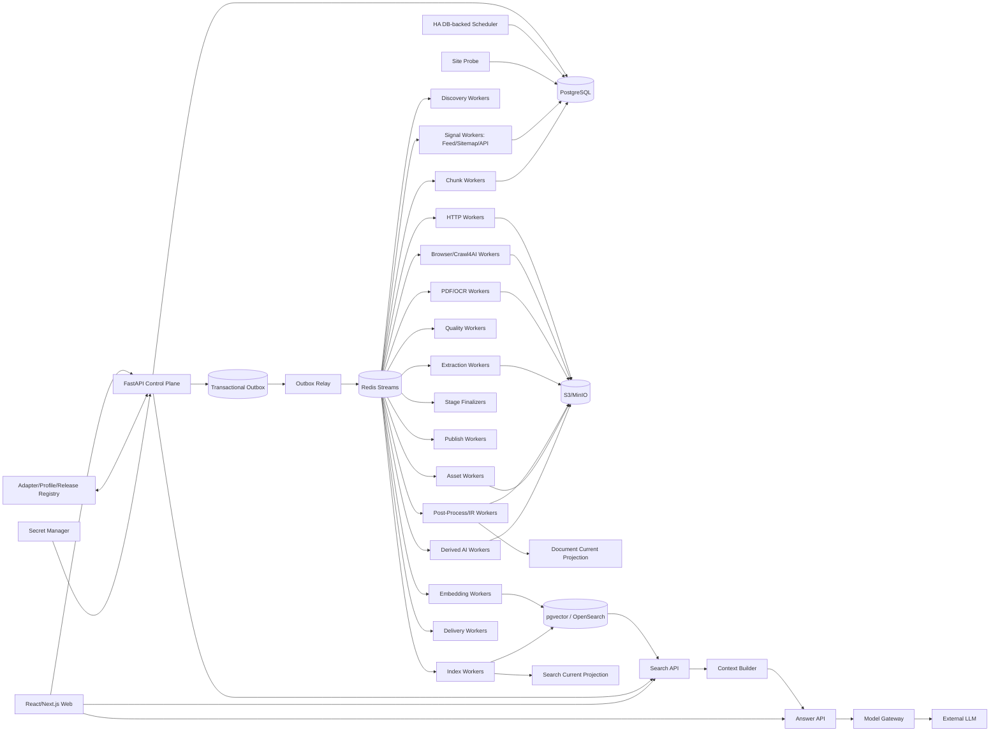

# 博客知识库技术方案

适用范围：从约 1000 个技术博客、工程博客、技术文档站、Newsletter、CMS 和公开文档站抓取尽可能完整的历史文章，清洗为稳定 Markdown 建设长期知识库；后续持续增加网站，支持增量同步、Web 管理、版本留存、搜索/RAG、离线重处理、质量审计、图片附件归档和 AI 派生能力。整体按百万级文档、数百万到千万级 URL、站点高度异构和多年持续运行设计。

## 1. 建设目标

1. 输入站点根地址、博客入口、文档入口或 Feed 后，自动探测 Sitemap、Sitemap Index、RSS/Atom/JSON Feed、公开 API、归档页、分类/标签/作者页、文档导航树、普通内链、`llms.txt`/文本 URL 列表和动态列表。
2. 支持 `FULL_BACKFILL` 历史全量回灌、`INCREMENTAL` 持续增量、`RECONCILE` 周期覆盖校准、`TARGETED_FETCH` 精确补抓、`REPROCESS` 离线重处理、`ASSET_REPAIR` 资产修复、`REINDEX` 搜索/RAG 重建。
3. 历史完整性必须有 Provider 级 Coverage Evidence，不能用“队列空了”“达到 max_depth/max_pages/max_urls”代替完整性证明。
4. 默认 HTTP-first；只有存在明确动态渲染或抽取失败证据时才升级 Crawl4AI/Playwright Browser。
5. Discovery Rule、Discovery Route、Article Fetch Route、Extraction Profile、Post-Processor、Quality Policy、Chunker、Embedding、Search Index、Retrieval Profile、Context Builder、AI Prompt/Model 全部独立版本化。
6. 支持 Sitemap `lastmod`、Feed GUID/updated、API cursor、ETag、Last-Modified、body hash、Canonical IR hash、重叠时间窗和周期 Reconcile 驱动增量。
7. 最终知识对象保存标题、作者、发布时间、更新时间、标签、canonical、正文块、代码块、表格、图片、附件、链接关系、来源 Snapshot、字段 provenance 和完整 lineage。
8. 支持 durable frontier、断点续跑、幂等、lease、heartbeat、重试、限流、熔断、公平调度、backpressure 和 dead-letter。
9. 保存不可变网络 Snapshot、渲染 DOM、清洗 HTML、Extraction Candidate、字段转换轨迹、Canonical Document IR、Markdown Projection、规则版本和质量结果；规则升级优先离线 replay。
10. 图片和附件走独立 Asset Pipeline，支持安全校验、hash 去重、对象存储、引用关系、独立重试和 Markdown URL 重写。
11. Web 管理端覆盖站点接入、Provider 覆盖、任务控制、发现证据、当前文章、历史版本、版本 diff、抽取转换链、质量审核、漂移告警、资产、搜索/RAG 索引、查询 Trace、成本、Schedule、AI Workflow、Delivery 和审计。
12. Markdown、全文索引、Embedding、RAG、摘要、聚类、Digest、Newsletter、报告和通知都属于 Accepted Document Version 的异步下游，失败不能阻塞源站同步。
13. 在 append-only 历史真相层之上提供可重建 Current Projection，让 Web 和运营查询像普通内容系统一样高效查看“当前状态”，同时不牺牲历史、审计和回滚。
14. Canonical IR hash 必须在摘要、Chunk、Embedding 等昂贵下游之前计算；内容未变化时只记录 freshness observation，避免重复 AI/Search 成本。
15. 检索对技术博客必须同时照顾自然语言、代码符号、配置项、错误码、版本号和文件路径，不能只做纯向量搜索。
16. 对 1000 站频繁增量同步，增加独立的低成本 Change-Signal Plane；Feed/Sitemap/API 元数据先判断“是否可能新增/更新”，只有需要时才进入正文 Fetch。
17. 近似重复只形成 Similarity Evidence / Duplicate Cluster，不自动删除来源文档；转载、镜像、翻译、系列文章必须保留独立来源与历史。

## 2. 非目标与边界

1. 不以绕过登录、付费墙、验证码、WAF 或访问控制为目标。
2. 不把搜索引擎结果页当作历史完整性真相源；搜索只能作为发现补充。
3. 不保证任何未知站点仅靠自动探测就能达到 100% 历史完整；系统必须显式输出覆盖置信度与缺口。
4. 不使用 LLM 评分决定 FULL_BACKFILL 中哪些合法文章可以进入知识库。
5. 不要求 Markdown 是唯一真相；Markdown 是 Canonical IR 的稳定投影。
6. 不把单个爬虫库、浏览器库、向量库或消息队列锁死为不可替换核心。

## 3. 核心原则

1. **PostgreSQL 是业务状态真相源；S3/MinIO 是不可变大对象真相源。**
2. Redis Streams 只承担任务运输；决定性状态先写 PostgreSQL，再由 Transactional Outbox 投递。
3. Source Adapter、Change Signal、Discovery、Admission、Fetch、Extraction、Post-Process、Quality、Asset、Publish、Search、Context Builder、Answer、Derived AI、Delivery 分层。
4. Discovery 只产生 URL Candidate 和 Evidence；列表页、搜索页、Feed 摘要不能直接成为最终正文。
5. URL Identity 与 Document Identity 分离；redirect、canonical、slug rename、镜像、站点迁移只是 identity evidence。
6. Identity 与 Freshness 分离；“URL 已知”不代表“内容仍新鲜”。
7. 发布时间、更新时间、发现时间、抓取时间、源站 freshness observation 分离；未知发布时间保持 NULL，绝不拿抓取时间伪装发布时间。
8. Discovery Rule 与 Extraction Profile 分离；URL path pattern 可帮助分类，但不能直接证明页面是合法文章。
9. Discovery Fetch Route 与 Article Fetch Route 分离；动态列表需要 Browser，不代表文章详情页也必须 Browser。
10. HTTP、Browser、PDF/OCR 分层路由；Browser 是昂贵升级路径，生产中复用长期 Browser Runtime/Context Pool，禁止按 URL 创建完整 Browser Runtime。
11. Crawl4AI `result.links`、批量调度器、CSS/JSON Schema 是 Worker 内执行能力，不承担历史完整性、持久调度和业务最终状态。
12. HTTP 200、Browser success、`result.success`、Extractor 无异常都不是业务成功证据。
13. 所有阶段使用结构化 Outcome Contract；`EMPTY/INVALID/AMBIGUOUS/RETRYABLE_ERROR/PERMANENT_ERROR` 不能被空字符串、空数组或宽泛异常吞掉。
14. Stage 完成由 Finalizer 对任务、Artifact、质量结果、Manifest 和 Provider ACK 对账，不由协程或 BackgroundTasks 结束决定。
15. Crawl4AI Markdown/cleaned HTML 只是 Extraction Candidate；最终知识真相是 Accepted Canonical Document IR。
16. `document_version` append-only，不原地覆盖历史版本。
17. Current Projection、Markdown、搜索索引、Chunk、Embedding、摘要、报告和外部知识库都是 Projection，可删除后重建。
18. 文件路径、`#chunk-N`、UI 行号都不能承担 Document/Chunk Identity。
19. `max_depth/max_pages/max_runtime/max_urls` 只是预算，不是历史完整性证明。
20. 关键词相关性、用户偏好和 AI 评分只影响优先级或下游选择，不能静默裁掉 FULL_BACKFILL 的合法历史内容。
21. Scheduler、FastAPI BackgroundTasks、`asyncio.create_task()`、进程内队列/集合/全局变量不能承担业务真相。
22. Config 使用不可变 Release；Secret 使用 Vault/云 Secret Manager，仅保存引用。
23. Retrieval 与 Generation 解耦；LLM 不可用时抓取、Markdown、FTS/Search 仍应正常工作。
24. Search API 返回结构化命中；Context Builder 独立做 token budget、去重、邻接扩展和引用绑定。
25. 人工操作使用 append-only Audit/Event；人工纠错通过 Override/Evidence 追加，不能抹掉机器历史。
26. 遵守 robots、版权、访问控制、站点政策和合理速率；挑战页进入显式策略流程，不自动绕过。
27. Embedding 失败保持显式状态和 NULL 向量，不允许用全 0 向量伪装成功。
28. 近似相似度只作为证据和聚类，不直接承担 Document Identity 或删除决策。

## 4. 总体架构



### 4.1 Control Plane

负责站点、Provider、Profile、Release、Schedule、Run、Command、权限、审计，不直接执行长期抓取。

### 4.2 Change-Signal / Discovery Plane

负责低成本轮询 Feed/Sitemap/API、Provider checkpoint、URL Candidate、Coverage Evidence 和新增/更新信号。

### 4.3 Data Plane

HTTP、Browser、PDF/OCR、Extraction、Post-Process、Quality、Asset 等独立 Worker Pool。

### 4.4 Projection Plane

从 Accepted Document Version 构建 Markdown、Current Projection、Chunk、Embedding、Search Index、摘要、报告、Delivery。

## 5. Crawl Mode 与 Run 语义

```text
FULL_BACKFILL   首次历史全量回灌
INCREMENTAL     持续同步新增和更新
RECONCILE       周期重新枚举，修复断档
TARGETED_FETCH  精确 URL 抓取、调试或补抓
REPROCESS       不访问源站，基于已有 Snapshot/Candidate 重抽取和重清洗
ASSET_REPAIR    仅补齐失败或缺失图片/附件
REINDEX         不访问源站，重新切块、Embedding、全文/向量索引
```

规则：

- 同站点默认只允许一个 active FULL_BACKFILL；
- INCREMENTAL 与 Search/AI/Publish/Asset 可并行，但同一 URL 网络请求和版本写入通过幂等键去重；
- TARGETED_FETCH 必须逐项返回真实结果，不能只返回“任务已启动”；
- REPROCESS 固定 `source_snapshot_id + extraction_profile_release + post_processor_release_chain`；
- REINDEX 固定 `document_version_id + chunker_release + embedding_release + search_index_release`；
- Run 完成由 Stage Finalizer 判断，不由 Worker 函数结束判断；
- Run 统计必须来自本次 Run Manifest，不允许从站点累计库存反推 `pages_crawled/chunks_created`。

建议状态：

```text
PENDING -> RUNNING -> COMPLETED
                   -> COMPLETED_WITH_WARNINGS
                   -> FAILED
                   -> CANCELLED
```

每个 Stage 另有独立状态，Run completed 不代表所有异步 Projection 都完成；UI 分开显示 Source Sync、Markdown、Search、AI、Delivery readiness。

## 6. Site Onboarding、Source Registry 与 Adapter

新站点接入先进入 Probe：

```text
root URL
 -> robots.txt
 -> sitemap hints
 -> feed hints
 -> common API/CMS fingerprints
 -> archive/category/docs-nav detection
 -> representative page samples
 -> HTTP/Browser comparison
 -> content-type/profile inference
```

形成待审核 `site_profile_release`：

```text
site_scope
allowed_hosts
robots_policy
request_headers_ref
rate_limit
concurrency
preferred_discovery_providers
fetch_route_rules
extraction_profile_binding
freshness_policy
asset_policy
quality_policy
schedule
```

Profile 发布后不可原地修改；任何配置变化生成新 Release。Run 固定引用 Release，确保可重现。

### 6.1 Source Registry

来源不能只是一个 Markdown/JSON URL 列表。至少保存：

```text
site_id
name
root_url
status
adapter_type
owner/team
priority
schedule_policy
robots_policy
secret_binding
created_at
```

### 6.2 Adapter 接口

默认 80%~90% 站点应使用配置驱动 Generic Adapter；特殊 CMS/站点再实现插件。

```python
class SourceAdapter:
    async def probe(site): ...
    async def discover(provider, checkpoint): ...
    async def classify(url, evidence): ...
    async def fetch_metadata(url): ...
    async def extract(snapshot, profile): ...
```

Adapter 不能绕过统一 Admission、Snapshot、Quality、Version、Audit 体系。

## 7. Discovery Provider 与 Coverage

### 7.1 Provider 类型

```text
SITEMAP_INDEX
SITEMAP_URLSET
RSS_ATOM_JSONFEED
PUBLIC_API
HTML_ARCHIVE
CATEGORY_TAG_AUTHOR
DOC_NAV
TEXT_URL_LIST / LLMS_TXT
INTERNAL_LINK
MANUAL_SEED
```

### 7.2 Sitemap Index

必须递归处理：

```text
Sitemap Index
 -> child sitemap tasks
 -> child checkpoint
 -> URL candidates
 -> coverage ledger
```

不能把 child sitemap URL 当普通文章页抓取，也不能只解析第一层。

### 7.3 Archive/API 分页

对 page number、next link、cursor、offset、year/month archive 分别保存 checkpoint。达到连续空页、明确 `next=null`、历史边界或 Provider 语义终止时才形成 terminal evidence。

### 7.4 Coverage Ledger

每个 Provider/Run 至少记录：

```text
provider_release_id
checkpoint_before
checkpoint_after
pages_or_cursors_seen
candidate_count
accepted_url_count
skipped_count
error_count
min_source_time
max_source_time
terminal_reason
coverage_confidence
started_at
finished_at
```

FULL_BACKFILL 结束条件是：所有必需 Provider 达到可解释 terminal state，并且 Frontier/Artifact/Finalizer 对账完成。

Provider 可以有：

```text
REQUIRED
SUPPLEMENTAL
DIAGNOSTIC
DISABLED
```

只有 REQUIRED Provider 的缺失会阻止“覆盖完成”。

## 8. Feed Change-Signal Plane

Feed 对 1000 站增量同步非常重要，但必须明确它是“变化信号”而不是完整历史真相。

### 8.1 轮询

Feed Worker 使用条件请求：

```text
If-None-Match: <etag>
If-Modified-Since: <last-modified>
```

304 只记录成功 observation，不进入条目解析和正文抓取。

### 8.2 Provider Item Observation

每个 Feed/API 条目持久化：

```text
provider_id
provider_item_key        # GUID 优先，否则 provider 内稳定 source key
url_candidate_id
source_published_at
source_updated_at
summary_hash
raw_item_hash
media_candidate_ids[]
observed_at
raw_item_snapshot_ref
```

不得在时间缺失时把 `observed_at` 填成 `source_published_at`。

### 8.3 两级队列

```text
Feed/Sitemap/API metadata intake
 -> normalize candidate
 -> identity + freshness decision
 -> NEW / POSSIBLY_CHANGED
 -> Article Fetch
```

已知且信号未变化的候选不进入昂贵 Fetch；但周期 Reconcile 仍会覆盖校准，防止 Feed 窗口、错误 lastmod 或源站异常造成漏更。

### 8.4 Feed 的完整性边界

Feed 常只保留最近 N 条，因此：

- INCREMENTAL 可把 Feed 作为高优先级信号源；
- FULL_BACKFILL 不得仅依赖 Feed；
- Feed checkpoint 不能代替 Sitemap/Archive/API 的 Coverage Ledger。

## 9. URL Admission、Scope 与网络安全

### 9.1 URL 规范化

至少处理：

- scheme/host 大小写；
- default port；
- fragment；
- tracking 参数；
- path dot segment；
- trailing slash 策略；
- IDN/punycode；
- canonical query allowlist；
- 已知 AMP/print/mobile 变体。

保留 `raw_url`、`normalized_url`、`normalized_url_hash`，不要只保存清洗后 URL。

### 9.2 Scope

每站配置 allowed hosts/path include/exclude，默认拒绝无限 calendar/search/filter 参数空间。

### 9.3 Crawler Trap

检测：

- query 参数组合爆炸；
- calendar next/prev 无限页；
- session/token 参数；
- faceted navigation；
- 重复 path segment；
- 相同内容大量 URL。

### 9.4 SSRF 与内容安全

Admission 和 redirect 每一跳都检查：

- 私网/loopback/link-local；
- 非 HTTP(S) scheme；
- DNS rebinding；
- 下载大小和 Content-Type；
- redirect hop 上限。

## 10. URL Identity、Document Identity 与 Similarity Evidence

### 10.1 三层身份

```text
URL Identity        网络地址身份
Document Identity   逻辑文章身份
Document Version    某次被接受的内容版本
```

同一 Document 可以先后拥有多个 URL；同一 URL 也可能重定向或改变 canonical。

### 10.2 Identity Evidence

证据包括：

```text
HTTP redirect
<link rel=canonical>
og:url
Feed GUID/source key
CMS/API post id
sameAs
manual override
content hash
```

证据有来源、时间、规则版本和 confidence，不直接覆盖历史。

### 10.3 精确重复

Canonical IR hash 完全一致时，可以不创建重复新版本，而记录 observation 与 identity evidence。

### 10.4 近似重复

增加：

```text
content_similarity_evidence
similarity_cluster
similarity_cluster_member
```

可使用：

- normalized title similarity；
- SimHash；
- MinHash/LSH；
- 长度比、作者、时间、canonical host 等辅助特征。

近似相似只用于：

- 搜索结果去拥挤；
- 镜像/转载发现；
- 人工审核；
- 聚类与多来源引用。

不得自动删除或覆盖来源文档。

## 11. Durable Frontier、调度与并发模型

### 11.1 Frontier 是持久状态

`frontier_task` 至少包含：

```text
task_id
run_id
site_id
provider_id
url_identity_id
stage
task_type
priority
idempotency_key
status
attempt
available_at
lease_owner
lease_expires_at
heartbeat_at
last_error
```

### 11.2 Lease

Worker claim 后获得 lease；长 Browser/PDF 任务周期 heartbeat。Worker 崩溃后 lease 超时可重领。

### 11.3 公平调度

使用分层配额：

```text
global budget
 -> worker-pool budget
 -> site/domain budget
 -> task priority
```

防止一个大站点把 999 个站点饿死。

### 11.4 优先级

建议：

```text
用户 TARGETED_FETCH
高优先 INCREMENTAL
失败重试/修复
普通 INCREMENTAL
RECONCILE
FULL_BACKFILL
REPROCESS/REINDEX 大批量
```

同时为 FULL_BACKFILL 保留最低资源份额，避免永久饥饿。

### 11.5 Rate Limit

每 host 使用 token bucket/leaky bucket，并结合：

- robots crawl-delay（如适用）；
- 429 Retry-After；
- 5xx 错误率；
- P95 latency；
- challenge rate。

动态降低 concurrency，恢复时缓慢升高。

## 12. Fetch 路由

### 12.1 HTTP-first

优先使用 HTTPX/aiohttp：

- 更便宜；
- 更高并发；
- 更适合条件请求；
- 更容易保存原始响应。

### 12.2 Browser 升级证据

以下情况才升级 Browser：

- HTML 明显只有 app shell；
- 关键正文由 JS 后加载；
- HTTP candidate 空/极短，但 Browser 样本历史上有效；
- Profile 明确声明 Browser；
- 需要交互才能展开合法公开正文。

“站点用了 React/Vue”不是自动 Browser 的充分条件。

### 12.3 Browser Pool

生产实现：

```text
Browser Worker Process
 -> long-lived Browser Runtime
 -> isolated Context Pool
 -> short-lived Page per task
```

禁止按 URL 启动/销毁完整 Browser Runtime。Context 按安全域/站点隔离，配置最大 Page 数、内存、CPU、超时和重启阈值。

### 12.4 路由升级链

```text
HTTP
 -> HTTP + alternate headers/profile
 -> Browser lightweight
 -> Browser full render
 -> manual/review
```

每次升级保存原因和成本，便于 Drift 分析。

### 12.5 PDF/OCR

PDF 保存原文件 Snapshot；先做文本层提取，无文本或质量低时才 OCR。OCR 是独立昂贵 Worker Pool。

## 13. 不可变 Snapshot 与 Artifact

所有网络响应先落不可变 Snapshot，再做后续处理。

保存：

```text
request URL
final URL
request/response headers
status
content type
encoding
fetch route
fetched_at
body sha256
raw body object key
rendered DOM object key
screenshot/debug object key(optional)
```

大对象在 S3/MinIO；数据库只存 key、hash、metadata。

这样 Extraction 规则升级时无需重新访问源站，可离线 REPROCESS。

## 14. Extraction Candidate -> Canonical Document IR

### 14.1 Candidate 来源

一个 Snapshot 可生成多个 Candidate：

- site-specific CSS/XPath；
- JSON-LD；
- CMS/API body；
- trafilatura/readability 类 extractor；
- Crawl4AI cleaned HTML/Markdown；
- Browser DOM selector。

候选之间可评分/fallback，但必须保留来源与版本。

### 14.2 字段契约

Canonical IR 至少包含：

```text
title
authors[]
source_published_at
source_updated_at
tags[]
canonical_url
language
blocks[]
outbound_links[]
asset_references[]
metadata_provenance
```

### 14.3 Block IR

正文不先压成纯文本，保留：

```text
heading(level,text)
paragraph
code(language,text)
list
quote
table
image(asset_candidate_id, alt, caption)
math
separator
embed(optional)
```

### 14.4 Provenance

每个关键字段记录：

```text
value
source_type
source_path
snapshot_id
extractor_release_id
processor_release_id
confidence
```

例如发布时间来自 JSON-LD、Feed 或正文解析必须可追踪。

### 14.5 Post-Processor

独立处理：

- 时间与时区标准化；
- HTML entity；
- Unicode；
- 代码语言识别；
- 链接绝对化；
- 媒体引用；
- boilerplate；
- 标题清洗；
- 空白和列表修复。

每个 Processor 版本化，可按链重放。

## 15. Quality、Drift 与人工审核状态机

### 15.1 自动质量指标

包括：

- 标题缺失；
- 正文长度；
- 主体文本比例；
- 导航/版权/挑战页关键词占比；
- 重复段落；
- 代码/表格结构损坏；
- canonical 域异常；
- 时间异常；
- Browser/Extractor fallback；
- 与历史版本长度突变。

### 15.2 状态

```text
AUTO_ACCEPTED
NEEDS_REVIEW
HUMAN_ACCEPTED
HUMAN_REJECTED
OVERRIDDEN
QUARANTINED
```

人工审核不是简单“加一个页面”，而是持久业务状态。审核动作生成 append-only audit/override evidence。

### 15.3 Drift

站点模板变化时，监控：

- extractor empty rate；
- 正文长度分布；
- Browser fallback rate；
- metadata missing；
- challenge page rate；
- reject/quarantine rate。

触发：

```text
alert -> sample review -> new profile release -> offline replay -> compare -> rollout
```

## 16. Markdown Projection

Markdown 是从 Accepted Canonical IR 确定性生成的 Projection。

### 16.1 Front Matter 示例

```yaml
---
document_id: doc_xxx
version_id: ver_xxx
site_id: site_xxx
title: "..."
canonical_url: "https://..."
authors:
  - "..."
published_at: "2025-01-01T10:00:00Z"
updated_at: null
fetched_at: "2026-08-15T00:00:00Z"
content_hash: "..."
source_snapshot_id: snap_xxx
---
```

未知字段保持 null/缺省，不伪造。

### 16.2 文件路径

路径只用于存储可读性，不承担 identity。建议：

```text
knowledge/
  <site-slug>/
    <yyyy-or-unknown>/
      <document-id>-<safe-title>.md
```

标题变更时可保持 document-id 稳定；是否重命名路径由 Projection Policy 决定。

### 16.3 生成规则

- heading level 稳定；
- fenced code 保留语言；
- table 尽可能保留 Markdown，复杂表可保留 HTML fallback；
- 图片引用 Asset URL；
- 内部链接可选重写为 document link；
- 不截断长文；
- 同一 IR + Projection Release 必须生成相同结果。

## 17. Asset Pipeline

图片、附件独立于正文 Accepted，不因单个资源失败阻塞正文。

### 17.1 Asset Candidate 来源

统一接收：

- Feed enclosure/media/thumbnail；
- OpenGraph `og:image`；
- Twitter Card；
- JSON-LD image；
- 正文 ``；
- CSS/DOM extractor；
- PDF/附件链接。

记录 provenance 与 discovery confidence。

### 17.2 下载

流程：

```text
candidate
 -> URL safety/admission
 -> HEAD/GET
 -> size/MIME validation
 -> malware/suspicious type policy
 -> sha256
 -> object storage
 -> asset record
```

### 17.3 去重

`asset.sha256` 唯一；多个来源 URL 可指向同一 Asset，通过 `asset_source` 关联。

### 17.4 Markdown 重写

Markdown Projection 根据 `asset_policy_release` 决定：

- 保留远程 URL；
- 改写本地对象存储/CDN；
- 失败时保留原 URL 并标记 repair state。

## 18. 增量同步算法

### 18.1 Provider 级

```text
poll signal providers
 -> compare checkpoint/item observation
 -> emit NEW/POSSIBLY_CHANGED candidates
 -> preserve overlap window
 -> periodic reconcile
```

### 18.2 URL 级

对于已知 URL：

1. 若 Feed/API 明确 updated 变化，进入 Fetch；
2. 若 Sitemap lastmod 变化，进入 Fetch；
3. 若无可靠信号，按 freshness policy 周期复查；
4. HTTP Fetch 使用 `If-None-Match` / `If-Modified-Since`；
5. 304 记录 observation，不创建版本；
6. 200 先比较 body hash；
7. body 变化再 Extraction；
8. Canonical IR hash 未变化，不创建新 Document Version，也不触发 Embedding/AI；
9. Canonical IR hash 变化，append 新 Version 并异步更新 Projection。

### 18.3 重叠窗口

Feed/API 增量永远保留可配置 overlap，例如最近 N 条/最近 N 天，抵抗乱序更新、错误时间戳和短暂失败。

### 18.4 Reconcile

即使增量信号稳定，也建议：

- 高频站每周；
- 普通站每月；
- 低频站按季度；

重新枚举 Sitemap/Archive/API，比较库存缺口和消失 URL。

## 19. 历史全量回灌策略

FULL_BACKFILL 优先级：

```text
Sitemap Index/URLSet
 -> CMS/Public API
 -> HTML Archive/year/month pagination
 -> category/tag/author
 -> docs nav/tree
 -> internal link crawl
 -> search/manual supplement
```

### 19.1 完整性不能看队列空

队列空只说明当前没有任务，不说明发现渠道已枚举完。

### 19.2 Provider 交叉校验

例如：

- Sitemap 12000 URL；
- API 11950 post；
- Archive 11890；
- Accepted 11780；

Web 必须展示差集和 reject 原因，不能只显示“完成 100%”。

### 19.3 Crawl Budget

预算用于保护系统：

- max_runtime；
- max_pages；
- max_bytes；
- max_browser_minutes。

预算耗尽时 Run 应是 `COMPLETED_WITH_WARNINGS` 或 `BUDGET_EXHAUSTED` 类 terminal reason，不得伪装完整。

## 20. 删除、迁移与 Tombstone

源站文章消失不直接物理删除历史：

```text
ACTIVE
MISSING_OBSERVED
TOMBSTONED
```

需要连续多次 Reconcile/HTTP evidence 才升级 Tombstone。

redirect、domain migration、slug rename 形成 identity evidence，不覆盖旧 URL 历史。

Web “删除站点”默认 disable/archive，不级联删除历史。真正物理清理由管理员 retention workflow 执行并审计。

## 21. 核心数据模型

建议实体：

```text
site
site_profile_release
source_adapter_release
discovery_provider
discovery_provider_release
provider_checkpoint
provider_item_observation
coverage_ledger
discovery_link_evidence
url_candidate
url_identity
url_observation
frontier_task
fetch_snapshot
artifact
extraction_candidate
field_transform_trace

document
document_identity_evidence
document_version
metadata_evidence
content_similarity_evidence
similarity_cluster
similarity_cluster_member
quality_result
drift_event
document_current_projection
site_operational_projection

asset_candidate
asset
asset_source
asset_reference
asset_task

chunk_projection
embedding_projection
index_projection_job
index_projection_manifest
search_current_projection
retrieval_eval_dataset
retrieval_eval_run
query_trace

run
run_stage
run_manifest
outbox_event
schedule
command
ai_workflow_release
ai_stage_release
ai_run
ai_stage_execution
selection_manifest
publish_manifest
delivery
delivery_attempt
secret_binding
audit_event
```

### 21.1 关键唯一约束

```text
UNIQUE(url_identity.normalized_url_hash)
UNIQUE(frontier_task.idempotency_key)
UNIQUE(document_version.document_id, canonical_ir_hash)
UNIQUE(document_current_projection.document_id)
UNIQUE(asset.sha256)
UNIQUE(asset_task.idempotency_key)
UNIQUE(chunk_projection.chunk_id)
UNIQUE(embedding_projection.chunk_id, embedding_release_id)
UNIQUE(index_projection_job.idempotency_key)
UNIQUE(search_current_projection.document_id, search_index_release_id)
UNIQUE(delivery.idempotency_key)
UNIQUE(command.idempotency_key)
```

### 21.2 大表分区

`url_observation/frontier_task/fetch_snapshot/discovery_link_evidence/provider_item_observation/query_trace/audit_event` 按时间或 site hash 分区。大对象统一进入 S3/MinIO。

## 22. Transactional Outbox、幂等与 Outcome

所有“写状态 + 发任务”在一个数据库事务：

```text
BEGIN
  write business state
  insert outbox_event
COMMIT
```

Relay 再投递 Redis Streams。

### 22.1 幂等键

```text
signal:{provider}:{checkpoint_or_window}
discover:{run}:{provider}:{cursor}
fetch:{run}:{url_identity}:{route_release}
extract:{snapshot}:{profile_release}
postprocess:{candidate}:{processor_chain}
asset:{asset_candidate}:{asset_policy_release}
chunk:{document_version}:{chunker_release}
embed:{chunk}:{embedding_release}
index:{chunk}:{search_index_release}
```

Worker 重复消费不会产生重复真相。

### 22.2 Outcome Contract

```text
status
error_code
retryable
artifact_ids[]
evidence_ids[]
metrics
next_actions[]
```

Finalizer 按 Manifest 判断：

```text
expected_tasks
terminal_tasks
accepted_artifacts
failed_tasks
quarantined_tasks
provider_terminal_states
```

只有满足策略才进入 completed；部分失败明确进入 `COMPLETED_WITH_WARNINGS`。

## 23. Current Projection

append-only 真相层适合审计，但不适合 Web 每次做复杂聚合，因此维护可重建 `document_current_projection`：

```text
document_id
current_version_id
site_id
title
published_at
updated_at
canonical_url
quality_state
markdown_state
search_state
asset_state
last_observed_at
last_changed_at
preview
```

Projection 更新必须由 version/event 驱动，不能手工成为第二真相源。

## 24. Web 管理端

### 24.1 站点管理

- 新增/编辑/禁用站点；
- Probe 结果；
- Provider 列表；
- Profile Release diff；
- Schedule；
- rate limit/concurrency；
- Secret Binding；
- 最近成功/失败、freshness、coverage。

### 24.2 Run 管理

- 创建 FULL/INCREMENTAL/RECONCILE；
- pause/cancel/retry；
- Stage 状态；
- Frontier backlog；
- Provider cursor/terminal reason；
- 失败分类；
- Browser/HTTP 成本；
- dead-letter。

### 24.3 Coverage Explorer

每站展示：

- Sitemap/API/Archive/Feed 候选数；
- Provider 交集/差集；
- accepted/rejected/quarantined；
- 时间分布；
- coverage confidence；
- budget exhaustion。

### 24.4 文章详情

展示：

```text
URL/identity evidence
current version
history versions
version diff
raw snapshot
rendered DOM
extraction candidates
field provenance
canonical IR
markdown
quality
assets
chunks/index
similarity cluster
```

### 24.5 人工审核

NEEDS_REVIEW 队列支持：

- Accept/Reject；
- 修正标题/作者/时间/canonical；
- 绑定/拆分 Document Identity；
- 选择 Candidate；
- 触发 Reprocess/Reindex；
- 所有操作审计。

### 24.6 Search/RAG 管理

- 索引 release；
- chunk/embedding 完整度；
- Query Trace；
- hybrid score 分解；
- retrieval eval；
- citation preview。

### 24.7 Web 性能

列表只读 Current Projection/preview，使用 cursor pagination 和虚拟滚动；全文、Snapshot、DOM、diff 按需加载，禁止列表页 N+1 拉取大对象。

## 25. Search、Chunk 与 RAG

### 25.1 Chunk 基于 IR

不要对最终 Markdown 盲目按字符切。优先按 heading/paragraph/code/table block 切，维护：

```text
chunk_id
parent_document_id
document_version_id
chunker_release_id
block_range
heading_path
text
code_tokens
```

Chunk ID 由 Version + Release + stable block span 派生，不使用 UI 序号。

### 25.2 Hybrid Search

技术博客需要：

- PostgreSQL FTS/BM25 类词法；
- `pg_trgm` 模糊文本；
- exact token/code symbol/error code/file path；
- vector semantic；
- metadata filter。

结果用 RRF 或版本化 scorer 融合。

### 25.3 Parent/Chunk 分层

向量召回 chunk，结果按 document-aware grouping 合并；同一文档允许保留多个相关 Chunk，并按需要扩展邻接块。

### 25.4 Search Current Projection

新 Document Version 的 chunk/index 未完成前，旧版本保持可搜索；只有新版本 index manifest 完整后原子切换 current searchable version，避免检索空窗。

### 25.5 Context Builder

独立执行：

- token budget；
- same-document grouping；
- near-duplicate cluster 降拥挤；
- 邻接扩展；
- source diversity；
- citation binding。

### 25.6 Retrieval Eval

维护真实问答/代码查找测试集，比较：

- Recall@K；
- MRR/NDCG；
- exact code token recall；
- citation correctness；
- context redundancy。

## 26. AI 派生工作流与 Delivery

AI 永远在 Accepted Version 之后异步运行：

```text
Accepted Version
 -> Summary
 -> Tags
 -> Topic/Similarity Cluster
 -> Digest
 -> Newsletter/Report
 -> Delivery
```

每个 AI Stage 固定：

```text
prompt_release
model_release
input_version_ids
output_schema
cost_budget
```

LLM 失败不阻塞源站同步、Markdown 和基础搜索。

Delivery 使用独立幂等状态、ACK、重试和 dead-letter。外部平台长度/格式限制可以在 Delivery 层做缩短、去图、纯文本 fallback，但不能改写源 Document Version。

## 27. Observability、成本与 SLO

### 27.1 指标

```text
Discovery candidates/sec
Signal 304 ratio
Provider poll latency
Fetch success by route/status
HTTP latency
Browser queue wait
bytes downloaded
accepted documents
unchanged short-circuit ratio
extract empty rate
quality reject rate
frontier lag
lease timeout/retry
asset success
chunk/index completeness
embedding failure/rate-limit
search latency/recall eval
cost per site/run/document
```

### 27.2 日志/Trace 关联键

```text
site_id
run_id
run_stage_id
provider_id
frontier_task_id
url_identity_id
snapshot_id
document_id
document_version_id
```

### 27.3 SLO

对 1000 站建议建立：

- 增量 Run 按计划启动成功率；
- 高优先站 freshness；
- Queue lag；
- Accepted 文档到 Markdown Ready 延迟；
- Accepted 文档到 Search Ready 延迟；
- FULL_BACKFILL coverage completeness；
- Snapshot/Version 数据丢失为 0；
- Browser fallback rate 上限；
- 重复昂贵下游 short-circuit 命中率。

## 28. 容量与扩展设计

### 28.1 资源池分离

```text
Signal Workers      高并发、低 CPU
Discovery Workers   高并发、轻 I/O
HTTP Workers        中高并发
Browser Workers     低并发、高内存
PDF/OCR Workers     低并发、高 CPU
Extraction Workers  CPU/内存中等
AI/Embedding        独立限额
Index Workers       独立批量
```

### 28.2 1000 站不等于 1000 个进程

站点是配置和调度单位，不是常驻 worker。Worker 是共享弹性池，按 site/domain rate limit 分配资源。

### 28.3 Backpressure

当 Browser/Embedding/Index backlog 超阈值：

- 不阻塞轻量 Signal；
- 降低 FULL_BACKFILL admission；
- 保留 INCREMENTAL 最低容量；
- 暂停低优先 AI/REINDEX；
- 通过 Current Projection 显示 downstream lag。

### 28.4 PostgreSQL

使用 PgBouncer；高写入 observation/queue 表分区；批量 INSERT/UPSERT；历史大表避免无界宽索引。

### 28.5 对象存储

按 `site/date/hash` 或纯 hash key 分布，开启 lifecycle；Snapshot、Rendered DOM、IR、Markdown、AI Artifact 分前缀并设置 retention policy。

## 29. 安全、合规与 Secret

1. robots/站点政策作为 Profile 的一部分。
2. 登录/付费/私有内容默认不采；需要明确授权和 Secret Binding。
3. Secret 不进入 Profile JSON、日志、Snapshot 或前端。
4. Browser 下载、附件、redirect 全部走 SSRF/内容安全策略。
5. 用户操作 RBAC：Viewer/Operator/Reviewer/Admin。
6. 所有手工覆盖、删除、重跑和策略发布可审计。
7. 支持按站点/文档 retention 和 takedown workflow。

## 30. 技术选型

### Control Plane

- FastAPI
- SQLAlchemy/asyncpg 或稳定 PostgreSQL data layer
- Pydantic

### Database

- PostgreSQL 16+
- PgBouncer
- pgvector
- pg_trgm

### Queue

- Redis Streams + Consumer Groups
- Transactional Outbox

未来如需要跨地域和更强流语义可切 Kafka/Pulsar；业务真相不依赖队列。

### Fetch

- HTTPX/aiohttp HTTP Workers
- Crawl4AI/Playwright Browser Workers

### Extraction

- Site-specific selectors/API adapters
- JSON-LD/OpenGraph
- trafilatura/readability 类 extractor
- Crawl4AI candidate

### Storage

- S3/MinIO

### Search

阶段 1：PostgreSQL FTS + pg_trgm + pgvector。

阶段 2：数据量、聚合、高亮或 BM25 复杂度达到阈值后增加 OpenSearch；通过 Search Projection 切换。

### Web

- React/Next.js + TypeScript
- 管理列表使用分页、虚拟滚动和 preview，不直接拉全文。

### Secret/Observability

- Vault / 云 Secret Manager
- Prometheus/Grafana
- OpenTelemetry
- 集中日志系统

## 31. Deployment Profiles

```text
DEV_FULLSTACK
DEV_EXTERNAL_DB
STAGING
PROD_K8S
```

DEV 可使用 Docker Compose 一键启动 App + PostgreSQL + Redis + MinIO + Crawl4AI。

生产建议：

- PostgreSQL HA + PgBouncer；
- Redis HA；
- S3/MinIO；
- Control Plane 独立于 Worker；
- Signal/HTTP/Browser/OCR/AI/Index Worker 分池；
- Browser pool 有固定资源上限；
- Secret Manager；
- egress 网络策略；
- Prometheus/Grafana + 日志/Trace。

## 32. 关键 API/Command 语义

示例：

```text
POST /sites
POST /sites/{id}/probe
POST /sites/{id}/profile-releases
POST /runs                 # mode + site ids
POST /runs/{id}/cancel
POST /documents/{id}/refresh
POST /document-versions/{id}/reprocess
POST /document-versions/{id}/reindex
POST /quality-items/{id}/accept
POST /quality-items/{id}/reject
POST /identity-evidence
GET  /sites/{id}/coverage
GET  /documents/{id}/versions
GET  /query-traces/{id}
```

写操作先写 `command` 和 idempotency key，再进入持久任务体系；HTTP 请求返回 command/run id，不用 FastAPI BackgroundTasks 承担长期执行。

## 33. 分阶段落地

### Phase 1：可靠抓取真相层

实现：

- Site/Profile/Source Registry；
- Sitemap/Feed/Archive Discovery；
- Feed Change-Signal Plane；
- URL Admission；
- PostgreSQL Frontier；
- HTTP Worker；
- Snapshot/S3；
- 基础 Extraction/Canonical IR；
- Quality；
- document/version/current projection；
- Markdown Projection；
- Web 站点/Run/文章管理。

先验证 50~100 个代表性站点。

### Phase 2：Browser 与全量覆盖

实现：

- Crawl4AI/Playwright long-lived Browser Pool；
- Sitemap Index 递归；
- API/CMS Adapter；
- Coverage Ledger；
- Reconcile；
- Drift；
- Asset Pipeline；
- Similarity Evidence/Cluster；
- Web Review Queue。

扩大到约 1000 站。

### Phase 3：Search/RAG

实现：

- IR-based Chunk；
- Parent/Chunk 分层索引；
- Embedding Projection；
- FTS/exact token/vector Hybrid；
- Search Current Projection；
- Retrieval Profile；
- Query Trace；
- Context Builder；
- Retrieval Eval。

### Phase 4：AI 与运营自动化

实现：

- Summary/Tag/Cluster；
- Digest/Newsletter；
- Chat/Agent Profile；
- Delivery；
- 成本预算；
- 高级运营 Explorer。

## 34. 代表性测试矩阵

上线 1000 站前必须覆盖：

```text
静态 HTML 博客
WordPress
Ghost
Substack
Medium-like 动态站
Next.js/SPA
多层 Sitemap Index
只有 Feed、无 Sitemap
只有 Archive 分页
API cursor CMS
文档导航树
大量代码块/表格
相对图片 URL
图片懒加载
文章 canonical 迁移
文章正文更新但 URL 不变
错误 lastmod
Feed GUID 稳定/不稳定
重复转载/镜像
429/503
Browser challenge
PDF
```

每类至少保留固定 regression site/sample，Profile/Extractor 升级自动 replay。

## 35. 验收标准

### 历史完整性

- 每个站至少一个可解释 Discovery Provider；
- FULL_BACKFILL 有 Coverage Ledger；
- 不能仅以 max_pages/queue empty 标记完成；
- 抽样与 Sitemap/Archive/API 总量核对；
- Provider 缺口可在 Web 查看。

### 增量

- 支持 Feed/Sitemap/API 变化信号；
- 支持 304/ETag/Last-Modified；
- Canonical IR hash 未变化不生成新版本、不重复 Embedding；
- 增量 + 周期 Reconcile；
- 更新文章保留历史版本；
- Feed 时间缺失不伪造发布时间。

### 可恢复性

- Worker kill 后任务可重领；
- API 重启不影响长期抓取；
- 重复消息不产生重复版本；
- Snapshot 可离线 Reprocess；
- Browser Worker 重启不丢业务任务。

### Markdown 质量

- 标题/代码/表格/图片/链接结构稳定；
- 不把导航/挑战页当正文；
- 不截断长技术文章；
- 抽取规则可版本化重放；
- 图片/附件失败不阻塞正文 Accepted。

### Search/RAG

- Chunk Identity 稳定绑定 Version/Release；
- 长文父正文不与 Chunk 重复占满主向量 Top-K；
- 支持自然语言 + 代码符号/错误码/配置项；
- RAG 可保留同文档多个相关 Chunk并做邻接扩展；
- 新索引完成后原子切换 Search Current Pointer；
- Embedding 失败不写伪向量；
- 近似重复站点不会把 Top-K 全部挤成同一转载内容。

### Web

- 可查看站点、Run、Coverage、当前文章、历史版本、diff、Snapshot、Candidate、IR、Markdown、Chunk、Search Trace；
- 可查看 Provider Item Observation、相似内容 Cluster 和 Asset provenance；
- 列表默认只读取 preview，不加载全文；
- 单页 Refresh/Reprocess/Reindex 有真实任务状态；
- 所有人工操作可审计。

## 36. 最终推荐形态

最终系统不是“1000 个定时 Python 爬虫”，而是一套可扩展的数据同步与知识投影平台：

```text
版本化 Site/Profile/Adapter
+ Feed/Sitemap/API Change-Signal Plane
+ 多 Provider Discovery / Coverage
+ Durable Frontier
+ Fair Scheduler / Rate Limit / Backpressure
+ HTTP-first / Browser fallback
+ Long-lived Browser Pool
+ Immutable Snapshot
+ Candidate -> Canonical IR -> Quality
+ Append-only Document Version
+ Identity Evidence + Non-destructive Similarity Cluster
+ Current Projection
+ Canonical IR Hash Short-Circuit
+ Asset Candidate Provenance + Asset Pipeline
+ Deterministic Markdown Projection
+ IR-based Chunk Projection
+ Parent/Chunk 分层索引
+ Hybrid Search + Document-aware Retrieval
+ Search Current Projection
+ Web Control Plane + Review State Machine
+ Async AI/Delivery
+ 完整 Audit / Trace / Replay
```

这套结构允许新增站点、替换抓取引擎、升级抽取规则、重新切块、切换 Embedding/搜索后端、回放历史 Snapshot，而不破坏既有知识真相。日常增量通过低成本 Change-Signal Plane 尽量在正文抓取前短路 unchanged 内容；历史完整性由 Provider Coverage Ledger 证明；Browser 只承担明确需要渲染的少数任务；所有昂贵 AI/Search 工作都建立在 Accepted Canonical IR 之上，并可独立失败、重建和审计。
