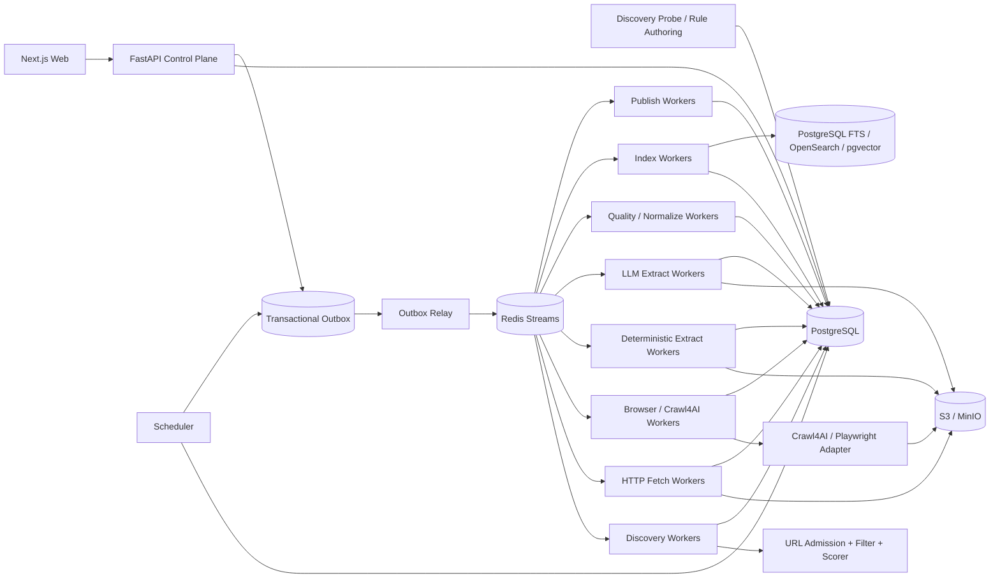

# 博客知识库技术方案

适用范围：从约 1000 个技术博客网站抓取尽可能完整的历史文章，清洗为稳定 Markdown 作为长期知识库；后续持续新增网站，支持历史全量回灌、长期增量同步、版本保留、Web 管理、搜索与外部知识库发布。整体按“数百万 URL、长期运行、站点异构、可横向扩展、可恢复、可回放、可审计”设计。

## 1. 建设目标

1. 用户只需录入博客根地址，系统自动探测 Sitemap、Feed、归档页、分类页、作者页、公开 API、动态列表等入口，并生成可审核的站点配置草稿。
2. 支持约 1000 个站点历史全量回灌，并能持续增加站点；常见站点主要通过配置和模板接入，不修改核心状态机。
3. 同一站点允许多个独立 Discovery Provider，每个 Provider 独立维护 capability、checkpoint、覆盖证据和增量连续性。
4. 抓取标题、作者、发布时间、更新时间、标签、canonical、正文、代码块、表格、图片和附件，输出稳定 Markdown。
5. 默认 HTTP-first，只有证据表明确实需要 JavaScript 时才升级到 Browser/Crawl4AI。
6. 支持 ETag、Last-Modified、Sitemap lastmod、Feed GUID/cursor、API cursor、内容 hash 和重叠时间窗口驱动的增量同步。
7. 支持 durable frontier、断点续跑、幂等、重试、指数退避、限流、熔断、按站公平调度和 backpressure。
8. 保存原始响应、渲染 DOM、cleaned HTML、抽取候选、Article IR、Markdown、规则版本和质量结果；规则升级优先离线 replay。
9. 提供 Web 管理端完成站点接入、探测、规则发布、任务管理、质量审核、版本 diff、错误诊断、搜索和发布管理。
10. Crawl4AI、Playwright、Trafilatura、Readability、LLM Provider 等统一通过 Adapter 接入，不直接成为业务状态真相源。
11. URL 发现、准入、抓取、抽取、质量评估、索引和发布全部可版本化、可审计。
12. LLM 主要用于规则生产、语义字段抽取或低质量升级路径，不作为百万级文章默认正文抽取器。
13. 对确需 LLM 的抽取优先使用原生 Structured Output/JSON Schema，而不是依赖 Prompt 中的“请返回合法 JSON”。
14. 所有重型抓取和 LLM 任务都运行在异步 Worker 中，FastAPI 控制面不直接承担长时间 Browser/Playwright 执行。

## 2. 规模与容量假设

按 1000 个站点估算：

- 单站历史文章：数百到数万不等；
- 全量 URL：百万到千万级；
- 实际文章：百万级；
- 抓取结果、HTML、DOM、Markdown：对象存储为主；
- PostgreSQL 保存状态、索引元数据、版本、hash 和 object key；
- Browser 页面占比应尽量控制在少数；
- LLM 逐页调用比例应保持低位，并受站点/任务预算约束。

容量设计按“任务数量、对象大小、Browser 秒数、队列延迟、LLM token/成本”分别扩展，不按站点总数粗放扩容。

## 3. 核心设计原则

1. PostgreSQL 是业务状态真相源，S3/MinIO 是不可变大对象真相源。
2. 站点、发现端点、Fetch Profile、Crawler Execution、Extraction Pipeline、Schema、LLM Model、URL Filter、URL Scorer、Browser Action Plan、Adapter 全部分离并版本化。
3. 自动 Probe 与生产回灌分离；Probe 只生成配置草稿、样本证据和规则候选。
4. URL 被发现不表示允许抓取，必须经过 URL Admission Pipeline。
5. HTTP、Feed、Sitemap、API、Browser 分层，Browser 是稀缺升级路径。
6. 页面动作与内容抽取分离；Browser Action Plan 负责页面就绪、点击、翻页和滚动，Extraction Pipeline 负责字段与正文。
7. 抓取快照不可变，规则升级优先 replay。
8. 文章身份与 URL 分离；redirect、canonical、镜像、迁移都只是 identity evidence。
9. `article_version` 只追加，不覆盖旧版本。
10. Redis Streams 只做短期分发，不做状态真相源。
11. 所有跨 PostgreSQL 与队列的状态变更通过 Transactional Outbox。
12. 批处理和 deep crawl 只做执行优化，结果必须逐条按 `task_id/attempt_id` 落 durable 状态。
13. 第三方抓取引擎不能绕过统一 Egress、robots、限流、预算和业务状态机。
14. Bloom Filter、RoaringBitmap 等只能做加速，不能代替数据库唯一约束和 durable frontier。
15. LLM 生成的 CSS/XPath/Regex 只作为候选规则，发布前必须验证。
16. Structured Output 只保证结构，不保证事实；最终结果仍必须进入 provenance 和 Quality Gate。
17. 任何运行时配置必须绑定 release/version/hash，不能依赖“当前默认配置”重现历史结果。

## 4. 总体架构



系统分为：控制面、探测/规则生产面、发现面、采集面、Adapter 面、抽取与质量面、协调面、知识访问面和发布面。

## 5. Async Runtime Topology

### 5.1 控制面

FastAPI 只负责：

- 配置 CRUD；
- 创建任务；
- 查询状态；
- 调试请求；
- WebSocket/SSE 进度；
- 权限与审计。

长时间抓取不得在 API 请求线程中同步执行。标准模式：

```text
POST /jobs
 -> PostgreSQL transaction
 -> outbox_event
 -> Redis Streams
 -> Worker
```

用户关闭浏览器不影响任务生命周期。

### 5.2 HTTP Worker

每个进程长期维护：

- 一个 asyncio event loop；
- 一个或少量 httpx/aiohttp connection pool；
- per-domain semaphore/token bucket；
- bounded task concurrency。

### 5.3 Browser/Crawl4AI Worker

每个进程长期维护：

- 一个 asyncio event loop；
- Browser/Crawl4AI 生命周期；
- 受控 browser/context/page pool；
- Browser memory/CPU 并发上限；
- TTL、heartbeat 和 cleanup。

禁止把以下模式作为平台主路径：

```text
每请求创建 ThreadPoolExecutor
+ 每请求 asyncio.run()
+ 每请求创建新的 Browser 生命周期
```

这类桥接只允许用于单机调试工具。

### 5.4 CPU Worker

大 HTML 解析、DOM diff、MinHash、Article IR normalize 等 CPU-heavy 工作放独立进程池，避免阻塞异步 I/O event loop。

### 5.5 LLM Worker

LLM Worker 独立维护异步 Provider Client、Provider semaphore、token/cost budget 和 retry/circuit breaker，不与 Browser 进程共享资源池。

## 6. “全量历史”的定义与完成判定

### 6.1 Live Full

从当前站点仍可访问的 Sitemap/Sitemap Index、RSS/Atom/JSON Feed、平台公开 API、年/月归档、分类、标签、作者分页、普通站内链接和动态列表中发现历史文章。

### 6.2 Archive Full

在合规前提下，可利用 Common Crawl、Wayback 等补充已经删除、迁移或当前站内不再暴露的历史 URL/快照证据。Archive Full 与 Live Full 分开统计。

### 6.3 Provider Capability

每个 Provider 标注：

- `exhaustive`：理论上可枚举完整集合，例如可靠 Sitemap Index；
- `windowed`：只暴露最近窗口，例如普通 RSS；
- `best_effort`：只能尽力发现，例如站内递归。

### 6.4 全量完成条件

历史回灌完成至少同时满足：

1. 所有启用 Provider 到达稳定 checkpoint；
2. `exhaustive` Provider 已完整枚举并记录条目数；
3. 归档/分页 Provider 无未处理 next page 或 continuity gap；
4. durable frontier 中无可执行 URL；
5. retryable 失败已处理完，dead-letter 已人工接受/忽略/修复；
6. 新一轮 reconcile 未产生显著新增 URL；
7. Provider Coverage Ledger 不存在未知断档。

`frontier == empty` 只表示当前无待执行任务，不等价于“全量完成”。

## 7. Crawl Mode

统一定义：

- `FULL_BACKFILL`：首次历史回灌；
- `INCREMENTAL`：持续同步新增与更新；
- `RECONCILE`：周期性重新枚举来源，修复断档；
- `TOPIC_EXPANSION`：围绕主题做有限预算扩展；
- `REPROCESS`：不访问网络，基于已有 snapshot 重抽取/清洗/索引/发布。

规则：

- `FULL_BACKFILL` 中 URL Scorer 只影响顺序，合法 URL 不因低分永久丢弃；
- 语义相关性、SEO、关键词默认只能 `SOFT_SCORE` 或 `OBSERVE_ONLY`；
- `INCREMENTAL/TOPIC_EXPANSION` 可使用 score threshold、最大页数、时间预算；
- AdaptiveCrawler 的 saturation/coverage 只能用于受预算模式，不能作为首次全量完成条件；
- Crawl4AI deep crawl `max_pages` 只能作为一次 execution slice 的预算。

## 8. 新站点接入：Discovery Probe

管理员输入根 URL 后，Probe 并行执行：

1. GET 根页面并记录最终 URL、Content-Type、编码和结构；
2. 解析 robots.txt 中 Sitemap；
3. 探测常见 Sitemap；
4. 解析 HTML 中 RSS/Atom alternate；
5. 探测 Feed；
6. 识别归档、分类、标签、作者和分页；
7. 识别公开 JSON/REST/GraphQL API；
8. 必要时执行 Browser Sample Probe；
9. 抓取 3~10 个详情页样本；
10. 识别正文结构和 metadata；
11. 生成 Provider、Fetch Profile、Filter、Scorer、Extraction Pipeline、Schema、Action Plan 和 Adapter 草稿；
12. 对样本运行 JSON-LD/meta、CSS/XPath、Regex、Trafilatura、Readability、Crawl4AI Markdown 候选；
13. 必要时调用 LLM 生成规则候选；
14. 输出 Browser 比例、覆盖来源、验证结果和风险项。

Web 端完成 dry-run/canary/publish 后再启动生产回灌。

## 9. Discovery Provider 与覆盖台账

优先级：

1. Sitemap/Sitemap Index；
2. 平台公开 API；
3. RSS/Atom/JSON Feed；
4. 年/月归档；
5. 分类/标签/作者分页；
6. HTML 同域递归；
7. Browser 动态列表；
8. 外部公开索引补漏。

Sitemap 支持：index、gzip、namespace、lastmod、分片递归、streaming parse、安全 XML。

Feed 保存：GUID、发布时间、更新时间、cursor/next link。

Provider Coverage Ledger：

```text
provider_id
crawl_mode
checkpoint_before
checkpoint_after
pages_or_entries_scanned
discovered_count
admitted_count
rejected_count + reason
expected_count
pagination_continuity
new_frontier_count
unresolved_error_count
started_at
finished_at
```

## 10. Durable Frontier 与 URL Admission

每个新 URL 依次经过：

1. URL 规范化；
2. SSRF/Egress 校验；
3. robots 与访问策略；
4. Domain/Subdomain allowlist；
5. path allow/deny；
6. query 规范化；
7. Content-Type/扩展名规则；
8. canonical/redirect identity hints；
9. crawler trap 检测；
10. Provider 深度与预算；
11. URL Priority Scorer。

### 10.1 URL 规范化

至少处理：host 大小写、IDN、fragment、默认端口、tracking query、query 顺序、session 参数、trailing slash、percent-encoding。

### 10.2 Filter Rule

```text
rule_id
rule_type
decision = HARD_REJECT | SOFT_SCORE | OBSERVE_ONLY
allowed_crawl_modes
expression
reason_template
release_id
```

`FULL_BACKFILL` 中只有高置信度安全/范围规则允许 `HARD_REJECT`。

### 10.3 Crawler Trap

典型 trap：

- 日历无限翻页；
- 搜索参数组合；
- tag/filter 排列组合；
- 无界 `?page=`；
- session/token 参数；
- 同内容多排序 URL。

按站限制最大路径深度、query cardinality、page number 和重复模板比例，并保存 reject reason。

## 11. URL Scorer 与 Best-First

```text
priority_score =
  source_priority
+ path_pattern_score
+ page_type_score
+ archive_expansion_score
+ recency_score
+ optional_semantic_score
+ aging_score
- trap_penalty
- duplicate_penalty
```

Sitemap/API/Feed 直接发现的文章优先；能继续展开历史 URL 的归档页可获得较高 expansion score；aging 防止低分 URL 永久饿死。

`FULL_BACKFILL` 中 score 只排序；`INCREMENTAL/TOPIC_EXPANSION` 中才允许基于 score 截断预算。

## 12. HTTP-first 与 Browser 升级

默认 HTTP：

1. 尽可能发送 `If-None-Match` / `If-Modified-Since`；
2. 304 只更新 freshness；
3. 200 先保存 raw bytes；
4. body hash 不变则不重复生成文章版本；
5. HTTP DOM 足够完整则直接抽取；
6. 有证据时再进入 Browser。

Browser 升级原因结构化保存：

```text
EMPTY_ARTICLE_BODY
SPA_SHELL
JS_PAGINATION
LOAD_MORE
INFINITE_SCROLL
DYNAMIC_RENDER_REQUIRED
EXTRACTION_READINESS_FAILED
```

Browser/Crawl4AI 不应成为所有 URL 的默认入口。

## 13. Crawl4AI / Playwright Adapter

Crawl4AI 可承担：

- AsyncWebCrawler；
- JS 渲染；
- BFS/DFS/BestFirst deep crawl；
- Filter/Scorer；
- Markdown 生成；
- CSS/XPath/Regex extraction；
- `arun_many()`/streaming；
- 受控 LLMExtractionStrategy。

它不承担：

- 全局 durable frontier；
- 多站点公平调度；
- 业务 checkpoint；
- 文章版本真相；
- 全局幂等与审计；
- 历史覆盖完成判定。

### 13.1 Adapter Release

```text
browser_profile_release
fetch_profile_release
crawler_execution_release
url_filter_release
url_scorer_release
extraction_pipeline_release
action_plan_release
adapter_release
```

Adapter 根据固定 engine version 生成 Crawl4AI/Playwright 配置，并在发布前做 capability validation。

### 13.2 Adapter 输入

```text
task_id
attempt_id
crawl_mode
url
browser_profile_release_id
fetch_profile_release_id
crawler_execution_release_id
filter_release_id
scorer_release_id
action_plan_release_id
extraction_pipeline_release_id
adapter_release_id
execution_budget
conditional_headers
```

### 13.3 Adapter 输出

```text
task_id
attempt_id
success
engine_version
final_url
status_code
response_headers
raw_html_ref
cleaned_html_ref
rendered_dom_ref
raw_markdown_ref
fit_markdown_ref
extracted_content_ref
links_ref
media_ref
engine_metrics
error_class
error_code
```

业务层不依赖 Crawl4AI 具体字段层级。

### 13.4 Streaming

Deep crawl/`arun_many()` 只执行 bounded slice。每返回一个结果立即：

```text
写 crawl_attempt
 -> 保存 snapshot/引用
 -> 新链接进入 Admission/frontier
 -> 更新单条 task 状态
```

禁止把大量 CrawlResult 全堆在进程内后一次性提交。

## 14. Snapshot 与对象存储

任何成功网络访问都先保存不可变 snapshot：

```text
raw response bytes
response headers
observed charset
final_url
redirect chain
body sha256
rendered DOM
cleaned HTML
raw Markdown
fit Markdown
links/media references
fetch profile release
adapter release
fetched_at
```

大对象放 S3/MinIO，PostgreSQL 保存 metadata/hash/object key/status。

规则升级优先基于 snapshot replay，减少重复访问站点。

## 15. 抽取链：确定性优先，多候选竞争

同一 snapshot 可产生：

1. 平台 API/JSON-LD/OpenGraph/meta；
2. 站点 CSS/XPath Contract；
3. Regex field rules；
4. Trafilatura；
5. Readability；
6. Crawl4AI raw Markdown/fit Markdown；
7. 必要时 LLM Structured Extraction。

每个 candidate 记录：

```text
extractor_type
extractor_version
rule_release_id
input_snapshot_id
input_format
field/value 或正文引用
provenance/evidence
raw_quality
started_at
finished_at
```

Quality Gate 选择最终字段和正文，禁止最后一个 extractor 静默覆盖前一个结果。

## 16. Rule Authoring

LLM 优先用于低频规则生产，而不是每页执行。

可生成：

- CSS selector；
- XPath；
- Regex；
- 页面类型；
- schema 字段建议。

生成后必须：

1. 绑定 model/prompt/sample snapshot；
2. Regex 做长度、复杂度和 ReDoS 风险检查；
3. 在 20~100 个 golden/canary snapshot 上离线运行；
4. 统计字段命中率、误抽取率、正文长度、代码块/表格保留；
5. 门禁通过后生成 release；
6. 生产逐页只使用已发布确定性规则。

## 17. Schema Release 与 Structured Output

### 17.1 Schema Release

Web 管理端允许定义语义字段：

```text
field_name
field_type
description
required
nullable
identity_key
validation_rule
```

发布后生成不可变：

```text
schema_release_id
canonical_json_schema
canonical_schema_hash
created_by
created_at
```

禁止线上任务引用“可变当前 schema”。

### 17.2 Provider Schema Compiler

平台 canonical schema 在调用具体 Provider 前编译为厂商支持的有效 schema：

1. 解析/内联 `$ref`；
2. 处理 `additionalProperties`；
3. 处理 required/nullable；
4. 处理 array/object/enum/union；
5. 验证 Provider 支持的 JSON Schema 子集；
6. 计算 `effective_provider_schema_hash`；
7. 发布前运行 fixture/canary。

### 17.3 原生 Structured Output 优先

对于支持严格 Structured Output 的模型：

```text
Article/Semantic Input
 -> canonical schema
 -> provider schema compiler
 -> native JSON Schema constrained output
 -> JSON parse
 -> Pydantic validate
 -> provenance/Quality Gate
```

Prompt 中不再依赖“仅返回 JSON”作为核心结构可靠性机制。

如果 Provider 不支持原生 Structured Output，降级顺序：

```text
native structured output
> tool/function calling
> constrained parser compatibility path
```

降级必须记录原因。

### 17.4 Missing Value Semantics

禁止简单用 `0/false/""` 把缺失数据伪装成真实值。字段应保存：

```text
value
presence = OBSERVED | INFERRED | MISSING
confidence
provenance
```

必要时展示层再映射默认值。

## 18. LLM Provider Adapter

业务层统一依赖：

```text
StructuredExtractRequest
StructuredExtractResult
```

可使用 LiteLLM 作为底层 Provider Adapter，也可以直接封装厂商 SDK；无论实现方式如何，必须显式维护 Provider/Model Capability Manifest。

### 18.1 Model Capability Manifest

```text
model_release_id
provider
model_id
supports_strict_json_schema
supports_tool_calling
supports_streaming
max_context_tokens
max_output_tokens
schema_subset
rate_limit_class
retry_policy
price_input
price_output
region
created_at
```

相同业务 schema 不能假设在所有 Provider 上完全等价。

### 18.2 LLM 调用记录

```text
attempt_id
provider_request_id
model_release_id
prompt_release_id
schema_release_id
effective_provider_schema_hash
input_tokens
output_tokens
estimated_cost
latency
finish_reason
error_class
```

## 19. LLM Escalation、Chunk 与 Merge

LLM 逐页执行仅在：

- Contract/Regex/通用正文抽取器均低质量；
- DOM 极不稳定；
- 需要语义字段；
- 少量特殊长尾页面需要兜底。

每站维护 `llm_escalation_policy` 与 `llm_chunk_policy_release`：

```text
model_release_id
prompt_release_id
schema_release_id
input_format
chunk_token_threshold
overlap_rate
apply_chunking
merge_strategy
identity_keys
single_document_token_limit
monthly_budget
```

### 19.1 Chunk Merge

每个 candidate 记录 `chunk_id/chunk_span`。合并按 stable identity key、内容 hash 或 schema-specific rule 去重，不能简单拼数组。

### 19.2 Structured Output 仍需事实校验

Pydantic/JSON Schema 只保证结构，不保证事实。进入 Article IR 前仍必须：

- schema validate；
- 必填字段检查；
- 与 DOM/meta/确定性 candidate 交叉验证；
- provenance 记录；
- 冲突/低质量进入 review 或降级。

## 20. LLM Retry 与成本治理

指数退避使用 jitter，并按错误分类。

可重试：

- connect/read timeout；
- 408；
- 429；
- Provider 5xx；
- 短暂网关故障。

通常不可原样重试：

- schema compile error；
- unsupported schema keyword；
- invalid credential；
- 永久超 context；
- deterministic validation error；
- budget exceeded。

重试模型：

```text
error taxonomy
 -> retryable?
 -> Retry-After
 -> jittered exponential backoff
 -> max attempts
 -> circuit breaker
 -> dead-letter/review
```

结构化记录：

```text
llm_call_count
input_tokens
output_tokens
total_tokens
estimated_cost
provider_latency
model_release_id
prompt_release_id
schema_release_id
```

支持按站点、任务、时间窗口设置预算和熔断。

## 21. Article IR 与 Markdown

HTML 不直接字符串清洗后落 Markdown，而是转换为稳定 Article IR：

- heading；
- paragraph；
- list；
- quote；
- code block；
- table；
- image；
- link；
- embed placeholder。

Crawl4AI `fit_markdown`、Pruning/BM25 等只作为 candidate。技术文章中短代码块、表格、API 列表可能被过度裁剪，因此同时保留 raw HTML、raw Markdown、fit Markdown，并由 Quality Gate 决定 canonical 内容。

Markdown 目录：

```text
knowledge/{site_slug}/{yyyy}/{article_id}.md
```

front matter：

```yaml
article_id:
site_id:
source_url:
canonical_url:
title:
authors:
published_at:
updated_at:
fetched_at:
content_hash:
article_version:
extraction_release:
schema_release:
crawl_run_id:
```

文件名不直接依赖标题，避免重命名和非法字符；正文相对链接和图片转绝对地址。

## 22. URL 去重、文章身份与版本

### 22.1 URL 去重

数据库唯一键：

```text
(site_id, sha256(normalized_url))
```

Bloom Filter 可做前置加速，但 false positive 不能决定永久丢弃；最终以 PostgreSQL unique constraint 为准。

### 22.2 文章身份

- exact duplicate：Article IR/content hash；
- near duplicate：MinHash/SimHash 只生成候选；
- redirect/canonical：identity evidence；
- 多 URL 同文章：保留 `article_url_relation`；
- 站点迁移/canonical 改变不自动创建重复文章。

`article_version` append-only。正文、关键 metadata、canonical identity 或 canonical IR 发生实质变化时创建新版本。

## 23. 增量同步与 Reconcile

增量信号优先级：

1. Sitemap `lastmod`；
2. Feed GUID/发布时间/更新时间；
3. API cursor/updated_at；
4. ETag；
5. Last-Modified；
6. normalized content hash。

每站维护 `next_sync_at`、Provider checkpoint、近期变更率和历史抓取耗时，Scheduler 根据变化速度自适应调整频率。

### 23.1 Windowed Source 防漏

RSS 等不能只保存“最后一条 GUID”后单向推进。必须：

- 重叠时间窗口；
- 最近窗口重复扫描并幂等去重；
- 时间断档检测；
- 定期 Sitemap/API/Archive `RECONCILE`；
- 长时间离线后扩大 overlap。

### 23.2 更新判断

URL 不变但 canonical Article IR 实质变化时创建新 `article_version`；仅抓取时间/响应头变化且 IR hash 相同时不创建版本。

## 24. 状态机、幂等与 Transactional Outbox

URL/任务状态：

```text
DISCOVERED
 -> ADMITTED
 -> QUEUED
 -> FETCHING
 -> FETCHED
 -> EXTRACTING
 -> QUALITY_CHECK
 -> STORED
 -> INDEXED
 -> PUBLISHED
```

失败：

```text
RETRY_WAIT -> QUEUED
DEAD_LETTER
REJECTED
```

任务使用 lease；Worker 崩溃后 lease 到期可重放。

幂等 key：

```text
fetch:   url_id + requested_snapshot_epoch
extract: snapshot_id + extraction_pipeline_release_id
llm:     snapshot_id + model_release_id + schema_release_id + prompt_release_id + chunk_policy_release_id
index:   article_version_id + index_release_id
publish: article_version_id + destination + publish_release_id
```

同一 PostgreSQL 事务写状态变化和 `outbox_event`，Outbox Relay 再投递 Redis Streams。

## 25. 调度、公平性与 Backpressure

Job 类型：

```text
probe
rule-authoring
full_backfill
incremental_sync
reconcile
topic_expansion
re-extract
re-normalize
re-index
re-publish
asset_repair
orphan_session_cleanup
```

Scheduler 使用 weighted fair queue。每域维护：

- 最大并发；
- QPS；
- 最小请求间隔；
- token bucket；
- Retry-After；
- 429/403/5xx 退避；
- HTTP/Browser 独立预算；
- 熔断状态。

优先级：

```text
NEW_FEED / CHANGED
> INCREMENTAL_REFRESH
> RECONCILE
> HISTORICAL_BACKFILL
> LOW_PRIORITY_REPROCESS
```

`FULL_BACKFILL` 的低分 URL 通过 aging 最终获得执行机会。

下游堆积时：

1. 降低 Discovery 速度；
2. 暂停 Browser expansion；
3. 优先消化已抓未抽取 snapshot；
4. 限制 LLM escalation；
5. 保留 Feed/Incremental 高优先级通道。

## 26. 核心数据模型

至少包括：

```text
site
site_source
fetch_profile_release
crawler_execution_release
url_filter_release
url_scorer_release
extraction_pipeline_release
regex_rule_release
schema_release
llm_provider_release
model_release
structured_output_adapter_release
llm_chunk_policy_release
browser_action_plan_release
adapter_release
llm_escalation_policy
rule_authoring_run
discovery_probe_run
discovery_run
provider_coverage
discovery_checkpoint
crawl_job
url_frontier
fetch_task
crawl_attempt
fetch_snapshot
browser_session_lease
extraction_candidate
llm_usage
quality_evaluation
article
article_url_relation
article_version
publish_state
outbox_event
```

`url_frontier` 关键字段：

```text
normalized_url
site_id
source_id
discovered_from
depth
priority_score
filter_release_id
scorer_release_id
state
attempt_count
next_attempt_at
lease_owner
lease_until
discovery_evidence
first_seen_at
last_seen_at
```

## 27. Quality Gate 与 Drift Detection

至少计算：

- 标题存在率及 `<title>/og:title/h1` 一致度；
- 正文字符数、段落数；
- 链接密度和导航占比；
- `pre/code` 保留率；
- 表格保留率；
- 图片引用有效率；
- 发布时间证据；
- boilerplate 比率；
- 与历史版本重复度；
- Markdown 截断/结构异常；
- canonical/final URL 冲突；
- schema 字段命中率；
- Structured Output 字段 evidence 完整率。

站点持续监控：

```text
extraction_success_rate
body_length_p50/p95
title_missing_rate
code_block_retention
fit_raw_length_ratio
browser_fallback_rate
llm_escalation_rate
schema_validation_failure_rate
duplicate_ratio
```

release 发布后指标突变时，自动暂停扩大范围、重新 Probe、生成新规则草稿。低质量内容不静默覆盖旧版本。

## 28. 错误分类

统一 taxonomy：

```text
dns_failure
connect_timeout
read_timeout
connection_reset
tls_failure
http_401_403
http_404_410
http_429
http_5xx
robots_denied
egress_denied
content_too_large
browser_crash
browser_timeout
extraction_failed
regex_rule_error
schema_compile_error
structured_output_unsupported
llm_schema_invalid
llm_context_too_large
llm_budget_exceeded
quality_rejected
adapter_contract_error
```

每类错误明确：retryable、retry_after、最大次数、是否熔断、是否人工审核。

## 29. Web 管理功能

### 29.1 站点接入

- 新站点 Probe 向导；
- Sitemap/Feed/API/归档/动态列表证据；
- 样本 URL；
- HTTP/Browser 差异；
- 自动规则草稿；
- dry-run/canary/publish。

### 29.2 覆盖与任务

- 站点列表、Provider 数、覆盖度、frontier、backlog、错误率；
- Provider capability/checkpoint/continuity gap；
- expected/discovered/admitted/fetched/article count；
- full backfill 完成证据；
- 任务暂停、恢复、取消、重试；
- 单 URL 调试和 reprocess。

### 29.3 规则、Schema 与模型

- Filter Rule 编辑；
- URL Scorer 分项解释；
- CSS/XPath/Regex 草稿与验证；
- Schema 可视化定义；
- Schema Release diff；
- Model/Provider Capability；
- Prompt、Chunk Policy、成本预估；
- release 发布与回滚。

### 29.4 质量与调试

- raw HTML/rendered DOM/cleaned HTML/raw Markdown/fit Markdown/final Markdown 对比；
- extraction candidates 与最终选择理由；
- Structured Output 原始结果和 schema validation；
- LLM chunk/merge 结果；
- 新旧 release 离线 diff；
- selector drift；
- 文章版本 diff。

### 29.5 搜索与发布

- 全文搜索；
- 可选向量搜索；
- article/source/version 浏览；
- 外部知识库发布状态；
- 失败重推和版本回滚。

## 30. 安全、robots 与合规

所有网络访问统一经过 Egress Gateway：

- 仅允许 http/https；
- 拒绝 localhost、RFC1918、link-local、loopback、metadata endpoint；
- DNS 解析前后校验；
- redirect 每跳重新检查；
- 限制端口；
- 防 DNS rebinding；
- Browser/第三方 Adapter 必须走同一出口政策。

robots 决策缓存并版本化。平台统一实现单站 token bucket、Retry-After、礼貌间隔和熔断。

不绕过验证码、登录、付费墙或明确访问控制。Browser 任意 JS 默认禁用，确需 JS 时版本化、审核、限时、限资源并限制网络出口。

### 30.1 Credential

Provider API Key 不从普通 Web 请求直接透传到 Worker；使用：

```text
credential_id
 -> Vault/KMS/Secret Manager
 -> Worker runtime resolve
```

日志、trace、异常信息统一 secret redaction。CORS 使用明确 origin，API 配置身份认证、RBAC 和审计。

## 31. 观测、指标与 SLO

每个 URL 使用 `trace_id` 贯穿：

```text
Discovery
 -> Admission
 -> Fetch
 -> Snapshot
 -> Extract
 -> Quality
 -> Normalize
 -> Index
 -> Publish
```

关键指标：

- discovery URL/s；
- Provider continuity gap；
- full-backfill frontier convergence；
- fetch success rate；
- HTTP latency；
- 304 ratio；
- Browser escalation ratio；
- Browser seconds/article；
- extraction success rate；
- body length p50/p95；
- code block retention；
- fit/raw ratio；
- queue lag；
- domain throttle time；
- retry/dead-letter rate；
- outbox lag；
- Adapter error rate；
- LLM escalation ratio；
- Structured Output validation failure rate；
- LLM input/output tokens；
- LLM cost/article；
- chunk duplicate/merge conflict rate；
- article freshness lag。

SLO 分别定义：控制面可用性、增量 freshness、任务最终成功率、队列延迟、Browser 可用性、LLM 升级成功率。

## 32. 推荐技术栈

| 层 | 推荐 |
|---|---|
| API | Python + FastAPI |
| Web | React / Next.js |
| Worker | Python asyncio |
| CPU Worker | 独立进程池 |
| 状态库 | PostgreSQL |
| 队列 | Redis Streams |
| 大对象 | S3 / MinIO |
| HTTP | httpx / aiohttp |
| Browser | Playwright + Crawl4AI Adapter |
| Sitemap / Feed | lxml / defusedxml + feedparser |
| 正文抽取 | CSS/XPath/Regex + Trafilatura + Readability + Crawl4AI |
| Schema | Pydantic v2 + JSON Schema |
| LLM Adapter | LiteLLM 或厂商 SDK Adapter |
| 全文检索 | PostgreSQL FTS，规模扩大后 OpenSearch |
| 向量 | pgvector 或独立 Vector DB，可选 |
| 观测 | OpenTelemetry + Prometheus + Grafana + Loki |
| Secret | Vault / 云 Secret Manager / KMS |
| 部署 | Docker + Kubernetes |

初期 1000 站规模不建议直接引入 Kafka。Redis Streams + PostgreSQL Outbox 足够简单；当吞吐、保留周期、跨区域消费出现明确瓶颈时再迁移 Kafka/Pulsar，业务状态模型保持不变。

## 33. 部署与容量规划

Worker 至少拆分：

- discovery；
- HTTP fetch；
- Browser/Crawl4AI；
- deterministic extract；
- LLM extract；
- quality/CPU；
- index；
- publish；
- cleanup。

Browser 和 LLM Worker 独立资源池与预算，避免拖垮普通 HTTP/CPU pipeline。

推荐最小生产拓扑：

```text
2 x FastAPI Control Plane
2 x Scheduler / Outbox Relay（leader lease）
N x Discovery Worker
N x HTTP Fetch Worker
独立 Browser/Crawl4AI Worker Pool
N x Deterministic Extract / Quality Worker
小规模 LLM Extract Worker Pool
N x Index / Publish Worker
1+ x Cleanup Worker
PostgreSQL HA
Redis Streams
S3 / MinIO
Prometheus + Grafana + Loki + OpenTelemetry Collector
Next.js Web
```

扩容依据 queue lag、CPU、Browser memory、domain throttle、LLM concurrency/budget，而不是 URL 总数。

## 34. 实施阶段

### Phase 1：MVP

- site/source；
- Probe 基础版；
- Sitemap/Feed；
- durable frontier；
- FULL_BACKFILL/INCREMENTAL；
- HTTP 抓取；
- raw snapshot；
- Trafilatura/Readability；
- Article IR/Markdown；
- PostgreSQL；
- Redis Streams + Outbox；
- MinIO；
- Web 站点/任务/文章查看；
- ETag/Last-Modified；
- Egress/robots；
- 基础 error taxonomy。

### Phase 2：异构站点与质量闭环

- Extraction Pipeline；
- CSS/XPath/Regex Rule；
- Rule Authoring + canary；
- URL Filter/Scorer；
- Best-First Frontier；
- Browser Action DSL；
- Crawl4AI/Playwright Adapter；
- async-native Browser Worker；
- streaming result ingestion；
- raw/fit Markdown candidates；
- Quality Gate；
- replay；
- drift detection。

### Phase 3：Structured Output 与规模化

- Schema Release；
- Provider Schema Compiler；
- Model Capability Manifest；
- 原生 Structured Output；
- LLM Provider Adapter；
- LLM escalation policy；
- chunk/merge/schema/cost 治理；
- 多 Provider checkpoint；
- Provider Coverage Ledger；
- weighted fairness；
- backpressure；
- RECONCILE；
- coverage dashboard；
- 自动重新 Probe。

### Phase 4：高级能力

- Archive Full；
- 站点类型模板；
- 近似重复；
- TOPIC_EXPANSION + AdaptiveCrawler；
- 自动回归测试；
- OpenSearch/pgvector；
- 外部知识库发布；
- Adapter 自动兼容测试矩阵；
- 智能调度。

## 35. 验收标准

### 35.1 全量回灌

随机选择不同规模和技术栈站点，输出 Provider 级覆盖证据；任意 Worker 重启后可继续；FULL_BACKFILL 不因低 score、相关性过滤、单次 `max_pages` 或 Adaptive confidence 漏掉已发现合法 URL。

### 35.2 增量同步

新增文章在 SLA 内进入知识库；更新文章产生新 `article_version`；304/内容未变不产生无意义版本；Feed 窗口断档能由 reconcile 修复。

### 35.3 抽取质量

标题、发布时间、正文、代码块、表格按抽样集评估；规则升级可以基于 snapshot replay；低质量候选不静默覆盖高质量旧版本。

### 35.4 Structured Output 与 LLM 治理

- 每次调用可追溯 model/prompt/schema/effective provider schema；
- Provider 不支持 schema 时能明确降级；
- schema invalid 能被门禁；
- missing value 不与真实 0/false 混淆；
- retry 只针对可重试错误；
- token/cost 可按站点和任务统计；
- 预算超限停止 LLM 升级但不影响已保存 snapshot。

### 35.5 Async 与可扩展性

- FastAPI 控制面不直接执行 Browser 长任务；
- Browser Worker 使用长期 event loop 和受控池；
- 不依赖每请求 ThreadPoolExecutor + `asyncio.run()`；
- 新增网站主要通过 Probe + 配置完成；
- 新增抓取引擎/LLM Provider 通过 Adapter 完成；
- 增加 Worker 可横向提升吞吐。

### 35.6 可运维性

Web 能定位任一 URL 的发现来源、Admission 决策、priority score、抓取 attempt、snapshot、抽取 release、Schema/LLM candidate、质量结果、文章版本和发布状态；关键步骤都有 metrics、logs、trace 和审计记录。

## 36. 最终方案

对于“1000 个技术博客全量历史 + 长期增量 + 持续新增站点 + Web 管理”，核心不是寻找一个万能爬虫，而是建立 durable、版本化、可探测、可过滤、可排序、可回放、抓取和模型引擎可替换的平台。

最终采用：

- Discovery Probe 降低新站点接入成本；
- Sitemap/API/Feed/Archive/HTML/Browser 多 Provider 做完整历史发现；
- Provider Coverage Ledger + checkpoint + reconcile 定义历史覆盖；
- PostgreSQL 保存 durable frontier、checkpoint、task、version；
- URL Filter 显式区分硬拒绝、软评分和观察模式；
- Best-First Scorer 在 FULL_BACKFILL 只排序，在增量/专题模式才允许预算截断；
- HTTP-first + Browser 按证据升级；
- Browser/Crawl4AI Worker 使用长期 asyncio event loop 和受控资源池；
- Crawl4AI 作为 Adapter 执行内核，固定版本、配置投影、稳定结果归一化、streaming ingestion；
- 不可变 snapshot 作为离线 replay 基础；
- JSON-LD/CSS/XPath/Regex/Trafilatura/Readability/Crawl4AI 多候选 + Quality Gate；
- LLM 优先用于规则生产和少量语义/低质量升级；
- 确需 LLM 时使用 Pydantic/JSON Schema + Provider Schema Compiler + 原生 Structured Output；
- LiteLLM 或 Provider SDK 只作为模型 Adapter，Capability Manifest 与 release 才是平台稳定契约；
- missing value、provenance、Schema、Prompt、Model、Chunk Policy、cost 全部可追溯；
- 重试按 error taxonomy 和 Retry-After 执行，禁止所有异常无差别重试；
- Article IR + append-only version 保证规则升级可回放；
- Bloom Filter/RoaringBitmap 只做加速，PostgreSQL unique constraint 保证准确去重；
- Web 管理覆盖接入、覆盖证据、过滤、排序、规则、Schema、模型、任务、质量、成本、Adapter 和发布；
- 统一 SSRF/Egress/robots/限流/credential/预算约束所有网络和模型调用。

这套结构可以从几十个站点扩展到 1000+ 站点，并随着新平台、新发现方式、新抓取引擎和新模型能力持续扩展，而无需重写核心状态机。
