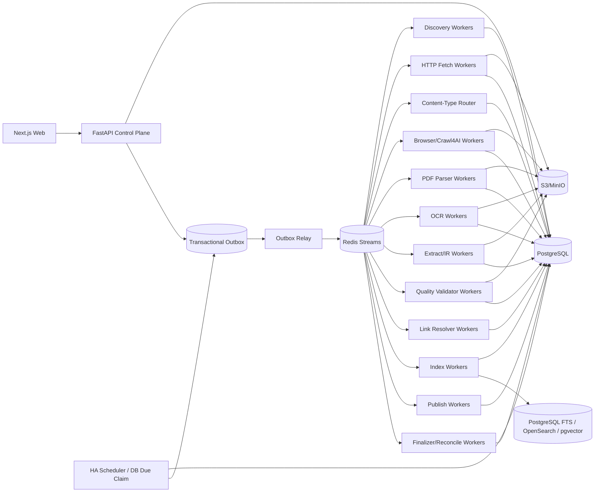

# 博客知识库技术方案

适用范围：从约 1000 个技术博客网站抓取尽可能完整的历史文章，清洗为稳定 Markdown 构建长期知识库；后续持续增加站点，并支持增量同步、Web 管理、版本保留、检索、故障恢复、离线重处理和外部发布。容量按“百万级文章、数百万到千万级 URL、站点高度异构、长期运行”设计。

## 1. 建设目标

1. 管理员录入博客根地址后，系统自动探测 Sitemap、RSS/Atom/JSON Feed、归档页、分类/标签/作者页、平台 API、普通站内链接和动态列表，生成可审核的站点配置草稿。
2. 支持约 1000 个站点历史全量回灌，并能持续增加站点；发现器、抓取器、渲染器、PDF/OCR 解析器、抽取器都通过 Capability/Adapter 扩展，不修改核心状态机。
3. 支持 FULL_BACKFILL、INCREMENTAL、RECONCILE、TARGETED_FETCH、REPROCESS 等明确运行模式。
4. 最终保存标题、作者、发布时间、更新时间、标签、canonical、正文、代码块、表格、图片、附件、PDF 文档、真实链接关系，并渲染成稳定 Markdown。
5. 默认 HTTP-first，仅在存在明确证据时升级 Browser/Crawl4AI/Playwright；PDF、Feed、JSON/API 等内容按 Content-Type 独立路由。
6. 支持 ETag、Last-Modified、Sitemap lastmod、Feed GUID/API cursor、内容 hash、重叠窗口和周期 Reconcile 驱动的增量同步。
7. 支持 durable frontier、断点续跑、幂等、lease、heartbeat、重试、限流、熔断、公平调度和 backpressure。
8. 保存不可变网络 Snapshot/原始 PDF、渲染 DOM、清洗 HTML、Document IR、Markdown、规则版本和质量结果；规则升级优先离线 replay。
9. Web 管理端支持站点接入、同步计划、覆盖检查、任务控制、混合内容路由诊断、质量审核、版本 diff、错误诊断、搜索、成本与发布。
10. 每次运行可复现、可解释、可审计；Worker 自报成功不能直接成为业务完成事实。

## 2. 核心原则

1. PostgreSQL 是业务状态真相源；S3/MinIO 是不可变大对象真相源。
2. Redis Streams 只做短期任务运输；决定性状态先落 PostgreSQL，再通过 Transactional Outbox 投递。
3. URL 被发现不等于允许抓取；统一经过 URL Admission Pipeline，真实网络连接仍由 Egress Gateway 再做 DNS/IP/端口/redirect 安全校验。
4. HTTP、Sitemap、Feed、API、Browser、PDF/OCR 分层处理，不把所有 URL 强行交给浏览器或 HTML extractor。
5. 网络 Snapshot 和原始 PDF 不可变；规则、Schema、模型、Renderer 升级优先 replay，不重复访问源站。
6. 文档身份与 URL 分离；redirect、canonical、镜像、迁移只是 identity evidence。
7. `document_version` append-only，不覆盖旧版本。
8. Bloom Filter/RoaringBitmap 只能加速，不能替代数据库唯一约束和 durable frontier。
9. `max_depth/max_pages/max_articles/max_entries/max_runtime` 都只是 execution slice 预算，不能作为历史完整性判定。
10. Scheduler、浏览器进程、Redis Consumer ownership、前端页面都是可丢失运行时状态，不能替代数据库里的 schedule、run、task、lease 和幂等约束。
11. 长期任务 payload 不保存 API Key、Cookie、密码或 Token，只保存 Secret Reference/Version。
12. Dashboard 是事实展示和显式命令入口，不是状态真相源，也不持有流程锁或 continue gate。
13. URL 必须来自真实 discovery evidence 或管理员精确输入，禁止根据标题猜 URL，也禁止用相似文章替代失败目标。
14. 核心领域数据通过 Typed Domain Writer 写入；关键领域字段只有唯一权威 Writer。
15. 阶段完成由独立 Stage Finalizer 对真实数据和 COMPLETE Artifact 对账。
16. 最终质量由独立 Deterministic Validator 重新计算，生产内容的 Worker 不能自行证明通过。
17. JSON、Markdown、搜索索引和外部知识库都是 Canonical Document IR 的 Projection，不互相反解析。

## 3. 总体架构



职责：

- Control Plane：站点配置、权限、计划、Run 创建、Run Context、命令和查询；
- Scheduler：只触发逻辑 Run，不执行长抓取；
- Discovery：负责枚举 URL 和覆盖证据；
- Fetch：获取原始响应并保存 Snapshot；
- Content-Type Router：根据真实响应决定 HTML/PDF/API/Feed/Attachment 路径；
- Browser：只处理需要渲染的页面；
- PDF/OCR：处理原始 PDF、扫描件和页级内容；
- Extract/IR：产生统一 Document IR；
- Artifact Service：Reservation、staging、hash/schema 校验和 COMPLETE commit；
- Quality Validator：独立校验最终候选版本；
- Stage Finalizer：以真实领域数据和 Artifact 对账阶段状态；
- Link Resolver：维护文档链接图；
- Dashboard：读取事实并发出显式命令。

## 4. Crawl Mode 与运行语义

```text
FULL_BACKFILL     首次历史全量回灌
INCREMENTAL       持续同步新增和更新
RECONCILE         周期性重新枚举，修复断档
TARGETED_FETCH    精确 URL 抓取/调试
REPROCESS         不访问网络，基于已有 Snapshot/原始 PDF 重抽取、清洗、质量、索引、发布
```

约束：

- FULL_BACKFILL 中 Page Type/Scorer 只影响优先级，不得因关键词、低分、深度预算静默丢弃合法历史 URL。
- TARGETED_FETCH 接收精确 URL 列表，保留输入顺序；任何目标失败都逐项报告，禁止补位或替代。
- REPROCESS 必须记录 `source_snapshot_id/source_artifact_id` 和 lineage。
- 同站点默认仅允许一个 active FULL_BACKFILL；其他模式并行关系由显式策略控制。

## 5. 不可变 Run Context Manifest

Run 创建时冻结本次运行语义：

```text
run_context_id
crawl_run_id
site_profile_release_id
site_source_release_ids
provider_release_ids
url_filter_release_id
url_scorer_release_id
page_type_rule_release_id
fetch_profile_release_id
content_route_release_id
browser_action_plan_release_id
adapter_binding_release_id
adapter_schema_release_id
extraction_pipeline_release_id
document_ir_schema_release_id
markdown_renderer_release_id
quality_contract_release_id
index_release_id
publish_release_id
runtime_bundle_release_ids
policy_release_id
credential_profile_id
secret_version_refs
context_hash
created_at
```

规则：Context 创建后不可修改；Worker payload 只引用 `run_context_id`；Worker 禁止读取“latest release”；Context Hash 不一致时拒绝提交；发布新配置不影响正在运行的 Run；Web 可对两个 Context 做 diff。

## 6. 核心数据模型

至少包括：

```text
site
site_source
site_profile_release
site_source_release

discovery_provider
discovery_provider_release
discovery_checkpoint
discovery_evidence
provider_coverage

sync_schedule
crawl_run
run_context_manifest
run_event

sitemap_task
url_frontier
background_task
task_event
fetch_task
crawl_attempt

content_route_release
adapter_capability_release
adapter_binding_release
adapter_schema_release
runtime_bundle_release

artifact_kind_release
artifact_reservation
artifact_object
run_artifact_manifest
fetch_snapshot

page_type_rule_release
url_filter_release
url_scorer_release
fetch_profile_release
browser_action_plan_release
extraction_pipeline_release
document_ir_schema_release
markdown_renderer_release
quality_contract_release

extraction_candidate
quality_manifest
quality_override

document
document_url_relation
document_version
document_link_edge
source_locator

field_ownership_release
contract_release
index_release
publish_state
credential_profile
outbox_event
```

如果业务侧仍使用“article”命名，可以把 `document` 视为父模型、`article` 作为 HTML 博客子类型，避免 PDF 再造一套版本、质量和索引系统。

## 7. 新站点接入：Discovery Probe

管理员录入根 URL 后：

1. 获取根页面，记录 final URL、响应头、Content-Type、编码和页面结构；
2. 解析 robots.txt 中 Sitemap；
3. 探测常见 Sitemap/Sitemap Index；
4. 探测 RSS/Atom/JSON Feed；
5. 识别平台公开 API、年/月归档、分类/标签/作者分页；
6. 识别普通站内链接和动态列表；
7. 抽样识别 HTML/PDF/下载资源比例；
8. 必要时执行 Browser Sample Probe；
9. 抽样 3~10 篇文章识别正文和 metadata；
10. 对 PDF 样本测试 native parser，必要时测试 OCR；
11. 生成 Site Profile、Provider、Filter、Scorer、Fetch Profile、Content Route、Extraction Contract 草稿；
12. 在 Web 展示证据、样本 diff、路由结果和风险；
13. dry-run/canary 通过后 publish；
14. 启动首次 FULL_BACKFILL；
15. 自动创建默认 INCREMENTAL schedule。

站点长期配置必须版本化，运行中的临时结果不能直接修改正式 Release。

## 8. Discovery Provider 与覆盖台账

Provider 优先级一般为：

```text
Sitemap/Sitemap Index
 -> 平台 API
 -> Feed
 -> Archive/Category/Tag/Author
 -> 普通 HTML 链接
 -> Browser Dynamic Listing
 -> 外部公开索引补漏
```

每个 Provider 独立保存：

```text
provider_id
capabilities
checkpoint
last_success_at
last_enumerated_at
continuity_marker
expected_count_hint
discovered_count
admitted_count
coverage_gap
status
```

每个 URL 保存 `discovery_evidence`：

```text
source_provider
source_url
source_entry/href
observed_at
raw_evidence_ref
```

FULL_BACKFILL 完成需要 Provider 级证据，而不是“本次抓了 N 页”。至少满足：主要 Provider 已完成或明确记录 gap；durable frontier 无可执行 URL；retry/dead-letter 已处理；reconcile 不再产生显著新增；Coverage Ledger 无未知断档。

## 9. Sitemap、Archive 与深度抓取持久化

Sitemap 独立建模为可恢复任务树，支持 Sitemap Index、gzip、namespace、lastmod，并用 streaming/iterparse 处理大文件；限制压缩前字节、解压后字节、压缩比，防 zip bomb。

Archive/Category/Tag/Author/Pagination Provider 同样保存页级 checkpoint 和 continuity。

Deep Crawl 的 `max_depth/max_pages/score_threshold/prefetch` 只作为某次 slice 的预算和排序参数：

```text
probe_depth
slice_max_pages
slice_max_runtime
prefetch_mode
priority_scorer
```

slice 用尽后保存 checkpoint 并重新排队；绝不把“达到 max_depth”当历史覆盖完成。对于长时间 Deep Crawl，可把执行器的恢复状态保存为 Adapter Artifact，但系统级恢复仍以 PostgreSQL durable frontier 为准。

## 10. Durable Frontier、URL Admission 与 Crawler Trap

URL 唯一键建议：

```text
(site_id, sha256(normalized_url))
```

Admission Pipeline：

1. URL 规范化；
2. SSRF/Egress 预检查；
3. robots/站点策略；
4. Domain/Subdomain allowlist；
5. path allow/deny；
6. query 规范化；
7. Content-Type/扩展名 hint；
8. canonical/redirect identity hint；
9. crawler trap 检测；
10. Page Type 分类；
11. Priority Scorer；
12. durable frontier upsert。

规范化处理 host 大小写、IDN、fragment、默认端口、tracking query、query 顺序、session 参数、trailing slash 和 percent-encoding。

Crawler Trap 至少防：日历无限翻页、搜索参数组合、tag/filter 笛卡尔积、无界 `?page=`、session/token、无限日期路径和多排序组合。

## 11. Content-Type Router

Fetch 成功后不能只凭 URL 后缀选择 extractor。路由证据组合：

```text
response Content-Type
Content-Disposition
magic bytes
URL/path hint
parser probe
```

统一路由：

```text
text/html, application/xhtml+xml
 -> HTML pipeline

application/pdf
 -> PDF pipeline

application/json
 -> API/JSON pipeline

application/rss+xml, application/atom+xml, XML Feed
 -> Discovery/Feed pipeline

image/audio/video/binary
 -> Attachment/Media pipeline

unknown/mismatch
 -> Sniff/Review pipeline
```

记录：

```text
reported_content_type
sniffed_content_type
selected_route
route_reason
route_release_id
```

Content-Type Router 只决定处理路线，不绕过 Admission/Egress 安全策略。

## 12. HTTP-first 与固定 Fetch Fallback

HTTP Worker 优先发送 `If-None-Match/If-Modified-Since`。304 只更新 freshness；200 先保存 raw bytes，再进入 Content-Type Router。

HTML 默认链：

```text
HTTP 原文
 -> HTTP 结构化抽取
 -> Browser/Crawl4AI 渲染
 -> 站点 API/Adapter
 -> 人工诊断
```

Browser escalation 原因结构化保存：

```text
EMPTY_ARTICLE_BODY
SPA_SHELL
JS_PAGINATION
LOAD_MORE
INFINITE_SCROLL
DYNAMIC_RENDER_REQUIRED
EXTRACTION_READINESS_FAILED
```

固定顺序由 `fetch_profile_release + adapter_binding_release` 定义，Worker 不自由尝试无穷 fallback。同一 Run 不允许静默切换 Adapter；fallback 必须形成显式 attempt，并保存 provenance。

## 13. PDF 与混合文档管线

技术博客经常包含白皮书、Slides、论文、RFC、报告等 PDF，因此 PDF 作为一等知识文档处理。

流程：

```text
PDF URL
 -> HTTP 下载
 -> Raw PDF immutable artifact
 -> native PDF parser
 -> page text / metadata / images / links
 -> Document IR candidate
 -> Quality Validator
 -> Markdown Renderer / Index
```

如果 text density 过低或大量页面无文本：

```text
native parse
 -> OCR_REQUIRED
 -> OCR Worker
 -> page-level text + confidence
 -> 新 extraction candidate
 -> Quality Validator
```

PDF 处理要求：

- raw PDF 始终保留，不因解析成功而删除；
- 记录 sha256、MIME、页数、parser release、OCR release；
- 页级 batch/checkpoint，防大 PDF 占满内存；
- 限制最大下载字节、单 slice 页数、总图片像素、解析时长；
- 加密/损坏/密码保护文档单独分类；
- OCR Worker 与普通 HTTP Worker 分池；
- 同一 PDF 可由多个 parser 产生 extraction candidate，但 accepted version 只能由质量门禁推进。

## 14. Adapter Capability Registry、Probe 与 Binding

核心状态机不硬编码 Crawl4AI、Firecrawl、Playwright、Browserless、PDF parser 或 OCR 引擎名，而依赖 Capability Contract。

能力示例：

```text
DISCOVER_MAP
DISCOVER_SITEMAP
FETCH_HTTP
FETCH_BINARY
FETCH_MARKDOWN
RENDER_JS
SCREENSHOT
EXTRACT_STRUCTURED
EXTRACT_PDF_TEXT
EXTRACT_PDF_IMAGES
OCR_DOCUMENT
DOWNLOAD_MEDIA
```

Run 创建前执行确定性能力探针，根据站点需求、健康度、成本和合规策略生成 `adapter_binding_release`，并冻结进 Run Context。

## 15. Snapshot、Canonical Document IR 与 Markdown

每次成功网络访问保存不可变 Snapshot/Artifact：

```text
raw response bytes / raw PDF
headers
charset
reported/sniffed content type
final_url
redirect chain
resolved_ip_evidence
body sha256
rendered DOM
cleaned HTML
raw/fit Markdown candidate
links/media
source provenance
fetch/runtime/adapter release
run_context_id
fetched_at
```

HTML 抽取链可组合：

```text
JSON-LD/OpenGraph/meta/API
CSS/XPath Contract
Trafilatura
Readability
Crawl4AI raw/fit Markdown
必要时 LLM Structured Extraction
```

统一 Document IR Block：

```text
heading
paragraph
list
quote
code_block
table
image
link
embed_placeholder
```

每个 block 可带 `source_locator`：

```text
html_selector/xpath
pdf_page
pdf_bbox
extraction_candidate_id
```

最终 Markdown 由版本化 Renderer 从 accepted Document IR 生成。Crawl4AI 的 `raw_markdown/fit_markdown` 保留为候选、调试和对比产物，但不作为最终唯一真相源。

文件名使用稳定 ID/slug 映射，不依赖标题作为内部 identity；图片和链接转换为可追踪绝对或托管地址。

## 16. JSON、Markdown、索引与发布 Projection

统一数据流：

```text
Raw Snapshot
 -> Extraction Candidate
 -> Accepted Document IR
 -> JSON Projection
 -> Markdown Projection
 -> Search Projection
 -> External KB Projection
```

输出目录不由 Worker 任意指定，而映射为 `publish_profile/artifact namespace`。Worker 只写 Artifact Service 分配的 staging key；发布 Worker 再按配置输出到 Git、对象存储、文件树、向量库或外部知识库 API。

## 17. 文档身份、去重与版本

- exact duplicate：Document IR/content hash；
- near duplicate：MinHash/SimHash 只产生候选；
- redirect/canonical：identity evidence；
- 多 URL 同文档：`document_url_relation`；
- 标题、slug、URL path 尾段都不是内部主键。

正文、关键 metadata、canonical identity 或 IR 实质变化时创建新 `document_version_candidate`。质量通过后才推进 current pointer。

仅抓取时间/响应头变化且 IR hash 相同，不创建无意义版本。

## 18. 周期计划、增量同步与 HA Scheduler

`sync_schedule` 保存：

```text
schedule_id
site_id
crawl_mode
schedule_revision
cron_expr/interval_seconds
timezone
dst_policy
jitter_seconds
overlap_window
misfire_policy
max_catch_up_runs
policy_release
enabled
next_due_at
last_expected_fire_at
last_success_at
```

数据库统一存 UTC；用户计划使用 IANA timezone。

`misfire_policy`：SKIP / FIRE_ONCE / CATCH_UP。

INCREMENTAL 默认 `FIRE_ONCE + overlap window + RECONCILE`。同一周期触发幂等键：

```text
sync:{site_id}:{schedule_id}:{schedule_revision}:{crawl_mode}:{expected_fire_at}
```

增量信号优先级：

```text
Feed/API cursor
Sitemap lastmod
ETag/Last-Modified
内容 hash
重叠时间窗口
周期 Reconcile
```

站点可按更新频率自适应调整 schedule，但策略必须版本化、可审计。

## 19. 后台任务、Claim、Lease、恢复与取消

长任务统一持久化：

```text
task_id
crawl_run_id
run_context_id
task_type
entity_id
state
priority
attempt_count
max_attempts
lease_owner
lease_epoch
lease_until
heartbeat_at
next_attempt_at
cancel_requested_at
error_class
created_at
updated_at
```

Claim 使用 `SELECT ... FOR UPDATE SKIP LOCKED` 或同等机制。Worker 提交前再次校验 `lease_owner + lease_epoch + cancel state`，避免旧 Worker 在 lease 过期后覆盖新 Worker。

Recovery Worker 扫描 stale/orphaned task；可重试则重新排队，超过上限进入 DEAD_LETTER。

取消规则：停止派生新任务、可取消 I/O 主动 abort、Browser context 清理、PDF/OCR slice 停止在安全 checkpoint、已开始 Artifact Commit 要么完成要么保持 staging 等待 Cleanup。

## 20. 状态、事件与 Transactional Outbox

所有决定性 transition 由统一 Transition Service 在一个 PostgreSQL 事务中完成：

```text
BEGIN
  validate current state / lease / context
  update domain/task state
  insert run_event/task_event
  insert outbox_event
COMMIT
```

Outbox Relay 负责把事件投递 Redis Streams。消费者必须幂等，消息重复不能产生重复领域对象。

## 21. 公平调度、限流与 Backpressure

Dispatcher 使用 weighted fair queue。配额层次：

```text
全局
 -> site/domain
 -> runtime class
 -> Worker pool
```

每域维护 `max_concurrency/token_bucket_rate/burst/min_delay/429_penalty/circuit_state/browser_quota`。

Runtime Class：

```text
ASYNC_NATIVE
BLOCKING_IO
CPU_BOUND
BROWSER
PDF
OCR
VALIDATOR
```

下游积压时：降低 Discovery 速率、暂停 Browser expansion、限制 PDF/OCR 入队、优先处理已抓未抽取 Snapshot，并保留增量高优先级通道。

禁止对百万 URL 一次性 `asyncio.gather`；Browser 长期维护 browser/context/page pool，避免每 URL 新建浏览器。

## 22. Artifact Registry、Reservation 与 Typed Domain Writer

所有 Artifact 类型来自 canonical `artifact_kind_release`，至少包括：

```text
RAW_HTTP
RAW_PDF
RENDERED_DOM
CLEANED_HTML
RAW_MARKDOWN
FIT_MARKDOWN
DOCUMENT_IR
PDF_PAGE_TEXT
OCR_PAGE_TEXT
MEDIA
QUALITY_MANIFEST
INDEX_PAYLOAD
```

写入协议：

```text
1. reserve_artifact(task_id, attempt_id, kind)
2. 服务端校验 Run Context、lease、producer stage
3. 返回 staging object key / pre-signed upload
4. Worker 流式上传并计算 sha256/size/media type
5. commit_artifact(...)
6. 服务端校验 kind/schema/hash/media type
7. 生成 content-addressed COMPLETE artifact_object
8. Typed Domain Writer 引用 Artifact
9. run_artifact_manifest 记录关系
10. Cleanup 回收过期 staging
```

核心业务写入通过：

```text
record_discovered_url(...)
commit_fetch_snapshot(...)
commit_content_route(...)
commit_extraction_candidate(...)
commit_document_version_candidate(...)
commit_quality_manifest(...)
accept_document_version(...)
commit_link_edges(...)
commit_index_result(...)
commit_publish_result(...)
```

Worker 不能任意拼对象 key，也不能引用未 COMPLETE 的对象。

## 23. Stage Finalizer 与 Canonical Persisted Set

每个长阶段结束运行 Finalizer：

```text
finalize_discovery
finalize_fetch
finalize_route
finalize_extraction
finalize_quality
finalize_link_graph
finalize_index
finalize_publish
```

比较：数据库期望集合 vs COMPLETE Artifact vs run_artifact_manifest vs 领域表引用 vs quality manifest vs retry/dead-letter。

输出：COMPLETED / PARTIAL / FAILED / INCONSISTENT。

要求：真实产物为 0 不能标完成；discovered > persisted 时显式 PARTIAL；TARGETED_FETCH 任一指定 URL 缺失即失败；INCONSISTENT 自动创建 repair/reconcile task；下游只能消费 Finalizer 返回的 canonical persisted/accepted set。

## 24. Quality Contract 与质量保护

最终候选版本必须由独立 Validator 重新读取真实 COMPLETE Artifact 后校验。

通用检查：

- 正文非空和长度合理；
- 标题/发布时间/作者等 metadata 一致性；
- HTML/PDF -> IR -> Markdown 结构保留；
- 代码块、表格、列表不异常丢失；
- 截断、模板污染、导航噪声；
- canonical/URL identity 冲突；
- 链接完整性；
- 与当前高质量版本相比是否明显退化。

PDF 特有检查：

```text
page_count > 0
text_coverage_ratio
empty_page_ratio
ocr_confidence
heading/paragraph continuity
metadata consistency
truncation detection
image_only_detection
```

人工 Override 单独保存 `quality_override`，不能篡改机器 Manifest。只有 PASSED 或明确人工授权的候选才能成为 accepted version。

## 25. Document Link Graph

抽取时增量写 `document_link_edge`：

```text
source_document_id
source_document_version_id
target_url_id
target_document_id
href
anchor_text
rel
source_locator
first_seen_at
last_seen_at
status
```

用途：inbound/outbound、broken link、orphan document、redirect/canonical 重解析、覆盖补漏、内容图谱与检索增强。PDF 内链接也进入同一图谱。

## 26. Drift Detection 与 Reconcile

监控：

```text
标题存在率
正文字符/段落数
代码块/表格保留率
抽取候选分歧
Browser escalation rate
PDF/OCR route rate
HTTP 状态分布
模板噪声比例
Quality fail rate
版本变更率
Provider 新增率
```

Release 发布后指标突变时：停止扩大范围、自动重新 Probe、生成规则草稿或回滚。低质量新候选不能覆盖当前高质量版本。

RECONCILE 周/月级重新枚举 Sitemap/Archive/Feed/API 等，修复增量窗口遗漏和 Provider 断档。

## 27. 错误分类与重试

统一错误分类：

```text
DNS/TLS/CONNECT_TIMEOUT/READ_TIMEOUT
HTTP_429/HTTP_5XX/HTTP_404_410
ROBOTS_DENIED/AUTH_REQUIRED
SSRF_BLOCKED/REDIRECT_BLOCKED
CONTENT_TOO_LARGE
CONTENT_TYPE_MISMATCH
PARSE_FAILED/EXTRACTION_FAILED
PDF_PARSE_FAILED/PDF_ENCRYPTED
OCR_FAILED
BROWSER_CRASH/BROWSER_TIMEOUT
CONTRACT_VIOLATION
QUALITY_FAILED
ARTIFACT_COMMIT_FAILED
LEASE_LOST/CANCELLED
```

可重试错误按 `Retry-After + jittered exponential backoff + max attempts + circuit breaker`。配置错误、明确拒绝和确定性质量失败不原样重试，只重放最小必要单元。

## 28. 安全、robots 与 Egress

所有网络访问统一经过 Egress Gateway：

- 只允许 http/https；
- 拒绝 localhost、RFC1918、loopback、link-local、metadata endpoint；
- DNS 多 A/AAAA 逐一检查；
- 每次 redirect 重新 Admission；
- 防 DNS rebinding；
- 限制危险端口；
- Browser 子资源也执行网络策略；
- 遵守 robots、Retry-After 和礼貌抓取；
- 不绕过验证码、登录、付费墙或明确访问控制；
- Secret 通过 Vault/云 Secret Manager/KMS 解析；
- 日志、事件和 Artifact metadata 默认脱敏。

PDF/OCR 额外安全：

- parser 运行在资源受限、低权限隔离 Worker；
- 限制文件大小、页数、解析时长、图片像素和临时磁盘；
- 不把第三方文件名直接当对象 key；
- 禁止用户控制 Worker 任意本地输出目录；
- parser/OCR/runtime 固定进 Run Context；
- 依赖纳入 SBOM、镜像扫描和供应链门禁。

## 29. Web 管理功能

### 29.1 站点接入

- Probe 向导；
- Sitemap/Feed/API/Archive/Browser 证据；
- HTML/PDF/下载资源比例；
- 自动规则和 Content Route 草稿；
- Extraction/Quality 样本对比；
- dry-run/canary/publish；
- 一键 FULL_BACKFILL；
- 自动创建 INCREMENTAL schedule。

### 29.2 同步与 Run

- cron/interval、timezone、DST、jitter、overlap；
- schedule revision/misfire policy；
- Run Now / Force New Run / Targeted Fetch / Reprocess；
- Run Context Manifest 与 diff；
- pause/resume/cancel/retry；
- supersede/cancel 审计。

### 29.3 URL、覆盖与路由诊断

从任一 URL 可看到：

```text
discovery evidence
frontier state
attempt/fetch snapshot
reported/sniffed content type
selected route / route reason
adapter/fallback
PDF page count / OCR state
extraction candidate
Document IR/Markdown
quality manifest
document version
link graph
index/publish result
run/task events
```

### 29.4 Artifact 与阶段对账

- Artifact Kind/Contract Release；
- reservation/staging/COMPLETE；
- DB expected vs COMPLETE Artifact；
- PARTIAL/INCONSISTENT 原因；
- repair/reconcile；
- raw HTML/rendered DOM/raw PDF/IR/Markdown 对比。

### 29.5 质量与版本

- Extraction Candidate 对比；
- Quality Manifest/Override；
- Document IR vs Markdown diff；
- current/previous version diff；
- PDF native parse vs OCR diff；
- 低质量候选阻断原因；
- Link Graph 和断链。

Dashboard 只读取已提交事实。按钮操作必须调用 Control API 命令，页面关闭或刷新不改变后台状态机。

## 30. 搜索与发布

默认 PostgreSQL FTS；规模或复杂查询上升后接 OpenSearch。向量检索按需使用 pgvector/独立 Vector DB，不作为抓取主链路强依赖。

索引字段建议：

```text
title
body_markdown
author
published_at/updated_at
tags
site/domain
canonical_url
headings
code_language
source_type
pdf_page/source_locator
link graph features
document_version_id
```

发布 Worker 支持文件树、Git、对象存储、向量库或外部知识库 API。默认只发布 accepted + Quality PASSED 版本。

## 31. 可观测性与审计

指标：

```text
urls_discovered/admitted/fetched
documents_accepted
provider_coverage_gap
frontier_depth
queue_lag
fetch_latency
browser_escalation_rate
pdf_route_rate
ocr_route_rate
429/5xx rate
retry/dead_letter
artifact_commit_failure
quality_failure
scheduler_lag
lease_recovery
cancel_to_stop_latency
cost_per_site/document
```

结构化日志统一携带：

```text
site_id
crawl_run_id
run_context_id
task_id
attempt_id
url_id
snapshot_id
document_id
document_version_id
adapter_binding_release
runtime_bundle_release
```

Run/Task 关键状态事件长期保留，可通过 SSE/WebSocket 推送；客户端按 event_id 去重。

## 32. 推荐技术栈

| 层 | 推荐 |
|---|---|
| API | Python + FastAPI |
| Web | React / Next.js |
| DB | PostgreSQL |
| Queue | Redis Streams |
| Object Storage | S3 / MinIO |
| HTTP | httpx/aiohttp |
| HTML/IR | selectolax/lxml + Trafilatura/Readability |
| Browser | Crawl4AI + Playwright |
| PDF | Crawl4AI PDF Strategy + pypdf/可替换解析器 |
| OCR | 独立 OCR Adapter/Worker Pool |
| Scheduler | DB Due Claim + APScheduler/自研轻触发器 |
| Search | PostgreSQL FTS，后续 OpenSearch |
| Vector | pgvector（按需） |
| Secret | Vault / 云 Secret Manager / KMS |
| Deployment | Docker + Kubernetes |

初期不建议直接引入 Kafka。Redis Streams + PostgreSQL Outbox 足够；只有吞吐、保留周期或跨区域消费出现明确瓶颈再迁移 Kafka/Pulsar。

## 33. 部署与容量规划

推荐最小生产拓扑：

```text
2 x FastAPI Control Plane
2 x Scheduler/Outbox Relay
N x Discovery/HTTP Workers
独立 Browser Worker Pool
独立 PDF Parser Pool
独立 OCR Pool
独立 CPU Extract/Renderer Pool
独立 Validator Pool
1 x PostgreSQL HA/Managed
1 x Redis HA/Managed
S3/MinIO
Next.js Web
```

扩容依据不是“站点数量”，而是 frontier/queue lag、HTTP p95/p99、Browser escalation rate、PDF/OCR backlog、CPU extract backlog、Validator backlog、429/5xx、object/index size 和单域礼貌上限。

1000 站的关键瓶颈通常是站点异构、浏览器比例、PDF/OCR 密度和礼貌限流，而不是单纯 CPU。

## 34. Runtime Release 与供应链

`runtime_bundle_release` 固定：

```text
runtime_role
image_digest
package_lock_hash
crawler/browser version
pdf parser version
ocr version
extractor version
validator version
build_commit
sbom_ref
created_at
```

Run Context 只引用 immutable digest，不使用浮动 `latest`。镜像进入生产前通过单元测试、Contract Test、Golden Crawl、Golden PDF、Replay、Artifact Finalizer、SSRF、恶意文件资源限制和回滚测试。

## 35. 实施阶段

### Phase 1：MVP

- site/source/Probe；
- Sitemap/Feed；
- streaming sitemap task；
- durable frontier；
- HTTP fetch + conditional request；
- Content-Type Router；
- raw Snapshot；
- HTML Document IR + Markdown；
- PostgreSQL + S3/MinIO；
- Redis Streams + Outbox；
- 基础 Web；
- Admission/Egress/robots；
- Secret Reference；
- 基础 error taxonomy。

### Phase 2：异构站点与混合文档

- Archive/API/HTML Provider；
- CSS/XPath Rule；
- Browser/Crawl4AI；
- PDF raw artifact + native parser；
- Document IR source locator；
- Capability Registry + Probe + Binding；
- Run Context Manifest；
- Artifact Reservation/Commit；
- Typed Domain Writer；
- Field Ownership Registry；
- Stage Finalizer；
- Quality Contract/Manifest；
- Targeted Fetch/Reprocess；
- Link Graph。

### Phase 3：规模化

- OCR pipeline；
- 多 Provider Coverage Ledger；
- weighted fairness；
- backpressure；
- 自适应调度；
- HA Scheduler/Recovery；
- OpenSearch/pgvector；
- 外部知识库发布；
- 自动 Drift Detection；
- Runtime Release Gate；
- 完整运维/成本面板。

## 36. 验收标准

### 36.1 全量历史覆盖

随机选择不同规模和技术栈站点，必须输出 Provider 级覆盖证据；Worker 重启后继续；大 Sitemap 从 checkpoint 恢复；FULL_BACKFILL 不因关键词、Page Type、`max_depth/max_pages/max_entries/max_articles` 漏掉已发现合法 URL。

### 36.2 URL 发现与精确任务

每个进入 frontier 的 URL 都能追溯真实 discovery evidence。禁止标题推导 URL。TARGETED_FETCH 输入 N 个 URL 时逐项处理；任意失败不得被其他文档替代。

### 36.3 Content-Type 路由

构造无 `.pdf` 后缀但返回 `application/pdf`、错误 Content-Type、JSON API、Feed、HTML 页面等样本。系统必须记录 reported/sniffed type 和 route reason，并进入正确 pipeline。

### 36.4 HTML/PDF 混合抓取

HTML 深爬发现 PDF 链接后，PDF 必须进入 PDF pipeline 而不是 HTML parser；原始 PDF 保留；native parse 和 OCR 都可形成候选；页码/source locator 可追溯。

### 36.5 Run Context 可复现

Run 创建后发布新 Fetch/Route/Extraction/PDF/OCR/Quality/Adapter Release，运行中的 Worker 仍只使用原 Context。相同 Snapshot + 相同 Context 的确定性结果应一致。

### 36.6 增量与调度

新增文章在 SLA 内进入知识库；更新文章产生新版本；304/内容未变不产生新版本；Feed/Sitemap 窗口断档可由 RECONCILE 修复；Scheduler 实例故障后另一实例继续。

### 36.7 Lease/恢复/取消

故障注入覆盖 CLAIMED、RUNNING、写 Snapshot 前后、PDF/OCR slice、heartbeat 中断、lease 失效和 cancel。旧 Worker 失去 lease 后不能覆盖新 Worker。

### 36.8 Artifact Contract 与 Finalizer

故障注入覆盖对象上传中断、reservation 过期、hash/schema 不匹配、Worker 自报成功但无产物、重复 finalize。Finalizer 必须得到可重复的 COMPLETED/PARTIAL/FAILED/INCONSISTENT。

### 36.9 抽取与 Markdown 质量

标题、发布时间、正文、代码块、表格、列表按抽样集评估；规则升级可从 Snapshot/原始 PDF replay；Markdown 不因文本扁平化破坏技术结构；低质量新候选不能覆盖旧高质量版本。

### 36.10 PDF/OCR 质量

测试文本型 PDF、扫描 PDF、混合 PDF、损坏 PDF、大 PDF、加密 PDF。必须正确分类；OCR 只在需要时触发；解析失败不能导致原始 PDF 丢失；页级 provenance 和质量指标可审计。

### 36.11 Link Graph

抽样文档 outbound/inbound 对应；redirect/canonical 后可重解析；PDF 内链接也可进入图谱；未抓内部目标能追溯原始 href/source locator。

### 36.12 安全

测试公网 URL 302 到 RFC1918/metadata、DNS 多地址混入内网、DNS rebinding、嵌套 Sitemap 指向内网、危险端口、Browser 子资源越权请求、恶意超大 PDF/图片资源，必须在执行前或资源阈值处阻断并留下审计证据。

### 36.13 Web 与运维

Web 能从任一 URL 定位 discovery evidence、frontier、attempt、Snapshot、Content-Type route、Adapter/fallback、PDF/OCR 状态、Extraction Candidate、Document IR/Markdown、Quality Manifest、Version、Link Graph、Index/Publish、Run/Task Event。浏览器断线、刷新或多管理员同时查看不能改变后台状态机。

---

该方案的核心是把“抓网页”拆成**可发现、可准入、可路由、可抓取、可解析、可验证、可恢复、可对账、可复现**的长期数据系统。Crawl4AI、Firecrawl、Playwright、PDF parser、OCR、Trafilatura 等都只是可替换执行器；真正决定 1000 站长期可靠性的，是 durable state、Coverage Ledger、Content-Type Router、Run Context、Capability Binding、Artifact Contract、Canonical Document IR、Typed Writer、Finalizer 和独立 Quality Manifest。
