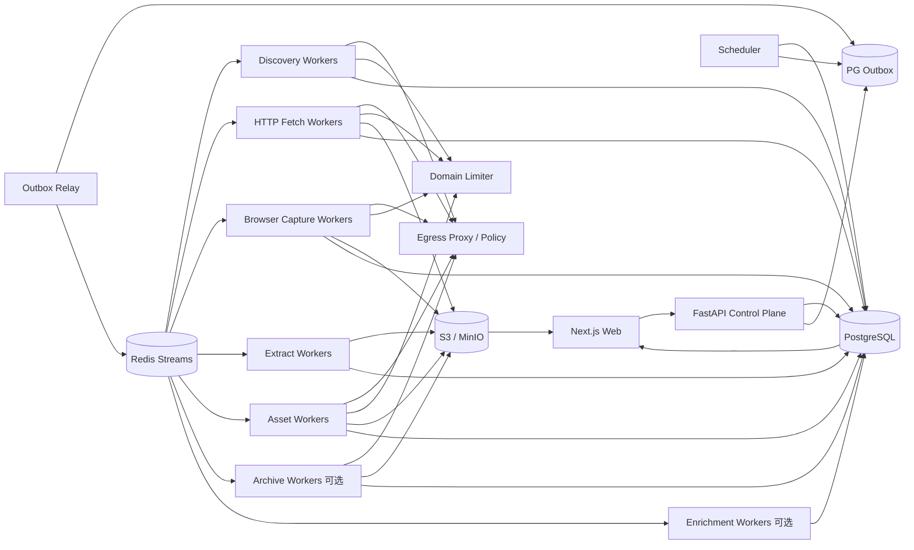

# 博客知识库技术方案

适用范围：约 1000 个技术博客网站的全量历史文章采集、Markdown 清洗、持续扩站、增量同步和 Web 管理；架构应能继续横向扩展到更多站点和数百万 URL。

## 1. 目标与边界

### 1.1 核心目标

1. 新站接入后尽可能完整发现并采集当前仍可访问的历史文章。
2. 将标题、作者、发布时间、更新时间、标签、canonical URL、正文和资源关系统一清洗为稳定 Markdown。
3. 支持约 1000 个站点长期运行，并能持续增加站点；普通博客不需要为每站开发一套独立爬虫。
4. 支持增量同步，只处理新增、更新、删除确认、规则重抽和需要重试的内容。
5. 支持断点续跑、幂等、去重、版本保留、失败隔离、重试、回滚和离线重新抽取。
6. 提供 Web 管理端完成站点接入、发现预览、规则编辑、任务触发、状态监控、错误诊断、Markdown 预览、版本 diff、安全事件、预算和质量管理。
7. 首次历史回灌和日常增量共用同一套数据模型、队列、状态机、安全和可观测体系。
8. Sitemap、Feed、robots.txt、HTML、redirect、媒体、canonical、`<base href>`、归档索引和第三方抓取结果全部视为不可信输入。
9. LLM 仅作为可选语义增强层，不参与基础 Markdown 正确性，不自动改写原文。

### 1.2 “全量历史”的定义

- **Live Full**：通过 Sitemap、Feed、年月归档、分页、站内链接、公开索引等能够发现，且当前仍可访问的文章。
- **Archive Full（可选）**：在合规前提下，通过 Common Crawl、Wayback 等公开历史索引补充已经删除、迁移或不再被当前站点暴露的历史 URL/快照。

必须分别统计：

- 发现过多少历史 URL；
- 当前可访问多少；
- 成功取得正文多少；
- 仅有历史索引但无正文多少。

### 1.3 非目标

- 不绕过登录、付费墙、验证码、明确禁止的访问控制或反爬限制。
- 不默认所有页面都使用 Browser；HTTP 可以完成时优先低成本路径。
- 不把 Redis、本地 crawler cache、CLI 输出目录或内存 URL list 当业务真相源。
- 不把 GitHub 当海量正文主存储；GitHub 仅保存方案、规则、配置和少量导出。
- 向量库/RAG 不作为采集一期强依赖，但数据模型预留 article/version/chunk/reference。

## 2. 设计原则

1. **Discovery、Fetch、Capture、Extract、Asset、Enrich 解耦**。
2. **PostgreSQL 是业务状态真相源**；Redis 只承担任务分发、限流和短期协调。
3. **端到端流式和分批**；禁止把几十万 URL、超大 Sitemap、响应体或媒体批次一次性装入内存。
4. **跨域并发、域内克制**；同一域的 Sitemap、Feed、HTTP、Browser、媒体共享总限流和预算。
5. **HTTP 优先，Browser 升级**。
6. **抓取快照优先保留**；规则变化优先离线 re-extract，而不是重新访问源站。
7. **规则、Schema、Canonicalizer、Fetcher、Capture Profile、Extractor、Serializer、Security Policy 全部版本化**。
8. **增量从发现阶段开始**；Feed、Sitemap Validator、页面 Validator 和内容 hash 共同减少无效访问。
9. **Provider/Adapter 化**；Crawl4AI、Playwright、Common Crawl、Wayback、LLM 均可替换。
10. **控制面不执行重任务**；Web/API 只创建 durable job。
11. **所有 URL 入口和 redirect hop 统一经过 EgressPolicy**。
12. **远端输入必须有硬预算**；bytes、请求次数、递归、URL 数、XML element、时间、重定向、Browser 子请求同时受限。
13. **安全控制必须可测试、可观测、可审计**。
14. **输出身份必须稳定**；不能依赖本次发现顺序。
15. **部分成功显式表达**；正文成功、媒体失败、子 Sitemap 失败、预算耗尽不能伪装成 complete。
16. **失败请求同样计入限流和预算**。
17. **PG 与队列避免双写窗口**；使用 transactional outbox。
18. **不使用正则作为生产级 Markdown/HTML 结构重写器**；链接和媒体在 DOM/IR/AST 层规范化。

## 3. 总体架构



系统分为六个平面：

- **控制面**：站点、规则、计划、任务、权限、发布、回滚、预算。
- **发现面**：Feed、Sitemap、归档页、受限深爬、Common Crawl/Wayback。
- **采集数据面**：HTTP 下载、Browser capture、快照、确定性抽取、Markdown、媒体。
- **协调面**：Redis Streams、DB lease、优先级、domain limiter、backpressure、outbox。
- **安全治理面**：Egress、SSRF、防资源耗尽、预览隔离、日志脱敏、供应链。
- **增强面**：可选分类、标签、结构化补充，不改写正文。

## 4. 推荐技术栈

| 层 | 推荐 | 说明 |
|---|---|---|
| API | Python + FastAPI | 只创建、查询和管理任务 |
| Web | React / Next.js | 站点、规则、任务、diff、安全、预算、质量 |
| 元数据/状态 | PostgreSQL | 真相源、事务、唯一约束、lease、outbox、审计 |
| 队列 | Redis Streams + Consumer Group | at-least-once、pending reclaim、水平扩容 |
| 分布式限流 | Redis + Lua | token bucket、concurrency lease、Retry-After |
| HTTP | httpx / aiohttp | 手动 redirect、Validator、streaming body |
| Browser | Crawl4AI / Playwright | 独立 worker、固定 slot、public-only egress |
| XML | defusedxml + XMLPullParser/iterparse | 禁止 DTD/entity、流式解析 |
| HTML/IR | lxml/selectolax/BeautifulSoup + 自定义 Article IR | 结构化链接和正文中间表示 |
| Markdown | Crawl4AI Markdown Generator 或 AST serializer | 版本化、确定性输出 |
| 对象存储 | S3 / MinIO | HTTP raw、rendered DOM、Markdown、版本、媒体、导出 |
| 可选增强 | Model Gateway + Pydantic/JSON Schema | 严格结构化、预算控制 |
| 监控 | Prometheus + Grafana + OpenTelemetry | 技术和业务 SLO |
| 安全扫描 | OSV/pip-audit + Bandit/Semgrep + SBOM | 依赖与供应链 |
| 部署 | Docker Compose 起步，Kubernetes 按瓶颈引入 | 先隔离 worker 类型，再横向扩展 |

## 5. 核心数据模型

### 5.1 站点与规则

```text
sites
- id
- name
- base_url
- status(draft/probing/backfilling/active/degraded/disabled)
- robots_policy
- default_schedule
- config_json
- active_rule_version
- created_at / updated_at

site_rules
- id
- site_id
- version
- status(draft/testing/published/superseded)
- discovery_rule_json
- fetch_rule_json
- capture_rule_json
- extract_rule_json
- identity_rule_json
- asset_rule_json
- security_rule_json
- created_by / created_at
```

### 5.2 Discovery 与 Sitemap 候选

```text
discovery_sources
- id
- site_id
- kind(feed/sitemap/archive/deepcrawl/commoncrawl/wayback/custom)
- normalized_url
- discovered_via(robots/common_path/manual/history/html)
- status
- etag / last_modified
- coverage_hint_json
- last_success_at / last_error_at
- error_code

discovery_runs
- id
- site_id
- provider
- status(running/completed/partial/budget_exhausted/failed)
- checkpoint_before / checkpoint_after
- discovered_count / unique_count / accepted_count
- budget_json
- error_code
- started_at / finished_at

discovery_checkpoints
- site_id
- provider
- scope_key
- cursor_json
- etag / last_modified
- last_success_at / last_error_at

frontier_urls
- id
- site_id
- normalized_url
- url_hash
- discovered_from
- first_seen_at / last_seen_at
- lastmod_hint
- priority
- status
- next_fetch_at
- lease_owner / lease_until
```

`UNIQUE(site_id, url_hash)`。

### 5.3 Fetch/Capture 快照

```text
fetch_snapshots
- id
- site_id
- frontier_url_id
- requested_url
- final_url
- capture_kind(http/browser/archive)
- status_code
- etag / last_modified
- content_type
- body_sha256
- object_key_http_raw
- object_key_rendered_dom
- capture_profile_version
- fetcher_version
- browser_engine_version
- security_policy_version
- fetched_at
```

Browser 页面必须能区分服务端原始响应和渲染后 DOM；否则后续无法可靠离线重抽。

### 5.4 文章与版本

```text
articles
- id
- site_id
- article_key
- accepted_canonical_url
- current_version_id
- status(active/source_deleted/rejected)
- first_published_at
- last_source_seen_at

article_aliases
- site_id
- alias_url_hash
- article_id
- alias_url
- reason

article_versions
- id
- article_id
- source_snapshot_id
- content_sha256
- markdown_sha256
- object_key_md
- extractor_version
- rule_version
- serializer_version
- metadata_json
- provenance_json
- created_at
```

### 5.5 媒体

```text
asset_blobs
- content_sha256 PK
- object_key
- byte_size
- detected_mime
- active_content
- first_seen_at

asset_sources
- normalized_source_url_hash
- source_url
- etag / last_modified
- content_sha256
- last_checked_at

article_assets
- article_version_id
- content_sha256
- source_url
- relation(image/attachment/favicon/...)
- original_ref
```

### 5.6 Job、Outbox、错误与审计

```text
jobs
- id
- type
- site_id
- status
- priority
- requested_by
- budget_json
- created_at / started_at / finished_at

job_items
- job_id
- item_key
- stage
- status
- attempt
- lease_owner / lease_until
- last_error_code

error_events
- id
- job_id / item_key
- stage
- attempt
- error_code
- sanitized_message
- retryable
- occurred_at

outbox_events
- id
- aggregate_type
- aggregate_id
- stream
- payload_json
- published_at

audit_logs / security_events
```

API/Scheduler 在同一 PG 事务中写 job/job_item/outbox，由 relay 发布到 Redis，避免 DB 与队列双写不一致。

## 6. 站点生命周期和接入

```text
draft -> probing -> validated -> backfilling -> active
                   \-> rejected
active -> degraded -> active
active -> disabled
```

### 6.1 probing

新站只用小预算：

1. 拉取并解析 robots.txt。
2. 生成 Feed/Sitemap 候选集合。
3. 抽样 20~200 个 URL，统计 path、状态码、content-type、文章候选比例。
4. HTTP 优先抽取，必要时 Browser fallback。
5. 生成 include/exclude、selector、identity/canonical、capture profile 候选规则。
6. 形成 golden URL 集，在 Web 中人工确认后才全量回灌。

### 6.2 接入层级

1. **零代码通用模式**：Feed/Sitemap + 自动正文抽取。
2. **声明式模式**：CSS/XPath、分页、等待条件、路径规则、canonical、allowed host。
3. **Adapter 插件模式**：特殊 API、复杂分页、JS 路由、自定义签名或 identity。

```python
class SiteAdapter(Protocol):
    async def discover(self, ctx) -> AsyncIterator[DiscoveredUrl]: ...
    async def prepare_request(self, url, ctx) -> FetchRequest: ...
    async def extract(self, snapshot, ctx) -> ArticleDocument: ...
    def canonicalize(self, document, ctx) -> CanonicalResult: ...
```

## 7. Discovery Provider 设计

统一接口：

```python
class DiscoveryProvider(Protocol):
    async def scan(
        self,
        site: Site,
        checkpoint: Checkpoint | None,
        budget: DiscoveryBudget,
    ) -> AsyncIterator[DiscoveredUrl]: ...
```

内置：

- `FeedProvider`
- `SitemapProvider`
- `ArchivePageProvider`
- `DeepCrawlProvider`
- `CommonCrawlProvider`（可选）
- `WaybackProvider`（可选）
- `CustomAdapterProvider`

每个 `DiscoveredUrl` 至少携带：URL、source/provider、discovered_at、lastmod/pubdate hint、depth、parent/evidence。

## 8. Sitemap 生产级实现

### 8.1 入口候选不能“命中即停止”

入口来源包括：

- robots.txt 的 `Sitemap:`；
- `/sitemap.xml`、`/sitemap_index.xml`、`/sitemap-index.xml`、`/wp-sitemap.xml`；
- 人工配置；
- 历史成功入口；
- 页面 `<link>` 或其它可靠发现源。

多个有效 root Sitemap 取并集。每个候选独立记录健康状态；一个入口损坏不能阻塞其它入口。

### 8.2 流式解析

禁止：

```text
response.content -> gzip.decompress(all) -> fromstring(all) -> list(all URLs)
```

推荐：

```text
HTTP stream
 -> compressed bytes limiter
 -> bounded decompressor
 -> decoded bytes / ratio limiter
 -> XMLPullParser
 -> batch UPSERT frontier
 -> checkpoint
```

### 8.3 预算与循环

统一 run budget：

- max compressed bytes；
- max decoded bytes；
- max compression ratio；
- max XML elements；
- max page URLs；
- max child sitemaps；
- max request count；
- max depth；
- wall time。

维护 child sitemap visited identity 检测 cycle；对 root/child 保存 Validator、last_success、status 和 checkpoint。

`<lastmod>` 只作为优先级提示，不能作为正文必变的唯一证据。

## 9. Robots 与访问礼仪

- 默认 `robots_policy: respect`。
- **Sitemap 发现和 robots 抓取准入是两件独立事情**。
- 缓存 robots.txt，按 TTL + ETag/Last-Modified 重新验证。
- 对 Fetch/DeepCrawl 按目标 user-agent 和 path 执行 Allow/Disallow。
- robots fetch 失败区分 404、网络失败、解析失败；明确站点级 fail-open/fail-closed 策略。
- robots 版本和策略决策进入审计/trace。

域级限流覆盖 Sitemap、Feed、HTTP、Browser 顶层与子资源、媒体。所有网络尝试发出前获得 limiter lease，失败、timeout、redirect、404 同样消耗请求机会。

## 10. Egress / SSRF 安全

统一 `EgressPolicy`：

1. 仅允许 HTTP/HTTPS。
2. 拒绝 URL userinfo、异常端口、异常编码、混淆 host。
3. 默认拒绝 localhost、RFC1918、link-local、multicast、reserved、unspecified、cloud metadata、IPv4-mapped IPv6。
4. DNS 解析结果中任一地址命中禁止网段则拒绝。
5. HTTP 禁用自动 redirect；每个 hop 重新校验 URL、DNS、allowed-host 和 redirect budget。
6. 默认禁止跨 allowed host redirect；确需允许时显式配置并审计。
7. Feed、Sitemap、页面、媒体、Archive URL、canonical、`<base href>`、Browser 顶层和子资源全部经过同一策略。

第二道网络防线：

- egress proxy 或网络命名空间负责安全 DNS + connect；
- Browser worker 不使用 host network；
- 网络层硬拒私网和 metadata endpoint；
- Browser 的 iframe/XHR/fetch/image/font/download 同样受控。

## 11. 资源预算模型

预算是层级化的：

```text
platform/day
 -> site/day
 -> job
 -> provider/fetch
 -> request
```

关键指标：

- requests；
- bytes compressed/decoded；
- redirects；
- XML elements/URLs；
- Browser subrequests/bytes/wall-time；
- assets/article、asset requests、asset bytes；
- failures/timeouts。

失败请求也扣 request budget。预算耗尽使用 `partial/budget_exhausted`，保留 checkpoint。

## 12. 调度、队列和公平性

### 12.1 Redis Streams

按阶段拆 stream 或使用统一 envelope。Consumer Group 提供 at-least-once；worker 必须幂等。

### 12.2 DB lease

Redis 消息不是唯一真相。worker 开始处理前取得 DB lease；超时可 reclaim。

### 12.3 多站点公平

- 每站并发上限；
- 每域并发上限；
- weighted fair queue；
- backfill 低于实时增量优先级；
- 单个超大站不能垄断 worker。

### 12.4 Backpressure

当 PG/S3 延迟、Redis pending、Extract backlog、Browser RSS 升高时，Scheduler 自动降 Fetch/Discovery 速率。

## 13. HTTP Fetch 快路径

每个页面优先 HTTP：

1. Egress + robots + limiter 准入。
2. 带 `If-None-Match` / `If-Modified-Since`。
3. 手动 redirect，逐 hop 校验。
4. 流式读取，限制 compressed/decoded bytes 和 wall time。
5. 校验 content-type，必要时 sniff。
6. 304 -> unchanged，不进入 Extract。
7. 200 且 body hash 未变 -> 更新 seen/validator，不创建新版本。
8. 只有需要渲染时进入 Browser。

HEAD 只作探测；403/405 或不可信时 GET fallback。404/410 需要多轮确认后再标 `source_deleted`。

## 14. Browser Capture 升级路径

仅以下情况升级：

- 初始 HTML 为 CSR shell；
- 正文依赖 JS；
- 需要等待 selector、有限滚动/点击或 SPA route；
- HTTP 抽取质量明显不合格。

Browser worker：

- 与 HTTP worker 隔离；
- 固定 slot；
- page wall-time、总请求数、总字节、redirect 有预算；
- 默认 block 非必要媒体/font；
- public-only egress；
- profile/context 不跨不可信站点共享敏感 cookie/storage；
- 周期重启防内存泄漏。

### 14.1 可重放 Capture Artifact

Browser 成功后不能只保存一个“HTML”字段。至少保存：

- HTTP raw body；
- 最终 rendered DOM；
- requested/final URL；
- wait selector、scroll/click 等 capture profile version；
- viewport、locale、timezone 等影响渲染的关键配置；
- browser engine/version、Crawl4AI/Playwright version。

后续 Extract 面向标准化 snapshot，不直接依赖 Browser 运行时对象。

## 15. URL 规范化、Canonical 与文章身份

URL 规范化需要版本化，至少处理：

- scheme/host 大小写；
- 默认端口；
- fragment；
- query 参数保留/删除规则；
- trailing slash；
- percent encoding；
- IDNA；
- tracking 参数；
- 不允许 userinfo。

Canonical 来源优先级可配置：

1. 站点专用 identity rule；
2. 合法 `<link rel=canonical>`；
3. JSON-LD `mainEntityOfPage`；
4. 最终 URL；
5. 请求 URL。

跨域 canonical 默认不接受，除非 allowed alias 规则明确允许。

`article_key = hash(site_id + stable_identity)`，不得由导出文件路径或发现顺序决定。

## 16. Document Base URL

所有相对链接和资源引用统一使用版本化 `document_base_url`：

1. 默认 final URL；
2. 解析 `<base href>`；
3. 用 final URL resolve 相对 base；
4. 经过 EgressPolicy/allowed-host 验证；
5. 危险或异常 base 忽略并记录质量/安全事件。

canonical、正文链接、图片、srcset 等共用同一 resolver，避免不同模块各自 `urljoin()` 导致语义不一致。

## 17. 正文抽取与 Article IR

建议链路：

```text
Capture Artifact
 -> HTML/DOM parser
 -> metadata candidates
 -> article body selection
 -> Article IR
 -> link/asset resolution
 -> normalization
 -> Markdown AST/serializer
 -> Markdown
```

`Article IR` 至少包含：

- title/author/published/updated/tags；
- canonical candidates + provenance；
- block nodes；
- links；
- asset references；
- code blocks/language；
- table/list/blockquote 等结构。

先得到 IR，再生成 Markdown，避免使用正则在最终 Markdown 上修图片和链接。

## 18. Markdown 确定性与版本化

Serializer 必须固定：

- heading/list/code fence 风格；
- 空行规则；
- link/image 格式；
- front matter key 顺序；
- Unicode/换行策略；
- table 规则。

输入 snapshot + rule_version + extractor_version + serializer_version 相同，应得到相同 Markdown hash。

Front Matter 是导出视图，不是真相源。结构化 metadata 存 PG，并保存 provenance。

## 19. 媒体与附件

### 19.1 发现

媒体从 DOM/IR 中提取，不使用正则作为最终解析器；支持 `src/srcset/picture/source` 和站点规则。

### 19.2 下载

- Egress + robots/站点策略 + limiter；
- request count、单文件 bytes、文章总 bytes、job 总 bytes；
- streaming + magic sniff；
- ETag/Last-Modified；
- redirect 逐 hop 校验。

### 19.3 去重

真实内容寻址：

```text
source URL + validator -> 下载缓存
stream -> sha256(content)
sha256 -> asset_blob identity
```

同一二进制通过多个 CDN URL 出现时只保存一个 blob。

SVG、HTML、可执行附件等 active content quarantine，Web 预览从无 Cookie 独立 origin 提供。

## 20. 增量同步

### 20.1 Feed

- 保存 guid/url/pubdate cursor；
- 新 item 高优先级进入 Frontier；
- Feed 不是完整性唯一来源。

### 20.2 Sitemap

- root/child 保存 Validator；
- `<lastmod>` 用于优先级和候选更新；
- 新 URL 立即进入 Frontier；
- lastmod 变化最终仍由页面 Validator/body hash 确认。

### 20.3 页面

- ETag；
- Last-Modified；
- 304；
- body hash；
- Markdown/content hash。

### 20.4 周期 Reconciliation

低频重新扫描全部 Discovery Provider，用于发现：

- Feed 漏项；
- Sitemap 移除；
- URL 迁移；
- 长期未见文章。

删除状态机建议：

```text
active -> missing_suspected -> missing_confirmed/source_deleted
```

避免一次 404 或 Sitemap 消失就误删。

## 21. 幂等、重试与部分成功

常见错误码：

```text
network_timeout
dns_failed
egress_denied
robots_denied
redirect_denied
response_too_large
budget_exhausted
sitemap_cycle
sitemap_parse_error
unsupported_content_type
browser_timeout
extract_empty
canonical_conflict
asset_failed
storage_error
```

Retry：

- 429：尊重 Retry-After；
- 5xx/timeout：指数退避 + jitter；
- 4xx 非临时：低次数或不重试；
- egress/robots/security denied：不无限重试；
- parse/extract：规则更新后 replay；
- storage/queue：基础设施恢复后重试。

正文、媒体、增强分别建状态；一张图片失败不能把正文成功伪装成整篇失败。

## 22. Raw/Rendered/Markdown 存储策略

S3/MinIO key 不依赖用户可控 path：

```text
snapshots/{site_id}/{snapshot_id}/http.raw
snapshots/{site_id}/{snapshot_id}/rendered.html
articles/{site_id}/{article_id}/{version_id}.md
assets/sha256/{prefix}/{full_hash}
exports/{export_id}/...
```

对象元数据记录 hash、content-type、size、capture/version 信息。PG 只保存小型 metadata 和 object key。

## 23. 本地/知识库导出

导出是独立 job，不是主存储：

- path segment 规范化；
- Windows 保留名和长度限制；
- 禁止 `..`、绝对路径和异常编码逃逸；
- 最终 containment；
- 不跟随不可信 symlink；
- 临时文件 + fsync + atomic rename；
- 路径冲突统一附加稳定 article hash；
- manifest 记录 article_id/version/source/object hash/local path。

## 24. Web 管理功能

### 24.1 站点管理

- 新增/编辑/禁用站点；
- probing 结果；
- robots/Sitemap/Feed 状态；
- discovery source 健康度；
- include/exclude、allowed-host、限流、预算；
- 当前规则版本。

### 24.2 Discovery 管理

- root/child Sitemap 树；
- 候选来源；
- URL 数、accepted/rejected；
- checkpoint；
- partial/budget exhaustion；
- coverage 趋势。

### 24.3 任务管理

- 全量 backfill；
- 单站增量；
- 单 URL 重抓；
- re-extract without refetch；
- asset retry；
- export；
- cancel/pause/resume。

### 24.4 规则工作台

- 规则 draft/testing/publish/rollback；
- golden URL 批测；
- before/after Markdown diff；
- canonical/identity 变化预览；
- capture profile 变化预览。

### 24.5 内容管理

- Markdown 预览；
- metadata provenance；
- source snapshot；
- HTTP raw/rendered DOM 切换；
- article version diff；
- alias/canonical；
- asset relation。

### 24.6 安全、预算和质量

- egress deny；
- redirect deny；
- robots deny；
- budget exhaustion；
- Browser abnormal network；
- active content quarantine；
- 每站请求量/字节/Browser 时间/媒体预算；
- 软 404、空正文、模板页、重复正文、日期异常。

## 25. Web 预览安全

raw HTML、rendered DOM 和 Markdown 都来自不可信站点：

- raw/rendered HTML 不与管理端同源执行；
- iframe `sandbox` 严格限制；
- 不注入管理端 cookie/token；
- Markdown renderer 禁止 raw HTML 或经过严格 sanitizer；
- 外链使用安全属性；
- active content 从独立无 Cookie origin 提供。

## 26. 日志、异常与敏感信息

所有 sink 前统一 `LogSanitizer`：

1. URL 去 userinfo、query、fragment；
2. header allowlist，禁止 Authorization/Cookie/Set-Cookie/Proxy-Authorization；
3. exception message、stack trace 扫描 URL/token/secret；
4. dead-letter、security event、OTel attributes、Web 错误页复用同一 sanitizer；
5. 原始完整 URL 如确需保存，进入受限字段并需要额外权限。

## 27. 可观测性与 SLO

### 27.1 业务指标

- 每站发现 URL 数；
- accepted article ratio；
- fetch success/304/changed ratio；
- Browser fallback ratio；
- extract empty/quality fail；
- article version churn；
- asset success/dedupe；
- provider coverage；
- reconciliation missing。

### 27.2 系统指标

- Redis lag/pending；
- DB lease/reclaim；
- PG write latency；
- S3 latency/error；
- HTTP latency/status；
- Browser slot/RSS/restart；
- domain limiter wait；
- egress deny；
- bytes/request budgets。

### 27.3 Trace

`job_id -> discovery_run -> frontier_url -> fetch_snapshot -> article_version -> asset` 全链路携带 correlation/trace id。

## 28. 数据质量门禁

自动检测：

- 正文过短/为空；
- 导航模板比例过高；
- 登录页/验证码页；
- 软 404；
- title/date 异常；
- canonical 指向异常 host；
- `<base href>` 异常；
- 大量重复正文；
- Markdown 结构异常；
- 文章版本无意义频繁变化。

质量不合格时可：HTTP -> Browser fallback、切换规则、进入人工 review；不能直接覆盖 current_version。

## 29. Security Control Matrix

每个安全要求形成四联：

```text
Requirement ID
 -> automated test
 -> runtime metric/alert
 -> runbook/owner
```

必须覆盖：

- private/loopback/link-local/metadata SSRF；
- redirect 到 private IP；
- IPv6/IPv4-mapped；
- DNS rebinding/TOCTOU；
- Browser 子资源 SSRF；
- robots policy；
- 恶意 XML；
- gzip bomb/high compression ratio；
- Sitemap cycle；
- 过量 URL；
- media request amplification；
- output path/symlink race；
- active content preview；
- 日志/异常 secret 泄露；
- `<base href>` 逃逸；
- Markdown/HTML 重写语法回归。

## 30. 供应链和升级

- 使用 lockfile 和容器 image digest；
- 生成 SBOM；
- OSV/pip-audit + Bandit/Semgrep；
- 浏览器、Chromium、Playwright/Crawl4AI 版本一起追踪；
- 漏洞 waiver 必须有 owner、理由、到期时间；
- 升级先跑 golden crawl、回归 diff 和 canary；
- 不长期依赖临时覆盖传递依赖版本。

## 31. 推荐站点配置示例

```yaml
site_id: example
name: Example Blog
base_url: https://example.com
enabled: true
schedule: "0 */6 * * *"
robots_policy: respect

allowed_hosts:
  - example.com
  - www.example.com

discovery:
  providers:
    - feed
    - sitemap
    - archive_page
  sitemap_common_paths: true
  deep_crawl:
    enabled: true
    max_depth: 2
    max_pages: 500

fetch:
  http_first: true
  max_body_bytes: 10485760
  redirect_max: 5
  browser_fallback: true

browser:
  wait_selector: null
  max_subrequests: 120
  max_bytes: 52428800
  wall_time_s: 90

limits:
  domain_concurrency: 1
  requests_per_second: 0.5
  requests_per_day: 20000

assets:
  enabled: true
  max_assets_per_article: 100
  max_requests_per_article: 120
  max_file_bytes: 10000000
  max_article_bytes: 50000000

identity:
  query_drop:
    - utm_source
    - utm_medium
    - utm_campaign
```

## 32. 部署路线

### Phase 1：单机/小集群生产可用

Docker Compose：

- PostgreSQL；
- Redis；
- MinIO；
- API/Web；
- scheduler/outbox relay；
- discovery worker；
- HTTP fetch worker；
- Browser worker；
- extract worker；
- asset worker。

先实现：Feed/Sitemap、Frontier、Redis Streams + lease + outbox、HTTP + Browser fallback、capture snapshot、Markdown、Web CRUD/任务/错误、增量 checkpoint、Egress/预算/日志 sanitizer。

### Phase 2：强化质量与历史覆盖

- 归档页 Provider；
- Common Crawl/Wayback 可选；
- golden test/rule workbench；
- metadata provenance；
-质量 SLO；
- 完整 Security Control Matrix。

### Phase 3：按瓶颈引入 Kubernetes

只有需要多机 Browser pool、弹性扩容、节点隔离或高可用时再迁移 K8s。1000 个站点不要求第一天就上 K8s。

## 33. 初始容量与并发建议

保守起步：

- domain concurrency = 1；
- domain delay = 1~3 秒或等价 token bucket；
- Sitemap 子并发 = 2~4，但仍受域总 limiter；
- HTTP 每进程 20~50 slot；
- Browser 每进程 4~8 slot；
- Frontier lease 1000~5000；
- Discovery UPSERT 500~2000/批。

实际值依据 robots/站点政策、429/5xx、源站响应时间、Browser 内存、PG/S3 延迟动态调整。

## 34. 关键流程

### 34.1 新站全量回灌

```text
Create Site
 -> probing
 -> robots + discovery candidates
 -> golden sample validation
 -> publish rules
 -> Discovery Providers
 -> stream UPSERT Frontier
 -> Scheduler/outbox
 -> HTTP Fetch
 -> Browser Capture fallback
 -> store http_raw/rendered_dom
 -> Extract to Article IR
 -> identity/canonical merge
 -> asset resolution
 -> Markdown serializer
 -> article version
 -> active
```

### 34.2 日常增量

```text
Feed/Sitemap validator scan
 -> new/changed candidate URLs
 -> Frontier priority
 -> conditional HTTP GET
 -> 304: stop
 -> 200 same hash: update seen
 -> changed: snapshot
 -> optional Browser
 -> extract
 -> compare article version
 -> publish new version if meaningful change
```

### 34.3 规则更新

```text
Draft rule
 -> golden snapshots batch replay
 -> quality/diff review
 -> publish
 -> enqueue re-extract for affected snapshots
 -> create new article versions only where output changed
```

## 35. 验收标准

### 功能

- 可从 Web 新增站点并进入 probing/backfill/active。
- 支持多个 Sitemap root、嵌套 Sitemap、gzip、Feed、归档页。
- robots Sitemap 发现与抓取准入分别正确执行。
- 断点后从 durable checkpoint 继续。
- 支持 ETag/Last-Modified/304/content hash 增量。
- 支持 HTTP -> Browser fallback。
- HTTP raw/rendered DOM/Markdown/文章版本可追溯。
- 规则可回放、批测、发布、回滚。
- 支持单 URL/单站/阶段重试和 re-extract without refetch。

### 扩展性

- 新增普通站点不新增独立 worker 类型。
- Discovery/Frontier 不依赖单进程内存 list。
- worker 可横向扩展，Redis/DB lease 可 reclaim。
- 单个大站不能垄断全部 worker。

### 安全

- redirect SSRF、Browser 子资源 SSRF 有应用和网络双层防线。
- Sitemap gzip/XML、响应体、媒体、请求次数有硬预算。
- 失败请求也消耗请求预算和限流机会。
- robots policy 可审计。
- `<base href>`、canonical、asset URL 都经过统一安全解析。
- 日志/异常/dead-letter/Web 错误页不泄露 query token。
- raw/rendered DOM/Markdown/active content Web 预览隔离。
- 导出路径不可穿越、不可因 crawl 顺序变化。

### 数据质量

- 同文章 alias/canonical 能稳定合并。
- 同一媒体不同 URL 能按内容 hash 去重。
- 规则变化可以不访问源站直接生成新 Markdown。
- Markdown 链接和媒体通过 DOM/IR/AST 解析，不依赖脆弱正则。
- `<base href>` 页面资源解析正确且安全。
- 模板页、软 404、空正文、重复正文等异常可检测和定位。