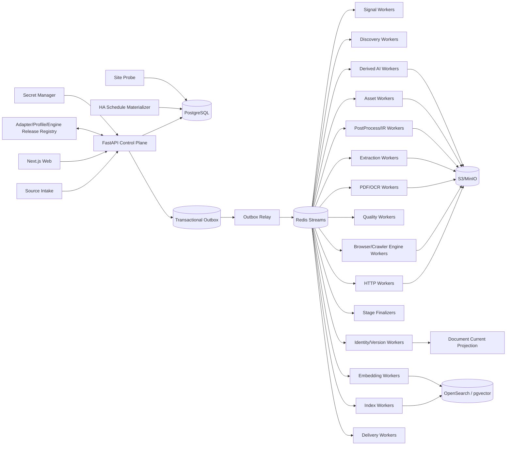

# 博客知识库技术方案

适用范围：从约 1000 个技术博客、工程博客、技术文档站、Newsletter、CMS 和公开文档站抓取尽可能完整的历史文章，清洗为稳定 Markdown 建设长期知识库；后续持续增加网站，支持全量回灌、增量同步、Web 管理、版本留存、离线重处理、全文/向量检索、质量审计、图片附件归档和 AI 派生能力。整体按百万级文档、数百万到千万级 URL、站点高度异构和多年持续运行设计。

## 1. 建设目标

1. 支持单 URL、批量 URL、Feed URL、OPML、Markdown/TXT、CSV、JSON 导入来源，自动规范化、去重、Probe、预览、审核后进入 Source Registry。
2. 自动探测 Sitemap/Sitemap Index、RSS/Atom/JSON Feed、公开 API、Archive、分类/标签/作者页、文档导航树、普通内链、`llms.txt`/文本 URL 列表和动态列表。
3. 支持 `FULL_BACKFILL`、`INCREMENTAL`、`RECONCILE`、`TARGETED_FETCH`、`REPROCESS`、`ASSET_REPAIR`、`REINDEX`。
4. 历史完整性必须由 Provider 级 Coverage Evidence 证明，不能把队列空、达到 `max_pages/max_depth/max_urls` 当作完整性。
5. HTTP-first；只有动态渲染、正文缺失或抽取失败证据存在时才升级 Browser/Crawl4AI/Playwright。
6. Discovery Rule、Fetch Route、Crawler Engine、Extraction Profile、PostProcessor、Quality Policy、Asset Policy、Chunker、Embedding、Search、AI Prompt/Model 均独立版本化。
7. 支持 Sitemap `lastmod`、Feed GUID/updated、API cursor、ETag、Last-Modified、body hash、Canonical IR hash、重叠窗口和周期 Reconcile 驱动增量。
8. 最终知识对象保存标题、作者、发布时间、更新时间、标签、canonical、正文块、代码块、表格、图片、附件、链接关系、Snapshot、字段 provenance 和完整 lineage。
9. 支持 durable frontier、断点续跑、幂等、lease、heartbeat、重试、限流、熔断、公平调度、backpressure、dead-letter。
10. 保存不可变网络 Snapshot、渲染 DOM、清洗 HTML、Extraction Candidate、转换轨迹、Canonical IR、Markdown Projection、规则版本和质量结果；规则升级优先离线 replay。
11. 图片和附件走独立 Asset Pipeline，支持安全校验、hash 去重、对象存储、引用关系、独立重试和 Markdown URL 重写。
12. Web 管理端覆盖来源导入、站点接入、Provider 覆盖、任务控制、发现证据、运行时抓取边界、当前文章、历史版本、版本 diff、抽取转换链、质量审核、漂移告警、资产、搜索/RAG、成本、Schedule、AI Workflow 和审计。
13. Markdown、全文索引、Embedding、摘要、聚类、Digest、Newsletter、报告和通知都是 Accepted Document Version 的异步 Projection，失败不能阻塞 Source Sync。
14. append-only 历史真相层之上提供可重建 Current Projection，兼顾历史审计与当前查询性能。
15. Canonical IR hash 在 Chunk/Embedding/AI 等昂贵下游之前计算；内容未变化只写 freshness observation。
16. 技术博客检索同时支持自然语言、代码符号、配置项、错误码、版本号和文件路径，不能只依赖纯向量搜索。
17. 设置 Change-Signal Plane，先用 Feed/Sitemap/API 元数据判断是否可能变化，再决定是否抓正文。
18. 跨文档近似重复只形成 Similarity Evidence / Duplicate Cluster，不自动删除来源文档；转载、镜像、翻译、系列文章保留独立来源与历史。
19. 文档内部重复块形成 Repetition Evidence；任何有损抑制必须可解释、可回滚并有高删除率 Guardrail。
20. 所有 Stage 输入输出具有显式 Artifact Representation Contract，禁止依赖变量名、文件扩展名或第三方库原始返回类型推断 HTML/Markdown/JSON/PDF。
21. Platform Adapter / Site Profile / Crawler Engine Release 发布前必须通过 Contract Test、Golden Corpus、Capability Test 和最近 Snapshot 的 shadow replay。
22. 正文清洗必须结构保真；禁止在 Canonical IR 前用全局 `split/join` 折叠空白，代码、表格、列表、pre 块保留结构。
23. Canonical Markdown 必须完整、确定性、按 Document Version 独立产出，禁止截断正文；批量汇总文件只能作为额外 Export Projection。
24. Scheduler 只物化持久 Run/Task，不直接执行抓取 coroutine；异步 Worker 才负责 await 网络任务。
25. 所有 Run 保存 Resolved Effective Config、Resolved Crawl Scope 与 Runtime Strategy Attestation，能够证明 timeout、并发、backoff、selector、route、实际 crawler strategy 等配置真的生效。
26. 运行结果使用阶段级语义计数，区分 new version、unchanged、existing identity、unexpected empty、rejected、blocked、deadline exceeded、failed，不使用单一 `saved_count` 表示成功。
27. 抓取链路采用分层 Deadline 与 Cancellation Propagation；任何一个 URL、Browser 页面或第三方 crawler 卡住都不能无限阻塞 Worker、批任务或 MCP/管理调用。
28. 外部/自托管搜索只作为 Gap Discovery 和诊断证据，不能成为历史完整性真相源。

## 2. 非目标与边界

1. 不绕过登录、付费墙、验证码、WAF 或明确访问控制。
2. 搜索引擎结果只作补充发现证据，不承担历史完整性真相。
3. 不承诺未知站点仅靠自动探测达到 100% 历史完整；系统必须展示 coverage confidence、known gap 和 blocker。
4. 不用 LLM 评分决定 FULL_BACKFILL 中合法历史文章是否入库。
5. Markdown 不是唯一真相；Canonical IR 是内部内容真相，Markdown 是确定性投影。
6. 不锁死单一爬虫库、浏览器库、向量库或消息队列。
7. Source Intake 文件/粘贴文本只是输入证据，不直接成为生产配置真相源。
8. AI、Embedding、Newsletter 等派生模块不能反向决定抓取主链路是否成功。
9. 不允许用“任务函数返回”“HTTP 200”“Browser success”“没有异常”直接等价业务成功。
10. 不把深度爬虫的 `max_depth/max_pages` 当作站点历史覆盖证明。
11. 不把 README、静态配置文本或声明式参数当作运行事实；运行事实来自实际构造后的 Runtime Attestation。

## 3. 核心原则

1. **PostgreSQL 是业务状态真相源；S3/MinIO 是不可变大对象真相源。**
2. Redis Streams 只做任务运输；决定性状态先写 PostgreSQL，再由 Transactional Outbox 投递。
3. Source Intake、Adapter、Change Signal、Discovery、Admission、Fetch、Extraction、PostProcess、Quality、Identity、Publish、Asset、Search、AI、Delivery 分层。
4. Discovery 只产生 URL Candidate 和 Evidence；列表页、Feed 摘要、搜索结果不能直接成为最终正文。
5. URL Identity 与 Document Identity 分离；redirect、canonical、slug rename、镜像、迁移都是 identity evidence。
6. Identity 与 Freshness 分离；URL 已知不代表内容未变化。
7. 发布时间、更新时间、首次发现、最近观测、抓取、接受时间分离；未知发布时间保持 NULL。
8. Discovery Rule 与 Extraction Profile 分离；URL pattern 只能帮助分类，不能证明页面就是文章。
9. Discovery Fetch Route 与 Article Fetch Route 分离；动态列表需要 Browser 不代表详情页也要 Browser。
10. HTTP、Browser、PDF/OCR 分层；Browser 是昂贵升级路径，生产复用长期 Browser Runtime/Context Pool。
11. Crawl4AI/Playwright 等第三方库只承担 Worker 能力；其原始对象、返回 shape 和 quirks 必须被 Engine Adapter 隔离，不承担业务真相或持久调度。
12. 所有 Stage 使用结构化 Outcome Contract；`EMPTY/INVALID/AMBIGUOUS/RETRYABLE_ERROR/PERMANENT_ERROR/BLOCKED/DEADLINE_EXCEEDED` 不得被空数组或宽泛异常吞掉。
13. Stage 完成由 Finalizer 对 Task、Artifact、Quality、Manifest、Provider ACK 对账，不由 coroutine 返回或 BackgroundTasks 结束决定。
14. `document_version` append-only，不原地覆盖历史。
15. Current Projection、Markdown、Search、Chunk、Embedding、摘要、报告均可删除后重建。
16. `max_depth/max_pages/max_runtime/max_urls` 是预算，不是 Coverage 证据。
17. Scheduler、`asyncio.create_task()`、进程内 dict/set/queue/semaphore 不承担持久业务状态；进程内 semaphore 只做 Worker 本地资源保护。
18. Config 使用不可变 Release；Secret 仅保存 Vault/云 Secret Manager 引用。
19. 人工纠错通过 Override/Evidence 追加，不抹掉机器历史。
20. 遵守 robots、版权、访问控制、站点政策和合理速率；挑战页进入显式策略流程。
21. 跨文档近似相似度只作证据和聚类，不直接承担 Document Identity 或自动删除。
22. **内容结构本身是数据。** 代码缩进、Markdown 换行、表格行列、列表层级不得在通用 cleaner 中被压平。
23. **配置必须可证明生效。** 声明在 YAML/DB 中但未被 Worker 消费的字段视为发布缺陷。
24. **调度与执行解耦。** Schedule Materializer 只生成持久工作，网络协程只在 Async Worker 中执行。
25. **抓取范围必须可审计。** seed host、registrable domain、允许 host/prefix、redirect 边界和 asset scope 都需要解析成 Resolved Crawl Scope。
26. **第三方引擎必须可证明可用。** Engine Release 绑定版本、实际 strategy class、stream mode、known quirks 和 capability test。
27. **有损清洗必须可逆或可解释。** Canonical IR 不因启发式去重丢掉不可恢复的信息。

## 4. 总体架构



### 4.1 Control Plane

负责 Source Intake、Site/Provider/Profile、Crawler Engine Release、Schedule、Run、Command、RBAC 和 Audit；不直接执行长期抓取。

### 4.2 Change-Signal / Discovery Plane

低成本轮询 Feed/Sitemap/API、维护 Provider checkpoint、生成 URL Candidate 与 Coverage Evidence。搜索型 Gap Provider 只在缺口诊断或 Reconcile 中作为补充证据使用。

### 4.3 Data Plane

HTTP、Browser、PDF/OCR、Extraction、PostProcess、Quality、Identity 分为独立 Worker Pool，按资源成本和失败域独立扩缩容。Browser Worker 内部再通过 Engine Adapter 调用 Crawl4AI/Playwright 等实现。

### 4.4 Projection Plane

从 Accepted Document Version 构建 Markdown、Current Projection、Chunk、Embedding、Search、AI Artifact 和 Delivery。

## 5. Crawl Mode 与 Run 语义

```text
FULL_BACKFILL   首次历史全量回灌
INCREMENTAL     持续同步新增/更新
RECONCILE       周期重新枚举，修复断档
TARGETED_FETCH  精确 URL 抓取/调试/补抓
REPROCESS       基于已有 Snapshot 离线重抽取/重清洗
ASSET_REPAIR    仅修复图片/附件
REINDEX         重新 Chunk/Embedding/Search，不访问源站
```

Run 状态：

```text
PENDING -> RUNNING -> COMPLETED
                   -> COMPLETED_WITH_WARNINGS
                   -> FAILED
                   -> CANCELLED
```

规则：

- 同站点默认仅一个 active FULL_BACKFILL；
- 同一 URL 的网络请求和版本写入通过 idempotency key 去重；
- `TARGETED_FETCH` 返回逐项真实 Outcome；
- `REPROCESS` 固定 Snapshot + Extraction Release + PostProcessor Release；
- `REINDEX` 固定 Document Version + Chunker/Embedding/Search Release；
- Source Sync completed 不代表 Search/AI 等下游全部完成；
- Run 统计来自本次 Manifest，不从站点累计库存反推；
- 每个 Run 固化 `engine_release_id + effective_config_hash + resolved_scope_hash + runtime_strategy_attestation`。

## 6. Source Intake、Probe 与 Registry

### 6.1 输入

支持单 URL、批量 URL、Feed、OPML、Markdown/TXT、CSV、JSON、Web 表格粘贴。

```text
Parse
 -> Normalize
 -> Dedupe
 -> Site grouping
 -> Probe
 -> Platform Detection
 -> Crawl Scope Resolution
 -> Dry-run Discovery
 -> Preview
 -> Review
 -> Apply
```

重复导入幂等，保留原始输入和规范化结果。

### 6.2 Probe

只做低成本能力识别：robots、root 响应、Sitemap/Feed、CMS 特征、JSON-LD/OpenGraph、JS 需求、canonical host、TLS/redirect、语言、访问限制。Probe 不产生最终 Document。

### 6.3 Registry

```text
site
source
provider
discovery_profile
fetch_profile
extraction_profile
postprocess_profile
quality_policy
asset_policy
schedule
credential_ref
active_release_set
crawler_engine_release
```

一个 Site 可有多个 Provider，例如 Sitemap + Feed + Archive + API + SearchGap。

## 7. Platform Adapter、Site Profile、Crawl Scope 与 Effective Config

### 7.1 两级扩展模型

Platform Adapter / Source Family 复用平台逻辑：WordPress、Ghost、Substack、Medium 类平台、Docusaurus/MkDocs/Docsify、通用 Sitemap+HTML、通用 Feed+Detail、自定义 JSON API。

Site Profile 保存：root/canonical domain、Provider 优先级、include/exclude、selector/JSON path、timezone/locale、rate limit、HTTP/Browser route、secret ref、asset policy、quality threshold、scope policy。

只有配置无法表达时才写 Custom Adapter。

### 7.2 Immutable Release

```text
release_id
component_type
version
config_json/code_digest
created_at
created_by
golden_test_result
status=draft|active|retired
```

每个 Artifact/Document Version 记录消费过的 release_id。

### 7.3 Resolved Effective Config

每个 Run/Task 固化：

```text
declared_config
resolved_config
effective_config_hash
consumed_keys
unknown_keys
unused_keys
defaulted_keys
```

发布门禁：

- JSON Schema/Pydantic 校验；
- unknown key 默认拒绝或告警；
- declared-but-unused key 失败；
- Worker 启动输出 effective config hash；
- Web Run Detail 展示本次真正使用的 timeout/concurrency/backoff/selector/route；
- 对第三方 crawler，记录最终构造对象中的关键 runtime 属性，而不是只保存输入 JSON。

### 7.4 Resolved Crawl Scope

正式支持：

```text
EXACT_HOST
REGISTRABLE_DOMAIN
HOST_ALLOWLIST
URL_PREFIX_ALLOWLIST
CUSTOM_SCOPE_RULE
```

发布后解析成不可变运行快照：

```text
seed_host
registrable_domain
allowed_hosts
allowed_url_prefixes
excluded_hosts
excluded_url_prefixes
follow_redirect_scope
asset_scope
scope_hash
```

规则：

1. `www.example.com`、`docs.example.com`、`blog.example.com` 不自动假定属于同一文章边界。
2. redirect 到 CDN、Medium、Substack 等外域不自动扩大 frontier；只能形成 redirect/link evidence，除非 Profile 明确允许。
3. Asset host 与 Document Crawl host 分离；图片/CDN 可允许下载，但不能因此把 CDN 页面加入文章发现队列。
4. host 使用 IDNA/小写/端口规范化；registrable domain 使用 PSL 能力库，不用简单字符串切割。
5. Scope 越界 URL 保留为 Link Evidence，默认 outcome 为 `OUT_OF_SCOPE`，不 admission 为正文任务。
6. `include_subdomains` 只能作为 UI 简化选项，最终必须落为明确的 Resolved Crawl Scope。

### 7.5 Crawler Engine Release 与 Runtime Strategy Attestation

每个 Crawler Engine Release 保存：

```text
engine_name
engine_version
adapter_release_id
package_lock_digest
container_digest
capabilities
known_quirk_ids
status
```

每次 Run/Task 再保存运行事实：

```text
runtime_strategy_class
stream_mode
browser_type
resolved_page_timeout
resolved_wait_condition
resolved_deep_crawl_limits
engine_release_id
runtime_config_digest
```

这样即使文档写“BFS”，源码实际构造 DFS，或库升级改变返回 shape/stream 行为，也能从运行数据证明“实际跑了什么”。

## 8. Crawler Engine Adapter 与 Artifact Representation Contract

### 8.1 Engine Result Normalizer

第三方 crawler 的返回可能是单个对象、container、list、async generator 或不同版本的嵌套结构。业务代码不得直接消费这些类型。

统一流程：

```text
Third-party Raw Result
 -> Engine Result Normalizer
 -> CrawlPageOutcome / FetchArtifact
 -> Representation Validation
 -> Snapshot/Extraction
```

内部 `CrawlPageOutcome` 至少包含：

```text
request_url
final_url
status
status_code
headers
html_source
html_rendered
cleaned_html
markdown_candidate
links
metadata
error_class
error_message
engine_release_id
runtime_config_digest
```

Engine Adapter 负责兼容依赖版本差异，业务层只接受内部 Contract。

### 8.2 Representation Type

```text
HTTP_BYTES
HTML_SOURCE
HTML_RENDERED
DOM_SERIALIZED
CLEANED_HTML
MARKDOWN_CANDIDATE
JSON_API
FEED_XML
TEXT_PLAIN
PDF_BYTES
OCR_TEXT
EXTRACTION_CANDIDATE
CANONICAL_IR
MARKDOWN_PROJECTION
ASSET_BYTES
```

Artifact 保存：

```text
artifact_id
representation_type
media_type
charset
schema_version
producer_stage
producer_release_id
source_snapshot_id
content_hash
object_key
byte_size
created_at
```

### 8.3 Stage Contract

```text
CssDomExtractor:
  accepts = HTML_SOURCE | HTML_RENDERED | CLEANED_HTML
  produces = EXTRACTION_CANDIDATE

MarkdownRenderer:
  accepts = CANONICAL_IR
  produces = MARKDOWN_PROJECTION
```

调度前和 Worker 内双重校验。错误显式返回：

```text
INVALID_REPRESENTATION
UNSUPPORTED_MEDIA_TYPE
SCHEMA_MISMATCH
ENCODING_ERROR
ENGINE_RESULT_SHAPE_ERROR
```

绝不以空结果掩盖 contract error。

## 9. Discovery 与历史完整性

### 9.1 Provider 优先级

1. 官方 API；
2. Sitemap Index/Sitemap；
3. RSS/Atom/JSON Feed；
4. Archive/分页列表；
5. 分类/标签/作者页；
6. 文档导航树；
7. 普通站内链接；
8. Search Gap Provider，仅补充。

多 Provider 交叉发现缺口。

### 9.2 URL Candidate

保存：

```text
raw_url
normalized_url
provider_id
listing_snapshot_id
discovered_title
discovered_summary
discovered_published_at
discovery_evidence
first_seen_at
last_seen_at
```

### 9.3 Sitemap / Feed / Archive

Sitemap 支持 index 递归、gzip、`lastmod`、分片、URL 数量和日期范围统计。

Feed 保存 GUID/link/published/updated/etag/last-modified；Feed 通常只保最近 N 条，不默认视为完整历史来源。

Archive 识别 page number、cursor、next link、日期归档、无限滚动和动态 API。

### 9.4 Search Gap Provider

可接自托管 SearXNG 或其他可审计搜索源，仅用于：

- 发现 Provider 断档；
- 找历史旧 URL/canonical 迁移线索；
- 发现未被 Sitemap/Archive 枚举但仍被外部索引的文章；
- 人工诊断站点抓取缺口。

Search 结果产生 `search_gap_discovery_evidence`，其存在不能把站点 Coverage 从 partial/unknown 提升为 complete。

### 9.5 Coverage Evidence

```text
provider_id
run_id
enumerated_items
unique_candidates
min_observed_date
max_observed_date
page_or_cursor_range
termination_reason
budget_hit
errors
coverage_confidence
known_gap
```

站点展示：

```text
complete | likely_complete | partial | blocked | unknown
```

FULL_BACKFILL Finalizer 必须对 Provider termination evidence、Candidate、Fetch、Quality Manifest 做对账。

## 10. Admission、URL Canonicalization 与 Scope Gate

Candidate 进入正文 Fetch 前执行：scheme/host 校验、Resolved Crawl Scope、robots/policy、include/exclude、URL normalize、tracking 参数处理、MIME 预判、duplicate candidate、非文章初筛、SSRF/Egress 防护。

normalized URL 不能单独决定 Document Identity。

Google News/搜索聚合等来源需同时保存 aggregator URL、resolved origin URL 和 canonical evidence。

Scope Gate 输出：

```text
ADMITTED
OUT_OF_SCOPE
ROBOTS_DENIED
POLICY_DENIED
INVALID_URL
UNSAFE_EGRESS
NON_DOCUMENT
```

## 11. Change-Signal Plane 与增量同步

### 11.1 低成本信号

轮询：

- Feed GUID/updated；
- Sitemap `lastmod` / URL set；
- API cursor/version；
- 首页/archive lightweight fingerprint；
- ETag/Last-Modified。

无变化只写 freshness observation。

### 11.2 正文确认

```text
possible change
 -> conditional request
 -> HTTP body hash
 -> Extraction Candidate
 -> Canonical IR hash
 -> unchanged: observation
 -> changed: append document_version
 -> enqueue projections
```

### 11.3 重叠窗口与 Reconcile

不可靠游标使用：

```text
next_from = previous_checkpoint - overlap_window
```

依靠幂等消除重复。Feed/Signal 高频，Sitemap 数小时~每日，站点 Reconcile 每周，深度 Coverage Reconcile 每月或按风险动态调整。

## 12. Fetch Route：HTTP-first、Browser 证据驱动升级

### 12.1 HTTP Worker

长生命周期 async client pool，配置 per-host connection、keep-alive、DNS cache、connect/read/write/pool timeout、response bytes limit、redirect limit、compression、conditional request、Retry-After、circuit breaker。

### 12.2 Browser Worker

仅因以下证据升级：

```text
js_required
empty_http_body
selector_miss_http
content_too_short
rendered_only_metadata
client_side_navigation
```

记录 `route_upgrade_reason`。

Browser 资源：

```text
Worker Process
 -> Browser Runtime
 -> Context Pool
 -> Page/Tab
```

控制 max page/context、请求数、RSS watermark、crash recovery、graceful recycle、cookie/tenant isolation。

### 12.3 分层 Deadline 与 Cancellation

必须同时存在：

```text
connect_timeout
read_timeout
write_timeout
browser_navigation_timeout
content_wait_timeout
per_url_deadline
stage_deadline
run_deadline
lease_deadline
```

语义：

- 底层 timeout 控制具体 I/O；
- `per_url_deadline` 包裹整次 crawler/Browser await，防止第三方库内部挂死；
- `stage_deadline` 防止一个 Stage 长期占用任务；
- `run_deadline` 作为整个 Run 的预算上限；
- cancellation 必须向 Browser Page/Context、HTTP request、第三方 crawler coroutine 传播；
- timeout 后仍需持久化结构化 Outcome，并释放 lease/页面资源；
- 多 URL 批次中单 URL deadline 不能无限阻塞整个批次。

错误分类：

```text
CONNECT_TIMEOUT
READ_TIMEOUT
NAVIGATION_TIMEOUT
CONTENT_WAIT_TIMEOUT
URL_DEADLINE_EXCEEDED
STAGE_DEADLINE_EXCEEDED
RUN_DEADLINE_EXCEEDED
CANCELLED
```

### 12.4 PDF/OCR

原始 bytes 保存；有文本层优先；OCR 按需；保留页码/坐标 provenance。PDF 与 HTML 可关联但不强制合并。

## 13. Snapshot 与 Artifact Store

所有影响后续重处理的输入都保存不可变 Snapshot。

```text
snapshots/{site_id}/{yyyy}/{mm}/{snapshot_id}/response.bin
artifacts/{snapshot_id}/html-source.bin
artifacts/{snapshot_id}/html-rendered.bin
artifacts/{snapshot_id}/cleaned-html.bin
artifacts/{snapshot_id}/markdown-candidate.md
artifacts/{document_version_id}/canonical-ir.json
projections/{document_id}/{document_version_id}/document.md
assets/{sha256-prefix}/{sha256}
```

Snapshot 保存 request/final URL、status、headers、timing、route、fetched_at、body hash、object key、robots/policy observation、engine release、runtime config digest。敏感 header/cookie 不落盘或脱敏。

## 14. Extraction、结构保真清洗与内部重复块证据

```text
Snapshot
 -> Representation Validation
 -> Candidate Extractors
 -> Metadata Candidates
 -> Body Block Extraction
 -> Structure-preserving PostProcessors
 -> Repetition Evidence
 -> Canonical IR
 -> Quality Gate
 -> Accepted Document Version
```

Extractor 优先级：明确 Site selector/JSON path -> JSON-LD/API -> 通用正文抽取 -> Crawler Engine candidate -> Browser rendered DOM -> 人工 Profile。

多个 extractor 可产生多个 Candidate，由 Quality/Resolver 选择，不覆盖原始候选。

### 14.1 Block-aware Cleaning

禁止：

```python
" ".join(full_document.split())
```

PostProcessor 按 block 类型处理：

```text
paragraph  允许消除视觉软换行，但保留语义段落
heading    trim 边界空白
code       内部字节/换行/缩进尽量原样保留
table      保留行列结构
list       保留层级、编号和 checkbox
blockquote 保留块边界
pre        不做通用空白折叠
math       保留表达式
image      保留 alt/caption/ref
```

每个转换记录 `processor_release_id + before_hash + after_hash + reason`。

### 14.2 Intra-document Repetition Evidence

对 Canonical IR block 或 Extraction Candidate block 计算：

```text
block_id
block_type
normalized_exact_hash
occurrence_index
first_occurrence_block_id
repeat_count
is_boilerplate_candidate
policy_release_id
action
```

原则：

1. `code/table/math/pre` 默认不自动删除，即使 exact hash 相同。
2. heading/paragraph/list 等只在完全相同且上下文满足 boilerplate policy 时允许抑制。
3. Canonical IR 默认保留原始结构或至少保留完整 suppression evidence，确保可以重建未抑制版本。
4. Markdown Projection 可基于独立 policy 选择是否抑制重复展示块，但 suppression 不改变 Document Identity。
5. 若预计删除比例超过阈值、重复块数量异常或结构类型异常，触发 `REPETITION_GUARDRAIL`，进入 warning/quarantine/shadow review。
6. Web 管理端必须能展示 before/after block diff、重复块 hash 和 removal rate。

这避免在 Markdown 字符串层按空行粗暴切分并静默删除合法重复代码、表格或列表。

### 14.3 Null/False/Zero 语义

Schema 区分 field missing、NULL、false、0、empty collection；禁止用 `if value` 一次性删除所有 falsey 字段。

## 15. Canonical Document IR

Canonical IR 保存块级结构：

```json
{
  "document_id": "...",
  "title": "...",
  "authors": [],
  "published_at": null,
  "updated_at": null,
  "canonical_url": "...",
  "language": "zh-CN",
  "blocks": [
    {"id":"b1","type":"heading","level":2,"text":"..."},
    {"id":"b2","type":"paragraph","text":"..."},
    {"id":"b3","type":"code","language":"python","text":"..."},
    {"id":"b4","type":"table","rows":[]},
    {"id":"b5","type":"image","asset_id":"...","alt":"..."}
  ]
}
```

Canonical JSON 需稳定排序/规范化后计算 `ir_hash`，用于内容版本判断。

## 16. Metadata Candidate 与时间语义

标题、作者、published/updated、tags、canonical 分别保存候选与 provenance：

```text
field
value
source=jsonld|meta|feed|api|body|override
confidence
artifact_id
extractor_release_id
```

时间字段至少拆分：

```text
published_at
updated_at_source
first_seen_at
last_seen_at
requested_at
responded_at
fetched_at
accepted_at
```

硬规则：

```text
source published_at missing
=> published_at = NULL
```

禁止 fallback 到 `datetime.now()`、fetched_at 或 first_seen_at。

## 17. Document Identity、版本与去重

模型：

```text
url_candidate
url_identity
url_observation
redirect_evidence
canonical_evidence
document
document_version
similarity_evidence
duplicate_cluster
repetition_evidence
```

同 URL 内容变化产生新 Version；slug/canonical 变化产生 identity evidence；镜像/转载/翻译形成 relation，不自动删除。

Canonical IR hash 未变化只写 freshness observation，不触发昂贵下游。

内部重复块与跨文档重复必须分开：`repetition_evidence` 只描述一个文档内部块重复；`similarity_evidence/duplicate_cluster` 描述文档之间关系。

## 18. Quality Gate、Unexpected Empty、Repetition Guardrail 与漂移

HTTP 200 不等于业务成功。检查：title、canonical、正文长度、正文/导航比、boilerplate、selector hit、结构、代码/表格、challenge/login/paywall、语言、发布时间合理性、列表摘要误当正文、Representation Contract、Scope、重复块抑制率。

Outcome：

```text
ACCEPTED
ACCEPTED_WITH_WARNINGS
RETRY_ROUTE
QUARANTINED
REJECTED
BLOCKED
EMPTY_UNEXPECTED
DRIFT_SUSPECTED
REPETITION_GUARDRAIL
DEADLINE_EXCEEDED
```

### 18.1 Zero-result Baseline

按 site/provider/profile/release 维护：

```text
candidate_count_distribution
selector_hit_rate
median_content_length
accepted_rate
published_at_missing_rate
browser_upgrade_rate
repetition_suppression_rate
```

例如历史通常每轮 20~50 个 listing item，本轮突然为 0，即使代码无异常也进入 `EMPTY_UNEXPECTED`，不直接记 success。

### 18.2 Drift

指标突变自动创建 drift incident，可冻结风险 Release、回滚上一版本或切换 fallback extractor。

### 18.3 Repetition Guardrail

对有损重复块抑制设置阈值，例如：

```text
min_blocks_for_check
min_removed_blocks
max_removal_rate
protected_block_types
```

达到高删除率阈值时不自动把“删除很多”解释为清洗优秀，而应升级为 Warning/Quarantine，并保存详细 evidence。

## 19. Markdown Projection：完整、稳定、确定性

Markdown 是 Accepted Document Version 的确定性 Projection，而不是批量报表。

```yaml
---
id: doc_xxx
version_id: ver_xxx
source_url: https://...
canonical_url: https://...
title: ...
authors: [...]
published_at: null
updated_at: null
fetched_at: ...
site_id: ...
content_hash: ...
renderer_release_id: ...
---
```

硬约束：

1. **正文永不因导出展示而截断。**
2. 一个 accepted version 对应一个 canonical Markdown artifact。
3. object key 稳定，例如 `projections/{document_id}/{version_id}/document.md`。
4. renderer release 固定，重复渲染同 IR 必须产生相同 hash。
5. fenced code 保留 language 和内部空白；table 使用 GFM 或 HTML fallback；列表/blockquote 保结构。
6. 图片改写到归档 Asset URL/相对路径；原始 URL 同时留 lineage。
7. 未知发布时间不补抓取时间。
8. 批量单文件、ZIP、日报只是 `EXPORT_PROJECTION`，不能替代 canonical Markdown。
9. 写对象存储采用临时 key + hash 验证 + manifest/原子发布，避免半文件。
10. 若启用重复块 suppression，必须引用 policy release，并能从 Canonical IR + evidence 重建未 suppression 的版本。

## 20. Durable Scheduler 与 async 执行契约

### 20.1 Schedule Materializer

Schedule Definition 存 PostgreSQL。HA Materializer 通过 advisory lock/leader lease 把到期 schedule 物化为 Run/Task。

**Materializer 不执行 crawler coroutine。**

```text
schedule due
 -> insert crawl_run/frontier_task
 -> insert outbox_event
 -> commit
 -> relay queue
```

### 20.2 Async Worker

```text
lease task
 -> resolve effective config/scope/engine release
 -> await network coroutine under deadline
 -> normalize engine result
 -> persist Outcome/Artifact
 -> heartbeat
 -> finalize
```

### 20.3 开发单进程模式

若提供 dev 模式，可使用 AsyncIOScheduler 或显式 sync wrapper，但必须有集成测试验证：cron fire -> Run row -> Task row -> Artifact/Outcome，不能只断言 scheduler callback 被调用。

## 21. Task、Outcome 与语义计数

Task 状态：

```text
PENDING
LEASED
RUNNING
SUCCEEDED
RETRY_WAIT
FAILED
DEAD
CANCELLED
```

字段：task_id、run_id、stage、site_id、url_identity_id、priority、attempt、max_attempts、next_attempt_at、lease_owner、lease_until、heartbeat_at、error_class、idempotency_key、deadline_at。

Run 分别统计：

```text
discovered_candidates
search_gap_candidates
admitted_urls
out_of_scope_urls
fetched_snapshots
fetch_not_modified
url_deadline_exceeded
extracted_candidates
quality_accepted
quality_rejected
repetition_guardrail
new_documents
new_versions
unchanged_versions
existing_identity_hits
duplicate_evidence
blocked
unexpected_empty
failed
```

禁止用一个 `saved_count` 代表“成功抓了多少”。

## 22. Transactional Outbox、Lease、重试与 Dead Letter

业务状态与 outbox 同事务：

```text
BEGIN
  insert/update task state
  insert outbox_event
COMMIT
```

Worker 使用 lease/heartbeat，超时任务可回收；写入基于 idempotency key，兼容至少一次投递。

错误分类：

```text
DNS_ERROR
CONNECT_TIMEOUT
READ_TIMEOUT
NAVIGATION_TIMEOUT
CONTENT_WAIT_TIMEOUT
URL_DEADLINE_EXCEEDED
STAGE_DEADLINE_EXCEEDED
HTTP_429
HTTP_5XX
HTTP_404
BLOCKED
ROBOTS_DENIED
OUT_OF_SCOPE
INVALID_REPRESENTATION
ENGINE_RESULT_SHAPE_ERROR
SCHEMA_MISMATCH
SELECTOR_MISS
EMPTY_CONTENT
PARSER_ERROR
STORAGE_ERROR
DB_ERROR
AI_ERROR
```

429 尊重 Retry-After；网络/5xx 指数退避+jitter；404/410 通常不反复抓；selector miss 触发 drift/retry route；storage error 不重新访问源站；AI error 仅重试 AI 下游；deadline 是否重试取决于 error class、历史 latency、route 和 attempt。

## 23. 公平调度、限流与 Backpressure

不能 `asyncio.gather(1000 sites)`。

```text
global concurrency
 -> resource-pool concurrency
 -> per-site concurrency
 -> per-host token bucket
 -> worker-local semaphore
 -> route cost
```

weighted fair scheduling 避免大站长期占满队列。

Backpressure 依据 queue lag、DB saturation、object store latency、Browser memory、event-loop lag、429/5xx、deadline ratio、downstream backlog。高压先延后低优先级 Reconcile/AI，不牺牲关键增量同步。

## 24. PostgreSQL 核心表

### 来源与配置

```text
site
source
provider
source_intake_batch
source_intake_item
adapter_release
profile_release
crawler_engine_release
engine_capability_test
engine_quirk
resolved_crawl_scope
schedule_definition
secret_reference
```

### 发现与抓取

```text
crawl_run
crawl_stage
frontier_task
provider_checkpoint
coverage_evidence
search_gap_discovery_evidence
url_candidate
url_identity
url_observation
source_snapshot
artifact
fetch_attempt
runtime_strategy_attestation
```

### 内容与质量

```text
extraction_candidate
field_candidate
postprocess_result
quality_result
repetition_evidence
document
document_identity_evidence
document_version
document_current
similarity_evidence
duplicate_cluster
```

### 资产与投影

```text
asset
asset_reference
markdown_projection
export_projection
chunk
embedding_job
search_projection
ai_artifact
delivery_job
```

### 可靠性与配置审计

```text
outbox_event
dead_letter
audit_event
manual_override
release_activation
effective_config_snapshot
drift_incident
```

PostgreSQL 不直接保存大量多版本 HTML/DOM/PDF/Markdown 正文，只保存 object key/hash/metadata。

正式迁移使用 Alembic/等价工具，禁止应用启动 `create_all()` 承担 schema migration。

## 25. Asset Pipeline

```text
Accepted IR
 -> Asset Reference
 -> URL normalize
 -> asset scope validation
 -> security/policy validation
 -> fetch
 -> MIME sniff
 -> size limit
 -> sha256 dedupe
 -> object store
 -> asset record
 -> Markdown rewrite
```

Asset 状态：`PENDING/AVAILABLE/FAILED/BLOCKED/SKIPPED`。相同 hash 可被多文档引用，资产失败不回滚正文版本。

## 26. Web 管理端

建议 Next.js/React + FastAPI。

Dashboard：站点数、active/blocked/drifting、今日 discovered/fetched/accepted/new_versions/unchanged、queue lag、error、Browser 升级率、Coverage、Deadline 超时率、Markdown/Search readiness、成本。

Source Intake：批量上传/粘贴、Probe、platform detection、scope preview、去重、dry-run、Apply/Reject。

Site Detail Tabs：

```text
Overview
Providers
Discovery
Coverage
Crawl Scope
Runs
URLs
Documents
Versions
Artifacts
Assets
Profiles
Crawler Engine
Effective Config
Schedule
Errors
Audit
```

Document Detail：当前 Markdown、Canonical IR、Snapshot、Extraction Candidate、field provenance、版本 diff、quality、representation、repetition evidence、chunk/search/embedding、asset reference。

Run Detail 必须展示：

- 阶段级语义计数；
- unexpected empty/drift；
- effective config；
- resolved crawl scope；
- engine version / runtime strategy class / stream mode / known quirks；
- route upgrade；
- per-URL deadline 与 timeout outcome；
- repetition suppression rate / guardrail；
- retry/error；
- Search Gap Evidence；
- Manifest/Finalizer 对账。

Profile Playground：选择 Snapshot、修改 selector/extractor/postprocessor/scope、shadow run、old/new diff、Golden Corpus、发布 Release。

增加 Repetition Analyzer：展示 block fingerprint、重复次数、被抑制块、保护类型、before/after diff 与删除比例。

## 27. Contract Test、Golden Corpus、Engine Capability Test 与发布门禁

每个 Adapter/Profile 至少保存：

- 典型列表页；
- 典型详情页；
- 无发布时间；
- 代码块/表格/图片；
- redirect/canonical；
- 空页面/404；
- challenge/login；
- 动态样本；
- 预期 candidate 数量区间；
- 跨 host/subdomain scope 边界样本；
- 重复代码/重复正文/模板重复块样本。

发布自动验证：

1. representation 正确；
2. discovery count 在合理区间；
3. 详情正文明显不是列表摘要；
4. title/date/canonical provenance；
5. 结构没有异常漂移；
6. accepted/rejected 比例；
7. published_at 不 fallback；
8. code/table/list/image 结构保真；
9. Canonical Markdown 未截断；
10. declared config 没有未消费关键字段；
11. schedule integration test 能真实产生 Run/Task/Outcome；
12. Optional AI/Search module 缺失不会使 Source Sync 启动失败；
13. Resolved Crawl Scope 与预期 host/prefix 边界一致；
14. 重复块 guardrail 不会删除受保护 block；
15. Runtime Strategy Attestation 与实际构造对象一致。

Crawler Engine Release 还必须跑 capability smoke tests：

```text
single-result-shape
multi-result-shape
container/list/async-generator-normalization
deep-crawl-stream-on/off
cancellation
per-url-timeout
redirect
browser-crash-recovery
html/cleaned-html/markdown-field-availability
scope-filtering
```

核心依赖升级时，对最近 N 个真实 Snapshot shadow replay 并比较 URL 集合、metadata、IR block、Markdown hash、repetition evidence 和 quality 分布。

## 28. Search 与 RAG

Hybrid Search：PostgreSQL metadata filter + BM25/OpenSearch + pgvector/OpenSearch vector + RRF/加权融合。

索引 title/headings/body/code/tags/author/URL/path/published_at/site/platform。

Chunk 按 Canonical IR block 切分，不按 Markdown 字符数硬切；code/table 尽量保持整体。Chunk Identity = document_version_id + chunker_release + logical block range。

Embedding Release 固定 model/dimension/config；IR hash 未变不重算；失败保持 NULL + status；模型升级走 REINDEX。

Context Builder 负责 token budget、去重、邻接扩展、代码/表格完整性、来源引用、时间/站点过滤。

注意区分“面向知识库内容检索的 Search”与“Discovery 的 Search Gap Provider”：前者检索本地知识库，后者只补充发现源站 URL。

## 29. Derived AI 与可选模块隔离

```text
Accepted Version
 -> Summary
 -> Tag/Entity
 -> Cluster
 -> Digest/Newsletter
 -> Report
```

AI Artifact 保存 document_version_id、prompt_release_id、model_release_id、provider、input_hash、output key、token usage、cost、status。

AI/Search/Delivery 作为独立进程/Worker Pool：

- 独立 dependency health check；
- 独立 readiness；
- 独立 queue/retry/dead-letter；
- import/config/model 不可用时只影响本模块；
- Source Sync、Canonical Markdown、基础全文检索不被阻塞。

## 30. API 示例

```text
POST /source-intakes
POST /source-intakes/{id}/probe
POST /source-intakes/{id}/apply
GET  /sites
GET  /sites/{id}
GET  /sites/{id}/resolved-crawl-scope
POST /sites/{id}/runs
POST /sites/{id}/reconcile
POST /sites/{id}/targeted-fetch
GET  /runs/{id}
POST /runs/{id}/cancel
GET  /runs/{id}/effective-config
GET  /runs/{id}/runtime-attestation
GET  /documents/{id}
GET  /documents/{id}/versions
GET  /documents/{id}/repetition-evidence
GET  /artifacts/{id}
POST /profiles/{id}/shadow-test
POST /releases/{id}/activate
GET  /engine-releases/{id}/capabilities
GET  /dead-letters
POST /dead-letters/{id}/replay
POST /search
POST /answer
```

所有写操作写 Audit Event。

## 31. 安全与合规

1. robots/站点政策进入 Provider/Fetch 决策。
2. 不自动绕过登录、验证码、付费墙或明确访问控制。
3. URL Fetch 做 SSRF 防护：阻止 loopback、link-local、RFC1918、metadata endpoint，DNS resolve 后再次校验。
4. redirect 每跳重复安全校验，并重新执行 Scope Gate。
5. 限制响应体和附件大小。
6. HTML/Markdown Web 展示做 XSS 安全处理。
7. Secret 不写 YAML/日志，只保存 secret ref。
8. Snapshot header/cookie 脱敏。
9. RBAC：viewer/operator/admin。
10. Profile/Engine Release 激活、重放、人工 Override、删除、导出全部审计。
11. Search Gap Provider 若使用自托管搜索服务，必须记录查询参数、来源和时间，避免把不可复现的搜索排序当成稳定事实。

## 32. 可观测性与 SLO

Metrics：

```text
crawl_tasks_total{stage,status}
run_semantic_outcome_total{outcome}
fetch_latency_seconds{route,site}
http_status_total
browser_upgrade_total{reason}
url_deadline_exceeded_total{route,site}
quality_outcome_total
unexpected_empty_total
artifact_representation_error_total
engine_result_shape_error_total
crawler_engine_capability_test_fail_total
crawl_scope_rejected_total{reason}
repetition_guardrail_total
repetition_suppression_rate
selector_hit_rate
content_length_histogram
provider_coverage_confidence
queue_lag_seconds
lease_expired_total
dead_letter_total
markdown_projection_lag
markdown_truncation_violation_total
structure_preservation_violation_total
effective_config_unused_key_total
runtime_attestation_mismatch_total
schedule_materialization_total
embedding_lag
ai_cost_total
```

Trace：

```text
Discovery -> Admission/Scope -> Fetch -> Engine Normalize -> Snapshot -> Extract
-> PostProcess/Repetition -> Quality -> Identity/Version -> Markdown -> Chunk -> Embedding -> Search
```

Log 至少带 trace_id、run_id、task_id、site_id、provider_id、url_identity_id、stage、release_id、engine_release_id、effective_config_hash、resolved_scope_hash、runtime_strategy_class、error_class。

初始 SLO：

- 健康站点增量 schedule 物化成功率 > 99.5%；
- 到期 schedule 产生 Run/Task 的集成链路可持续验证；
- accepted document lineage 完整率 100%；
- unknown 发布时间误填抓取时间 = 0；
- representation mismatch 进入 Accepted = 0；
- Canonical Markdown 截断 = 0；
- code/table/list 结构因通用清洗器破坏 = 0；
- protected block 因重复去重被自动删除 = 0；
- declared 关键配置未生效 = 0；
- Runtime Strategy Attestation 与实际 runtime 不一致 = 0；
- Crawler Engine Release 未通过 capability test 进入 production = 0；
- Source Sync 不受 AI/Search 下游失败影响；
- Profile 发布必须通过 Golden Corpus；
- 关键站点漏抓能由 Reconcile 发现并回补。

Coverage 不统一承诺 100%，而是承诺结论有证据、缺口可见。

## 33. 容量与扩展估算

按 1000 站、平均 2000 篇约 200 万文章设计，极端文档站按 500 万+ URL 规划。Snapshot/Artifact 文本对象压缩后常见 100~300KB，图片附件体量远大于文本。

原则：

- PostgreSQL 不存大正文；
- Object Store TB 级规划；
- Redis Streams 不做永久任务库；
- Browser Worker 按动态站比例独立扩容；
- Search/Embedding 可异步落后；
- worker-local semaphore 不代替 durable scheduling；
- 扩容顺序按瓶颈独立增加 HTTP/Extraction/Browser/Search Worker，不复制 monolith。

## 34. 推荐技术栈与发布

Control Plane：Python 3.12+、FastAPI、SQLAlchemy 2.x、Pydantic、Alembic。

状态/任务：PostgreSQL、Redis Streams、Transactional Outbox。

抓取：httpx/aiohttp、Crawl4AI、Playwright、trafilatura/readability、feedparser/XML parser；统一经过 Engine Adapter。

域名范围：PSL/tldextract 类库，用于 registrable domain 与 host normalization。

存储：S3/MinIO。

Web：React/Next.js。

Search：MVP PostgreSQL FTS + pgvector；规模提升后 OpenSearch + vector/hybrid；Gap Discovery 可选自托管 SearXNG。

Observability：OpenTelemetry、Prometheus、Grafana、Loki/ELK。

依赖使用 lock file/hash pin，镜像固定 digest；核心 Crawl4AI/Playwright/Extractor 升级先跑 Engine Capability Test、Golden Corpus 和真实 Snapshot replay。

数据库迁移采用 expand/contract，不在应用启动时 `create_all()` 自动改生产 schema。

## 35. 实施阶段

### Phase 1：50~100 站 MVP

- Source Registry；
- Sitemap/Feed/Archive discovery；
- HTTP-first + Browser fallback；
- Engine Adapter + Result Normalizer；
- Resolved Crawl Scope；
- per-URL/Stage deadline；
- PostgreSQL durable task；
- S3/MinIO Snapshot；
- Extraction + block-aware Canonical IR；
- Repetition Evidence 基础能力；
- 完整 Markdown Projection；
- 基础 Web；
- FULL_BACKFILL/INCREMENTAL；
- Representation Contract；
- 基础 Golden Corpus；
- Scheduler Materializer/Async Worker 明确分层；
- 语义化 Run counters。

### Phase 2：扩到 1000 站

- Platform Adapter；
- Crawler Engine Release/Capability/Quirk Registry；
- Runtime Strategy Attestation；
- Effective Config Audit；
- Change-Signal Plane；
- Search Gap Provider；
- HA Scheduler；
- Transactional Outbox；
- 多 Worker Pool；
- 公平调度/backpressure；
- Coverage Evidence；
- Asset Pipeline；
- Drift/Unexpected Empty/Repetition Guardrail Detection；
- Reconcile；
- Profile Playground。

### Phase 3：知识库增强

- 版本 diff；
- Hybrid Search；
- Chunk/Embedding；
- RAG Context Builder；
- AI 派生；
- Digest/Newsletter；
- 成本/质量运营。

## 36. 目录建议

```text
apps/
  api/
  web/
workers/
  signal/
  discovery/
  http_fetch/
  browser_fetch/
  pdf_ocr/
  extraction/
  postprocess/
  quality/
  identity/
  asset/
  search/
  ai/
packages/
  contracts/
  adapters/
  crawler_engines/
  crawl_scope/
  canonical_ir/
  repetition/
  markdown_renderer/
  quality_rules/
  config_resolution/
  storage/
  observability/
migrations/
tests/
  golden/
  contract/
  engine_capability/
  integration/
  scheduler/
```

## 37. 关键流程伪代码

### 37.1 Schedule

```python
def materialize_due_schedule(schedule):
    with db.transaction():
        run = create_run(schedule)
        task = create_initial_task(run)
        write_outbox(task)
    # 不直接调用 async crawler
```

### 37.2 Discovery

```python
async def discover(provider, checkpoint):
    artifact = await provider.fetch_listing(checkpoint)
    assert_representation(artifact, provider.discovery_input_types)
    outcome = await provider.parse_listing(artifact)
    validate_candidate_count_against_baseline(outcome)
    save_candidates_coverage_and_checkpoint(outcome)
    enqueue_admission(outcome.candidates)
```

### 37.3 Fetch + Engine Normalize

```python
async def fetch_candidate(candidate, task):
    assert_scope(candidate.url, task.resolved_scope)
    with deadline(task.per_url_deadline):
        raw = await engine_adapter.fetch(candidate, task.runtime_config)
    outcome = engine_adapter.normalize(raw)
    assert_outcome_contract(outcome)
    snapshot = persist_snapshot(outcome)
    return snapshot
```

### 37.4 Detail Fetch + Version

```python
async def process_url(candidate):
    snapshot = await fetch_router.fetch(candidate)
    save_snapshot(snapshot)

    extraction = await extractor.extract(snapshot)
    blocks = await canonicalizer.build_blocks(extraction)
    repetition = repetition_analyzer.analyze(blocks)
    ir = canonicalizer.build_ir(blocks, repetition)  # 不做不可逆字符串层粗暴去重
    quality = quality_gate.evaluate(ir, extraction, repetition)

    if quality.retry_route:
        enqueue_fetch(candidate, route=quality.retry_route)
        return
    if not quality.accepted:
        quarantine(candidate, quality)
        return

    ir_hash = sha256(canonical_json(ir))
    current = load_current_document(candidate)
    if current and current.ir_hash == ir_hash:
        record_freshness_observation(current)
        increment_counter("unchanged_versions")
        return

    version = append_document_version(ir, ir_hash)
    increment_counter("new_versions")
    enqueue_projection(version)
```

### 37.5 Markdown Projection

```python
async def project_markdown(version):
    markdown = renderer.render_full(version.canonical_ir)
    assert_not_truncated(markdown, version)
    assert_structure_fidelity(markdown, version.canonical_ir)
    assert_repetition_policy_safe(markdown, version)
    object_key = stable_markdown_key(version.document_id, version.id)
    write_atomic_artifact(object_key, markdown)
    save_projection_manifest(version, object_key, sha256(markdown))
```

## 38. 最终架构决策

1. PostgreSQL + S3/MinIO + Redis Streams + FastAPI + 独立 Worker Pool。
2. PostgreSQL 保存持久状态、identity、version、checkpoint、coverage、quality、lease、audit；大对象进入对象存储。
3. HTTP-first，Browser/Crawl4AI 是证据驱动升级路由。
4. 历史全量依赖多 Provider Discovery + Coverage Evidence，不依赖单一深度爬虫。
5. 增量采用 Change Signal + 条件请求 + hash + Reconcile。
6. Discovery Candidate 与详情正文强制二段，列表摘要不能成为 Accepted 正文。
7. Canonical IR 是内容真相；Markdown/Search/Embedding/AI 都是可重建 Projection。
8. Document Version append-only；URL 与 Document Identity 分离。
9. Adapter/Profile/Engine/Extractor/PostProcessor/Renderer/Quality 全部不可变版本化并通过发布门禁。
10. 所有 Artifact 使用 Representation Contract；第三方 crawler 原始返回先经过 Engine Result Normalizer。
11. 未知发布时间保持 NULL。
12. Scheduler 只物化持久任务，不直接运行 crawler coroutine；Async Worker 负责网络协程。
13. 正文清洗 block-aware，禁止全局空白压平破坏代码、表格、列表。
14. Canonical Markdown 永不截断，一版本一稳定 artifact；批量导出与 canonical projection 分离。
15. Run 用阶段级语义 Outcome/Counter，不用 `saved_count` 代表成功。
16. 每次运行固化 Resolved Effective Config，未使用关键配置视为发布问题。
17. Scheduler、重试、去重、lease、checkpoint 全部持久化，不依赖进程内状态。
18. Web 能追踪任意文档的 Discovery Evidence、Snapshot、Artifact、Extraction、PostProcess、Quality、Version、Projection 和 Effective Config。
19. AI/Search/Delivery 是隔离的异步下游，可选模块依赖缺失不能拖死 Source Sync。
20. 跨文档近似重复只建立关系证据，不自动删除来源文档。
21. Resolved Crawl Scope 是正式运行契约，host/domain/subdomain/redirect/asset 边界可审计，Scope 越界 URL 不进入正文 frontier。
22. Crawler Engine Release 绑定依赖版本、actual runtime strategy、stream mode、known quirks 和 Capability Test；README/静态声明不作为运行事实。
23. 每个第三方 crawler 调用都必须有上层 per-URL deadline，并与导航/内容等待/Stage/Run/lease deadline 分层；取消必须向下传播。
24. 文档内部重复采用 Canonical IR block 级 Repetition Evidence；受保护结构不自动删除，高抑制率触发 Guardrail。
25. 外部/自托管搜索只能做 Search Gap Discovery，不能成为 Coverage Complete 的证据。
26. worker-local semaphore 只做本地资源保护，不能替代 durable queue、lease、公平调度和 checkpoint。
27. 核心 crawler 依赖升级先跑 Engine Capability Test + Golden Corpus + Snapshot replay，通过后才能激活 production release。

该方案可从几十站逐步扩展到 1000+ 站而不改写核心数据模型。新增站点默认通过 Site Profile 复用 Platform Adapter；新增特殊能力通过独立 Release、Worker 或 Projection 扩展。系统把“是否真的发现完整、实际抓取边界是什么、第三方引擎实际运行了什么策略、配置是否真的生效、超时是否被可靠收敛、正文结构是否保真、重复清洗是否过度、Markdown 是否完整”都变成可验证的业务证据，而不是依赖日志中的 success。