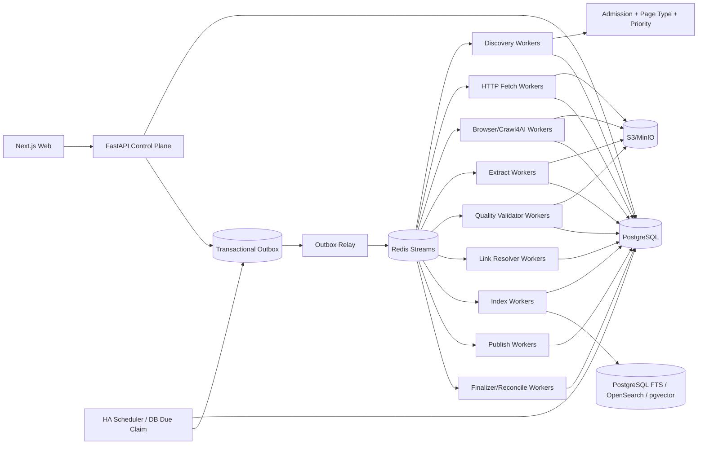

# 博客知识库技术方案

适用范围：从约 1000 个技术博客网站抓取尽可能完整的历史文章，清洗为稳定 Markdown 形成长期知识库；后续可持续新增站点，并支持增量同步、版本保留、Web 管理、搜索、审计、故障恢复、离线重处理和外部发布。容量按“百万级文章、数百万到千万级 URL、站点高度异构、长期运行”设计。

## 1. 建设目标

1. 管理员录入博客根地址后，系统自动探测 Sitemap、RSS/Atom/JSON Feed、归档页、分类/标签/作者页、平台 API、普通站内链接和动态列表，生成可审核的站点配置草稿。
2. 支持约 1000 个站点历史全量回灌，并可持续增加站点；新增发现器、抓取器、渲染器、抽取器通过 Capability/Adapter 扩展，不修改核心状态机。
3. 支持 FULL_BACKFILL、INCREMENTAL、RECONCILE、TARGETED_FETCH、REPROCESS 等明确运行模式。
4. 最终保存标题、作者、发布时间、更新时间、标签、canonical、正文、代码块、表格、图片、附件和真实链接关系，并渲染成稳定 Markdown。
5. 默认 HTTP-first，只有存在确定证据时才升级 Browser/Crawl4AI/Playwright。
6. 支持 ETag、Last-Modified、Sitemap lastmod、Feed GUID/API cursor、内容 hash 和重叠窗口驱动的增量同步。
7. 支持 durable frontier、断点续跑、幂等、lease、heartbeat、重试、限流、熔断、公平调度和 backpressure。
8. 保存不可变网络 Snapshot、渲染 DOM、清洗 HTML、Article IR、Markdown、规则版本和质量结果；规则升级优先离线 replay。
9. Web 管理端支持站点接入、同步计划、覆盖检查、任务控制、质量审核、版本 diff、错误诊断、搜索、成本与发布。
10. 每次运行可复现、可解释、可审计；Worker 自报成功不能直接成为业务完成事实。

## 2. 核心原则

1. PostgreSQL 是业务状态真相源；S3/MinIO 是不可变大对象真相源。
2. Redis Streams 只做短期任务运输；决定性状态先落 PostgreSQL，再通过 Transactional Outbox 投递。
3. URL 被发现不等于允许抓取；统一经过 URL Admission Pipeline，真实网络连接仍由 Egress Gateway 再做 DNS/IP/端口/redirect 安全校验。
4. HTTP、Sitemap、Feed、API、Browser 分层，Browser 是昂贵升级路径。
5. 网络 Snapshot 不可变；规则、Schema、模型、Renderer 升级优先 replay，不重复访问源站。
6. 文章身份与 URL 分离；redirect、canonical、镜像、迁移只是 identity evidence。
7. `article_version` append-only；不覆盖旧版本。
8. Bloom Filter/RoaringBitmap 只能加速，不能替代数据库唯一约束和 durable frontier。
9. `max_pages/max_articles/max_entries/max_runtime` 都只是 execution slice 预算，不能当历史完成条件。
10. Scheduler、浏览器进程、Redis Consumer ownership、前端页面都是可丢失运行时状态，不能替代数据库里的 schedule、run、task、lease 和幂等约束。
11. 长期任务 payload 不保存 API Key、Cookie、密码或 Token，只保存 Secret Reference/Version。
12. Dashboard 是事实展示和显式命令入口，不是状态真相源，也不持有流程锁或 continue gate。
13. URL 必须来自真实 discovery evidence 或管理员精确输入，禁止根据标题猜 URL，也禁止用相似文章替代失败目标。
14. 核心领域数据通过 Typed Domain Writer 写入；关键领域字段必须有唯一权威 Writer。
15. 阶段完成由独立 Stage Finalizer 对真实数据和 COMPLETE Artifact 对账。
16. 最终质量由独立 Deterministic Validator 重新计算，生产内容的 Worker 不能自行证明通过。

## 3. 总体架构



职责：

- Control Plane：站点配置、权限、计划、Run 创建、Run Context、命令和查询；
- Scheduler：只触发逻辑 Run，不执行长抓取；
- Worker：执行可领取 work unit；
- Artifact Service：Reservation、staging、hash/schema 校验和 COMPLETE commit；
- Quality Validator：独立校验最终候选版本；
- Stage Finalizer：以真实领域数据和 Artifact 对账阶段状态；
- Link Resolver：维护文章链接图；
- Dashboard：读取事实并发出显式命令。

## 4. Crawl Mode 与运行语义

```text
FULL_BACKFILL     首次历史全量回灌
INCREMENTAL       持续同步新增和更新
RECONCILE         周期性重新枚举，修复断档
TARGETED_FETCH    精确 URL 抓取/调试
REPROCESS         不访问网络，基于已有 Snapshot 重抽取/清洗/质量/索引/发布
```

约束：

- FULL_BACKFILL 中 Page Type/Scorer 只影响顺序，不得因关键词或低分静默丢弃合法历史 URL。
- TARGETED_FETCH 接收精确 URL 列表，保留输入顺序；任何目标失败都逐项报告，禁止补位或替代。
- REPROCESS 必须记录 `source_snapshot_id` 和 lineage。
- 同站点默认仅允许一个 active FULL_BACKFILL；其他模式并行关系由显式策略控制。

## 5. 不可变 Run Context Manifest

`crawl_run_id` 只表示“哪次运行”，还必须冻结“这次运行使用什么语义”。Run 创建时生成不可变 `run_context_manifest`：

```text
run_context_id
crawl_run_id
site_profile_release_id
site_source_release_ids
provider_release_ids
url_filter_release_id
url_scorer_release_id
page_type_rule_release_id
fetch_profile_release_id
browser_action_plan_release_id
adapter_binding_release_id
adapter_schema_release_id
extraction_pipeline_release_id
markdown_renderer_release_id
quality_contract_release_id
index_release_id
publish_release_id
runtime_bundle_release_ids
policy_release_id
credential_profile_id
secret_version_refs
context_hash
created_at
```

规则：

1. Context 创建后不可修改；
2. Worker payload 只引用 `run_context_id`；
3. Worker 禁止读取“latest release”；
4. Context Hash 不一致时拒绝提交；
5. 发布新配置不影响正在运行的 Run；
6. 用新规则处理旧 Snapshot 时创建新 Run/Context，并保留 lineage；
7. Web 可对两个 Run Context 做 diff。

## 6. 核心数据模型

至少包括：

```text
site
site_source
site_profile_release
site_source_release

discovery_provider
discovery_provider_release
discovery_checkpoint
discovery_evidence
provider_coverage

sync_schedule
crawl_run
run_context_manifest
run_event

sitemap_task
url_frontier
background_task
task_event
fetch_task
crawl_attempt

adapter_capability_release
adapter_binding_release
adapter_schema_release
runtime_bundle_release

artifact_kind_release
artifact_reservation
artifact_object
run_artifact_manifest
fetch_snapshot

page_type_rule_release
url_filter_release
url_scorer_release
fetch_profile_release
browser_action_plan_release
extraction_pipeline_release
markdown_renderer_release
quality_contract_release

extraction_candidate
quality_manifest
quality_override

article
article_url_relation
article_version
article_link_edge

field_ownership_release
contract_release
index_release
publish_state
credential_profile
outbox_event
```

## 7. 新站点接入：Discovery Probe

管理员录入根 URL 后：

1. 获取根页面并记录 final URL、响应头、Content-Type、编码和页面结构；
2. 解析 robots.txt 中 Sitemap；
3. 探测常见 Sitemap/Sitemap Index；
4. 探测 RSS/Atom/JSON Feed；
5. 识别平台公开 API、年/月归档、分类/标签/作者分页；
6. 识别普通站内链接和动态列表；
7. 必要时执行 Browser Sample Probe；
8. 抽样 3~10 篇文章识别正文和 metadata；
9. 生成 `site_profile_release`、Provider、Filter、Scorer、Fetch Profile、Extraction Contract 草稿；
10. 在 Web 展示证据、样本 diff 和风险；
11. dry-run/canary 通过后 publish；
12. 启动首次 FULL_BACKFILL；
13. 自动创建默认 INCREMENTAL schedule。

站点长期配置必须版本化，运行中的临时结果不能直接修改站点正式 Release。

## 8. Discovery Provider 与覆盖台账

Provider 优先级一般为：

```text
Sitemap/Sitemap Index
 -> 平台 API
 -> Feed
 -> Archive/Category/Tag/Author
 -> 普通 HTML 链接
 -> Browser Dynamic Listing
 -> 外部公开索引补漏
```

每个 Provider 独立保存：

```text
provider_id
capabilities
checkpoint
last_success_at
last_enumerated_at
continuity_marker
expected_count_hint
discovered_count
admitted_count
coverage_gap
status
```

每个 URL 保存 `discovery_evidence`：

```text
source_provider
source_url
source_entry/href
observed_at
raw_evidence_ref
```

FULL_BACKFILL 完成需要 Provider 级证据，而不是“本次抓了 N 页”。至少满足：

- Sitemap/Archive/Feed 等主要 Provider 已完成或明确记录 gap；
- durable frontier 无可执行 URL；
- retry/dead-letter 已处理；
- reconcile 不再产生显著新增；
- Coverage Ledger 无未知断档。

## 9. Sitemap 与 Archive 持久化

Sitemap 独立建模为可恢复任务树：

```text
sitemap_task_id
site_id
provider_id
crawl_run_id
sitemap_url
parent_sitemap_url
depth
state
body_hash
etag
last_modified
entries_seen
child_sitemaps_seen
checkpoint
lease_owner
lease_until
attempt_count
next_attempt_at
```

要求：

1. 支持 Sitemap Index、普通 Sitemap、gzip、namespace、lastmod；
2. 使用安全 XML parser + streaming/iterparse；
3. 不构造完整 XML DOM 或完整 URL 数组；
4. 限制压缩前字节、解压后字节、压缩比，防 zip bomb；
5. 用 `max_bytes/max_entries/max_child_sitemaps/max_runtime_per_slice` 切片；
6. slice 用尽后保存 checkpoint 并重新排队；
7. visited sitemap 持久化并有唯一约束；
8. 子 Sitemap 并发受全局/站点/域名三级配额限制；
9. 404/410、429、5xx、解析失败和超限分别记录 coverage gap。

Archive/Category/Tag/Author/Pagination Provider 同样保存页级 checkpoint 和 continuity。

## 10. Durable Frontier、URL Admission 与 Crawler Trap

URL 唯一键建议：

```text
(site_id, sha256(normalized_url))
```

Admission Pipeline：

1. URL 规范化；
2. SSRF/Egress 预检查；
3. robots/站点策略；
4. Domain/Subdomain allowlist；
5. path allow/deny；
6. query 规范化；
7. Content-Type/扩展名规则；
8. canonical/redirect identity hint；
9. crawler trap 检测；
10. Page Type 分类；
11. Priority Scorer；
12. durable frontier upsert。

规范化处理 host 大小写、IDN、fragment、默认端口、tracking query、query 顺序、session 参数、trailing slash 和 percent-encoding。

Crawler Trap 至少防：日历无限翻页、搜索参数组合、tag/filter 笛卡尔积、无界 `?page=`、session/token、无限日期路径和多排序组合。

## 11. Adapter Capability Registry、Probe 与 Binding

核心状态机不硬编码 Crawl4AI、Firecrawl、Playwright、Browserless 或 MCP Server 名称，而依赖 Capability Contract。

`adapter_capability_release`：

```text
adapter_id
adapter_release
capabilities
input_schema_version
output_schema_version
runtime_class
cost_class
health_probe
limits
created_at
```

能力示例：

```text
DISCOVER_MAP
DISCOVER_SITEMAP
FETCH_HTTP
FETCH_MARKDOWN
RENDER_JS
SCREENSHOT
EXTRACT_STRUCTURED
DOWNLOAD_MEDIA
```

Run 创建前执行小而确定的能力探针：

1. 确认要求的 capability 可解析；
2. 执行低成本 health probe；
3. 根据站点需求、健康度、成本、合规策略选择实现；
4. 生成 `adapter_binding_release`；
5. 冻结进 Run Context。

同一 Run 不允许静默切换实现。fallback 必须形成显式 attempt，并保存 `from_adapter/to_adapter/fallback_reason`。

## 12. 周期计划、增量同步与 HA Scheduler

`sync_schedule` 至少保存：

```text
schedule_id
site_id
crawl_mode
schedule_revision
cron_expr/interval_seconds
timezone
dst_policy
jitter_seconds
overlap_window
misfire_policy
max_catch_up_runs
policy_release
enabled
next_due_at
last_expected_fire_at
last_success_at
created_at
updated_at
```

数据库统一存 UTC；用户计划使用 IANA timezone 计算具体 UTC 触发时刻。

`misfire_policy`：

```text
SKIP
FIRE_ONCE
CATCH_UP
```

INCREMENTAL 默认 `FIRE_ONCE + overlap window + RECONCILE`。同一周期触发幂等键：

```text
sync:{site_id}:{schedule_id}:{schedule_revision}:{crawl_mode}:{expected_fire_at}
```

Scheduler 多副本通过 DB due-claim/lease 协调；实例宕机后另一副本可继续。

增量信号优先级：

```text
Feed/API cursor
Sitemap lastmod
ETag/Last-Modified
内容 hash
重叠时间窗口
周期 reconcile
```

站点可按更新频率自适应调整 schedule，但策略必须版本化、可审计。

## 13. 后台任务、Claim、Lease、恢复与取消

长任务统一持久化：

```text
task_id
crawl_run_id
run_context_id
task_type
entity_id
state
priority
attempt_count
max_attempts
lease_owner
lease_epoch
lease_until
heartbeat_at
next_attempt_at
cancel_requested_at
error_class
created_at
updated_at
```

Claim 使用 `SELECT ... FOR UPDATE SKIP LOCKED` 或同等数据库机制。

Worker 提交结果前必须再次校验 `lease_owner + lease_epoch + cancel state`，避免旧 Worker 在 lease 过期后覆盖新 Worker。

Recovery Worker 扫描 stale/orphaned task：可重试则重新排队，超过上限进入 DEAD_LETTER。

取消规则：停止派生新任务、可取消 I/O 主动 abort、Browser context 清理、已开始 Artifact Commit 要么完成要么保持 staging 等待 Cleanup。

## 14. 状态、事件与 Transactional Outbox

所有决定性 transition 由统一 Transition Service 在一个 PostgreSQL 事务中完成：

```text
BEGIN
  validate current state / lease / context
  update domain/task state
  insert run_event/task_event
  insert outbox_event
COMMIT
```

Outbox Relay 负责把事件投递 Redis Streams。消费者必须幂等，消息重复不能产生重复领域对象。

## 15. 公平调度、限流与 Backpressure

Dispatcher 使用 weighted fair queue。每域维护：

```text
max_concurrency
token_bucket_rate
burst
min_delay
429_penalty
circuit_state
browser_quota
```

配额层次：

```text
全局
 -> site/domain
 -> runtime class
 -> Worker 进程池
```

下游积压时：降低 Discovery 速率、暂停 Browser expansion、优先处理已抓未抽取 Snapshot，并保留增量高优先级通道。

## 16. Runtime Topology

Adapter 声明：

```text
runtime_class = ASYNC_NATIVE | BLOCKING_IO | CPU_BOUND | BROWSER | VALIDATOR
```

- ASYNC_NATIVE：HTTP/Sitemap/Feed；
- BLOCKING_IO：同步 SDK；
- CPU_BOUND：DOM 解析、diff、MinHash/SimHash、IR normalize、Markdown render；
- BROWSER：Crawl4AI/Playwright；
- VALIDATOR：确定性质量校验。

Browser Worker 长期维护 browser/context/page pool、session TTL、内存/CPU 上限。禁止每 URL 新建 Browser，也禁止对百万 URL 一次性 `asyncio.gather`。

## 17. HTTP-first 与固定 Fetch Fallback

HTTP Worker 优先发送 `If-None-Match/If-Modified-Since`。304 只更新 freshness；200 先保存 raw bytes，再做抽取。

默认链：

```text
HTTP 原文
 -> HTTP 结构化抽取
 -> Browser/Crawl4AI 渲染
 -> 站点 API/Adapter
 -> 人工诊断
```

Browser escalation 原因结构化保存：

```text
EMPTY_ARTICLE_BODY
SPA_SHELL
JS_PAGINATION
LOAD_MORE
INFINITE_SCROLL
DYNAMIC_RENDER_REQUIRED
EXTRACTION_READINESS_FAILED
```

固定顺序由 `fetch_profile_release + adapter_binding_release` 定义，Worker 不自由尝试无穷 fallback。

Adapter 输出统一：

```text
adapter_output_schema_version
url_id
attempt_id
final_url
status_code
headers
raw_html_ref
rendered_dom_ref
raw_markdown_ref
links/media
metrics
source_provenance
fallback_reason
error_class
runtime_bundle_release
adapter_binding_release
```

Crawl4AI/Playwright 可以负责渲染和内容生成，但不能承担 durable frontier、业务 checkpoint、schedule、run、文章版本或历史完成判定。

## 18. Artifact Kind Registry 与 Server-side Reservation

所有 Artifact 类型来自 canonical `artifact_kind_release`：

```text
artifact_kind
schema_version
namespace
allowed_media_types
producer_stage
allowed_consumers
retention_policy
required_for_finalize
validator_id
is_immutable
created_at
```

所有 write/read/list/cleanup/Web/Finalizer 都读取同一 Registry，禁止维护多个独立 namespace enum。

写入协议：

```text
1. reserve_artifact(task_id, attempt_id, kind)
2. 服务端校验 Run Context、lease、producer stage
3. 返回 staging object key / pre-signed upload
4. Worker 流式上传并计算 sha256/size/media type
5. commit_artifact(reservation_id, sha256, size, schema_version)
6. 服务端校验 kind/schema/hash/media type
7. 生成 content-addressed COMPLETE artifact_object
8. Typed Domain Writer 引用 Artifact
9. run_artifact_manifest 记录关系
10. Cleanup 回收过期 staging
```

Worker 不能任意拼接对象 key，也不能引用未 COMPLETE 的对象。

## 19. Typed Domain Writer 与 Field Ownership

核心业务写入使用类型化服务：

```text
record_discovered_url(...)
commit_fetch_snapshot(...)
commit_extraction_candidate(...)
commit_article_version_candidate(...)
commit_quality_manifest(...)
accept_article_version(...)
commit_link_edges(...)
commit_index_result(...)
commit_publish_result(...)
```

Writer 统一负责：schema、Run Context、幂等、lease/cancel、Artifact 引用、领域对象、event、outbox，并在单 PostgreSQL 事务提交。

同时维护 `field_ownership_release`：

```text
entity_type
field_path
owner_service
allowed_transition
immutable_after_stage
merge_policy
schema_version
```

示例：

```text
fetch_snapshot.*             Fetch Commit Writer
quality_manifest.*           Quality Validator
article_version.current      Acceptance Service
crawl_run.final_status       Run Finalizer
manual_override.*            Review Service
```

其他服务只能写 companion evidence，不得覆盖权威字段，避免后处理 clobber 正确事实。

## 20. Stage Finalizer 与 Canonical Persisted Set

每个长阶段结束后运行：

```text
finalize_discovery(run_id)
finalize_fetch(run_id)
finalize_extraction(run_id)
finalize_quality(run_id)
finalize_link_graph(run_id)
finalize_index(run_id)
finalize_publish(run_id)
```

Finalizer 比较：

```text
数据库期望集合
vs COMPLETE artifact_object
vs run_artifact_manifest
vs 领域表引用
vs quality manifest
vs retry/dead-letter
```

输出：

```text
COMPLETED
PARTIAL
FAILED
INCONSISTENT
```

规则：

- 要求产物的阶段真实产物为 0，不能标完成；
- discovered > persisted 时显式 PARTIAL；
- TARGETED_FETCH 任一指定 URL 缺失即失败；
- INCONSISTENT 自动创建 repair/reconcile task；
- 下游和 Resume Planner 只能消费 Finalizer 返回的 canonical persisted/accepted set；
- Finalizer 必须幂等，可在 Worker 崩溃和消息重放后重复执行。

## 21. Snapshot、Article IR 与 Markdown

每次成功网络访问保存不可变 Snapshot：

```text
raw response bytes
headers
charset
final_url
redirect chain
resolved_ip_evidence
body sha256
rendered DOM
cleaned HTML
raw/fit Markdown
links/media
source provenance
fetch/runtime/adapter release
run_context_id
fetched_at
```

抽取链：

```text
JSON-LD/OpenGraph/meta/API
CSS/XPath Contract
Trafilatura
Readability
Crawl4AI raw/fit Markdown
必要时 LLM Structured Extraction
```

同一 Snapshot 可产生多个 `extraction_candidate`。统一 Article IR：

```text
heading
paragraph
list
quote
code_block
table
image
link
embed_placeholder
```

Markdown 由版本化 Renderer 从 IR 生成。文件名使用稳定 ID/slug 映射，不依赖标题作为内部 identity；图片和链接转换为可追踪绝对或托管地址。

## 22. Canonical Contract Registry 与发布门禁

Artifact/Domain/Worker 数据结构不能散落在 Prompt、API、Validator、Web 各自维护。建立 `contract_release`，使用 JSON Schema/Pydantic 等作为单一事实源：

```text
Canonical Schema
 -> API schema
 -> Worker SDK types
 -> Validator input/output
 -> Web view model
 -> Contract tests
```

新增 stage/artifact/field 的发布门禁：

1. Registry 已注册；
2. Producer/Consumer schema compatibility 通过；
3. Typed Writer 已实现；
4. Finalizer 已实现；
5. Cleanup/retention 已实现；
6. Web 可展示；
7. Golden Artifact Test 通过；
8. replay/rollback/downgrade 测试通过。

## 23. Deterministic Quality Contract 与 Quality Manifest

最终候选版本必须由独立 Validator 重新读取真实 COMPLETE Artifact 后校验。

`quality_contract_release` 定义 required/optional checks、阈值、站点覆盖规则和 Validator Release。

`quality_manifest`：

```text
quality_manifest_id
article_version_candidate_id
quality_contract_release_id
validator_runtime_release
checks
score
blocking_failures
review_flags
input_artifact_hashes
result = PASSED | FAILED | REVIEW
created_at
```

检查至少包括：

- 正文非空和长度合理；
- 标题/发布时间/作者等关键字段一致性；
- HTML/IR/Markdown 结构保留；
- 代码块、表格、列表不异常丢失；
- 截断、模板污染、导航噪声；
- canonical/URL identity 冲突；
- 链接完整性；
- 与当前高质量版本相比是否明显退化。

人工 Override 单独保存 `quality_override`，不能篡改机器 Manifest。

只有 PASSED 或有明确人工授权的候选才能成为 accepted `article_version`。

## 24. 文章身份、去重与版本

- exact duplicate：Article IR/content hash；
- near duplicate：MinHash/SimHash 只产生候选；
- redirect/canonical：identity evidence；
- 多 URL 同文章：`article_url_relation`；
- 标题、slug、URL path 尾段都不是内部主键。

正文、关键 metadata、canonical identity 或 IR 实质变化时创建新 `article_version_candidate`。质量通过后才推进 current pointer。

仅抓取时间/响应头变化且 IR hash 相同，不创建无意义版本。

## 25. Article Link Graph

抽取时增量写 `article_link_edge`：

```text
article_link_edge_id
source_article_id
source_article_version_id
target_url_id
target_article_id
href
anchor_text
rel
first_seen_at
last_seen_at
status
```

用途：

- inbound/outbound；
- broken link；
- orphan article；
- redirect/canonical 重解析；
- 覆盖补漏；
- 内容图谱与检索增强。

如果 href 触发新 URL 入 frontier，必须把原始 Link Edge 保存为 discovery evidence。

## 26. Drift Detection、Reconcile 与质量保护

监控：

```text
标题存在率
正文字符/段落数
代码块/表格保留率
抽取候选分歧
Browser escalation rate
HTTP 状态分布
模板噪声比例
Quality fail rate
版本变更率
Provider 新增率
```

Release 发布后指标突变时：停止扩大范围、自动重新 Probe、生成规则草稿或回滚。低质量新候选不能覆盖当前高质量版本。

RECONCILE 周/月级重新枚举 Sitemap/Archive/Feed 等，修复增量窗口遗漏和 Provider 断档。

## 27. 错误分类与重试

统一错误分类：

```text
DNS/TLS/CONNECT_TIMEOUT/READ_TIMEOUT
HTTP_429/HTTP_5XX/HTTP_404_410
ROBOTS_DENIED/AUTH_REQUIRED
SSRF_BLOCKED/REDIRECT_BLOCKED
CONTENT_TOO_LARGE
PARSE_FAILED/EXTRACTION_FAILED
BROWSER_CRASH/BROWSER_TIMEOUT
CONTRACT_VIOLATION
QUALITY_FAILED
ARTIFACT_COMMIT_FAILED
LEASE_LOST/CANCELLED
```

可重试错误按 `Retry-After + jittered exponential backoff + max attempts + circuit breaker`。配置错误、明确拒绝和确定性质量失败不原样重试，只重放最小必要单元。

## 28. 安全、robots 与 Egress

所有网络访问统一经过 Egress Gateway：

- 只允许 http/https；
- 拒绝 localhost、RFC1918、loopback、link-local、metadata endpoint；
- DNS 多 A/AAAA 逐一检查；
- 每次 redirect 重新 Admission；
- 防 DNS rebinding；
- 限制危险端口；
- Browser 子资源也执行网络策略；
- 遵守 robots、Retry-After 和礼貌抓取；
- 不绕过验证码、登录、付费墙或明确访问控制；
- Secret 通过 Vault/云 Secret Manager/KMS 解析；
- 日志、事件和 Artifact metadata 默认脱敏。

## 29. Web 管理功能

### 29.1 站点接入

- Probe 向导；
- Sitemap/Feed/API/Archive/Browser 证据；
- 样本 URL 和 HTTP/Browser diff；
- 自动规则草稿；
- Extraction/Quality 样本对比；
- dry-run/canary/publish；
- 一键 FULL_BACKFILL；
- 自动创建 INCREMENTAL schedule。

### 29.2 同步与 Run

- cron/interval、timezone、DST、jitter、overlap；
- schedule revision/misfire policy；
- Run Now / Force New Run / Targeted Fetch / Reprocess；
- Run Context Manifest 与 diff；
- pause/resume/cancel/retry；
- supersede/cancel 审计。

### 29.3 覆盖与任务

- Provider checkpoint/continuity gap；
- 每个 URL discovery evidence；
- Sitemap task tree；
- expected/discovered/admitted/fetched/article count；
- heartbeat/lease/attempt/worker/recovery；
- runtime class、队列和 Worker 饱和度。

### 29.4 Artifact 与阶段对账

- Artifact Kind/Contract Release；
- reservation/staging/COMPLETE；
- run_artifact_manifest；
- DB expected vs COMPLETE Artifact；
- PARTIAL/INCONSISTENT 原因；
- repair/reconcile；
- raw HTML/rendered DOM/IR/Markdown 对比。

### 29.5 质量与版本

- Extraction Candidate 对比；
- Quality Manifest/Override；
- Article IR vs Markdown diff；
- current/previous version diff；
- 低质量候选阻断原因；
- Link Graph 和断链。

Dashboard 只读取已提交事实。按钮操作必须调用 Control API 命令，页面关闭或刷新不改变流程。

## 30. 搜索与发布

默认 PostgreSQL FTS；规模或复杂查询上升后接 OpenSearch。向量检索按需使用 pgvector/独立 Vector DB，不作为抓取主链路强依赖。

索引字段建议：

```text
title
body_markdown
author
published_at/updated_at
tags
site/domain
canonical_url
headings
code_language
link graph features
article_version_id
```

发布 Worker 支持文件树、Git、对象存储、向量库或外部知识库 API。默认只发布 accepted + Quality PASSED 版本。发布结果也必须经过 Typed Writer 和 Finalizer。

## 31. 可观测性与审计

指标：

```text
urls_discovered/admitted/fetched
articles_accepted
provider_coverage_gap
frontier_depth
queue_lag
fetch_latency
browser_escalation_rate
429/5xx rate
retry/dead_letter
artifact_commit_failure
quality_failure
scheduler_lag
lease_recovery
cancel_to_stop_latency
cost_per_site/article
```

结构化日志统一携带：

```text
site_id
crawl_run_id
run_context_id
task_id
attempt_id
url_id
snapshot_id
article_id
article_version_id
adapter_binding_release
runtime_bundle_release
```

Run/Task 关键状态事件长期保留，可通过 SSE/WebSocket 推送；客户端按 event_id 去重。

## 32. 推荐技术栈

| 层 | 推荐 |
|---|---|
| API | Python + FastAPI |
| Web | React / Next.js |
| DB | PostgreSQL |
| Queue | Redis Streams |
| Object Storage | S3 / MinIO |
| HTTP | httpx/aiohttp |
| HTML/IR | selectolax/lxml + Trafilatura/Readability |
| Browser | Crawl4AI + Playwright |
| Scheduler | DB Due Claim + APScheduler/自研轻触发器 |
| Search | PostgreSQL FTS，后续 OpenSearch |
| Vector | pgvector（按需） |
| Secret | Vault / 云 Secret Manager / KMS |
| Deployment | Docker + Kubernetes |

初期不建议直接引入 Kafka。Redis Streams + PostgreSQL Outbox 足够；只有吞吐、保留周期或跨区域消费出现明确瓶颈再迁移 Kafka/Pulsar。

## 33. 部署与容量规划

推荐最小生产拓扑：

```text
2 x FastAPI Control Plane
2 x Scheduler/Outbox Relay
N x Discovery/HTTP Workers
独立 Browser Worker Pool
独立 CPU Extract Pool
独立 Validator Pool
1 x PostgreSQL HA/Managed
1 x Redis HA/Managed
S3/MinIO
Next.js Web
```

扩容依据不是“站点数量”，而是：

- frontier/queue lag；
- HTTP p95/p99；
- Browser escalation rate；
- CPU extract backlog；
- Validator backlog；
- 429/5xx；
- object/index size；
- 单域礼貌上限。

1000 站的关键瓶颈通常是站点异构、浏览器比例和礼貌限流，而不是单纯 CPU。

## 34. Runtime Release 与供应链

`runtime_bundle_release` 固定：

```text
runtime_role
image_digest
package_lock_hash
crawler/browser version
extractor version
validator version
build_commit
sbom_ref
created_at
```

Run Context 只引用 immutable digest，不使用浮动 `latest`。镜像进入生产前通过单元测试、Contract Test、Golden Crawl、Replay、Artifact Finalizer、SSRF 和回滚测试。

## 35. 实施阶段

### Phase 1：MVP

- site/source/Probe；
- Sitemap/Feed；
- streaming sitemap task；
- durable frontier；
- HTTP fetch + conditional request；
- raw Snapshot；
- Article IR + Markdown；
- PostgreSQL + S3/MinIO；
- Redis Streams + Outbox；
- 基础 Web；
- Admission/Egress/robots；
- Secret Reference；
- 基础 error taxonomy。

### Phase 2：异构站点与一致性闭环

- Archive/API/HTML Provider；
- CSS/XPath Rule；
- Browser/Crawl4AI；
- Capability Registry + Probe + Binding；
- Run Context Manifest；
- Artifact Reservation/Commit；
- Typed Domain Writer；
- Field Ownership Registry；
- Stage Finalizer；
- Quality Contract/Manifest；
- Contract Registry + Golden Test；
- Targeted Fetch/Reprocess；
- Link Graph。

### Phase 3：规模化

- 多 Provider Coverage Ledger；
- weighted fairness；
- backpressure；
- 自适应调度；
- HA Scheduler/Recovery；
- OpenSearch/pgvector；
- 外部知识库发布；
- 自动 Drift Detection；
- Runtime Release Gate；
- 完整运维/成本面板。

## 36. 验收标准

### 36.1 全量历史覆盖

随机选择不同规模和技术栈站点，必须输出 Provider 级覆盖证据；Worker 重启后继续；Sitemap slice 用尽后从 checkpoint 恢复；FULL_BACKFILL 不因关键词、Page Type、`max_pages/max_entries/max_articles` 漏掉已发现合法 URL；大 Sitemap 不把完整 XML/URL 集合同时常驻内存。

### 36.2 URL 发现与精确任务

每个进入 frontier 的 URL 都能追溯真实 discovery evidence。禁止标题推导 URL。TARGETED_FETCH 输入 N 个 URL 时逐项处理；任意失败不得被其他文章替代，Finalizer 必须暴露 missing/unexpected target。

### 36.3 Run Context 可复现

Run 创建后发布新 Fetch/Extraction/Quality/Adapter Release，运行中的 Worker 仍只使用原 Context。相同 Snapshot + 相同 Context 的确定性抽取/质量结果应一致；Context Hash 不匹配时拒绝提交。

### 36.4 Capability 与 Binding

模拟 Crawl4AI 不可用、替代 Adapter 可用、运行中 Adapter 异常。Run 创建前 Probe 能选择合法 Binding；运行中不得静默改变 Binding；fallback 必须产生显式 attempt/provenance。

### 36.5 增量与调度

新增文章在 SLA 内进入知识库；更新文章产生新版本；304/内容未变不产生新版本；Feed/Sitemap 窗口断档可由 RECONCILE 修复。Scheduler 实例故障后另一实例继续；同一 `schedule_revision + expected_fire_at` 最多产生一个周期 active Run。

### 36.6 Lease/恢复/取消

故障注入覆盖 CLAIMED、RUNNING、写 Snapshot 前后、heartbeat 中断、lease 失效和 cancel。旧 Worker 失去 lease 后不能覆盖新 Worker；stale task 能重排或进入 DEAD_LETTER。

### 36.7 Outbox 原子性

在“更新状态后/写 event 前/写 outbox 前/事务提交前”注入故障，最终只能全部提交或全部回滚，不能出现状态、事件、消息分裂。

### 36.8 Artifact Contract 与 Finalizer

故障注入覆盖对象上传中断、reservation 过期、hash/schema 不匹配、Worker 自报成功但无产物、重复 finalize。Finalizer 必须得到可重复的 COMPLETED/PARTIAL/FAILED/INCONSISTENT，并且下游只消费 canonical persisted set。

### 36.9 Field Ownership 与 Contract Drift

测试第二个服务尝试覆盖 `quality_manifest`、`article_version.current`、`crawl_run.final_status`，必须被拒绝。Producer/Validator 使用不同 Schema Release 时应在写入或发布门禁阶段失败，而不是运行后出现隐式字段漂移。

### 36.10 抽取与 Markdown 质量

标题、发布时间、正文、代码块、表格、列表按抽样集评估；规则升级可从 Snapshot replay；Markdown 不因文本扁平化破坏技术结构；低质量新候选不能覆盖旧高质量版本。

### 36.11 Quality Manifest

构造 Markdown 为空、截断、模板污染、metadata 冲突、Validator 重复计算等场景。系统必须以独立 Validator 事实为准；人工 Override 不改变原机器结果。

### 36.12 Link Graph

抽样文章 outbound/inbound 对应；redirect/canonical 后可重解析；未抓内部目标能追溯原始 href；可识别 broken/orphan；Resolver 重跑幂等。

### 36.13 安全

测试公网 URL 302 到 RFC1918/metadata、DNS 多地址混入内网、DNS rebinding、嵌套 Sitemap 指向内网、危险端口、Browser 子资源越权请求，必须在真实网络执行前阻断并留下审计证据。

### 36.14 Web 与运维

Web 能从任一 URL 定位：

```text
discovery evidence
frontier state
attempt/fetch snapshot
adapter/fallback
extraction candidate
Article IR/Markdown
quality manifest
article version
link graph
index/publish result
run/task events
```

浏览器断线、刷新或多管理员同时查看不能改变后台状态机。

---

该方案的核心是把“抓网页”拆成**可发现、可准入、可抓取、可验证、可恢复、可对账、可复现**的长期数据系统。Crawl4AI、Firecrawl、Playwright、Trafilatura 等只是可替换执行器；真正决定 1000 站长期可靠性的，是 durable state、coverage、Run Context、Capability Binding、Artifact Contract、Typed Writer、Field Ownership、Finalizer 和独立 Quality Manifest。