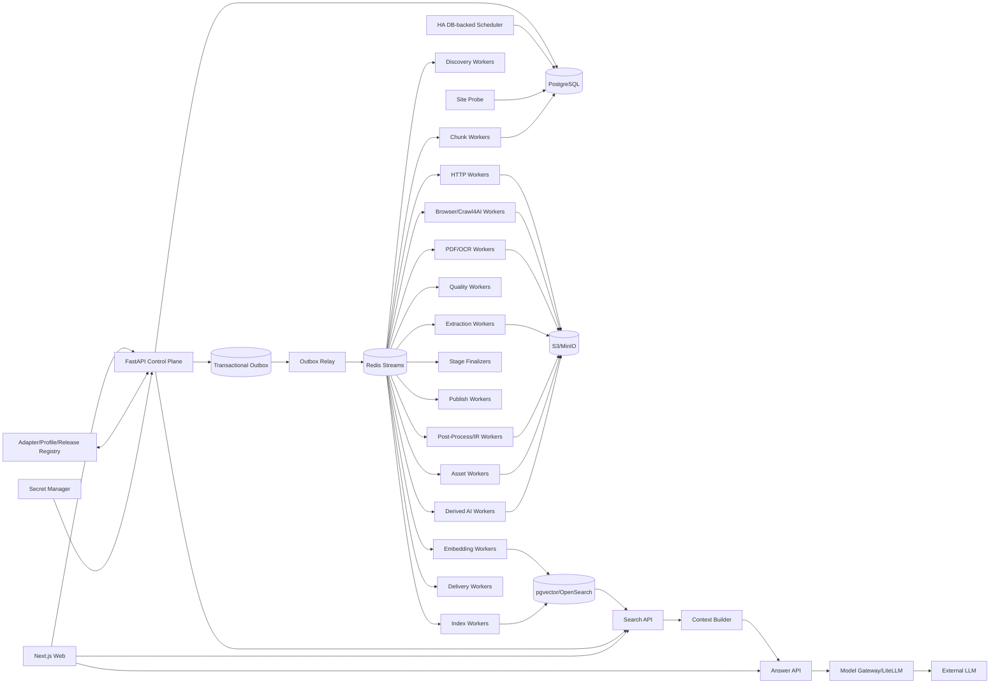

# 博客知识库技术方案

适用范围：从约 1000 个技术博客、工程博客、技术文档站、Newsletter 和 CMS 站点抓取尽可能完整的历史文章，清洗为稳定 Markdown 建设长期知识库；后续持续增加网站，支持增量同步、Web 管理、版本留存、搜索/RAG、离线重处理、质量审计、图片附件归档和 AI 派生能力。整体按百万级文档、数百万到千万级 URL、站点高度异构和多年持续运行设计。

## 1. 建设目标

1. 输入站点根地址、博客入口、文档入口或 Feed 后，自动探测 Sitemap、RSS/Atom/JSON Feed、公开 API、归档页、分类/标签/作者页、文档导航树、普通内链和动态列表。
2. 支持 `FULL_BACKFILL` 历史全量回灌、`INCREMENTAL` 持续增量、`RECONCILE` 周期覆盖校准、`TARGETED_FETCH` 精确补抓、`REPROCESS` 离线重处理、`ASSET_REPAIR` 资产修复、`REINDEX` 搜索/RAG 重建。
3. 历史完整性必须有 Provider 级 Coverage Evidence，不能用“队列空了”“达到 max_depth/max_pages”代替。
4. 默认 HTTP-first；只有存在明确动态渲染证据时才升级 Crawl4AI/Playwright Browser。
5. Discovery Rule、Discovery Fetch Route、Article Fetch Route、Extraction Profile、Post-Processor、Quality Policy、Chunker、Embedding、Search Index、Retrieval Profile、Context Builder、AI Prompt/Model 全部独立版本化。
6. 支持 Sitemap lastmod、Feed GUID、API cursor、ETag、Last-Modified、body hash、Document IR hash、重叠时间窗和周期 Reconcile 驱动增量。
7. 最终知识对象保存标题、作者、发布时间、更新时间、标签、canonical、正文块、代码块、表格、图片、附件、链接关系、来源 Snapshot、字段 provenance 和完整 lineage。
8. 支持 durable frontier、断点续跑、幂等、lease、heartbeat、重试、限流、熔断、公平调度、backpressure 和 dead-letter。
9. 保存不可变网络 Snapshot、渲染 DOM、清洗 HTML、Extraction Candidate、字段转换轨迹、Canonical Document IR、Markdown Projection、规则版本和质量结果；规则升级优先离线 replay。
10. 图片和附件走独立 Asset Pipeline，支持安全校验、hash 去重、对象存储、引用关系、独立重试和 Markdown URL 重写。
11. Web 管理端覆盖站点接入、Provider 覆盖、任务控制、发现证据、URL/文档诊断、版本 diff、抽取转换链、质量审核、漂移告警、资产、搜索/RAG 索引、查询 Trace、成本、Schedule、AI Workflow、Delivery 和审计。
12. Markdown、全文索引、Embedding、RAG、摘要、聚类、Digest、Newsletter、报告和通知都属于 Accepted Document Version 的异步下游，失败不能阻塞源站同步。

## 2. 核心原则

1. **PostgreSQL 是业务状态真相源；S3/MinIO 是不可变大对象真相源。**
2. Redis Streams 只承担任务运输；决定性状态先写 PostgreSQL，再由 Transactional Outbox 投递。
3. Source Adapter、Discovery、Admission、Fetch、Extraction、Post-Process、Quality、Asset、Publish、Search、Context Builder、Answer、Derived AI、Delivery 分层。
4. Discovery 只产生 URL candidate 和 evidence；列表页、搜索页、Feed 摘要不能直接成为最终正文。
5. URL Identity 与 Document Identity 分离；redirect、canonical、slug rename、镜像、站点迁移只是 identity evidence。
6. Identity 与 Freshness 分离；“URL 已知”不代表“内容仍新鲜”。
7. Discovery Rule 与 Extraction Profile 分离；URL path pattern 可帮助分类，但不能直接证明页面是合法文章。
8. Discovery Fetch Route 与 Article Fetch Route 分离；动态列表需要 Browser，不代表文章详情页也必须 Browser。
9. HTTP、Browser、PDF/OCR 分层路由；Browser 是昂贵升级路径，生产中复用长期 runtime。
10. Crawl4AI `result.links`、`arun_many`、Dispatcher、CSS/JSON Schema 是 Worker 内执行能力，不承担历史完整性、持久调度和业务最终状态。
11. HTTP 200、Browser success、`result.success`、Extractor 无异常都不是业务成功证据。
12. 所有阶段使用结构化 Outcome Contract；`EMPTY/INVALID/AMBIGUOUS/RETRYABLE_ERROR` 不能被空字符串、空数组或宽泛异常吞掉。
13. Stage 完成由 Finalizer 对任务、Artifact、质量结果、Manifest 和 Provider ACK 对账，不由协程结束决定。
14. Crawl4AI Markdown/cleaned HTML 只是 Extraction Candidate；最终知识真相是 Accepted Canonical Document IR。
15. `document_version` append-only，不原地覆盖历史版本。
16. Markdown、搜索索引、Chunk、Embedding、摘要、报告和外部知识库都是 IR 的 Projection，可删除后重建。
17. 文件路径只属于发布视图，不能承担 Document Identity，也不能用“文件存在”判断已同步。
18. `max_depth/max_pages/max_runtime` 只是预算，不是历史完整性证明。
19. 关键词相关性、用户偏好和 AI 评分只影响优先级或下游选择，不能静默裁掉 FULL_BACKFILL 的合法历史内容。
20. 抓取时间不能伪装成发布时间；未知发布时间保持 NULL，并保留字段来源与置信度。
21. Scheduler、FastAPI BackgroundTasks、`asyncio.create_task()`、进程内队列/集合/全局变量不能承担业务真相。
22. Config 使用不可变 Release；Secret 使用 Vault/云 Secret Manager，仅保存引用。
23. Retrieval 与 Generation 解耦；LLM 不可用时抓取、索引和 Search 仍应正常工作。
24. Search API 返回结构化命中，不直接把结果拼成不可审计字符串；Context Builder 独立做 token budget、去重和引用绑定。
25. 人工操作使用 append-only Audit/Event；人工纠错通过 Override/Evidence 追加，不能抹掉机器历史。
26. 遵守 robots、版权、访问控制、站点政策和合理速率；验证码、登录、付费墙、WAF 挑战进入显式策略流程，不自动绕过。

## 3. 总体架构



职责：

- **Control Plane**：站点、Release、Run、Schedule、人工命令、权限和审计。
- **Site Probe**：探测站点能力并生成待审核 Profile。
- **Discovery**：枚举 URL、Provider checkpoint、Link Evidence 和覆盖证据。
- **Admission**：URL 规范化、Scope、robots、crawler trap、Content-Type 和网络安全检查。
- **Fetch**：条件请求、Browser 升级、PDF/OCR 和不可变 Snapshot。
- **Extraction**：按页面类型/Profile 生成一个或多个 Raw Candidate。
- **Post-Process/IR**：字段契约校验、清洗、时间解析、链接媒体归一化、fallback 和 Canonical IR。
- **Quality/Drift**：防空抓、错抓、模板漂移、字段污染和 fallback 激增。
- **Asset**：图片附件下载、hash 去重、S3 归档和引用维护。
- **Finalizer**：按 Outcome/Manifest 对账真实阶段成功。
- **Publish**：Markdown、Git、外部 KB Projection。
- **Search**：Chunk、Embedding、全文/向量索引、Hybrid Retrieval 和引用绑定。
- **Context Builder**：按 Query Trace 和 token budget 选择、去重、扩展检索上下文。
- **Answer**：调用 Model Gateway 生成带引用答案；不承担索引真相。
- **Derived AI**：版本化摘要、聚类、Digest、Newsletter、报告 DAG。
- **Delivery**：独立幂等投递、Provider ACK、重试和 dead-letter。

## 4. Crawl Mode 与 Run 语义

```text
FULL_BACKFILL   首次历史全量回灌
INCREMENTAL     持续同步新增和更新
RECONCILE       周期重新枚举，修复断档
TARGETED_FETCH  精确 URL 抓取、调试或补抓
REPROCESS       不访问源站，基于已有 Snapshot/Candidate 重抽取和重清洗
ASSET_REPAIR    仅补齐失败或缺失图片/附件
REINDEX         不访问源站，重新切块、Embedding、全文/向量索引
```

规则：

- 同站点默认只允许一个 active FULL_BACKFILL；
- INCREMENTAL 与 Search/AI/Publish/Asset 可并行，但同一 URL 网络请求和版本写入通过幂等键去重；
- TARGETED_FETCH 必须逐项返回真实结果，不能只返回“任务已启动”；
- REPROCESS 必须记录 `source_snapshot_id`、Extraction Profile Release、Post-Processor Release Chain 和 lineage；
- REINDEX 固定 `document_version_id + chunker_release + embedding_release + search_index_release`；
- Run 完成由 Stage Finalizer 判断，不由 Worker 函数结束判断。

## 5. 核心数据模型

至少包含：

```text
site
site_profile_release
system_config_release
source_adapter_release
adapter_binding_release
discovery_provider_release
url_admission_rule_release
site_extraction_profile_release
post_processor_release
quality_policy_release
chunker_release
embedding_release
search_index_release
retrieval_profile_release
context_builder_release
discovery_checkpoint
coverage_ledger
discovery_link_evidence
crawl_run
run_stage
stage_execution
stage_evidence
url_identity
url_observation
frontier_task
fetch_snapshot
artifact
extraction_candidate
field_transform_trace
document
document_identity_evidence
document_version
metadata_evidence
quality_result
drift_event
asset
asset_source
asset_reference
asset_task
chunk_projection
index_projection_job
index_projection_manifest
retrieval_eval_dataset
retrieval_eval_run
query_trace
outbox_event
schedule
command
ai_workflow_release
ai_stage_release
ai_run
ai_stage_execution
selection_manifest
publish_manifest
delivery
delivery_attempt
secret_binding
audit_event
```

关键唯一约束：

```text
UNIQUE(url_identity.normalized_url_hash)
UNIQUE(frontier_task.idempotency_key)
UNIQUE(document_version.document_id, content_hash)
UNIQUE(asset.sha256)
UNIQUE(asset_task.idempotency_key)
UNIQUE(chunk_projection.chunk_id)
UNIQUE(index_projection_job.idempotency_key)
UNIQUE(delivery.idempotency_key)
UNIQUE(command.idempotency_key)
```

大对象全部进入 S3/MinIO；PostgreSQL 保存业务状态、hash、metadata、索引键和 lineage。大表如 `url_observation/frontier_task/fetch_snapshot/discovery_link_evidence/query_trace/audit_event` 按时间或 site hash 分区。

## 6. 新站点接入与可扩展配置

### 6.1 Site Probe

新增站点检测：

1. 根 URL/博客入口可达性；
2. robots.txt；
3. sitemap.xml、sitemap index、gzip 和常见变体；
4. RSS/Atom/JSON Feed autodiscovery；
5. CMS/平台：WordPress、Ghost、Substack、Hugo、Jekyll、Docusaurus、MkDocs、Medium 等；
6. 归档、分类、标签、作者、分页和文档导航模式；
7. 常见 article URL pattern；
8. Discovery 页是否依赖 JS；
9. Article 页是否依赖 JS；
10. canonical、语言和迁移规则；
11. DOM/template fingerprint；
12. 推荐 Provider、Discovery Route、Admission Rule、Article Route、Extraction Profile、Post-Processor 和 Crawl Scope。

Probe 结果生成待审核 `site_profile_release`，通过后才用于生产 Run。

### 6.2 Source Adapter SDK

绝大多数站点使用“通用 Provider + 配置”；只有特殊平台写 Adapter。

```python
class SourceAdapter(Protocol):
    async def discover(self, ctx) -> AsyncIterator[DiscoveryRecord]: ...
    async def checkpoint(self) -> AdapterCheckpoint: ...
```

统一 `DiscoveryRecord`：

```text
source_url
source_item_id
canonical_hint
title_hint
published_at_hint
updated_at_hint
cursor/page_token
content_type_hint
fetch_route_hint
discovery_evidence
raw_metadata_ref
```

Registry Manifest 声明版本、配置 schema、能力、历史覆盖语义、checkpoint 语义、速率提示、允许域名、运行镜像 digest、健康检查和 Golden Fixture。

### 6.3 Provider 与 Route

```text
provider_type = SITEMAP | FEED | API | ARCHIVE | HTML_LINKS | DOC_NAV | BROWSER_LISTING
fetch_route   = HTTP | BROWSER | API
```

一个站点允许：

```text
Archive Discovery = Browser
Article Fetch      = HTTP
```

或反向组合，禁止用单一 `browser_required=true/false` 覆盖整个站点。

## 7. Discovery 与历史覆盖证明

### 7.1 Coverage Ledger

每个 FULL_BACKFILL 对每个 Provider 记录：

```text
provider_release_id
provider_scope
started_at/finished_at
checkpoint_start/checkpoint_end
pages_scanned/items_seen
new_urls/known_urls/rejected_urls
terminal_reason
coverage_evidence_artifact_id
error_summary
```

`terminal_reason`：

```text
EXHAUSTED
CURSOR_END
POLICY_BLOCKED
BUDGET_EXHAUSTED
ERROR
CANCELLED
```

只有真正 `EXHAUSTED/CURSOR_END` 或有明确边界证据的 Provider 才能贡献“已穷举”。

### 7.2 Sitemap Provider

必须区分 `sitemapindex` 与 `urlset`，递归展开 sitemap index，支持 gzip、lastmod、ETag/Last-Modified、去重和父子层级记录。不能把子 sitemap URL 当普通文章 URL 直接送入正文抓取。

### 7.3 Link Evidence

Crawl4AI/HTML Parser 的 internal links 作为发现证据：

```text
source_page_snapshot_id
raw_href
normalized_href
anchor_text/context
provider_release_id
admission_decision
admission_reason
admission_rule_release_id
```

Web 必须能回答某 URL 从哪里发现、原始 href 是什么、如何规范化、为何进入/拒绝 Frontier。

### 7.4 两阶段抓取

```text
Feed/Sitemap/Archive/Listing
 -> DiscoveryRecord/Link Evidence
 -> URL Identity + Admission
 -> Durable Frontier
 -> Origin Article Fetch
 -> Snapshot
 -> Extraction
```

Feed/搜索摘要只作为 hint/evidence。

## 8. URL Admission、Identity 与安全

网络访问前依次：

```text
resolve relative URL
 -> normalize
 -> scheme/host/port policy
 -> crawl scope
 -> admission rule
 -> canonicalization
 -> robots
 -> crawler-trap detection
 -> content-type hint
 -> DNS/IP/redirect egress validation
 -> durable frontier
```

规范化覆盖 fragment、tracking query、www/non-www、host alias、AMP/mobile、locale、redirect/canonical evidence。

过滤或降权日历无限翻页、session 参数、排序组合、站内搜索、登录/购物车、无限 faceted navigation。

防 SSRF：DNS 解析后校验 IP，每次 redirect 都重新检查 scheme、host、port 和地址范围；Asset Fetch 复用同一安全策略。

## 9. Durable Frontier、调度与并发

状态：

```text
PENDING -> LEASED -> RUNNING -> SUCCEEDED
                       |-> RETRY_WAIT
                       |-> DEAD_LETTER
                       |-> CANCELLED
```

任务至少保存：

```text
idempotency_key
site_id/domain_key
run_id/stage
priority
attempt/max_attempts
available_at
lease_owner/lease_until
heartbeat_at
error_code
```

三层并发：

- 全局 Worker 并发；
- site/domain quota，默认每域 1~4，并根据 429/503/延迟自适应；
- Browser/PDF/OCR/Asset/Embedding/LLM route quota。

使用 weighted fair scheduling 防大站长期占满资源，并通过 backpressure 降低租约速度。

Browser Worker 每次只 lease 小批 durable tasks，再在 Worker 内使用 `CrawlerRunConfig(stream=True)` + `arun_many()` + bounded Dispatcher；每完成一个 URL 即持久化 Snapshot/Outcome 并单独 ACK。

`MemoryAdaptiveDispatcher` 只作为 Worker 内局部资源保护，不能替代 durable frontier 和全局调度。

## 10. Fetch Decision Router 与 Immutable Snapshot

### 10.1 HTTP-first

HTTP Worker 记录：

```text
request URL/final URL
If-None-Match/If-Modified-Since
redirect chain
status/content-type/headers
fetched_at
body_hash
network timings
```

304 只更新 freshness observation，不产生新正文版本。

### 10.2 Browser 升级条件

仅在以下情况升级：

- 初始 HTML 几乎无正文但存在 SPA hydration；
- 列表必须滚动/点击加载；
- 关键 DOM 仅 JS 后出现；
- HTTP 结果与 Golden Pattern 明显不一致；
- Provider/Profile 明确要求 Browser。

Browser runtime 长期复用，并按 domain/context 策略隔离。

### 10.3 Snapshot

有效网络结果保存：

```text
request_fingerprint
request_url/final_url
response_status/headers
fetched_at
body_hash
artifact_id
route=HTTP|BROWSER|PDF
runtime_release_id
```

Extractor/Post-Processor 升级优先 REPROCESS Snapshot，不重新访问源站。

## 11. Extraction、Post-Process、Canonical IR 与 Markdown

Candidate Sources：

```text
站点 CSS/JSON Schema
Trafilatura/rs-trafilatura
Crawl4AI cleaned HTML/Markdown
CSS/XPath
JSON-LD/OpenGraph/meta
CMS/API structured content
PDF text/OCR
```

多个 Candidate 可以并存，质量策略择优，禁止“第一个有结果就接受”。

### 11.1 Field Contract

```text
field_name
required
cardinality
source_candidates[]
normalizers[]
fallback_sources[]
validation_rules[]
confidence_policy
```

关键字段必须保存 provenance，时间字段区分 `fetched_at/published_at/updated_at/hint`，无法确认发布时间时保持 NULL。

### 11.2 结构化抽取校验

对于 Crawl4AI `extracted_content`，必须经历：

```text
JSON decode
 -> root type validation
 -> item_count/cardinality
 -> required fields
 -> Field Contract
 -> Raw Candidate
```

结果至少区分：

```text
VALID
EMPTY
INVALID_JSON
INVALID_TYPE
AMBIGUOUS_CARDINALITY
REQUIRED_FIELD_MISSING
```

### 11.3 Post-Processor Chain

版本化处理器包括：

```text
HtmlCleaner
WhitespaceNormalizer
DateParser
AuthorNormalizer
CanonicalUrlResolver
RelativeLinkResolver
MediaUrlResolver
TagNormalizer
LanguageNormalizer
BoilerplateSanitizer
IRBuilder
```

每一步记录 `field_transform_trace`，支持离线 REPROCESS 和 Web 诊断。

### 11.4 Canonical Document IR

```text
document_id/version_id
canonical_url
title/subtitle
authors[]
published_at/updated_at
language
tags[]
blocks[]
links[]
images[]
attachments[]
source_snapshot_id
metadata_provenance
transform_lineage
content_hash
```

`blocks[]` 保留 heading、paragraph、code、table、quote、list、image、math 等结构。

### 11.5 Markdown Projection

```text
Snapshot HTML
 -> Candidate
 -> Post-Process
 -> Canonical IR
 -> Markdown Projection
```

Front Matter：

```yaml
---
document_id: ...
source_url: ...
canonical_url: ...
title: ...
authors: [...]
published_at: ...
updated_at: ...
fetched_at: ...
version_id: ...
content_hash: ...
---
```

建议路径：

```text
knowledge/<site_slug>/<yyyy>/<mm>/<slug>--<document_id>.md
```

路径变化不影响 Document Identity。

## 12. Asset Pipeline

资产模型：

```text
asset(sha256,mime,size,width,height,object_key)
asset_source(original_url,resolved_url,final_url,status,headers,artifact_id)
asset_reference(document_version_id,asset_id,role,alt,ordinal)
asset_task(idempotency_key,state,lease,retry)
```

媒体 URL 统一基于文章 `final_url` 解析 `src/srcset/data-src/data-original`，覆盖 protocol-relative、root-relative、path-relative、absolute、lazy-load。

下载链路：

```text
IR ref
 -> Asset Task
 -> URL/SSRF/redirect check
 -> bounded HTTP fetch
 -> status/MIME/size/magic-bytes
 -> sha256
 -> content-addressed S3
 -> asset/source/reference
 -> Markdown URL rewrite
```

对象键：

```text
assets/sha256/ab/cd/<sha256>.<ext>
```

相同 hash 只存一次；图片失败可单独重试，不回滚正文版本。

## 13. 增量、Freshness 与删除语义

按站点能力组合：

1. Feed GUID + pubDate；
2. Sitemap lastmod；
3. API cursor/page token；
4. ETag/Last-Modified；
5. body hash；
6. Document IR hash；
7. Archive 最新页重叠扫描；
8. 周期 RECONCILE。

每个 Provider 独立 checkpoint，成功后才推进；失败不能越过未完成区间。

404/410 不立即删除历史文档：先记录 availability observation，经多次确认或明确删除事件后标记 `source_unavailable`；历史 Accepted Version 继续保留。

## 14. Outcome Contract、Quality 与 Drift

### 14.1 Stage Outcome

```text
status = SUCCEEDED | EMPTY | INVALID | AMBIGUOUS | RETRYABLE_ERROR | TERMINAL_ERROR | CANCELLED
produced_artifact_ids[]
input_refs[]
counters
provider_ack_ids[]
error_code/retryable
started_at/finished_at
```

### 14.2 Finalizer

对账：

- durable task 数；
- retry/dead-letter 未决项；
- 必需 Artifact 和 hash；
- Extraction/Post-Process/Quality 合法结果；
- Provider Coverage terminal reason；
- Asset 必需项；
- Index/Publish/Delivery Manifest 和 provider ACK。

### 14.3 Content Fitness

至少检查正文非空、title/body 一致性、boilerplate/link density、代码表格链接保留、页面类型、login/paywall/challenge、重复正文、字符集/语言、metadata 完整度、selector/cardinality、required field 命中率和 transform 异常率。

### 14.4 Drift Sentinel

监控正文长度分布、selector 命中率、candidate item count、required field hit rate、fallback rate、时间解析成功率、图片数量、DOM fingerprint、accepted/rejected 比例和 Golden Sample diff。

疑似漂移时可暂停 Profile Release 自动接受、回退上一 Release 或进入人工审核。

## 15. Search / RAG Projection Plane

这一层只消费 **Accepted Document Version**，不参与源站同步真相。

### 15.1 Chunker Release

`chunker_release` 至少声明：

```text
version
tokenizer/version
target_tokens
max_tokens
overlap_tokens
block_split_policy
heading_context_policy
code/table policy
runtime_digest
```

生产分块基于 Canonical IR block，而不是直接按固定字符数硬切。优先保持 heading、paragraph、code block、table、list 的完整性；只有单 block 超限时才做次级切分。

Chunker 必须满足业务不变量：

```text
正文非空 => 至少产生 1 个 chunk
chunk 可回溯到 document_version + block range
相同 document_version + chunker_release 重跑结果幂等稳定
```

Golden Fixture 必须覆盖：无 H1、首个 H1 前有导语、只有 H2/H3、超长代码块、超长表格、中文无空格长段和空 Markdown，防止“函数无异常但产生 0 chunk”或标题前内容被丢弃。

### 15.2 Stable Chunk Identity

每个 chunk 保存：

```text
chunk_id
document_id
document_version_id
chunker_release_id
heading_path[]
start_block/end_block
chunk_hash
token_count
text_artifact_ref
metadata
```

推荐：

```text
chunk_id = sha256(
  document_version_id
  + chunker_release_id
  + start_block
  + end_block
  + chunk_hash
)
```

禁止使用每次任务从 0 递增的 `chunk-0/chunk-1` 作为全局 ID。

### 15.3 Embedding Release

```text
embedding_release
- provider/model/model_version
- dimension
- tokenizer/version
- normalization
- distance_metric
- runtime_digest
- status
```

任何 embedding model 升级都创建新 Release，不在同一索引中静默混写不同模型向量。

### 15.4 Search Index Release

```text
search_index_release
- chunker_release_id
- embedding_release_id
- backend
- schema/index config
- fusion/rerank config
- status=BUILDING|SHADOW|ACTIVE|RETIRED
```

模型或 chunker 升级使用蓝绿索引：

```text
ACTIVE v1
 -> 后台 BUILDING v2
 -> completeness/quality 验证
 -> SHADOW 查询对比
 -> 原子切 ACTIVE=v2
 -> v1 延迟 RETIRED
```

### 15.5 Index Projection Manifest

每个 `document_version + search_index_release` 记录：

```text
expected_chunk_count
indexed_chunk_count
failed_chunk_count
index_release_id
started_at/finished_at
status
```

只有 Manifest 对账完成，才认为该 Document Version 在该索引 Release 中“可检索”。

文章更新时：先完整构建新版本 chunk/index，再切换 current indexed version，最后异步清理旧 chunk，避免检索空窗。

### 15.6 Hybrid Retrieval

技术博客包含函数名、错误码、CLI 参数、版本号、路径等精确字符串，因此默认使用：

```text
FTS/BM25
   +
Vector ANN
   -> RRF/weighted fusion
   -> metadata filters
   -> optional reranker
   -> citation binding
```

过滤维度：

```text
site_id
language
document_type
published_at
tags
document_version_id
accepted_at
```

查询结果必须绑定：

```text
chunk_id
document_version_id
source_url
heading_path
source block range
```

### 15.7 Retrieval Evaluation

建立固定评测集，至少跟踪：

```text
Recall@K
MRR/NDCG
citation hit rate
answer groundedness
index completeness
query latency
embedding/index cost
```

每次 chunker/embedding/fusion/reranker Release 切换前必须跑离线评测和 shadow compare。

## 16. Retrieval Profile、Context Builder 与 Query Trace

Search 不应直接返回一个预先拼好的 context 字符串。Search API 返回结构化 `RetrievalHit[]`：

```text
chunk_id
document_version_id
source_url
heading_path
block_range
lexical_score
vector_score
fusion_score
rerank_score
text_ref
metadata
```

### 16.1 Retrieval Profile Release

`retrieval_profile_release` 至少声明：

```text
search_index_release_id
lexical_top_k
vector_top_k
fusion_algorithm/weights
metadata_filter_policy
reranker_release
score_normalization
max_hits
```

任何检索融合、top_k、reranker 改动都创建新 Release，便于离线比较和回滚。

### 16.2 Context Builder Release

`context_builder_release` 至少声明：

```text
tokenizer/version
max_context_tokens
per_document_limit
adjacent_chunk_policy
dedupe_policy
heading_prefix_policy
code/table policy
citation_label_policy
```

Context Builder 负责：

- token budget；
- 同文档/重复内容去重；
- 相邻 chunk 扩展；
- 每站点/每文档配额；
- 标题路径补充；
- 代码/表格过长处理；
- citation label 绑定；
- 将检索内容作为不可信外部数据与系统指令隔离，防止文档中的提示注入改变 Answer Policy。

### 16.3 Query Trace

每次 Search/RAG 保存：

```text
query
search_index_release_id
retrieval_profile_release_id
context_builder_release_id
retrieved_hits
selected_hits
score_breakdown
context_token_count
answer/prompt/model release
latency/cost
status/error_code
```

Web 可以复盘“为什么召回这些块、为什么有的块被上下文预算丢弃、实际用了哪个索引和模型”。

## 17. Search API、Answer API 与 Model Gateway

### 17.1 Search API

只依赖 Search Backend，不依赖 LLM Secret。提供：

```text
POST /search
GET /documents/{id}/chunks
GET /query-traces/{id}
```

Search readiness 的前置条件是 Search Backend/Active Index 可用，不是 LLM 可用。

### 17.2 Answer API

调用流程：

```text
query
 -> Search API
 -> Context Builder
 -> persist query_trace
 -> Prompt/Answer Profile
 -> Model Gateway
 -> cited answer
```

Answer 失败不能影响 Search、抓取或索引。

LLM 错误必须结构化：

```text
SUCCEEDED
RETRYABLE_ERROR
RATE_LIMITED
AUTH_ERROR
MODEL_ERROR
TIMEOUT
CANCELLED
```

禁止返回 HTTP 200 + `Error: ...` 文本冒充正常答案。

### 17.3 Model Gateway

可使用 LiteLLM/OpenAI-compatible Gateway，但必须：

- 锁定版本和镜像 digest，禁止 `main-latest`；
- Secret Manager 注入密钥；
- provider/model routing 版本化；
- retry/rate-limit/circuit breaker；
- token/cost/latency tracing；
- Answer Ready 与 Search Ready 分离；
- 模型供应商故障不得阻塞抓取、索引和 Search。

## 18. Web Control Plane

推荐 Next.js + FastAPI。长任务全部命令化：

```text
POST /runs
 -> PostgreSQL transaction: command + crawl_run + outbox
 -> 返回 run_id
```

禁止在 API 请求中用 BackgroundTasks/`asyncio.create_task()` 承担持久任务。

核心页面：

1. 站点列表与接入向导；
2. Site Probe/Capability；
3. Adapter/Provider/URL Rule/Extraction Profile/Post-Processor/Quality/Chunker/Embedding/Index/Retrieval/Context Builder Release；
4. FULL_BACKFILL/INCREMENTAL/RECONCILE/REPROCESS/REINDEX Run；
5. Coverage Ledger；
6. Discovery Evidence 诊断；
7. URL/Document Identity 诊断；
8. Snapshot、Candidate、IR、Markdown diff；
9. Field Contract/Transform Trace；
10. Fixture 与 selector 调试；
11. Quality/Drift；
12. Asset 状态和 ASSET_REPAIR；
13. Chunk 映射、heading path、token、chunk hash；
14. Embedding/Index Release 和索引完成度；
15. Query lexical/vector/fused/rerank 分阶段结果；
16. Context Builder 选择与 token budget；
17. Query Trace 与引用回溯；
18. Shadow Search 对比；
19. Retry/Dead-letter；
20. Schedule；
21. 搜索、RAG 与文档版本；
22. AI Workflow/Digest/Report；
23. Delivery；
24. 成本、错误率、freshness、覆盖率、索引 lag；
25. Audit Log。

Web 表单中的 Index、top_k、filter、temperature、Prompt/Model Release 必须真正进入后端请求并写入 `query_trace`；禁止出现“UI 显示一个值、服务实际仍使用硬编码值”。

真实流式回答使用 SSE/WebSocket/HTTP chunked，不用“先拿完整答案再逐字符 sleep”的假流式。

健康接口：

```text
/health/live
/health/ready
/health/ready/search
/health/ready/answer
/health/components
```

## 19. Schedule、Config 与 Secret

Schedule：

```text
schedule_id
site_id/workflow_id
cron/timezone
mode
misfire_policy
next_run_at/last_run_at
release/version
status
```

HA Scheduler 通过 advisory lock/leader lease 扫描 due schedule 并创建幂等 command/run。

Misfire：

```text
SKIP
CATCH_UP_ONCE
CATCH_UP_ALL
```

站点参数、Provider、Route、Extraction、Post-Processor、Quality、Asset、Chunker、Embedding、Search Index、Retrieval、Context Builder、AI Workflow 都采用不可变 Release；一个 Run/Query 固定记录实际使用的 Release ID。

Secret 只保存 `secret_ref`，明文由 Vault/KMS/云 Secret Manager 管理。Browser 登录态、API key、邮件 OAuth token 按 tenant/site/channel 隔离。

## 20. Derived AI Workflow 与 Delivery

AI 是 Accepted Document Version 的异步下游。

Workflow：

```text
DOCUMENT_SUMMARY
TOPIC_CLUSTER
FACTUAL_DIGEST
EDITORIAL_DIGEST
TECH_TREND_REPORT
SITE_CHANGE_REPORT
```

典型 DAG：

```text
Candidate Selection
 -> Research
 -> Analysis
 -> Optional Opinion
 -> Editor
 -> Citation/Quality Check
 -> Publish/Delivery
```

每个 AI Stage 保存 workflow/stage/prompt/model/schema release、输入 Document Version、token/cost、Artifact、状态和错误。

Digest/Newsletter 先生成 Selection Manifest，记录候选、窗口、过滤、分数、聚类、MMR/diversity 参数、selected/excluded reason，保证可重放。

Delivery 与内容生成分离，只有 provider ACK 持久化后才能进入 `SENT`。发送失败不能回滚抓取、索引或 Accepted 文档。

## 21. 搜索、发布、Retention 与 GC

第一阶段使用 PostgreSQL FTS + pgvector；规模、查询复杂度或多租户需求提高后切 OpenSearch。搜索索引是 Projection，可从 Accepted IR 重建。

Markdown/Git/外部 KB 发布生成 `publish_manifest`，Git 按站点/日期分批，避免单次百万文件提交。

长期保留：

- Accepted Document Version；
- 对应 source Snapshot；
- Canonical IR；
- 被引用 Asset；
- 必要 Provider/Coverage/Link Evidence；
- 关键 Raw Candidate/transform lineage；
- Active/可回滚 Search Index Release 的 Manifest；
- Retrieval/Profile/Query Trace 的必要审计数据；
- Audit。

可按策略回收临时 browser trace、重复 body Artifact、可重建候选、Retired 索引和超期调试日志。GC 必须做引用检查。

## 22. 可观测性

核心指标：

```text
site freshness lag
provider coverage/terminal reason
new/changed/304 rate
fetch p50/p95/p99
HTTP status/challenge rate
browser escalation rate
discovery accept/reject rate
extract success/empty/invalid/ambiguous
required field hit rate
profile fallback rate
post_processor error rate
quality score/template drift
asset success/retry/dead-letter/dedupe
queue lag/lease timeout
Stage finalization mismatch
chunk projection lag
index completeness
embedding latency/cost
search p50/p95/p99
Recall@K/MRR/NDCG
shadow index delta
context token utilization
query trace failure rate
answer model latency/cost/error
Delivery sent/retry/dead-letter
```

所有 Run/Task/Snapshot/Evidence/Artifact/Document Version/Chunk/Index/Query Trace/AI Stage/Delivery 使用统一 correlation IDs。

## 23. 安全、合规与运行隔离

- Secret 使用 Vault/云 Secret Manager/KMS；
- 日志和 Artifact metadata 默认脱敏；
- Browser context 默认无持久登录态；
- Egress Gateway 做 DNS/IP/端口/redirect 校验；
- Asset Fetch 同样执行 SSRF 和 MIME/size 检查；
- 管理操作 RBAC + audit；
- Search/RAG API 按 tenant/site scope 授权；
- Retrieved Content 按不可信数据处理，系统 Prompt 与文档内容强隔离；
- 外部项目/库源码复用前做 license 检查；
- 遵守 robots、版权、站点条款和合理速率。

## 24. 推荐技术栈

```text
Web:            Next.js
API:            FastAPI
State DB:       PostgreSQL
Task Transport: Redis Streams
Object Store:   S3 / MinIO
HTTP:           httpx / aiohttp
Browser:        Crawl4AI + Playwright
Extraction:     Crawl4AI JsonCssExtractionStrategy + Trafilatura/rs-trafilatura + custom selectors
Post-Process:   versioned Python/Rust processors
PDF:            PyMuPDF/pdfplumber + OCR fallback
Search:         PostgreSQL FTS + pgvector，后期 OpenSearch
Embedding:      可插拔 provider/model，统一 Embedding Release
RAG Serving:    Search API + Context Builder + Answer API
Model Gateway:  LiteLLM/OpenAI-compatible gateway，可替换且锁版本/digest
Scheduler:      DB-backed HA Scheduler
Secrets:        Vault / Cloud Secret Manager / KMS
Observability:  OpenTelemetry + Prometheus + Grafana + Loki
Deployment:     Docker/Kubernetes
```

## 25. 部署拓扑

```text
2+ API replicas
2 Scheduler replicas（leader lease）
N Discovery/HTTP Workers
独立 Browser/Crawl4AI Pool
独立 PDF/OCR Pool
独立 Extraction/Post-Process/Quality Pool
独立 Asset Pool
独立 Chunk/Embedding/Index Pool
独立 Search API Pool
独立 Context Builder/Answer API Pool
独立 Model Gateway Pool
独立 Publish Pool
独立 Derived AI Pool
独立 Delivery Pool
PostgreSQL HA
Redis HA
S3/MinIO
Search Backend
Observability Stack
Secret Manager
```

Browser、Asset、Embedding、Search、LLM、OCR、Delivery 与普通 HTTP Worker 资源隔离，避免昂贵任务拖垮抓取主链路。

依赖方向必须保持：

```text
Crawler/Indexer -> State DB/Object Store/Search Backend
Search API      -> Search Backend
Answer API      -> Search API + Model Gateway
Model Gateway   -> External LLM
```

Crawler/Indexer 不依赖 Answer API 或 Model Gateway 是否健康。

## 26. 实施阶段

### Phase 1：可用 MVP

- Site 管理；
- Sitemap/RSS/Archive/HTML links Discovery；
- URL Admission Rule + Link Evidence；
- durable frontier；
- HTTP-first + Browser escalation；
- Immutable Snapshot；
- CSS Schema + Trafilatura/Crawl4AI Candidate；
- Field Contract + Versioned Post-Processor；
- Canonical IR + Markdown Publish；
- ETag/Last-Modified 增量；
- 基础 Asset/S3；
- 基础 Web Run/Discovery/Extraction 诊断；
- Stage Outcome Contract；
- 基础 Chunk Projection + FTS/pgvector Search。

### Phase 2：生产可靠性

- Adapter/Capability Registry；
- Extraction Profile Release + 多 Schema fallback；
- Coverage Ledger；
- lease/heartbeat/dead-letter；
- weighted fairness/backpressure；
- Quality Gate/Drift Sentinel；
- field_transform_trace；
- Asset hash 去重、独立重试、ASSET_REPAIR；
- RECONCILE/REPROCESS；
- HA Scheduler；
- Config Release/Secret Binding；
- Stage Finalizer；
- Chunker/Embedding/Search Index Release；
- Index Projection Manifest + REINDEX；
- OpenTelemetry。

### Phase 3：知识消费与运营

- Hybrid Search + optional reranker；
- Retrieval Profile Release；
- Context Builder Release + Query Trace；
- Retrieval Evaluation + Shadow Index；
- Search API 与 Answer API 分离；
- Model Gateway 版本化与成本追踪；
- RAG Answer API + citation binding；
- AI Workflow Release；
- Selection Manifest + MMR diversity；
- Digest/Newsletter/报告；
- Delivery Adapter + 幂等 ACK；
- 人工收藏、标签、审核；
- 成本、质量和索引运营面板。

## 27. 验收标准

### 27.1 历史全量

- 每站点可查看 Provider Coverage Ledger；
- FULL_BACKFILL 结束原因可解释；
- `BUDGET_EXHAUSTED` 不会被标记为历史抓全；
- 随机抽样历史年份/月无明显断档；
- 不以 max_pages/max_depth 宣称完整；
- sitemap index 能递归展开，子 sitemap 不会被误当文章正文抓取。

### 27.2 Discovery 与路由

- 同一文章 URL 多次发现只产生一个幂等 Frontier 任务；
- 相对 href 基于来源 final_url 正确解析；
- fragment/tracking query 清理后 identity 正确；
- Web 可追溯来源 Snapshot、raw href、规则版本和 admission decision；
- URL pattern 命中但真实页面为 VIDEO/GALLERY/LOGIN 时不能 Accepted；
- Discovery Browser、Article HTTP 可独立路由，反向场景同样成立。

### 27.3 增量

- 新文章在目标 SLA 内出现；
- 文章更新产生新 `document_version`；
- 304 不产生重复版本；
- checkpoint 失败不越过未处理区间；
- RECONCILE 能修复漏抓；
- 源站删除不删除历史 Accepted Version。

### 27.4 Extraction/IR

Golden Fixture 至少覆盖当前/老文章模板、缺作者/时间、多图片、相对图片、srcset/lazy-load、视频误入、短合法正文、WAF/login、主 Schema 失败 fallback 成功、selector 0/多匹配、非法 JSON/空数组、required field 缺失、时间解析失败、fallback provenance、Post-Processor REPROCESS。

验收必须断言 Raw Candidate、Outcome、Field Contract、Transform Trace、IR、Metadata Provenance 和 Asset Reference，而非只断言代码无异常。

### 27.5 Chunker/Search/RAG

- Markdown 无 H1 但有正文时至少产生一个 chunk；
- 第一个 H1 前有导语时导语不丢；
- 只有 H2/H3 时不能静默产生 0 chunk；
- 超长代码块/表格按结构策略处理；
- 同一 Document Version 使用稳定 chunk ID，重复 REINDEX 不产生重复块；
- 新文章版本完成新索引后再退役旧 chunk，不出现检索空窗；
- embedding model/chunker 变化创建新 Release，不混写旧索引；
- `index_projection_manifest` expected/indexed/failed 可对账；
- BUILDING/SHADOW/ACTIVE/RETIRED 索引生命周期可回滚；
- 每条 Search/RAG 引用可回溯到 chunk、document_version、source URL 和 block range；
- Release 切换前有 Retrieval Evaluation 和 shadow compare；
- Query Trace 能展示 lexical/vector/fusion/rerank 分数和 Context Builder 选择结果。

### 27.6 Search/Answer 解耦

- 没有 LLM API Key 时 Search API 仍能启动并查询；
- Model Gateway 宕机时 Search readiness 仍为 ready；
- Answer 错误以结构化错误返回，不允许 200 + `Error: ...` 文本伪装成功；
- Search API 返回结构化 RetrievalHit，不把 context 字符串当唯一可审计结果；
- Query Trace 保存实际使用的 Index/Retrieval/Context/Prompt/Model Release。

### 27.7 Web 管理

- 浏览器刷新、API 重启、多副本切换不会丢失 Run、Schedule、History、Config、Profile、Post-Processor、Quality、Asset、Chunk、Index、Query Trace 或 Delivery 状态；
- Web 控件中的 Index、top_k、filter、temperature 等值必须真正传入后端并持久化；
- 服务端 streaming 与 UI 字符动画可区分，真正 streaming 支持中断和错误状态。

### 27.8 可靠性

模拟 Worker kill、Redis 重启、Browser crash、S3 慢响应、lease 过期、API 滚动发布后：

- durable task 可恢复；
- Run/Stage 不因进程退出丢失；
- Artifact 未落盘不会误判 SUCCEEDED；
- Retry/Dead-letter 可追踪；
- `arun_many` 单 URL 失败不影响其他 durable task；
- streaming 中途退出时未 ACK task 可重新 lease。

### 27.9 Asset

- 相同图片 hash 只存一份；
- 图片失败可单独重试；
- MIME/size/SSRF/redirect 校验有效；
- protocol/root/path-relative/srcset/lazy-load URL 正确；
- Markdown 图片 URL 可从 Asset Reference 重建。

### 27.10 AI 与 Delivery

- 报告可追溯到明确 document_version 集；
- AI Stage 有 model/prompt/schema/workflow release、token/cost 和 Artifact；
- 中间阶段失败可单独重试；
- Selection Manifest 可重放；
- 真实发送失败时 delivery.status 不能为 SENT；
- 只有 Provider ACK 持久化后才统计成功。

## 28. 最终方案

最终采用：

**PostgreSQL 业务状态真相 + S3 不可变 Artifact/Asset + Versioned Adapter/Profile/Config Registry + 多 Discovery Provider Coverage Ledger + Sitemap Index 递归覆盖证明 + Discovery/Article Fetch 解耦 + URL Rule/Extraction Profile 解耦 + Link Evidence 可追溯发现链 + Durable Frontier + URL Identity/Freshness 分离 + HTTP-first Fetch Decision Router + 条件请求与 Immutable Snapshot + 按证据升级的长期 Crawl4AI/Playwright Runtime + Worker 内 `arun_many` 流式微批 + 多 Candidate Extraction + Field Contract/Cardinality + 结构化抽取校验 + Versioned Post-Processor + Transform Trace + Canonical Document IR + Metadata Provenance + 独立 Asset Pipeline + Stage Outcome Contract + Evidence-based Finalizer + Quality/Drift Sentinel + append-only Document Version + DB-backed HA Scheduler + Persistent Web Control Plane + Stable Chunk Projection + Versioned Chunker/Embedding/Search Index + Index Projection Manifest + 蓝绿/Shadow Index + Hybrid Retrieval + Retrieval Profile + Context Builder Release + Query Trace + Citation Binding + Retrieval Evaluation + 独立 Search API + 独立 Answer API + 可替换 Model Gateway + Versioned Derived AI Workflow + Selection Manifest + Secret Binding + Idempotent Delivery Plane**。

对于约 1000 个技术博客，真正困难的不是把单个 URL 转成 Markdown，而是长期证明：历史是否抓全、增量是否不漏不重、发现链是否可追溯、动态列表和文章页是否应采用不同访问路径、抽取是否出现空结果或多匹配、字段如何从原始值变成最终 metadata、模板改版是否静默断流、资产能否重复构建、进程/队列重启后业务事实是否仍一致、规则能否离线重放，以及“抓取完成、内容接受、资产完成、索引可用、查询上下文已选定、答案生成、消息发送”这些状态是否分别由真实证据决定。

Search/RAG 同样不能成为新的业务真相源：Chunk、Embedding、向量索引、Retrieval Profile、Context Builder 和 Answer Model 都必须有稳定 ID、版本、Manifest/Trace 和可重建能力。这样抓取、Markdown、搜索、Embedding、RAG、AI 可以独立演进，同时保持端到端 lineage、增量幂等、可审计、可重放和可回滚。