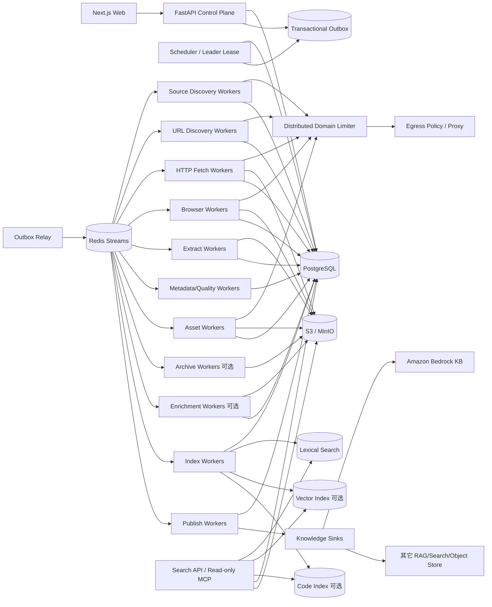

# 博客知识库技术方案

适用范围：从约 1000 个技术博客网站抓取尽可能完整的历史文章，清洗为稳定 Markdown 作为长期知识库；后续可持续增加站点，支持增量同步、版本保留、全文/向量/代码检索、Web 管理和外部知识库发布。设计按“数百万 URL、长期运行、多站点异构、可横向扩展”考虑。

## 1. 建设目标与边界

### 1.1 核心目标

1. 新增站点后能够完成历史回灌，并记录发现来源和覆盖证据，而不是只抓首页当前文章。
2. 将正文、标题、作者、发布时间、更新时间、标签、canonical、代码块、表格、图片和附件统一为可追溯的 Markdown 与结构化元数据。
3. 普通站点不编写独立爬虫；站点差异优先通过 Platform Profile、Site Override、Extraction Contract 解决，只有最后才写 Custom Adapter。
4. 支持 Feed/Sitemap/归档页/普通链接等多来源增量发现，支持 ETag、Last-Modified、lastmod 和内容 hash 驱动的低成本同步。
5. 支持断点续跑、幂等、失败重试、指数退避、暂停/恢复、durable cancel、规则回放、离线重抽取和版本回滚。
6. HTTP 原始响应、Browser rendered DOM、抽取候选、元数据候选、规范化结果、最终 Markdown、规则版本和质量结果均可追溯。
7. 提供 Web 管理端完成站点接入、规则管理、抓取进度、错误诊断、质量审核、Markdown 预览、版本 diff、重复组、资源监控、搜索评测和发布目标管理。
8. 搜索、Embedding、Reranker、主题分类、外部 RAG/知识库都是可重建派生层，故障不得迫使系统重新抓取源站。
9. Browser 只在 HTTP 无法满足需求时升级使用，并由独立 Browser Worker Pool 管理资源、代际轮换和隔离。
10. 任何抓取 transport 都必须统一经过 robots、访问政策、Egress/SSRF、安全预算和域级限流，不以绕过登录、验证码、付费墙或明确反爬为目标。
11. 所有状态变化都能够回答“尝试了什么、真正接受了什么、最终发布了什么”，不能把调用次数当成功数。
12. 站点、标签、订阅、Profile 等配置生命周期与已归档内容生命周期分离；停用配置默认不得隐式删除历史内容。

### 1.2 “全量历史”的定义

- **Live Full**：通过 Sitemap、Feed、平台归档、分页、标签/分类/作者页、站内链接和公开索引能发现，且当前仍可访问的文章。
- **Archive Full（可选）**：在合规前提下，通过 Common Crawl、Wayback 等补充当前站点已删除、迁移或站内不再暴露的 URL/历史快照证据。

每个站点必须分别统计：

- 发现 URL 数；
- 已准入 URL 数；
- 当前可访问数；
- 正文成功数；
- summary-only / metadata-only 数；
- 仅历史索引证据数；
- 各 Discovery Provider coverage；
- Sitemap/Feed/归档是否达到终点；
- 未覆盖区域及原因。

不能用单一“抓取完成率”代表历史完整度。

### 1.3 非目标

- 不绕过登录、验证码、付费墙和明确禁止的访问控制。
- 不默认所有页面使用 Browser。
- 不把 Redis、Crawl4AI cache、本地目录、搜索索引或向量库当业务真相源。
- 不把 GitHub 当海量文章主存储；GitHub 只保存方案、配置、规则和少量导出。
- 不在 Web 请求线程中执行长时间全站抓取。
- 不因搜索、Embedding、主题分类或外部知识库故障重新抓源站。
- 不因旧文章“过期”而删除 canonical 历史版本；生命周期管理只能改变存储层级或可见状态。
- 不因为停用站点、删除标签或取消订阅而隐式物理删除已经归档的文章。

## 2. 总体设计原则

1. **PostgreSQL 是业务状态真相源，S3/MinIO 是不可变大对象真相源。**
2. **发现与访问准入分离。** URL 被发现不等于允许自动抓取。
3. **Feed/Sitemap/HTTP/Browser 分层。** Browser 是升级路径，不是默认路径。
4. **抓取快照不可变。** 抽取器、规则、Metadata Normalizer、Resolver、Serializer 更新优先离线 replay，不重新请求源站。
5. **文章身份与 URL 分离。** redirect、canonical、镜像、迁移不能简单等同于新文章。
6. **版本追加优先。** article_version 不覆盖旧版本，当前版本只是指针。
7. **强去重与近似重复分离。** content hash 可确认强重复；MinHash/SimHash 只产生候选组，不直接物理删除。
8. **流程状态与内容完整度分离。** `done` 不代表一定有全文；必须单独表达 `full / summary_only / metadata_only`。
9. **published_at 与 observed_at 分离。** 不知道真实发布时间时宁可为空，不能用抓取时间伪装发布时间。
10. **全局并发、域级配额、Worker 本地资源保护三层协同。** 本地 dispatcher 只能收缩并发，不能突破全局和域级上限。
11. **控制面不执行重任务。** UI/API/Cron 只创建 durable job。
12. **所有跨 PG 与队列的写入通过 transactional outbox。**
13. **所有影响结果的组件都版本化。** Profile、Rule、Canonicalizer、Fetcher、Request Profile、Capture Profile、Extractor、Metadata Schema、Normalizer、Resolver、Quality Gate、Serializer、Chunker、Enrichment、Embedding、Reranker、Publish Adapter 均有 release id。
14. **LLM 只做候选或派生能力。** 不让 LLM 静默改写 canonical 正文或无证据地决定 canonical metadata。
15. **所有结构重写在 DOM/IR/AST 层完成。** 正则只做字段级清洗，不作为生产 HTML 主解析器。
16. **desired state 与 observed state 分离。** 搜索索引、S3 导出、Bedrock KB 等外部状态通过 reconciliation 最终收敛。
17. **阻塞 I/O 必须隔离。** async Worker 中禁止第三方同步网络 SDK 直接阻塞 event loop；同步库经 thread adapter，CPU 重任务经独立 Process/Worker。
18. **配置生命周期与内容生命周期分离。** disable/remove tracking 默认只改变未来同步行为，历史归档需独立显式删除流程。
19. **指标来自权威 outcome。** discovered、admitted、duplicate_rejected、inserted、captured、published 等必须是不同指标。
20. **数据库 schema 显式迁移。** 使用 migration 工具和 schema version，不允许业务代码靠运行时临时 ALTER 维持生产 schema。
21. **增量正确性依赖 Provider 连续性，而不是固定轮询。** 对 RSS/首页等滑动窗口来源必须持久化 checkpoint、水位与重叠窗口；检测断档后主动 reconciliation，不能假设下一轮轮询会补回来。

## 3. 总体架构



逻辑上分为：

- **控制面**：站点、Profile、规则、计划、预算、权限、任务、发布、回滚、schema/release 状态。
- **发现面**：Source Discovery、URL Discovery、Discovery Graph、Provider Checkpoint、覆盖证据和断档恢复。
- **采集面**：HTTP Fetch、Browser Capture、Archive Fetch。
- **抽取面**：正文抽取、Metadata Candidate、Normalizer、Resolver、Quality Gate、Article IR、Markdown Serializer。
- **协调面**：Outbox、Redis Streams、DB lease、Scheduler leader lease、域级限流、weighted fairness、backpressure。
- **资源保护面**：HTTP client generation、Browser generation、RSS/page/context 监控、event-loop lag、worker drain。
- **知识访问面**：全文、向量、代码索引、Hybrid Search、Rerank、只读 MCP。
- **知识增强面**：主题分类、实体、摘要等可重建 enrichment。
- **知识发布面**：S3/本地 Markdown/Bedrock/其它外部知识库 Adapter。

## 4. 推荐技术栈

| 层 | 推荐 | 说明 |
|---|---|---|
| API | Python + FastAPI | CRUD、控制面、任务创建、查询 |
| Web | React / Next.js | 站点、任务、规则、质量、搜索、发布管理 |
| Worker | Python asyncio | I/O 型发现、抓取、轻抽取；同步 SDK 必须隔离 |
| CPU Worker | Python Process Pool / 独立 Worker | DOM 重抽取、MinHash、大批量转换等 CPU 任务 |
| 状态库 | PostgreSQL | durable frontier、Provider checkpoint、任务、attempt、版本、规则、审计 |
| 数据库迁移 | Alembic | 显式 schema version、上线前迁移、迁移锁 |
| 队列 | Redis Streams | 短期分发、consumer group；不做真相源 |
| 大对象 | S3 / MinIO | response bytes、DOM、Markdown、附件、派生 artifact |
| HTTP | httpx/aiohttp 等 | 长生命周期连接池、条件请求、超时、重定向、压缩、字节预算 |
| Browser | Playwright + Crawl4AI Adapter | JS 页面、渲染 DOM、Markdown/结构化抽取 |
| HTML/正文 | DOM parser + Trafilatura/Readability/Crawl4AI Adapter | 多候选抽取 |
| 全文检索 | PostgreSQL FTS 起步，规模上升后 OpenSearch | 版本化增量索引 |
| 向量 | pgvector 或独立 Vector DB，可选 | canonical 发布后异步构建 |
| 观测 | OpenTelemetry + Prometheus + Grafana + Loki | trace/metric/log |
| 部署 | Docker + Kubernetes | worker 横向扩展、资源隔离、滚动升级 |

第三方抓取库均通过 Adapter 接入，不能直接控制业务状态机。

## 5. 核心数据模型

### 5.1 `site`

关键字段：

- `id`
- `name`
- `root_url`
- `canonical_host`
- `platform_type`
- `status`
- `robots_policy`
- `crawl_policy`
- `default_profile_release_id`
- `sync_policy_id`
- `created_at / updated_at`

`status=disabled` 默认只停止后续调度，不删除历史 article/version。

### 5.2 `site_profile_release`

保存可版本化站点配置：

- 允许/拒绝 URL pattern；
- Feed/Sitemap/Archive 入口；
- article selector / metadata selector；
- HTTP/Browser 策略；
- 域级并发和最小请求间隔；
- canonicalization 规则；
- JS-heavy、pagination、infinite-scroll 等能力标记；
- 质量阈值；
- 发布状态：draft/canary/published/rolled_back。

### 5.3 `url_record`

建议字段：

- `id, site_id`
- `url_raw`
- `url_normalized`
- `url_hash`
- `canonical_url_hint`
- `kind`：article/index/feed/sitemap/asset/unknown
- `admission_state`
- `crawl_state`
- `first_seen_at / last_seen_at`
- `last_fetch_at`
- `etag / last_modified`
- `http_status`
- `content_hash_last`
- `next_check_at`
- `deleted_confirmations`

唯一约束以 `(site_id, url_hash)` 为主，不把标题当唯一键。

### 5.4 `discovery_edge`

保存发现证据：

- `from_url_id`
- `to_url_id`
- `provider`：sitemap/feed/archive/link/commoncrawl/wayback/manual
- `run_id`
- `anchor_text`
- `discovered_at`

同一 URL 允许被多个 Provider 重复发现，证据不能覆盖。

### 5.5 `fetch_task`

字段至少包含：

- `id`
- `url_id`
- `transport_requested`
- `priority`
- `status`
- `attempt_count`
- `last_error_class`
- `next_attempt_at`
- `lease_owner`
- `lease_until`
- `cancel_requested_at`
- `created_at / updated_at`

Scheduler 只派发 `next_attempt_at <= now()` 且 lease 可领取的任务。

### 5.6 `fetch_attempt`

每次真实执行都追加一条不可变尝试记录：

- `attempt_id`
- `fetch_task_id`
- `url_id`
- `worker_id`
- `worker_generation_id`
- `transport`
- `started_at / finished_at`
- `duration_ms`
- `outcome`：success/retryable/blocked/permanent_failure/cancelled
- `status_code`
- `error_class`
- `bytes_received`
- `escalation_reason`
- `retry_decision`
- `next_attempt_at`
- `snapshot_id` 可空

`fetch_task` 保存当前调度状态，`fetch_attempt` 保存完整历史。Web、告警和错误统计优先基于 attempt，而不是只看任务最后状态。

### 5.7 `fetch_snapshot`

每次成功或有保留价值的真实响应生成不可变记录：

- `snapshot_id`
- `url_id`
- `attempt_id`
- `transport`：http/browser/archive
- `requested_at / responded_at`
- `status_code`
- `final_url`
- `redirect_chain`
- `request_headers_hash`
- `response_headers_hash`
- `body_object_key`
- `rendered_dom_object_key`
- `body_hash`
- `fetcher_release_id`
- `request_profile_release_id`
- `capture_profile_release_id`
- `robots_decision`
- `egress_decision`
- `transport_escalation_reason`
- `error_class`

### 5.8 `article` 与 `article_version`

`article` 是稳定逻辑实体：

- `article_id`
- `site_id`
- `canonical_url_id`
- `current_version_id`
- `duplicate_group_id`
- `status`

`article_version` 是不可变版本：

- `version_id`
- `article_id`
- `snapshot_id`
- `title_raw / title_normalized`
- `author_raw / author_normalized`
- `published_at / updated_at`
- `first_seen_at / captured_at`
- `content_hash`
- `content_completeness`：full/summary_only/metadata_only
- `content_quality_state`
- `article_ir_object_key`
- `markdown_object_key`
- `extractor_release_id`
- `normalizer_release_id`
- `resolver_release_id`
- `quality_gate_release_id`
- `serializer_release_id`
- `published_state`

### 5.9 `duplicate_group`

保存近似重复关系和证据，不物理删除来源：

- `group_id`
- `canonical_article_id`
- `match_type`：content_hash/minhash/simhash/manual
- `confidence`
- `created_at`

### 5.10 `enrichment_artifact`

主题、摘要、实体、Embedding 等派生结果独立保存：

- `artifact_id`
- `version_id`
- `kind`
- `enrichment_release_id`
- `input_projection_release_id`
- `model_or_rule_version`
- `confidence`
- `evidence_object_key`
- `payload_object_key`
- `created_at`

Enrichment 失败不影响 canonical article_version 发布。

### 5.11 `discovery_provider_state`

每个可持续增量发现的 Provider 实例保存独立状态，避免进程重启或滑动窗口导致无声漏抓：

- `provider_instance_id`
- `site_id`
- `provider_type`：feed/sitemap/archive/homepage/api/search 等
- `source_url`
- `cursor_or_guid`
- `watermark_time`
- `last_success_at`
- `last_item_observed_at`
- `overlap_window`
- `retention_hint`
- `continuity_state`：ok/gap_suspected/reconciling/blocked
- `checkpoint_version`
- `next_discovery_at`

Checkpoint 是 Provider 的业务状态，必须持久化在 PostgreSQL，不能只存在于进程内。

### 5.12 其它表

还应包含：

- `discovery_run`
- `extraction_run`
- `metadata_candidate`
- `asset`
- `job / job_stage`
- `scheduler_lease` 可选
- `outbox_event`
- `search_generation`
- `knowledge_sink / publish_bundle / publish_state`
- `audit_log`
- `quality_sample`

## 6. 站点接入与 Profile 体系

### 6.1 接入流程

1. 用户输入站点根 URL。
2. Source Discovery 检测 robots、Sitemap、Feed、平台指纹、归档入口和 canonical host。
3. 系统生成候选 Platform Profile。
4. 抽样 20~100 个 URL 做 discovery/fetch/extract dry-run。
5. Web 管理端展示 URL 命中、正文质量、metadata 完整度、Browser 升级率和异常样本。
6. 管理员发布 Profile release。
7. 创建 Full Backfill Job。

### 6.2 配置优先级

`Global Default -> Platform Profile -> Site Override -> Extraction Contract -> Custom Adapter`

站点规则必须可灰度发布和回滚。Profile 变化只触发必要阶段 replay，例如 selector 改动只重抽取已有 snapshot，不重新抓全部页面。

### 6.3 配置删除语义

- 禁用 Site：停止新 discovery/fetch，历史内容保留。
- 删除 Tag/Subscription：只删除关联关系，不删除 article。
- 删除 Profile：已被 version 引用的 release 不物理删除，只标 archived。
- 真正删除历史内容必须进入独立 Delete Job，要求权限、审计、影响预览和保留策略检查。

## 7. 历史全量 URL 发现

### 7.1 Provider 优先级

推荐按低成本高确定性顺序：

1. `robots.txt` 中声明的 Sitemap；
2. 常见 Sitemap/Sitemap Index；
3. RSS/Atom/JSON Feed；
4. 平台原生 API 或归档页；
5. 年/月/分类/标签/作者分页；
6. 站内链接 BFS/Best-first；
7. 公开搜索/索引补漏；
8. Common Crawl / Wayback 可选补历史证据。

每个 Provider 都只持续流式地产生 URL，不一次把全站 URL 装入内存。

### 7.2 Durable Frontier

URL 一进入系统就先 canonicalize，再以唯一键写入 PostgreSQL；只有首次插入或状态需要更新时才创建后续任务。Redis 中只放 task id。

需要支持：

- 超大 Sitemap 流式 XML 解析；
- Sitemap Index 递归预算；
- pagination/infinite-scroll 上限；
- redirect/canonical host 迁移；
- URL 参数 allow/deny 规则；
- 日期、标签等软无限空间保护；
- 每个 Provider 的 coverage 计数。

### 7.3 Provider 能力与历史覆盖完成条件

不能以“队列为空”作为唯一完成条件。每个 Provider 需要声明能力和终止语义，例如：

- `exhaustive`：可枚举到确定终点，如完整 Sitemap/归档分页；
- `windowed`：只暴露近期窗口，如首页新闻流、有限条目的 RSS；
- `best_effort`：公开搜索、普通链接等补漏来源。

Provider 运行状态记录 `exhausted / partial / blocked / error`。Full Backfill 只有所有必须的 **exhaustive Provider** 已达到可解释终点，才标记为完成；windowed Provider 只能作为近期发现证据，不能单独证明历史全量。

## 8. 增量同步

### 8.1 多来源增量

增量发现优先级：

1. Feed 新条目；
2. Sitemap `lastmod` 或新增 URL；
3. 首页/归档页 delta；
4. 已知文章低频条件请求；
5. 定期 reconciliation 防止漏抓。

Feed entry 自带的发布时间、更新时间、GUID、canonical/link 必须作为 metadata candidate 保存，不能把抓取时间直接写成发布时间。

每个增量 Discovery Provider 必须绑定 `discovery_provider_state`，不能把游标、最后一次成功时间或“上次看到了哪里”只保存在 Worker 内存。

### 8.2 条件请求

HTTP Worker 对已抓 URL 使用：

- `If-None-Match` / ETag；
- `If-Modified-Since` / Last-Modified；
- 304 时只更新观测状态，不产生新正文版本；
- 200 后先计算 response/content hash，再判断是否需要重新抽取。

### 8.3 自适应同步频率

不应让 1000 个站点统一固定每 5 分钟轮询。每站点维护变化率与最近发现延迟，动态计算 `next_discovery_at`：

- 高频更新站点缩短间隔；
- 长期无变化站点逐步拉长；
- 429/503/Retry-After 自动降频；
- 失败只影响该域，不阻塞其它站点。

调频不能替代连续性检查；即使正常频率很低，也必须知道某次停机是否跨过了 Provider 的可见窗口。

### 8.4 Provider Checkpoint、Overlap 与断档恢复

RSS、首页新闻流、部分 API 只暴露有限数量或有限时间范围的条目。对这类 windowed Provider，增量正确性依赖 checkpoint 与 gap detection：

1. 每次运行读取上一 `cursor_or_guid / watermark_time / last_success_at`；
2. 请求时保留有界 `overlap_window`，允许重复观察最近一段数据；
3. URL 仍由 Durable Frontier 幂等去重，所以 overlap 不会产生重复正文；
4. 本轮 discovery outcome、发现证据和新 checkpoint 必须可靠落库，再推进水位；
5. 若 `last_success_at` 距当前时间超过 `retention_hint`，或 watermark 异常跳跃/回退，标记 `gap_suspected`；
6. `gap_suspected` 自动创建 reconciliation job，扩大到 Sitemap、归档页、站内索引、平台 API、公开索引或 Archive Provider 补漏；
7. 补漏完成后记录 gap 区间、Provider 覆盖证据和恢复结果，不能静默把连续性恢复为 ok。

`retention_hint` 可以来自平台规则，也可以根据连续观测到的最老条目年龄动态估计，但必须保守；不知道窗口时宁可触发补漏，不应假定固定轮询天然无丢失。

### 8.5 删除确认

404/410 不立即删除知识：

- 第一次记录疑似删除；
- 后续跨时间窗口再次确认；
- 若 Sitemap/Feed 仍存在则延迟 tombstone；
- 确认后把 article 标记 tombstoned，保留最后可用版本和来源证据。

## 9. Fetch Strategy 与传输层

### 9.1 决策链

每个 URL 先得到 Fetch Plan：

`HTTP -> Browser -> Blocked/Manual`

Feed/Sitemap 属于发现来源，不应因为有 summary 就默认认为正文已经完整。

HTTP 适合：静态 HTML、服务端渲染页面、Feed/Sitemap、附件。Browser 只在以下证据成立时升级：

- HTTP 正文为空或明显不完整；
- 内容依赖客户端 JS；
- Platform Profile 明确标记 Browser required；
- selector 只在 rendered DOM 命中。

升级原因必须写入 attempt/snapshot。

### 9.2 不允许的自动升级

出现验证码、登录、付费墙、明确访问拒绝时标记 `blocked` 或 `manual_review`，不尝试无限变换指纹绕过。

### 9.3 Retry Matrix

不同错误类别使用不同策略：

| 错误 | 策略 |
|---|---|
| DNS/连接超时 | 指数退避 + 抖动 |
| 429 | 尊重 Retry-After，域级整体降速 |
| 5xx | 有上限重试 |
| 404/410 | 进入删除确认流程 |
| robots deny | 不重试，记录策略结果 |
| Browser crash | worker 资源自愈后重试 |
| selector miss | 不盲目 Browser 重试，进入抽取诊断 |
| challenge/login/paywall | blocked/manual |

任务必须保存 `next_attempt_at`；不能只在进程内 sleep 或只计算 delay 而不参与 Scheduler 查询条件。

### 9.4 HTTP Client Pool

HTTP Worker 维护长生命周期 client generation：

- keep-alive；
- per-host connection pool；
- connect/read/write/total timeout；
- DNS cache TTL；
- max redirects；
- compressed/decompressed bytes budget；
- response streaming；
- circuit breaker；
- generation age/tasks。

不要为每个 URL 新建完整 HTTP session；但 Cookie/Auth context 必须按站点和安全域隔离。

### 9.5 阻塞 I/O 隔离

- 网络调用默认 async；
- 同步 Feed/SDK 经 `asyncio.to_thread`/受控 thread pool；
- CPU 重 DOM 解析、MinHash、批量压缩进入 Process/独立 Worker；
- 监控 event-loop lag；
- thread pool queue 也必须有 backpressure，不能无限提交同步任务。

## 10. 调度、限流与资源保护

### 10.1 三层并发控制

1. **Global Scheduler**：控制系统总在途量和不同 job 的权重。
2. **Distributed Domain Limiter**：同一域所有 HTTP、Browser、Feed、Sitemap、Asset 请求共享 token bucket。
3. **Local Resource Dispatcher**：根据 worker RSS、CPU、page 数、event-loop lag 收缩本地并发。

### 10.2 跨域公平

Scheduler 按 domain/site 做 weighted fair queue，防止单个大站点占满队列。Full Backfill 优先级应低于日常增量，保证新文章不会被历史回灌淹没。

### 10.3 Browser Worker Pool

Browser 必须与普通 HTTP Worker 分离部署。每个 Browser Worker 维护 generation：

- `started_at`
- `tasks_processed`
- `pages_open`
- `contexts_open`
- `rss_bytes`
- `consecutive_crashes`

触发以下任一阈值时进入 draining：

- 达到最大任务数；
- RSS 超阈值；
- 存活时间超阈值；
- page/context 泄漏；
- 连续 Browser crash。

Draining 后不接新任务，等待在途任务完成，再重建 browser。容器/cgroup 提供最终内存和进程上限。

生产默认不使用 `--no-sandbox`，也不依赖 `--single-process` 作为资源治理手段。

### 10.4 Backpressure

当 Extract/Search/S3 等下游积压时，Fetch Scheduler 应降低新抓取速率，避免“抓得比处理得快”把对象存储、数据库和队列撑爆。

### 10.5 Scheduler HA 与单例周期任务

单机 PID lock 在多副本环境不能防止重复调度。生产 Scheduler 应采用以下之一：

- PostgreSQL advisory lock 作为 leader lease；
- `scheduler_lease` 行 + TTL/heartbeat；
- 或完全把周期任务变成可竞争领取的 durable job。

Leader 只负责生成任务，不把业务进度只保存在内存。Leader 崩溃后 lease 过期，另一副本自动接管。

对真正可并行的调度扫描，使用 `FOR UPDATE SKIP LOCKED`/lease 分片，避免全局单点。

## 11. Capture、抽取与 Markdown 生成

### 11.1 Capture First

HTTP response bytes 或 Browser rendered DOM 先写对象存储，再开始正文抽取。对象 key 使用 immutable id，例如：

`captures/{site_id}/{snapshot_id}/response.bin`

`captures/{site_id}/{snapshot_id}/rendered.html`

这样抽取规则变化时可 `re-extract without refetch`。

### 11.2 多候选抽取

正文与 metadata 采用候选制：

1. JSON-LD / OpenGraph / HTML meta；
2. 已发布 Platform/Site selector；
3. 平台专用 Adapter；
4. Trafilatura/Readability/Crawl4AI 等通用 Extractor；
5. 低置信度情况下进入人工/离线 LLM 诊断。

每个候选必须记录来源和 extractor release。

### 11.3 Metadata Normalizer 与 Resolver

Normalizer 只做字段规范化，例如：

- 时间格式与时区；
- 作者空白/大小写；
- 标签清洗；
- URL 规范化；
- Unicode normalization。

Resolver 只负责在候选之间选择 canonical 值，优先顺序默认：

`确定性结构化数据 -> 已发布 selector/contract -> 平台规则 -> 通用 extractor -> 低置信度 fallback`

不得丢弃 raw candidate。

### 11.4 Article IR

不要直接从 HTML 拼 Markdown。先生成中间结构：

- heading
- paragraph
- code_block(language)
- list
- blockquote
- table
- image(asset_ref, alt)
- link
- math
- separator

然后由版本化 Serializer 输出 Markdown。这样 Markdown 规则调整可离线重放。

### 11.5 Markdown 输出契约

建议 Front Matter：

```yaml
---
article_id: ...
version_id: ...
site_id: ...
source_url: ...
canonical_url: ...
title: ...
author: ...
published_at: ...
updated_at: ...
content_completeness: full
content_hash: ...
captured_at: ...
---
```

正文必须保证：

- 标题层级连续；
- fenced code block 保留语言；
- 表格合法；
- 图片转稳定 asset URL 或相对引用；
- 导航、cookie banner、推荐流等噪声不进入正文；
- Markdown 重新解析不报结构性错误。

### 11.6 原子发布与本地导出

S3/MinIO 使用 immutable object key；article_version 只有在对象写入成功后才能发布引用。

如果提供本地 Markdown Sink，必须：

```text
write temp -> fsync -> atomic rename -> update manifest
```

不能直接覆盖目标文件，避免进程崩溃留下半写 Markdown。友好文件名只用于导出，不作为 canonical identity。

## 12. 内容完整度与质量门禁

流程成功和内容质量分开表达。

`content_completeness`：

- `full`
- `summary_only`
- `metadata_only`

`content_quality_state`：

- `pass`
- `suspect`
- `fail`

质量门禁可检查：

- 正文字符数/段落数；
- 标题与正文相关性；
- 导航链接密度；
- 重复 boilerplate 比例；
- code block 是否异常丢失；
- metadata 完整度；
- challenge/login/paywall 特征；
- 与上一版本差异是否异常。

summary-only 可以进入知识库，但搜索与 RAG 必须显式降低权重，并在 UI 展示完整度。

## 13. 文章身份、去重与版本

### 13.1 URL 规范化

统一处理：

- scheme/host 大小写；
- `www` 与 canonical host；
- fragment；
- tracking 参数；
- trailing slash；
- redirect chain；
- `<link rel=canonical>` 仅作为证据，不无条件信任。

### 13.2 强去重

正文规范化后计算 `content_hash`。hash 相同可以确认同内容，但仍保留所有 URL/来源证据。

### 13.3 近似重复

大规模近似重复采用：

- SimHash 或 MinHash；
- LSH/分桶产生候选；
- 再计算正文相似度；
- 形成 `duplicate_group`。

标题 Jaccard 只可作为候选信号，不能作为自动删除依据；中文/多语言标题也不能依赖英文单词切分。

### 13.4 版本生成

只有当 canonical 正文或 canonical metadata 有有效变化时创建新 `article_version`。纯抓取时间变化、无意义广告变化、ETag 改变但正文 hash 未变，不产生正文新版本。

当前版本通过 `article.current_version_id` 指向；旧版本长期保留。

## 14. 搜索、知识访问与 Enrichment

### 14.1 Chunk

基于 Article IR/Markdown AST 分块，不按固定字符暴力切。代码块、表格、标题层级要保持语义边界。

### 14.2 Lexical Search

小规模可使用 PostgreSQL FTS；文章达到数百万、需要复杂分词和高 QPS 时迁移 OpenSearch。索引以 `article_version` 为输入做增量 upsert，不定期全量 `rebuild` 主索引。

需要全量重建时：

1. 创建新 `search_generation`；
2. 从 PG/S3 重放当前已发布版本；
3. 完成校验；
4. 原子切换 alias；
5. 延迟清理旧 generation。

搜索故障绝不能触发重新抓源站。

### 14.3 Vector / Code Search

Embedding、Contextual Embedding、Code Summary 全是可重建派生物。必须记录模型、prompt、chunker、projection 和 embedding release。派生失败不能影响 canonical Markdown 发布。

### 14.4 Search API / MCP

只读接口至少支持：

- 关键词搜索；
- site/tag/time 筛选；
- hybrid search；
- 获取 article/current version；
- 获取历史版本；
- 获取 provenance/source URL；
- 查看 content completeness。

### 14.5 Enrichment

主题分类、实体识别、摘要、技术栈标签优先采用可解释的确定性规则/轻模型，必要时再使用 LLM。

必须保存：

- `enrichment_release_id`
- rule/model version；
- input projection；
- confidence；
- matched evidence；
- output artifact。

Enrichment 可独立 replay，不允许覆盖 canonical 正文，也不允许失败阻断 Markdown 发布。

## 15. 外部知识库发布

定义 `Publish Bundle`，内容包含：

- article/version id；
- Markdown；
- metadata JSON；
- chunk 可选；
- asset manifest；
- content hash；
- delete/tombstone instruction。

Knowledge Sink Adapter 可实现：

- S3 导出；
- 本地 Markdown 目录；
- Amazon Bedrock Knowledge Bases；
- 其它向量库/RAG 系统。

每个 sink 保存 desired version 和 observed version，通过 reconciliation 对账。发布失败只重试 publish，不重新抓源站。

本地文件 Sink 和外部 KB 删除语义也必须与 canonical 内容删除分离；Sink 取消发布不等于删除历史文章。

## 16. Web 管理功能

### 16.1 站点管理

- 新增/禁用站点；
- 平台识别；
- robots/Sitemap/Feed 检测；
- Profile/Override 编辑、diff、灰度发布、回滚；
- 同步频率、域级并发、预算配置；
- 禁用操作影响预览，明确“停止同步但保留历史”。

### 16.2 历史回灌与增量

- Full Backfill Job；
- Incremental Sync Job；
- 当前阶段、队列深度、ETA 可选；
- Provider coverage 与 capability（exhaustive/windowed/best_effort）；
- Provider checkpoint、watermark、last_success_at、continuity_state；
- `gap_suspected` 区间、补漏任务与恢复结果；
- 发现/准入/抓取/抽取/发布成功率；
- 暂停、恢复、取消、重试。

### 16.3 内容质量

- Markdown 预览；
- 原 HTML/rendered DOM 对照；
- metadata candidate/Resolver 证据；
- 版本 diff；
- summary-only/metadata-only 列表；
- 低质量样本队列；
- 重复组审核。

### 16.4 资源与运行态

必须能查看：

- 每域请求速率、429/403；
- HTTP -> Browser 升级率及升级原因；
- HTTP client pool 使用率；
- Browser worker RSS；
- page/context 数；
- Browser generation age/tasks；
- worker event-loop lag；
- thread/process pool queue；
- 队列积压和 oldest task age；
- retry_wait 数量与最远 next_attempt_at；
- 对象存储和搜索索引容量。

### 16.5 搜索与发布

- 搜索评测集；
- lexical/vector/hybrid 对比；
- search generation 状态；
- Knowledge Sink desired/observed version；
- 失败 bundle 重放。

### 16.6 权限与审计

至少区分 viewer/operator/admin；站点规则发布、删除、Profile 回滚、手工重抓、Knowledge Sink 变更、Delete Job、schema migration 必须写 audit log。

## 17. 状态机、幂等与指标真相

### 17.1 URL/文章主状态

建议状态：

`discovered -> admitted -> fetch_queued -> fetching -> captured -> extracting -> quality_check -> published`

异常分支：

- `retry_wait`
- `blocked`
- `quality_failed`
- `manual_review`
- `tombstoned`

Discovery Provider 连续性独立表达为 `ok / gap_suspected / reconciling / blocked`，不要和单个 URL 的抓取状态混在一起。

### 17.2 Task Lease

Worker 领取任务时写 `lease_owner/lease_until`；执行完成使用 compare-and-set 更新。Worker 崩溃后 lease 过期，任务可被重新领取。

### 17.3 Idempotency Key

不同阶段建议：

- Discovery：`provider_instance_id + checkpoint_version + page/cursor`；
- Fetch：`url_id + fetch_policy_release + intended_revision`
- Extract：`snapshot_id + extractor_release`
- Serialize：`article_ir_hash + serializer_release`
- Enrichment：`version_id + enrichment_release + projection_release`
- Index：`version_id + search_generation`
- Publish：`version_id + sink_id + adapter_release`

系统追求 exactly-once effect，而不是假设消息只投递一次。

### 17.4 Attempt History

任务当前状态不能覆盖真实尝试历史。每次请求都落 `fetch_attempt`，可回答：

- 第几次尝试；
- 使用哪个 transport；
- 哪个 worker/generation；
- 为什么升级 Browser；
- 为什么重试；
- Retry-After/next_attempt_at 是什么；
- 是否真的产生 snapshot。

### 17.5 指标语义

必须区分：

- `discovered_total`
- `admitted_total`
- `duplicate_rejected_total`
- `task_created_total`
- `attempt_total`
- `snapshot_created_total`
- `extraction_pass_total`
- `version_published_total`
- `index_success_total`

业务代码的“函数被调用”不能直接计为“新增成功”。数据库 mutation 应返回明确 outcome，指标从 outcome/outbox event 构建。

## 18. 存储设计、Schema 与容量规划

### 18.1 PostgreSQL

PG 保存结构化状态和索引元数据，不保存大 HTML。大表按实际增长使用 hash/range partition，例如：

- `fetch_snapshot/fetch_attempt` 按时间 range；
- `url_record` 可按 `site_id` hash；
- `audit/event` 按月。

### 18.2 数据库迁移

使用 Alembic 等显式 migration：

1. Migration 在应用新版本前单独执行；
2. 使用 advisory lock 防并发迁移；
3. 应用启动只检查 schema version；
4. 采用 expand/contract 兼容滚动升级；
5. 大表变更使用在线迁移策略；
6. 迁移状态、版本和失败原因可在 Web/监控中查看。

禁止多个业务副本各自通过 `try SELECT -> ALTER TABLE` 动态演进生产 schema。

### 18.3 对象存储

对象类型：

- raw response；
- rendered DOM；
- normalized HTML 可选；
- Article IR；
- Markdown；
- asset；
- publish bundle；
- enrichment artifact。

对象 key 必须由稳定 ID 构成，不由标题构成。

### 18.4 容量公式

不要先拍固定容量，应按实际样本计算：

`Raw Storage ≈ article_count × avg_compressed_capture_size × retained_versions`

`Markdown Storage ≈ article_count × avg_markdown_size × retained_versions`

在正式导入前先选 20~50 个代表站点跑样本，测 p50/p95 HTML、Markdown、asset 和版本变化率，再决定 S3 lifecycle 与数据库磁盘。

## 19. 可观测性与告警

### 19.1 关键指标

- URL discovery/admission rate；
- Provider coverage；
- Provider checkpoint age / watermark lag；
- `gap_suspected` 数量、持续时间和 reconciliation 成功率；
- fetch attempt/success/error by class；
- retry decision 与 retry_wait age；
- 304 ratio；
- content change ratio；
- HTTP -> Browser escalation ratio/reason；
- HTTP pool connection saturation；
- Browser RSS/page/context/generation age；
- event-loop lag；
- thread/process pool queue age；
- extraction pass/suspect/fail；
- summary-only ratio；
- duplicate candidate/group ratio；
- per-domain 429/403；
- queue lag；
- object storage write latency；
- index lag；
- enrichment lag；
- publish reconciliation lag。

### 19.2 漂移检测

按 Platform Profile/Selector/Metadata source 统计命中率。一组使用同一平台规则的站点同时下降时，应产生一次“平台模板漂移”告警，而不是 100 个互不关联的站点故障。

Provider 还要做连续性漂移检测：最老条目年龄突然缩短、GUID/时间水位异常跳跃、Feed 长时间为空、分页游标失效，都应触发 `gap_suspected` 或 Provider drift，而不是仅记录“本轮 0 条”。

### 19.3 Trace

每个 URL 至少贯穿：

`discovery_run -> discovery_provider_state/checkpoint -> fetch_task -> fetch_attempt -> snapshot -> extraction_run -> article_version -> enrichment/index/publish`

便于从最终 Markdown 追溯到原始抓取和规则 release。

## 20. 安全、合规与内容隔离

1. robots 与站点抓取政策在所有 transport 前统一执行。
2. 默认拒绝内网、link-local、metadata service、file/data/javascript 等危险 scheme。
3. 每个 redirect hop 重新做 Egress/SSRF 校验。
4. 设置 response bytes、解压后 bytes、redirect、Sitemap 深度、XML elements、URL 数、Browser 子请求、页面时长硬预算。
5. Browser 使用独立容器、非 root、sandbox、只读文件系统和受控下载目录。
6. Markdown/HTML 预览在隔离 origin 展示，禁止原页面脚本执行。
7. 日志不记录 Cookie、Authorization、完整密钥和敏感 query 参数。
8. 第三方内容的版权、许可和再分发策略由站点政策记录；外部发布前再次检查 sink policy。
9. 不把反爬挑战视为必须绕过的问题；无法合规抓取时进入 blocked/manual 状态。
10. LLM 输入必须做长度预算、敏感信息处理并记录 projection release。
11. 长生命周期 HTTP client 不跨安全边界复用 Cookie/Auth 状态。

## 21. 故障恢复与 Reconciliation

### 21.1 Worker 崩溃

依靠 lease 过期重新领取，不依赖进程内状态恢复。未完成 attempt 标记超时/worker_lost，并保留历史。

### 21.2 Browser 泄漏或崩溃

Worker 进入 draining，当前任务失败归类为 `browser_crash`，按策略重试；新 generation 替换旧进程。容器 OOM 由编排系统拉起新 pod。

### 21.3 Redis 故障

PG 仍是任务真相源；Outbox Relay 恢复后重新投递未确认事件。需要定期扫描“PG 可执行但队列缺失”的任务做 reconciliation。

### 21.4 Scheduler Leader 崩溃

Leader lease 到期后新副本接管。由于任务、游标和 next_run 均在 PG，接管不依赖旧进程内存。

### 21.5 Discovery Provider 断档

如果 Provider 的 `last_success_at` 跨过 `retention_hint`，或 watermark/GUID 连续性异常：

1. 标记 `gap_suspected` 并保留疑似缺口起止时间；
2. 不把下一轮成功轮询当作自动恢复；
3. 创建 reconciliation job，调用更宽的 Sitemap/Archive/API/索引来源补漏；
4. 对补回 URL 记录原始缺口与恢复 Provider；
5. 只有补漏达到可解释终点后才把连续性状态恢复为 `ok`。

### 21.6 搜索/向量库故障

Canonical 发布继续；Index Worker 记录 lag，恢复后从 article_version 重放。

### 21.7 Enrichment 故障

只重试 enrichment，不重新抓取/抽取 canonical 内容。

### 21.8 外部知识库故障

只重试 Publish Bundle。desired/observed version 不一致会被 reconciliation 自动发现。

### 21.9 规则发布错误

Profile/Extractor/Normalizer/Serializer 均可回滚 release；已有 snapshot 支持离线重抽取，不必全量重抓。

## 22. 部署拓扑

建议 Kubernetes 中拆成独立 deployment：

- `api`
- `web`
- `scheduler`
- `outbox-relay`
- `source-discovery-worker`
- `url-discovery-worker`
- `http-fetch-worker`
- `browser-worker`
- `extract-worker`
- `metadata-quality-worker`
- `asset-worker`
- `enrichment-worker`
- `index-worker`
- `publish-worker`

数据库 migration 使用独立 Job/CI step，不由每个应用副本启动时自行执行。

Browser Worker 使用独立 node pool 或更严格资源 limit。HTTP/Extract Worker 可以高并发；Browser Worker 并发较低但横向扩容。不同队列分别设置 HPA 指标，不能只看 CPU。

Scheduler 可多副本部署，但通过 leader lease 或可竞争 durable jobs 保证周期调度不会重复执行。

## 23. 端到端流程

### 23.1 新站 Full Backfill

```text
Create Site
  -> Source Discovery
  -> Profile Candidate
  -> Sample Dry Run
  -> Publish Profile
  -> Discovery Providers fan-out
  -> Durable URL Frontier
  -> Admission/Egress/Robots
  -> Fetch Plan
  -> HTTP or Browser Attempt
  -> Immutable Snapshot
  -> Extract Candidates
  -> Metadata Normalize/Resolve
  -> Article IR
  -> Quality Gate
  -> Markdown Serialize
  -> Article Version Publish
  -> Enrichment / Index / Knowledge Sink async
```

### 23.2 日常增量

```text
Scheduler
  -> load Provider checkpoint/watermark
  -> Feed/Sitemap/Archive/Homepage delta with overlap
  -> persist discovery outcome + advance checkpoint
  -> continuity check
       -> gap_suspected: reconciliation/backfill
       -> ok: continue
  -> new/changed URL
  -> conditional fetch
  -> 304: update observation only
  -> changed 200: new snapshot
  -> extract + quality
  -> content unchanged: no new article version
  -> content changed: publish new version
  -> async enrichment/index/publish
```

### 23.3 规则升级重放

```text
Publish Extractor/Profile Release
  -> select affected snapshots
  -> re-extract without refetch
  -> quality compare
  -> canary
  -> publish new article versions if materially changed
```

### 23.4 重试执行

```text
Fetch Attempt fails
  -> classify error
  -> append fetch_attempt
  -> calculate next_attempt_at
  -> task enters retry_wait
  -> Scheduler only requeues when next_attempt_at <= now
```

## 24. 分阶段落地

### 阶段 A：MVP（先验证 20~50 个代表站点）

必须完成：

- site/profile；
- Sitemap/Feed/Archive/Link discovery；
- PostgreSQL durable frontier；
- `discovery_provider_state` + checkpoint/watermark/overlap；
- fetch_task + fetch_attempt + lease；
- HTTP + Browser 分层；
- async I/O 规范与同步 SDK 隔离；
- 长生命周期 HTTP pool；
- S3 immutable snapshot；
- 基础正文抽取与 Markdown；
- article/version；
- Alembic migration；
- Web 站点/任务/错误/预览；
- 条件请求和增量同步；
- 基础全文搜索。

### 阶段 B：扩到 300~1000 站点

增加：

- distributed domain limiter；
- weighted fair scheduler；
- Scheduler HA/leader lease；
- Provider gap detection + 自动 reconciliation；
- Browser generation/resource guard；
- Platform Profile 批量治理；
- drift detection；
- MinHash/SimHash duplicate group；
- Search Generation；
- Enrichment release；
- Publish Sink；
- 完整可观测和成本指标。

### 阶段 C：知识增强

增加：

- Hybrid Search；
- Embedding/Rerank；
- Code Search；
- contextualization；
- MCP；
- 搜索评测和质量回归。

## 25. 验收标准

### 25.1 历史回灌

- 可解释每个站点使用了哪些 Discovery Provider；
- Provider capability 与是否到达终点可查询；
- windowed Provider 不会被误当作历史全量证明；
- 中途 kill 任意 worker，任务能从 lease/outbox 恢复；
- 不能因进程重启丢 URL frontier；
- 禁用站点不会隐式删除已归档文章。

### 25.2 增量同步

- 新 Feed/Sitemap URL 能进入增量队列；
- Provider checkpoint/watermark 在重启后可继续；
- overlap 重复观察不会重复创建 canonical 文章；
- 模拟停机超过 windowed Provider 保留窗口后会产生 `gap_suspected`，并自动创建补漏任务；
- 补漏未完成前连续性状态不会静默恢复为 ok；
- Feed 发布时间与 first_seen_at 分离；
- 支持 ETag/Last-Modified/304；
- 规则变化可 re-extract without refetch；
- 内容未变不生成无意义新版本；
- 404/410 经过确认后 tombstone，历史版本仍可访问。

### 25.3 Retry 与运行可靠性

- retry_wait 任务未到 `next_attempt_at` 不会被重新领取；
- 每次尝试都有 fetch_attempt；
- Browser 泄漏触发 draining/recycle，不直接随机杀在途任务；
- 同步第三方 SDK 不阻塞主 event loop；
- Scheduler leader 故障可自动接管；
- HTTP client pool 可观测连接饱和、超时和代际状态。

### 25.4 Markdown 与元数据

- 标题、正文、代码块、表格、图片结构稳定；
- 原始与规范化 metadata 均可追溯；
- published_at、observed_at 不混用；
- summary-only 不会被标成完整正文；
- Serializer 升级可离线重放；
- 本地文件导出 crash 后不会留下半写目标文件。

### 25.5 规模与资源

- 单个大站点不能占满全局 worker；
- HTTP 与 Browser 共享域限流；
- Browser RSS/page 泄漏可触发 draining/recycle；
- Browser worker 崩溃不影响 HTTP worker；
- 下游索引变慢会产生 backpressure，而不是无限积压；
- event-loop lag 超阈值会收缩本地并发。

### 25.6 数据、Schema 与指标

- 应用启动不会自行临时 ALTER 生产 schema；
- migration 可审计、可锁定、支持滚动兼容；
- discovered/admitted/inserted/published 指标可互相对账；
- Provider checkpoint age 与 gap 事件可审计；
- 近似去重不会物理删除 provenance；
- 删除标签/订阅/Profile 不会连带删除 canonical 内容。

### 25.7 Web 管理

- 能新增站点、发布/回滚 Profile；
- 能查看 Full Backfill/Incremental 进度；
- 能查看 Provider capability/checkpoint/watermark/gap_suspected；
- 能按错误类别筛选 attempt 并重试；
- 能预览 Markdown、DOM、版本 diff、metadata provenance；
- 能查看重复组、summary-only、Browser 资源、域级 429/403；
- 能查看 HTTP->Browser 升级原因、event-loop lag、retry_wait age；
- 所有高风险操作有审计记录。

## 26. 最终推荐

核心组合建议采用：

**FastAPI + Next.js + PostgreSQL + Alembic + Redis Streams + S3/MinIO + asyncio HTTP Workers（长生命周期连接池）+ 独立 Playwright/Crawl4AI Browser Worker Pool + DOM/Article IR 抽取层 + 版本化 Markdown Serializer + PostgreSQL/OpenSearch Search Plane。**

对于 1000 个博客站点，最重要的不是选择一个“更强的爬虫库”，而是把站点发现、Provider checkpoint/断档恢复、durable frontier、attempt 历史、抓取策略、HTTP/Browser 资源治理、不可变快照、抽取版本、身份/去重、增量状态机、schema 迁移、质量、派生 enrichment、索引、发布和 Web 运维拆开。

这样后续无论增加网站、替换 Crawl4AI、替换 HTTP 库、增加新的 Parser、迁移搜索后端、修改分类规则或接入外部知识库，都可以在已有不可变数据和 durable state 上重放与演进，而不重做整条链路，也不会丢失历史抓取、Provider 连续性、失败尝试和版本证据。