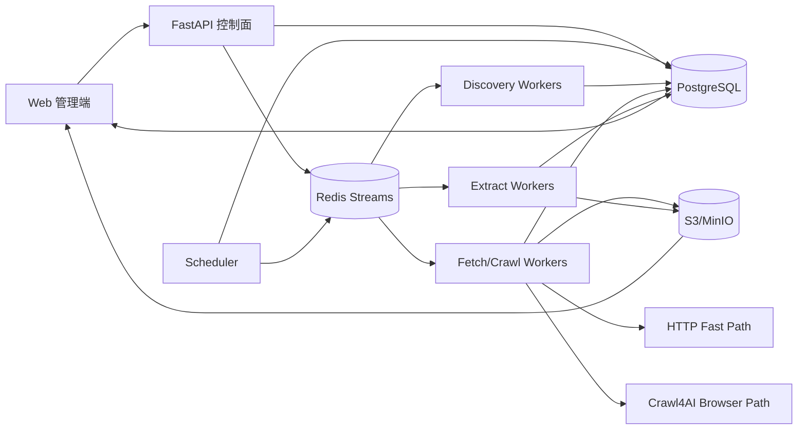

# 博客知识库技术方案

版本：v1.0  
日期：2026-08-14  
适用范围：约 1000 个技术博客站点的全量历史采集、Markdown 清洗、增量同步、可扩展接入与 Web 管理。

## 1. 目标与边界

### 1.1 核心目标

1. 首次接入时尽可能完整地抓取站点历史文章，而不是只抓首页最近文章。
2. 将正文、标题、作者、发布时间、更新时间、标签、原始 URL 等统一清洗为稳定 Markdown。
3. 1000 个站点可以长期运行，并支持继续增加站点；新增站点以“配置优先、代码适配器兜底”的方式接入。
4. 支持增量同步，只处理新增或确实发生变化的文章，避免每天重复全站抓取。
5. 支持失败重试、限流、断点续跑、去重、版本保留、可观测性和人工干预。
6. 提供 Web 管理端完成站点配置、任务触发、运行状态、失败诊断、文章预览和重新抽取。

### 1.2 非目标

- 不绕过登录、付费墙、验证码或明确的访问限制。
- 不默认对所有站点使用浏览器渲染；静态 HTTP 能完成时优先走低成本快路径。
- 知识库的向量检索/RAG 不作为第一阶段强依赖，但数据模型预留索引状态与分块字段。

## 2. 本轮调研结论

本版方案基于《Handling 100+ Website Scrapers with Python's asyncio》的生产实践，并结合 Crawl4AI 当前的多 URL 调度、URL Seeder、Domain Mapping 和 Markdown 生成能力进行工程化扩展。

文章中的有效原则：

- 使用 `asyncio`/`AsyncWebCrawler`，避免同步请求串行等待。
- 一个长生命周期 crawler 处理多个站点，避免反复启动浏览器。
- 抽取规则声明化（CSS schema），站点差异放到配置而不是主流程代码。
- 单站失败必须隔离，不能拖垮整个批次。
- 对相对 URL、特殊 JavaScript URL 做规范化。
- 抓取任务既可手动触发，也可由 API / 定时任务触发。
- 数据写入端需要去重、时间戳和归档。

但文章“站点级完全串行 + 每次 `CacheMode.BYPASS`”只适合 100+ 站点的每日小批量采集，不能直接扩展到 1000 站点全量历史抓取。方案因此改为：**跨域受控并发、域内严格限流、资源自适应、增量优先、浏览器按需使用**。

## 3. 总体架构



系统分为两层：

- **控制面**：站点、规则、计划、任务、运行状态、人工操作。
- **数据面**：URL 发现、下载、浏览器渲染、正文抽取、Markdown 生成、去重与存储。

解耦后，未来增加站点、增加 worker 或替换抓取引擎，不需要重写 Web 管理和任务状态模型。

## 4. 技术栈建议

| 层 | 推荐 | 原因 |
|---|---|---|
| API / 管理后端 | Python + FastAPI | 与抓取侧同语言，异步友好，易生成 OpenAPI |
| Web | React / Next.js | 适合后台管理、任务日志、预览与差异展示 |
| 元数据/状态 | PostgreSQL | 事务、唯一约束、查询能力强，适合作为真实状态源 |
| 任务队列 | Redis Streams + Consumer Group | 轻量、可靠消费、支持水平扩容和任务回收 |
| 抓取 | httpx/aiohttp + Crawl4AI | HTTP 快路径降低资源；动态页面再升级浏览器 |
| Markdown | Crawl4AI `DefaultMarkdownGenerator` + 自定义规则 | 保留结构并可做正文过滤 |
| 对象存储 | S3 / MinIO | 适合大量 raw HTML、Markdown、附件、版本文件 |
| 监控 | Prometheus + Grafana + OpenTelemetry | 任务吞吐、失败率、延迟、资源与站点健康度 |
| 部署 | Docker Compose 起步，Kubernetes 可选 | 1000 站点不必一开始引入 K8s，但组件天然可横向扩展 |

不建议把几十万篇 Markdown 直接逐篇提交到 GitHub 作为主存储。GitHub 可以作为方案文档、配置或周期性导出目标；大规模文章文件以 S3/MinIO 或普通文件仓库为主更合适。

## 5. 站点模型与可扩展配置

### 5.1 Site 配置

每个站点至少保存：

```yaml
site_id: devto
name: DEV Community
base_url: https://dev.to
enabled: true
crawl_mode: auto
schedule: "0 */6 * * *"
robots_policy: respect
user_agent_profile: default
per_domain_concurrency: 1
min_delay_ms: 1000
max_delay_ms: 3000
request_timeout_s: 30
incremental_lookback_days: 7

discovery:
  strategies:
    - rss
    - sitemap
    - url_seeder
    - archive_pages
  include_patterns:
    - "/*/**"
  exclude_patterns:
    - "/tags/**"
    - "/search**"

fetch:
  prefer_http: true
  browser_fallback: true
  wait_for: null

extract:
  strategy: auto
  article_selector: null
  remove_selectors:
    - nav
    - footer
    - .sidebar

identity:
  canonical_from_html: true
  query_whitelist: []
```

### 5.2 配置优先、插件兜底

站点接入分 3 个等级：

1. **零代码通用模式**：RSS/Sitemap + 自动正文抽取。
2. **声明式模式**：增加 CSS/XPath/等待条件/分页规则。
3. **Adapter 插件模式**：确实存在复杂 URL 生成、JS 跳转、特殊 API 时，实现 `SiteAdapter`。

建议接口：

```python
class SiteAdapter(Protocol):
    async def discover(self, ctx) -> AsyncIterator[DiscoveredUrl]: ...
    async def prepare_request(self, url, ctx) -> FetchRequest: ...
    async def extract(self, result, ctx) -> ArticleDocument: ...
    def canonicalize(self, url, html) -> str: ...
```

这样特殊站点逻辑不会污染公共 crawler。

## 6. 全量历史 URL 发现

“全量历史”最大的难点不是下载，而是**发现所有文章 URL**。必须多策略合并，不能只依赖首页爬深度。

### 6.1 发现优先级

第一层：站点自身结构化入口

- RSS / Atom / JSON Feed
- `sitemap.xml` / sitemap index
- `robots.txt` 中声明的 Sitemap
- 分类页、标签页、年份归档、分页列表
- 官方 API（若公开且允许使用）

第二层：Crawl4AI URL Seeder

- `AsyncUrlSeeder` 适合先发现大量 URL 后再批量抓取。
- 对历史博客优先使用 `sitemap+cc`，将 Sitemap 与 Common Crawl URL 合并。
- Seeder 自身有缓存、TTL 和有界队列，适合大 URL 集处理。

第三层：Domain Mapping / 历史补全

- 对站点结构复杂或 Sitemap 不完整时，使用 DomainMapper 的 sitemap、Common Crawl、Wayback、feed、homepage 等来源做补全。
- 注意只保留目标博客主机/允许的子域与文章路径，不能因为 DomainMapper 能发现 staging/admin 等地址就全部抓取。

第四层：受限深爬

- 最后才使用 BFS/DFS 深爬补漏。
- 必须设置同域、路径白名单、最大深度、最大 URL 数和静态资源过滤。

### 6.2 URL Frontier

所有来源发现的 URL 统一进入 `url_frontier`，而不是立即直接下载。

关键字段：

- `site_id`
- `normalized_url`
- `original_url`
- `discovery_source`
- `discovered_at`
- `sitemap_lastmod`
- `priority`
- `crawl_state`
- `next_fetch_at`
- `last_fetch_at`
- `etag`
- `last_modified`
- `content_hash`

数据库对 `(site_id, normalized_url)` 建唯一约束，从根源防止 Sitemap、RSS、Common Crawl 重复产生任务。

## 7. 调度与并发模型

### 7.1 为什么不能照搬“100 个站点完全串行”

原文用站点串行避免封禁和内存爆炸，这个原则对于单机小规模正确；但在 1000 站点、历史回灌场景，完全串行吞吐不足。

最终策略：

- **全局并发有上限**：例如每个 worker 8~20 个 crawl slot。
- **同域并发更严格**：默认 1，确认站点承受能力后最多 2~4。
- **同域随机延迟**：默认 1~3 秒，可站点覆盖。
- **429/503 指数退避 + jitter**。
- **内存自适应**：浏览器抓取使用 Crawl4AI `MemoryAdaptiveDispatcher` 或等价内存阈值控制。
- **跨域并发**：不同站点可以同时抓，避免一个慢站点阻塞 999 个站点。

概念上是：

```text
global semaphore
  ├── domain A token bucket -> concurrency 1
  ├── domain B token bucket -> concurrency 2
  └── domain C token bucket -> concurrency 1
```

任务分发时以 `domain` 为限流键，而不是简单 `asyncio.gather(全部URL)`。

### 7.2 队列划分

建议至少 5 类任务：

- `discover_full`
- `discover_incremental`
- `fetch_article`
- `extract_article`
- `retry_deadletter`

优先级：增量新文章 > 人工重试 > 正常历史回灌 > 低价值补漏。

这样首次全量跑数时，系统仍能及时同步新文章，不会被历史 backlog 饿死。

## 8. Fetch：HTTP 快路径 + 浏览器升级

### 8.1 HTTP 快路径

对绝大部分技术博客文章，优先 `httpx.AsyncClient`：

- 连接池复用
- HTTP/2 可选
- 压缩
- 超时
- 重定向
- ETag / If-None-Match
- Last-Modified / If-Modified-Since

返回 304 时直接标记“未变化”，不进入后续抽取。

### 8.2 浏览器路径

只有以下情况升级 Crawl4AI/Playwright：

- 初始 HTML 没有正文且页面依赖 JS 渲染
- 需要滚动/点击分页才能加载正文
- 站点返回 CSR shell
- 需要等待某个 DOM selector

浏览器实例/上下文必须池化；不能“一个 URL 启一个浏览器”。原文 100 个并发浏览器导致 8GB+ 内存的现象说明浏览器进程是最昂贵资源之一。

### 8.3 缓存模式

原文为了每日最新数据使用 `CacheMode.BYPASS`。在本项目中：

- 首次强制回灌：可 BYPASS。
- 日常增量：优先 HTTP Validator、缓存和 Sitemap `lastmod`。
- 人工“强制刷新”：才使用 BYPASS。

否则 1000 站点每天全量 BYPASS 会产生大量无效带宽和目标站压力。

## 9. 正文抽取与 Markdown 规范

### 9.1 抽取链

建议分层而不是依赖单一算法：

1. 站点精确 selector（若配置）。
2. `article` / `main` / JSON-LD Article 等语义结构。
3. Crawl4AI 默认 Markdown 生成。
4. `PruningContentFilter` 过滤导航、侧栏、推荐、页脚等噪声。
5. 特殊站点 Adapter。

不建议知识库主文件默认使用 LLM 抽取：成本高、不可完全复现、可能改写原意。LLM 可以作为抽取失败后的离线辅助或质量检测。

### 9.2 Markdown 文件规范

每篇文章写 YAML Front Matter：

```markdown
---
site_id: example
canonical_url: https://example.com/posts/123
source_url: https://example.com/posts/123?utm_source=x
title: Example
published_at: 2024-05-01T10:00:00Z
updated_at: 2024-05-02T10:00:00Z
fetched_at: 2026-08-14T09:00:00Z
author: Alice
tags: [python, crawler]
content_hash: sha256:...
version: 2
---

# Example

正文……
```

正文规范：

- 只保留一个一级标题。
- 保留代码块语言标记。
- 图片 URL 转绝对地址；需要长期保存时下载到对象存储并改写链接。
- 去除脚本、样式、导航、评论区、相关推荐、Cookie 提示。
- 保留原文内链接，统一绝对 URL。
- 编码统一 UTF-8，换行统一 LF。

## 10. URL 归一化、文章身份与去重

### 10.1 URL 归一化

步骤：

1. 解析相对 URL 为绝对 URL。
2. host 小写、移除默认端口。
3. 去 fragment。
4. 处理尾斜杠规则。
5. 删除明确跟踪参数：`utm_*`、`fbclid` 等。
6. 保留会影响内容的 query 参数，按站点白名单配置。
7. 优先使用页面 `<link rel="canonical">`，但必须校验仍在允许域。

### 10.2 去重键

主键不要只用标题。建议：

```text
article_key = sha256(site_id + canonical_url)
```

同时维护：

- `body_text_hash`：正文归一化后的内容哈希
- `simhash/minhash`：可选，用于检测不同 URL 的镜像/重复文章

同 URL 内容 hash 不变：不创建新版本。  
同 URL 内容 hash 变化：创建版本记录并更新 latest。  
不同 URL 高相似：标记 duplicate_candidate，人工或规则合并。

## 11. 增量同步机制

增量不是“把全站再抓一遍然后去重”，而是从发现阶段就减少工作量。

### 11.1 增量信号优先级

1. RSS/Atom 新 entry id / pubDate。
2. Sitemap 新 URL / `lastmod` 变化。
3. 列表页前 N 页 + watermark。
4. ETag / Last-Modified 条件请求。
5. 内容 hash。
6. 定期低频全站 reconciliation 补漏。

### 11.2 Watermark

每个 discovery strategy 保存自己的 checkpoint：

- 最近 RSS GUID / published_at
- 最近 sitemap lastmod
- 最后一页分页 cursor
- 最近成功扫描时间

同时保留 3~14 天 lookback，避免站点延迟更新发布时间或排序变化导致漏抓。

### 11.3 删除与下线

文章删除不能直接从知识库物理删除：

- 连续多次 404/410 后标记 `source_deleted_at`。
- Markdown/历史版本保留，便于知识库可追溯。
- Web 端可配置是否从“当前知识库视图”隐藏。

## 12. 数据模型

核心表：

### `sites`

站点配置、状态、调度、限流参数。

### `discovery_checkpoints`

每站点每发现策略的 watermark/cursor。

### `url_frontier`

所有候选 URL 和抓取状态。

### `crawl_jobs`

一次全量/增量/人工任务的总体记录。

### `crawl_tasks`

单 URL 任务、重试次数、错误类型、耗时、HTTP 状态。

### `articles`

文章逻辑身份、canonical URL、最新版本、发布时间。

### `article_versions`

每次正文变化版本，记录 content hash、对象存储 key、抽取器版本。

### `site_rule_versions`

站点抽取规则版本。规则变化后可以只“重新抽取”已保存 raw HTML，而不是重新联网下载。

这是非常重要的成本优化：**Fetch 与 Extract 必须解耦**。

## 13. 存储布局

对象存储建议：

```text
kb/
  raw/{site_id}/{yyyy}/{mm}/{article_key}/{fetch_id}.html.gz
  md/{site_id}/{yyyy}/{mm}/{article_key}/v{n}.md
  assets/{site_id}/{article_key}/...
```

PostgreSQL 保存索引和状态，不存大段 HTML。  
S3/MinIO 开启版本控制/生命周期策略：raw HTML 可按需要保留 30~180 天或长期归档；Markdown 和元数据长期保留。

## 14. Web 管理功能

第一版至少包括：

### 站点管理

- 新增/编辑/启停站点
- 测试 Sitemap/RSS 发现
- 自动探测抓取模式
- 编辑 include/exclude、CSS selector、浏览器等待条件
- robots.txt/限流配置展示

### 任务管理

- 立即全量同步
- 立即增量同步
- 暂停/恢复
- 单站/单文章重试
- 重新抽取但不重新抓取
- 历史任务进度、吞吐、ETA 不作为业务承诺，仅展示系统测量值

### 错误诊断

- HTTP 4xx/5xx
- DNS/超时/TLS
- robots 拒绝
- 浏览器崩溃
- selector 失效
- 正文过短/空文档
- 重试次数和最后错误

### 内容管理

- 原始 HTML 与清洗 Markdown 对照预览
- Front Matter 展示
- 版本 diff
- canonical/重复候选处理
- 手工重新抓取/重抽取

## 15. 质量控制

自动质量门槛：

- 标题为空 -> 失败/待人工
- 正文字数小于阈值 -> suspect
- 主体 link density 过高 -> suspect
- Markdown 与上次版本差异 > 80% 且站点模板同时变化 -> 可能 selector 失效
- 多篇文章正文 hash 相同 -> 可能抓到统一登录页/风控页/SPA shell
- HTTP 200 但内容是 404/Access Denied -> soft error

可以保存每站点 3~5 个 golden URL，规则修改时做回归测试。

## 16. 失败处理与幂等

### 16.1 错误分类

- 可重试：超时、连接断开、429、502/503/504、浏览器临时崩溃。
- 条件重试：403、401、soft block，需要降速或人工检查。
- 不重试：410、确定 404、robots 禁止、非法 URL。

### 16.2 幂等

每个任务使用：

```text
idempotency_key = job_type + site_id + normalized_url + desired_version
```

数据库写入依赖唯一约束 + upsert，避免 worker 重投造成重复文章。

### 16.3 Dead Letter

超过最大重试的任务进入 dead-letter，Web 管理端可批量重放。

## 17. 安全与合规

- 默认遵守 robots.txt，并允许站点级显式政策配置。
- 明确 User-Agent 与联系信息。
- 不绕过身份验证、验证码、付费墙。
- SSRF 防护：解析后拒绝 localhost、RFC1918、link-local、metadata IP 等内部地址。
- 重定向后再次做域名/IP 安全校验。
- 浏览器网络请求限制到允许域；关闭不必要下载。
- 密钥/代理/登录 cookie 只存 Secret Manager 引用，不明文写配置表或日志。
- 保存来源 URL、抓取时间和版权/许可证元数据，方便知识库追溯。

## 18. 观测指标

全局：

- URL discovery rate
- fetch success rate
- article extraction success rate
- queue lag
- P50/P95 fetch latency
- browser usage ratio
- 304 ratio
- bytes downloaded
- Markdown 生成量

站点级：

- 最近成功时间
- 连续失败次数
- 429/403 比例
- 新增文章/更新文章数
- selector suspect 数
- 平均抓取耗时

告警：

- 单站连续 3 次任务全失败
- 24h 未成功同步
- 全局错误率异常上升
- 浏览器 worker OOM/崩溃
- 队列 backlog 持续增加

## 19. 容量与并发初始参数

假设 1000 站点、平均 500 篇历史文章，即约 50 万篇；真实规模可能更高，因此所有环节必须流式处理，禁止把全 URL 列表或所有结果一次性放入内存。

建议初始部署：

- API x1
- Scheduler x1（主备通过 DB lease 选主）
- Discovery worker x2
- HTTP fetch worker x4
- Browser/Crawl4AI worker x2
- Extract worker x2
- PostgreSQL x1
- Redis x1
- MinIO x1

默认限制：

- 单域 concurrency=1
- 单域 delay=1~3s
- HTTP worker 每进程 20~50 全局并发
- Browser worker 每进程 4~8 slot，根据内存自适应

不要一次将 50 万 URL 全部投递 Redis；以 site/job 为单位分批扫描 frontier，例如每批 1000~5000 条。

## 20. 分阶段实施

### Phase 1：MVP（先跑通 20~50 个站点）

- sites/url_frontier/articles/article_versions 数据模型
- RSS + Sitemap + 通用列表发现
- HTTP 抓取 + Crawl4AI fallback
- Markdown 生成
- Redis Streams worker
- Web 站点 CRUD、运行/暂停、任务与错误列表
- 增量 checkpoint

### Phase 2：扩到 1000 站点

- AsyncUrlSeeder / Common Crawl / DomainMapper 历史补全
- 多 worker、域级限流、资源自适应
- Dead-letter、规则版本、重抽取
- 监控告警
- golden URL 回归测试

### Phase 3：知识库能力

- 分块、全文索引/向量索引
- 文章版本 diff 与引用追踪
- 自动质量评分
- 重复/镜像聚类
- 站点模板变化自动检测

## 21. 关键伪代码

```python
async def run_site_incremental(site):
    discovered = await discover_incremental(site)

    async for item in discovered:
        url = canonicalize_candidate(item.url, site)
        await frontier_upsert(site.id, url, item.metadata)

    while batch := await lease_due_urls(site.id, limit=500):
        await enqueue_fetch_tasks(batch)


async def fetch_worker(task):
    async with global_limit:
        async with domain_limiter(task.domain):
            resp = await try_http_conditional(task)

            if resp.status == 304:
                return await mark_unchanged(task)

            if needs_browser(resp):
                result = await crawl4ai_fetch(task)
            else:
                result = resp

            raw_key = await save_raw(result)
            await enqueue_extract(task, raw_key)


async def extract_worker(task, raw_key):
    raw = await object_store.get(raw_key)
    doc = await extract_to_markdown(raw, task.site_rules)
    normalized = normalize_document(doc)
    h = sha256(normalized.body)

    if h == task.previous_content_hash:
        return await mark_unchanged(task)

    md_key = await save_markdown_version(normalized)
    await upsert_article_version(task, normalized, h, md_key)
```

## 22. 对当前调研文章的具体吸收与修正

| 原文做法 | 是否采用 | 本方案调整 |
|---|---|---|
| asyncio | 采用 | 作为 worker 内部并发基础 |
| 单 crawler 上下文 | 采用 | 改为每 worker 长生命周期浏览器池 |
| CSS schema 声明化 | 采用 | 纳入站点规则版本与 Web 编辑/测试 |
| 单站失败 continue | 采用 | 上升为任务级隔离、重试和 dead-letter |
| URL `urljoin` 归一化 | 采用并扩展 | 增加 canonical、query 清理、唯一约束 |
| 100+ 站点完全串行 | 不直接采用 | 改为跨域受控并发 + 域内限流 |
| `CacheMode.BYPASS` 每次强刷 | 不作为默认 | 增量用 ETag/Last-Modified/lastmod/hash |
| Flask API 手动触发 | 思路采用 | 由 FastAPI 控制面 + durable queue 执行 |
| Cron | 只用于简单环境 | 正式方案用数据库调度状态 + 队列，避免重叠任务 |
| MongoDB 去重归档 | 概念采用 | 改为 PostgreSQL 唯一约束 + 对象存储版本 |

## 23. 参考资料

- 调研文章：https://dev.to/pradippanjiyar/handling-100-website-scrapers-with-pythons-asyncio-4905
- Crawl4AI Multi-URL Crawling：https://docs.crawl4ai.com/advanced/multi-url-crawling/
- Crawl4AI URL Seeding：https://docs.crawl4ai.com/core/url-seeding/
- Crawl4AI Domain Mapping：https://docs.crawl4ai.com/core/domain-mapping/
- Crawl4AI Markdown Generation：https://docs.crawl4ai.com/core/markdown-generation/

## 24. 当前决策摘要

第一版不采用“为每个站点写独立爬虫脚本”的模式，而采用**站点配置中心 + 多策略 URL 发现 + Frontier + durable queue + HTTP/浏览器双路径 + 版本化抽取规则 + Markdown 对象存储 + Web 控制面**。这套结构能从几十个站点平滑扩展到 1000+，同时把全量历史回灌和日常增量同步放在同一套状态机内处理。
