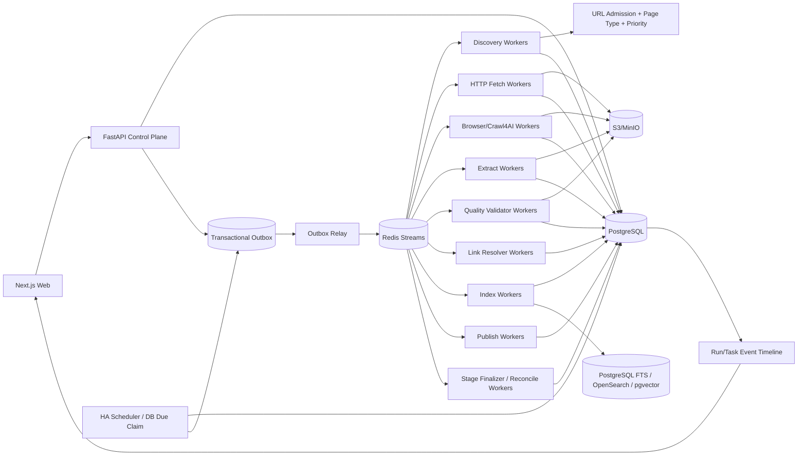

# 博客知识库技术方案

适用范围：从约 1000 个技术博客网站抓取尽可能完整的历史文章，清洗为稳定 Markdown 形成长期知识库；后续持续增加站点，并支持长期增量同步、版本保留、Web 管理、搜索、审计、故障恢复、离线重处理和外部知识库发布。整体按“百万级文章、数百万到千万级 URL、站点高度异构、长期运行、可横向扩展、可恢复、可回放、可审计、可对账、可复现”设计。

## 1. 建设目标

1. 管理员只需录入博客根地址，系统自动探测 Sitemap、RSS/Atom/JSON Feed、归档页、分类/标签/作者页、平台 API、普通站内链接和动态列表，生成可审核的站点配置草稿。
2. 支持约 1000 个站点历史全量回灌，并可持续新增站点；新抓取引擎、新发现方式、新抽取器通过 Adapter/Provider Capability 扩展，不修改核心状态机。
3. 同一站点允许多个 Discovery Provider，每个 Provider 独立维护 capability、checkpoint、覆盖证据和连续性。
4. 抓取标题、作者、发布时间、更新时间、标签、canonical、正文、代码块、表格、图片和附件，最终输出稳定 Markdown。
5. 默认 HTTP-first；只有证据表明确实需要 JavaScript、动态分页或交互时才升级 Browser/Crawl4AI。
6. 支持 ETag、Last-Modified、Sitemap lastmod、Feed GUID、API cursor、内容 hash 与重叠时间窗口驱动的增量同步。
7. 支持 durable frontier、断点续跑、幂等、lease、heartbeat、重试、指数退避、限流、熔断、按站公平调度和 backpressure。
8. 保存不可变网络快照、渲染 DOM、清洗 HTML、抽取候选、Article IR、Markdown、规则版本和质量结果；规则升级优先离线 replay。
9. 周期计划、逻辑执行、后台任务、运行上下文和真实产物完全分离；计划是持久化业务配置，Scheduler 只是可重建触发器，实际抓取由 Worker 执行。
10. Web 管理端支持站点接入、覆盖检查、同步计划、任务管理、质量审核、版本 diff、错误诊断、搜索、成本和发布管理。
11. 每一次运行都有稳定 `crawl_run_id`；Worker 不得私自创建、替换或切换运行上下文。
12. Run 创建时冻结完整 `run_context_manifest`，同一 Run 内不能隐式混用不同规则、Adapter 或 Runtime Release。
13. 核心业务写入使用 Typed Domain Writer；阶段完成必须以数据库状态和真实 COMPLETE Artifact 对账，不能只相信 Worker 自报成功。
14. Artifact 类型由统一 Artifact Kind Registry 管理，避免新增阶段时 write/read/list/cleanup/finalizer 契约发生漂移。
15. 最终 Article Version 必须经过独立、确定性的 Quality Manifest 校验；生产内容的 Worker 不能自行证明内容合格。
16. Article Link Graph 作为一等数据模型，支持内部链接解析、断链检查、孤立文章识别、覆盖补漏和检索增强。

## 2. 核心原则

1. PostgreSQL 是业务状态真相源；S3/MinIO 是不可变大对象真相源。
2. Redis Streams 只做短期任务运输；状态先落 PostgreSQL，再通过 Transactional Outbox 投递。
3. URL 发现、准入、抓取、抽取、质量、索引、发布、计划、执行和运行上下文全部可版本化、可审计。
4. URL 被发现不等于允许抓取，必须经过统一 URL Admission Pipeline；真实连接仍由 Egress Gateway 再次执行 DNS/IP/端口/redirect 安全校验。
5. HTTP、Sitemap、Feed、API、Browser 分层，Browser 是昂贵升级路径。
6. 网络快照不可变；规则、Schema、模型和 Markdown Renderer 升级优先 replay，不重复访问站点。
7. 文章身份与 URL 分离；redirect、canonical、镜像、迁移只是 identity evidence。
8. `article_version` append-only，不覆盖旧版本；`crawl_run` 同样 append-only，不因计划修改而改写历史执行记录。
9. Bloom Filter/RoaringBitmap 只能加速，不能替代数据库唯一约束和 durable frontier。
10. 任何单次执行预算都不能被误判为“历史发现完成”。
11. 重型 Browser、CPU 和 LLM 工作只能运行在独立 Worker；控制面和 Scheduler 不执行长任务。
12. 标题、slug、URL path 尾段都只是展示属性，不能承担内部 identity；所有关系以稳定 `url_id/article_id/attempt_id/snapshot_id` 关联。
13. 内存 Scheduler、进程内 Semaphore、Redis Consumer ownership 都是可丢失运行时状态，不能取代数据库里的 schedule、run、task、lease 和幂等约束。
14. 通用后台任务表只保存运行生命周期、轻量结果摘要和业务对象引用；文章、快照、覆盖结果等业务数据仍由领域表负责。
15. 长期任务 payload 禁止直接持久化 API Key、Cookie、密码、BYOK Token；只保存 `secret_ref/secret_version/credential_profile_id`。
16. 决定性状态迁移必须与对应 `run_event/task_event` 以及需要派发的 `outbox_event` 在同一 PostgreSQL 事务中提交。
17. Dashboard 是报告与控制入口，不是流程状态真相源；前端不能持有流程锁或“continue gate”。
18. URL 必须来自真实发现证据或管理员精确输入，禁止根据标题推断 URL，禁止用相似页面静默替代失败目标。
19. Worker 只能读取 Run Context 中冻结的 Release；禁止在执行中自动读取“最新配置”。
20. Artifact 的 namespace、schema、retention、producer、consumer 和 Finalizer 要求来自一个 canonical Registry。
21. 质量通过与否由独立 Validator 对真实已提交产物重新计算，不能使用 Worker self-report 作为最终事实。
22. 人工 Override 与机器 Validator 结果分开保存；人工决策不能篡改机器校验事实。

## 3. 总体架构



职责：

- Control Plane：配置、权限、命令、计划、Run Context 创建、查询；
- Scheduler：只创建逻辑 Run，不执行抓取；
- Worker：执行可领取 work unit；
- PostgreSQL：保存业务状态、幂等、Release、Context 和审计；
- S3/MinIO：保存不可变大对象；
- Artifact Service：分配 staging key、校验 kind/schema/hash、提交 Artifact；
- Quality Validator：对真实 Article Version/Markdown 产物做确定性质量校验；
- Link Resolver：维护内部链接图；
- Stage Finalizer：用真实领域数据与 COMPLETE Artifact 对账阶段状态；
- Dashboard：展示事实并发出显式控制命令。

## 4. Crawl Mode 与运行语义

```text
FULL_BACKFILL     首次历史全量回灌
INCREMENTAL       持续同步新增和更新
RECONCILE         周期性重新枚举，修复断档
TOPIC_EXPANSION   有限预算专题扩展
TARGETED_FETCH    精确 URL 抓取/调试，不允许替代目标
REPROCESS         不访问网络，基于已有 snapshot 重抽取/清洗/质量/索引/发布
```

约束：

- FULL_BACKFILL 中页面分类和评分只决定顺序，不能因关键词、低分或页面类型静默丢弃合法历史 URL。
- INCREMENTAL/TOPIC_EXPANSION 可使用预算、时间窗口和优先级阈值。
- TARGETED_FETCH 接收管理员给出的精确 URL 列表，保留输入顺序，逐 URL 给出结果，不允许用最近文章、相关页或猜测 URL 补齐。
- Crawl4AI deep crawl 的 `max_pages`、Sitemap 单批条目数、Browser 单批页面数都只是 execution slice 预算，不是完成条件。
- 同站点默认只允许一个 active FULL_BACKFILL；INCREMENTAL 与 RECONCILE 是否并行由显式策略控制。
- REPROCESS 可选择“复用原 Run Context”或“显式指定新 Context”，两者都必须保留 lineage。

每个 Run 有逻辑 workspace：

```text
runs/{crawl_run_id}/raw/...
runs/{crawl_run_id}/rendered/...
runs/{crawl_run_id}/extracted/...
runs/{crawl_run_id}/quality/...
runs/{crawl_run_id}/reports/...
```

对象路径只用于组织，真实 identity 仍由 `artifact_object_id/snapshot_id/article_version_id` 决定。

## 5. Run Context Manifest：冻结一次运行的全部语义

`crawl_run_id` 只标识“哪一次运行”，还必须保存“这次运行究竟使用什么配置”。

Run 创建时生成不可变 `run_context_manifest`：

```text
run_context_id
crawl_run_id
site_profile_release_id
site_source_release_ids
provider_release_ids
url_filter_release_id
url_scorer_release_id
page_type_rule_release_id
fetch_profile_release_id
cache_policy_release_id
browser_action_plan_release_id
adapter_binding_release_id
adapter_schema_release_id
extraction_pipeline_release_id
quality_contract_release_id
markdown_renderer_release_id
index_release_id
publish_release_id
runtime_bundle_release_ids
policy_release_id
credential_profile_id
secret_version_refs
context_hash
created_at
```

规则：

1. Run Context 创建后不可修改；
2. Worker payload 只引用 `run_context_id`，禁止读取 latest release；
3. Worker 如果拿不到 Context 或发现 Context Hash 不匹配，直接失败；
4. Secret 只存引用和版本，不保存秘密本身；
5. 管理员发布新配置不会影响已运行中的 Run；
6. 使用新规则重处理旧 Snapshot 时创建新的 Run/Context，并记录 `reprocessed_from_run_id`、`source_snapshot_id`；
7. Web 可以按 Run Context 做完整 diff，解释两次 Run 结果为何不同。

## 6. 核心数据模型

至少包括：

```text
site
site_source
site_profile_release
site_source_release

discovery_provider
discovery_provider_release
discovery_checkpoint
discovery_evidence
provider_coverage

sync_schedule
crawl_run
run_context_manifest
run_event

sitemap_task
url_frontier
background_task
task_event
fetch_task
crawl_attempt

artifact_kind_release
artifact_reservation
artifact_object
run_artifact_manifest
fetch_snapshot
browser_session_lease

adapter_capability_release
adapter_binding_release
adapter_schema_release
runtime_bundle_release

page_type_rule_release
url_filter_release
url_scorer_release
fetch_profile_release
cache_policy_release
browser_action_plan_release
extraction_pipeline_release
markdown_renderer_release
quality_contract_release

extraction_candidate
quality_evaluation
quality_manifest
quality_override

article
article_url_relation
article_version
article_link_edge

index_release
publish_state
credential_profile
outbox_event
```

职责分离：

- `sync_schedule`：未来什么时候执行；
- `crawl_run`：一次已经发生或正在发生的逻辑执行；
- `run_context_manifest`：这次运行冻结的全部 Release 语义；
- `background_task`：可领取工作单元；
- `artifact_kind_release`：Artifact Contract；
- `artifact_object`：不可变真实大对象；
- `run_artifact_manifest`：某 Run/Phase 期望与已提交产物集合；
- `article_version`：最终知识库内容版本；
- `quality_manifest`：对某候选 Article Version 的机器质量事实；
- `article_link_edge`：文章间真实链接关系。

## 7. 新站点接入：Discovery Probe

管理员录入根 URL 后执行：

1. 获取根页面并记录 final URL、Content-Type、编码、响应头和页面结构；
2. 解析 robots.txt 中 Sitemap；
3. 探测常见 Sitemap/Sitemap Index；
4. 探测 RSS/Atom/JSON Feed；
5. 识别平台公开 API、年/月归档、分类/标签/作者分页；
6. 识别普通站内链接和动态列表；
7. 必要时执行 Browser Sample Probe；
8. 抽样 3~10 篇文章，识别正文结构和 metadata；
9. 生成 Provider、Fetch Profile、Filter、Scorer、Page Type Rule、Extraction Pipeline、Action Plan 草稿；
10. 根据能力需求解析 Adapter Capability，形成 Adapter Binding 草稿；
11. 在样本上运行 JSON-LD/meta、CSS/XPath、Trafilatura、Readability、Crawl4AI Markdown 等候选；
12. 对样本渲染最终 Markdown，并运行 Quality Contract；
13. Web 端 dry-run/canary/publish 后启动首次 FULL_BACKFILL；
14. 回灌启动后自动创建默认 INCREMENTAL schedule，管理员可修改频率、时区、重叠窗口和启停状态。

站点长期可复用配置放在 `site_profile_release`；一次 Run 的临时产物不写回站点配置，配置变更生成新 Release。

## 8. Discovery Provider 与覆盖台账

Provider 优先级：

```text
Sitemap/Sitemap Index
> 平台 API
> Feed
> 年/月归档
> 分类/标签/作者分页
> HTML 同域递归
> Browser 动态列表
> 外部公开索引补漏
```

Provider Capability：

```text
exhaustive   理论上可枚举完整集合
windowed     只暴露最近窗口
best_effort  尽力发现
```

每条发现记录保存真实证据：

```text
discovery_evidence_id
site_id
provider_id
crawl_run_id
source_parent_url
source_artifact_object_id
source_entry_key_or_position
discovered_url
canonical_hint
discovered_at
```

禁止根据标题生成 URL，禁止 silent substitution。

`provider_coverage` 至少保存：

```text
provider_id
crawl_run_id
crawl_mode
checkpoint_before
checkpoint_after
pages_or_entries_scanned
discovered_count
admitted_count
rejected_count
expected_count
pagination_continuity
new_frontier_count
unresolved_error_count
started_at
finished_at
```

历史回灌完成至少要求：

- 所有 Provider 到达稳定 checkpoint；
- exhaustive Provider 完整枚举；
- 分页无 continuity gap；
- durable frontier 无可执行 URL；
- retry/dead-letter 已处理；
- reconcile 不再产生显著新增；
- Coverage Ledger 无未知断档。

## 9. Sitemap 与 Archive：持久化、可恢复、流式处理

Sitemap 必须独立建模为持久化任务树，而不是一次递归函数跑完。

`sitemap_task` 至少保存：

```text
sitemap_task_id
site_id
provider_id
crawl_run_id
sitemap_url
parent_sitemap_url
depth
state
body_hash
etag
last_modified
entries_seen
child_sitemaps_seen
checkpoint
lease_owner
lease_until
attempt_count
next_attempt_at
```

执行要求：

1. 每个 Sitemap URL 先走 Admission；真实连接时 Egress 再做 DNS/IP/端口/redirect 校验；
2. 支持 Sitemap Index、普通 Sitemap、gzip、namespace、`lastmod`；
3. 使用安全 XML parser + streaming/iterparse；网络读取、解压、解析、Admission、frontier 持久化形成流式管线，不构造完整 XML DOM 和完整 URL 列表；
4. 同时限制压缩前字节、解压后字节和压缩比，防止 zip bomb；
5. 设置 `max_bytes_per_slice/max_entries_per_slice/max_child_sitemaps_per_slice/max_runtime_per_slice`；预算耗尽保存 checkpoint 后继续排队；
6. `visited sitemap` 持久化并有唯一约束，防止循环和重启后重复；
7. 深度限制只作为安全保护；超深进入异常队列/人工策略，不能静默宣布完成；
8. 子 Sitemap 可并发，但受全局、站点和域名三层配额约束；
9. 404/410、429、5xx、超大文件、解析失败分别分类并记录 coverage gap；
10. 解析到单个 `<url>`/`<sitemap>` 后立即 Admission + 持久化，崩溃时最多重放当前 slice。

Archive/Category/Tag/Author/Pagination Provider 同样必须保存页级 checkpoint 与 continuity，不能用“本次抓了 N 页”当完成依据。

## 10. Durable Frontier、URL Admission 与 Crawler Trap

URL 唯一键建议：

```text
(site_id, sha256(normalized_url))
```

Admission Pipeline：

1. URL 规范化；
2. SSRF/Egress 预检查；
3. robots 与站点访问策略；
4. Domain/Subdomain allowlist；
5. path allow/deny；
6. query 规范化；
7. Content-Type/扩展名规则；
8. canonical/redirect identity hints；
9. crawler trap 检测；
10. 页面类型分类；
11. Priority Scorer；
12. durable frontier upsert。

规范化处理 host 大小写、IDN、fragment、默认端口、tracking query、query 顺序、session 参数、trailing slash 和 percent-encoding。

页面类型：

```text
ARTICLE ARCHIVE CATEGORY TAG AUTHOR PAGINATION DOCUMENTATION
PRODUCT PRICING SEARCH ASSET UNKNOWN
```

FULL_BACKFILL 中页面类型和关键词只影响优先级与抽取策略，不作为永久过滤依据。重点防御：

- 日历无限翻页；
- 搜索参数组合；
- tag/filter 笛卡尔积；
- 无界 `?page=`；
- session/token 参数；
- 多排序 URL；
- 无限日期路径。

## 11. Adapter Capability Registry 与 Binding

核心状态机不应硬编码 Crawl4AI、Firecrawl、Playwright 或某个 MCP Server 名称，而应依赖能力契约。

`adapter_capability_release` 示例：

```text
adapter_id
adapter_release
capabilities
input_schema_version
output_schema_version
runtime_class
cost_class
health_probe
limits
created_at
```

能力示例：

```text
DISCOVER_MAP
DISCOVER_SITEMAP
FETCH_HTTP
FETCH_MARKDOWN
RENDER_JS
SCREENSHOT
EXTRACT_STRUCTURED
DOWNLOAD_MEDIA
```

Probe/Control Plane 根据：

```text
站点需求
运行策略
成本
健康度
合规策略
可用 Runtime
```

解析成 `adapter_binding_release`，并在 Run Context 中冻结。

固定 fallback 也使用 Capability Selector，而不是服务名：

```text
FETCH_HTTP
 -> FETCH_MARKDOWN
 -> RENDER_JS
 -> SITE_API
```

这样新增抓取引擎不需要修改核心状态机。

## 12. 周期计划、增量窗口与 HA Scheduler

`sync_schedule` 至少保存：

```text
schedule_id
site_id
crawl_mode
schedule_revision
cron_expr
interval_seconds
timezone
dst_policy
jitter_seconds
overlap_window
misfire_policy
max_catch_up_runs
policy_release
enabled
next_due_at
last_expected_fire_at
last_scheduled_at
last_success_at
created_at
updated_at
```

数据库统一保存 UTC；`timezone` 使用 IANA 时区，只用于解释用户本地计划并计算确定 UTC 触发时刻。每次修改影响触发语义的字段都递增 `schedule_revision`。

`misfire_policy`：

```text
SKIP       跳过停机期间错过触发
FIRE_ONCE  恢复后合并为一次逻辑同步
CATCH_UP   有上限地逐次补触发
```

INCREMENTAL 默认推荐 `FIRE_ONCE`，结合 overlap window 和 RECONCILE 修复停机窗口。CATCH_UP 必须设置上限，超过上限的旧窗口合并为一次 RECONCILE，避免恢复时形成任务风暴。

Scheduler 可采用 Leader Lease，也可用数据库原子 claim：

```sql
SELECT *
FROM sync_schedule
WHERE enabled = true AND next_due_at <= now()
ORDER BY next_due_at
FOR UPDATE SKIP LOCKED;
```

一次逻辑触发必须在同一事务内：

```text
1. claim 到期 schedule
2. 读取 schedule_revision 与 expected_fire_at
3. 根据 misfire_policy 决定 skip/fire once/bounded catch-up
4. 创建 append-only crawl_run
5. 创建并冻结 run_context_manifest
6. 生成 run dedupe_key
7. 写 RUN_CREATED run_event
8. 写 outbox_event
9. 推进 next_due_at/last_expected_fire_at/last_scheduled_at
10. COMMIT
```

`crawl_run` 至少包含：

```text
crawl_run_id
site_id
schedule_id
schedule_revision
run_context_id
crawl_mode
triggered_by
expected_fire_at
actual_triggered_at
window_start
window_end
status
dedupe_key
supersedes_run_id
reprocessed_from_run_id
created_at
started_at
completed_at
```

周期 dedupe key：

```text
sync:{site_id}:{schedule_id}:{schedule_revision}:{crawl_mode}:{expected_fire_at}
```

手工 Run Now 使用独立 request id/逻辑窗口幂等键。

## 13. 增量同步与 Reconcile

增量信号优先级：

```text
Sitemap lastmod
> Feed GUID/updated_at
> API cursor
> ETag
> Last-Modified
> normalized content hash
```

windowed source 必须使用重叠时间窗口，不能只保存最后一条 GUID 单向推进。长时间离线后扩大 overlap，并周期性通过 Sitemap/API/Archive RECONCILE 修复断档。

建议默认频率：

- 高频站点：15 分钟~数小时；
- 普通技术博客：数小时~1 天；
- 低频站点：1~7 天；
- RECONCILE：周/月级，按断档风险调整。

自适应调度策略必须版本化并可在 Web 查看；修改频率生成新的 `schedule_revision`，不能覆盖历史 Run 对应的调度语义。

## 14. 后台任务状态机、Claim、Lease 与恢复

所有长任务持久化为通用 runtime task 或领域 task：

```text
task_id
crawl_run_id
run_context_id
kind
site_id
payload
status
dedupe_key
priority
run_after
attempt_count
max_attempts
worker_id
lease_version
lease_until
claimed_at
heartbeat_at
started_at
completed_at
result_ref
error_class
created_at
updated_at
```

推荐状态：

```text
QUEUED -> CLAIMED -> RUNNING -> COMPLETED
RUNNING -> RETRY_WAIT -> QUEUED
RUNNING -> CANCEL_REQUESTED -> CANCELLED
RUNNING -> FAILED / DEAD_LETTER
```

Worker 使用 `FOR UPDATE SKIP LOCKED`、`UPDATE ... RETURNING` 或 lease CAS 原子抢占。Redis Streams Consumer Group 只负责运输；最终业务执行权仍由 PostgreSQL claim/lease 决定。

Worker 不应先 claim 大量自己没有 runtime capacity 的任务。Dispatcher 按 `runtime_class/kind/site` 分 lane 或在 claim 条件中考虑可用配额，避免任务已 CLAIMED 却长时间卡在本地 semaphore。

Heartbeat/Lease：

- Worker 定期刷新 `heartbeat_at/lease_until`；
- 状态更新必须匹配 `worker_id + lease_version`；
- lease 过期后旧 Worker 即使恢复，也不能提交成功结果覆盖新 Worker；
- Worker 正常退出时主动释放或缩短 lease。

Recovery Worker 周期扫描 stale/orphaned task；未达重试上限重新排队，达上限进入 DEAD_LETTER。

## 15. 状态、事件、Outbox 与取消

任何会改变 `background_task/crawl_run` 决定性状态的操作，都通过统一 transition service 在同一 PostgreSQL 事务中完成：

```text
BEGIN
1. 用 task_id/run_id + expected status + lease_version 做条件更新
2. 写 task_event/run_event
3. 如需唤醒后续阶段，写 outbox_event
4. COMMIT
```

禁止“先改状态，再补事件”。SSE、Redis Pub/Sub、Redis Streams 或 LISTEN/NOTIFY 只传播已提交事实。

取消采用协作状态：

1. API 写 `CANCEL_REQUESTED`，同事务写 event；
2. Worker 在网络请求、分页 slice、Browser action、Artifact Commit 前后检查 cancellation/lease；
3. 可取消 I/O 主动 abort；Browser context/page 必须清理；
4. 已开始的原子 Artifact Commit 要么完成，要么保持 staging 由 Cleanup 回收；
5. 最终成功提交前再次校验 lease 与 cancel 状态；
6. Force New Run 记录 `supersedes_run_id`，保留旧运行审计链。

## 16. 公平调度、限流与 Backpressure

Dispatcher 使用 weighted fair queue。每域维护：

```text
max_concurrency
qps
min_request_interval
token_bucket
Retry-After
429/403/5xx backoff
HTTP/Browser 独立预算
circuit breaker
```

优先级建议：

```text
NEW_FEED / CHANGED
> INCREMENTAL_REFRESH
> TARGETED_FETCH
> RECONCILE
> HISTORICAL_BACKFILL
> LOW_PRIORITY_REPROCESS
```

并发至少三层：

1. 全局系统配额；
2. site/domain 配额与 politeness；
3. Worker 进程内 semaphore/pool。

下游积压时降低 Discovery、暂停 Browser expansion、优先处理已抓未抽取 snapshot，并保留增量高优先级通道。

## 17. Async Runtime Topology

Adapter 声明：

```text
runtime_class = ASYNC_NATIVE | BLOCKING_IO | CPU_BOUND | BROWSER | VALIDATOR
```

- `ASYNC_NATIVE`：HTTP/Sitemap/Feed；
- `BLOCKING_IO`：同步 SDK/网络库；
- `CPU_BOUND`：DOM 解析、diff、MinHash/SimHash、IR normalize、Markdown render；
- `BROWSER`：Crawl4AI/Playwright；
- `VALIDATOR`：确定性质量校验。

HTTP/Discovery Worker 使用最小依赖镜像和长期连接池。Browser Worker 长期维护 Browser/context/page pool、session TTL、内存与 CPU 上限。禁止每 URL 新建 event loop 或 Browser，也禁止对百万 URL 一次性 `asyncio.gather`。

## 18. HTTP-first、固定 fallback 与 Fetch Adapter

HTTP Worker 尽量发送 `If-None-Match/If-Modified-Since`。304 只更新 freshness；200 先保存 raw bytes 再抽取。

获取链：

```text
HTTP 原文
 -> HTTP + 结构化抽取
 -> Browser/Crawl4AI 渲染
 -> 站点专用 API/Adapter
 -> 人工诊断
```

Browser escalation 原因结构化保存：

```text
EMPTY_ARTICLE_BODY
SPA_SHELL
JS_PAGINATION
LOAD_MORE
INFINITE_SCROLL
DYNAMIC_RENDER_REQUIRED
EXTRACTION_READINESS_FAILED
```

固定 fallback 顺序由 `fetch_profile_release` + `adapter_binding_release` 定义，Worker 不能临时自由尝试无穷路径。

Adapter 输出统一为：

```text
adapter_output_schema_version
url_id
attempt_id
final_url
status_code
headers
raw_html_ref
rendered_dom_ref
raw_markdown_ref
fit_markdown_ref
links/media
metrics
source_provenance
fallback_reason
error_class
runtime_bundle_release
adapter_binding_release
```

Crawl4AI 可承担 AsyncWebCrawler、JS 渲染、deep crawl、Markdown 生成和 CSS/XPath/Regex extraction，但不能承担 durable frontier、多站公平调度、业务 checkpoint、文章版本、schedule、run 和覆盖完成判定。

## 19. Artifact Kind Registry 与 Server-side Reservation

所有 Artifact 类型来自一个 canonical `artifact_kind_release`，至少定义：

```text
artifact_kind
schema_version
namespace
allowed_media_types
producer_stage
allowed_consumers
retention_policy
required_for_finalize
validator_id
is_immutable
created_at
```

所有 write/read/list/cleanup/UI/Finalizer 契约从 Registry 生成或读取，禁止在多个服务中维护互不关联的 namespace enum。

推荐 Artifact 写入协议：

```text
1. Worker 调 reserve_artifact(task_id, attempt_id, kind)
2. 服务端校验 Run Context、lease、kind、producer stage
3. 返回服务端生成的 staging object key / pre-signed upload
4. Worker 流式上传并计算 sha256/size/media type
5. Worker 调 commit_artifact(reservation_id, sha256, size, schema_version)
6. 服务端校验 kind/schema/hash/media type
7. 生成 content-addressed COMPLETE artifact_object
8. Domain Writer 引用该 Artifact
9. run_artifact_manifest 记录关系
10. Cleanup 回收过期 staging reservation/object
```

Worker 不自由拼接 namespace/object key，也不能把未 COMPLETE 的对象作为领域事实引用。

## 20. Snapshot、Artifact Commit 与 Run Artifact Manifest

每次成功网络访问保存不可变 Snapshot：

```text
raw response bytes
response headers
observed charset
final_url
redirect chain
resolved_ip_evidence
body sha256
rendered DOM
cleaned HTML
raw Markdown
fit Markdown
links/media references
source provenance
fetch/crawler/runtime release
adapter binding/schema release
run_context_id
fetched_at
```

`run_artifact_manifest` 保存每个 Run/Phase 的真实产物引用：

```text
manifest_entry_id
crawl_run_id
phase
entity_type
entity_id
artifact_object_id
artifact_kind
status
created_at
```

Worker 自报完成不能直接把 phase 标记为 COMPLETED。

## 21. Typed Domain Writer 与 Stage Finalizer

核心领域写入不通过万能 `update_task(payload)` 完成，而使用类型化服务：

```text
record_discovered_url(...)
commit_fetch_snapshot(...)
commit_extraction_candidate(...)
commit_article_version_candidate(...)
commit_quality_manifest(...)
accept_article_version(...)
commit_link_edges(...)
commit_index_result(...)
commit_publish_result(...)
```

每个 Writer 负责：

1. schema 校验；
2. Run Context 校验；
3. 幂等检查；
4. lease/cancel 校验；
5. 引用 COMPLETE Artifact；
6. 更新领域对象；
7. 写 run/task event；
8. 写 outbox；
9. 单事务提交。

每个长阶段结束由 Stage Finalizer 对账：

```text
finalize_discovery(run_id)
finalize_fetch(run_id)
finalize_extraction(run_id)
finalize_quality(run_id)
finalize_link_graph(run_id)
finalize_index(run_id)
finalize_publish(run_id)
```

Finalizer 比较：

```text
数据库期望集合
vs COMPLETE artifact_object
vs run_artifact_manifest
vs 领域表引用
vs quality manifest
vs 失败/重试/死信集合
```

输出状态：

```text
COMPLETED
PARTIAL
FAILED
INCONSISTENT
```

规则：

- 真实产物为 0 且该阶段要求产物时，不能标完成；
- 发现数大于真实持久化数时显式 PARTIAL；
- TARGETED_FETCH 任一指定 URL 未得到要求产物时返回逐 URL 失败，不允许替代；
- INCONSISTENT 自动生成 repair/reconcile task；
- 下游阶段只消费 Finalizer 返回的 canonical persisted/accepted set；
- Finalizer 必须幂等，可在 Worker 崩溃、消息重放后重复执行。

## 22. 抽取链、Article IR 与 Markdown

同一 Snapshot 产生多个 candidate：

1. 平台 API/JSON-LD/OpenGraph/meta；
2. 站点 CSS/XPath Contract；
3. Trafilatura；
4. Readability；
5. Crawl4AI raw/fit Markdown；
6. 必要时 LLM Structured Extraction。

HTML 先转换为 Article IR：

```text
heading
paragraph
list
quote
code_block
table
image
link
embed_placeholder
```

Article Record 至少保存：

```text
url/final_url/canonical
metadata
author/published_at/updated_at
schema evidence
heading tree
code/table/list/image/link
body IR
body markdown candidate
source provenance
```

Quality Selection 从 candidate 中选择最终字段和正文，任何 extractor 都不能静默覆盖前一结果。

Markdown 路径建议：

```text
knowledge/{site_slug}/{yyyy}/{article_id}.md
```

front matter 至少包含：

```yaml
article_id:
site_id:
source_url:
canonical_url:
title:
authors:
published_at:
updated_at:
fetched_at:
content_hash:
article_version:
extraction_release:
markdown_renderer_release:
runtime_bundle_release:
run_context_id:
crawl_run_id:
```

文件名不依赖标题；正文相对链接和图片统一变成可追踪的绝对或托管地址。

## 23. 确定性 Quality Contract 与 Quality Manifest

Quality Validator 必须独立于生产该内容的 Worker，并重新读取真实已提交 Artifact。

`quality_contract_release` 定义 required/optional checks、阈值和站点特有约束。

基础检查建议：

```text
SOURCE_IDENTITY_VALID
CANONICAL_EVIDENCE_VALID
PROVENANCE_COMPLETE
FRONT_MATTER_SCHEMA_VALID
BODY_NON_EMPTY
NO_TRUNCATION
HEADING_STRUCTURE_VALID
CODE_BLOCK_RETENTION
TABLE_RETENTION
LIST_RETENTION
IMAGE_REFERENCE_VALID
LINK_REFERENCE_VALID
ARTICLE_IR_RENDER_CONSISTENT
BOILERPLATE_RATIO_OK
CONTENT_HASH_VALID
RENDERER_RELEASE_PRESENT
COMPLETE_ARTIFACT_PRESENT
NO_FORBIDDEN_PLACEHOLDER
NO_ENCODING_CORRUPTION
```

站点可增加自定义 required checks，例如代码博客必须保留代码块、文档型博客必须保留标题层级等。

Validator 输出不可变 `quality_manifest`：

```text
quality_manifest_id
article_version_candidate_id
quality_contract_release_id
validator_release_id
status
required_checks
passed_checks
failed_checks
blocking_issues
review_items
metrics
artifact_refs
validated_at
```

状态：

```text
PASSED
BLOCKED
REVIEW_REQUIRED
```

约束：

1. 只有 PASSED 的候选版本才能自动成为 `article.current_version_id`；
2. BLOCKED/REVIEW_REQUIRED 版本仍保留，可在 Web 审核，但不能覆盖上一版高质量版本；
3. Index/Publish 默认只消费 accepted PASSED version；
4. Validator 必须确定性、幂等、可离线 replay；
5. Worker 的 `success=true`、日志和自评分不作为最终质量事实；
6. `finalize_quality` 以真实 Markdown Artifact + Quality Manifest + Article Candidate 对账。

人工 Override 单独保存：

```text
quality_override_id
quality_manifest_id
actor_id
action
reason
scope
created_at
```

机器结果仍保持原值，Web 同时显示 Validator 事实和人工决策。

## 24. 文章身份、去重与版本

exact duplicate 使用 Article IR/content hash；near duplicate 用 MinHash/SimHash 生成候选；redirect/canonical 只作为 identity evidence；多 URL 同文章记录 `article_url_relation`。

正文、关键 metadata、canonical identity 或 Article IR 实质变化时创建新的 `article_version_candidate`。只有通过 Quality Manifest 后，才成为 accepted `article_version` 并更新 current pointer。

仅抓取时间或响应头变化且 IR hash 相同时不创建新版本。

内部更新绝不使用标题、slug 或 URL path 尾段作为 key。

## 25. Article Link Graph

抽取时把真实链接写入 `article_link_edge`：

```text
article_link_edge_id
source_article_version_id
target_url_id
target_article_id nullable
raw_href
normalized_href
anchor_text
rel
link_type
source_block_path
provenance
resolved_at
created_at
```

Link Resolver 增量完成：

- URL -> Article Identity 解析；
- inbound/outbound 关系；
- orphan article；
- broken internal link；
- 未抓取内部目标；
- redirect/canonical 后目标迁移；
- 站点内容图谱。

Link Graph 可用于：

- 知识库检索排序；
- 文章上下文扩展；
- 发现覆盖补漏；
- 断链诊断；
- 站点内容架构分析。

如果内部 href 触发新 URL 入 frontier，必须把原始 Link Edge 作为 `discovery_evidence`；仍禁止通过标题/语义猜 URL。

## 26. Drift Detection 与质量监控

至少监控：

- 标题存在率；
- 正文字符数/段落数；
- 链接密度；
- 导航占比；
- 代码块保留率；
- 表格保留率；
- 图片有效率；
- 发布时间证据；
- boilerplate 比率；
- Markdown 截断；
- canonical/final URL 冲突；
- 历史重复度；
- Quality Manifest pass/block/review 比率；
- Link Graph unresolved ratio。

平台指标：

```text
extraction_success_rate
body_length_p50/p95
title_missing_rate
code_block_retention
table_retention
browser_fallback_rate
duplicate_ratio
sitemap_gap_count
provider_continuity_gap
queue_lag
schedule_trigger_lag
schedule_misfire_count
schedule_catch_up_count
run_duration_p50/p95
stale_task_recovery_count
heartbeat_age_p95
browser_pool_active
artifact_commit_failure_rate
artifact_reservation_expired_count
staging_object_age_p95
event_stream_lag
state_event_atomicity_violation_count
stage_manifest_mismatch_count
partial_phase_count
quality_block_rate
quality_review_required_rate
run_context_mismatch_count
artifact_contract_violation_count
link_graph_unresolved_ratio
cancel_to_stop_latency
```

Release 后指标突变时自动暂停扩大范围、重新 Probe 并生成规则草稿；低质量内容不能覆盖高质量旧版本。

## 27. 错误分类与重试

统一分类：

```text
DNS
connect/read timeout
TLS
401/403
404/410
429
5xx
robots denied
egress denied
content too large
sitemap malformed
depth anomaly
decompression bomb
browser crash/timeout
extraction failed
quality blocked
runtime mismatch
run context mismatch
adapter capability unavailable
artifact reservation invalid
artifact contract violation
artifact commit failed
manifest mismatch
schema mismatch
lease lost
scheduler duplicate trigger
scheduler misfire overflow
secret resolution failed
link resolution failed
```

可重试错误按 `Retry-After + jittered exponential backoff + max attempts + circuit breaker` 处理；配置错误、明确拒绝和确定性校验失败不原样重试。只重放最小必要单元。

## 28. 安全、robots 与 Egress

所有网络访问统一经过 Egress Gateway：

- 只允许 http/https；
- 拒绝 localhost、RFC1918、loopback、link-local、metadata endpoint；
- DNS 解析检查全部 A/AAAA，失败默认 fail-closed；
- 连接使用已验证解析结果，防 DNS rebinding/TOCTOU；
- redirect 每一跳重新校验；
- 限制端口并禁止 file/ftp/gopher 等 scheme；
- 子 Sitemap、文章 URL、Browser 子资源都执行相同策略；
- 保存 redirect chain、DNS/IP 决策和拒绝原因；
- 遵守 robots、Retry-After 和礼貌抓取规则；
- 不绕过验证码、登录、付费墙或明确访问控制。

Secret 只通过 Vault/云 Secret Manager/KMS 解析，任务 payload、event、日志和 artifact metadata 默认脱敏。

## 29. Web 管理功能

### 29.1 站点接入

- Probe 向导；
- Sitemap/Feed/API/归档/动态列表证据；
- 样本 URL 与 HTTP/Browser 差异；
- 自动规则草稿；
- Adapter Capability/Binding 预览；
- Extraction/Quality 样本对比；
- dry-run/canary/publish；
- 一键启动 FULL_BACKFILL；
- 自动创建默认 INCREMENTAL schedule。

### 29.2 同步计划与运行

- cron/interval、IANA timezone、DST policy、jitter、overlap window；
- schedule revision、misfire policy、max catch-up runs；
- next_due_at、last_expected_fire_at、last_success_at；
- expected_fire_at 与 actual_triggered_at 的延迟；
- Run Now / Force New Run / Targeted Fetch；
- dedupe key、supersede/cancel 关系；
- schedule 修改审计和 revision diff；
- Run Context Manifest 查看与 diff。

### 29.3 覆盖与任务

- Provider capability/checkpoint/continuity gap；
- discovery evidence：每个 URL 从哪里被发现；
- Sitemap task 树、depth、未完成子任务和异常；
- expected/discovered/admitted/fetched/article count；
- full backfill 完成证据；
- run/task 状态和 append-only event timeline；
- heartbeat、lease、attempt、worker、recovery 记录；
- 暂停、恢复、取消、重试；
- 单 URL Targeted Fetch/Reprocess；
- runtime class、队列与 Worker 饱和度。

### 29.4 Artifact 与阶段对账

- Artifact Kind Registry；
- reservation/staging/COMPLETE 状态；
- run artifact manifest；
- DB 期望数量 vs COMPLETE Artifact 数量；
- Stage Finalizer 输出；
- PARTIAL/INCONSISTENT 原因；
- repair/reconcile task；
- raw HTML/rendered DOM/raw Markdown/final Markdown 对比；
- Artifact Contract 违规。

### 29.5 质量与版本审核

- extraction candidates 与最终选择理由；
- Article IR vs Markdown diff；
- Quality Contract Release；
- Quality Manifest passed/failed/review checks；
- blocking issues；
- 人工 Override 与原因；
- 当前高质量版本与候选新版本 diff；
- selector drift；
- provenance、Browser escalation、runtime bundle、adapter binding/schema；
- redirect/DNS/Egress 决策链。

### 29.6 Link Graph

- inbound/outbound links；
- unresolved target；
- broken internal links；
- orphan article；
- 由 Link Edge 触发的新 discovery evidence；
- 站点内容图谱。

### 29.7 搜索与发布

- 全文搜索；
- 可选向量搜索；
- article/source/version 浏览；
- 外部知识库发布状态；
- 失败重推和版本回滚。

Dashboard 查询 PostgreSQL、Search 和 Artifact Metadata 中已提交事实。按钮只向 Control API 发显式命令；前端不持有任务状态、质量状态或继续门禁。

## 30. Event Timeline 与 Web 实时进度

关键事件示例：

```text
RUN_CREATED
RUN_CONTEXT_FROZEN
DISCOVERY_STARTED
SITEMAP_SLICE_COMPLETED
FRONTIER_GROWTH
FETCH_STARTED
FETCH_THROTTLED
BROWSER_ESCALATED
ARTIFACT_RESERVED
ARTIFACT_COMMITTED
SNAPSHOT_COMMITTED
EXTRACTION_REPLAYED
ARTICLE_VERSION_CANDIDATE_CREATED
QUALITY_VALIDATED
QUALITY_BLOCKED
QUALITY_OVERRIDE_CREATED
LINK_GRAPH_UPDATED
STAGE_FINALIZED
STAGE_PARTIAL
MANIFEST_MISMATCH
RETRY_SCHEDULED
RUN_CANCEL_REQUESTED
TASK_RECOVERED
RUN_COMPLETED
RUN_FAILED
```

事件至少保存：

```text
event_id
run_id
task_id
phase
status
summary
payload
created_at
```

SSE/WebSocket 支持：

```text
GET /tasks/{task_id}/events?after_id=123
Last-Event-ID: 123
```

先 catch-up，再持续发送新事件；客户端按 event_id 去重。高频采样进度可聚合/降采样，关键状态事件长期保留。

## 31. 搜索与发布

默认 PostgreSQL FTS；查询规模提高后接 OpenSearch。向量检索按需使用 pgvector/独立 Vector DB，不作为抓取主链路强依赖。

发布 Worker 支持：

```text
文件系统/Git
S3
外部 RAG/知识库
搜索索引
版本化 API
```

发布幂等键：

```text
article_version_id + destination + publish_release_id
```

默认只允许 accepted + Quality PASSED 的 `article_version` 进入自动发布。人工 Override 发布必须有明确权限和审计。

发布结果必须进入 Typed Domain Writer 和 Stage Finalizer 对账。

## 32. 推荐技术栈

| 层 | 推荐 |
|---|---|
| API | Python + FastAPI |
| Web | React / Next.js |
| Scheduler | PostgreSQL 持久计划 + leader lease/DB claim；APScheduler 可作单实例时钟但不是真相源 |
| Worker | Python asyncio + 独立 Blocking-I/O/CPU/Browser/Validator Worker |
| 状态库 | PostgreSQL |
| 队列 | Redis Streams + Transactional Outbox |
| 大对象 | S3 / MinIO |
| HTTP | httpx / aiohttp |
| Browser | Playwright + Crawl4AI Adapter |
| Sitemap / Feed | defusedxml/lxml iterparse + feedparser |
| 正文抽取 | CSS/XPath + Trafilatura + Readability + Crawl4AI |
| 文档模型 | Article IR + Markdown Renderer |
| 全文检索 | PostgreSQL FTS，后续 OpenSearch |
| 向量 | pgvector/独立 Vector DB，可选 |
| 观测 | OpenTelemetry + Prometheus + Grafana + Loki |
| Secret | Vault / 云 Secret Manager / KMS |
| 部署 | Docker + Kubernetes |

初期 1000 站不建议直接引入 Kafka。Redis Streams + PostgreSQL Outbox 足够；吞吐、保留周期或跨区域消费出现明确瓶颈时再迁移 Kafka/Pulsar。

## 33. 运行时发布、契约与供应链

每个 `runtime_bundle_release` 固定：

```text
runtime_role
source_commit_sha
built_artifact_hash
container_image_digest
python_lock_hash
crawler_engine_version
playwright_version
browser_revision
adapter_version
adapter_output_schema_version
build_sbom_ref
created_at
```

每个新 Stage/Artifact Kind 发布前必须具备：

```text
Artifact Kind Registry 条目
输入/输出 Schema
Typed Domain Writer
Read/List 能力
Stage Finalizer 规则
Web 展示
Cleanup 规则
Contract Test
Fault Injection Test
```

发布前执行：

- clean build；
- dependency lock/resolve；
- SBOM/依赖审计；
- 单元测试；
- golden snapshot replay；
- Browser smoke test；
- Adapter capability/contract test；
- Artifact Registry contract test；
- Typed Domain Writer contract test；
- Quality Validator determinism test；
- Run Context freeze/replay test；
- Stage Finalizer/manifest mismatch fault injection。

运行时至少拆为：

```text
crawler-http
crawler-blocking
crawler-browser
crawler-cpu
crawler-validator
```

## 34. 部署与容量规划

推荐最小生产拓扑：

```text
2 x FastAPI Control Plane
2 x Scheduler（leader lease 或 DB due-row claim）
2 x Outbox Relay
N x Discovery Worker
N x HTTP Fetch Worker
可选 Blocking-I/O Worker Pool
独立 Browser/Crawl4AI Worker Pool
N x Extract Worker
N x Quality Validator Worker
N x Link Resolver Worker
N x Index / Publish Worker
1+ x Stage Finalizer / Reconcile Worker
1+ x Recovery / Cleanup Worker
PostgreSQL HA
Redis Streams
S3 / MinIO
Prometheus + Grafana + Loki + OpenTelemetry Collector
Next.js Web
```

扩容依据：

- queue lag；
- schedule trigger lag；
- HTTP connection concurrency；
- CPU；
- Browser memory/seconds；
- validator queue lag；
- domain throttle；
- artifact throughput；
- manifest backlog；
- link resolver backlog；
- event lag；
- object storage 和 index size。

不按站点数量简单线性扩容。

## 35. 实施阶段

### Phase 1：MVP

- site/source/Probe；
- Sitemap/Feed；
- 持久化 sitemap task + streaming parse；
- durable frontier；
- FULL_BACKFILL/INCREMENTAL/TARGETED_FETCH；
- `sync_schedule + crawl_run + run_context_manifest + background_task` 分离；
- schedule revision + expected fire + misfire/catch-up/DST；
- Scheduler DB reconcile + leader/DB claim；
- Run Context freeze；
- task claim/lease/heartbeat/recovery；
- 状态 + event + outbox 同事务 transition service；
- HTTP-first；
- runtime class 路由；
- raw snapshot；
- Artifact Kind Registry；
- server-side Artifact Reservation + 原子 Commit；
- run artifact manifest；
- Typed Domain Writer；
- Stage Finalizer；
- stable ID；
- Trafilatura/Readability；
- Article IR/Markdown Renderer；
-基础 Quality Contract + Quality Manifest；
- PostgreSQL + Redis Streams + Outbox + MinIO；
- Web 站点/计划/任务/文章/Artifact/质量对账；
- ETag/Last-Modified；
- Admission + Egress/robots；
- Secret Reference；
- 基础 error taxonomy。

### Phase 2：异构站点与质量闭环

- CSS/XPath Rule；
- Page Type Rule；
- URL Filter/Scorer；
- Browser Action DSL；
- Capability Registry + Adapter Binding；
- Crawl4AI/Playwright Adapter；
- Browser 全局/site/进程三层配额；
- 完整 Quality Contract；
- replay；
- drift detection；
- Article Link Graph；
- coverage gap 面板；
- SSE Last-Event-ID/断线续传；
- runtime/provenance 调试面板；
- Targeted Reprocess；
- manifest repair/reconcile；
- Artifact/Stage Contract Test。

### Phase 3：规模化

- 多 Provider checkpoint；
- Provider Coverage Ledger；
- weighted fairness；
- backpressure；
- 多 Scheduler HA；
- 自适应 schedule；
- RECONCILE；
- Archive Full；
- Link Graph 检索增强；
- OpenSearch/pgvector；
- 外部知识库发布；
- 自动回归测试和运行时发布门禁。

## 36. 验收标准

### 36.1 全量回灌

随机选择不同规模和技术栈站点，输出 Provider 级覆盖证据；Worker 重启后可继续；Sitemap slice 预算耗尽后能从 checkpoint 恢复；FULL_BACKFILL 不因关键词、页面分类、单次 max_pages/max_entries 或固定 URL 上限漏掉已发现合法 URL；大 Sitemap 不把完整 XML 和 URL 集合同时常驻内存。

### 36.2 URL 发现与 Targeted Run

每个进入 frontier 的 URL 都能追溯到真实 discovery evidence。禁止根据标题生成 URL。构造精确 URL 列表时，系统必须逐项处理；任何失败 URL 不得被其他文章替代。

### 36.3 Run Context 可复现性

Run 创建后发布新的 Fetch/Extraction/Quality/Adapter Release，已运行中的 Worker 仍必须只使用原 `run_context_id`。重放同一 Snapshot + 同一 Run Context 应得到相同确定性抽取/质量结果；Context Hash 不匹配时拒绝提交。

### 36.4 增量同步与调度

新增文章在 SLA 内进入知识库；更新文章产生新版本；304/内容未变不产生无意义版本；Feed 窗口断档可由 reconcile 修复。

关闭任意 Scheduler 实例后，另一实例可从 PostgreSQL 恢复计划；同一 `schedule_revision + expected_fire_at` 在 Scheduler 重启、Leader 切换、HTTP 重试、Outbox 重放和 Web 连续点击下最多产生一个周期 active Run。修改 cron/interval/timezone 不改变历史 Run。

故障注入覆盖 SKIP/FIRE_ONCE/CATCH_UP 和 DST 的不存在/重复本地时间。

### 36.5 任务恢复与取消

故障注入覆盖 CLAIMED、RUNNING、写 snapshot 前后、heartbeat 中断、lease 失效和 cancel_requested；stale/orphaned task 能重新排队或进入 DEAD_LETTER；旧 Worker 失去 lease 后不能覆盖新 Worker 结果；Force New Run 保留 supersede/cancel 审计链。

### 36.6 状态、事件与 Outbox 原子性

对每个决定性 transition 在“更新状态后、写 event 前”“写 event 后、写 outbox 前”“事务提交前”注入故障，最终只能全部提交或全部回滚，不能出现状态、事件、消息分裂。

### 36.7 Artifact Contract 与 Stage Finalizer

故障注入覆盖：

- 对象上传中断；
- reservation 过期；
- kind/schema 不匹配；
- 上传成功但 DB 回滚；
- DB 提交后 Worker 崩溃；
- 重复消息重放；
- manifest entry 缺失；
- Artifact COMPLETE 但领域引用缺失；
- Worker 自报成功但没有真实产物。

Stage Finalizer 必须得到可重复的 `COMPLETED/PARTIAL/FAILED/INCONSISTENT` 结果；下游只能消费 canonical persisted set。Web 不得把无真实产物的阶段显示为完成。

新增一个 Artifact Kind 后，write/read/list/cleanup/finalizer/Web 必须自动共享同一 Registry Contract，不允许出现某个接口漏注册 namespace 的情况。

### 36.8 抽取与 Markdown 质量

标题、发布时间、正文、代码块、表格按抽样集评估；规则升级可基于 Snapshot replay；Markdown 不因文本扁平化破坏技术结构；Article IR 与 Markdown 的结构保留率满足阈值。

### 36.9 Quality Manifest

构造以下故障：

- Worker 自报成功但 Markdown 为空；
- Markdown 截断；
- code/table 丢失；
- front matter schema 错误；
- Artifact 不 COMPLETE；
- Validator 进程重启；
- 同一 Manifest 重复计算；
- 新候选质量低于当前版本。

系统必须以独立 Validator 结果为准；不合格候选不能自动覆盖当前高质量版本；重复校验结果确定且可审计；人工 Override 不改变原 Validator 事实。

### 36.10 Link Graph

抽样文章的 outbound/inbound 能互相对应；redirect/canonical 后目标能重新解析；未抓目标能追溯到原始 href 证据；系统能识别 broken links 和 orphan articles；Link Resolver 重跑幂等。

### 36.11 可恢复性与安全

Sitemap/Fetch/Browser 任务均能 lease 重放；嵌套 Sitemap、redirect 和最终文章 URL 都执行 Admission/Egress/SSRF 校验；超大 Sitemap、压缩炸弹、循环 Sitemap、429/5xx 不拖垮 Worker。

安全测试覆盖入口公网 URL 302 到 RFC1918/metadata、DNS 多 A/AAAA 混合公网与内网、DNS rebinding、嵌套 Sitemap 指向内网、危险端口和 Browser 子资源越权请求，均在真实网络执行前被阻断并留下审计证据。

### 36.12 可运维性

Web 能定位任一 URL 的：

```text
发现来源
Sitemap/Archive 父子关系
Admission/Egress 决策
页面类型
priority
attempt
snapshot
artifact
Adapter capability/binding/schema
runtime class
run context
抽取 candidate
quality manifest
文章版本
link graph
发布状态
```

Web 能定位任一 Run/Phase 的 DB 期望集合、COMPLETE Artifact 集合、Manifest、Finalizer 结果、PARTIAL/INCONSISTENT 原因和修复任务。

## 37. 最终方案

最终采用：

**持久化多源发现 + Durable Frontier + 持久化同步计划 + Append-only Crawl Run + 不可变 Run Context Manifest + HA Scheduler 只触发不执行 + Transactional Outbox + 可恢复后台任务 + Capability-based Adapter Binding + HTTP-first + Browser 按证据升级 + Artifact Kind Registry + Server-side Artifact Reservation + 不可变 Snapshot + 原子 Artifact Commit + Run Artifact Manifest + Typed Domain Writer + Stage Finalizer Reconciliation + 多候选抽取 + Article IR + 确定性 Quality Manifest + append-only 文章版本 + Article Link Graph + 增量/对账 + Web 管理。**

关键工程约束：

- Sitemap/Archive 是可恢复任务树；任何大小、条目数、深度和运行时间限制都只是 execution slice 安全预算，不能静默截断历史。
- `sync_schedule`、`crawl_run`、`run_context_manifest`、`background_task`、领域数据和 Artifact 各司其职。
- Schedule 触发语义是业务数据，必须持久化 revision、timezone、DST、misfire/catch-up、`expected_fire_at` 和 `next_due_at`。
- Scheduler 到期只创建 Run + 冻结 Context + event + outbox，不直接抓取。
- 数据库级 dedupe/unique 约束保证 cron 重复、Leader 切换、Web 重试和消息重放不制造重复 active Run。
- Worker 使用原子 claim、lease、heartbeat、attempt 和孤儿恢复；失去 lease 的 Worker 不允许提交结果。
- Worker 不读取 latest 配置；所有执行语义来自不可变 `run_context_manifest`。
- 决定性状态迁移始终使用“状态 + event + outbox”同事务协议。
- 核心领域产物只能通过 Typed Domain Writer 提交，不能依赖万能 task patch。
- Artifact 类型由单一 Registry 定义；Worker 通过服务端 Reservation/Commit 写对象，不自由创建 namespace/key。
- Worker 自报成功不是阶段完成证据；Stage Finalizer 必须根据数据库与 COMPLETE Artifact Manifest 对账。
- PARTIAL/INCONSISTENT 是一等状态，不能把部分成功伪装成完整成功。
- URL 必须来自真实发现证据或精确输入，不能由标题/slug 猜测，也不能静默替代失败目标。
- 获取 fallback 顺序必须版本化并结构化记录原因。
- Crawl4AI、Firecrawl、Playwright 等都是可替换 Capability Adapter，不能掌握平台状态真相。
- 正文抽取以 Article IR 为中心，Markdown 是稳定发布产物而不是唯一中间事实。
- 最终 Article Version 必须由独立确定性 Quality Manifest 验证；生产内容的 Worker 不得自行决定质量通过。
- 低质量新版本保留审计但不能覆盖高质量当前版本。
- Article Link Graph 增量维护 inbound/outbound、断链、孤立文章和真实链接发现证据。
- Snapshot/Artifact 使用内容 hash、schema/release 版本和原子提交协议；规则升级优先 replay。
- Dashboard 读取已提交事实并发出显式控制命令，不成为流程状态或质量状态真相源。
- 内部关系使用稳定 ID，绝不使用标题、slug 或 URL path 尾段作为更新 key。
- 新 Stage/Artifact Kind 必须具备 Registry、Writer、Finalizer、Web、Cleanup 和 Contract Test 才允许发布。
- 供应链通过 lock、SBOM、Artifact hash、image digest、contract test、validator determinism test 和 fault injection 固定。

该方案可从几十个站点平滑扩展到 1000+ 站点，并在持续增加新站点、新发现方式、新抓取引擎、新规则版本和新同步频率时保持核心状态机稳定；同时保证长期增量同步在 Scheduler 重启、停机补触发、DST 边界、Worker 崩溃、对象上传中断、配置中途升级、消息重放和多副本部署下仍可恢复、可去重、可审计、可对账、可复现。