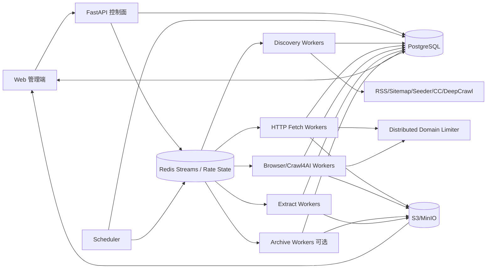

# 博客知识库技术方案

版本：v2.0  
日期：2026-08-14  
适用范围：约 1000 个技术博客站点的全量历史采集、Markdown 清洗、持续扩站、增量同步与 Web 管理；设计可继续横向扩展到更大 URL 规模。

## 1. 目标与边界

### 1.1 核心目标

1. 首次接入站点时，尽可能完整发现并抓取当前仍可访问的历史文章。
2. 将标题、作者、发布时间、更新时间、标签、canonical URL、正文统一清洗为稳定 Markdown。
3. 1000 个站点可以长期运行，并允许后续持续增加站点，不依赖为每个站点写一套独立爬虫。
4. 支持增量同步，只处理新增或确实变化的文章，避免每天全站强刷。
5. 支持失败隔离、域级限流、断点续跑、幂等、去重、版本保留、规则回滚和离线重新抽取。
6. 提供 Web 管理端完成站点接入、发现预览、规则编辑、任务触发、运行状态、错误诊断、Markdown 预览和版本 diff。
7. 首次历史回灌和日常增量使用同一套数据模型和状态机，不维护两套独立系统。

### 1.2 “全量历史”的定义

分为两档：

- **Live Full**：目标站当前能够通过 Sitemap、Feed、归档页、站内链接、公开索引等方式发现且仍可访问的历史文章。
- **Archive Full（可选）**：在 Live Full 基础上，通过 Common Crawl / Wayback 等历史索引发现已经删除、迁移或不再从当前站点暴露的 URL，并在来源许可、robots、版权和服务条款允许的前提下恢复历史快照。

必须区分“发现过历史 URL”和“已经获得历史正文”。Common Crawl / Wayback 发现到 URL，不代表当前源站仍有正文。

### 1.3 非目标

- 不绕过登录、付费墙、验证码或明确访问限制。
- 不默认所有站点都使用浏览器渲染；静态 HTTP 能解决时优先低成本快路径。
- 不把 LLM 作为正文抽取主路径，避免高成本、不可重复和内容改写。
- 向量库/RAG 不作为采集一期强依赖，但数据模型预留索引状态和 chunk 版本。

## 2. 设计原则

1. **Discovery、Fetch、Extract 三段强制解耦**：发现 URL 不等于下载正文，下载原始内容不等于生成 Markdown。
2. **PostgreSQL 是状态真相源**：Redis 和 Crawl4AI 本地缓存都只负责性能与分发，不能承担业务正确性。
3. **端到端流式与分批**：禁止把几十万 URL 或抓取结果一次性积在进程内存。
4. **跨域并发、域内克制**：不同站点可并行，同域默认低并发并动态退避。
5. **HTTP 优先，浏览器升级**：浏览器只处理确实依赖 JS 的页面。
6. **原始快照优先保留**：规则变化后从 raw HTML 离线重抽，不重新访问 1000 个源站。
7. **规则必须版本化**：站点模板变化是长期常态，规则需要 draft、test、publish、rollback。
8. **增量从发现阶段开始**：优先通过 Feed/Sitemap/HTTP Validator 减少需要访问的 URL，而不是全量抓完再 hash 去重。
9. **外部工具能力通过 Provider/Adapter 隔离**：Crawl4AI、Common Crawl、Wayback 等可替换，不让业务状态绑定某个库的内部缓存和返回结构。

## 3. 总体架构



系统分为四个平面：

- **控制面**：站点、规则、计划、人工操作、发布与回滚。
- **发现面**：RSS、Sitemap、AsyncUrlSeeder、Common Crawl、归档页、受限 deep crawl。
- **数据面**：HTTP 下载、Browser 下载、raw 存储、正文抽取、Markdown 版本。
- **协调面**：任务队列、lease、domain limiter、重试、优先级、backpressure。

## 4. 技术栈

| 层 | 推荐 | 说明 |
|---|---|---|
| API / 管理后端 | Python + FastAPI | 与抓取侧同语言，异步友好，OpenAPI 完整 |
| Web | React / Next.js | 适合后台管理、日志、diff、规则编辑与预览 |
| 状态/元数据 | PostgreSQL | 事务、唯一约束、批量 UPSERT、lease、审计能力强 |
| 工作队列 | Redis Streams + Consumer Group | 当前规模轻量，支持 pending/reclaim 和水平扩容 |
| 分布式限流 | Redis token bucket / semaphore + Lua | 多 worker 对同一域共享并发和速率限制 |
| HTTP 抓取 | httpx / aiohttp | 连接池、HTTP Validator、低资源成本 |
| Browser | Crawl4AI / Playwright | 动态页面、Markdown、Browser session、批量调度 |
| Discovery | 自建 Provider 接口 + Crawl4AI AsyncUrlSeeder + Sitemap/CC Provider | 外部能力可替换，业务 checkpoint 独立 |
| Markdown | Crawl4AI Markdown Generator + 自定义规范化 | 确定性清洗，保留代码、标题、链接 |
| 对象存储 | S3 / MinIO | raw HTML、Markdown、附件、历史版本 |
| 监控 | Prometheus + Grafana + OpenTelemetry | 指标、日志和链路追踪 |
| 部署 | Docker Compose 起步，Kubernetes 按需 | 1000 站点不必一开始就上 K8s |

Markdown 正文不建议逐篇直接提交 GitHub 作为主存储；GitHub 适合保存方案、配置模板和规则代码。正文主存储使用 S3/MinIO 或独立内容仓库。

## 5. 站点生命周期与配置模型

### 5.1 生命周期

```text
draft -> probing -> validated -> backfilling -> active
                   \-> rejected
active -> degraded -> active
active -> disabled
```

- `draft`：仅录入站点。
- `probing`：探测 robots、Feed、Sitemap、站点类型、文章路径。
- `validated`：至少一组 golden URL 通过。
- `backfilling`：首次历史回灌。
- `active`：正常增量。
- `degraded`：连续失败、模板变化、限流或站点迁移。

### 5.2 站点配置

```yaml
site_id: example
name: Example Blog
base_url: https://example.com
enabled: true
schedule: "0 */6 * * *"
robots_policy: respect

allowed_hosts:
  - example.com
  - www.example.com

limits:
  domain_concurrency: 1
  min_delay_ms: 1000
  max_delay_ms: 3000
  request_timeout_s: 30
  sitemap_concurrency: 4

incremental:
  lookback_days: 7
  reconciliation_days: 7

discovery:
  strategies:
    - rss
    - sitemap
    - seeder
    - commoncrawl
    - archive_pages
    - deep_crawl
  include_patterns:
    - "/blog/**"
  exclude_patterns:
    - "/tag/**"
    - "/search**"
  max_preview_urls: 200

fetch:
  prefer_http: true
  browser_fallback: true
  wait_for: null
  block_resource_types:
    - media
    - font

extract:
  strategy: auto
  article_selector: null
  title_selector: null
  author_selector: null
  date_selector: null
  remove_selectors:
    - nav
    - footer
    - aside
    - .comments

identity:
  canonical_from_html: true
  query_whitelist: []
  trailing_slash_policy: normalize
```

### 5.3 接入层级

1. **零代码通用模式**：RSS/Sitemap + 自动正文抽取。
2. **声明式模式**：CSS/XPath、分页、等待条件、路径规则。
3. **Adapter 插件模式**：复杂 API、特殊分页、JS URL、自定义 canonical。

```python
class SiteAdapter(Protocol):
    async def discover(self, ctx) -> AsyncIterator[DiscoveredUrl]: ...
    async def prepare_request(self, url, ctx) -> FetchRequest: ...
    async def extract(self, snapshot, ctx) -> ArticleDocument: ...
    def canonicalize(self, url, html, ctx) -> CanonicalResult: ...
```

### 5.4 规则版本

```text
draft -> testing -> published -> superseded
                  \-> rejected
published -> rollback_to_previous
```

发布前对 3~5 个 golden URL 回放 raw HTML，检查标题、正文长度、代码块、链接、日期、图片数量，并与生产版本做 Markdown diff；通过后原子切换 active rule。

## 6. Discovery：全量历史 URL 发现

### 6.1 Provider 抽象

Discovery 不直接把某个第三方库作为业务入口，而统一封装为 Provider：

```python
class DiscoveryProvider(Protocol):
    async def scan(
        self,
        site: Site,
        checkpoint: DiscoveryCheckpoint | None,
    ) -> AsyncIterator[DiscoveredUrl]: ...
```

统一输出至少包括：

```text
site_id
url
discovery_source
source_locator
source_lastmod
source_published_at
source_cursor
confidence
discovered_at
```

Provider 每产生一小批 URL 就批量 UPSERT `url_frontier`，不等待整个站点扫描完成。

### 6.2 第一优先级：RSS / Atom / JSON Feed

用途：日常增量的最快信号。

保存：

- entry GUID / id。
- published_at / updated_at。
- feed ETag / Last-Modified。
- feed body hash。
- 最近成功扫描时间。

Feed 通常只保留最近 N 篇，因此不能单独承担首次全历史。

### 6.3 第二优先级：Sitemap / Sitemap Index

用途：Live Full 的主力。

发现入口：

- `robots.txt` 中声明的 Sitemap。
- `/sitemap.xml`。
- `/sitemap_index.xml`。
- 站点配置指定的自定义 sitemap URL。

实现要求：

- 支持 sitemap index、嵌套 sitemap 和 `.gz`。
- XML 流式解析，避免把超大 sitemap 整体转成对象树。
- 子 sitemap 有界并发，默认 2~4，不为所有子 sitemap 一次性创建无限 task。
- 每个 sitemap 独立记录 ETag、Last-Modified、body hash、lastmod 和扫描时间。
- 条目 `lastmod` 仅作为变化信号之一，不绝对信任。
- Sitemap 缓存是性能层，业务 checkpoint 必须落 PostgreSQL。

### 6.4 Crawl4AI AsyncUrlSeeder 的使用位置

AsyncUrlSeeder 用于：

- 新站快速探测。
- 中小规模站点的 Sitemap + Common Crawl 候选发现。
- Web 中 URL 发现预览。
- 对歧义 URL 做少量 head metadata 预筛。

不把它直接当业务 Frontier，原因：

1. 最终 API 以 `List` 返回结果，超大域仍会随结果总量占内存。
2. `max_urls` 是截断，不是可靠可恢复分页；全量任务不能因为达到 `max_urls` 就标记完成。
3. 本地 cache 不共享，无法承担多 worker checkpoint。
4. `many_urls()` 不用于一次性对 1000 域全量 `gather`。
5. `extract_head=True` 实际会发 partial GET 并读取到 `</head>` 或大小上限，不适合几十万 URL 默认开启。
6. `live_check` 的 HEAD 失败不能直接判定文章失效，部分站点会拒绝 HEAD。
7. 工具内并发参数只作为单进程保护，集群级限流仍由 Redis Domain Limiter 控制。

默认：

```text
extract_head = false
live_check   = false
```

仅在站点探测、候选分类困难、canonical/JSON-LD 判断需要时对小批 URL 开启。

### 6.5 Common Crawl Provider

用途：首次历史回灌和补漏，不作为高频增量信号。

大型站点优先使用直接流式 Common Crawl index Provider，而不是把所有结果聚合进 Seeder List。

要求：

- 按 index/cursor 流式读取。
- 每 500~2000 条批量 UPSERT Frontier。
- 记录使用的 CC index id 和 scan checkpoint。
- 写 Frontier 前再次做 allowed host、scheme、port、path、query 和 SSRF 校验。
- CC 返回子域不代表允许抓取。

### 6.6 站点归档页 Provider

用于没有完整 Sitemap 的博客：

- 年份/月度归档。
- `/page/2`、`?page=2` 等分页。
- 分类页。
- 公开文章索引页。

每类分页保存 cursor，确保中断后继续。

### 6.7 受限 Deep Crawl Provider

只做最后补漏：

- 限同域/允许子域。
- 限深度。
- 限 URL 数预算。
- 限 query 参数白名单。
- 排除日历、搜索、登录、标签组合等无限空间。

Deep crawl 更适合实时未知结构探索，不作为 1000 站点全量历史的第一入口。

### 6.8 Archive Backfill（可选）

如果业务要求恢复已删除文章：

1. 通过 Wayback/CC 获取历史 URL + snapshot timestamp。
2. 先请求 live URL。
3. live 为 404/410/迁移且历史快照可用时，按合规策略读取快照。
4. `article_versions` 标记：
   - `source_kind = live | wayback | commoncrawl`
   - `snapshot_at`
   - `source_archive_url`
5. Archive 和 Live 不 silent merge，保留来源追溯。

### 6.9 Discovery 完成语义

每个 source run 必须区分：

```text
queued -> running -> completed
                  -> partial
                  -> failed
```

以下情况只能标记 `partial`，不能算全量完成：

- 命中无 checkpoint 的 `max_urls` 截断。
- sitemap 子文件失败未重试成功。
- CC index 扫描中断且 cursor 未到终点。
- deep crawl 达到预算上限。
- robots/权限阻止部分区域。

## 7. Discovery Checkpoint

`discovery_checkpoints` 按 `(site_id, provider, source_locator)` 记录：

- `etag`
- `last_modified`
- `body_hash`
- `last_seen_guid`
- `last_seen_published_at`
- `sitemap_lastmod`
- `cursor`
- `cc_index_id`
- `last_success_at`
- `last_full_completed_at`
- `provider_version`

Checkpoint 必须和本地工具 cache 分离。worker 换机器、容器重建、Crawl4AI cache 清空都不能影响业务断点续跑。

## 8. URL Frontier

所有发现 URL 统一进入 `url_frontier`：

- `site_id`
- `normalized_url`
- `original_url`
- `url_kind = article | list | asset | unknown`
- `discovery_source`
- `discovered_at`
- `source_lastmod`
- `priority`
- `crawl_state`
- `next_fetch_at`
- `last_fetch_at`
- `etag`
- `last_modified`
- `raw_hash`
- `content_hash`
- `retry_count`
- `lease_owner`
- `lease_until`
- `canonicalizer_version`

唯一约束：

```text
(site_id, normalized_url)
```

状态：

```text
discovered
  -> queued
  -> leased
  -> fetched
  -> extracted
  -> success

leased -> retry_wait -> queued
leased -> dead_letter
leased -> skipped_robots
leased -> source_deleted
leased -> suspect
```

Frontier 是真实状态源；Redis 消息可以丢失并由数据库重建。

## 9. 队列、Lease 与优先级

### 9.1 At-least-once

Redis Streams 使用 Consumer Group，接受同一任务重复投递。

正确性来自：

- DB task lease。
- 唯一约束。
- 幂等键。
- pending reclaim。
- 成功持久化后再 ACK。

### 9.2 多级 Stream

```text
crawl:incremental
crawl:manual
crawl:retry
crawl:backfill
crawl:archive
```

加权轮询示例：

```text
incremental : manual : retry : backfill : archive
      8      :   4    :   3   :    2     :   1
```

并设置历史回灌最低配额，避免 backlog 永远饿死。

### 9.3 不把全 Frontier 塞进 Redis

Scheduler 从 PostgreSQL 每次 lease 1000~5000 条近期任务，只把即将执行的任务放入 Redis。

## 10. 分布式域级限流

### 10.1 两层限制

**集群级 Redis Domain Limiter** 是权威限制：

```text
rate:{domain}:concurrency_current
rate:{domain}:concurrency_limit
rate:{domain}:next_allowed_at
rate:{domain}:penalty_until
rate:{domain}:tokens
```

Lua 原子完成：

1. 检查 cooldown。
2. 检查并发额度。
3. 检查 token/下一允许时间。
4. 发放带 TTL 的 lease token。
5. worker 完成 release；崩溃后 TTL 自动回收。

**worker 内限制** 只保护本机资源：

- HTTP connection limit。
- Crawl4AI `MemoryAdaptiveDispatcher`。
- Browser slot。
- 本地 semaphore。

不能把普通 semaphore 当成严格“每秒请求数”。严格 QPS/最小间隔由 Redis limiter 统一保证。

### 10.2 动态退避

- 429：优先尊重 `Retry-After`，降低速率并进入 penalty。
- 503：指数退避 + jitter。
- 403：不盲目重试，进入冷却并检查权限/风控。
- 连续 timeout：降低同域并发。
- 连续成功一段时间后缓慢恢复。

## 11. Fetch：HTTP 快路径 + Browser 升级

### 11.1 HTTP 快路径

默认使用长生命周期 `httpx.AsyncClient`：

- 连接池复用。
- 超时和最大响应体限制。
- Redirect chain 记录。
- `If-None-Match` / ETag。
- `If-Modified-Since` / Last-Modified。
- 304 直接标记 unchanged，不进入 Extract。

### 11.2 HEAD 的语义

HEAD 可用于探测，但失败不直接判死：

- 2xx：可认为当前可达。
- 301/308：记录迁移。
- 403/405/异常：标记 unknown，需要 GET fallback。
- 连续多轮 404/410 后才进入 `source_deleted`。

### 11.3 Browser 升级条件

只有以下情况升级 Crawl4AI/Playwright：

- 初始 HTML 是 CSR shell。
- 正文依赖 JS 注入。
- 必须点击/滚动/等待 selector。
- 服务端 HTML 与浏览器呈现差异明显。

浏览器 context 池化，禁止一个 URL 启一个浏览器进程。

### 11.4 大批 Browser 任务流式处理

```python
run_config = CrawlerRunConfig(stream=True)
dispatcher = MemoryAdaptiveDispatcher(
    max_session_permit=browser_slots,
    rate_limiter=RateLimiter(...),
)

async for result in await crawler.arun_many(
    urls=batch,
    config=run_config,
    dispatcher=dispatcher,
):
    await persist_raw_and_state(result)
```

Crawl4AI 内部 RateLimiter 是本机保护；域级安全边界仍由 Redis limiter 负责。

## 12. Fetch 与 Extract 强制解耦

Fetch 只负责：

- 下载响应。
- 保存 status/header/final URL/redirect chain。
- 保存 raw HTML。
- 计算 raw hash。

Extract 只负责：

- 加载指定 raw snapshot。
- 使用指定 rule/extractor 版本。
- 生成 Markdown。
- 质量检查。
- 创建文章版本。

规则变化后批量 re-extract，不重新访问源站。

## 13. 正文抽取与 Markdown 规范

### 13.1 抽取顺序

1. 站点专用 `article_selector`。
2. 语义 HTML：`article` / `main`。
3. JSON-LD `Article` / `BlogPosting` 元数据。
4. Crawl4AI Markdown Generator。
5. `PruningContentFilter` / 自定义规则移除导航、页脚、相关推荐和高 link-density 噪声。
6. 特殊 Adapter。

Discovery selector 与正文 selector 分开版本化。

### 13.2 Markdown 格式

```markdown
---
site_id: example
canonical_url: https://example.com/posts/123
source_url: https://example.com/posts/123?utm_source=x
title: Example
published_at: 2024-05-01T10:00:00Z
updated_at: 2024-05-02T10:00:00Z
fetched_at: 2026-08-14T09:00:00Z
author: Alice
tags: [python, crawler]
content_hash: sha256:...
extractor_version: 3
rule_version: 7
source_kind: live
version: 2
---

# Example

正文……
```

规范：

- 只保留一个一级标题。
- 代码块保留语言标记。
- 表格尽量转换 Markdown；复杂表格允许保留 HTML。
- 图片和内链转绝对 URL。
- 可选下载图片到对象存储并改写引用。
- 移除 script/style/nav/footer/comments/cookie banner。
- UTF-8 + LF。
- 不使用 LLM 自动改写原文。

## 14. URL 归一化、文章身份与去重

### 14.1 URL 归一化

1. 相对 URL -> 绝对 URL。
2. scheme/host 规范化，host 小写，移除默认端口。
3. 去 fragment。
4. 删除确定的跟踪参数，如 `utm_*`、`fbclid`。
5. 站点规则处理尾斜杠。
6. 内容型 query 参数使用白名单保留。
7. 读取 `<link rel="canonical">`，但必须校验 allowed host。
8. 保存 redirect chain。
9. canonicalizer 版本化。

### 14.2 文章身份

```text
article_key = sha256(site_id + canonical_url)
```

同时维护：

- `raw_hash`：原始响应内容。
- `body_text_hash`：规范化正文。
- `simhash/minhash`：可选，用于镜像和跨 URL 重复候选。

规则：

- 同 URL content hash 不变：不创建新文章版本。
- 同 URL 内容变化：创建 `article_versions`。
- 不同 URL 高相似：进入 duplicate candidate，不自动物理删除。

## 15. 增量同步

### 15.1 信号优先级

1. RSS/Atom 新 GUID / entry id。
2. Sitemap 新 URL / lastmod / sitemap hash 变化。
3. 归档/列表页前 N 页 + watermark。
4. HTTP Validator。
5. 内容 hash。
6. 低频 reconciliation 补漏。

### 15.2 增量策略

每个站点保存 3~14 天 lookback，防止：

- 延迟发布时间。
- 旧文章回填。
- 更新时间变更。
- 列表排序改变。

Sitemap source 本身也做增量：

- 优先 conditional GET。
- body hash 不变时跳过重新展开。
- sitemap index 只重扫发生变化的子 sitemap。
- 条目 lastmod 变化后再将文章 URL 提升优先级。

Common Crawl 不作为高频日常增量；按周/月或人工触发做覆盖 reconciliation。

### 15.3 删除与迁移

- 404/410 不立即物理删除知识库历史。
- 多轮确认后标记 `source_deleted_at`。
- 301/308 更新 redirect/canonical 关系。
- Web 可从当前视图隐藏，但历史版本仍保留。

## 16. 数据模型

### `sites`

站点身份、生命周期、调度、robots、限流、active rule。

### `site_hosts`

允许 host、host 类型、是否允许抓取、域级限流覆盖值。

### `site_rule_versions`

Discovery/Extract/Canonical 规则版本、状态和测试结果。

### `golden_urls`

站点回归样本和期望字段。

### `discovery_sources`

每站点的 RSS、Sitemap、CC、归档页等来源定义。

### `discovery_runs`

一次 source scan 的状态、开始/结束、发现数量、partial 原因。

### `discovery_checkpoints`

ETag、Last-Modified、hash、GUID、cursor、CC index、最后成功时间。

### `url_frontier`

候选 URL、状态、优先级、lease、validator、discovery metadata。

### `crawl_jobs`

full / incremental / manual / archive / reextract 总体任务。

### `crawl_tasks`

单 URL task、attempt、错误、耗时、lease、worker。

### `fetch_snapshots`

HTTP header、status、raw key、raw hash、redirect chain。

### `articles`

文章逻辑身份、canonical URL、发布时间、当前版本。

### `article_versions`

Markdown key、content hash、rule/extractor version、source kind。

### `duplicate_candidates`

不同 URL 的相似内容候选。

### `site_health_events`

429、403、timeout、selector fail、soft404 等健康事件。

## 17. 对象存储布局

```text
kb/
  raw/{site_id}/{yyyy}/{mm}/{article_key}/{fetch_id}.html.gz
  md/{site_id}/{yyyy}/{mm}/{article_key}/v{n}.md
  assets/{site_id}/{article_key}/...
  archive/{site_id}/{article_key}/{snapshot_at}/...
```

PostgreSQL 存状态、索引和小型元数据；大 HTML/Markdown 放对象存储。

## 18. Web 管理功能

### 18.1 站点接入向导

输入域名后展示：

- robots 状态。
- Feed/Sitemap 发现结果。
- Sitemap index 结构。
- URL path 分布。
- HTTP/Browser 初步判定。
- Discovery 各来源抽样数量。
- Sitemap 与 CC 重叠率。
- 文章候选比例。
- golden URL 自动候选。

### 18.2 Discovery 管理

- 每个 Provider 的最近运行状态。
- checkpoint。
- discovered/unique/new URL 数量。
- source coverage。
- partial/failed 原因。
- 预览模式与完整回灌明确区分。
- 手工重新扫描某个 sitemap/Feed/CC index。

### 18.3 规则编辑与发布

- Discovery rules。
- Article extraction rules。
- Canonical rules。
- raw HTML 回放。
- Markdown 预览。
- 新旧规则 diff。
- golden URLs 批量测试。
- publish / rollback。

### 18.4 任务管理

- 全量同步。
- 增量同步。
- 暂停/恢复。
- 单站/单文章重试。
- re-extract without refetch。
- Archive Backfill。
- backlog、完成量、速率、失败分类。

### 18.5 错误诊断

- DNS/TLS/timeout。
- 429/403/5xx。
- HEAD 拒绝但 GET 可用。
- robots 拒绝。
- Browser crash/OOM。
- selector 失效。
- soft 404 / Access Denied 页面。
- 正文过短/空文档。
- dead-letter 与 replay。

### 18.6 内容管理

- raw HTML / Markdown 对照。
- Front Matter。
- 历史版本 diff。
- canonical/redirect 关系。
- duplicate candidates。
- live/archive 来源标记。

## 19. 质量控制

自动质量门槛：

- 标题为空 -> suspect/fail。
- 正文小于站点阈值 -> suspect。
- 主体 link density 过高 -> suspect。
- 一批文章正文 hash 相同 -> 可能登录页/风控页/SPA shell。
- HTTP 200 但页面是 404/Access Denied -> soft error。
- 新规则导致大量正文突变 -> template suspect。
- 代码块数量突然归零 -> formatter suspect。
- 发布日期解析异常 -> metadata suspect。

站点健康度综合：

- discovery success rate。
- fetch success rate。
- extract success rate。
- suspect ratio。
- duplicate ratio。
- 最近成功时间。
- golden test pass rate。

## 20. 重试与幂等

### 20.1 错误分类

**可自动重试**：timeout、connection reset、429、502/503/504、临时 Browser crash。

**条件重试**：403、401、soft block、大面积 selector fail。

**不自动重试**：robots 禁止、明确 410、非法 URL、host 不在 allowlist。

### 20.2 幂等键

```text
idempotency_key = task_type + site_id + normalized_url + input_snapshot + rule_version
```

所有持久化写入使用唯一约束/UPSERT，保证重复消息不产生重复版本。

### 20.3 Dead Letter

超过最大重试进入 dead-letter，Web 支持单条、按站点、按错误类型 replay；修规则后可批量 re-extract。

## 21. 安全、robots 与合规

- 默认遵守 robots.txt。
- 明确 User-Agent 与联系信息。
- 不绕过认证、验证码、付费墙。
- SSRF：拒绝 localhost、RFC1918、link-local、metadata IP。
- DNS 解析后校验 IP；每次 redirect 后再次校验 host/IP，防 DNS rebinding/redirect SSRF。
- Browser 网络请求限制在 allowed host，屏蔽无关资源。
- Secret/代理/cookie 只保存 Secret Manager 引用。
- CC/Wayback/Domain discovery 发现 admin/staging/API 不代表许可抓取。
- 保存 source URL、fetched_at、source_kind 和版权/许可证元数据。

## 22. 可观测性

### 全局指标

- discovery URLs/s。
- Frontier insert/upsert rate。
- fetch success rate。
- extract success rate。
- queue lag。
- pending/reclaimed tasks。
- P50/P95 fetch latency。
- Browser usage ratio。
- 304 ratio。
- bytes downloaded。
- Markdown generated/day。
- raw -> md processing lag。

### Discovery 指标

- 每 Provider 新增 URL 数。
- Sitemap 子文件失败数。
- source scan partial ratio。
- Sitemap/Feed/CC overlap ratio。
- unknown URL 分类比例。
- discovery checkpoint age。

### 站点指标

- 最近成功时间。
- 429/403 比例。
- 当前 penalty/cooldown。
- 新增/更新文章数。
- selector suspect 数。
- golden test 通过率。

## 23. 容量、背压与初始参数

假设 1000 站点、平均 500 篇历史文章约 50 万篇；真实规模可能到数百万 URL，因此全部采用流式、分批和 lease。

初始部署：

- API x1
- Scheduler x1（DB lease 选主）
- Discovery worker x2
- HTTP fetch worker x4
- Browser worker x2
- Extract worker x2
- Archive worker x0~1
- PostgreSQL x1
- Redis x1
- MinIO x1

初始限制：

- domain concurrency 默认 1。
- domain delay 默认 1~3 秒。
- Sitemap 子文件并发 2~4。
- HTTP worker 每进程 20~50 全局 slot。
- Browser worker 每进程 4~8 slot，并由内存阈值动态下调。
- Frontier 每批 lease 1000~5000。
- Discovery 批量 UPSERT 500~2000 URL/批。

背压：

- Extract lag 过大 -> Fetch 降速。
- S3 写异常 -> 暂停 lease 新 Fetch。
- Browser 内存高 -> Dispatcher 降并发。
- Redis Stream 超阈值 -> Scheduler 减少 dispatch。
- PG Frontier 写入延迟高 -> Discovery 降速。

## 24. 站点模板变化策略

检测：

- golden URL 定时回归。
- selector 空值率。
- Markdown 长度分布突变。
- 同站多文章相似度异常。
- Browser fallback 比例突然升高。

处理：

1. 自动标记 degraded。
2. 降低抓取速率。
3. Web 展示正常 raw 与异常 raw diff。
4. 创建新 rule draft。
5. 在历史 raw 上离线调试。
6. golden test 通过后 publish。
7. 批量 re-extract，不 refetch。

## 25. 关键伪代码

### 25.1 Discovery Worker

```python
async def run_discovery(site, provider):
    checkpoint = await load_checkpoint(site.id, provider.name)
    run = await create_discovery_run(site.id, provider.name)

    batch = []
    try:
        async for item in provider.scan(site, checkpoint):
            normalized = canonicalize_candidate(item.url, site)
            if not is_allowed_candidate(normalized, site):
                continue

            batch.append(frontier_row(site, normalized, item))
            if len(batch) >= 1000:
                await bulk_upsert_frontier(batch)
                batch.clear()
                await persist_checkpoint(run, item.source_cursor)

        if batch:
            await bulk_upsert_frontier(batch)

        await mark_discovery_completed(run)
    except ProviderTruncated as e:
        await mark_discovery_partial(run, reason=str(e))
    except Exception:
        await mark_discovery_failed(run)
        raise
```

### 25.2 增量调度

```python
async def run_site_incremental(site):
    for provider in incremental_providers(site):
        await enqueue_discovery(site, provider)

    while batch := await lease_due_urls(
        site_id=site.id,
        limit=1000,
        purpose="incremental",
    ):
        await publish_by_priority(batch)
```

### 25.3 Fetch Worker

```python
async def fetch_worker(task):
    if not await acquire_task_lease(task):
        return

    token = await distributed_domain_limiter.acquire(task.domain)
    if not token:
        return await reschedule(task)

    try:
        resp = await try_http_conditional(task)

        if resp.status == 304:
            return await mark_unchanged(task)

        if needs_browser(resp):
            return await enqueue_browser(task)

        raw_key = await save_raw(resp)
        await mark_fetched(task, raw_key)
        await enqueue_extract(task, raw_key)
    finally:
        await distributed_domain_limiter.release(token)
```

### 25.4 Extract Worker

```python
async def extract_worker(task, raw_key, rule_version):
    raw = await object_store.get(raw_key)
    doc = await extract_to_markdown(raw, rule_version)
    normalized = normalize_document(doc)
    h = sha256(normalized.body)

    if h == task.previous_content_hash:
        return await mark_unchanged(task)

    md_key = await save_markdown_version(normalized)
    await upsert_article_version(
        task=task,
        doc=normalized,
        content_hash=h,
        md_key=md_key,
        rule_version=rule_version,
    )
```

## 26. 分阶段实施

### Phase 1：MVP（20~50 站点）

- sites/frontier/articles/article_versions。
- RSS + Sitemap Provider。
- HTTP fast path + Crawl4AI Browser fallback。
- raw HTML + Markdown 对象存储。
- Redis Streams + DB task lease + 幂等。
- Web CRUD、任务和错误列表。
- 增量 checkpoint。

### Phase 2：扩到 1000 站点

- Crawl4AI AsyncUrlSeeder 接入 Provider。
- Common Crawl 流式 Provider。
- 归档页 / 受限 deep crawl。
- 分布式 Domain Limiter。
- 多 Stream 优先级。
- Discovery source/run/checkpoint 完整状态。
- 规则版本和 golden URL 回归。
- 自动 degraded 与监控。

### Phase 3：极致历史覆盖与知识库能力

- Archive Backfill（Wayback/CC snapshot）。
- 自动模板变化检测。
- duplicate/mirror 聚类。
- 全文/向量索引。
- chunk/version/reference 追踪。
- 内容质量评分和人工审核队列。

## 27. 验收标准

### 功能

- 新增站点不改核心控制流；80% 以上普通技术博客可通过通用/声明式模式接入。
- 单站首次全量任务可中断后继续，不从头重新扫描。
- 日常增量不需要全站重抓。
- 规则修改可在历史 raw 上重抽 Markdown。
- Web 可定位每个站点“发现失败、下载失败、抽取失败”属于哪一层。

### 正确性

- Frontier 唯一约束无重复逻辑 URL。
- 重复 Redis 消息不会生成重复文章版本。
- 全量任务存在截断/Provider 未完成时不会误标 completed。
- HEAD 失败不会直接误判 source_deleted。
- Worker/容器重启后 checkpoint 和任务可恢复。

### 性能

- Discovery、Fetch、Extract 均按批流式处理。
- 单进程内存不随全站 URL 总量线性无限增长。
- 同域并发由集群级 limiter 控制，多 worker 不叠加突破限制。
- Browser 只处理 HTTP 快路径无法完成的页面。

## 28. 参考资料

- Crawl4AI：https://github.com/unclecode/crawl4ai
- Crawl4AI URL Seeding：https://docs.crawl4ai.com/core/url-seeding/
- Crawl4AI Multi-URL Crawling：https://docs.crawl4ai.com/advanced/multi-url-crawling/
- Crawl4AI Domain Mapping：https://docs.crawl4ai.com/core/domain-mapping/
- Crawl4AI Markdown Generation：https://docs.crawl4ai.com/core/markdown-generation/
- Common Crawl Index：https://index.commoncrawl.org/

## 29. 最终架构摘要

最终采用：**站点生命周期/规则中心 + Provider 化多源 Discovery + 持久化 Discovery Checkpoint + PostgreSQL Frontier + Redis Streams 工作分发 + 分布式 Domain Limiter + HTTP/Browser 双路径 + Fetch/Extract 解耦 + Raw/Markdown 对象存储 + 增量 Validator + 规则版本/回归/回滚 + Web 控制面**。

Crawl4AI AsyncUrlSeeder 作为高效的 URL 候选发现与接入探测组件使用，但不承担业务 Frontier、跨 worker checkpoint 或集群级限流。Sitemap/RSS 负责新鲜度，Common Crawl/Archive 来源负责覆盖补漏，所有结果最终以可恢复、可审计、可重放的状态进入统一数据管道。
