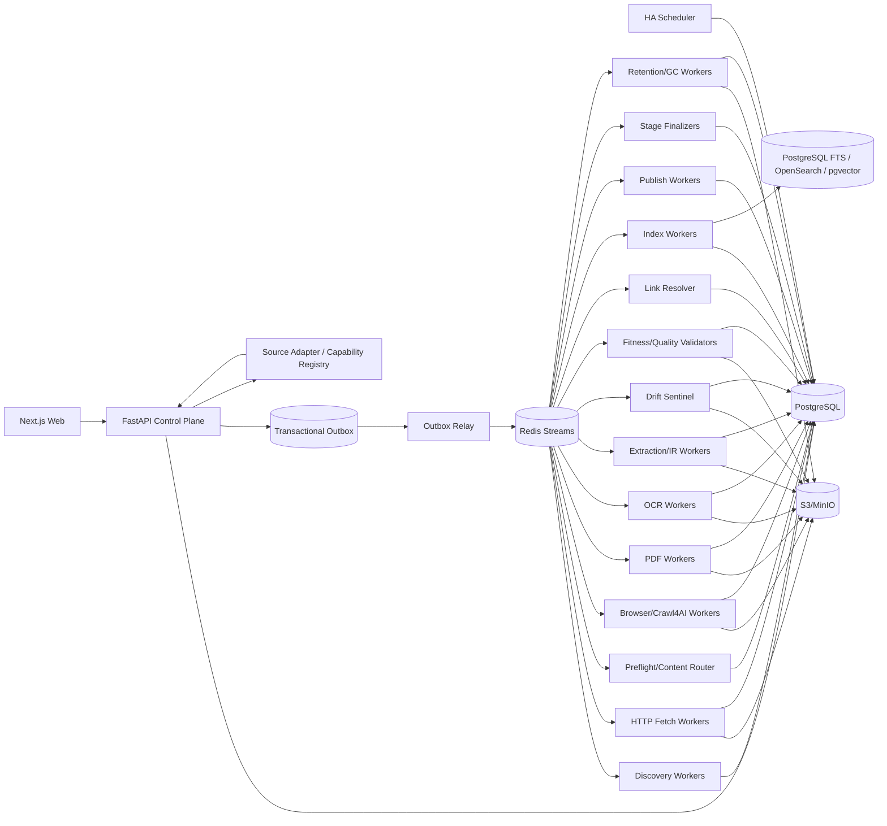

# 博客知识库技术方案

适用范围：从约 1000 个技术博客、技术文档站、Newsletter 与相关技术内容站点抓取尽可能完整的历史文章，清洗为稳定 Markdown 建设长期知识库；后续持续增加站点，支持增量同步、Web 管理、版本保留、搜索、故障恢复、离线重处理和外部发布。容量按百万级文档、数百万到千万级 URL、站点高度异构、长期运行设计。

## 1. 建设目标

1. 管理员只需录入站点根地址、博客入口或文档入口，系统自动探测 Sitemap、RSS/Atom/JSON Feed、平台 API、归档页、分类/标签/作者页、文档导航树、普通站内链接和动态列表，形成可审核的接入配置草稿。
2. 支持 `FULL_BACKFILL` 历史全量回灌、`INCREMENTAL` 持续增量、`RECONCILE` 覆盖校准、`TARGETED_FETCH` 精确补抓和 `REPROCESS` 离线重处理。
3. 不把“HTTP 200”“Browser success”“协程结束”视为业务成功；最终必须得到可验证的正文、metadata、结构、来源定位、质量结果和完整 lineage。
4. 最终知识对象统一保存标题、作者、发布时间、更新时间、标签、canonical、正文、代码块、表格、图片、附件、PDF、真实链接关系和来源定位，并从统一 Document IR 稳定渲染 Markdown。
5. 默认 HTTP-first，只有明确证据时升级 Browser/Crawl4AI/Playwright；PDF、Feed、JSON/API、附件按真实 Content-Type 路由。
6. 支持 ETag、Last-Modified、Sitemap lastmod、Feed GUID/API cursor、导航树 hash、body hash、Document IR hash、重叠窗口和周期 Reconcile 驱动的增量同步。
7. 支持 durable frontier、断点续跑、幂等、lease、heartbeat、重试、限流、熔断、公平调度、backpressure 和 dead-letter。
8. 保存不可变网络 Snapshot、原始 PDF、渲染 DOM、清洗 HTML、导航快照、raw/fit Markdown、Document IR、最终 Markdown、规则版本和质量结果；规则升级优先离线 replay。
9. 对固定 selector、模板变化和抽取器升级建立 Extraction Drift Sentinel，避免“抓到内容但抓错区域”的系统性静默污染。
10. Web 管理端支持站点接入、Source Adapter/Capability Registry、抓取作用域、Provider 覆盖、任务控制、URL 诊断、Browser Readiness、抽取漂移、质量审核、版本 diff、Retention、成本分析、搜索和发布。
11. 每次运行可复现、可解释、可审计；任何 Worker 都不能自行成为“业务完成”的唯一裁判。

## 2. 核心原则

1. PostgreSQL 是业务状态真相源；S3/MinIO 是不可变大对象真相源。
2. Redis Streams 只负责任务运输；决定性状态先写 PostgreSQL，再通过 Transactional Outbox 投递。
3. URL 被发现不等于允许访问，必须经过 URL Admission Pipeline；真实网络连接仍由 Egress Gateway 做 DNS/IP/端口/redirect 安全校验。
4. Crawl Scope 必须显式版本化，不能把 same-domain/internal-links 当隐式规则。
5. Sitemap、Feed、API、Archive、DOC_NAVIGATION、HTML frontier、Browser Dynamic Listing 是独立 Discovery Provider；单一 Provider 不能证明全站抓全。
6. Source Adapter、Discovery、Content Fetch 必须分离：适配器描述来源能力和发现语义，Discovery 枚举 URL，Content Fetch 统一负责请求、存证、路由、重试和质量。
7. “URL 已存在”只代表 identity 已知，绝不代表内容永久新鲜；去重与 freshness 必须分离。
8. HTTP、Browser、PDF/OCR 分层处理，不把所有 URL 无条件交给浏览器。
9. Browser 是昂贵升级路径；生产中复用长期 browser/crawler runtime，不为每个 URL 重建进程。
10. Browser 是否升级必须有可解释证据；页面是否完成由版本化 Readiness Contract 判断。
11. `networkidle` 不作为默认就绪条件，优先 `domcontentloaded + 稳定正文/导航条件`。
12. HTTP 200、Browser success、Extractor 无异常都不能证明内容有效，必须经过独立 Content Fitness Gate。
13. 单页 Fitness 与系统性 Extraction Drift 是两个问题，必须分别检测。
14. raw/fit Markdown 都只是 extraction candidate；最终知识真相是 accepted Canonical Document IR。
15. 文档 identity 与 URL 分离；redirect、canonical、slug rename、镜像和站点迁移只是 identity evidence。
16. `document_version` append-only，不覆盖旧版本。
17. JSON、Markdown、搜索索引和外部知识库都是 Document IR 的 Projection，不互相反解析。
18. 文件路径只属于发布视图，不能承担文档 identity，也不能用“文件存在”判断已同步。
19. `max_depth/max_pages/max_entries/max_runtime` 只是单次执行预算，不能作为历史完整性判定。
20. 固定 `word_count_threshold` 只能作为评分信号，不能静默丢弃短 API/reference/FAQ/CLI 页面。
21. Bloom Filter、RoaringBitmap、内存 Set 只能加速，不能替代数据库唯一约束和 durable frontier。
22. Scheduler、Redis consumer、浏览器进程和前端页面都是可丢失运行时状态，不能替代数据库里的 run/task/lease/schedule。
23. 核心领域字段通过 Typed Domain Writer 写入；关键字段只有唯一权威 Writer。
24. 阶段完成由 Stage Finalizer 对领域数据、Artifact、retry/dead-letter 对账。
25. 最终质量由独立 Deterministic Validator 重新计算，生产内容的 Worker 不能自行证明通过。
26. 历史知识对象默认长期保留；Retention/GC 必须按数据角色和 lineage 决定，禁止简单按“超过 N 天”删除权威历史。
27. 遵守 robots、站点政策、访问控制和合理速率；验证码、登录、付费墙、WAF 明确挑战进入策略流程，不自动绕过。

## 3. 总体架构



职责：

- **Control Plane**：站点配置、权限、Adapter/Provider Release、Run、Run Context、Schedule、命令和查询；
- **Source Adapter Registry**：声明来源能力、配置 schema、输出 schema、版本、健康状态、Golden/Canary 与绑定；
- **Scheduler**：只创建逻辑 Run，不执行长抓取；
- **Discovery**：按 Provider/Adapter 枚举 URL、checkpoint、导航树和覆盖证据；
- **Admission**：URL 规范化、Crawl Scope、robots、crawler trap、安全预检查；
- **HTTP Fetch**：条件请求、原始响应和不可变 Snapshot；
- **Preflight Router**：判断 HTTP 内容是否完整、是否需要 Browser、是否进入非 HTML 管线；
- **Browser/Crawl4AI**：仅处理需要 JS 渲染/交互的页面，采用长期 runtime；
- **PDF/OCR**：处理 PDF、扫描件和页级内容；
- **Extraction/IR**：产生多个 extraction candidate 和统一 Document IR；
- **Drift Sentinel**：检测 selector/template/extractor 的系统性漂移并 quarantine/fallback；
- **Fitness/Quality**：阻断“请求成功但正文为空/不完整/过度裁剪/结构退化”；
- **Stage Finalizer**：以数据库真实集合和 COMPLETE Artifact 对账阶段状态；
- **Publish**：从 accepted version 产生文件树/Git/对象存储/外部 KB Projection；
- **Retention/GC**：按 retention class 和 lineage 做受审计的回收；
- **Dashboard**：读取事实并发出显式命令，不参与流程锁。

## 4. Crawl Mode 与运行语义

```text
FULL_BACKFILL     首次历史全量回灌
INCREMENTAL       持续同步新增和更新
RECONCILE         周期重新枚举，修复断档
TARGETED_FETCH    精确 URL 抓取、调试或补抓
REPROCESS         不访问源站，基于已有 Snapshot 重抽取/清洗/质量/索引/发布
```

规则：

- FULL_BACKFILL 中 Page Type、Scorer、字数只能影响优先级或候选评分，不能静默丢弃已发现合法历史 URL。
- TARGETED_FETCH 必须逐项返回指定 URL 的真实结果，失败不能用相似 URL 补位。
- REPROCESS 必须记录 `source_snapshot_id/source_artifact_id` 和完整 lineage。
- 同站点默认只允许一个 active FULL_BACKFILL；其他模式的并行关系由显式策略定义。
- Run 完成由 Finalizer 判断，不由“所有协程结束”判断。

## 5. 不可变 Run Context

Run 创建时冻结：

```text
run_context_id
site_profile_release_id
site_source_release_ids
source_adapter_release_ids
adapter_binding_release_ids
provider_release_ids
crawl_scope_release_id
url_filter_release_id
url_scorer_release_id
fetch_profile_release_id
preflight_router_release_id
content_route_release_id
browser_action_plan_release_id
extraction_pipeline_release_id
extraction_drift_release_id
content_fitness_release_id
document_ir_schema_release_id
markdown_renderer_release_id
quality_contract_release_id
index_release_id
publish_release_id
retention_policy_release_id
runtime_bundle_release_ids
policy_release_id
credential_profile_id
secret_version_refs
context_hash
```

Context 创建后不可修改。Worker payload 只引用 `run_context_id`，禁止读取“latest release”。新规则处理旧 Snapshot 时创建 REPROCESS Run，并保留 lineage。

## 6. Source Adapter SDK、Capability Registry 与绑定发布

### 6.1 设计目标

新增 1000 个站点时，绝大多数接入应是“配置 + 通用 Provider”，少数特殊平台才需要代码 Adapter。Adapter 只表达来源特有的发现/分页/认证语义，不直接承担通用网页抓取和最终 Markdown 生成。

统一接口输出标准化 `DiscoveryRecord`：

```text
source_item_id
source_url
canonical_hint
title_hint
published_at_hint
updated_at_hint
cursor/page_token
content_type_hint
fetch_route_hint
discovery_evidence
raw_metadata_ref
```

禁止 Adapter 直接写 accepted document；所有记录必须进入 Admission -> durable frontier -> Content Fetch。

### 6.2 Capability 声明

每个 `source_adapter_release` 至少声明：

```text
adapter_name/version
config_schema/result_schema
supported_platforms
capabilities:
  DISCOVER
  BACKFILL
  INCREMENTAL
  CURSOR_PAGINATION
  TIME_RANGE_PAGINATION
  AUTH
  SITEMAP
  FEED
  API
  ARCHIVE
  DOC_NAVIGATION
  BROWSER_DISCOVERY
  ATTACHMENT_DISCOVERY
history_coverage_semantics
checkpoint_semantics
rate_limit_hint
allowed_host_pattern
healthcheck_contract
runtime_bundle_release_id
code/image digest
```

`adapter_binding_release` 固定：

```text
site_source_id
source_adapter_release_id
provider_release_id
credential_profile_id
mapping_profile_release_id
priority/fallback_order
enabled
binding_config_hash
```

### 6.3 发布与回滚

Adapter 发布必须经过：

```text
Config Schema Test
Contract Test
Golden Discovery
Golden Incremental
Pagination/Checkpoint Recovery
Rate-limit Test
Scope/SSRF Test
Canary Site
Rollback Test
```

Registry 由数据库/发布 Manifest 驱动，Worker 不依赖 import-time subclass reflection 作为业务真相。适配器失败必须隔离，不能阻塞其他站点。

## 7. 新站点接入：Discovery Probe

管理员录入入口后执行：

1. 请求入口，记录 final URL、Content-Type、响应头、编码、页面结构；
2. 解析 robots.txt 和其中 Sitemap；
3. 探测 Sitemap/Sitemap Index；
4. 探测 RSS/Atom/JSON Feed；
5. 识别 WordPress/Ghost/Substack 等公开 API 或归档能力；
6. 识别年/月归档、分类、标签、作者分页；
7. 识别技术文档侧边栏、章节树、上一页/下一页、版本和语言切换器；
8. 识别普通站内链接和动态列表；
9. 匹配 Capability Registry，推荐通用 Provider 或专用 Adapter；
10. 建议 Crawl Scope：host、子域、路径前缀、排除路径、query 策略、asset/api host；
11. 抽样 HTML/PDF/下载资源比例；
12. 对 3~10 个样本做 HTTP Preflight，比较正文完整度；
13. 只有 HTTP 内容不足时做 Browser Sample Probe；
14. 对动态样本比较 `domcontentloaded`、CSS/JS wait、显式交互等 Readiness；
15. 比较通用正文提取、Crawl4AI raw/fit、站点 selector 的结果；
16. 建立首版 Extraction Health Baseline 与 Golden Samples；
17. 对短 API/reference 页面单独校准 Content Fitness；
18. 对 PDF 测试 native parser，必要时测试 OCR；
19. 生成 Site Profile、Adapter Binding、Scope、Provider、Fetch、Router、Browser Action、Extraction、Drift、Fitness、Quality、Retention 草稿；
20. Web 展示证据、样本 diff、成本预测和风险；
21. dry-run/canary 通过后 publish；
22. 启动 FULL_BACKFILL，并创建 INCREMENTAL schedule。

## 8. Discovery Provider 与历史覆盖证明

Provider 一般优先级：

```text
Sitemap/Sitemap Index
 -> 平台 API / Source Adapter
 -> Feed
 -> Archive/Category/Tag/Author
 -> DOC_NAVIGATION
 -> 普通 HTML frontier
 -> Browser Dynamic Listing
 -> 外部公开索引补漏
```

每个 Provider 独立保存：

```text
provider_id/provider_type
source_adapter_release_id
checkpoint
last_success_at
continuity_marker
expected_count_hint
discovered_count
admitted_count
coverage_gap
status
```

每个 URL 保存 `discovery_evidence`：来源 Provider、source URL、href/guid、cursor/page token、导航树路径/顺序、版本/语言提示、observed_at、raw evidence ref。

FULL_BACKFILL 完成至少要求：

1. 主要 Provider 已完成或明确记录 gap；
2. durable frontier 无可执行 URL；
3. retry/dead-letter 已处理或被明确接受；
4. Reconcile 不再产生显著新增；
5. Coverage Ledger 无未知断档；
6. Finalizer 对 discovered/admitted/fetched/accepted 做可解释对账。

“抓了 N 页”“达到 max_depth”“某个 Sitemap 已结束”都不能单独证明历史完整。

## 9. Durable Frontier、URL Normalization 与 Crawl Scope

URL 唯一键建议：

```text
(site_id, sha256(normalized_url))
```

Admission Pipeline：

```text
normalize
 -> crawl scope
 -> egress/SSRF precheck
 -> robots/policy
 -> allow/deny path
 -> query normalization
 -> trap detection
 -> content-type hint
 -> page type
 -> priority scorer
 -> durable frontier upsert
```

Normalization 处理 host 大小写、IDN、fragment、默认端口、tracking query、query 顺序、session 参数、trailing slash 和 percent-encoding。

Crawler Trap 至少覆盖：无限日历、搜索参数组合、tag/filter 笛卡尔积、无界分页、session/token、无限日期路径和多排序组合。

Crawl Scope 显式保存：

```text
allowed_hosts
registrable_domains
include_subdomains
path_prefixes/path_excludes
query_policy
asset_hosts/api_hosts
redirect_policy
canonical_cross_host_policy
```

已知 URL 再次被发现时必须 UPSERT `last_seen_at/discovery_evidence/freshness_hint`，不能因为 URL 唯一约束而丢弃新的发现事实。

## 10. HTTP-first Preflight Fetch Decision Router

### 10.1 HTTP Probe

HTTP Worker 优先使用 `If-None-Match/If-Modified-Since`。304 只更新 freshness；200 先保存 raw bytes，再计算：

```text
status/final_url/content_type
etag/last_modified
content_length/body_hash
html_chars/script_count
noscript_text_chars
main_candidate_text_chars
semantic_block_count
heading_count/paragraph_count
structured_data_presence
canonical/title
content_density
boilerplate_ratio
```

先运行低成本候选：JSON-LD/OpenGraph/meta + selectolax/lxml + Trafilatura/Readability/Crawl4AI 非浏览器路径。

### 10.2 Browser escalation 证据

只在明确出现以下证据时升级：

```text
EMPTY_ARTICLE_BODY
SPA_SHELL
CLIENT_RENDER_MARKER
JS_PAGINATION
LOAD_MORE
INFINITE_SCROLL
SHADOW_DOM_REQUIRED
NAVIGATION_NOT_VISIBLE
HTTP_CONTENT_FITNESS_FAILED
```

每个 attempt 保存 `route_decision/route_reason/router_release_id/probe_metrics`。Web 按站点统计：

```text
http_success_rate
http_content_fitness_pass_rate
browser_escalation_rate
http_vs_rendered_content_delta
browser_cost_per_document
```

同站点长期 Browser escalation 很低时应收紧 Browser；长期很高时可为 page type 发布专用 profile，但保留周期 HTTP Probe，避免改版后永久走昂贵路径。

## 11. Content-Type Router 与混合文档

路由依据真实响应：

```text
response Content-Type
Content-Disposition
magic bytes
URL/path hint
parser probe
```

统一路由：

```text
HTML/XHTML       -> HTML pipeline
PDF              -> PDF pipeline
JSON             -> API/JSON pipeline
RSS/Atom/XML     -> Discovery/Feed pipeline
image/media/bin  -> Attachment pipeline
unknown/mismatch -> Sniff/Review
```

PDF 作为一等知识文档：

```text
RAW_PDF immutable artifact
 -> native parser
 -> page text/metadata/images/links
 -> Document IR candidate
 -> Quality
 -> Markdown/Index
```

文本密度过低时进入 OCR；OCR 以页为 checkpoint，保留 confidence 和 source locator。加密、损坏、超大 PDF 单独分类，不与普通 HTML 重试混合。

## 12. Browser/Crawl4AI Runtime 与 Readiness

### 12.1 长生命周期 Runtime

推荐：

```text
Worker start
 -> 初始化 AsyncWebCrawler/browser
 -> claim 小批任务
 -> 按 domain/profile 分组
 -> arun_many(stream=True) 或受控 arun
 -> 每个结果立即持久化 attempt/snapshot
 -> 继续复用 runtime
 -> 到 max age/max pages/RSS 阈值滚动重启
```

不允许一次把百万 URL 交给 `asyncio.gather()` 或单个巨型 `arun_many()`。建议 DB 每批 claim 20~100 个任务，再由 Worker 内部 Semaphore/Dispatcher 控制局部并发。

Crawl4AI 的 MemoryAdaptiveDispatcher/SemaphoreDispatcher/RateLimiter 只负责 worker-local 优化；跨 Worker 的 domain quota、礼貌限流、公平调度仍由控制面负责。

### 12.2 Readiness Contract

`browser_action_plan_release` 至少保存：

```text
wait_until
wait_for_css
wait_for_js
wait_timeout
min_main_text_chars
delay_before_snapshot
scroll_plan/max_scroll_rounds
load_more_plan
session_policy
resource_block_policy
```

优先级：

```text
domcontentloaded
 -> stable content selector
 -> explicit JS readiness
 -> bounded scroll/load-more action plan
 -> 仅特殊情况 networkidle
```

Readiness timeout 必须结构化记录，禁止保存“浏览器成功但正文仍为空”的结果。

### 12.3 Browser Cost Model

持续记录 runtime/page 耗时、峰值内存、crash rate、timeout rate、每站 escalation rate、每文档 Browser 成本。Browser pool 按真实资源动态限额，不得拖垮 HTTP 与增量主链路。

## 13. Access Challenge 与合规策略

挑战状态：

```text
ROBOTS_DENIED
AUTH_REQUIRED
PAYWALL
WAF_CHALLENGE
CAPTCHA_CHALLENGE
RATE_LIMITED
TERMS_REVIEW_REQUIRED
```

策略：

- robots/政策明确拒绝时停止自动抓取；
- 优先转官方 API、Feed、授权数据源、导出能力或数据合作；
- 429/503 尊重 Retry-After，并执行站点级退避和熔断；
- 不自动绕过验证码、登录、付费墙或明确访问控制；
- Access Challenge 与普通 `BROWSER_TIMEOUT` 分开统计，避免用更多 Browser 重试放大问题。

## 14. Extraction Fallback Contract

抽取按成本和确定性分层：

```text
Tier 1  JSON-LD / OpenGraph / meta / Feed/API metadata
Tier 2  Trafilatura / Readability / generic DOM extraction
Tier 3  Crawl4AI raw_markdown + fit_markdown candidate
Tier 4  versioned CSS/XPath site contract
Tier 5  LLM Structured Extraction with JSON Schema
Tier 6  Manual Review
```

具体顺序按站点/page type release 配置，Worker 不允许无限自由 fallback。

LLM extraction 仅在传统方法质量不足且页面价值足够时启用；输入优先 cleaned HTML/fit HTML，输出受 JSON Schema 限制并经过 deterministic validation。记录模型、prompt/schema release、token/cost；LLM 成功不能直接覆盖当前高质量 accepted version。

抽取阶段不得不可逆删除真实链接。若需要“无 URL 的 LLM 文本版”，只能生成额外 Projection；原始链接必须进入 Document IR 与 Link Graph。

## 15. Extraction Drift Sentinel

按 `site + page_type + extraction_pipeline_release` 保存滚动基线：

```text
dom_structure_fingerprint
main_selector_match_count
main_text_chars_p10/p50/p90
heading_count_distribution
paragraph_count_distribution
code_block_count_distribution
table_count_distribution
link_density_distribution
metadata_presence_rate
raw_fit_ratio_distribution
candidate_similarity_baseline
```

`dom_structure_fingerprint` 只归一化语义骨架，例如 article/main/section/heading 标签树、稳定 class token 白名单、JSON-LD @type、关键 aria/role 和正文容器相对路径。

### 15.1 Shadow Extraction

每站按 1%~5%、固定每日样本或风险自适应采样：

```text
Primary: 当前站点 extractor/selector
Shadow: Trafilatura/Readability/Crawl4AI generic extractor
```

比较：

```text
text_length_ratio
heading_overlap
paragraph_minhash_similarity
code_block_delta
table_delta
link_overlap
metadata_agreement
```

### 15.2 Drift 状态机

```text
HEALTHY
 -> SUSPECTED
 -> CONFIRMED
 -> QUARANTINED
 -> RECOVERED
```

进入 `QUARANTINED` 后：

1. 问题 candidate 不得成为 accepted version；
2. 临时回退到最近健康 generic extraction 或 last-good release；
3. 自动创建 REPROCESS canary；
4. 保留 Primary/Shadow/历史版本 diff Artifact；
5. Web 展示受影响 URL 和结构差异；
6. 新 extractor release 通过 Golden Sample + Canary 后恢复。

## 16. Raw/Fit Markdown 与 Canonical Document IR

每次成功抓取保存：

```text
RAW_HTTP / RENDERED_DOM / CLEANED_HTML
RAW_MARKDOWN
FIT_MARKDOWN
FIT_HTML
metadata
links/media
readiness evidence
source provenance
```

统一 Document IR Block：

```text
heading
paragraph
list
quote
code_block
table
image
link
embed_placeholder
```

每个 block 带 `source_locator`：HTML selector/xpath、PDF page/bbox、OCR confidence、extraction_candidate_id 等。

最终 Markdown 由版本化 Renderer 从 accepted Document IR 生成。清洗器、Markdown generator、模型或 renderer 升级时可以离线 replay，无需重新访问源站。

## 17. Content Fitness Gate 与 Final Quality

### 17.1 Content Fitness

专门拦截 silent failure：

```text
main_text_chars
semantic_block_count
heading_count
paragraph_count
code_block_count
table_count
link_density
boilerplate_ratio
content_density
title_body_similarity
raw_to_clean_ratio
raw_to_fit_ratio
rendered_vs_http_delta
```

Page Type 使用不同阈值。短 API method、CLI option、错误码、FAQ 可以很短；长博客正文异常变短则失败或复核。

同时加入历史退化信号：当前 candidate 相比最近 accepted version 的正文、代码块、表格、标题结构异常骤降时，不能只因超过全局字数阈值就通过。

### 17.2 Final Quality

独立 Validator 读取真实 COMPLETE Artifact 后检查：

- 正文是否完整且非模板壳；
- metadata 是否一致；
- 标题层级是否正常；
- 代码块、表格、列表、链接是否异常丢失；
- raw 与 fit 的差异是否可解释；
- Browser readiness 是否真实满足；
- extraction drift 是否为 HEALTHY/RECOVERED；
- canonical/document identity 是否冲突；
- 新候选是否相对当前高质量版本显著退化；
- PDF 页数、文本覆盖率、OCR confidence 是否合格；
- 导航树条目与 accepted document 是否存在覆盖差。

只有 PASSED 或明确人工 Override 的候选才能成为 accepted version。人工 Override 单独保存，不能篡改机器 Manifest。

## 18. 文档 Identity、版本与链接图

核心模型：

```text
URL observation
 -> document_url_relation
 -> logical document
 -> document_version candidate
 -> accepted document_version
```

exact duplicate 使用 IR/content hash；near duplicate 使用 MinHash/SimHash 只生成候选；redirect/canonical 只是 identity evidence。

技术文档站额外记录 `product_version/docs_version/locale/variant`，不同主版本或语言默认不自动合并。

抽取时写 `document_link_edge`，保存 source document/version、target URL/document、anchor、rel、source locator、first/last seen。用于 broken link、orphan document、覆盖补漏和检索增强。

## 19. 增量同步：去重与 Freshness 分离

`sync_schedule` 保存 cron/interval、timezone、DST、jitter、overlap、misfire policy、next_due_at、last_success_at。

增量信号优先级：

```text
Feed/API cursor
Sitemap lastmod
Navigation hash/version selector
ETag/Last-Modified
Snapshot body hash
Document IR hash
Overlap window
Periodic Reconcile
```

关键规则：

1. `url_exists == true` 绝不能直接 `skip forever`；URL identity 与内容 freshness 是不同状态。
2. 每个已知 URL 至少记录 `last_seen_at/last_fetched_at/next_check_at/etag/last_modified/last_body_hash/last_ir_hash`。
3. Discovery 重复发现 URL 时 UPSERT observation 和 freshness hint。
4. 到期 URL 继续做条件请求；304 只更新 freshness，不创建版本。
5. 200 但 body/IR hash 未变，只更新 freshness/response metadata。
6. 正文、关键 metadata、canonical identity 或 IR 实质变化时创建新 version candidate。
7. Navigation hash 未变只能降低枚举成本，不能单独证明正文无变化。
8. extractor/selector release 变化而源 Snapshot 未变化时，优先 REPROCESS 离线重算，不访问源站。
9. Feed/API cursor 仍采用 overlap window，防止延迟发布、排序漂移和 cursor 边界遗漏。
10. 周期 Reconcile 必须重新枚举并修复漏窗。

## 20. Retention 与 Garbage Collection

历史知识库不能使用“超过 30 天自动删除”一类统一规则。所有 Artifact/Version 必须先分类：

### 20.1 AUTHORITATIVE

默认长期或永久保留：

```text
accepted document/document_version
作为 lineage 根的 RAW_HTTP/RAW_PDF/RENDERED_DOM Snapshot
quality/drift manifest
run context / audit event
publish manifest
人工 hold 或法律保留对象
```

### 20.2 RECONSTRUCTIBLE

在确认可由权威 Snapshot + immutable release 完整重放后，可以按策略回收：

```text
旧 extraction candidate
raw/fit markdown candidate
旧 index payload
中间 comparison artifact
可重建 render projection
```

### 20.3 EPHEMERAL

可设置短 TTL：

```text
staging upload
temp render
temp OCR page cache
worker-local scratch
transient debug log
```

### 20.4 GC 协议

采用 lineage-aware mark-and-sweep：

```text
mark roots:
  accepted versions
  active/manual/legal holds
  publish manifests
  incomplete incident investigations
  reproducibility-required runs

trace lineage/reference
 -> calculate unreachable objects
 -> retention grace period
 -> tombstone
 -> delete object
 -> audit event
```

对象存储生命周期规则只能按 `retention_class` 和已批准 GC 状态执行，不能单纯按创建时间删除。内容 hash 相同的 immutable artifact 可做物理去重，但逻辑引用必须独立保留。

## 21. 后台任务、Lease、Outbox 与恢复

统一后台任务字段：

```text
task_id/run_id/run_context_id/task_type/entity_id
state/priority/attempt_count/max_attempts
lease_owner/lease_epoch/lease_until/heartbeat_at
next_attempt_at/cancel_requested_at/error_class
```

Claim 使用 `SELECT ... FOR UPDATE SKIP LOCKED` 或同等机制。提交前再次校验 `lease_owner + lease_epoch + cancel state`，防止旧 Worker 在 lease 过期后覆盖新 Worker。

决定性状态转移：

```text
BEGIN
  validate state/lease/context
  write domain fact
  write task/run event
  write outbox_event
COMMIT
```

Outbox Relay 再投 Redis Streams。Redis ack 不代表业务完成；消费者重复执行必须幂等。

Recovery Worker 扫描 stale/orphaned task；可重试则重新排队，超过上限进入 DEAD_LETTER。

## 22. Artifact Registry 与 Stage Finalizer

Artifact 至少包括：

```text
RAW_HTTP
RAW_PDF
RENDERED_DOM
CLEANED_HTML
NAVIGATION_SNAPSHOT
RAW_MARKDOWN
FIT_MARKDOWN
FIT_HTML
DOCUMENT_IR
PDF_PAGE_TEXT
OCR_PAGE_TEXT
MEDIA
EXTRACTION_COMPARISON
DRIFT_EVIDENCE
CONTENT_FITNESS_MANIFEST
QUALITY_MANIFEST
INDEX_PAYLOAD
PUBLISH_PAYLOAD
```

写入协议：

```text
reserve
 -> staging upload
 -> hash/schema/media validate
 -> COMPLETE artifact
 -> Typed Domain Writer reference
 -> run_artifact_manifest
 -> cleanup staging
```

每个长阶段结束运行 Finalizer：

```text
finalize_discovery
finalize_fetch
finalize_preflight
finalize_browser
finalize_extraction
finalize_drift
finalize_quality
finalize_index
finalize_publish
```

Finalizer 比较数据库期望集合、COMPLETE Artifact、领域引用、drift/quality manifest、retry/dead-letter，输出：

```text
COMPLETED
PARTIAL
FAILED
INCONSISTENT
```

真实产物为 0 不能标完成；discovered > persisted 必须显式 PARTIAL；TARGETED_FETCH 任一指定 URL 缺失即失败。Pipeline 捕获异常后继续执行也不能绕过 Finalizer。

## 23. 公平调度、限流与 Backpressure

配额层次：

```text
Global
 -> site/domain
 -> runtime class
 -> worker-local dispatcher/semaphore
```

每域维护：

```text
max_concurrency
token_bucket_rate/burst
min_delay
429_penalty
circuit_state
browser_quota
```

Runtime Class：

```text
ASYNC_NATIVE
BLOCKING_IO
CPU_BOUND
BROWSER
PDF
OCR
VALIDATOR
```

下游积压时：

- 降低 Discovery 扩张速率；
- 暂停低优先级 Browser expansion；
- 限制 PDF/OCR 新入队；
- 优先处理已抓未抽取 Snapshot；
- 保留增量同步高优先级通道；
- Drift QUARANTINED 站点停止自动发布，但允许受控抓取和 REPROCESS；
- 避免单个超大站点挤占全部 Browser/HTTP 配额。

来源之间不能用一个串行 `for await` 作为全局调度，也不能一次性对全量 URL 做巨型 `asyncio.gather()`；必须“小批 claim + durable checkpoint + bounded concurrency”。

## 24. Web 管理功能

### 24.1 站点接入

- Probe 向导；
- Sitemap/Feed/API/Archive/DOC_NAVIGATION 证据；
- Source Adapter 候选与 Capability 匹配；
- Crawl Scope 建议与可视化；
- 导航树预览、版本/语言切换；
- HTTP Preflight 样本；
- HTTP 与 Browser 内容差异；
- Browser Readiness 样本比较；
- raw/fit/IR/Markdown 对比；
- Primary/Shadow extraction 对比；
- Content Fitness/Quality 样本；
- Golden Sample、dry-run/canary/publish；
- 一键 FULL_BACKFILL；
- 自动创建 INCREMENTAL schedule。

### 24.2 Source Adapter / Capability Registry

按 Adapter Release 展示：

```text
adapter/version/digest
capabilities
config/result schema
binding sites
health/canary status
last successful checkpoint
coverage gap
error rate
rate-limit status
cost
runtime bundle
rollback target
```

支持发布、禁用、Canary、回滚和重新绑定；配置变化生成新 binding release，禁止静默修改运行中的 Run Context。

### 24.3 Run 与任务

Run Now、Force New Run、Targeted Fetch、Reprocess、pause/resume/cancel/retry、Run Context diff、dead-letter repair、reconcile。

### 24.4 URL 诊断

任一 URL 可查看：discovery evidence、normalized URL、scope decision、frontier、freshness 状态、HTTP attempt、Preflight 指标、route reason、Browser escalation、readiness、raw/fit Markdown、Primary/Shadow Candidate、Document IR、Fitness/Quality、drift evidence、document version、link graph、publish path、事件和错误。

### 24.5 Extraction Health

按站点/page type 展示：

```text
primary_extractor
selector_release
shadow_extractor
extraction_disagreement_rate
dom_fingerprint_change_rate
main_text_p50_delta
code/table/link loss rate
fitness_failure_rate
drift_state
last_good_release
```

### 24.6 Retention 与成本

按站点展示 HTTP 成功率、Browser escalation、Browser 成本、OCR 比例、429/5xx、Content Fitness failure、raw/fit 裁剪比例、extraction disagreement、drift event、quality reject、平均文档成本、coverage gap、对象存储增长、各 retention class 占用和待 GC 体积。

### 24.7 查询实现要求

百万级列表必须服务端查询：

- PostgreSQL/OpenSearch 过滤；
- keyset/cursor pagination，避免大 offset；
- 常用过滤字段建立索引；
- 正文详情按需加载；
- Dashboard 使用预聚合/物化统计；
- 不允许先把全部文档加载到 API 进程再用 Python 过滤。

页面关闭或刷新不改变后台状态机。

## 25. 搜索与发布

默认 PostgreSQL FTS；规模或复杂查询上升后接 OpenSearch。向量检索按需使用 pgvector/独立 Vector DB，不作为抓取主链路强依赖。

索引字段建议：

```text
title/body_markdown/author/published_at/updated_at/tags
site/domain/canonical_url/headings/code_language
source_type/docs_version/locale/navigation_breadcrumb
pdf_page/source_locator/document_version_id
link graph features
```

发布 Worker 支持文件树、Git、对象存储、向量库或外部知识库 API。默认只发布 accepted + Quality PASSED + 非 QUARANTINED 版本，由 `publish_manifest` 记录 profile、document/version、target path、content hash、supersedes 和状态。

路径冲突必须结构化报告；`/post?id=1` 与 `/post?id=2` 不能因 path 相同静默覆盖。

## 26. 错误分类

```text
DNS/TLS/CONNECT_TIMEOUT/READ_TIMEOUT
HTTP_429/HTTP_5XX/HTTP_404_410
ROBOTS_DENIED/AUTH_REQUIRED/PAYWALL
WAF_CHALLENGE/CAPTCHA_CHALLENGE
SSRF_BLOCKED/REDIRECT_BLOCKED/SCOPE_DENIED
CONTENT_TOO_LARGE/CONTENT_TYPE_MISMATCH
EMPTY_ARTICLE_BODY/SPA_SHELL
ADAPTER_CONFIG_INVALID/ADAPTER_FAILED/ADAPTER_CHECKPOINT_INVALID
PARSE_FAILED/EXTRACTION_FAILED
EXTRACTION_DRIFT_SUSPECTED/EXTRACTION_DRIFT_CONFIRMED
EXTRACTOR_QUARANTINED
CONTENT_FITNESS_FAILED/QUALITY_FAILED
NAVIGATION_PARSE_FAILED/NAVIGATION_INCOMPLETE
PDF_PARSE_FAILED/PDF_ENCRYPTED/OCR_FAILED
BROWSER_CRASH/BROWSER_TIMEOUT/READINESS_TIMEOUT
ACTION_PLAN_FAILED
ARTIFACT_COMMIT_FAILED
RETENTION_REFERENCE_CONFLICT/GC_FAILED
PUBLISH_PATH_CONFLICT
LEASE_LOST/CANCELLED
```

可重试错误按 `Retry-After + jittered exponential backoff + max attempts + circuit breaker`。配置错误、明确拒绝、访问挑战和确定性质量失败不能原样无限重试；Drift confirmed 进入 fallback/quarantine，而不是重复抓同一 URL。

## 27. 安全与 Secret

所有网络访问经过 Egress Gateway：只允许 http/https；拒绝 localhost、RFC1918、loopback、link-local、metadata endpoint；DNS A/AAAA 逐一检查；每次 redirect 重新 Admission；防 DNS rebinding；限制危险端口；Browser 子资源也执行网络策略。

Secret 通过 Vault/云 Secret Manager/KMS 解析，任务 payload 只保存 Secret Reference/Version。日志和 Artifact metadata 默认脱敏。

PDF/OCR parser 在资源受限、低权限隔离 Worker；Browser context 默认无持久登录态；action plan 只能来自已发布版本，任务 payload 不能注入任意脚本。

Source Adapter 只能声明允许 host/capability，不得绕过 Egress、Scope、robots 或 Secret Policy。

## 28. 可观测性

至少采集：

```text
urls_discovered/admitted/fetched
documents_accepted
provider_coverage_gap
adapter_discovery_success_rate
adapter_checkpoint_lag
adapter_binding_error
frontier_depth/queue_lag
fetch_latency
http_content_fitness_pass_rate
browser_escalation_rate
browser_readiness_timeout_rate
browser_pages_per_runtime/browser_peak_memory
http_vs_rendered_content_delta
pdf_route_rate/ocr_route_rate
raw_fit_size_ratio
short_document_accept/reject
extraction_shadow_sample_rate
extraction_disagreement_rate
dom_fingerprint_change_rate
extraction_drift_event_count
extractor_quarantine_duration
fitness_failure/quality_failure
304_rate/content_change_rate
freshness_lag
429/5xx/retry/dead_letter
artifact_commit_failure
retention_bytes_by_class/gc_bytes
gc_reference_conflict
publish_path_conflict
scheduler_lag/lease_recovery
cost_per_site/document
```

结构化日志统一携带：

```text
site_id/run_id/run_context_id/task_id/attempt_id
url_id/snapshot_id/document_id/document_version_id
provider_id/source_adapter_release_id/adapter_binding_release_id
router_release_id/browser_action_plan_release_id
extraction_pipeline_release_id/extraction_drift_release_id
runtime_bundle_release_id
```

告警至少覆盖：Coverage 长期 gap、Adapter checkpoint 卡住、HTTP fitness 突降、Browser escalation 突升、Readiness timeout、429 激增、Drift CONFIRMED/QUARANTINED、quality reject 激增、Artifact commit failure、freshness lag、GC reference conflict 和增量 schedule lag。

## 29. 核心数据模型

至少包括：

```text
site
site_source
site_profile_release
site_source_release

source_adapter
source_adapter_release
adapter_capability
adapter_binding_release
adapter_health_event

crawl_scope_release
discovery_provider
discovery_provider_release
discovery_checkpoint
discovery_evidence
provider_coverage
navigation_snapshot
navigation_entry

sync_schedule
crawl_run
run_context_manifest
run_event

url_frontier
url_freshness
background_task
task_event
crawl_attempt

fetch_profile_release
preflight_router_release
content_route_release
browser_action_plan_release
runtime_bundle_release

artifact_reservation
artifact_object
artifact_retention_class
run_artifact_manifest
fetch_snapshot
retention_policy_release
gc_mark/gc_event

extraction_pipeline_release
extraction_candidate
extraction_drift_release
extraction_health_baseline
extraction_shadow_sample
extraction_drift_event
content_fitness_release
content_fitness_manifest
document_ir_schema_release
markdown_renderer_release
quality_contract_release
quality_manifest
quality_override

document
document_url_relation
document_version
document_link_edge
source_locator

publish_profile_release
publish_manifest
index_release
credential_profile
outbox_event
```

关键唯一约束：

```text
url_frontier:       (site_id, normalized_url_hash)
artifact_object:    content_hash / object_key unique as appropriate
document_version:   document_id + version identity append-only
outbox_event:       event_id unique
background_task:    idempotency_key unique per task semantics
```

## 30. 推荐技术栈

| 层 | 推荐 |
|---|---|
| API | Python + FastAPI |
| Web | React / Next.js |
| DB | PostgreSQL |
| Queue | Redis Streams |
| Object Storage | S3 / MinIO |
| HTTP | httpx / aiohttp |
| HTML | selectolax / lxml + Trafilatura / Readability |
| Browser | Crawl4AI + Playwright |
| Adapter SDK | Python typed protocol + Pydantic/JSON Schema |
| Drift/Similarity | MinHash/SimHash + 结构 fingerprint + deterministic diff |
| PDF | pypdf + 可替换 PDF Adapter |
| OCR | 独立 OCR Worker Pool |
| Scheduler | DB Due Claim + APScheduler/轻量触发器 |
| Search | PostgreSQL FTS，后续 OpenSearch |
| Vector | pgvector（按需） |
| Secret | Vault / 云 Secret Manager / KMS |
| Deployment | Docker + Kubernetes |

初期不建议直接引入 Kafka。Redis Streams + PostgreSQL Outbox 足够；只有吞吐、长保留或跨区域消费出现明确瓶颈再迁移 Kafka/Pulsar。

## 31. 部署与容量规划

最小生产拓扑：

```text
2 x FastAPI Control Plane
2 x Scheduler/Outbox Relay
N x Discovery/HTTP Workers
独立 Browser/Crawl4AI Pool
独立 PDF Pool
独立 OCR Pool
独立 Extract/Renderer Pool
独立 Drift/Validator Pool
独立 Index/Publish Pool
独立 Retention/GC Worker
PostgreSQL HA/Managed
Redis HA/Managed
S3/MinIO
Next.js Web
```

扩容依据不是“1000 个站”本身，而是 frontier/queue lag、HTTP p95/p99、Browser escalation、Browser 内存、Readiness timeout、PDF/OCR backlog、CPU extract backlog、Adapter checkpoint lag、Drift shadow 采样成本、429/5xx、对象存储增长和单域礼貌上限。

Browser Pool 使用长期 runtime 并滚动重启；runtime 丢失不能影响 PostgreSQL 中任务恢复。

Shadow Extraction 按风险动态采样：新接入站、新 selector/adapter release、近期 drift 站提高采样；长期稳定站降低采样。

## 32. Runtime Release 与供应链

`runtime_bundle_release` 固定：runtime_role、image_digest、package_lock_hash、crawler/browser version、parser/OCR/extractor/validator/adapter SDK version、build_commit、SBOM 和 created_at。

Run Context 只引用 immutable digest，不使用浮动 `latest`。镜像进生产前通过：

```text
Contract Test
Adapter Contract Test
Golden Discovery
Golden Incremental
Golden Crawl
Golden Navigation
Golden Browser Readiness
Golden Extraction
Golden Drift Detection
Golden PDF
Replay
Artifact Finalizer
Retention/GC Reference Test
SSRF
资源限制测试
```

Extractor/selector/adapter 新 release 必须尽可能使用历史 Snapshot/Discovery Fixture 回放，并在 Golden Samples 上比较 URL 集、正文、代码、表格、链接和 metadata，避免规则更新制造数据退化。

## 33. 实施阶段

### Phase 1：MVP

- site/source/Probe；
- Source Adapter SDK 基础协议与 Capability Registry；
- Crawl Scope；
- Sitemap/Feed/DOC_NAVIGATION 基础发现；
- durable frontier；
- HTTP fetch + conditional request；
- URL freshness；
- Preflight Router；
- Content-Type Router；
- raw Snapshot；
- HTML Document IR + Markdown；
- Content Fitness Gate；
- PostgreSQL + S3/MinIO；
- Redis Streams + Outbox；
- 基础 Web + 服务端分页；
- Egress/robots/Secret；
- publish manifest；
- retention class 基础模型。

### Phase 2：异构站点

- Archive/API/HTML Provider；
- Adapter Binding Release/health/canary/rollback；
- Navigation Snapshot；
- Browser/Crawl4AI 长生命周期 runtime；
- Browser Readiness/Action Plan；
- raw/fit/fit_html Artifact；
- Extraction Fallback Contract；
- 基础 Extraction Health Baseline；
- Browser Cost Model；
- PDF parser；
- Run Context；
- Artifact Reservation/Commit；
- Typed Domain Writer；
- Stage Finalizer；
- Quality Contract；
- Targeted Fetch/Reprocess；
- Link Graph；
- lineage-aware Retention/GC。

### Phase 3：规模化

- OCR；
- 多 Provider Coverage Ledger；
- weighted fairness；
- cross-worker domain quota；
- backpressure；
- HA Scheduler/Recovery；
- Shadow Extraction；
- 自动 Extraction Drift Sentinel；
- QUARANTINE/last-good fallback；
- OpenSearch/pgvector；
- 外部 KB 发布；
- Access Challenge Policy workflow；
- Runtime/Adapter Release Gate；
- 完整成本/质量/覆盖/freshness/retention/漂移面板。

## 34. 验收标准

### 34.1 历史全量覆盖

随机选择不同规模、技术栈和目录结构站点，必须输出 Provider 级覆盖证据；Worker 重启后继续；大 Sitemap/Adapter cursor 从 checkpoint 恢复；FULL_BACKFILL 不因关键词、Page Type、固定字数、`max_depth/max_pages` 漏掉已发现合法 URL。

### 34.2 Source Adapter 扩展

新增一个标准 RSS/Sitemap 站应尽量只需配置；新增一个特殊 API 来源时，Adapter 必须通过 schema、checkpoint、pagination、Golden、Canary 和 rollback 测试。Adapter 故障不能阻塞其他来源；运行中的 Run 必须继续引用冻结 release。

### 34.3 HTTP/Browser Decision Router

准备静态页、CSR shell、SPA、懒加载和普通动态页：静态页不得无条件使用 Browser；动态页必须有 escalation reason；HTTP 200 但空正文必须被 Fitness 拦截；Browser 完整后才进入 extraction。

### 34.4 Browser Readiness

静态、SPA、持续轮询、Load More 站点可配置 `domcontentloaded`、CSS/JS wait 和有限 action plan；默认不依赖 networkidle；timeout 不静默保存空 Markdown。

### 34.5 Raw/Fit/IR 与链接

准备长正文、代码、表格、短 API、复杂导航样本，验证 raw/fit 均保存；fit 过度裁剪时 Quality 不允许覆盖当前 accepted 版本；真实链接不会在抽取阶段不可逆丢失；最终 Markdown 可从 Document IR 重渲染。

### 34.6 Extraction Drift

模板改版、selector 仍命中错误区域、class rename、正文容器迁移、推荐区文本长度接近正文时：

- 单页可能通过长度检查，Shadow/Baseline 仍应发现系统性偏移；
- 连续异常进入 SUSPECTED/CONFIRMED；
- CONFIRMED 后问题 extractor 不得覆盖 accepted version；
- 能切换 last-good/generic fallback；
- 修复 release 经 Golden Sample + Canary 后进入 RECOVERED；
- Web 能展示结构和 Markdown diff。

### 34.7 增量同步

已存在 URL 仍会按 freshness schedule 重检；Feed/API cursor、lastmod、navigation hash、ETag/Last-Modified、body/IR hash 任一变化能触发正确增量；304/内容无变化不创建无意义版本；漏窗通过 Reconcile 找回；文件已存在仍可更新 accepted version 和 Projection。

### 34.8 Retention/GC

超过任意固定天数的 accepted 历史文档不得因年龄自动消失；AUTHORITATIVE 根可追溯；RECONSTRUCTIBLE 只有确认可重放时才可回收；GC 遇到引用冲突必须停止并告警；删除必须有 tombstone 和 audit event。

### 34.9 Web 与规模查询

百万级文档列表必须使用服务端过滤和 keyset pagination，禁止 API 全量读入内存后过滤；Adapter Registry、Run、URL、Drift、Retention 页面均能从已提交事实恢复显示，浏览器刷新不影响后台任务。

### 34.10 访问挑战

robots denied、429、WAF/CAPTCHA、登录、付费墙进入不同错误类别；系统不得用无限 Browser 重试或自动规避掩盖挑战；能够转 API/Feed/授权源或人工决策。

### 34.11 故障恢复与完成语义

模拟 Worker kill、Redis 重启、Browser crash、S3 慢响应、lease 过期、Artifact staging 中断、Adapter 异常和异步保存失败；Finalizer 必须给出 COMPLETED/PARTIAL/FAILED/INCONSISTENT，不能出现“协程结束但 Artifact 未落盘却显示成功”。

## 35. 最终方案

最终采用“**PostgreSQL 状态真相 + S3 不可变 Artifact + Versioned Source Adapter SDK/Capability Registry + durable frontier + 多 Discovery Provider 覆盖证明 + URL Identity/Freshness 分离 + HTTP-first Preflight Fetch Decision Router + Content-Type Router + 按证据升级的长期 Browser/Crawl4AI Runtime + 版本化 Readiness Contract + Extraction Fallback Contract + raw/fit Markdown 候选 + Canonical Document IR + Link Graph + Content Fitness Gate + Extraction Drift Sentinel + 独立 Quality Validator + Stage Finalizer + 增量版本模型 + lineage-aware Retention/GC + Access Challenge Policy + Web Control Plane + Projection/Publish Manifest**”作为核心。

Crawl4AI 只承担浏览器渲染、批量抓取和 Markdown 候选生成，不承担业务队列、状态真相或历史完整性证明；Source Adapter 只承担来源特有发现/分页/认证语义，不直接成为最终文档 Writer。对于约 1000 个技术博客/文档站，长期可维护性的关键不是“能不能把一个 URL 转成 Markdown”，而是：能否证明历史抓全、已知 URL 能持续校验 freshness、静态页面不浪费浏览器、动态页面不会静默抓空、selector/模板改版不会静默抓错、链接和结构不会在清洗时丢失、增量不漏不重、Adapter/Extractor 规则可版本化回放、历史不会被错误 TTL 清除、访问限制可审计处理、Worker/队列/浏览器故障后事实仍可靠，以及每个最终 Markdown 都能追溯到真实 Snapshot、Run Context、Adapter/Provider Release、Extraction Candidate、Drift/Fitness/Quality 证据和文档版本。