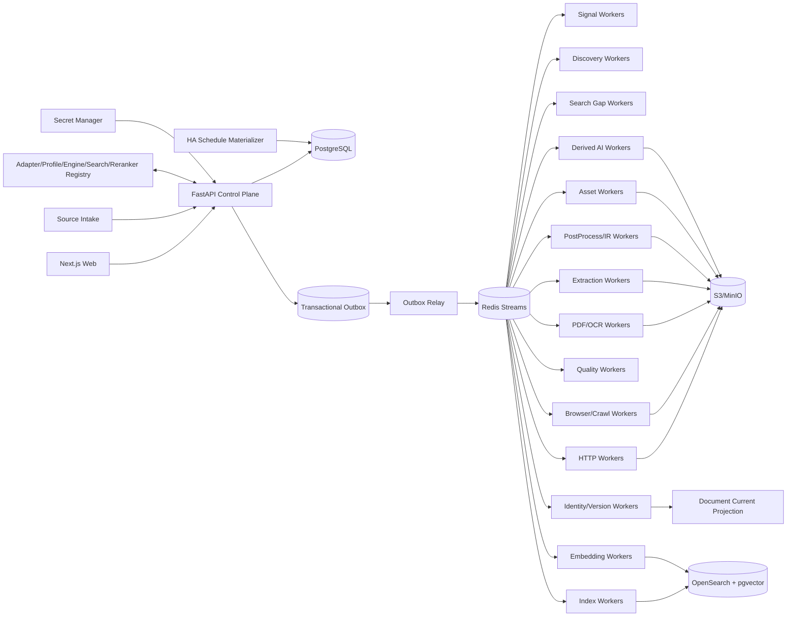

# 博客知识库技术方案

适用范围：从约 1000 个技术博客、工程博客、技术文档站、Newsletter、CMS 与公开文档站抓取尽可能完整的历史文章，清洗为稳定 Markdown 建设长期知识库；后续持续增加网站，支持全量回灌、增量同步、Web 管理、版本留存、离线重处理、全文/向量检索、质量审计、图片附件归档与 AI 派生能力。整体按百万级文档、数百万到千万级 URL、站点高度异构和多年持续运行设计。

## 1. 建设目标

1. 支持单 URL、批量 URL、站点根地址、RSS/Atom/JSON Feed、Sitemap/Sitemap Index、OPML、CSV、JSON、Markdown/TXT 导入来源。
2. 自动探测 Sitemap、Feed、公开 API、Archive、分类页、标签页、作者页、文档导航树、普通内链、`llms.txt`/文本 URL 列表等发现入口。
3. 支持 `FULL_BACKFILL`、`INCREMENTAL`、`RECONCILE`、`TARGETED_FETCH`、`REPROCESS`、`ASSET_REPAIR`、`REINDEX`、`SEARCH_GAP_FAST`、`SEARCH_GAP_DEEP`。
4. 历史完整性由 Provider 级 Coverage Evidence 证明，不能用“队列空了”“达到 max_depth/max_pages/max_urls”“搜索 Top-N 抓完”替代完整性证明。
5. HTTP-first；只有动态渲染、正文缺失、挑战页或抽取失败证据存在时才升级 Browser/Crawl4AI/Playwright。
6. Discovery Rule、Site Profile、Fetch Route、Crawler Engine、Extraction Profile、PostProcessor、Quality Policy、Asset Policy、Chunker、Embedding、Search、Reranker、AI Prompt/Model 全部独立版本化。
7. 支持 Sitemap `lastmod`、Feed GUID/updated、API cursor、ETag、Last-Modified、body hash、Canonical IR hash、重叠窗口与周期 Reconcile 驱动增量。
8. 最终知识对象保存标题、作者、发布时间、更新时间、标签、canonical、正文块、代码块、表格、图片、附件、链接关系、Snapshot、字段 provenance 和完整 lineage。
9. 支持 durable frontier、断点续跑、幂等、lease、heartbeat、重试、限流、熔断、公平调度、backpressure、dead-letter。
10. 保存不可变网络 Snapshot、渲染 DOM、清洗 HTML、Extraction Candidate、Canonical IR、Markdown Projection、规则版本与质量结果；规则升级优先离线 replay。
11. 图片和附件走独立 Asset Pipeline，支持安全校验、hash 去重、对象存储、引用关系、独立重试和 Markdown URL 重写。
12. Web 管理端覆盖来源导入、Site Profile Studio、Provider 覆盖、任务控制、发现证据、Targeted Fetch、Extraction Preview、Snapshot Replay、版本 diff、质量审核、漂移告警、资产、搜索/RAG、成本、Schedule、AI Workflow 与审计。
13. Markdown、全文索引、Embedding、摘要、标签、聚类、Digest、Newsletter、报告和通知都是 Accepted Document Version 的异步 Projection，失败不能阻塞 Source Sync。
14. append-only 历史真相层之上提供可重建 Current Projection。
15. Canonical IR hash 在 Chunk/Embedding/AI 等昂贵下游之前计算；内容未变化只写 freshness observation。
16. 技术博客检索同时支持自然语言、代码符号、配置项、错误码、版本号和文件路径，不能只依赖纯向量搜索。
17. 设置 Change-Signal Plane，优先用 Feed/Sitemap/API 元数据判断是否可能变化，再决定是否抓正文。
18. 跨文档近似重复只形成 Similarity Evidence / Duplicate Cluster，不自动删除来源文档。
19. 文档内部重复块形成 Repetition Evidence；任何有损抑制必须可解释、可回滚并有高删除率 Guardrail。
20. 所有 Stage 输入输出具有显式 Artifact Representation Contract。
21. Platform Adapter / Site Profile / Crawler Engine Release / Search Provider Release / Reranker Release 发布前必须通过 Contract Test、Golden Corpus、Capability Test 与最近 Snapshot 的 shadow replay。
22. 正文清洗必须结构保真；禁止在 Canonical IR 前使用全局 `split/join` 或 `\s+` 折叠空白。
23. Canonical Markdown 必须完整、确定性、按 Document Version 独立产出，禁止把带抓取时间戳的批量拼接文本当作知识库真相。
24. Scheduler 只物化持久 Run/Task；异步 Worker 才负责网络请求和浏览器运行。
25. 所有 Run 保存 Resolved Effective Config、Resolved Crawl Scope 与 Runtime Strategy Attestation。
26. 运行结果使用阶段级语义计数，区分 new version、unchanged、existing identity、unexpected empty、rejected、blocked、deadline exceeded、failed。
27. 抓取链路采用分层 Deadline 与 Cancellation Propagation。
28. 外部/自托管搜索只作为 Gap Discovery 和诊断证据，不能成为历史完整性真相源。
29. 同一 URL 的多 Extraction Strategy 尽可能共享同一 Fetch Snapshot，禁止为了比较 Markdown/HTML/CSS/XPath/LLM 等策略重复访问源站。
30. Web 的“自定义 URL 抓取”必须走标准 `TARGETED_FETCH` 任务，不允许绕过 Admission、Snapshot、Quality 和审计主链路。
31. AI 摘要不能替代原文；任何 AI 结果必须以 Derived Artifact 保存并可独立重建。

## 2. 非目标与边界

1. 不绕过登录、付费墙、验证码、WAF 或明确访问控制。
2. 不承诺未知站点仅靠自动探测达到 100% 历史完整；必须展示 coverage confidence、known gap 与 blocker。
3. 不用 LLM 或 Reranker 评分决定 FULL_BACKFILL 中合法历史文章是否入库。
4. Markdown 不是唯一真相；Canonical IR 是内部内容真相，Markdown 是确定性投影。
5. 不锁死单一爬虫库、浏览器库、向量库、重排模型或消息队列。
6. Source Intake 文件/粘贴文本只是输入证据，不直接成为生产配置真相源。
7. AI、Embedding、Newsletter 等派生模块不能反向决定抓取主链路是否成功。
8. 不允许用 HTTP 200、Browser success、协程正常返回或无异常直接等价业务成功。
9. 不把第三方库 README、默认参数或注释当作运行事实，运行事实来自 Runtime Attestation。
10. 不把全局 reload/scroll/wait 脚本作为所有站点默认策略；浏览器动作必须进入 Site/Profile 级 recipe。
11. 不把 Query-time Context、Rerank Top-K 或 LLM 摘要反向保存为 Canonical Document。
12. Search Gap Deep 的 Top-N、Rerank Top-K、搜索页数只是成本预算，不是 Coverage 证据。

## 3. 核心原则

1. **PostgreSQL 是业务状态真相源；S3/MinIO 是不可变大对象真相源。**
2. Redis Streams 只做任务运输；决定性状态先写 PostgreSQL，再由 Transactional Outbox 投递。
3. Source Intake、Adapter、Change Signal、Discovery、Admission、Fetch、Extraction、PostProcess、Quality、Identity、Publish、Asset、Search、AI、Delivery 分层。
4. Discovery 只产生 URL Candidate 与 Evidence；Feed 摘要、搜索结果、列表页不能直接成为最终正文。
5. URL Identity 与 Document Identity 分离；Identity 与 Freshness 分离。
6. Discovery Fetch Route 与 Article Fetch Route 分离。
7. HTTP、Browser、PDF/OCR 分层；生产复用长期 HTTP client、Search client、Rerank client 与 Browser Runtime/Context Pool。
8. Crawl4AI/Playwright/SearXNG 等第三方能力通过 Adapter 隔离，原始返回 shape、quirks 与配置不得泄漏到业务真相层。
9. 所有 Stage 使用固定结构化 Outcome Contract。
10. `document_version` append-only；Current/Markdown/Search/Embedding/AI Projection 可重建。
11. `max_depth/max_pages/max_runtime/max_urls/max_results/top_k` 是预算，不是 Coverage Evidence。
12. 进程内 semaphore/`asyncio.gather` 只做 Worker 本地资源保护，不承担持久调度。
13. Config 使用不可变 Release；Secret 仅保存 Secret Manager 引用。
14. 内容结构本身是数据；代码缩进、表格、列表层级与换行不能在通用 cleaner 中被压平。
15. 有损清洗必须可逆或可解释，Canonical IR 不因启发式去重丢掉不可恢复信息。
16. 原始证据与面向 Agent/UI 的紧凑输出分层：先保留完整事实，再做字段投影与 token 优化。
17. 多个 Extractor/Strategy 优先消费同一 Snapshot；网络访问与内容解释解耦。
18. Site Profile 的编辑、测试、发布、回滚全部可审计。
19. 人工 Targeted Fetch 与批量同步共用同一标准流水线。
20. 摘要、标签、分类、问答等 AI 能力只是 Document Version 的派生视图。

## 4. 总体架构



### 4.1 Control Plane

负责 Source Intake、Site/Provider/Profile、Crawler Engine Release、Search Provider Release、Reranker Release、Schedule、Run、Command、RBAC 与 Audit，不直接执行长期抓取。

### 4.2 Change-Signal / Discovery Plane

低成本轮询 Feed/Sitemap/API，维护 Provider checkpoint，生成 URL Candidate 与 Coverage Evidence。Search Gap Provider 只在缺口诊断、迁移追踪与 Reconcile 中补充。

### 4.3 Data Plane

HTTP、Browser、PDF/OCR、Extraction、PostProcess、Quality、Identity 分为独立 Worker Pool。Browser Worker 通过 Engine Adapter 调用 Crawl4AI/Playwright。

### 4.4 Projection Plane

从 Accepted Document Version 构建 Markdown、Current、Chunk、Embedding、Search、AI Artifact 与 Delivery；Projection 失败不会回滚已接受的 Canonical Document Version。

## 5. Source Registry 与 Site Profile Studio

### 5.1 Source Registry

每个接入站点记录：

- `source_id`；
- canonical origin；
- display name；
- platform hint；
- active 状态；
- robots policy；
- rate-limit policy；
- active profile release；
- discovery providers；
- sync schedule；
- ownership/compliance notes；
- secret refs；
- last successful run；
- coverage state。

新站点接入不能只写一条 URL 后直接大规模抓取，必须经过：

```text
Intake
 -> Normalize
 -> Probe
 -> Platform detection
 -> Provider detection
 -> Profile draft
 -> Golden URL test
 -> Preview
 -> Approval
 -> Activate
```

### 5.2 Site Profile

Profile 负责表达“这个站如何发现和抽取”，而不是把站点代码散落在 Worker。

建议结构：

```yaml
site_profile:
  discovery:
    sitemap_candidates: []
    feed_candidates: []
    archive_urls: []
    list_page_rules: []
    article_link_rules: []
  routing:
    http_first: true
    browser_escalation_rules: []
  extraction:
    title_selectors: []
    body_selectors: []
    author_rules: []
    published_at_rules: []
    remove_selectors: []
    canonical_rules: []
  browser_recipe:
    wait_for: null
    scroll: null
    click: []
  quality:
    min_text_chars: 300
    required_fields: []
```

### 5.3 Profile Release

每次修改生成不可变 `site_profile_release`：

- semver/release id；
- author；
- diff；
- Golden URL 测试结果；
- Snapshot shadow replay 结果；
- quality delta；
- activated_at；
- rollback target。

### 5.4 Profile Studio Web

Web 中提供：

1. CSS/XPath/metadata 规则编辑器；
2. Golden URL 列表；
3. “测试抓取”按钮；
4. raw HTML/DOM、selector 命中数、候选正文、Canonical IR、Markdown 并排预览；
5. 当前 release 与 draft diff；
6. 对最近 Snapshot 做离线 replay；
7. 一键发布和回滚。

Profile 测试只创建短生命周期 `PROBE`/`TARGETED_FETCH` Run，禁止 UI 线程直接执行 crawler。

## 6. Discovery 与历史完整性

### 6.1 Provider 类型

每站可以同时启用多个 Discovery Provider：

- Sitemap / Sitemap Index；
- RSS/Atom/JSON Feed；
- CMS/API；
- Archive/Category/Tag/Author；
- Docs navigation；
- HTML Link Crawl；
- `llms.txt`/URL list；
- Search Gap。

Provider 输出统一为：

```text
URL Candidate
+ Discovery Evidence
+ Provider Checkpoint
```

### 6.2 Discovery Evidence

不要只保存最终 URL。至少记录：

- source provider；
- parent URL；
- href raw/resolved；
- anchor text；
- DOM/CSS position；
- feed GUID；
- sitemap lastmod；
- API cursor/page；
- observed_at；
- snapshot id；
- provider release。

同一 URL 可有多条 Evidence。

### 6.3 Coverage State

Provider 级状态：

- `UNKNOWN`；
- `RUNNING`；
- `PARTIAL`；
- `COMPLETE_WITH_EVIDENCE`；
- `BLOCKED`；
- `ERROR`。

Coverage Evidence 例子：

- Sitemap Index 所有 child sitemap 都解析完成且 checkpoint 持久化；
- API cursor 明确到达终点；
- archive pagination 明确无 next page；
- Feed 只证明近期窗口，不证明全历史；
- Search Gap 永远只能提升 confidence，不能单独声明 complete。

### 6.4 Sitemap 大规模解析

采用 streaming pipeline：

```text
HTTP streaming
 -> compressed-byte limiter
 -> bounded decompressor
 -> decoded-byte/compression-ratio limiter
 -> XMLPullParser/iterparse
 -> batch UPSERT URL Candidate
 -> provider checkpoint
```

必须有：递归深度、child sitemap 数、URL 数、字节数、压缩比、请求次数、wall time 等预算。预算耗尽结果为 `PARTIAL/BUDGET_EXHAUSTED`。

## 7. Durable Frontier 与调度

### 7.1 Run / Task 模型

所有执行先创建持久对象：

```text
Run
  -> Stage
     -> Task
```

Run 类型：

- FULL_BACKFILL；
- INCREMENTAL；
- RECONCILE；
- TARGETED_FETCH；
- REPROCESS；
- REINDEX；
- ASSET_REPAIR。

Task 存储：

- task type；
- entity id；
- attempt；
- lease owner；
- lease expiry；
- heartbeat；
- deadline；
- priority；
- site/source；
- resolved config hash；
- idempotency key；
- outcome。

### 7.2 Transactional Outbox

业务状态与待投递事件同一数据库事务写入。Outbox Relay 再把消息发到 Redis Streams，防止“数据库写成功但消息丢失”或反向双写不一致。

### 7.3 Lease / Heartbeat

Worker 领取 Task 后获取 lease；长任务周期 heartbeat。进程崩溃后 lease 过期，任务可安全重投。任务必须幂等，不能依赖“绝不重复执行”。

### 7.4 公平调度

不能让一个大站点占满全部 Worker。采用：

- per-site token bucket；
- per-host concurrency；
- global concurrency；
- queue class；
- weighted fair scheduling；
- browser quota；
- source priority；
- backpressure。

## 8. Change-Signal Plane 与增量同步

### 8.1 低成本信号优先

优先读取：

- Feed updated/GUID；
- Sitemap lastmod；
- API timestamp/cursor；
- ETag；
- Last-Modified。

只有“可能有变化”时才抓正文。

### 8.2 增量判定

单 URL 的变化判断分层：

```text
provider signal
 -> conditional HTTP
 -> response body hash
 -> extraction candidate hash
 -> canonical IR hash
```

如果网络响应变化但 Canonical IR 未变化，不产生新 Document Version，只写 Freshness Observation。

### 8.3 重叠窗口

Feed/API 增量必须使用 overlap window，避免边界时间、延迟发布、修改时间回拨导致漏抓。

### 8.4 Reconcile

周期性 Reconcile 重新跑高可信 Provider，对比已知 URL 集，发现：

- 漏 URL；
- URL 消失；
- canonical 变化；
- Feed 与 Sitemap 分歧；
- 长期未刷新文档。

## 9. Fetch 路由与 Runtime Pool

### 9.1 HTTP-first

默认使用长期 `httpx.AsyncClient`/等价客户端：

- connection pooling；
- HTTP/2；
- per-host limits；
- timeout profile；
- retry/backoff；
- conditional request；
- redirect trace；
- content-length/type guard；
- TLS/response metadata。

禁止每 URL 新建一个完整客户端。

### 9.2 Browser 升级条件

满足以下证据之一再升级：

- HTML shell 无正文但页面 JS 有渲染迹象；
- 关键 selector 仅渲染后出现；
- HTTP 与历史质量基线显著下降；
- 明确配置要求浏览器；
- 需要执行受控页面交互。

升级原因写入 `fetch_route_decision`。

### 9.3 Browser Runtime Pool

Browser Worker 维持长期 runtime：

```text
Worker Process
 -> Browser Runtime
    -> Context Pool
       -> Page lease
```

Context 隔离根据 Site Profile 决定。每任务只租用 Page/Context，不重复启动整套 Chromium。

### 9.4 Crawl4AI Adapter

Crawl4AI 只作为 Engine Adapter：

```python
class CrawlerEngine:
    async def fetch(self, request) -> FetchOutcome: ...
```

业务层不直接依赖 Crawl4AI 的 result shape。Adapter 负责转换为统一 Snapshot/Outcome。

### 9.5 Deadline

至少分：

- DNS/connect；
- response header；
- body read；
- browser navigation；
- render wait；
- extraction；
- total task deadline。

上层取消必须向下传播。

## 10. Immutable Snapshot 与 Artifact Contract

### 10.1 Snapshot

每次真正网络访问至少保存：

- request URL/method/headers hash；
- final URL；
- status；
- response headers；
- raw body/object key；
- observed_at；
- fetch engine/release；
- redirect chain；
- timing；
- body hash；
- browser DOM/screenshot 可选。

大对象进 S3/MinIO，PG 只存 metadata 与 object key。

### 10.2 Artifact Representation Contract

每 Stage 明确输入输出，例如：

```text
RAW_HTTP_BODY
RENDERED_DOM
CLEAN_HTML
EXTRACTION_CANDIDATE
CANONICAL_IR
MARKDOWN_PROJECTION
AI_INPUT_TEXT
EMBEDDING_CHUNKS
```

禁止函数名相同但输入输出 representation 隐式变化。

### 10.3 Snapshot Replay

Extraction/PostProcess/Quality 规则升级时优先从 Snapshot 离线 replay，不重新访问源站。

## 11. Extraction Pipeline

### 11.1 多策略抽取

同一 Snapshot 可并行/串行尝试：

- Site Profile CSS/XPath；
- Readability/Trafilatura；
- Crawl4AI Markdown/HTML；
- JSON-LD/schema.org；
- CMS-specific adapter；
- 受预算限制的 LLM extraction。

每个候选保存 strategy release、字段值、source span/provenance 和质量指标。

### 11.2 不直接信任单一 Selector

CSS selector 0 命中必须判别：

- 正常无正文；
- selector drift；
- challenge page；
- 页面类型错误；
- fetch incomplete。

Web 管理端显示 selector hit count 与最近质量趋势。

### 11.3 Metadata

标题/作者/发布时间/canonical/tag 等字段使用多候选和优先级，而不是一个 regex 决定。最终字段保存 provenance，例如：

```text
published_at = 2026-08-01
source = JSON-LD.datePublished
snapshot_id = ...
extractor_release = ...
```

## 12. Canonical IR 与 Markdown

### 12.1 Canonical IR

内部结构建议 block-based：

```json
{
  "document": {
    "title": "...",
    "blocks": [
      {"id":"b1","type":"heading","level":2,"text":"..."},
      {"id":"b2","type":"paragraph","text":"..."},
      {"id":"b3","type":"code","language":"python","text":"..."},
      {"id":"b4","type":"table","rows":[]},
      {"id":"b5","type":"image","asset_ref":"..."}
    ]
  }
}
```

### 12.2 结构保真

禁止在 Canonical IR 前做：

- `re.sub(r'\s+', ' ', text)`；
- 全局 `split()`/`join()`；
- 把 code/table/list 全转成普通段落。

AI 若需要纯文本，单独生成 `AI_INPUT_TEXT` Projection，并保留 block id 映射。

### 12.3 Markdown Projection

Markdown 从 Canonical IR 确定性生成。路径建议：

```text
knowledge/{source_slug}/{yyyy}/{slug}-{document_id}.md
```

Front Matter 可含：

```yaml
id:
source:
url:
canonical_url:
title:
author:
published_at:
updated_at:
tags:
document_version:
content_hash:
```

Canonical Markdown 文件不得嵌入“抓取时间”作为正文组成部分，避免每次同步造成无意义 diff。

## 13. Quality Gate

### 13.1 指标

至少包含：

- text length；
- heading count；
- code block count；
- paragraph count；
- link/image count；
- boilerplate ratio；
- duplicate/repetition ratio；
- title/body consistency；
- expected selector hit；
- language；
- extraction confidence。

### 13.2 Outcome

Quality 输出：

- `ACCEPT`；
- `ACCEPT_WITH_WARNING`；
- `RETRY_WITH_OTHER_STRATEGY`；
- `REVIEW_REQUIRED`；
- `REJECT`。

### 13.3 漂移检测

按 Site/Profile 跟踪：

- selector 命中率；
- 正文长度中位数；
- title 命中率；
- browser escalation rate；
- unexpected empty；
- reject rate。

突然变化触发 drift alert，并建议进入 Profile Studio 做 Snapshot replay。

## 14. Identity、Canonical 与版本

### 14.1 URL Identity

规范化：scheme/host case、default port、fragment、tracking params、可配置 trailing slash 等，但不能过度 canonicalize 导致不同文章合并。

### 14.2 Document Identity

Document 与 URL 分离。一个 Document 可以有：

- 原始 URL；
- canonical URL；
- 历史 URL；
- AMP/print/mobile URL；
- redirect URL。

### 14.3 Document Version

只有 Canonical IR hash 变化才创建新 Version：

```text
document
  -> version 1
  -> version 2
  -> version 3
```

每个 version 不可变。

### 14.4 Freshness Observation

正文未变但重新验证成功，只写：

```text
url
checked_at
status
etag
last_modified
body_hash
canonical_ir_hash
```

避免制造无意义版本。

## 15. 近似重复与重复块

跨文档相似只形成：

- similarity evidence；
- duplicate cluster；
- probable syndication relation。

不能自动删除来源文档，因为技术博客可能存在转载、翻译、版本差异。

文档内部重复块使用 block hash/minhash/simhash 等形成 Repetition Evidence；若做有损抑制，必须保存被抑制 block 和原因，并设置“删除比例过高”保护阈值。

## 16. Asset Pipeline

图片、PDF、附件独立处理：

```text
Document Version
 -> Asset Reference
 -> Asset Task
 -> safe fetch
 -> MIME/sniff/size check
 -> hash
 -> object storage
 -> relation
 -> Markdown rewrite projection
```

必须防：

- SSRF；
- 私网/loopback；
- 非法 scheme；
- 超大文件；
- 压缩炸弹；
- MIME 欺骗；
- 重定向到不安全目标。

Asset 失败只标记文档附件不完整，不回滚正文版本。

## 17. Search 与 RAG

### 17.1 索引

推荐双索引：

- OpenSearch：BM25、代码符号、路径、错误码、字段 filter；
- pgvector/向量库：语义检索。

### 17.2 Chunk

Chunk 基于 Canonical IR block，而不是固定字符数硬切：

- heading hierarchy；
- paragraph；
- code block；
- table；
- list。

保留：document_version_id、block range、heading path、language、source。

### 17.3 Hybrid Search

查询：

```text
BM25 candidates
 + vector candidates
 -> merge
 -> optional rerank
 -> result
```

Rerank 只影响查询结果优先级，不修改 Canonical Document。

### 17.4 Rerank Evidence

保存：

- query；
- candidate set hash/size；
- model/release；
- query/document encoding role；
- metric；
- normalization；
- raw score/rank。

不同 candidate set 的 normalized score 不直接横向比较。

## 18. AI Derived Artifact

### 18.1 支持能力

- summary；
- tags；
- topic；
- entities；
- FAQ；
- key points；
- newsletter digest；
- cluster title；
- report。

### 18.2 派生原则

AI 任务从 Accepted Document Version 读取，不阻塞 Source Sync：

```text
Accepted Version
 -> AI Task
 -> chunk-aware input
 -> model/provider
 -> validation
 -> Derived Artifact
```

### 18.3 长文摘要

不要简单按 token 切块后直接拼结果。采用：

```text
block-aware chunking
 -> map summaries
 -> optional reduce summary
 -> factual/coverage checks
```

代码块可按策略跳过或仅作为 context，避免技术代码被摘要模型误写。

### 18.4 AI Lineage

每个 Derived Artifact 保存：

- document_version_id；
- canonical_ir_hash；
- artifact_type；
- model/provider；
- model release；
- prompt release；
- chunker release；
- params；
- input/output token；
- cost；
- latency；
- status；
- output snapshot。

## 19. Targeted Fetch 与 Extraction Preview

### 19.1 Targeted Fetch

Web 输入 URL 后，创建 `TARGETED_FETCH` Run：

```text
URL input
 -> SSRF/policy validation
 -> Site resolution
 -> Effective Profile resolution
 -> Fetch Route
 -> Snapshot
 -> Extraction
 -> Canonical IR
 -> Quality
 -> Preview
```

管理员可选择：

- 仅诊断；
- 接受为正式文档；
- 加入 Golden URL；
- 以该结果创建 Profile draft。

### 19.2 Extraction Preview

同一个 Snapshot 可比较：

- 当前 Profile；
- Draft Profile；
- CSS/XPath；
- Readability/Trafilatura；
- Crawl4AI；
- 其它 extractor。

显示：

- 字段差异；
- block diff；
- quality score；
- 删除/新增比例；
- selector hit count。

比较必须共享 Snapshot，避免源站内容变化干扰结论。

## 20. Web 管理端

建议 Next.js + FastAPI。

核心页面：

1. Dashboard：站点数、文档数、今日新增、失败率、队列、Browser 使用量、成本；
2. Source Intake：导入、规范化、去重、Probe；
3. Source Detail：Provider、Schedule、Coverage、Profile、最近运行；
4. Profile Studio：规则编辑、Golden URL、Preview、Release、Rollback；
5. Run Detail：各 Stage 计数、失败原因、deadline、成本；
6. Task Detail：attempt、lease、日志、Snapshot、Outcome；
7. Targeted Fetch：单 URL 即时诊断；
8. Document Detail：Current、历史 Version、Markdown、IR、diff、assets；
9. Extraction Trace：Snapshot -> Candidate -> IR -> Quality；
10. Quality Review：Review Required 队列；
11. Drift：selector hit/正文长度/empty/reject 趋势；
12. Search/RAG：查询、chunk、rerank trace；
13. AI Artifact：摘要/标签等版本和成本；
14. Audit：配置发布、人工重试、任务取消、Profile 回滚记录。

实时进度可用 SSE/WebSocket，但业务状态仍以 PostgreSQL 为准。

## 21. 核心数据模型

建议表：

```text
source
site_profile
site_profile_release
provider
provider_checkpoint
coverage_evidence
url_identity
url_candidate
discovery_evidence
run
run_stage
task
task_attempt
outbox_event
fetch_snapshot
fetch_route_decision
extraction_candidate
field_evidence
canonical_ir
document
document_url
document_version
freshness_observation
quality_result
repetition_evidence
similarity_evidence
asset
asset_reference
projection
markdown_projection
chunk
embedding
search_index_state
search_execution
search_result_evidence
rerank_evidence
ai_artifact
schedule
audit_log
```

所有重要表建议具有 `created_at`、release/hash 引用和不可变历史语义。

## 22. Typed Outcome Contract

所有 Worker 统一返回：

```json
{
  "status": "SUCCEEDED|RETRYABLE|FAILED|BLOCKED|SKIPPED",
  "code": "...",
  "message": "...",
  "metrics": {},
  "artifact_refs": [],
  "next_actions": []
}
```

禁止出现：成功返回 dict、失败返回空字符串、部分错误抛异常、部分错误返回 None 的多态接口。

常见 code：

- `ROBOTS_BLOCKED`；
- `HTTP_TIMEOUT`；
- `BODY_TOO_LARGE`；
- `CHALLENGE_PAGE`；
- `SELECTOR_ZERO_HIT`；
- `UNEXPECTED_EMPTY`；
- `QUALITY_REJECTED`；
- `DEADLINE_EXCEEDED`；
- `UNCHANGED`。

## 23. 幂等与并发控制

推荐幂等键例子：

```text
fetch:{url_identity_id}:{effective_fetch_config_hash}:{signal_version}
extract:{snapshot_id}:{extractor_release}
quality:{canonical_ir_hash}:{quality_release}
publish:{document_id}:{canonical_ir_hash}
embed:{document_version_id}:{chunker_release}:{embedding_release}
ai:{document_version_id}:{artifact_type}:{prompt_release}:{model_release}
```

同 URL 并发抓取可使用数据库 advisory lock/唯一约束/Task dedupe，避免重复访问源站。

## 24. 安全与合规

### 24.1 SSRF

所有用户输入 URL、站点发现 URL、图片、附件、redirect 目标都必须校验：

- 仅允许 http/https；
- DNS resolve 后拒绝 private/loopback/link-local/multicast/reserved/metadata IP；
- 每次 redirect 重新校验；
- 防 DNS rebinding；
- 限制端口。

### 24.2 Robots 与 Policy

Robots Sitemap Discovery 与 Robots Fetch Admission 分离。缓存 robots 时保存版本、TTL、validator、fetch outcome。策略变化可审计。

### 24.3 Secret

OpenAI/API token、代理、数据库凭证只在 Secret Manager；数据库存引用，不存明文。

### 24.4 HTML/Markdown 安全

Web preview 必须 sanitize；不能直接把抓取 HTML 用 unsafe rendering 注入管理后台。

## 25. 可观测性

### 25.1 指标

按 Source/Profile/Provider/Worker/Engine 聚合：

- discovered URL；
- fetched URL；
- unchanged；
- new versions；
- retry/error；
- unexpected empty；
- selector zero hit；
- browser escalation；
- p50/p95 latency；
- bytes；
- CPU/memory；
- browser seconds；
- AI token/cost；
- queue lag；
- coverage state。

### 25.2 Trace

一个文档要能追溯：

```text
Source
 -> Provider Evidence
 -> URL Candidate
 -> Task
 -> Fetch Snapshot
 -> Extraction Candidate
 -> Canonical IR
 -> Quality
 -> Document Version
 -> Markdown/Chunk/Embedding/AI
```

### 25.3 日志

结构化日志携带 `run_id/task_id/source_id/url_id/document_id/snapshot_id/release_id`。

## 26. 部署与扩展

### 26.1 推荐组件

- Web：Next.js；
- Control Plane：FastAPI；
- Database：PostgreSQL；
- Queue：Redis Streams；
- Object Storage：S3/MinIO；
- HTTP Worker：Python asyncio + httpx；
- Browser Worker：Crawl4AI/Playwright Adapter；
- Search：OpenSearch；
- Vector：pgvector 起步；
- Metrics：Prometheus + Grafana；
- Logs：Loki/ELK；
- Tracing：OpenTelemetry；
- Secret：Vault/云 Secret Manager。

### 26.2 Worker 独立伸缩

Worker 类型独立部署：

- Signal Worker：轻量高并发；
- Discovery Worker：中等并发；
- HTTP Worker：高并发；
- Browser Worker：低并发、高内存；
- Extraction Worker：CPU；
- Embedding/AI Worker：GPU/外部 API；
- Asset Worker：I/O。

### 26.3 1000 站点容量原则

不要一次性为每站常驻 crawler。按任务池共享 Worker，并通过 per-site limits 隔离。大站与小站使用公平调度，Browser 作为昂贵资源单独配额。

## 27. 全量回灌流程

```text
1. Source Intake
2. Probe + Profile release
3. Provider discovery
4. Persist candidates/evidence
5. Coverage checkpoint
6. Admission
7. Durable frontier
8. HTTP fetch
9. Browser escalation when needed
10. Snapshot
11. Extraction
12. Canonical IR
13. Quality
14. Identity/version
15. Markdown/assets
16. Search/embedding
17. AI derived artifact
18. Coverage finalize
```

FULL_BACKFILL 结束条件必须依据 Provider Coverage Evidence，而不是 Task 数归零。

## 28. 增量同步流程

```text
1. Signal scheduler triggers
2. Feed/Sitemap/API conditional fetch
3. Compare checkpoint/lastmod/GUID/cursor
4. Generate changed candidates
5. Conditional article fetch
6. Snapshot/body hash
7. Extract + Canonical IR hash
8. If unchanged -> freshness observation
9. If changed -> new document version
10. Rebuild projections asynchronously
```

周期性 Reconcile 负责修正 Feed/Sitemap 漏报与规则变化。

## 29. 失败恢复

- 网络失败：指数退避 + jitter；
- 429：尊重 Retry-After；
- 403/challenge：按策略升级浏览器或 BLOCKED；
- selector drift：REVIEW_REQUIRED，不无限重试；
- Browser crash：lease 到期重投；
- Worker crash：Task 幂等重投；
- Projection 失败：单独重建，不回滚正文；
- Redis 丢消息：Outbox Relay 可重放；
- 规则 bug：Snapshot replay + 新 release；
- 资产失败：Asset Repair Run。

## 30. 测试体系

### 30.1 Contract Test

每个 Adapter 验证统一 Outcome、Snapshot、错误语义。

### 30.2 Golden Corpus

选择典型技术站：

- 静态博客；
- WordPress；
- Ghost/Substack；
- SPA docs；
- 大型 Sitemap；
- 代码块/表格密集文章；
- 图片多；
- 页面改版样本。

Golden 断言：标题、正文 block、代码、表格、metadata、链接、Markdown 稳定性。

### 30.3 Shadow Replay

Profile/Extractor/Crawler Engine 新 release 上线前，对最近 Snapshot 离线重放，比较：

- text retention；
- block diff；
- metadata delta；
- quality delta；
- Markdown diff。

### 30.4 Capability Test

浏览器版本/Crawl4AI 版本升级前验证 JS render、download、timeout、redirect、selector、cookie/context 等能力。

## 31. 分阶段落地

### Phase 1：可用的全量 + 增量主链路

先完成：

- PostgreSQL schema；
- S3/MinIO；
- Source Registry；
- Site Profile；
- Sitemap/Feed discovery；
- durable task/outbox；
- HTTP-first fetch；
- Crawl4AI Browser Adapter；
- Snapshot；
- Extraction；
- Canonical IR；
- Markdown；
- 增量 hash/validator；
- 基础 Web 管理。

目标：50~100 个站点稳定运行后再扩容。

### Phase 2：质量、覆盖与运维能力

增加：

- Profile Studio；
- Golden URL；
- Targeted Fetch；
- Extraction Preview；
- Quality Gate；
- drift alert；
- Reconcile；
- Provider Coverage Evidence；
- Asset Pipeline；
- Version diff。

### Phase 3：1000 站点规模化

增加：

- 公平调度；
- Browser Runtime Pool；
- 更强的平台 Adapter；
- Search Gap；
- 容量与成本治理；
- 批量 Profile 模板；
- 自动 profile suggestion，但人工发布。

### Phase 4：检索与 AI

增加：

- OpenSearch；
- pgvector；
- block-aware chunk；
- hybrid retrieval；
- reranker；
- summary/tag/topic/newsletter 等 Derived AI。

## 32. 首版实施建议

为了避免一开始过度工程化，首版推荐组合：

```text
Next.js
FastAPI
PostgreSQL
Redis Streams
MinIO/S3
httpx
Crawl4AI + Playwright Adapter
Trafilatura/Readability + Site CSS extractor
OpenSearch（可 Phase 2/3 再上）
pgvector（AI/RAG 阶段再上）
```

首版仍然必须从第一天具备：

- 不可变 Snapshot；
- durable Task；
- idempotency；
- Site Profile Release；
- Canonical IR；
- Document Version；
- 增量 validator/hash；
- Targeted Fetch 走标准主链路；
- 原文与 AI 摘要分离。

这些如果后补，迁移成本会远高于初始实现成本。

## 33. 最终方案判断

整个系统的核心不是“选一个更强的爬虫库”，而是建立一套长期可演进的抓取平台：

```text
可证明的发现
+ 持久调度
+ 分层抓取
+ 不可变证据
+ 结构保真内容模型
+ 版本化站点规则
+ 可重放抽取
+ 增量同步
+ Web 诊断与运维
+ 可重建 Projection
```

对于 1000 个技术博客，Crawl4AI、Playwright、Trafilatura、HTTPX 都只是可替换执行引擎。真正需要稳定的是 Source Registry、Provider Coverage、Task 状态机、Snapshot、Canonical IR、Document Version、Profile Release 和审计链。

Web 管理端中的 Site Profile Studio、Targeted Fetch 和 Extraction Preview 让新站点接入和站点改版可以在不改 Worker 核心代码的情况下完成；而摘要、标签、RAG 等能力统一作为 Accepted Document Version 的 Derived Artifact，保证知识库永远以结构完整、可追溯、可重放的原文为核心真相。
