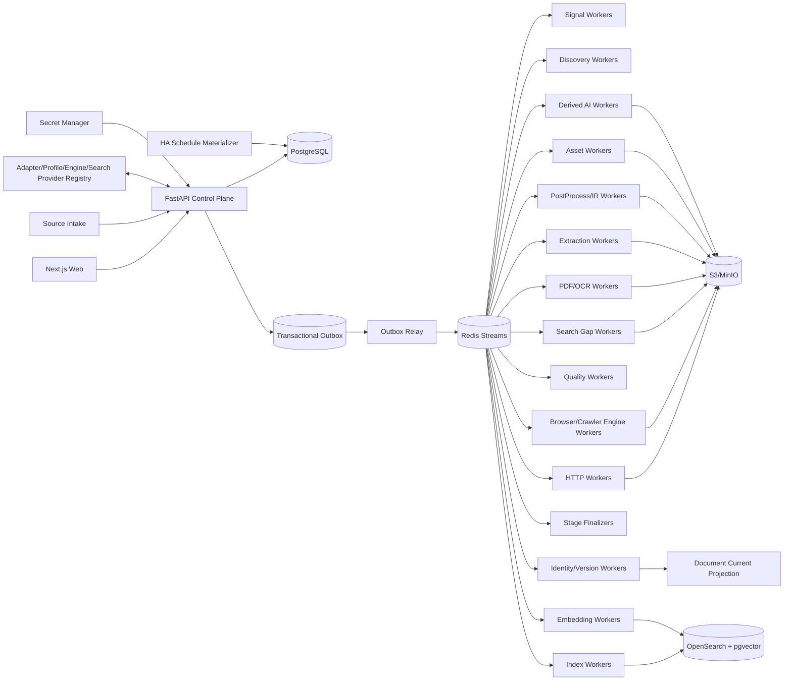

# 博客知识库技术方案

适用范围：从约 1000 个技术博客、工程博客、技术文档站、Newsletter、CMS 和公开文档站抓取尽可能完整的历史文章，清洗为稳定 Markdown 建设长期知识库；后续持续增加网站，支持全量回灌、增量同步、Web 管理、版本留存、离线重处理、全文/向量检索、质量审计、图片附件归档和 AI 派生能力。整体按百万级文档、数百万到千万级 URL、站点高度异构和多年持续运行设计。

## 1. 建设目标

1. 支持单 URL、批量 URL、Feed URL、OPML、Markdown/TXT、CSV、JSON 导入来源，自动规范化、去重、Probe、预览、审核后进入 Source Registry。
2. 自动探测 Sitemap/Sitemap Index、RSS/Atom/JSON Feed、公开 API、Archive、分类/标签/作者页、文档导航树、普通内链、`llms.txt`/文本 URL 列表和动态列表。
3. 支持 `FULL_BACKFILL`、`INCREMENTAL`、`RECONCILE`、`TARGETED_FETCH`、`REPROCESS`、`ASSET_REPAIR`、`REINDEX`。
4. 历史完整性由 Provider 级 Coverage Evidence 证明，不能把“队列空”“达到 max_depth/max_pages/max_urls”当作完整。
5. HTTP-first；只有动态渲染、正文缺失、挑战页或抽取失败证据存在时才升级 Browser/Crawl4AI/Playwright。
6. Discovery Rule、Fetch Route、Crawler Engine、Extraction Profile、PostProcessor、Quality Policy、Asset Policy、Chunker、Embedding、Search、AI Prompt/Model 均独立版本化。
7. 支持 Sitemap `lastmod`、Feed GUID/updated、API cursor、ETag、Last-Modified、body hash、Canonical IR hash、重叠窗口和周期 Reconcile 驱动增量。
8. 最终知识对象保存标题、作者、发布时间、更新时间、标签、canonical、正文块、代码块、表格、图片、附件、链接关系、Snapshot、字段 provenance 和完整 lineage。
9. 支持 durable frontier、断点续跑、幂等、lease、heartbeat、重试、限流、熔断、公平调度、backpressure、dead-letter。
10. 保存不可变网络 Snapshot、渲染 DOM、清洗 HTML、Extraction Candidate、转换轨迹、Canonical IR、Markdown Projection、规则版本和质量结果；规则升级优先离线 replay。
11. 图片和附件走独立 Asset Pipeline，支持安全校验、hash 去重、对象存储、引用关系、独立重试和 Markdown URL 重写。
12. Web 管理端覆盖来源导入、站点接入、Provider 覆盖、任务控制、发现证据、运行时抓取边界、当前文章、历史版本、版本 diff、抽取转换链、质量审核、漂移告警、资产、搜索/RAG、成本、Schedule、AI Workflow 和审计。
13. Markdown、全文索引、Embedding、摘要、聚类、Digest、Newsletter、报告和通知都是 Accepted Document Version 的异步 Projection，失败不能阻塞 Source Sync。
14. append-only 历史真相层之上提供可重建 Current Projection。
15. Canonical IR hash 在 Chunk/Embedding/AI 等昂贵下游之前计算；内容未变化只写 freshness observation。
16. 技术博客检索同时支持自然语言、代码符号、配置项、错误码、版本号和文件路径，不能只依赖纯向量搜索。
17. 设置 Change-Signal Plane，先用 Feed/Sitemap/API 元数据判断是否可能变化，再决定是否抓正文。
18. 跨文档近似重复只形成 Similarity Evidence / Duplicate Cluster，不自动删除来源文档。
19. 文档内部重复块形成 Repetition Evidence；任何有损抑制必须可解释、可回滚并有高删除率 Guardrail。
20. 所有 Stage 输入输出具有显式 Artifact Representation Contract。
21. Platform Adapter / Site Profile / Crawler Engine Release 发布前必须通过 Contract Test、Golden Corpus、Capability Test 和最近 Snapshot 的 shadow replay。
22. 正文清洗必须结构保真；禁止在 Canonical IR 前用全局 `split/join` 折叠空白。
23. Canonical Markdown 必须完整、确定性、按 Document Version 独立产出，禁止把带抓取时间戳的批量拼接文本当作知识库真相。
24. Scheduler 只物化持久 Run/Task；异步 Worker 才负责 await 网络任务。
25. 所有 Run 保存 Resolved Effective Config、Resolved Crawl Scope 与 Runtime Strategy Attestation。
26. 运行结果使用阶段级语义计数，区分 new version、unchanged、existing identity、unexpected empty、rejected、blocked、deadline exceeded、failed。
27. 抓取链路采用分层 Deadline 与 Cancellation Propagation。
28. 外部/自托管搜索只作为 Gap Discovery 和诊断证据，不能成为历史完整性真相源。
29. SearXNG 等 Search Gap Provider 必须保存查询参数、引擎、排名、score、原始结果快照和去重过程，不能只保存最终 URL。
30. MCP/CLI 只作为调试、人工诊断和 Agent 接口；生产全量/增量同步必须经过 Control Plane、持久任务和 Worker。

## 2. 非目标与边界

1. 不绕过登录、付费墙、验证码、WAF 或明确访问控制。
2. 搜索引擎结果只作补充发现证据。
3. 不承诺未知站点仅靠自动探测达到 100% 历史完整；必须展示 coverage confidence、known gap 和 blocker。
4. 不用 LLM 评分决定 FULL_BACKFILL 中合法历史文章是否入库。
5. Markdown 不是唯一真相；Canonical IR 是内部内容真相，Markdown 是确定性投影。
6. 不锁死单一爬虫库、浏览器库、向量库或消息队列。
7. Source Intake 文件/粘贴文本只是输入证据，不直接成为生产配置真相源。
8. AI、Embedding、Newsletter 等派生模块不能反向决定抓取主链路是否成功。
9. 不允许用 HTTP 200、Browser success、协程返回或无异常直接等价业务成功。
10. 不把第三方库 README、默认参数或注释当作运行事实，运行事实来自 Runtime Attestation。
11. 不把全局 `reload + scroll + wait_for(main)` 之类浏览器脚本作为所有站点的默认策略；只能作为 Site/Profile 级可测试 recipe。

## 3. 核心原则

1. **PostgreSQL 是业务状态真相源；S3/MinIO 是不可变大对象真相源。**
2. Redis Streams 只做任务运输；决定性状态先写 PostgreSQL，再由 Transactional Outbox 投递。
3. Source Intake、Adapter、Change Signal、Discovery、Admission、Fetch、Extraction、PostProcess、Quality、Identity、Publish、Asset、Search、AI、Delivery 分层。
4. Discovery 只产生 URL Candidate 和 Evidence；Feed 摘要、搜索结果、列表页不能直接成为最终正文。
5. URL Identity 与 Document Identity 分离；Identity 与 Freshness 分离。
6. Discovery Fetch Route 与 Article Fetch Route 分离。
7. HTTP、Browser、PDF/OCR 分层；生产复用长期 HTTP client 和 Browser Runtime/Context Pool。
8. Crawl4AI/Playwright/SearXNG 等第三方能力通过 Adapter 隔离，原始返回 shape、quirks 和配置不得泄漏到业务真相层。
9. 所有 Stage 使用结构化 Outcome Contract。
10. `document_version` append-only；Current/Markdown/Search/Embedding 等 Projection 可重建。
11. `max_depth/max_pages/max_runtime/max_urls` 是预算，不是 Coverage 证据。
12. 进程内 semaphore 只做 Worker 本地资源保护，不承担持久调度。
13. Config 使用不可变 Release；Secret 仅保存 Secret Manager 引用。
14. 内容结构本身是数据；代码缩进、表格、列表层级和换行不能在通用 cleaner 中被压平。
15. 有损清洗必须可逆或可解释，Canonical IR 不因启发式去重丢掉不可恢复信息。
16. Search Gap Provider 是“缺口传感器”，不是“全量枚举器”。

## 4. 总体架构



### 4.1 Control Plane

负责 Source Intake、Site/Provider/Profile、Crawler Engine Release、Search Provider Release、Schedule、Run、Command、RBAC 和 Audit；不直接执行长期抓取。

### 4.2 Change-Signal / Discovery Plane

低成本轮询 Feed/Sitemap/API，维护 Provider checkpoint，生成 URL Candidate 与 Coverage Evidence。SearXNG 等 Search Gap Provider 只在缺口诊断、迁移追踪和 Reconcile 中补充。

### 4.3 Data Plane

HTTP、Browser、PDF/OCR、Extraction、PostProcess、Quality、Identity 分为独立 Worker Pool。Browser Worker 内部通过 Engine Adapter 调用 Crawl4AI/Playwright。

### 4.4 Projection Plane

从 Accepted Document Version 构建 Markdown、Current Projection、Chunk、Embedding、Search、AI Artifact 和 Delivery。

## 5. Crawl Mode 与任务语义

```text
FULL_BACKFILL   首次历史全量回灌
INCREMENTAL     持续同步新增/更新
RECONCILE       周期重新枚举，修复断档
TARGETED_FETCH  精确 URL 抓取/调试/补抓
REPROCESS       基于已有 Snapshot 离线重抽取/重清洗
ASSET_REPAIR    仅修复图片/附件
REINDEX         重新 Chunk/Embedding/Search，不访问源站
SEARCH_GAP      仅执行外部/自托管搜索缺口诊断
```

Run 状态：`PENDING -> RUNNING -> COMPLETED | COMPLETED_WITH_WARNINGS | FAILED | CANCELLED`。

同站点默认仅一个 active FULL_BACKFILL；同一 URL 网络请求与版本写入依靠幂等键去重；REPROCESS 固定 Snapshot + Extraction Release + PostProcessor Release；REINDEX 固定 Document Version + Chunk/Embedding/Search Release。

## 6. 核心数据模型

至少包含：

```text
site
source_intake
provider
provider_checkpoint
site_profile_release
crawler_engine_release
search_provider_release
run
task
task_attempt
url_candidate
discovery_evidence
search_gap_evidence
coverage_evidence
fetch_snapshot
artifact
extraction_candidate
canonical_document
document
document_version
document_current
freshness_observation
repetition_evidence
similarity_evidence
asset
document_asset
projection
outbox_event
audit_log
```

关键唯一键/幂等键：

- `normalized_url + provider_id + discovery_epoch`
- `site_id + run_type + active`
- `snapshot(body_hash, final_url, fetched_at_bucket)` 按策略去重
- `document_id + canonical_ir_hash`
- `projection(document_version_id, projection_type, release_id)`
- `search_gap_evidence(search_provider_release_id, query_hash, result_url, observed_at_bucket)`

## 7. Adapter、Profile 与 Release

Platform Adapter 复用 WordPress、Ghost、Substack、Medium 类平台、Docusaurus/MkDocs、通用 Sitemap+HTML、Feed+Detail、自定义 JSON API 等平台逻辑；Site Profile 保存 root/canonical domain、Provider 优先级、include/exclude、selector/JSON path、timezone、rate limit、HTTP/Browser route、secret ref、asset/quality/scope policy。

每个 Release 保存：

```text
release_id
component_type
version
config_json/code_digest
package_lock_digest
container_digest
created_at
created_by
golden_test_result
capability_test_result
status=draft|active|retired
```

每次 Run 固化 `declared_config / resolved_config / effective_config_hash / consumed_keys / unknown_keys / unused_keys / defaulted_keys`，并保存实际构造后的 crawler/search client 关键 runtime 属性。

## 8. Crawl Scope

正式支持 `EXACT_HOST / REGISTRABLE_DOMAIN / HOST_ALLOWLIST / URL_PREFIX_ALLOWLIST / CUSTOM_SCOPE_RULE`，运行时解析为不可变快照：

```text
seed_host
registrable_domain
allowed_hosts
allowed_url_prefixes
excluded_hosts
excluded_url_prefixes
follow_redirect_scope
asset_scope
scope_hash
```

host 使用 IDNA/小写/端口规范化，registrable domain 使用 Public Suffix List 能力库。`include_subdomains` 只能是 UI 简化项，最终必须落为明确 allowed_hosts/scope。越界 URL 保留为 Link Evidence，不加入正文 frontier。

## 9. Discovery 与历史完整性

Provider 优先级：

1. 官方 API；
2. Sitemap Index/Sitemap；
3. RSS/Atom/JSON Feed；
4. Archive/分页列表；
5. 分类/标签/作者页；
6. 文档导航树；
7. 普通站内链接；
8. Search Gap Provider，仅补充。

Coverage Evidence 至少保存 `enumerated_items / unique_candidates / min_observed_date / max_observed_date / page_or_cursor_range / termination_reason / budget_hit / errors / coverage_confidence / known_gap`。

站点覆盖状态：`complete | likely_complete | partial | blocked | unknown`。FULL_BACKFILL Finalizer 对 Provider termination evidence、Candidate、Fetch、Quality Manifest 对账。

## 10. SearXNG Search Gap Provider

### 10.1 定位

SearXNG 作为自托管、可审计的元搜索适配器，主要用于：

- Sitemap/Archive/Feed 数量或日期覆盖出现异常时发现旧 URL；
- canonical/域名迁移后寻找历史来源；
- 发现仍被搜索引擎索引但站内 Provider 未枚举的页面；
- 人工在 Web 管理端诊断站点缺口。

它不能把 Coverage 从 partial/unknown 提升为 complete。

### 10.2 Provider Release

```text
provider_type=SEARXNG
base_url
auth_secret_ref
enabled_engines
default_categories
default_language
safe_search
request_timeout
retry_policy
max_pages_per_query
max_results_per_page
raw_response_retention
release_id
```

SearXNG 必须启用 JSON 输出。认证使用 secret ref，不能把用户名/密码直接放入 Site Profile。

### 10.3 Query Plan

为每次 SEARCH_GAP 生成可重放的 Query Plan：

```text
query_id
site_id
reason
query_text
language
time_range
categories
engines
page_from/page_to
expected_scope
provider_release_id
```

典型模板包括 `site:example.com`、路径前缀、标题片段、年份/月份、旧域名、canonical 迁移线索。不要无边界穷举关键词。

### 10.4 Search Result Evidence

先保存原始 JSON Snapshot，再生成规范化 Evidence：

```text
query_id
rank
title
result_url
snippet
published_date
engine
score
category
observed_at
raw_result_hash
scope_outcome
normalized_url
duplicate_cluster_id
```

即使 Web/UI 只展示 title/url/content，也不能在原始证据层丢掉 engine、score、category、rank 等 provenance。不同引擎结果先 URL normalize，再做 exact/near duplicate 聚合。

### 10.5 重试与错误语义

不能只重试网络 RequestError；需要区分：

```text
SEARCH_CONNECT_ERROR
SEARCH_TIMEOUT
SEARCH_AUTH_FAILED
SEARCH_RATE_LIMITED
SEARCH_5XX
SEARCH_BAD_RESPONSE
SEARCH_EMPTY
SEARCH_DEADLINE_EXCEEDED
```

429/503 尊重 `Retry-After`，其余瞬时错误指数退避 + jitter；设置 query deadline 与 run deadline。搜索失败只降低 Gap Evidence，不影响 Source Sync 主链路。

## 11. Change-Signal Plane 与增量同步

低成本轮询 Feed GUID/updated、Sitemap `lastmod`/URL set、API cursor/version、archive fingerprint、ETag/Last-Modified。

```text
possible change
 -> conditional request
 -> HTTP body hash
 -> Extraction Candidate
 -> Canonical IR hash
 -> unchanged: freshness observation
 -> changed: append document_version
 -> enqueue projections
```

不可靠游标使用重叠窗口 `next_from = previous_checkpoint - overlap_window` 并依靠幂等消重。Feed/Signal 高频，Sitemap 数小时至每日，Reconcile 每周，深度 Coverage Reconcile 每月或按风险动态调整。

## 12. Fetch Route：HTTP-first 与 Browser 升级

### 12.1 HTTP Worker

长期 async client pool，配置 per-host connection、keep-alive、DNS cache、connect/read/write/pool timeout、response bytes limit、redirect limit、conditional request、Retry-After、circuit breaker。

### 12.2 Browser/Crawl4AI Worker

只有以下证据才升级：`js_required / empty_http_body / selector_miss_http / content_too_short / rendered_only_metadata / client_side_navigation`。

生产 Worker 结构：

```text
Worker Process
 -> Browser Runtime
 -> Context Pool
 -> Page/Tab
```

禁止像调试 CLI 那样“每抓一个 URL 新建并销毁完整 Browser/Crawler Runtime”。单 URL API 可这样做，生产批量必须复用 runtime/context，并以 tenant/site 隔离 cookie。

### 12.3 Browser Recipe

`wait_until / js_code / scroll / reload / wait_for / target_elements / excluded_selector` 全部进入 Site/Profile Release。类似“强制 reload、滚到底、等待 `<main>` 文本超过 50 字”的策略只适合特定站点，不能成为全局默认；每个 recipe 必须通过 Golden Corpus 和 shadow replay。

### 12.4 第三方引擎 Quirk Registry

Crawler Engine Release 绑定：

```text
engine_name
engine_version
strategy_class
stream_mode
known_quirk_ids
return_shape_contract
capabilities
```

对“注释称 BFS、实际构造 DFS”“某版本 deep crawl 在 stream=True 下空结果”这类问题，Capability Test 必须读取实际 strategy/stream 并保存 Runtime Attestation，而不是相信注释。

## 13. Engine Result Normalizer 与 Artifact Contract

第三方 crawler 可能返回单对象、container、list、async generator 或嵌套结构。统一归一化为：

```text
CrawlPageOutcome
request_url
final_url
status
status_code
headers
html_source
html_rendered
cleaned_html
markdown_candidate
links
metadata
error_class
error_message
engine_release_id
runtime_config_digest
```

Representation Type 明确区分 `HTTP_BYTES / HTML_SOURCE / HTML_RENDERED / DOM_SERIALIZED / CLEANED_HTML / MARKDOWN_CANDIDATE / JSON_API / FEED_XML / TEXT_PLAIN / PDF_BYTES / OCR_TEXT / EXTRACTION_CANDIDATE / CANONICAL_IR / MARKDOWN_PROJECTION / ASSET_BYTES`。

任何 contract error 返回 `INVALID_REPRESENTATION / UNSUPPORTED_MEDIA_TYPE / SCHEMA_MISMATCH / ENCODING_ERROR / ENGINE_RESULT_SHAPE_ERROR`，不得用空字符串/空列表掩盖。

## 14. Deadline、Cancellation、Retry

同时存在：

```text
connect_timeout
read_timeout
write_timeout
browser_navigation_timeout
content_wait_timeout
per_url_deadline
stage_deadline
run_deadline
lease_deadline
```

timeout/cancel 必须向 HTTP request、Browser Page/Context、第三方 crawler coroutine 传播，并持久化 `*_DEADLINE_EXCEEDED` Outcome，释放 lease 和页面资源。重试只针对可恢复错误；幂等写入防止重复版本。

## 15. Snapshot 与对象存储

建议目录：

```text
snapshots/{site_id}/{yyyy}/{mm}/{snapshot_id}/response.bin
artifacts/{snapshot_id}/html-source.bin
artifacts/{snapshot_id}/html-rendered.bin
artifacts/{snapshot_id}/cleaned-html.bin
artifacts/{snapshot_id}/markdown-candidate.md
artifacts/{document_version_id}/canonical-ir.json
projections/{document_id}/{document_version_id}/document.md
search-gap/{site_id}/{run_id}/{query_id}/response.json
assets/{sha256-prefix}/{sha256}
```

Snapshot 保存 request/final URL、status、headers、timing、route、fetched_at、body hash、robots/policy observation、engine/search provider release、runtime config digest。Cookie、Authorization 等敏感 header 不落盘或脱敏。

## 16. Extraction、结构保真清洗与重复证据

```text
Snapshot
 -> Representation Validation
 -> Candidate Extractors
 -> Metadata Candidates
 -> Body Block Extraction
 -> Structure-preserving PostProcessors
 -> Repetition Evidence
 -> Canonical IR
 -> Quality Gate
 -> Accepted Document Version
```

Extractor 优先级：Site selector/JSON path -> JSON-LD/API -> 通用正文抽取 -> Crawler Engine candidate -> Browser rendered DOM -> 人工 Profile。

内部块使用稳定 block id/hash。Exact duplicate、导航重复、模板重复只形成 Repetition Evidence；默认 Canonical IR 保留原始块。若需要“去重版 Markdown”，作为可重建 Projection 生成，并记录 removed block ids、原因、比例和 Guardrail。

特别禁止：
- 先按空行/标题分段再直接永久删除重复段落；
- 正则全局删除 Markdown 链接或裸 URL 后作为 Canonical Markdown；
- 因高删除率只打 warning 却仍覆盖唯一知识正文。

## 17. Canonical IR 与 Markdown Projection

Canonical IR 至少包含：

```text
document metadata
ordered blocks[]
block.type
block.text/code/table
block.attrs
source_span/provenance
outgoing_links
assets
```

Markdown Projection 必须：
- 确定性；
- 不写 `_Crawled: now_` 之类每次变化的头部；
- 不拼接多篇文档作为唯一存储；
- 不截断正文；
- 版本化 renderer；
- 链接保留为语义数据，`remove_links` 只能是额外 Export Projection。

## 18. Quality Gate

检查：

- 标题/正文长度与空正文；
- 代码块闭合、表格结构、链接/图片有效性；
- 页面模板污染率；
- 重复块比率；
- 发布时间/作者置信度；
- canonical/redirect 一致性；
- 与历史版本的异常体积变化；
- Browser/HTTP 候选差异。

Quality Outcome：`ACCEPTED / ACCEPTED_WITH_WARNINGS / REJECTED / NEEDS_REVIEW`。unexpected empty 与 extractor contract error 必须单独统计。

## 19. Identity、版本与删除语义

Document Identity 综合 canonical、redirect、平台 ID、Feed GUID、URL 历史和人工 Evidence；不只依赖 normalized URL。

内容变化时 append `document_version`；未变化只写 freshness observation。404/410 先形成 source observation，达到策略阈值后把 Current 标记 unavailable，不删除历史版本。

## 20. Assets

图片/附件独立下载，校验 content-type、大小、hash、病毒/安全策略；对象存储 hash 去重。Document Version 保存引用关系和原 URL，Markdown Projection 根据部署模式重写为对象存储/CDN URL。Asset 失败单独重试，不阻断正文版本接受，除非 Site Policy 要求附件必需。

## 21. 调度、队列与扩缩容

Schedule Materializer 只把计划物化为持久 Run/Task；Outbox Relay 投递 Redis Streams。Worker 通过 lease/heartbeat 领取任务，支持幂等重试、dead-letter、公平调度和 per-site token bucket。

浏览器、HTTP、OCR、Embedding 分独立队列。根据 queue lag、active pages、CPU/RAM、429 比率、site budget 扩缩容。单站点并发/速率上限优先于全局吞吐。

## 22. Web 管理功能

### 22.1 来源与站点

- 批量导入、Probe、Provider 探测结果；
- Site Profile/Release 差异；
- Scope 预览；
- robots/policy 状态。

### 22.2 Coverage

- Provider 枚举数量/日期范围；
- Coverage 状态和 known gaps；
- Search Gap 查询、引擎、rank、score、URL 去重、scope outcome；
- “由 SearXNG 找到但官方 Provider 未发现”的差集视图；
- 一键把候选加入 TARGETED_FETCH/Reconcile，而不是直接发布正文。

### 22.3 Run/Task

- Run DAG、stage counts、deadline、retry、lease；
- Resolved Effective Config；
- Runtime Strategy Attestation；
- 当前 Browser pages/context 使用量；
- 单 URL trace 与 Artifact lineage。

### 22.4 文档与质量

- Current/历史版本；
- Snapshot/Candidate/Canonical IR/Markdown 对照；
- version diff；
- Repetition Evidence、Similarity Evidence；
- Quality 告警和人工 Override。

### 22.5 Search/RAG 与成本

- BM25 + vector hybrid search；
- chunk/embedding 版本；
- 每站 HTTP/Browser/Search/OCR/Embedding 成本；
- Search Gap 查询量和命中率；
- 失败率、429、Browser 升级率。

## 23. 搜索与 RAG

OpenSearch 负责 BM25、字段过滤、代码符号/错误码/路径检索；pgvector 或 OpenSearch vector 负责语义检索。Hybrid Retriever 对标题、正文、代码、tags、URL/path 做字段加权。

Chunk 只从 Accepted Document Version 生成，记录 `document_version_id + chunker_release_id + ordinal + source block ids`，可完整回溯。Embedding 变更不触发重新抓源站。

## 24. 安全与合规

1. 遵守 robots、版权、站点 ToS 和合理速率。
2. SSRF 防护：阻止私网、link-local、metadata endpoint、非法 scheme，redirect 每跳重新校验。
3. Browser 禁止任意未经审核的 JS recipe；recipe 版本化、审计。
4. SearXNG 管理端启用鉴权；凭据从 Secret Manager 注入。
5. MCP HTTP 暴露时 Host allowlist 与 CORS Origin allowlist 分开配置，默认不使用 `*`。
6. RBAC 区分查看、运行、修改 Profile、发布 Release、人工 Override。
7. Audit Log 记录所有配置、任务和人工变更。

## 25. 可观测性与 SLO

指标至少包括：

```text
discovery_candidates_total
coverage_gap_total
search_gap_queries_total
search_gap_unique_candidates
fetch_success/failed/deadline
http_to_browser_upgrade_rate
browser_page_active
engine_result_shape_error
unexpected_empty
quality_reject_rate
new_version/unchanged
asset_fail_rate
queue_lag
per_site_429_rate
```

Trace 贯穿 `run_id -> task_id -> candidate_id -> snapshot_id -> document_version_id -> projection_id`。日志禁止包含 Cookie/Authorization。

建议 SLO：
- 控制面 99.9% 可用；
- accepted task 不丢失；
- Source Sync 的 durable state 可从 PostgreSQL+对象存储恢复；
- Browser worker 崩溃不影响已提交 Snapshot；
- Search Gap Provider 故障不影响主同步链路。

## 26. 测试与发布门禁

1. Unit Test：URL normalize、scope、checkpoint、dedup evidence、hash、identity。
2. Contract Test：所有 Stage Representation Contract。
3. Golden Corpus：覆盖静态博客、SPA、Docs、WordPress、Substack、Medium 类站、代码-heavy、表格-heavy、重复模板。
4. Crawler Capability Test：实际 strategy class、stream mode、return shape、timeout/cancel、redirect、storage state。
5. Search Provider Test：SearXNG JSON、鉴权、分页、字段 provenance、429/5xx、超时、去重。
6. Shadow Replay：新 Profile/Extractor/PostProcessor 对最近 Snapshot 离线回放。
7. Canary：先 1% 站点再逐步放量。
8. Drift Test：正文长度、selector 命中率、重复率、Browser 升级率异常自动回滚/告警。

## 27. 推荐技术栈

- Control Plane：FastAPI + Pydantic + SQLAlchemy/Alembic
- Web：Next.js
- DB：PostgreSQL
- Queue：Redis Streams（规模进一步上升可切 Kafka，但业务状态不依赖队列）
- Object Store：S3/MinIO
- HTTP：httpx/aiohttp 长连接池
- Browser：Playwright，Crawl4AI 作为可替换 Engine Adapter
- Search Gap：自托管 SearXNG
- Extraction：JSON-LD/CSS/XPath + trafilatura/readability/Crawl4AI candidate，多候选质量选择
- Search：OpenSearch + pgvector
- Observability：OpenTelemetry + Prometheus + Grafana + Loki
- Secret：Vault/云 Secret Manager

## 28. 分阶段实施

### Phase 1：可用 MVP

PostgreSQL、S3、FastAPI、Next.js；Source Registry；Sitemap/Feed/Archive；HTTP-first；Browser fallback；Canonical IR + Markdown；全量/增量；基础 Web；durable task + outbox；基础质量检查。

### Phase 2：规模化

Redis Streams Worker Pool、per-site 限流、lease/heartbeat、Browser Runtime Pool、Asset Pipeline、Reconcile、版本 diff、OpenSearch/pgvector、监控。

### Phase 3：完整性与诊断

Coverage Evidence、SearXNG Search Gap Provider、迁移/旧 URL 诊断、Provider 差集、Search Gap Web 视图、Runtime Attestation、Crawler Quirk Registry、Capability Test。

### Phase 4：长期演进

多 Adapter、自动漂移检测、shadow replay、AI 派生、成本优化、冷热存储、多租户/RBAC、灾备与大规模 Reindex。

## 29. 关键验收标准

1. 新增站点无需改核心代码即可通过 Adapter/Profile 接入；只有特殊站点才写 Custom Adapter。
2. 任意 Run 可证明用了什么 scope、timeout、selector、crawler strategy、stream mode、Search Provider Release。
3. 任意文档可从 Current 追溯到 Document Version、Canonical IR、Extraction Candidate、Snapshot 和 Discovery/Search Evidence。
4. 断电/Worker 崩溃后任务可恢复，不重复发布版本。
5. Incremental 对不变内容不重复跑昂贵 Projection。
6. Search Gap 找到的 URL 不会绕过 Admission/Scope/Fetch/Quality。
7. Browser 不为每个 URL 重新启动完整 runtime；1000 站点并发由持久队列、per-site 限流和资源池控制。
8. exact/near duplicate 不会无证据永久删除知识正文；任何去重版输出都可从 Canonical IR 重建。
9. SearXNG 失败不会让 FULL_BACKFILL/INCREMENTAL 失败，且其结果永远不会被误标为 coverage complete。
10. Canonical Markdown 同一 Document Version 重建结果稳定，不包含运行时间等非确定性字段。
