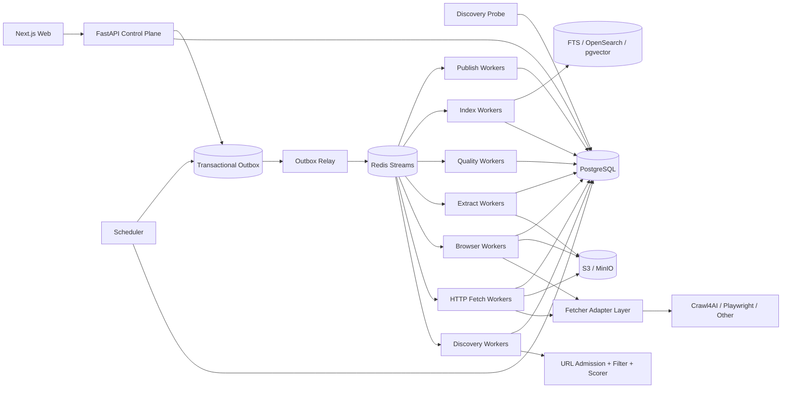

# 博客知识库技术方案

适用范围：从约 1000 个技术博客网站抓取尽可能完整的历史文章，清洗为稳定 Markdown 作为长期知识库；后续持续新增网站，支持历史全量回灌、长期增量同步、版本保留、Web 管理、搜索与外部知识库发布。整体按“数百万 URL、长期运行、站点异构、可横向扩展、可恢复、可回放、可审计”设计。

## 1. 建设目标

1. 用户只需录入博客根地址，系统自动探测 Sitemap、Feed、归档页、分类页、作者页、公开 API、动态列表等入口，并生成可审核的站点配置草稿。
2. 支持约 1000 个站点的历史全量抓取，并可持续增加站点，不要求修改核心状态机。
3. 同一站点允许多个独立 Discovery Provider，每个 Provider 独立维护 capability、checkpoint、覆盖度与增量连续性。
4. 抓取标题、作者、发布时间、更新时间、标签、canonical、正文、代码块、表格、图片和附件，输出稳定 Markdown。
5. 默认 HTTP-first，仅在证据表明确实需要 JavaScript 时升级到 Browser。
6. 支持 ETag、Last-Modified、Sitemap lastmod、Feed GUID/cursor、API cursor、内容 hash 与重叠时间窗口驱动的增量同步。
7. 支持 durable frontier、断点续跑、幂等、重试、指数退避、限流、熔断、按站公平调度与 backpressure。
8. 保存原始响应、渲染 DOM、抽取候选、Article IR、Markdown、规则版本和质量结果；规则升级优先离线 replay。
9. 提供 Web 管理端完成站点接入、探测、规则发布、任务管理、质量审核、版本 diff、错误诊断、搜索和发布管理。
10. Crawl4AI、Playwright、Trafilatura 等统一通过 Adapter 接入，不直接成为业务状态真相源。
11. URL 发现、URL 准入、抓取、抽取、质量评估、索引和发布全部可版本化、可审计。
12. LLM 仅作为昂贵的语义抽取或低质量升级路径，不作为百万级文章的默认正文抽取方式。

## 2. “全量历史”的定义

### 2.1 Live Full

从当前站点仍可访问的 Sitemap / Sitemap Index、RSS / Atom / JSON Feed、平台公开 API、年/月归档、分类、标签、作者分页、普通站内链接和动态列表中发现历史文章。

### 2.2 Archive Full（可选）

在合规前提下，可利用 Common Crawl、Wayback 等补充已经删除、迁移或当前站内不再暴露的历史 URL 或历史快照证据。

### 2.3 Provider Capability

每个发现 Provider 必须标注：

- `exhaustive`：理论上可枚举完整集合，如可靠 Sitemap Index；
- `windowed`：只暴露最近窗口，如普通 RSS；
- `best_effort`：只能尽力发现，如普通站内递归。

不能用“队列为空”代表历史全量完成；覆盖度要按 Provider 统计发现量、准入量、正文成功量、checkpoint、水位、断档和未覆盖区域。

## 3. 核心设计原则

1. PostgreSQL 是业务状态真相源，S3/MinIO 是不可变大对象真相源。
2. 站点、发现端点、Fetch Profile、Extraction Contract、URL Filter Chain、URL Scorer、Browser Action Plan、Adapter 全部分离并版本化。
3. 自动 Probe 与生产回灌分离；Probe 只生成配置草稿和样本证据。
4. URL 被发现不表示允许抓取，必须经过 URL Admission Pipeline。
5. HTTP、Feed、Sitemap、API、Browser 分层，Browser 是稀缺升级路径。
6. 页面动作与内容抽取分离；Browser Action Plan 负责页面就绪、点击、翻页和滚动，Extraction Contract 负责字段与正文。
7. 抓取快照不可变，规则升级优先 replay。
8. 文章身份与 URL 分离；redirect、canonical、镜像、迁移不自动等同于新文章。
9. `article_version` 只追加，不覆盖旧版本。
10. Redis Streams 只做短期分发，不做状态真相源。
11. 所有跨 PostgreSQL 与队列的写入通过 Transactional Outbox。
12. LLM 输出只能作为候选或派生结果，必须记录模型、prompt、schema、输入 snapshot hash 与成本。
13. 控制面不执行长任务，只创建 durable job。
14. 批处理只做传输优化，结果必须按 `task_id/attempt_id` 关联。
15. 第三方抓取引擎不能绕过统一 Egress、robots、限流、预算和业务状态机。

## 4. 总体架构



系统分为控制面、探测面、发现面、采集面、Adapter 面、抽取与质量面、协调面、知识访问面和发布面。

## 5. 新站点接入：Discovery Probe

管理员输入根 URL 后，Probe 并行执行：

1. GET 根页面并记录最终 URL、Content-Type 和结构；
2. 解析 robots.txt 中 Sitemap；
3. 探测常见 Sitemap 地址；
4. 解析 HTML 中 RSS/Atom alternate；
5. 探测常见 Feed；
6. 识别归档、分类、标签、作者和分页；
7. 识别公开 JSON/REST/GraphQL API；
8. 必要时执行 Browser Sample Probe；
9. 抓取 3~10 个详情页样本，识别正文结构与 metadata；
10. 生成 Provider、Fetch Profile、Filter Chain、Scorer、Extraction Contract、Action Plan 和 Adapter 草稿。

Web 端展示证据与样本，管理员 dry-run 后发布，再创建历史回灌任务。

## 6. URL Admission、Filter Chain 与 Best-First Frontier

这是本方案针对大规模博客抓取的关键优化。

### 6.1 Admission Pipeline

每个新发现 URL 依次经过：

1. URL 规范化；
2. SSRF / Egress 校验；
3. robots 与访问策略；
4. Domain / Subdomain allowlist；
5. URL path allow/deny；
6. Content-Type 规则；
7. canonical / redirect 去重；
8. crawler trap 检测；
9. Provider 深度与预算；
10. URL Priority Scorer。

规则保存为 `url_filter_chain_release`，每个 Discovery Run 固化对应 release，保证可重放。

### 6.2 URL Scorer

对于 HTML recursive 或动态发现，不只使用简单 BFS，而是支持可插拔 Best-First 排序：

```text
priority_score =
  source_priority
+ path_pattern_score
+ page_type_score
+ recency_score
+ semantic_score
- trap_penalty
- duplicate_penalty
```

Sitemap/API/Feed 直接发现的文章详情页优先级最高；归档页和分类页次之；未知站内链接较低。关键词 scorer 只作为软排序信号，不能成为唯一准入规则。

### 6.3 Crawl4AI Deep Crawl 的定位

Crawl4AI 的 BFS/DFS/BestFirst 可以由 Adapter 暴露为 Provider 局部执行能力，但不能替代生产级全局 frontier。所有新 URL 都必须写入 PostgreSQL `url_frontier`，由 Scheduler 再分发；不允许依赖某个单进程 crawler 内存中的 visited/frontier 来声明全量完成。

## 7. Fetcher Adapter 与能力协商

统一输入：

```text
task_id
attempt_id
url
profile_release_id
filter_chain_release_id
scorer_release_id
action_plan_release_id
adapter_release_id
execution_budget
conditional_headers
```

统一输出：

```text
task_id
attempt_id
success
final_url
status_code
headers
raw_body/rendered_dom reference
links
engine_metrics
error_class/error_code
```

每个 Adapter release 注册 Capability Manifest，包括 HTTP、Browser、session、per-url config、execute-js、raw html、Markdown、metrics、max batch、max concurrency 等能力。Profile 与 Action Plan 发布前必须做 capability validation。

## 8. 推荐技术栈

| 层 | 推荐 |
|---|---|
| API | Python + FastAPI |
| Web | React / Next.js |
| Worker | Python asyncio |
| CPU Worker | 独立进程池 / Worker |
| 状态库 | PostgreSQL |
| 队列 | Redis Streams |
| 大对象 | S3 / MinIO |
| HTTP | httpx / aiohttp |
| Browser | Playwright + Crawl4AI Adapter |
| Sitemap / Feed | lxml / defusedxml + feedparser |
| 正文抽取 | 站点 Contract + Trafilatura + Readability + Crawl4AI |
| 全文检索 | PostgreSQL FTS，规模扩大后 OpenSearch |
| 向量 | pgvector 或独立 Vector DB，可选 |
| 观测 | OpenTelemetry + Prometheus + Grafana + Loki |
| 部署 | Docker + Kubernetes |

## 9. 核心数据模型

至少包括：

- `site`：站点元数据、状态、抓取政策；
- `site_source`：Sitemap/Feed/API/Archive/HTML/Browser 等 Provider；
- `fetch_profile_release`；
- `url_filter_chain_release`；
- `url_scorer_release`；
- `extraction_contract_release`；
- `browser_action_plan_release`；
- `adapter_release`；
- `discovery_probe_run`；
- `discovery_run`；
- `discovery_checkpoint`；
- `url_frontier`；
- `fetch_task`；
- `crawl_attempt`；
- `fetch_snapshot`；
- `browser_session_lease`；
- `extraction_candidate`；
- `quality_evaluation`；
- `article`；
- `article_version`；
- `publish_state`。

`url_frontier` 关键字段包括 normalized_url、site/source、discovered_from、depth、priority_score、filter/scorer release、state、attempt_count、next_attempt_at、lease_owner、lease_until 和 discovery_evidence。

## 10. 历史发现与增量同步

Provider 推荐优先级：

1. Sitemap / Sitemap Index；
2. 平台公开 API；
3. RSS/Atom/JSON Feed；
4. 年/月归档；
5. 分类/标签/作者分页；
6. HTML 同域递归；
7. Browser 动态列表；
8. 外部公开索引补漏。

Sitemap 必须支持 index、gzip、namespace、lastmod、分片递归、streaming parse 和安全 XML；Feed 保存 GUID、发布时间、更新时间、cursor/next link；windowed Provider 必须使用重叠时间窗口、断档检测和周期性 full reconcile。

## 11. HTTP-first 与 Browser 升级

默认优先条件请求：`If-None-Match`、`If-Modified-Since`、Sitemap lastmod、Feed GUID/更新时间、API cursor。304 或内容 hash 未变化时不进入昂贵抽取链。

仅在以下证据出现时升级 Browser：HTTP 页面无正文而渲染后存在正文、关键列表需要 JS、SPA 内容只存在 rendered DOM、存在 load-more / infinite scroll、Extraction readiness 在 HTTP DOM 上失败。

Browser session 必须使用 TTL、heartbeat、generation/fencing token、最大请求数、最大生命周期和显式 cleanup。

## 12. 抽取、质量评估与 LLM 升级

### 12.1 多候选抽取

同一 snapshot 可产生：

- 平台 API / JSON-LD / meta；
- 站点 CSS/XPath/JSON Contract；
- Trafilatura；
- Readability；
- Crawl4AI cleaned Markdown；
- 必要时 LLMExtractionStrategy。

### 12.2 确定性优先

百万级文章默认走 LLM-free 路径。推荐顺序：

1. 平台结构化 API；
2. 站点 Extraction Contract；
3. 通用正文抽取器；
4. 质量 Resolver；
5. 只有质量门禁失败、结构高度不规则或业务明确要求语义字段时才升级 LLM。

每站维护 `llm_escalation_policy` 和 token/月度成本预算。

### 12.3 Quality Gate

至少检查：正文长度、标题匹配、链接密度、导航占比、代码块完整度、图片引用、发布时间证据、重复度和 schema 字段命中率。连续失败可自动触发重新 Probe，生成新 Contract 草稿，通过 Web canary 后发布。

## 13. Article IR 与 Markdown

HTML 不直接字符串清洗后落 Markdown，而是先转换为稳定 Article IR：heading、paragraph、list、quote、code block、table、image、link、embed placeholder。

Markdown 推荐目录：

```text
knowledge/{site_slug}/{yyyy}/{article_id}.md
```

front matter 至少包含 article_id、site、source_url、canonical_url、published_at、updated_at、fetched_at、content_hash、version。

文件名不直接依赖标题，避免重命名和非法字符问题。

## 14. 去重、文章身份与版本

URL 规范化处理 fragment、tracking query、scheme/host 大小写、默认端口、trailing slash、canonical 和 redirect。强去重使用规范化正文 hash 或 Article IR hash；MinHash/SimHash 仅生成近似重复候选，不自动删除。

正文、metadata、canonical identity 或规则升级后的 canonical IR 发生实质变化时创建新的 `article_version`。

## 15. 调度、队列与扩展性

Job 类型包括 probe、backfill、incremental sync、reconcile、re-extract、re-normalize、re-index、re-publish、asset repair、orphan session cleanup。

所有任务通过 Transactional Outbox 投递 Redis Streams。Worker 使用 lease 与 idempotency key 防重复业务结果。

Scheduler 使用 weighted fair queue，防止大站点长期占满 worker；每域维护并发、QPS、最小间隔、Retry-After、429/403 退避和 HTTP/Browser 独立预算。当 downstream 堆积时降低发现速度、暂停 Browser 扩展、优先消化已抓未抽取内容。

## 16. 错误分类

统一错误 taxonomy：dns_failure、connect_timeout、read_timeout、connection_reset、tls_failure、http_401_403、http_404_410、http_429、http_5xx、robots_denied、egress_denied、content_too_large、browser_crash、browser_timeout、extraction_failed、adapter_contract_error。

每类错误明确 retryable、retry_after、最大次数、影响范围及是否触发熔断或人工审核。

## 17. Web 管理功能

Web 至少支持：

- 站点列表、Provider 数、历史覆盖度、backlog、错误率、Browser 占比、平均成本；
- 新增站点 Probe 向导；
- Sitemap/Feed/API/归档/动态列表证据展示；
- URL Filter Chain 与 Scorer 编辑、dry-run、版本发布和回滚；
- Extraction Contract 与 Browser Action DSL 编辑；
- 任务暂停、恢复、取消、重试和单 URL 调试；
- 原始 HTML / rendered DOM / Markdown 对比；
- 抽取候选与质量评分；
- 文章版本 diff；
- Adapter 能力与兼容性检查；
- 全文/向量搜索；
- 外部知识库发布状态。

## 18. 安全与合规

所有网络访问统一经过 Egress Gateway：仅允许 http/https，拒绝 localhost、RFC1918、link-local、loopback、metadata endpoint，DNS 解析前后校验，redirect 每跳重新检查，限制端口并防 DNS rebinding。

robots 决策缓存并版本化；不绕过验证码、登录、付费墙或明确访问控制。Browser 任意 JS 默认禁用，确需 JS 时必须版本化、审核、限时、限资源并限制网络出口。

## 19. 观测与 SLO

关键指标包括 discovery URL/s、fetch success rate、304 ratio、Browser escalation ratio、extraction success rate、empty/short content ratio、queue lag、domain throttle time、retry rate、average cost per article、Provider continuity gap、outbox lag、Adapter error rate、Browser seconds/article、LLM escalation ratio 与 token cost/article。

每个 URL 使用 trace_id 贯穿 Discovery → Admission → Fetch → Snapshot → Extract → Quality → Normalize → Index → Publish。

## 20. 部署与容量规划

Worker 至少拆分为 discovery、HTTP fetch、Browser、extract、CPU、index、publish、cleanup。Browser 单独 Pod/Node Pool，严格并发和内存预算。大 HTML、DOM、IR、Markdown 和附件放 S3/MinIO，PostgreSQL 只保存 metadata、状态、hash 和 object key。

## 21. 实施阶段

### Phase 1：MVP

site/source、Probe 基础版、Sitemap/Feed、durable frontier、HTTP 抓取、raw snapshot、Trafilatura/Readability、Markdown、PostgreSQL、Redis Streams、MinIO、Web 站点/任务/文章查看、ETag/Last-Modified 增量、Egress/robots、基础错误 taxonomy。

### Phase 2：异构站点与质量闭环

Extraction Contract、URL Filter Chain、URL Scorer、Best-First Frontier、Browser Action DSL、Crawl4AI/Playwright Adapter、Adapter Capability Manifest、Browser session lease、动态列表发现、抽取候选、Quality Gate、dry-run/canary/replay。

### Phase 3：规模化与连续性

多 Provider checkpoint、weighted fairness、backpressure、full reconcile、coverage dashboard、自动重新 Probe、OpenSearch/pgvector、LLM escalation policy 与成本治理、外部知识库发布。

### Phase 4：高级能力

Archive Full、站点类型模板、近似重复、自动回归测试、受控 MCP、智能调度、Adapter 自动兼容测试矩阵。

## 22. 推荐最小生产拓扑

```text
2 x FastAPI Control Plane
2 x Scheduler / Outbox Relay（leader lease）
N x Discovery Worker
N x HTTP Fetch Worker
独立 Browser Worker Pool
N x Extract / Quality Worker
N x Index / Publish Worker
1+ x Cleanup Worker
Fetcher Adapter Layer
PostgreSQL HA
Redis Streams
S3 / MinIO
Prometheus + Grafana + Loki + OpenTelemetry Collector
Next.js Web
```

## 23. 最终结论

对于“1000 个技术博客全量历史 + 长期增量 + 持续新增站点 + Web 管理”，核心不是寻找一个万能爬虫，而是建立一个 durable、版本化、可探测、可过滤、可排序、可回放、抓取引擎可替换的采集平台。

最终采用：

- Discovery Probe 降低新站点接入成本；
- Sitemap/API/Feed/Archive/HTML/Browser 多 Provider 做完整历史发现；
- PostgreSQL 保存 durable frontier、checkpoint、task、version；
- URL Filter Chain 在抓取前尽早剔除无效链接；
- Best-First Scorer 提升有限预算下的有效覆盖率；
- HTTP-first + Browser 按证据升级；
- Crawl4AI deep crawl 仅作为 Provider 局部执行器，不承担全局 frontier；
- 多候选抽取 + Quality Gate；
- CSS/XPath/DOM IR/Trafilatura/Readability 默认优先，LLM 仅作为低质量或语义抽取升级路径；
- S3/MinIO 保存不可变快照与 Markdown；
- Article IR + append-only version 保证规则升级可回放；
- Web 管理端覆盖接入、过滤、排序、规则、任务、质量、Adapter 和发布；
- 统一 SSRF/Egress/robots/预算约束所有网络访问。

这套结构可以从几十个站点扩展到 1000+ 站点，并可随着新平台、新发现方式、新抓取引擎和模型能力持续扩展，而无需重写核心状态机。