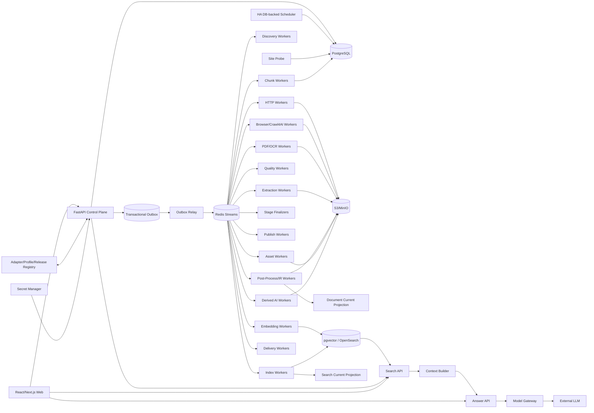

# 博客知识库技术方案

适用范围：从约 1000 个技术博客、工程博客、技术文档站、Newsletter、CMS 和公开文档站抓取尽可能完整的历史文章，清洗为稳定 Markdown 建设长期知识库；后续持续增加网站，支持增量同步、Web 管理、版本留存、搜索/RAG、离线重处理、质量审计、图片附件归档和 AI 派生能力。整体按百万级文档、数百万到千万级 URL、站点高度异构和多年持续运行设计。

## 1. 建设目标

1. 输入站点根地址、博客入口、文档入口或 Feed 后，自动探测 Sitemap、Sitemap Index、RSS/Atom/JSON Feed、公开 API、归档页、分类/标签/作者页、文档导航树、普通内链、`llms.txt`/文本 URL 列表和动态列表。
2. 支持 `FULL_BACKFILL` 历史全量回灌、`INCREMENTAL` 持续增量、`RECONCILE` 周期覆盖校准、`TARGETED_FETCH` 精确补抓、`REPROCESS` 离线重处理、`ASSET_REPAIR` 资产修复、`REINDEX` 搜索/RAG 重建。
3. 历史完整性必须有 Provider 级 Coverage Evidence，不能用“队列空了”“达到 max_depth/max_pages/max_urls”代替完整性证明。
4. 默认 HTTP-first；只有存在明确动态渲染证据时才升级 Crawl4AI/Playwright Browser。
5. Discovery Rule、Discovery Route、Article Fetch Route、Extraction Profile、Post-Processor、Quality Policy、Chunker、Embedding、Search Index、Retrieval Profile、Context Builder、AI Prompt/Model 全部独立版本化。
6. 支持 Sitemap `lastmod`、Feed GUID/updated、API cursor、ETag、Last-Modified、body hash、Canonical IR hash、重叠时间窗和周期 Reconcile 驱动增量。
7. 最终知识对象保存标题、作者、发布时间、更新时间、标签、canonical、正文块、代码块、表格、图片、附件、链接关系、来源 Snapshot、字段 provenance 和完整 lineage。
8. 支持 durable frontier、断点续跑、幂等、lease、heartbeat、重试、限流、熔断、公平调度、backpressure 和 dead-letter。
9. 保存不可变网络 Snapshot、渲染 DOM、清洗 HTML、Extraction Candidate、字段转换轨迹、Canonical Document IR、Markdown Projection、规则版本和质量结果；规则升级优先离线 replay。
10. 图片和附件走独立 Asset Pipeline，支持安全校验、hash 去重、对象存储、引用关系、独立重试和 Markdown URL 重写。
11. Web 管理端覆盖站点接入、Provider 覆盖、任务控制、发现证据、当前文章、历史版本、版本 diff、抽取转换链、质量审核、漂移告警、资产、搜索/RAG 索引、查询 Trace、成本、Schedule、AI Workflow、Delivery 和审计。
12. Markdown、全文索引、Embedding、RAG、摘要、聚类、Digest、Newsletter、报告和通知都属于 Accepted Document Version 的异步下游，失败不能阻塞源站同步。
13. 在 append-only 历史真相层之上提供可重建 Current Projection，让 Web 和运营查询像普通内容系统一样高效查看“当前状态”，同时不牺牲历史、审计和回滚。
14. Canonical IR hash 必须在摘要、Chunk、Embedding 等昂贵下游之前计算；内容未变化时只记录 freshness observation，避免重复 AI/Search 成本。
15. 检索对技术博客必须同时照顾自然语言、代码符号、配置项、错误码、版本号和文件路径，不能只做纯向量搜索。

## 2. 核心原则

1. **PostgreSQL 是业务状态真相源；S3/MinIO 是不可变大对象真相源。**
2. Redis Streams 只承担任务运输；决定性状态先写 PostgreSQL，再由 Transactional Outbox 投递。
3. Source Adapter、Discovery、Admission、Fetch、Extraction、Post-Process、Quality、Asset、Publish、Search、Context Builder、Answer、Derived AI、Delivery 分层。
4. Discovery 只产生 URL Candidate 和 Evidence；列表页、搜索页、Feed 摘要不能直接成为最终正文。
5. URL Identity 与 Document Identity 分离；redirect、canonical、slug rename、镜像、站点迁移只是 identity evidence。
6. Identity 与 Freshness 分离；“URL 已知”不代表“内容仍新鲜”。
7. 发布时间、更新时间、抓取时间、源站 freshness observation 分离；未知发布时间保持 NULL，绝不拿抓取时间伪装发布时间。
8. Discovery Rule 与 Extraction Profile 分离；URL path pattern 可帮助分类，但不能直接证明页面是合法文章。
9. Discovery Fetch Route 与 Article Fetch Route 分离；动态列表需要 Browser，不代表文章详情页也必须 Browser。
10. HTTP、Browser、PDF/OCR 分层路由；Browser 是昂贵升级路径，生产中复用长期 runtime/browser pool。
11. Crawl4AI `result.links`、批量调度器、CSS/JSON Schema 是 Worker 内执行能力，不承担历史完整性、持久调度和业务最终状态。
12. HTTP 200、Browser success、`result.success`、Extractor 无异常都不是业务成功证据。
13. 所有阶段使用结构化 Outcome Contract；`EMPTY/INVALID/AMBIGUOUS/RETRYABLE_ERROR/PERMANENT_ERROR` 不能被空字符串、空数组或宽泛异常吞掉。
14. Stage 完成由 Finalizer 对任务、Artifact、质量结果、Manifest 和 Provider ACK 对账，不由协程或 BackgroundTasks 结束决定。
15. Crawl4AI Markdown/cleaned HTML 只是 Extraction Candidate；最终知识真相是 Accepted Canonical Document IR。
16. `document_version` append-only，不原地覆盖历史版本。
17. Current Projection、Markdown、搜索索引、Chunk、Embedding、摘要、报告和外部知识库都是 Projection，可删除后重建。
18. 文件路径、`#chunk-N`、UI 行号都不能承担 Document/Chunk Identity。
19. `max_depth/max_pages/max_runtime/max_urls` 只是预算，不是历史完整性证明。
20. 关键词相关性、用户偏好和 AI 评分只影响优先级或下游选择，不能静默裁掉 FULL_BACKFILL 的合法历史内容。
21. Scheduler、FastAPI BackgroundTasks、`asyncio.create_task()`、进程内队列/集合/全局变量不能承担业务真相。
22. Config 使用不可变 Release；Secret 使用 Vault/云 Secret Manager，仅保存引用。
23. Retrieval 与 Generation 解耦；LLM 不可用时抓取、Markdown、FTS/Search 仍应正常工作。
24. Search API 返回结构化命中；Context Builder 独立做 token budget、去重、邻接扩展和引用绑定。
25. 人工操作使用 append-only Audit/Event；人工纠错通过 Override/Evidence 追加，不能抹掉机器历史。
26. 遵守 robots、版权、访问控制、站点政策和合理速率；验证码、登录、付费墙、WAF 挑战进入显式策略流程，不自动绕过。
27. Embedding 失败保持显式状态和 NULL 向量，不允许用全 0 向量伪装成功。

## 3. 总体架构



职责：

- **Control Plane**：站点、Release、Run、Schedule、人工命令、权限和审计。
- **Site Probe**：探测站点能力并生成待审核 Site Profile。
- **Discovery**：枚举 URL、Provider checkpoint、Link Evidence 和覆盖证据。
- **Admission**：URL 规范化、Scope、robots、crawler trap、Content-Type 和网络安全检查。
- **Fetch**：条件请求、Browser 升级、PDF/OCR 和不可变 Snapshot。
- **Extraction**：按页面类型/Profile 生成一个或多个 Raw Candidate。
- **Post-Process/IR**：字段契约校验、清洗、时间解析、链接媒体归一化、fallback 和 Canonical IR。
- **Quality/Drift**：防空抓、错抓、模板漂移、字段污染和 fallback 激增。
- **Current Projection**：从 append-only Accepted Version 生成每文档一行的当前运营视图。
- **Asset**：图片附件下载、hash 去重、S3 归档和引用维护。
- **Finalizer**：按 Outcome/Manifest 对账真实阶段成功。
- **Publish**：Markdown、Git、外部 KB Projection。
- **Search**：Chunk、Embedding、全文/精确 token/向量索引、Hybrid Retrieval 和引用绑定。
- **Search Current Projection**：只在新版本索引完整后切换当前可检索版本，避免检索空窗。
- **Context Builder**：按 Query Trace 和 token budget 进行 document-aware grouping、邻接扩展、去重和上下文选择。
- **Answer**：调用 Model Gateway 生成带引用答案；不承担索引真相。
- **Derived AI**：版本化摘要、聚类、Digest、Newsletter、报告 DAG。
- **Delivery**：独立幂等投递、Provider ACK、重试和 dead-letter。

## 4. Crawl Mode 与 Run 语义

```text
FULL_BACKFILL   首次历史全量回灌
INCREMENTAL     持续同步新增和更新
RECONCILE       周期重新枚举，修复断档
TARGETED_FETCH  精确 URL 抓取、调试或补抓
REPROCESS       不访问源站，基于已有 Snapshot/Candidate 重抽取和重清洗
ASSET_REPAIR    仅补齐失败或缺失图片/附件
REINDEX         不访问源站，重新切块、Embedding、全文/向量索引
```

规则：

- 同站点默认只允许一个 active FULL_BACKFILL；
- INCREMENTAL 与 Search/AI/Publish/Asset 可并行，但同一 URL 网络请求和版本写入通过幂等键去重；
- TARGETED_FETCH 必须逐项返回真实结果，不能只返回“任务已启动”；
- REPROCESS 固定 `source_snapshot_id + extraction_profile_release + post_processor_release_chain`；
- REINDEX 固定 `document_version_id + chunker_release + embedding_release + search_index_release`；
- Run 完成由 Stage Finalizer 判断，不由 Worker 函数结束判断；
- Run 统计必须来自本次 Run Manifest，不允许从站点累计库存反推 `pages_crawled/chunks_created`。

## 5. Site Onboarding 与版本化 Profile

新站点接入先进入 Probe：

```text
root URL
 -> robots.txt
 -> sitemap hints
 -> feed hints
 -> common API/CMS fingerprints
 -> archive/category/docs-nav detection
 -> representative page samples
 -> HTTP/Browser comparison
 -> content-type/profile inference
```

形成待审核 `site_profile_release`：

```text
site_scope
allowed_hosts
robots_policy
request_headers_ref
rate_limit
concurrency
preferred_discovery_providers
fetch_route_rules
extraction_profile_binding
freshness_policy
asset_policy
quality_policy
schedule
```

Profile 发布后不可原地修改；任何配置变化生成新 Release。Run 固定引用 Release，确保可重现。

## 6. Discovery Provider 与 Coverage

### 6.1 Provider 类型

```text
SITEMAP_INDEX
SITEMAP_URLSET
RSS_ATOM_JSONFEED
PUBLIC_API
HTML_ARCHIVE
CATEGORY_TAG_AUTHOR
DOC_NAV
TEXT_URL_LIST / LLMS_TXT
INTERNAL_LINK
MANUAL_SEED
```

### 6.2 Sitemap Index 必须递归处理

```text
Sitemap Index
 -> child sitemap tasks
 -> child checkpoint
 -> URL candidates
 -> coverage ledger
```

不能把 child sitemap URL 当普通文章页抓取，也不能只解析第一层。

### 6.3 Coverage Ledger

每个 Provider/Run 至少记录：

```text
provider_release_id
checkpoint_before/checkpoint_after
pages_or_cursors_seen
candidate_count
accepted_url_count
skipped_count
error_count
min/max source_time
terminal_reason
coverage_confidence
started_at/finished_at
```

FULL_BACKFILL 结束条件是：所有必需 Provider 达到可解释 terminal state，并且 Frontier/Artifact/Finalizer 对账完成。

## 7. URL Identity、Admission 与安全

### 7.1 URL 规范化

保留原始 URL，同时生成 normalized URL：

- scheme/host 大小写规范；
- 默认端口清理；
- fragment 移除；
- tracking query 按规则剔除；
- query 参数排序；
- trailing slash 不做通用强制合并，按站点规则处理。

### 7.2 Admission Pipeline

```text
candidate
 -> parse
 -> scheme allowlist
 -> host/scope
 -> DNS/IP safety
 -> robots
 -> trap rules
 -> content-type hint
 -> normalized identity
 -> frontier admission
```

### 7.3 SSRF/网络安全

必须：

- 禁止 localhost、RFC1918、link-local、metadata endpoint、保留地址；
- DNS resolve 后验证 IP，连接前后防 rebinding；
- redirect 每一跳重新执行 Admission；
- 默认限制端口；
- Asset URL 复用同一网络安全策略；
- custom proxy、外链跟随、文件下载、执行 JS 属于高权限能力；
- 普通管理用户不能任意注入代理和网络凭据。

## 8. Durable Frontier 与调度

`frontier_task` 不是普通队列消息，而是业务状态：

```text
id
run_id
site_id
normalized_url
purpose
priority
state
attempt
lease_owner
lease_until
next_retry_at
idempotency_key
route_hint
created_at/updated_at
```

Redis Streams 消息只携带 task ID。

Worker：

```text
claim lease
 -> heartbeat
 -> execute
 -> persist outcome/artifact
 -> transactionally finalize state
 -> ACK message
```

进程崩溃后 lease 到期可被其他 Worker 接管。

### 8.1 公平调度

需要同时限制：

- per-host concurrency；
- per-site concurrency；
- global HTTP concurrency；
- Browser slots；
- bandwidth；
- Provider-specific rate limit。

采用 host/site fair queue，避免一个超大站点占满所有 Worker。

## 9. Fetch Route：HTTP-first，Browser 按证据升级

### 9.1 HTTP Fetch

优先使用普通 HTTP：

- connect/read timeout；
- redirect policy；
- gzip/br；
- ETag/If-None-Match；
- Last-Modified/If-Modified-Since；
- response body size limit；
- MIME sniffing；
- TLS/状态码记录。

### 9.2 Browser 升级条件

仅出现明确证据时升级，例如：

- HTML 是空 shell；
- 正文需要 JS hydrate；
- 动态列表通过 XHR 加载；
- 关键 selector 在 HTTP DOM 中不存在；
- Profile 明确指定 Browser。

Browser runtime 长期复用，不为每 URL 启动新浏览器。

### 9.3 PDF/OCR

PDF 走独立 Route：

```text
PDF snapshot
 -> text layer extraction
 -> layout/table extraction
 -> OCR fallback if needed
 -> canonical blocks
```

OCR 只在确有需要时使用。

## 10. Immutable Snapshot 与 Artifact Graph

每次有效网络抓取保存不可变 Artifact：

```text
HTTP headers
raw response body
rendered DOM / screenshot metadata when Browser
downloaded PDF/file
cleaned HTML
extraction candidate
canonical IR
markdown projection
```

Artifact 使用 content hash 去重，对象放 S3/MinIO；PostgreSQL 保存 metadata、hash、lineage 和引用。

推荐关系：

```text
fetch_snapshot
 -> artifact(raw_html)
 -> artifact(rendered_dom)
 -> extraction_candidate
 -> canonical_ir_artifact
 -> markdown_artifact
```

规则升级时优先从已有 Snapshot 重放，不重新访问源站。

## 11. Extraction Candidate 与 Canonical Document IR

### 11.1 Candidate

允许多种 Extractor 同时产生 Candidate：

```text
metadata/json-ld extractor
article/main CSS extractor
trafilatura/readability
Crawl4AI markdown
site-specific JSON/API
```

每个 Candidate 记录来源和置信度，不能只用固定 fallback 顺序静默决定正文。

### 11.2 Canonical IR

最终知识真相使用结构化 IR，而不是 Markdown：

```text
DocumentIR
- title
- subtitle
- authors[]
- published_at
- updated_at
- canonical_url
- tags[]
- language
- blocks[]
- outbound_links[]
- assets[]
- metadata
- provenance
```

Block：

```text
heading(level,text)
paragraph
code(language,text)
list
table
blockquote
image(asset_ref,alt,caption)
callout
horizontal_rule
```

Markdown 只是 IR Projection。

## 12. Post-Process、内容卫生与质量门

### 12.1 内容卫生

必须在 Chunk/Embedding 前去除常见检索污染：

- 巨大 data URI/base64；
- 控制字符；
- 重复导航；
- Cookie/订阅弹窗；
- 无意义编码块；
- 重复页脚；
- 异常超长垃圾。

每项清理必须产生 transform evidence 和 quality flag。

### 12.2 Quality Policy

至少检查：

- 正文长度；
- 标题/正文一致性；
- 导航文本占比；
- 代码/正文异常比例；
- Challenge/WAF/登录页特征；
- canonical 与 scope；
- 发布时间可信度；
- 模板 selector 命中率；
- 与历史版本内容差异；
- extraction fallback 激增；
- 是否截断。

结果：

```text
ACCEPT
ACCEPT_WITH_WARNING
QUARANTINE
RETRY
REJECT
```

## 13. Document Identity、版本与 Current Projection

### 13.1 URL Identity 与 Document Identity

Document Identity 通过多种 Evidence 合并：

- canonical；
- redirect；
- stable CMS/API ID；
- Feed GUID；
- 内容 hash + 时间/标题辅助；
- 人工 override。

绝不能仅依赖 URL 字符串。

### 13.2 Append-only Version

```text
document
  1 --- N document_version
```

`document_version` 保存：

```text
document_id
canonical_ir_artifact_id
canonical_ir_hash
source_snapshot_id
extraction_profile_release_id
post_processor_release_chain
quality_policy_release_id
published_at/updated_at
accepted_at
```

### 13.3 Current Projection

为了 Web 和运营快速查询，维护：

```text
document_current_projection
- document_id PK
- current_version_id
- site_id
- canonical_url
- title
- authors
- published_at
- updated_at
- content_hash
- quality_state
- content_preview
- content_length
- markdown_artifact_id
- accepted_at
- projection_updated_at
```

它只是读模型，删除后可从历史真相重建。

完整 Markdown 不应默认存入/返回站点列表查询；列表只取 preview + artifact pointer。

## 14. 增量同步与变更短路

### 14.1 Freshness Evidence 优先级

```text
Provider evidence: sitemap lastmod/feed updated/API cursor
HTTP evidence: ETag/Last-Modified/304
Body hash
Canonical IR hash
Periodic reconcile
```

### 14.2 变更短路门

```text
fetch/extract
 -> canonical_ir_hash
 -> compare current version
```

相同：

```text
记录 url_observation / freshness evidence
更新 last_seen_at
不创建 document_version
不跑 summary/chunk/embed/index
```

变化：

```text
append document_version
 -> update current projection
 -> outbox downstream projections
```

这一步必须发生在 LLM 摘要、Chunk 和 Embedding 之前。

### 14.3 Reconcile

即使 Provider 提供增量，也必须周期 Reconcile：

- 重扫 Sitemap/Feed/Archive；
- 发现漏抓；
- 检测删除/迁移；
- 校准 Provider checkpoint。

## 15. Asset Pipeline

HTML/IR 中图片和附件只创建 Asset Candidate，独立 Pipeline 处理：

```text
candidate URL
 -> admission/security
 -> fetch
 -> MIME/size validation
 -> sha256 dedupe
 -> object storage
 -> asset row/reference
 -> markdown rewrite
```

`asset_reference` 绑定 document_version + block；源站资源变化时可产生新 asset version。

不允许主文章抓取因单张图片失败而整体失败。

## 16. Chunk Projection

### 16.1 结构优先

Chunk 基于 IR Block，而不是固定字符：

```text
heading path
 -> paragraph/code/table/list block grouping
 -> token budget
 -> oversized block token split
 -> controlled overlap
```

### 16.2 稳定 Chunk Identity

```text
chunk_id = hash(
  document_version_id
  + chunker_release_id
  + block_range
  + chunk_content_hash
)
```

`chunk_index` 仅用于顺序展示。

### 16.3 Parent/Chunk 索引策略

对有 Chunk 的长文档：

- 主向量索引只放 Chunk；
- 完整父正文默认不放同类向量索引，避免同文档重复占满 Top-K；
- Document 可选建立“title + summary”的轻量 document embedding，用于粗粒度 routing；
- lexical document index 可保留整文命中；
- Chunk 保存 `document_version_id + heading_path + block_range + neighbor refs`。

## 17. Embedding Projection

`embedding_release` 固定：

```text
provider/model
dimension
normalization
input_template
batch_policy
retry_policy
```

状态：

```text
PENDING
RUNNING
READY
FAILED
BLOCKED
```

Embedding 失败时 `vector=NULL`，不能写零向量。

使用批量 API、限流和独立 Worker；对重复 `chunk_content_hash + embedding_release` 可做缓存复用。

## 18. Search Index 与 Hybrid Retrieval

### 18.1 第一阶段推荐

1000 个技术博客可先采用：

```text
PostgreSQL
- metadata/business truth
- language-aware FTS
- pg_trgm/exact token fields
- pgvector HNSW/IVFFlat
```

保持 Search Projection 抽象，规模、检索复杂度或高亮/聚合需求增长时切 OpenSearch，不修改业务真相层。

### 18.2 技术博客 lexical 信号

必须专门索引：

- 函数/类/包名；
- CLI 参数；
- 错误码；
- 配置项；
- 文件路径；
- 版本号；
- 代码语言；
- 标题/heading。

不能只用 PostgreSQL `english` stemmer；多语言站点按 language/profile 选择 FTS analyzer，并保留 trigram/exact token 通道。

### 18.3 Hybrid

```text
vector candidates
lexical candidates
exact-token candidates
 -> RRF/weighted fusion
 -> optional reranker
 -> document-aware grouping
```

## 19. Document-aware Retrieval 与 Context Builder

简单“按 URL 去重只留一条”适合 Web 搜索列表，但不适合 RAG。

RAG 检索：

```text
Stage A: Chunk Candidate Retrieval
 -> larger candidate pool

Stage B: Document-aware Grouping
 -> max_chunks_per_document
 -> document diversity
 -> same-heading bonus

Stage C: Context Expansion
 -> neighbor chunks
 -> parent title/metadata
 -> optional section expansion

Stage D: Context Builder
 -> token budget
 -> near-duplicate removal
 -> ordering
 -> citation binding
```

`retrieval_profile_release` 至少包含：

```text
site/source filters
freshness filters
vector_weight
lexical_weight
exact_token_weight
candidate_k
reranker
max_chunks_per_document
neighbor_window
document_diversity_limit
token_budget
```

Web Search Profile 可以 `dedupe=document`；RAG Profile 默认允许同文档多个 Chunk。

## 20. Search Current Projection 与蓝绿切换

Document Accepted 不等于 Search Ready。

新版本流程：

```text
Accepted document_version
 -> chunk job
 -> embedding job
 -> lexical/vector index job
 -> index_projection_manifest complete
 -> atomic switch search_current_projection
 -> old projection async GC
```

```text
search_current_projection
- document_id
- search_index_release_id
- document_version_id
- index_projection_manifest_id
- switched_at
```

保证搜索无空窗，同时允许索引失败后继续使用旧可检索版本。

## 21. Search API、Answer API 与 Query Trace

Search API 返回结构化结果：

```text
query_trace_id
chunk_id
document_id
document_version_id
canonical_url
title
heading_path
snippet
lexical_score
vector_score
fusion_score
rerank_score
content_preview
```

默认 `include_content=false`；全文按 detail/artifact API 获取。

`query_trace` 保存：

- Query；
- Retrieval Profile Release；
- 候选池；
- 各阶段 score；
- 被过滤原因；
- Context Builder 最终选择；
- Model/Prompt Release；
- 引用关系；
- latency/cost。

这样才能调试“为什么没召回”或“为什么回答引用了这篇文章”。

## 22. Web 管理端

### 22.1 信息架构

```text
Dashboard
Sites
  -> Site Detail
     -> Providers/Coverage
     -> Current Documents
     -> Runs/Jobs
     -> Schedules
     -> Drift/Quality
     -> Assets
Documents
  -> Current
  -> History
  -> Version Diff
  -> Raw Snapshot
  -> Extraction Candidates
  -> Canonical IR
  -> Markdown
  -> Chunks/Index
Runs
Search / RAG Lab
Query Traces
AI Workflows
Deliveries
Audit
Settings / Releases
```

### 22.2 站点列表轻量查询

`site_operational_projection` 保存：

```text
current_document_count
last_successful_run_at
last_incremental_at
active_run
recent_failure_rate
coverage_state
drift_state
asset_failure_count
search_ready_count
```

避免 Web 对历史表做 N+1 临时聚合。

### 22.3 页面列表

默认只返回：

```text
title
canonical_url
published_at/updated_at
quality_state
content_preview
content_length
current_version_id
markdown_artifact_id
```

全文只在详情页按需取。

### 22.4 单页操作

支持：

- Targeted Fetch；
- 从已有 Snapshot Reprocess；
- Reindex；
- Asset Repair；
- 人工 identity merge/split；
- Quality override；
- 重试失败 stage。

所有操作生成 Command + Audit Event，不直接绕过工作流改数据库。

### 22.5 运营 Explorer

提供受控只读运营查询：

- Provider coverage；
- freshness；
- fail rate；
- Browser fallback rate；
- Chunk/Index completeness；
- asset failure；
- drift；
- cost。

支持 Saved Query 和 CSV 导出；普通用户不开放任意 SQL。高级 SQL 使用只读角色、超时、最大行数和审计。

## 23. AI 派生工作流

所有 AI 能力从 Accepted Version 异步触发：

```text
summary
tags/entities
classification
cluster
digest
newsletter
report
QA/chat
```

`ai_workflow_release` 固定 DAG、Prompt、Model、选择规则和预算。

LLM 失败时源站同步、Markdown 和基础 Search 不受影响。

Chat/Agent Profile 不直接硬编码检索参数，而引用：

```text
Prompt Release + Retrieval Profile Release
```

## 24. Delivery

Email/Webhook/Slack/其他投递独立：

```text
delivery
 -> attempt
 -> provider request
 -> provider ACK
 -> retry/dead-letter
```

使用幂等键，不能把“API 请求已发送”当“对方已收到”。

## 25. 核心数据模型

至少包含：

```text
site
site_profile_release
system_config_release
source_adapter_release
adapter_binding_release
discovery_provider_release
url_admission_rule_release
site_extraction_profile_release
post_processor_release
quality_policy_release
chunker_release
embedding_release
search_index_release
retrieval_profile_release
context_builder_release

discovery_checkpoint
coverage_ledger
discovery_link_evidence
crawl_run
run_stage
stage_execution
stage_evidence
run_manifest
url_identity
url_observation
frontier_task
fetch_snapshot
artifact
extraction_candidate
field_transform_trace

document
document_identity_evidence
document_version
metadata_evidence
quality_result
drift_event
document_current_projection
site_operational_projection

asset
asset_source
asset_reference
asset_task

chunk_projection
embedding_projection
index_projection_job
index_projection_manifest
search_current_projection
retrieval_eval_dataset
retrieval_eval_run
query_trace

outbox_event
schedule
command
ai_workflow_release
ai_stage_release
ai_run
ai_stage_execution
selection_manifest
publish_manifest
delivery
delivery_attempt
secret_binding
audit_event
```

关键唯一约束：

```text
UNIQUE(url_identity.normalized_url_hash)
UNIQUE(frontier_task.idempotency_key)
UNIQUE(document_version.document_id, canonical_ir_hash)
UNIQUE(document_current_projection.document_id)
UNIQUE(asset.sha256)
UNIQUE(asset_task.idempotency_key)
UNIQUE(chunk_projection.chunk_id)
UNIQUE(embedding_projection.chunk_id, embedding_release_id)
UNIQUE(index_projection_job.idempotency_key)
UNIQUE(search_current_projection.document_id, search_index_release_id)
UNIQUE(delivery.idempotency_key)
UNIQUE(command.idempotency_key)
```

大对象进入 S3/MinIO；PostgreSQL 保存业务状态、hash、metadata、索引键和 lineage。大表如 `url_observation/frontier_task/fetch_snapshot/discovery_link_evidence/query_trace/audit_event` 按时间或 site hash 分区。

## 26. Transactional Outbox 与幂等

所有“写状态 + 发任务”在一个事务：

```text
BEGIN
  write business state
  insert outbox_event
COMMIT
```

Relay 再投递 Redis Streams。

每个阶段定义幂等键，例如：

```text
fetch:{run}:{url_identity}:{route_release}
extract:{snapshot}:{profile_release}
postprocess:{candidate}:{processor_chain}
chunk:{document_version}:{chunker_release}
embed:{chunk}:{embedding_release}
index:{chunk}:{search_index_release}
```

Worker 重复消费不会产生重复真相。

## 27. Outcome Contract 与 Finalizer

统一 Outcome：

```text
status
error_code
retryable
artifact_ids[]
evidence_ids[]
metrics
next_actions[]
```

Finalizer 按 Manifest 判断 Stage：

```text
expected tasks
terminal tasks
accepted artifacts
failed tasks
quarantined tasks
provider terminal states
```

只有全部满足策略才进入 completed；部分失败可进入 `COMPLETED_WITH_WARNINGS`，并明确缺口。

## 28. Drift Detection

监控：

- extractor empty rate；
-正文长度分布；
- Browser fallback rate；
- selector miss；
- metadata missing；
- challenge page rate；
- quality reject/quarantine rate；
- canonical domain change；
- content hash 异常统一变化。

漂移触发：

```text
alert
 -> sample review
 -> new extraction/profile release
 -> offline replay
 -> compare quality
 -> rollout
```

## 29. Observability 与 SLO

指标至少包括：

```text
Discovery candidates/sec
Fetch success by route/status
HTTP latency
Browser queue wait
bytes downloaded
accepted documents
unchanged short-circuit ratio
extract empty rate
quality reject rate
frontier lag
lease timeout/retry
asset success
chunk/index completeness
embedding failure/rate-limit
search latency/recall eval
cost per site/run/document
```

日志必须带：

```text
site_id
run_id
stage_execution_id
frontier_task_id
url_identity_id
document_id
document_version_id
```

对 1000 站建议建立 SLO：

- 增量 Run 按计划启动成功率；
- Queue lag；
- Accepted 文档到 Search Ready 延迟；
- FULL_BACKFILL coverage completeness；
- 高优先站点 freshness；
- 数据丢失为 0。

## 30. 删除、迁移与 Soft Delete

源站文章消失不直接物理删除历史：

```text
ACTIVE
MISSING_OBSERVED
TOMBSTONED
```

需要连续多次 Reconcile/HTTP evidence 才升级 Tombstone。

Web “删除站点”默认做 disable/archive，不级联删除历史。真正物理清理由管理员 retention workflow 执行并审计。

## 31. Deployment Profiles

```text
DEV_FULLSTACK
DEV_EXTERNAL_DB
STAGING
PROD_K8S
```

DEV 可使用 Docker Compose 一键启动 App + PostgreSQL + Redis + MinIO + Crawl4AI。

生产建议：

- PostgreSQL HA + PgBouncer；
- Redis HA；
- S3/MinIO；
- Control Plane 独立于 Worker；
- HTTP/Browser/AI/Index Worker 分池；
- Browser pool 有固定资源上限；
- Secret Manager；
- egress 网络策略；
- Prometheus/Grafana + 日志/Trace。

## 32. 技术选型建议

### Control Plane

- FastAPI
- SQLAlchemy/asyncpg 或稳定 PostgreSQL data layer
- Pydantic

### Database

- PostgreSQL 16+
- PgBouncer
- pgvector
- pg_trgm

### Queue

- Redis Streams + Consumer Groups
- Transactional Outbox

如未来需要跨地域、更强消息语义，可替换 Kafka/Pulsar；业务真相不依赖队列。

### Fetch

- HTTPX/aiohttp HTTP Workers
- Crawl4AI/Playwright Browser Workers

### Extraction

- Site-specific selectors/API adapters
- JSON-LD/OpenGraph
- trafilatura/readability 类 extractor
- Crawl4AI candidate

### Storage

- S3/MinIO

### Search

阶段 1：PostgreSQL FTS + pg_trgm + pgvector。

阶段 2：数据量、聚合、高亮或 BM25 复杂度达到阈值后增加 OpenSearch；通过 Search Projection 切换。

### Web

- React/Next.js + TypeScript
- 管理列表使用分页、虚拟滚动和 preview，不直接拉全文。

## 33. 分阶段落地

### Phase 1：可靠抓取真相层

实现：

- Site/Profile；
- Sitemap/Feed/Archive Discovery；
- URL Admission；
- PostgreSQL Frontier；
- HTTP Worker；
- Snapshot/S3；
- 基础 Extraction/Canonical IR；
- Quality；
- document/version/current projection；
- Markdown Projection；
- Web 站点/Run/文章管理。

先验证 50~100 个代表性站点。

### Phase 2：Browser 与全量覆盖

实现：

- Crawl4AI/Playwright route；
- Sitemap Index 递归；
- API/CMS Adapter；
- Coverage Ledger；
- Reconcile；
- Drift；
- Asset Pipeline。

扩大到约 1000 站。

### Phase 3：Search/RAG

实现：

- IR-based Chunk；
- Parent/Chunk 分层索引；
- Embedding Projection；
- FTS/exact token/vector Hybrid；
- Search Current Projection；
- Retrieval Profile；
- Query Trace；
- Context Builder；
- Retrieval Eval。

### Phase 4：AI 与运营自动化

实现：

- Summary/Tag/Cluster；
- Digest/Newsletter；
- Chat/Agent Profile；
- Delivery；
- 成本预算；
- 高级运营 Explorer。

## 34. 验收标准

### 历史完整性

- 每个站至少一个可解释 Discovery Provider；
- FULL_BACKFILL 有 Coverage Ledger；
- 不能仅以 max_pages/queue empty 标记完成；
- 抽样与 Sitemap/Archive/API 总量核对。

### 增量

- 支持 304/ETag/Last-Modified；
- Canonical IR hash 未变化不生成新版本、不重复 Embedding；
- Sitemap/Feed/API 增量 + 周期 Reconcile；
- 更新文章保留历史版本。

### 可恢复性

- Worker kill 后任务可重领；
- API 重启不影响长期抓取；
- 重复消息不产生重复版本；
- Snapshot 可离线 Reprocess。

### Markdown 质量

- 标题/代码/表格/图片/链接结构稳定；
- 不把导航/挑战页当正文；
- 抽取规则可版本化重放；
- 图片/附件失败不阻塞正文 Accepted。

### Search/RAG

- Chunk Identity 稳定绑定 Version/Release；
- 长文父正文不与 Chunk 重复占满主向量 Top-K；
- 支持自然语言 + 代码符号/错误码/配置项；
- RAG 可保留同文档多个相关 Chunk并做邻接扩展；
- 新索引完成后原子切换 Search Current Pointer；
- Embedding 失败不写伪向量。

### Web

- 可查看站点、Run、Coverage、当前文章、历史版本、diff、Snapshot、Candidate、IR、Markdown、Chunk、Search Trace；
- 列表默认只读取 preview，不加载全文；
- 单页 Refresh/Reprocess/Reindex 有真实任务状态；
- 所有人工操作可审计。

## 35. 最终推荐形态

最终系统不是“1000 个定时 Python 爬虫”，而是一套可扩展的数据同步平台：

```text
版本化 Site Profile
+ 多 Provider Discovery / Coverage
+ Durable Frontier
+ HTTP-first / Browser fallback
+ Immutable Snapshot
+ Candidate -> Canonical IR -> Quality
+ Append-only Document Version
+ Current Projection
+ Canonical IR Hash Short-Circuit
+ Asset Pipeline
+ IR-based Chunk Projection
+ Parent/Chunk 分层索引
+ Hybrid Search + Document-aware Retrieval
+ Search Current Projection
+ Web Control Plane
+ Async AI/Delivery
+ 完整 Audit / Trace / Replay
```

这套结构允许新增站点、替换抓取引擎、升级抽取规则、重新切块、切换 Embedding/搜索后端、回放历史 Snapshot，而不破坏既有知识真相；同时 Web 管理仍能通过轻量 Current Projection 获得简单、快速的当前状态体验。