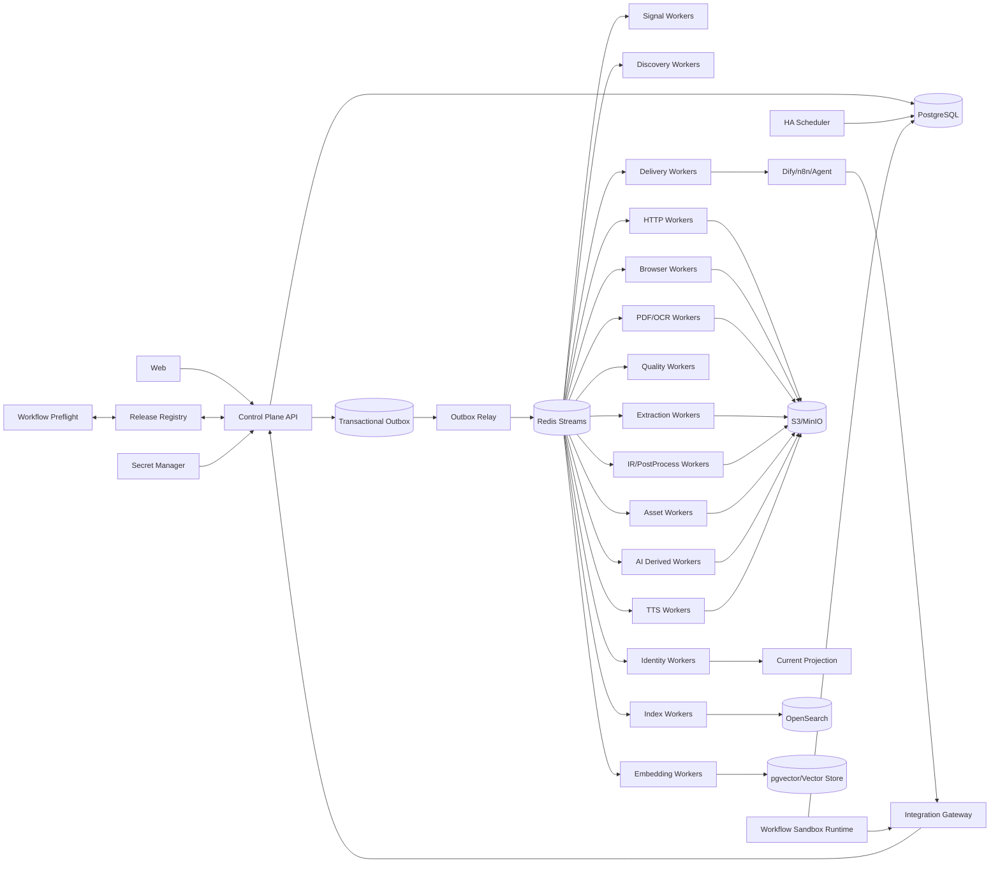

# 博客知识库技术方案

适用范围：从约 1000 个技术博客、工程博客、技术文档站、Newsletter、CMS 与公开文档站抓取尽可能完整的历史文章，清洗为稳定 Markdown 建设长期知识库；后续可持续增加网站，并支持全量回灌、增量同步、Web 管理、版本留存、离线重处理、全文/向量检索、质量审计、图片附件归档，以及 Dify/n8n/Agent/Newsletter/TTS 等下游工作流消费。整体按百万级文档、数百万到千万级 URL、站点高度异构和多年持续运行设计。

## 1. 建设目标

1. 支持站点根地址、单 URL、批量 URL、RSS/Atom/JSON Feed、Sitemap/Sitemap Index、OPML、CSV、JSON、Markdown/TXT 等来源导入。
2. 自动探测 Sitemap、Feed、公开 API、Archive、Category/Tag/Author、Docs Navigation、普通内链、`llms.txt`/`llms-full.txt` 和平台 API 等发现入口。
3. 支持 `FULL_BACKFILL`、`INCREMENTAL`、`RECONCILE`、`TARGETED_FETCH`、`PROBE`、`REPROCESS`、`ASSET_REPAIR`、`REINDEX`、`DERIVED_BUILD`、`DELIVERY_RETRY` 等运行类型。
4. 历史完整性由 Provider 级 Coverage Evidence 证明，不能以“队列空了”“达到 max_depth/max_pages/max_urls”代替完整性证明。
5. HTTP-first；只有动态渲染、正文缺失、挑战页、选择器失效或质量失败有证据时才升级 Browser/Crawl4AI/Playwright。
6. 支持站点能力学习，用真实运行的正文接受率、质量、延迟、成本和 blocker 优化抓取 route，但 Capability 不能替代 Coverage。
7. Source/Profile/Discovery/Fetch/Extractor/PostProcess/Quality/Asset/Chunker/Search/Reranker/Embedding/AI/TTS/Workflow/Delivery 全部采用不可变 Release。
8. 使用 Sitemap `lastmod`、Feed GUID/updated、API cursor、ETag、Last-Modified、body hash、Canonical IR hash、重叠窗口与周期 Reconcile 驱动增量同步。
9. 最终知识对象保存标题、作者、发布时间、更新时间、标签、canonical、正文块、代码块、表格、图片、附件、链接关系、Snapshot、字段 provenance 和完整 lineage。
10. 支持 durable frontier、断点续跑、幂等、lease、heartbeat、重试、限流、熔断、公平调度、backpressure 和 dead-letter。
11. 保存不可变网络 Snapshot、Rendered DOM、Extraction Candidate、Canonical IR、Markdown Projection 和质量结果；规则升级优先离线 replay。
12. 图片和附件进入独立 Asset Pipeline，支持安全校验、hash 去重、对象存储、独立重试和 Markdown URL 重写。
13. Web 管理端覆盖 Source Intake、Site Profile、Provider Coverage、Capability & Route、Run/Task、Targeted Fetch、Extraction Preview、Snapshot Replay、Version Diff、Quality/Drift、Assets、Search/RAG、AI Artifact、Workflow/Delivery、成本和审计。
14. Markdown、全文索引、Embedding、摘要、标签、Topic、FAQ、Digest、Newsletter、TTS 和报告均是 Accepted Document Version 的异步 Projection/Derived Artifact，失败不能阻塞 Source Sync。
15. append-only 历史真相层之上提供可重建 Current Projection。
16. Canonical IR hash 在 Chunk/Embedding/AI/TTS 等昂贵下游之前计算；正文未变化只写 Freshness Observation。
17. 技术博客检索同时支持自然语言、代码符号、配置项、错误码、版本号、命令、文件路径和字段过滤，不能只依赖向量搜索。
18. Change-Signal Plane 优先通过 Feed/Sitemap/API 元数据判断是否可能变化，再决定是否抓正文。
19. 外部工作流只消费 Accepted Version、Projection、Artifact 或提交异步 Job，不拥有抓取真相。
20. “日报/Newsletter”必须先冻结 Selection Manifest，再执行摘要/TTS，保证补跑和重放结果可解释。
21. Dify/n8n 的 Code/Plugin/Tool 节点视为独立的不可信执行边界，必须使用版本化沙箱策略、默认拒绝出网、最小权限 Secret、资源配额和节点级执行证据；抓取任意 URL 必须通过 Integration Gateway/`TARGETED_FETCH`。
22. Workflow DSL/Graph 发布前必须执行 Preflight：校验目标引擎兼容性、节点/变量引用、Code 节点依赖、模型/Tool/Plugin 可用性与版本、Endpoint/Secret 策略、输入输出 Contract、资源上限和禁止网络路径。

## 2. 非目标与边界

1. 不绕过登录、付费墙、验证码、WAF 或明确访问控制。
2. 不承诺未知站点仅靠自动探测达到 100% 历史完整；必须展示 coverage confidence、known gap 与 blocker。
3. 不用 LLM、Reranker、搜索排名或抓取成功率决定 FULL_BACKFILL 中合法历史文章是否应该存在。
4. Markdown 不是唯一真相；Canonical IR 是内部内容真相，Markdown 是确定性投影。
5. 不锁死单一爬虫库、浏览器库、向量库、搜索引擎、消息队列、工作流引擎或模型供应商。
6. AI、Embedding、Digest、Newsletter、TTS 等派生模块不能反向决定抓取主链路是否成功。
7. HTTP 200、Browser success、协程正常返回不等于业务内容成功。
8. 不把全局 reload/scroll/wait 脚本作为所有站点默认策略；浏览器动作必须进入 Site Profile Recipe。
9. 不把多个 Document Version 的全文拼成一个无结构大字符串作为默认 AI/TTS 输入。
10. 不允许 Dify/n8n/Agent 直接修改 Canonical IR、Document Identity、Coverage Evidence 或 Capability Projection。
11. 不在 Web/Dify 请求线程同步执行长期 Browser、LLM、OCR 或 TTS。
12. 不依赖写死 `127.0.0.1`、固定容器地址或未版本化第三方返回字段作为长期 Contract。
13. 不允许 Workflow Code/Plugin 节点拥有不受控的互联网/内网访问、数据库/对象存储真相层凭据或云 metadata 权限，也不允许它们绕过 Integration Gateway 直接访问源站。
14. 不发布存在缺失 import、未解析变量/节点引用、缺失模型/Tool/Plugin、硬编码 localhost/私网 Endpoint、无界输入输出或未绑定 Sandbox Policy 的 Workflow Release。

## 3. 核心原则

1. **PostgreSQL 是业务状态真相源；S3/MinIO 是不可变大对象真相源。**
2. Redis Streams 只做任务运输；决定性状态先写 PostgreSQL，再由 Transactional Outbox 投递。
3. Source Intake、Change Signal、Discovery、Admission、Route Decision、Fetch、Extraction、PostProcess、Quality、Identity、Publish、Asset、Search、AI、TTS、Delivery 分层。
4. Discovery 只产生 URL Candidate 与 Evidence；列表页、Feed 摘要和搜索结果不能直接成为最终正文。
5. URL Identity、Document Identity 与 Freshness 分离。
6. Discovery Fetch Route 与 Article Fetch Route 分离，能力统计按 operation type 单独维护。
7. HTTP、Browser、PDF/OCR、Platform API、Fast Path 通过 Adapter 隔离，第三方原始返回 shape 不泄漏到业务真相层。
8. 所有 Stage 使用固定 Typed Outcome Contract。
9. `document_version` append-only；Current/Markdown/Search/Embedding/AI/TTS/Delivery Projection 可重建。
10. `max_depth/max_pages/max_runtime/max_urls/top_k` 是预算，不是 Coverage Evidence。
11. 进程内 semaphore/`asyncio.gather` 只做 Worker 本地资源保护，不承担持久调度。
12. Config 使用不可变 Release；Secret 只保存 Secret Manager 引用。
13. 代码缩进、表格、列表层级、引用、公式和换行都是内容数据，不能在通用 cleaner 中被压平。
14. 多个 Extractor/Strategy 和 Link Discovery 优先消费同一 Snapshot；网络访问与内容解释解耦。
15. 外部消费者面对的是稳定的 Version/Artifact Ref，而不是 crawler 私有接口。
16. 日报、Digest、TTS 的“选了哪些文档”必须先成为不可变事实，再开始生成。
17. Workflow Runtime 是独立安全边界：编排逻辑可以调用受控能力，但不能因“工作流可写代码/装插件”而获得抓取平面或真相存储的直接权限。
18. Workflow 的可重放性不仅需要 DSL hash，还必须记录实际执行节点、Code hash、模型/Tool/Plugin Release、Sandbox Policy、输入输出 Artifact hash 与节点 Outcome。

## 4. 推荐技术栈

### 4.1 控制面

- Web：Next.js + TypeScript。
- API：FastAPI + Pydantic。
- PostgreSQL：Source、Profile、Provider、Run、Task、Document、Version、Coverage、Capability、RouteDecision、SelectionManifest、DerivedArtifact、WorkflowExecution、WorkflowNodeExecution、DeliveryJob、Audit。
- Redis Streams：任务运输和 Consumer Group。
- Transactional Outbox：保证数据库状态与消息投递一致。
- Redis/Valkey：robots、Capability Projection、短期 probe 和 UI 热数据缓存；不是唯一真相源。
- Secret Manager：Vault、云 Secret Manager 或 Kubernetes Secret 引用。
- Integration Gateway：面向 Dify/n8n/Agent/Webhook 提供稳定 Job/Artifact API。
- Workflow Preflight：DSL Parser/Linter + target-engine import test + dependency resolver。
- Workflow Sandbox：Kubernetes Job/隔离 Worker + seccomp/AppArmor/NetworkPolicy/egress proxy，默认拒绝网络与宿主资源。

### 4.2 数据面

- HTTP：`httpx.AsyncClient` 长生命周期连接池。
- HTML：selectolax/lxml/BeautifulSoup。
- 主体抽取：Trafilatura/Readability/Crawl4AI/CSS/XPath/JSON-LD/OpenGraph 组合 Adapter。
- Browser：Playwright/Crawl4AI Browser Runtime Pool。
- PDF：PyMuPDF/pypdf + OCR fallback。
- 对象存储：S3/MinIO。
- 全文检索：OpenSearch。
- 向量：pgvector 起步，规模扩大后可替换专用 Vector Store。
- AI/TTS：独立 Adapter + Worker Pool。
- 可观测：OpenTelemetry + Prometheus/Grafana + 日志聚合。

## 5. 总体架构



`WR -> PG` 仅写 Workflow Execution/Node Execution/Audit 等控制面事实，不授予 Canonical IR、Coverage、Document Version 等真相对象的任意修改权限；Artifact 读取通过受控 API 或短期对象引用完成。

### 5.1 Control Plane

只负责 Source、Provider、Profile、Release、Schedule、Run、Command、Selection Manifest、Derived Job、Workflow Execution、Delivery Job、RBAC、Audit、搜索和状态查询，不直接执行长期 I/O/GPU 任务。

### 5.2 Change-Signal / Discovery Plane

低成本轮询 Feed/Sitemap/API，维护 Provider checkpoint，生成 URL Candidate 与 Coverage Evidence；BFS、搜索和通用 crawl 只用于缺口诊断与补充发现。

### 5.3 Capability / Route Plane

把真实路由结果写成 append-only Capability Observation，再异步聚合 Route Capability Projection；执行前由版本化 Route Policy 生成可解释的 Route Decision。

### 5.4 Data Plane

HTTP、Browser、PDF/OCR、Extraction、PostProcess、Quality、Identity 通过持久 Task 串联。

### 5.5 Projection / Workflow Plane

Accepted Version 触发 Markdown、Search、Embedding 和 AI Artifact；定时 Digest 先冻结 Selection Manifest，再生成 Summary/Digest/TTS，最后由 Delivery Job 交付给外部消费者。Dify/n8n/内部 Workflow 只编排稳定 API/Artifact Ref；Code/Plugin 节点在 Sandbox Policy 下运行，不直接访问源站和真相存储。

## 6. Release Registry 与可重复运行

所有会改变结果的行为都必须版本化：

```text
site_profile_release
discovery_provider_release
fetch_engine_release
representation_provider_release
route_policy_release
extractor_release
postprocess_release
quality_policy_release
asset_policy_release
chunker_release
search_provider_release
reranker_release
embedding_release
ai_model_release
ai_recipe_release
tts_model_release
tts_recipe_release
selection_policy_release
workflow_recipe_release
workflow_sandbox_policy_release
workflow_adapter_release
delivery_recipe_release
destination_adapter_release
dataset_release
training_recipe_release
runtime_release
```

每个 Release 至少记录：release id/version、source commit、config hash、dependency lock hash、container image digest、SBOM、作者/时间、Contract/Golden/shadow test、predecessor/rollback target。

`runtime_release` 额外记录 Python/OS、Browser/Playwright/Crawl4AI 版本与浏览器 revision、parser/Trafilatura 版本、AI/TTS tokenizer/model hash、device/dtype/quantization、configured/actual context、generation config、外部 API 模型版本。

所有源码中的直接 import 必须作为直接依赖声明，禁止依赖“传递依赖碰巧存在”；CI 必须做 import/startup/contract test。

### 6.1 Workflow Recipe Release

Dify/n8n 的 DSL/Graph 本身也是业务行为，应独立版本化，并保存“源码 DSL”和“解析后依赖清单”两层事实：

```text
workflow_recipe_release
- id/version
- engine_type                 # DIFY/N8N/INTERNAL
- dsl_object_key
- dsl_hash
- graph_hash
- compatible_engine_version
- input_schema/output_schema
- referenced_recipe_release_ids
- plugin_tool_release_refs
- model_provider_release_refs
- resolved_node_manifest_hash
- code_node_hashes
- dependency_contract_hash
- sandbox_policy_release_id
- preflight_report_ref
- source_commit
- test_result_refs
- created_at
```

任何 Derived/Delivery Job 都要记录实际使用的 Workflow Recipe Release。仅保存 DSL 文件 hash 不足以重放，因为工作流实际行为还依赖 Code、模型、Tool、Plugin、Provider、Secret scope 和目标引擎版本。

### 6.2 Workflow DSL Preflight

Workflow Release 发布前执行静态 + 隔离运行预检：

1. 在目标 Dify/n8n/内部引擎版本中完成 parse/import/export round-trip；
2. 校验 graph edge、node id、variable selector、模板变量和 input/output schema 引用完整；
3. 对 Code 节点做语法、直接 import、启动与最小 contract test，缺失依赖或运行时名称直接阻断发布；
4. 检测硬编码 `localhost/127.0.0.1`、固定容器地址、私网/metadata 地址和未经批准的外部 URL；
5. 解析并固定 Model/Provider/Tool/Plugin 依赖，缺失、禁用或版本不兼容时失败；
6. 校验 Secret 声明及 scope，不允许隐式继承平台全局高权限 Secret；
7. 校验每个节点输入/输出字节、token、文件大小、音频时长和 execution deadline 上限；
8. 校验 Code/Plugin 节点 Sandbox Policy、egress allowlist、文件系统和 CPU/Memory/PID 配额；
9. 对关键 Workflow 在隔离环境跑 Golden Input，验证结构化输出、错误分类和节点 lineage；
10. 生成不可变 `preflight_report`，作为 Release 发布门禁和后续审计依据。

### 6.3 Workflow Execution 与节点证据

运行时不能只保存“Workflow 成功/失败”，需保存节点级证据：

```text
workflow_execution
- id
- workflow_recipe_release_id
- sandbox_policy_release_id
- trigger_type
- input_artifact_refs/input_hash
- status
- started_at/finished_at
- trace_id

workflow_node_execution
- workflow_execution_id
- node_id/node_type
- resolved_code_hash(optional)
- resolved_model_release_id(optional)
- resolved_plugin_tool_release_id(optional)
- input_artifact_refs/input_hash
- output_artifact_refs/output_hash
- secret_scope_ids
- network_policy_decision
- latency_ms/cost_units
- outcome/error_class
- trace_id
```

节点证据绝不保存 Secret 明文。大输入/大输出仅保存 Artifact Ref/hash 和必要摘要，防止审计表膨胀。

## 7. Source Registry 与 Site Profile

### 7.1 Source

```text
source
- id
- name
- root_url
- canonical_host
- source_type
- enabled
- sync_policy_id
- active_profile_release_id
- compliance_policy_id
- created_at/updated_at
```

### 7.2 Site Profile Release

至少包含：allowed/denied host/path、article URL pattern、Feed/Sitemap/API/Archive provider、canonical 规则、metadata selectors、include/remove selectors、Browser action recipe、content-type policy、asset policy、rate limit/politeness、Golden URL、fast-path policy、route hard constraints。

站点专用 CSS/XPath，如 `h1`、正文容器、日期 selector，必须放进 Profile/Extractor Release；脆弱的 `nth-child` 只能作为显式站点策略，并由 Snapshot Replay 验证。

Site Profile Studio 支持草稿、测试、shadow、发布和回滚。

## 8. Discovery 与历史完整性

### 8.1 Provider 优先级

默认按“权威性和可枚举性”优先：

1. 官方 API/Export；
2. Sitemap/Sitemap Index；
3. RSS/Atom/JSON Feed；
4. Archive/年月分页/Category/Tag/Author；
5. Docs Navigation/目录页；
6. DOM 内链/BFS；
7. 外部搜索 Gap Discovery。

### 8.2 Discovery Evidence

```text
discovery_evidence
- source_id
- provider_id/provider_release_id
- discovered_url
- discovered_at
- provider_cursor/provider_item_id
- lastmod/updated
- referrer_url
- depth
- evidence_snapshot_id
```

同一 URL 来自多个 Provider 时 Evidence 全保留；normalize 后只在任务层去重。

### 8.3 Coverage Evidence

每个 Provider 维护 enumeration boundary、oldest/newest observed time、pages/items enumerated、cursor exhausted、pagination continuity、expected/discovered count、known gaps、blocker、confidence。

`max_pages`、`max_depth`、当前页没有更多链接、前 N 条抓完都不能作为 coverage complete。

### 8.4 Reconcile

周期重新枚举高价值 Provider，将新 manifest 与历史 manifest 做集合差异，发现漏抓、删除、URL 迁移和旧文章更新。

## 9. Change-Signal 与增量同步

优先使用：Feed GUID/updated、Sitemap lastmod、API update cursor、ETag/Last-Modified、conditional GET、body hash、Canonical IR hash。

增量采用重叠窗口，抵抗乱序、迟到更新和时间戳不可靠。

```text
Provider signal unchanged
  -> 可跳过正文 fetch

changed/unknown
  -> conditional fetch

Network representation unchanged
  -> Freshness Observation

Canonical IR unchanged
  -> Freshness Observation，不建新 Version

Canonical IR changed
  -> 新 Version + 异步刷新 Projection
```

抓取器的 `bypass_cache` 只代表工具缓存行为，不是业务 freshness 判定。

## 10. URL Admission、安全与合规

### 10.1 URL Admission

- 只允许 `http/https`；
- 标准化 host/port/path；
- 拒绝 localhost、私网、link-local、multicast、reserved 和云 metadata；
- 限制 redirect 次数，每次 redirect 重新校验 URL/DNS；
- 限制 response bytes、Content-Type、解压膨胀比；
- connect/read/total deadline 分层。

### 10.2 Browser/Fetcher 网络隔离

Browser/Crawl4AI/Firecrawl 可能自行重新解析域名，因此应用层预解析不够。独立 Worker 必须通过 NetworkPolicy/egress proxy/防火墙默认拒绝内网与 metadata，并最小化 Secret 暴露。

### 10.3 robots 与访问边界

robots、站点条款和内部合规策略是独立 Gate；策略禁止记为 `BLOCKED_POLICY/BLOCKED_ROBOTS`，不能当普通网络失败。

### 10.4 所有 IPC 都有资源预算

Crawl4AI/SearXNG/Reranker/Embedding/LLM/TTS/Workflow/对象存储代理等内部调用同样需要 request/response 字节上限、connect/read/total deadline、取消传播和明确错误分类。

### 10.5 Workflow Code/Plugin Sandbox

Code、Plugin、第三方 Tool 是可执行扩展，不因为运行在 Dify/n8n 中就自动可信：

- 默认 `deny-all` egress；只允许 Integration Gateway、批准的模型/TTS Provider、必要的对象代理和明确 Destination；
- 任意源站 URL 必须提交 `TARGETED_FETCH`，禁止 Code 节点用 `requests/httpx/curl` 直接抓取；
- 禁止直连 PostgreSQL、Redis、S3/MinIO 管理端、Kubernetes API、宿主 Docker socket、云 metadata 和内部管理网段；
- Secret 使用节点/Workflow 最小权限 scope + 短期 token，不把平台级 Secret 注入所有节点；
- 只读 rootfs + 限额临时目录，限制 CPU、Memory、PID、文件数量、输出字节和执行时间；
- DNS 与 redirect 同样经过 egress policy，防止域名重绑定/跳转逃逸；
- Sandbox deny、网络访问目标、Secret scope、资源超限均写入节点级 Execution Evidence；
- 允许管理员做有期限 Override，但必须说明 reason、scope、TTL，并进入 Audit。

## 11. Capability Learning 与 Route Decision

### 11.1 Capability Observation

```text
site_capability_observation
- site_id
- path_scope
- operation_type        # DISCOVERY_FETCH/ARTICLE_FETCH/METADATA_PROBE/ASSET_FETCH
- route_id/release_id
- attempt_at
- transport_outcome
- content_outcome
- quality_score
- latency_ms/bytes/cost_units
- http_status
- blocker_type/error_class
- render_required
- snapshot_id/trace_id
```

Transport success 不代表 Content accepted。

### 11.2 Route Capability Projection

维护 sample_count、confidence、EWMA acceptance/quality、p50/p95 latency、cost、last success/failure、cooldown、next probe。PG 保存真相，Redis 只缓存。

### 11.3 约束

- 冷启动不过早永久禁用 route；
- 使用时间衰减和 exploration/canary；
- host/path/operation 分层；
- route 评分同时看 quality、latency、cost、failure risk；
- 任何学习型跳过都可解释、可过期、可人工覆盖。

### 11.4 Route 类型

```text
PLATFORM_API
FEED_FULL_CONTENT
LLMS_FULL_TEXT
HTTP_STRUCTURED
HTTP_STATIC
CRAWL4AI
PLAYWRIGHT_PROFILE
PDF_NATIVE
PDF_OCR
ARCHIVE_FETCH
```

执行顺序：Hard Gate → Fast Path → 通用 Route Candidate → Site Profile → Operator Override → Capability Projection → Ranking → 持久化 Route Decision → 执行 → Quality → 合法升级。

## 12. Durable Run/Task 与调度

### 12.1 Run

```text
run
- id
- source_id
- run_type
- status
- resolved_scope
- resolved_effective_config
- release_set
- started_at/finished_at
- counters_json
- deadline_at
```

### 12.2 Task

```text
task
- id/run_id
- stage
- subject_key
- status/attempt
- lease_owner/lease_until/heartbeat_at
- next_retry_at
- parent_task_id
- input_artifact_ref/output_artifact_ref
- route_decision_id
- error_class
```

Task 使用稳定幂等键、lease、heartbeat、分层 deadline 和 cancellation propagation。side effect 用事务/唯一键保证幂等。

全局、站点、host 三层 token bucket/并发上限，按 priority、next_due、backlog age、politeness 做公平调度。

Scheduler 只物化持久 Run/Task/Selection Manifest；不直接做网络、LLM 或 TTS。

## 13. Fetch Snapshot 与 Runtime Pool

### 13.1 Fetch Snapshot

```text
fetch_snapshot
- id
- request_url/final_url
- route_id/release_id
- requested_at/received_at
- status/response_headers/content_type
- body_object_key/body_hash
- rendered_dom_object_key
- screenshot_object_key(optional)
- resolved_ip_attestation(optional)
- runtime_attestation
```

### 13.2 Snapshot 共享

同一 Snapshot 可供 Link Discovery、JSON-LD/OpenGraph、Trafilatura、Readability、CSS/XPath、Crawl4AI Candidate 和 Quality 使用。禁止为找链接、比较 Extractor 或重投影 Markdown 再次访问源站。

### 13.3 Runtime Pool

HTTP Session、Browser Context、Model Runtime Handle 等都要有：`max_total/per-site hard cap`、idle timeout、周期 sweep、in-flight/busy pin、最大寿命/页面数/内存阈值、finally 释放和 pool 指标。

每篇文章创建一个全新 crawler 生命周期只适合 Demo，不适合作为规模化默认方案。

## 14. Extraction、Canonical IR 与质量

### 14.1 Candidate Competition

一个 Snapshot 可产生 Trafilatura、Readability、Crawl4AI、CSS/XPath、JSON-LD、平台 API 等多个 Candidate。每个 Candidate 保存 extractor release、输入 snapshot、字段 provenance 和结构统计。

### 14.2 Canonical IR

```text
DocumentIR
- title
- authors[]
- published_at/updated_at
- canonical_url
- tags[]
- language
- blocks[]

Block
- block_id
- type: heading|paragraph|list|code|table|quote|image|math|html
- level/language/attributes
- text/raw
- source_locator
```

### 14.3 正文清洗

DOM 级移除 nav/footer/sidebar/广告；禁止全局压空白破坏代码；有损规则产生 Evidence，并设置高删除率 Guardrail。

### 14.4 Quality Gate

至少检测 title、正文长度、结构、text-to-DOM、boilerplate、重复块、challenge/login 特征、metadata provenance、历史异常变化。

Outcome：

```text
ACCEPTED
REJECTED_EXPECTED
REJECTED_QUALITY
UNEXPECTED_EMPTY
BLOCKED_POLICY
BLOCKED_ROBOTS
NEEDS_BROWSER
NEEDS_PROFILE_REVIEW
```

`UNEXPECTED_EMPTY` 不能覆盖已有正常版本。

### 14.5 Drift

监控 selector miss、正文长度分位数、Browser 升级率、quality reject、metadata 缺失率和 Golden URL 特征漂移。异常达到阈值时生成 Drift Review。

## 15. Identity、版本与去重

URL normalize 只做安全确定性规则，并保留原始 URL/Evidence。

Document Identity 优先组合 canonical、平台稳定 ID、Feed GUID、结构化数据 ID、可信 mapping 和人工 merge。

`document_version` append-only，保存 document_id、accepted_at、canonical_ir object/hash、source_snapshot、extractor/postprocess/quality release、metadata provenance、predecessor_version_id。

Canonical IR hash 不变时只写 Freshness Observation。

SimHash/MinHash/embedding 相似只形成 Similarity Evidence/Duplicate Cluster，不自动删除不同来源文档。

## 16. Markdown Projection 与 Asset Pipeline

Markdown 是 Canonical IR 的确定性投影：front matter/正文规则版本化；代码 fence、列表、表格稳定；图片 URL 由 Asset Projection 重写；不把抓取时间戳写入正文。

推荐路径：

```text
markdown/{source_id}/{document_id}/{version_id}.md
```

图片/附件独立流程：URL Admission → 下载限制 → MIME sniff → hash → 安全策略 → 对象存储 → version-asset relation → Markdown rewrite。Asset 失败不阻塞原文 Version 接受，可 `ASSET_REPAIR`。

## 17. Search 与 RAG

建立 OpenSearch BM25/字段索引 + Embedding + metadata filter + 可选 reranker。

技术博客需要专门处理代码 token、错误码、版本号、命令、配置键和路径。

```text
query
-> lexical + vector recall
-> RRF/merge
-> metadata/security filter
-> rerank
-> context assembly
```

Chunk 按 IR block、heading boundary、代码块完整性切分，保存 `document_version_id + block range + chunker_release_id`。

## 18. AI Derived Artifact

AI 只消费 Accepted Version 的显式 Projection，任何摘要/标签/FAQ/报告都不写回 Canonical IR。

长文采用 block-aware Map/Reduce：

```text
Document Version
-> AI Input Projection
-> Chunk Plan
-> Map Artifact x N
-> Reduce Artifact
-> Final Derived Artifact
```

### 18.1 Derived Artifact

```text
derived_artifact
- id
- type                    # SUMMARY/DIGEST/FAQ/TTS/NEWSLETTER/REPORT
- input_version_ids
- input_version_set_hash
- input_projection_hash
- parent_artifact_ids
- recipe_release_id
- model_release_id
- workflow_recipe_release_id(optional)
- workflow_execution_id(optional)
- runtime_attestation_id
- object_key/content_hash
- status
- input_tokens/output_tokens
- cost_units/latency_ms
- created_at
```

幂等键包含 type、排序后的输入 Version、Recipe、Model、Runtime/Workflow Release。

### 18.2 摘要输出必须结构化

单篇 Summary/Digest Item 至少包含：

```text
- document_version_id
- title
- canonical_url
- published_at
- summary
- key_points[]
- source_block_refs[]
```

Prompt、temperature、语言、输出 JSON Schema、token budget 和截断策略都属于 AI Recipe Release。摘要类任务优先使用低随机度配置，保证 cache、diff 和重放稳定。

## 19. Selection Manifest：日报与 Newsletter 的可重放输入

不能用“当前搜索结果前 N 条”或 `limit=N` 作为日报事实。生成前必须冻结本次选择：

```text
selection_manifest
- id
- trigger_type              # SCHEDULED/EVENT/MANUAL/WEBHOOK
- timezone
- window_start/window_end
- as_of
- scope_json
- selection_policy_release_id
- ordered_document_version_ids
- ranking_evidence
- duplicate_suppression_evidence
- manifest_hash
- created_at
```

典型流程：

```text
Scheduler
-> 根据时区/时间窗创建 Selection Manifest
-> 单篇 Summary Artifact（可复用）
-> Digest Reduce
-> Digest Artifact
-> TTS(optional)
-> Delivery
```

失败重试必须复用同一 Manifest；需要重新选文时显式创建新的 Manifest，而不是静默重新查询。

## 20. Workflow / Dify / n8n Integration

外部工作流不采用：

```text
Dify 请求
-> 同步扫列表
-> 同步抓 N 篇
-> LLM
-> TTS
-> 返回
```

采用：

```text
长期 Source Sync
-> Accepted Version
-> Selection Manifest
-> Derived Job
-> Workflow Execution(optional)
-> Summary/Digest/TTS Artifact
-> Delivery Job
-> Dify/n8n/Agent/Webhook 消费
```

### 20.1 Integration API

```text
POST /v1/derived-jobs          -> 202 + job_id
POST /v1/selection-manifests   -> 202/201 + manifest_id
GET  /v1/jobs/{job_id}         -> status/progress/result_ref
GET  /v1/artifacts/{id}        -> metadata + access reference
POST /v1/search                -> stable document/version refs
POST /v1/targeted-fetch        -> 202 + run_id
```

Web/Dify 请求线程不得等待 Browser、LLM 或 TTS 全链路完成。

### 20.2 Dify/n8n Adapter 约束

- Endpoint 配置化，禁止写死 localhost；
- 使用 Service Discovery/API Gateway；
- Auth/mTLS/Token 由 Secret Manager 管理；
- request/response byte limit、deadline、retry budget 和 circuit breaker；
- 不把阻塞 `requests` 放在 async Web 主链路；
- 外部工作流传入 URL 必须走 `TARGETED_FETCH` Admission；
- Code/Plugin 节点不得自行请求源站、私网或真相存储，网络访问受 Sandbox Policy/egress allowlist 约束；
- 外部工作流只接收 stable Artifact/Version Ref；
- DSL/Graph 改动必须产生新的 Workflow Recipe Release；
- 发布前 Preflight 必须通过，硬编码本机 Endpoint、缺失 import、未解析变量/节点、缺失依赖或 Sandbox Policy 不合规均阻断 Release；
- 每次生产执行保存 Workflow Execution/Node Execution，确保实际 Code/Tool/Plugin/Model 与输入输出均可追溯。

### 20.3 Workflow 输入输出 Contract

Workflow 不直接在节点间无界复制多篇全文。跨边界优先传：

```text
DOCUMENT_VERSION_REF
MARKDOWN_PROJECTION_REF
AI_INPUT_PROJECTION_REF
SELECTION_MANIFEST_REF
DERIVED_ARTIFACT_REF
AUDIO_ARTIFACT_REF
DELIVERY_PAYLOAD_REF
```

只有小型结构化 metadata 才内联 JSON。任何供应商私有字段先由 Adapter 归一化，再进入 Workflow Contract。

## 21. TTS 与 Audio Artifact

TTS 是高成本长任务，默认消费 Summary/Digest，而不是多篇完整正文。

```text
Digest Artifact
-> TTS Recipe
-> TTS Worker
-> Audio Object
-> Audio Artifact
-> Delivery
```

必须限制最大输入字符/token、最大目标音频时长、单任务 deadline、模型/音色 Release、并发/GPU 配额、失败重试和成本预算。

### 21.1 Audio Artifact Contract

```text
audio_artifact
- id
- source_derived_artifact_id
- tts_model_release_id
- voice_release_id
- mime_type
- duration_ms
- bytes
- object_key
- content_hash
- runtime_attestation_id
- created_at
```

供应商返回的 `etag/url/text` 等私有字段必须由 Adapter 归一化；UI/Dify 不直接依赖第三方字段。访问链接按需生成短期 signed URL，由客户端根据 typed metadata 渲染播放器，不拼接不受控原始 HTML。

TTS 失败只影响 Audio Artifact/Delivery，不影响 Document Version、Markdown、Search 或 Embedding。

## 22. Delivery Job 与 Webhook 可靠性

```text
delivery_job
- id
- trigger_type
- selection_manifest_id(optional)
- input_artifact_id
- destination_adapter_release_id
- delivery_recipe_release_id
- idempotency_key
- status/attempt
- next_retry_at
- response_fingerprint
- error_class
- created_at/finished_at
```

支持 webhook、RSS/Feed、对象存储链接、邮件/Newsletter、Dify/n8n callback 等 Adapter。

Webhook 需要 HMAC 签名、timestamp + replay window、idempotency key、deadline、response byte limit、指数退避 + jitter、最大重试次数、dead-letter 和审计。

## 23. Web 管理端

### 23.1 Source Intake

单 URL、批量站点、OPML、CSV/JSON、粘贴文本导入；先进入 Intake/Probe，不直接写生产 Profile。

### 23.2 Site Profile Studio

编辑 URL/Provider/Selector/metadata/remove rule、HTTP/Browser route constraint、Golden URL；使用同一 Snapshot 多策略预览 Candidate/IR/Markdown；支持发布/回滚。

### 23.3 Provider Coverage

显示 Provider、枚举边界、oldest/newest、cursor、expected/discovered、known gap、blocker、confidence，并可触发 Reconcile。

### 23.4 Capability & Route

展示 transport/content success、acceptance/quality、p50/p95 latency、cost、Browser escalation、preferred route、cooldown/exploration、Route Decision 时间线和人工 Override TTL。

### 23.5 Run/Task

查看 stage backlog、lease、retry、dead-letter、resolved config、route decision、deadline、语义计数和 trace。

### 23.6 Extraction Preview / Replay

任意 Snapshot 不重新联网即可运行多个 Extractor/PostProcess/Quality Release，比较 Candidate/IR/Markdown。

### 23.7 Quality/Drift

按站点展示 unexpected empty、reject、selector miss、正文长度漂移、Browser 升级率和 Golden Regression。

### 23.8 Search/RAG/AI

检索调试、chunk、rerank trace、AI lineage、token/cost/truncation 查看，不允许直接修改 Canonical Document。

### 23.9 Recipe / Selection / Delivery Studio

支持：

- 配置 Summary/Digest/TTS/Newsletter Recipe；
- 配置时间窗、时区、source/tag/query 的 Selection Policy；
- 预览并冻结本次实际输入 Document Version；
- 查看 Selection Manifest hash；
- 查看 token、截断、成本和预计音频时长；
- 比较 AI/TTS/Workflow Recipe Release；
- 查看 Workflow Preflight Report、解析后的 Model/Tool/Plugin/Code 依赖、Sandbox Policy 与版本差异；
- 查看 Workflow Execution/Node Execution trace、节点输入输出 Artifact hash、网络策略判定和错误；
- 测试 Dify/n8n/Webhook Destination；
- 查看 Delivery retry/dead-letter；
- 手工触发，但只创建持久 Job。

## 24. Observability、Audit 与 Health

Trace：

```text
Run -> Task -> RouteDecision -> Fetch -> Snapshot -> Extraction
    -> Quality -> Identity -> Version -> Projection
    -> SelectionManifest -> DerivedJob
    -> WorkflowExecution -> WorkflowNodeExecution
    -> DerivedArtifact -> AudioArtifact -> DeliveryJob
```

### 24.1 Metrics

技术：queue lag、latency、timeout、retry、browser crash、DB/Redis/S3 error、response-too-large、cancellation、pool utilization/eviction/in-flight。

业务：discovered URL、admitted/rejected、new version/unchanged、unexpected empty、quality reject、coverage gap、sync lag、asset missing。

派生/交付：selection size、manifest reuse、derived latency、summary cache hit、token/truncation、TTS duration/latency/cost、delivery success/retry/dead-letter、webhook p95。

Workflow：preflight pass/fail、missing dependency、node latency/error、sandbox deny、egress deny、resource limit、secret scope deny、workflow execution replay success。

### 24.2 Audit

Profile/Release/Override/Manual Merge/Targeted Fetch/Replay/Quality override/Selection Build/Derived Build/Workflow Preflight/Sandbox Override/Delivery Retry 都记录 actor、before/after、reason、time。Workflow Node 的执行证据自动关联 trace，不把 Secret 明文写入 Audit。

### 24.3 Health

区分 liveness、readiness、dependency_degraded、critical_dependency_unavailable。缓存/搜索/AI/TTS/Destination/Workflow Runtime 故障可降级；PostgreSQL/S3 等任务所需真相源不可用时 fail-closed。

## 25. 缓存策略

可缓存 robots、Provider manifest、Capability Projection、短期 Fetch dedupe、Search result、Derived Artifact lookup。

缓存要求：严格 timeout、有限重试；错误退化到 PG/S3/实时执行；清缓存不影响可重建性；cache key 带必要 Release/Input Version/Manifest 维度。

Redis、搜索索引、向量库都不能成为不可变内容唯一真相源。

## 26. 失败分类与升级

```text
DNS_ERROR
CONNECT_TIMEOUT
READ_TIMEOUT
DEADLINE_EXCEEDED
RESPONSE_TOO_LARGE
HTTP_4XX
HTTP_5XX
RATE_LIMITED
ROBOTS_BLOCKED
POLICY_BLOCKED
SSRF_BLOCKED
WAF_CHALLENGE
JS_SHELL
EMPTY_CONTENT
SELECTOR_MISS
CONTENT_QUALITY_LOW
UNSUPPORTED_TYPE
BROWSER_CRASH
PARSER_ERROR
STORAGE_ERROR
MODEL_ERROR
MODEL_INPUT_TOO_LARGE
WORKFLOW_ERROR
WORKFLOW_CONTRACT_ERROR
WORKFLOW_PREFLIGHT_FAILED
WORKFLOW_DEPENDENCY_UNAVAILABLE
WORKFLOW_SANDBOX_VIOLATION
WORKFLOW_EGRESS_DENIED
WORKFLOW_NODE_TIMEOUT
TTS_ERROR
DELIVERY_TIMEOUT
DELIVERY_REJECTED
DESTINATION_RATE_LIMITED
CANCELLED
```

只有适合升级的错误才进入下一 route。`JS_SHELL` 可 HTTP → Browser；`ROBOTS_BLOCKED/POLICY_BLOCKED` 不升级；`RATE_LIMITED` 延迟重试；Workflow/AI/TTS/Delivery 错误不反向标记 Source Sync 失败。Sandbox/Egress violation 默认 fail-closed，不通过“换个节点再试”绕过安全策略。

## 27. 测试、Replay 与发布门禁

### 27.1 Contract Test

验证 Adapter 输入输出 schema、错误分类、timeout、取消传播、request/response 字节边界、provenance。

### 27.2 Golden Corpus

覆盖静态博客、JS SPA、WordPress、Ghost、Substack、Docs、代码重页面、表格、图片、PDF、挑战页、多语言和 selector drift。

### 27.3 Shadow Replay

新 Extractor/PostProcess/Quality/Route Policy 在历史 Snapshot/Observation 上离线运行，比较 accepted/rejected、Markdown hash、Browser 比例、latency/cost。

### 27.4 Derived/Workflow/Delivery Replay

新 AI/TTS/Workflow/Delivery Recipe 使用历史 Version/Selection Manifest/Artifact 重放，比较：结构化输出、token/truncation、摘要覆盖、source block refs、TTS 输入/音频时长、payload contract、retry/idempotency。

### 27.5 Supply Chain Gate

CI 校验直接依赖声明、lockfile、镜像 digest、SBOM、漏洞扫描、Browser revision、模型/tokenizer/plugin/DSL hash。未锁关键依赖不得成为生产 Release。

### 27.6 Resource Boundary Test

注入超大响应、慢响应、取消、连接悬挂、Browser/Session 泄漏、长任务跨 idle timeout 等故障，验证不会 OOM，deadline/cancellation 可释放连接和 lease，hard cap 生效。

### 27.7 Workflow Preflight / Sandbox Test

构造以下失败样例并要求发布门禁能稳定阻断：

- Code 节点缺失 import/直接依赖；
- graph/variable selector 引用不存在；
- Model/Tool/Plugin/Provider 缺失或版本不兼容；
- 硬编码 localhost、私网、metadata 或未批准外部 Endpoint；
- Code/Plugin 直接请求源站而未走 `TARGETED_FETCH`；
- 试图读取未授权 Secret、PG/S3/Redis/Kubernetes API；
- 网络重定向/DNS 重绑定绕过 egress；
- 超 CPU/Memory/PID/临时盘/输出字节/deadline；
- Workflow Engine 升级后 DSL import/export 或节点 Contract 变化。

生产前还需使用 Golden Input 验证 Workflow Node Execution lineage 可完整重放。

## 28. 部署与横向扩展

起步部署：API ×2、Integration Gateway ×2、Scheduler/Outbox Relay ×2（leader/lease）、Signal/Discovery Worker、HTTP Worker 多实例、Browser Worker 独立节点、Extraction/Quality Worker、Asset Worker、Search/Embedding Worker、AI Worker、TTS Worker、Delivery Worker、Workflow Preflight/隔离 Sandbox Worker、Capability Projector、PostgreSQL、Redis、MinIO/S3、OpenSearch。

按队列 backlog 与资源类型独立扩容。Browser/GPU/TTS/Workflow Sandbox 不与普通 HTTP Worker 混部。1000 站点的瓶颈通常来自礼貌限速、Provider 枚举和页面复杂度，而不是单机协程数量。

## 29. 容量与成本控制

容量规划至少观察 URL frontier、Snapshot bytes、Accepted Version、Browser/GPU/TTS 工时、Search/Embedding index、Derived Artifact、Workflow Node 执行量和音频对象存储。

关键降本手段：

1. Change-Signal 先行；
2. HTTP-first；
3. 平台 API/Feed/llms-full 等 Fast Path；
4. Capability-based route ranking；
5. Canonical IR hash 早去重；
6. Snapshot replay 避免重抓；
7. unchanged 不重复 Embedding/AI；
8. 单篇 Summary Artifact 复用于多个 Digest；
9. Selection Manifest + input version set hash 保证重跑不重算；
10. TTS 默认仅对 Digest；
11. Browser/GPU/TTS/Workflow Sandbox 独立预算；
12. Workflow 节点优先传 Artifact Ref 而不是复制全文；
13. S3 lifecycle 热/冷分层但不破坏审计。

## 30. 分阶段实施

### Phase 1：可用主链路

Source Registry、Sitemap/Feed/Archive Discovery、durable Run/Task、HTTP-first、Snapshot、Trafilatura/CSS Extractor、Canonical IR、Markdown、PostgreSQL + MinIO、基础 Web、统一 deadline/响应边界。

### Phase 2：规模化与增量

Provider Coverage、conditional fetch、Reconcile、Browser Runtime Pool、fairness/backpressure、Quality/Drift、Asset Pipeline、OpenSearch。

### Phase 3：Capability 与自适应路由

Capability Observation、Route Projection、Route Decision、Fast Path、exploration/cooldown/probe、Capability Web 页面、Route Policy shadow replay。

### Phase 4：知识库与 AI

Chunk/Embedding、Hybrid Search/Reranker、AI Input Projection、Map/Reduce、AI Recipe/Model/Runtime Registry、Targeted Fetch、Replay/Diff、成本面板。

### Phase 5：Workflow / Digest / Delivery

Selection Policy/Manifest、Workflow Recipe Release、Workflow DSL Preflight、Workflow Sandbox Policy/Node Execution Evidence、Integration Gateway、Derived Artifact、结构化 Digest、Dify/n8n Adapter、Delivery Job、Webhook 签名/重试/dead-letter。

### Phase 6：TTS 与高级治理

TTS Worker、Typed Audio Artifact、Recipe/Selection/Delivery Studio、Dataset/Training Release、自托管模型评估、多租户/RBAC 强化和自动 Drift 修复建议。

## 31. 验收标准

1. 新增普通技术博客不改核心代码，仅新增配置/Adapter 即可接入。
2. 1000 站点可独立限流、暂停、重跑和查看 Coverage。
3. Worker 重启后任务继续，不因进程内状态丢失。
4. 同一 Snapshot 可离线重跑新 Extractor/IR/Markdown，不重新访问源站。
5. Link Discovery 与多个 Extractor 共享 Snapshot/DOM。
6. 未变化正文不会重复创建 Version、Embedding、摘要或 TTS。
7. Markdown 保留代码缩进、列表、表格和段落结构。
8. Selector 漂移和异常空正文能明确识别，不会静默成功。
9. Targeted Fetch 与批量同步共享 Admission/Snapshot/Quality/Identity 主链路。
10. 每次抓取可回答 route 选择依据、Profile、Capability Projection 和 Override。
11. Capability Observation 可离线重建 Projection；Redis 清空不丢运行事实。
12. Coverage 与 Capability 语义分离，route 成功率不能显示成历史完整率。
13. SSRF 同时有 URL/DNS 校验和 Browser/Fetcher 网络层 egress 隔离。
14. AI 失败不影响原文入库，Map/Reduce lineage 可回溯原文 block。
15. 任意 AI Artifact 可回答使用的 Version、Recipe、Model、Runtime、token/truncation。
16. 任意日报/Newsletter 可回答 timezone、时间窗、Selection Policy、ordered Version 集合和 manifest hash。
17. 同一 Selection Manifest 重试不会因查询结果变化而改变输入集合。
18. 外部工作流创建长任务时 API 立即返回 job/run id，不同步等待 Browser/LLM/TTS。
19. Dify/n8n DSL/Graph 变化能追溯到 Workflow Recipe Release。
20. 外部工作流不能通过自定义 URL 绕过 SSRF/robots/Quality/Identity/Audit。
21. 相同输入 Version 集合 + 相同 Recipe/Model/Runtime 可复用 Summary/Digest/TTS Artifact。
22. 多文档 Digest 不依赖把完整原文一次性塞入 LLM。
23. Digest Item 带稳定 `document_version_id` 和 source block refs。
24. TTS 失败只影响 Audio Artifact/Delivery，不影响 Document Version、Markdown、Search、Embedding。
25. Audio Artifact 使用标准 typed metadata/object key，UI 不依赖供应商私有 `etag/url` 字段，也不直接拼接不受控 HTML。
26. Delivery webhook 支持签名、幂等、deadline、有限重试和 dead-letter。
27. 所有源码直接 import 都有显式依赖；Browser revision、模型、Plugin、DSL 和镜像均可追溯。
28. Web Recipe/Selection Studio 可预览实际输入版本、token/截断、成本和音频预算。
29. Workflow Preflight 能在发布前阻断硬编码 localhost/私网、缺失 import、未解析节点/变量、不可用或不兼容 Model/Tool/Plugin。
30. Workflow Code/Plugin 节点默认无法直连源站、PG/S3/Redis、metadata；抓取 URL 必须通过 Integration Gateway/`TARGETED_FETCH`。
31. 任意 Workflow 生成的 Artifact 可追溯到 Workflow Release、Sandbox Policy、节点 ID、Code hash、Model/Tool/Plugin Release、输入输出 Artifact hash 和节点 Outcome。
32. Sandbox/Egress/Workflow 节点失败只影响对应 Workflow/Derived/Delivery Job，不污染 Source Sync 或已有 Accepted Version。
33. Web Recipe Studio 可查看 Preflight Report、resolved dependency manifest、Sandbox Policy 和 Node Execution trace。
34. `博客知识库技术方案.md` 只维护当前最终方案，不记录调研过程。

## 32. 推荐最终形态

最终系统不是“一台 Crawl4AI 把 1000 个站点爬下来”，也不是“Dify 每次需要内容时临时抓网页”，而是长期运行的数据同步与派生平台：

```text
Source Registry
  -> Coverage Providers
  -> Durable URL Frontier
  -> Change Signal
  -> Admission & Security
  -> Route Decision
  -> Fetch / Browser / Fast Path
  -> Immutable Snapshot
  -> Multi Extractor Candidates
  -> Canonical IR + Quality
  -> Identity + Append-only Version
  -> Markdown / Assets / Search / Embedding
  -> Selection Manifest
  -> Summary / Digest / TTS Derived Artifacts
  -> Workflow Preflight + Sandboxed Execution
  -> Delivery Jobs
  -> Dify / n8n / Agent / Newsletter / Webhook

                     ^
                     |
           Capability Observation
                     |
           Route Capability Projection
```

Coverage 回答“应该有哪些文章”，Capability 回答“怎样抓更可靠、更便宜”，Snapshot/IR/Version 回答“当时抓到了什么、如何解释”，Selection Manifest 回答“本次日报到底选了哪些不可变版本”，Derived Artifact 回答“如何生成摘要/语音”，Workflow Recipe/Preflight/Sandbox/Node Execution 回答“编排逻辑是什么、依赖什么、实际运行了什么且是否越权”，Delivery 回答“如何可靠地交给外部系统”。

对 1000 站点长期知识库，核心边界始终保持：**源站抓取是持久同步任务，Accepted Document Version 是事实输入，Markdown/搜索/AI/TTS 是可重建派生结果，Selection Manifest 固化每次批量消费输入，Dify/n8n/Agent 是受控消费者与编排器而不是抓取真相源；任何可执行 Workflow 扩展都必须在可预检、可沙箱、可审计、可重放的边界内运行。**