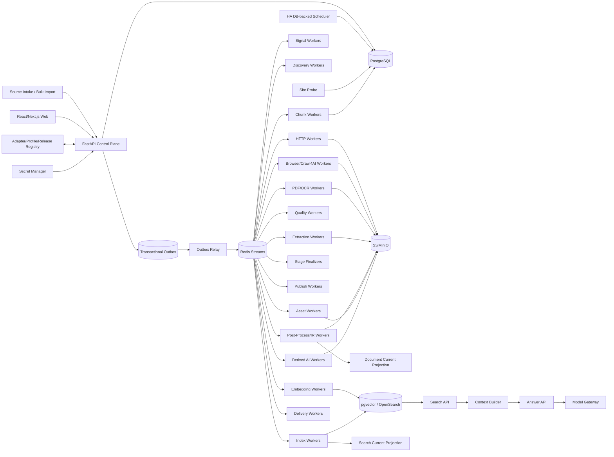

# 博客知识库技术方案

适用范围：从约 1000 个技术博客、工程博客、技术文档站、Newsletter、CMS 和公开文档站抓取尽可能完整的历史文章，清洗为稳定 Markdown 建设长期知识库；后续可持续增加网站，支持全量回灌、增量同步、Web 管理、版本留存、离线重处理、全文/向量检索、质量审计、图片附件归档和 AI 派生能力。整体按百万级文档、数百万到千万级 URL、站点高度异构和多年持续运行设计。

## 1. 建设目标

1. 支持单个 URL、批量 URL、Feed URL、OPML、Markdown/TXT、CSV、JSON 导入来源，自动规范化、去重、Probe、预览和审核后进入正式 Source Registry。
2. 输入站点根地址、博客入口、文档入口或 Feed 后，自动探测 Sitemap、Sitemap Index、RSS/Atom/JSON Feed、公开 API、归档页、分类/标签/作者页、文档导航树、普通内链、`llms.txt`/文本 URL 列表和动态列表。
3. 支持 `FULL_BACKFILL`、`INCREMENTAL`、`RECONCILE`、`TARGETED_FETCH`、`REPROCESS`、`ASSET_REPAIR`、`REINDEX` 等运行模式。
4. 历史完整性必须有 Provider 级 Coverage Evidence，不能把“队列空了”“达到 max_depth/max_pages/max_urls”当作完整性证明。
5. 默认 HTTP-first；只有存在动态渲染、正文缺失或抽取失败证据时才升级 Crawl4AI/Playwright Browser。
6. Discovery Rule、Fetch Route、Extraction Profile、Post-Processor、Quality Policy、Asset Policy、Chunker、Embedding、Search Index、AI Prompt/Model 等全部独立版本化。
7. 支持 Sitemap `lastmod`、Feed GUID/updated、API cursor、ETag、Last-Modified、body hash、Canonical IR hash、重叠时间窗和周期 Reconcile 驱动增量。
8. 最终知识对象保存标题、作者、发布时间、更新时间、标签、canonical、正文块、代码块、表格、图片、附件、链接关系、Snapshot、字段 provenance 和完整 lineage。
9. 支持 durable frontier、断点续跑、幂等、lease、heartbeat、重试、限流、熔断、公平调度、backpressure 和 dead-letter。
10. 保存不可变网络 Snapshot、渲染 DOM、清洗 HTML、Extraction Candidate、字段转换轨迹、Canonical Document IR、Markdown Projection、规则版本和质量结果；规则升级优先离线 replay。
11. 图片和附件走独立 Asset Pipeline，支持安全校验、hash 去重、对象存储、引用关系、独立重试和 Markdown URL 重写。
12. Web 管理端覆盖批量来源导入、站点接入、Provider 覆盖、任务控制、发现证据、当前文章、历史版本、版本 diff、抽取转换链、质量审核、漂移告警、资产、搜索/RAG、成本、Schedule、AI Workflow 和审计。
13. Markdown、全文索引、Embedding、摘要、聚类、Digest、Newsletter、报告和通知都属于 Accepted Document Version 的异步下游，失败不能阻塞源站同步。
14. 在 append-only 历史真相层之上提供可重建 Current Projection，让 Web 和运营查询当前状态高效，同时保留历史、审计和回滚能力。
15. Canonical IR hash 在摘要、Chunk、Embedding 等昂贵下游之前计算；内容未变化时只记录 freshness observation，避免重复 AI/Search 成本。
16. 技术博客检索必须同时照顾自然语言、代码符号、配置项、错误码、版本号和文件路径，不能只做纯向量搜索。
17. 对 1000 站频繁同步设置独立 Change-Signal Plane；先用 Feed/Sitemap/API 元数据判断是否可能新增/更新，再决定是否进入正文 Fetch。
18. 近似重复只形成 Similarity Evidence / Duplicate Cluster，不自动删除来源文档；转载、镜像、翻译和系列文章保留独立来源与历史。
19. 所有 Stage 输入输出具有显式 Artifact Representation Contract，禁止依赖变量名或文件扩展名推断“这是 HTML/Markdown/JSON/PDF”。
20. 所有 Platform Adapter / Site Profile 必须通过 Contract Test 与 Golden Corpus 后才能发布，降低大规模静默抓空、抓错和 selector 漂移风险。

## 2. 非目标与边界

1. 不以绕过登录、付费墙、验证码、WAF 或访问控制为目标。
2. 不把搜索引擎结果页当作历史完整性真相源；搜索只能用于辅助发现。
3. 不保证任何未知站点仅靠自动探测就达到 100% 历史完整；必须显式输出覆盖置信度、已知缺口和阻断原因。
4. 不使用 LLM 评分决定 FULL_BACKFILL 中哪些合法文章可以进入知识库。
5. 不把 Markdown 作为唯一真相；Markdown 是 Canonical IR 的稳定投影。
6. 不把单个爬虫库、浏览器库、向量库或消息队列锁死为不可替换核心。
7. Source Intake 的文件、粘贴文本或 OPML 只是输入证据，不直接成为生产 Source 配置真相源。
8. 不允许 AI、Embedding、Newsletter 等派生模块反向决定抓取主链路是否成功。

## 3. 核心原则

1. **PostgreSQL 是业务状态真相源；S3/MinIO 是不可变大对象真相源。**
2. Redis Streams 只承担任务运输；决定性状态先写 PostgreSQL，再由 Transactional Outbox 投递。
3. Source Intake、Source Adapter、Change Signal、Discovery、Admission、Fetch、Extraction、Post-Process、Quality、Asset、Publish、Search、AI、Delivery 分层。
4. Discovery 只产生 URL Candidate 和 Evidence；列表页、搜索页、Feed 摘要不能直接成为最终正文。
5. URL Identity 与 Document Identity 分离；redirect、canonical、slug rename、镜像、站点迁移只是 identity evidence。
6. Identity 与 Freshness 分离；“URL 已知”不代表“内容仍新鲜”。
7. 发布时间、更新时间、发现时间、抓取时间、源站 freshness observation 分离；未知发布时间保持 NULL，绝不拿抓取时间伪装发布时间。
8. Discovery Rule 与 Extraction Profile 分离；URL path pattern 可帮助分类，但不能直接证明页面是合法文章。
9. Discovery Fetch Route 与 Article Fetch Route 分离；动态列表需要 Browser，不代表文章详情页也必须 Browser。
10. HTTP、Browser、PDF/OCR 分层路由；Browser 是昂贵升级路径，生产中复用长期 Browser Runtime/Context Pool，禁止按 URL 创建完整 Browser Runtime。
11. Crawl4AI 的 link discovery、Markdown、cleaned HTML、CSS/JSON Schema 是 Worker 内执行能力，不承担历史完整性、持久调度和业务最终状态。
12. HTTP 200、Browser success、Extractor 无异常都不是业务成功证据。
13. 所有阶段使用结构化 Outcome Contract；`EMPTY/INVALID/AMBIGUOUS/RETRYABLE_ERROR/PERMANENT_ERROR/BLOCKED` 不能被空字符串、空数组或宽泛异常吞掉。
14. Stage 完成由 Finalizer 对任务、Artifact、质量结果、Manifest 和 Provider ACK 对账，不由协程或 BackgroundTasks 结束决定。
15. `document_version` append-only，不原地覆盖历史版本。
16. Current Projection、Markdown、搜索索引、Chunk、Embedding、摘要、报告和外部知识库都是 Projection，可删除后重建。
17. `max_depth/max_pages/max_runtime/max_urls` 只是预算，不是历史完整性证明。
18. Scheduler、FastAPI BackgroundTasks、`asyncio.create_task()`、进程内队列/集合/全局变量不能承担业务真相。
19. Config 使用不可变 Release；Secret 使用 Vault/云 Secret Manager，仅保存引用。
20. 人工纠错通过 Override/Evidence 追加，不能抹掉机器历史。
21. 遵守 robots、版权、访问控制、站点政策和合理速率；挑战页进入显式策略流程，不自动绕过。
22. Embedding 失败保持显式状态和 NULL 向量，不用全 0 向量伪装成功。
23. 近似相似度只作为证据和聚类，不直接承担 Document Identity 或删除决策。
24. **Artifact 表示类型必须显式验证。** Markdown 不能传给 CSS DOM Extractor，Feed XML 不能假装正文 HTML，OCR 文本不能假装 PDF 原文。

## 4. 总体架构



### 4.1 Control Plane

负责 Source Import、站点、Provider、Profile、Release、Schedule、Run、Command、权限和审计，不直接执行长期抓取。

### 4.2 Change-Signal / Discovery Plane

负责低成本轮询 Feed/Sitemap/API、Provider checkpoint、URL Candidate、Coverage Evidence 和新增/更新信号。

### 4.3 Data Plane

HTTP、Browser、PDF/OCR、Extraction、Post-Process、Quality、Asset 等独立 Worker Pool，根据资源成本和失败域拆开扩缩容。

### 4.4 Projection Plane

从 Accepted Document Version 构建 Markdown、Current Projection、Chunk、Embedding、Search Index、摘要、报告和 Delivery。

## 5. Crawl Mode 与 Run 语义

```text
FULL_BACKFILL   首次历史全量回灌
INCREMENTAL     持续同步新增和更新
RECONCILE       周期重新枚举，修复断档
TARGETED_FETCH  精确 URL 抓取、调试或补抓
REPROCESS       不访问源站，基于已有 Snapshot/Candidate 重抽取和重清洗
ASSET_REPAIR    仅补齐失败或缺失图片/附件
REINDEX         不访问源站，重新切块、Embedding、全文/向量索引
```

规则：

- 同站点默认只允许一个 active FULL_BACKFILL；
- INCREMENTAL 与 Search/AI/Publish/Asset 可并行，但同一 URL 网络请求和版本写入通过幂等键去重；
- TARGETED_FETCH 必须逐项返回真实结果，不能只返回“任务已启动”；
- REPROCESS 固定 `source_snapshot_id + extraction_profile_release + post_processor_release_chain`；
- REINDEX 固定 `document_version_id + chunker_release + embedding_release + search_index_release`；
- Run 完成由 Stage Finalizer 判断，不由 Worker 函数结束判断；
- Run 统计来自本次 Run Manifest，不允许从站点累计库存反推。

建议 Run 状态：

```text
PENDING -> RUNNING -> COMPLETED
                   -> COMPLETED_WITH_WARNINGS
                   -> FAILED
                   -> CANCELLED
```

每个 Stage 独立状态；Run completed 不代表所有异步 Projection 都完成。UI 分开显示 Source Sync、Markdown、Search、AI、Delivery readiness。

## 6. Source Intake、Probe 与 Source Registry

### 6.1 批量来源输入

支持：

```text
单个 root URL
批量 root URL
Feed URL
OPML
Markdown / TXT
CSV
JSON
Web 表格粘贴
```

Intake 流程：

```text
Parse
 -> Normalize URL
 -> Dedupe
 -> Domain/Site grouping
 -> Probe
 -> Candidate Platform Detection
 -> Dry-run Discovery
 -> Preview
 -> Human/Policy Review
 -> Apply
```

重复导入必须幂等，Intake Row 保存原始输入、规范化值、Probe 结果和 Apply 目标。

### 6.2 Probe

Probe 只做低成本能力识别：

- robots；
- root/入口响应；
- Sitemap / Feed link；
- CMS/平台特征；
- JSON-LD/OpenGraph；
- 是否明显需要 JS；
- canonical host；
- TLS/redirect；
- 内容语言；
- 速率与访问限制信号。

Probe 不等于正式回灌，也不写入最终 Document。

### 6.3 Source Registry

至少包含：

```text
site
source
provider
discovery_profile
fetch_profile
extraction_profile
quality_policy
asset_policy
schedule
credential_ref
active_release_set
```

站点是逻辑归属，Source 是一个可抓取入口，Provider 是一种发现方式。一个站点可同时有 Sitemap、Feed、Archive、API 等多个 Provider。

## 7. Platform Adapter 与 Site Profile

不建议 1000 个站点对应 1000 个 Python 类。采用两级模型：

### 7.1 Platform Adapter / Source Family

可复用平台逻辑：

- WordPress；
- Ghost；
- Substack；
- Medium 类平台；
- Docusaurus/MkDocs/Docsify 等文档站；
- 通用 Sitemap + HTML；
- 通用 Feed + Detail；
- 自定义 JSON API。

接口概念：

```python
probe()
discover()
fetch_detail()
extract()
checkpoint()
coverage_evidence()
```

### 7.2 Site Profile

主要保存配置：

- root / canonical domain；
- Provider 优先级；
- include/exclude URL pattern；
- selector / JSON path；
- time zone / locale；
- rate limit；
- HTTP/Browser route；
- cookie/secret reference；
- asset policy；
- quality threshold。

只有确实不能配置化表达的特殊站点才编写 Custom Adapter。

### 7.3 Immutable Release

Adapter、Discovery Profile、Extraction Profile、Quality Policy 等都发布为 immutable release：

```text
release_id
component_type
version
config_json/code_digest
created_at
created_by
golden_test_result
status=draft|active|retired
```

每个 Artifact 和 Document Version 都记录消费过的 release_id，保证可追溯和可 replay。

## 8. Artifact Representation Contract

这是生产方案的硬约束，用于避免“Markdown 被当成 HTML”“Feed summary 被当成全文”等静默错误。

### 8.1 Representation Type

建议枚举：

```text
HTTP_BYTES
HTML_SOURCE
HTML_RENDERED
DOM_SERIALIZED
CLEANED_HTML
MARKDOWN_CANDIDATE
JSON_API
FEED_XML
TEXT_PLAIN
PDF_BYTES
OCR_TEXT
CANONICAL_IR
MARKDOWN_PROJECTION
ASSET_BYTES
```

每个 Artifact 保存：

```text
artifact_id
representation_type
media_type
charset
schema_version
producer_stage
producer_release_id
source_snapshot_id
content_hash
object_key
byte_size
created_at
```

### 8.2 Stage 声明 accepts / produces

例如：

```text
CssDomExtractor:
  accepts = HTML_SOURCE | HTML_RENDERED | CLEANED_HTML
  produces = EXTRACTION_CANDIDATE

MarkdownNormalizer:
  accepts = MARKDOWN_CANDIDATE | CANONICAL_IR
  produces = MARKDOWN_PROJECTION
```

调度器和 Worker 双重校验。表示不匹配直接返回：

```text
INVALID_REPRESENTATION
UNSUPPORTED_MEDIA_TYPE
SCHEMA_MISMATCH
ENCODING_ERROR
```

禁止用空结果掩盖错误。

## 9. Discovery：历史 URL 发现体系

### 9.1 Provider 优先级

典型优先级：

1. 官方 API；
2. Sitemap Index / Sitemap；
3. RSS/Atom/JSON Feed；
4. Archive/分页列表；
5. 分类/标签/作者页；
6. 文档导航树；
7. 普通站内链接；
8. 外部搜索只作补充证据。

Provider 不互斥，多源交叉可发现缺口。

### 9.2 Discovery 只产 URL Candidate

Candidate 保存：

```text
raw_url
normalized_url
provider_id
listing_snapshot_id
discovered_title
discovered_summary
discovered_published_at
discovery_evidence
first_seen_at
last_seen_at
```

列表卡片文本不能直接进入最终正文。

### 9.3 Sitemap

支持：

- sitemap index 递归；
- gzip；
- `lastmod`；
- 分片；
- URL 数量/日期范围统计；
- provider checkpoint；
- 与已知 URL 集合差异比较。

### 9.4 Feed

Feed 主要承担增量信号，不默认承担历史完整性，因为很多 Feed 只保留最近 N 篇。保存 GUID、link、published、updated、etag/last-modified、原始 entry metadata。

### 9.5 Archive / 分类分页

必须识别：

- page number；
- cursor；
- next link；
- 日期归档；
- 无限滚动；
- 动态 API。

分页终止条件必须形成 Evidence，例如“next 不存在 + 连续页无新 URL + 页号边界确认”，不能只因为达到预算而宣称完成。

## 10. 历史完整性与 Coverage Evidence

每个 Provider 维护 Coverage：

```text
provider_id
run_id
enumerated_items
unique_candidates
min_observed_date
max_observed_date
page_or_cursor_range
termination_reason
budget_hit
errors
coverage_confidence
known_gap
```

FULL_BACKFILL 完成需要满足：

- 至少一个主 Provider 有可信 termination evidence；
- 关键 Provider 已对账；
- 预算未误当成终止；
- blocker/known gap 已显式记录；
- Finalizer 对 Candidate、Fetch、Quality Manifest 完成对账。

站点最终展示：

```text
coverage = complete | likely_complete | partial | blocked | unknown
```

并显示原因。

## 11. Admission 与 URL Canonicalization

Discovery Candidate 进入正文 Fetch 前经过 Admission：

- scheme/host 校验；
- robots/policy；
- include/exclude；
- URL normalization；
- tracking 参数清理；
- MIME/扩展名预判；
- duplicate candidate；
- 非文章页面初筛；
- SSRF/Egress 防护。

URL normalized key 建议包括：

```text
normalized_scheme
normalized_host
normalized_path
normalized_query
```

但不能仅凭 normalized URL 决定 Document Identity。

## 12. Change-Signal Plane 与增量同步

1000 站如果每次都抓全文，成本会快速膨胀。增量分两层。

### 12.1 低成本信号层

轮询：

- Feed GUID/updated；
- Sitemap `lastmod` / URL set；
- API cursor/version；
- 首页/archive lightweight fingerprint；
- ETag/Last-Modified。

只要无变化，可直接记录 freshness observation，不进入正文 Fetch。

### 12.2 正文确认层

可能变化时再 Fetch：

1. 条件请求；
2. HTTP body hash；
3. Extraction Candidate；
4. Canonical IR hash；
5. hash 未变：只写 observation；
6. hash 变化：新增 document_version；
7. 触发 Markdown/Search/Embedding/AI 下游。

### 12.3 重叠时间窗

对不可靠 Feed/API，增量游标必须留重叠窗口：

```text
next_from = previous_checkpoint - overlap_window
```

通过幂等去重避免重复写入，以此抵抗延迟发布、源站改时间和短暂漏项。

### 12.4 周期 Reconcile

例如：

- Feed：5~30 分钟；
- Sitemap：数小时~每日；
- 站点 Reconcile：每周；
- 深度 Coverage Reconcile：每月或按风险分级。

具体频率由站点变化率、成本和重要度动态调整。

## 13. Fetch Route：HTTP-first、证据驱动升级

### 13.1 HTTP Worker

使用长生命周期 async client pool，配置：

- per-host connection limit；
- keep-alive；
- DNS cache；
- connect/read/write/total timeout；
- response bytes 上限；
- redirect 上限；
- compression；
- conditional request；
- Retry-After；
- circuit breaker。

### 13.2 Browser Worker

仅在以下证据存在时升级：

```text
js_required
empty_http_body
selector_miss_http
content_too_short
rendered_only_metadata
client_side_navigation
```

记录 `route_upgrade_reason`，统计每个平台 Browser 升级率，持续将可降级站点迁回 HTTP。

### 13.3 Browser Runtime Pool

```text
Worker Process
 -> Browser Runtime
    -> Context Pool
       -> Page/Tab
```

控制：

- max pages/contexts；
- max requests / generation；
- RSS/heap watermark；
- page deadline；
- crash recovery；
- graceful recycle；
- tenant/cookie 隔离。

### 13.4 PDF/OCR

PDF 单独路由：

- MIME 检测；
- 原始 bytes 保存；
- 文本层优先；
- OCR 仅在必要时启用；
- 页码和坐标 provenance；
- PDF 与 HTML 文章可以有关联但不强制合并。

## 14. Snapshot 与 Artifact Store

任何可影响后续重处理的输入都应保存不可变 Snapshot。

建议对象存储路径：

```text
snapshots/{site_id}/{yyyy}/{mm}/{snapshot_id}/response.bin
artifacts/{snapshot_id}/html-source.bin
artifacts/{snapshot_id}/html-rendered.bin
artifacts/{snapshot_id}/cleaned-html.bin
artifacts/{snapshot_id}/markdown-candidate.md
artifacts/{document_version_id}/canonical-ir.json
projections/{document_version_id}/document.md
assets/{sha256-prefix}/{sha256}
```

数据库只保存 metadata 和 object key。

Snapshot 保存：

- request URL；
- final URL；
- status；
- headers；
- timing；
- route；
- fetched_at；
- body hash；
- object key；
- robots/policy observation。

敏感 header/cookie 必须脱敏或不落盘。

## 15. Extraction Pipeline

建议：

```text
Snapshot
 -> Representation Validation
 -> Candidate Extractors
 -> Metadata Candidate Extraction
 -> Body Block Extraction
 -> Post-Processors
 -> Canonical IR
 -> Quality Gate
 -> Accepted Document Version
```

### 15.1 Extractor 策略

优先级可为：

1. 明确 Site/Profile selector；
2. JSON-LD / API structured body；
3. 通用正文抽取（trafilatura/readability 等）；
4. Crawl4AI cleaned HTML/Markdown candidate；
5. Browser rendered DOM；
6. 人工 Profile。

可并行产生多个 candidate，再由质量策略选最优，不直接覆盖原始候选。

### 15.2 Metadata Candidate

标题、作者、发布时间、更新时间、标签、canonical 分别保存候选和 provenance，例如：

```text
field = published_at
value = 2025-01-02T10:00:00Z
source = jsonld.datePublished
confidence = 0.95
artifact_id = ...
extractor_release_id = ...
```

最终 resolver 选择 canonical value；人工 override 是新的 evidence，不修改历史候选。

## 16. Canonical Document IR

Markdown 不作为内部唯一模型。Canonical IR 推荐保留块级结构：

```json
{
  "document_id": "...",
  "title": "...",
  "authors": [],
  "published_at": null,
  "updated_at": null,
  "canonical_url": "...",
  "language": "zh-CN",
  "blocks": [
    {"type":"heading","level":2,"text":"..."},
    {"type":"paragraph","text":"..."},
    {"type":"code","language":"python","text":"..."},
    {"type":"table","rows":[]},
    {"type":"image","asset_id":"...","alt":"..."}
  ]
}
```

优势：

- Markdown renderer 可替换；
- 代码/表格/图片结构不丢；
- Chunker 可按 block 切分；
- HTML/Markdown/PDF 可统一；
- 规则升级后容易 diff。

## 17. Markdown Projection

Markdown 是 Accepted Document Version 的确定性 Projection。

建议 front matter：

```yaml
---
id: doc_xxx
version_id: ver_xxx
source_url: https://...
canonical_url: https://...
title: ...
authors: [...]
published_at: null
updated_at: null
fetched_at: ...
site_id: ...
content_hash: ...
---
```

规则：

- renderer release 固定；
- heading 层级规范化；
- fenced code 保留 language；
- table 使用 GFM 或 HTML fallback；
- 图片改写为归档资产 URL 或相对路径；
- 原始链接保留；
- 不把“未知发布时间”填成抓取时间；
- 文件名只用于展示，不承担 Document Identity。

## 18. Quality Gate

HTTP 成功不等于业务成功。至少检查：

- title；
- canonical/URL；
- 正文长度；
- 正文/导航比例；
- 重复 boilerplate；
- selector hit；
- HTML/Markdown 结构；
- 代码块/表格完整性；
- challenge/login/paywall；
- 内容语言；
- 发布时间合理性；
- 列表摘要误当正文；
- Representation Contract 是否满足。

结果：

```text
ACCEPTED
ACCEPTED_WITH_WARNINGS
RETRY_ROUTE
QUARANTINED
REJECTED
BLOCKED
```

`RETRY_ROUTE` 可触发 HTTP -> Browser 或通用 extractor -> site-specific extractor。

## 19. 时间语义

至少拆分：

```text
published_at
updated_at_source
first_seen_at
last_seen_at
requested_at
responded_at
fetched_at
accepted_at
```

强约束：

```text
published_at_source missing
=> published_at = NULL
```

禁止 fallback 到 `datetime.now()`、`fetched_at` 或 `first_seen_at`。

UI 可以单独显示“首次发现于”，但不能把它标成发布日期。

## 20. Document Identity、版本与相似度

### 20.1 URL 不是 Document Identity

模型：

```text
url_identity
url_observation
redirect_evidence
canonical_evidence
document
document_version
```

同 URL 内容变化 -> 新 version；slug rename/canonical 变化 -> identity evidence；镜像和转载可建立 relation 但保留独立来源。

### 20.2 Version

当 Canonical IR hash 变化时：

```text
previous_version_id
new_version_id
change_type
changed_fields
content_hash
```

Current Projection 指向最新 accepted version。

### 20.3 Similarity

MinHash/SimHash/embedding 相似度只生成：

```text
similarity_evidence
duplicate_cluster
translation_relation
mirror_relation
```

不自动删除文档。

## 21. Durable Frontier、Task 与调度

### 21.1 任务状态

```text
PENDING
LEASED
RUNNING
SUCCEEDED
RETRY_WAIT
FAILED
DEAD
CANCELLED
```

字段：

```text
task_id
run_id
stage
site_id
url_identity_id
priority
attempt
max_attempts
next_attempt_at
lease_owner
lease_until
heartbeat_at
error_class
idempotency_key
```

### 21.2 DB-backed Scheduler

Schedule 定义存在 PostgreSQL；HA scheduler 只负责把 due schedule 物化成 Run/Task。使用 advisory lock/leader lease 防止多副本重复物化。

### 21.3 Transactional Outbox

业务状态和 outbox 同事务写入：

```text
BEGIN
  insert task
  insert outbox_event
COMMIT
```

Outbox Relay 再投递 Redis Streams，避免“数据库已写但消息丢失”或相反。

### 21.4 Lease / Heartbeat

Worker 消费任务后申请 lease；超时可被别的 Worker 回收。所有写入基于 idempotency key，允许至少一次投递。

## 22. 重试、错误分类与 Dead Letter

错误类别：

```text
DNS_ERROR
CONNECT_TIMEOUT
READ_TIMEOUT
HTTP_429
HTTP_5XX
HTTP_404
BLOCKED
ROBOTS_DENIED
INVALID_REPRESENTATION
SCHEMA_MISMATCH
SELECTOR_MISS
EMPTY_CONTENT
PARSER_ERROR
STORAGE_ERROR
DB_ERROR
AI_ERROR
```

策略：

- 429：尊重 Retry-After + 域级 backoff；
- 5xx/网络：指数退避 + jitter；
- 404/410：通常不反复网络重试；
- selector miss：进入 drift/retry route；
- representation mismatch：配置/实现错误，直接 quarantine；
- storage error：重试存储，不重新抓源站；
- AI error：只重试 AI 下游。

达到阈值进入 dead-letter，Web 可人工重放。

## 23. 公平调度、限流与 Backpressure

不能简单 `asyncio.gather(1000 sites)`。

层级：

```text
global concurrency
 -> resource-pool concurrency
 -> per-site concurrency
 -> per-host token bucket
 -> route-specific cost
```

支持 weighted fair scheduling，避免一个超大站点长期占满队列。

Backpressure 信号：

- queue lag；
- DB connection saturation；
- object store latency；
- Browser memory；
- event-loop lag；
- 429/5xx rate；
- downstream backlog。

高压时先降低低优先级 Reconcile/AI，而不是牺牲主增量同步。

## 24. Asset Pipeline

正文图片、附件不在主 Fetch 内同步阻塞完成。

流程：

```text
Accepted IR
 -> Asset Reference
 -> URL normalize
 -> security/policy validation
 -> fetch
 -> mime/sniff
 -> size limit
 -> sha256 dedupe
 -> object store
 -> asset record
 -> Markdown rewrite
```

资产状态：

```text
PENDING
AVAILABLE
FAILED
BLOCKED
SKIPPED
```

同一 asset hash 可被多个文档引用。

## 25. 建议 PostgreSQL 核心表

按职责拆分，避免一张 `articles` 表承载全部语义。

### 25.1 来源与配置

```text
site
source
provider
source_intake_batch
source_intake_item
adapter_release
profile_release
schedule_definition
secret_reference
```

### 25.2 发现与抓取

```text
crawl_run
crawl_stage
frontier_task
provider_checkpoint
coverage_evidence
url_candidate
url_identity
url_observation
source_snapshot
artifact
fetch_attempt
```

### 25.3 内容与质量

```text
extraction_candidate
field_candidate
postprocess_result
quality_result
document
document_identity_evidence
document_version
document_current
similarity_evidence
duplicate_cluster
```

### 25.4 资产与投影

```text
asset
asset_reference
markdown_projection
chunk
embedding_job
search_projection
ai_artifact
delivery_job
```

### 25.5 系统可靠性

```text
outbox_event
dead_letter
audit_event
manual_override
release_activation
```

关键索引：

- `url_identity(normalized_url)`；
- `frontier_task(status, next_attempt_at, priority)`；
- `document_version(document_id, created_at desc)`；
- `provider_checkpoint(provider_id)`；
- `source_snapshot(body_hash)`；
- `artifact(content_hash, representation_type)`；
- `document_current(site_id, published_at desc)`。

## 26. Web 管理端

建议 React/Next.js + FastAPI。

### 26.1 Dashboard

展示：

- 站点总数；
- active/blocked/drifting；
- 今日 discovered/fetched/accepted；
- queue lag；
- error rate；
- Browser 升级率；
- Coverage 分布；
- Markdown/Search readiness；
- 对象存储/AI/Browser 成本。

### 26.2 Source Intake

- 批量粘贴/上传；
- 自动 Probe；
- platform detection；
- 去重结果；
- dry-run；
- Apply/Reject。

### 26.3 Site Detail

Tabs：

```text
Overview
Providers
Discovery
Coverage
Runs
URLs
Documents
Versions
Artifacts
Assets
Profiles
Schedule
Errors
Audit
```

### 26.4 Document Detail

必须能看到：

- 当前 Markdown；
- Canonical IR；
- 原始 Snapshot；
- Extraction Candidate；
- field provenance；
- 版本 diff；
- quality result；
- artifact representation；
- chunk/search/embedding；
- asset references。

### 26.5 Profile Playground

给运营/开发：

- 选择已有 Snapshot；
- 修改 selector/extractor/postprocessor；
- shadow run；
- 对比 old/new candidate；
- 运行 Golden Corpus；
- 发布 Release。

## 27. Adapter Contract Test 与 Golden Corpus

每个 Platform Adapter / Site Profile 至少保存：

- 典型列表页；
- 典型详情页；
- 无发布时间样本；
- 代码块/表格/图片样本；
- redirect/canonical 样本；
- 空页面/404；
- challenge/login 页面；
- 动态渲染样本（如适用）。

发布门禁自动验证：

1. 输入 representation 是否正确；
2. discovery URL 数量是否处于合理区间；
3. 详情页正文是否明显长于列表摘要；
4. title/date/canonical provenance 是否存在；
5. Markdown 结构是否异常漂移；
6. accepted/rejected 比例是否突变；
7. 不允许 `published_at` fallback 到抓取时间；
8. 代码块、表格、图片是否保真。

规则升级可对最近 N 个 Snapshot 做 shadow replay，再决定激活。

## 28. 漂移检测

监控按 site/profile 聚合：

- selector hit rate；
- empty content rate；
- median content length；
- title missing rate；
- published_at missing rate；
- browser upgrade rate；
- quality reject rate；
- discovered/fetched ratio；
- Markdown block type 分布。

出现突变创建 drift incident，并自动冻结有风险的 Profile Release 或切回上一个稳定版本。

## 29. 搜索与 RAG

### 29.1 Search Projection

对技术博客建议 Hybrid：

- PostgreSQL metadata filter；
- OpenSearch/BM25 全文；
- pgvector 或 OpenSearch vector；
- RRF/加权融合。

必须索引：

- title；
- headings；
-正文；
- code；
- tags；
- author；
- URL/path；
- published_at；
- site/platform。

### 29.2 Chunk

按 Canonical IR block 切分，而不是按 Markdown 字符数硬切：

- heading hierarchy；
- paragraph；
- code block 整体；
- table 整体或结构化拆分；
- chunk overlap 受 block 边界约束。

Chunk Identity 基于 `document_version_id + chunker_release + logical_block_range`，不用 `#chunk-1` 作为永久身份。

### 29.3 Embedding

- embedding_release 固定 model/dimension/config；
- Canonical IR hash 未变不重复生成；
- 失败显式 NULL + status；
- model 升级走 REINDEX，不重新抓源站。

### 29.4 Context Builder

Search API 只返回结构化命中，Context Builder 负责：

- token budget；
- 去重；
- 邻接 chunk 扩展；
- code/table 完整性；
- 来源引用绑定；
- 时间/站点过滤。

## 30. Derived AI 与 Delivery

AI 派生必须从 Accepted Document Version 触发：

```text
Accepted Version
 -> Summary
 -> Tag/Entity
 -> Cluster
 -> Digest/Newsletter
 -> Report
```

每个 AI Artifact 记录：

```text
document_version_id
prompt_release_id
model_release_id
provider
input_hash
output_object_key
token_usage
cost
status
```

AI provider 通过 Model Gateway 替换；AI 不可用时抓取、Markdown 和全文检索仍正常。

## 31. API 设计示例

Control Plane：

```text
POST /source-intakes
POST /source-intakes/{id}/probe
POST /source-intakes/{id}/apply
GET  /sites
GET  /sites/{id}
POST /sites/{id}/runs
POST /sites/{id}/reconcile
POST /sites/{id}/targeted-fetch
GET  /runs/{id}
POST /runs/{id}/cancel
GET  /documents/{id}
GET  /documents/{id}/versions
GET  /artifacts/{id}
POST /profiles/{id}/shadow-test
POST /releases/{id}/activate
GET  /dead-letters
POST /dead-letters/{id}/replay
```

Search：

```text
POST /search
POST /answer
```

所有写操作记录 Audit Event。

## 32. 安全、合规与 SSRF 防护

1. robots 和站点政策进入 Provider/Fetch 决策。
2. 禁止自动绕过登录、验证码、付费墙或明确访问控制。
3. URL Fetch 必须 SSRF 防护：阻止 loopback、link-local、RFC1918、metadata endpoints 等，DNS resolve 后再次校验。
4. redirect 每跳重复安全校验。
5. 限制最大响应体和附件大小。
6. HTML/Markdown 展示做 XSS 安全处理。
7. Secret 不写配置文件和日志，只保存 secret ref。
8. Snapshot header/cookie 脱敏。
9. Web RBAC：viewer/operator/admin。
10. 审计所有 Profile 激活、任务重放、人工 Override、删除和导出。

## 33. 可观测性

### 33.1 Metrics

```text
crawl_tasks_total{stage,status}
fetch_latency_seconds{route,site}
fetch_bytes_total
http_status_total
browser_upgrade_total{reason}
quality_outcome_total
artifact_representation_error_total
selector_hit_rate
content_length_histogram
provider_coverage_confidence
queue_lag_seconds
lease_expired_total
dead_letter_total
markdown_projection_lag
embedding_lag
ai_cost_total
```

### 33.2 Trace

一个 URL 的 Trace 应串联：

```text
Discovery -> Admission -> Fetch -> Snapshot -> Extract -> PostProcess
-> Quality -> Version -> Markdown -> Chunk -> Embedding -> Search
```

### 33.3 Log

结构化日志至少包含：

```text
trace_id
run_id
task_id
site_id
provider_id
url_identity_id
stage
release_id
error_class
```

## 34. SLO 与质量指标

建议初始 SLO：

- 已接入健康站点增量任务按计划启动成功率 > 99.5%；
- accepted document lineage 完整率 = 100%；
- unknown 发布时间误填抓取时间 = 0；
- artifact representation mismatch 进入 Accepted = 0；
- Source Sync 成功不被 AI/Search 下游失败影响；
- 关键站点连续增量漏抓通过 Reconcile 可发现并回补；
- 所有 Document Version 可定位到 Snapshot + Release；
- Profile 发布必须通过 Golden Corpus。

Coverage 不承诺统一 100%，而是承诺“覆盖结论可解释、有证据、缺口可见”。

## 35. 容量与扩展估算

假设：

- 1000 站；
- 平均历史 2000 篇，约 200 万文章；
- 部分站点文档型内容更多，可按 500 万 URL 设计；
- 平均正文 Snapshot/Artifact 压缩后 100~300 KB；
- 图片附件体量远高于文本。

建议：

- PostgreSQL 不直接存大正文；
- 对象存储按 TB 级规划；
- Redis Streams 只保短期运输，不做永久任务库；
- Browser Worker 数量按动态站比例单独扩展；
- Search/Embedding 可异步落后，不阻塞 Source Sync。

扩容顺序通常是：HTTP Worker -> Extraction Worker -> Browser Worker -> Search/Embedding，而不是把一个 monolith 复制更多份。

## 36. 推荐技术栈

### Control Plane / API

- Python 3.12+
- FastAPI
- SQLAlchemy 2.x
- Alembic
- Pydantic

### 状态与任务

- PostgreSQL
- Redis Streams
- Transactional Outbox

### 抓取

- httpx/aiohttp 等 async HTTP client
- Crawl4AI
- Playwright
- trafilatura/readability 等通用正文抽取器
- feedparser 或原生 XML parser（同步库必须放 thread/独立 worker）

### 存储

- S3 / MinIO

### Web

- React / Next.js

### Search

MVP：PostgreSQL FTS + pgvector；
规模和检索需求提升后：OpenSearch + vector/hybrid。

### Observability

- OpenTelemetry
- Prometheus
- Grafana
- Loki/ELK

## 37. 数据库迁移与发布

禁止在应用启动时用 `create_all()` 或“发现列不存在就 ALTER”承担正式迁移。

流程：

```text
migration build
 -> CI test
 -> acquire migration lock
 -> expand migration
 -> deploy compatible app
 -> backfill
 -> contract migration
```

应用声明兼容 schema version；Web 显示当前 schema/release 状态。

Crawler/Browser/Extractor 依赖必须 lock/pin，镜像固定 digest。核心依赖升级先跑 Golden Corpus 回归，不直接滚动到全站。

## 38. 配置、Secret 与环境隔离

- Site/Profile 配置存在 DB immutable release；
- Secret 只存引用；
- dev/staging/prod 独立；
- Release 可 promote；
- 生产 Profile 修改先 shadow；
- 禁止手改 Worker 本地 YAML 成为唯一生产真相。

## 39. 删除、下线与保留策略

源站文章删除不等于知识库立即物理删除。

记录 URL observation：

```text
200 -> 404/410
```

Current Projection 可标记 `source_unavailable`，历史 Snapshot/Version 根据版权、合规和内部保留策略决定是否保留。真正删除必须走审计和异步 garbage collection。

Site 下线只停止新调度，不直接删除历史文档。

## 40. 实施阶段

### Phase 1：可用 MVP

目标：先稳定跑 50~100 站。

实现：

- Source Registry；
- Sitemap/Feed/Archive discovery；
- HTTP-first + Browser fallback；
- PostgreSQL durable task；
- S3/MinIO Snapshot；
- Extraction + Canonical IR；
- Markdown Projection；
- 基础 Web；
- FULL_BACKFILL/INCREMENTAL；
- Representation Contract；
- 基础 Golden Corpus。

### Phase 2：扩到 1000 站

实现：

- Platform Adapter；
- Change-Signal Plane；
- HA Scheduler；
- Transactional Outbox；
- 多 Worker Pool；
- 公平调度/backpressure；
- Coverage Evidence；
- Asset Pipeline；
- Drift Detection；
- Reconcile；
- Profile Playground。

### Phase 3：知识库增强

实现：

- 文档版本 diff；
- Hybrid Search；
- Chunk/Embedding；
- RAG Context Builder；
- AI 派生；
- Digest/Newsletter；
- 更完整成本和质量运营。

## 41. MVP 目录建议

```text
apps/
  api/
  web/
workers/
  signal/
  discovery/
  http_fetch/
  browser_fetch/
  extraction/
  postprocess/
  quality/
  asset/
  publish/
  search/
packages/
  contracts/
  adapters/
  canonical_ir/
  markdown_renderer/
  quality_rules/
  storage/
  observability/
migrations/
tests/
  golden/
  contract/
  integration/
```

核心 contract 独立包，避免各 Worker 自定义不兼容状态和字段。

## 42. 关键流程伪代码

### 42.1 Discovery

```python
async def discover(provider, checkpoint):
    artifact = await provider.fetch_listing(checkpoint)
    assert_representation(artifact, provider.discovery_input_types)
    outcome = await provider.parse_listing(artifact)
    save_candidates_and_evidence(outcome)
    save_checkpoint(outcome.next_checkpoint)
    enqueue_admission(outcome.candidates)
```

### 42.2 Detail Fetch + Version

```python
async def process_url(candidate):
    snapshot = await fetch_router.fetch(candidate)
    save_snapshot(snapshot)

    extraction = await extractor.extract(snapshot)
    ir = await canonicalizer.build(extraction)
    quality = quality_gate.evaluate(ir, extraction)

    if quality.retry_route:
        enqueue_fetch(candidate, route=quality.retry_route)
        return

    if not quality.accepted:
        quarantine(candidate, quality)
        return

    ir_hash = sha256(canonical_json(ir))
    current = load_current_document(candidate)

    if current and current.ir_hash == ir_hash:
        record_freshness_observation(current)
        return

    version = append_document_version(ir, ir_hash)
    enqueue_projection(version)
```

### 42.3 Projection

```python
async def project(version):
    markdown = renderer.render(version.canonical_ir)
    save_markdown_projection(markdown)
    enqueue_chunks(version)
    enqueue_search(version)
    enqueue_ai_if_enabled(version)
```

## 43. 最终架构决策

1. 采用 PostgreSQL + S3/MinIO + Redis Streams + FastAPI + 独立 Worker Pool。
2. PostgreSQL 保存持久状态、identity、version、checkpoint、coverage、quality、lease、audit；正文大对象进入对象存储。
3. HTTP-first，Browser/Crawl4AI 作为证据驱动的升级路由。
4. 历史全量依赖多 Provider Discovery 与 Coverage Evidence，不依赖单一深度爬虫。
5. 增量以 Change Signal + 条件请求 + 内容 hash + 周期 Reconcile 组合实现。
6. Discovery Candidate 与详情正文强制二段化，列表摘要不能直接成为 Accepted 正文。
7. Canonical Document IR 是内容真相；Markdown、Search、Embedding、AI 都是可重建 Projection。
8. Document Version append-only，同 URL 内容变化产生新版本；URL 与 Document Identity 分离。
9. Adapter/Profile/Extractor/Renderer/Quality 全部不可变版本化，并通过 Golden Corpus 发布。
10. 所有 Artifact 使用 Representation Contract，Stage 输入输出必须显式验证，杜绝 Markdown/HTML/Feed/PDF 表示混用造成静默数据缺失。
11. 未知发布时间保持 NULL，不用抓取时间补值。
12. Scheduler、重试、去重、lease 和 checkpoint 全部持久化，不依赖单进程 APScheduler、内存集合或 `asyncio` 任务。
13. Web 管理端必须能追到任意文档的 Discovery Evidence、Snapshot、Artifact、Extraction、Quality、Version 和 Projection，全链路可审计。
14. AI 与检索增强属于异步下游，任何模型失败都不能阻塞博客同步与 Markdown 产出。
15. 近似重复只建立证据和关系，不自动删除来源文档。

这套方案可以从几十个站点逐步演进到 1000+ 站点，而不需要重写核心数据模型。扩展新站点的默认路径是“新增 Site/Profile 并复用 Platform Adapter”，新增特殊能力则通过独立 Release、Worker 或 Projection 扩展；历史真相、增量状态、质量证据和审计链保持稳定。
