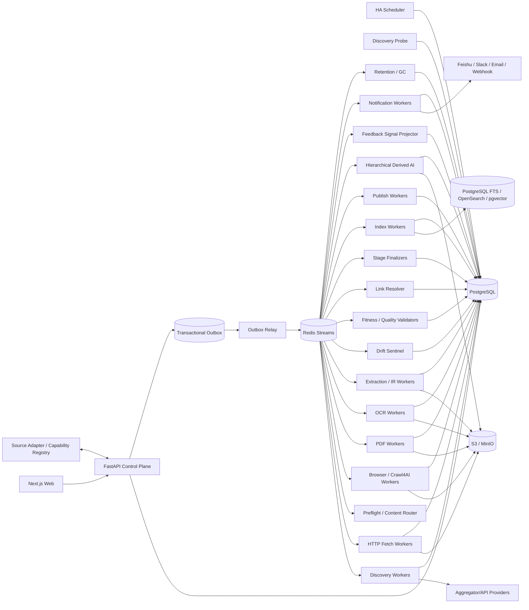

# 博客知识库技术方案

适用范围：从约 1000 个技术博客、技术文档站、Newsletter 与相关技术内容站点抓取尽可能完整的历史文章，清洗为稳定 Markdown 建设长期知识库；后续持续增加站点，支持增量同步、Web 管理、版本保留、搜索、故障恢复、离线重处理、人工运营、告警通知、分层 AI 分析和外部发布。容量按百万级文档、数百万到千万级 URL、站点高度异构、长期运行设计。

## 1. 建设目标

1. 管理员输入站点根地址、博客入口、文档入口或聚合来源后，系统自动探测 Sitemap、RSS/Atom/JSON Feed、公开 API、归档页、分类/标签/作者页、文档导航树、普通站内链接、动态列表和外部聚合 API，生成可审核的接入配置。
2. 支持 `FULL_BACKFILL` 历史全量回灌、`INCREMENTAL` 持续增量、`RECONCILE` 覆盖校准、`TARGETED_FETCH` 精确补抓和 `REPROCESS` 离线重处理。
3. 历史完整性必须有 Provider 级覆盖证据，不能用“队列空了”“抓了 N 页”“达到 max_depth/max_pages”代替。
4. 最终知识对象统一保存标题、作者、发布时间、更新时间、标签、canonical、正文、代码块、表格、图片、附件、PDF、真实链接关系、来源定位和完整 lineage。
5. 默认 HTTP-first；只有出现明确动态渲染证据时才升级 Crawl4AI/Playwright Browser。PDF、Feed、JSON/API、附件按真实 Content-Type 路由。
6. 支持 ETag、Last-Modified、Sitemap lastmod、Feed GUID/API cursor、聚合源 checkpoint、导航树 hash、body hash、Document IR hash、重叠窗口和周期 Reconcile 驱动的增量同步。
7. 支持 durable frontier、断点续跑、幂等、lease、heartbeat、重试、限流、熔断、公平调度、backpressure 和 dead-letter。
8. 保存不可变网络 Snapshot、原始 PDF、渲染 DOM、清洗 HTML、导航快照、raw/fit Markdown、Canonical Document IR、最终 Markdown、规则版本和质量结果；规则升级优先离线 replay。
9. 对 selector、模板变化和抽取器升级建立 Extraction Drift Sentinel，避免“请求成功但抓错区域”的系统性静默污染。
10. Web 管理端覆盖站点接入、Adapter/Capability Registry、Provider 覆盖、任务控制、URL 诊断、质量审核、版本 diff、Retention、成本、搜索、人工运营、派生 AI、报告和通知。
11. 人工收藏、点赞、标签、审核、纠错与偏好都与源内容事实分离，只影响运营视图或派生排序，不能静默修改不可变 Snapshot 或 accepted version。
12. LLM 摘要、主题、Embedding、聚类、趋势分析、个性化 Digest、报告等都是 Accepted Document Version 的下游能力，失败不能阻塞源站同步。

## 2. 核心原则

1. **PostgreSQL 是业务状态真相源；S3/MinIO 是不可变大对象真相源。**
2. Redis Streams 只承担任务运输；决定性状态先写 PostgreSQL，再通过 Transactional Outbox 投递。
3. URL 被发现不等于允许访问，必须经过 URL Admission Pipeline；真实网络连接由 Egress Gateway 做 DNS/IP/端口/redirect 安全校验。
4. Crawl Scope 显式版本化，不能把 same-domain/internal-links 当隐式规则。
5. Sitemap、Feed、API、Aggregator API、Archive、DOC_NAVIGATION、HTML Frontier、Browser Dynamic Listing 是独立 Discovery Provider；单一 Provider 不能证明全站抓全。
6. Source Adapter、Discovery、Content Fetch 分离：Adapter 描述来源特有发现/分页/认证语义，Discovery 枚举 URL，Content Fetch 统一负责请求、存证、路由、重试、限流和质量。
7. “URL 已存在”只代表 identity 已知，绝不代表内容永久新鲜；Identity 与 Freshness 分离。
8. HTTP、Browser、PDF/OCR 分层处理，不把所有 URL 无条件交给浏览器。
9. Browser 是昂贵升级路径；生产中复用长期 Browser/Crawl4AI runtime，不为每个 URL 重建进程。
10. HTTP 200、Browser success、Extractor 无异常都不能证明内容有效，必须经过独立 Content Fitness Gate 和 Quality Validator。
11. raw/fit Markdown 都只是 extraction candidate；最终知识真相是 accepted Canonical Document IR。
12. 抽取阶段不得不可逆删除真实链接；如果 LLM 需要无 URL 文本，只生成额外 Projection。
13. 文档 identity 与 URL 分离；redirect、canonical、slug rename、镜像和站点迁移只是 identity evidence。
14. `document_version` append-only，不原地覆盖旧版本。
15. JSON、Markdown、搜索索引、Embedding、摘要、报告和外部知识库都是 Document IR 的 Projection，不互相反解析。
16. 文件路径只属于发布视图，不能承担 document identity，也不能用“文件存在”判断已同步。
17. `max_depth/max_pages/max_entries/max_runtime` 只是单次执行预算，不能作为历史完整性判定。
18. 固定字数阈值只能作为评分信号，不能静默丢弃短 API/reference/FAQ/CLI 页面。
19. Bloom Filter、RoaringBitmap、内存 Set、URL hash 只能加速，不能替代数据库唯一约束和 durable frontier。
20. Scheduler、Redis consumer、浏览器进程、前端页面、进程内 `asyncio.Queue`/`asyncio.gather()` 都是可丢失运行时状态，不能替代数据库里的 run/task/lease/schedule/delivery。
21. 核心领域字段通过 Typed Domain Writer 写入；关键字段只有唯一权威 Writer。
22. 阶段完成由 Stage Finalizer 对领域数据、Artifact、retry/dead-letter 对账，不能由协程结束决定。
23. 历史知识对象默认长期保留；Retention/GC 按数据角色和 lineage 决定，禁止按固定天数删除权威历史。
24. 人工操作使用 append-only Event/Audit；Override 不能抹掉机器判定历史。
25. 偏好信号只影响 Derived AI 的选择和排序，不影响源站抓取覆盖、质量真相或 accepted version。
26. 派生 AI 任务从确定的 Accepted Document Version 出发；模型、Prompt 或排序算法升级优先重放已有 IR/Snapshot，而不是重新访问源站。
27. Source Adapter 开发态可以用 ABC/Protocol、entrypoint 或反射提升效率，但生产 Registry 必须由显式 Manifest/Release 驱动。
28. Aggregator API 只能提供 discovery evidence，不能代替 origin Snapshot，也不能单独证明 FULL_BACKFILL 完整。
29. 通知是独立 Delivery Plane；通知失败不能把已完成的抓取 Run 改为失败。
30. 遵守 robots、站点政策、访问控制和合理速率；验证码、登录、付费墙、WAF 明确挑战进入策略流程，不自动绕过。

## 3. 总体架构



职责边界：

- **Control Plane**：站点、规则版本、权限、Run、Schedule、人工操作、AI 分析配置和查询；
- **Source Adapter Registry**：来源能力、配置 schema、版本、健康、Golden/Canary、绑定和回滚；
- **Discovery**：Provider/Adapter 枚举 URL、checkpoint、导航树、聚合源证据和覆盖证据；
- **Admission**：URL 规范化、Scope、robots、crawler trap、安全检查；
- **Fetch**：HTTP 条件请求、Browser 升级、PDF/OCR、不可变 Snapshot；
- **Extraction/IR**：生成候选和统一 Canonical Document IR；
- **Drift/Fitness/Quality**：防空抓、错抓、过度裁剪和系统性模板漂移；
- **Finalizer**：对账真实产物和失败集合；
- **Curation/Feedback**：保存人工事件并投影偏好，不修改源事实；
- **Derived AI**：单文档、聚类、时间窗、综合报告和个性化排序；
- **Notification**：持久化告警/报告投递，与抓取完成语义解耦；
- **Publish**：从 accepted version 生成 Markdown 文件树、Git、对象存储或外部 KB Projection；
- **Retention/GC**：按 retention class 和 lineage 受审计回收。

## 4. Crawl Mode 与运行语义

```text
FULL_BACKFILL     首次历史全量回灌
INCREMENTAL       持续同步新增和更新
RECONCILE         周期重新枚举，修复断档
TARGETED_FETCH    精确 URL 抓取、调试或补抓
REPROCESS         不访问源站，基于已有 Snapshot 重抽取/清洗/质量/索引/发布
```

规则：

- FULL_BACKFILL 中 Page Type、Scorer、用户偏好、关键词和字数只能影响优先级，不能静默丢弃已发现合法历史 URL。
- TARGETED_FETCH 必须逐项返回指定 URL 的真实结果，失败不能用相似 URL 补位。
- REPROCESS 必须记录 `source_snapshot_id/source_artifact_id` 和完整 lineage。
- 同站点默认只允许一个 active FULL_BACKFILL；其他模式并行关系由显式策略定义。
- Run 完成由 Finalizer 判断，不由“所有协程结束”判断。

## 5. 不可变 Run Context

Run 创建时冻结至少：

```text
run_context_id
site_profile_release_id
site_source_release_ids
source_adapter_release_ids
adapter_binding_release_ids
provider_release_ids
crawl_scope_release_id
url_filter_release_id
url_scorer_release_id
fetch_profile_release_id
preflight_router_release_id
content_route_release_id
browser_action_plan_release_id
extraction_pipeline_release_id
extraction_drift_release_id
content_fitness_release_id
document_ir_schema_release_id
markdown_renderer_release_id
quality_contract_release_id
index_release_id
publish_release_id
retention_policy_release_id
runtime_bundle_release_ids
policy_release_id
credential_profile_id
secret_version_refs
context_hash
```

Context 创建后不可修改。Worker payload 只引用 `run_context_id`，禁止读取“latest release”。新规则处理旧 Snapshot 时创建 REPROCESS Run，并保留 lineage。

## 6. Source Adapter SDK 与 Capability Registry

新增 1000 个站点时，绝大多数应通过“配置 + 通用 Provider”接入，少量特殊平台才需要代码 Adapter。Adapter 只负责来源特有发现、分页、认证和 checkpoint 语义，不直接成为最终 Markdown Writer。

### 6.1 开发态接口

建议 Python 侧使用小而稳定的 ABC/Protocol：

```python
class SourceAdapter(Protocol):
    async def discover(self, ctx: DiscoveryContext) -> AsyncIterator[DiscoveryRecord]: ...
    async def checkpoint(self) -> AdapterCheckpoint: ...
```

本地开发允许 entrypoint、显式 import 或反射自动发现 Adapter，以降低新增来源成本；自动发现结果只能生成“待发布 Manifest”，不能成为生产业务真相。

统一输出 `DiscoveryRecord`：

```text
source_item_id
source_url
canonical_hint
title_hint
published_at_hint
updated_at_hint
cursor/page_token
content_type_hint
fetch_route_hint
discovery_evidence
raw_metadata_ref
```

### 6.2 生产态 Release

每个 `source_adapter_release` 至少声明：

```text
adapter_name/version
config_schema/result_schema
supported_platforms
capabilities
history_coverage_semantics
checkpoint_semantics
rate_limit_hint
allowed_host_pattern
healthcheck_contract
runtime_bundle_release_id
code/image digest
```

`adapter_binding_release` 固定站点、Adapter Release、Provider、credential profile、mapping profile、优先级/fallback 和配置 hash。

发布门禁：Config Schema Test、Contract Test、Golden Discovery、Golden Incremental、Pagination/Checkpoint Recovery、Rate-limit、Scope/SSRF、Canary、Rollback。

Registry 由数据库/发布 Manifest 驱动，不依赖 import-time `__subclasses__()` 作为业务真相。

## 7. 新站点接入与 Discovery Probe

管理员录入入口后执行：

1. 请求入口，记录 final URL、Content-Type、响应头、编码、页面结构；
2. 解析 robots.txt 及其 Sitemap；
3. 探测 Sitemap/Sitemap Index；
4. 探测 RSS/Atom/JSON Feed；
5. 识别 WordPress/Ghost/Substack 等公开 API；
6. 识别年/月归档、分类、标签、作者分页；
7. 识别文档侧边栏、章节树、版本/语言切换；
8. 探测 canonical、hreflang、next/prev、JSON-LD；
9. 判断静态 HTML、SSR、CSR/SPA、Load More；
10. 如配置聚合源，探测 Aggregator API 的 item ID、cursor、时间字段和 origin URL；
11. 自动采样正文候选，估算 HTTP/Browser 成本；
12. 生成 Site Profile、Scope、Provider、Adapter Binding、Fetch、Browser、Extraction、Fitness、Quality、Retention 草稿；
13. Web 展示证据、样本 diff、风险和成本；
14. dry-run/canary 通过后 publish；
15. 启动 FULL_BACKFILL，并创建 INCREMENTAL schedule。

## 8. Discovery Provider 与历史覆盖证明

推荐 Provider：

```text
Sitemap / Sitemap Index
Feed / API
Aggregator API
Archive / Pagination
DOC_NAVIGATION
HTML Frontier
Browser Dynamic Listing
```

### 8.1 Aggregator API Provider

适用于第三方目录、社区博客清单、搜索 API、NewsNow 类聚合接口和企业内部 URL 清单服务。

约束：

1. Aggregator 输出只作为 URL/metadata discovery evidence；
2. 正文必须重新访问 origin URL 并保存不可变 Snapshot；
3. 聚合源 item ID、rank、timestamp、cursor、payload hash 必须留痕；
4. Aggregator 缺失或删除 item 不得删除已接受文档；
5. “最近 N 条”或“latest”接口不能证明历史完整；
6. Provider 单独保存 checkpoint、last success、错误和 coverage semantics；
7. Aggregator URL 仍必须通过 Admission、Scope 和安全校验。

### 8.2 Coverage Ledger

每个 Provider 保存：

```text
provider_expected_count
provider_discovered_count
admitted_count
rejected_by_scope_count
fetched_count
accepted_document_count
known_gap_count
checkpoint
min/max published_at
coverage_state
coverage_evidence
```

历史完整性不能用 `max_depth`、抓取数量或“队列空了”证明。多 Provider 交叉验证：Sitemap 发现 10 万 URL、Feed 只覆盖近期 500 条是正常现象；Feed/Aggregator 更适合近期增量，Sitemap/Archive 更适合全量覆盖。

## 9. URL Admission、Scope 与安全

URL 进入 frontier 前执行：

- 规范化 scheme/host/path/query；
- tracking 参数剥离采用版本化规则；
- 保存 `raw_url/normalized_url/normalized_url_hash`；
- canonical 仅作为 evidence，不直接无条件合并 identity；
- 明确 allow/deny host、path、query、content-type；
- robots 决策版本化；
- crawler trap 检测：日历无限翻页、session 参数、搜索组合页、排序组合页等；
- redirect 每跳重新 Admission；
- DNS A/AAAA 与最终 IP 检查，拒绝 localhost、RFC1918、loopback、link-local、metadata endpoint 和危险端口；
- Browser 子资源同样遵守网络策略。

已知 URL 再次发现时 UPSERT `last_seen_at/discovery_evidence/freshness_hint`，不能因为唯一约束丢掉新的观察事实。

## 10. Durable Frontier、Task、Outbox 与恢复

统一后台任务字段：

```text
task_id/run_id/run_context_id/task_type/entity_id
status/priority/site_id/domain_key
attempt/max_attempt
available_at
lease_owner/lease_expires_at/heartbeat_at
idempotency_key
last_error_class/last_error_detail
created_at/updated_at
```

PostgreSQL 是任务决定性状态。Worker 使用 `FOR UPDATE SKIP LOCKED` 小批 claim，决定性状态与 Outbox 同事务提交，再由 Relay 投递 Redis Streams。

Worker 流程：

```text
claim 20~100 tasks
 -> worker-local bounded queue
 -> Semaphore 控制局部并发
 -> 每个任务独立写 Attempt/Artifact/Result
 -> ack transport
 -> 继续下一批
```

禁止一次把百万 URL 交给 `asyncio.gather()`。Redis ack 不代表业务完成；消费者重复执行必须幂等。Recovery Worker 扫描 stale/orphaned lease：可重试则重新排队，超过上限进入 DEAD_LETTER。

## 11. HTTP-first Fetch Decision Router

HTTP Worker 优先使用 `If-None-Match/If-Modified-Since`。304 只更新 freshness；200 先保存 raw bytes，再计算：

```text
status/final_url/content_type
body_size/body_hash
html_text_chars
main_candidate_chars
script_ratio/link_ratio
boilerplate_ratio
meta/jsonld signals
```

低成本候选优先：JSON-LD/OpenGraph/meta + lxml/selectolax + Trafilatura/Readability/Crawl4AI 非浏览器路径。

只有出现明确证据时升级 Browser，例如：

```text
EMPTY_ARTICLE_BODY
CSR_SHELL_DETECTED
SCRIPT_DATA_REQUIRED
LOAD_MORE_REQUIRED
HTTP_BROWSER_CONTENT_GAP
SITE_PROFILE_FORCE_BROWSER
```

每次升级记录 reason、HTTP candidate、Browser candidate、耗时和资源成本，便于按站点优化。

## 12. Browser/Crawl4AI Runtime 与 Readiness

生产推荐：

```text
Worker start
 -> 启动长期 Browser/Crawl4AI runtime
 -> 小批任务 claim
 -> worker-local bounded concurrency
 -> 每个 URL 完成即提交 Snapshot/Attempt
 -> 定期 recycle browser/context
```

不允许为每个 URL 重建 Browser，也不允许一个巨大 `arun_many()/gather()` 成为业务 checkpoint。

`browser_action_plan_release` 至少保存：

```text
wait_until
wait_for_css/js
click/load_more actions
max_action_count
scroll policy
stability condition
readiness timeout
```

默认 `domcontentloaded + 稳定正文/导航条件`；仅特殊情况使用 networkidle。Readiness timeout 必须结构化记录，禁止把“Browser 调用成功但正文为空”保存为成功内容。

## 13. Content-Type Router 与 PDF/OCR

依据真实 Content-Type 和 magic bytes 路由：

```text
HTML -> HTML extraction
JSON/XML/Feed -> structured parser
PDF -> PDF parser
Image/scan -> OCR
Attachment -> attachment pipeline
Unsupported -> classified reject
```

PDF 保留原文件、页数、metadata、页级文本、图片和 source locator。文本密度过低时进入 OCR，按页 checkpoint，保存 confidence/bbox。加密、损坏、超大文件独立分类，避免与普通 HTML 重试混合。

## 14. Extraction、Canonical Document IR 与 Markdown

抽取按成本与确定性分层：

```text
Tier 1  JSON-LD / OpenGraph / meta / Feed/API metadata
Tier 2  Site/page-type selector
Tier 3  Generic extractor: Trafilatura / Readability / Crawl4AI
Tier 4  Browser-rendered DOM extractor
Tier 5  LLM extraction（仅必要时）
```

每个 candidate 保存 extractor release、input artifact、正文、metadata、代码/表格/链接、source locator 和质量指标。

Canonical Document IR 至少表达：

```text
document metadata
blocks:
  heading
  paragraph
  code
  list
  quote
  table
  image
  attachment
links
source_locator
```

最终 Markdown 由版本化 Renderer 从 accepted IR 生成。清洗器/Renderer 升级时可离线 REPROCESS。

抽取阶段不得把 `[text](url)` 不可逆转成纯文本。需要给 LLM 的“无 URL 文本版”应作为 `LLM_PLAIN_TEXT` Projection 单独生成。

## 15. Content Fitness、Extraction Drift 与 Quality

### 15.1 Content Fitness

拦截 silent failure，指标包括：

```text
main_text_chars
heading/code/table/link count
boilerplate ratio
error/challenge markers
metadata completeness
historical length delta
raw-vs-fit retention ratio
```

Page Type 使用不同阈值；短 API method、CLI option、FAQ 不能因固定字数被静默丢弃。

### 15.2 Extraction Drift Sentinel

按 `site + page_type + extraction_pipeline_release` 保存滚动基线：DOM 骨架、正文长度分布、heading/code/table/link 数、selector 命中、candidate similarity。

对 1%~5% 或风险自适应样本做 Shadow Extraction，比较 Primary 与 Generic/last-good candidate。

状态机：

```text
HEALTHY -> SUSPECTED -> CONFIRMED -> QUARANTINED -> RECOVERED
```

CONFIRMED 后问题 extractor 不得覆盖 accepted version；可切 last-good/generic fallback，修复 release 经过 Golden + Canary 后恢复。

### 15.3 Final Quality

独立 Validator 读取 COMPLETE Artifact 重新检查正文、metadata、结构、link、PDF/OCR coverage、导航覆盖和历史退化。只有 PASSED 或明确人工 Override 的候选才能成为 accepted version。

人工 Override 独立保存 actor、reason、机器判定和 supersedes 关系，不能篡改原机器 Manifest。

## 16. 文档 Identity、版本与链接图

核心关系：

```text
URL Observation
  -> Resource Identity Evidence
  -> Document
  -> Document Version (append-only)
```

同一文档可能经历 redirect、canonical 变更、slug rename、镜像和站点迁移。Identity 合并必须基于多种 evidence，并允许人工复核。

`document_version` 至少保存：

```text
document_id
source_snapshot_id
ir_artifact_id
content_hash
semantic_hash
published_at/updated_at
accepted_at
quality_result_id
supersedes_version_id
```

技术文档站额外记录 `product_version/docs_version/locale/variant`。

抽取时写 `document_link_edge`，保存 source document/version、target URL/document、anchor、rel、source locator、first/last seen，用于 broken link、orphan、覆盖补漏和检索增强。

## 17. 增量同步：Identity 与 Freshness 分离

`sync_schedule` 保存 cron/interval、timezone、DST、jitter、overlap、misfire policy、next_due_at、last_success_at。

增量信号：

1. Feed GUID/API cursor；
2. Aggregator cursor/item ID/updated timestamp；
3. Sitemap lastmod；
4. ETag/Last-Modified；
5. body hash；
6. Document IR hash；
7. 页面 metadata updated_at；
8. navigation hash；
9. 周期 Reconcile。

规则：

- 已知 URL 仍按 freshness schedule 重检；
- 304 不创建新版本；
- 200 但 body/IR 无实质变化只更新 freshness；
- IR 实质变化才创建新 candidate/version；
- Feed/API/Aggregator cursor 使用 overlap window 防延迟发布和边界遗漏；
- extractor release 变化但源 Snapshot 未变时优先 REPROCESS；
- navigation hash 未变只能降低枚举成本，不能单独证明正文无变化；
- 聚合源未返回已知 URL 不视为删除证据；
- 周期 RECONCILE 必须能找回漏窗。

## 18. Artifact Registry 与 Stage Finalizer

Artifact 至少包括：

```text
RAW_HTTP
RAW_PDF
RENDERED_DOM
CLEANED_HTML
NAVIGATION_SNAPSHOT
AGGREGATOR_PAYLOAD
RAW_MARKDOWN
FIT_MARKDOWN
DOCUMENT_IR
FINAL_MARKDOWN
LLM_PLAIN_TEXT
QUALITY_MANIFEST
DRIFT_MANIFEST
INDEX_PAYLOAD
PUBLISH_MANIFEST
DERIVED_AI_ARTIFACT
SELECTION_MANIFEST
```

Artifact 状态采用 `STAGING -> COMPLETE -> TOMBSTONED`，对象先上传 staging，校验 hash/size 后原子登记 COMPLETE。

Stage Finalizer 只根据数据库真实集合和 COMPLETE Artifact 判断：

```text
COMPLETED
PARTIAL
FAILED
INCONSISTENT
```

Worker 说“成功”但 Snapshot/Artifact 未完成时，Finalizer 必须判不一致，而不是成功。

## 19. Retention 与 Garbage Collection

### 19.1 AUTHORITATIVE

默认长期/永久保留：

```text
accepted document/document_version
lineage root snapshot
quality/drift manifest
run context / audit event
publish manifest
人工 hold / 法律保留对象
```

### 19.2 RECONSTRUCTIBLE

确认可由权威 Snapshot + immutable release 完整重放后才可回收：

```text
旧 extraction candidate
旧 index payload
中间 comparison artifact
可重建 render projection
旧 derived AI artifact（按策略）
```

### 19.3 EPHEMERAL

可短 TTL：

```text
staging upload
temp browser render
temp OCR cache
worker-local scratch
transient debug log
```

GC 使用 lineage-aware mark-and-sweep。对象存储生命周期只按 `retention_class + approved_gc_state` 执行，不能简单按创建时间删除。删除必须有 tombstone 和 audit event；引用冲突则停止并告警。

## 20. 调度、限流、公平性与 Backpressure

多层资源控制：

```text
Global runtime quota
 -> worker class quota
 -> site/domain concurrency
 -> request/token bucket
 -> worker-local semaphore
```

- HTTP、Browser、PDF/OCR、AI 分池；
- domain/site 级限流与 `Retry-After`；
- weighted fair scheduling，避免大站饿死小站；
- 增量任务优先级可高于大规模历史回灌；
- Browser queue 过长时触发 backpressure，不能拖垮 HTTP 主链路；
- 站点连续 429/5xx 进入 circuit breaker；
- Drift QUARANTINED 停止自动发布，但允许受控抓取和 REPROCESS；
- worker-local Semaphore 只是最后一层资源保护，不能替代跨 Worker 的 domain quota。

## 21. Web 管理功能

### 21.1 站点接入

- Probe 向导；
- Sitemap/Feed/API/Aggregator/Archive/DOC_NAVIGATION 证据；
- Adapter/Capability 匹配；
- Crawl Scope 可视化；
- HTTP/Browser 样本 diff；
- Content Fitness/Quality 样本；
- Golden、dry-run、Canary、Publish；
- 一键 FULL_BACKFILL；
- 自动创建 INCREMENTAL schedule。

### 21.2 Adapter Registry

展示 adapter/version/digest/capabilities/config schema/binding/site coverage/health/last canary/rollback target，支持发布、禁用、Canary、回滚和重新绑定。配置变化生成新 release，禁止静默修改运行中的 Run Context。

### 21.3 Run 与任务

Run Now、Force New Run、Targeted Fetch、Reprocess、pause/resume/cancel/retry、Run Context diff、dead-letter repair、reconcile。

### 21.4 URL 诊断

任一 URL 可查看：discovery evidence、Aggregator payload、normalized URL、scope decision、frontier、freshness、HTTP attempt、Preflight 指标、route reason、Browser escalation、readiness、raw/fit Markdown、Primary/Shadow Candidate、Document IR、Fitness/Quality、drift evidence、document version、link graph、publish path、人工操作和错误。

### 21.5 Extraction Health

按站点/page type 展示 primary extractor、shadow extractor、selector hit、fitness failure、drift state、last-good release、样本 diff。

### 21.6 Retention 与成本

展示 HTTP 成功率、Browser escalation/成本、OCR 比例、429/5xx、Fitness failure、raw/fit 裁剪比例、drift、quality reject、coverage gap、freshness lag、对象存储增长、retention class 占用、AI token/cost 和待 GC 体积。

### 21.7 Curation / Feedback

支持 favorite、like、pin、collection、标签、笔记、质量反馈、approve/reject/quarantine、TARGETED_FETCH/REPROCESS、identity merge/split review，并展示审计历史。

### 21.8 AI 与报告中心

展示 Document Analysis、Cluster Analysis、Digest、趋势报告、Selection Manifest、选中文档、模型/Prompt/排序 release、偏好 profile、成本、状态和重放入口。

### 21.9 查询要求

百万级列表必须服务端查询：PostgreSQL/OpenSearch 过滤、keyset/cursor pagination、预聚合/物化统计。禁止先把全部文档加载到 API 进程再用 Python 过滤。页面刷新不改变后台状态机。

## 22. 人工运营、Curation 与 Feedback Signal Projection

知识库长期运营需要独立的人工作业层，而不是只允许“机器抓完就结束”。

`curation_event` 建议字段：

```text
event_id
actor_id
document_id/version_id/site_id
operation
label/note/reason
payload_json
created_at
supersedes_event_id
```

支持：

- LIKE / FAVORITE / PIN / COLLECTION；
- 标签、笔记、负责人；
- 标记“正文缺失、抽错区域、metadata 错误、重复文档、链接异常”；
- approve/reject/quarantine；
- 发起 TARGETED_FETCH / REPROCESS；
- 人工 identity merge/split review；
- 对站点/规则保存运营备注。

约束：

1. 人工反馈不能修改不可变 Snapshot；
2. 不能原地覆盖旧 `document_version`；
3. 修正应创建新的 candidate/version 或显式 Override Event；
4. Override 记录 actor/reason/旧判定/新判定；
5. 人工反馈可进入 Golden Sample、规则优化和测试集，但新规则仍需版本发布和 Canary；
6. 批量操作必须审计、可回滚或生成反向事件。

### 22.1 Preference Signal Projection

点赞/收藏等偏好不直接写回源文档，而由异步 Signal Projector 从 `curation_event` 生成版本化偏好画像：

```text
preference_signal_projection
actor_id / team_id
site/topic/tag/entity
positive_weight
negative_weight
decay_policy
source_event_watermark
projection_release_id
created_at
```

再形成不可变 `feedback_profile_release`，供某次 Derived AI selection 引用。

边界：

- 偏好只影响“看什么、怎么排”；
- 不影响“抓不抓”；
- 不影响历史覆盖；
- 不影响 Content Fitness/Quality 真相；
- 不允许因为不喜欢某类文章而让 FULL_BACKFILL 漏抓。

## 23. Notification / Delivery Plane

告警和报告通过持久化投递层发送到 Feishu、Slack、Email、Webhook 等 Channel Adapter。

```text
Domain Event
 -> Notification Rule
 -> notification_delivery(PENDING)
 -> Transactional Outbox
 -> Notification Worker
 -> Channel Adapter
 -> SENT / RETRY / DEAD
```

`notification_rule` 至少保存：

```text
scope(site/run/global)
event_type
severity
channel_binding_id
dedup_window
silence_window
retry_policy
enabled
```

`notification_delivery` 至少保存：

```text
delivery_id
event_id
channel_binding_id
idempotency_key
status
attempt
next_retry_at
provider_message_id
last_error
sent_at
```

推荐事件：

```text
RUN_PARTIAL / RUN_FAILED
DEAD_LETTER_BACKLOG
COVERAGE_GAP
FRESHNESS_LAG
HTTP_429_SPIKE
BROWSER_ESCALATION_SPIKE
DRIFT_CONFIRMED / QUARANTINED
QUALITY_REJECT_SPIKE
ACCESS_CHALLENGE
ARTIFACT_COMMIT_FAILURE
GC_BLOCKED
STORAGE_PRESSURE
AI_JOB_FAILED / AI_COST_SPIKE
```

关键语义：

- `(event_id, channel_binding_id)` 幂等；
- 支持 retry/backoff、dedup、silence、dead-letter、手工重发；
- 外部 Channel 故障不能阻塞抓取事务；
- 通知发送失败不能把已完成 Run 改为 FAILED；
- Dashboard 可查看投递记录和失败原因。

## 24. Hierarchical Derived AI 与多样性选择

所有派生 AI 从 accepted `document_version_id` 或明确的 accepted version 集合出发，不进入抓取主链路。

### 24.1 分层模型

```text
L0 Deterministic Features
   Embedding / language / code stats / deterministic tags

L1 Document Analysis
   Summary / Key Points / Topic / Entity / Trend Signals

L2 Cluster / Batch Analysis
   同主题、同站点、同时间窗的聚类与组内综合

L3 Window / Corpus Synthesis
   日/周/月、查询集合、跨站点趋势综合

L4 Ranking / Personalized Digest / Report
   相关性 + 偏好 + 多样性选择 + 报告生成
```

每层都是独立 `analysis_run/derived_job`，输入引用确定的上游 Artifact/Version；失败独立重试，不改变 source accepted state。

### 24.2 模型与 Prompt 版本

每个 Derived Job 记录：

```text
source_document_version_ids / selection_manifest_id
job_type
model_provider_release_id
model_release_id
prompt_release_id
schema_release_id
toolset_release_id
runtime_release_id
feedback_profile_release_id
input_hash
output_artifact_id
token/cost
quality/status
```

Prompt、模型、Tool 或 Middleware 不应只存在于运行时 YAML；发布到生产时必须有不可变 release identity。

### 24.3 Candidate Selection

生成报告前先构建有界候选集：

```text
Time Window / Query / Collection
 -> Quality / Scope Filter
 -> Relevance Rank
 -> Feedback Profile Adjustment
 -> Diversity Selector
 -> Selection Manifest
 -> L2/L3 Analysis
```

不能把百万文档一次性塞给 LLM。

### 24.4 Diversity Selector

支持 MMR、max-min/farthest-first 等算法，防止高重复主题占满上下文预算。

max-min 的基本思想：对每个未选择候选计算其与当前已选择集合的最大相似度，每轮选择“最大相似度最小”的候选，以补充当前集合最缺失的语义方向。

`derived_selection_manifest` 至少保存：

```text
selection_run_id
candidate_query_hash
candidate_set_hash
selected_document_version_ids
ranking_release_id
diversity_algorithm
diversity_params
feedback_profile_release_id
context_budget
created_at
```

这样任何报告都能回答“为什么选了这些文章”。

### 24.5 派生结果原则

- AI 失败不影响 accepted 文档；
- 模型升级优先基于已有 IR 离线重算；
- AI 结果不能覆盖源正文；
- 用户 Like/Favorite 只影响派生 selection/ranking；
- 每个综合报告必须能追溯到 Selection Manifest 和具体 document version。

## 25. 搜索与发布模型

默认 PostgreSQL FTS；规模或复杂查询上升后接 OpenSearch。向量检索按需使用 pgvector/独立 Vector DB，不作为抓取主链路强依赖。

Publish Worker 只读取 accepted + Quality PASSED + 非 QUARANTINED 版本。

支持：

- Markdown 文件树；
- Git 仓库；
- 对象存储；
- OpenSearch/向量库；
- 外部知识库 API。

`publish_manifest` 保存 profile、document/version、target path、content hash、supersedes、状态和错误。

路径只是 Projection；`/post?id=1` 与 `/post?id=2` 不能因 path 相同静默覆盖。文件已存在也不能阻止新 accepted version 发布。

## 26. 错误分类与重试

```text
DNS/TLS/CONNECT_TIMEOUT/READ_TIMEOUT
HTTP_429/HTTP_5XX/HTTP_404_410
ROBOTS_DENIED/AUTH_REQUIRED/PAYWALL
WAF/CAPTCHA/ACCESS_CHALLENGE
INVALID_CONTENT_TYPE
EMPTY_BODY/CSR_SHELL
BROWSER_TIMEOUT/READINESS_TIMEOUT
PDF_ENCRYPTED/PDF_CORRUPT/OCR_LOW_CONFIDENCE
EXTRACTION_EMPTY/EXTRACTION_DRIFT
QUALITY_REJECT
ARTIFACT_COMMIT_FAILURE
LEASE_LOST/CANCELLED
ADAPTER_CHECKPOINT_ERROR
AGGREGATOR_PROVIDER_ERROR
NOTIFICATION_PROVIDER_ERROR
DERIVED_AI_PROVIDER_ERROR
SELECTION_INPUT_INCONSISTENT
```

可重试错误采用 `Retry-After + jittered exponential backoff + max attempts + circuit breaker`。配置错误、明确拒绝、访问挑战和确定性质量失败不能无限原样重试。通知和派生 AI 错误在自己的可靠性域重试，不回滚抓取事实。

## 27. Secret、合规与运行隔离

- Secret 通过 Vault/云 Secret Manager/KMS 解析，任务 payload 只保存 Secret Reference/Version；
- 日志和 Artifact metadata 默认脱敏；
- Browser context 默认无持久登录态；
- action plan 只能来自已发布版本，任务 payload 不可注入任意脚本；
- PDF/OCR parser 在低权限、资源受限 Worker；
- Source Adapter/Aggregator Provider 不得绕过 Egress、Scope、robots 或 Secret Policy；
- Channel credential、AI provider credential 与抓取 credential 分离；
- 人工操作使用 RBAC，关键 merge/delete/GC/override 可要求双人审批。

## 28. 可观测性

至少采集：

```text
urls_discovered/admitted/fetched
provider_discovery_count/coverage_gap
aggregator_success/checkpoint_lag
fetch_success/304/429/5xx
http_to_browser_escalation
browser_latency/memory/crash/readiness_timeout
artifact_commit_success/failure
extraction_fitness_failure
extraction_drift_state
quality_reject
accepted_version_rate
freshness_lag
queue_age/task_retry/dead_letter
object_storage_growth
notification_delivery_success/retry/dead
derived_ai_success/failure/token/cost
selection_candidate_count/selected_count/diversity
curation_events/preference_projection_lag/override_count
```

告警覆盖：Coverage 长期 gap、Adapter/Aggregator checkpoint 卡住、HTTP fitness 突降、Browser escalation 突升、429 激增、Drift CONFIRMED/QUARANTINED、quality reject 激增、Artifact commit failure、freshness lag、GC reference conflict、增量 schedule lag、notification dead-letter、AI cost spike 和对象存储压力。

## 29. 核心数据模型

至少包括：

```text
site
site_profile_release
site_source
source_adapter_release
adapter_binding_release
provider_release
provider_checkpoint
coverage_ledger
crawl_scope_release
sync_schedule
crawl_run
run_context
url_observation
frontier_item
fetch_attempt
network_snapshot
artifact
extraction_candidate
drift_result
fitness_result
quality_result
document
document_version
document_link_edge
publish_manifest
background_task
outbox_event
retention_policy_release
gc_mark/tombstone
curation_event
preference_signal_projection
feedback_profile_release
notification_rule
channel_binding
notification_delivery
analysis_run
derived_job
derived_selection_manifest
derived_artifact
audit_event
```

关键唯一约束：

```text
url_observation: normalized URL identity
frontier_item: run/provider/url task semantics
document_version: document_id + version identity append-only
outbox_event: event_id unique
background_task: idempotency_key unique per task semantics
notification_delivery: event_id + channel_binding_id unique
derived_job: source/selection + job_type + release identity unique
derived_selection_manifest: selection_run_id unique
feedback_profile_release: actor/team + release identity unique
```

批量写建议使用 PostgreSQL `INSERT ... ON CONFLICT`，但冲突语义必须按领域定义：URL Observation 冲突更新 last_seen/evidence；任务幂等冲突返回已有任务；document version 永不原地覆盖。

## 30. 推荐技术栈

| 层 | 推荐 |
|---|---|
| API / Control Plane | Python + FastAPI |
| Web | React / Next.js |
| Metadata / State | PostgreSQL |
| Queue Transport | Redis Streams |
| Large Artifact | S3 / MinIO |
| HTTP | httpx/aiohttp |
| Browser | Crawl4AI + Playwright |
| HTML Extraction | lxml/selectolax + Trafilatura/Readability + Crawl4AI |
| PDF | PyMuPDF / pdfplumber 等 |
| OCR | 独立 OCR Worker |
| Search | PostgreSQL FTS，按需 OpenSearch |
| Vector | pgvector 或独立 Vector DB，按需 |
| AI | OpenAI-compatible Provider + 版本化 Prompt/Schema/Toolset |
| Observability | OpenTelemetry + Prometheus + Grafana + Loki/ELK |
| Secret | Vault / 云 Secret Manager / KMS |
| Deployment | Docker + Kubernetes |

初期不建议直接引入 Kafka。Redis Streams + PostgreSQL Outbox 足够；只有吞吐、长保留或跨区域消费出现明确瓶颈再迁移 Kafka/Pulsar。

## 31. 部署与容量规划

最小生产拓扑：

```text
2 x FastAPI Control Plane
2 x Scheduler/Finalizer（HA leader election）
N x Discovery/HTTP Workers
独立 Browser Worker Pool
独立 PDF/OCR Worker Pool
独立 Extraction/Quality Pool
独立 Index/Publish Pool
独立 Derived AI / Signal Projector / Notification Pool
PostgreSQL HA
Redis HA
S3/MinIO
Observability Stack
```

扩容按瓶颈分类：

- HTTP 吞吐受域级速率限制时加 Worker 无效；
- Browser 受内存/CPU 约束，应独立扩容；
- OCR 与 AI 有独立成本配额；
- PostgreSQL 重点关注 task claim、索引、autovacuum、连接池；
- 对象存储按 raw snapshot、PDF、render artifact、IR、projection 分层统计增长；
- AI 报告使用 candidate budget/selection manifest 控制 token，而不是直接提升模型上下文上限。

## 32. 测试与发布门禁

必须具备：

- Adapter Contract / Pagination / Checkpoint Test；
- 开发态自动发现 -> Manifest 生成测试；
- Sitemap/Feed/API/Aggregator/Archive/DOC_NAVIGATION Golden Fixture；
- Aggregator origin URL、checkpoint、近期窗口不能冒充全历史的测试；
- Scope/SSRF/redirect 测试；
- HTTP 304/ETag/Last-Modified 测试；
- 静态/SSR/CSR/SPA/Load More Browser Readiness 测试；
- extractor Golden Sample 与 Shadow diff；
- Markdown/IR 链接、代码、表格保真测试；
- PDF/OCR 页级恢复测试；
- Worker kill、lease 过期、Redis 重启、S3 慢响应测试；
- Outbox/重复投递幂等测试；
- Retention/GC 引用安全测试；
- Notification 重试/去重/dead-letter 测试；
- Curation/Override 审计测试；
- Feedback Signal Projection 可重放与 watermark 测试；
- Like/Favorite 不改变 source coverage/accepted truth 测试；
- Derived AI 分层 lineage、模型/Prompt release 隔离测试；
- MMR/max-min Selection 可重复、可解释、候选 hash 一致性测试；
- 百万级列表服务端分页和查询压测；
- Browser/Extractor/Adapter Runtime bundle 资源限制测试。

Extractor/selector/adapter 新 release 优先使用历史 Snapshot/Discovery Fixture 回放，并在 Golden Samples 上比较 URL 集、正文、代码、表格、链接和 metadata，避免规则更新制造数据退化。

## 33. 实施阶段

### Phase 1：MVP

- site/source/Probe；
- Source Adapter SDK 基础协议与 Capability Registry；
- Crawl Scope；
- Sitemap/Feed/DOC_NAVIGATION 基础发现；
- PostgreSQL durable frontier/task；
- HTTP-first 抓取 + raw Snapshot；
- Trafilatura/Crawl4AI 候选 + Document IR + Markdown；
- basic Fitness/Quality；
- FULL_BACKFILL/INCREMENTAL；
- 基础 Web + 服务端分页；
- Egress/robots/Secret；
- publish manifest；
- retention class 基础模型。

### Phase 2：异构站点与可靠性

- Archive/API/Aggregator/HTML Provider；
- Adapter 开发态自动发现 + 生产 Manifest/Release；
- Adapter Binding health/canary/rollback；
- Navigation Snapshot；
- Browser/Crawl4AI 长生命周期 runtime；
- Readiness Contract；
- Drift Sentinel + Shadow Extraction；
- Version/Identity/Link Graph；
- Targeted Fetch/Reprocess；
- Stage Finalizer；
- lineage-aware Retention/GC；
- Curation/Feedback Plane；
- Notification/Channel Adapter + durable delivery。

### Phase 3：规模化与知识增强

- OCR；
- 多 Provider Coverage Ledger；
- weighted fairness；
- cross-worker domain quota；
- OpenSearch/向量检索；
- Feedback Signal Projection；
- Hierarchical Derived AI；
- MMR/max-min Diversity Selection；
- 周/月技术趋势、个性化 Digest、报告中心；
- 外部 KB 发布；
- Access Challenge workflow；
- 完整成本/质量/覆盖/freshness/retention/漂移/通知/AI 面板。

## 34. 验收标准

### 34.1 历史全量覆盖

随机选择不同规模、技术栈和目录结构站点，必须输出 Provider 级覆盖证据；Worker 重启后继续；大 Sitemap/Adapter cursor 从 checkpoint 恢复；FULL_BACKFILL 不因关键词、Page Type、用户偏好、固定字数、`max_depth/max_pages` 漏掉已发现合法 URL。

### 34.2 Source Adapter 扩展

新增标准 RSS/Sitemap 站应尽量只需配置；特殊 API 来源 Adapter 必须通过 schema、checkpoint、pagination、Golden、Canary 和 rollback。开发态反射/entrypoint 可以帮助发现插件，但生产 Run 只能引用已发布 release。

### 34.3 Aggregator Provider

聚合 API 可以低成本贡献 URL，但 origin fetch、Admission 和 Snapshot 不能被绕过；latest/最近 N 条不能令 FULL_BACKFILL 误判完成；Aggregator 暂时缺失 item 不删除历史文档。

### 34.4 HTTP/Browser Router

静态页不得无条件使用 Browser；动态页必须有 escalation reason；HTTP 200 但空正文必须被 Fitness 拦截；Browser Readiness 完成后才进入 extraction。

### 34.5 Raw/Fit/IR 与链接

长正文、代码、表格、短 API、复杂导航样本均能保真；fit 过度裁剪不能覆盖当前 accepted version；真实链接不会在抽取阶段不可逆丢失；Markdown 可从 IR 重渲染。

### 34.6 Drift

模板改版、selector 命中错误区域、class rename、正文容器迁移时，即使单页长度尚可，Shadow/Baseline 仍能发现系统性偏移；CONFIRMED 后禁止问题 extractor 覆盖 accepted version；修复 release 经 Golden + Canary 后恢复。

### 34.7 增量同步

已存在 URL 仍会按 freshness schedule 重检；Feed/API/Aggregator cursor、lastmod、navigation hash、ETag/Last-Modified、body/IR hash 能触发正确增量；304/无变化不创建无意义版本；漏窗由 Reconcile 找回。

### 34.8 Retention/GC

accepted 历史文档不得因固定天数自动消失；AUTHORITATIVE 根可追溯；RECONSTRUCTIBLE 只有确认可重放时才回收；GC 遇到引用冲突停止并告警；删除有 tombstone/audit。

### 34.9 Web 与规模查询

百万级文档列表使用服务端过滤和 keyset pagination；Adapter Registry、Provider Coverage、Run、URL、Drift、Retention、Curation、AI、Report、Notification 页面均能从已提交事实恢复显示，刷新浏览器不影响后台任务。

### 34.10 人工运营与偏好

收藏、点赞、标签、质量反馈、人工 Override、TARGETED_FETCH/REPROCESS 发起均有 actor/reason/audit；任何人工操作不会修改不可变 Snapshot 或原地重写旧 version。Like/Favorite 只能改变 Derived AI 排序，不改变抓取覆盖和 accepted truth。

### 34.11 通知投递

模拟飞书/Slack/Email 超时和 5xx：抓取 Run 的业务完成状态不被通知故障改变；delivery 可重试、去重、进入 dead-letter、人工重发，且每次投递可追溯。

### 34.12 分层 AI 与 Selection

模型/Prompt 升级可以从确定的 accepted version/IR 重算；L1/L2/L3/L4 每层有明确输入 lineage；AI 失败不影响源文档 accepted；报告保存候选集 hash、Selection Manifest、选中文档 version、排序/多样性参数和 feedback profile，可解释“为什么选这些文章”。

### 34.13 故障恢复与完成语义

模拟 Worker kill、Redis 重启、Browser crash、S3 慢响应、lease 过期、Artifact staging 中断、Adapter/Aggregator 异常和异步保存失败；Finalizer 必须给出 COMPLETED/PARTIAL/FAILED/INCONSISTENT，不能出现“协程结束但 Artifact 未落盘却显示成功”。

## 35. 最终方案

最终采用“**PostgreSQL 状态真相 + S3 不可变 Artifact + 开发态轻量 Adapter SDK / 生产态 Versioned Capability Registry + durable frontier + Sitemap/Feed/API/Aggregator/Archive/DOC_NAVIGATION 等多 Discovery Provider 覆盖证明 + URL Identity/Freshness 分离 + HTTP-first Fetch Decision Router + Content-Type Router + 按证据升级的长期 Browser/Crawl4AI Runtime + 版本化 Readiness Contract + Canonical Document IR + Link Graph + Content Fitness Gate + Extraction Drift Sentinel + 独立 Quality Validator + Stage Finalizer + append-only Document Version + lineage-aware Retention/GC + Web Control Plane + append-only Curation/Feedback Plane + Preference Signal Projection + durable Notification/Channel Delivery Plane + Hierarchical Derived AI + MMR/max-min Diversity Selection + Selection Manifest + Projection/Publish Manifest**”作为核心。

Crawl4AI 只承担浏览器渲染和 Markdown/extraction candidate 生成，不承担业务队列、状态真相或历史完整性证明；Source Adapter 只承担来源特有发现/分页/认证语义；Aggregator API 只提供发现证据，正文真相来自 origin Snapshot；人工偏好只影响派生排序；通知和 LLM 分析都不能成为抓取主链路的同步依赖。

对于约 1000 个技术博客/文档站，长期可维护性的关键不是“能不能把一个 URL 转成 Markdown”，而是能否证明历史抓全、已知 URL 持续校验 freshness、静态页面不浪费浏览器、动态页面不会静默抓空、模板改版不会静默抓错、链接与结构不会在清洗时丢失、增量不漏不重、规则可版本化回放、历史不会被错误 TTL 清除、Worker/队列/浏览器故障后事实仍可靠、人工反馈可审计且不污染源事实、派生 AI 能分层重放并解释选文原因，以及每个最终 Markdown 和下游报告都能追溯到真实 Snapshot、Run Context、Adapter/Provider Release、Extraction Candidate、Fitness/Drift/Quality 证据、Document Version、Selection Manifest 和具体模型/Prompt/偏好版本。