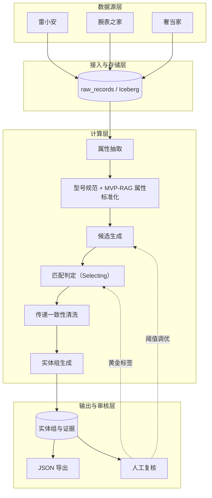
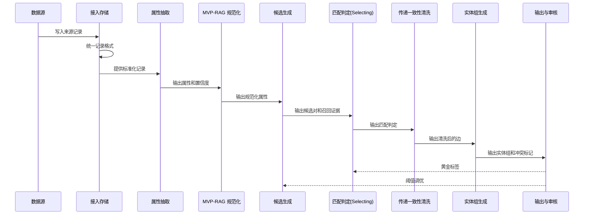
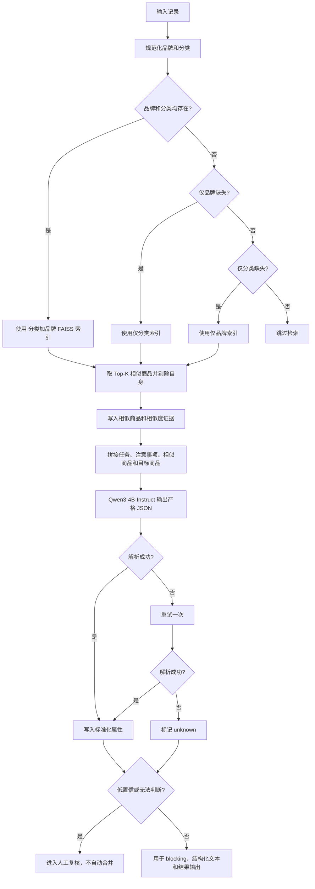
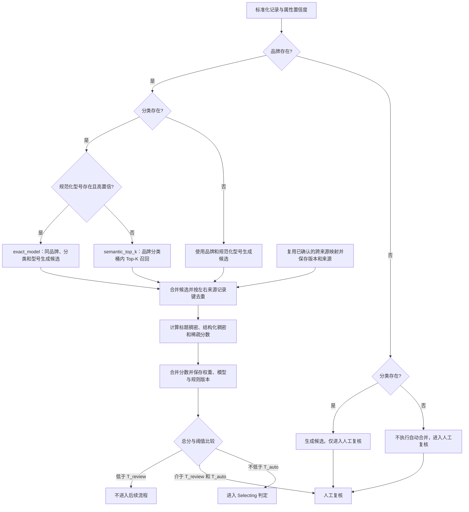
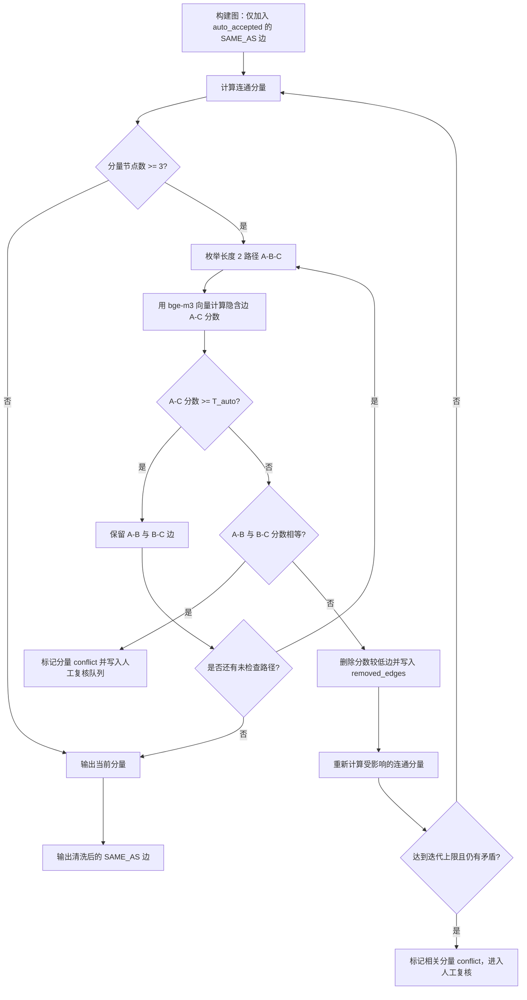
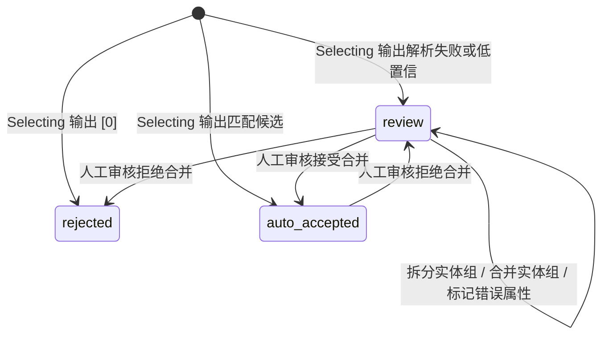
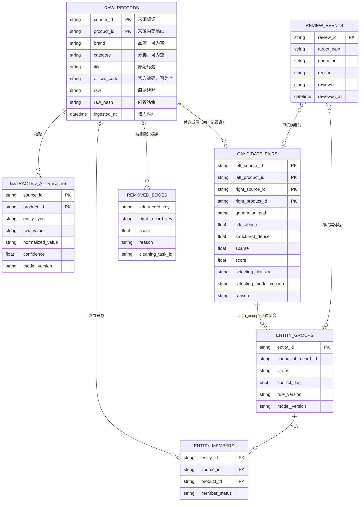

# 多来源商品数据合并系统设计

## 1. 背景与目标

本系统合并雷小安、腕表之家、奢当家等来源的商品数据。

每个来源提供品牌、分类和商品标题。标题没有统一格式。型号、规格、系列、材质等属性通常出现在标题中。系统不能为每个来源维护一套固定解析规则。

系统的目标是识别不同来源中代表同一官方商品变体的记录，并将这些记录合并为一个实体组。

## 2. 系统架构

系统分为四层：

| 层 | 主要职责 | 主要输出 |
| --- | --- | --- |
| 数据源层 | 提供商品记录 | 来源原始记录 |
| 接入与存储层 | 保存原始数据，统一记录格式 | `raw_records` |
| 计算层 | 抽取、规范化、候选生成、匹配判定和聚类 | 属性、候选对、匹配边、实体组 |
| 输出与审核层 | 提供查询、导出和人工复核 | JSON、结构化表、审核结果 |

**图 1：系统四层架构与数据流，人工复核结果以黄金标签回流到匹配判定与阈值调优。**

## 3. 批处理时序

一次批处理按以下顺序执行：

**图 2：一次批处理的跨组件时序，审核结果以黄金标签回流到匹配判定。**

## 4. 输入标准化

系统保留来源字段，并生成统一字段。

| 字段 | 说明 |
| --- | --- |
| `source_id` | 来源标识 |
| `product_id` | 来源内商品 ID |
| `brand` | 来源品牌字段，可以为空 |
| `category` | 来源分类字段，可以为空 |
| `title` | 原始商品标题，不改写 |
| `official_code` | 来源提供的官方 SKU 或 variant 编码，可以为空 |
| `raw` | 来源原始字段快照 |
| `raw_hash` | 原始记录内容的哈希值 |
| `ingested_at` | 接入时间 |

`source_id` 和 `product_id` 组成来源记录的唯一键。系统不使用单独的 `product_id` 作为全局键。

## 5. 属性抽取

### 5.1 GLiNER2 Schema

GLiNER2 使用动态 Schema 抽取属性。系统不为每个来源维护固定解析规则。

默认 Schema 如下：

| 类型 | 含义 |
| --- | --- |
| `brand` | 品牌 |
| `model` | 型号或 Reference |
| `series` | 系列或子系列 |
| `material` | 材质、表壳材质或表链材质 |
| `size` | 表径或官方尺寸 |
| `color` | 颜色或表盘颜色 |
| `hardware` | 箱包五金 |
| `movement` | 腕表机芯 |
| `version` | 版本或特殊款式 |
| `official_code` | 官方 SKU 或 variant 编码 |

每种类型维护一段描述。描述包含该类型的常见叫法。

抽取结果至少保存以下字段：

- 来源记录键。
- 实体类型。
- 原始实体文本。
- 规范化实体值。
- 置信度。
- 模型版本。
- 抽取时间。

### 5.2 低置信处理

如果关键属性的抽取置信度低于配置阈值，系统将记录放入低置信队列。

低置信记录不直接参与自动合并。系统可以为这些记录生成候选对，但结果必须进入人工复核。

第一阶段只验证中文标题的抽取效果。GLiNER2 base 模型以英文为主。只有在小样本验证不足时，系统才单独评估 adapter 或模型微调。

## 6. 型号和属性规范化

系统同时保存原始值和规范化值。规范化不覆盖原始值。

### 6.1 型号规范化

系统执行以下操作：

- 统一全角和半角字符。
- 统一大小写。
- 统一空格、连字符和斜杠。
- 去除 `ref`、`reference no`、`model no` 等前缀噪声。
- 保留型号后缀，因为后缀可能区分官方变体。

系统不删除无法证明为噪声的字母或数字。

### 6.2 MVP-RAG 属性标准化

系统不维护静态属性规范化词表。属性标准化由同品类同品牌相似商品检索与生成模型完成。

#### 6.2.1 相似商品检索

系统使用 `BAAI/bge-m3` 为每条记录生成稠密向量并做 L2 归一化。

系统按「分类 + 品牌」建立 FAISS 索引。检索前先做品牌别名映射（例如 `Rolex`、`劳力士` 归为同一规范品牌），避免同一品牌被拆成多个桶。

检索流程：

- 对目标记录，确定其分类和规范品牌。
- 在对应「分类 + 品牌」索引中取 Top-K 相似商品（K 建议 4 至 5），剔除目标自身。
- 品牌缺失时回退到「仅分类」索引；分类缺失时回退到「仅品牌」索引；两者都缺失时跳过检索。
- 相似商品及其相似度写入候选证据，供生成模型参考。

#### 6.2.2 Prompt 构造

系统将以下四段拼成一个 Prompt：

- 任务说明。
- 注意事项。
- 相似商品（同品类同品牌，仅参考）。
- 目标商品。

生成模型根据目标商品信息输出标准化属性。输出为严格 JSON，字段顺序固定，无法判断的属性填 `null`。

#### 6.2.3 生成与后处理

系统使用 `Qwen3-4B-Instruct` 生成标准化属性。输出解析失败时重试一次，仍失败则标记为 `unknown`。

低置信或无法判断的属性进入人工复核，不直接参与自动合并。

规范化值用于候选 blocking、结构化文本和结果输出。规范化值本身不产生匹配结果，也不单独拒绝候选。

**图 3：属性标准化按品牌与分类选择检索索引，将相似商品作为证据生成严格 JSON，并处理解析失败与低置信结果。**

## 7. 候选对生成

百万级数据不能进行全量两两比较。系统以 `bge-m3 + FAISS Top-K + 相似度阈值截断` 为候选生成的主路径，`exact_model` 作为补充路径。两条路径生成的候选对合并后按左右来源记录键去重，再进入后续流程。

不同缺失字段场景对应的候选路径与自动合并限制如下：

| 品牌 | 分类 | 型号状态 | 生成路径 | 是否可自动合并 | 说明 |
| --- | --- | --- | --- | --- |
| 存在 | 存在 | 规范化型号存在且相同 | `exact_model` | 是（进入匹配判定） | 补充路径；只缩小候选范围，不代表同一商品 |
| 存在 | 存在 | 缺失或置信度低 | `semantic_top_k` | 是（进入匹配判定） | `bge-m3` + FAISS Top-K |
| 缺失 | 存在 | 任意 | 生成候选 | 否 | 候选只能进入人工复核 |
| 存在 | 缺失 | 规范化型号存在 | 使用品牌和规范化型号生成候选 | 由匹配判定决定 | 不使用分类桶 |
| 缺失 | 缺失 | 任意 | 不生成自动合并候选 | 否 | 放入人工复核队列 |
| 已有人工确认映射 | 任意 | 任意 | 直接复用映射 | 是 | 保存映射版本和来源，不重复生成相同候选 |

### 7.1 精确候选路径

本路径是语义召回之外的补充路径。

如果品牌、分类和规范化型号都存在，且三者相同，系统生成候选对。

该路径只用于缩小候选范围。它不表示两个记录代表同一商品。

### 7.2 语义候选路径

这是候选生成的主路径。如果型号缺失或型号置信度低，系统在品牌和分类桶内使用 `BAAI/bge-m3` 向量和 FAISS 进行 Top-K 语义召回。`K` 是配置项，默认 5 至 10，抽样阶段调优。

如果品牌缺失，系统可以生成候选，但候选只能进入人工复核。系统不自动合并此类记录。

如果分类缺失，系统可以使用品牌和规范化型号生成候选。

如果品牌和分类都缺失，系统不执行自动合并。系统只将记录放入人工复核队列。

系统为每个候选对保存生成路径，例如 `exact_model` 或 `semantic_top_k`。

两个来源已有人工确认的商品映射时，系统直接复用该映射。系统仍然保存映射版本和来源，不重复生成相同候选。

### 7.3 候选合并与去重

7.1 与 7.2 生成的候选对合并后，按左右来源记录键去重。去重后的候选对进入 7.4 候选证据与阈值截断。

### 7.4 候选证据

系统为每条记录生成结构化文本。字段顺序固定为：

`品牌 | 型号 | 系列 | 材质 | 尺寸 | 颜色 | 五金 | 机芯 | 版本 | 官方编码`

系统使用固定字段标签，例如：

`品牌=Rolex|型号=126610LN|系列=Submariner|材质=钢|尺寸=41mm`

缺失字段直接省略。系统不同时使用“留空”和“省略”两种规则。

原始标题和结构化文本都使用 `BAAI/bge-m3` 编码。系统为每个候选对计算以下分数：

- 原始标题的稠密向量分数。
- 结构化文本的稠密向量分数。
- 结构化文本的稀疏词项分数。

系统先合并两类稠密分数：

`dense_score = w_title × title_dense + w_structured × structured_dense`

`w_title` 和 `w_structured` 的和为 1。

系统再合并稠密分数和稀疏分数：

`score = w_dense × dense_score + w_sparse × sparse_score`

`w_dense` 和 `w_sparse` 的和为 1。系统保存各项分数、权重和总分。如果系统不启用稀疏分数，则将 `w_sparse` 设置为 0。

三个分数的输入与权重如下：

| 分数项 | 输入文本 | 向量类型 | 权重 | 合并位置 |
| --- | --- | --- | --- | --- |
| `title_dense` | 原始标题 | bge-m3 稠密 | `w_title` | `dense_score` |
| `structured_dense` | 结构化文本 | bge-m3 稠密 | `w_structured` | `dense_score` |
| `sparse` | 结构化文本 | 稀疏词项 | `w_sparse` | 最终 `score`（可设 0 关闭） |

相似度和阈值用于候选生成。`T_review` 和 `T_auto` 作为候选截断与人工复核分界：低于 `T_review` 的候选对不进入后续流程；不低于 `T_review` 且低于 `T_auto` 的候选进入人工复核；不低于 `T_auto` 的候选交给匹配判定。分数同时作为审核证据，不承担最终匹配判定。

阈值通过黄金标签集调整。阈值、权重、模型版本和规则版本都写入候选记录。

**图 4：候选对按字段可用性选择生成路径，合并去重后经阈值截断，再进入人工复核或 Selecting 判定。**

## 8. 匹配判定（Selecting）

匹配判定从每条记录的候选对中选择真正匹配的那一个。

### 8.1 Selecting 判定

对每条不重复的锚点记录，系统将其候选打包成一个选择式 Prompt：

- 任务说明。
- 锚点记录。
- 候选记录列表，编号为 `[1]` 至 `[K]`。

系统调用 `DeepSeek-V4-Flash`，温度设置为 0，只输出一个编号。输出 `[k]` 表示锚点与第 k 个候选匹配，输出 `[0]` 表示没有匹配的候选。

解析失败的输出或低置信结果进入人工复核，不直接参与自动合并。

`candidate_pairs` 记录 `selecting_decision` 和 `selecting_model_version`。匹配判定结果与该候选的生成分数一并保存，供审核与传递一致性清洗使用。

## 9. 实体组生成

### 9.1 传递一致性清洗

系统只将 `auto_accepted` 的 `SAME_AS` 边放入图中。`review` 和 `rejected` 结果不进入图。

生产环境使用 Spark 计算连通分量。NetworkX 只用于抽样和调试。

对每个不少于三个节点的连通分量，系统检查长度为 2 的路径。例如，A 与 B 匹配，B 与 C 匹配，系统使用已存的 `BAAI/bge-m3` 向量计算 A 与 C 的隐含分数。

如果 A 与 C 的分数低于 `T_auto`，系统执行以下操作：

1. 不将 A-C 写入匹配边。
2. 在已接受的 A-B 和 B-C 边中删除分数较低的一条。
3. 如果两条边分数相同，系统不自动选择。系统将该分量标记为 `conflict` 并进入人工复核。
4. 系统重新计算受影响的连通分量。

系统重复上述步骤，直到没有矛盾，或达到配置的迭代上限。A-C 是隐含比较结果，不是被删除的已接受边。

被删除的边写入 `removed_edges`。记录至少包含两个来源记录键、边分数、删除原因和清洗任务 ID。系统不静默丢弃被删除的边。

如果达到迭代上限后仍存在矛盾，系统将相关分量标记为 `conflict` 并进入人工复核。

**图 5：传递一致性清洗算法流程——对长度 2 路径做隐含比较，删除低分边或标记冲突并迭代重算。**

### 9.2 实体组生成

系统使用清洗后的 `SAME_AS` 边生成实体组。系统只对产品节点计算连通分量。

品牌、分类和颜色等属性作为实体字段保存。它们不直接用于连通分量。

`VARIANT_OF` 表示不同官方变体之间的关系。该边不参与实体组聚类。

传递一致性清洗发现的矛盾组标记为 `conflict`，并交人工复核。

## 10. 输出和审核

每个实体组输出以下内容：

| 字段 | 说明 |
| --- | --- |
| `entity_id` | 稳定的统一实体 ID |
| `canonical_record_id` | canonical 记录的来源记录键 |
| `canonical` | 代表记录及字段来源 |
| `members` | 实体组中的来源记录 |
| `evidence` | 已接受匹配边的分数和理由 |
| `status` | `auto_accepted`、`review` 或 `rejected` |
| `conflict_flag` | 是否存在冲突 |
| `rule_version` | 匹配规则版本 |
| `model_version` | 抽取和向量模型版本 |

`candidate_pairs` 保存全部候选对。`entity_groups.evidence` 只保存进入实体组的匹配证据，避免重复保存全部候选。

人工审核至少支持以下操作：

- 接受合并。
- 拒绝合并。
- 拆分实体组。
- 将两个实体组合并。
- 标记错误属性。

审核结果回流为黄金标签，并保留审核人、审核时间和审核理由。

**图 6：判定与审核状态机——Selecting 输出决定初始状态，人工审核操作带来后续流转；conflict_flag 作为实体组属性而非图中状态。**

## 11. 数据模型

| 表名 | 用途 | 关键字段 |
| --- | --- | --- |
| `raw_records` | 保存来源原始记录 | `source_id`、`product_id`、`brand`、`category`、`title`、`official_code`、`raw_hash` |
| `extracted_attributes` | 保存抽取属性 | 来源记录键、类型、原始值、规范化值、置信度、模型版本 |
| `candidate_pairs` | 保存候选对、生成证据与匹配判定 | 两个来源记录键、生成路径、各项分数、总分、selecting_decision、selecting_model_version、理由 |
| `entity_groups` | 保存实体组 | `entity_id`、canonical 记录键、状态、冲突标记、版本 |
| `entity_members` | 保存实体组成员 | `entity_id`、`source_id`、`product_id`、成员状态 |
| `removed_edges` | 保存传递一致性清洗删除的边 | 两个来源记录键、相似度、删除原因、清洗任务 |
| `review_events` | 保存人工审核历史 | 候选对或实体组、操作、理由、审核人、审核时间 |

**图 7：核心数据表逻辑关系图——展示候选对、实体组、成员、被删边与审核事件之间的逻辑关联与基数。**

系统使用 Spark 执行批处理，并将中间结果和最终结果写入 Iceberg。

原始数据和中间结果可以按来源或分类分区。实体组不能只按来源分区，因为一个实体组可以包含多个来源。

## 12. 增量处理

增量任务只处理新增记录、发生变化的记录及其候选邻域。

系统必须执行以下步骤：

1. 根据 `raw_hash` 判断记录是否发生变化。
2. 为新增或变化记录重新执行抽取和规范化。
3. 在相关 blocking 桶内重新生成候选。
4. 对新增候选重新执行 Selecting 匹配判定。
5. 更新匹配边和实体组。
6. 对受影响的连通分量重新执行传递一致性清洗。
7. 保持未变化实体的 `entity_id` 不变。
8. 为拆分、合并和失效映射写入审核事件。

重复执行同一批增量数据不能生成重复实体组。

## 13. 部署与资源

- GLiNER2 第一阶段选择 200M 至 1B 参数量级的模型，并通过抽样测试确定具体版本。
- `BAAI/bge-m3` 使用量化版本降低 CPU 推理成本。
- `Qwen3-4B-Instruct` 用于 MVP-RAG 属性标准化，需要一张 8GB 以上显存的 GPU；使用 vLLM 或 Ollama 提供接口，并开启批量推理。
- `DeepSeek-V4-Flash` 用于匹配判定（Selecting），云端 API 按 token 计费，上线前确认具体型号与接口命名。
- 开发阶段使用 Spark local 或 DuckDB 跑通抽样数据。
- 生产阶段根据数据量选择 EMR、自建集群或托管 Spark。
- FAISS 只用于稠密向量召回。稀疏词项分数使用单独的检索或计算过程。
- 生产环境记录抽取吞吐、候选数量、自动合并率、人工复核率和错误合并率。

## 14. 范围外

- 商品图片识别和图片比对。
- MICE 图像描述多模态属性抽取（本期不做）。
- 电商平台发布和库存回写。
- GLiNER2 大模型微调。
- 第一阶段的全语种支持。
- 实时在线匹配 API。

## 15. 参考资料

- [ecom-product-knowledge-graph](https://github.com/adityashah841/ecom-product-knowledge-graph)
- [GLiNER2](https://github.com/fastino-ai/GLiNER2)
- [GLiNER2 电商 Schema 教程](https://github.com/fastino-ai/GLiNER2/blob/main/tutorial/4-combined.md)
- [Amazon ESCI 数据](https://github.com/amazon-science/esci-data)
- [MVP-RAG: Multi-Value-Product Retrieval-Augmented Generation](https://aclanthology.org/2025.emnlp-industry.147/)
- [MICE: Mixture of Image Captioning Experts for e-Commerce Attribute Value Extraction](https://aclanthology.org/2025.acl-industry.80/)
- [ComEM: Match, Compare, or Select?](https://github.com/tshu-w/ComEM)
- [product-matching-rag](https://github.com/Abhisheksasidharann/product-matching-rag)
- [Splink](https://github.com/moj-analytical-services/splink)
- [dedupe](https://github.com/dedupeio/dedupe)
