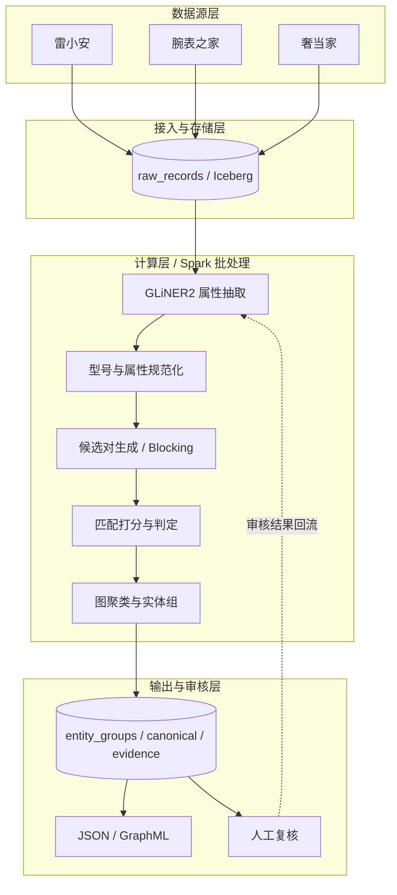
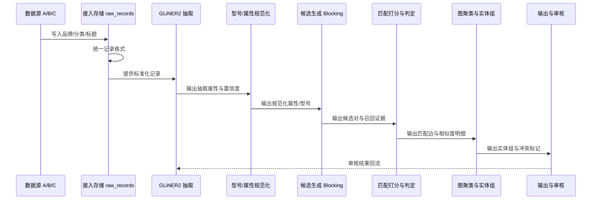

# 多来源商品数据合并系统设计

## 1. 背景与目标

本系统合并雷小安、腕表之家、奢当家等来源的商品数据。每个来源提供品牌、分类、商品标题。标题没有固定格式。型号、规格、系列、材质等属性常埋在标题里。系统无法用一套统一的解析规则抽取这些属性。

系统要解决的核心问题：

> 系统自动识别多来源记录中的同一商品。系统把同一商品的跨来源记录合并为一个实体组，形成统一商品库。

判定“同一商品”时，以下官方属性必须一致：

- 品牌
- 系列 / 子系列
- 型号 / Reference
- 表径、表壳材质、表盘颜色、机芯等关键区分属性（腕表）
- 官方尺寸、材质、颜色、五金、版本等关键区分属性（箱包）

以下情况不能合并：

- 同款不同尺寸
- 同款不同颜色
- 同款不同材质
- 同系列不同型号
- 外观接近但官方 SKU / variant 不同

系统原则是精度优先：系统宁可漏识别，也不合并不同的官方变体。

## 2. 设计依据

本设计借鉴 `adityashah841/ecom-product-knowledge-graph` 的流水线思路：

1. NER 从原始商品标题抽取结构化实体
2. 双编码器对商品变体做语义去重
3. 去重结果建成 NetworkX / GraphML 知识图谱

原项目在 75,000 条 Amazon 商品上验证了 BERT NER、`all-MiniLM-L6-v2` 双编码器、FAISS 相似检索、阈值扫描和知识图谱构建。原始仓库：

- https://github.com/adityashah841/ecom-product-knowledge-graph
- 数据来源：https://github.com/amazon-science/esci-data

本设计与原项目的关键差异：

- NER 层换为 GLiNER2。GLiNER2 按 Schema 动态抽取，支持零样本，不需要先训练固定的 BERT NER 模型。
- 匹配层从“单数据集变体去重”扩展为“多来源实体合并”。系统复用跨来源历史映射。
- 候选生成引入 blocking。系统按品牌、分类、规范化型号收缩候选范围，再做向量召回。
- 输出增加实体组。多来源的多条记录合并为一组，而不是只产出两两 VARIANT_OF 边。

## 3. 系统架构

系统分为四层：数据源层、接入与存储层、计算层、输出与审核层。

## 4. 整体时序

下图展示一次批处理运行时各组件按时间顺序的交互。

设计重绘图（浏览器打开）：[多来源商品数据合并系统设计时序图.html](./多来源商品数据合并系统设计时序图.html)

## 5. 关键设计决策

### 5.1 输入标准化

系统先统一三个来源的记录格式：

- `source_id`：来源标识
- `product_id`：来源内商品 ID
- `brand`：来源字段或留空
- `category`：来源字段或留空
- `title`：原始标题，保留不改写
- `raw`：来源原始字段快照

### 5.2 GLiNER2 属性抽取

GLiNER2 通过动态 Schema 抽取实体。系统不需要为每个来源写解析规则。默认 Schema 覆盖：

- `brand`：品牌
- `model`：型号 / Reference
- `series`：系列 / 子系列
- `material`：材质 / 表壳材质 / 表链材质
- `size`：表径 / 官方尺寸
- `color`：颜色 / 表盘颜色
- `movement`：机芯 / 功能（腕表）
- `version`：版本 / 特殊款式

实现要点：

- 系统为每种实体类型维护一段描述。相同含义的不同叫法写入描述，提高零样本命中率。
- 抽取结果保留实体文本、实体类型、置信度。
- 标题置信度低于阈值时，标题进入低置信队列。低置信标题不参与自动合并。
- 官方 base 模型以英文为主。中文标题需要先做小样本实测。效果不足时，系统再做适配或微调。

### 5.3 型号与属性规范化

抽取出的型号不直接用于匹配。系统先规范化：

- 统一全角半角、大小写
- 统一分隔符：空格、连字符、斜杠
- 去除 `ref`、`reference no`、`model no` 等噪声词
- 保留字母数字组合的核心型号

规范化后的型号是硬约束的核心键。

### 5.4 候选对生成（Blocking）

百万级数据不能全量两两比较。候选生成分两级：

1. 硬规则候选：品牌、分类、规范化型号相同才进入候选
2. 语义召回候选：在品牌、分类桶内用 Embedding 做 Top-K 相似召回

语义召回覆盖标题表达差异大、型号抽取不稳的记录。

两个来源已有明确商品映射时，系统直接复用映射，不重复计算。

### 5.5 匹配打分与判定

候选对计算以下证据：

- 品牌一致性
- 规范化型号一致性 / 编辑距离
- 各抽取属性的字段级相似度
- 标题 / 抽取后结构化文本的语义向量相似度

第一版用可解释的规则和阈值判定。第二版用黄金标签训练轻量分类器（梯度提升树或逻辑回归）。每个候选对必须保留匹配理由和相似度明细，供人工审核。

### 5.6 图聚类与实体组

匹配关系以图为载体：

- 节点：Product、Brand、Category、Color / 属性值
- 边：`MADE_BY`、`BELONGS_TO`、`HAS_COLOR`、`SAME_AS` / `VARIANT_OF`

两两匹配通过 NetworkX 连通分量做传递闭包，合并为实体组。如果有矛盾边（A 匹配 B、B 匹配 C、A 不匹配 C）：

- 按最大连通分量成组
- 在输出中打冲突标记
- 不静默拆组，交人工复核

系统参考 TransClean 的传递一致性思路，把矛盾匹配当作误报检查重点。

### 5.7 输出

每个实体组输出：

- `entity_id`：统一实体 ID
- `canonical`：canonical 商品记录（字段最完整成员或字段投票结果）
- `members`：各来源原始记录 ID 与字段快照
- `evidence`：候选对匹配分数、命中字段、抽取属性与置信度

系统导出 JSON 供程序消费。系统导出 GraphML 供 NetworkX / 图可视化检查。

## 6. 数据模型

系统存储以下表：

- `raw_records`：来源原始记录与字段快照
- `extracted_attributes`：GLiNER2 抽取结果与置信度
- `candidate_pairs`：候选对与相似度证据
- `entity_groups`：实体组与 canonical 记录
- `entity_members`：实体组与来源成员映射

数据规模上来后，系统用 Spark 跑批。中间结果和最终实体组落在 Iceberg 表。表按来源或分类分区，支持快照与增量更新。

## 7. 部署与资源

- GLiNER2 起步选择 200M 至 1B 量级的模型。CPU 或单卡 GPU 均能承担批处理。
- 开发阶段用 Spark local / DuckDB 在抽样数据上跑通管线。
- 生产阶段按数据量选择 EMR、自建集群或托管 Spark。系统用 Iceberg 做全量加增量。
- 增量更新按来源或分类分区重算，避免每次全量重跑。

## 8. 落地阶段

### 阶段一：抽样验证

- 从三个来源各取一部分真实数据
- 人工标注几百对黄金标签
- 跑通 GLiNER2 抽取和实体组输出
- 评估实体组级别的精确率 / 召回率

### 阶段二：全量批处理

- 全部数据入 Iceberg
- 分布式跑抽取、候选生成、匹配、聚类
- 输出实体组进入人工抽检

### 阶段三：增量与闭环

- 支持日常增量更新
- 人工审核结果回流为标注数据
- 必要时用 adapter 或轻量分类器持续优化

## 9. 测试与评估

测试以最高层 seam 为主：三来源样本输入、实体组输出。

关键测试场景：

- 相同型号跨来源必须合并
- 不同型号必须不合并
- 同一型号的不同标题写法必须合并
- 缺失品牌或分类时，系统正确回退
- 增量数据不重复建组
- 系统标记矛盾边，不静默处理

评估指标：

- 实体组级别的精确率：合并出的组里错误合并的比例
- 实体组级别的召回率：需要识别的组被找到的比例
- 人工抽检率：高优先级候选对的复核比例

## 10. 范围外

- 商品图片识别与图片比对
- 电商平台发布、库存回写
- 大模型微调 / RAG 训练部署
- 全语种支持
- 实时在线匹配 API

## 11. 参考资料

- ecom-product-knowledge-graph：https://github.com/adityashah841/ecom-product-knowledge-graph
- GLiNER2：https://github.com/fastino-ai/GLiNER2
- GLiNER2 电商 Schema 教程：https://github.com/fastino-ai/GLiNER2/blob/main/tutorial/4-combined.md
- Amazon ESCI 数据：https://github.com/amazon-science/esci-data
- Splink：https://github.com/moj-analytical-services/splink
- dedupe：https://github.com/dedupeio/dedupe
