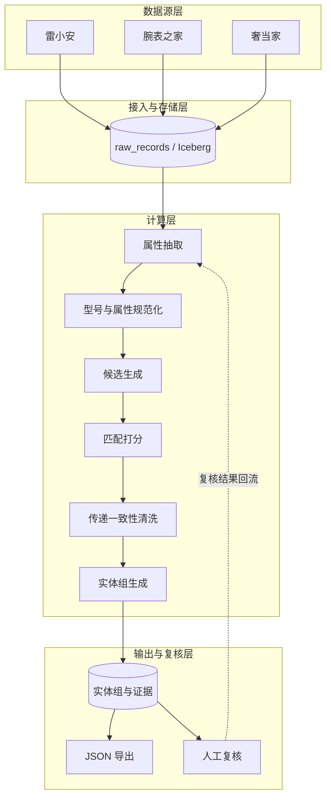

# 多来源商品数据合并系统设计

本文定义一套面向多来源商品数据的实体合并方案。系统先从标题中抽取并规范化商品属性，再生成候选对，使用 `BAAI/bge-m3` 计算语义分数，最后通过阈值判定和传递一致性清洗生成实体组。本方案优先保证自动合并精度：不满足自动合并条件的记录不会直接进入实体组，需要进一步判断的记录进入人工复核。

## 1. 背景与目标

本系统合并雷小安、腕表之家、奢当家等来源的商品数据。每个来源都提供品牌、分类和商品标题，但标题格式不统一，型号、规格、系列和材质等属性通常混在标题中。因此，系统不能依赖为每个来源单独维护的固定解析规则。

系统的目标是识别不同来源中代表同一官方商品变体的记录，并将这些记录合并为一个实体组。

### 1.1 术语

- **来源记录**：一个来源中的一条商品记录。记录由 `source_id` 和 `product_id` 唯一标识。
- **实体组**：代表同一官方商品变体的来源记录集合。
- **canonical 记录**：实体组中的代表记录。系统为每个字段保留字段来源。
- **官方变体**：由型号、尺寸、颜色、材质、机芯、版本或官方编码区分的商品版本。
- **未知字段**：字段缺失或抽取结果不可靠。未知不等于不一致。
- **候选分桶（blocking）**：根据品牌、分类、型号等规范化字段缩小待比较记录的范围。
- **黄金标签集**：经过人工确认、用于调整阈值并评估匹配效果的样本集。

不同官方变体不进入同一个实体组。`VARIANT_OF` 只表示商品变体关系，不参与实体组聚类。

### 1.2 合并规则

本方案的自动判定只使用 `BAAI/bge-m3` 产生的语义分数。系统不做字段级一致性比较，也不把字段冲突作为硬规则。

品牌、分类、型号和其他属性只用于以下两项工作：

- 生成候选对。
- 生成结构化文本。

规范化字段相同只表示两条记录可以进入同一个候选集，不表示它们代表同一商品。

满足自动合并前置条件的候选对按以下阈值判定：

| 分数范围 | 判定 | 是否进入实体组 |
| --- | --- | --- |
| `score >= T_auto` | `auto_accepted` | 是 |
| `T_review <= score < T_auto` | `review` | 否，进入人工复核 |
| `score < T_review` | `rejected` | 否 |

`T_auto` 和 `T_review` 通过黄金标签集调整。系统将阈值、模型版本、权重和规则版本写入匹配结果。

本方案不对官方编码、型号或关键属性设置硬拒绝规则。因此，不同官方变体也可能得到高语义分数。黄金标签集必须包含不同尺寸、颜色、材质、版本和官方编码的样本。高风险类别可以设置为只复核，不自动合并。

系统优先保证自动合并精度，宁可漏识别，也不自动合并低相似度记录。

## 2. 设计原则与依据

### 2.1 设计原则

- 保留来源原文和原始字段。
- 分离抽取、规范化、候选生成、匹配和聚类环节。
- 对每个自动合并结果保留理由和分数。
- 将低置信记录和冲突记录送入人工复核。
- 保证增量处理幂等，并保持 `entity_id` 稳定。

### 2.2 参考流水线

本设计参考 [ecom-product-knowledge-graph](https://github.com/adityashah841/ecom-product-knowledge-graph) 的流水线思路：

1. 从商品标题抽取结构化属性。
2. 为候选记录计算语义相似度。
3. 根据匹配边生成实体组。

该项目在 75,000 条 Amazon 商品数据上验证了 BERT NER、`all-MiniLM-L6-v2`、FAISS、阈值扫描和知识图谱构建。本设计将这些思路扩展到多来源实体合并。

本设计的主要变化如下：

- 使用 GLiNER2 按 Schema 抽取属性。
- 使用候选分桶限制比较范围。
- 使用跨来源历史映射减少重复计算。
- 输出实体组、canonical 记录和人工复核证据。

## 3. 系统架构

系统分为四层：

| 层 | 主要职责 | 主要输出 |
| --- | --- | --- |
| 数据源层 | 提供商品记录 | 来源原始记录 |
| 接入与存储层 | 保存原始数据，统一记录格式 | `raw_records` |
| 计算层 | 抽取、规范化、候选生成、匹配和聚类 | 属性、候选对、匹配边、实体组 |
| 输出与复核层 | 提供查询、导出和人工复核 | JSON、结构化表、复核结果 |



## 4. 批处理时序

一次批处理按以下顺序执行：


## 5. 输入标准化

接入数据时，系统保留来源字段，并生成以下统一字段：

| 字段 | 说明 |
| --- | --- |
| `source_id` | 来源标识 |
| `product_id` | 来源内商品 ID |
| `brand` | 来源品牌字段，可以为空 |
| `category` | 来源分类字段，可以为空 |
| `title` | 原始商品标题，不改写 |
| `official_code` | 来源提供的官方 SKU 或 variant 编码，可以为空 |
| `raw` | 来源原始字段快照 |
| `raw_hash` | 原始记录内容的哈希值 |
| `ingested_at` | 接入时间 |

`source_id` 和 `product_id` 共同组成来源记录的唯一键。系统不把单独的 `product_id` 作为全局键。

## 6. 属性抽取

### 6.1 GLiNER2 Schema

GLiNER2 使用动态 Schema 抽取属性，因此系统不需要为每个来源维护固定解析规则。

默认 Schema 包含以下实体类型：

| 类型 | 含义 |
| --- | --- |
| `brand` | 品牌 |
| `model` | 型号或 Reference |
| `series` | 系列或子系列 |
| `material` | 材质、表壳材质或表链材质 |
| `size` | 表径或官方尺寸 |
| `color` | 颜色或表盘颜色 |
| `hardware` | 箱包五金 |
| `movement` | 腕表机芯 |
| `version` | 版本或特殊款式 |
| `official_code` | 官方 SKU 或 variant 编码 |

每种类型都对应一段描述，其中包含该类型的常见名称。

每条抽取结果至少保存以下信息：

- 来源记录键。
- 实体类型。
- 原始实体文本。
- 规范化实体值。
- 置信度。
- 模型版本。
- 抽取时间。

### 6.2 低置信处理

如果关键属性的抽取置信度低于配置阈值，系统将记录放入低置信队列。系统可以为低置信记录生成候选对，但不能直接自动合并，匹配结果必须进入人工复核。

第一阶段只验证中文标题的抽取效果。GLiNER2 基础模型以英文为主。只有小样本验证结果不满足要求时，系统才单独评估 adapter 或模型微调。

## 7. 型号和属性规范化

系统同时保存原始值和规范化值。规范化不覆盖原始值。

### 7.1 型号规范化

系统执行以下规范化操作：

- 统一全角和半角字符。
- 统一大小写。
- 统一空格、连字符和斜杠。
- 去除 `ref`、`reference no`、`model no` 等前缀噪声。
- 保留型号后缀，因为后缀可能区分官方变体。

系统不删除无法证明为噪声的字母或数字。

### 7.2 属性规范化

系统为品牌、分类、材质、颜色、尺寸、五金和版本维护规范化词表。

系统先把不同来源的分类映射到统一分类。缺失值保持为未知值，未知值不参与“不一致”判断。

规范化值用于候选分桶、结构化文本和结果输出。规范化值本身不产生匹配结果，也不单独拒绝候选。

## 8. 候选对生成

百万级数据不适合进行全量两两比较。系统使用精确候选和语义候选两条主要路径，并根据字段缺失情况降级处理。

### 8.1 精确候选路径

如果品牌、分类和规范化型号都存在且三者相同，系统生成候选对。

该路径只用于缩小候选范围。它不表示两个记录代表同一商品。

### 8.2 语义候选路径

系统按以下条件生成语义候选或执行降级处理：

| 记录条件 | 候选处理 | 自动合并限制 |
| --- | --- | --- |
| 型号缺失或型号置信度低，但品牌和分类存在 | 在品牌和分类桶内，使用 `BAAI/bge-m3` 向量和 FAISS 进行 Top-K 语义召回 | 低置信记录按第 6.2 节进入人工复核；其他记录按第 1.2 节的阈值判定 |
| 分类缺失，但品牌和规范化型号存在 | 使用品牌和规范化型号生成候选 | 按第 1.2 节的阈值判定 |
| 品牌缺失，但分类存在 | 可以生成候选 | 只能进入人工复核 |
| 品牌和分类都缺失 | 不执行自动合并 | 直接进入人工复核队列 |

系统为每个候选对保存生成路径，例如 `exact_model` 或 `semantic_top_k`。

如果两个来源之间已有人工确认的商品映射，系统直接复用该映射，并保存映射版本和来源，不再生成相同候选。

## 9. 匹配打分与判定

### 9.1 匹配证据

系统为每个候选对计算以下三项语义分数：

- 原始标题的稠密向量余弦相似度。
- 结构化文本的稠密向量余弦相似度。
- 结构化文本的稀疏词项相似度。

系统只使用 `BAAI/bge-m3` 产生的分数。系统不计算字段级相似度，也不使用字段冲突规则。

### 9.2 语义文本

系统为每条记录生成结构化文本，字段顺序固定为：

`品牌 | 型号 | 系列 | 材质 | 尺寸 | 颜色 | 五金 | 机芯 | 版本 | 官方编码`

系统使用固定字段标签。以下是一条结构化文本示例：

```text
品牌=Rolex|型号=126610LN|系列=Submariner|材质=钢|尺寸=41mm
```

缺失字段直接省略。所有记录统一使用这一规则，不混用“留空”和“省略”。

原始标题和结构化文本都使用 `BAAI/bge-m3` 编码。

### 9.3 相似度和阈值

系统先合并原始标题和结构化文本的稠密分数：

`dense_score = w_title × title_dense + w_structured × structured_dense`

`w_title` 和 `w_structured` 的和为 1。

然后，系统合并稠密分数和稀疏分数：

`score = w_dense × dense_score + w_sparse × sparse_score`

`w_dense` 和 `w_sparse` 的和为 1。系统保存各项分数、权重和总分。如果不启用稀疏分数，系统将 `w_sparse` 设置为 0。

系统使用第 1.2 节定义的 `T_auto` 和 `T_review` 判定候选对。只有 `auto_accepted` 边可以进入实体组。`review` 和 `rejected` 结果不能进入实体组。

阈值通过黄金标签集调整。阈值、权重、模型版本和规则版本都写入匹配结果。

## 10. 实体组生成

### 10.1 传递一致性清洗

系统只把判定为 `auto_accepted` 的 `SAME_AS` 边放入图中。`review` 和 `rejected` 结果不进入图。

生产环境使用 Spark 计算连通分量。NetworkX 只用于抽样和调试。

系统按以下步骤清洗传递性冲突：

1. 对每个至少包含三个节点的连通分量，检查其中长度为 2 的路径。例如，A 与 B 匹配，B 与 C 匹配。
2. 使用已存的 `BAAI/bge-m3` 向量计算 A 与 C 的隐含分数。A-C 只是一项隐含比较结果，不是已接受的匹配边。
3. 如果 A 与 C 的分数大于或等于 `T_auto`，保留现有边。
4. 如果 A 与 C 的分数低于 `T_auto`，不把 A-C 写入匹配边，并比较已接受的 A-B 和 B-C 边。
5. 如果 A-B 和 B-C 的分数不同，删除分数较低的一条边，然后重新计算受影响的连通分量。
6. 如果 A-B 和 B-C 的分数相同，不自动删除任何一条边。系统将该分量标记为 `conflict`，并送入人工复核。
7. 重复以上步骤，直到没有矛盾，或达到配置的迭代上限。

系统把被删除的边写入 `removed_edges`，不静默丢弃。每条记录至少包含两个来源记录键、边分数、删除原因和清洗任务 ID。

如果达到迭代上限后仍存在矛盾，系统将相关分量标记为 `conflict` 并进入人工复核。

### 10.2 实体组生成

系统使用清洗后的 `SAME_AS` 边生成实体组，并且只对产品节点计算连通分量。

品牌、分类和颜色等属性作为实体字段保存。它们不直接用于连通分量。

`VARIANT_OF` 表示不同官方变体之间的关系。该边不参与实体组聚类。

系统把传递一致性清洗发现的矛盾组标记为 `conflict`，并交给人工复核。

## 11. 输出与人工复核

每个实体组输出以下内容：

| 字段 | 说明 |
| --- | --- |
| `entity_id` | 稳定的统一实体 ID |
| `canonical_record_id` | canonical 记录的来源记录键 |
| `canonical` | 代表记录及字段来源 |
| `members` | 实体组中的来源记录 |
| `evidence` | 已接受匹配边的分数和理由 |
| `status` | 实体组处理状态，与候选对判定分开记录 |
| `conflict_flag` | 是否存在冲突 |
| `rule_version` | 匹配规则版本 |
| `model_version` | 抽取和向量模型版本 |

`candidate_pairs` 保存全部候选对及其 `auto_accepted`、`review` 或 `rejected` 判定。`entity_groups.evidence` 只保存进入实体组的匹配证据，避免重复保存全部候选。

人工复核至少支持以下操作：

- 接受合并。
- 拒绝合并。
- 拆分实体组。
- 将两个实体组合并。
- 标记错误属性。

复核结果回流到黄金标签集。系统同时保留复核人、复核时间和复核理由。

## 12. 数据模型

| 表名 | 用途 | 关键字段 |
| --- | --- | --- |
| `raw_records` | 保存来源原始记录 | `source_id`、`product_id`、`brand`、`category`、`title`、`official_code`、`raw_hash` |
| `extracted_attributes` | 保存抽取属性 | 来源记录键、类型、原始值、规范化值、置信度、模型版本 |
| `candidate_pairs` | 保存候选对和匹配证据 | 两个来源记录键、生成路径、各项分数、总分、判定、理由 |
| `entity_groups` | 保存实体组 | `entity_id`、canonical 记录键、状态、冲突标记、版本 |
| `entity_members` | 保存实体组成员 | `entity_id`、`source_id`、`product_id`、成员状态 |
| `removed_edges` | 保存传递一致性清洗删除的边 | 两个来源记录键、相似度、删除原因、清洗任务 |
| `review_events` | 保存人工复核历史 | 候选对或实体组、操作、理由、复核人、复核时间 |

系统使用 Spark 执行批处理，并把中间结果和最终结果写入 Iceberg。

原始数据和中间结果可以按来源或分类分区。实体组不能只按来源分区，因为一个实体组可以包含多个来源。

## 13. 增量处理

增量任务只处理新增记录、发生变化的记录及其候选邻域。

每次增量任务执行以下步骤：

1. 根据 `raw_hash` 判断记录是否发生变化。
2. 为新增或变化记录重新执行抽取和规范化。
3. 在相关候选桶内重新生成候选。
4. 更新匹配边和实体组。
5. 对受影响的连通分量重新执行传递一致性清洗。
6. 保持未变化实体的 `entity_id` 不变。
7. 为拆分、合并和失效映射写入复核事件。

重复执行同一批增量数据时，系统不能生成重复实体组。

## 14. 部署与资源

- 第一阶段选择 200M 至 1B 参数量级的 GLiNER2 模型，并通过抽样测试确定具体版本。
- `BAAI/bge-m3` 使用量化版本降低 CPU 推理成本。
- 开发阶段使用 Spark local 模式或 DuckDB 跑通抽样数据。
- 生产阶段根据数据量选择 EMR、自建集群或托管 Spark。
- FAISS 只用于稠密向量召回。稀疏词项分数使用单独的检索或计算过程。
- 生产环境记录抽取吞吐、候选数量、自动合并率、人工复核率和错误合并率。

### 14.1 上线前确定关键配置

上线前需要通过抽样验证或黄金标签集确定以下配置：

- GLiNER2 模型版本和关键属性置信度阈值。
- FAISS 召回的 `K` 值。
- `T_auto` 和 `T_review`。
- `w_title`、`w_structured`、`w_dense` 和 `w_sparse`。
- 传递一致性清洗的迭代上限。
- 是否配置只允许人工复核的高风险类别；如果配置，确定类别范围。

## 15. 落地阶段

| 阶段 | 主要活动 | 交付物 | 通过条件 |
| --- | --- | --- | --- |
| 抽样验证 | 抽样、标注黄金标签、验证抽取和匹配 | 精确率和召回率报告 | 关键场景达到目标指标 |
| 全量批处理 | 全量写入 Iceberg，执行抽取、候选生成、匹配和聚类 | 实体组结果集 | 高风险结果进入人工复核 |
| 增量闭环 | 执行日常增量，回流复核结果 | 持续更新的商品库 | 重复运行不重复建组 |

大模型微调不属于第一阶段。第一阶段只使用相似度阈值判定，不训练分类器。

## 16. 测试与评估

测试以端到端流程为主。输入是三来源样本，输出是实体组和复核状态。

端到端测试至少覆盖以下场景：

| 场景 | 预期结果 |
| --- | --- |
| 不同来源的记录代表同一官方变体，且相似度较高 | 自动合并 |
| 记录的相似度较低 | 不合并 |
| 同一商品使用不同的标题写法 | 合并 |
| 不同官方变体的标题相似度较高 | 不进入同一实体组；需要进一步判断时进入人工复核 |
| 品牌或分类缺失 | 进入对应的候选路径或人工复核队列 |
| 规范化字段相同 | 只用于候选分桶，不直接产生匹配结果 |
| A-B、B-C 匹配，但 A-C 低于 `T_auto` | 删除分数较低的已接受边 |
| A-B 和 B-C 的分数相同 | 标记冲突，不自动删除边 |
| 对同一批增量数据重复执行任务 | 不重复生成实体组 |
| 存在历史人工映射 | 复用映射并保留版本 |

建议同时报告以下指标：

- 候选对精确率和召回率。
- 自动合并精确率。
- 实体组级别的完整匹配率。
- 实体组拆分错误率。
- 人工复核覆盖率。
- 每千条记录的候选数量和处理时间。

黄金标签必须记录正确的实体组、不同官方变体和未知字段。评估报告必须说明分母、样本范围、阈值、权重和模型版本。

## 17. 范围外

- 商品图片识别和图片比对。
- 电商平台发布和库存回写。
- GLiNER2 大模型微调。
- RAG 训练和部署。
- 第一阶段的全语种支持。
- 实时在线匹配 API。

## 18. 参考资料

- [ecom-product-knowledge-graph](https://github.com/adityashah841/ecom-product-knowledge-graph)
- [GLiNER2](https://github.com/fastino-ai/GLiNER2)
- [GLiNER2 电商 Schema 教程](https://github.com/fastino-ai/GLiNER2/blob/main/tutorial/4-combined.md)
- [Amazon ESCI 数据](https://github.com/amazon-science/esci-data)
- [Splink](https://github.com/moj-analytical-services/splink)
- [dedupe](https://github.com/dedupeio/dedupe)
