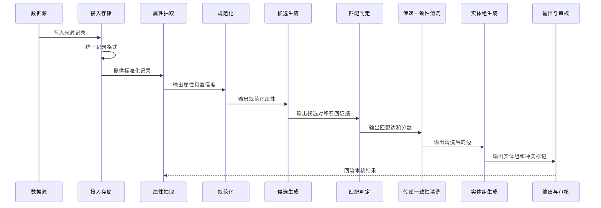

# 多来源商品数据合并系统设计

## 1. 背景与目标

本系统合并雷小安、腕表之家、奢当家等来源的商品数据。

每个来源提供品牌、分类和商品标题。标题没有统一格式。型号、规格、系列、材质等属性通常出现在标题中。系统不能为每个来源维护一套固定解析规则。

系统的目标是识别不同来源中代表同一官方商品变体的记录，并将这些记录合并为一个实体组。

### 1.1 术语

- **来源记录**：一个来源中的一条商品记录。记录由 `source_id` 和 `product_id` 唯一标识。
- **实体组**：代表同一官方商品变体的来源记录集合。
- **canonical 记录**：实体组中的代表记录。系统为每个字段保留字段来源。
- **官方变体**：由型号、尺寸、颜色、材质、机芯、版本或官方编码区分的商品版本。
- **未知字段**：字段缺失或抽取结果不可靠。未知不等于不一致。

不同官方变体不进入同一个实体组。`VARIANT_OF` 只表示商品变体关系，不参与实体组聚类。

### 1.2 合并规则

系统按以下顺序判断两个来源记录是否代表同一官方商品变体：

1. 如果两个记录的官方编码都存在且不同，系统不合并。
2. 如果两个记录的型号都可靠且不同，系统不合并。
3. 如果两个记录的品牌都存在且不同，系统不合并。
4. 如果关键区分属性都存在且不同，系统不合并。
5. 如果没有冲突，系统再使用字段相似度和语义相似度判断。
6. 如果关键字段缺失，系统只能在满足更严格条件时自动合并。其他情况进入人工复核。

关键区分属性如下：

| 商品类别 | 关键区分属性 |
| --- | --- |
| 腕表 | 表径、表壳材质、表盘颜色、机芯、版本 |
| 箱包 | 官方尺寸、材质、五金、版本 |

系统优先保证精度。系统宁可漏识别，也不自动合并不同的官方变体。

## 2. 设计原则与依据

### 2.1 设计原则

- 保留来源原文和原始字段。
- 将抽取、规范化、候选生成、匹配和聚类分开。
- 对每个自动合并结果保留理由和分数。
- 将低置信记录和冲突记录送入人工复核。
- 让增量处理保持幂等，并保持 `entity_id` 稳定。

### 2.2 参考流水线

本设计参考 `adityashah841/ecom-product-knowledge-graph` 的流水线思路：

1. 从商品标题抽取结构化属性。
2. 为候选记录计算语义相似度。
3. 根据匹配边生成实体组。

原项目在 75,000 条 Amazon 商品数据上验证了 BERT NER、`all-MiniLM-L6-v2`、FAISS、阈值扫描和知识图谱构建。本设计将这些思路扩展到多来源实体合并。

本设计的主要变化如下：

- 使用 GLiNER2 按 Schema 抽取属性。
- 使用 blocking 限制候选范围。
- 使用跨来源历史映射减少重复计算。
- 输出实体组、canonical 记录和人工审核证据。

## 3. 系统架构

系统分为四层：

| 层 | 主要职责 | 主要输出 |
| --- | --- | --- |
| 数据源层 | 提供商品记录 | 来源原始记录 |
| 接入与存储层 | 保存原始数据，统一记录格式 | `raw_records` |
| 计算层 | 抽取、规范化、候选生成、匹配和聚类 | 属性、候选对、匹配边、实体组 |
| 输出与审核层 | 提供查询、导出和人工复核 | JSON、结构化表、审核结果 |

## 4. 批处理时序

一次批处理按以下顺序执行：

## 5. 输入标准化

系统保留来源字段，并生成统一字段。

| 字段 | 说明 |
| --- | --- |
| `source_id` | 来源标识 |
| `product_id` | 来源内商品 ID |
| `brand` | 来源品牌字段，可以为空 |
| `category` | 来源分类字段，可以为空 |
| `title` | 原始商品标题，不改写 |
| `official_code` | 来源提供的官方 SKU 或 variant 编码，可以为空 |
| `raw` | 来源原始字段快照 |
| `raw_hash` | 原始记录内容的哈希值 |
| `ingested_at` | 接入时间 |

`source_id` 和 `product_id` 组成来源记录的唯一键。系统不使用单独的 `product_id` 作为全局键。

## 6. 属性抽取

### 6.1 GLiNER2 Schema

GLiNER2 使用动态 Schema 抽取属性。系统不为每个来源维护固定解析规则。

默认 Schema 如下：

| 类型 | 含义 |
| --- | --- |
| `brand` | 品牌 |
| `model` | 型号或 Reference |
| `series` | 系列或子系列 |
| `material` | 材质、表壳材质或表链材质 |
| `size` | 表径或官方尺寸 |
| `color` | 颜色或表盘颜色 |
| `hardware` | 箱包五金 |
| `movement` | 腕表机芯 |
| `version` | 版本或特殊款式 |
| `official_code` | 官方 SKU 或 variant 编码 |

每种类型维护一段描述。描述包含该类型的常见叫法。

抽取结果至少保存以下字段：

- 来源记录键。
- 实体类型。
- 原始实体文本。
- 规范化实体值。
- 置信度。
- 模型版本。
- 抽取时间。

### 6.2 低置信处理

如果关键属性的抽取置信度低于配置阈值，系统将记录放入低置信队列。

低置信记录不直接参与自动合并。系统可以为这些记录生成候选对，但结果必须进入人工复核。

第一阶段只验证中文标题的抽取效果。官方 base 模型以英文为主。只有在小样本验证不足时，系统才单独评估 adapter 或模型微调。

## 7. 型号和属性规范化

系统同时保存原始值和规范化值。规范化不覆盖原始值。

### 7.1 型号规范化

系统执行以下操作：

- 统一全角和半角字符。
- 统一大小写。
- 统一空格、连字符和斜杠。
- 去除 `ref`、`reference no`、`model no` 等前缀噪声。
- 保留型号后缀，因为后缀可能区分官方变体。

系统不删除无法证明为噪声的字母或数字。

### 7.2 属性规范化

系统为品牌、分类、材质、颜色、尺寸、五金和版本维护规范化词表。

不同来源的分类先映射到统一分类。缺失值保持为未知值。未知值不参与“不同”判断。

## 8. 候选对生成

百万级数据不能进行全量两两比较。系统使用两条候选路径。

### 8.1 精确候选路径

如果品牌、分类和规范化型号都存在，且三者相同，系统生成候选对。

### 8.2 语义候选路径

如果型号缺失或型号置信度低，系统在品牌和分类桶内使用 bge-m3 向量和 FAISS 进行 Top-K 语义召回。

如果品牌缺失，系统不能只使用分类和标题相似度自动合并。此类候选进入人工复核，除非型号和关键属性均可靠且没有冲突。

如果分类缺失，系统可以使用品牌和规范化型号生成候选。

系统为每个候选对保存生成路径，例如 `exact_model` 或 `semantic_top_k`。

两个来源已有人工确认的商品映射时，系统直接复用该映射。系统仍然保存映射版本和来源，不重复生成相同候选。

## 9. 匹配打分与判定

### 9.1 匹配证据

系统为每个候选对计算以下证据：

- 品牌一致性。
- 规范化型号一致性和编辑距离。
- 系列一致性。
- 关键属性的字段级相似度。
- 原始标题的语义相似度。
- 结构化文本的语义相似度。

如果官方编码、可靠型号或关键属性发生确定冲突，系统直接拒绝自动合并。

### 9.2 语义文本

系统为每条记录生成结构化文本。字段顺序固定为：

`品牌 | 型号 | 系列 | 材质 | 尺寸 | 颜色 | 五金 | 机芯 | 版本 | 官方编码`

系统使用固定字段标签，例如：

`品牌=Rolex|型号=126610LN|系列=Submariner|材质=钢|尺寸=41mm`

缺失字段直接省略。系统不同时使用“留空”和“省略”两种规则。

原始标题和结构化文本都使用 `BAAI/bge-m3` 编码。

### 9.3 相似度和阈值

系统分别计算：

- 稠密向量余弦相似度。
- 稀疏向量的加权词项相似度。
- 字段级相似度。

第一阶段使用可解释的加权规则。加权规则必须保存各项分数和权重。系统不能只保存一个总分。

系统使用三个判定区间：

| 区间 | 处理 |
| --- | --- |
| 高于自动合并阈值 | 自动合并 |
| 位于复核区间 | 进入人工复核 |
| 低于拒绝阈值 | 不合并 |

阈值通过黄金标签集调整。阈值、权重、模型版本和规则版本都写入匹配结果。

第二阶段可以使用黄金标签训练轻量分类器，例如逻辑回归或梯度提升树。分类器不能覆盖官方编码或可靠型号的硬冲突规则。

## 10. 实体组生成

### 10.1 传递一致性清洗

系统先用 NetworkX 或 Spark 找连通分量。对每个不少于三个节点的分量，系统检查隐含对。如果 A 匹配 B 且 B 匹配 C，系统计算 A 与 C 的相似度。

隐含对使用已存 bge-m3 向量直接计算，不重跑匹配流程。如果 A 与 C 低于匹配阈值，该三元组不一致。

系统从 A-B、B-C、A-C 中删除证据最弱的一条边。系统删除边后重新计算连通分量，重复直到无矛盾或达到迭代上限。

被删除的边写入 `removed_edges`。相关实体组标记为 `conflict` 并进入人工复核。系统不静默丢弃被删除的边。

### 10.2 实体组生成

实体组只使用产品节点和 `SAME_AS` 匹配边生成。品牌、分类和颜色等属性作为实体字段保存，不直接用于连通分量。

`VARIANT_OF` 表示不同官方变体之间的关系。该边不参与实体组聚类。

如果匹配边不存在确定冲突，系统可以使用连通分量生成实体组。

如果出现以下情况，系统不自动扩展实体组：

- A 与 B 匹配，B 与 C 匹配，但 A 与 C 存在确定冲突。
- 一个实体组包含两个不同的可靠型号。
- 一个实体组包含两个不同的官方编码。
- 一个实体组包含不一致的关键区分属性。

系统将冲突组标记为 `conflict`，并交人工复核。生产环境使用 Spark 的连通分量计算。NetworkX 只用于抽样和调试。

## 11. 输出和审核

每个实体组输出以下内容：

| 字段 | 说明 |
| --- | --- |
| `entity_id` | 稳定的统一实体 ID |
| `canonical_record_id` | canonical 记录的来源记录键 |
| `canonical` | 代表记录及字段来源 |
| `members` | 实体组中的来源记录 |
| `evidence` | 已接受匹配边的分数和理由 |
| `status` | `auto_accepted`、`review` 或 `rejected` |
| `conflict_flag` | 是否存在冲突 |
| `rule_version` | 匹配规则版本 |
| `model_version` | 抽取和向量模型版本 |

`candidate_pairs` 保存全部候选对。`entity_groups.evidence` 只保存进入实体组的匹配证据，避免重复保存全部候选。

人工审核至少支持以下操作：

- 接受合并。
- 拒绝合并。
- 拆分实体组。
- 将两个实体组合并。
- 标记错误属性。

审核结果回流为黄金标签，并保留审核人、审核时间和审核理由。

## 12. 数据模型

| 表名 | 用途 | 关键字段 |
| --- | --- | --- |
| `raw_records` | 保存来源原始记录 | `source_id`、`product_id`、`brand`、`category`、`title`、`official_code`、`raw_hash` |
| `extracted_attributes` | 保存抽取属性 | 来源记录键、类型、原始值、规范化值、置信度、模型版本 |
| `candidate_pairs` | 保存候选对和匹配证据 | 两个来源记录键、生成路径、各项分数、总分、判定、理由 |
| `entity_groups` | 保存实体组 | `entity_id`、canonical 记录键、状态、冲突标记、版本 |
| `entity_members` | 保存实体组成员 | `entity_id`、`source_id`、`product_id`、成员状态 |
| `removed_edges` | 保存传递一致性清洗删除的边 | 两个来源记录键、相似度、删除原因、清洗任务 |
| `review_events` | 保存人工审核历史 | 候选对或实体组、操作、理由、审核人、审核时间 |

系统使用 Spark 执行批处理，并将中间结果和最终结果写入 Iceberg。

原始数据和中间结果可以按来源或分类分区。实体组不能只按来源分区，因为一个实体组可以包含多个来源。

## 13. 增量处理

增量任务只处理新增记录、发生变化的记录及其候选邻域。

系统必须执行以下步骤：

1. 根据 `raw_hash` 判断记录是否发生变化。
2. 为新增或变化记录重新执行抽取和规范化。
3. 在相关 blocking 桶内重新生成候选。
4. 更新匹配边和实体组。
5. 保持未变化实体的 `entity_id` 不变。
6. 为拆分、合并和失效映射写入审核事件。

重复执行同一批增量数据不能生成重复实体组。

## 14. 部署与资源

- GLiNER2 第一阶段选择 200M 至 1B 参数量级的模型，并通过抽样测试确定具体版本。
- `BAAI/bge-m3` 使用量化版本降低 CPU 推理成本。
- 开发阶段使用 Spark local 或 DuckDB 跑通抽样数据。
- 生产阶段根据数据量选择 EMR、自建集群或托管 Spark。
- 语义召回使用 FAISS。CPU 上可使用 `IndexFlatIP` 或 HNSW。
- 生产环境记录抽取吞吐、候选数量、自动合并率、人工复核率和错误合并率。

## 15. 落地阶段

| 阶段 | 主要活动 | 交付物 | 通过条件 |
| --- | --- | --- | --- |
| 抽样验证 | 抽样、标注黄金标签、验证抽取和匹配 | 精确率和召回率报告 | 关键场景达到目标指标 |
| 全量批处理 | 全量写入 Iceberg，执行抽取、候选生成、匹配和聚类 | 实体组结果集 | 高风险结果进入人工复核 |
| 增量闭环 | 执行日常增量，回流审核结果 | 持续更新的商品库 | 重复运行不重复建组 |

大模型微调不属于第一阶段。第一阶段优先使用规则、阈值和轻量分类器。

## 16. 测试与评估

测试以端到端流程为主。输入是三来源样本，输出是实体组和审核状态。

关键场景包括：

- 相同型号和相同关键属性的跨来源记录合并。
- 不同型号不合并。
- 相同型号的不同标题写法合并。
- 缺失品牌或分类时进入正确的候选路径。
- 缺失字段不被错误地视为相等。
- 不同官方编码不合并。
- 不同颜色、尺寸、材质或版本不合并。
- A-B、B-C 匹配但 A-C 冲突时进入人工复核。
- 桥接边造成传递矛盾时，系统删除证据最弱边并标记复核。
- 增量任务重复执行时不重复建组。
- 历史人工映射可以被复用，并保留版本。

建议同时报告以下指标：

- 候选对精确率和召回率。
- 自动合并精确率。
- 实体组级别的完整匹配率。
- 实体组拆分错误率。
- 人工复核覆盖率。
- 每千条记录的候选数量和处理时间。

黄金标签必须记录正确的实体组、不同官方变体和未知字段。评估报告必须说明分母、样本范围和阈值版本。

## 17. 范围外

- 商品图片识别和图片比对。
- 电商平台发布和库存回写。
- GLiNER2 大模型微调。
- RAG 训练和部署。
- 第一阶段的全语种支持。
- 实时在线匹配 API。

## 18. 参考资料

- [ecom-product-knowledge-graph](https://github.com/adityashah841/ecom-product-knowledge-graph)
- [GLiNER2](https://github.com/fastino-ai/GLiNER2)
- [GLiNER2 电商 Schema 教程](https://github.com/fastino-ai/GLiNER2/blob/main/tutorial/4-combined.md)
- [Amazon ESCI 数据](https://github.com/amazon-science/esci-data)
- [Splink](https://github.com/moj-analytical-services/splink)
- [dedupe](https://github.com/dedupeio/dedupe)
