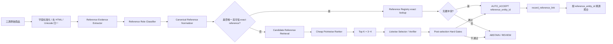

# ComEM：把“逐对猜同款”改造成“候选排序 → 多候选选择 → Reference 硬校验”的高精度实体匹配架构

## 0. 结论先行

本次从 `奢侈品文章调研.md` 中选取项目 / 论文 **ComEM — Match, Compare, or Select? An Investigation of Large Language Models for Entity Matching** 做深入分析。

- 项目：<https://github.com/tshu-w/ComEM>
- 论文：<https://aclanthology.org/2025.coling-main.8/>
- arXiv：<https://arxiv.org/abs/2405.16884>
- 目标需求：<https://app.notion.com/p/Spec-3bf7b2a8538b812fba00fb258024ff31>

分析前已先排除 `奢侈品调研/a` 中当前已有结果：

- `Ameli.md`
- `Confidence Classifiers with Guaranteed Accuracy or Precision.md`
- `DeepBlocker.md`
- `Fine-tuning large language models with contrastive margin ranking loss for selective entity matching in product data integration.md`
- `Large Scale Generative Multimodal Attribute Extraction for E-commerce Attributes.md`
- `Tailoring entity resolution for matching product offers.md`
- `TransClean - Finding False Positives in Multi-Source Entity Matching under Real-World Conditions via Transitive Consistency.md`
- `Using LLMs for the Extraction and Normalization of Product Attribute Values.md`
- `parts-distributor-sku-classifier.md`
- `pyJedAI.md`

`ComEM.md` 尚未存在，因此本次继续执行分析。

当前 Spec 的核心约束是：

1. 雷小安、腕表之家、奢当家三个来源；
2. 数据规模约 100 万～1000 万，并持续增量；
3. “同一个商品”的业务定义是 **同一个 reference number / 型号**；
4. reference 可能是结构化字段，也可能埋在标题、描述甚至图片里；
5. **precision 极端优先，绝对不能误匹配，允许漏匹配 / 拒识**；
6. 图片可用；
7. 可接受几百对人工黄金标注。

ComEM 对这个需求最有价值的地方，不是“用 GPT 做 Entity Matching”，而是它改变了判定问题的形态：

> **不要把每个候选 pair 独立二分类，而要先把候选缩小，再把多个相近候选同时放在上下文里做相对判断，并保留 none-of-the-above。**

但对当前腕表业务，必须再向前走一步：

> **不要让模型在“商品记录”之间决定谁是谁，而应该让一条记录去选择唯一的 `Reference Entity`。**

也就是说，推荐的生产主链路不是：

```text
record A × record B -> Match / NoMatch
```

而是：

```text
record
  -> reference evidence extraction
  -> candidate Reference Entity retrieval
  -> candidate ranking
  -> multi-candidate verification / selection
  -> hard safety gates
  -> reference_entity_id / ABSTAIN
```

最终两条记录被视为“同款”的条件是：

```text
record_a.reference_entity_id == record_b.reference_entity_id
```

而不是“模型觉得 A 和 B 很像”。

这是本次最建议直接落地的方案，本文下文称为 **RefComEM**。

---

# 1. ComEM 原项目解决什么问题

传统 LLM Entity Matching 通常是独立 pairwise 判定：

```text
(record, candidate_1) -> Yes / No
(record, candidate_2) -> Yes / No
(record, candidate_3) -> Yes / No
...
```

这种做法有两个根本问题。

## 1.1 独立二分类看不到候选之间的竞争关系

例如一个腕表标题：

```text
Rolex Submariner Date 126610LN black ceramic 41mm
```

召回候选可能是：

```text
C1 = 126610LN
C2 = 126610LV
C3 = 116610LN
C4 = 126613LN
```

如果逐对问模型：

```text
标题 vs C1 -> Yes
标题 vs C2 -> Yes
标题 vs C3 -> Yes
```

模型可能因为“Rolex / Submariner / 41mm / 黑盘”等大量共同语义而给多个候选 Yes。

但真正的任务不是三个独立问题，而是：

```text
这几个长得都很像的候选中，哪一个才是唯一 reference？
或者证据不足，一个都不要选？
```

这正是 ComEM 的核心出发点。

## 1.2 Entity Resolution 本身具有全局约束

ComEM 论文强调，独立 binary matching 会忽视 record relationships 的 global consistency。

虽然论文主要基于 clean-clean record linkage 的 one-to-one 场景，但这个思想对腕表更重要：

- 同品牌同系列相邻 reference 外观和文本高度相似；
- 误匹配通常不是“完全不相关”，而是“差一个后缀 / 一位数字 / 一代产品”；
- 要达到极高 precision，必须显式比较这些 hard negatives，而不能只看单个 pair 是否“够像”。

因此，**候选之间的相对关系** 本身就是强信息。

---

# 2. ComEM 的三种策略

论文把 LLM Entity Matching 分为三种代表策略：`Matching`、`Comparing`、`Selecting`。

## 2.1 Matching：逐对判断

项目 `src/matching_sq.py` 的 prompt 很直接：

```text
Do the two entity records refer to the same real-world entity?
Answer "Yes" if they do and "No" if they do not.
```

对于 anchor 与每一个 candidate 独立调用模型。

实现上，`MatchingSQ.score(..., use_prob=True)` 并不只看生成出的 Yes/No，而是分别计算：

```text
log P("Yes" | anchor, candidate)
log P("No"  | anchor, candidate)
```

然后把候选转成一个带正负号的分数，再通过 `pointwise_rank()` 排序。

核心代码逻辑可以概括为：

```python
for candidate in candidates:
    yes_prob = P("Yes" | anchor, candidate)
    no_prob  = P("No"  | anchor, candidate)
    score = +yes_prob if yes_prob >= no_prob else -no_prob

rank candidates by score desc
```

### 优点

- 每次上下文短；
- 易并行；
- 很适合做 first-stage ranking；
- 可直接得到每个候选的独立分数。

### 缺点

- 一个 anchor 可能同时得到多个 Yes；
- 完全不知道 C1 与 C2 是互相竞争的相邻 reference；
- 很容易把“相似”误当“相同”；
- 每个 candidate 都重复输入 anchor，成本随 `n` 线性增长。

对当前业务而言，**Matching 更适合作为排序器，不适合作为最终自动合并判决器**。

---

# 3. Comparing：候选两两比较

`src/comparing_sq.py` 不再问“是不是同一个”，而是问：

```text
Given entity record: anchor

Record A: candidate_a
Record B: candidate_b

Which is more likely to refer to the same real-world entity?
```

项目还专门做了一个值得借鉴的 anti-position-bias 处理：

对同一对候选同时问两次：

```text
anchor + [A, B]
anchor + [B, A]
```

然后综合：

```text
P(Record A | A,B)
P(Record B | A,B)
P(Record A | B,A)
P(Record B | B,A)
```

来削弱模型单纯偏爱第一位置 / 第二位置的问题。

项目提供三种候选排序方式：

### 3.1 `all`

所有候选两两比较：

```text
O(n²)
```

效果完整，但成本很高。

### 3.2 `bubble`

类似冒泡排序，只比较足够把 top-k 推到前面的候选。

### 3.3 `knockout`

类似淘汰赛，两两 PK，保留 winner，直到只剩 top-k。

论文进一步发现：虽然 Comparing 在最终识别上通常优于独立 Matching，但 **用于 ranking/filtering 时，Matching 反而比 Comparing 更合适**，而 Comparing 还可能做到 `O(n²)`。

所以 ComEM 最终并没有把 Comparing 作为默认的一阶段排序器。

这对当前系统很有价值：

> 不要因为“pairwise comparison 看起来更聪明”就把它放到百万级候选前置层；真正生产上应该把 expensive reasoning 留给很小的尾部候选。

---

# 4. Selecting：把所有候选放在同一个问题里，并允许 `[0]`

`src/selecting.py` 是 ComEM 最值得当前需求借鉴的模块。

它的 prompt 是：

```text
Select a record from the following candidates that refers to the same real-world entity as the given record.
Answer with the corresponding record number surrounded by "[]" or "[0]" if there is none.
```

结构大致为：

```text
Given entity record:
anchor

Candidate records:
[1] candidate_1
[2] candidate_2
[3] candidate_3
[4] candidate_4
...
```

然后：

```text
[1] / [2] / ... / [0]
```

其中：

```text
[0] = none of the above
```

这是和当前需求最契合的一点。

因为当前不是“recall 最大化”，而是：

```text
宁愿 NONE，也不能选错 reference
```

项目实现还有几个工程细节值得注意：

- `temperature=0.0`
- `seed=42`
- 输出最多 `max_tokens=3`
- 只接受 `\[(\d+)\]` 格式
- 非法输出直接当全部 False
- 使用 `diskcache` 缓存调用
- `thread_map(..., max_workers=16)` 并发执行
- `APICostCalculator` 记录 API token cost
- OpenAI 调用外层使用 `tenacity` 指数退避重试

这些都说明项目本身是按可复现实验 / 批量推理考虑的，而不是只展示一个 prompt demo。

---

# 5. ComEM：真正的核心是“先筛，再选”

`src/compound.py` 把前述策略组合成两阶段：

```text
candidate list
   |
   v
small / medium model ranking
   |
   v
Top-K
   |
   v
strong selector
   |
   v
selected candidate / NONE
```

默认配置是：

```python
ranking_model_name = "flan-t5-xl"
selecting_model_name = "gpt-4o-mini"
ranking_strategy = "matching"
```

实际论文实验中：

```text
1. 用 Flan-T5-XL 做 Matching ranking
2. 保留 top 4
3. 用更强模型做 Selecting
```

也就是：

```text
廉价局部判断负责“把正确答案推到前面”
昂贵全局判断负责“在几个难候选中做唯一选择”
```

这是典型的 funnel / cascade 架构。

## 5.1 为什么不是直接 Selecting 全部候选

论文指出 Selecting 有两个明显问题：

1. **position bias**：正确候选在列表后部时表现会明显下降；
2. **long context**：Blocking 为了高 recall 往往会给很多候选，全部塞进上下文会降低模型判断能力。

所以 ComEM 先用 ranking 把候选缩到一个很小的 `k`。

## 5.2 为什么 `k=4` 很重要

论文实验默认保留 top 4，再做 selection。

这并不表示当前腕表业务也必须固定 4，而是给了一个很好的工程启发：

> **最终高成本、强推理、全局比较阶段，候选应控制在个位数。**

对相邻 Rolex / Omega / Cartier reference 来说，Top 3～4 通常已经足以构造最难的 hard-negative set。

---

# 6. ComEM 的 Blocking 实现

项目 `src/blocking.py` 先用 `retriv.SparseRetriever` 建稀疏文本索引。

核心逻辑是：

```text
右表 records -> sparse index
左表 record  -> query
retrieve topK candidates
```

项目默认函数参数：

```python
topK = 20
```

实验数据构造阶段进一步把每个 anchor 截成 10 个候选。

然后会计算：

```text
Recall@K = ground-truth matches 被 blocking 找回的比例
```

论文正式实验采用 Sparkly 做 blocking，并给每个 anchor 取 top 10；8 个数据集的 Recall@10 约在 `86.57% ~ 99.96%`。

这一点对当前需求非常关键：

> **第二阶段无论多强，正确 reference 如果没有进入候选集，就永远选不到。**

但是当前业务 precision-first，因此候选召回层必须遵守一个安全原则：

```text
召回可以宽，接受必须严。
```

Blocking 允许有大量 false positives；最终 auto-link 不能因为“正确候选没召回”就退化成模糊匹配自动合并。

正确行为应该是：

```text
candidate not found -> ABSTAIN
```

而不是：

```text
candidate not found -> pick the most similar one anyway
```

---

# 7. 论文实验结果里，哪些结论对当前系统真正有用

论文在 8 个 ER 数据集和多种 LLM 上实验。

以 GPT-4o Mini 为例，论文 Table 4 的平均结果为：

| 方法 | Mean F1 | Cost |
|---|---:|---:|
| Matching | 67.80 | 0.46 |
| Matching 6-shot | 77.94 | 3.21 |
| Comparing | 84.36 | 1.21 |
| Selecting | 82.26 | 0.17 |
| **ComEM** | **86.42** | **0.09** |

这里最值得借鉴的不是绝对数字，而是三个趋势。

## 7.1 候选交互比独立二分类更有效

论文发现：

```text
Matching < Comparing / Selecting
```

说明让模型看到竞争候选，对 hard negative 区分非常重要。

腕表 reference 正好是这种问题：

```text
126610LN
126610LV
116610LN
126613LN
```

每个 pair 单独看都很像；放在一起比较，差异更显著。

## 7.2 Selecting 可能比逐对 Matching 更便宜

原因很简单。

逐对 Matching：

```text
anchor 重复输入 n 次
```

Selecting：

```text
anchor 只输入 1 次
```

论文指出 Selecting 能省掉 `n-1` 次重复输入 anchor 与 task instruction。

对大规模数据，这个 token 结构差异非常实际。

## 7.3 强模型不应该负责全部候选

ComEM 通过小 / 中模型 ranking + 强模型 selection，把成本和效果同时改善。

对当前系统应该进一步激进：

```text
绝大多数记录：规则 / exact index 直接处理
小部分 ambiguity tail：小模型排序
极小部分 hard cases：强 selector / 人工复核
```

也就是说，真正生产版应该是 **三级甚至四级 cascade**，而不是所有商品都调 LLM。

---

# 8. 为什么 ComEM 不能直接照搬到当前腕表需求

这是本次分析最重要的部分。

## 8.1 论文假设倾向于“一条 anchor 最多匹配一个 candidate record”

论文 Problem Formulation 明确利用了 one-to-one assumption。

但当前业务定义是：

```text
同 reference = 同款
```

这意味着同一个 reference 可以同时对应：

```text
雷小安记录 A1
雷小安记录 A2
腕表之家记录 B1
奢当家记录 C1
奢当家记录 C2
...
```

所以 **record-level one-to-one 不成立**。

正确建模方式不是：

```text
record -> one record
```

而是：

```text
many records -> one Reference Entity
```

因此必须把 ComEM 的 candidate 从“另一来源商品记录”改成：

```text
canonical Reference Entity candidates
```

## 8.2 当前业务身份定义比论文的“same real-world entity”更硬

论文面对的是通用 EM：

```text
两个 record 是否表示同一个现实实体？
```

当前业务已经给了更确定的定义：

```text
canonical reference number 相同才是同款
```

这意味着模型不应该拥有最终定义权。

LLM 可以：

- 抽取 reference；
- 判断某个数字是不是平台 SKU；
- 判断标题中的 reference 是“当前商品”还是“适配对象”；
- 在多个候选 reference 中找最合理的；
- 解释冲突。

但 LLM **不能**：

```text
因为图片很像 / 系列一样 / 文本高度相似
=> 自动把不同 reference 合并
```

## 8.3 F1 不是当前最核心指标

论文总体以 F1 为主。

当前 Spec 的目标却是：

```text
precision 极端优先
```

所以生产指标必须改成：

- auto-accept precision
- false positives per 1M auto-links
- hard-negative false positive rate
- abstain rate
- review rate
- candidate recall@k
- coverage under precision constraint

哪怕 recall 明显下降也没关系。

## 8.4 `[0]` 很好，但生产版仍然不够严格

ComEM 的 selector 能输出 `[0]`，这是很好的拒识机制。

但当前需求还需要：

```text
模型选了 candidate ≠ 系统就接受 candidate
```

中间必须再加 **硬安全门**。

---

# 9. 推荐直接落地：RefComEM

我建议把 ComEM 改造为：

> **Reference-first Compound Entity Matching**

简称 `RefComEM`。

整体架构：



其中最重要的是：

```text
LLM / ML 只存在于候选生成、排序、解释、审核层
Canonical Reference equality 才是身份主键
```

---

# 10. 第一层：Reference Evidence Extraction

不要直接把整条标题交给 matcher，而是先把 reference 证据结构化。

建议每一个抽取结果都保留 provenance：

```json
{
  "record_id": "ljx_123",
  "raw_value": "126610LN",
  "normalized_value": "126610LN",
  "source": "title",
  "extractor": "regex+ner-v3",
  "span_start": 18,
  "span_end": 26,
  "role": "product_reference",
  "polarity": "owned_by_current_product",
  "confidence": 0.997
}
```

不能只保留：

```text
reference = 126610LN
```

因为生产排错时必须知道：

- 是结构化字段抽出来的？
- 标题里抽出来的？
- OCR 看出来的？
- LLM 猜出来的？
- 是当前商品的型号还是“适配 126610LN”的配件说明？

## 10.1 建议的证据优先级

从高到低可以是：

```text
P0 可信结构化 reference 字段
P1 官方 / 品牌规则验证后的标题 exact span
P2 描述中的明确 reference span
P3 OCR / 表背 / 保卡 / 吊牌 reference
P4 LLM 从自由文本中推断的候选
P5 图片视觉相似产生的候选
```

注意：

```text
P4 / P5 不能单独触发 auto-link
```

它们只能进入候选 / review 路径。

---

# 11. 第二层：Reference Role Classifier

这是腕表 / 二奢场景非常容易被忽略的一层。

标题里出现一个 reference，不代表这个 reference 一定属于当前商品。

例如：

```text
适配劳力士 126610LN 的橡胶表带
```

如果只做 regex：

```text
126610LN -> 抽取成功
```

然后直接 exact join，会把一条表带链接到 Rolex 126610LN 腕表实体，形成灾难性 false positive。

所以每个候选编号都必须分类角色：

```text
product_reference
compatible_with_reference
mentioned_reference
seller_sku
platform_sku
inventory_id
serial_number
unknown_identifier
```

只有：

```text
role == product_reference
```

才允许进入自动匹配主路径。

这一步可以用：

- 规则；
- 小文本分类器；
- LLM；
- 规则 + 模型 ensemble。

但输出必须保留 span 与上下文，支持审计。

---

# 12. 第三层：Canonical Reference Normalizer

腕表 reference 不宜直接对原字符串做 raw exact match。

例如：

```text
126610 LN
126610-LN
126610LN
ref. 126610LN
Ref#126610LN
```

应该规范到：

```text
126610LN
```

但 normalizer 必须非常保守。

推荐分为两类规则。

## 12.1 安全规范化

可以直接执行：

```text
Unicode NFKC
trim
uppercase
删除明确的 "REF", "REFERENCE", "型号" 前缀
删除允许的空格 / 连字符分隔符
全角数字转半角
```

## 12.2 不安全规范化

不能静默执行：

```text
O -> 0
I -> 1
S -> 5
B -> 8
```

这些更像 OCR correction。

正确处理方式应该是：

```text
原值保留
+ 产生 correction candidate
+ 标记 correction_type
+ 进入 ambiguous path
```

而不是把它直接当 canonical truth。

---

# 13. Reference Registry：把“同款”建成真正的实体层

建议建立独立 `reference_entity` 表。

## 13.1 `reference_entity`

```sql
reference_entity (
    id                  bigint primary key,
    brand_id            bigint not null,
    canonical_reference varchar not null,
    series_id           bigint null,
    model_name          varchar null,
    status              varchar not null,
    created_at          timestamp,
    updated_at          timestamp,
    unique (brand_id, canonical_reference)
)
```

不要只拿 reference 字符串全局唯一，因为不同品牌理论上可能存在相同短编号。

身份主键建议是：

```text
(brand_id, canonical_reference)
```

## 13.2 `reference_alias`

```sql
reference_alias (
    reference_entity_id bigint,
    alias                varchar,
    alias_type           varchar,
    source               varchar,
    confidence           numeric,
    approved             boolean
)
```

例如：

```text
canonical: 126610LN
alias: 126610-LN
alias: 126610 LN
```

只允许经过可解释规则 / 人工确认的 alias 进入正式自动匹配。

---

# 14. 直接通道：能 exact 就不要走 LLM

大量商品其实不应该走 ComEM 式模型。

如果一条商品有：

```text
brand = ROLEX
reference structured field = 126610LN
role = product_reference
normalization = 126610LN
registry exact hit = unique
no conflicting reference evidence
```

那么可以直接：

```text
AUTO_ACCEPT(reference_entity_id)
```

不需要：

- embedding；
- cross encoder；
- LLM；
- 图片相似度。

这是同时提高 precision、吞吐和成本效率的最重要优化。

ComEM 应只处理：

```text
ambiguous tail
```

---

# 15. Candidate Retrieval：把 ComEM 的 record blocking 改成 Reference blocking

原项目：

```text
anchor record -> topK candidate records
```

推荐改为：

```text
record evidence -> topK candidate Reference Entities
```

## 15.1 候选生成顺序

建议优先使用高精度索引：

```text
1. brand + exact normalized reference
2. brand + approved alias
3. brand + series + reference token prefix/suffix
4. brand + OCR edit candidate
5. brand + model name / series + lexical retrieval
6. visual retrieval 只用于补候选，不用于接受
```

## 15.2 一定先做 brand blocking

不同品牌之间不要因为 reference 字符串 / 数字相似进入自动候选。

例如：

```text
Rolex 116500LN
某品牌 116500
```

视觉或字符检索可能很近，但业务上不该混。

品牌不确定时：

```text
ABSTAIN / REVIEW
```

比跨品牌模糊匹配安全得多。

---

# 16. Cheap Pointwise Ranker：保留 ComEM 的第一阶段，但不必照搬 Flan-T5

ComEM 用 `MatchingSQ.pointwise_rank()` 作为第一阶段排序器，这个设计应该保留。

但当前领域的数据结构更强，可以先做一个更便宜、可解释的 ranker。

推荐特征：

```text
f1 exact_reference_match
f2 approved_alias_match
f3 brand_match
f4 series_match
f5 model_name_match
f6 reference_edit_distance
f7 prefix/suffix consistency
f8 OCR evidence support
f9 structured_field_support
f10 title_span_support
f11 description_support
f12 incompatible / accessory context
f13 conflicting_reference_count
f14 seller_sku_probability
f15 image_retrieval_similarity   # 只作排序辅助
```

可以先用：

```text
rule score / logistic regression / LightGBM
```

而不是一开始就用 3B LLM。

原因：

- latency 更低；
- 可解释；
- 几百条黄金样本就能校准；
- 输入是结构化证据，不需要强语言生成能力；
- 当前第一阶段只负责排序，不负责最终接受。

如果简单模型不够，再升级为小 cross-encoder / instruction-tuned LM。

---

# 17. Top-K：只把真正的 hard negatives 留给 selector

推荐：

```text
K = 3~4
```

而不是 10、20、100。

示例：

```text
Anchor evidence:
brand = ROLEX
extracted_ref = 126610LN
series = Submariner

Top candidates:
C1 126610LN
C2 126610LV
C3 116610LN
C4 126613LN
```

这时 selector 才真正有价值。

因为它看到的是：

```text
“相近 reference 之间必须做唯一选择”
```

而不是在 100 个明显不相关候选里找答案。

---

# 18. Listwise Selector：生产版不要只输出一个编号

ComEM 原项目为了实验简单，只输出：

```text
[0] / [1] / [2] / ...
```

当前系统建议输出受约束结构：

```json
{
  "selected_candidate_id": "REF_126610LN",
  "decision": "SELECT",
  "supporting_evidence": [
    "title exact span: 126610LN",
    "brand exact: ROLEX"
  ],
  "conflicts": [],
  "requires_review": false
}
```

或者：

```json
{
  "selected_candidate_id": null,
  "decision": "NONE",
  "supporting_evidence": [],
  "conflicts": [
    "title says 126610LN",
    "OCR says 126610LV"
  ],
  "requires_review": true
}
```

但要强调：

> selector 输出只是一个 **proposal**，不是最终 auto-accept。

最终还要过 Post-selection Hard Gates。

---

# 19. Selector Prompt 应该从“商品全文”升级成“证据包 + 候选 reference”

不建议把所有标题、描述、OCR 原文无脑塞进 prompt。

推荐输入：

```text
Task:
Choose exactly one canonical product reference only when the evidence proves
that the current product itself uses that reference.
Choose NONE if evidence is conflicting, indirect, accessory-related, or insufficient.

Record evidence:
- brand: ROLEX (structured, confidence=1.0)
- title: Rolex Submariner Date 126610LN 41mm
- extracted identifiers:
  - 126610LN | role=product_reference | source=title | confidence=0.998
  - 116610LN | role=mentioned_reference | source=description | context="对比上一代" | confidence=0.92
- OCR identifiers: none

Candidates:
[1] ROLEX / 126610LN / Submariner Date
[2] ROLEX / 126610LV / Submariner Date
[3] ROLEX / 116610LN / Submariner Date

Return one candidate ID or NONE.
```

这种 prompt 比“这两个商品是不是同款”更符合业务定义。

---

# 20. Post-selection Hard Gates：真正保证 precision 的地方

建议把以下规则写成不可被模型绕过的 invariant。

## Gate 1：唯一候选

```text
AUTO_ACCEPT => exactly one reference_entity candidate
```

如果两个候选无法安全区分：

```text
ABSTAIN
```

## Gate 2：必须存在显式 reference 证据

```text
AUTO_ACCEPT => at least one high-confidence product_reference evidence
```

不能仅凭：

- 图片像；
- 系列名相同；
- 文案语义相似；
- LLM 常识。

## Gate 3：canonical equality

```text
AUTO_ACCEPT => normalized extracted reference == candidate canonical reference
```

如果只靠 edit distance 才能对上：

```text
进入 ambiguous path
```

## Gate 4：高可信冲突一票否决

例如：

```text
structured reference = 126610LN
OCR = 126610LV
```

即使 selector 选了 126610LN，也不要自动接受。

```text
conflict -> REVIEW
```

## Gate 5：编号角色必须正确

```text
compatible_with_reference
seller_sku
platform_sku
```

都不能进入 auto-link。

## Gate 6：品牌必须一致

```text
record.brand_id == reference_entity.brand_id
```

品牌不确定时宁可拒识。

## Gate 7：LLM alone 不可自动合并

可以明确成代码 invariant：

```text
if only_evidence_source == "llm_inference":
    return ABSTAIN
```

## Gate 8：visual similarity alone 不可自动合并

```text
if only_evidence_source == "image_similarity":
    return ABSTAIN
```

图片只能：

- OCR reference；
- 提供候选；
- 发现冲突；
- 帮人工复核。

不能代替 reference identity。

---

# 21. 推荐的数据模型

## 21.1 原始商品

```sql
product_record (
    id,
    source,
    source_record_id,
    title,
    description,
    brand_raw,
    structured_reference_raw,
    images,
    raw_payload,
    content_hash,
    updated_at
)
```

## 21.2 Reference 证据事实表

```sql
reference_evidence (
    id,
    record_id,
    raw_value,
    normalized_value,
    source_type,          -- structured/title/description/ocr/llm
    source_location,
    role,
    polarity,
    extractor_version,
    confidence,
    context_snippet,
    created_at
)
```

## 21.3 Canonical Reference

```sql
reference_entity (
    id,
    brand_id,
    canonical_reference,
    series_id,
    model_name,
    status,
    version
)
```

## 21.4 候选与排序结果

```sql
reference_candidate (
    record_id,
    reference_entity_id,
    retrieval_reason,
    rank_score,
    ranker_version,
    rank_position
)
```

## 21.5 最终链接

```sql
record_reference_link (
    record_id,
    reference_entity_id,
    decision,             -- AUTO_ACCEPT / REVIEW_ACCEPT / REJECT / ABSTAIN
    decision_reason,
    resolver_version,
    evidence_snapshot,
    created_at,
    superseded_at
)
```

约束：

```text
一条 record 同一时刻最多一个 active reference_entity_id
一个 reference_entity_id 可以挂很多 records
```

这正好修正了 ComEM 原论文偏 one-to-one 的假设。

---

# 22. 建议的 Resolver 接口

核心接口应该很简单：

```python
ResolutionDecision resolve(ProductRecord record)
```

返回：

```python
class ResolutionDecision:
    decision: Literal[
        "AUTO_ACCEPT",
        "ABSTAIN",
        "REVIEW",
        "REJECT",
    ]
    reference_entity_id: int | None
    reason_codes: list[str]
    evidence_ids: list[int]
    candidate_ids: list[int]
    resolver_version: str
```

业务上不要直接返回：

```text
similarity = 0.93
```

因为 similarity 很容易被误用为“0.93 就合并”。

更安全的是明确决策态：

```text
AUTO_ACCEPT
ABSTAIN
REVIEW
REJECT
```

---

# 23. 关键伪代码

```python
def resolve(record):
    evidence = extract_reference_evidence(record)
    evidence = classify_identifier_roles(evidence)
    evidence = normalize_references(evidence)

    hard_conflicts = detect_hard_conflicts(evidence)
    if hard_conflicts:
        return REVIEW("CONFLICTING_HIGH_CONFIDENCE_REFERENCE", evidence)

    strong_refs = unique_high_conf_product_refs(evidence)

    # Fast path: unique, explicit, exact reference.
    if len(strong_refs) == 1:
        ref = strong_refs[0]
        exact = registry.lookup_exact(record.brand_id, ref.value)
        if exact is not None and passes_static_gates(record, evidence, exact):
            return AUTO_ACCEPT(exact.id, "EXACT_REFERENCE")

    # Ambiguous tail.
    candidates = retrieve_reference_candidates(record, evidence)
    if not candidates:
        return ABSTAIN("NO_REFERENCE_CANDIDATE")

    ranked = ranker.rank(record, evidence, candidates)
    topk = ranked[:4]

    proposal = selector.select_or_none(record, evidence, topk)
    if proposal is None:
        return ABSTAIN("SELECTOR_NONE")

    if not passes_post_selection_hard_gates(record, evidence, proposal):
        return REVIEW("POST_SELECTION_GATE_FAILED")

    return AUTO_ACCEPT(proposal.id, "AMBIGUOUS_VERIFIED_REFERENCE")
```

这里要特别注意：

```text
selector.select_or_none()
```

只是倒数第二步。

真正的 auto-link 仍然由 deterministic gate 决定。

---

# 24. 10M 级数据为什么这个架构比 pairwise matching 更合适

假设：

```text
N = 商品记录数
q = 进入 ambiguous tail 的比例
K = selector 前保留候选数
```

如果直接做 pairwise：

```text
调用规模 ~ N × K
```

而 RefComEM：

```text
exact fast path: 大部分记录 0 次 LLM
ambiguous ranker: qN × K 的廉价计算
selector: qN 次强模型调用
```

如果 `q` 被 reference exact path 压得足够低，整体成本会非常可控。

更重要的是，**整个系统不需要做三源全量笛卡尔积**：

```text
雷小安 × 腕表之家 × 奢当家
```

都统一映射到：

```text
Reference Registry
```

于是跨源匹配变成：

```sql
SELECT ...
FROM source_a a
JOIN source_b b
  ON a.reference_entity_id = b.reference_entity_id
```

复杂度和解释性都会好很多。

---

# 25. 增量更新架构

Spec 明确要求持续增量，因此 resolver 必须 versioned + idempotent。

推荐：

```text
crawler event
   -> raw product upsert
   -> content_hash compare
   -> only changed record enters resolver
```

每次记录：

```text
extractor_version
normalizer_version
registry_version
ranker_version
selector_version
resolver_version
```

这样当：

- 新增某品牌 reference alias；
- 更新 OCR 模型；
- 修复某个 role classifier；

不需要全库盲目重跑，只重算受影响 records。

## 25.1 建议的 cache key

借鉴 ComEM 的 `diskcache` 思路，线上缓存不要只按 prompt 字符串。

建议：

```text
hash(
  record_evidence_snapshot,
  candidate_reference_ids,
  registry_version,
  model_version,
  prompt_version
)
```

只要任何一个关键版本变化，就自然 cache miss。

---

# 26. 图片应该放在哪一层

当前 Spec 有图片，但 precision-first 场景里图片不能变成“第二套同款定义”。

推荐图片只进入三种能力。

## 26.1 OCR Reference

从：

- 表背；
- 保卡；
- 吊牌；
- 盒标；

抽 reference。

输出仍然进入统一 `reference_evidence`。

## 26.2 Candidate Retrieval

图片 embedding 可以用于：

```text
“可能属于哪个系列 / 哪几个 reference”
```

但只能补 candidate。

## 26.3 Conflict Veto

例如文本说：

```text
126610LN
```

但图像 OCR 明确读到：

```text
126610LV
```

应该：

```text
REVIEW
```

而不是取平均分。

---

# 27. 典型失败案例与系统行为

## Case A：明确 reference

```text
品牌：Rolex
标题：劳力士潜航者 126610LN 全套
```

处理：

```text
extract -> 126610LN
exact registry hit -> unique
no conflict
=> AUTO_ACCEPT
```

不调 LLM。

## Case B：同系列相邻型号

```text
标题：Rolex Submariner Date 126610 黑盘
```

候选：

```text
126610LN
126610LV
```

没有可靠后缀：

```text
=> ABSTAIN / REVIEW
```

不能因为黑盘图片像 LN 就自动选。

## Case C：配件标题

```text
适配 Rolex 126610LN 表带
```

抽到：

```text
126610LN
```

role classifier：

```text
compatible_with_reference
```

结果：

```text
=> REJECT auto-link
```

## Case D：OCR 一位混淆

```text
title: 126610LN
OCR: 12661OLN
```

OCR normalizer 可能生成 correction candidate：

```text
126610LN
```

因为 title 有强证据，可支持接受。

但如果只有 OCR：

```text
=> REVIEW
```

## Case E：结构化字段与标题冲突

```text
structured reference: 126610LN
title reference: 126610LV
```

即使结构化字段通常优先，也不建议静默覆盖。

```text
=> REVIEW
```

## Case F：同一 reference 多条商品

```text
A1 -> 126610LN
A2 -> 126610LN
B1 -> 126610LN
C1 -> 126610LN
```

全部：

```text
reference_entity_id = R123
```

这是合法 many-to-one，不应套用 ComEM 原始 one-to-one record 假设。

---

# 28. 几百条人工黄金标签应该怎么花

不要随机抽几百 pair。

应该优先标最容易导致 false positive 的边界场景。

建议组成：

```text
约 35%：同品牌同系列相邻 reference hard negatives
约 20%：reference 格式 / alias / 空格 / 连字符正样本
约 15%：配件 / 兼容型号 / 被提及型号
约 10%：seller SKU / platform SKU / reference 角色混淆
约 10%：OCR 混淆
约 10%：字段互相冲突 / 缺字段 / 多 reference
```

同时要避免随机 train/test 泄漏。

更建议按：

```text
brand + reference family
```

做 group split。

这样才能测试真正的 unseen reference / adjacent-reference 泛化。

---

# 29. 评测指标必须从 F1 改成 precision-first

## 29.1 主指标

```text
Auto-Accept Precision
```

即：

```text
自动发布的链接中有多少是真正同 canonical reference
```

## 29.2 生产安全指标

建议同时监控：

```text
false_positive_per_1m_auto_links
hard_negative_false_positive_rate
abstain_rate
review_rate
auto_accept_coverage
candidate_recall@K
```

## 29.3 Candidate Recall@K

这个指标来自 ComEM / Blocking 思路，非常重要。

因为：

```text
正确 candidate 不在 Top-K
=> selector 再强也没用
```

但 candidate recall 不够时，解决方法是改 retrieval，而不是放松 auto-accept gate。

---

# 30. 线上监控建议

至少需要以下 dashboard。

## 30.1 Reference Extractor

```text
records_with_structured_ref_ratio
records_with_title_ref_ratio
records_with_ocr_ref_ratio
multiple_ref_ratio
reference_role_unknown_ratio
```

## 30.2 Candidate Layer

```text
candidate_set_size_p50/p95/p99
candidate_recall@1/@4/@10
no_candidate_rate
```

## 30.3 Resolver

```text
auto_accept_rate
abstain_rate
review_rate
conflict_gate_rate
selector_none_rate
```

## 30.4 Precision Sentinel

每天 / 每批次固定抽检：

```text
random auto-accept samples
hard-negative auto-accept samples
new-brand samples
new-reference samples
```

如果出现任意高危 false positive，自动降低相关品牌 / 规则版本的自动接受权限。

---

# 31. ComEM 原代码如何直接映射到当前实现

## 31.1 `src/blocking.py`

原项目：

```text
SparseRetriever(record text) -> candidate records
```

改造：

```text
ReferenceCandidateRetriever(evidence) -> candidate reference entities
```

优先 exact / alias index；BM25 / 向量只作为 fallback。

## 31.2 `src/matching_sq.py`

原项目：

```text
Yes/No log probability -> pointwise rank
```

改造：

```text
ReferenceRanker.score(record_evidence, reference_entity)
```

保留 `pointwise_rank` 思路，但模型可以先用 LightGBM / cross encoder。

## 31.3 `src/comparing_sq.py`

不建议放在主路径。

如果某些品牌存在高度相似二选一难题，可以把 comparing 作为：

```text
offline analysis / review assistant
```

而不是 10M 级实时 ranking。

## 31.4 `src/selecting.py`

这是最值得复用的部分。

保留：

```text
候选同时出现
NONE option
确定性输出
cache
retry
```

改掉：

```text
自由 record text -> 结构化 evidence package
candidate record -> candidate Reference Entity
[0] -> NONE / REVIEW
```

## 31.5 `src/compound.py`

保留总体骨架：

```text
rank -> topK -> select
```

新增：

```text
pre-gates
post-gates
audit log
versioning
```

最终：

```text
exact fast path
   OR
rank -> topK -> select -> hard verify
```

---

# 32. 推荐代码目录

```text
reference_resolver/
├── models.py
├── extractor/
│   ├── structured.py
│   ├── regex.py
│   ├── ner.py
│   └── ocr.py
├── role_classifier/
│   ├── rules.py
│   └── model.py
├── normalizer/
│   ├── generic.py
│   └── brand_rules.py
├── registry/
│   ├── repository.py
│   └── alias_index.py
├── retrieval/
│   ├── exact.py
│   ├── lexical.py
│   └── visual.py
├── ranking/
│   ├── features.py
│   └── ranker.py
├── selecting/
│   ├── prompt.py
│   ├── llm_selector.py
│   └── parser.py
├── gates/
│   ├── pre.py
│   └── post.py
├── resolver.py
├── review_queue.py
├── audit.py
└── metrics.py
```

这样各层都可以单独升级，避免把所有逻辑塞进一个 matcher。

---

# 33. 推荐的决策 reason codes

为了排错和统计，结果不能只有 `true/false`。

建议 reason code：

```text
EXACT_STRUCTURED_REFERENCE
EXACT_TITLE_REFERENCE
APPROVED_ALIAS_REFERENCE
AMBIGUOUS_VERIFIED_REFERENCE
NO_REFERENCE_EVIDENCE
NO_REFERENCE_CANDIDATE
MULTIPLE_REFERENCE_CONFLICT
BRAND_CONFLICT
REFERENCE_ROLE_NOT_PRODUCT
OCR_ONLY_UNVERIFIED
LLM_ONLY_UNVERIFIED
VISUAL_ONLY_UNVERIFIED
SELECTOR_NONE
SELECTOR_GATE_FAILED
UNKNOWN_BRAND
```

这样可以直接统计系统为什么拒识，以及下一阶段应该优化哪里。

---

# 34. 为什么这个方案比“商品 embedding + 阈值”更适合

如果直接做：

```text
title/image embedding
cosine > threshold
=> same product
```

腕表会遇到最危险的 false positive：

```text
同品牌
同系列
同尺寸
同材质
外观几乎一样
但 reference 不同
```

这类样本在 embedding 空间里天然距离很近。

而当前业务恰恰规定：

```text
reference 不同 = 不是同款
```

所以 embedding 最适合做：

```text
candidate retrieval
```

不适合做 identity authority。

ComEM 的“先候选、再相对选择”已经比单阈值好；RefComEM 再把最终 authority 收回到 canonical reference，才真正符合 Spec。

---

# 35. 为什么这个方案比“所有 pair 都让 GPT 判断”更适合

全 pair GPT 有几个问题：

```text
计算量大
anchor 重复输入
独立判断互相矛盾
同系列 hard negatives 容易多个 Yes
无法天然维护 reference registry
难审计
```

RefComEM：

```text
绝大多数 exact 直接处理
只对 ambiguity tail 调模型
候选一起比较
允许 NONE
最终 deterministic hard gate
```

同时解决成本、全局一致性与误合并风险。

---

# 36. 一套可以立即开始做的 MVP

## Phase 1：不使用 LLM 的 Reference-first baseline

先做：

```text
brand canonicalization
reference extraction
reference role rules
reference normalization
reference registry
exact join
conflict abstain
```

这一步就应该先得到一个 **极高 precision、较低 coverage** 的系统。

目标不是覆盖全部，而是建立安全基线。

## Phase 2：Ambiguous Candidate Ranker

对无法 exact 的记录：

```text
candidate retrieval
feature ranker
Top 4
```

先 shadow，不自动合并。

评估：

```text
candidate recall@4
hard-negative ranking quality
```

## Phase 3：Listwise Selector

接入 ComEM 风格 selector：

```text
Top 4 + NONE
```

仍然只做 shadow / review recommendation。

## Phase 4：硬门放行少量 ambiguity case

只对满足：

```text
显式 reference 证据
唯一 canonical candidate
无冲突
角色正确
高 precision 验证通过
```

的 selector 结果开放 auto-accept。

其余继续 ABSTAIN。

---

# 37. 最建议优先实现的 8 条 Safety Invariants

可以直接写成测试。

```text
Invariant 1:
AUTO_ACCEPT -> record has exactly one active reference_entity_id

Invariant 2:
AUTO_ACCEPT -> candidate canonical reference is supported by explicit reference evidence

Invariant 3:
AUTO_ACCEPT -> no high-confidence contradictory product_reference evidence

Invariant 4:
AUTO_ACCEPT -> brand is compatible with reference entity brand

Invariant 5:
AUTO_ACCEPT -> identifier role is product_reference

Invariant 6:
LLM-only evidence -> never AUTO_ACCEPT

Invariant 7:
visual-similarity-only evidence -> never AUTO_ACCEPT

Invariant 8:
ambiguous multiple canonical references -> ABSTAIN or REVIEW
```

如果这 8 条始终成立，即使上层模型升级 / 降级，也不容易越过业务底线。

---

# 38. 测试集应该重点覆盖的腕表 hard cases

至少包括：

```text
同系列不同代
同系列不同颜色后缀
同系列不同材质后缀
reference 少一位 / 多一位
空格 / 连字符 / 大小写差异
OCR O/0、I/1 混淆
标题中出现多个 reference
“上一代 / 对比 / 兼容 / 适配”上下文
表带 / 配件 / 盒证
平台 SKU 长得像 reference
同 reference 多来源多 listing
品牌缺失但型号看似唯一
文本 reference 与图片 OCR 冲突
```

这些 case 才是 precision 风险最大的地方。

---

# 39. 对 ComEM 本身的技术评价

## 最值得借鉴

### 1. 从 pairwise binary matching 转成 candidate-set reasoning

这是非常适合相邻 reference hard-negative 的思路。

### 2. `NONE` / `[0]` 拒识

与 precision-first 强契合。

### 3. 小模型 ranking + 强模型 selection

非常适合大规模 funnel。

### 4. Matching 用于 ranking，Selecting 用于 final identification

任务分工清晰。

### 5. cache / retry / cost accounting

具备批量工程意识。

## 不应直接照搬

### 1. record-level one-to-one

当前应该改成 many-records-to-one-reference。

### 2. 通用 “same real-world entity” prompt

当前应该强制围绕 canonical reference。

### 3. F1 优先

当前要改成 precision constrained coverage。

### 4. selector 直接决定结果

当前必须增加 deterministic post-gates。

### 5. 所有 ambiguity 都依赖 LLM

当前可以优先用规则 / 小模型，LLM 只处理最难尾部。

---

# 40. 最终推荐架构

最终我建议把系统定义为：

```text
Reference Resolution System
而不是
Generic Product Matching System
```

完整路径：

```text
                    ┌────────────────────┐
                    │  Source A/B/C Raw  │
                    └─────────┬──────────┘
                              │
                    ┌─────────▼──────────┐
                    │ Normalize & Parse  │
                    └─────────┬──────────┘
                              │
                    ┌─────────▼──────────┐
                    │ Reference Evidence │
                    │ text/field/OCR     │
                    └─────────┬──────────┘
                              │
                    ┌─────────▼──────────┐
                    │ Role Classification│
                    └─────────┬──────────┘
                              │
                    ┌─────────▼──────────┐
                    │ Canonicalization   │
                    └─────────┬──────────┘
                              │
                   ┌──────────▼───────────┐
                   │ Unique exact hit?    │
                   └───────┬───────┬──────┘
                           │yes    │no
                           │       │
              ┌────────────▼─┐   ┌─▼──────────────────┐
              │ Hard Gates   │   │ Candidate Retrieval│
              └──────┬───────┘   └─────────┬──────────┘
                     │                     │
                     │            ┌────────▼─────────┐
                     │            │ Cheap Ranker     │
                     │            └────────┬─────────┘
                     │                     │ Top 3~4
                     │            ┌────────▼─────────┐
                     │            │ Listwise Selector│
                     │            │ + NONE           │
                     │            └────────┬─────────┘
                     │                     │
                     │            ┌────────▼─────────┐
                     │            │ Post Hard Gates  │
                     │            └────────┬─────────┘
                     │                     │
                     └──────────┬──────────┘
                                │
                       ┌────────▼─────────┐
                       │ reference_entity │
                       │ id / ABSTAIN     │
                       └────────┬─────────┘
                                │
                       ┌────────▼─────────┐
                       │ Cross-source Join│
                       └──────────────────┘
```

一句话概括：

> **ComEM 给出的正确启发是“候选集交互 + 两阶段 cascade + none-of-the-above”；当前业务真正应该落地的是把候选对象从 record 改成 canonical Reference Entity，并用硬规则把 LLM 限制在排序 / 消歧 / 审核位置。**

---

# 41. 最小落地决策

如果只能先做一个版本，我会按下面优先级：

```text
P0：Reference Registry + 强规则抽取 + exact join + conflict abstain
P1：Reference role classifier，先解决“适配型号 / 平台 SKU”误识别
P2：候选 Reference retrieval + cheap pointwise ranker
P3：ComEM 风格 Top-4 listwise selector + NONE，仅 shadow
P4：通过黄金集验证后，只给满足硬门的 ambiguity case 开 auto-accept
P5：OCR / 图片加入 evidence 与 conflict veto，不作为 identity authority
```

如果 P0 已经能覆盖相当一部分商品，就不要为了追求 recall 过早把 LLM 判定开放到自动合并路径。

---

# 42. 最终结论

ComEM 证明了一个很重要的工程方向：

```text
独立 pairwise matching
    ↓
候选集内比较 / 选择
    ↓
先排名过滤，再做精细选择
```

它尤其适合解决“多个候选都非常相似，但实际只能有一个答案”的 hard-negative 场景。

这与腕表同系列相邻 reference 极其同构。

但当前 Spec 的业务定义比通用 Entity Matching 更明确，所以生产方案应该进一步收紧：

```text
ComEM
    ↓
RefComEM
```

即：

```text
record -> canonical Reference Entity
```

而不是：

```text
record -> similar record
```

最终自动接受必须满足：

```text
显式 reference 证据
+ canonical reference 一致
+ brand 一致
+ 编号角色正确
+ 无高可信冲突
+ 唯一候选
```

模型只负责把难候选排好、放在一起比较、选择或拒识；**模型永远不能因为“整体很像”而覆盖 reference 硬规则。**

在“100 万～1000 万、持续增量、precision 极端优先”的约束下，这是比通用 pairwise LLM matching 更安全、成本更低、也更容易解释与运维的路线。

---

# 参考资料

1. Wang et al. **Match, Compare, or Select? An Investigation of Large Language Models for Entity Matching.** COLING 2025.  
   <https://aclanthology.org/2025.coling-main.8/>
2. ComEM 官方代码：  
   <https://github.com/tshu-w/ComEM>
3. ComEM `blocking.py`：  
   <https://github.com/tshu-w/ComEM/blob/main/src/blocking.py>
4. ComEM `matching_sq.py`：  
   <https://github.com/tshu-w/ComEM/blob/main/src/matching_sq.py>
5. ComEM `comparing_sq.py`：  
   <https://github.com/tshu-w/ComEM/blob/main/src/comparing_sq.py>
6. ComEM `selecting.py`：  
   <https://github.com/tshu-w/ComEM/blob/main/src/selecting.py>
7. ComEM `compound.py`：  
   <https://github.com/tshu-w/ComEM/blob/main/src/compound.py>
8. 当前需求 Spec：  
   <https://app.notion.com/p/Spec-3bf7b2a8538b812fba00fb258024ff31>
