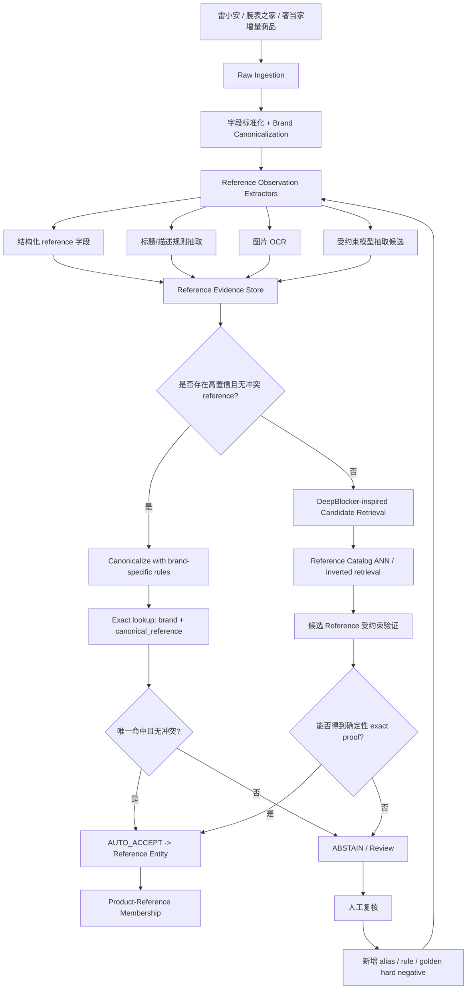

# DeepBlocker：从深度学习 Blocking 到二奢腕表 Reference 实体链接的落地方案

## 0. 结论先行

本次从 `奢侈品文章调研.md` 中选取 **DeepBlocker** 进行深入分析。

- 项目：<https://github.com/qcri/DeepBlocker>
- 论文：<https://www.vldb.org/pvldb/vol14/p2459-thirumuruganathan.pdf>
- 目标需求：<https://app.notion.com/p/Spec-3bf7b2a8538b812fba00fb258024ff31>

DeepBlocker 最值得借鉴的不是“用深度学习直接判断两个商品是不是同一个”，而是把大规模 Entity Matching 拆成两个阶段：

1. **Blocking / Candidate Retrieval**：先用低成本方法把不可能匹配的 pair 大量排除，只留下一个很小的候选集合；
2. **Matching / Verification**：再用更严格的规则或模型决定是否真的匹配。

但对当前需求，必须进一步做一次问题重构：

> 需求已经把“同一个商品”定义为“同一个 reference number / 型号”。因此最安全、最便宜的系统不是做 100 万～1000 万商品之间的通用 pairwise entity matching，而是把每条商品记录 **链接到一个全局 Reference Entity（参考号实体）**。

也就是说，把：

```text
商品 A  <-> 商品 B 是否相同？
```

改造成：

```text
商品 A -> Reference Entity X
商品 B -> Reference Entity X
=> 二者相同
```

在这个重构后，DeepBlocker 只放在“reference 缺失 / 埋在标题 / OCR 有噪声”的疑难路径里做 **候选 Reference 召回**，绝不能直接作为最终自动合并条件。

推荐的最终原则是：

> **Embedding 负责“找候选”，Reference 的确定性证据负责“放行”，任何冲突都拒识（abstain）。**

这比直接训练一个 pairwise matcher 更符合 Spec 中“precision 极端优先、宁可漏匹配、绝对不能误匹配”的要求。

---

## 1. DeepBlocker 的技术目标

DeepBlocker 解决的是 Entity Matching 里的 Blocking 问题。

如果左右两个数据集分别有 `N` 和 `M` 条记录，直接两两比较需要 `N × M` 次匹配。百万级数据的笛卡尔积不可接受，所以 Blocking 的目标是：

- 尽可能保留真实 match；
- 同时尽可能缩小 candidate set；
- 下游 matcher 只处理 candidate set。

论文关注的核心指标因此不是最终 matching precision，而是：

- Blocking Recall：真实匹配有多少被候选集保留下来；
- Candidate Set Size / CSSR：候选集压缩程度。

这与当前需求非常关键的一点不同：

- DeepBlocker 优先保证 **候选不要漏**；
- 当前业务最终决策优先保证 **绝对不要错合并**。

因此 DeepBlocker 最适合作为当前系统的 Recall Layer，而不是 Decision Layer。

---

## 2. DeepBlocker 的整体架构

论文把深度 Blocking 拆成三个可替换模块：

```text
原始 tuple
   │
   ▼
Word / Subword Embedding
   │
   ▼
Tuple Embedding
   │
   ▼
Vector Pairing / Top-K Search
   │
   ▼
Candidate Pairs
```

### 2.1 Word Embedding

项目当前实现默认使用预训练 fastText，把 token 转成 300 维向量。

fastText 的好处是 subword/character n-gram 对 OOV 和拼写噪声相对鲁棒，这也是它适合脏数据 Blocking 的原因。

但对当前中文二奢场景，仓库配置中的 `wiki.en.bin` 不应直接使用：

- 雷小安、奢当家商品标题很可能中文占比高；
- Reference 是字母、数字、连字符混合的 identifier，不是普通自然语言词语；
- `126610LV`、`126610LN` 这类相邻 reference 在语义 embedding 中可能非常接近，但业务上必须严格区分；
- embedding 对“相似字符串”友好，正好与最终 precision-first 判定的诉求相反。

所以在我们的系统里，embedding 只能帮助召回，Reference 原文及规范化值必须作为独立的结构化强特征保留。

### 2.2 Tuple Embedding

DeepBlocker 研究了多类 Tuple Embedding。

#### SIF / Average

先把 tuple 中每个 token 转成词向量，再做平均或加权平均。SIF 会降低高频 token 权重，并去掉主要公共方向。

优点：简单、便宜、无监督。

缺点：会弱化属性边界和 identifier 的离散语义。

#### AutoEncoder

仓库的 AutoEncoder 路径大致是：

```text
tuple text
 -> fastText token vectors
 -> SIF 300d tuple vector
 -> Encoder: 300 -> 300 -> 150
 -> Decoder: 150 -> 300 -> 300
 -> 用 150d Encoder 输出做 tuple embedding
```

训练目标是重建输入 tuple embedding，属于 self-supervised，不依赖人工 match label。

论文实验中，AutoEncoder 在 structured / dirty 数据上整体表现较好，而且训练成本相对低。

#### CTT（Cross-Tuple Training）

CTT 的思路更接近“自监督构造匹配任务”：

1. 对一个 tuple 随机删除部分 token，生成 synthetic positive；
2. 随机抽其他 tuple 作为 synthetic negative；
3. 左右 tuple 经过共享的 Siamese summarizer；
4. 对两侧 embedding 做差，再训练二分类器；
5. 训练完成后，取 summarizer 的输出作为 tuple embedding。

目标是让“同一条记录的扰动版本”更近、随机记录更远。

这个思路对脏文本 Blocking 很有启发，但对 Reference 有一个明显风险：

> 随机删除 token 的正样本增强可能恰好把 reference 删除，而模型仍被要求认为它是正样本。

在通用 EM 里这是合理鲁棒性增强；在当前业务里却会训练模型“即使型号证据不存在，也可以认为相同”，这与 precision-first 的最终判定原则相冲突。

所以 CTT 类自监督可以用于 **候选召回 embedding**，但不应训练成最终 matcher。

#### Hybrid

Hybrid 先训练 AutoEncoder，再把 AutoEncoder encoder 作为 CTT 的 aggregator，最后再接 Siamese summarizer。

概念上：

```text
in-tuple self reconstruction
        +
cross-tuple discrimination
```

它在文本型数据上更有价值，但训练和部署复杂度更高。

对于当前项目，没有必要一开始就使用 Hybrid。因为我们的主要难点是 reference 提取、规范化、角色识别和冲突拒识，而不是通用语义相似度。

### 2.3 Vector Pairing

DeepBlocker 的第三个模块是 Vector Pairing：把左右记录的 embedding 做近邻检索，输出每条记录的 Top-K 候选。

论文实验使用过 FAISS 做 Top-K cosine search；但当前 GitHub 仓库暴露的 `ExactTopKVectorPairing` 是直接使用 `scipy.spatial.distance.cdist` 计算完整相似度矩阵，然后每行排序取 Top-K。

这意味着复杂度近似：

```text
时间：O(N × M × D)
空间：O(N × M)
```

对百万级更不用说千万级完全不可直接使用。

例如即使只考虑 100 万 × 100 万，完整 pair 数已经是 10^12，根本不可能构造 dense cosine matrix。

生产实现必须把该模块替换成 ANN / inverted index，例如：

- FAISS HNSW / IVF；
- 其他支持 cosine / inner product 的 ANN 服务；
- 或者 Elasticsearch/OpenSearch 中的结构化倒排 + 向量候选。

但对于当前需求，更优的做法不是给 1000 万商品全部建 ANN 两两找邻居，而是：

> **只给数量小得多的 Reference Catalog 建索引，让每个商品去链接 Reference Entity。**

这可以把问题从 product-product matching 变成 product-reference retrieval。

---

## 3. 对 GitHub 当前实现的代码级审查

下面是直接阅读 `qcri/DeepBlocker` 当前 `main` 分支后，认为不能原样拿来生产的几个点。

### 3.1 `deep_blocker.py`：属性直接拼成一个字符串

当前流程会：

1. 把 `cols_to_block` 中所有非 id 字段转字符串；
2. 缺失值填空；
3. 直接空格拼接成 `_merged_text`；
4. 丢弃原来的属性列；
5. 对 `_merged_text` 做 embedding。

这非常适合做论文里的统一 Blocking 实验，但不适合当前高风险 identifier matching。

问题：

- `brand`、`reference`、`platform_sku`、`seller_sku` 被混到一起后，模型不知道字段角色；
- 某个平台内部货号可能长得非常像 reference；
- 配件标题可能出现“适配 126610LN”，但这个 reference 并不代表当前售卖实体；
- 一个字段里的明确 reference 与另一个字段里的冲突 reference 可能被整体语义向量平均掉。

我们的落地实现必须保留字段边界，并把 identifier 类字段从普通文本 embedding 流程剥离。

### 3.2 `vector_pairing_models.py`：ExactTopK 不可扩展

`ExactTopKVectorPairing.query()` 当前会计算 query embedding 与整个 index embedding 的全量 cosine matrix，再排序。

这是 demo / 小数据集实现，不是 100 万～1000 万级生产实现。

必须替换为 ANN 或结构化 inverted retrieval。

### 3.3 CTT 当前代码路径没有真正使用训练后的 summarizer 输出

这是阅读代码时发现的一个非常重要的实现偏差。

`CTTTupleEmbedding.preprocess()` 会训练 `self.ctt_model`，但当前 `get_tuple_embedding()` 返回的是 SIF embedding tensor，而没有调用训练后的 `ctt_model` 的 Siamese summarizer。

类似地，`HybridTupleEmbedding` 虽然训练了 CTT 阶段，但最终 `get_tuple_embedding()` 返回的是 AutoEncoder 产生的 embedding，没有继续经过训练后的 CTT summarizer。

而论文描述的 CTT / Hybrid 正确思路应该是：训练后使用 summarizer 输出作为最终 tuple embedding。

所以如果真的复用此仓库，需要修正成类似：

```python
base = aggregator(...)
embedding = trained_ctt_summarizer(base)
return embedding
```

当前 main 分支代码不建议直接当作 CTT/Hybrid 生产基线。

### 3.4 GPU device 路径也需要重构

`dl_models.py` 会在 CUDA 可用时把模型放到 GPU，但 `get_tuple_embedding()` 一侧存在直接对 tensor 调 `.numpy()`、以及输入 tensor device 未统一的问题。

生产实现应显式：

```text
input -> model.device
model output -> detach -> cpu -> numpy
```

否则 GPU 环境容易遇到 device mismatch 或 CUDA tensor 无法直接转 numpy 的问题。

### 3.5 候选集使用的是 DataFrame 行号，而不是稳定业务 ID

`topK_neighbors_to_candidate_set()` 最终把矩阵行位置转成 `ltable_id/rtable_id`。

生产环境里必须保留：

- source；
- source_item_id；
- internal_product_id；
- version / updated_at；
- embedding/index version。

否则增量更新、重放、删除、索引重建都会很难保证可追踪性。

---

## 4. 当前需求真正应该怎么建模

### 4.1 不做“商品 pair 匹配”，做“Reference Entity Linking”

当前 Spec 已经规定：

> 同一个商品 = 同一 reference number / 型号。

那么系统可以有一个全局 Reference Registry：

```text
Reference Entity
- ref_entity_id
- brand_id
- canonical_reference
- known_aliases
- series
- model_name
- valid_patterns
- status
```

每一条平台商品，只需要回答一个问题：

```text
这条商品的 reference 是哪个？
```

只要两条商品链接到同一个 `ref_entity_id`，就可以视为匹配。

这样可以消除大量 pairwise matching 的复杂度，也天然适合持续增量更新。

### 4.2 为什么必须额外带 brand

虽然业务定义只说 reference，但生产唯一键建议是：

```text
(brand_id, canonical_reference)
```

而不是裸 `canonical_reference`。

原因：

- 不同品牌可能存在相同或高度相似的数字编号；
- brand 是非常低成本的强冲突条件；
- 加 brand 不会降低同品牌 reference 的匹配能力，却能降低跨品牌误合并风险。

如果后续业务确认 reference 在全行业全局唯一，也仍然建议把 brand 作为校验维度，而不是删除。

---

## 5. 推荐生产架构



这个架构的核心不是模型多强，而是明确区分：

- **Observation**：某个渠道观察到了什么字符串；
- **Candidate**：它可能对应哪个 reference；
- **Proof**：是否有足够强的确定性证据；
- **Decision**：自动接受 / 拒识 / 人工。

---

## 6. Reference 抽取层

建议同时运行多个 extractor，但不要把它们简单平均成一个总分。

### 6.1 Structured Field Extractor

优先级最高。

如果平台有独立型号/reference 字段：

- 保留原值；
- 保留字段名和来源；
- 只做非常保守的规范化；
- 不允许模型覆盖这个字段，只允许产生冲突告警。

### 6.2 Title / Description Rule Extractor

针对每个品牌维护 pattern registry，例如：

```text
brand_id
regex_pattern
allowed_length
allowed_prefix
separator_policy
negative_context_patterns
```

抽取时必须同时识别“编号角色”，区分：

- 品牌 reference / model number；
- 平台 SKU；
- 商家内部货号；
- 库存号；
- 配件兼容型号；
- 证书号 / 序列号。

对于当前任务，这个“identifier role classification”比训练一个通用相似度 matcher 更重要。

### 6.3 OCR Extractor

图片可用是很大的优势，但 OCR 只能作为 Observation，不直接判 match。

适合 OCR 的图片：

- 表背；
- 保卡；
- 吊牌；
- 包装标签；
- 证书。

需特别处理字符混淆：

```text
O / 0
I / 1 / l
S / 5
B / 8
Z / 2
```

OCR 最适合的用法不是“看起来像就匹配”，而是：

> 已知候选 reference 后，检查图片 OCR 是否能提供一致证据或冲突证据。

### 6.4 模型抽取器

LLM / sequence model 可以用于：

- 从标题中标出“最可能是 reference 的 substring”；
- 给 identifier 做 role 分类；
- 在受限候选集合里选择可能 reference；
- 解释冲突。

但 **model-only reference 不进入 AUTO_ACCEPT**。

模型输出只能进入候选或人工复核。

---

## 7. Canonicalization：必须保守，不要“清洗过头”

Reference canonicalization 是整套系统最容易制造灾难性 false positive 的地方。

### 7.1 安全操作

可优先考虑：

- Unicode NFKC；
- 英文字母大写；
- 去首尾空格；
- 统一已被品牌规则确认等价的分隔符；
- 全角数字转半角。

### 7.2 高风险操作

下面这些操作不能全局启用：

- 无条件删除所有 `-`、`.`、`/`；
- 无条件删除前缀/后缀；
- 无条件去掉 leading zero；
- fuzzy edit-distance 后直接认为等价；
- 把 `LN/LV/BLNR` 之类 suffix 当噪声删掉；
- “只保留数字”。

这些都可能把不同 reference 归并到一起。

因此 canonicalization 应是：

```text
global-safe-normalization
        +
brand-specific equivalence rules
```

而不是一个全站字符串清洗函数。

### 7.3 保存原始证据

永远同时保存：

```text
raw_value
normalized_value
normalizer_version
extractor
source_field
image_id / text_span
```

这样任何一次规则升级都可以追溯和重放。

---

## 8. Precision Gate：最终自动放行规则

建议把最终决策做成显式 Rule Engine，不让 embedding 分数直接决定 AUTO_ACCEPT。

### 8.1 可以自动接受的典型情况

**路径 A：结构化字段强证据**

```text
brand 已规范化
AND structured reference 可通过 brand pattern 校验
AND canonical_reference 唯一命中 Reference Registry
AND 标题 / OCR 没有发现冲突 reference
=> AUTO_ACCEPT
```

**路径 B：独立证据一致**

```text
标题规则抽取 reference = X
AND OCR/保卡抽取 reference = X
AND brand 一致
AND registry 中 X 唯一
AND 无任何高置信冲突
=> AUTO_ACCEPT
```

### 8.2 必须拒识的情况

只要满足任意一条，进入 `ABSTAIN/REVIEW`：

- 同一商品抽到两个不同 reference；
- 标题 reference 与结构化字段冲突；
- OCR 与结构化字段冲突；
- reference 只能由模型自由生成得到；
- reference 是模糊 OCR 修复出来的，但无第二证据；
- title 中出现多个“兼容/适用” reference；
- identifier role 不确定；
- brand 不一致；
- canonicalization 需要高风险变换才能相等；
- ANN 只给出高相似候选，但原始文本中找不到确定性 proof。

### 8.3 决策输出不要只有 true/false

建议：

```text
AUTO_ACCEPT
ABSTAIN
HUMAN_ACCEPT
HUMAN_REJECT
```

并保存 `decision_reason` 与全部 evidence。

---

## 9. DeepBlocker 在新架构中的正确位置

DeepBlocker-inspired 模块只处理疑难记录。

### 9.1 检索对象改为 Reference Catalog

不要：

```text
10M 商品向量 <-> 10M 商品向量
```

而要：

```text
商品向量 -> Reference Catalog 向量
```

Reference Catalog 每条实体可以有：

- canonical reference；
- brand；
- series；
- model_name；
- 历史 alias；
- 高质量样例标题；
- 可选代表图像 embedding。

商品只需要检索 Top-K reference candidates。

### 9.2 Blocking 输入字段

不要像原项目那样把所有字段无差别拼接。

建议构造两套表示：

#### Structured blocking key

```text
brand_id
series_id(optional)
reference_prefix(optional)
category
```

用于先缩小大桶。

#### Semantic retrieval text

```text
brand canonical name
series
model keywords
title cleaned text
```

明确排除：

- 平台 SKU；
- seller SKU；
- 库存号；
- 已判定为配件兼容号的 reference；
- 营销噪声。

### 9.3 ANN 只负责 Top-K

ANN 可以把疑难商品召回到 Top 10～30 个 Reference Entity。

然后再做：

1. 受约束 substring/alias 验证；
2. OCR 针对候选 reference 做定向比对；
3. brand/reference pattern 验证；
4. 冲突检测。

只有最后重新得到 exact proof 才能 AUTO_ACCEPT。

这使 ANN 即使召回错了，也不会直接造成 false merge。

---

## 10. 建议的数据模型

### 10.1 `product_raw`

```text
internal_product_id
source
source_item_id
source_updated_at
raw_payload
content_hash
ingest_version
```

唯一键建议：

```text
(source, source_item_id)
```

### 10.2 `reference_observation`

```text
observation_id
internal_product_id
channel               # structured/title/description/ocr/model
source_location       # field name / text span / image id
raw_value
normalized_value
identifier_role
extractor_version
confidence_bucket
is_conflict
created_at
```

### 10.3 `reference_entity`

```text
ref_entity_id
brand_id
canonical_reference
series
model_name
status
created_at
updated_at
```

强唯一约束：

```text
UNIQUE (brand_id, canonical_reference)
```

### 10.4 `reference_alias`

```text
brand_id
alias
canonical_reference
rule_source
reviewed_by
valid_from
```

Alias 必须经过人工或离线高精验证才能进入 AUTO_ACCEPT 路径。

### 10.5 `product_reference_link`

```text
internal_product_id
ref_entity_id
decision
reason_code
evidence_json
resolver_version
created_at
```

### 10.6 `review_case`

```text
case_id
internal_product_id
candidate_ref_entity_ids
conflict_summary
priority
review_result
reviewer
```

---

## 11. 增量更新架构

100 万～1000 万数据规模且持续更新，必须把 resolver 设计成 idempotent incremental pipeline。

### 11.1 事件粒度

每条更新统一成：

```text
ProductUpsert {
  source,
  source_item_id,
  source_updated_at,
  content_hash,
  payload
}
```

如果 `content_hash` 未变化，可以跳过 reference 重新解析。

### 11.2 处理流程

```text
upsert raw
 -> normalize brand
 -> extract observations
 -> detect conflicts
 -> exact reference lookup
 -> if unresolved: candidate retrieval
 -> precision gate
 -> write membership / review case
```

每一步都保存 `version`，方便规则或模型升级后 selective replay。

### 11.3 Reference Catalog 增量

新增 reference 时：

1. 插入 `reference_entity`；
2. 更新 exact lookup index；
3. 更新 ANN / search index；
4. 不需要对全部历史商品做 O(N²) 重匹配；
5. 只重放之前 `ABSTAIN` 且与新 reference block 相关的记录。

这就是 entity-linking 架构相对 pairwise matcher 的最大工程收益之一。

---

## 12. 评测体系：不要只看 F1

当前需求中，F1 很可能会误导。

推荐分别衡量：

### 12.1 Extraction Precision

每种渠道单独统计：

```text
structured_ref_precision
title_rule_precision
ocr_ref_precision
model_candidate_precision
```

### 12.2 Auto-Accept Precision

最重要指标。

```text
auto_accept_precision
false_auto_merge_count
```

目标应是持续追求 `false_auto_merge_count = 0`，并在扩大 coverage 时始终守住 precision。

注意：黄金集上观察到 0 个 FP 不等于数学上证明线上永远 0 FP，因此还需要 deterministic gate、hard negative 集和线上抽检共同防御。

### 12.3 Coverage / Abstain Rate

```text
auto_accept_coverage
abstain_rate
human_review_rate
```

Recall 可以通过逐步减少 abstain 提升，但绝不能通过放松 exact proof 换取。

### 12.4 Blocking Recall

只评估 DeepBlocker-inspired fallback：

```text
真实 reference 是否出现在 Top-K candidate 中
```

而不要把 Top-K 命中率误认为最终匹配准确率。

---

## 13. 几百对人工黄金标签怎么用最划算

不要把几百对标签平均随机抽样。

应优先标注 hard negatives：

1. 同品牌、同系列、reference 只差 1 个字符；
2. 同一外观但尺寸/材质/机芯不同 reference；
3. `126610LN` vs `126610LV` 这类相邻型号；
4. 商品标题里出现配件兼容 reference；
5. 平台 SKU 看起来像 reference；
6. 一个标题同时出现当前型号和对比型号；
7. OCR 中 `0/O`、`1/I` 等混淆；
8. 结构化字段和标题冲突；
9. 同 reference 不同标点/空格写法；
10. 新品牌 / 新来源 / 新标题模板。

建议把黄金集拆成：

```text
Gold Positive
Hard Negative
Conflict Cases
OCR Cases
Long-tail / New-brand Cases
```

系统上线门槛应重点看 Hard Negative 上是否出现 false accept。

---

## 14. 推荐的直接落地路径

### P0：建立 Reference Registry 与审计样本

先不要上复杂 matcher。

做三件事：

1. 从已有三源数据统计 reference 字段覆盖率；
2. 抽取品牌分布与高频 reference pattern；
3. 建第一版 `(brand, canonical_reference)` registry。

这一步通常已经能自动解决大量结构化 reference 完整的数据。

### P1：规则优先的 High Precision Resolver

实现：

```text
Brand canonicalizer
Reference role classifier（规则优先）
Brand-specific parser
Conservative normalizer
Conflict detector
Exact registry lookup
Precision gate
```

只自动接受非常确定的记录。

### P2：接入 DeepBlocker-inspired Candidate Retrieval

只对 P1 的 `ABSTAIN` 记录运行。

建议：

- structured block 先按 brand/category/series 缩小；
- semantic encoder 只生成候选；
- ANN index 建在 Reference Catalog 上；
- Top-K 后回到 deterministic verifier；
- 没有 exact proof 继续 abstain。

### P3：加入 OCR

对高价值但文本缺 reference 的腕表图片运行 OCR。

OCR 结果进入 `reference_observation`，与文本证据做一致性/冲突判断。

### P4：人工反馈闭环

人工审核结果优先沉淀为：

- reference alias；
- brand parser rule；
- negative-context rule；
- hard-negative regression case。

不要只把反馈拿去训一个黑盒 classifier。

对于“绝不能误匹配”的业务，**可审计规则资产**往往比单纯扩大模型更有价值。

---

## 15. 一个可直接实现的 Resolver 伪代码

```python
def resolve_product(product):
    brand = canonicalize_brand(product)
    observations = extract_reference_observations(product, brand)

    strong = select_strong_observations(observations)
    conflicts = detect_reference_conflicts(strong)

    if conflicts:
        return ABSTAIN("REFERENCE_CONFLICT", observations)

    proven_ref = conservative_consensus(strong, brand)

    if proven_ref:
        entity = exact_reference_lookup(brand, proven_ref)
        if entity and no_negative_context(product, proven_ref):
            return AUTO_ACCEPT(entity, observations)

    candidates = retrieve_reference_candidates(
        brand=brand,
        product=product,
        top_k=20,
    )

    for candidate in candidates:
        proof = verify_candidate_with_text_ocr_and_rules(
            product=product,
            candidate=candidate,
            brand=brand,
        )
        if proof.is_exact and proof.no_conflict:
            return AUTO_ACCEPT(candidate, proof.evidence)

    return ABSTAIN("NO_DETERMINISTIC_PROOF", observations, candidates)
```

关键点：

```text
retrieve_reference_candidates() 可以是 DeepBlocker/ANN
AUTO_ACCEPT() 不能由 ANN similarity 直接触发
```

---

## 16. DeepBlocker 如果要复用，建议改造的模块

### 16.1 替换 `preprocess_datasets`

不要 flatten 所有字段。

输出至少两类对象：

```text
structured_features
semantic_text
```

Reference observation 单独走强规则管线。

### 16.2 修正 CTT / Hybrid 输出

如果继续研究 CTT/Hybrid，需要确保最终 embedding 真正经过训练后的 Siamese summarizer，而不是只返回其前级 SIF/AutoEncoder embedding。

同时补 GPU device test。

### 16.3 替换 `ExactTopKVectorPairing`

抽象成：

```python
class VectorIndex:
    def upsert(ids, vectors): ...
    def delete(ids): ...
    def query(vectors, top_k, filters=None): ...
```

生产实现使用可增量 ANN，并支持 brand/category filter。

### 16.4 Candidate Set 输出稳定 ID

必须输出业务主键，不使用 DataFrame row index。

```text
internal_product_id
ref_entity_id
retrieval_score
retrieval_model_version
rank
```

### 16.5 训练语料改造

如果做 self-supervised embedding，正样本增强不能随机删除 reference 强字段后仍标正。

推荐把增强分成：

```text
semantic augmentation：可删营销词、顺序扰动
identifier augmentation：只允许已验证等价的空格/分隔符变体
```

Reference 本体必须保护。

---

## 17. 方案与原 DeepBlocker 的关系

可以把最终方案理解为“保留 DeepBlocker 的分层思想，但改变决策中心”。

| DeepBlocker 原设计 | 当前项目改造 |
|---|---|
| tuple -> embedding | product -> 多路 reference observations + semantic embedding |
| 两表 Top-K pair | product -> Reference Catalog Top-K |
| Blocking 追求 recall | Candidate retrieval 追求 recall |
| 下游 matcher 决策 | deterministic reference verifier 决策 |
| 属性直接拼接 | identifier / semantic field 分离 |
| Exact cosine demo | ANN / inverted retrieval |
| 通用 entity matching | reference entity linking |
| 模型可决定相似 | 模型只能提候选，不可越过 exact proof |

---

## 18. 最终推荐

对于当前 Spec，我不建议把工作重点放在“训练一个很强的商品 pair 匹配模型”。

最值得直接落地的是：

1. **建立全局 Reference Registry**；
2. 把每条商品做 **Reference Entity Linking**；
3. 结构化字段、标题、OCR 产生独立 reference observations；
4. 采用品牌级保守 canonicalization；
5. 用显式 conflict detector 和 abstain gate 保护 precision；
6. DeepBlocker/ANN 只负责给疑难记录召回少量候选 Reference；
7. 最终 AUTO_ACCEPT 必须重新得到 reference 的 exact / deterministic proof；
8. 把人工审核优先沉淀成 alias、parser rule、hard negative，而不是只用于黑盒训练。

如果只做一个 MVP，我会选择：

```text
Reference Registry
+ Brand-specific Rule Parser
+ Conservative Normalizer
+ Exact Lookup
+ Conflict/Abstain Gate
+ Review Queue
```

这版甚至可以完全不依赖深度模型，就先覆盖高置信样本并把误匹配风险压到最低。

随后再把 DeepBlocker-inspired ANN Candidate Retrieval 加到 `ABSTAIN` 分支，提高 recall/coverage，而不改变最终 precision gate。

这条路线既吸收了 DeepBlocker 对大规模 Blocking 的核心思想，也比直接复用它的通用 embedding + Top-K 架构更符合“同 reference 才算相同、绝不能误匹配”的业务定义。