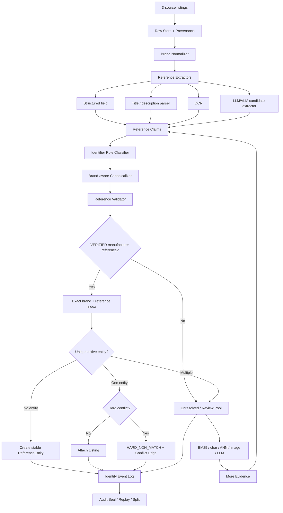

# GoldenMatch：把实体匹配“模型结果”升级为可审计的 Reference-first 身份控制平面

## 0. 结论先行

本次从 `奢侈品文章调研.md` 中选取尚未分析的开源项目 **GoldenMatch** 做深入分析。

- 调研项目：<https://github.com/benseverndev-oss/goldenmatch>
- 当前需求：<https://app.notion.com/p/Spec-3bf7b2a8538b812fba00fb258024ff31>
- 本次输出：`奢侈品调研/a/GoldenMatch.md`

分析前已检查 `奢侈品调研/a`。已有结果包括 `catalog-forge`、`DeepBlocker`、`pyJedAI`、`ComEM`、`LangExtract`、`ALMSER-GB`、`Shoptera MCP` 等 31 篇，**没有 `GoldenMatch.md`**，因此本次继续执行。

当前 Spec 的业务约束非常明确：

1. 数据来自雷小安、腕表之家、奢当家三个来源；
2. 规模约 100 万～1000 万，且会持续增量；
3. “同一个商品”被定义为 **同一个 manufacturer reference / 型号**；
4. reference 可能是结构化字段，也可能埋在标题、详情甚至图片中；
5. 图片可用；
6. 可以人工标几百对黄金样本；
7. 最重要的是 **precision-first：宁可漏匹配，也绝不能误匹配**。

GoldenMatch 最值得借鉴的地方，不是它“零配置 fuzzy matching / Fellegi-Sunter / LLM matcher”本身，而是它把实体解析系统拆成两个职责完全不同的层：

```text
Identity Compute Engine
    block → score → cluster
    高吞吐、无状态、可替换

Identity Control Plane
    stable entity id
    source record ownership
    provenance
    conflict
    merge / split
    append-only event log
    tamper-evident audit
    persisted blocking index
    incremental resolution
```

对于本项目，我建议**复用 GoldenMatch 的“身份控制平面”思想，重写它的最终 identity semantics**：

> **模型只负责发现候选和证据；reference 才负责决定身份。**
>
> 自动合并必须满足：
>
> ```text
> canonical_brand 完全一致
> AND
> 两侧都有 VERIFIED 的 MANUFACTURER_REFERENCE
> AND
> canonical_reference 完全一致
> AND
> 不存在任何 hard conflict
> ```
>
> 其余情况一律 `ABSTAIN / REVIEW / NON_MATCH`，不能因为标题、图片、embedding 或 LLM “很像”就强制选一个实体。

建议的最终架构：

```text
雷小安 / 腕表之家 / 奢当家 Listing
                │
                ▼
        Ingest + Source Provenance
                │
                ▼
          Brand Normalization
                │
                ▼
      Reference Candidate Extraction
        ├─ 结构化 reference 字段
        ├─ 标题/描述规则
        ├─ 品牌专属 parser
        ├─ 图片 OCR
        └─ LLM/VLM：只抽候选，不做最终裁决
                │
                ▼
      Identifier Role Classification
        ├─ MANUFACTURER_REFERENCE
        ├─ PLATFORM_SKU
        ├─ DEALER_CODE
        ├─ LISTING_ID
        ├─ SERIAL_NUMBER
        └─ UNKNOWN
                │
                ▼
 Brand-aware Canonicalization + Validation
                │
                ▼
        Reference Evidence Gate
        ├─ exact verified ref 相同 → AUTO_MATCH
        ├─ trusted ref 不同       → HARD_NON_MATCH
        └─ 缺失/歧义/弱证据       → ABSTAIN/REVIEW
                │
                ▼
        Identity Control Plane
        ├─ stable entity_id
        ├─ membership
        ├─ evidence / conflicts
        ├─ claim lifecycle
        ├─ merge / split
        ├─ event log
        └─ audit seal
                │
                └──────────────┐
                               ▼
                        Unresolved Pool
                        ├─ blocking / BM25
                        ├─ char n-gram / ANN
                        ├─ image retrieval
                        └─ LLM / classifier
                               │
                               └─ 只负责补证据/排复核优先级
```

如果只落第一版，我甚至建议**先不上通用 pairwise ML matcher**：

```text
结构化 reference + 标题 reference 抽取
→ 品牌作用域内规范化
→ identifier role 校验
→ strict exact join
→ reference 冲突硬否决
→ 缺失/模糊全部 unresolved
```

这条链路覆盖率不会最高，但最符合当前“可漏不可错”的真实目标，而且它会先建立一个可靠的 canonical reference 身份主干；后续 OCR、视觉、LLM、主动学习都只负责安全地扩大这条主干的覆盖率。

---

# 1. GoldenMatch 到底解决了什么

GoldenMatch 是一个较新的 Entity Resolution / Golden Record 项目。仓库把自己定位成：

> 对多来源脏数据先进行 blocking、scoring、clustering，然后把结果写入一个持久、可审计的 identity layer，而不是只返回一次性的 cluster id。

项目首页：

- <https://github.com/benseverndev-oss/goldenmatch>
- 核心 README：<https://github.com/benseverndev-oss/goldenmatch/blob/main/README.md>

它的架构非常适合解释为什么普通商品匹配系统容易在生产中失控。

很多 Entity Matching 项目只做到：

```text
record A
record B
   │
similarity model
   │
score > threshold ?
   │
match.csv
```

但真实生产问题并没有结束：

```text
这次为什么合并？
上次为什么没合？
规则变了之后旧实体怎么办？
一个错误 pair 导致整个 cluster 串起来怎么办？
来源记录后来把型号改了怎么办？
人工确认后如何永久记住？
人工发现错合后如何 split？
哪个模型/规则版本做的决定？
```

GoldenMatch 的主要价值，就是把这些问题正式放进一个 **Identity Control Plane**。

对本项目尤其重要，因为“误匹配一条”并不只是 pair-level 错误：

```text
雷小安 A ──误边── 腕表之家 B
                    │
                    └── 奢当家 C
```

如果 B、C 又有关系，普通 connected-components 聚类可能把 A/B/C 全并在一起；再跑下一批数据时，这个错误实体还可能继续吸附新记录。

因此当前需求真正需要的不是“找一个更强相似度模型”，而是：

> **建立一个不会让弱证据越权、不会让错误边无限传递、可以拒绝、可以回滚、可以审计的身份系统。**

GoldenMatch 在这个层面非常有参考价值。

---

# 2. 两个引擎：Compute Engine 与 Control Plane

GoldenMatch README 明确把系统拆成两个引擎：


## 2.1 Identity Compute Engine

职责：

```text
block
→ compare / score
→ cluster
```

其设计目标是：

- Arrow-native 数据边界；
- Rust 作为高性能核心实现；
- 批量、向量化；
- per-run stateless；
- DataFusion / Ray / Sail / Spark 等后端可以替换；
- Python / TypeScript / SQL 等只是不同调用 surface。

这层适合做“计算”，不适合持有业务身份事实。

对腕表需求的映射是：

```text
Compute Engine 可以回答：
“哪些记录值得比较？”
“标题/图片/属性看起来有多像？”
“OCR 可能读到了哪些 reference？”

但不应该回答：
“它们最终是不是同一个商品实体？”
```

最终 identity 必须交给受强规则约束的控制平面。

## 2.2 Identity Control Plane

README 将这层定义为 transaction-native state machine，默认可落 SQLite，生产可用 Postgres。

职责包括：

- stable `entity_id`；
- source record ownership；
- survivorship；
- merge / split；
- provenance；
- evidence edge；
- conflict；
- append-only events；
- audit seal；
- persisted blocking index；
- incremental resolution。

这层的关键不是速度，而是：

```text
deterministic
+ durable
+ idempotent
+ transactional
+ auditable
+ replayable
```

这个分层应当直接用于当前项目。

### 推荐映射

```text
GoldenMatch 名称              腕表系统名称
-------------------------------------------------
IdentityNode                  ReferenceEntity
SourceRecord                  ListingRecord
EvidenceEdge                  ListingEvidence
IdentityEvent                 IdentityDecisionEvent
IdentityAlias                 ReferenceAlias
identity_record_block_keys    CandidateIndex
AuditSeal                     DecisionLedgerSeal
```

---

# 3. 从源码看它的身份数据模型

核心源码：

- `identity/model.py`  
  <https://github.com/benseverndev-oss/goldenmatch/blob/main/packages/python/goldenmatch/goldenmatch/identity/model.py>
- `identity/store.py`  
  <https://github.com/benseverndev-oss/goldenmatch/blob/main/packages/python/goldenmatch/goldenmatch/identity/store.py>

## 3.1 IdentityNode：稳定实体，而不是 run-local cluster id

项目的 `IdentityNode` 大致包含：

```python
IdentityNode(
    entity_id,
    status,
    merged_into,
    golden_record,
    confidence,
    dataset,
    created_at,
    updated_at,
)
```

状态包括：

```text
active
merged_into
split
retired
```

`new_entity_id()` 生成 UUIDv7-shaped、时间有序的稳定 ID。

这比直接把：

```text
cluster_id = 342781
```

当商品主键安全得多。cluster id 是一次计算结果，下一次重新聚类可能完全变化；稳定 entity id 才适合被下游价格、库存、市场行情、历史统计引用。

### 腕表系统建议

建立：

```text
reference_entity
---------------
entity_id              UUIDv7
brand_id               canonical brand
canonical_reference    canonical manufacturer reference
status                 active / merged / split / retired
created_at
updated_at
```

注意：**不要直接把 canonical reference 文本当数据库主键。**

原因：

1. 规范化规则未来会升级；
2. 同一个 reference 可能有历史 alias；
3. 需要支持 split / merge / 数据修复；
4. 外部 API 和下游系统需要稳定 ID；
5. reference 文本是业务属性，不应承担实体生命周期 ID 的职责。

建议唯一约束是：

```text
(active brand_id, canonical_reference)
```

但下游统一引用 `entity_id`。

---

## 3.2 SourceRecord：永远保留原始来源记录

GoldenMatch 的 `SourceRecord` 保存：

```text
record_id = {source}:{source_pk}
source
source_pk
record_hash
entity_id
payload
first_seen_at
last_seen_at
```

这非常重要。

当前三个来源不能只把数据“清洗后覆盖掉”，应该始终保留：

```text
source = leixiaoan
source_pk = xxx
raw_title
raw_reference
raw_payload
record_hash
first_seen_at
last_seen_at
```

然后 entity membership 只是一个可变化的解释层。

这样当某个来源把：

```text
5711
```

后来更新成：

```text
5711/1A-010
```

系统可以重新解析和重新决策，而不是不知道旧值来自哪里。

---

## 3.3 EvidenceEdge：同边和冲突边都是一等数据

GoldenMatch 的 `EdgeKind` 包括：

```text
same_as
possible_same_as
conflicts_with
derived_from
mediation_verdict
```

`EvidenceEdge` 还保存：

```text
score
matchkey_name
field_scores
negative_evidence
controller_snapshot
run_name
actor
trust
recorded_at
```

这个抽象非常适合腕表。

普通 matcher 只保存：

```text
A --same_as--> B
```

而 precision-first 系统必须同时能保存：

```text
A --conflicts_with--> B
reason = verified_reference_mismatch
A.ref = 116610LN
B.ref = 114060
```

并且这个负证据必须比“标题 0.96 相似”“图片 0.99 相似”优先级更高。

### 推荐 hard veto

```text
brand mismatch                      → HARD_NON_MATCH
verified manufacturer ref mismatch → HARD_NON_MATCH
identifier role mismatch            → HARD_NON_MATCH / ABSTAIN
known variant conflict              → HARD_NON_MATCH
serial/reference role conflict      → ABSTAIN
```

一旦存在这类 `conflicts_with`，任何 embedding、CLIP、LLM 分数都不能把它覆盖成 `same_as`。

---

# 4. ClaimType：非常适合解决“LLM/OCR 能不能信”的问题

GoldenMatch 的 `IdentityEvent` 不只有数值 `trust`，还引入了一个独立的 **claim authority tier**：

```text
OBSERVATION
INFERENCE
VERIFIED
DIRECTIVE
```

同时 `EvidenceRef` 区分证据来源：

```text
tool-call
source
user-confirmation
test-run
```

这套设计非常适合当前 reference 抽取。

## 4.1 不要只存一个 `reference = xxx`

建议把 reference 变成 claim：

```text
reference_claim
---------------
claim_id
record_id
raw_value
canonical_value
brand_id
identifier_role
claim_type
confidence
extractor
rule_version
evidence_type
evidence_locator
status
created_at
```

例如：

### 情况 A：来源结构字段明确写了型号

```text
raw_value       = 5711/1A-010
role            = MANUFACTURER_REFERENCE
claim_type      = VERIFIED
extractor       = source_field
confidence      = 1.0
```

前提是我们已经验证这个来源字段确实代表 manufacturer reference，而不是平台 SKU。

### 情况 B：标题 regex 抽到一串疑似型号

```text
raw_value       = 5711/1A-010
role            = MANUFACTURER_REFERENCE?
claim_type      = OBSERVATION
extractor       = title_regex_v7
confidence      = 0.92
```

经过品牌 parser + reference catalog 校验后再 `PROMOTE`：

```text
OBSERVATION → VERIFIED
```

### 情况 C：LLM 猜“5711”可能是型号

```text
raw_value       = 5711
claim_type      = INFERENCE
```

它不能直接参与自动 merge。

### 情况 D：人工确认别名规则

例如审核员确认：

```text
某来源字段 ref_no 的 5711 只表示 family，不是完整 reference
```

可记录为：

```text
claim_type = DIRECTIVE
```

然后这条规则成为高权威约束。

## 4.2 Promote / Amend / Revoke

GoldenMatch `EventKind` 还包含：

```text
promote
amend
revoke
```

这对持续迭代非常有用。

不要直接 UPDATE 把历史抹掉：

```text
OCR initially: 11661OLN
later review: 116610LN
```

应该：

```text
claim-101  OBSERVATION: 11661OLN
claim-205  AMEND claim-101: 116610LN
claim-206  PROMOTE claim-205 → VERIFIED
```

最终系统可以回答：

> 这条 reference 为什么被系统采信？什么时候改过？谁改的？依据是什么？

这才符合高风险 identity 系统的要求。

---

# 5. GoldenMatch 的持久 Blocking Index：非常适合持续增量

核心代码：

- `identity/block_index.py`  
  <https://github.com/benseverndev-oss/goldenmatch/blob/main/packages/python/goldenmatch/goldenmatch/identity/block_index.py>
- `identity/resolve.py`  
  <https://github.com/benseverndev-oss/goldenmatch/blob/main/packages/python/goldenmatch/goldenmatch/identity/resolve.py>
- Identity Control Plane manifesto  
  <https://github.com/benseverndev-oss/goldenmatch/blob/main/context-network/architecture/identity-control-plane-manifesto.md>

这是 GoldenMatch 对本需求最实用的实现之一。

## 5.1 为什么“每来一条重新扫全库”不行

1000 万记录，如果每个新增商品都做：

```text
new record
→ against all old records
→ blocking again
→ scoring again
```

持续增量很快就不可用。

GoldenMatch 明确把 persisted blocking index 放进 control plane。

SQLite schema 中有：

```sql
identity_record_block_keys (
    record_id,
    entity_id,
    block_key,
    pass_sig,
    PRIMARY KEY(record_id, pass_sig, block_key)
)
```

查询索引：

```text
(pass_sig, block_key)
```

这样新记录只需：

```text
compute its block keys
→ query stored block mates
→ load only candidate payloads
→ score candidates
→ resolve
→ index the new record
```

而不是 materialize 整个旧 corpus。

## 5.2 它特意复用了批处理的同一套 blocking key 计算

`compute_frame_block_keys()` / `compute_record_block_keys()` 直接复用 pipeline 自己的 `_build_block_key_expr`。

这点非常重要：

> batch path 和 incremental path 必须使用同一套 canonicalization / blocking semantics，否则“全量重跑”和“实时增量”会给出不同候选集合。

### 腕表版本可以更简单、更安全

第一层 persisted index 直接做：

```text
idx_verified_reference
key = brand_id + canonical_reference
```

这是**身份索引**，不是 fuzzy index。

第二层 unresolved 候选索引才做：

```text
brand_id + reference_family
brand_id + reference_char_ngram
brand_id + series
brand_id + title_bm25
brand_id + image_embedding
```

第二层只用于 review / 补证据，永远不能绕过第一层 strict gate。

---

# 6. 增量解析应该怎么改造成 Reference-first

GoldenMatch 的 `resolve_record_incremental()` 已经具备一个值得直接借鉴的形态：

```text
new record
→ compute persisted block key
→ candidates_by_block_keys()
→ gather only candidates
→ score
→ build mini-frame
→ reuse batch resolver
→ commit identity changes
→ self-populate index
```

这一点比“实时链路另外写一套业务逻辑”可靠得多。

推荐我们也坚持：

> **batch 和 incremental 必须调用同一个 decision gate。**

不要出现：

```text
离线：规则 A
实时：规则 B
人工回灌：SQL C
```

否则迟早会出现同一条记录在三个路径中属于不同实体。

## 6.1 推荐的 incremental decision

```python
def decide_identity(listing):
    brand = get_verified_brand(listing)
    if brand is None:
        return ABSTAIN("brand_missing")

    refs = get_reference_claims(listing)
    verified = [
        r for r in refs
        if r.claim_type == "VERIFIED"
        and r.identifier_role == "MANUFACTURER_REFERENCE"
    ]

    if len(verified) != 1:
        return ABSTAIN("reference_missing_or_ambiguous")

    ref = verified[0]

    candidates = lookup_active_entity(
        brand_id=brand.id,
        canonical_reference=ref.canonical_value,
    )

    if len(candidates) == 0:
        return CREATE_ENTITY(brand, ref)

    if len(candidates) > 1:
        # 数据约束被破坏，禁止自动挑一个
        return REVIEW("identity_uniqueness_violation")

    entity = candidates[0]

    if has_hard_conflict(listing, entity):
        return HARD_NON_MATCH("reference_or_variant_conflict")

    return ATTACH(entity)
```

复杂模型完全不在最终 merge gate 中。

## 6.2 为什么不能“最相似候选强制选一个”

因为当前业务允许：

```text
NO MATCH
```

这件事非常重要。

很多传统 matching API 总是返回 Top-1：

```text
best candidate = 116610LN
score = 0.81
```

但 precision-first 系统应该允许：

```text
best candidate = 116610LN
score = 0.81
status = ABSTAIN
```

“最像”不等于“同一”。

---

# 7. GoldenMatch 现有 merge 逻辑为什么不能原样照搬

这是本次源码分析里最需要警惕的一点。

`identity/resolve.py` 的批量 resolver 会处理三种情况：

```text
cluster 不覆盖已有 entity       → create
cluster 只覆盖一个已有 entity    → absorb
cluster 覆盖多个已有 entity      → merge
```

多实体 overlap 时，当前实现大意是：

```text
按 cluster 中各已有 entity 的 member 数量排序
member 多的做 winner
相同时按 oldest created_at 选 winner
其余实体 retire / merged_into winner
```

这是一个通用 ER 系统可以接受的策略，但对本需求危险。

假设：

```text
Entity A = Rolex 116610LN
Entity B = Rolex 114060
```

某个标题/视觉 matcher 错把它们聚在一起。

如果按通用 resolver，系统可能直接：

```text
A + B → winner A
```

但本项目必须：

```text
116610LN != 114060
→ hard cannot-link
→ 禁止 merge
```

所以推荐把 merge guard 设计为：

```python
def can_merge(entity_a, entity_b):
    ra = verified_reference(entity_a)
    rb = verified_reference(entity_b)

    if ra is None or rb is None:
        return False

    if entity_a.brand_id != entity_b.brand_id:
        return False

    if ra != rb:
        return False

    if hard_conflict_exists(entity_a, entity_b):
        return False

    return True
```

而不是：

```python
if cluster_score > threshold:
    merge()
```

---

# 8. `conflicts_with` 的思想应该升级成真正的 Hard Cannot-Link

GoldenMatch 当前已经有自动 conflict detection。

测试：

- <https://github.com/benseverndev-oss/goldenmatch/blob/main/packages/python/goldenmatch/tests/identity/test_conflict_detection.py>

现有逻辑会在：

1. cluster confidence 低于阈值时，把 bottleneck pair 记录成 `conflicts_with`；
2. merge 时如果 loser 以前有 conflict，则把冲突带到 winner，提醒 steward 重新检查。

这是很好的治理思路，但目前 conflict 主要是**告警/审计信号**，不是“绝对禁止 merge”的业务约束。

在腕表版本中应该把 conflict 分级：

```text
SOFT_CONFLICT
    ├─ price 差异大
    ├─ title 一致性低
    └─ image 差异大

HARD_CONFLICT
    ├─ verified brand 不同
    ├─ verified manufacturer reference 不同
    ├─ serial number 被误识别成 reference
    ├─ accessory/compatible reference 与主商品 reference 混淆
    └─ 已确认 variant 冲突
```

规则：

```text
SOFT_CONFLICT → 可以进入人工复核
HARD_CONFLICT → 任何 auto merge 直接禁止
```

并且在 cluster materialize 前进行：

```text
candidate edge
→ hard-constraint validation
→ safe edge only
→ constrained clustering
```

而不是 cluster 完了再发现已经串错。

---

# 9. Reference 不能只是字符串：先做 Identifier Role Classification

这是当前项目最容易出现“高置信误匹配”的地方。

二手商品中会出现很多看起来像型号的字符串：

```text
manufacturer reference
platform SKU
seller SKU
dealer product code
listing id
serial number
case number
movement number
compatible model number
accessory target model
```

如果把所有字母数字串都当 reference：

```text
字符串 exact match
```

反而会产生非常危险的“确定性误匹配”。

因此建议在 canonicalization 之前先做：

```text
identifier_role
```

枚举：

```text
MANUFACTURER_REFERENCE
PLATFORM_SKU
DEALER_CODE
LISTING_ID
SERIAL_NUMBER
CASE_NUMBER
MOVEMENT_NUMBER
COMPATIBLE_REFERENCE
UNKNOWN
```

只有：

```text
role == MANUFACTURER_REFERENCE
AND claim_type == VERIFIED
```

才允许参与 identity key。

其他编号最多是 provenance / 辅助属性。

---

# 10. Reference Canonicalization：只做“等价格式归一”，不能做 fuzzy identity

建议把 canonicalization 和 similarity 完全分开。

## 10.1 安全的通用归一

可以做：

```text
Unicode NFKC
trim
uppercase
统一全角/半角
规范明显的空白
规范已确认无语义的 separator 差异
```

但不能全局做：

```text
删除所有 - / . / 空格
自动修正一字符 typo
O 和 0 自动互换
I 和 1 自动互换
前缀匹配
包含匹配
edit distance <= 1 即视为相等
```

因为腕表 reference 的一个字符差异本身就可能代表不同型号。

## 10.2 品牌专属 parser

正确方式是：

```text
brand scoped parser
```

例如：

```text
canonicalize(reference, brand="Patek Philippe")
canonicalize(reference, brand="Rolex")
canonicalize(reference, brand="Audemars Piguet")
```

不同品牌的分段、后缀、材质/表盘编码规则不同。

所有 canonicalization 都要保存：

```text
raw_reference
canonical_reference
rule_version
parser_name
```

这样规则升级后可以安全 replay。

## 10.3 短号绝不能自动等价于完整 reference

例如：

```text
5711
5711/1A-010
```

即使前者是后者 family 的一部分，也不能自动视为同一 reference。

应该：

```text
5711          → AMBIGUOUS_FAMILY_REFERENCE
5711/1A-010   → VERIFIED_FULL_REFERENCE
```

短号可以用于 blocking，但不能用于 auto merge。

---

# 11. 图片和 OCR 应该怎样进入这套架构

当前有商品图片，图片非常有价值，但它的角色应该是：

```text
Candidate Generation
+ Evidence Acquisition
+ Conflict Detection
```

不是最终 identity key。

## 11.1 图片外观相似

可以用：

```text
CLIP / SigLIP / Qwen-VL embedding
image hash
fine-grained image retrieval
```

做：

```text
“帮我找到可能的 reference 候选”
```

但不能：

```text
image_similarity > 0.95 → same product
```

同系列相邻 reference 外观可能几乎完全一致。

## 11.2 OCR 比纯视觉更接近身份事实

更推荐从：

```text
表背
保卡
吊牌
证书
包装标签
```

提取字母数字 reference。

OCR 输出仍然先是：

```text
OBSERVATION
```

推荐的升级条件：

```text
OCR candidate
+ brand format valid
+ reference dictionary hit
+ title/structured field independent agreement
→ VERIFIED
```

如果两个 OCR 引擎不一致：

```text
116610LN
11661OLN
```

不要自动 fuzzy 修正后 merge，而是保留两个 observation，进入 verification/review。

## 11.3 图片也可以成为 hard negative 辅助

如果：

```text
文本 reference = A
图片 OCR reference = B
A != B
```

这不应该被平均成一个 similarity score。

正确动作：

```text
conflicts_with
reason = cross_modal_reference_conflict
→ ABSTAIN / REVIEW
```

---

# 12. Append-only Event + Audit Seal：解决“为什么会被合并”

核心实现：

- <https://github.com/benseverndev-oss/goldenmatch/blob/main/packages/python/goldenmatch/goldenmatch/identity/audit.py>

GoldenMatch 的 audit 设计值得直接借鉴。

它不是只说“数据库不要 update”，而是做了两层 tamper-evidence。

## 12.1 每个事件自己的 content hash

事件写入时对不可变内容计算 SHA-256：

```text
entity_id
kind
payload
run_name
dataset
actor
trust
recorded_at
claim_type
evidence_ref
previous_claim_id
```

这样以后如果事件内容被修改，可以发现。

## 12.2 周期性 seal chain

`seal_audit_log()` 会按 `event_id` 顺序把事件 hash fold 成 root：

```text
acc' = SHA256(acc || entry_hash)
```

每一个 seal 又链接前一个 seal。

因此可以检测：

```text
content edit
deletion
reordering
insertion
missing sealed event
```

## 12.3 对当前项目的意义

在“不能误匹配”的系统里，不仅要减少错误，还要能够在错误发生后定位：

```text
2026-08-18 10:00
listing 123 attached to entity E1
reason = verified_reference_exact
reference = 116610LN
parser = rolex_ref_v8
source = title
claim = c884
actor = pipeline

2026-08-20 12:30
claim c884 revoked
reason = source title described compatible strap, not watch
actor = steward:xxx

2026-08-20 12:31
listing 123 detached / entity split
```

这种事件历史远比一张最终 `match_result` 表有价值。

---

# 13. 建议的数据表

可以直接用 Postgres 做 Control Plane。

## 13.1 `reference_entity`

```sql
CREATE TABLE reference_entity (
    entity_id UUID PRIMARY KEY,
    brand_id TEXT NOT NULL,
    canonical_reference TEXT NOT NULL,
    status TEXT NOT NULL,
    created_at TIMESTAMPTZ NOT NULL,
    updated_at TIMESTAMPTZ NOT NULL
);

CREATE UNIQUE INDEX uq_active_reference
ON reference_entity(brand_id, canonical_reference)
WHERE status = 'active';
```

## 13.2 `source_record`

```sql
CREATE TABLE source_record (
    record_id TEXT PRIMARY KEY,
    source TEXT NOT NULL,
    source_pk TEXT NOT NULL,
    record_hash TEXT NOT NULL,
    raw_payload JSONB NOT NULL,
    entity_id UUID NULL,
    first_seen_at TIMESTAMPTZ NOT NULL,
    last_seen_at TIMESTAMPTZ NOT NULL
);
```

## 13.3 `reference_claim`

```sql
CREATE TABLE reference_claim (
    claim_id UUID PRIMARY KEY,
    record_id TEXT NOT NULL,
    brand_id TEXT,
    raw_value TEXT NOT NULL,
    canonical_value TEXT,
    identifier_role TEXT NOT NULL,
    claim_type TEXT NOT NULL,
    confidence DOUBLE PRECISION,
    extractor TEXT NOT NULL,
    rule_version TEXT,
    evidence_ref JSONB,
    previous_claim_id UUID,
    status TEXT NOT NULL,
    created_at TIMESTAMPTZ NOT NULL
);
```

## 13.4 `evidence_edge`

```sql
CREATE TABLE evidence_edge (
    edge_id BIGSERIAL PRIMARY KEY,
    record_a_id TEXT NOT NULL,
    record_b_id TEXT NOT NULL,
    entity_id UUID,
    kind TEXT NOT NULL,
    reason_code TEXT,
    score DOUBLE PRECISION,
    evidence JSONB,
    rule_version TEXT,
    run_id TEXT,
    created_at TIMESTAMPTZ NOT NULL
);
```

其中：

```text
kind = same_as / possible_same_as / conflicts_with
```

## 13.5 `identity_membership`

不要只在 record 上覆盖 `entity_id`，建议再加一张 membership history：

```sql
CREATE TABLE identity_membership (
    record_id TEXT NOT NULL,
    entity_id UUID NOT NULL,
    decision_type TEXT NOT NULL,
    valid_from TIMESTAMPTZ NOT NULL,
    valid_to TIMESTAMPTZ,
    decision_event_id BIGINT NOT NULL
);
```

这样 split 不需要抹历史。

## 13.6 `identity_event`

```text
CREATE_ENTITY
ATTACH_RECORD
DETACH_RECORD
MERGE_ENTITY
SPLIT_ENTITY
PROMOTE_CLAIM
AMEND_CLAIM
REVOKE_CLAIM
HARD_CONFLICT
MANUAL_CONFIRM
MANUAL_REJECT
```

全部 append-only。

## 13.7 `candidate_index`

第一层：

```text
brand_id + canonical_reference
```

第二层 review-only：

```text
brand_id + reference_family
brand_id + char ngram
brand_id + series
embedding index
image index
```

---

# 14. 100 万～1000 万规模下怎样跑

核心原则：**绝不能做三源全量 Cartesian Product。**

1000 万记录全对全比较没有任何必要。

## 14.1 初次 Backfill

建议：

```text
Step 1  Normalize Brand
Step 2  Extract Reference Candidates
Step 3  Role Classification
Step 4  Canonicalize + Verify
Step 5  GROUP BY brand_id, canonical_reference
Step 6  Materialize safe ReferenceEntity
Step 7  Missing/ambiguous → unresolved pool
```

只要 reference-first 链路能覆盖大部分记录，这一步本质接近线性处理，而不是 pairwise matching。

## 14.2 持续增量

每条新增/更新 listing：

```text
source:source_pk
→ compare record_hash
→ unchanged: skip
→ changed/new: re-extract
→ exact identity lookup
→ attach/create/abstain
→ update candidate index
```

大多数 VERIFIED reference 记录只需要：

```text
一次 key lookup
```

不会进入昂贵模型。

## 14.3 Unresolved Tail

只对：

```text
reference missing
reference ambiguous
role unknown
cross-modal conflict
```

做更重的：

```text
BM25
char n-gram
ANN
image retrieval
OCR
LLM/VLM
cross-encoder
```

并且模型输出仍然只是：

```text
candidate / evidence / review priority
```

不是直接 materialize identity。

## 14.4 存储建议

```text
Postgres
    → identity/control-plane 状态

Object Storage + Parquet
    → 原始数据、抽取中间产物、离线 replay

Spark / Ray / DuckDB / Polars
    → 全量 backfill / 批量解析

OpenSearch / Typesense / Tantivy/BM25
    → 精确/字符候选

Vector DB / Faiss / Milvus
    → 只处理 unresolved 多模态候选
```

不要为了“技术先进”把全部 1000 万商品都送进 LLM。

---

# 15. 几百条人工黄金样本应该怎么花

当前可以人工标几百对，这是一个很有限但足够做 precision-first 校验的预算。

不要主要拿去随机标：

```text
明显 match
明显 non-match
```

价值不大。

应该集中在最危险的 hard negatives。

## 15.1 重点采样

```text
同品牌
同系列
同外观
同材质
reference 只差一位
reference 只差后缀
短号 vs 完整号
平台 SKU vs manufacturer ref
serial vs reference
配件标题包含适配腕表 reference
OCR O/0、I/1、S/5 混淆
来源字段标错 reference
图片相同但商品实际不同
```

这些才是真正会产生 false positive 的边界。

## 15.2 黄金集应该拆成多个指标

不要只报告 F1。

至少：

```text
reference_extraction_precision
identifier_role_precision
canonicalization_false_merge_count
auto_match_precision
auto_match_false_positive_count
review_precision
coverage
```

发布门槛建议按：

```text
AUTO_MATCH false positive = 0
```

作为第一优先级。

在这条满足后，再比较 coverage。

## 15.3 机器学习样本的用途

如果后续训练 matcher，几百条标签主要用于：

```text
hard-negative sampling
threshold / calibration
selective abstention
review ranking
```

而不是让模型接管最终 reference hard gate。

---

# 16. 当前 GoldenMatch 自己也给了一个重要警告：不要迷信通用 Benchmark

截至本次分析读取仓库时，`main` 的 2026-08-18 最新提交本身就在修 benchmark 可复现性问题：

<https://github.com/benseverndev-oss/goldenmatch/commit/252ee523bbec692d36cc4512dd476c449fdb6b52>

提交信息披露：

- 某些 benchmark 会受环境中的 LLM API key 影响；
- 报告曾错误标注 LLM feature 状态；
- Abt-Buy 已提交 baseline 无法按相同条件复现；
- 当前复现实验得到的结果远低于此前 baseline；
- 项目选择让质量检查更明确地失败，而不是偷偷把 floor 降低。

这其实是一个**正面的工程信号**：维护者愿意暴露 benchmark 的问题，而不是掩盖。

但对我们更重要的结论是：

> **绝不能因为 README 上某个 F1/precision 宣称，就直接把通用 auto-config matcher 放到“商品身份最终裁决”位置。**

尤其当前需求的错误成本和普通 ER Benchmark 完全不同：

```text
普通 benchmark：优化平均 F1
本项目：false positive 近乎零，允许大量 abstain
```

所以即使直接引入 GoldenMatch，也建议只复用：

```text
blocking/scoring 做候选
identity store
stable id
provenance
conflict
incremental index
audit
review
```

**不要直接把 `dedupe_df()` 的 cluster 当商品最终身份事实。**

---

# 17. 建议的 Reference-first ResolutionBatch

GoldenMatch 的 Control Plane manifesto 设计了一个 versioned `ResolutionBatch`，把 loose args 变成一个明确协议。

这个思想非常值得复用。

建议我们的 batch contract 直接变成：

```text
ReferenceResolutionBatch v1
├── contract_version
├── run_id
├── dataset_version
├── parser_version
├── canonicalizer_version
├── reference_catalog_version
├── records[]
│   ├── record_id
│   ├── source
│   ├── source_pk
│   ├── record_hash
│   └── raw_payload
├── claims[]
│   ├── claim_id
│   ├── raw_reference
│   ├── canonical_reference
│   ├── identifier_role
│   ├── claim_type
│   ├── confidence
│   └── evidence
├── candidate_edges[]
├── hard_conflicts[]
├── proposed_memberships[]
└── actor / recorded_at
```

然后 Control Plane 只接受这一个 versioned contract。

好处：

1. 离线批处理和实时增量共享同一协议；
2. 每个 identity decision 都能追到 parser/config 版本；
3. 改规则后可重放；
4. 不会出现某个 backend 漏了 `negative_evidence`；
5. 便于 A/B 和 shadow run；
6. 便于把人工审核结果再写回同一个决策链路。

---

# 18. 推荐的决策状态机

不要把结果只做成 `match=true/false`。

建议：

```text
                    ┌───────────────┐
                    │    INGESTED   │
                    └───────┬───────┘
                            │
                            ▼
                    ┌───────────────┐
                    │   EXTRACTED   │
                    └───────┬───────┘
                            │
                   reference evidence
                            │
            ┌───────────────┼────────────────┐
            ▼               ▼                ▼
      VERIFIED_EXACT     CONFLICT          AMBIGUOUS
            │               │                │
            ▼               ▼                ▼
       AUTO_MATCH      HARD_REJECT       REVIEW/ABSTAIN
            │                                │
            ▼                                ▼
      ACTIVE_ENTITY                      HUMAN/TOOLS
                                             │
                             ┌───────────────┴─────────────┐
                             ▼                             ▼
                         PROMOTE                        REJECT
                             │
                             └────→ 重新进入 exact gate
```

这里没有：

```text
“模型最高分，所以强制 match”
```

---

# 19. 典型错误场景及处理

## 19.1 同系列、不同 reference

```text
A = Rolex Submariner 116610LN
B = Rolex Submariner 114060
```

即使：

```text
title similarity = 0.98
image similarity = 0.99
```

也必须：

```text
verified reference mismatch
→ HARD_NON_MATCH
```

## 19.2 一个来源只写短号

```text
A = 5711
B = 5711/1A-010
```

不能：

```text
prefix match → same
```

应该：

```text
A = ambiguous family claim
B = verified full reference
→ ABSTAIN
```

## 19.3 配件标题出现主表型号

```text
“适配 Rolex 116610LN 表带”
```

regex 抽到 `116610LN`。

如果不做 role/context 判断，系统会把表带和腕表合并。

正确：

```text
identifier_role = COMPATIBLE_REFERENCE
product_type = ACCESSORY
→ 禁止作为 identity reference
```

## 19.4 OCR 一字符错误

```text
OCR A = 116610LN
OCR B = 11661OLN
```

不能自动 Levenshtein 纠正后 merge。

可以：

```text
near-reference candidate
→ lookup brand catalog
→ request second independent evidence
→ only then promote
```

## 19.5 同一图片被多个平台复用

图片 hash 一样只能说明：

```text
shared media / copied listing / possible same listing
```

不能证明 manufacturer reference 相同。

把 image hash 当辅助 provenance，不当 identity key。

## 19.6 来源后来修正型号

旧：

```text
reference = 126610LN
```

新：

```text
reference = 126610LV
```

不能在旧 entity 上直接覆盖字段。

应该：

```text
record_hash changed
→ new claim
→ old claim revoke/amend
→ hard re-evaluate membership
→ 必要时 detach + split
→ append event
```

---

# 20. MVP：可以直接落地的版本

第一版建议聚焦“确定性身份主干”，不要追求把所有记录都匹配掉。

## P0：Identity Contract

先定义：

```text
ReferenceEntity
SourceRecord
ReferenceClaim
EvidenceEdge
IdentityEvent
IdentifierRole
ClaimType
DecisionStatus
```

并在 Postgres 建表。

## P1：Brand + Reference Parser

实现：

```text
normalize_brand()
extract_reference_candidates()
classify_identifier_role()
canonicalize_reference(brand, value)
validate_reference(brand, value)
```

所有函数必须：

```text
返回 reason code
保留 raw value
携带 rule_version
```

## P2：Strict Identity Gate

唯一 auto-match：

```text
same canonical brand
+ same VERIFIED manufacturer reference
+ no hard conflict
```

其他：

```text
unresolved
```

## P3：Incremental Exact Index

建立：

```text
brand_id + canonical_reference → entity_id
```

新数据 O(lookup) 解析。

## P4：Audit / Review

支持：

```text
why matched
why rejected
claim history
manual confirm
manual reject
promote/amend/revoke
entity split
```

## P5：OCR

只处理 unresolved 或需要交叉验证的图片。

输出 candidate claim，不直接 merge。

## P6：Candidate Models

最后才加入：

```text
BM25
char n-gram
embedding
image retrieval
cross-encoder
LLM
```

用途只包括：

```text
candidate recall
hard-negative discovery
review ordering
evidence enrichment
```

---

# 21. 是否应该直接把 GoldenMatch 作为依赖

我的建议是：**PoC 可以直接复用，生产核心 identity semantics 更适合“借架构、收窄实现”，而不是全盘绑定。**

## 方案 A：直接使用 GoldenMatch Identity Store 做 PoC

方式：

```text
自研 reference extractor
→ 自研 strict reference decision
→ 把 safe same_as / conflicts_with evidence 写入 GoldenMatch IdentityStore
→ 利用它的 stable ids / events / audit / incremental index
```

优点：

- 很快验证 control-plane 模型；
- merge/split/event/audit 基础能力已经有；
- SQLite 可本地快速试，Postgres 可生产化验证；
- 方便做审计 UI/工具原型。

缺点：

- 项目很新且迭代非常快；
- 通用 resolver 的 merge semantics 不符合本需求；
- 套件很大，我们只需要其中一小部分；
- 当前 generic benchmark 仍有可复现性问题；
- 若直接调用默认 dedupe/cluster，必须额外阻止 reference conflict 被自动 merge。

因此 PoC 如果直接依赖，建议**pin commit / pin version**，不能始终跟 main。

## 方案 B：在现有技术栈实现一个瘦 Control Plane

只复用 GoldenMatch 的设计：

```text
stable entity id
source record
claim/evidence
hard conflict
append-only event
merge/split transaction
persisted exact index
audit seal
```

底层直接 Postgres。

这是我更推荐的生产方向。

原因不是“重复造轮子”，而是当前业务 identity semantics 极其简单且严格：

```text
品牌 + verified canonical reference
```

我们不需要把一个通用 Customer 360 ER 平台的全部复杂能力放进最终安全边界。

---

# 22. 最终推荐架构



系统的“真相”不是 model score，而是：

```text
Identity State
+ Claims
+ Evidence
+ Constraints
+ Event History
```

---

# 23. 与当前 Spec 的逐项对应

| Spec 要求 | GoldenMatch 可参考能力 | 推荐落地 |
|---|---|---|
| 三来源数据 | `SourceRecord.source/source_pk` | `record_id=source:pk` 永久保存来源 |
| 100万～1000万 | block/score/cluster 分离，批量后端 | verified ref 先 group/exact index；仅 unresolved 做候选模型 |
| 持续增量 | persisted block index + incremental resolve | `brand+canonical_ref` 第一层持久 exact index |
| reference 可能埋标题 | 通用 compute 层可接抽取器 | regex/NER/LLM 只生成 claim |
| 图片可用 | compute 层可扩多模态 | image retrieval + OCR 作为补证/反证 |
| 同一 reference 才算同款 | 原项目没有这个领域硬语义 | 改成 identity hard gate |
| 绝不能误匹配 | provenance/conflict/audit/abstain 思想可复用 | hard cannot-link + verified exact only |
| 几百条人工标注 | 可用于 scorer/calibration | 集中标 hard negatives 与 role/reference 边界 |
| 需要可追溯 | event + actor/trust + audit seal | 每次 attach/merge/split/claim change append-only |

---

# 24. 本次分析最值得直接拿走的 8 个设计

1. **Compute 和 Identity State 分开。** 模型不直接拥有主数据身份。
2. **stable `entity_id`，不要把 run-local cluster id 当商品主键。**
3. **SourceRecord 永不丢，原始 payload 与 record hash 可回放。**
4. **同证据和冲突证据都作为一等边保存。**
5. **Claim authority 分层：OBSERVATION / INFERENCE / VERIFIED / DIRECTIVE。**
6. **增量候选使用 persisted index，不重扫整库。**
7. **所有身份变化 append-only，并保存 actor / rule / config lineage。**
8. **审计日志可以 seal/verify，错误合并能解释、撤销和重放。**

但必须明确反向改造的 3 点：

1. **不要让通用 cluster overlap 自动触发 merge。**
2. **不要让 fuzzy/LLM/image score 覆盖 verified reference conflict。**
3. **不要以平均 F1 作为最终上线目标，必须单独治理 auto-match false positives。**

---

# 25. 最终结论

GoldenMatch 对当前需求最大的启发，不是“再找一个实体匹配库”，而是：

> **把商品实体匹配从一次模型预测，提升成一个有状态、有证据、有约束、有审计、有拒识能力的 Identity Control Plane。**

当前二奢腕表需求本身又提供了一个非常强的领域事实：

```text
same product == same manufacturer reference
```

所以没有必要让通用 ER 模型承担它不应该承担的身份裁决。

最适合落地的组合是：

```text
GoldenMatch-style Control Plane
+
Reference-first Deterministic Identity Gate
+
Persisted Incremental Exact Index
+
OCR / LLM / Multimodal Candidate Evidence
+
Hard Cannot-Link
+
Abstention / Human Review
```

最终系统的自动合并规则应尽量简单到可以被审计人员直接读懂：

```text
IF
    canonical_brand_a == canonical_brand_b
AND verified_manufacturer_reference_a == verified_manufacturer_reference_b
AND no_hard_conflict
THEN
    AUTO_MATCH
ELSE
    DO_NOT_AUTO_MATCH
```

在这个约束下，模型越强的价值不是“越敢合并”，而是：

> **在不提高 false positive 的前提下，让更多原本 unresolved 的记录获得足够强、可验证的 reference 证据，从而安全进入 exact identity 主干。**

这比单纯继续调相似度阈值，更符合当前业务的真实风险函数，也更容易支撑 100 万～1000 万规模和持续增量。