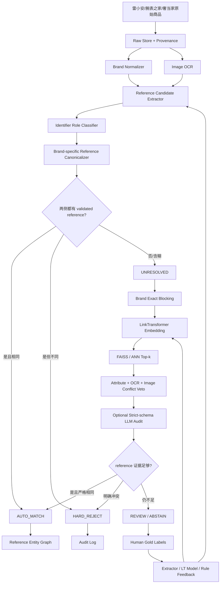

# LinkTransformer：面向三源二奢/腕表 reference-first 实体匹配的技术实现与落地方案

> 调研对象：LinkTransformer（dell-research-harvard/linktransformer）  
> 项目地址：https://github.com/dell-research-harvard/linktransformer  
> 论文：https://arxiv.org/abs/2309.00789  
> 对应需求：跨雷小安、腕表之家、奢当家三源，在 100 万～1000 万级持续增量商品数据中识别“同一参考号（reference number）”的商品；precision 极端优先，可漏不可错。

## 0. 结论先行

LinkTransformer **适合作为本需求的候选召回与弱语义辅助层，但不适合直接作为最终同款判定器**。

它已经把实体匹配工程里很麻烦的几块能力做成统一 Python API：

- 多字段序列化；
- Transformer / SentenceTransformer 表征；
- FAISS 近邻候选召回；
- exact blocking 后再做 fuzzy matching；
- top-k candidate retrieval；
- 可训练的 bi-encoder linkage model；
- pairwise 评估、聚类、去重；
- `retrieve -> LLM judge + confidence` 的二阶段流程；
- 文本/OCR 结果的 LLM transform 能力。

这些能力非常适合快速搭一个三源商品匹配 PoC。但当前需求的身份定义非常特殊：**只要 reference 不同，就不是同一商品；而 reference 一旦被抽错、把平台 SKU/序列号误当 reference，任何“语义很像”“图片很像”都不能补救。**

因此建议落地为一个 **LT-RefSafe** 架构：

```text
原始商品
  ↓
来源标准化 + 品牌规范化
  ↓
编号候选抽取（结构字段 / 标题 / OCR）
  ↓
编号角色分类（reference / SKU / serial / internal-id / accessory-target-ref）
  ↓
品牌专属 reference canonicalizer
  ↓
┌──────────────────────────────────────────────────┐
│ Strong Gate                                      │
│ 1. brand 相同 + validated reference 严格相同 → 自动匹配 │
│ 2. validated reference 明确冲突 → 硬拒绝             │
│ 3. reference 缺失/含糊 → 未决                        │
└──────────────────────────────────────────────────┘
  ↓（仅未决）
brand/category exact blocking
  ↓
LinkTransformer merge_knn top-k 召回
  ↓
属性/图片/OCR 冲突 veto + 可选 LLM 辅助判断
  ↓
严格状态机：MATCH / REJECT / REVIEW / NO_CANDIDATE
  ↓
只允许通过 reference 强证据的边进入实体簇
```

核心原则只有一句：

> **LinkTransformer 负责“把可能相关的记录找出来”，reference 证据负责“允许不允许合并”。**

---

## 1. 为什么这次选 LinkTransformer

`奢侈品文章调研.md` 对 LinkTransformer 的推荐点是：它把 exact blocking、top-k 召回、可训练 linkage、聚类/去重、字段标准化与 `retrieve -> LLM judge + confidence` 做成统一 API，很适合先用品牌做 exact block，再在 block 内做 reference/标题候选召回，并把 LLM 限制到 hard-rule 无法决定的尾部疑难项。

这恰好覆盖本需求的三类工程问题：

1. **规模问题**：100 万～1000 万条数据不能做跨源笛卡尔积；
2. **稀疏字段问题**：reference 不一定在专门字段里，需要从标题、描述、图片 OCR 中恢复；
3. **高 precision 问题**：模型不能强迫每条都找一个“最像”的对象，必须支持未决与拒识。

同时，LinkTransformer 的代码结构足够清晰，能够直接复用它的候选层，而不必把整个项目作为黑盒引入。

---

## 2. LinkTransformer 的真实代码架构

项目核心代码主要位于：

```text
src/linktransformer/
├── infer.py                 # merge / blocking / KNN / range / LLM judge / transform
├── preprocess.py            # 训练数据清洗与格式转换
├── train_model.py           # linkage bi-encoder 训练入口
├── train_clf_model.py       # 分类模型训练
├── cluster_fns.py           # 聚类
├── modified_sbert/
│   ├── train.py             # SupCon / OnlineContrastive 训练
│   ├── losses.py
│   └── evaluation.py
├── modelling/
└── utils.py                 # embedding、序列化、OpenAI 等工具
```

整体思想不是传统“把两条记录拼起来做 cross-encoder 二分类”，而是优先把 record linkage 转成 **文本检索问题**：

```text
left record ─┐
             ├─ serialize ─ embedding ─┐
right record ┘                          ├─ cosine / FAISS ─ nearest candidates
                                         └─ top-k / threshold
```

在需要时再训练领域 bi-encoder，或者把召回候选送给 LLM judge。

这种架构的最大优点是 **召回可以提前向量化、索引化**，非常适合大规模实体匹配；最大缺点是它天然优化“最相似”，而本需求最终优化的是“绝不错误合并”，二者不是同一个目标。

---

## 3. 核心代码路径拆解

### 3.1 `merge()`：1-NN 语义匹配

`infer.py` 的 `merge()` 做了以下事情：

1. 选定 `left_on/right_on`；
2. 多字段时序列化；
3. 用 SentenceTransformer 或 API embedding 得到左右向量；
4. L2 normalize；
5. 建 `faiss.IndexFlatIP`；
6. 把右侧向量加入索引；
7. 对每条左侧记录检索 1 个最近邻；
8. 返回相邻记录和 `score`。

因为向量已归一化，`IndexFlatIP` 的 inner product 实际上等价于 cosine similarity。

伪代码近似为：

```python
emb_left = encode(left_rows)
emb_right = encode(right_rows)
emb_left = normalize(emb_left)
emb_right = normalize(emb_right)

index = faiss.IndexFlatIP(dim)
index.add(emb_right)
score, idx = index.search(emb_left, 1)
```

### 对本需求的意义

这段代码能直接拿来做“语义最近候选”实验，但**不能把 `merge()` 的返回结果直接当匹配结果**。它强制每条左记录找到一个最近对象，即使真正对象不存在，也会返回一个“最不像中的最像”。

在腕表场景尤其危险：

```text
Rolex Submariner 126610LN
Rolex Submariner 126610LV
```

标题、品牌、系列、尺寸甚至图片都非常接近，但 reference 不同，业务定义下必须判否。

因此 `merge()` 在本需求中最多用作 baseline，生产应使用 `merge_knn()` 或更专业的 ANN 候选层。

---

### 3.2 `merge_blocking()`：exact block 后再 fuzzy match

`merge_blocking()` 会按 `blocking_vars` 对两张表 `groupby`，只对两边共同 block 内的数据调用 `merge()`。

例如：

```python
lt.merge_blocking(
    df1,
    df2,
    blocking_vars=["brand_id"],
    left_on=["title_norm"],
    right_on=["title_norm"],
)
```

这个设计很值得直接借鉴，因为它把“确定性规则”和“语义模型”天然分层。

在本需求中建议 blocking 至少包含：

```text
brand_id
```

若品牌内数据仍然过大，可再加：

```text
category / family / normalized_series
```

但 blocking 只能用高召回字段。不能因为某个系列抽取器不稳定，就把错误系列 block 变成永久漏召回。

推荐策略：

```text
第一层：brand exact block（强约束）
第二层：reference prefix / series / category 作为多路召回，不做唯一阻断
第三层：向量 top-k
```

---

### 3.3 `merge_knn()`：最值得直接复用的能力

`merge_knn()` 和 `merge()` 的 embedding + FAISS 过程基本相同，但允许每条左记录返回 top-k：

```python
D, I = index.search(embeddings1, k)
```

之后把左表每行复制 k 次，再与右侧的 k 个 neighbor 展开成候选对，并保存相似度 `score`。

这正是本需求大规模匹配需要的 **candidate generation**。

推荐用法不是：

```text
score > 0.9 => match
```

而是：

```text
score 只用于“值得不值得继续检查”
reference gate 才决定“能不能自动合并”
```

可以把 LT 的角色限定为：

```python
candidates = lt.merge_knn(
    left_unresolved,
    right_unresolved,
    left_on=["brand_series_title"],
    right_on=["brand_series_title"],
    k=10,
    model=domain_model,
)
```

然后完全忽略它是否“认为匹配”，只把结果送给自己的 `decide_pair()`。

---

### 3.4 `merge_range()`：按相似度范围导出候选

项目还实现了 FAISS `range_search`：只保留 cosine similarity 高于给定阈值的右侧记录，并保留没有候选的左记录。

它比固定 top-k 更适合某些品牌：热门系列里 top-10 可能仍全是极相似近邻，而冷门型号可能只有一个明显候选。

但这里的阈值依然只能是 **候选阈值**，不能是最终 identity 阈值。

不同品牌、不同来源的数据分布差异很大，不能期待一个全局 `sim_threshold` 同时适配 Rolex、Omega、Cartier 和小众品牌。

---

### 3.5 `merge_k_judge()`：retrieve -> LLM judge

这是项目较新的端到端 API：

1. 先通过 `merge_knn()` 找 top-k；
2. 再把每个 pair 作为 JSON 发送给 OpenAI / Gemini；
3. 要求返回：

```json
{
  "is_match": 0,
  "confidence": 0.97
}
```

4. 最终输出：

```text
llm_is_match
llm_confidence
llm_raw_response
```

它还允许 retrieval model 与 judge model 分离，例如：

```text
SBERT / embedding API     -> candidate retrieval
OpenAI / Gemini           -> candidate judge
```

这是合理的工业架构，但**项目默认实现不满足本需求的 fail-safe 要求**。

#### 风险 1：默认 prompt 问的是“是不是同一个 real-world entity”

这对普通实体匹配可以，对腕表 reference-first 定义不够严格。模型可能因为品牌、系列、图片和属性高度一致，而忽略一个字符的 reference 差异。

#### 风险 2：LLM 响应解析过于宽松

`_coerce_llm_match_and_confidence()` 首先尝试 JSON；如果 JSON 解析失败，会继续从普通文本中搜索 `yes / true / match` 等 token，再尝试抓数字作为 confidence。

这对于“尽量有结果”的通用 SDK 很实用，但对于“绝不能误匹配”恰好相反：

```text
非结构化输出 / 格式错误 / 语义不清
       ↓
不能猜
       ↓
必须 ABSTAIN / REVIEW
```

因此如果复用 `merge_k_judge()`，建议改成严格解析：

```python
def strict_parse(raw: str):
    try:
        x = json.loads(raw)
    except Exception:
        return {"decision": "REVIEW", "reason": "invalid_json"}

    if set(x) != {"decision", "reference_left", "reference_right", "reason"}:
        return {"decision": "REVIEW", "reason": "invalid_schema"}

    if x["decision"] not in {"SAME_REF", "DIFF_REF", "UNKNOWN"}:
        return {"decision": "REVIEW", "reason": "invalid_decision"}

    return x
```

而且 LLM 最好不要直接回答“是否同款”，而改成窄任务：

```text
A. 左记录里真正属于售卖腕表本体的 reference 是什么？
B. 右记录里真正属于售卖腕表本体的 reference 是什么？
C. 是否有证据表明某个编号其实是 SKU / serial / 配件适配型号？
D. 不确定时必须 UNKNOWN。
```

最终是否合并仍由代码比较 canonical reference。

---

### 3.6 `transform_rows()`：适合辅助规范化，不适合自由生成 reference

`transform_rows()` 可以把一列或多列交给 LLM 做标准化，例如修 OCR、统一名称。

这可以用于：

```text
品牌别名统一
系列名统一
OCR 候选修正建议
营销噪声去除
```

但不应该直接做：

```text
reference_raw -> LLM -> reference_canonical -> 自动合并
```

原因是 reference 是身份键，任何“看起来更合理”的自由改写都可能把一个真实但罕见的型号改成高频型号。

正确做法是：

```text
LLM 只能产 candidate + evidence
canonicalizer 必须 deterministic
```

---

## 4. 训练架构：项目如何使用几百对黄金标签

`train_model.py` 会先调用 `preprocess_any_data()`，然后进入 `train_biencoder()`。

项目支持两种非常适合本场景的数据格式。

### 4.1 Cluster / positive linkage 训练

如果只有已知相同实体组，可以用 `supcon`（Supervised Contrastive Loss）训练，让同一实体的记录在 embedding 空间靠近。

默认配置里：

```json
{
  "train_batch_size": 64,
  "num_epochs": 10,
  "learning_rate": 2e-5,
  "loss_type": "supcon",
  "val_perc": 0.2
}
```

这种方式容易利用正样本，但对本需求还不够，因为真正危险的是 **近似但不同 reference 的 hard negative**。

### 4.2 Positive + Negative pair 训练

当提供 `label_col_name` 后，代码可以走 pairwise positive/negative 数据，并使用 `onlinecontrastive`。

训练数据可以长这样：

| left | right | label |
|---|---|---:|
| Rolex 126610LN 黑水鬼 | 劳力士 126610LN | 1 |
| Rolex 126610LN 黑水鬼 | 劳力士 126610LV 绿水鬼 | 0 |
| Omega 210.30.42.20.01.001 | 欧米茄 210.30.42.20.01.001 | 1 |
| Omega 210.30.42.20.01.001 | Omega 210.30.42.20.03.001 | 0 |

对本需求而言，这种训练形式比随机负样本更重要。

### 黄金标签不要随机抽

只有几百对标注预算时，应优先标下面这些：

1. 同品牌、同系列、reference 仅差 1 个字符/一段；
2. 标题里同时出现平台 SKU 和品牌 reference；
3. 表带、盒子、保卡、配件标题里出现“适配腕表 reference”；
4. reference 只存在于图片 OCR；
5. O/0、I/1/l、B/8 等 OCR 混淆；
6. reference 缩写、截断、老编号/新编号并存；
7. 同一 reference 跨中文/英文/俗称标题；
8. 三个来源中特定站点经常把内部货号放在“型号”字段的异常案例。

训练集如果大量使用容易的随机负样本，模型 F1 会很好看，但最危险的 false positive 不会下降。

---

## 5. LinkTransformer 适配本需求的地方

### 5.1 检索式架构适合 100 万～1000 万规模

只要把商品转成向量，就不需要全量 pairwise 比较。

### 5.2 Exact blocking 能自然嵌入业务硬规则

品牌可以先 exact block，再做语义候选，这和“不同品牌绝不匹配”的业务约束高度一致。

### 5.3 top-k 让最终判断逻辑独立出来

召回器只负责候选，不用承担最终分类责任，是 precision-first 系统正确的分层方式。

### 5.4 支持小样本领域微调

几百对高质量 hard cases 可以用于训练一个更懂腕表标题的 bi-encoder，让候选层少召回“同系列错误 reference”。

### 5.5 支持增量演化

模型、blocking、candidate retrieval 都可以与最终 decision engine 解耦，后续换 embedding 模型、换 ANN 索引，不会影响已经固化的 reference hard rule。

---

## 6. 必须改造或绕开的地方

### 6.1 `IndexFlatIP` 不适合作为 1000 万级最终在线索引

当前代码用的是：

```python
faiss.IndexFlatIP(dim)
```

优点是结果精确、实现简单；缺点是 flat scan 的计算和内存压力会随库规模线性增长。

PoC 可以原样使用，生产建议保留 LinkTransformer embedding 层，替换索引层为：

```text
FAISS IVF / IVF-PQ
HNSW
GPU FAISS
或独立向量服务
```

并优先按 `brand_id` 分区，让每次 ANN 查询只落在一个品牌内。

### 6.2 不使用 semantic clustering 直接构造商品实体

`cluster_rows()`/`dedup_rows()` 支持 Agglomerative/HDBSCAN/SLINK 等语义聚类。

这类聚类存在典型传递污染：

```text
A 很像 B
B 很像 C
=> A、B、C 可能进入同一簇
```

即便 A 与 C reference 冲突。

本需求不能允许这种逻辑。实体簇只允许由已经通过 reference hard gate 的边组成。

### 6.3 不把 similarity threshold 当 identity threshold

`score=0.98` 只能说明文本高度相似，不能说明 reference 相同。

在同系列腕表中，错误候选甚至可能比正确候选更像，因为卖家标题存在缺词、俗称和模板噪声。

### 6.4 不把 LLM confidence 当校准概率

`llm_confidence=0.99` 是模型生成值，不等于经过统计校准的真实 99% 正确率。

它只能用于 review 排序，不应绕过 hard gate。

### 6.5 不允许 canonicalizer 做过度清洗

以下操作可能安全：

```text
trim
统一大小写
Unicode normalize
品牌规则允许时统一分隔符显示形式
```

以下操作必须品牌专属评估：

```text
删除所有点号/连字符
删除 leading zero
截掉后缀
只保留数字
模糊纠正 O→0 / I→1
```

因为这些字符可能就是 reference 的有效位。

---

## 7. 推荐落地架构：LT-RefSafe

## 7.1 Stage A：统一原始商品模型

建议先定义一个不可丢失 provenance 的原始结构：

```json
{
  "source": "watchhome",
  "source_item_id": "xxx",
  "url": "...",
  "title_raw": "...",
  "description_raw": "...",
  "brand_raw": "...",
  "reference_field_raw": "...",
  "images": ["..."],
  "updated_at": "..."
}
```

不要覆盖原始字段。任何抽取、规范化都以派生字段存在，方便回溯为什么产生了一条匹配边。

---

## 7.2 Stage B：品牌规范化

先做全局 canonical brand：

```text
劳力士 / ROLEX / Rolex -> rolex
欧米茄 / OMEGA / Omega -> omega
```

品牌不一致默认不进入同款比较。

如果品牌本身不确定，则进入 REVIEW，不要跨品牌语义召回。

---

## 7.3 Stage C：reference 候选抽取，而不是一次性给答案

每条记录允许产生多个候选：

```json
[
  {
    "value": "126610LN",
    "source": "structured_field",
    "span": null,
    "role": "reference",
    "confidence": 1.0
  },
  {
    "value": "M123456",
    "source": "title",
    "span": [18, 25],
    "role": "unknown",
    "confidence": 0.62
  }
]
```

证据来源建议分级：

```text
A 级：来源明确的 reference/model 字段 + 通过品牌格式校验
B 级：标题抽取 + 品牌词典/格式校验
C 级：图片 OCR + 文本/品牌规则互证
D 级：LLM 自由识别但无其他校验
```

D 级不能单独触发自动匹配。

---

## 7.4 Stage D：编号角色分类

这是本需求最容易被低估的一层。

标题中“像型号”的字符串可能是：

```text
brand reference
platform SKU
seller SKU
serial number
movement/caliber
size
year
price
accessory compatibility reference
certificate / inventory id
```

因此先做：

```python
role = classify_identifier(candidate, context)
```

再做 reference 比较。

建议角色枚举：

```text
REFERENCE
SERIAL
PLATFORM_SKU
SELLER_SKU
CALIBER
ACCESSORY_TARGET_REFERENCE
UNKNOWN
```

`UNKNOWN` 不能自动升级成 `REFERENCE`。

---

## 7.5 Stage E：品牌专属 canonicalizer

接口应是确定性的：

```python
canonicalize_reference(brand_id, raw_value) -> CanonicalRef
```

并输出：

```json
{
  "raw": "210.30.42.20.01.001",
  "canonical": "210.30.42.20.01.001",
  "valid_format": true,
  "parser_version": "omega-v3",
  "segments": ["210", "30", "42", "20", "01", "001"]
}
```

不要只返回一个清洗后的字符串；需要保留 parser 版本、是否通过格式约束、分段结果。

这样后面才能解释：

```text
为什么认为相同？
为什么两个只差一段的 Omega 型号必须拒绝？
```

---

## 7.6 Stage F：强匹配 / 强冲突 Gate

建议把最终匹配逻辑写成显式状态机，而不是一个浮点阈值。

### 自动匹配

满足：

```text
brand_id 相同
AND
left.reference_canonical == right.reference_canonical
AND
左右 reference 都通过角色验证与格式/证据校验
AND
不存在强冲突证据
```

才允许：

```text
AUTO_MATCH
```

### 硬拒绝

只要两边都有可靠 reference 且不同：

```text
left.ref_valid = true
right.ref_valid = true
left.ref != right.ref
```

直接：

```text
HARD_REJECT
```

此时：

```text
标题相似度 0.999 也不能翻案
图片一模一样也不能翻案
LLM 说 100% same 也不能翻案
```

因为需求已经定义“同一个商品 = 同一 reference”。

### 未决

以下情况进入：

```text
REVIEW / UNRESOLVED
```

- 一边没有 reference；
- reference 抽取候选有多个；
- 编号角色不确定；
- OCR 字符存在歧义；
- reference 格式不完整；
- 来源字段与标题抽取互相冲突。

---

## 7.7 Stage G：仅对未决记录使用 LinkTransformer top-k

如果记录已通过 exact reference 找到实体，不需要走向量模型。

只有未决记录进入：

```text
brand block
  ↓
semantic retrieval
  ↓
top-k candidates
```

例如：

```python
unresolved_candidates = lt.merge_knn(
    unresolved_left,
    unresolved_right,
    left_on=["title_norm", "series_norm"],
    right_on=["title_norm", "series_norm"],
    model="./models/watch-linker",
    k=10,
)
```

建议 embedding 输入不要直接塞所有字段，而应控制哪些字段会主导相似性：

```text
brand
series
model_name
clean_title
reference_candidate（若低置信，仅作为普通 token）
```

平台 SKU、价格、库存号等应排除或单独标记，避免模型学到来源特有 shortcut。

---

## 7.8 Stage H：图片只做辅助证据或 veto

LinkTransformer 当前核心是文本/表格记录，不是一个完整多模态 matcher。

本需求图片建议单独走：

```text
image
 ├─ OCR：表背 / 保卡 / 吊牌上的 reference
 ├─ image embedding：系列/外观候选召回
 └─ perceptual duplicate：检测同一商品图被跨站搬运
```

图片可以：

```text
帮助找到候选
帮助验证标题抽取
发现“标题说 A、图片刻字像 B”的冲突
```

图片不可以：

```text
在 validated reference 不同的情况下强行判同款
```

腕表相邻 reference 的外观本来就可能极近，视觉证据必须低于 reference 硬证据。

---

## 7.9 Stage I：LLM 只处理 reference 归属与歧义

推荐把 LLM prompt 从“是否同一个实体”改成“编号证据审计”。

例如要求严格 JSON：

```json
{
  "left_reference": "126610LN",
  "left_role": "REFERENCE",
  "right_reference": "126610LV",
  "right_role": "REFERENCE",
  "conflict": true,
  "decision": "DIFF_REF",
  "evidence": [
    "left title contains explicit reference",
    "right structured field contains explicit reference"
  ]
}
```

规则：

```text
任何字段缺失 → UNKNOWN
JSON 不合法 → UNKNOWN
输出不在枚举中 → UNKNOWN
reference 与 deterministic parser 冲突 → UNKNOWN
```

LLM 不拥有最终 `AUTO_MATCH` 权限。

---

## 8. 推荐的数据表设计

### 8.1 `listing_normalized`

```text
listing_id
source
source_item_id
brand_id
brand_confidence
title_raw
title_norm
reference_raw
reference_candidates_json
reference_canonical
reference_role
reference_valid
reference_evidence_level
reference_parser_version
series_norm
category_norm
image_ocr_json
created_at
updated_at
pipeline_version
```

### 8.2 `candidate_pair`

```text
pair_id
left_listing_id
right_listing_id
candidate_method       # exact_ref / lt_knn / image / manual
retrieval_score
brand_equal
reference_equal
reference_conflict
series_conflict
attribute_conflicts_json
image_evidence_json
llm_audit_json
decision               # AUTO_MATCH / HARD_REJECT / REVIEW / NO_CANDIDATE
decision_reason
decision_rule_version
created_at
```

### 8.3 `entity_membership`

```text
entity_id
listing_id
brand_id
reference_canonical
join_reason
join_pair_id
rule_version
joined_at
```

重要的是：**实体 membership 必须可追溯到具体 pair、具体 rule version 和具体 reference 证据。**

这样某品牌 parser 修复以后，可以只重算受影响的 membership，而不是全库重跑。

---

## 9. 一个可直接落地的判定器骨架

```python
from dataclasses import dataclass
from enum import Enum

class Decision(str, Enum):
    AUTO_MATCH = "AUTO_MATCH"
    HARD_REJECT = "HARD_REJECT"
    REVIEW = "REVIEW"
    NO_CANDIDATE = "NO_CANDIDATE"

@dataclass
class RefEvidence:
    brand_id: str | None
    canonical: str | None
    role: str
    valid: bool
    evidence_level: str


def decide_pair(left: RefEvidence, right: RefEvidence) -> tuple[Decision, str]:
    # 品牌冲突首先拒绝
    if left.brand_id and right.brand_id and left.brand_id != right.brand_id:
        return Decision.HARD_REJECT, "brand_conflict"

    left_strong = (
        left.valid
        and left.role == "REFERENCE"
        and left.canonical is not None
        and left.evidence_level in {"A", "B"}
    )
    right_strong = (
        right.valid
        and right.role == "REFERENCE"
        and right.canonical is not None
        and right.evidence_level in {"A", "B"}
    )

    # 两侧都有强 reference 时，规则完全确定
    if left_strong and right_strong:
        if left.canonical == right.canonical:
            return Decision.AUTO_MATCH, "validated_reference_exact"
        return Decision.HARD_REJECT, "validated_reference_conflict"

    # 缺证据时不猜
    return Decision.REVIEW, "insufficient_reference_evidence"
```

随后 LinkTransformer 只作用于 `REVIEW` 记录的候选生成：

```python
review_rows = ...
knn_pairs = lt.merge_knn(..., k=10)

for pair in knn_pairs:
    # 再次抽取/审计 reference
    # 不因 retrieval_score 高就自动 match
    decision = decide_pair(pair.left_ref, pair.right_ref)
```

这是整个方案里最重要的“权限隔离”：

```text
retrieval_score 没有 AUTO_MATCH 权限
LLM confidence 没有 AUTO_MATCH 权限
image similarity 没有 AUTO_MATCH 权限
只有 validated canonical reference 可以自动放行
```

---

## 10. 100 万～1000 万数据的生产化方案

### 10.1 不做全量三源 pairwise

主路径应该是两个索引。

#### 索引 1：确定性 reference inverted index

Key：

```text
(brand_id, reference_canonical)
```

Value：

```text
entity_id / listing_ids
```

绝大多数 reference 完整的记录都可以 O(1) 或近似 O(logN) 落到现有实体。

#### 索引 2：未决记录的向量索引

只保存 reference 缺失/含糊记录，按品牌分区：

```text
vector_index/rolex
vector_index/omega
vector_index/cartier
...
```

这样 LinkTransformer/FAISS 不需要承担全库身份索引。

### 10.2 增量处理流程

```text
新商品到达
  ↓
normalize + reference extraction
  ↓
若 validated reference 存在
  ├─ 查 deterministic index
  │   ├─ 命中 → 加入该 reference entity
  │   └─ 未命中 → 创建 reference entity
  ↓
若 reference 未决
  ├─ 查询品牌向量 index top-k
  ├─ evidence audit
  └─ REVIEW / 暂不归并
```

持续更新时只处理新纪录与受规则版本影响的历史记录，不需要反复扫 1000 万 × 1000 万候选。

### 10.3 FAISS 索引替换

PoC：

```text
IndexFlatIP
```

生产：根据数据量和 latency 压测选择：

```text
HNSW
IVF-Flat
IVF-PQ
GPU FAISS
```

LinkTransformer 的 embedding 和训练部分仍可复用。

---

## 11. 如何使用几百对人工黄金标签

黄金标签不要主要花在“普通 pair 正负分类”，而要用于三件事。

### 11.1 校验 reference extractor

标注：

```text
哪个字符串是本体 reference？
哪个是 SKU / serial？
是否抽取完整？
```

### 11.2 构造 hard-negative 回归集

长期保留一套“绝不能错”的 case：

```text
同品牌同系列不同 reference
只差一个字符
只差一个 suffix
配件标题包含目标腕表 reference
卖家内部 SKU 冒充型号
OCR O/0、1/I 混淆
```

每次规则、模型、OCR 或 parser 发布都跑这套回归。

### 11.3 微调 LinkTransformer candidate model

当积累到足够 review 数据后，把：

```text
同 reference 跨源记录         -> positive
同系列相邻 reference          -> hard negative
```

喂给 `onlinecontrastive`，优化 top-k 候选质量。

注意：即便微调后 retrieval 准确率很高，也不取消 final reference gate。

---

## 12. 评测指标要改，不要只看 F1 / top-1 accuracy

LinkTransformer 原论文很重视 top-1 retrieval accuracy，这对检索器合理，但本需求的生产 KPI 必须拆层。

### 候选层

```text
Recall@1 / Recall@5 / Recall@10
每条未决记录平均候选数
候选生成 latency
```

目标是不要把真实同 reference 从候选阶段丢掉。

### 自动匹配层

第一指标：

```text
Auto-match Precision
False Merge Count
```

其次才是：

```text
Auto-match Coverage
Review Rate
Recall
```

### 专项监控

按：

```text
source pair
brand
reference pattern
extractor version
parser version
```

分桶看 false positive。

如果某一品牌/来源组合没有足够验证数据，默认降低自动覆盖，而不是沿用全局阈值。

---

## 13. 与 LinkTransformer 原实现相比，建议直接复用/替换清单

| 模块 | 是否复用 | 方案 |
|---|---|---|
| 多字段 serialize | 复用 | 控制进入 embedding 的字段，剔除来源 SKU 等 shortcut |
| SentenceTransformer embedding | 复用 | PoC 先用通用模型，后续可微调 |
| `merge_knn()` | 强烈复用 | 作为 candidate retrieval，不作为最终 matcher |
| `merge_blocking()` 思路 | 强烈复用 | 先 brand exact block，再候选召回 |
| `IndexFlatIP` | PoC 复用 | 生产换 ANN / 分品牌索引 |
| `merge_range()` | 可复用 | 只作为候选生成 |
| `train_model()` | 复用 | 用几百对 gold + hard negative 微调 |
| `onlinecontrastive` | 推荐 | 更直接利用近邻负样本 |
| `transform_rows()` | 谨慎 | 仅用于辅助文本/OCR 标准化，不自由改 reference |
| `merge_k_judge()` | 改造后复用 | 改 prompt、严格 schema、失败即 abstain |
| 宽松 `_coerce_llm_match_and_confidence()` | 不复用 | 非法 JSON 一律 REVIEW |
| semantic `cluster_rows()` 作为 identity | 不使用 | 只允许 exact validated reference 边构簇 |
| LLM confidence 直接阈值放行 | 不使用 | 只能 review 排序或辅助证据 |

---

## 14. 推荐的最小可落地版本

不需要一开始就训练复杂模型，第一版甚至可以非常保守。

### P0：先做 reference-first 确定性管线

```text
brand normalize
reference candidate extract
identifier role classify
brand-specific canonicalize
exact validated reference join
hard conflict reject
review queue
```

这一步已经能解决大部分 reference 明确的商品，而且最符合“可漏不可错”。

### P1：在 REVIEW 尾部接 LinkTransformer

```text
brand exact block
merge_knn(k=5~20)
只做候选发现
```

### P2：增加图片 OCR

优先 OCR：

```text
表背
保卡
吊牌
证书
```

只把 OCR 结果作为新的 reference candidate，不让图像 embedding 直接判身份。

### P3：使用 review 数据训练领域 LinkTransformer

重点优化 hard negative 的 candidate ranking。

### P4：把 flat FAISS 换成分品牌 ANN，并做增量索引

此时系统可以稳定处理百万～千万级持续新增数据。

---

## 15. 最终推荐架构图



---

## 16. 一句话落地判断

LinkTransformer 最值得拿来的是 **“blocking + embedding + FAISS top-k + 可微调 bi-encoder”** 这一候选层，而不是它的“最近邻就是匹配”、语义聚类或宽松 LLM judge。

对于这个三源二奢需求，建议把系统的身份权限牢牢放在：

```text
brand-scoped validated canonical reference exact equality
```

之上。

语义模型、图片、OCR、LLM 都只用于：

```text
找候选
恢复缺失 reference
识别编号角色
发现冲突
安排人工复核优先级
```

而不拥有越过 reference 冲突的权限。

这样既能利用 LinkTransformer 的大规模检索架构，又能满足“precision 优先到极致、允许漏匹配”的核心约束，并且后续模型、来源和数据量扩张时仍然可增量演进、可审计、可回滚。