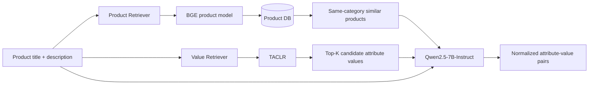
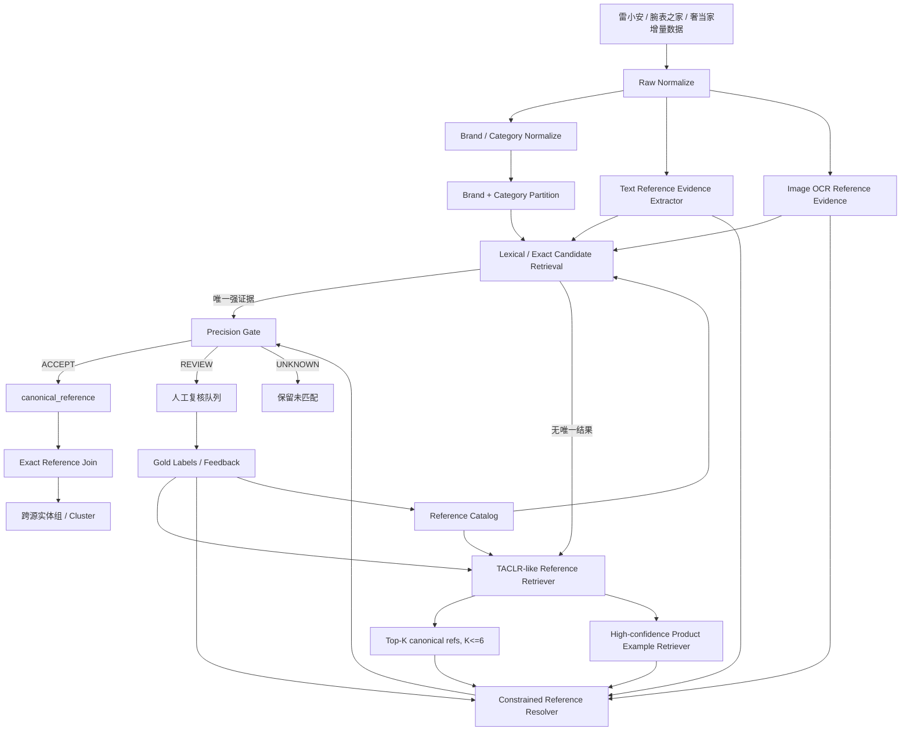
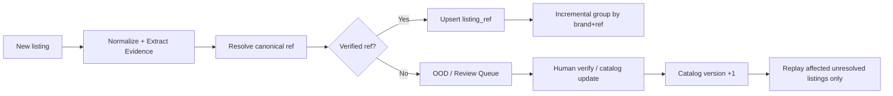

# Multi-Value-Product Retrieval-Augmented Generation for Industrial Product Attribute Value Identification

## 0. 结论先行

本轮选取并深入分析论文 **Multi-Value-Product Retrieval-Augmented Generation for Industrial Product Attribute Value Identification（MVP-RAG）**。论文来自闲鱼/阿里团队，任务是从二手电商商品文本中识别标准化商品属性值，和当前 Spec 的关键前置问题——从高度稀疏、脏、非结构化的跨平台 listing 中识别并规范化 **reference number / 型号**——高度同构。

对当前需求，最值得直接落地的不是“照搬 MVP-RAG 让 LLM 生成 reference”，而是把它改造成一个 **Reference-RAG + Closed-World Precision Gate（下文简称 Ref-RAG Gate）**：

1. 用 MVP-RAG 的“双层检索”思路做 **reference 候选召回**：
   - value-level：在品牌/品类约束下，从 canonical reference 库召回少量候选 reference；
   - product-level：从已经有高置信 reference 的历史商品中召回同类商品，提供格式、别名和上下文参考。
2. LLM 只做 **受限候选判别、证据抽取和拒识**，不拥有最终“自由生成并自动合并”的权限。
3. 最终自动匹配必须经过确定性的 **Precision Gate**：只有两条记录分别得到唯一、无冲突、高置信的 canonical reference，且 canonical reference 完全一致，才允许自动归并。
4. 对没有硬证据、候选接近、出现多个型号、配件兼容型号、OCR 冲突等情况，一律 `UNKNOWN/REVIEW`，允许漏匹配。
5. 图片不用于“看起来像”就判同款；图片优先做 **OCR/reference 证据补全与冲突否决**。

这是比直接训练 pairwise matcher 更契合当前 Spec 的方案，因为 Spec 已明确“同一个商品 = 同一参考号”，而且 **precision 优先到极致、绝不能误匹配**。因此系统的核心不是学习一个“相似商品分类器”，而是可靠地产生 `canonical_reference`，再执行严格等值连接。

> 最关键的工程原则：**模型可以负责提议 reference，规则负责授权自动合并。**

---

## 1. 本轮排除检查

在分析前检查了 `my-doc/奢侈品调研/a`，已经存在以下 12 个结果，本轮均排除：

- Ameli.md
- AnyMatch -- Efficient Zero-Shot Entity Matching with a Small Language Model.md
- ComEM.md
- Confidence Classifiers with Guaranteed Accuracy or Precision.md
- DeepBlocker.md
- Fine-tuning large language models with contrastive margin ranking loss for selective entity matching in product data integration.md
- Large Scale Generative Multimodal Attribute Extraction for E-commerce Attributes.md
- Tailoring entity resolution for matching product offers.md
- TransClean - Finding False Positives in Multi-Source Entity Matching under Real-World Conditions via Transitive Consistency.md
- Using LLMs for the Extraction and Normalization of Product Attribute Values.md
- parts-distributor-sku-classifier.md
- pyJedAI.md

MVP-RAG 不在上述目录中，因此属于未分析条目。

---

## 2. 与当前 Spec 的对应关系

当前 Notion Spec 的核心约束：

- 三个来源：雷小安、腕表之家、奢当家；
- 总规模约 100 万–1000 万，并持续增量；
- “同一个商品”定义为 **同一 reference number / 型号**；
- 字段稀疏，reference 有时在独立字段，有时埋在标题/描述；
- **绝对不能误匹配，precision 优先，允许漏匹配**；
- 有图片；
- 可接受几百对人工黄金标签。

MVP-RAG 原论文研究的是 Product Attribute Value Identification（PAVI）：输入商品标题/描述与属性体系，输出标准化属性值。把“reference number”视为一个特殊但极其关键的商品属性，论文的 PAVI 架构可以直接映射为：

```text
商品 listing
  -> 候选 reference 检索
  -> 同类已标 reference 商品检索
  -> 模型结合候选和示例判断 reference
  -> canonical reference
```

不同点在于，论文主要优化 PAVI 的 Precision/Recall/F1，而当前需求是近似“安全系统”的 precision-first；所以必须对生成模块做强约束，并增加最终拒识门。

---

## 3. 原论文：MVP-RAG 到底做了什么

论文：

- Title: Multi-Value-Product Retrieval-Augmented Generation for Industrial Product Attribute Value Identification
- Authors: Huike Zou et al.
- Venue: EMNLP 2025 Industry Track
- ACL Anthology: https://aclanthology.org/2025.emnlp-industry.147/
- PDF: https://aclanthology.org/2025.emnlp-industry.147.pdf

论文来自二手电商闲鱼场景。其 Xianyu-PAVI 数据包含：

- 8,803 个商品类目；
- 26,645 个 category-attribute pair；
- 约 630 万 category-attribute-value triple；
- 训练商品 809,528，验证 81,699，测试 85,024；
- 已部署到真实闲鱼工业环境，论文称每天处理数百万 listing。

这个量级与当前 100 万–1000 万级持续增量非常接近，因此不是一个只在小 benchmark 上成立的思路。

### 3.1 MVP-RAG 总体架构

论文 Figure 3 的核心是两条并行检索路径，最后汇入 LLM：



它不是普通的“只从知识库拿几段文本”的 RAG，而是把检索分成：

1. **Attribute Value Retrieval**：直接检索标准属性值候选；
2. **Product Retrieval**：检索同类相似商品作为 few-shot/reference case；
3. **Generation**：LLM 结合当前商品、候选值和相似商品做最终输出。

论文认为 multi-level retrieval 能同时兼顾：

- retrieval 的受控输出；
- generation 对 OOD/新值的泛化；
- similar product 对隐式表达、长尾表达的补充。

### 3.2 Attribute Value Retriever：TACLR

MVP-RAG 的 value retriever 使用 TACLR（Taxonomy-Aware Contrastive Learning Retrieval）。TACLR 论文与代码：

- arXiv: https://arxiv.org/abs/2501.03835
- GitHub: https://github.com/SuYindu/TACLR

TACLR 把“商品 -> 属性值”改成 information retrieval：

- Query：商品 title + description；
- Key/Corpus：标准属性值；
- 相似度高的 value 作为候选。

论文中 value prompt 类似：

```text
A {category} with {attribute} being {value}
```

开源代码 `src/model/plm_ret.py` 展示了很清楚的实现方式：

- Transformer encoder 输出 CLS embedding；
- 可选线性 projection；
- embedding 做 L2 normalize；
- query 与 candidate key 通过点积/余弦相似度打分；
- 默认 temperature = 0.07；
- 默认每个训练样本采样 128 个 value；
- 正例来自商品真实 attribute value；
- 负例从 **同 category、同 attribute 的其他 value** 里采样；
- 通过 cross entropy/contrastive objective 训练 query 更靠近正确 value。

这一点对腕表 reference 非常重要：真正危险的负例不是“劳力士 vs 电视机”，而是：

- 同品牌；
- 同系列；
- 字符串只差 1–2 位；
- 外观高度相似；
- title 中同时出现兼容型号或相关型号。

所以需要刻意训练 **taxonomy-aware / family-aware hard negatives**，例如：

```text
126610LN  vs 126610LV
116500LN  vs 126500LN
5711/1A-010 vs 5711/1A-011
IW371604   vs IW371605
```

这些才是当前需求的关键训练样本。

### 3.3 Product Retriever：BGE + 同类约束

论文使用 BGE-base 对商品编码，再按 cosine similarity 找相似商品，并且明确限制 **same category**。

其目的不是让相似商品直接决定答案，而是给生成模型参考：

```text
当前商品：某种非标准、简称、错别字、卖家口语表达
相似商品：已经知道标准属性值的同类商品
```

对腕表可以进一步把 “same category” 收紧为：

```text
same brand
AND same product_type
AND (same collection if collection available)
```

例如在 Rolex Submariner 分区中检索历史商品，而不是跨品牌全库做 ANN。

这会同时降低计算量和 false positive 风险。

### 3.4 Generation：Qwen2.5-7B-Instruct

论文生成模块采用 `Qwen2.5-7B-Instruct`，完整参数微调：

- 3 epochs；
- batch size 16；
- AdamW；
- max learning rate 2e-5；
- warmup 1%；
- cosine learning-rate scheduler；
- next-token prediction objective；
- prompt prefix 不计 loss，主要对输出 token 计算训练目标。

prompt 包含五部分：

1. task definition；
2. note；
3. same-category similar products；
4. current product information；
5. candidate attribute values。

论文 Appendix 的 prompt 还有两个很值得直接继承的设计：

- 无法识别可以返回 `unknown`；
- 属性不存在可返回 `None`；
- 如果真实值不在 candidate 中理论上可以生成，但“最好不要”。

对当前 precision-first 需求，最后一条必须更激进：

> **自动合并路径禁止生成候选集之外的 reference。候选外值只允许标记为 `DISCOVERED_UNVERIFIED`，进入人工/离线 catalog 更新流程。**

### 3.5 论文结果与对当前项目最重要的信号

Xianyu-PAVI 结果：

| 方法 | Precision | Recall | F1 |
|---|---:|---:|---:|
| Qwen2.5 fine-tune | 84.5 | 79.1 | 81.7 |
| TACLR | 85.4 | 87.1 | 86.2 |
| MVP-RAG | **93.8** | 85.3 | **89.5** |

MVP-RAG 对比只做 Product-RAG 的 Qwen2.5，F1 提升很大；对比 TACLR，precision 从 85.4 提高到 93.8。

但 **93.8% precision 对当前需求仍然完全不可直接使用**。如果粗略想象有 100 万个自动接受结果、且错误分布相近，93.8% precision 意味着约 6.2 万个错误接受。实体匹配的实际定义和论文 attribute-pair metric 并不相同，不能直接线性换算，但已经足够说明：

> MVP-RAG 应该作为“reference 解析器/候选判别器”，不应该作为最终自动 match gate。

另外几个实验结论非常有工程价值：

1. **候选值不是越多越好。** 论文 sweep 中候选 value 的 coverage 随 K 增长接近 100%，但 precision 总体下降，F1 在约 `K=6` 附近达到峰值。这说明 reference resolver 应只看很小的候选集，不能把几十/几百个相近型号都扔给 LLM。
2. **同类商品检索数量增加，coverage 提升但收益逐渐饱和。** 因此 few-shot product 示例可控制在 2–4 个，不应过量。
3. **错误的 retrieved product 会污染输出。** 论文分析指出，对 brand/model 这类显式属性，当相似商品的属性标签大面积错误时，MVP-RAG 也会被带偏。因此 product-RAG 只能是辅助证据，不能是硬真值。
4. 论文 limitation 明确写了只使用文本、没有用图片/视频；当前项目恰好可以通过 OCR 补上这一层。
5. LLM 推理延迟是论文已知问题，因此千万级数据不能做到“每条记录先过 7B LLM”；必须分层，只把困难样本送模型。

---

## 4. 面向 Spec 的改造：Ref-RAG Gate

### 4.1 核心目标从“生成属性”改为“生成可审计的 reference 证据”

最终输出不要只有一个字符串：

```json
{"reference": "126610LN"}
```

而应输出完整证据对象：

```json
{
  "listing_id": "xxx",
  "brand": "ROLEX",
  "reference_candidate": "126610LN",
  "canonical_reference": "126610LN",
  "status": "ACCEPT",
  "confidence_tier": "A",
  "evidence": [
    {
      "channel": "structured_field",
      "raw": "126610LN",
      "span": "126610LN"
    },
    {
      "channel": "title",
      "raw": "劳力士黑水鬼 126610LN 全套",
      "span": "126610LN"
    }
  ],
  "candidate_scores": [
    {"ref": "126610LN", "score": 0.97},
    {"ref": "126610LV", "score": 0.61}
  ],
  "conflicts": [],
  "reason_codes": ["UNIQUE_CANONICAL_REF", "TWO_INDEPENDENT_TEXT_EVIDENCES"]
}
```

这样后续每一次实体归并都能回答：

- 是哪个字段/哪张图支持的？
- 是模型猜的还是 exact evidence？
- 有没有第二候选？
- 有没有品牌/系列/配件冲突？
- 为什么允许自动合并？

这是 precision-first 系统必须有的可审计性。

---

## 5. 推荐生产架构



### 5.1 Layer A：原始字段标准化

只做“无语义风险”的标准化：

- Unicode NFKC；
- 大小写统一；
- 全角/半角统一；
- 常见 dash/space 统一；
- HTML、不可见字符清理；
- 品牌 alias 映射，例如 `Rolex / 劳力士 / ロレックス -> ROLEX`。

**不要一上来把所有 `- / . 空格` 都删除。** 某些品牌 reference 的标点和后缀可能有语义，应该同时保存：

```text
raw_reference
normalized_display_reference
canonical_reference
search_key
```

其中 `search_key` 可以更激进用于召回，但最终 equality 应基于 brand-specific canonicalization。

### 5.2 Layer B：编号角色识别，先区分“这串码是什么”

二手商品 title 里经常同时出现：

- 品牌 reference/model；
- 平台 SKU；
- 卖家内部货号；
- 序列号；
- 机芯型号；
- 尺寸；
- 年份；
- 配件兼容型号；
- 商品真正 reference。

所以先抽 code，再做 role classification：

```text
TOKEN -> {
  PRODUCT_REFERENCE,
  SERIAL_NUMBER,
  PLATFORM_SKU,
  SELLER_SKU,
  MOVEMENT_CALIBER,
  COMPATIBILITY_REFERENCE,
  UNKNOWN_CODE
}
```

`COMPATIBILITY_REFERENCE` 是高风险类。典型错误：

```text
“适用 Rolex 126610LN 的表带”
```

商品本身是表带，不是 126610LN 腕表；如果只看到型号就会产生灾难性 false positive。

因此应建立 accessory/compatibility hard-negative 词典与分类器：

```text
适用 / 兼容 / for / suitable for / replacement / 表带 / 表盒 / 表扣 / 配件 / 保护膜 ...
```

这一层甚至比 embedding matcher 更优先。

### 5.3 Layer C：Reference Catalog

需要一个可版本化的 canonical reference catalog：

```sql
CREATE TABLE reference_catalog (
    reference_id        BIGINT PRIMARY KEY,
    brand               TEXT NOT NULL,
    product_type        TEXT,
    collection          TEXT,
    canonical_reference TEXT NOT NULL,
    display_reference   TEXT,
    aliases             JSONB,
    valid_patterns      JSONB,
    source_provenance   JSONB,
    status              TEXT NOT NULL,
    created_at          TIMESTAMP,
    updated_at          TIMESTAMP,
    UNIQUE (brand, canonical_reference)
);
```

catalog 不要求一开始完整。可以从：

1. 三个平台已有独立 reference 字段中的高频值；
2. 高置信 exact extraction；
3. 人工复核；
4. 品牌公开 catalog/可信数据源；

逐步构建。

新增 reference 必须进入 `PENDING -> VERIFIED` 生命周期，不能因为 LLM 第一次生成了一个新字符串就马上成为自动 match key。

### 5.4 Layer D：两级候选召回

#### D1. Lexical/Exact Retriever：第一优先级

先做便宜且可解释的召回：

- exact normalized token；
- brand-specific regex；
- alias exact；
- separator-tolerant exact；
- structured field exact；
- OCR exact。

如果得到唯一 canonical reference，通常不需要 LLM。

#### D2. TACLR-like Retriever：只处理 unresolved

对 exact 不能解决的少数记录，再做 embedding retrieval。

建议 query：

```text
brand={brand}
category={category}
title={title}
description={description}
structured_ref={raw_ref}
ocr_codes={ocr_codes}
```

key 不要只编码 reference 字符串，可利用 taxonomy：

```text
A {brand} {collection} watch with reference being {canonical_reference}
```

训练 hard negatives：

- 同品牌同系列相邻 ref；
- 编辑距离很小但不同 ref；
- 同一表款不同材质/盘面/尺寸后缀；
- 历史线上误匹配；
- compatibility/accessory 场景；
- 同义/别名会混淆的型号。

候选集 `K` 建议初始设为 4–6，而不是 50/100。论文已观察到 candidate value 增加时 coverage 虽上升但 precision 会下降。

### 5.5 Layer E：Product Example Retriever

只从 **已经通过 Precision Gate 的高置信历史记录** 中取 example，不从所有模型预测数据取，否则会形成错误自举。

检索分区建议：

```text
brand -> product_type -> collection(optional)
```

embedding 可以沿用 BGE-base 作为 MVP-RAG 对照基线。

返回 2–4 个示例即可：

```json
[
  {
    "title": "劳力士潜航者 126610LN 黑水鬼 全套",
    "canonical_reference": "126610LN"
  },
  {
    "title": "ROLEX SUBMARINER DATE 126610 LN",
    "canonical_reference": "126610LN"
  }
]
```

**这些示例只能辅助解释，不构成最终硬证据。** 论文已经证明当 retrieved product 标签大量错误时模型会被带偏。

### 5.6 Layer F：Constrained Reference Resolver

首版可以直接用 `Qwen2.5-7B-Instruct`，和论文一致，便于复现实验；但不建议一开始 full fine-tune，先做 prompt + structured output，积累足够 hard case 后再 LoRA/SFT。

输入：

- 当前 listing；
- brand/category；
- 原始字段提取 evidence；
- OCR evidence；
- Top-K canonical references；
- 2–4 个高置信相似商品；
- 规则冲突标记。

输出必须是固定 schema：

```json
{
  "choice": "126610LN | UNKNOWN | CONFLICT",
  "evidence_spans": ["126610 LN"],
  "role": "PRODUCT_REFERENCE",
  "has_direct_evidence": true,
  "conflicting_candidates": [],
  "explanation_code": "TITLE_EXACT_AFTER_SEPARATOR_NORMALIZATION"
}
```

禁止：

- 自由输出任意字符串进入自动 accept；
- 根据“外观像”“系列像”直接猜 ref；
- candidate 不足时强行二选一；
- 把 retrieved product majority 当事实。

### 5.7 Layer G：Precision Gate——整个系统最重要的部分

最终决策不要直接用一个 neural score，而用可审计 gate。

跨源两条记录 `A/B` 自动合并的必要条件：

```text
A.status == ACCEPT
AND B.status == ACCEPT
AND A.canonical_reference == B.canonical_reference
AND brand_compatible(A, B)
AND no_hard_conflict(A)
AND no_hard_conflict(B)
```

其中 `ACCEPT` 可以定义为分级证据：

#### Tier A：可直接自动接受

满足任一高强度组合，例如：

- 独立 reference 字段 exact 命中 verified catalog，并且 title/OCR 无冲突；
- title 中出现唯一 canonical ref exact token，同时 OCR 或结构化字段提供第二独立支持；
- 两个独立图像 OCR 都得到同一 verified ref，并且品牌/商品类型一致；
- 同一 listing 的多个独立字段一致且没有第二 reference。

#### Tier B：高置信但默认不自动跨源合并

例如：

- 只有一个 title evidence；
- 只有一个高分 TACLR candidate + LLM 支持；
- OCR 单图识别；
- candidate top1/top2 gap 大，但没有直接字符串证据。

可以保留为 `LIKELY_REFERENCE`，用于召回、人工排序，但不作为自动 merge key。

#### Tier C：拒识/人工

任一情况直接 `REVIEW/UNKNOWN`：

- top1/top2 相近；
- 同时出现多个不同 ref；
- brand conflict；
- accessory/compatibility 语境；
- OCR 与文本冲突；
- reference 不在 verified catalog；
- LLM 需要候选外生成；
- 只有视觉相似，没有文字/结构化 ref 证据。

这会牺牲 recall，但完全符合 Spec。

---

## 6. 为什么“几百对黄金标签”不能直接证明绝对 precision

当前可接受几百对人工黄金标签，非常适合：

- 找 hard negative；
- 训练/微调候选 retriever；
- 验证规则；
- 调排序阈值；
- 做 error taxonomy。

但它不足以从统计上证明 99.99% 甚至更高 precision。

一个简单事实：如果验证集只有 300 个自动接受样本且观测到 0 个错误，经典 “rule of three” 下，95% 置信水平的错误率上界仍大约是 `3/300 = 1%`。所以：

> “绝不能误匹配”不能靠几百条 validation 的一个漂亮 precision 数字来保证，必须依靠 **保守的 deterministic gate + 强拒识 + 人工兜底 + 持续监控**。

这也是为什么本文不建议直接训练一个 binary entity matcher 然后把阈值调到 0.99。

---

## 7. 黄金标签怎么花最值

建议首批 400–600 对不要随机采样，而是专门覆盖最危险的决策边界。

一个可执行的 500 对分配：

| 类型 | 数量 | 目的 |
|---|---:|---|
| 同 ref、不同格式/分隔符 | 80 | 训练 canonicalization |
| 同系列相邻 ref hard negative | 160 | 压 false positive |
| 同外观/同系列不同尺寸或材质 | 80 | 防视觉/语义近邻误合并 |
| 配件/兼容型号/盒证场景 | 70 | 识别 `COMPATIBILITY_REFERENCE` |
| OCR 噪声、易混字符 O/0、I/1 | 50 | 图片证据校准 |
| 多 ref/冲突字段/脏数据 | 40 | 训练拒识 |
| OOD 新 ref | 20 | 验证 catalog 更新流程 |

每个 pair 不只标 `match / non-match`，还建议标：

```text
listing_A.canonical_ref
listing_B.canonical_ref
code_role
reference_evidence_span
hard_conflict_reason
pair_label
```

这样同一批标注可以同时训练 extraction、retrieval、role classification 和 match gate，而不是只能训练最后一个二分类器。

---

## 8. 图片怎么用：OCR 优先，视觉相似度只做辅助

论文明确承认 MVP-RAG 只使用文本；当前需求有图片，这是一个很好的补强点。

但在腕表场景，图片相似度非常危险：同系列相邻 reference 的盘面、表壳、表带可能几乎一样。因此建议：

### 自动接受可用的图像证据

- 表背 reference/刻字 OCR；
- 保卡/证书 reference OCR；
- 吊牌 reference OCR；
- 明确型号标签 OCR。

### 不应直接形成自动 match 的图像证据

- CLIP/DINO “外观很像”；
- 同款商品图 embedding 高相似；
- 背景/拍摄风格相似；
- 盘面大体结构相似。

视觉 embedding 可以：

- 帮助找人工复核候选；
- 发现明显冲突；
- 在 exact reference 已一致后做异常检测；

但不能越过 reference gate。

OCR 结果也必须经过：

```text
OCR token
 -> code role classifier
 -> brand grammar validator
 -> canonical catalog lookup
 -> cross-channel conflict check
```

不能“PaddleOCR 读到一个像型号的串 -> 直接合并”。

---

## 9. 千万级规模的计算设计

直接对 1000 万 listing 做全量 pairwise 比较是不可接受的：三源之间会产生极大的笛卡尔积。

本方案通过 reference-centric pipeline 把问题改写为 O(N) 级别的解析 + hash join：

```text
10M listings
  -> each listing resolve canonical_reference once
  -> group/hash by (brand, canonical_reference)
```

### 9.1 分层调用，避免 10M 次 LLM

建议流量漏斗：

```text
100% listing
  -> cheap normalize / regex / catalog exact
  -> 仅 unresolved 进入 embedding retrieval
  -> 仅 embedding 仍不确定的进入 LLM resolver
  -> 极少数冲突进入人工
```

真实比例需用数据测，但目标应是让 LLM 只吃长尾困难样本，而不是全量。

### 9.2 索引分区

Reference index：

```text
brand -> product_type -> collection(optional)
```

Product example index 同样分区。

收益：

- 降 ANN 索引规模；
- 降候选噪声；
- 避免跨品牌误召回；
- 更方便做 brand-specific normalization。

### 9.3 建议技术栈（首版）

不必一开始上很重的微服务：

- 原始数据：Parquet + 对象存储；
- 批处理：Python/Polars，数据超过单机能力再切 Spark；
- Reference Catalog：PostgreSQL；
- Exact/lexical index：PostgreSQL trigram / OpenSearch 二选一；
- Vector：FAISS（离线/单服务）先做，规模和并发上来后再考虑 Milvus/Qdrant；
- Embedding：先以论文 BGE-base 为可复现实验基线；
- Resolver：Qwen2.5-7B-Instruct + vLLM batch inference；
- OCR：成熟 OCR 服务，结果走统一 evidence pipeline；
- 监控：按品牌/来源统计 ACCEPT/REVIEW/UNKNOWN、candidate gap、FP case、catalog OOD rate。

首版的关键是决策正确，不是组件数量多。

---

## 10. 增量更新架构

持续抓取时，不要重跑全库：



catalog 更新后，只需要重放：

- 之前 `UNKNOWN` 且和新 ref 有候选关系的记录；
- 受该品牌/系列 normalization 规则影响的记录；

不需要全库重新推理。

建议记录：

```text
catalog_version
resolver_version
normalizer_version
evidence_version
```

这样任何错误可以追溯并定向回滚。

---

## 11. 建议的数据表

### 11.1 listing_ref_resolution

```sql
CREATE TABLE listing_ref_resolution (
    listing_id              TEXT PRIMARY KEY,
    source                  TEXT NOT NULL,
    brand                   TEXT,
    product_type            TEXT,
    canonical_reference     TEXT,
    status                  TEXT NOT NULL, -- ACCEPT/LIKELY/REVIEW/UNKNOWN
    confidence_tier         TEXT,
    candidate_json          JSONB,
    evidence_json           JSONB,
    conflict_json           JSONB,
    reason_codes            JSONB,
    catalog_version         BIGINT,
    resolver_version        TEXT,
    updated_at              TIMESTAMP
);

CREATE INDEX idx_listing_ref_accept
ON listing_ref_resolution (brand, canonical_reference)
WHERE status = 'ACCEPT';
```

### 11.2 entity_group

既然 Spec 直接定义“同 ref = 同商品”，实体组无需复杂 graph clustering 就可以先实现为：

```sql
SELECT
  brand,
  canonical_reference,
  array_agg(listing_id) AS listing_ids
FROM listing_ref_resolution
WHERE status = 'ACCEPT'
GROUP BY brand, canonical_reference;
```

如果同 reference 可能跨品牌复用，必须把 brand 一起放入 key，不能只用裸 reference。

---

## 12. 一个推荐的决策算法

```python
def resolve_reference(listing):
    normalized = normalize_listing(listing)

    text_evidence = extract_reference_codes(normalized.text)
    image_evidence = ocr_reference_codes(normalized.images)

    evidence = classify_code_roles(text_evidence + image_evidence)
    evidence = reject_accessory_compatibility_codes(evidence, normalized)

    exact_candidates = lookup_verified_catalog(
        brand=normalized.brand,
        codes=evidence.product_reference_codes,
    )

    if unique_strong_exact(exact_candidates, evidence) and not has_conflict(evidence):
        return ACCEPT(exact_candidates[0], tier="A")

    candidates = taclr_like_retrieve(
        query=normalized,
        brand=normalized.brand,
        product_type=normalized.product_type,
        top_k=6,
    )

    examples = retrieve_verified_examples(
        query=normalized,
        brand=normalized.brand,
        product_type=normalized.product_type,
        top_k=4,
    )

    resolved = constrained_llm_resolve(
        listing=normalized,
        candidates=candidates,
        examples=examples,
        evidence=evidence,
    )

    # LLM cannot create a merge key by itself.
    if resolved.choice not in candidates:
        return UNKNOWN("OUT_OF_CATALOG_OR_FREE_GENERATION")

    if resolved.choice == "CONFLICT":
        return REVIEW("MODEL_DETECTED_CONFLICT")

    if not resolved.has_direct_evidence:
        return LIKELY(resolved.choice, tier="B")

    if candidate_margin_too_small(candidates):
        return REVIEW("AMBIGUOUS_NEIGHBOR_REFERENCE")

    if has_conflict(evidence):
        return REVIEW("EVIDENCE_CONFLICT")

    # Depending on policy this can remain Tier-B; only deterministic
    # evidence combinations should be promoted to ACCEPT.
    return apply_precision_gate(resolved, evidence, candidates)
```

最终 cross-source matching：

```python
def auto_match(a, b):
    return (
        a.status == "ACCEPT"
        and b.status == "ACCEPT"
        and a.brand == b.brand
        and a.canonical_reference == b.canonical_reference
        and not a.conflicts
        and not b.conflicts
    )
```

这段逻辑本身很“保守”，但正因为 Spec 允许漏匹配，所以这是正确的 trade-off。

---

## 13. 与 MVP-RAG 原论文逐模块对比：哪些照搬、哪些必须改

| MVP-RAG 原设计 | 当前项目建议 | 原因 |
|---|---|---|
| TACLR value retrieval | **保留并强化为 reference retriever** | 非常适合标准化型号候选召回 |
| same-category BGE product retrieval | **保留，但只从高置信历史样本召回** | 给长尾表达提供 few-shot，不让错误自举 |
| Top-K candidate values | **保留，K 控制 4–6** | 候选太多会降低 precision |
| Qwen2.5-7B generation | **改为 constrained resolver** | 当前项目不允许自由生成直接决定 match |
| 允许候选外生成 OOD value | **只允许产生 PENDING candidate，不可自动合并** | OOD 是最大错误源之一 |
| optimize F1 | **改为 precision-at-coverage / FP per million** | 业务风险函数不同 |
| text only | **增加 OCR evidence** | 腕表 reference 常在表背/保卡/吊牌 |
| similar product info 可明显影响答案 | **降权，只做辅助** | retrieved label 被污染时会误导 |
| 一个模型输出结果 | **输出 evidence + conflicts + reason code + tier** | 需要可审计、可回放 |

---

## 14. 评测指标必须重写

不要把整体 F1 当主指标。

建议 dashboard 第一屏：

### 14.1 自动接受 Precision

```text
Auto-Accept Precision = correct accepted matches / all accepted matches
```

业务目标是先把它做到黄金集上零 FP，再逐步扩 coverage。

### 14.2 Coverage

```text
Coverage = ACCEPT listings / all listings
```

允许 coverage 低。

### 14.3 False Positive per Million（FPPM）

在大规模系统上更直观：

```text
FPPM = false auto-accepts / processed listings * 1,000,000
```

### 14.4 分层 Precision

分别监控：

- Tier A structured+title；
- Tier A title+OCR；
- Tier A multi-image OCR；
- Tier B model-only；
- brand；
- source；
- product type；
- 新旧 catalog version。

任何一层出现 FP，可以只关闭该 tier，而不是停全系统。

### 14.5 Hard-negative 专项集

建立长期回归集：

```text
same-family-adjacent-ref
accessory-compatible-ref
multi-ref-title
ocr-O0-I1
seller-sku-vs-ref
serial-vs-ref
brand-conflict
OOD-ref
```

每次模型/normalizer/catalog 更新都必须跑。

---

## 15. 最小可落地版本（MVP）

### Phase 1：不用 LLM，先做 precision baseline

先实现：

1. brand normalization；
2. reference token regex/extractor；
3. code role/accessory rule；
4. canonical catalog；
5. exact canonicalization；
6. `ACCEPT / UNKNOWN / CONFLICT`；
7. `(brand, canonical_reference)` exact join；
8. 人工抽样验 FP。

这一步应该最快得到一个“覆盖不高但几乎不误合”的基线。

### Phase 2：增加 TACLR-like candidate retrieval

只处理 Phase 1 的 UNKNOWN：

- 训练/微调 dual encoder；
- hard negatives 重点放同系列相邻 ref；
- 只召回 top 4–6；
- 暂时仍不自动 ACCEPT，只用于人工候选排序和 offline evaluation。

### Phase 3：增加 constrained LLM resolver

把候选、evidence、verified examples 喂给 Qwen2.5-7B：

- 输出固定 JSON；
- 支持 UNKNOWN/CONFLICT；
- 不允许候选外自动接受；
- 先 shadow mode，和人工/规则并行观察。

### Phase 4：OCR

只为 UNKNOWN/REVIEW 或图片明显包含保卡/表背的 listing 运行 OCR，以节省成本。

### Phase 5：Selective promotion

根据黄金集和线上抽检，把证据组合逐类从 Tier B 提升到 Tier A。例如：

```text
structured exact + verified catalog + no conflict
```

先开；

```text
title exact + one OCR exact
```

稳定后再开；

模型-only 永远可以保持非自动接受。

---

## 16. 具体回答：这个论文能给 Spec 什么“直接落地”的东西

### 可以直接拿来做的 1：reference 候选 retriever

把 TACLR 的 attribute value corpus 换成：

```text
brand + collection + canonical_reference
```

训练同系列 hard negatives。这是最直接的代码级迁移。

### 可以直接拿来做的 2：双层 RAG

同时提供：

- top-K canonical reference；
- 2–4 个同品牌/同类、已验证 reference 的历史 listing。

相比只给 LLM 一条商品 title，能显著减少长尾表达和不规范字符串带来的错误。

### 可以直接拿来做的 3：unknown / None 机制

把论文中的 unknown 思路进一步强化为系统一级状态：

```text
ACCEPT / LIKELY / REVIEW / UNKNOWN
```

这是 precision-first 的核心，不是异常分支。

### 必须改掉的 1：自由生成

论文为了 OOD 能力允许生成候选之外的新值；当前自动 matching 路径必须禁止。

### 必须改掉的 2：用 F1 选阈值

应改成“在允许 coverage 下降时，把 FP 压到最低”。

### 必须补上的 1：reference role classification

先判断一串 code 是商品 reference 还是配件兼容型号/平台 SKU/serial，否则 retrieval 再强都会在错误对象上做得很自信。

### 必须补上的 2：OCR evidence

腕表 reference 很适合从表背、保卡、吊牌中提取。图片应该贡献“字符证据”，而不是“相似度真值”。

### 必须补上的 3：最终 deterministic equality gate

最终实体匹配不是 LLM 二分类，而是：

```text
verified canonical_reference_A == verified canonical_reference_B
```

模型只负责把脏数据可靠地解析到这个 key。

---

## 17. 风险与失败模式

### 17.1 同系列近邻型号

最危险。解决：family-aware hard negatives + candidate gap + exact evidence gate。

### 17.2 标题同时写多个型号

例如卖家做关键词堆砌。解决：multi-ref -> CONFLICT，不自动 accept。

### 17.3 配件写兼容型号

解决：code role classification + accessory context hard veto。

### 17.4 OCR 把 O/0、I/1、S/5 识错

解决：OCR 只能作为一个 evidence channel；brand grammar + catalog 校验 + 二次 evidence。

### 17.5 Catalog 不完整

解决：候选外值进入 `PENDING_REFERENCE`，人工确认后再更新 catalog 并定向 replay。

### 17.6 Retrieved examples 污染

解决：只从 Tier-A/verified 数据建 product example index，且示例不作为 hard evidence。

### 17.7 LLM 过度自信

解决：结构化输出 + UNKNOWN + candidate-only + deterministic gate；不要把 verbal confidence 当概率。

### 17.8 数据分布漂移

按 source/brand/catalog version 监控 ACCEPT rate、UNKNOWN rate、candidate margin、FP 样本；异常自动降级到 stricter gate。

---

## 18. 推荐最终方案

如果只选一个方案落地，我建议：

**“Canonical Reference Resolver + Exact Join”，以 MVP-RAG/TACLR 做困难样本的候选召回器，以 LLM 做受限解析器，以确定性 Precision Gate 做最终授权。**

生产决策层次如下：

```text
第一优先：结构化/reference exact evidence
第二优先：title/description exact evidence
第三优先：OCR exact evidence
第四优先：TACLR-like candidate retrieval
第五优先：product-RAG + constrained LLM resolver
最终：deterministic Precision Gate
无法满足：UNKNOWN / REVIEW
```

这个方案充分利用论文的工业级检索架构，但没有继承它对当前业务最危险的“生成模型直接给最终答案”部分。

在当前 Spec 下，最合适的系统哲学不是“尽可能多地匹配”，而是：

> **先把每个 listing 的 reference 解析成一个有证据、有版本、有拒识能力的 canonical key；只有 key 被证明可信时，才允许跨源 exact join。**

这比直接对千万级跨源商品做 pairwise semantic matching 更简单、更便宜、更可解释，也更符合“绝对不能误匹配、允许漏匹配”的业务约束。

---

## 19. 参考资料

1. MVP-RAG, EMNLP 2025 Industry Track  
   https://aclanthology.org/2025.emnlp-industry.147/
2. MVP-RAG PDF  
   https://aclanthology.org/2025.emnlp-industry.147.pdf
3. TACLR: A Scalable and Efficient Retrieval-based Method for Industrial Product Attribute Value Identification  
   https://arxiv.org/abs/2501.03835
4. TACLR source code  
   https://github.com/SuYindu/TACLR
5. 当前需求 Notion Spec  
   https://app.notion.com/p/3bf7b2a8538b812fba00fb258024ff31
